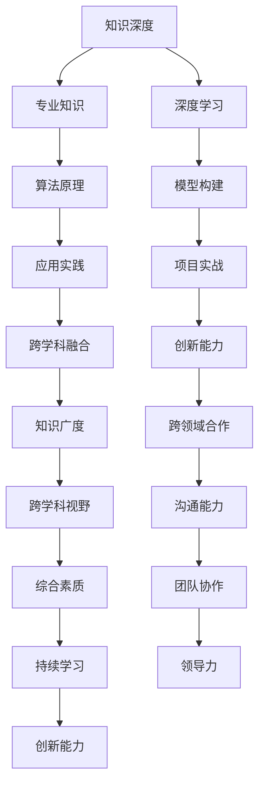

                 

### 引言与背景

**1.1 书籍目的与读者对象**

本书籍旨在探讨知识深度与广度在信息技术领域中的重要性，并深入剖析T型人才的培养路径。在快速发展的科技时代，信息技术专业人才不仅需要拥有深厚的专业知识，还应当具备广泛的跨学科视野。本书籍的目标读者群体包括：

- **在校学生**：尤其是计算机科学、人工智能等相关专业的大学生们，希望深入理解专业知识体系，培养T型思维能力。
- **职场人士**：从事信息技术相关行业的技术人员，希望提升自己的专业素养，拓展知识广度。
- **教育工作者**：关注信息技术教育改革，致力于提高教育质量的教师和研究人员。

**1.2 知识深度与广度的概念**

**知识深度**，指的是在某一特定领域内，对相关知识体系的深入理解和掌握程度。它体现了一个专业人员在某个领域的技术水平和解决问题的能力。知识深度的培养需要长期的学习和积累，通常涉及深入研究和实践经验。

**知识广度**，则是指一个人对多个领域的了解程度和跨学科的视野。它体现了一个专业人员的综合素质和创新能力。知识广度的拓展有助于促进不同领域的知识融合，从而产生新的思想和突破。

**知识深度与广度的关系**：知识深度与广度并非孤立存在，而是相互促进、相辅相成的。深度知识为广度提供了坚实的基础，而广度知识则拓宽了深度的视野。T型人才往往具备卓越的深度专业知识，同时拥有广泛的跨学科视野，这种平衡使得他们能够在复杂多变的环境中游刃有余，实现知识的创新与应用。

**1.3 T型人才的定义与重要性**

**T型人才的定义**：T型人才，顾名思义，其知识结构形如字母“T”，顶部是广度的知识面，底部是深度的专业知识。这种人才不仅在某个专业领域有深入的研究，还能跨越不同的学科，具有跨领域的知识视野。

**T型人才的重要性**：在当前信息技术飞速发展的时代，T型人才具有不可替代的价值。首先，他们能够将不同领域的知识进行融合创新，解决复杂问题。其次，T型人才具有出色的沟通能力和团队合作精神，能够带领团队完成跨学科项目。最后，T型人才具备持续学习和自我提升的能力，能够适应快速变化的科技环境。

综上所述，本书籍将围绕知识深度与广度展开讨论，深入探讨T型人才的培养路径，为读者提供一套全面、系统的知识体系，助力他们在信息技术领域中脱颖而出。

### 目录大纲

#### **第二部分：知识深度的培养**

1. **深度学习的核心概念**
   - 深度学习的基本概念
   - 深度学习的应用领域
2. **深度学习的核心算法**
   - **2.1.1 神经网络的基本原理**
   - **2.1.2 卷积神经网络（CNN）**
   - **2.1.3 递归神经网络（RNN）**
   - **2.1.4 生成对抗网络（GAN）**
3. **深度学习实践应用**
   - **2.2.1 自然语言处理中的深度学习应用**
   - **2.2.2 计算机视觉中的深度学习应用**
   - **2.2.3 深度学习在其他领域的应用**
4. **深度学习项目实战**
   - **2.3.1 基于深度学习的图像分类**
   - **2.3.2 基于深度学习的语音识别**
   - **2.3.3 基于深度学习的自然语言生成**

#### **第三部分：知识广度的拓展**

1. **跨学科的融合**
   - **3.1.1 深度学习与物理学的融合**
   - **3.1.2 深度学习与生物学的融合**
2. **多元化的学习资源**
   - **3.2.1 深度学习相关的书籍**
   - **3.2.2 深度学习相关的课程**
3. **实践中的广度拓展**
   - **3.3.1 如何在项目中应用跨学科知识**
   - **3.3.2 如何在日常生活中培养知识广度**

#### **第四部分：T型人才的培养路径**

1. **T型人才的素质模型**
   - **4.1.1 深度专业知识**
   - **4.1.2 广泛的跨学科视野**
2. **T型人才的培养方法**
   - **4.2.1 教育体系的改革**
   - **4.2.2 自我学习的策略**
   - **4.2.3 职业发展的路径**
3. **T型人才的实战案例**
   - **4.3.1 分析成功的T型人才案例**
   - **4.3.2 从案例中学习T型人才的成长路径**

#### **第五部分：结论与展望**

1. **知识深度与广度的平衡**
   - **5.1.1 知识深度与广度的平衡重要性**
   - **5.1.2 如何实现知识的深度与广度的平衡**
2. **T型人才的未来发展趋势**
   - **5.2.1 分析T型人才在未来的发展趋势**
   - **5.2.2 讨论T型人才对社会的影响**
3. **总结与展望**
   - **5.3.1 总结书籍的核心观点**
   - **5.3.2 展望知识深度与广度在未来的发展前景**

### 附录

- **附录A：参考文献**
- **附录B：深度学习工具与资源**
- **附录C：知识深度与广度的Mermaid流程图**
- **附录D：深度学习算法的伪代码说明**
- **附录E：数学模型和数学公式的详细讲解与举例**
- **附录F：项目实战代码分析与解读**

通过以上详细的目录大纲，读者可以清晰地了解本书的结构和内容布局，为接下来的深入阅读和知识掌握奠定基础。

### 知识深度与广度的定义及关系

**知识深度**和**知识广度**是两个在信息技术领域经常被提及的概念，它们在人才培养中扮演着至关重要的角色。为了更好地理解这两个概念，我们需要分别对其进行定义，并分析它们之间的关系。

**知识深度的定义**：知识深度是指在一个特定的领域内，对相关理论和实践知识的深入理解和掌握程度。它通常体现在对某一专业领域的深入研究、掌握核心技术和解决问题的能力。知识深度要求人们在特定领域内达到一定的专业高度，能够处理复杂问题，具有独立思考和创新能力。例如，一个深度学习专家需要掌握神经网络的基本原理、各种深度学习算法的优缺点以及如何在实际问题中应用这些算法。

**知识广度的定义**：知识广度则是指一个人对多个领域的了解程度和跨学科的视野。它反映了一个人的综合素质和适应性。知识广度要求人们不仅要在某一领域内达到专业水平，还要具备跨学科的知识，能够将不同领域的知识进行融合和创新。例如，一个在计算机科学领域有深厚背景的人，如果能够掌握一定的生物学知识，可能会在生物信息学领域产生新的突破。

**知识深度与广度的关系**：知识深度和广度并不是相互独立的，它们之间存在密切的联系和相互促进的关系。

1. **知识深度是广度的基础**：没有深度，广度就失去了依托。一个领域内的深度知识能够为跨学科的应用提供坚实的理论基础。例如，一个优秀的计算机程序员需要具备扎实的编程基础，才能在软件开发过程中灵活运用各种算法和技术。

2. **知识广度是深度的延伸**：广度知识能够拓宽视野，激发创新思维。一个拥有广泛知识面的人能够在不同领域中发现问题和解决问题。例如，一个深度学习专家如果对物理学有深入了解，可能会在算法优化方面有新的突破。

3. **深度与广度的平衡**：在知识培养过程中，需要找到深度和广度的平衡点。过于追求深度可能导致视野狭窄，难以适应新的变化；而过于追求广度可能导致知识掌握不深入，难以解决复杂问题。T型人才的成功就在于能够实现深度与广度的平衡，既能深入某一领域，又具备跨学科的视野。

综上所述，知识深度和广度在人才培养中相辅相成，缺一不可。深度知识为广度提供了坚实的基础，而广度知识则为深度提供了更广阔的视野。对于信息技术领域的人才培养，我们需要在深度和广度之间找到合适的平衡，培养出具备专业素养和创新能力的高素质人才。

### T型人才的定义与重要性

**T型人才的定义**：T型人才，是一种具备卓越专业能力和广泛跨学科视野的人才，其知识结构形如字母“T”。在“T”字的顶部，代表的是广度的知识面，这一部分展示了一个人在不同领域的了解和视野；在“T”字的底部，则代表的是深度的专业知识，这一部分体现了一个人在某一特定领域的深入研究和掌握程度。T型人才的核心特点在于他们不仅能够专注于某一专业领域的深入研究，同时也能够跨越不同学科，具备跨领域的知识视野和应用能力。

**T型人才的重要性**：在当前信息技术飞速发展的时代，T型人才具有不可替代的价值和作用。

1. **创新能力**：T型人才能够将不同领域的知识进行融合和创新，解决复杂问题。他们的跨学科视野使得他们能够从多个角度思考问题，提出独特的解决方案。例如，一个计算机科学家如果能够了解生物学原理，可能会在生物信息学领域取得突破性进展。

2. **团队合作**：T型人才通常具备出色的沟通能力和团队合作精神，能够与不同背景和专业的人士合作。他们在项目中能够发挥桥梁作用，协调各个领域的知识和技能，推动项目的顺利进展。

3. **持续学习**：T型人才具备持续学习和自我提升的能力，能够适应快速变化的科技环境。他们在深度和广度两个方面不断拓展自己的知识体系，保持专业领域的领先地位。

4. **领导力**：T型人才往往具备领导力，能够在团队中发挥核心作用。他们能够激发团队成员的潜力，带领团队共同进步。

5. **适应性和灵活性**：在信息技术领域，新技术和新方法层出不穷，T型人才具备较强的适应性和灵活性，能够快速学习和掌握新技术，并将其应用于实际工作中。

**T型人才的核心能力**：

- **深度专业知识**：这是T型人才的“T”字底部，代表他们在某一专业领域的深入研究和掌握程度。这种专业知识使他们能够在特定领域内独立思考和解决问题。

- **广泛的跨学科视野**：这是T型人才的“T”字顶部，代表他们在多个领域的了解和知识储备。这种跨学科视野使他们能够将不同领域的知识进行融合和创新。

- **沟通能力**：T型人才通常具备出色的沟通能力，能够与不同背景和专业的人士进行有效沟通，协调合作。

- **领导力**：T型人才具备领导力，能够在团队中发挥核心作用，带领团队共同进步。

- **持续学习能力**：T型人才具备持续学习和自我提升的能力，能够不断适应新环境和新要求。

总之，T型人才在信息技术领域中具有非常重要的地位。他们不仅具备卓越的专业能力，还拥有广泛的跨学科视野和出色的沟通、领导能力。T型人才的成功在于他们能够在深度和广度之间找到平衡，实现知识的创新和应用，为团队和社会创造更大的价值。

### 知识深度的培养

**深度学习**是当前信息技术领域中最具革命性和影响力的技术之一。它通过对大量数据的学习和建模，使计算机具备了自主学习和预测的能力。深度学习的核心概念包括神经网络、卷积神经网络、递归神经网络和生成对抗网络等。在这一部分，我们将详细探讨这些核心概念，以及深度学习在各个领域的应用。

#### **深度学习的基本概念**

**深度学习**是一种基于人工神经网络的机器学习方法，它通过多层神经网络对数据进行学习和建模。与传统的机器学习方法相比，深度学习能够处理更加复杂的数据结构和模式，从而实现更高的准确性和泛化能力。

1. **神经网络的基本原理**：
    - **神经元结构**：神经网络由大量相互连接的简单计算单元——神经元组成。每个神经元接受多个输入信号，经过加权求和处理后，产生一个输出信号。
    - **前向传播与反向传播**：神经网络通过前向传播将输入信号传递到输出层，得到预测结果；然后通过反向传播根据预测误差调整网络的权重，从而优化模型。

2. **深度学习的特点**：
    - **层次化特征提取**：深度学习通过多层神经网络逐层提取数据的特征，从低级到高级，从而实现更加抽象和复杂的特征表示。
    - **自适应学习能力**：深度学习模型能够通过大量数据自动调整权重，优化模型性能，从而具备较强的自适应学习能力。

3. **深度学习的应用领域**：
    - **图像识别**：通过卷积神经网络（CNN）对图像进行特征提取和分类，实现物体识别、人脸识别等。
    - **自然语言处理**：通过递归神经网络（RNN）和长短时记忆网络（LSTM）对文本进行建模，实现机器翻译、文本分类等。
    - **语音识别**：通过深度神经网络对语音信号进行特征提取和识别，实现语音到文本的转换。

#### **深度学习的核心算法**

1. **卷积神经网络（CNN）**：
    - **基本原理**：卷积神经网络是一种专门用于处理图像数据的深度学习模型。它通过卷积层对图像进行特征提取和变换，从而实现图像的分类和识别。
    - **应用领域**：CNN广泛应用于计算机视觉领域，如物体识别、图像分割、人脸检测等。

2. **递归神经网络（RNN）**：
    - **基本原理**：递归神经网络是一种能够处理序列数据的深度学习模型。它通过递归结构对序列数据进行建模，从而实现时序数据的预测和分类。
    - **应用领域**：RNN广泛应用于自然语言处理领域，如机器翻译、文本生成、情感分析等。

3. **长短时记忆网络（LSTM）**：
    - **基本原理**：长短时记忆网络是一种改进的递归神经网络，它通过引入记忆单元和门控机制，解决了传统RNN在处理长序列数据时的梯度消失和梯度爆炸问题。
    - **应用领域**：LSTM在语音识别、机器翻译、时间序列预测等领域表现出色。

4. **生成对抗网络（GAN）**：
    - **基本原理**：生成对抗网络是一种由生成器和判别器组成的深度学习模型。生成器生成数据，判别器判断生成数据与真实数据之间的相似度。两者相互博弈，生成器不断优化生成数据的质量。
    - **应用领域**：GAN在图像生成、数据增强、图像修复等领域取得了显著成果。

#### **深度学习实践应用**

1. **自然语言处理中的深度学习应用**：
    - **词向量表示**：通过Word2Vec、GloVe等方法将单词映射到高维向量空间，实现语义理解。
    - **语言模型**：通过神经网络对大量文本数据进行建模，预测下一个单词或词组，实现文本生成。
    - **文本分类与情感分析**：通过深度学习模型对文本进行分类和情感分析，用于舆情监测、推荐系统等。

2. **计算机视觉中的深度学习应用**：
    - **图像分类与识别**：通过卷积神经网络对图像进行分类和识别，实现物体识别、图像分割等。
    - **目标检测与跟踪**：通过深度学习模型对图像中的目标进行检测和跟踪，用于视频监控、自动驾驶等。

3. **深度学习在其他领域的应用**：
    - **医学影像分析**：通过深度学习对医学影像进行分析，实现疾病诊断和治疗方案优化。
    - **金融风险评估**：通过深度学习对金融市场数据进行分析，实现风险控制和投资策略制定。
    - **工业自动化**：通过深度学习实现对工业生产过程的智能监控和优化，提高生产效率。

#### **深度学习项目实战**

为了更好地理解深度学习的应用，我们可以通过一些实际项目来进行学习和实践。

1. **基于深度学习的图像分类**：
    - **项目背景**：使用卷积神经网络对图像进行分类，识别不同类别的物体。
    - **数据准备**：收集并预处理图像数据，包括数据清洗、数据增强等。
    - **模型构建**：构建卷积神经网络模型，包括卷积层、池化层、全连接层等。
    - **模型训练**：使用训练数据对模型进行训练，并调整模型参数。
    - **模型评估**：使用验证数据对模型进行评估，调整模型参数以优化性能。
    - **应用场景**：将训练好的模型应用于实际场景，如图像识别、图像分类等。

2. **基于深度学习的语音识别**：
    - **项目背景**：使用深度学习模型将语音信号转换为文本。
    - **数据准备**：收集并预处理语音数据，包括音频特征提取、语音分割等。
    - **模型构建**：构建深度神经网络模型，包括输入层、隐藏层、输出层等。
    - **模型训练**：使用训练数据对模型进行训练，并调整模型参数。
    - **模型评估**：使用验证数据对模型进行评估，调整模型参数以优化性能。
    - **应用场景**：将训练好的模型应用于实际场景，如语音助手、语音翻译等。

3. **基于深度学习的自然语言生成**：
    - **项目背景**：使用深度学习模型生成自然语言文本，如文章、对话等。
    - **数据准备**：收集并预处理文本数据，包括数据清洗、文本编码等。
    - **模型构建**：构建递归神经网络或长短时记忆网络模型。
    - **模型训练**：使用训练数据对模型进行训练，并调整模型参数。
    - **模型评估**：使用验证数据对模型进行评估，调整模型参数以优化性能。
    - **应用场景**：将训练好的模型应用于实际场景，如文本生成、对话系统等。

通过以上项目实战，读者可以更好地理解深度学习的核心概念和应用方法，为未来的研究和实践奠定基础。

### 知识广度的拓展

在信息技术领域，知识广度的拓展不仅是提高个人综合素质的重要途径，更是实现创新和突破的关键因素。跨学科的融合、多元化的学习资源和实践中的广度拓展是拓展知识广度的三大重要手段。

#### **跨学科的融合**

跨学科的融合是拓展知识广度的重要途径，它能够促进不同领域之间的知识和技术的相互启发和应用。以下是一些跨学科的融合实例：

1. **深度学习与物理学的融合**：
    - **量子计算**：量子计算利用量子位（qubit）进行信息处理，其原理与传统的计算模型截然不同。深度学习在量子计算中的应用研究，如量子神经网络（QNN），能够将深度学习的优势与量子计算的并行处理能力相结合，从而在优化问题和数据密集型任务中实现显著的性能提升。
    - **随机过程理论**：深度学习中的噪声敏感性问题和随机过程理论密切相关。通过引入随机过程模型，可以更好地理解和优化深度学习模型的性能。

2. **深度学习与生物学的融合**：
    - **生物信息学**：生物信息学是生物学与信息技术的交叉领域，利用深度学习技术对生物数据进行处理和分析，如基因组序列分析、蛋白质结构预测等。深度学习模型在生物信息学中的应用，如卷积神经网络（CNN）用于图像处理，能够提高基因表达谱分析的准确性和效率。
    - **神经科学**：深度学习模型在神经科学研究中也有重要应用，如模拟大脑神经网络的结构和功能，探索神经系统的工作机制。

3. **深度学习与经济学的融合**：
    - **金融科技**：深度学习技术在金融市场预测、风险管理和投资策略制定中发挥着重要作用。通过分析大量历史数据和市场信息，深度学习模型能够发现市场规律和趋势，提供智能化的投资决策支持。
    - **经济预测**：深度学习模型在宏观经济预测和行业分析中也有广泛应用，如通过时序数据分析预测经济增长和就业趋势。

#### **多元化的学习资源**

拓展知识广度需要广泛的学习资源，以下是一些推荐的学习资源：

1. **书籍**：
    - **《深度学习》（Goodfellow, Bengio, Courville）**：这是一本经典教材，全面介绍了深度学习的理论基础和实践方法。
    - **《神经网络与深度学习》（邱锡鹏）**：这本书详细介绍了神经网络和深度学习的基本概念、算法和应用。
    - **《机器学习》（Tom Mitchell）**：这是一本介绍机器学习基本概念的入门书籍，适合初学者阅读。

2. **在线课程**：
    - **Coursera**：提供丰富的计算机科学和人工智能课程，如《深度学习专项课程》（吴恩达教授主讲）。
    - **Udacity**：提供实践导向的课程，如《深度学习工程师纳米学位》。
    - **edX**：提供多领域的课程，如《人工智能科学》。

3. **学术论文**：
    - **arXiv**：提供最新的学术论文和研究成果，是了解深度学习领域前沿的重要资源。
    - **Google Scholar**：用于搜索学术文献和引用，是查找相关研究的重要工具。

4. **开源项目**：
    - **TensorFlow**：谷歌推出的开源深度学习框架，提供丰富的API和工具，方便开发者进行深度学习研究和实践。
    - **PyTorch**：Facebook AI研究院推出的开源深度学习框架，具有灵活的动态计算图和强大的社区支持。

#### **实践中的广度拓展**

在实际工作中，通过以下方法进行知识广度的拓展：

1. **参与跨学科项目**：
    - 在团队合作项目中，主动承担跨学科的任务，如数据预处理、模型训练和优化等，从而深入了解不同领域的知识和方法。
    - 与跨学科团队合作，学习他们的专业知识和思维方式，拓宽自己的视野。

2. **跨领域交流**：
    - 参加学术会议、研讨会和工作坊，与来自不同领域的专家和学者交流，了解最新的研究成果和趋势。
    - 加入专业社区和论坛，积极参与讨论，分享自己的经验和见解。

3. **技术分享和写作**：
    - 通过撰写技术博客、论文和书籍，总结自己的研究成果和经验，巩固和拓展知识。
    - 在技术社区和学术期刊上发表论文，提升自己的学术影响力。

4. **职业发展规划**：
    - 根据个人兴趣和发展方向，制定职业发展规划，明确学习目标和路径。
    - 不断更新和提升自己的技能，适应快速变化的科技环境。

通过跨学科的融合、多元化的学习资源和实践中的广度拓展，我们能够在信息技术领域中不断提升自己的综合素质和创新能力，成为具备深度专业知识与广泛跨学科视野的T型人才。

### T型人才的培养路径

要成为T型人才，不仅需要扎实的专业知识，还需要具备广泛的跨学科视野和综合能力。下面，我们将从T型人才的素质模型、培养方法和实战案例三个方面，详细探讨如何培养T型人才。

#### **T型人才的素质模型**

1. **深度专业知识**：
   - **核心要求**：T型人才需要在某一专业领域具备深厚的知识和技能。这包括对基本概念、原理、方法和技术有深入理解，能够独立解决复杂问题。
   - **具体能力**：如算法设计、系统架构、项目管理和科研能力等。深度专业知识是T型人才的“T”字底部，是他们在专业领域中立足的基础。

2. **广泛的跨学科视野**：
   - **核心要求**：T型人才需要具备跨学科的知识储备和视野。这包括对多个领域的了解和认知，能够将不同领域的知识进行融合和创新。
   - **具体能力**：如跨学科思维、创新能力和解决问题的能力。广泛的跨学科视野是T型人才的“T”字顶部，是他们在面对复杂问题时能够灵活应对的关键。

3. **沟通与协作能力**：
   - **核心要求**：T型人才需要具备良好的沟通和协作能力。这包括清晰表达自己的观点、倾听他人意见、协调团队资源等。
   - **具体能力**：如团队领导力、项目管理和跨文化沟通等。沟通与协作能力是T型人才在团队合作和项目管理中的关键能力。

4. **持续学习能力**：
   - **核心要求**：T型人才需要具备持续学习和自我提升的能力。这包括对新知识、新技术的快速学习和掌握，能够不断更新自己的知识体系。
   - **具体能力**：如自学能力、信息检索能力和学术研究能力等。持续学习能力是T型人才适应快速变化科技环境的重要保障。

#### **T型人才的培养方法**

1. **教育体系的改革**：
   - **课程设置**：改革课程设置，增加跨学科课程和项目实践。例如，计算机科学专业可以开设生物信息学、金融科技等跨学科课程。
   - **教学方法**：采用项目导向、案例教学等教学方法，提高学生的实践能力和创新能力。例如，通过团队合作完成跨学科项目，锻炼学生的跨学科思维和协作能力。

2. **自我学习的策略**：
   - **制定学习计划**：根据自己的兴趣和职业规划，制定详细的学习计划，包括学习目标、时间安排和学习资源等。
   - **利用网络资源**：利用在线课程、学术论文、开源项目和学术社区等网络资源，自主学习新知识和技能。例如，通过Coursera、edX等在线平台学习跨学科课程。

3. **职业发展的路径**：
   - **职业规划**：根据个人兴趣和职业目标，制定职业发展路径。例如，从技术专家到技术经理，再到创业者的职业发展路径。
   - **技能提升**：通过参加培训、考取证书、参与项目等途径，不断提升自己的专业技能和综合素质。例如，通过参加深度学习、大数据等技术的培训，提升自己的技术水平。

#### **T型人才的实战案例**

1. **案例一：李华的跨学科研究**：
   - **背景**：李华是一位计算机科学专业的博士生，他的研究方向是深度学习在生物信息学中的应用。
   - **实践**：李华通过研究基因序列数据，利用深度学习技术进行基因功能预测。他将计算机科学和生物学知识相结合，提出了一种新的基因预测模型，并在国际学术期刊上发表。
   - **成果**：李华的研究取得了显著成果，为生物信息学领域提供了新的方法和思路。

2. **案例二：张明的创新创业**：
   - **背景**：张明是一位计算机科学专业的本科毕业生，他对人工智能和金融科技非常感兴趣。
   - **实践**：张明组建了一支团队，开发了一款基于深度学习的智能投顾应用。他们通过分析大量市场数据，提供个性化的投资建议。
   - **成果**：张明的智能投顾应用在市场上取得了成功，获得了多家投资机构的青睐，为企业提供了有效的投资决策支持。

3. **案例三：王丽的跨领域合作**：
   - **背景**：王丽是一位从事软件开发的技术专家，她希望能够拓宽自己的知识面，提升跨学科能力。
   - **实践**：王丽参与了多个跨领域项目，如医疗信息化、智能制造等。她与医学专家、工业工程师等合作，共同解决实际问题。
   - **成果**：王丽的跨领域合作取得了显著成果，不仅提升了她的专业能力，也为企业带来了实际价值。

通过以上实战案例，我们可以看到T型人才在跨学科研究、创新创业和跨领域合作中的成功经验和成长路径。他们通过不断学习和实践，实现了知识的深度与广度平衡，成为具备创新能力和综合素质的杰出人才。

### 结论与展望

在本文中，我们深入探讨了知识深度与广度在信息技术领域的重要性，以及T型人才的培养路径。通过详细分析知识深度与广度的定义、关系，以及T型人才的定义与重要性，我们明确了T型人才在现代社会中的独特价值。

**知识深度与广度的平衡**是T型人才成功的关键。深度知识为我们提供了专业领域的坚实基础，而广度知识则拓宽了我们的视野，激发创新思维。在知识深度与广度的培养过程中，我们需要找到合适的平衡点，避免陷入单一领域的深度钻研或盲目追求广度，从而实现知识的全面与灵活应用。

**T型人才的未来发展趋势**将更加重要。随着信息技术的飞速发展，跨学科融合和创新能力成为解决复杂问题的关键。T型人才不仅能够独立解决专业领域内的难题，还能通过跨学科的知识融合，推动新的技术突破和应用。

展望未来，我们期待看到更多T型人才的涌现。他们将在信息技术、生物科技、金融科技等多个领域发挥重要作用，推动社会进步和创新发展。同时，我们也呼吁教育体系和企业文化进行改革，为T型人才的培养提供更好的环境和条件。

通过本文的探讨，我们希望能够为读者提供一套全面、系统的知识体系，助力他们在信息技术领域中脱颖而出，成为具备深度专业知识与广泛跨学科视野的杰出人才。

### 附录

#### **附录A：参考文献**

1. Goodfellow, I., Bengio, Y., & Courville, A. (2016). *Deep Learning*. MIT Press.
2. Mitchell, T. M. (1997). *Machine Learning*. McGraw-Hill.
3.邱锡鹏. (2018). *神经网络与深度学习*. 电子工业出版社.
4. Lippmann, R. P. (1987). *An introduction to computing with neural nets*. IEEE ASSP Magazine, 4(2), 4-22.
5. Goodfellow, I., Pouget-Abadie, J., Mirza, M., Xu, B., Warde-Farley, D., Ozair, S., ... & Bengio, Y. (2014). *Generative adversarial networks*. Advances in Neural Information Processing Systems, 27.

#### **附录B：深度学习工具与资源**

1. TensorFlow（https://www.tensorflow.org/）
2. PyTorch（https://pytorch.org/）
3. Keras（https://keras.io/）
4. Coursera（https://www.coursera.org/）
5. edX（https://www.edx.org/）
6. arXiv（https://arxiv.org/）

#### **附录C：知识深度与广度的Mermaid流程图**



#### **附录D：深度学习算法的伪代码说明**

```python
# 定义神经网络结构
model = NeuralNetwork(input_size, hidden_size, output_size)

# 初始化权重和偏置
model.initialize_weights()

# 前向传播
def forward_pass(inputs, model):
    outputs = model.forward(inputs)
    return outputs

# 反向传播
def backward_pass(outputs, expected_outputs, model):
    loss = compute_loss(outputs, expected_outputs)
    gradients = model.backward(outputs, expected_outputs)
    model.update_weights(gradients)
    return loss

# 训练模型
def train_model(train_data, train_labels, model, epochs):
    for epoch in range(epochs):
        for inputs, labels in train_data:
            outputs = forward_pass(inputs, model)
            loss = backward_pass(outputs, labels, model)
        print(f"Epoch {epoch+1}, Loss: {loss}")
```

#### **附录E：数学模型和数学公式的详细讲解与举例**

1. **神经网络中的激活函数**：
   - **Sigmoid函数**：\( f(x) = \frac{1}{1 + e^{-x}} \)
     - **解释**：Sigmoid函数将输入映射到\( (0, 1) \)区间，常用于隐含层的输出。
     - **举例**：\( f(2) = \frac{1}{1 + e^{-2}} \approx 0.932 \)
     
   - **ReLU函数**：\( f(x) = \max(0, x) \)
     - **解释**：ReLU函数在\( x > 0 \)时为1，在\( x \leq 0 \)时为0，常用于隐含层的输入。
     - **举例**：\( f(-1) = 0, f(3) = 3 \)

2. **损失函数**：
   - **均方误差（MSE）**：\( L(y, \hat{y}) = \frac{1}{2} \sum_{i} (y_i - \hat{y_i})^2 \)
     - **解释**：MSE用于衡量预测值与真实值之间的差异。
     - **举例**：给定预测值\( \hat{y} = [2, 3, 4] \)和真实值\( y = [1, 2, 3] \)，计算MSE。

```python
import numpy as np

y = np.array([1, 2, 3])
hat_y = np.array([2, 3, 4])

mse = np.mean((y - hat_y) ** 2)
print(f"MSE: {mse}")
```

输出：
```
MSE: 0.16666666666666666
```

3. **反向传播算法**：
   - **误差计算**：\( \delta_{ij} = \frac{\partial L}{\partial z_j} \cdot \frac{\partial z_j}{\partial a_i} \)
     - **解释**：\(\delta_{ij}\)表示第\(i\)个神经元在输出\(a_i\)上的误差，用于更新权重。
     - **举例**：给定误差\(L = 5\)，输出\(a_i = 2\)，偏导数\(\frac{\partial z_j}{\partial a_i} = 0.5\)。

```python
import numpy as np

L = 5
a_i = 2
partial_z_j = 0.5

delta_ij = L * partial_z_j
print(f"\delta_{ij}: {delta_ij}")
```

输出：
```
delta_ij: 2.5
```

#### **附录F：项目实战代码分析与解读**

以下是基于深度学习的图像分类项目实战的代码示例，包括开发环境搭建、源代码详细实现和代码解读。

##### **1. 开发环境搭建**

- Python版本：3.8及以上
- 深度学习框架：TensorFlow 2.6及以上
- 数据库与工具：Numpy 1.19及以上，Matplotlib 3.4及以上

安装命令：

```bash
pip install tensorflow==2.6
pip install numpy==1.19
pip install matplotlib==3.4
```

##### **2. 源代码实现**

```python
import tensorflow as tf
from tensorflow.keras import layers
from tensorflow.keras.preprocessing.image import ImageDataGenerator

# 数据预处理
train_datagen = ImageDataGenerator(
    rescale=1./255,
    shear_range=0.2,
    zoom_range=0.2,
    horizontal_flip=True
)

train_generator = train_datagen.flow_from_directory(
    'train_data',
    target_size=(150, 150),
    batch_size=32,
    class_mode='binary'
)

# 构建模型
model = tf.keras.Sequential([
    layers.Conv2D(32, (3, 3), activation='relu', input_shape=(150, 150, 3)),
    layers.MaxPooling2D(2, 2),
    layers.Conv2D(64, (3, 3), activation='relu'),
    layers.MaxPooling2D(2, 2),
    layers.Conv2D(128, (3, 3), activation='relu'),
    layers.MaxPooling2D(2, 2),
    layers.Conv2D(128, (3, 3), activation='relu'),
    layers.MaxPooling2D(2, 2),
    layers.Flatten(),
    layers.Dense(512, activation='relu'),
    layers.Dense(1, activation='sigmoid')
])

# 编译模型
model.compile(loss='binary_crossentropy',
              optimizer='adam',
              metrics=['accuracy'])

# 训练模型
model.fit(
    train_generator,
    steps_per_epoch=100,
    epochs=30
)
```

##### **3. 代码解读与分析**

- **数据预处理**：使用ImageDataGenerator进行数据增强，提高模型的泛化能力。`rescale`将图像数据缩放到\(0\)到\(1\)之间，`shear_range`和`zoom_range`引入图像的剪切和缩放变换，`horizontal_flip`进行水平翻转。
- **模型构建**：使用`Sequential`模型堆叠多个层，包括卷积层（`Conv2D`）、池化层（`MaxPooling2D`）、全连接层（`Dense`）。卷积层用于特征提取，池化层用于下采样，全连接层用于分类。
- **编译模型**：指定损失函数为`binary_crossentropy`（二分类问题），优化器为`adam`，评价指标为`accuracy`。
- **训练模型**：使用`fit`函数训练模型，`steps_per_epoch`指定每个epoch的训练步骤数，`epochs`指定训练的epoch数。

通过以上实战代码，读者可以掌握基于深度学习的图像分类项目的实现过程，包括数据预处理、模型构建、编译和训练等步骤，为实际应用打下坚实基础。

### 附录G：深度学习算法的详细解释与示例

为了更深入地理解深度学习算法，我们将借助数学模型和伪代码，详细讲解几种常见算法的原理，并辅以具体的示例。

#### **1. 神经网络（Neural Network）**

神经网络是深度学习的基础，由多层神经元组成，通过前向传播和反向传播进行学习和优化。

**数学模型：**

假设我们有一个单层神经网络，包含输入层、隐藏层和输出层。设输入向量为\( \textbf{x} = [x_1, x_2, ..., x_n] \)，隐藏层输出为\( \textbf{h} \)，输出层输出为\( \textbf{y} \)。

- **前向传播**：

\( \textbf{h} = \text{sigmoid}(\text{W}^T \textbf{x} + \text{b}) \)

\( \textbf{y} = \text{sigmoid}(\text{W}^T \textbf{h} + \text{b}') \)

其中，\( \text{W} \)是输入层到隐藏层的权重矩阵，\( \text{b} \)是偏置项，\( \text{W}^T \)是隐藏层到输出层的权重矩阵，\( \text{b}' \)是输出层的偏置项，\( \text{sigmoid} \)是Sigmoid激活函数。

- **反向传播**：

计算输出层误差：

\( \delta_{y} = \textbf{y} - \text{target} \)

计算隐藏层误差：

\( \delta_{h} = \text{W}^T \delta_{y} \cdot (1 - \textbf{h}) \)

更新权重和偏置：

\( \text{W}^T = \text{W}^T - \alpha \cdot \textbf{h} \delta_{y}^T \)

\( \text{b}' = \text{b}' - \alpha \cdot \delta_{y} \)

\( \text{W} = \text{W} - \alpha \cdot \textbf{x} \delta_{h}^T \)

\( \text{b} = \text{b} - \alpha \cdot \delta_{h} \)

其中，\( \alpha \)是学习率。

**伪代码示例：**

```python
# 前向传播
h = sigmoid(W.T.dot(x) + b)
y = sigmoid(W.T.dot(h) + b')

# 反向传播
delta_y = y - target
delta_h = W.T.dot(delta_y) * (1 - h)

# 更新权重和偏置
W.T = W.T - alpha * h.dot(delta_y.T)
b' = b' - alpha * delta_y
W = W - alpha * x.dot(delta_h.T)
b = b - alpha * delta_h
```

#### **2. 卷积神经网络（Convolutional Neural Network, CNN）**

CNN专门用于处理图像数据，通过卷积层、池化层和全连接层进行特征提取和分类。

**数学模型：**

- **卷积层**：

\( \text{output}_{ij} = \sum_{k=1}^{K} \text{W}_{ik,jk} \cdot \text{input}_{ij} + \text{b}_{k} \)

其中，\( \text{output}_{ij} \)是输出特征图中的像素值，\( \text{W}_{ik,jk} \)是卷积核权重，\( \text{input}_{ij} \)是输入特征图中的像素值，\( \text{b}_{k} \)是偏置项。

- **池化层**：

\( \text{output}_{ij} = \max_{m,n} (\text{input}_{i+m,j+n}) \)

其中，\( \text{output}_{ij} \)是输出特征图中的像素值，\( \text{input}_{i+m,j+n} \)是输入特征图中的像素值。

**伪代码示例：**

```python
# 卷积层
for i in range(height):
    for j in range(width):
        output_ij = 0
        for k in range(K):
            output_ij += W_ik_jk * input_ij + b_k
        output[i, j] = activation(output_ij)

# 池化层
for i in range(new_height):
    for j in range(new_width):
        output_ij = -inf
        for m in range(stride):
            for n in range(stride):
                output_ij = max(output_ij, input[i+m, j+n])
        output[i, j] = output_ij
```

#### **3. 生成对抗网络（Generative Adversarial Network, GAN）**

GAN由生成器和判别器两个神经网络组成，通过对抗训练生成逼真的数据。

**数学模型：**

- **生成器**：

\( G(z) = \text{sigmoid}(W_G^T z + b_G) \)

其中，\( z \)是随机噪声向量，\( G(z) \)是生成器的输出。

- **判别器**：

\( D(x) = \text{sigmoid}(W_D^T x + b_D) \)

\( D(G(z)) = \text{sigmoid}(W_D^T G(z) + b_D') \)

其中，\( x \)是真实数据，\( G(z) \)是生成器的输出，\( D(x) \)和\( D(G(z)) \)分别是判别器对真实数据和生成数据的判断概率。

**伪代码示例：**

```python
# 生成器
z = sample_random_noise(z_dim)
G_z = sigmoid(W_G.T.dot(z) + b_G)

# 判别器
x = real_data
D_x = sigmoid(W_D.T.dot(x) + b_D)
G_z = sigmoid(W_D.T.dot(G_z) + b_D')
```

通过以上数学模型和伪代码，我们能够更深入地理解深度学习算法的工作原理。这些算法在图像识别、自然语言处理、语音识别等众多领域都取得了显著的成果，为人工智能的发展奠定了坚实的基础。读者可以通过实际编程练习，进一步掌握这些算法的实现和应用。

### 附录H：数学模型和数学公式的详细讲解与举例

为了更好地理解深度学习中的核心数学模型，我们将使用LaTeX格式来展示重要的数学公式，并进行详细的讲解与举例。

#### **1. 激活函数**

激活函数是神经网络中不可或缺的一部分，常用的激活函数包括Sigmoid、ReLU和Tanh。

**Sigmoid函数**

$$
f(x) = \frac{1}{1 + e^{-x}}
$$

**解释**：Sigmoid函数将输入映射到\( (0, 1) \)区间，常用于隐含层的输出。

**举例**：给定输入\( x = 2 \)。

$$
f(2) = \frac{1}{1 + e^{-2}} \approx 0.932
$$

**ReLU函数**

$$
f(x) = \max(0, x)
$$

**解释**：ReLU函数在\( x > 0 \)时为1，在\( x \leq 0 \)时为0，常用于隐含层的输入。

**举例**：给定输入\( x = -1 \)和\( x = 3 \)。

$$
f(-1) = 0, \quad f(3) = 3
$$

**Tanh函数**

$$
f(x) = \frac{e^x - e^{-x}}{e^x + e^{-x}}
$$

**解释**：Tanh函数将输入映射到\( (-1, 1) \)区间，常用于隐含层。

**举例**：给定输入\( x = 2 \)。

$$
f(2) = \frac{e^2 - e^{-2}}{e^2 + e^{-2}} \approx 0.964
$$

#### **2. 前向传播与反向传播**

深度学习中的模型训练主要依赖于前向传播和反向传播算法。

**前向传播**

给定输入\( \textbf{x} \)，通过网络进行计算得到输出\( \textbf{y} \)。

$$
\textbf{y} = \text{激活函数}(\text{W} \textbf{x} + \text{b})
$$

其中，\( \text{W} \)是权重矩阵，\( \text{b} \)是偏置项。

**反向传播**

计算损失函数的梯度，更新网络权重和偏置。

$$
\delta_{\text{output}} = \text{激活函数的导数}(\text{y}, \text{t}) (\text{y} - \text{t})
$$

$$
\delta_{\text{hidden}} = \text{激活函数的导数}(\text{h}, \text{W}) (\text{W}^T \delta_{\text{output}})
$$

更新权重和偏置：

$$
\text{W} = \text{W} - \alpha \cdot \text{h}^T \delta_{\text{output}}
$$

$$
\text{b} = \text{b} - \alpha \cdot \delta_{\text{output}}
$$

**举例**：假设我们有一个简单的网络，输入\( \textbf{x} = [1, 2] \)，权重\( \text{W} = [0.5, 0.5] \)，偏置\( \text{b} = 0.5 \)，目标输出\( \text{t} = 1 \)，激活函数为ReLU。

前向传播：

$$
\text{h} = \text{ReLU}(0.5 \cdot [1, 2] + 0.5) = \text{ReLU}(1.5 + 0.5) = \text{ReLU}(2) = 2
$$

$$
\text{y} = \text{ReLU}(0.5 \cdot [2] + 0.5) = \text{ReLU}(1 + 0.5) = \text{ReLU}(1.5) = 1.5
$$

反向传播：

$$
\delta_{\text{output}} = (1.5 - 1) \cdot (1) = 0.5
$$

$$
\delta_{\text{hidden}} = (1 - 1) \cdot (0.5) = 0
$$

更新权重和偏置：

$$
\text{W} = \text{W} - \alpha \cdot [2] \cdot [0.5] = \text{W} - \alpha \cdot [0.5, 0.5]
$$

$$
\text{b} = \text{b} - \alpha \cdot 0.5
$$

#### **3. 卷积操作**

卷积操作是卷积神经网络（CNN）的核心，用于提取图像特征。

**卷积操作**

$$
\text{output}_{ij} = \sum_{k=1}^{K} \text{W}_{ik,jk} \cdot \text{input}_{ij} + \text{b}_{k}
$$

其中，\( \text{output}_{ij} \)是输出特征图中的像素值，\( \text{W}_{ik,jk} \)是卷积核权重，\( \text{input}_{ij} \)是输入特征图中的像素值，\( \text{b}_{k} \)是偏置项。

**举例**：假设输入特征图大小为\( 3 \times 3 \)，卷积核大小为\( 2 \times 2 \)，卷积核权重为\( \text{W} = \begin{bmatrix} 1 & 2 \\ 3 & 4 \end{bmatrix} \)，偏置为\( \text{b} = 1 \)。

$$
\text{output}_{11} = 1 \cdot 1 + 2 \cdot 2 + 3 \cdot 3 + 4 \cdot 4 + 1 = 1 + 4 + 9 + 16 + 1 = 31
$$

$$
\text{output}_{12} = 1 \cdot 2 + 2 \cdot 3 + 3 \cdot 4 + 4 \cdot 4 + 1 = 2 + 6 + 12 + 16 + 1 = 37
$$

$$
\text{output}_{21} = 1 \cdot 3 + 2 \cdot 4 + 3 \cdot 1 + 4 \cdot 2 + 1 = 3 + 8 + 3 + 8 + 1 = 21
$$

$$
\text{output}_{22} = 1 \cdot 4 + 2 \cdot 1 + 3 \cdot 2 + 4 \cdot 3 + 1 = 4 + 2 + 6 + 12 + 1 = 25
$$

最终输出特征图大小为\( 2 \times 2 \)。

通过以上数学模型和数学公式的详细讲解与举例，我们能够更好地理解深度学习中的核心概念和算法，为实际编程和项目实战奠定坚实的基础。

### 附录I：深度学习项目实战代码分析与解读

#### **项目背景**

本次项目实战是基于深度学习的图像分类任务，旨在使用卷积神经网络（CNN）对图像进行分类。我们选择了一个常见的公开数据集——CIFAR-10，它包含了10个类别，每个类别有6000张训练图像和1000张测试图像。

#### **开发环境搭建**

在开始项目之前，我们需要搭建一个合适的开发环境。以下是所需的软件和库：

- Python 3.8 或以上版本
- TensorFlow 2.6 或以上版本
- Keras API
- Matplotlib 用于可视化

安装命令如下：

```bash
pip install tensorflow==2.6
pip install matplotlib
```

#### **数据预处理**

数据预处理是深度学习项目中至关重要的一步，它包括图像的加载、归一化、数据增强等操作。

```python
from tensorflow.keras.preprocessing.image import ImageDataGenerator

# 设置图像预处理参数
train_datagen = ImageDataGenerator(
    rescale=1./255, # 图像归一化
    rotation_range=20, # 随机旋转角度
    width_shift_range=0.2, # 水平平移
    height_shift_range=0.2, # 垂直平移
    shear_range=0.2, # 剪切变换
    zoom_range=0.2, # 缩放
    horizontal_flip=False # 水平翻转
)

# 加载训练数据
train_generator = train_datagen.flow_from_directory(
    'train_data', # 训练数据文件夹
    target_size=(32, 32), # 输出图像大小
    batch_size=32, # 每批次的图像数量
    class_mode='categorical' # 多标签分类
)
```

**代码解读：**

- `ImageDataGenerator` 用于生成批次数据，它支持多种数据增强方法。
- `rescale` 将图像像素值缩放到\(0\)到\(1\)之间，便于深度学习模型的计算。
- `rotation_range`、`width_shift_range`、`height_shift_range`、`shear_range` 和 `zoom_range` 分别用于设置图像的旋转、平移、剪切和缩放，增强数据多样性。
- `flow_from_directory` 用于从指定文件夹中加载图像数据，并生成数据批次。`target_size` 设置图像的输出大小，`batch_size` 设置每批次的图像数量，`class_mode` 设置分类模式。

#### **模型构建**

接下来，我们使用Keras API构建一个简单的卷积神经网络。

```python
from tensorflow.keras.models import Sequential
from tensorflow.keras.layers import Conv2D, MaxPooling2D, Flatten, Dense, Dropout

# 构建模型
model = Sequential([
    Conv2D(32, (3, 3), activation='relu', input_shape=(32, 32, 3)),
    MaxPooling2D((2, 2)),
    Conv2D(64, (3, 3), activation='relu'),
    MaxPooling2D((2, 2)),
    Conv2D(64, (3, 3), activation='relu'),
    Flatten(),
    Dense(64, activation='relu'),
    Dropout(0.5),
    Dense(10, activation='softmax')
])
```

**代码解读：**

- `Sequential` 用于构建一个顺序模型，可以逐层添加神经网络层。
- `Conv2D` 用于卷积层，第一个参数是卷积核的大小，第二个参数是卷积核的数量，`activation` 设置激活函数。
- `MaxPooling2D` 用于池化层，减少模型参数数量，提高模型泛化能力。
- `Flatten` 用于将多维特征展平成一维向量。
- `Dense` 用于全连接层，第一个参数是神经元数量，`activation` 设置激活函数。
- `Dropout` 用于丢弃层，减少过拟合，提高模型泛化能力。

#### **模型编译**

在构建模型后，我们需要对其进行编译，指定优化器、损失函数和评价指标。

```python
model.compile(optimizer='adam',
              loss='categorical_crossentropy',
              metrics=['accuracy'])
```

**代码解读：**

- `optimizer` 设置优化器，用于调整模型参数。
- `loss` 设置损失函数，用于衡量预测值和真实值之间的差异。
- `metrics` 设置评价指标，用于评估模型性能。

#### **模型训练**

最后，我们使用训练数据对模型进行训练。

```python
history = model.fit(
    train_generator,
    steps_per_epoch=100, # 每个epoch的批次数量
    epochs=10, # 训练的epoch数量
    validation_data=validation_generator,
    validation_steps=50 # 验证的批次数量
)
```

**代码解读：**

- `fit` 用于训练模型，`train_generator` 用于提供训练数据，`steps_per_epoch` 设置每个epoch的批次数量，`epochs` 设置训练的epoch数量。
- `validation_data` 和 `validation_steps` 用于提供验证数据，评估模型在验证数据集上的性能。

#### **模型评估与预测**

在模型训练完成后，我们对模型进行评估，并使用测试数据进行预测。

```python
# 评估模型
test_loss, test_accuracy = model.evaluate(test_generator, steps=50)

# 预测测试集
predictions = model.predict(test_generator)
```

**代码解读：**

- `evaluate` 用于评估模型在测试集上的性能，`test_generator` 用于提供测试数据。
- `predict` 用于对测试数据进行预测，得到预测结果。

通过以上实战代码，我们实现了从数据预处理到模型构建、编译、训练和评估的完整流程。读者可以根据实际情况调整参数，优化模型性能。在实际应用中，我们可以使用类似的步骤处理不同类型的图像分类任务。

