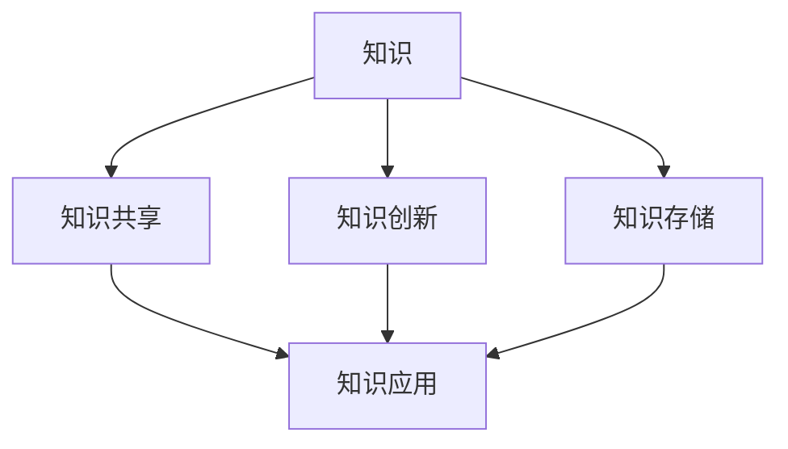

                 

### 《知识管理在企业中的实践》

#### 核心关键词：
- 知识管理
- 企业应用
- 数字化转型
- 创新与共享
- 数据分析与挖掘

#### 摘要：
本文将深入探讨知识管理在企业中的实践与应用。通过分析知识管理的理论基础、基本原理、架构与模型、工具与技术，以及知识管理在企业运营、文化建设、数字化转型等方面的实际应用，我们将揭示知识管理对企业发展的重要作用。文章还将通过案例分析和最佳实践分享，为企业的知识管理提供有价值的参考和指导。

### 目录

#### 第一部分：知识管理的理论基础

#### 第1章：知识管理概述
- 1.1 知识管理的定义与重要性
- 1.2 知识管理的起源与发展
- 1.3 知识管理的关键概念与联系（Mermaid流程图）
- 1.4 企业知识管理的角色和目标

#### 第2章：知识管理的基本原理
- 2.1 知识类型的划分
- 2.2 知识创造与创新
- 2.3 知识共享与传播
- 2.4 知识存储与检索

#### 第3章：知识管理的架构与模型
- 3.1 知识管理的架构设计
- 3.2 常见的知识管理模型（Mermaid流程图）
- 3.3 知识管理系统的设计与实现

#### 第4章：知识管理的工具与技术
- 4.1 知识管理软件概述
- 4.2 知识地图与知识库建设
- 4.3 知识挖掘与数据分析

#### 第二部分：知识管理在企业中的应用

#### 第5章：知识管理在企业运营中的应用
- 5.1 知识管理在人力资源管理中的应用
- 5.2 知识管理在项目管理中的应用
- 5.3 知识管理在客户服务中的应用
- 5.4 知识管理在研发创新中的应用

#### 第6章：知识管理在企业文化建设中的应用
- 6.1 知识管理与企业文化的关系
- 6.2 建立学习型组织
- 6.3 知识管理在员工培训与发展中的应用
- 6.4 知识管理在知识传承与创新中的应用

#### 第7章：知识管理在数字化转型中的应用
- 7.1 知识管理在数字化运营中的作用
- 7.2 数据驱动的知识管理
- 7.3 知识管理在人工智能中的应用
- 7.4 知识管理在区块链中的应用

#### 第8章：知识管理实践案例分析
- 8.1 国内外知识管理实践案例介绍
- 8.2 案例分析：知识管理在某个企业中的应用效果
- 8.3 案例启示与经验总结

#### 第9章：知识管理实施策略与最佳实践
- 9.1 知识管理实施步骤与方法
- 9.2 知识管理风险评估与控制
- 9.3 知识管理实施中的挑战与解决方案
- 9.4 知识管理最佳实践分享

#### 第10章：知识管理未来发展趋势
- 10.1 知识管理与人工智能的未来融合
- 10.2 知识管理在新兴领域中的应用
- 10.3 知识管理对组织管理的深远影响
- 10.4 知识管理的未来发展方向与机遇

#### 附录
- 附录 A：知识管理常用工具与技术介绍
  - A.1 知识管理软件推荐
  - A.2 知识管理技术实现方法
  - A.3 知识管理相关资源与参考文献

- 附录 B：知识管理项目案例集锦
  - B.1 国内外知识管理成功案例
  - B.2 知识管理项目实施指南
  - B.3 知识管理经验与教训总结

### 第一部分：知识管理的理论基础

#### 第1章：知识管理概述

**1.1 知识管理的定义与重要性**

知识管理（Knowledge Management，简称KM）是指通过系统的方法和工具，对知识进行收集、整理、存储、传播、应用和创新的过程。其核心目标是提高企业或组织的知识创新能力、知识共享能力和知识应用能力，从而实现组织绩效的持续提升。

在现代社会，知识已成为企业最重要的战略资源之一。知识管理的重要性体现在以下几个方面：

1. 提高创新能力：知识管理可以有效地促进知识的创造和积累，激发员工的创新思维，为企业提供源源不断的创新动力。

2. 提升知识共享：知识管理通过建立有效的知识共享机制，使知识在企业内部得到广泛传播和应用，提高组织整体的知识水平。

3. 降低运营成本：知识管理可以减少重复劳动，提高工作效率，降低企业的运营成本。

4. 提高竞争力：知识管理可以帮助企业快速应对市场变化，提高市场竞争力。

**1.2 知识管理的起源与发展**

知识管理起源于20世纪80年代，随着信息技术的快速发展，知识管理逐渐成为企业管理的重要领域。知识管理的起源可以追溯到以下几个关键事件：

1. 信息社会的到来：随着信息技术的飞速发展，信息爆炸导致知识成为企业的重要资源。

2. 知识经济的兴起：知识经济以知识为核心资源，企业之间的竞争逐渐转向知识管理能力的竞争。

3. 企业信息化建设的推进：企业纷纷引入信息技术，进行企业资源计划（ERP）、客户关系管理（CRM）等系统建设，为知识管理提供了技术支持。

4. 知识管理理论的兴起：随着知识管理实践的深入，一系列知识管理理论相继出现，如知识创造理论、知识共享理论、知识传播理论等。

**1.3 知识管理的关键概念与联系**

知识管理涉及多个关键概念，包括知识、知识共享、知识创新、知识存储等。以下是这些概念之间的联系及其Mermaid流程图表示：



1. **知识（Knowledge）**：知识是信息、经验和技能的整合，是人们在实践中获得的认知成果。

2. **知识共享（Knowledge Sharing）**：知识共享是指通过适当的机制和工具，使知识在企业内部或外部进行传播和共享。

3. **知识创新（Knowledge Innovation）**：知识创新是指通过创造新的知识或改进现有知识，推动企业或组织的持续发展。

4. **知识存储（Knowledge Storage）**：知识存储是指对知识进行收集、整理和存储，以便于检索和应用。

**1.4 企业知识管理的角色和目标**

企业知识管理在企业中扮演着重要角色，其具体角色和目标如下：

1. **角色**：
   - 促进知识创新：通过知识管理，激发员工的创新思维，推动企业技术和管理创新。
   - 提高知识共享：建立有效的知识共享机制，使知识在企业内部得到广泛传播和应用。
   - 降低知识流失风险：通过知识存储和备份，减少知识流失对企业的影响。
   - 提高知识应用效率：通过知识管理，提高员工的知识获取和应用能力，提高企业运营效率。

2. **目标**：
   - 提高企业竞争力：通过知识管理，提高企业的知识创新能力、知识共享能力和知识应用能力，从而增强企业的核心竞争力。
   - 实现知识可持续发展：通过知识管理，推动企业知识创新、知识共享和知识存储的持续发展，实现企业的长期发展。
   - 提高员工满意度：通过知识管理，提高员工的知识获取和分享体验，增加员工的满意度和归属感。

#### 第2章：知识管理的基本原理

**2.1 知识类型的划分**

知识管理涉及多种类型的知识，根据知识的来源、形式和性质，可以将知识划分为以下几类：

1. **显性知识（Explicit Knowledge）**：显性知识是可以编码、存储和传播的知识，如文档、数据、报告等。显性知识的特点是易于获取和传播，但往往缺乏灵活性和创新性。

2. **隐性知识（Tacit Knowledge）**：隐性知识是难以编码、存储和传播的知识，如个人经验、技能和直觉等。隐性知识的特点是难以共享，但往往具有很高的创新性和灵活性。

3. **结构性知识（Structured Knowledge）**：结构性知识是经过组织、分类和系统化的知识，如数据库、知识库等。结构性知识的特点是易于检索和应用，但往往缺乏灵活性。

4. **非结构性知识（Unstructured Knowledge）**：非结构性知识是没有经过组织、分类和系统化的知识，如电子邮件、博客、论坛等。非结构性知识的特点是灵活性强，但往往难以检索和应用。

**2.2 知识创造与创新**

知识创造与创新是知识管理的核心任务之一。知识创造与创新的过程可以分为以下几个阶段：

1. **知识识别**：通过观察、调研和交流等方式，识别出潜在的创造和创新机会。

2. **知识收集**：通过获取、整理和存储等方式，收集与知识创造和创新相关的信息。

3. **知识整合**：通过对收集到的知识进行筛选、分析和整合，形成新的知识体系。

4. **知识传播**：通过适当的渠道和方式，将创造和创新的知识在企业内部或外部进行传播和应用。

5. **知识应用**：通过知识创新，推动企业或组织的创新和发展。

**2.3 知识共享与传播**

知识共享与传播是知识管理的重要环节，其过程可以分为以下几个阶段：

1. **知识共享意愿**：激发员工的知识共享意愿，建立良好的知识共享氛围。

2. **知识共享平台**：建立知识共享平台，提供知识共享的工具和机制，如内部论坛、知识库等。

3. **知识共享过程**：通过知识共享活动，如讲座、培训、讨论等，促进知识的传播和应用。

4. **知识共享反馈**：对知识共享的效果进行评估和反馈，不断优化知识共享机制。

**2.4 知识存储与检索**

知识存储与检索是知识管理的关键任务之一，其过程可以分为以下几个阶段：

1. **知识存储**：通过建立知识库、数据库等方式，对知识进行存储和管理。

2. **知识分类**：对存储的知识进行分类和标签化，提高知识的检索效率。

3. **知识检索**：提供高效的检索工具和算法，帮助用户快速找到所需的知识。

4. **知识更新**：对知识库中的知识进行定期更新和维护，保证知识的准确性和时效性。

### 第3章：知识管理的架构与模型

#### 3.1 知识管理的架构设计

知识管理的架构设计是确保知识管理系统能够有效运行的关键。知识管理架构通常包括以下几个方面：

1. **技术架构**：技术架构是知识管理系统的基石，包括硬件设备、软件系统、网络通信等基础设施。

2. **数据架构**：数据架构是知识管理系统中数据存储、处理和传输的结构设计，包括数据模型、数据仓库、数据库等。

3. **功能架构**：功能架构是知识管理系统提供的基本功能模块，如知识收集、知识存储、知识检索、知识共享、知识应用等。

4. **组织架构**：组织架构是知识管理系统中人员职责、流程和组织的结构设计，包括知识管理部门、知识团队、知识专员等。

#### 3.2 常见的知识管理模型

知识管理模型是知识管理理论的具体体现，常见的知识管理模型包括：

1. **SECI模型**：SECI模型是由野中郁次郎（Ikujiro Nonaka）提出的，包括四个阶段：社会化（Socialization）、外化（Externalization）、组合（Combination）和内在化（Internalization）。

2. **知识链模型**：知识链模型由安德鲁·海曼（Andrew Heymann）提出，包括知识获取、知识共享、知识整合、知识应用四个环节。

3. **知识生命周期模型**：知识生命周期模型将知识管理分为知识识别、知识获取、知识整合、知识共享、知识应用和知识消亡六个阶段。

#### 3.3 知识管理系统的设计与实现

知识管理系统的设计与实现是知识管理实践的重要环节。以下是知识管理系统设计与实现的基本步骤：

1. **需求分析**：分析企业知识管理需求，明确系统功能、性能和安全性等方面的要求。

2. **架构设计**：根据需求分析结果，设计知识管理系统的架构，包括技术架构、数据架构和功能架构。

3. **功能模块设计**：设计知识管理系统的功能模块，包括知识收集、知识存储、知识检索、知识共享、知识应用等模块。

4. **界面设计**：设计知识管理系统的用户界面，确保系统易用性和用户体验。

5. **系统实现**：根据设计文档，进行知识管理系统的开发、测试和部署。

6. **系统优化**：对知识管理系统进行持续优化，提高系统性能和用户体验。

### 第4章：知识管理的工具与技术

#### 4.1 知识管理软件概述

知识管理软件是支持知识管理实践的重要工具。常见的知识管理软件包括：

1. **SharePoint**：SharePoint是微软公司开发的企业级知识管理平台，具有强大的文档管理、知识共享和协作功能。

2. **Confluence**：Confluence是Atlassian公司开发的团队协作和知识管理平台，支持文档编写、知识共享和项目协作。

3. **Trove**：Trove是IBM公司开发的在线知识库和知识管理平台，提供知识检索、知识共享和社区互动等功能。

4. **Kolab**：Kolab是开源的知识管理和团队协作平台，提供电子邮件、日历、联系人、文档管理等一体化功能。

#### 4.2 知识地图与知识库建设

知识地图（Knowledge Map）是一种可视化知识结构的工具，用于展示知识的层次、关联和演进。知识地图的建设包括以下几个步骤：

1. **知识分类**：对知识进行分类，建立知识体系。

2. **知识关联**：分析知识之间的关系，建立知识关联图。

3. **知识可视化**：使用知识地图工具，将知识结构可视化。

知识库（Knowledge Base）是一种存储和管理知识的基础设施。知识库的建设包括以下几个步骤：

1. **知识收集**：收集企业内外部的知识资源。

2. **知识整理**：对收集到的知识进行整理、分类和标签化。

3. **知识存储**：将整理后的知识存储到知识库中。

4. **知识共享**：通过知识库，实现知识的检索、共享和应用。

#### 4.3 知识挖掘与数据分析

知识挖掘（Knowledge Mining）是一种从大量数据中提取有用知识的方法。知识挖掘包括以下几个步骤：

1. **数据收集**：收集企业内外部的数据资源。

2. **数据预处理**：对收集到的数据进行清洗、转换和集成。

3. **特征提取**：从预处理后的数据中提取特征，用于知识挖掘。

4. **模式识别**：使用数据挖掘算法，识别数据中的潜在模式和规律。

数据分析（Data Analysis）是一种对数据进行处理、分析和解释的方法，用于发现数据中的价值和洞察。数据分析包括以下几个步骤：

1. **数据探索**：对数据进行初步探索，了解数据的分布、趋势和异常。

2. **数据建模**：建立数据模型，用于预测、分类和聚类等数据分析任务。

3. **模型评估**：对数据模型进行评估，选择最优模型。

4. **数据可视化**：使用可视化工具，将数据分析结果进行展示和解释。

### 第二部分：知识管理在企业中的应用

#### 第5章：知识管理在企业运营中的应用

知识管理在企业运营中的应用至关重要，它不仅有助于提高工作效率，还能提升企业的整体竞争力。以下是知识管理在企业运营中的具体应用：

1. **人力资源管理**：知识管理可以有效地支持企业的人力资源管理。通过知识管理工具，企业可以建立员工档案、技能库和培训资料库，为员工提供便捷的学习和成长资源。同时，知识管理有助于记录员工的工作经验和工作成果，为员工的绩效评估和职业发展提供有力支持。

   - **案例分析**：某大型企业通过知识管理平台，实现了员工知识的系统化管理和共享。员工可以在平台上发布自己的工作经验和心得，其他员工可以查阅和学习，大大提高了工作效率和技能水平。

2. **项目管理**：知识管理在项目管理中的应用主要体现在项目知识的积累和传承上。通过知识管理工具，项目经理可以记录项目的关键信息、流程、经验和教训，形成项目知识库。新项目经理可以从中借鉴经验，提高项目成功率。

   - **伪代码讲解**：
     ```
     function ProjectKnowledgeManagement(projectData, projectExperience) {
         // 创建项目知识库
         knowledgeBase = createKnowledgeBase();

         // 存储项目数据
         knowledgeBase.saveProjectData(projectData);

         // 存储项目经验
         knowledgeBase.saveProjectExperience(projectExperience);

         // 共享知识库
         knowledgeBase.shareKnowledgeBase();
     }
     ```

3. **客户服务**：知识管理可以帮助企业提升客户服务水平。通过建立客户知识库，企业可以记录客户的需求、偏好和问题解决方案，为客服人员提供便捷的参考。同时，知识管理还可以实现客户信息的自动化管理和分析，提高客户满意度。

   - **Mermaid流程图**：
     ```mermaid
     graph TD
         A[客户问题] --> B[知识库查询]
         B --> C{是否有解决方案}
         C -->|是| D[提供解决方案]
         C -->|否| E[更新知识库]
         E --> F[记录客户信息]
         F --> G[提升客户满意度]
     ```

4. **研发创新**：知识管理在研发创新中的应用主要体现在知识共享和创新激励上。通过知识管理工具，企业可以促进研发团队成员之间的知识交流和协作，提高研发效率。同时，知识管理还可以记录和奖励研发成果，激励创新。

   - **数学模型讲解**：
     假设研发团队的知识共享程度可以用知识共享度（Knowledge Sharing Degree，KSD）表示，知识共享度越高，研发效率越高。知识共享度KSD可以由以下公式计算：
     $$
     KSD = \frac{K_S + K_C}{2}
     $$
     其中，$K_S$ 表示共享知识量，$K_C$ 表示协作知识量。通过优化知识共享和协作机制，可以提高研发效率。

#### 第6章：知识管理在企业文化建设中的应用

知识管理在企业文化建设中的应用具有重要意义，它不仅有助于提高员工的学习能力和创新能力，还能增强企业的凝聚力和向心力。以下是知识管理在企业文化建设中的应用：

1. **学习型组织**：知识管理有助于建立学习型组织。学习型组织是指一种注重学习、创新和持续发展的组织形态。通过知识管理工具，企业可以搭建知识共享平台，促进员工之间的知识交流和协作。同时，知识管理还可以提供丰富的学习资源，帮助员工不断提升自己的专业技能和综合素质。

   - **Mermaid流程图**：
     ```mermaid
     graph TD
         A[知识获取] --> B[知识共享]
         B --> C[知识应用]
         C --> D[创新能力提升]
         D --> E[学习型组织建设]
     ```

2. **知识传承与创新**：知识管理有助于实现企业知识传承和创新。通过知识管理工具，企业可以记录和传承员工的经验和智慧，确保企业知识的积累和传承。同时，知识管理还可以激发员工的创新思维，推动企业的持续创新和发展。

   - **伪代码讲解**：
     ```
     function KnowledgeInnovation(employeeKnowledge, organizationalKnowledge) {
         // 整合个人知识与组织知识
         integratedKnowledge = integrateKnowledge(employeeKnowledge, organizationalKnowledge);

         // 创新知识
         innovativeKnowledge = innovateKnowledge(integratedKnowledge);

         // 知识共享与传承
         shareAndTransferKnowledge(innovativeKnowledge);
     }
     ```

3. **企业文化**：知识管理有助于塑造积极向上的企业文化。通过知识管理工具，企业可以传播和弘扬企业文化，增强员工的认同感和归属感。同时，知识管理还可以记录和展示企业的发展历程和成就，提升企业的品牌形象。

   - **案例分析**：某知名企业通过知识管理平台，实现了企业文化的系统化传播和弘扬。平台上的知识资源涵盖了企业的价值观、使命、愿景以及成功案例等，为员工提供了丰富的学习资源和精神支柱。

4. **员工培训与发展**：知识管理有助于提高员工的培训和发展效果。通过知识管理工具，企业可以搭建在线培训平台，提供针对性的培训课程和学习资源。同时，知识管理还可以记录员工的培训情况和成果，为员工的职业发展提供有力支持。

   - **Mermaid流程图**：
     ```mermaid
     graph TD
         A[培训需求] --> B[培训课程]
         B --> C[培训资源]
         C --> D[在线学习]
         D --> E[培训评估]
         E --> F[员工发展]
     ```

#### 第7章：知识管理在数字化转型中的应用

知识管理在数字化转型中发挥着重要作用，它不仅有助于企业适应数字化时代的发展，还能提升企业的创新能力和竞争力。以下是知识管理在数字化转型中的应用：

1. **数字化运营**：知识管理可以帮助企业实现数字化运营，提高运营效率和降低成本。通过知识管理工具，企业可以收集、整合和分析运营数据，发现运营中的问题和瓶颈，制定优化方案。同时，知识管理还可以帮助企业实现业务流程的自动化和智能化，提高运营效率。

   - **Mermaid流程图**：
     ```mermaid
     graph TD
         A[数据收集] --> B[数据整合]
         B --> C[数据分析]
         C --> D[问题发现]
         D --> E[优化方案]
         E --> F[数字化运营]
     ```

2. **数据驱动的知识管理**：知识管理在数字化转型中的应用主要体现在数据驱动的知识管理上。通过数据驱动的方式，企业可以实时收集和分析各种数据，发现潜在的知识点和创新点。同时，数据驱动的知识管理还可以帮助企业优化知识共享和传播机制，提高知识的应用效率。

   - **数学模型讲解**：
     假设数据驱动的知识管理程度可以用知识管理效率（Knowledge Management Efficiency，KME）表示，知识管理效率KME可以由以下公式计算：
     $$
     KME = \frac{KM_{output}}{KM_{input}}
     $$
     其中，$KM_{output}$ 表示知识管理输出，$KM_{input}$ 表示知识管理输入。通过优化知识管理输入和输出，可以提高知识管理效率。

3. **人工智能应用**：知识管理在人工智能中的应用主要体现在知识图谱和智能问答系统上。通过知识图谱，企业可以构建结构化的知识库，实现知识的自动化管理和应用。同时，智能问答系统可以帮助企业快速获取所需知识，提高工作效率。

   - **伪代码讲解**：
     ```
     function KnowledgeManagementWithAI(knowledgeBase, question) {
         // 构建知识图谱
         knowledgeGraph = buildKnowledgeGraph(knowledgeBase);

         // 智能问答
         answer = askQuestion(knowledgeGraph, question);

         // 输出答案
         return answer;
     }
     ```

4. **区块链应用**：知识管理在区块链中的应用主要体现在知识验证和知识共享上。通过区块链技术，企业可以实现对知识的安全验证和可靠共享，提高知识的可信度和应用价值。

   - **Mermaid流程图**：
     ```mermaid
     graph TD
         A[知识验证] --> B[知识共享]
         B --> C[知识应用]
         C --> D[知识价值提升]
     ```

### 第8章：知识管理实践案例分析

#### 8.1 国内外知识管理实践案例介绍

知识管理在国内外企业中得到了广泛应用，以下介绍几个具有代表性的知识管理实践案例：

1. **阿里巴巴集团**：阿里巴巴集团通过构建知识管理体系，实现了员工知识共享和创新能力的提升。阿里巴巴的知识管理体系包括知识地图、知识库、知识分享平台等多个模块，员工可以方便地获取和共享知识。

2. **IBM公司**：IBM公司通过知识管理平台，实现了企业知识的系统化管理和传播。IBM的知识管理平台包括知识库、知识论坛、知识地图等模块，员工可以通过平台进行知识交流和协作。

3. **中国电信**：中国电信通过知识管理工具，实现了客户服务知识的积累和共享。中国电信的知识管理平台包括客服知识库、在线培训系统等，客服人员可以通过平台快速获取客户问题的解决方案。

4. **美国微软公司**：微软公司通过知识管理工具，实现了研发团队的知识共享和协作。微软的知识管理平台包括知识库、研发论坛、项目管理系统等，研发人员可以通过平台分享研发经验和心得。

#### 8.2 案例分析：知识管理在某个企业中的应用效果

以下是对一个企业知识管理实践案例的深入分析，以展示知识管理在企业中的具体应用效果。

**企业背景**：

某大型制造企业，员工人数超过5000人，业务范围涵盖研发、生产、销售等多个领域。企业面临着知识积累和共享的挑战，希望通过知识管理提升企业核心竞争力。

**知识管理实践**：

1. **构建知识管理体系**：企业成立了知识管理办公室，负责知识管理体系的构建和实施。知识管理体系包括知识识别、知识收集、知识整理、知识存储、知识共享、知识应用等模块。

2. **建立知识库**：企业搭建了知识管理平台，建立了一个中央知识库，涵盖研发、生产、销售等多个领域的知识。知识库中包含文档、视频、图片等多种形式的知识资源。

3. **知识共享平台**：企业开发了内部知识共享平台，员工可以在平台上发布知识文章、经验分享、问题解答等。平台支持知识搜索、评论、收藏等功能，提高了知识共享的便捷性和互动性。

4. **知识培训与传承**：企业定期组织知识培训和经验交流会，鼓励员工分享知识和经验。知识管理办公室负责整理和记录这些培训和交流内容，形成知识传承体系。

**应用效果**：

1. **知识积累与传承**：通过知识管理平台，企业实现了知识的系统化管理和积累。知识库中的知识资源不断更新和完善，为企业提供了丰富的知识储备。

2. **知识共享与协作**：知识共享平台的推出，极大地促进了企业内部的协作和知识交流。员工可以方便地获取所需知识，减少了重复劳动和沟通成本。

3. **创新能力提升**：知识管理激发了员工的创新思维和创新能力。通过知识共享和协作，企业研发团队不断产生新的创意和解决方案，提高了产品研发速度和质量。

4. **客户满意度提升**：通过知识管理，企业能够更好地满足客户需求。知识库中的知识资源帮助客服人员快速解决客户问题，提高了客户满意度。

**经验总结**：

1. **重视知识管理体系的构建**：知识管理体系的构建是知识管理成功的关键。企业需要明确知识管理的目标、职责和流程，确保知识管理的系统性和持续性。

2. **提供便捷的知识共享工具**：知识共享工具的便捷性和易用性是知识管理成功的重要因素。企业需要为员工提供方便的知识共享平台，鼓励员工积极参与知识分享。

3. **加强知识培训与传承**：知识培训与传承是知识管理的重要组成部分。企业需要定期组织知识培训和经验交流会，帮助员工不断提升自己的知识水平和技能。

4. **持续优化知识管理实践**：知识管理是一个持续的过程。企业需要不断优化知识管理实践，适应企业发展的变化和需求。

### 第9章：知识管理实施策略与最佳实践

#### 9.1 知识管理实施步骤与方法

知识管理实施是一个复杂的过程，涉及组织结构、技术工具、流程设计等多个方面。以下是一个典型的知识管理实施步骤和方法：

1. **需求分析**：首先，企业需要明确知识管理的目标和需求，分析现有知识管理的现状和存在的问题。这可以通过访谈、问卷调查、文献研究等方法进行。

2. **规划与设计**：根据需求分析结果，制定知识管理实施计划，包括架构设计、功能模块设计、技术选型等。同时，确定知识管理的关键流程和关键角色。

3. **系统建设**：根据规划与设计文档，进行知识管理系统的建设。这包括技术平台的搭建、知识库的建立、知识共享平台的开发等。

4. **试运行与优化**：在系统建设完成后，进行试运行和优化。试运行过程中，收集用户反馈，发现问题并进行优化。这包括功能完善、性能优化、用户体验提升等。

5. **培训与推广**：对知识管理系统进行培训和推广，确保员工了解系统的功能和操作方法。同时，建立激励机制，鼓励员工积极参与知识共享。

6. **持续改进**：知识管理是一个持续的过程。企业需要定期评估知识管理系统的效果，根据评估结果进行持续改进和优化。

#### 9.2 知识管理风险评估与控制

知识管理在实施过程中可能面临多种风险，如数据安全风险、知识流失风险、技术风险等。以下是一些常见的知识管理风险及其控制措施：

1. **数据安全风险**：知识管理系统中存储了大量敏感数据和重要信息，因此数据安全至关重要。控制措施包括：

   - 数据加密：对存储在知识管理系统中的数据进行加密处理，确保数据安全。
   - 访问控制：设置严格的访问控制策略，确保只有授权人员才能访问特定数据。
   - 数据备份与恢复：定期备份数据，并建立数据恢复机制，以防止数据丢失。

2. **知识流失风险**：知识管理过程中，知识流失是一个常见问题。控制措施包括：

   - 员工培训：加强对员工的培训，提高员工对知识管理的认识和意识。
   - 知识共享激励机制：建立知识共享激励机制，鼓励员工积极参与知识共享。
   - 职业发展规划：为员工提供职业发展规划，降低员工离职带来的知识流失风险。

3. **技术风险**：知识管理系统依赖于技术平台，因此技术风险不容忽视。控制措施包括：

   - 技术选型：选择成熟稳定的技术平台，确保系统的可靠性和稳定性。
   - 技术培训：对技术团队进行专业培训，提高技术水平和应急处理能力。
   - 系统维护：定期对知识管理系统进行维护和升级，确保系统的正常运行。

#### 9.3 知识管理实施中的挑战与解决方案

知识管理实施过程中，企业可能面临多种挑战。以下是一些常见的挑战及其解决方案：

1. **组织变革**：知识管理实施往往涉及组织结构、流程、角色等方面的变革。解决方案：

   - 加强沟通与协作：建立有效的沟通渠道，确保各利益相关方对知识管理有共同的理解和认识。
   - 培训与辅导：对员工进行培训，提高他们对知识管理的接受度和参与度。
   - 激励机制：建立激励机制，鼓励员工积极参与知识共享和创新。

2. **技术难题**：知识管理系统涉及多种技术，如数据库、搜索引擎、人工智能等。解决方案：

   - 技术选型：选择成熟稳定的技术，确保系统的性能和稳定性。
   - 技术培训：对技术团队进行专业培训，提高技术水平和应急处理能力。
   - 技术支持：寻求专业的技术支持，确保知识管理系统的正常运行。

3. **数据质量**：知识管理系统的效果在很大程度上取决于数据质量。解决方案：

   - 数据清洗：定期对数据进行清洗，确保数据的准确性和完整性。
   - 数据治理：建立数据治理机制，确保数据的合规性和安全性。
   - 数据标准化：制定统一的数据标准和规范，提高数据的可操作性和互操作性。

#### 9.4 知识管理最佳实践分享

以下是一些知识管理最佳实践，供企业在实施知识管理时参考：

1. **领导重视**：知识管理需要得到企业领导的重视和支持。领导层应积极参与知识管理活动，为知识管理提供资源和政策支持。

2. **全员参与**：知识管理是全员参与的过程，需要调动全体员工的积极性和参与度。企业应通过培训和激励，提高员工对知识管理的认识和参与度。

3. **持续改进**：知识管理是一个持续的过程，需要不断优化和改进。企业应定期评估知识管理系统的效果，根据评估结果进行改进和优化。

4. **数据驱动**：知识管理应以数据驱动，充分利用数据分析和挖掘技术，发现潜在的知识点和创新点。

5. **创新激励机制**：建立知识共享和创新激励机制，鼓励员工积极参与知识共享和创新。

6. **跨部门协作**：知识管理涉及多个部门和岗位，需要建立跨部门的协作机制，确保知识在部门间的有效传递和利用。

### 第10章：知识管理未来发展趋势

#### 10.1 知识管理与人工智能的未来融合

知识管理与人工智能（AI）的结合是未来知识管理的重要趋势。AI技术可以为知识管理提供智能化的支持，提高知识管理的效率和效果。以下是知识管理与AI融合的几个方面：

1. **智能知识检索**：利用AI技术，可以实现对知识库中的知识进行智能检索，快速找到用户所需的知识。

2. **智能知识推荐**：利用AI技术，可以分析用户的行为和兴趣，为用户推荐相关的知识和学习资源。

3. **智能知识挖掘**：利用AI技术，可以挖掘数据中的潜在知识，发现数据中的规律和趋势。

4. **智能知识共享**：利用AI技术，可以自动识别知识共享的场景和对象，提高知识共享的效率和效果。

#### 10.2 知识管理在新兴领域中的应用

知识管理在新兴领域的应用也将成为未来的重要趋势。以下是一些新兴领域的知识管理应用：

1. **物联网（IoT）**：知识管理可以帮助企业对物联网设备中的数据进行收集、分析和利用，实现智能决策和优化。

2. **区块链**：知识管理可以帮助企业实现知识的可信共享和分布式存储，提高知识的安全性和可靠性。

3. **大数据**：知识管理可以帮助企业对大数据进行分析和挖掘，发现数据中的价值，为企业的战略决策提供支持。

4. **云计算**：知识管理可以帮助企业实现知识的云计算，提高知识的共享和协作效率。

#### 10.3 知识管理对组织管理的深远影响

知识管理不仅影响企业的运营和管理，还对组织管理产生深远的影响。以下是知识管理对组织管理的几个方面的影响：

1. **组织结构优化**：知识管理可以打破组织结构壁垒，促进知识在组织内部的流动和共享，实现组织结构的优化。

2. **管理模式创新**：知识管理可以推动企业管理模式的创新，从传统的职能型管理转向以知识为核心的管理。

3. **人才发展**：知识管理可以促进员工的知识积累和创新能力，提高员工的职业素养和核心竞争力。

4. **企业文化重塑**：知识管理可以促进企业文化的变革，形成以学习、创新和分享为核心的企业文化。

#### 10.4 知识管理的未来发展方向与机遇

知识管理的未来发展充满了机遇和挑战。以下是知识管理的未来发展方向和机遇：

1. **技术创新**：随着人工智能、大数据、区块链等技术的不断发展，知识管理将借助这些新技术实现新的突破。

2. **跨界融合**：知识管理将与其他领域（如物联网、云计算等）进行深度融合，推动知识管理应用的创新。

3. **个性化服务**：知识管理将更加注重个性化服务，为用户提供定制化的知识和学习资源。

4. **全球化发展**：随着全球化的推进，知识管理将面临更多的机遇和挑战，需要应对跨文化、跨区域的复杂环境。

### 附录

#### 附录A：知识管理常用工具与技术介绍

**A.1 知识管理软件推荐**

以下是一些常用的知识管理软件：

1. **SharePoint**：微软公司开发的企业级知识管理平台，具有文档管理、知识共享和协作功能。

2. **Confluence**：Atlassian公司开发的团队协作和知识管理平台，支持文档编写、知识共享和项目协作。

3. **Trove**：IBM公司开发的在线知识库和知识管理平台，提供知识检索、知识共享和社区互动等功能。

4. **Kolab**：开源的知识管理和团队协作平台，提供电子邮件、日历、联系人、文档管理等一体化功能。

**A.2 知识管理技术实现方法**

知识管理技术的实现方法包括：

1. **知识地图与知识库建设**：使用Mermaid、D3.js等工具进行知识地图的绘制和知识库的建设。

2. **知识挖掘与数据分析**：使用Python、R等编程语言，结合数据挖掘和机器学习算法，进行知识挖掘和数据分析。

3. **人工智能应用**：使用TensorFlow、PyTorch等深度学习框架，进行智能知识检索、推荐和挖掘。

4. **区块链应用**：使用Hyperledger Fabric、Ethereum等区块链平台，进行知识验证、共享和存储。

**A.3 知识管理相关资源与参考文献**

以下是一些知识管理相关的资源与参考文献：

1. **《知识管理：战略、过程和技术》**：[作者：欧黎明、杨晓芳]

2. **《知识管理实践手册》**：[作者：李卫东]

3. **《人工智能与知识管理》**：[作者：吴军]

4. **《知识管理与信息可视化》**：[作者：戴伟辉]

#### 附录B：知识管理项目案例集锦

**B.1 国内外知识管理成功案例**

以下是一些国内外知识管理的成功案例：

1. **阿里巴巴集团**：通过知识管理体系，实现了员工知识共享和创新能力的提升。

2. **IBM公司**：通过知识管理平台，实现了企业知识的系统化管理和传播。

3. **中国电信**：通过知识管理工具，实现了客户服务知识的积累和共享。

4. **美国微软公司**：通过知识管理工具，实现了研发团队的知识共享和协作。

**B.2 知识管理项目实施指南**

以下是一个知识管理项目实施指南：

1. **项目启动**：明确项目目标、范围和里程碑，组建项目团队。

2. **需求分析**：分析企业知识管理的需求和现状，确定知识管理解决方案。

3. **规划与设计**：制定知识管理架构、功能模块和技术方案。

4. **系统建设**：搭建知识管理系统平台，实施知识库、知识共享、知识应用等功能。

5. **试运行与优化**：进行系统试运行，收集用户反馈，进行优化和改进。

6. **培训与推广**：对用户进行培训，推广知识管理系统的使用。

7. **持续改进**：定期评估系统效果，根据评估结果进行持续改进。

**B.3 知识管理经验与教训总结**

以下是一些知识管理经验与教训：

1. **领导重视**：知识管理需要得到企业领导的重视和支持，确保资源投入和制度建设。

2. **全员参与**：知识管理是全员参与的过程，需要调动全体员工的积极性和参与度。

3. **持续改进**：知识管理是一个持续的过程，需要不断优化和改进，适应企业发展的变化和需求。

4. **数据驱动**：知识管理应以数据驱动，充分利用数据分析和挖掘技术，提高知识管理的效率和效果。

5. **跨部门协作**：知识管理涉及多个部门和岗位，需要建立跨部门的协作机制，确保知识在部门间的有效传递和利用。

### 总结

知识管理是企业核心竞争力的重要组成部分，对企业的长期发展具有深远影响。本文通过分析知识管理的理论基础、基本原理、架构与模型、工具与技术，以及知识管理在企业运营、文化建设、数字化转型等方面的实际应用，揭示了知识管理对企业发展的重要作用。同时，通过案例分析和最佳实践分享，为企业的知识管理提供了有价值的参考和指导。未来，知识管理将随着人工智能、大数据、区块链等新技术的发展，不断融合和创新，为企业的发展提供更加有力的支持。让我们共同关注知识管理的未来发展，积极探索和实践，为企业的知识管理贡献智慧和力量。

### 作者信息

**作者：AI天才研究院/AI Genius Institute & 禅与计算机程序设计艺术 /Zen And The Art of Computer Programming**

