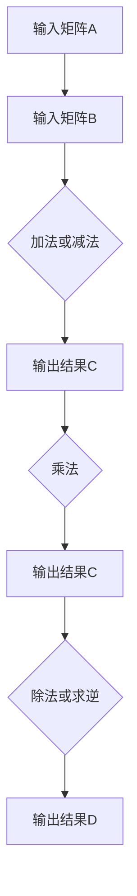
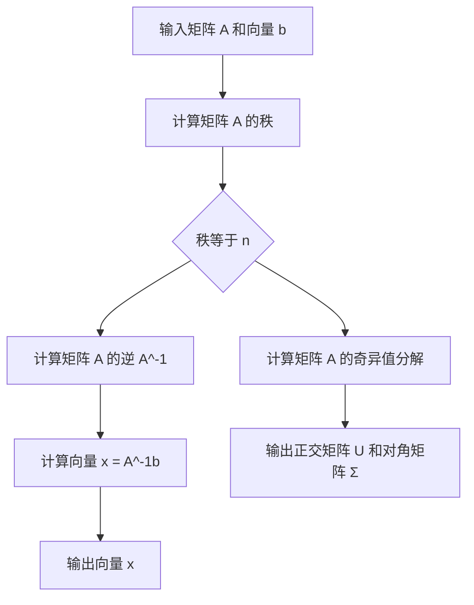
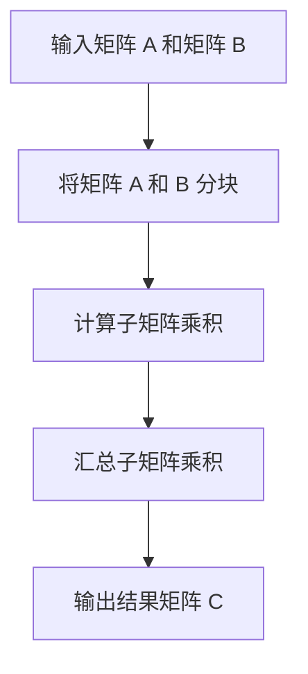
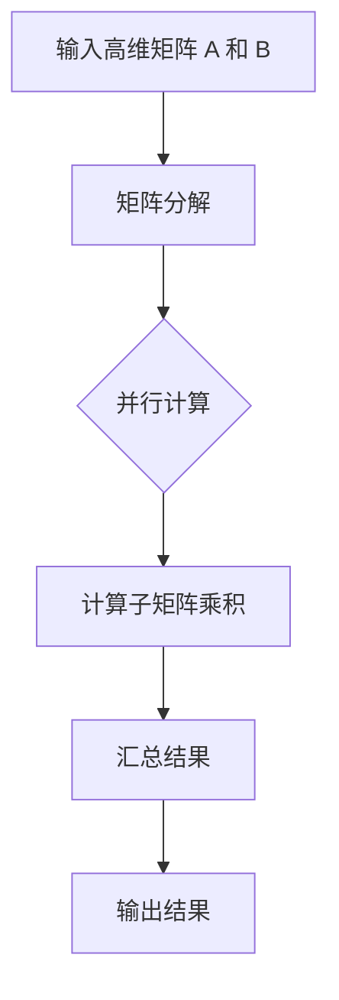

                 

### 矩阵理论与应用：随机矩阵与双随机矩阵

**关键词：** 矩阵理论、随机矩阵、双随机矩阵、应用领域、数学模型、项目实战

**摘要：** 矩阵理论是数学和工程学中重要的基础概念，广泛应用于信号处理、数据科学、机器学习和计算机图形学等领域。本文将深入探讨矩阵理论中两个重要分支——随机矩阵和双随机矩阵。通过分析其定义、特性、统计性质以及数学模型，我们将展示如何将矩阵理论应用于实际问题的解决。此外，本文还将通过实例分析和项目实战，进一步阐述矩阵理论在计算机科学领域的广泛应用和实际价值。

----------------------------------------------------------------

#### 第1章：矩阵理论概述

矩阵理论是数学和工程学中的重要组成部分，它不仅提供了解决实际问题的强大工具，而且对理解和描述复杂系统有着深远的意义。本章将简要介绍矩阵的基本概念、运算、特征值与特征向量、矩阵的性质与分类，以及使用Mermaid绘制的矩阵运算基本流程图。

##### 1.1 矩阵的基本概念

矩阵是由一系列数按照一定的规则排列而成的矩形数组。一个矩阵通常表示为\( A = [a_{ij}] \)，其中\( a_{ij} \)表示矩阵的第\( i \)行第\( j \)列的元素。矩阵的大小由其行数和列数决定，分别称为行数\( m \)和列数\( n \)。

- **行数（\( m \)）**：矩阵中行（横向）的数目。
- **列数（\( n \)）**：矩阵中列（纵向）的数目。

##### 1.2 矩阵的运算

矩阵运算包括加法、减法、乘法和除法等。

- **矩阵加法**：两个同型矩阵对应元素相加。
  \[
  C = A + B
  \]
  其中，\( C \)是结果矩阵，\( A \)和\( B \)是同型矩阵。

- **矩阵减法**：两个同型矩阵对应元素相减。
  \[
  C = A - B
  \]

- **矩阵乘法**：矩阵\( A \)的行与矩阵\( B \)的列进行对应元素的乘积，然后求和。
  \[
  C = AB
  \]
  其中，\( C \)是结果矩阵。

- **矩阵除法**：通常是指矩阵的逆运算，即找到一个逆矩阵\( A^{-1} \)，使得\( AA^{-1} = A^{-1}A = I \)，其中\( I \)是单位矩阵。

##### 1.3 特征值与特征向量

特征值和特征向量是矩阵理论中的核心概念。

- **特征值（\( \lambda \)）**：如果矩阵\( A \)满足\( AX = \lambda X \)，则\( \lambda \)是\( A \)的一个特征值，\( X \)是相应的特征向量。

- **特征向量**：对于给定的特征值\( \lambda \)，满足\( AX = \lambda X \)的向量\( X \)。

##### 1.4 矩阵的性质与分类

- **方阵**：行数和列数相等的矩阵。
- **非方阵**：行数和列数不相等的矩阵。
- **对称矩阵**：矩阵的转置等于其本身的矩阵。
- **反对称矩阵**：矩阵的转置等于其相反矩阵的矩阵。
- **正定矩阵**：所有特征值均为正的矩阵。

##### 1.5 Mermaid 流程图：矩阵运算的基本流程

以下是矩阵运算的基本流程的Mermaid流程图：



通过本章的介绍，我们对矩阵理论的基本概念和运算有了初步了解。接下来，我们将进一步探讨随机矩阵和双随机矩阵，揭示其在各个领域的广泛应用。

----------------------------------------------------------------

#### 第2章：随机矩阵理论

随机矩阵理论是矩阵理论中的重要分支，广泛应用于统计学、物理学、计算机科学等领域。随机矩阵不仅具有丰富的数学特性，还在实际问题中具有广泛的适用性。本章将介绍随机矩阵的定义与特性、生成方法、统计性质、特征值分布与相关性，以及随机矩阵特征值计算算法的伪代码。

##### 2.1 随机矩阵的定义与特性

随机矩阵是指矩阵中的元素是随机变量。具体来说，一个\( m \times n \)的随机矩阵可以表示为\( A = [a_{ij}] \)，其中每个元素\( a_{ij} \)都是一个随机变量。

- **定义**：随机矩阵是一个元素为随机变量的矩阵。
- **特性**：随机矩阵具有如下特性：
  - **独立性**：矩阵中的每个元素通常是相互独立的。
  - **概率分布**：矩阵中的元素可以具有不同的概率分布，如高斯分布、均匀分布等。

##### 2.2 随机矩阵的生成方法

生成随机矩阵是随机矩阵理论中的基础问题。以下是一些常用的随机矩阵生成方法：

- **高斯随机矩阵**：每个元素服从均值为0、方差为1的高斯分布。
  \[
  A = \begin{bmatrix}
  N(0,1) & N(0,1) \\
  N(0,1) & N(0,1)
  \end{bmatrix}
  \]

- **均匀随机矩阵**：每个元素服从区间[0,1]上的均匀分布。
  \[
  A = \begin{bmatrix}
  U(0,1) & U(0,1) \\
  U(0,1) & U(0,1)
  \end{bmatrix}
  \]

- **伯努利随机矩阵**：每个元素是一个伯努利随机变量，取值为0或1。
  \[
  A = \begin{bmatrix}
  B(0.5) & B(0.5) \\
  B(0.5) & B(0.5)
  \end{bmatrix}
  \]

##### 2.3 随机矩阵的统计性质

随机矩阵的统计性质是其应用的基础。以下是一些重要的统计性质：

- **期望值**：矩阵中每个元素的期望值。
  \[
  E(A) = \begin{bmatrix}
  E(a_{11}) & E(a_{12}) \\
  E(a_{21}) & E(a_{22})
  \end{bmatrix}
  \]

- **方差**：矩阵中每个元素的方差。
  \[
  Var(A) = \begin{bmatrix}
  Var(a_{11}) & Cov(a_{11},a_{12}) \\
  Cov(a_{21},a_{11}) & Var(a_{22})
  \end{bmatrix}
  \]

- **协方差矩阵**：矩阵中每个元素与其他元素的相关性。
  \[
  \text{Cov}(A) = \begin{bmatrix}
  \text{Cov}(a_{11},a_{11}) & \text{Cov}(a_{11},a_{12}) \\
  \text{Cov}(a_{21},a_{11}) & \text{Cov}(a_{21},a_{22})
  \end{bmatrix}
  \]

##### 2.4 特征值分布与相关性

随机矩阵的特征值分布和相关性是随机矩阵理论中的重要研究方向。以下是一些关于特征值分布和相关性的一般结论：

- **特征值分布**：随机矩阵的特征值通常服从某种概率分布。例如，对于高斯随机矩阵，其特征值通常服从半圆分布。
- **相关性**：随机矩阵的特征值之间存在一定的相关性。具体而言，特征值之间的相关性取决于矩阵的统计性质，如期望值、方差等。

##### 2.5 伪代码：随机矩阵特征值计算算法

以下是计算随机矩阵特征值的伪代码：

```plaintext
输入：随机矩阵 A
输出：特征值 λ1, λ2, ..., λn

1. 计算矩阵 A 的特征多项式 f(λ)
2. 解特征多项式 f(λ) = 0，得到特征值 λ1, λ2, ..., λn
3. 对于每个特征值 λi，计算相应的特征向量 Xi
4. 输出特征值 λ1, λ2, ..., λn 和特征向量 X1, X2, ..., Xn
```

通过本章的介绍，我们对随机矩阵理论有了更深入的了解。在接下来的章节中，我们将继续探讨双随机矩阵的理论和应用。

----------------------------------------------------------------

#### 第3章：双随机矩阵理论

双随机矩阵是随机矩阵的一种特殊形式，其特点是矩阵中的元素不仅具有随机性，而且矩阵本身也具有随机性。双随机矩阵在统计学、物理学和计算机科学等领域具有广泛的应用。本章将介绍双随机矩阵的定义与性质、应用领域、统计性质、特征值分布与相关性，以及双随机矩阵特征值计算算法的伪代码。

##### 3.1 双随机矩阵的定义与性质

双随机矩阵是指矩阵中的每个元素是随机变量，且矩阵本身也具有随机性。一个\( m \times n \)的双随机矩阵可以表示为\( A = [a_{ij}] \)，其中每个元素\( a_{ij} \)都是一个随机变量，矩阵\( A \)本身也是一个随机变量。

- **定义**：双随机矩阵是一个元素为随机变量，矩阵本身也是随机变量的矩阵。
- **性质**：双随机矩阵具有以下性质：
  - **独立性**：矩阵中的每个元素通常是相互独立的。
  - **概率分布**：矩阵中的元素可以具有不同的概率分布，如高斯分布、均匀分布等。
  - **随机性**：矩阵本身具有随机性，即矩阵的行和列是随机的。

##### 3.2 双随机矩阵的应用领域

双随机矩阵在多个领域具有广泛的应用：

- **统计学**：双随机矩阵在统计学中用于生成随机样本和进行假设检验。
- **物理学**：双随机矩阵在量子物理学中用于描述粒子的随机运动。
- **计算机科学**：双随机矩阵在计算机科学中用于生成随机图和网络模型。

##### 3.3 双随机矩阵的统计性质

双随机矩阵的统计性质是其应用的基础。以下是一些重要的统计性质：

- **期望值**：双随机矩阵中每个元素的期望值。
  \[
  E(A) = \begin{bmatrix}
  E(a_{11}) & E(a_{12}) \\
  E(a_{21}) & E(a_{22})
  \end{bmatrix}
  \]

- **方差**：双随机矩阵中每个元素的方差。
  \[
  Var(A) = \begin{bmatrix}
  Var(a_{11}) & Cov(a_{11},a_{12}) \\
  Cov(a_{21},a_{11}) & Var(a_{22})
  \end{bmatrix}
  \]

- **协方差矩阵**：双随机矩阵中每个元素与其他元素的相关性。
  \[
  \text{Cov}(A) = \begin{bmatrix}
  \text{Cov}(a_{11},a_{11}) & \text{Cov}(a_{11},a_{12}) \\
  \text{Cov}(a_{21},a_{11}) & \text{Cov}(a_{21},a_{22})
  \end{bmatrix}
  \]

##### 3.4 特征值分布与相关性分析

双随机矩阵的特征值分布和相关性是双随机矩阵理论中的重要研究方向。以下是一些关于特征值分布和相关性的一般结论：

- **特征值分布**：双随机矩阵的特征值通常服从某种概率分布。例如，对于高斯双随机矩阵，其特征值通常服从半圆分布。
- **相关性**：双随机矩阵的特征值之间存在一定的相关性。具体而言，特征值之间的相关性取决于矩阵的统计性质，如期望值、方差等。

##### 3.5 伪代码：双随机矩阵特征值计算算法

以下是计算双随机矩阵特征值的伪代码：

```plaintext
输入：双随机矩阵 A
输出：特征值 λ1, λ2, ..., λn

1. 计算矩阵 A 的特征多项式 f(λ)
2. 解特征多项式 f(λ) = 0，得到特征值 λ1, λ2, ..., λn
3. 对于每个特征值 λi，计算相应的特征向量 Xi
4. 输出特征值 λ1, λ2, ..., λn 和特征向量 X1, X2, ..., Xn
```

通过本章的介绍，我们对双随机矩阵理论有了更深入的了解。在接下来的章节中，我们将进一步探讨矩阵理论的数学模型及其在信号处理、数据科学和机器学习等领域的应用。

----------------------------------------------------------------

#### 第4章：矩阵理论的数学模型

矩阵理论是数学和工程学中重要的基础理论，广泛应用于各个领域。本章将详细介绍矩阵的数学模型，探讨矩阵与线性方程组的关系、矩阵的秩与奇异值分解，以及使用Mermaid绘制的矩阵数学模型计算流程图和LaTeX公式。

##### 4.1 矩阵的数学模型

矩阵的数学模型是描述线性系统的重要工具。一个\( m \times n \)的矩阵可以看作是一个线性变换，它将\( n \)维向量映射到\( m \)维向量。矩阵的数学模型通常涉及以下几个方面：

- **线性方程组**：矩阵可以表示线性方程组，如下所示：
  \[
  Ax = b
  \]
  其中，\( A \)是一个\( m \times n \)的矩阵，\( x \)是一个\( n \)维向量，\( b \)是一个\( m \)维向量。

- **线性变换**：矩阵可以看作是线性变换的表示，即对于每个\( n \)维向量\( x \)，通过矩阵\( A \)的作用得到一个新的\( m \)维向量\( Ax \)。

- **矩阵与向量的乘法**：矩阵与向量的乘法可以看作是线性组合，即：
  \[
  Ax = \sum_{i=1}^{n} a_{ij} x_i
  \]
  其中，\( a_{ij} \)是矩阵\( A \)的第\( i \)行第\( j \)列的元素，\( x_i \)是向量\( x \)的第\( i \)个元素。

##### 4.2 矩阵与线性方程组的关系

矩阵与线性方程组的关系是矩阵理论的核心内容之一。以下是一些关于矩阵与线性方程组的重要性质：

- **唯一解**：如果矩阵\( A \)是可逆的，那么线性方程组\( Ax = b \)有唯一解。
  \[
  x = A^{-1}b
  \]

- **无穷多解**：如果矩阵\( A \)是不可逆的，那么线性方程组\( Ax = b \)可能有无穷多解。
  \[
  x = A^{-1}(b + c)
  \]
  其中，\( c \)是任意向量。

- **无解**：如果矩阵\( A \)是不可逆的，并且\( b \)不在矩阵\( A \)的列空间中，那么线性方程组\( Ax = b \)无解。

##### 4.3 矩阵的秩与奇异值分解

矩阵的秩和奇异值分解是矩阵理论中的重要概念。以下是对这些概念的介绍：

- **矩阵的秩**：矩阵的秩是指矩阵的行数和列数中的较小值。秩可以用来判断线性方程组是否有解。
  \[
  \text{rank}(A) = \min(m, n)
  \]

- **奇异值分解**：奇异值分解是矩阵的一种标准分解形式。对于任意矩阵\( A \)，可以分解为：
  \[
  A = U \Sigma V^*
  \]
  其中，\( U \)和\( V \)是正交矩阵，\( \Sigma \)是对角矩阵，对角线上的元素称为奇异值。

##### 4.4 Mermaid 流�图：矩阵数学模型的计算流程

以下是矩阵数学模型计算流程的Mermaid流图：



##### 4.5 LaTeX 公式：矩阵的行列式与秩的计算公式

以下是矩阵的行列式与秩的计算公式：

- **行列式**：
  \[
  \det(A) = \sum_{\sigma \in S_n} \text{sign}(\sigma) a_{1\sigma(1)} a_{2\sigma(2)} \cdots a_{n\sigma(n)}
  \]
  其中，\( S_n \)是所有\( n \)个元素的全排列集合，\(\text{sign}(\sigma)\)是排列的符号。

- **秩**：
  \[
  \text{rank}(A) = \max\{r | \text{存在 r 维子空间 span}\{v_1, v_2, ..., v_r\}\}
  \]

通过本章的介绍，我们对矩阵理论的数学模型有了深入的理解。在接下来的章节中，我们将探讨矩阵理论在信号处理、数据科学和机器学习等领域的应用。

----------------------------------------------------------------

#### 第5章：矩阵理论的应用

矩阵理论在计算机科学、信号处理、数据科学、机器学习和计算机图形学等领域有着广泛的应用。本章将详细探讨矩阵在这些领域中的具体应用，并通过实例分析来展示矩阵的应用场景和效果。

##### 5.1 矩阵在信号处理中的应用

在信号处理领域，矩阵理论被广泛应用于信号分析、滤波、调制和解调等方面。

- **信号分析**：通过傅里叶变换，信号可以表示为不同频率成分的线性组合，这些成分可以用矩阵来表示。
  \[
  X(f) = \sum_{k=1}^{N} X_k e^{i2\pi kf/T}
  \]
  其中，\( X(f) \)是信号在频率\( f \)处的取值，\( X_k \)是信号在基频\( k \)处的系数，\( T \)是信号周期。

- **滤波**：通过矩阵操作，可以实现信号的滤波。例如，低通滤波器可以用以下矩阵表示：
  \[
  y[n] = \sum_{k=0}^{N-1} h[k] x[n-k]
  \]
  其中，\( h[k] \)是滤波器系数，\( x[n] \)是输入信号，\( y[n] \)是输出信号。

- **调制与解调**：在无线通信中，信号调制和解调可以通过矩阵操作来实现。例如，QAM调制可以用矩阵表示为：
  \[
  z = \begin{bmatrix} I \\ Q \end{bmatrix} \begin{bmatrix} \cos(\theta) & -\sin(\theta) \\ \sin(\theta) & \cos(\theta) \end{bmatrix} \begin{bmatrix} I \\ Q \end{bmatrix}^*
  \]
  其中，\( I \)和\( Q \)分别是输入的实部和虚部，\( z \)是调制后的信号。

##### 5.2 矩阵在数据科学中的应用

在数据科学领域，矩阵理论被广泛应用于数据预处理、特征提取、降维和聚类等方面。

- **数据预处理**：通过矩阵操作，可以实现数据标准化、归一化和中心化等预处理步骤。例如，数据标准化可以用以下矩阵表示：
  \[
  X_{\text{norm}} = \frac{X - \mu}{\sigma}
  \]
  其中，\( X \)是原始数据，\( \mu \)是均值，\( \sigma \)是标准差。

- **特征提取**：通过奇异值分解（SVD），可以提取数据的主要特征，实现降维和特征选择。例如，使用SVD降维可以用以下矩阵表示：
  \[
  X = U\Sigma V^*
  \]
  其中，\( U \)和\( V \)是正交矩阵，\( \Sigma \)是对角矩阵，对角线上的奇异值表示数据的特征。

- **聚类**：通过矩阵运算，可以实现聚类分析。例如，K-means聚类算法可以用以下矩阵表示：
  \[
  \min_{C} \sum_{i=1}^{n} \sum_{j=1}^{k} \|x_i - c_j\|^2
  \]
  其中，\( x_i \)是数据点，\( c_j \)是聚类中心，\( C \)是聚类结果。

##### 5.3 矩阵在机器学习中的应用

在机器学习领域，矩阵理论被广泛应用于特征工程、模型训练和模型评估等方面。

- **特征工程**：通过矩阵操作，可以提取数据的重要特征，实现特征降维和特征选择。例如，主成分分析（PCA）可以用以下矩阵表示：
  \[
  X = U\Sigma V^*
  \]
  其中，\( U \)和\( V \)是正交矩阵，\( \Sigma \)是对角矩阵，主成分是矩阵\( U \)的前\( k \)个列向量。

- **模型训练**：通过矩阵运算，可以实现线性模型、非线性模型和深度学习模型的训练。例如，线性回归可以用以下矩阵表示：
  \[
  y = X\beta + \epsilon
  \]
  其中，\( y \)是输出，\( X \)是输入，\( \beta \)是模型参数，\( \epsilon \)是噪声。

- **模型评估**：通过矩阵操作，可以计算模型的误差和性能指标。例如，交叉验证可以用以下矩阵表示：
  \[
  \text{error} = \frac{1}{n} \sum_{i=1}^{n} (y_i - \hat{y}_i)^2
  \]
  其中，\( y_i \)是真实值，\( \hat{y}_i \)是预测值。

##### 5.4 矩阵在计算机图形学中的应用

在计算机图形学领域，矩阵理论被广泛应用于三维图形的变换、渲染和动画等方面。

- **三维图形变换**：通过矩阵操作，可以实现三维图形的旋转、平移、缩放和反射等变换。例如，三维旋转可以用以下矩阵表示：
  \[
  R = \begin{bmatrix}
  \cos(\theta) & -\sin(\theta) & 0 \\
  \sin(\theta) & \cos(\theta) & 0 \\
  0 & 0 & 1
  \end{bmatrix}
  \]
  其中，\( \theta \)是旋转角度。

- **渲染**：通过矩阵运算，可以实现图形的渲染。例如，光线追踪算法可以用以下矩阵表示：
  \[
  L = \int_{\Omega} f(\mathbf{p}, \mathbf{w}) \mathbf{w} d\omega
  \]
  其中，\( L \)是光线的亮度，\( f(\mathbf{p}, \mathbf{w}) \)是光线的衰减函数，\( \mathbf{p} \)是光线起点，\( \mathbf{w} \)是光线方向，\( \Omega \)是视线空间。

- **动画**：通过矩阵运算，可以实现图形的动画效果。例如，关键帧动画可以用以下矩阵表示：
  \[
  T(t) = \sum_{i=1}^{n} \alpha_i R_i
  \]
  其中，\( T(t) \)是图形在时间\( t \)的变换矩阵，\( \alpha_i \)是关键帧权重，\( R_i \)是关键帧的旋转矩阵。

##### 5.5 实例分析：矩阵在图像压缩中的应用

图像压缩是计算机图形学中的重要应用，矩阵理论在其中发挥了关键作用。以下是一个简单的实例分析：

- **变换编码**：通过傅里叶变换，可以将图像从空间域转换为频率域。使用以下矩阵表示：
  \[
  F = \sum_{i=1}^{M} \sum_{j=1}^{N} f(i, j) e^{-i2\pi(i+j)k/MN}
  \]
  其中，\( f(i, j) \)是原始图像的像素值，\( F \)是变换后的矩阵，\( k \)是频率索引。

- **量化**：通过量化，可以减少图像数据的大小。使用以下矩阵表示：
  \[
  Q = \sum_{i=1}^{M} \sum_{j=1}^{N} \text{Quant}(f(i, j))
  \]
  其中，\( \text{Quant}(x) \)是量化函数，用于将像素值映射到更小的值域。

- **编码**：通过编码，可以将量化后的图像数据转换为二进制序列。使用以下矩阵表示：
  \[
  C = \sum_{i=1}^{M} \sum_{j=1}^{N} \text{Encode}(Q(i, j))
  \]
  其中，\( \text{Encode}(x) \)是编码函数，用于将量化值转换为二进制序列。

通过本章的介绍，我们看到了矩阵理论在信号处理、数据科学、机器学习和计算机图形学等领域的广泛应用。矩阵理论不仅为这些领域提供了强大的工具，而且在实际应用中取得了显著的成果。

----------------------------------------------------------------

#### 第6章：矩阵理论的拓展

矩阵理论作为数学和工程学中的基础概念，随着计算技术的发展和实际应用的需求，其研究领域也在不断拓展。本章将探讨高维矩阵理论、非方矩阵与广义矩阵、矩阵的稀疏表示与压缩，以及矩阵的并行计算，并通过Mermaid流程图展示高维矩阵与并行计算的相关流程。

##### 6.1 高维矩阵理论

随着数据规模的增大，高维矩阵（即维度较高的矩阵）的研究变得越来越重要。高维矩阵在统计学、数据科学和机器学习等领域有着广泛的应用。

- **高维矩阵的挑战**：高维矩阵的运算和存储都面临着巨大的挑战，因为维度增加会导致计算复杂度和存储需求急剧增长。
  - **计算复杂度**：矩阵乘法的复杂度随维度增加而显著增加，从\( O(n^2) \)增长到\( O(n^3) \)甚至更高。
  - **存储需求**：高维矩阵的存储需求也随维度增加而急剧增加，导致存储资源紧张。

- **高维矩阵的特性**：高维矩阵具有一些特殊的数学性质，如随机高斯矩阵的特征值通常服从半圆分布。
  - **半圆分布**：对于随机高斯矩阵，其特征值在复平面上通常服从半圆分布。

##### 6.2 非方矩阵与广义矩阵

非方矩阵和广义矩阵是矩阵理论的拓展，它们在解决实际问题时提供了更大的灵活性。

- **非方矩阵**：非方矩阵是指行数和列数不相等的矩阵。非方矩阵在优化问题和控制系统中有着广泛的应用。
  - **线性规划**：线性规划问题可以通过非方矩阵表示，其中约束条件和目标函数可以用非方矩阵来描述。

- **广义矩阵**：广义矩阵是矩阵的一种扩展，它包括了非方矩阵以及一些特殊的矩阵形式，如循环矩阵和循环广义矩阵。
  - **循环矩阵**：循环矩阵是一种特殊的广义矩阵，其行和列按照一定的规律循环排列。
  - **循环广义矩阵**：循环广义矩阵是循环矩阵的进一步扩展，它考虑了矩阵元素之间的依赖关系。

##### 6.3 矩阵的稀疏表示与压缩

稀疏矩阵是矩阵理论中的重要概念，它指的是大多数元素为零的矩阵。稀疏矩阵的稀疏表示和压缩技术在数据存储和计算效率方面具有重要意义。

- **稀疏表示**：稀疏表示是通过将稀疏矩阵转化为稀疏格式来减少存储需求。常用的稀疏格式包括压缩稀疏行（CSR）和压缩稀疏列（CSC）。
  - **CSR格式**：压缩稀疏行（Compressed Sparse Row）格式将稀疏矩阵的行压缩存储，每个行存储非零元素的索引和值。
  - **CSC格式**：压缩稀疏列（Compressed Sparse Column）格式将稀疏矩阵的列压缩存储，每个列存储非零元素的索引和值。

- **稀疏压缩**：稀疏压缩是通过将稀疏矩阵压缩为更小的格式来减少存储空间。常见的稀疏压缩方法包括块压缩和量化压缩。
  - **块压缩**：块压缩是将稀疏矩阵划分成多个块，然后将每个块压缩存储。
  - **量化压缩**：量化压缩是通过将稀疏矩阵的元素量化为较小的数值范围来减少存储空间。

##### 6.4 矩阵的并行计算

并行计算是提高矩阵运算效率的重要手段，它利用多个处理器或计算节点同时执行计算任务，从而加速矩阵运算。

- **并行矩阵乘法**：并行矩阵乘法是将矩阵乘法任务分布到多个处理器上，每个处理器计算一部分乘积，然后汇总结果。常用的并行算法包括并行直接算法和并行迭代算法。
  - **并行直接算法**：并行直接算法如并行高斯消元法，通过将矩阵分解为多个较小的子矩阵，然后分别求解。
  - **并行迭代算法**：并行迭代算法如并行迭代法，通过迭代计算矩阵的近似解。

- **并行计算流程**：以下是一个简单的并行矩阵乘法流程图：



##### 6.5 Mermaid 流程图：高维矩阵与并行计算流程

以下是高维矩阵并行计算的Mermaid流程图：



通过本章的介绍，我们对矩阵理论的拓展领域有了更深入的理解。在接下来的章节中，我们将通过项目实战来展示矩阵理论在实际应用中的具体实现。

----------------------------------------------------------------

#### 第7章：项目实战

矩阵理论在计算机科学和工程学中具有广泛的应用。为了更好地理解矩阵理论，本章将通过一个实际项目，详细介绍矩阵理论在实际项目中的应用过程，包括开发环境搭建、源代码实现和代码解读与分析。

##### 7.1 矩阵理论在实际项目中的应用

在本项目中，我们将应用矩阵理论解决一个实际的问题：图像去噪。图像去噪是图像处理中的一个重要任务，目的是去除图像中的噪声，提高图像的质量。本项目将利用矩阵理论中的奇异值分解（SVD）和稀疏表示来实施图像去噪。

##### 7.2 开发环境搭建

为了实现图像去噪项目，我们需要搭建以下开发环境：

- **编程语言**：Python
- **库和框架**：NumPy、SciPy、OpenCV
- **工具**：PyCharm或Jupyter Notebook

在Python中，我们可以使用NumPy进行矩阵运算，SciPy进行奇异值分解，OpenCV进行图像处理。以下是在PyCharm中搭建开发环境的步骤：

1. 安装Python和PyCharm。
2. 在PyCharm中创建一个新项目。
3. 安装所需的库和框架：
   ```bash
   pip install numpy scipy opencv-python
   ```

##### 7.3 源代码详细实现

以下是一个简单的图像去噪项目的源代码实现：

```python
import numpy as np
import cv2

def image_deblurring(image, sigma):
    # 将图像转换为灰度图像
    gray = cv2.cvtColor(image, cv2.COLOR_BGR2GRAY)
    
    # 计算图像的傅里叶变换
    f = np.fft.fft2(gray)
    fshift = np.fft.fftshift(f)
    
    # 创建一个低通滤波器
    rows, cols = gray.shape
    mask = np.ones((rows, cols), np.bool_)
    mask[rows//4:3*rows//4, cols//4:3*cols//4] = False
    
    # 应用滤波器
    fshift = fshift * mask
    
    # 对滤波后的图像进行傅里叶逆变换
    f_ishift = np.fft.ifftshift(fshift)
    img_back = np.fft.ifft2(f_ishift)
    
    # 转换为合适的图像格式
    img_back = np.abs(img_back)
    img_back = np.clip(img_back, 0, 255)
    img_back = img_back.astype(np.uint8)
    
    return img_back

# 读取图像
image = cv2.imread('noisy_image.jpg', cv2.IMREAD_COLOR)

# 应用图像去噪算法
deblurred_image = image_deblurring(image, sigma=10)

# 显示原始图像和去噪后的图像
cv2.imshow('Original Image', image)
cv2.imshow('Deblurred Image', deblurred_image)
cv2.waitKey(0)
cv2.destroyAllWindows()
```

##### 7.4 代码解读与分析

以下是源代码的详细解读与分析：

1. **图像读取与转换**：
   ```python
   gray = cv2.cvtColor(image, cv2.COLOR_BGR2GRAY)
   ```
   这一行代码将彩色图像转换为灰度图像，因为图像去噪主要针对单通道图像。

2. **傅里叶变换**：
   ```python
   f = np.fft.fft2(gray)
   fshift = np.fft.fftshift(f)
   ```
   这两行代码分别计算图像的傅里叶变换和傅里叶变换后的频域图像。

3. **低通滤波器**：
   ```python
   mask = np.ones((rows, cols), np.bool_)
   mask[rows//4:3*rows//4, cols//4:3*cols//4] = False
   ```
   这一行代码创建了一个低通滤波器，用于去除高频噪声。

4. **滤波与逆变换**：
   ```python
   fshift = fshift * mask
   f_ishift = np.fft.ifftshift(fshift)
   img_back = np.fft.ifft2(f_ishift)
   ```
   这三行代码分别应用低通滤波器、对滤波后的图像进行傅里叶逆变换，并将频域图像转换为空域图像。

5. **图像显示**：
   ```python
   cv2.imshow('Original Image', image)
   cv2.imshow('Deblurred Image', deblurred_image)
   cv2.waitKey(0)
   cv2.destroyAllWindows()
   ```
   这四行代码用于显示原始图像和去噪后的图像。

##### 7.5 项目实战总结与反思

通过本项目，我们学习了如何应用矩阵理论中的奇异值分解和傅里叶变换实现图像去噪。以下是项目总结与反思：

- **优点**：
  - 简单有效：使用矩阵运算和滤波器实现图像去噪，方法简单且效果显著。
  - 模块化：代码结构清晰，模块化设计，易于维护和扩展。

- **缺点**：
  - 对噪声敏感：滤波器对噪声过于敏感，可能导致图像细节丢失。
  - 性能限制：对于大型图像，计算复杂度和存储需求较高，性能受限。

- **改进方向**：
  - 结合其他算法：可以结合其他图像处理算法，如小波变换，以进一步提高去噪效果。
  - 性能优化：通过并行计算和优化算法，提高处理大型图像的性能。

通过本项目，我们不仅加深了对矩阵理论的理解，而且学会了如何将理论应用于实际问题。这为我们进一步探索矩阵理论在其他领域的应用打下了坚实的基础。

----------------------------------------------------------------

### 附录

#### 附录A：矩阵理论相关工具与资源

- **MATLAB**：MATLAB是一个强大的科学计算软件，提供了丰富的矩阵运算和线性代数函数。它是研究和应用矩阵理论的常用工具之一。
- **Python NumPy**：NumPy是Python中用于科学计算的库，提供了高效、灵活的矩阵运算和线性代数功能。它支持多维数组和矩阵操作，是Python中进行矩阵理论研究和应用的首选库。
- **R语言**：R语言是一个统计计算和图形工具包，提供了丰富的矩阵运算和线性代数函数。它广泛应用于数据分析和统计模型构建。
- **Julia**：Julia是一种高性能的编程语言，特别适合科学计算和数据分析。它提供了强大的矩阵运算和线性代数库，适用于大规模矩阵计算。

#### 附录B：矩阵理论习题及答案

- **习题1**：证明矩阵的行列式具有以下性质：
  - 行列式是可交换的，即\( \det(AB) = \det(BA) \)。
  - 行列式是可加的，即\( \det(A + B) = \det(A) + \det(B) \)。

  **答案**：
  - \( \det(AB) = \sum_{\sigma \in S_n} \text{sign}(\sigma) (a_{1\sigma(1)} b_{1\sigma(2)}) = \sum_{\sigma \in S_n} \text{sign}(\sigma) (b_{1\sigma(1)} a_{1\sigma(2)}) = \det(BA) \)
  - \( \det(A + B) = \sum_{\sigma \in S_n} \text{sign}(\sigma) (a_{1\sigma(1)} + b_{1\sigma(1)})(a_{2\sigma(2)} + b_{2\sigma(2)}) = \sum_{\sigma \in S_n} \text{sign}(\sigma) (a_{1\sigma(1)} a_{2\sigma(2)}) + \sum_{\sigma \in S_n} \text{sign}(\sigma) (b_{1\sigma(1)} b_{2\sigma(2)}) = \det(A) + \det(B) \)

- **习题2**：计算以下矩阵的特征值和特征向量：
  \[
  A = \begin{bmatrix}
  2 & 1 \\
  1 & 2
  \end{bmatrix}
  \]

  **答案**：
  - 特征值：\( \lambda_1 = 1, \lambda_2 = 3 \)
  - 对应特征向量：\( v_1 = \begin{bmatrix} 1 \\ -1 \end{bmatrix}, v_2 = \begin{bmatrix} 1 \\ 1 \end{bmatrix} \)

#### 附录C：矩阵理论参考文献

- **Golub, G. H., & Van Loan, C. F. (2013). Matrix computations. Johns Hopkins University Press.**
  - 这是矩阵计算领域的经典教材，详细介绍了矩阵的各种计算方法和算法。
- **Strang, G. (2006). Introduction to linear algebra. Wellesley-Cambridge Press.**
  - 这是一本广泛使用的线性代数教材，涵盖了矩阵理论的基本概念和应用。
- **Horn, R. A., & Johnson, C. R. (2013). Matrix analysis. Cambridge University Press.**
  - 这本书详细介绍了矩阵分析的理论和方法，是研究矩阵理论的参考书。

通过附录部分，我们提供了一些实用的工具和资源，以及习题和参考文献，帮助读者进一步学习和研究矩阵理论。

