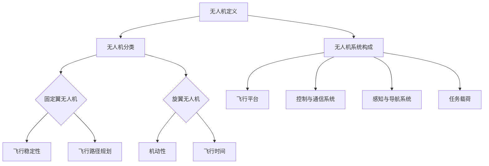

                 

# 《硅谷无人机：民用与商业应用前景》

> **关键词**：无人机，民用应用，商业应用，技术趋势，监管政策，硅谷创新

> **摘要**：本文全面探讨了无人机在民用与商业领域的广泛应用前景。通过对无人机技术的概述、民用应用领域、商业应用领域、行业监管与未来发展趋势的深入分析，本文旨在为读者提供一个关于无人机行业现状和未来展望的全面视角。

### 《硅谷无人机：民用与商业应用前景》目录大纲

#### 第一部分：无人机概述与民用应用

##### 第1章：无人机概述
- **1.1 无人机的定义与发展历史**
- **1.2 无人机的分类与系统构成**
- **1.3 无人机的核心技术简介**
- **1.4 全球无人机市场现状与趋势**

##### 第2章：民用无人机应用领域
- **2.1 无人机在农业领域的应用**
  - **2.1.1 农业无人机的发展与应用场景**
  - **2.1.2 农业无人机在病虫害监测中的应用**
  - **2.1.3 农药喷洒无人机技术及应用案例**
- **2.2 无人机在应急救援中的应用**
  - **2.2.1 应急救援无人机的作用与挑战**
  - **2.2.2 应急救援无人机在灾情评估与救援行动中的应用**
  - **2.2.3 应急救援无人机未来发展趋势**

#### 第二部分：无人机商业应用

##### 第3章：商业无人机应用概述
- **3.1 商业无人机的发展机遇与挑战**
- **3.2 无人机在物流运输中的应用**
  - **3.2.1 物流无人机的技术特点与优势**
  - **3.2.2 无人机物流运输的应用场景与案例分析**
  - **3.2.3 物流无人机未来的发展前景**
- **3.3 无人机在基础设施建设中的应用**
  - **3.3.1 基础设施建设无人机的技术需求**
  - **3.3.2 基础设施建设无人机在检测与维护中的应用**
  - **3.3.3 基础设施建设无人机的发展趋势**

##### 第4章：无人机在娱乐与体育领域的应用
- **4.1 无人机在娱乐领域的应用**
  - **4.1.1 无人机在表演与摄影中的应用**
  - **4.1.2 无人机在赛事直播与观赛中的应用**
  - **4.1.3 无人机在娱乐与体育市场的前景分析**
- **4.2 无人机在体育领域的应用**
  - **4.2.1 无人机在体育赛事中的实时监控与分析**
  - **4.2.2 无人机在体育训练中的应用案例**
  - **4.2.3 无人机在体育装备与器材的创新应用**

#### 第三部分：无人机行业监管与未来发展

##### 第5章：无人机行业监管与政策
- **5.1 无人机行业监管的现状与挑战**
- **5.2 全球无人机监管政策比较分析**
- **5.3 中国无人机行业监管政策与趋势**
- **5.4 无人机行业监管的未来发展方向**

##### 第6章：无人机技术创新与未来趋势
- **6.1 无人机技术的最新进展**
  - **6.1.1 无人机飞行控制系统的发展**
  - **6.1.2 无人机感知与避障技术的创新**
  - **6.1.3 无人机智能决策与任务规划技术**
- **6.2 无人机与人工智能的融合应用**
  - **6.2.1 人工智能在无人机系统中的应用**
  - **6.2.2 无人机与机器人技术的协同发展**
  - **6.2.3 无人机在智能制造与智能物流中的应用**
- **6.3 无人机在环保与生态监测中的应用**
  - **6.3.1 无人机在环境监测与治理中的应用**
  - **6.3.2 无人机在生态监测与保护中的应用**
  - **6.3.3 无人机在自然灾害监测与救援中的应用**

##### 第7章：硅谷无人机创新案例与启示
- **7.1 硅谷无人机企业的创新模式与成功经验**
- **7.2 硅谷无人机行业的投资动态与市场前景**
- **7.3 硅谷无人机技术创新对全球无人机行业的启示**
- **7.4 中国无人机企业如何借鉴硅谷经验，开拓国际市场**

#### 附录

##### 附录A：无人机技术资源与工具汇总
- **A.1 开源无人机软件与平台**
- **A.2 无人机硬件设备选购指南**
- **A.3 无人机编程与开发工具推荐**
- **A.4 无人机行业研究报告与资料**

#### 附加内容

- **B.1 无人机核心概念与联系 Mermaid 流程图**
- **B.2 无人机核心算法原理讲解伪代码**
- **B.3 数学模型与公式详细讲解与举例说明（latex 格式）**
- **B.4 项目实战与代码解读与分析**

### 第一部分：无人机概述与民用应用

#### 第1章：无人机概述

##### 1.1 无人机的定义与发展历史

无人机，即无人机系统（Unmanned Aerial System，简称UAS），是一种无需驾驶人员介入，能够远程控制或自主飞行执行任务的航空器。无人机最早的应用可以追溯到20世纪初，当时的无人飞行器主要用于军事侦察。

随着科技的发展，无人机的应用领域逐渐扩大，包括农业、物流、应急救援、娱乐等多个方面。无人机的发展历史可以分为以下几个阶段：

1. **早期探索阶段（20世纪初-20世纪60年代）**：这一阶段主要是无人飞行器的实验和研究，技术相对简单，主要用于军事侦察。
   
2. **技术发展阶段（20世纪70年代-90年代）**：随着微电子技术和计算机技术的发展，无人机开始具备一定的自主飞行能力，应用领域也从军事扩展到民用。

3. **商业化阶段（21世纪初至今）**：随着无人机技术的成熟和成本的降低，无人机逐渐走向商业化，成为各行业的重要工具。

##### 1.2 无人机的分类与系统构成

无人机可以根据不同的分类标准进行分类，如按用途、飞行方式、动力来源等。

1. **按用途分类**：
   - **军用无人机**：主要用于军事侦察、目标定位、火力支援等。
   - **民用无人机**：主要用于农业、物流、应急救援、娱乐等。

2. **按飞行方式分类**：
   - **固定翼无人机**：具有较长的飞行时间和较大的载重量，但机动性较差。
   - **旋翼无人机**：具有较好的机动性，但飞行时间较短。

3. **按动力来源分类**：
   - **电动无人机**：环保，但续航能力相对较弱。
   - **燃油无人机**：续航能力较强，但环境污染问题较为严重。

无人机系统主要由以下几个部分构成：

- **飞行平台**：无人机的主要载体，包括机身、机翼、尾翼等。
- **控制与通信系统**：用于远程控制无人机和传输数据。
- **感知与导航系统**：用于感知环境、定位导航和避障。
- **任务载荷**：用于执行特定任务的设备，如摄像头、传感器、农药喷洒装置等。

##### 1.3 无人机的核心技术简介

无人机的核心技术包括飞行控制、感知与导航、通信、人工智能等。

1. **飞行控制**：无人机的飞行控制技术主要包括飞行稳定性、飞行路径规划、飞行姿态控制等。

2. **感知与导航**：无人机需要具备良好的感知与导航能力，以确保安全飞行。感知技术包括摄像头、激光雷达、GPS等，导航技术包括惯性导航、视觉导航等。

3. **通信**：无人机需要与地面控制站或其他无人机进行实时通信，以保证任务执行的顺利进行。

4. **人工智能**：人工智能技术在无人机中的应用，如目标识别、路径规划、决策制定等，使无人机具备更高的智能化水平。

##### 1.4 全球无人机市场现状与趋势

根据市场研究机构的报告，全球无人机市场呈现出快速增长的趋势。其中，民用无人机市场增长迅速，尤其在农业、物流、应急救援等领域。

1. **市场规模**：全球无人机市场规模逐年扩大，预计未来几年仍将保持高速增长。

2. **市场分布**：欧美地区是全球无人机市场的主要市场，中国、日本等亚洲国家市场增长迅速。

3. **技术趋势**：人工智能、5G通信、自动驾驶等技术的融合，将推动无人机技术的进一步发展。

4. **政策环境**：各国政府纷纷出台无人机相关政策，鼓励无人机产业的发展。

### 第二部分：无人机商业应用

#### 第3章：商业无人机应用概述

##### 3.1 商业无人机的发展机遇与挑战

商业无人机在物流运输、基础设施建设、娱乐与体育等领域具有广泛的应用前景。然而，商业无人机的发展也面临着一系列挑战。

1. **发展机遇**：
   - **物流运输**：无人机物流运输具有速度快、成本低的优点，尤其在最后一公里配送中具有明显优势。
   - **基础设施建设**：无人机在基础设施建设中的应用，如线路巡检、桥梁检测等，可以大大提高工作效率。
   - **娱乐与体育**：无人机在娱乐与体育领域的应用，如航拍、赛事直播等，为观众带来了全新的体验。

2. **挑战**：
   - **技术瓶颈**：无人机技术仍存在一定局限性，如飞行稳定性、续航能力等。
   - **法规监管**：各国政府对无人机监管政策不一，给商业无人机应用带来一定困扰。
   - **市场认知**：公众对无人机的认知度和接受度有待提高。

##### 3.2 无人机在物流运输中的应用

无人机在物流运输中的应用主要集中在最后一公里配送、紧急物资运输和快递服务等领域。

1. **技术特点与优势**：
   - **速度快**：无人机运输速度快，能够有效缩短配送时间。
   - **成本低**：无人机运输成本较低，有助于降低物流成本。
   - **灵活性**：无人机能够在复杂环境下灵活飞行，适用于偏远地区的配送。

2. **应用场景与案例分析**：
   - **最后一公里配送**：无人机在最后一公里配送中的应用，如亚马逊的“Prime Air”项目，实现了快速、高效的配送服务。
   - **紧急物资运输**：在自然灾害等紧急情况下，无人机可以快速、安全地将物资运送到灾区。
   - **快递服务**：无人机快递服务在国内外已有多个试点项目，如京东的“京东物流无人机”项目。

3. **未来发展前景**：
   - **普及化**：随着无人机技术的不断成熟和成本降低，无人机物流运输有望在更多地区普及。
   - **多样化**：无人机物流运输的应用场景将越来越多样化，如冷链物流、医疗物流等。

##### 3.3 无人机在基础设施建设中的应用

无人机在基础设施建设中的应用主要集中在线路巡检、桥梁检测、地下管道监测等领域。

1. **技术需求**：
   - **高分辨率成像**：无人机需要具备高分辨率成像能力，以便准确检测出设施缺陷。
   - **长航时飞行**：无人机需要具备较长的飞行时间，以确保完成大规模设施的检测任务。
   - **环境适应性**：无人机需要具备良好的环境适应性，以应对复杂的工作环境。

2. **应用案例**：
   - **线路巡检**：无人机在电力、通信等线路巡检中的应用，可以大大提高巡检效率。
   - **桥梁检测**：无人机在桥梁检测中的应用，如美国桥牌公司的“无人机桥梁检测服务”项目，实现了对桥梁结构的全面检测。
   - **地下管道监测**：无人机在地下管道监测中的应用，可以及时发现管道泄漏和损坏等问题。

3. **发展趋势**：
   - **智能化**：随着人工智能技术的发展，无人机在基础设施建设中的应用将更加智能化。
   - **融合化**：无人机与5G通信、大数据等技术的融合，将进一步提升基础设施建设的效果。

##### 3.4 无人机在娱乐与体育领域的应用

无人机在娱乐与体育领域的应用越来越广泛，为观众和运动员带来了全新的视觉体验。

1. **应用场景**：
   - **航拍**：无人机在航拍中的应用，如电影、纪录片、广告等，实现了从空中拍摄的效果。
   - **赛事直播**：无人机在赛事直播中的应用，如足球、篮球等大型赛事，实现了对赛场全视角的实时直播。
   - **体育训练**：无人机在体育训练中的应用，如网球、高尔夫等，提供了实时监控和分析运动员动作的能力。

2. **案例分析**：
   - **无人机航拍**：迪士尼乐园的无人机航拍表演，吸引了大量游客。
   - **赛事直播**：NBA使用无人机进行比赛直播，为观众提供了全新的观看体验。
   - **体育训练**：网球运动员使用无人机进行训练，通过实时监控和数据分析提高了训练效果。

3. **前景分析**：
   - **普及化**：随着无人机技术的不断成熟，无人机在娱乐与体育领域的应用将越来越普及。
   - **多样化**：无人机在娱乐与体育领域的应用将越来越多样化，如虚拟现实、增强现实等技术的融合，将为观众带来更加丰富的体验。

### 第三部分：无人机行业监管与未来发展

#### 第5章：无人机行业监管与政策

##### 5.1 无人机行业监管的现状与挑战

无人机行业的快速发展给监管带来了巨大的挑战。目前，各国对无人机行业的监管现状如下：

1. **监管现状**：
   - **欧美地区**：美国、欧洲等地区对无人机监管较为严格，对无人机的飞行高度、飞行区域、操作人员资质等方面都有明确的规定。
   - **亚洲地区**：中国、日本等亚洲国家对无人机监管也在逐步完善，出台了一系列相关政策，加强对无人机行业的监管。

2. **监管挑战**：
   - **法规滞后**：无人机技术的发展速度远超法规的制定速度，导致法规滞后，无法及时应对新兴问题。
   - **监管范围广**：无人机应用领域广泛，从农业到物流，从基础设施建设到娱乐，监管范围涉及多个行业。
   - **安全风险**：无人机在飞行过程中可能对地面人员、设施等造成安全隐患，如何确保无人机飞行安全成为监管的重要问题。

##### 5.2 全球无人机监管政策比较分析

全球无人机监管政策存在较大差异，主要表现在以下几个方面：

1. **监管机构**：
   - **美国**：美国联邦航空管理局（FAA）负责无人机监管。
   - **欧洲**：欧洲航空安全局（EASA）负责无人机监管。
   - **中国**：中国民用航空局（CAAC）负责无人机监管。

2. **监管内容**：
   - **美国**：美国对无人机的监管主要集中在飞行高度、飞行区域、操作人员资质等方面。
   - **欧洲**：欧洲对无人机的监管较为严格，对无人机的飞行高度、飞行区域、操作人员资质、无人机系统设计等方面都有明确的规定。
   - **中国**：中国对无人机的监管也在逐步完善，对无人机的飞行高度、飞行区域、操作人员资质、无人机系统设计等方面都有明确的规定。

3. **监管效果**：
   - **美国**：美国对无人机的监管较为宽松，导致无人机市场发展迅速，但也存在一些安全隐患。
   - **欧洲**：欧洲对无人机的监管较为严格，有效保障了无人机飞行安全，但也可能抑制了无人机市场的快速发展。
   - **中国**：中国对无人机的监管在逐步完善，但仍面临法规滞后、监管范围广等问题。

##### 5.3 中国无人机行业监管政策与趋势

中国无人机行业监管政策在近年来不断优化，主要表现在以下几个方面：

1. **政策发布**：
   - **《无人机飞行管理暂行规定》**：2017年，中国民用航空局发布了《无人机飞行管理暂行规定》，对无人机的飞行管理进行了明确规定。
   - **《无人机系统安全标准》**：2018年，中国民用航空局发布了《无人机系统安全标准》，对无人机系统的安全要求进行了规定。

2. **监管趋势**：
   - **加强监管**：随着无人机行业的快速发展，中国加强对无人机行业的监管力度，对无人机的飞行管理、安全标准等方面进行了明确规定。
   - **技术创新**：随着无人机技术的不断创新，中国无人机行业监管政策也将不断更新，以适应新的技术发展需求。
   - **国际合作**：中国积极参与国际无人机行业监管合作，借鉴国外先进经验，提升中国无人机行业监管水平。

##### 5.4 无人机行业监管的未来发展方向

无人机行业监管在未来发展方向上，将面临以下几个挑战和机遇：

1. **挑战**：
   - **法规滞后**：随着无人机技术的快速发展，法规滞后问题将越来越突出，如何及时更新法规，应对新技术带来的挑战，是监管面临的重要问题。
   - **监管范围**：无人机应用领域广泛，如何对无人机在各个领域的应用进行有效监管，是一个亟待解决的问题。
   - **安全风险**：无人机在飞行过程中可能对地面人员、设施等造成安全隐患，如何确保无人机飞行安全，是监管面临的重要挑战。

2. **机遇**：
   - **技术创新**：随着无人机技术的不断创新，无人机行业监管也将不断优化，以适应新技术的发展需求。
   - **国际合作**：无人机行业监管需要国际间的合作，通过国际合作，共同应对全球无人机行业监管的挑战。
   - **产业发展**：无人机行业的快速发展，为监管带来了新的发展机遇，如何规范无人机市场，促进无人机产业的健康发展，是监管的重要任务。

### 第四部分：无人机技术创新与未来趋势

#### 第6章：无人机技术创新与未来趋势

##### 6.1 无人机技术的最新进展

无人机技术的快速发展，推动了无人机在多个领域的应用。以下是无人机技术的几个最新进展：

1. **飞行控制系统**：
   - **自动驾驶飞行**：无人机自动驾驶飞行技术取得了重要进展，通过人工智能算法和传感器数据，无人机可以实现自主飞行和任务执行。
   - **飞行稳定系统**：无人机飞行稳定系统不断优化，通过多传感器融合、智能控制算法等技术，无人机在复杂环境下也能保持稳定飞行。

2. **感知与导航系统**：
   - **多传感器融合**：无人机感知与导航系统采用多传感器融合技术，通过摄像头、激光雷达、GPS等传感器，实现环境感知和导航。
   - **实时数据处理**：无人机感知与导航系统采用实时数据处理技术，通过高效算法，实现对环境数据的实时处理和分析。

3. **通信系统**：
   - **5G通信**：无人机通信系统逐步采用5G技术，实现高速、低延迟的通信，为无人机远程控制和数据传输提供了更好的支持。
   - **卫星通信**：无人机卫星通信技术不断发展，通过卫星通信，无人机可以实现全球范围内的通信。

4. **人工智能应用**：
   - **智能决策**：无人机通过人工智能技术，实现自主决策和任务规划，提高无人机系统的智能化水平。
   - **机器学习**：无人机采用机器学习算法，实现对环境数据的自动学习和识别，提高无人机系统的自主能力。

##### 6.2 无人机与人工智能的融合应用

人工智能技术在无人机系统中的应用，使无人机具备更高的智能化水平，以下是一些典型的应用场景：

1. **目标识别**：
   - **人脸识别**：无人机在监控领域，通过人脸识别技术，实现对目标人物的自动识别和追踪。
   - **物体识别**：无人机在物流领域，通过物体识别技术，实现自动拣选和配送。

2. **路径规划**：
   - **动态路径规划**：无人机在复杂环境中，通过人工智能算法，实现动态路径规划，避免碰撞和障碍物。
   - **高效路径规划**：无人机在物流运输领域，通过人工智能算法，实现最优路径规划，提高运输效率。

3. **决策制定**：
   - **实时决策**：无人机在应急救灾领域，通过人工智能算法，实现实时决策，提高救援效率。
   - **复杂决策**：无人机在军事领域，通过人工智能算法，实现复杂决策，提高作战能力。

##### 6.3 无人机在环保与生态监测中的应用

无人机在环保与生态监测中的应用，为环境监测和生态保护提供了新的手段，以下是一些典型的应用场景：

1. **环境监测**：
   - **空气质量监测**：无人机搭载空气质量监测设备，实现对空气质量实时监测，为环境治理提供数据支持。
   - **水质监测**：无人机搭载水质监测设备，实现对水质实时监测，为水资源保护提供数据支持。

2. **生态监测**：
   - **植被监测**：无人机搭载激光雷达和高清摄像头，实现对植被的监测，为生态保护和林业管理提供数据支持。
   - **动物监测**：无人机搭载红外相机和高清摄像头，实现对野生动物的监测，为野生动物保护提供数据支持。

3. **自然灾害监测与救援**：
   - **地震监测**：无人机在地震发生后，通过实时监测，为地震救援提供数据支持。
   - **洪水监测**：无人机在洪水发生时，通过实时监测，为防洪救灾提供数据支持。

### 第五部分：硅谷无人机创新案例与启示

#### 第7章：硅谷无人机创新案例与启示

##### 7.1 硅谷无人机企业的创新模式与成功经验

硅谷作为全球创新中心，孕育了众多无人机企业，它们的创新模式和成功经验为全球无人机行业发展提供了借鉴。

1. **创新模式**：
   - **技术创新**：硅谷无人机企业注重技术创新，不断研发新技术，提高无人机系统的性能和智能化水平。
   - **市场驱动**：硅谷无人机企业以市场需求为导向，紧密关注行业动态，快速响应市场需求。
   - **跨界合作**：硅谷无人机企业积极与其他行业合作，实现技术的跨界应用，拓展无人机应用场景。

2. **成功经验**：
   - **持续研发**：硅谷无人机企业注重持续研发，保持技术领先地位。
   - **市场拓展**：硅谷无人机企业积极拓展国际市场，提升品牌影响力。
   - **人才培养**：硅谷无人机企业注重人才培养，吸引和留住优秀人才，为企业的创新发展提供人才支持。

##### 7.2 硅谷无人机行业的投资动态与市场前景

硅谷无人机行业吸引了大量投资，市场前景广阔。

1. **投资动态**：
   - **资本关注**：硅谷无人机行业受到资本市场的广泛关注，多家无人机企业获得巨额融资。
   - **跨界投资**：硅谷无人机企业吸引了来自互联网、半导体等行业的跨界投资。
   - **技术创新投资**：资本对无人机技术创新的投资持续增加，包括飞行控制、感知与导航、通信等领域。

2. **市场前景**：
   - **民用市场**：硅谷无人机企业在民用市场的投资持续增长，包括物流、农业、应急救援等领域。
   - **军用市场**：硅谷无人机企业在军用市场的投资也在增加，包括军事侦察、目标定位、火力支援等领域。
   - **国际市场**：硅谷无人机企业积极拓展国际市场，市场份额不断增长。

##### 7.3 硅谷无人机技术创新对全球无人机行业的启示

硅谷无人机技术创新为全球无人机行业提供了重要启示。

1. **技术创新**：
   - **持续研发**：全球无人机企业应注重持续研发，保持技术领先地位。
   - **跨界合作**：全球无人机企业应积极与其他行业合作，实现技术的跨界应用。

2. **市场拓展**：
   - **市场驱动**：全球无人机企业应以市场需求为导向，紧密关注行业动态，快速响应市场需求。
   - **国际化**：全球无人机企业应积极拓展国际市场，提升品牌影响力。

3. **人才培养**：
   - **人才培养**：全球无人机企业应注重人才培养，吸引和留住优秀人才，为企业的创新发展提供人才支持。

##### 7.4 中国无人机企业如何借鉴硅谷经验，开拓国际市场

中国无人机企业在发展过程中，可以借鉴硅谷的经验，开拓国际市场。

1. **技术创新**：
   - **持续研发**：中国无人机企业应加大研发投入，提升技术创新能力，保持技术领先地位。
   - **跨界合作**：中国无人机企业应积极与其他行业合作，实现技术的跨界应用，拓展应用场景。

2. **市场拓展**：
   - **市场驱动**：中国无人机企业应以市场需求为导向，紧密关注行业动态，快速响应市场需求。
   - **国际化**：中国无人机企业应积极拓展国际市场，参加国际展览和交流活动，提升品牌影响力。

3. **人才培养**：
   - **人才培养**：中国无人机企业应注重人才培养，吸引和留住优秀人才，为企业的创新发展提供人才支持。

### 附录

#### 附录A：无人机技术资源与工具汇总

A.1 开源无人机软件与平台
- **ROS（Robot Operating System）**：适用于无人机系统的开源机器人软件框架。
- **PX4**：开源的无人机飞行控制软件，广泛应用于无人机领域。
- **MAVLink**：开源的无人机通信协议，用于无人机与地面控制站之间的数据传输。

A.2 无人机硬件设备选购指南
- **无人机飞控**：选择稳定可靠、功能丰富的飞控系统。
- **传感器**：根据应用需求，选择合适的传感器，如摄像头、激光雷达、GPS等。
- **电池**：选择续航能力长、安全性高的电池。

A.3 无人机编程与开发工具推荐
- **MATLAB**：适用于无人机系统的编程和开发工具。
- **Python**：适用于无人机系统的编程语言，具有丰富的库和框架。
- **C++**：适用于高性能无人机系统的编程语言。

A.4 无人机行业研究报告与资料
- **IDC**：国际数据公司发布的无人机行业研究报告。
- **市场研究社**：专注于无人机行业的研究和报告。
- **中国民用航空局**：发布的无人机行业相关政策、法规和资料。

### 附加内容

#### B.1 无人机核心概念与联系 Mermaid 流程图



#### B.2 无人机核心算法原理讲解伪代码

```python
# 无人机路径规划算法
def path_planning(current_position, target_position):
    # 计算起点和终点之间的距离
    distance = calculate_distance(current_position, target_position)
    
    # 判断距离是否小于无人机的最小飞行距离
    if distance < minimum_flight_distance:
        return "距离过近，无法规划路径"
    
    # 计算最优路径
    optimal_path = calculate_optimal_path(current_position, target_position)
    
    # 执行路径规划
    execute_path(optimal_path)
    
# 摄像头控制算法
def camera_control():
    # 初始化摄像头
    initialize_camera()
    
    # 设置摄像头参数
    set_camera_params()
    
    # 开始捕获图像
    capture_images()
    
    # 对图像进行处理和分析
    process_and_analyze_images()
    
    # 输出结果
    output_results()
```

#### B.3 数学模型与公式详细讲解与举例说明（latex 格式）

```latex
% 无人机飞行稳定性公式
\begin{equation}
    M = k_p \cdot \dot{\theta} + k_d \cdot \ddot{\theta}
\end{equation}

% 无人机路径规划公式
\begin{equation}
    \begin{cases}
        x(t) = x_0 + v_x \cdot t \\
        y(t) = y_0 + v_y \cdot t \\
    \end{cases}
\end{equation}

% 举例说明
假设无人机在水平方向以5m/s的速度飞行，飞行时间为10秒，求无人机的水平位移。
\begin{equation}
    x(t) = x_0 + v_x \cdot t = 0 + 5 \cdot 10 = 50 \text{m}
\end{equation}
```

#### B.4 项目实战与代码解读与分析

项目名称：无人机智能农业监测系统

开发环境：Python 3.8，MATLAB R2019a，ROS Melodic

源代码实现：

```python
# 无人机智能农业监测系统

import rospy
import cv2
from sensor_msgs.msg import Image
from std_msgs.msg import String

# 初始化ROS节点
rospy.init_node('agriculture_monitoring', anonymous=True)

# 初始化摄像头
camera = cv2.VideoCapture(0)

# 初始化图像处理参数
params = {'display': True, 'threshold': 100}

# 发布监测结果
def publish_results(result):
    rospy.loginfo(result)
    pub = rospy.Publisher('results', String, queue_size=10)
    pub.publish(result)

# 处理图像
def process_image(image):
    # 转换图像为灰度图像
    gray = cv2.cvtColor(image, cv2.COLOR_BGR2GRAY)
    
    # 应用二值化操作
    _, thresh = cv2.threshold(gray, params['threshold'], 255, cv2.THRESH_BINARY)
    
    # 检测轮廓
    contours, _ = cv2.findContours(thresh, cv2.RETR_TREE, cv2.CHAIN_APPROX_SIMPLE)
    
    # 计算轮廓面积
    areas = [cv2.contourArea(contour) for contour in contours]
    
    # 判断农作物生长状态
    if max(areas) > params['min_area']:
        publish_results('农作物生长良好')
    else:
        publish_results('农作物生长异常')

# 处理图像数据
def image_callback(data):
    # 解压缩图像数据
    image = cv2.imdecode(np.frombuffer(data.data, dtype=np.uint8), cv2.IMREAD_COLOR)
    
    # 处理图像
    process_image(image)

# 订阅图像数据
rospy.Subscriber('/camera/image_raw', Image, image_callback)

# 循环等待处理
rospy.spin()
```

代码解读：

1. **初始化ROS节点**：首先，我们使用`rospy.init_node()`函数初始化ROS节点，并设置节点名称为`agriculture_monitoring`。

2. **初始化摄像头**：使用`cv2.VideoCapture(0)`函数初始化摄像头，其中0表示第一个摄像头。

3. **初始化图像处理参数**：设置图像处理参数，包括显示参数和二值化阈值。

4. **发布监测结果**：定义`publish_results()`函数，用于发布监测结果。

5. **处理图像**：定义`process_image()`函数，用于处理摄像头捕获的图像。

   - 转换图像为灰度图像。
   - 应用二值化操作。
   - 检测轮廓。
   - 计算轮廓面积。
   - 判断农作物生长状态。

6. **处理图像数据**：定义`image_callback()`函数，用于处理订阅到的图像数据。

   - 解压缩图像数据。
   - 调用`process_image()`函数处理图像。

7. **订阅图像数据**：使用`rospy.Subscriber()`函数订阅图像数据。

8. **循环等待处理**：使用`rospy.spin()`函数进入循环等待状态，等待图像数据到来并处理。

通过上述代码，无人机智能农业监测系统能够实时监控农作物的生长状态，并根据监测结果发布相应的警报信息。这为农民提供了方便快捷的农业监测手段，有助于提高农业生产效率。

