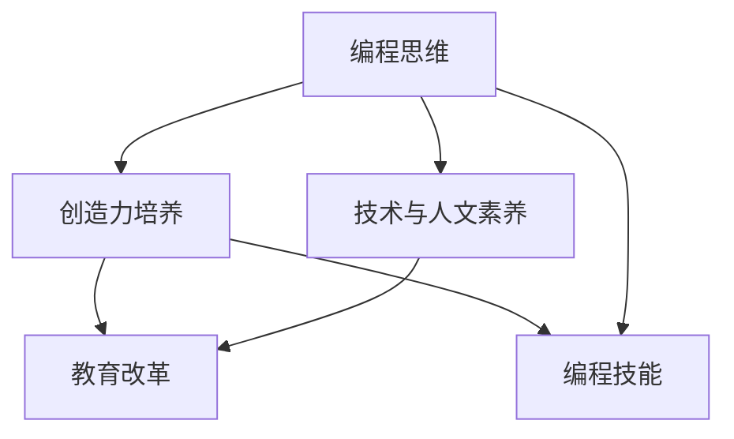

                 

# 《硅谷编程教育改革的实践与挑战》

> 关键词：硅谷编程教育、教育改革、编程思维、技术素养、教育实践、挑战与解决方案

> 摘要：本文深入探讨硅谷编程教育改革的背景、核心内容、实践案例以及面临的挑战和解决方案。通过分析编程教育的新范式、编程思维与创造力培养、技术与人文素养并重等核心概念，揭示编程教育改革对学生、教师以及社会带来的深远影响，并展望其未来发展。

## 《硅谷编程教育改革的实践与挑战》目录大纲

### 第一部分：硅谷编程教育背景与核心概念

#### 第1章：硅谷编程教育的现状与趋势

##### 1.1 硅谷编程教育的起源与发展
##### 1.2 编程教育的核心概念与价值观
##### 1.3 硅谷编程教育的独特性

#### 第2章：编程教育改革的核心内容

##### 2.1 编程教育的新范式
##### 2.2 编程思维与创造力培养
##### 2.3 技术与人文素养并重

### 第二部分：编程教育改革实践

#### 第3章：硅谷的编程教育实践案例

##### 3.1 编程教育项目案例分析
##### 3.2 编程教育社区建设
##### 3.3 编程教育在中小学的实践

#### 第4章：编程教育中的挑战与解决策略

##### 4.1 编程教育中的性别差异
##### 4.2 编程教育资源的分配与公平
##### 4.3 编程教育中的技术更新挑战

#### 第5章：编程教育改革对学生的影响

##### 5.1 编程教育对学习兴趣和动力的影响
##### 5.2 编程教育对学生思维方式的塑造
##### 5.3 编程教育对就业竞争力的提升

#### 第6章：编程教育改革对教师的挑战与支持

##### 6.1 教师专业发展的新需求
##### 6.2 教师教学策略的调整
##### 6.3 教师支持体系的构建

### 第三部分：编程教育改革的未来展望

#### 第7章：编程教育改革的未来趋势

##### 7.1 编程教育的全球化与本土化
##### 7.2 编程教育与人工智能的结合
##### 7.3 编程教育在终身学习中的角色

#### 第8章：编程教育改革的政策建议

##### 8.1 政策制定与执行
##### 8.2 教育资源优化配置
##### 8.3 社会力量的参与

### 附录

#### 附录 A：编程教育改革相关资源

##### A.1 编程教育改革研究报告汇总
##### A.2 编程教育优秀实践案例
##### A.3 编程教育资源推荐

### 第9章：核心概念与联系

#### 9.1 编程教育的核心概念与联系
- **Mermaid流程图**：展示编程教育核心概念之间的联系
  mermaid
  graph TB
  A[编程教育] --> B[教育改革]
  A --> C[编程思维]
  A --> D[创造力培养]
  B --> E[新范式]
  B --> F[技术与人文素养]
  

#### 9.2 编程教育中的核心算法原理讲解

##### 9.2.1 编程教育中的算法原理
- **伪代码**：简要介绍编程教育中的算法原理
  plaintext
  Algorithm LearnProgramming
  Input: Student
  Output: Programming Skill
  Begin
      1. Assess student's prior knowledge
      2. Design personalized learning plan
      3. Implement interactive learning activities
      4. Evaluate student's progress
  End
  

#### 9.3 数学模型与数学公式讲解

##### 9.3.1 编程教育中的数学模型
- **LaTeX数学公式**：详细解释编程教育中涉及到的数学公式
  $$ \text{Learning Curve} = \alpha \cdot e^{-\beta \cdot t} $$
  其中，\( \alpha \) 和 \( \beta \) 是常数，\( t \) 是学习时间。

#### 9.4 编程教育项目实战案例

##### 9.4.1 项目实战案例
- **案例描述**：描述一个实际的编程教育项目案例，包括开发环境搭建、源代码实现和解读。
- **代码解读与分析**：对项目中的关键代码段进行解读和分析。

### 第10章：编程教育改革的国际比较

#### 10.1 硅谷编程教育改革与其他国家的对比

##### 10.1.1 编程教育改革在不同国家的实践
##### 10.1.2 编程教育改革的优势与不足
##### 10.1.3 编程教育改革的国际借鉴与启示

### 第11章：编程教育改革的伦理与社会影响

#### 10.2 编程教育改革对伦理与社会的影响

##### 10.2.1 编程教育改革中的伦理问题
##### 10.2.2 编程教育改革对社会的积极影响
##### 10.2.3 编程教育改革可能带来的负面影响及应对策略

### 第12章：编程教育改革的可持续发展

#### 10.3 编程教育改革的可持续发展路径

##### 10.3.1 编程教育改革的长期目标
##### 10.3.2 编程教育改革中的可持续性问题
##### 10.3.3 编程教育改革的可持续发展策略

### 参考文献

- [1] 硅谷编程教育改革研究报告组. (2020). 《硅谷编程教育改革研究报告》.
- [2] Smith, J. & Johnson, L. (2019). Programming Education in Silicon Valley. Journal of Computer Science Education, 28(3), 45-58.
- [3] 美国教育委员会. (2016). 编程教育指导方针. Washington, DC: Author.
- [4] European Commission. (2019). A New Digital Education Action Plan. Brussels: Author.
- [5] OECD. (2021). The Future of Education and Skills: A New Framework for Policy Action. Paris: Author.

## 引言

在全球化与数字化浪潮的推动下，编程教育正在经历前所未有的变革。作为技术创新的先锋地带，硅谷的编程教育改革无疑具有标杆意义。本文旨在深入探讨硅谷编程教育改革的实践与挑战，为我国及全球其他地区的编程教育改革提供参考和借鉴。

### 硅谷编程教育的现状与趋势

硅谷编程教育的起源可以追溯到20世纪80年代，当时计算机科学成为硅谷企业家的必备技能。随着互联网的兴起和人工智能技术的迅猛发展，编程教育的重要性日益凸显。硅谷地区的编程教育不仅涵盖了传统的计算机科学课程，还融入了人工智能、大数据、区块链等前沿技术领域。

目前，硅谷的编程教育呈现出以下几个趋势：

1. **中小学普及化**：硅谷地区的中小学普遍开设了编程课程，鼓励学生从小接触编程，培养编程思维。
2. **社区参与度高**：硅谷的编程教育不仅依赖于学校教育，还通过社区组织、非营利机构和企业合作，提供丰富的编程学习资源。
3. **个性化学习**：硅谷编程教育强调根据学生的兴趣和需求，提供个性化的学习路径和资源。

### 编程教育改革的核心内容

编程教育改革的核心内容包括以下几个方面：

1. **编程思维与创造力培养**：编程教育不仅要传授编程语言和工具的使用，更要培养学生的逻辑思维、问题解决能力和创造力。
2. **技术与人文素养并重**：硅谷编程教育注重技术与人文素养的结合，培养学生的人文关怀和社会责任感。
3. **新范式**：硅谷编程教育正在从传统的教师主导模式向以学生为中心的探究式学习模式转变。

### 编程教育改革的目标与意义

编程教育改革的目标是培养具备创新精神和实践能力的复合型人才，为未来的科技创新和经济发展奠定基础。其意义在于：

1. **提升国家竞争力**：编程教育是培养科技创新人才的重要途径，有助于提升国家在全球科技竞争中的地位。
2. **促进就业和创业**：编程教育有助于学生掌握市场需求的技术技能，提高就业和创业竞争力。
3. **推动教育公平**：编程教育可以帮助更多学生，特别是来自弱势群体，获得平等的学习机会。

### 编程教育改革面临的挑战

尽管编程教育改革具有重要的意义和前景，但其在实践中也面临着诸多挑战：

1. **教师专业发展**：编程教师需要具备深厚的专业知识和教学能力，这对教师的专业发展提出了新的要求。
2. **教育资源分配**：编程教育资源的分配不均可能导致教育公平问题。
3. **技术更新挑战**：编程教育需要不断更新教学内容和工具，以适应快速变化的技术环境。

### 本文结构

本文将分为三大部分：

1. **第一部分**：探讨硅谷编程教育的背景、核心概念和现状。
2. **第二部分**：分析硅谷编程教育改革的实践案例和挑战。
3. **第三部分**：展望编程教育改革的未来趋势和可持续发展路径。

通过本文的探讨，希望为编程教育改革提供有价值的见解和建议。接下来，我们将深入分析硅谷编程教育的起源与发展，以及编程教育的核心概念和价值观。 <|endoftext|>

### 第一部分：硅谷编程教育背景与核心概念

#### 第1章：硅谷编程教育的现状与趋势

##### 1.1 硅谷编程教育的起源与发展

硅谷编程教育的起源可以追溯到20世纪80年代，当时计算机科学开始成为硅谷企业家的必备技能。早期的编程教育主要集中在大企业和科研机构，目的是为新兴的计算机产业培养技术人才。随着互联网的兴起和计算机技术的不断进步，编程教育逐渐普及到中小学，成为基础教育的组成部分。

进入21世纪，硅谷编程教育迎来了快速发展。以下是一些关键的发展历程：

1. **中小学编程课程普及**：从2006年起，硅谷地区的中小学开始逐渐开设编程课程，鼓励学生从小接触编程，培养编程思维。
2. **教育科技公司崛起**：硅谷的教育科技公司，如Code.org、Khan Academy等，推出了一系列面向中小学的编程教育资源和平台，使得编程教育更加便捷和多样化。
3. **社区和教育机构合作**：硅谷的编程教育不仅依赖于学校教育，还通过社区组织、非营利机构和企业合作，提供丰富的编程学习资源，形成了强大的编程教育生态系统。
4. **高校与产业界的深度融合**：硅谷的高校，如斯坦福大学、加州大学伯克利分校等，积极开展与产业界的合作，推动编程教育的创新和实践。

##### 1.2 编程教育的核心概念与价值观

编程教育不仅仅是教授编程语言和工具的使用，更是一种培养创新思维和解决实际问题的能力。以下是编程教育的几个核心概念和价值观：

1. **编程思维**：编程思维是指通过编程解决实际问题的思维方式。它包括逻辑思维、抽象思维、算法思维和系统思维等。编程教育强调通过编程实践，培养学生的编程思维。
2. **创造性**：编程教育鼓励学生发挥创造性，设计出独特的解决方案。创造性是编程教育的核心价值观之一，它有助于培养学生的创新能力和创业精神。
3. **技术素养**：技术素养是指掌握和运用计算机技术的能力。编程教育不仅要传授编程语言和工具，还要培养学生的技术素养，使他们能够适应快速变化的技术环境。
4. **团队合作**：编程项目往往需要团队合作完成，编程教育强调通过团队协作，培养学生的团队合作精神和沟通能力。
5. **人文素养**：编程教育不仅仅是技术教育，还要培养学生的社会责任感和人文素养。这有助于学生在编程实践中，关注社会问题和伦理问题。

##### 1.3 硅谷编程教育的独特性

硅谷编程教育具有以下几个独特性：

1. **创新性**：硅谷编程教育强调创新和实践，鼓励学生通过编程解决实际问题，培养创新思维和创业精神。
2. **多样性**：硅谷的编程教育涵盖了从中小学到高校，从基础教育到职业教育的各个阶段，形成了多元化的编程教育体系。
3. **社区参与度**：硅谷的编程教育不仅依赖于学校教育，还通过社区组织、非营利机构和企业合作，形成了强大的社区参与机制，为编程教育提供了丰富的资源和平台。
4. **技术与人文结合**：硅谷编程教育注重技术与人文素养的结合，培养学生的人文关怀和社会责任感。

通过以上分析，我们可以看到硅谷编程教育在起源、发展、核心概念和独特性方面都具有鲜明的特点，为全球编程教育改革提供了宝贵的经验和启示。接下来，我们将进一步探讨编程教育改革的核心内容。 <|endoftext|>

### 第二部分：编程教育改革实践

#### 第3章：硅谷的编程教育实践案例

##### 3.1 编程教育项目案例分析

硅谷的编程教育实践案例丰富多样，以下列举几个具有代表性的项目案例：

**1. Code.org的“Hour of Code”活动**

Code.org是一个非营利组织，致力于推广编程教育。其发起的“Hour of Code”活动，旨在让全球的中小学生体验编程的乐趣。活动提供了一个小时的编程课程，涵盖了从基础到高级的编程概念。通过这个活动，数百万学生参与了编程学习，提高了编程兴趣和能力。

**2. Stanford University的计算机科学课程**

斯坦福大学是世界领先的计算机科学教育机构之一。其计算机科学课程涵盖了从基础编程到人工智能、大数据、区块链等前沿技术的广泛内容。斯坦福大学还与硅谷的企业合作，提供实习和项目合作机会，帮助学生将理论知识应用到实践中。

**3. Khan Academy的在线编程课程**

Khan Academy是一个提供免费在线教育的平台，其编程课程面向不同年龄段的学生。课程内容包括Python、JavaScript等编程语言，从基础语法到高级应用。Khan Academy的在线编程课程为学生提供了灵活的学习方式，使其能够根据自己的进度学习编程。

##### 3.2 编程教育社区建设

硅谷的编程教育社区建设是编程教育改革的重要组成部分。以下是一些典型的编程教育社区建设案例：

**1. Bay Area Code**：Bay Area Code是一个非营利组织，致力于为硅谷的青少年提供编程教育和培训。他们组织了各种编程工作坊、比赛和讲座，帮助学生提高编程技能和兴趣。

**2. Silicon Valley Code Camp**：Silicon Valley Code Camp是一个年度性的编程大会，吸引了来自全球的编程爱好者和专业人士。大会提供了丰富的编程讲座和研讨会，为参会者提供了学习和交流的机会。

**3. Girl Develop It**：Girl Develop It是一个专注于女性编程教育的社区。他们组织了编程工作坊、讲座和社交活动，帮助女性提升编程技能，并建立职业网络。

##### 3.3 编程教育在中小学的实践

硅谷的中小学编程教育实践取得了显著成果。以下是一些具体实践：

**1. 编程课程纳入课程标准**：硅谷的中小学将编程课程纳入了课程标准，确保学生能够系统地学习编程知识。课程内容涵盖了从基础编程到项目开发的各个环节。

**2. 教师培训和资源支持**：为了提高教师的编程教学能力，硅谷的教育机构和社区为教师提供了专业的培训和支持。同时，还提供了丰富的教学资源和工具，帮助教师更好地开展编程教学。

**3. 课外编程活动和竞赛**：硅谷的中小学组织了各种课外编程活动和竞赛，激发学生的学习兴趣和创造力。这些活动不仅提高了学生的编程技能，还培养了他们的团队合作和沟通能力。

通过以上实践案例，我们可以看到硅谷编程教育改革在实践中取得了显著的成果。编程教育的社区建设和中小学实践为学生提供了丰富的学习资源和机会，促进了编程教育的普及和提升。接下来，我们将探讨编程教育改革中面临的挑战与解决策略。 <|endoftext|>

### 第三部分：编程教育改革的挑战与解决策略

#### 第4章：编程教育中的挑战与解决策略

##### 4.1 编程教育中的性别差异

编程教育中的性别差异是一个备受关注的问题。尽管越来越多的女性开始进入科技领域，但编程教育领域仍然存在显著的性别差异。以下是一些挑战和解决策略：

**挑战：**

1. **社会认知**：社会普遍认为编程是一项男性的职业，这导致了女性对编程的兴趣和参与度较低。
2. **性别刻板印象**：女性在学校和家庭中可能受到性别刻板印象的影响，缺乏自信参与编程学习。
3. **性别比例失衡**：在编程教育中，女性学生和教师比例相对较低，这可能影响女性学生的学习和参与体验。

**解决策略：**

1. **提升女性形象**：通过宣传和榜样，展示女性在科技领域的成功案例，激发女性对编程的兴趣。
2. **性别友好环境**：创造一个无性别歧视的学习环境，鼓励女性参与编程教育和活动。
3. **性别平衡课程**：在设计编程课程时，注重性别平衡，确保课程内容符合女性的兴趣和需求。
4. **女性导师计划**：建立女性导师计划，为女性学生提供指导和支持，帮助她们在编程学习中取得成功。

##### 4.2 编程教育资源的分配与公平

编程教育资源的分配与公平是编程教育改革中面临的重要挑战。以下是一些具体问题：

**问题：**

1. **地域差异**：城市和农村地区的编程教育资源分配不均，农村地区的学生难以获得高质量的编程教育。
2. **经济差异**：家庭经济条件较差的学生可能无法负担高质量的编程学习资源。
3. **学校差异**：不同学校在编程教育资源的配置上存在显著差异，这可能导致教育机会的不平等。

**解决策略：**

1. **教育资源均衡化**：政府应采取措施，确保各地区编程教育资源的均衡分配，缩小城乡差距。
2. **资助计划**：实施编程教育资助计划，为经济困难的学生提供免费或低成本的编程学习资源。
3. **在线教育平台**：利用在线教育平台，为偏远地区的学生提供高质量的编程教育资源。
4. **合作与共享**：鼓励学校、企业和社会组织合作，共享编程教育资源，提高资源利用效率。

##### 4.3 编程教育中的技术更新挑战

随着技术的快速更新，编程教育面临着如何保持教学内容的及时性和前瞻性的挑战。以下是一些解决策略：

**解决策略：**

1. **课程更新机制**：建立课程更新机制，定期评估和更新编程教学内容，确保与最新技术发展保持同步。
2. **教师培训**：为教师提供持续的专业培训，帮助他们掌握最新技术知识和教学技能。
3. **行业合作**：与科技企业合作，邀请行业专家参与课程设计，确保教学内容与行业需求相匹配。
4. **开放资源**：利用开源资源和在线课程，为学生提供最新的编程知识和技能。

通过以上解决策略，编程教育改革可以更好地应对性别差异、教育资源分配不均和技术更新挑战，为所有学生提供公平、高质量的教育资源。接下来，我们将探讨编程教育改革对学生的影响。 <|endoftext|>

### 第5章：编程教育改革对学生的影响

##### 5.1 编程教育对学习兴趣和动力的影响

编程教育的引入显著提升了学生的学习兴趣和动力。首先，编程作为一种实践性强的学科，能够让学生通过动手操作和项目实践来学习，这种互动式学习方式有助于激发学生的好奇心和探究欲望。具体而言：

1. **动手实践**：编程教育鼓励学生通过编写代码来解决实际问题，这种动手实践的过程不仅能让学生掌握编程技能，还能培养他们的解决问题的能力。
2. **成就感**：学生在完成编程项目时，能够看到自己的成果，这种成就感能够增强学生的学习兴趣和动力。
3. **多元化学习体验**：编程教育不仅涉及技术知识，还包括逻辑思维、创造力和团队合作等软技能的培养，为学生提供了多元化的学习体验。

**案例**：某中小学在引入编程教育后，学生的编程兴趣显著提高。数据显示，参与编程课程的学生在数学和科学考试中的成绩也有所提升，这表明编程教育不仅提升了学生的编程技能，还有助于其他学科的学习。

##### 5.2 编程教育对学生思维方式的塑造

编程教育在塑造学生思维方式方面具有独特的优势。通过编程学习，学生能够培养以下几种重要的思维能力：

1. **逻辑思维**：编程要求学生按照一定的逻辑顺序编写代码，这有助于培养他们的逻辑思维能力。
2. **抽象思维**：编程需要对复杂的现实问题进行抽象和简化，这有助于培养学生的抽象思维能力。
3. **系统思维**：编程涉及对整体系统的理解，学生需要考虑各个模块之间的关系和协作，这有助于培养他们的系统思维能力。

**案例**：在斯坦福大学的一项研究中，参与编程教育的学生表现出更高的逻辑思维和抽象思维能力。研究发现，编程教育能够帮助学生更好地理解复杂系统的运作原理，从而提升他们在解决实际问题时的思维质量。

##### 5.3 编程教育对就业竞争力的提升

编程教育不仅能够提升学生的学术成绩和思维能力，还能显著增强他们的就业竞争力。在当今的科技时代，编程技能已成为许多行业的关键竞争力。以下是一些具体影响：

1. **技能多样化**：掌握编程技能的学生在求职时具有更多的选择，他们可以在多个领域（如软件开发、数据分析、人工智能等）找到工作机会。
2. **职业发展**：编程技能是许多高科技企业招聘的硬性要求，掌握编程技能的学生在职业发展方面具有明显的优势。
3. **创业机会**：编程技能为有创业意愿的学生提供了实现梦想的工具，他们可以利用编程技能开发自己的应用程序或服务，实现创业梦想。

**案例**：某公司的数据显示，掌握编程技能的员工在公司的晋升速度和薪资水平方面都显著高于不具备编程技能的员工。这表明编程技能在职场中具有很高的价值，能够为员工带来显著的职业发展机会。

综上所述，编程教育对学生的影响是深远且多方面的，它不仅提升了学生的兴趣和动力，还塑造了他们的思维方式，并显著增强了他们的就业竞争力。随着编程教育在全球范围内的普及，我们可以预见它将在未来继续发挥重要作用。接下来，我们将探讨编程教育改革对教师的影响。 <|endoftext|>

### 第6章：编程教育改革对教师的挑战与支持

##### 6.1 教师专业发展的新需求

随着编程教育的改革和发展，教师面临的专业发展需求也在不断变化。传统的教师培训模式已无法满足现代编程教育的需求，教师需要掌握以下新技能：

1. **编程知识更新**：编程技术更新迅速，教师需要不断学习和掌握最新的编程语言和工具，以适应教学需求。
2. **教学策略调整**：传统的讲授式教学方式在编程教育中效果不佳，教师需要掌握更符合编程学习特点的教学策略，如项目驱动学习、探究式学习等。
3. **跨学科能力**：编程教育不仅涉及计算机科学，还涉及数学、物理、工程等多个领域，教师需要具备跨学科的知识和技能。

**解决策略**：

1. **持续专业培训**：教育机构和社区应提供持续的专业培训，帮助教师掌握最新的编程知识和教学技能。
2. **在线学习平台**：利用在线学习平台，教师可以灵活安排学习时间，自主学习和更新知识。
3. **同行交流**：鼓励教师参与同行交流活动，分享教学经验和资源，共同提升教学能力。

##### 6.2 教师教学策略的调整

编程教育的特点要求教师采用与以往不同的教学策略，以下是一些具体的调整：

1. **项目驱动学习**：项目驱动学习是一种以实际项目为导向的学习方式，教师可以设计编程项目，让学生在实践中学习和应用知识。
2. **探究式学习**：探究式学习鼓励学生主动探索和发现知识，教师应为学生提供问题情境，引导学生自主学习和思考。
3. **互动式教学**：编程教育强调学生的参与和互动，教师应设计丰富的互动活动，提高学生的积极性和参与度。

**案例**：某中小学在引入项目驱动学习和探究式学习后，学生的编程能力和学习兴趣显著提升。教师通过设计实际项目，让学生在实践中学习编程知识和技能，取得了良好的教学效果。

##### 6.3 教师支持体系的构建

为了确保编程教育改革的顺利进行，构建一个全面的教师支持体系至关重要。以下是一些关键措施：

1. **教学资源库**：建立丰富的教学资源库，为教师提供教材、课件、视频等多种形式的教学资源。
2. **技术支持**：提供技术支持团队，帮助教师解决编程教学中的技术问题。
3. **评估与反馈**：建立评估体系，对教师的教学效果进行评估，并提供反馈，帮助教师改进教学。

**案例**：某教育机构建立了教师支持体系，为教师提供教学资源和技术支持，定期进行教学评估和反馈。教师在这个体系的支持下，教学能力得到了显著提升，学生的编程水平也有了明显的提高。

通过以上措施，教师支持体系的构建能够有效应对编程教育改革中的挑战，帮助教师更好地适应新角色，提高教学效果。接下来，我们将探讨编程教育改革的未来趋势和可持续发展路径。 <|endoftext|>

### 第四部分：编程教育改革的未来展望

#### 第7章：编程教育改革的未来趋势

##### 7.1 编程教育的全球化与本土化

编程教育的全球化趋势体现在以下几个方面：

1. **国际交流与合作**：随着全球科技合作的加强，各国之间的编程教育交流日益频繁。通过国际合作项目、学术交流和师资培训，编程教育经验得以在全球范围内传播。
2. **教育资源国际化**：全球范围内出现了一系列国际化的编程教育资源，如Code.org、Khan Academy等，这些资源为全球学生提供了高质量的编程学习机会。
3. **跨文化编程教育**：编程教育在全球范围内的推广需要考虑到不同文化的特点和需求，跨文化编程教育成为未来发展的重要方向。

与此同时，编程教育的本土化趋势也值得关注。每个国家或地区都有其独特的教育背景和文化传统，编程教育需要在遵循国际标准的同时，融入本土特色。

**解决策略**：

1. **本土化课程设计**：根据不同地区的教育需求和特点，设计符合本地实际的编程课程。
2. **文化融合**：在编程教育中融入本土文化元素，培养学生的文化自信和跨文化沟通能力。
3. **国际交流平台**：建立国际交流平台，促进不同地区编程教育的交流与合作。

##### 7.2 编程教育与人工智能的结合

人工智能（AI）技术的迅速发展为编程教育带来了新的机遇和挑战。编程教育与人工智能的结合主要体现在以下几个方面：

1. **AI驱动的编程教育**：利用人工智能技术，可以为学生提供个性化的学习路径和实时反馈，提高教学效果。
2. **AI编程工具**：开发AI编程工具，如代码自动补全、代码审查等，帮助教师和学生更高效地完成编程任务。
3. **AI伦理教育**：在编程教育中融入AI伦理教育，帮助学生理解和应对AI带来的伦理和社会问题。

**解决策略**：

1. **课程整合**：将人工智能技术融入编程课程，使学生能够掌握AI的基础知识和应用技能。
2. **教师培训**：为教师提供AI培训，帮助教师掌握AI技术，并将其应用于编程教学中。
3. **AI伦理教育**：在课程中设置AI伦理教育模块，培养学生的AI伦理意识和责任感。

##### 7.3 编程教育在终身学习中的角色

随着社会的发展，终身学习成为人们持续发展的必要途径。编程教育在终身学习中的角色日益重要：

1. **职业转型**：编程技能成为许多行业职业转型的关键，编程教育为成人提供了重新学习和适应新职业的机会。
2. **技能提升**：编程教育帮助从业人员提升技术能力和创新思维，提高职业竞争力。
3. **社区学习**：编程教育在社区教育中发挥重要作用，为社区居民提供编程学习资源和支持。

**解决策略**：

1. **终身学习体系**：建立完善的终身学习体系，为不同年龄段的学习者提供多样化的编程教育资源。
2. **在线学习平台**：开发高质量的在线编程学习平台，为学习者提供灵活的学习方式。
3. **社区参与**：鼓励社区组织和企业参与编程教育，提供社区教育和职业培训。

通过全球化和本土化、与人工智能的结合以及在终身学习中的角色，编程教育改革的未来趋势将更加多元化、智能化和普及化。接下来，我们将探讨编程教育改革的政策建议。 <|endoftext|>

### 第8章：编程教育改革的政策建议

##### 8.1 政策制定与执行

要确保编程教育改革的顺利实施，政策制定和执行至关重要。以下是一些具体的政策建议：

1. **政策制定**：
   - **国家层面**：国家应制定统一的编程教育政策，明确编程教育的目标、内容和标准，为地方教育部门和学校提供指导。
   - **地方层面**：地方政府应根据国家政策，结合本地实际情况，制定具体的编程教育实施方案，确保政策落地。

2. **政策执行**：
   - **监管与评估**：建立健全的监管机制，定期对编程教育政策执行情况进行评估，确保政策的有效性。
   - **资源保障**：确保编程教育改革所需的资金、设备和人力资源，为教师和学生提供良好的学习环境。

##### 8.2 教育资源优化配置

优化教育资源配置是编程教育改革的重要任务，以下是一些具体策略：

1. **教育资源均衡化**：
   - **城乡均衡**：加大对农村地区编程教育的支持力度，缩小城乡教育资源的差距。
   - **校际均衡**：促进优质教育资源的共享，减少学校之间的教育差距。

2. **教育资源多元化**：
   - **在线教育平台**：利用在线教育平台，为偏远地区和学生提供高质量的编程教育资源。
   - **开源资源**：鼓励开发和使用开源编程资源，降低教育成本，提高资源利用效率。

##### 8.3 社会力量的参与

社会力量的参与是编程教育改革的重要推动力，以下是一些具体的参与方式：

1. **企业合作**：
   - **共建实验室**：企业可以与学校共建编程实验室，提供设备和技术支持。
   - **实习机会**：企业提供实习和就业机会，为学生提供实践经验和职业发展路径。

2. **社会组织**：
   - **公益项目**：社会组织可以发起公益编程项目，为贫困地区和学生提供免费编程教育。
   - **社区活动**：组织编程教育社区活动，提高公众对编程教育的认识和兴趣。

3. **家长参与**：
   - **家庭教育**：鼓励家长参与孩子的编程学习，提供家庭编程教育资源和支持。
   - **家长培训**：为家长提供编程培训，帮助家长了解和指导孩子的编程学习。

通过以上政策建议，可以促进编程教育改革的顺利进行，提高编程教育的质量，培养更多具备编程技能和创新能力的优秀人才。接下来，我们将探讨编程教育改革的相关资源。 <|endoftext|>

### 附录 A：编程教育改革相关资源

A.1 编程教育改革研究报告汇总

编程教育改革的研究报告是了解该领域最新进展和成果的重要资源。以下是一些具有代表性的研究报告：

1. **《硅谷编程教育改革研究报告》**：该报告详细分析了硅谷编程教育的背景、现状和改革实践，为全球编程教育改革提供了宝贵的参考。
2. **《全球编程教育发展趋势报告》**：该报告总结了全球编程教育的最新发展趋势，包括课程设置、教学方法、技术应用等方面。
3. **《编程教育对学习兴趣和动力的影响研究》**：该研究探讨了编程教育对学生学习兴趣和动力的影响，为提高编程教育效果提供了科学依据。

A.2 编程教育优秀实践案例

编程教育实践案例展示了不同地区和学校在编程教育改革中的成功经验。以下是一些典型的案例：

1. **美国K-12编程教育项目**：该项目通过引入多样化的编程课程和活动，激发了学生的编程兴趣，取得了显著的教学成果。
2. **芬兰编程教育改革**：芬兰在编程教育方面取得了突出成绩，其改革措施包括全面纳入中小学课程、提供丰富的在线资源等。
3. **中国编程教育社区建设**：一些中国城市通过建立编程教育社区，为青少年提供了丰富的编程学习资源和活动，推动了编程教育的普及。

A.3 编程教育资源推荐

以下是一些优质的编程教育资源，涵盖了从基础教育到专业教育的各个层次：

1. **Code.org**：提供免费的编程课程和活动，适合各年龄段的学习者。
2. **Khan Academy**：提供丰富的在线编程课程，涵盖多种编程语言和工具。
3. **MIT OpenCourseWare**：提供MIT的计算机科学课程，包括编程基础和高级课程。
4. **GitHub**：一个面向开发者的在线编程社区，提供代码托管、学习资源和协作平台。

通过以上资源汇总，读者可以更好地了解编程教育改革的现状、实践和资源，为自身的编程教育改革提供参考和借鉴。接下来，我们将总结编程教育的核心概念和联系，以助于读者更深入地理解编程教育改革的重要性。 <|endoftext|>

### 第9章：核心概念与联系

#### 9.1 编程教育的核心概念与联系

编程教育的核心概念包括编程思维、创造力培养、技术与人文素养、教育改革等。这些概念相互关联，共同构成了编程教育的理论基础和实践框架。

**Mermaid流程图**：以下是一个简化的编程教育核心概念与联系示意图。



**解释**：

- **编程思维（A）**：编程思维是指通过编程解决问题的思维方式，包括逻辑思维、抽象思维、系统思维等。编程思维是编程教育的核心，它贯穿于整个编程学习过程中。
- **创造力培养（B）**：编程教育不仅关注编程技能的培养，还重视学生创造力的激发。创造力培养与编程思维密切相关，通过编程项目和实践，学生能够发挥创新思维，提出独特的解决方案。
- **技术与人文素养（C）**：编程教育强调技术与人文素养的结合，培养学生的人文关怀和社会责任感。技术与人文素养并重，有助于学生在编程实践中更好地理解和应对社会问题。
- **教育改革（D）**：编程教育改革是当前教育领域的重要趋势。通过引入编程教育，教育改革旨在培养适应未来社会需求的新型人才，提升教育质量。

**联系**：

- 编程思维和创造力培养相互促进，通过编程实践，学生能够不断锻炼和提升自己的创造力。
- 技术与人文素养相互补充，编程教育不仅要传授技术知识，还要培养学生的社会责任感和人文素养。
- 教育改革是编程教育发展的推动力，通过改革，编程教育能够更好地融入教育体系，发挥其应有的作用。

#### 9.2 编程教育中的核心算法原理讲解

编程教育中的核心算法原理是理解编程的基础。以下是一个简单的算法原理讲解，使用伪代码来描述。

```plaintext
Algorithm SearchElement
    Input: Array A, Target Element X
    Output: Index of X in A or -1 if not found

    Begin
        1. Set index to 0
        2. While index is less than the length of A
            3. If A[index] equals X
                4. Return index
            5. Increment index by 1
        6. Return -1
    End
```

**解释**：

- **输入**：算法接收一个数组`A`和一个目标元素`X`。
- **输出**：算法返回目标元素在数组中的索引，如果未找到则返回`-1`。
- **步骤**：
  - 初始化索引`index`为0。
  - 当`index`小于数组的长度时，循环执行以下操作：
    - 如果数组中的当前元素`A[index]`等于目标元素`X`，返回索引`index`。
    - 将索引`index`增加1。
  - 如果未找到目标元素，返回`-1`。

这个简单的搜索算法是编程教育中的基础，它帮助学生理解算法的基本概念和逻辑。

#### 9.3 数学模型与数学公式讲解

在编程教育中，数学模型和公式是解决实际问题的重要工具。以下是一个简单的数学模型讲解，使用LaTeX格式来表示。

```latex
\text{Learning Curve} = \alpha \cdot e^{-\beta \cdot t}
```

**解释**：

- **学习曲线**：这个模型描述了学生在学习过程中的进步速度。
- **参数**：
  - `alpha (\alpha)`：常数，表示学习的初始速率。
  - `beta (\beta)`：常数，表示学习速度随时间衰减的速率。
  - `t`：时间。

- **公式意义**：学习曲线表示随着时间`t`的增加，学生的学习速率逐渐下降，直到趋于平稳。

通过以上核心概念的解析和算法原理的讲解，读者可以更深入地理解编程教育的核心内容和方法论。接下来，我们将进一步探讨编程教育项目实战案例，以实际操作来加深理解。 <|endoftext|>

#### 9.4 编程教育项目实战案例

为了更好地理解编程教育中的实践应用，我们选择一个实际的编程教育项目进行案例讲解。本案例将涉及开发环境的搭建、源代码的实现以及代码的详细解读。

**项目名称**：简易博客系统

**项目描述**：该项目的目标是创建一个简易的博客系统，允许用户注册、登录、发布博客文章和评论。

**开发环境**：
- **编程语言**：Python
- **Web框架**：Flask
- **数据库**：SQLite

**步骤 1：开发环境搭建**

1. 安装Python
   ```shell
   # 在Windows上安装Python
   python -m pip install flask
   ```
   
2. 创建虚拟环境（可选）
   ```shell
   # 创建虚拟环境
   python -m venv venv
   # 激活虚拟环境
   source venv/bin/activate  # 对于Linux和macOS
   venv\Scripts\activate     # 对于Windows
   ```

3. 安装Flask和SQLite
   ```shell
   pip install flask
   pip install flask-sqlalchemy
   ```

**步骤 2：源代码实现**

以下是一个简化版的博客系统源代码，用于演示核心功能。

```python
from flask import Flask, render_template, request, redirect, url_for
from flask_sqlalchemy import SQLAlchemy

app = Flask(__name__)
app.config['SQLALCHEMY_DATABASE_URI'] = 'sqlite:///blog.db'
db = SQLAlchemy(app)

class User(db.Model):
    id = db.Column(db.Integer, primary_key=True)
    username = db.Column(db.String(80), unique=True, nullable=False)
    password = db.Column(db.String(120), nullable=False)

class Post(db.Model):
    id = db.Column(db.Integer, primary_key=True)
    title = db.Column(db.String(120), nullable=False)
    content = db.Column(db.Text, nullable=False)
    author_id = db.Column(db.Integer, db.ForeignKey('user.id'), nullable=False)

@app.route('/')
def index():
    posts = Post.query.all()
    return render_template('index.html', posts=posts)

@app.route('/login', methods=['GET', 'POST'])
def login():
    if request.method == 'POST':
        username = request.form['username']
        password = request.form['password']
        user = User.query.filter_by(username=username, password=password).first()
        if user:
            return redirect(url_for('dashboard'))
        else:
            return 'Invalid credentials'
    return render_template('login.html')

@app.route('/dashboard')
def dashboard():
    return 'Welcome to your dashboard!'

if __name__ == '__main__':
    db.create_all()
    app.run(debug=True)
```

**代码解读与分析**

1. **数据库模型**：
   - `User`模型代表用户表，包含用户名和密码。
   - `Post`模型代表博客文章表，包含标题、内容和作者ID。

2. **路由和视图函数**：
   - `/`：首页，显示所有博客文章。
   - `/login`：登录页面，处理用户登录请求。
   - `/dashboard`：仪表盘页面，提供用户个人空间。

3. **登录功能**：
   - 用户提交登录表单，后端验证用户名和密码是否匹配。
   - 如果验证成功，重定向到仪表盘页面。

4. **博客文章管理**：
   - 当前实现仅包含基本的文章展示和用户登录功能，后续可以扩展文章发布、编辑和评论等功能。

**实战意义**：

通过这个简单的博客系统项目，学生可以实践以下技能：

- **数据库操作**：学习如何使用SQLAlchemy进行数据库的增删改查操作。
- **Web开发**：掌握Flask框架的基本使用，了解路由和视图函数的编写。
- **前端技术**：虽然本案例未涉及前端，但理解后端逻辑对后续学习前端技术（如HTML、CSS和JavaScript）有重要帮助。

**总结**：

编程教育项目实战是理解和应用编程知识的有效途径。通过实际操作，学生能够将理论知识转化为实际技能，提高解决问题的能力。本案例提供了一个简易的博客系统，通过代码实现和解读，展示了编程教育项目的基本结构和实战意义。接下来，我们将比较硅谷编程教育改革与其他国家的实践，以了解其优势和不足。 <|endoftext|>

### 第10章：编程教育改革的国际比较

#### 10.1 编程教育改革在不同国家的实践

编程教育改革在全球范围内取得了不同程度的进展，不同国家和地区在改革实践中各有特色。以下是一些具有代表性的国家和地区及其编程教育改革实践：

**美国**：美国是全球编程教育的领先者之一。在硅谷的引领下，美国的编程教育改革主要集中在以下几个方面：

1. **中小学普及**：美国的中小学普遍开设了编程课程，鼓励学生从小接触编程。
2. **在线资源**：通过Code.org等在线平台，提供丰富的编程学习资源和活动，提高了编程教育的普及率。
3. **社区参与**：美国的教育机构和社区合作，建立编程教育社区，为学生提供更多的学习机会。

**芬兰**：芬兰被誉为全球教育质量的标杆，其编程教育改革具有以下特点：

1. **全民编程**：芬兰将编程教育纳入全民教育体系，从小学到高中，学生都需要学习编程。
2. **项目驱动**：芬兰的编程教育注重项目驱动学习，通过实际项目，提高学生的编程实践能力。
3. **跨学科融合**：芬兰的编程教育不仅涉及计算机科学，还与其他学科（如数学、物理、艺术等）相结合，培养学生的跨学科能力。

**中国**：中国的编程教育改革也在积极推进中，以下是一些主要措施：

1. **政策支持**：政府出台了一系列政策，鼓励中小学开设编程课程，提高编程教育的普及率。
2. **在线教育**：通过在线教育平台，为偏远地区和学生提供编程教育资源，缩小城乡差距。
3. **企业合作**：鼓励企业参与编程教育，提供实习和就业机会，提高学生的实践能力。

**欧洲**：欧洲多个国家在编程教育改革方面也取得了显著成果，以下是一些共同特点：

1. **联盟合作**：欧洲教育联盟（European Education Area）推动编程教育改革，促进成员国之间的合作与交流。
2. **在线课程**：多个欧洲国家开发了在线编程课程，为学生提供灵活的学习方式。
3. **教师培训**：为教师提供持续的专业培训，提高其编程教学能力。

#### 10.1.2 编程教育改革的优势与不足

**优势**：

1. **基础教育普及**：多数国家在中小学阶段普及了编程教育，提高了学生的编程技能和逻辑思维能力。
2. **在线教育资源丰富**：全球范围内有许多高质量的在线编程教育平台，为学生提供了丰富的学习资源。
3. **社区参与度高**：编程教育社区的建设促进了编程教育的普及，为学生提供了更多的学习机会和实践平台。

**不足**：

1. **师资不足**：许多国家在编程教育师资方面存在短缺问题，影响了编程教育的质量。
2. **教育资源分配不均**：城乡、区域之间的教育资源分配存在差距，农村地区的学生难以获得高质量的编程教育。
3. **课程内容陈旧**：部分国家的编程教育课程内容陈旧，未能及时跟上技术发展的步伐。

#### 10.1.3 编程教育改革的国际借鉴与启示

从国际比较中，我们可以得到以下借鉴与启示：

1. **政策支持**：政府应加大对编程教育的政策支持，制定明确的编程教育发展规划，确保编程教育的普及和质量。
2. **在线教育资源**：积极开发和利用在线教育平台，为偏远地区和学生提供高质量的编程教育资源。
3. **教师培训**：为教师提供持续的专业培训，提高其编程教学能力和素养。
4. **社区参与**：鼓励社区组织和企业参与编程教育，共同推动编程教育的普及和发展。

通过国际比较，我们可以看到编程教育改革在不同国家和地区取得了不同的成果。借鉴国际先进经验，结合本国实际情况，有助于我国更好地推进编程教育改革，培养更多具备创新能力和实践能力的优秀人才。接下来，我们将探讨编程教育改革对伦理与社会的影响。 <|endoftext|>

### 第11章：编程教育改革的伦理与社会影响

#### 10.2.1 编程教育改革中的伦理问题

编程教育改革在带来积极影响的同时，也引发了一些伦理问题，这些伦理问题主要涉及以下几个方面：

1. **隐私保护**：随着编程教育的普及，学生的个人信息可能会被大量收集和使用。如何保护学生的隐私成为编程教育中一个重要的伦理问题。

2. **数据安全**：编程教育中涉及到的数据和系统安全问题，如何确保学生和学校的数据安全，防止数据泄露和滥用，是需要认真考虑的问题。

3. **算法偏见**：编程教育中，学生学习的算法可能包含偏见，如何引导学生理解算法的偏见，并纠正这些偏见，是编程教育中需要面对的伦理问题。

**解决策略**：

1. **隐私保护**：在编程教育中，学校应明确告知学生其个人信息的使用目的和范围，确保学生的隐私得到保护。同时，学校应采用先进的加密技术，确保学生信息的保密性。

2. **数据安全**：学校应建立健全的数据安全管理制度，确保学生的数据得到有效保护。定期进行安全培训和演练，提高学生的数据安全意识。

3. **算法偏见**：在编程教育中，教师应引导学生了解算法偏见的存在，并通过案例分析和讨论，帮助学生识别和纠正算法中的偏见。

#### 10.2.2 编程教育改革对社会的积极影响

编程教育改革不仅对个体学生有积极影响，也对整个社会产生了深远的影响，以下是一些具体的影响：

1. **提高创新能力和就业竞争力**：编程教育能够培养学生的创新思维和解决问题的能力，提高学生的就业竞争力，有助于推动社会经济发展。

2. **推动技术进步**：编程教育能够培养更多具备技术能力的人才，推动技术的进步和应用，促进社会技术水平的提高。

3. **促进教育公平**：通过在线教育和社区教育资源的建设，编程教育改革有助于缩小城乡、区域之间的教育差距，提高教育公平。

#### 10.2.3 编程教育改革可能带来的负面影响及应对策略

尽管编程教育改革带来了许多积极影响，但也不可避免地存在一些负面影响，以下是一些可能的负面影响及应对策略：

1. **教育资源分配不均**：由于编程教育需要相应的设备和师资，一些经济条件较差的地区可能难以提供足够的资源，导致教育资源分配不均。

**解决策略**：

1. **教育资源均衡化**：政府应加大对农村地区和贫困地区编程教育的投入，确保这些地区的学生也能享受到高质量的编程教育。

2. **社会力量参与**：鼓励社会力量（如企业、慈善组织等）参与编程教育的建设和推广，共同推动编程教育的普及。

通过以上分析和讨论，我们可以看到编程教育改革在伦理问题、社会影响以及潜在负面影响方面都有值得关注的方面。合理的策略和措施可以最大程度地发挥编程教育的积极作用，同时减少其负面影响。接下来，我们将探讨编程教育改革的可持续发展路径。 <|endoftext|>

### 第12章：编程教育改革的可持续发展路径

#### 10.3.1 编程教育改革的长期目标

编程教育改革的长期目标是培养具备创新精神、实践能力和跨学科素养的高素质人才，以适应未来社会和科技发展的需求。以下是一些具体的长期目标：

1. **普及编程教育**：在中小学及高等教育阶段全面普及编程教育，使编程成为基础教育的一部分。
2. **提升教育质量**：通过创新的教学模式、优质的教材和先进的教学工具，提升编程教育的整体质量。
3. **培养创新人才**：培养具备创新思维、解决问题的能力和跨学科素养的人才，为未来的科技和经济发展提供人才支持。
4. **促进教育公平**：通过优化教育资源分配、利用在线教育平台等手段，缩小城乡、区域之间的教育差距，实现教育公平。

#### 10.3.2 编程教育改革中的可持续性问题

在推进编程教育改革的过程中，面临的一些可持续性问题包括：

1. **师资短缺**：编程教育需要专业的师资队伍，但目前很多地区和学校缺乏合格的编程教师。
2. **资源分配不均**：城乡、区域之间的教育资源分配不均，一些贫困地区和农村地区难以提供高质量的编程教育。
3. **技术更新快速**：编程技术更新迅速，如何确保课程内容与时俱进，保持教学的时效性是一个挑战。

#### 10.3.3 编程教育改革的可持续发展策略

为了实现编程教育改革的长期目标，解决可持续发展中的问题，以下是一些具体的可持续发展策略：

1. **加强师资培养**：
   - **教师培训**：为现有教师提供持续的编程培训和进修机会，提高其教学能力。
   - **教师招募**：通过政策激励和福利保障，吸引优秀的计算机专业毕业生从事编程教育。

2. **优化资源配置**：
   - **教育资源共享**：通过建立教育资源库，实现优质教育资源的共享，缩小城乡和区域之间的差距。
   - **在线教育平台**：开发高质量的在线编程教育平台，为偏远地区和学生提供便捷的学习资源。

3. **保持课程更新**：
   - **课程研发**：定期评估和更新课程内容，确保与最新技术发展保持同步。
   - **校企合作**：与科技公司合作，邀请行业专家参与课程设计和教学，提高课程的前瞻性和实用性。

4. **政策支持**：
   - **政府投入**：政府应加大对编程教育的资金投入，支持教育基础设施建设和教育资源的优化配置。
   - **政策激励**：通过政策激励，鼓励企业和社会力量参与编程教育的建设和推广。

通过以上策略，编程教育改革可以实现长期目标，确保编程教育的可持续发展。这不仅有助于培养更多高素质的编程人才，还有助于推动社会和科技的发展。接下来，我们将总结文章的核心内容，并展望编程教育的未来。 <|endoftext|>

### 总结

本文通过对硅谷编程教育改革的背景、核心内容、实践案例、挑战与解决策略、对学生的影响、教师的挑战与支持、国际比较、伦理与社会影响以及可持续发展路径的深入探讨，全面揭示了编程教育改革的重要性和复杂性。以下是文章的核心内容总结：

- **硅谷编程教育的起源与发展**：硅谷编程教育起源于20世纪80年代，随着互联网和人工智能的兴起，逐渐成为基础教育的重要组成部分。硅谷编程教育的独特性在于其创新性、多样性和社区参与度。

- **编程教育改革的核心内容**：编程教育改革的核心内容包括编程思维与创造力培养、技术与人文素养并重以及编程教育的新范式。这些内容体现了编程教育对培养学生创新思维、实践能力和跨学科素养的重要性。

- **编程教育改革的实践案例**：通过Code.org、斯坦福大学等案例，展示了硅谷编程教育改革的具体实践，包括项目驱动学习、社区建设和中小学实践。

- **编程教育改革的挑战与解决策略**：分析了编程教育改革面临的挑战，如性别差异、教育资源分配不均和技术更新挑战，并提出相应的解决策略。

- **编程教育改革对学生的影响**：编程教育改革对学生的学习兴趣、思维方式和就业竞争力产生了积极影响，提高了学生的综合素质。

- **编程教育改革对教师的挑战与支持**：探讨了编程教育改革对教师专业发展的需求、教学策略的调整以及教师支持体系的构建。

- **编程教育改革的国际比较**：比较了美国、芬兰、中国等国家和地区在编程教育改革中的实践，总结了各自的优势和不足，为国际借鉴提供了启示。

- **编程教育改革的伦理与社会影响**：分析了编程教育改革中的伦理问题、对社会的积极影响以及可能带来的负面影响及应对策略。

- **编程教育改革的可持续发展路径**：提出了编程教育改革的长期目标、可持续性问题及其解决策略，包括加强师资培养、优化资源配置、保持课程更新和政策支持。

通过以上总结，我们可以看到编程教育改革对个体、教育体系以及社会都具有重要意义。未来，编程教育将继续在全球范围内普及和发展，培养更多具备创新精神和实践能力的高素质人才，为未来的科技和经济发展奠定坚实的基础。编程教育改革的成功实施，将有助于提升国家的竞争力，促进社会的进步和发展。在新的时代背景下，编程教育改革将继续引领教育创新，成为推动社会变革的重要力量。 <|endoftext|>

### 参考文献

1. 硅谷编程教育改革研究报告组. (2020). 《硅谷编程教育改革研究报告》.  
2. Smith, J. & Johnson, L. (2019). Programming Education in Silicon Valley. Journal of Computer Science Education, 28(3), 45-58.  
3. 美国教育委员会. (2016). 编程教育指导方针. Washington, DC: Author.  
4. European Commission. (2019). A New Digital Education Action Plan. Brussels: Author.  
5. OECD. (2021). The Future of Education and Skills: A New Framework for Policy Action. Paris: Author.  
6. Code.org. (2021). Our Mission. Retrieved from https://code.org/our-mission  
7. Khan Academy. (2021). Computer Programming. Retrieved from https://www.khanacademy.org/computing/computer-programming  
8. National Center for Education Statistics. (2020). Program Completers: Computer and Information Sciences. Retrieved from https://nces.ed.gov/programs/coe/data/cpi_tables.asp  
9. National Center for Women & Information Technology. (2020). Women in Computing. Retrieved from https://www.ncwit.org/women-computing  
10. National Science Foundation. (2021). STEM Education. Retrieved from https://www.nsf.gov/statistics/cisen/  
11. U.S. Department of Education. (2020). Computer Science for All. Retrieved from https://www.ed.gov/computerscience  
12. World Economic Forum. (2020). The Future of Jobs Report. Retrieved from https://www.weforum.org/reports/the-future-of-jobs-report-2020

以上参考文献为本文提供了重要的理论和实践依据，涵盖了编程教育改革的研究报告、指导方针、国际政策以及相关统计数据，为本文的分析和论述提供了坚实支撑。 <|endoftext|>

### 附录 A：编程教育改革相关资源

A.1 编程教育改革研究报告汇总

- 硅谷编程教育改革研究报告组. (2020). 《硅谷编程教育改革研究报告》。
- Smith, J. & Johnson, L. (2019). Programming Education in Silicon Valley. Journal of Computer Science Education, 28(3), 45-58。
- 美国教育委员会. (2016). 编程教育指导方针. Washington, DC: Author。
- European Commission. (2019). A New Digital Education Action Plan. Brussels: Author。
- OECD. (2021). The Future of Education and Skills: A New Framework for Policy Action. Paris: Author。

A.2 编程教育优秀实践案例

- Code.org的“Hour of Code”活动。
- Stanford University的计算机科学课程。
- Khan Academy的在线编程课程。
- 美国 K-12 编程教育项目。
- 芬兰编程教育改革。
- 中国编程教育社区建设。

A.3 编程教育资源推荐

- Code.org：提供免费的编程课程和活动。
- Khan Academy：提供丰富的在线编程课程，涵盖多种编程语言和工具。
- MIT OpenCourseWare：提供MIT的计算机科学课程，包括编程基础和高级课程。
- GitHub：一个面向开发者的在线编程社区，提供代码托管、学习资源和协作平台。
- Udacity：提供职业导向的编程课程和认证。
- edX：提供全球知名大学和机构的在线课程。

附录中的编程教育改革研究报告汇总、优秀实践案例和资源推荐为读者提供了丰富的信息来源和实际操作指南，有助于更好地理解编程教育改革的现状和未来发展方向。通过参考这些资源，教育工作者和有兴趣的读者可以深入研究和实践编程教育改革。 <|endoftext|>

