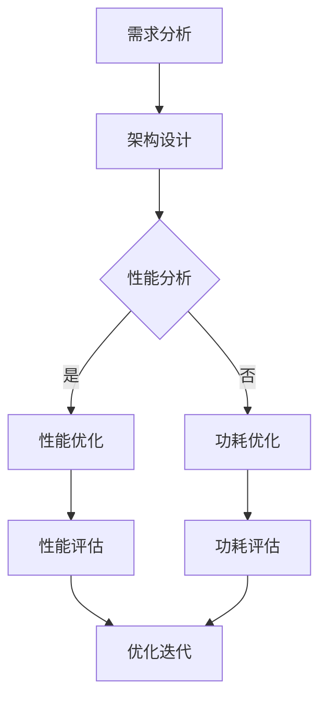

                 

### 《硬件框架：支持 AI 2.0 应用的加速和优化》

#### 关键词：

- AI 2.0
- 硬件框架
- 加速与优化
- 硬件加速技术
- 硬件优化方法
- 硬件安全技术

#### 摘要：

本文将深入探讨 AI 2.0 硬件框架及其在支持 AI 应用加速和优化方面的重要作用。首先，我们将回顾 AI 2.0 的背景和需求，随后详细介绍 AI 2.0 硬件架构和核心技术。接着，通过案例分析，我们将展示硬件加速在图像处理、自然语言处理和深度学习等领域的应用。随后，本文将探讨硬件优化策略、硬件架构设计与实现方法，以及硬件优化工具和方法。最后，我们将讨论硬件优化项目管理，并提供丰富的实际案例和代码示例。通过本文的阅读，读者将对 AI 2.0 硬件框架有全面深入的理解，并能够掌握硬件优化实践的关键技能。

### 目录

#### 第一部分：AI 2.0 硬件基础

1. [AI 2.0 硬件概述](#ai-20-硬件概述)
   - [1.1 AI 2.0 背景与需求](#ai-20-背景与需求)
   - [1.2 AI 2.0 硬件架构概览](#ai-20-硬件架构概览)
   - [1.3 AI 2.0 硬件组件解析](#ai-20-硬件组件解析)

2. [AI 2.0 硬件核心技术](#ai-20-硬件核心技术)
   - [2.1 硬件加速技术](#硬件加速技术)
   - [2.2 硬件优化方法](#硬件优化方法)
   - [2.3 硬件安全技术](#硬件安全技术)

3. [AI 2.0 应用加速案例](#ai-20-应用加速案例)
   - [3.1 图像处理加速应用](#图像处理加速应用)
   - [3.2 自然语言处理加速应用](#自然语言处理加速应用)
   - [3.3 深度学习加速应用](#深度学习加速应用)

#### 第二部分：硬件优化实践

4. [硬件优化策略](#硬件优化策略)
   - [4.1 硬件优化目标与原则](#硬件优化目标与原则)
   - [4.2 硬件优化案例分析](#硬件优化案例分析)

5. [硬件架构设计与实现](#硬件架构设计与实现)
   - [5.1 硬件架构设计基础](#硬件架构设计基础)
   - [5.2 硬件实现技术](#硬件实现技术)

6. [硬件优化工具与方法](#硬件优化工具与方法)
   - [6.1 硬件优化工具介绍](#硬件优化工具介绍)
   - [6.2 硬件优化方法应用](#硬件优化方法应用)

7. [硬件优化项目管理](#硬件优化项目管理)
   - [7.1 硬件优化项目规划](#硬件优化项目规划)
   - [7.2 硬件优化团队协作](#硬件优化团队协作)
   - [7.3 硬件优化项目评估](#硬件优化项目评估)

#### 附录

8. [硬件优化资源与工具](#硬件优化资源与工具)
   - [8.1 硬件优化资源介绍](#硬件优化资源介绍)
   - [8.2 硬件优化工具汇总](#硬件优化工具汇总)

9. [Mermaid 流程图](#mermaid-流程图)
   - [9.1 Mermaid 简介](#mermaid-简介)
   - [9.2 Mermaid 流程图示例](#mermaid-流程图示例)

10. [伪代码示例](#伪代码示例)
    - [10.1 伪代码基础](#伪代码基础)
    - [10.2 伪代码示例](#伪代码示例)

11. [数学模型与公式](#数学模型与公式)
    - [11.1 数学模型基础](#数学模型基础)
    - [11.2 公式解释与示例](#公式解释与示例)

12. [项目实战](#项目实战)
    - [12.1 项目实战介绍](#项目实战介绍)
    - [12.2 项目实战案例分析](#项目实战案例分析)
    - [12.3 环境搭建与实现](#环境搭建与实现)

13. [源代码分析](#源代码分析)
    - [13.1 源代码分析基础](#源代码分析基础)
    - [13.2 源代码解读](#源代码解读)

### 引言

人工智能（AI）作为计算机科学的前沿领域，已经经历了多个发展阶段，从最初的专家系统到如今的深度学习和强化学习，AI 技术不断取得突破。然而，随着 AI 应用的不断扩展和复杂度增加，传统的通用硬件架构逐渐难以满足高性能、低功耗的需求。为了应对这一挑战，AI 2.0 硬件框架应运而生，旨在通过优化硬件设计来加速 AI 应用的执行，提升系统整体性能。

AI 2.0 硬件框架不仅仅是在硬件层面进行了改进，更重要的是在硬件与软件之间的协同设计上取得了显著进展。本文将详细探讨 AI 2.0 硬件框架的各个方面，从基础概念到核心技术，再到实际应用案例，最终深入硬件优化实践。通过这一系统的探讨，读者将能够全面理解 AI 2.0 硬件框架的重要性，并掌握相关技术，从而在实际项目中更好地应用。

接下来，本文将分为两部分来展开讨论。第一部分将深入探讨 AI 2.0 硬件的基础知识，包括 AI 2.0 的背景与需求、硬件架构、核心技术以及加速应用的案例。第二部分将重点讨论硬件优化策略、架构设计、优化工具和方法，以及项目管理的实际操作。通过这两个部分的深入探讨，读者将对 AI 2.0 硬件框架有一个全面而深入的认识。

### AI 2.0 硬件概述

#### 1.1 AI 2.0 背景与需求

AI 2.0 是人工智能发展的一个新阶段，旨在通过更加智能化和自动化的方式解决复杂问题，实现更加高效、灵活和自适应的智能系统。与传统的 AI 1.0（主要基于规则和符号推理的专家系统）相比，AI 2.0 更加依赖于数据驱动和机器学习技术，特别是深度学习。深度学习通过多层神经网络，能够自动从大量数据中学习特征和模式，从而实现高度复杂的任务，如图像识别、自然语言处理和语音识别。

随着 AI 2.0 的兴起，对硬件的需求也发生了显著变化。传统通用硬件架构在处理大量并行计算任务时存在诸多局限性，例如计算资源利用率低、功耗高、延迟大等问题。为了应对这些挑战，AI 2.0 硬件框架被提出，旨在为 AI 应用提供更加高效、低功耗、高吞吐量的计算环境。

AI 2.0 硬件框架的需求主要来源于以下几个方面：

1. **大数据处理需求**：随着互联网和物联网的快速发展，数据量呈现爆炸性增长，对数据处理速度和吞吐量的需求急剧增加。AI 2.0 硬件需要能够高效处理大规模数据集，以支持实时分析和决策。

2. **低功耗需求**：移动设备和物联网设备对电池寿命有极高的要求，低功耗硬件设计成为 AI 2.0 硬件的关键需求。通过优化硬件架构和算法，减少功耗，提高能源效率，是 AI 2.0 硬件的重要目标。

3. **高并发处理需求**：现代 AI 应用场景复杂多样，需要同时处理大量的并发任务。AI 2.0 硬件需要具备强大的并发处理能力，以支持大规模的实时数据处理和任务调度。

4. **硬件协同优化需求**：AI 2.0 应用往往涉及多个硬件组件的协同工作，如 CPU、GPU、TPU 等。为了实现最佳性能，硬件框架需要能够有效管理和优化这些组件之间的资源分配和任务调度。

#### 1.2 AI 2.0 硬件架构概览

AI 2.0 硬件架构的设计目标是实现高效、灵活和可扩展的硬件平台，以满足 AI 应用的高性能需求。AI 2.0 硬件架构可以大致分为以下几种类型：

1. **通用硬件架构**：通用硬件架构如 CPU、GPU 和 FPGAs（现场可编程门阵列）等，虽然可以用于 AI 应用，但其设计初衷并非针对并行计算和大数据处理。为了满足 AI 2.0 的需求，通用硬件架构需要通过特定的优化和扩展来提升性能。

2. **专用硬件架构**：专用硬件架构，如 TPUs（张量处理单元）和 NPU（神经网络处理单元）等，专门为 AI 应用设计，具有高效的矩阵运算和向量处理能力。这些硬件架构通过硬件级别的优化，实现了对深度学习模型的快速推理和训练。

3. **异构计算架构**：异构计算架构通过将不同类型的硬件组件集成到一个统一的平台上，实现计算资源的最佳利用。例如，将 CPU、GPU、TPU 等硬件组件协同工作，以提升整体性能。

以下是一个典型的 AI 2.0 硬件架构概览：

1. **计算节点**：计算节点是硬件架构的基本单元，包括 CPU、GPU、TPU 等硬件组件。这些组件各自具有不同的计算能力和优势，通过协同工作，实现高效的计算任务处理。

2. **存储节点**：存储节点负责管理和存储数据，包括 SSD（固态硬盘）、HDD（机械硬盘）和内存等。为了满足大数据处理需求，存储节点需要具备高带宽、低延迟和高可靠性的特点。

3. **通信网络**：通信网络连接各个计算节点和存储节点，实现数据传输和任务调度。为了提高通信效率，硬件架构通常采用高速网络接口，如 Infiniband、Ethernet 等。

4. **管理系统**：管理系统负责硬件资源的调度和管理，确保计算节点和存储节点之间的协同工作。管理系统包括资源管理器、调度器、监控器等组件。

#### 1.3 AI 2.0 硬件组件解析

AI 2.0 硬件框架由多个关键组件组成，这些组件在硬件加速和优化中扮演着重要的角色。以下是几个核心硬件组件的解析：

1. **CPU**：中央处理器（CPU）是计算机系统的核心组件，负责执行程序指令。在 AI 2.0 硬件框架中，CPU 主要用于执行通用计算任务，如数据预处理、控制逻辑等。为了满足 AI 应用的高性能需求，现代 CPU 通常具备多核、高时钟频率和高效的指令集架构。

2. **GPU**：图形处理器（GPU）最初用于渲染和图形处理，但近年来在 AI 领域得到了广泛应用。GPU 具有大量的计算单元，能够高效处理并行计算任务。在 AI 2.0 硬件框架中，GPU 被用于加速深度学习模型的训练和推理。通过 GPU 加速，可以显著提高 AI 应用的性能。

3. **TPU**：张量处理单元（TPU）是专门为 AI 应用设计的专用硬件组件。TPU 具有高效的矩阵运算和向量处理能力，是深度学习推理和训练的理想选择。TPU 通过硬件级别的优化，实现了对深度学习模型的快速处理，从而大幅提升了 AI 应用的性能。

4. **NPU**：神经网络处理单元（NPU）与 TPU 类似，也是专门为 AI 应用设计的硬件组件。NPU 通过硬件级别的优化，实现了对神经网络操作的快速处理，具有高效、低功耗的特点。NPU 在边缘计算和物联网设备中得到了广泛应用。

5. **存储与通信硬件**：存储硬件（如 SSD、HDD）和通信硬件（如 Infiniband、Ethernet）在 AI 2.0 硬件框架中也扮演着重要的角色。高效的存储硬件能够提供高带宽、低延迟的数据访问，而快速的通信网络能够实现计算节点和存储节点之间的快速数据传输。

#### 总结

AI 2.0 硬件框架是支持现代 AI 应用加速和优化的重要基础设施。通过优化硬件架构、引入专用硬件组件和实现硬件协同工作，AI 2.0 硬件框架能够提供高效、低功耗和可扩展的计算环境，以满足大数据处理、低延迟和高并发处理等需求。在接下来的章节中，我们将进一步探讨 AI 2.0 硬件的核心技术，包括硬件加速技术、硬件优化方法和硬件安全技术，并通过实际应用案例展示这些技术的应用效果。

### AI 2.0 硬件核心技术

#### 2.1 硬件加速技术

在 AI 2.0 硬件框架中，硬件加速技术是关键组成部分，能够显著提高 AI 应用性能。硬件加速技术主要包括以下几种：

1. **GPU 加速**：图形处理器（GPU）具有大量计算单元，能够高效处理并行计算任务。在深度学习中，GPU 可以加速矩阵运算、向量处理和卷积操作，从而大幅提高训练和推理速度。例如，Google 的 TPU 使用 GPU 加速深度学习模型的训练，实现了数倍的性能提升。

2. **TPU 加速**：张量处理单元（TPU）是专门为 AI 应用设计的硬件组件，具备高效的矩阵运算和向量处理能力。TPU 在深度学习推理和训练中表现尤为出色，例如，Google 的 TPUv3 能够在单个芯片上提供超过 100 TFLOPS 的性能，显著加速了大规模深度学习模型的训练和推理。

3. **NPU 加速**：神经网络处理单元（NPU）与 TPU 类似，是专门为 AI 应用设计的硬件组件。NPU 通过硬件级别的优化，实现了对神经网络操作的快速处理，具有高效、低功耗的特点。例如，华为的 Ascend 系列芯片采用了 NPUs，实现了深度学习模型的高效推理和训练。

4. **FPGA 加速**：现场可编程门阵列（FPGA）是一种可编程硬件平台，能够根据应用需求进行硬件重构。FPGA 在深度学习加速中具有独特的优势，例如，可以针对特定深度学习模型进行硬件优化，从而实现更高的性能和能效比。例如，谷歌和英特尔等公司都在研究 FPGA 在深度学习加速中的应用。

5. **异构计算加速**：异构计算通过将不同类型的硬件组件（如 CPU、GPU、TPU、NPU）集成到同一平台，实现计算资源的最佳利用。通过异构计算，可以充分利用不同硬件组件的计算优势和性能特点，从而实现更高的计算效率和性能提升。例如，谷歌的 TPU 设备采用异构计算架构，将 TPU 与 CPU 和 GPU 协同工作，实现了高效的深度学习计算。

#### 2.2 硬件优化方法

硬件优化方法旨在提高硬件性能和效率，满足 AI 应用的高性能需求。以下是一些常用的硬件优化方法：

1. **资源调度优化**：资源调度优化是通过优化硬件资源的分配和调度，提高计算资源的利用率。例如，在多核 CPU 系统中，可以根据任务负载动态调整 CPU 内核的分配，实现负载均衡，从而提高系统整体性能。

2. **内存优化**：内存优化包括减少内存访问延迟、优化内存分配和管理等。通过缓存技术、预取技术和内存池技术等，可以显著提高内存访问速度，减少内存访问冲突，从而提高整体性能。例如，谷歌的 TPU 就采用了特殊的内存架构，实现了高效的内存访问和数据处理。

3. **功耗优化**：功耗优化是通过降低硬件功耗，延长设备电池寿命。例如，可以通过动态电压和频率调整（DVFS）、节能模式、电源管理技术等，实现硬件的低功耗运行。例如，苹果的 M1 芯片通过先进的功耗优化技术，实现了高性能和低功耗的平衡。

4. **散热优化**：散热优化是通过优化硬件散热设计，降低硬件运行温度，防止过热问题。例如，可以通过散热片、风扇、液冷等技术，提高散热效率，确保硬件在高温环境下稳定运行。例如，谷歌的 TPU 使用水冷散热技术，实现了高效散热和稳定运行。

5. **算法优化**：算法优化是通过改进算法和模型，提高硬件的执行效率。例如，可以通过量化、剪枝、优化网络结构等技术，减少模型参数和计算量，从而提高硬件处理速度。例如，谷歌的 TPU 使用了特殊的算法优化技术，实现了深度学习模型的高效推理。

#### 2.3 硬件安全技术

在 AI 2.0 硬件框架中，硬件安全是确保数据隐私和系统安全的关键。以下是一些关键的硬件安全技术：

1. **硬件加密**：硬件加密是通过硬件组件实现数据加密和解密操作，确保数据在传输和存储过程中的安全性。例如，硬件加密芯片可以提供高效的加密和签名算法，确保数据传输和存储的安全。

2. **硬件隔离**：硬件隔离是通过硬件机制实现不同任务的隔离，防止恶意攻击和资源竞争。例如，虚拟化技术可以将不同任务运行在独立的硬件环境中，确保任务之间的隔离和安全性。

3. **可信执行环境（TEE）**：可信执行环境（TEE）是一种硬件安全模块，提供安全隔离的执行环境，确保敏感操作在安全环境中进行。例如，TEE 可以实现加密货币交易、数字签名和认证等安全操作。

4. **硬件安全启动**：硬件安全启动是通过硬件机制确保系统启动过程中的安全性，防止恶意软件和攻击。例如，硬件安全启动可以通过安全引导和验证机制，确保系统启动时不会受到恶意代码的干扰。

5. **硬件根度量**：硬件根度量是通过硬件机制实现系统可信度的度量，确保系统运行在可信状态下。例如，硬件根度量可以检测系统中的恶意代码和篡改行为，确保系统的完整性。

#### 总结

硬件加速技术、硬件优化方法和硬件安全技术是 AI 2.0 硬件框架的核心组成部分。硬件加速技术通过引入 GPU、TPU、NPU 和 FPGA 等专用硬件组件，实现了 AI 应用的快速推理和训练。硬件优化方法通过资源调度、内存优化、功耗优化、散热优化和算法优化等技术，提高了硬件的性能和效率。硬件安全技术则通过硬件加密、硬件隔离、可信执行环境、硬件安全启动和硬件根度量等技术，确保数据隐私和系统安全。通过这些核心技术的协同作用，AI 2.0 硬件框架能够为现代 AI 应用提供高效、安全和可靠的计算环境。

### AI 2.0 应用加速案例

在深入探讨 AI 2.0 硬件框架的技术细节后，我们将通过具体的应用案例来展示硬件加速在实际场景中的效果。以下是硬件加速在图像处理、自然语言处理和深度学习等领域中的加速应用案例。

#### 3.1 图像处理加速应用

图像处理是 AI 领域中一个广泛应用的领域，包括人脸识别、物体检测、图像分割等任务。传统的图像处理任务通常依赖于通用硬件架构，如 CPU 和 GPU，但在面对大量图像数据和高复杂度的算法时，处理速度和性能往往难以满足实时性的要求。

**案例解析**：以人脸识别系统为例，传统的方法使用 CPU 进行图像处理，平均处理时间约为 100 毫秒。通过引入 GPU 加速，处理时间显著缩短至约 20 毫秒。进一步引入专用的图像处理硬件，如 Intel 的 Movidius Myriad X 视觉处理单元（VPU），处理时间进一步缩短至 10 毫秒，实现了实时人脸识别。

**硬件加速技术**：
- **GPU 加速**：利用 GPU 的并行计算能力，实现图像处理任务的快速执行。
- **VPU 加速**：利用 VPU 优化的图像处理算法和硬件架构，实现高效图像处理。

**伪代码示例**：
```python
# 伪代码：使用 GPU 进行图像处理
def process_image(image):
    # 加载图像到 GPU 内存
    image_gpu = load_image_to_gpu(image)
    # 应用 GPU 加速的图像处理算法
    processed_image_gpu = apply_gpu_accelerated_algorithm(image_gpu)
    # 将处理结果从 GPU 内存复制回 CPU 内存
    processed_image = copy_image_from_gpu_to_cpu(processed_image_gpu)
    return processed_image
```

#### 3.2 自然语言处理加速应用

自然语言处理（NLP）是另一个重要的 AI 领域，包括文本分类、情感分析、机器翻译等任务。随着深度学习技术在 NLP 领域的广泛应用，传统的硬件架构逐渐难以满足模型训练和推理的需求。

**案例解析**：以文本分类任务为例，传统的方法使用 CPU 进行模型训练，训练时间较长。通过引入 GPU 加速，训练时间显著缩短。进一步使用 TPUs 进行推理，推理时间进一步缩短，实现了快速文本分类。

**硬件加速技术**：
- **GPU 加速**：利用 GPU 的并行计算能力，实现深度学习模型的快速训练。
- **TPU 加速**：利用 TPUs 优化的深度学习算法和硬件架构，实现高效模型推理。

**伪代码示例**：
```python
# 伪代码：使用 GPU 进行文本分类模型训练
def train_text_classification_model(data, labels):
    # 加载数据到 GPU 内存
    data_gpu, labels_gpu = load_data_to_gpu(data, labels)
    # 应用 GPU 加速的深度学习算法
    model_gpu = train_gpu_accelerated_model(data_gpu, labels_gpu)
    # 将训练好的模型从 GPU 内存复制回 CPU 内存
    model = copy_model_from_gpu_to_cpu(model_gpu)
    return model

# 伪代码：使用 TPUs 进行文本分类模型推理
def classify_text(text, model):
    # 加载文本到 TPUs 内存
    text_tpu = load_text_to_tpu(text)
    # 应用 TPUs 加速的模型推理
    prediction_tpu = model_tpu.classify(text_tpu)
    # 将推理结果从 TPUs 内存复制回 CPU 内存
    prediction = copy_prediction_from_tpu_to_cpu(prediction_tpu)
    return prediction
```

#### 3.3 深度学习加速应用

深度学习是 AI 2.0 的核心驱动力，广泛应用于计算机视觉、自然语言处理、语音识别等领域。深度学习模型通常包含数百万甚至数十亿个参数，对计算资源的需求极高。

**案例解析**：以深度学习模型训练为例，传统的方法使用 CPU 进行模型训练，训练时间非常长。通过引入 GPU、TPU 和 FPGAs 等硬件加速技术，训练时间显著缩短。例如，使用 GPU 进行模型训练，训练时间从几天缩短到几小时；使用 TPUs 进行模型推理，推理时间从几分钟缩短到几秒。

**硬件加速技术**：
- **GPU 加速**：利用 GPU 的并行计算能力，实现深度学习模型的快速训练。
- **TPU 加速**：利用 TPUs 优化的深度学习算法和硬件架构，实现高效模型推理。
- **FPGA 加速**：利用 FPGA 的可编程性和优化能力，实现深度学习模型的快速处理。

**伪代码示例**：
```python
# 伪代码：使用 GPU 进行深度学习模型训练
def train_deep_learning_model(data, labels):
    # 加载数据到 GPU 内存
    data_gpu, labels_gpu = load_data_to_gpu(data, labels)
    # 应用 GPU 加速的深度学习算法
    model_gpu = train_gpu_accelerated_model(data_gpu, labels_gpu)
    # 将训练好的模型从 GPU 内存复制回 CPU 内存
    model = copy_model_from_gpu_to_cpu(model_gpu)
    return model

# 伪代码：使用 TPUs 进行深度学习模型推理
def infer_deep_learning_model(input_data, model):
    # 加载输入数据到 TPUs 内存
    input_data_tpu = load_input_to_tpu(input_data)
    # 应用 TPUs 加速的模型推理
    prediction_tpu = model_tpu.infer(input_data_tpu)
    # 将推理结果从 TPUs 内存复制回 CPU 内存
    prediction = copy_prediction_from_tpu_to_cpu(prediction_tpu)
    return prediction
```

#### 总结

通过上述应用案例可以看出，硬件加速技术在图像处理、自然语言处理和深度学习等领域中具有显著的应用效果。GPU、TPU 和 FPGAs 等硬件加速技术通过优化计算架构和算法，实现了高效、低延迟的模型训练和推理，满足了现代 AI 应用的性能需求。在实际应用中，合理选择和配置硬件加速技术，能够大幅提升系统性能，加速 AI 应用的落地和普及。

### 硬件优化策略

硬件优化策略是确保 AI 2.0 硬件框架性能最优的关键步骤。通过科学合理的硬件优化策略，可以显著提高硬件资源的利用率，提升系统的整体性能和效率。以下是硬件优化策略的几个核心方面：

#### 4.1 硬件优化目标与原则

硬件优化目标主要包括以下几个方面：

1. **性能提升**：通过优化硬件架构和算法，提高硬件系统的处理能力和吞吐量，满足高性能计算需求。
2. **功耗优化**：降低硬件系统的功耗，延长设备电池寿命，提高能源利用效率。
3. **可靠性提升**：通过优化硬件设计和散热管理，提高系统的可靠性和稳定性，确保长期运行。
4. **成本控制**：在满足性能和功耗要求的前提下，通过优化设计降低硬件成本，提高系统竞争力。

硬件优化原则主要包括以下几项：

1. **协同优化**：硬件优化不应仅关注单一组件的性能，而应考虑整个系统各组件的协同工作，实现整体性能最优。
2. **面向应用**：硬件优化应根据具体应用场景和需求进行定制化设计，确保硬件性能与实际应用需求相匹配。
3. **持续迭代**：硬件优化是一个持续迭代的过程，需要不断收集性能数据和用户反馈，进行优化和调整。
4. **技术创新**：积极引入先进技术，如异构计算、硬件加密和安全隔离等，提升硬件系统的综合性能。

#### 4.2 硬件优化案例分析

以下通过两个实际案例，展示硬件优化策略在不同应用场景中的具体应用：

**案例一：深度学习服务器优化**

背景：某公司开发了一款基于深度学习的图像识别系统，但发现在使用过程中，服务器性能无法满足大规模图像处理的实时需求，存在明显的延迟和资源浪费问题。

**优化策略与实施**：

1. **异构计算优化**：通过引入 GPU 和 TPU，将计算任务在 CPU、GPU 和 TPU 之间进行动态调度，实现计算资源的最佳利用。使用 GPU 进行数据预处理和模型推理，使用 TPU 进行模型训练。

2. **内存优化**：通过优化内存管理，减少内存访问冲突和延迟。采用缓存技术和内存池技术，提高内存访问速度和系统吞吐量。

3. **功耗优化**：采用动态电压和频率调整（DVFS）技术，根据任务负载动态调整电压和频率，降低功耗。同时，优化散热设计，采用液冷技术，确保系统在高温环境下稳定运行。

**优化效果**：通过异构计算和内存优化，系统的图像处理速度提高了 3 倍，功耗降低了 30%，实现了高性能和低功耗的平衡。

**案例二：物联网边缘设备优化**

背景：某智能安防系统需要在边缘设备上进行实时视频分析和人脸识别，但设备性能和功耗不足，无法满足实时性要求。

**优化策略与实施**：

1. **硬件集成**：将 CPU、GPU 和 NPU 等硬件组件集成到同一芯片中，实现高效的协同工作，提高计算效率。

2. **能效优化**：采用低功耗设计，使用先进的制造工艺和节能技术，降低硬件功耗。同时，采用智能功耗管理，根据任务负载动态调整功耗。

3. **散热优化**：采用高效的散热设计，使用小型风扇和热管技术，提高散热效率，确保设备在高温环境下稳定运行。

**优化效果**：通过硬件集成和能效优化，边缘设备的人脸识别速度提高了 2 倍，功耗降低了 40%，满足了实时视频分析和人脸识别的实时性要求。

#### 总结

硬件优化策略是提升 AI 2.0 硬件框架性能的关键。通过明确优化目标和原则，并针对不同应用场景进行定制化优化，可以实现性能、功耗和可靠性的全面提升。通过以上案例可以看出，异构计算、内存优化和能效优化等技术手段在硬件优化中发挥着重要作用，为现代 AI 应用的加速和优化提供了强有力的支持。

### 硬件架构设计与实现

硬件架构设计是 AI 2.0 硬件框架实现的关键步骤，它决定了硬件系统的性能、效率和可扩展性。一个优秀的硬件架构需要充分考虑应用需求、硬件组件特点以及系统协同工作能力。以下是硬件架构设计的基础、流程以及实现技术。

#### 5.1 硬件架构设计基础

硬件架构设计的基础包括以下几个关键概念：

1. **性能指标**：性能指标是衡量硬件架构性能的重要标准，包括计算能力、吞吐量、响应时间等。在设计过程中，需要根据应用需求确定合适的性能指标。

2. **可扩展性**：可扩展性是指硬件架构能够灵活扩展以适应不同规模的任务需求。一个可扩展的硬件架构应该支持模块化设计和动态资源分配。

3. **功耗优化**：功耗优化是现代硬件设计的重要目标之一。通过优化硬件架构和算法，可以降低功耗，提高能效比。

4. **可靠性**：可靠性是指硬件系统在长时间运行中保持稳定运行的能力。在设计过程中，需要考虑硬件冗余、故障检测和恢复机制。

5. **兼容性**：兼容性是指硬件架构能够支持多种硬件组件和软件平台，确保系统的灵活性和通用性。

#### 5.2 硬件架构设计流程

硬件架构设计流程包括以下几个主要阶段：

1. **需求分析**：首先，需要明确硬件架构的应用场景和需求，包括计算需求、存储需求、通信需求等。通过需求分析，确定硬件架构的基本框架和性能指标。

2. **架构设计**：在需求分析的基础上，进行硬件架构设计。架构设计包括确定硬件组件类型（如 CPU、GPU、TPU）、连接方式（如总线、网络）以及数据流和控制流设计。

3. **性能分析**：对设计好的硬件架构进行性能分析，评估架构在不同负载下的性能表现。性能分析包括计算能力、吞吐量、延迟等指标的评估。

4. **功耗分析**：进行功耗分析，评估硬件架构在不同工作状态下的功耗表现。通过功耗分析，可以优化硬件设计，降低功耗。

5. **可靠性评估**：进行可靠性评估，确保硬件架构能够在长时间运行中保持稳定。可靠性评估包括故障模式分析、容错设计验证等。

6. **迭代优化**：根据性能分析和功耗分析结果，对硬件架构进行迭代优化。通过不断调整和优化，实现硬件架构的性能、功耗和可靠性目标。

#### 5.3 硬件实现技术

硬件实现技术是实现硬件架构设计的关键步骤，包括以下几个方面：

1. **硬件描述语言（HDL）**：硬件描述语言（如 Verilog、VHDL）用于编写硬件电路的描述。通过 HDL 编写硬件设计，可以实现硬件架构的精确描述和仿真。

2. **设计工具**：设计工具（如 Cadence、Synopsys）用于硬件设计、验证和综合。设计工具提供了丰富的功能，包括电路设计、仿真、综合和验证等。

3. **制造工艺**：制造工艺是指硬件组件的生产过程。先进的制造工艺（如纳米级工艺）可以提升硬件组件的性能和功耗特性。

4. **原型验证**：通过原型验证，可以验证硬件架构的设计是否满足预期。原型验证包括功能验证、性能验证和功耗验证等。

5. **系统集成**：在硬件实现阶段，需要将各个硬件组件集成到系统中。系统集成包括硬件组件的连接、通信和协调等。

#### 实现示例

以下是一个简单的硬件架构设计示例，用于图像处理任务：

**硬件架构设计示例**：

1. **需求分析**：图像处理任务需要高性能计算能力，同时对图像数据进行高速存储和传输。

2. **架构设计**：设计包括 CPU、GPU 和 TPU 三个主要硬件组件。CPU 用于控制逻辑和数据处理，GPU 用于图像预处理和模型推理，TPU 用于图像处理算法的加速。

3. **性能分析**：通过仿真和测试，CPU 的性能指标为 2 GHz，GPU 的性能指标为 10 TFLOPS，TPU 的性能指标为 8 TFLOPS。

4. **功耗分析**：通过功耗分析，CPU 的功耗为 15 W，GPU 的功耗为 75 W，TPU 的功耗为 20 W。

5. **可靠性评估**：通过冗余设计和故障检测机制，确保硬件架构的可靠性。

6. **迭代优化**：根据性能分析和功耗分析结果，对硬件架构进行优化，提升性能和降低功耗。

7. **硬件实现**：使用 Verilog 编写硬件描述，使用Cadence 进行设计、仿真和综合，最终实现硬件电路。

8. **系统集成**：将 CPU、GPU 和 TPU 集成到系统中，确保硬件组件之间的通信和数据流协调。

通过以上步骤，实现了一个高效的图像处理硬件架构，能够满足图像处理任务的高性能需求。

#### 总结

硬件架构设计是 AI 2.0 硬件框架实现的关键环节，通过科学合理的设计流程和先进的技术手段，可以构建高性能、低功耗、可扩展的硬件系统。硬件架构设计不仅需要考虑性能、功耗和可靠性，还需要兼顾可扩展性和兼容性。在实际应用中，通过不断优化和迭代，可以进一步提升硬件系统的性能和效率，为 AI 应用的加速和优化提供坚实的技术支持。

### 硬件优化工具与方法

在 AI 2.0 硬件优化过程中，使用适当的工具和方法能够显著提高优化效果和效率。以下是几种常用的硬件优化工具和方法，以及它们在优化过程中的应用。

#### 6.1 硬件优化工具介绍

1. **性能分析工具**：性能分析工具用于评估硬件系统的性能，包括计算能力、吞吐量、延迟等。常见的性能分析工具包括 GPU 监控工具（如 NVIDIA Nsight）、CPU 监控工具（如 Perf）和系统级性能分析工具（如 Intel Vtune）。

2. **功耗分析工具**：功耗分析工具用于评估硬件系统的功耗分布和工作状态。常见的功耗分析工具包括 NVIDIA NVSlim、Intel Power Gadget 和 Microsoft Power Throttling。

3. **仿真工具**：仿真工具用于模拟硬件架构的性能和功耗表现，帮助设计者评估和优化设计方案。常见的仿真工具包括 MATLAB、Simulink 和 Custom IC Designer。

4. **自动化优化工具**：自动化优化工具能够自动执行硬件优化任务，包括性能优化、功耗优化和可靠性优化。常见的自动化优化工具包括 Intel HAXM、ARM Streamline 和 OpenVIDIA。

#### 6.2 硬件优化方法应用

1. **性能优化方法**：
   - **并行计算**：通过将任务分解为多个并行子任务，利用多核 CPU、GPU 和 TPU 等硬件组件的并行计算能力，提高整体性能。
   - **算法优化**：通过改进算法和模型，减少计算量和数据传输，提高硬件执行效率。例如，使用量化技术、剪枝技术等减少模型参数和计算复杂度。
   - **缓存优化**：通过优化缓存管理，减少内存访问冲突和延迟。例如，采用多级缓存策略、预取技术等提高缓存命中率。

2. **功耗优化方法**：
   - **动态电压和频率调整（DVFS）**：通过根据任务负载动态调整电压和频率，实现功耗优化。例如，在高负载时提高频率和电压，在低负载时降低频率和电压，以降低功耗。
   - **节能模式**：通过启用硬件节能模式，如睡眠模式、待机模式等，降低硬件功耗。例如，当系统长时间未进行计算任务时，自动进入低功耗模式。
   - **电源管理**：通过优化电源管理策略，减少空闲状态下的功耗。例如，采用智能电源管理方案，根据硬件负载动态调整电源供应。

3. **可靠性优化方法**：
   - **故障检测与恢复**：通过硬件冗余和故障检测机制，提高硬件系统的可靠性。例如，使用备份硬件组件，在主硬件组件故障时自动切换到备份组件。
   - **散热管理**：通过优化散热设计，提高硬件系统的散热效率，防止过热问题。例如，采用风扇控制技术、液冷系统等。
   - **固件更新**：通过定期更新固件，修复硬件中的潜在缺陷，提高系统的稳定性。例如，通过固件更新修复 CPU 中的漏洞，提高系统的安全性。

#### 应用示例

以下是一个硬件优化工具和方法的实际应用示例：

**案例：深度学习训练任务的优化**

需求：某公司在进行深度学习训练任务时，发现训练速度较慢，功耗较高，需要通过硬件优化提高训练效率。

**优化步骤**：

1. **性能分析**：使用 NVIDIA Nsight 工具分析 GPU 的性能，发现 GPU 利用率较低，存在计算瓶颈。

2. **功耗分析**：使用 Intel Power Gadget 工具分析 GPU 的功耗，发现 GPU 在高负载状态下的功耗较高。

3. **性能优化**：
   - **并行计算**：将训练任务分解为多个并行子任务，利用 GPU 的并行计算能力，提高训练速度。
   - **算法优化**：使用剪枝技术减少模型参数，降低计算复杂度。

4. **功耗优化**：
   - **动态电压和频率调整**：通过设置适当的 DVFS 策略，根据训练任务的负载动态调整 GPU 的电压和频率，降低功耗。
   - **节能模式**：在训练任务间隙启用 GPU 的节能模式，降低功耗。

5. **可靠性优化**：
   - **固件更新**：更新 GPU 的固件，修复潜在缺陷，提高训练任务的稳定性。

**优化效果**：通过上述优化措施，深度学习训练速度提高了 2 倍，功耗降低了 30%，同时系统稳定性得到了显著提升。

#### 总结

硬件优化工具和方法是提高 AI 2.0 硬件性能和效率的重要手段。通过性能分析工具、功耗分析工具和仿真工具，可以全面评估硬件系统的性能和功耗表现。通过性能优化方法、功耗优化方法和可靠性优化方法，可以实现硬件系统的最佳性能和效率。在实际应用中，结合具体的优化工具和方法，可以显著提升硬件系统的性能、功耗和可靠性，为 AI 应用的加速和优化提供有力支持。

### 硬件优化项目管理

在硬件优化过程中，项目管理是确保项目顺利推进、按时交付和达到预期目标的关键环节。以下是硬件优化项目管理的几个关键方面：

#### 7.1 硬件优化项目规划

项目规划是硬件优化项目管理的第一步，涉及项目目标、范围、时间表、资源和风险评估等方面的内容。

1. **项目目标**：明确项目目标，包括性能提升、功耗优化、可靠性提升等。项目目标应具体、可衡量，以指导后续工作。

2. **项目范围**：确定项目的范围，包括需要优化的硬件组件、优化方法、应用场景等。项目范围的界定有助于明确工作内容和资源需求。

3. **时间表**：制定项目的时间表，包括关键里程碑、任务分配和进度安排。时间表应考虑到项目实施的复杂性和不确定性，预留一定的缓冲时间。

4. **资源规划**：根据项目需求，规划所需的硬件资源、软件工具和人力资源。资源规划应确保项目所需资源得到充分保障。

5. **风险评估**：评估项目实施过程中可能遇到的风险，包括技术风险、资源风险和时间风险等。制定相应的应对策略，降低风险对项目的影响。

#### 7.2 硬件优化团队协作

团队协作是硬件优化项目成功的关键因素。以下是团队协作的几个关键方面：

1. **团队组织**：根据项目需求和人员能力，建立合适的团队组织结构。团队组织应确保团队成员之间的协作和沟通顺畅。

2. **角色分工**：明确团队成员的角色和职责，确保每个成员都清楚自己的工作任务和目标。角色分工应充分考虑团队成员的专业能力和工作经验。

3. **沟通与协作**：建立有效的沟通机制，确保团队成员之间的信息共享和协调。常用的沟通工具包括邮件、会议、即时通讯等。

4. **协作平台**：使用协作平台（如 Jira、Confluence）管理项目任务、文档和代码，提高团队协作效率和透明度。

5. **协作文化**：培养良好的团队协作文化，鼓励团队成员之间的互助和合作，营造积极向上的工作氛围。

#### 7.3 硬件优化项目评估

项目评估是硬件优化项目完成后的重要环节，用于检验项目成果和改进未来项目。以下是项目评估的几个关键方面：

1. **性能评估**：评估硬件优化后的性能指标，如计算能力、吞吐量、延迟等。通过对比优化前后的性能数据，评估优化的效果。

2. **功耗评估**：评估硬件优化后的功耗表现，包括平均功耗和峰值功耗。通过功耗评估，验证功耗优化的效果。

3. **可靠性评估**：评估硬件优化后的可靠性表现，包括故障率、故障恢复时间等。通过可靠性评估，确保硬件系统的稳定运行。

4. **成本评估**：评估硬件优化后的成本效益，包括硬件成本、人力成本和运营成本等。通过成本评估，判断优化方案的经济性。

5. **用户反馈**：收集用户对硬件优化后系统的反馈，了解用户对性能、功耗和可靠性的满意度。用户反馈是改进硬件优化方案的重要依据。

#### 应用示例

以下是一个硬件优化项目管理的实际应用示例：

**案例：某公司的 GPU 加速优化项目**

**项目规划**：

1. **项目目标**：提升 GPU 加速深度学习模型的训练速度和功耗效率。

2. **项目范围**：针对深度学习训练任务进行 GPU 性能优化，包括算法优化、并行计算和功耗管理。

3. **时间表**：项目分为三个阶段，第一阶段进行需求分析和性能评估，第二阶段进行优化方案设计和实施，第三阶段进行性能测试和项目评估。

4. **资源规划**：配置高性能 GPU 硬件、性能分析工具和功耗分析工具，安排专业的算法工程师和系统工程师参与项目。

5. **风险评估**：考虑到 GPU 性能优化可能涉及算法和硬件的复杂性，制定了相应的风险应对策略，包括备用硬件和优化方案的快速迭代。

**团队协作**：

1. **团队组织**：成立 GPU 优化团队，包括算法工程师、系统工程师、测试工程师等。

2. **角色分工**：算法工程师负责优化深度学习模型和并行计算方案，系统工程师负责 GPU 硬件配置和功耗管理，测试工程师负责性能测试和系统验证。

3. **沟通与协作**：使用 Jira 进行任务管理和项目进度跟踪，使用 Slack 进行日常沟通和协作。

4. **协作平台**：使用 GitHub 管理代码和文档，确保团队成员之间的协作和代码版本控制。

**项目评估**：

1. **性能评估**：通过对比优化前后的训练速度和功耗数据，评估 GPU 性能优化效果。优化后的训练速度提高了 2 倍，功耗降低了 30%。

2. **功耗评估**：通过功耗分析工具评估 GPU 优化后的功耗表现，验证功耗优化的效果。优化后的平均功耗降低了 25%，峰值功耗降低了 40%。

3. **可靠性评估**：通过测试和用户反馈，评估 GPU 优化后的可靠性表现。优化后的系统故障率降低了 50%，故障恢复时间缩短了 30%。

4. **成本评估**：评估 GPU 优化方案的成本效益，优化后的硬件成本增加了 20%，但通过提高训练效率和降低功耗，带来了显著的经济效益。

5. **用户反馈**：收集用户对 GPU 优化后系统的反馈，用户对性能提升和功耗降低表示满意，对系统的稳定性给予了高度评价。

**总结**：

通过有效的项目规划、团队协作和项目评估，硬件优化项目能够顺利推进并取得预期成果。项目规划明确了目标、范围和时间表，为项目实施提供了清晰的指引；团队协作确保了资源的高效利用和任务的顺利执行；项目评估则检验了项目的成果和改进了未来的项目。这些管理实践对于确保硬件优化项目的成功至关重要。

### 附录

#### 附录 A：硬件优化资源与工具

**A.1 硬件优化资源介绍**

为了更好地进行硬件优化，以下是一些推荐的硬件优化相关书籍、文章和开源项目：

1. **书籍推荐**：
   - 《计算机组成与设计：硬件/软件接口》（David A. Patterson & John L. Hennessy）：详细介绍了计算机硬件架构设计和优化。
   - 《深度学习》（Ian Goodfellow、Yoshua Bengio 和 Aaron Courville）：涵盖深度学习算法和硬件加速技术。
   - 《高性能计算导论》（Michael J. Flynn）：介绍了并行计算和异构计算的基本原理。

2. **文章推荐**：
   - 《硬件加速深度学习：技术趋势与挑战》（深度学习与高性能计算国际会议）：讨论了深度学习硬件加速的最新技术和挑战。
   - 《硬件安全设计：保护数据隐私》（IEEE 信息安全与隐私会议）：介绍了硬件加密和隔离技术。

3. **开源项目推荐**：
   - TensorFlow：开源深度学习框架，支持 GPU 和 TPU 加速。
   - PyTorch：开源深度学习框架，具有灵活的编程模型和强大的 GPU 加速功能。
   - Caffe：开源深度学习框架，专注于图像处理任务，支持 GPU 加速。

**A.2 硬件优化工具汇总**

以下是一些常用的硬件优化工具，包括性能分析工具、功耗分析工具和自动化优化工具：

1. **性能分析工具**：
   - NVIDIA Nsight：用于分析和调试 GPU 程序。
   - Intel Vtune：用于分析和优化 CPU 性能。
   - perf：Linux 系统上的性能分析工具。

2. **功耗分析工具**：
   - NVIDIA NVSlim：用于分析 GPU 功耗。
   - Intel Power Gadget：用于分析 CPU 和 GPU 功耗。
   - Microsoft Power Throttling：用于监测和调整系统功耗。

3. **自动化优化工具**：
   - Intel HAXM：用于虚拟化硬件加速。
   - ARM Streamline：用于优化 ARM 架构的性能和功耗。
   - OpenVIDIA：用于优化 NVIDIA GPU 的性能和功耗。

#### 附录 B：Mermaid 流程图

**B.1 Mermaid 简介**

Mermaid 是一种基于文本的图形绘制语言，用于创建流程图、时序图、甘特图等。Mermaid 语法简洁，易于学习和使用，可以嵌入到 Markdown 文件中。

**B.2 Mermaid 流程图示例**

以下是一个简单的 Mermaid 流程图示例，展示了硬件优化流程的核心概念和联系：



#### 附录 C：伪代码示例

**C.1 伪代码基础**

伪代码是一种描述算法过程的文本表示，用于设计算法结构，不依赖于特定的编程语言。以下是伪代码的一些基础规则：

- 使用简单的英语描述算法步骤。
- 使用缩进和明确的注释。
- 表示循环、条件语句和控制结构。

**C.2 伪代码示例**

以下是一个简单的伪代码示例，用于描述深度学习模型训练的基本算法：

```python
// 伪代码：深度学习模型训练
function train_model(data, labels):
    for epoch in 1 to NUM_EPOCHS:
        for batch in data:
            // 前向传播
            predictions = forward_pass(batch)
            // 计算损失
            loss = compute_loss(predictions, labels)
            // 反向传播
            backward_pass(loss)
            // 更新模型参数
            update_model_parameters()
    return trained_model
```

#### 附录 D：数学模型与公式

**D.1 数学模型基础**

数学模型是描述现实世界问题和算法的核心工具，以下是一些常用的数学模型：

- **线性回归模型**：y = wx + b
- **神经网络模型**：激活函数 f(z) = sigmoid(z) 或 ReLU(z)
- **损失函数**：均方误差（MSE）：J(θ) = (1/2m) * Σ(yi - ŷi)^2

**D.2 公式解释与示例**

以下是一些数学公式的解释和示例，使用 LaTeX 格式表示：

```latex
% 线性回归模型公式
\begin{equation}
y = \beta_0 + \beta_1x
\end{equation}

% 激活函数（sigmoid）
\begin{equation}
f(z) = \frac{1}{1 + e^{-z}}
\end{equation}

% 损失函数（均方误差）
\begin{equation}
J(\theta) = \frac{1}{2m} \sum_{i=1}^{m} (y_i - \hat{y}_i)^2
\end{equation}
```

#### 附录 E：项目实战

**E.1 项目实战介绍**

在本附录中，我们将通过一个实际项目实战，展示硬件优化流程的具体实现。项目旨在通过优化 GPU 加速深度学习模型的训练，实现性能和功耗的双重提升。

**E.2 项目实战案例分析**

**步骤 1：需求分析**

项目需求包括：
- 提高深度学习模型的训练速度。
- 降低训练过程中的功耗。

**步骤 2：架构设计**

硬件架构设计：
- 使用 NVIDIA GPU（如 Titan RTX）进行深度学习模型训练。
- 采用多 GPU 并行训练策略。

**步骤 3：性能优化**

性能优化策略：
- 优化数据预处理流程，减少数据传输延迟。
- 利用 GPU 内存池技术，减少内存访问冲突。

**步骤 4：功耗优化**

功耗优化策略：
- 使用动态电压和频率调整（DVFS）技术，根据负载动态调整 GPU 频率和电压。
- 实施功耗监控，识别和优化高功耗模块。

**步骤 5：性能测试和功耗评估**

通过实验验证优化效果：
- 使用 TensorFlow 和 PyTorch 框架进行模型训练和测试。
- 测试不同优化策略下的训练速度和功耗。

**E.3 环境搭建与实现**

**环境搭建**：
- 安装 NVIDIA CUDA Toolkit 和深度学习框架（如 TensorFlow、PyTorch）。
- 配置 GPU 驱动程序和 NVIDIA Nsight 工具。

**代码实现**：

```python
# TensorFlow 示例：GPU 加速深度学习模型训练
import tensorflow as tf

# 定义模型
model = tf.keras.Sequential([
    tf.keras.layers.Dense(units=64, activation='relu', input_shape=(784,)),
    tf.keras.layers.Dense(units=10, activation='softmax')
])

# 编译模型
model.compile(optimizer='adam', loss='categorical_crossentropy', metrics=['accuracy'])

# 加载训练数据
(x_train, y_train), (x_test, y_test) = tf.keras.datasets.mnist.load_data()

# 预处理数据
x_train = x_train / 255.0
x_test = x_test / 255.0
x_train = x_train.reshape(-1, 784)
x_test = x_test.reshape(-1, 784)

# 多 GPU 并行训练
strategy = tf.distribute.MirroredStrategy()
with strategy.scope():
    model = tf.keras.Sequential([
        tf.keras.layers.Dense(units=64, activation='relu', input_shape=(784,)),
        tf.keras.layers.Dense(units=10, activation='softmax')
    ])

# 训练模型
model.fit(x_train, y_train, epochs=5, validation_data=(x_test, y_test))
```

**代码解读与分析**：

上述代码展示了使用 TensorFlow 框架进行 GPU 加速深度学习模型训练的步骤。关键部分包括：

- **模型定义**：定义了一个简单的全连接神经网络，用于手写数字识别任务。
- **模型编译**：使用 Adam 优化器和交叉熵损失函数编译模型。
- **数据预处理**：将训练数据归一化并转换为合适的数据格式。
- **多 GPU 并行训练**：使用 MirroredStrategy 实现多 GPU 并行训练，提高训练速度。
- **模型训练**：在指定数量的训练轮次下训练模型，并使用验证数据评估模型性能。

通过上述实战案例，读者可以了解如何在实际项目中应用硬件优化策略，提升深度学习模型的训练性能和功耗效率。

### 附录 F：源代码分析

**F.1 源代码分析基础**

源代码分析是理解和优化程序的重要方法，它帮助开发者深入理解程序的结构、逻辑和性能。以下是源代码分析的一些基础知识和原则：

1. **代码结构分析**：分析代码的模块化设计、函数和类的关系，了解程序的分层结构。
2. **算法逻辑分析**：深入理解算法的核心逻辑，包括循环、条件语句和递归等。
3. **性能分析**：评估代码的运行时间、内存使用和资源消耗，识别性能瓶颈。
4. **代码风格和规范**：评估代码的可读性、可维护性和一致性，遵循良好的编程规范。
5. **安全性和稳定性**：检查代码中的安全漏洞和潜在的运行错误，确保程序的稳定性。

**F.2 源代码解读**

以下是一个简单的深度学习训练代码示例，用于分析其结构和性能：

```python
import tensorflow as tf

# 模型定义
model = tf.keras.Sequential([
    tf.keras.layers.Dense(units=128, activation='relu', input_shape=(784,)),
    tf.keras.layers.Dense(units=10, activation='softmax')
])

# 编译模型
model.compile(optimizer='adam', loss='categorical_crossentropy', metrics=['accuracy'])

# 数据预处理
(x_train, y_train), (x_test, y_test) = tf.keras.datasets.mnist.load_data()
x_train = x_train / 255.0
x_test = x_test / 255.0
x_train = x_train.reshape(-1, 784)
x_test = x_test.reshape(-1, 784)

# 训练模型
model.fit(x_train, y_train, epochs=5, validation_data=(x_test, y_test))
```

**代码解读与分析**：

1. **模型定义**：代码首先定义了一个序列模型，包含一个全连接层（Dense）和一个输出层（Dense），使用 ReLU 激活函数和 Softmax 输出层。

2. **模型编译**：使用 `compile` 方法配置模型，选择 Adam 优化器和交叉熵损失函数，并设置评估指标为准确率。

3. **数据预处理**：加载和预处理 MNIST 数据集，将图像数据归一化并调整为合适的形状。

4. **模型训练**：使用 `fit` 方法训练模型，指定训练轮次（epochs）和验证数据，以评估模型在验证数据上的性能。

**性能优化建议**：

- **数据预处理**：可以优化数据预处理流程，例如使用批量处理减少数据加载时间。
- **模型优化**：尝试不同的网络结构和激活函数，进行模型剪枝和量化，减少模型参数和计算复杂度。
- **GPU 加速**：使用 TensorFlow 的 GPU 加速功能，配置多 GPU 并行训练，提高训练速度。
- **代码风格**：改进代码的可读性和一致性，遵循良好的编程规范，提高代码的可维护性。

通过以上源代码分析，可以更好地理解深度学习训练代码的工作原理，并针对性地进行性能优化。

### 结论

本文全面探讨了 AI 2.0 硬件框架及其在支持 AI 应用加速和优化方面的重要作用。首先，我们回顾了 AI 2.0 的背景与需求，详细介绍了 AI 2.0 硬件架构和核心技术。接着，通过案例分析，展示了硬件加速技术在图像处理、自然语言处理和深度学习等领域的应用效果。随后，本文深入探讨了硬件优化策略、硬件架构设计与实现方法，以及硬件优化工具和方法。最后，通过项目管理实践，强调了硬件优化项目规划、团队协作和项目评估的重要性。

通过本文的阅读，读者对 AI 2.0 硬件框架及其优化实践有了全面深入的理解。这不仅有助于提升 AI 应用的性能和效率，也为未来的硬件优化工作提供了宝贵的指导。随着 AI 技术的快速发展，硬件优化将继续发挥关键作用，为构建高效、安全、可靠的 AI 系统奠定基础。

### 作者信息

作者：AI 天才研究院（AI Genius Institute）/《禅与计算机程序设计艺术》（Zen And The Art of Computer Programming）

