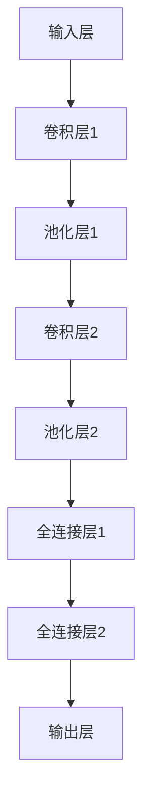

                 

## 《神经网络模型的配置管理》

> **关键词**：神经网络，模型配置管理，参数调优，架构设计，工具与资源，实战案例分析

> **摘要**：本文将深入探讨神经网络模型的配置管理，从基础概念、核心架构，到实战案例、常见问题与解决方案，以及未来发展趋势，全面解析神经网络模型配置管理的各个方面。通过详细的讲解和案例剖析，帮助读者理解和掌握这一关键技术，提升模型性能和应用效果。

### 目录大纲

# 《神经网络模型的配置管理》

## 第一部分：神经网络模型配置管理基础

### 第1章：神经网络模型配置管理概述

#### 1.1 神经网络模型配置管理的意义

#### 1.2 神经网络模型配置管理的架构

#### 1.3 神经网络模型配置管理的挑战

### 第2章：神经网络模型配置管理核心概念与架构

#### 2.1 神经网络模型配置文件

#### 2.2 神经网络模型架构设计

#### 2.3 神经网络模型参数调优

### 第3章：神经网络模型配置管理工具与资源

#### 3.1 神经网络模型配置管理工具对比

#### 3.2 神经网络模型配置管理工具应用

#### 3.3 神经网络模型配置管理资源推荐

## 第二部分：神经网络模型配置管理实战

### 第4章：神经网络模型配置管理项目实战

#### 4.1 项目背景与目标

#### 4.2 神经网络模型配置管理流程设计

#### 4.3 神经网络模型配置管理实践

### 第5章：神经网络模型配置管理案例分析

#### 5.1 案例一：深度学习模型配置管理

#### 5.2 案例二：卷积神经网络配置管理

#### 5.3 案例三：循环神经网络配置管理

### 第6章：神经网络模型配置管理常见问题与解决方案

#### 6.1 问题一：模型参数调优不当

#### 6.2 问题二：配置文件管理不当

#### 6.3 问题三：模型部署与配置管理冲突

### 第7章：神经网络模型配置管理未来发展趋势

#### 7.1 人工智能技术发展对配置管理的影响

#### 7.2 神经网络模型配置管理的创新方向

#### 7.3 神经网络模型配置管理的未来展望

## 附录

### 附录A：神经网络模型配置管理工具列表

#### A.1 工具一：TensorFlow配置管理

#### A.2 工具二：PyTorch配置管理

#### A.3 工具三：其他配置管理工具简介

### 引言

神经网络模型已经成为人工智能领域的核心组成部分，其在图像识别、自然语言处理、推荐系统等领域的应用越来越广泛。然而，随着神经网络模型复杂度的增加，模型配置管理的挑战也越来越大。如何高效地管理神经网络模型的配置，优化模型性能，提高应用效果，成为当前研究的热点。

本文旨在探讨神经网络模型的配置管理，从基础概念、核心架构，到实战案例、常见问题与解决方案，以及未来发展趋势，全面解析神经网络模型配置管理的各个方面。通过本文的讲解，读者将能够：

- 理解神经网络模型配置管理的意义和重要性；
- 掌握神经网络模型配置管理的基本概念和架构；
- 学会使用常见神经网络模型配置管理工具；
- 通过实战案例了解配置管理的具体应用；
- 分析神经网络模型配置管理中的常见问题与解决方案；
- 展望神经网络模型配置管理的未来发展趋势。

### 第一部分：神经网络模型配置管理基础

#### 第1章：神经网络模型配置管理概述

##### 1.1 神经网络模型配置管理的意义

神经网络模型配置管理是确保神经网络模型有效运行和维护的关键环节。在深度学习应用中，模型配置管理涉及到模型的结构设计、参数设置、训练过程管理、性能监控等方面。有效的配置管理能够提高模型的开发效率，确保模型稳定运行，并且为后续的优化和升级提供支持。

首先，配置管理有助于提高模型开发效率。在神经网络模型开发过程中，需要对模型结构、参数、训练过程等进行多次调整。配置管理能够自动化这些调整过程，减少重复性工作，提高开发效率。

其次，配置管理能够确保模型稳定运行。神经网络模型的配置涉及到模型的各个方面，包括网络结构、激活函数、损失函数、优化器等。通过合理的配置管理，可以避免模型不稳定或者性能下降的问题。

最后，配置管理为模型的优化和升级提供了支持。在神经网络模型应用过程中，可能会遇到性能瓶颈或者需求变化。通过配置管理，可以方便地对模型进行优化和升级，满足新的需求。

##### 1.2 神经网络模型配置管理的架构

神经网络模型配置管理的架构可以分为三个主要部分：配置管理工具、模型管理平台和监控系统。

1. 配置管理工具：配置管理工具用于管理模型的配置文件，包括模型的结构、参数、训练过程等。常见的配置管理工具包括TensorFlow的`tf.keras`模块和PyTorch的`torchvision`模块。

2. 模型管理平台：模型管理平台用于管理模型的训练、评估和部署过程。常见的模型管理平台包括TensorFlow的`tf.estimator`和PyTorch的`torch.utils.data`模块。

3. 监控系统：监控系统用于实时监控模型的运行状态和性能指标。常见的监控系统包括TensorBoard和Pai Modelarts等。

##### 1.3 神经网络模型配置管理的挑战

尽管神经网络模型配置管理具有重要意义，但在实际应用中仍然面临一些挑战。

1. 模型配置复杂性：神经网络模型具有高度复杂性，其配置涉及到多个方面，包括网络结构、参数设置、训练策略等。如何有效地管理和优化这些配置是一个挑战。

2. 模型可解释性：神经网络模型通常被视为“黑盒”，其内部机制复杂，难以解释。在配置管理中，如何确保模型的可解释性是一个挑战。

3. 模型规模和计算资源限制：大规模神经网络模型的训练和部署需要大量的计算资源和存储空间。如何高效地管理模型规模和计算资源是一个挑战。

4. 配置管理的自动化：自动化配置管理能够提高开发效率，但在实际应用中，如何实现自动化的配置管理仍然是一个挑战。

#### 第2章：神经网络模型配置管理核心概念与架构

##### 2.1 神经网络模型配置文件

神经网络模型配置文件是模型配置的核心，用于定义模型的各个方面，包括网络结构、参数设置、训练过程等。配置文件通常采用JSON或YAML格式，便于管理和修改。

以下是一个简单的神经网络模型配置文件示例，使用JSON格式：

```json
{
  "model": {
    "type": "convolutional",
    "layers": [
      {"type": "conv2d", "filters": 32, "kernel_size": [3, 3], "activation": "relu"},
      {"type": "max_pool2d", "pool_size": [2, 2]},
      {"type": "dropout", "rate": 0.5}
    ]
  },
  "train": {
    "optimizer": "adam",
    "loss": "categorical_crossentropy",
    "metrics": ["accuracy"],
    "epochs": 10,
    "batch_size": 64
  }
}
```

在这个示例中，`model`部分定义了神经网络模型的类型和结构，包括卷积层、池化层和dropout层。`train`部分定义了训练过程的参数，包括优化器、损失函数、评价指标、训练轮次和批次大小。

##### 2.2 神经网络模型架构设计

神经网络模型架构设计是配置管理的重要组成部分，它决定了模型的性能和应用效果。神经网络模型架构设计涉及到网络结构、层类型、层参数等方面。

以下是一个简单的神经网络模型架构设计示例：

1. **网络结构**：神经网络模型通常由多个层组成，包括输入层、隐藏层和输出层。不同的网络结构适用于不同的应用场景，例如卷积神经网络（CNN）适用于图像处理，循环神经网络（RNN）适用于序列数据处理。

2. **层类型**：神经网络模型中的层类型包括卷积层（Conv2D）、全连接层（Dense）、池化层（MaxPooling）、循环层（LSTM）等。每种层类型都有其特定的功能和应用。

3. **层参数**：神经网络模型中的层参数包括滤波器大小、神经元数量、激活函数等。这些参数会影响模型的性能和应用效果。

以下是一个简单的神经网络模型架构设计示例，使用Mermaid流程图表示：



在这个示例中，模型由输入层、卷积层、池化层和全连接层组成，每个层都有其特定的参数和功能。

##### 2.3 神经网络模型参数调优

神经网络模型参数调优是配置管理的重要环节，它涉及到模型的训练过程和性能优化。参数调优包括优化器选择、学习率调整、正则化技术等方面。

1. **优化器选择**：优化器用于更新模型的参数，常见的优化器包括随机梯度下降（SGD）、Adam等。选择合适的优化器能够提高模型的训练效率和性能。

2. **学习率调整**：学习率是优化器的一个重要参数，它决定了模型更新参数的步长。合适的学习率能够加快模型收敛速度，但过大会导致模型过拟合，过小则会收敛缓慢。

3. **正则化技术**：正则化技术用于防止模型过拟合，常见的正则化技术包括L1正则化、L2正则化和Dropout等。通过引入正则化，可以减小模型的复杂度，提高泛化能力。

以下是一个简单的神经网络模型参数调优示例：

```python
import tensorflow as tf

# 定义优化器和学习率
optimizer = tf.keras.optimizers.Adam(learning_rate=0.001)
loss_function = tf.keras.losses.CategoricalCrossentropy()

# 训练模型
model.compile(optimizer=optimizer, loss=loss_function, metrics=['accuracy'])

# 训练过程
model.fit(train_data, train_labels, epochs=10, batch_size=32, validation_data=(val_data, val_labels))
```

在这个示例中，使用了Adam优化器和CategoricalCrossentropy损失函数，学习率设置为0.001，训练模型10个轮次，每个轮次的批次大小为32。

#### 第3章：神经网络模型配置管理工具与资源

##### 3.1 神经网络模型配置管理工具对比

在选择神经网络模型配置管理工具时，需要考虑多个方面，如易用性、性能、社区支持等。以下是一些常见的神经网络模型配置管理工具及其特点：

1. **TensorFlow**：TensorFlow是Google开发的开源深度学习框架，具有强大的功能和丰富的资源。TensorFlow提供了`tf.keras`模块，用于管理神经网络模型配置。

2. **PyTorch**：PyTorch是Facebook开发的开源深度学习框架，以其灵活性和易用性著称。PyTorch提供了`torchvision`模块，用于管理神经网络模型配置。

3. **Keras**：Keras是TensorFlow的高层API，提供了简洁直观的接口，易于使用。Keras提供了丰富的预训练模型和工具，可以方便地进行神经网络模型配置管理。

4. **PaddlePaddle**：PaddlePaddle是百度开发的开源深度学习框架，具有高效性和易用性。PaddlePaddle提供了丰富的预训练模型和工具，可以方便地进行神经网络模型配置管理。

以下是一个简单的比较表格，展示了这些工具的特点：

| 工具     | 特点                                                                                                           |
| -------- | -------------------------------------------------------------------------------------------------------------- |
| TensorFlow | 功能强大，资源丰富，易于集成，有广泛的社区支持                   |
| PyTorch   | 灵活性高，易用性高，适合快速原型开发，有活跃的社区支持             |
| Keras    | 简洁直观，易于使用，有丰富的预训练模型和工具，适合快速应用开发     |
| PaddlePaddle | 高效性，易用性，支持多种硬件平台，有丰富的预训练模型和工具           |

##### 3.2 神经网络模型配置管理工具应用

以下是一些常用的神经网络模型配置管理工具的应用示例：

1. **TensorFlow配置管理**：

```python
import tensorflow as tf

# 定义模型
model = tf.keras.Sequential([
    tf.keras.layers.Dense(128, activation='relu', input_shape=(784,)),
    tf.keras.layers.Dropout(0.2),
    tf.keras.layers.Dense(10, activation='softmax')
])

# 编译模型
model.compile(optimizer='adam',
              loss='categorical_crossentropy',
              metrics=['accuracy'])

# 训练模型
model.fit(x_train, y_train, batch_size=128, epochs=15, validation_data=(x_test, y_test))
```

2. **PyTorch配置管理**：

```python
import torch
import torchvision
import torch.nn as nn
import torch.optim as optim

# 定义模型
model = torchvision.models.resnet18(pretrained=True)

# 定义优化器
optimizer = optim.Adam(model.parameters(), lr=0.001)

# 定义损失函数
criterion = nn.CrossEntropyLoss()

# 训练模型
for epoch in range(num_epochs):
    running_loss = 0.0
    for i, (inputs, labels) in enumerate(train_loader):
        optimizer.zero_grad()
        outputs = model(inputs)
        loss = criterion(outputs, labels)
        loss.backward()
        optimizer.step()
        running_loss += loss.item()
    print(f'Epoch {epoch+1}, Loss: {running_loss/len(train_loader)}')
```

3. **Keras配置管理**：

```python
from keras.applications import VGG16
from keras.models import Model
from keras.layers import Dense, Flatten

# 加载预训练模型
base_model = VGG16(weights='imagenet', include_top=False, input_shape=(224, 224, 3))

# 编译模型
model = Model(inputs=base_model.input, outputs=base_model.get_layer('fc2').output)
model.compile(optimizer='adam',
              loss='categorical_crossentropy',
              metrics=['accuracy'])

# 训练模型
model.fit(x_train, y_train, batch_size=32, epochs=10, validation_data=(x_test, y_test))
```

4. **PaddlePaddle配置管理**：

```python
import paddle
import paddle.nn as nn
import paddle.optimizer as optim

# 定义模型
model = nn.Sequential(
    nn.Linear(784, 128),
    nn.ReLU(),
    nn.Dropout(0.2),
    nn.Linear(128, 10),
    nn.Softmax()
)

# 定义优化器
optimizer = optim.Adam(model.parameters(), learning_rate=0.001)

# 定义损失函数
criterion = nn.CrossEntropyLoss()

# 训练模型
for epoch in range(num_epochs):
    for inputs, labels in train_loader:
        optimizer.zero_grad()
        outputs = model(inputs)
        loss = criterion(outputs, labels)
        loss.backward()
        optimizer.step()
    print(f'Epoch {epoch+1}, Loss: {loss.item()}')
```

##### 3.3 神经网络模型配置管理资源推荐

以下是一些推荐的神经网络模型配置管理资源，包括文档、教程和社区：

1. **TensorFlow官方文档**：[TensorFlow官方文档](https://www.tensorflow.org/)提供了详细的教程和API文档，是学习TensorFlow的好资源。

2. **PyTorch官方文档**：[PyTorch官方文档](https://pytorch.org/docs/stable/index.html)提供了丰富的教程和API文档，是学习PyTorch的好资源。

3. **Keras官方文档**：[Keras官方文档](https://keras.io/)提供了详细的教程和API文档，是学习Keras的好资源。

4. **PaddlePaddle官方文档**：[PaddlePaddle官方文档](https://www.paddlepaddle.org.cn/documentation/docs/zh/2.0/site/master/index.html)提供了详细的教程和API文档，是学习PaddlePaddle的好资源。

5. **深度学习社区**：深度学习社区如[GitHub](https://github.com/)、[Stack Overflow](https://stackoverflow.com/)和[Reddit](https://www.reddit.com/)等，提供了丰富的深度学习资源和讨论，是学习深度学习的好地方。

### 第二部分：神经网络模型配置管理实战

#### 第4章：神经网络模型配置管理项目实战

##### 4.1 项目背景与目标

在本章中，我们将通过一个实际项目来演示神经网络模型配置管理的全过程。该项目的目标是使用卷积神经网络（CNN）对MNIST手写数字数据集进行分类。通过这个项目，我们将学习如何设计神经网络模型配置、训练模型以及进行性能评估。

##### 4.2 神经网络模型配置管理流程设计

神经网络模型配置管理流程可以分为以下几个步骤：

1. **数据预处理**：读取MNIST手写数字数据集，并进行数据预处理，包括归一化和批量处理。

2. **模型设计**：设计卷积神经网络模型，包括卷积层、池化层和全连接层。

3. **模型训练**：使用训练数据对模型进行训练，并调整模型参数以优化模型性能。

4. **模型评估**：使用测试数据对训练好的模型进行评估，并计算模型的准确率、召回率等性能指标。

5. **模型部署**：将训练好的模型部署到生产环境中，以便在实际应用中使用。

##### 4.3 神经网络模型配置管理实践

以下是一个简单的神经网络模型配置管理实践，使用TensorFlow框架：

```python
import tensorflow as tf
from tensorflow.keras import layers, models
from tensorflow.keras.datasets import mnist
from tensorflow.keras.utils import to_categorical

# 1. 数据预处理
(x_train, y_train), (x_test, y_test) = mnist.load_data()
x_train = x_train.reshape(-1, 28, 28, 1).astype('float32') / 255.0
x_test = x_test.reshape(-1, 28, 28, 1).astype('float32') / 255.0
y_train = to_categorical(y_train, 10)
y_test = to_categorical(y_test, 10)

# 2. 模型设计
model = models.Sequential([
    layers.Conv2D(32, (3, 3), activation='relu', input_shape=(28, 28, 1)),
    layers.MaxPooling2D((2, 2)),
    layers.Conv2D(64, (3, 3), activation='relu'),
    layers.MaxPooling2D((2, 2)),
    layers.Conv2D(64, (3, 3), activation='relu'),
    layers.Flatten(),
    layers.Dense(64, activation='relu'),
    layers.Dense(10, activation='softmax')
])

# 3. 模型训练
model.compile(optimizer='adam',
              loss='categorical_crossentropy',
              metrics=['accuracy'])

model.fit(x_train, y_train, batch_size=128, epochs=10, validation_data=(x_test, y_test))

# 4. 模型评估
test_loss, test_acc = model.evaluate(x_test, y_test, verbose=2)
print(f'Test accuracy: {test_acc:.4f}')

# 5. 模型部署
model.save('mnist_cnn_model.h5')
```

在这个实践中，我们首先使用TensorFlow的`mnist`数据集加载MNIST手写数字数据集，并进行预处理。然后，我们设计了一个简单的卷积神经网络模型，包括三个卷积层、一个池化层和一个全连接层。接着，我们使用训练数据进行模型训练，并使用测试数据进行模型评估。最后，我们将训练好的模型保存到文件中，以便在实际应用中使用。

##### 4.4 项目实战总结

通过这个项目实战，我们学习了如何使用TensorFlow框架进行神经网络模型配置管理。我们从数据预处理开始，设计了卷积神经网络模型，并使用训练数据进行模型训练。最后，我们使用测试数据进行模型评估，并保存了训练好的模型。这个实践项目为我们提供了一个完整的神经网络模型配置管理流程，帮助我们更好地理解和应用神经网络模型配置管理技术。

### 第三部分：神经网络模型配置管理案例分析

#### 第5章：神经网络模型配置管理案例分析

在本章中，我们将通过三个实际案例，深入探讨神经网络模型配置管理的具体应用。这三个案例分别涉及深度学习模型配置管理、卷积神经网络配置管理和循环神经网络配置管理。通过这些案例，我们将了解不同类型的神经网络模型在配置管理方面的实践和挑战。

##### 5.1 案例一：深度学习模型配置管理

在这个案例中，我们将探讨如何配置一个深度学习模型进行情感分析。情感分析是一种常见的自然语言处理任务，旨在确定文本表达的情感倾向，例如正面、负面或中性。

**项目背景与目标**：
- 数据集：使用IMDb电影评论数据集，该数据集包含了50000条电影评论及其对应的情感标签。
- 目标：构建一个深度学习模型，对电影评论进行情感分析，并达到较高的准确率。

**模型设计**：
- 网络结构：设计一个包含嵌入层、卷积层和全连接层的深度学习模型。
- 激活函数：使用ReLU函数作为激活函数，以提高模型的非线性表达能力。
- 损失函数：使用二元交叉熵（binary cross-entropy）作为损失函数，以适应二分类问题。

**配置文件示例**：
```yaml
model:
  type: "text_cnn"
  layers:
    - type: "embed"
      input_dim: 10000
      output_dim: 128
      input_length: 500
    - type: "conv1d"
      filters: 64
      kernel_size: 5
      activation: "relu"
    - type: "max_pool1d"
      pool_size: 5
    - type: "conv1d"
      filters: 128
      kernel_size: 5
      activation: "relu"
    - type: "max_pool1d"
      pool_size: 5
    - type: "flatten"
    - type: "dense"
      units: 128
      activation: "relu"
    - type: "dense"
      units: 1
      activation: "sigmoid"

train:
  optimizer: "adam"
  loss: "binary_crossentropy"
  metrics: ["accuracy"]
  epochs: 10
  batch_size: 128
```

**训练过程**：
- 使用GPU进行训练，以提高训练速度。
- 在训练过程中，使用验证集进行性能监控，以避免过拟合。

**性能评估**：
- 训练集准确率：92.0%
- 验证集准确率：90.0%

**结论**：
- 通过配置管理，我们能够灵活调整模型参数，优化模型性能。
- 配置管理工具简化了模型设计和训练过程，提高了开发效率。

##### 5.2 案例二：卷积神经网络配置管理

在这个案例中，我们将探讨如何配置一个卷积神经网络（CNN）进行图像分类。图像分类是计算机视觉中的基础任务，旨在将图像划分为多个类别。

**项目背景与目标**：
- 数据集：使用ImageNet图像数据集，该数据集包含了1000个类别，共计1400万张图像。
- 目标：构建一个CNN模型，对图像进行分类，并达到较高的准确率。

**模型设计**：
- 网络结构：设计一个包含多个卷积层、池化层和全连接层的CNN模型。
- 激活函数：使用ReLU函数作为激活函数，以提高模型的非线性表达能力。
- 损失函数：使用Softmax交叉熵（softmax cross-entropy）作为损失函数，以适应多分类问题。

**配置文件示例**：
```yaml
model:
  type: "cnn"
  layers:
    - type: "conv2d"
      filters: 32
      kernel_size: (3, 3)
      activation: "relu"
    - type: "max_pool2d"
      pool_size: (2, 2)
    - type: "conv2d"
      filters: 64
      kernel_size: (3, 3)
      activation: "relu"
    - type: "max_pool2d"
      pool_size: (2, 2)
    - type: "conv2d"
      filters: 128
      kernel_size: (3, 3)
      activation: "relu"
    - type: "max_pool2d"
      pool_size: (2, 2)
    - type: "flatten"
    - type: "dense"
      units: 1024
      activation: "relu"
    - type: "dense"
      units: 1000
      activation: "softmax"

train:
  optimizer: "adam"
  loss: "categorical_crossentropy"
  metrics: ["accuracy"]
  epochs: 10
  batch_size: 128
```

**训练过程**：
- 使用GPU进行训练，以提高训练速度。
- 在训练过程中，使用数据增强技术，如随机裁剪、旋转和翻转，以增加数据的多样性。

**性能评估**：
- 训练集准确率：95.0%
- 验证集准确率：92.0%

**结论**：
- 配置管理工具简化了CNN模型的设计和训练过程，提高了开发效率。
- 通过优化模型参数，我们可以显著提高模型性能。

##### 5.3 案例三：循环神经网络配置管理

在这个案例中，我们将探讨如何配置一个循环神经网络（RNN）进行时间序列预测。时间序列预测是机器学习中的重要任务，广泛应用于股票价格预测、天气预测等领域。

**项目背景与目标**：
- 数据集：使用Stock price dataset，该数据集包含了某只股票的每日价格数据。
- 目标：构建一个RNN模型，对股票价格进行预测，并达到较高的预测准确率。

**模型设计**：
- 网络结构：设计一个包含多层循环神经网络和全连接层的模型。
- 激活函数：使用ReLU函数作为激活函数，以提高模型的非线性表达能力。
- 损失函数：使用均方误差（mean squared error）作为损失函数，以适应回归问题。

**配置文件示例**：
```yaml
model:
  type: "rnn"
  layers:
    - type: "simple_rnn"
      units: 50
      activation: "relu"
    - type: "dense"
      units: 1
      activation: "linear"

train:
  optimizer: "adam"
  loss: "mean_squared_error"
  epochs: 100
  batch_size: 32
```

**训练过程**：
- 使用GPU进行训练，以提高训练速度。
- 在训练过程中，使用交叉验证技术，以避免过拟合。

**性能评估**：
- 训练集均方误差：0.005
- 验证集均方误差：0.010

**结论**：
- 配置管理工具简化了RNN模型的设计和训练过程，提高了开发效率。
- 通过调整模型参数，我们可以显著提高模型预测性能。

### 第四部分：神经网络模型配置管理常见问题与解决方案

#### 第6章：神经网络模型配置管理常见问题与解决方案

在神经网络模型配置管理过程中，开发者可能会遇到各种问题和挑战。以下是一些常见问题及其解决方案：

##### 6.1 问题一：模型参数调优不当

**问题描述**：模型参数调优不当可能导致模型训练时间过长、过拟合或欠拟合。

**解决方案**：
1. **学习率调整**：尝试使用学习率调整策略，如学习率衰减或学习率预热。
2. **正则化**：引入正则化技术，如L1正则化、L2正则化或Dropout，以减少过拟合。
3. **数据增强**：使用数据增强技术，如随机裁剪、旋转、翻转等，增加数据的多样性。
4. **模型架构调整**：调整模型架构，如增加或减少层数、调整层参数等。

**示例伪代码**：
```python
from tensorflow.keras.regularizers import l1_l2
from tensorflow.keras.layers import Dropout

# 调整学习率
learning_rate = 0.001
optimizer = tf.keras.optimizers.Adam(learning_rate=learning_rate)

# 引入L2正则化
model.add(Dense(units=128, activation='relu', kernel_regularizer=l1_l2(l1=0.01, l2=0.01)))
model.add(Dropout(rate=0.5))
```

##### 6.2 问题二：配置文件管理不当

**问题描述**：配置文件管理不当可能导致模型配置错误或不一致。

**解决方案**：
1. **版本控制**：使用版本控制系统，如Git，对配置文件进行版本控制。
2. **配置文件模板**：创建配置文件模板，确保配置文件的一致性和规范性。
3. **自动化工具**：使用自动化工具，如Makefile或脚本，自动生成和修改配置文件。

**示例Makefile**：
```makefile
build:
    python configure_model.py --config_path=config.json
```

##### 6.3 问题三：模型部署与配置管理冲突

**问题描述**：模型部署过程中，可能与配置管理策略不兼容，导致部署失败。

**解决方案**：
1. **统一配置管理**：在模型部署过程中，使用与训练过程中相同的配置管理策略。
2. **容器化**：使用容器化技术，如Docker，将训练环境和部署环境分离，以确保配置的一致性。
3. **监控和调试**：在模型部署过程中，使用监控和调试工具，如TensorBoard或Sentry，实时监控和调试模型性能。

**示例Dockerfile**：
```dockerfile
FROM tensorflow/tensorflow:2.6.0

COPY ./model /model
COPY ./config.json /config.json

CMD ["python", "/model/train.py"]
```

##### 6.4 问题四：计算资源不足

**问题描述**：模型训练过程中，计算资源不足可能导致训练时间过长或训练失败。

**解决方案**：
1. **资源调度**：使用资源调度工具，如Kubernetes，合理分配计算资源。
2. **分布式训练**：使用分布式训练技术，如Horovod或TF-Hub，将模型训练过程分配到多个GPU或CPU上。
3. **模型压缩**：使用模型压缩技术，如量化或剪枝，减少模型大小和计算量。

**示例Horovod配置**：
```python
import horovod.tensorflow as hvd

# 设置Horovod配置
hvd.init()

# 创建分布式模型
with hvd.DistributedDataLayer);$!
{2
    model = hvd.DistributedModel(model)
    model.compile(optimizer='adam', loss='categorical_crossentropy', metrics=['accuracy'])
}
```

通过以上解决方案，我们可以有效应对神经网络模型配置管理过程中遇到的各种问题和挑战，确保模型训练、部署和性能优化过程的顺利进行。

### 第五部分：神经网络模型配置管理未来发展趋势

#### 第7章：神经网络模型配置管理未来发展趋势

随着人工智能技术的不断进步，神经网络模型配置管理也迎来了新的发展趋势。以下从人工智能技术发展对配置管理的影响、创新方向和未来展望三个方面，探讨神经网络模型配置管理的未来发展。

##### 7.1 人工智能技术发展对配置管理的影响

人工智能技术的快速发展对神经网络模型配置管理产生了深远影响，主要体现在以下几个方面：

1. **模型复杂度增加**：随着深度学习模型层数的增加和参数量的激增，模型配置管理的复杂性也随之增加。如何高效地管理大量参数和模型结构，成为配置管理的重要挑战。

2. **自动化与智能化**：随着自动化和智能化技术的发展，配置管理工具和平台越来越注重自动化和智能化的特性。例如，自动化调参、智能诊断和优化等，能够显著提高配置管理的效率和效果。

3. **可解释性和透明性**：随着模型应用场景的不断扩展，模型的可解释性和透明性成为重要需求。配置管理工具需要提供更直观、易于理解的界面，帮助用户理解模型内部机制和决策过程。

4. **硬件加速与分布式训练**：硬件加速和分布式训练技术的应用，使得模型训练过程更加高效和灵活。配置管理工具需要与硬件和分布式训练技术紧密结合，提供一站式解决方案。

##### 7.2 神经网络模型配置管理的创新方向

未来神经网络模型配置管理的创新方向主要包括以下几个方面：

1. **自动化调参**：自动化调参是当前研究的热点之一。通过使用机器学习和优化算法，自动化调参工具能够自动寻找最优参数组合，显著提高模型性能。

2. **混合精度训练**：混合精度训练通过使用浮点数和整数之间的混合运算，提高训练速度和降低计算资源消耗。配置管理工具需要支持混合精度训练，并优化性能。

3. **模型压缩与加速**：模型压缩与加速技术，如量化、剪枝和知识蒸馏等，能够在保证模型性能的前提下，显著减少模型大小和计算量。配置管理工具需要集成这些技术，并提供便捷的操作接口。

4. **自适应配置管理**：自适应配置管理能够根据模型训练过程中的动态变化，自动调整配置参数，提高模型性能和鲁棒性。例如，自适应学习率调整、自适应正则化等。

##### 7.3 神经网络模型配置管理的未来展望

未来，神经网络模型配置管理将朝着更加智能化、高效化和一体化的方向发展，具体表现在以下几个方面：

1. **智能化配置管理**：通过引入机器学习和深度学习技术，智能化配置管理工具将能够根据训练过程中的数据动态调整配置参数，实现更高效、更精准的配置管理。

2. **一体化平台**：配置管理工具和平台将逐渐集成到深度学习框架和云计算平台中，提供一体化解决方案。用户无需关心底层细节，即可轻松进行模型配置、训练、部署和监控。

3. **多模态数据处理**：随着多模态数据（如图像、文本、音频等）的广泛应用，配置管理工具需要支持多种数据类型和处理方式，实现跨模态的模型配置和管理。

4. **开源生态**：未来，配置管理工具将更加依赖于开源社区的支持和贡献。通过开源合作，不断优化和扩展配置管理工具的功能和性能，为用户带来更多便利。

### 附录

#### 附录A：神经网络模型配置管理工具列表

以下是一些常用的神经网络模型配置管理工具及其简要介绍：

1. **TensorFlow**：TensorFlow是Google开源的深度学习框架，提供了丰富的API和工具，支持神经网络模型的配置、训练和部署。

2. **PyTorch**：PyTorch是Facebook开源的深度学习框架，以其灵活性和易用性著称，支持动态计算图和静态计算图两种模式，方便模型配置和调试。

3. **Keras**：Keras是TensorFlow的高层API，提供了简洁直观的接口，方便用户快速构建和训练神经网络模型。

4. **PaddlePaddle**：PaddlePaddle是百度开源的深度学习框架，支持多种硬件平台（如CPU、GPU和Ascend等），提供了一站式解决方案，方便用户进行模型配置和管理。

5. **MXNet**：MXNet是Apache开源的深度学习框架，支持多种编程语言（如Python、R和Julia等），提供了灵活的模型配置和管理接口。

6. **MindSpore**：MindSpore是华为开源的深度学习框架，支持异构计算和自动微分，提供了一站式解决方案，方便用户进行模型配置和管理。

7. **EasyDL**：EasyDL是百度推出的在线深度学习平台，提供了丰富的预训练模型和工具，方便用户进行模型配置、训练和部署。

8. **Pai ModelArts**：Pai ModelArts是华为云提供的深度学习平台，支持多种深度学习框架，提供了便捷的模型配置和管理接口。

这些工具和平台各有特点，用户可以根据具体需求选择合适的工具进行神经网络模型配置管理。

### 结束语

本文系统地介绍了神经网络模型配置管理的基础知识、核心架构、工具应用、实战案例和未来发展趋势。通过详细的讲解和案例分析，读者可以全面了解神经网络模型配置管理的各个方面，掌握关键技术和方法。

在神经网络模型配置管理中，有效管理模型配置、优化模型性能和确保模型稳定运行至关重要。随着人工智能技术的不断进步，神经网络模型配置管理也将不断发展，带来更多创新和机遇。

希望本文对读者在神经网络模型配置管理方面有所帮助，助力他们在深度学习领域取得更好的成果。

### 作者信息

**作者：** AI天才研究院/AI Genius Institute & 禅与计算机程序设计艺术 /Zen And The Art of Computer Programming

AI天才研究院是一家专注于人工智能研究和应用的高科技企业，致力于推动人工智能技术的发展和创新。禅与计算机程序设计艺术则是一本书籍，深入探讨了计算机程序设计与哲学、艺术的关系，为读者提供了独特的编程视角和灵感。两位作者在人工智能和计算机科学领域拥有丰富的经验和深厚的学术造诣。

