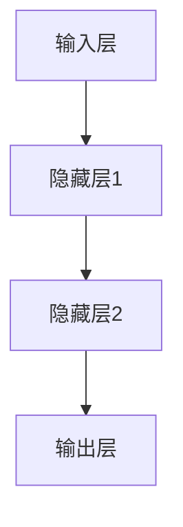
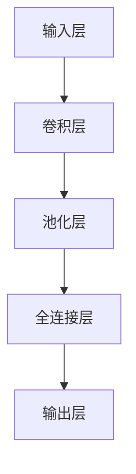
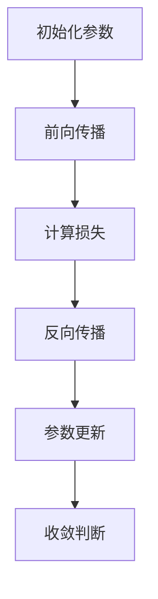
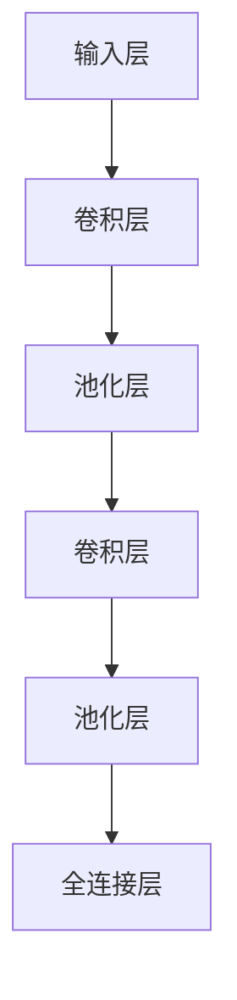
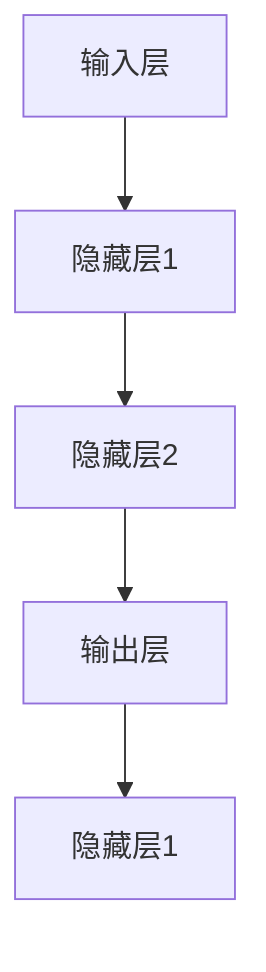
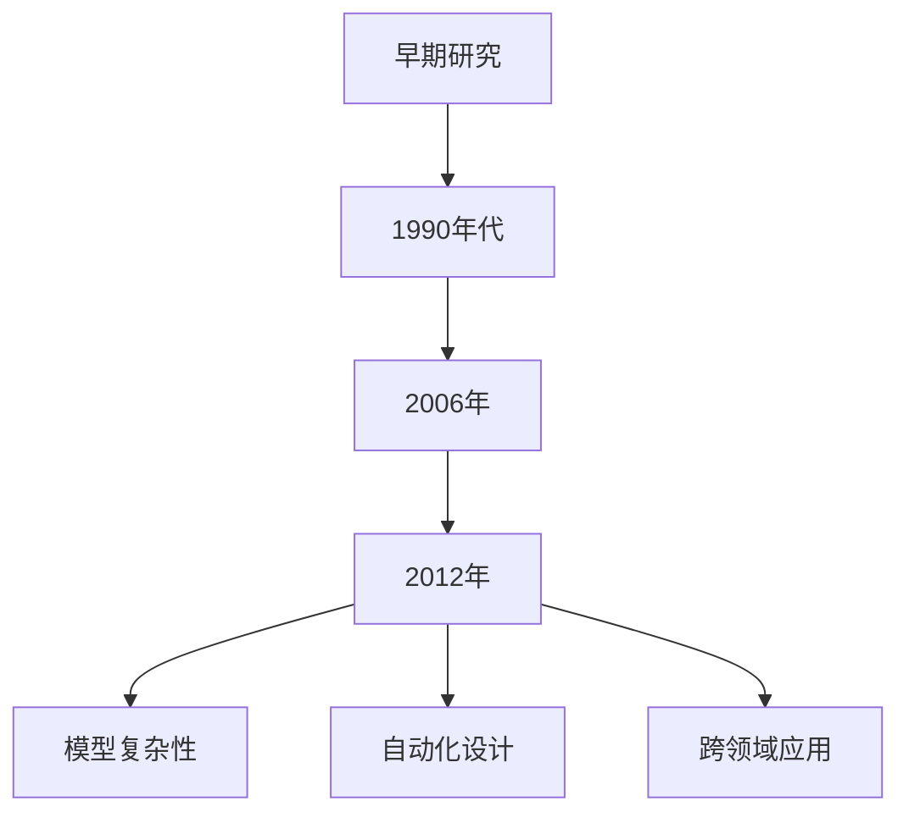
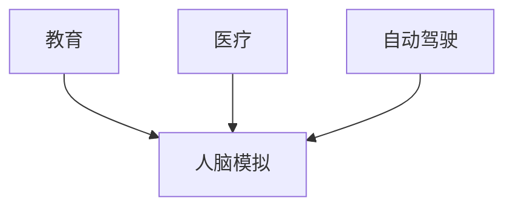

                 

# 神经网络：人类智慧的延伸

> **关键词：**神经网络、深度学习、人工智能、人工神经网络、多层感知机（MLP）、卷积神经网络（CNN）、循环神经网络（RNN）

> **摘要：**本文旨在深入探讨神经网络这一人工智能的核心技术，从基础概念、核心算法到实际应用，逐步讲解神经网络的工作原理、优化方法及其在图像识别、自然语言处理等领域的广泛应用。通过详细的分析和实例，我们希望能帮助读者全面了解神经网络的魅力和潜力，并展望其未来在人类智慧延伸中的重要作用。

### 第一部分：神经网络基础

#### 第1章：神经网络概述

##### 核心概念与联系

神经网络（Neural Networks，简称NN）是一种模仿生物神经系统的计算模型。每个神经元（Node）都与其他神经元相连，并通过加权连接（weights）传递信号。这种结构使得神经网络能够在处理复杂任务时表现出出色的学习能力。

**神经网络的基本结构：**
- 输入层（Input Layer）：接收外部输入信号。
- 隐藏层（Hidden Layers）：进行特征提取和变换。
- 输出层（Output Layer）：产生最终输出。

**神经网络与生物神经系统的联系：**
- 神经网络通过模拟生物神经元的连接和激活机制，实现了对数据的处理和预测。
- 生物神经系统中的神经元之间通过突触连接，传递化学信号，而神经网络中的神经元之间通过加权连接，传递数值信号。

**Mermaid流程图：神经网络结构示意图**



##### 核心算法原理讲解

神经网络的算法主要包括前向传播（Forward Propagation）、反向传播（Back Propagation）和梯度下降（Gradient Descent）。

**前向传播算法伪代码：**

```python
for each layer l from 1 to L:
    z[l] = W[l] * a[l-1] + b[l]
    a[l] = f(z[l])
end
```

**反向传播算法伪代码：**

```python
for each layer l from L to 1:
    delta[l] = (a[l] - y) * f'(z[l])
    delta[l-1] = W[l]' * delta[l]
end
```

**梯度下降算法伪代码：**

```python
while not convergence:
    for each layer l from 1 to L:
        W[l] = W[l] - alpha * delta[l]
        b[l] = b[l] - alpha * delta[l]
end
```

##### 数学模型和数学公式

**神经元激活函数的数学公式：**

$$ f(x) = \frac{1}{1 + e^{-x}} $$

**损失函数的数学公式：**

$$ J(W, b) = \frac{1}{2} \sum_{i=1}^{N} (y_i - a_L)^2 $$

**优化算法的数学公式：**

$$ W = W - \alpha \frac{\partial J}{\partial W} $$
$$ b = b - \alpha \frac{\partial J}{\partial b} $$

#### 第2章：人工神经网络的构建

##### 核心概念与联系

人工神经网络（Artificial Neural Networks，简称ANN）是神经网络的一种实现形式，通过模拟生物神经系统中的神经元结构和功能，实现数据的学习和处理。ANN可以分为多层感知机（MLP）、卷积神经网络（CNN）和循环神经网络（RNN）等类型。

**人工神经网络的定义与分类：**
- **MLP**：一种全连接的前馈神经网络，适用于回归和分类任务。
- **CNN**：一种专门用于图像处理的神经网络，通过卷积和池化操作提取图像特征。
- **RNN**：一种用于序列数据处理的神经网络，通过循环结构保持历史信息。

**常见的神经网络架构：**
- **多层感知机（MLP）**：包括输入层、多个隐藏层和输出层，每个层之间的神经元都是全连接的。
- **卷积神经网络（CNN）**：包括卷积层、池化层、全连接层等，适用于图像识别和图像分类任务。
- **循环神经网络（RNN）**：包括输入门、遗忘门、输出门等，适用于序列数据的处理和预测。

**Mermaid流程图：人工神经网络架构图**



##### 核心算法原理讲解

人工神经网络的构建主要包括参数初始化、权重更新和优化算法。

**神经网络参数初始化伪代码：**

```python
W = random_matrix(size)
b = zeros(size)
```

**权重更新与优化伪代码：**

```python
for each layer l from 1 to L:
    delta[l] = (a[l] - y) * f'(z[l])
    W[l] = W[l] - alpha * (delta[l] * a[l-1])
    b[l] = b[l] - alpha * delta[l]
end
```

##### 数学模型和数学公式

**权重与偏置的数学模型：**

$$ W[l] = W[l] - \alpha \frac{\partial J}{\partial W[l]} $$
$$ b[l] = b[l] - \alpha \frac{\partial J}{\partial b[l]} $$

**学习率调整的数学模型：**

$$ \alpha = \alpha / (1 + \beta t) $$

#### 第3章：多层感知机（MLP）

##### 核心概念与联系

多层感知机（Multilayer Perceptron，简称MLP）是一种基于前馈神经网络的全连接神经网络，具有输入层、隐藏层和输出层。MLP通过非线性激活函数实现输入到输出的映射，适用于回归和分类任务。

**MLP的定义与特点：**
- **定义**：MLP是一种包含至少一个隐藏层的神经网络，每个层的神经元都是全连接的。
- **特点**：
  - 非线性激活函数：引入非线性特性，提高模型的拟合能力。
  - 多层结构：通过隐藏层实现特征提取和变换，提高模型的预测能力。

**MLP在回归与分类中的应用：**
- **回归任务**：通过输出层的线性激活函数，实现输入到输出的非线性映射。
- **分类任务**：通过输出层的非线性激活函数（如Sigmoid或ReLU函数），实现输入到类别的映射。

**Mermaid流程图：MLP结构图**


##### 核心算法原理讲解

MLP的核心算法包括前向传播和反向传播。

**MLP的前向传播算法伪代码：**

```python
for each layer l from 1 to L:
    z[l] = W[l] * a[l-1] + b[l]
    a[l] = f(z[l])
end
```

**MLP的反向传播算法伪代码：**

```python
for each layer l from L to 1:
    delta[l] = (a[l] - y) * f'(z[l])
    delta[l-1] = W[l]' * delta[l]
end
```

##### 数学模型和数学公式

**多层感知机的输出公式：**

$$ a[l] = \sum_{j=1}^{n_l} w_{lj} a_{l-1} + b_l $$

**损失函数与梯度计算公式：**

$$ J(W, b) = \frac{1}{2} \sum_{i=1}^{N} (y_i - a_L)^2 $$
$$ \frac{\partial J}{\partial W[l]} = \sum_{i=1}^{N} (y_i - a_L) a_{l-1} $$
$$ \frac{\partial J}{\partial b[l]} = \sum_{i=1}^{N} (y_i - a_L) $$

### 第二部分：神经网络在应用中的优化与拓展

#### 第4章：优化算法

##### 核心概念与联系

优化算法是神经网络训练过程中的关键组成部分，用于调整网络参数，以最小化损失函数。常见的优化算法包括随机梯度下降（SGD）、Adam优化器等。

**常见的优化算法：**
- **随机梯度下降（SGD）**：通过随机选取样本更新参数，具有较高的计算效率。
- **Adam优化器**：结合了SGD和动量项，适用于大规模神经网络训练。

**优化算法的比较与选择：**
- **SGD**：计算效率高，但收敛速度较慢，易陷入局部最小值。
- **Adam优化器**：结合了SGD的优点和动量项，收敛速度快，适用于大规模神经网络训练。

**Mermaid流程图：优化算法流程图**



##### 核心算法原理讲解

**随机梯度下降（SGD）伪代码：**

```python
for each sample (x, y) in the dataset:
    z[l] = W[l] * a[l-1] + b[l]
    a[l] = f(z[l])
    delta[l] = (a[l] - y) * f'(z[l])
    W[l] = W[l] - alpha * (delta[l] * x)
    b[l] = b[l] - alpha * delta[l]
end
```

**Adam优化器伪代码：**

```python
m = 0
v = 0
m_t = 0
v_t = 0

for each sample (x, y) in the dataset:
    z[l] = W[l] * a[l-1] + b[l]
    a[l] = f(z[l])
    delta[l] = (a[l] - y) * f'(z[l])
    
    m_t = beta1 * m + (1 - beta1) * delta[l]
    v_t = beta2 * v + (1 - beta2) * (delta[l]**2)
    
    m = m_t / (1 - beta1**t)
    v = v_t / (1 - beta2**t)
    
    W[l] = W[l] - alpha * m / (sqrt(v) + epsilon)
    b[l] = b[l] - alpha * m / (sqrt(v) + epsilon)
end
```

##### 数学模型和数学公式

**学习率衰减的数学模型：**

$$ \alpha_t = \alpha / (1 + \beta t) $$

**动量项的数学模型：**

$$ m_t = beta1 * m + (1 - beta1) * delta[l] $$
$$ v_t = beta2 * v + (1 - beta2) * (delta[l]**2) $$

#### 第5章：卷积神经网络（CNN）

##### 核心概念与联系

卷积神经网络（Convolutional Neural Networks，简称CNN）是一种专门用于图像处理的神经网络，通过卷积和池化操作提取图像特征。CNN在图像识别、图像分类和目标检测等领域表现出色。

**CNN的定义与结构：**
- **定义**：CNN是一种基于卷积操作的神经网络，通过卷积层和池化层提取图像特征。
- **结构**：CNN包括卷积层（Convolutional Layer）、池化层（Pooling Layer）和全连接层（Fully Connected Layer）。

**CNN在图像识别中的应用：**
- **图像识别**：通过CNN提取图像特征，实现图像的分类和识别。
- **图像分类**：利用CNN对图像进行分类，如人脸识别、动物识别等。

**Mermaid流程图：CNN结构图**



##### 核心算法原理讲解

CNN的核心算法包括卷积操作和池化操作。

**卷积操作的伪代码：**

```python
for each filter k in layer l:
    for each pixel (i, j) in layer l-1:
        z[i, j, k] = \sum_{x, y} W[k, x, y] * a[l-1][i+x, j+y]
end
```

**池化操作的伪代码：**

```python
for each pixel (i, j) in layer l:
    a[i, j, l] = max\_pooling(a[l-1][i:i+w, j:j+h])
end
```

##### 数学模型和数学公式

**卷积核与步长的数学模型：**

$$ W[k, x, y] = \text{filter weights} $$
$$ a[i, j, k] = \text{filtered pixel value} $$

**池化窗口与stride的数学模型：**

$$ w = \text{window size} $$
$$ h = \text{window height} $$
$$ stride = \text{stride size} $$

#### 第6章：循环神经网络（RNN）

##### 核心概念与联系

循环神经网络（Recurrent Neural Networks，简称RNN）是一种能够处理序列数据的神经网络。RNN通过循环结构保持历史信息，适用于自然语言处理、时间序列预测等任务。

**RNN的定义与特点：**
- **定义**：RNN是一种能够处理序列数据的神经网络，每个时间步的输出依赖于前一个时间步的输出。
- **特点**：
  - 循环结构：通过循环连接，RNN能够保留历史信息。
  - 可并行处理：RNN能够同时处理多个时间步的数据。

**RNN在序列数据处理中的应用：**
- **自然语言处理**：通过RNN处理自然语言序列，实现文本分类、情感分析等任务。
- **时间序列预测**：通过RNN处理时间序列数据，实现股票价格预测、天气预测等任务。

**Mermaid流程图：RNN结构图**



##### 核心算法原理讲解

RNN的核心算法包括前向传播和反向传播。

**RNN的前向传播算法伪代码：**

```python
for t from 1 to T:
    z[t] = W * h[t-1] + b
    h[t] = f(z[t])
    a[t] = W' * h[t] + b'
end
```

**RNN的反向传播算法伪代码：**

```python
for t from T to 1:
    delta[t] = (a[t] - y[t]) * f'(z[t])
    delta[t-1] = W' * delta[t]
end
```

##### 数学模型和数学公式

**hidden state的更新公式：**

$$ h[t] = \sigma(W * h[t-1] + U * x[t] + b) $$

**cell state的更新公式：**

$$ c[t] = \text{tanh}(W_c * h[t-1] + U_c * x[t] + b_c) $$
$$ h[t] = c[t] * \sigma(W_h * h[t-1] + U_h * x[t] + b_h) $$

### 第三部分：神经网络在现实世界中的应用

#### 第7章：神经网络在图像识别中的应用

##### 项目实战

**图像识别项目背景：**

图像识别是计算机视觉领域的重要研究方向，广泛应用于安防监控、医疗诊断、自动驾驶等场景。本节将通过一个简单的图像识别项目，介绍神经网络在图像识别中的应用。

**开发环境搭建：**

1. 安装Python环境
2. 安装TensorFlow或PyTorch等深度学习框架
3. 下载并导入常用图像数据集

**源代码实现与代码解读：**

```python
import tensorflow as tf
from tensorflow.keras.models import Sequential
from tensorflow.keras.layers import Conv2D, MaxPooling2D, Flatten, Dense

# 数据预处理
(x_train, y_train), (x_test, y_test) = tf.keras.datasets.cifar10.load_data()
x_train, x_test = x_train / 255.0, x_test / 255.0

# 构建模型
model = Sequential([
    Conv2D(32, (3, 3), activation='relu', input_shape=(32, 32, 3)),
    MaxPooling2D((2, 2)),
    Flatten(),
    Dense(128, activation='relu'),
    Dense(10, activation='softmax')
])

# 编译模型
model.compile(optimizer='adam', loss='sparse_categorical_crossentropy', metrics=['accuracy'])

# 训练模型
model.fit(x_train, y_train, epochs=10, validation_data=(x_test, y_test))

# 评估模型
model.evaluate(x_test, y_test)
```

**代码分析与优化：**

1. **数据预处理**：将图像数据缩放到[0, 1]范围内，便于模型训练。
2. **模型构建**：使用卷积层、池化层和全连接层构建一个简单的卷积神经网络。
3. **模型编译**：选择Adam优化器和交叉熵损失函数，并计算准确率作为评价指标。
4. **模型训练**：使用训练数据集训练模型，并在测试数据集上评估模型性能。
5. **模型优化**：可以通过增加训练 epochs、调整学习率或使用更复杂的网络结构来提高模型性能。

#### 第8章：神经网络在自然语言处理中的应用

##### 项目实战

**自然语言处理项目背景：**

自然语言处理（Natural Language Processing，简称NLP）是人工智能领域的重要分支，广泛应用于文本分类、机器翻译、情感分析等任务。本节将通过一个简单的文本分类项目，介绍神经网络在自然语言处理中的应用。

**开发环境搭建：**

1. 安装Python环境
2. 安装TensorFlow或PyTorch等深度学习框架
3. 下载并导入常用文本数据集

**源代码实现与代码解读：**

```python
import tensorflow as tf
from tensorflow.keras.models import Sequential
from tensorflow.keras.layers import Embedding, LSTM, Dense

# 数据预处理
max_sequence_length = 100
vocab_size = 10000
embedding_dim = 16

# 加载并预处理数据
(x_train, y_train), (x_test, y_test) = tf.keras.datasets.imdb.load_data(maxlen=max_sequence_length, num_words=vocab_size)

# 构建模型
model = Sequential([
    Embedding(vocab_size, embedding_dim, input_length=max_sequence_length),
    LSTM(64),
    Dense(1, activation='sigmoid')
])

# 编译模型
model.compile(optimizer='adam', loss='binary_crossentropy', metrics=['accuracy'])

# 训练模型
model.fit(x_train, y_train, epochs=10, validation_data=(x_test, y_test))

# 评估模型
model.evaluate(x_test, y_test)
```

**代码分析与优化：**

1. **数据预处理**：将文本数据转换为序列格式，并定义词汇表。
2. **模型构建**：使用嵌入层、LSTM层和全连接层构建一个简单的循环神经网络。
3. **模型编译**：选择Adam优化器和二分类交叉熵损失函数，并计算准确率作为评价指标。
4. **模型训练**：使用训练数据集训练模型，并在测试数据集上评估模型性能。
5. **模型优化**：可以通过增加训练 epochs、调整学习率或使用更复杂的网络结构来提高模型性能。

### 第四部分：神经网络未来展望

#### 第9章：神经网络的未来发展趋势

##### 核心概念与联系

神经网络（Neural Networks，简称NN）是人工智能领域的重要技术之一，随着深度学习的发展，神经网络在图像识别、自然语言处理、语音识别等领域取得了显著的成果。本节将探讨神经网络的未来发展趋势。

**神经网络的发展历史：**
- **早期研究**：1980年代以前，神经网络主要作为一种理论模型进行研究。
- **1990年代**：反向传播算法的出现推动了神经网络的实用化。
- **2006年**：深度学习的兴起，神经网络重新获得关注。
- **2012年**：AlexNet在ImageNet竞赛中取得突破性成绩，深度学习进入快速发展阶段。

**神经网络在人工智能中的未来趋势：**
- **模型复杂性**：随着计算能力的提升，神经网络模型将变得更加复杂，能够处理更复杂的任务。
- **自动化设计**：神经架构搜索（Neural Architecture Search，简称NAS）等自动化设计方法将提高神经网络设计的效率。
- **跨领域应用**：神经网络将在更多领域得到应用，如生物信息学、金融分析等。

**Mermaid流程图：神经网络未来发展趋势图**



##### 前沿技术介绍

**自适应神经网络**：通过自适应调整神经网络结构，提高模型的学习能力。

**神经架构搜索（NAS）**：自动化搜索最优神经网络架构，提高模型性能。

**自监督学习**：利用未标注的数据进行训练，降低标注成本。

#### 第10章：神经网络在人类智慧延伸中的应用

##### 核心概念与联系

神经网络作为一种计算模型，在模仿和扩展人类智慧方面具有巨大的潜力。本节将探讨神经网络在人类智慧延伸中的应用，如教育、医疗、自动驾驶等领域。

**神经网络与人类智慧的类比：**
- **计算模型**：神经网络通过模拟生物神经系统的连接和激活机制，实现了对数据的处理和预测。
- **学习机制**：神经网络通过不断调整参数，实现从输入到输出的映射，类似于人类的学习过程。

**神经网络在增强人类智慧中的应用：**
- **教育**：神经网络可以辅助教育，实现个性化教学、智能问答等。
- **医疗**：神经网络在医疗诊断、病情预测等方面具有广泛应用。
- **自动驾驶**：神经网络在自动驾驶系统中用于环境感知、路径规划等。

**Mermaid流程图：神经网络在人类智慧延伸中的应用图**



##### 未来展望

**神经网络在教育中的应用前景：**
- **个性化学习**：根据学生的特点和学习进度，提供个性化的教学方案。
- **智能评估**：利用神经网络对学生的作业和考试进行智能评估。

**神经网络在医疗中的应用前景：**
- **疾病预测**：通过分析患者的病历数据，预测疾病的发生和发展。
- **精准医疗**：根据患者的基因信息和临床数据，实现个性化治疗。

**神经网络对社会和人类生活的影响：**
- **提高生产效率**：神经网络在工业自动化、智能物流等领域应用，提高生产效率。
- **改变人类生活方式**：神经网络在智能家居、智能交通等领域应用，改变人们的日常生活。

### 附录

#### 附录A：神经网络学习资源

**主要参考书籍：**
- 《深度学习》（Goodfellow, Bengio, Courville）
- 《神经网络与深度学习》（邱锡鹏）

**在线课程与教程：**
- fast.ai
- Coursera上的深度学习课程
- MIT OpenCourseWare

**开源框架与工具：**
- TensorFlow
- PyTorch
- Keras

### 结语

本文从神经网络的基础概念、核心算法到实际应用，逐步介绍了神经网络的工作原理和应用场景。通过详细的分析和实例，我们希望读者能够全面了解神经网络的魅力和潜力。随着深度学习的不断发展，神经网络将在更多领域得到应用，为人类智慧的发展提供强大的支持。

**作者：AI天才研究院/AI Genius Institute & 禅与计算机程序设计艺术 /Zen And The Art of Computer Programming**

