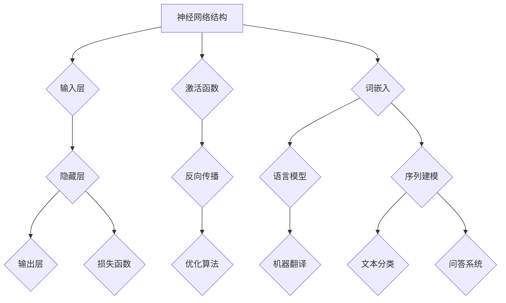

                 

### 文章标题

《神经网络：自然语言处理的新突破》

> **关键词**：神经网络、自然语言处理、自然语言处理挑战、语言模型、循环神经网络（RNN）、长短期记忆网络（LSTM）、门控循环单元（GRU）、机器翻译、文本分类、问答系统

> **摘要**：
在人工智能领域，自然语言处理（NLP）是一项极具挑战性的任务。传统方法在处理复杂语言结构和语义理解方面存在诸多局限性。近年来，神经网络，尤其是循环神经网络（RNN）、长短期记忆网络（LSTM）和门控循环单元（GRU）等，为自然语言处理带来了革命性的突破。本文将深入探讨神经网络在自然语言处理中的应用，详细分析其核心概念、算法原理以及实际项目案例，旨在为读者提供全面的理解和实践指导。

### 目录大纲

## 《神经网络：自然语言处理的新突破》目录大纲

## 第一部分：引言与背景

### 第1章：自然语言处理与神经网络简介

- **1.1 自然语言处理的挑战**
- **1.2 神经网络的基本概念**
- **1.3 神经网络在自然语言处理中的应用**

### 第2章：神经网络与自然语言处理

- **2.1 神经网络的结构与原理**
- **2.2 语言模型与神经网络**
- **2.3 词向量表示与神经网络**

### 第3章：神经网络在自然语言处理中的典型应用

- **3.1 机器翻译**
- **3.2 文本分类**
- **3.3 问答系统**

### 第4章：神经网络在自然语言处理中的扩展应用

- **4.1 情感分析**
- **4.2 命名实体识别**
- **4.3 语音识别**

### 第二部分：核心概念与联系

### 第5章：循环神经网络（RNN）

- **5.1 RNN的基本结构**
- **5.2 RNN的数学原理**
- **5.3 RNN的训练与优化**

### 第6章：长短期记忆网络（LSTM）

- **6.1 LSTM的基本结构**
- **6.2 LSTM的数学原理**
- **6.3 LSTM的训练与优化**

### 第7章：门控循环单元（GRU）

- **7.1 GRU的基本结构**
- **7.2 GRU的数学原理**
- **7.3 GRU的训练与优化**

### 第三部分：核心算法原理讲解

### 第8章：神经网络在自然语言处理中的数学模型

- **8.1 神经网络损失函数**
- **8.2 神经网络优化算法**
- **8.3 自然语言处理中的数学公式应用**

### 第9章：深度学习中的正则化方法

- **9.1 正则化的概念**
- **9.2 常见的正则化方法**
- **9.3 正则化在自然语言处理中的应用**

### 第四部分：数学模型与公式讲解

### 第10章：机器翻译项目实战

- **10.1 项目概述**
- **10.2 开发环境搭建**
- **10.3 源代码详细实现**
- **10.4 代码解读与分析**

### 第11章：文本分类项目实战

- **11.1 项目概述**
- **11.2 开发环境搭建**
- **11.3 源代码详细实现**
- **11.4 代码解读与分析**

### 第12章：问答系统项目实战

- **12.1 项目概述**
- **12.2 开发环境搭建**
- **12.3 源代码详细实现**
- **12.4 代码解读与分析**

### 第五部分：项目实战

### 第13章：神经网络在自然语言处理中的新突破

- **13.1 神经网络在自然语言处理中的最新进展**
- **13.2 未来发展趋势**
- **13.3 对自然语言处理的影响**

### 第14章：神经网络在自然语言处理中的挑战与解决方案

- **14.1 神经网络在自然语言处理中的挑战**
- **14.2 解决方案与未来方向**

### 第六部分：总结与展望

### 第15章：附录

- **15.1 常用神经网络框架介绍**
- **15.2 参考文献与资料**

附录 A: 神经网络与自然语言处理 Mermaid 流程图

## 第一部分：引言与背景

### 第1章：自然语言处理与神经网络简介

#### 1.1 自然语言处理的挑战

自然语言处理（NLP）是人工智能领域的一个核心研究方向，它致力于让计算机理解和生成人类语言。自然语言处理的挑战主要体现在以下几个方面：

1. **语言结构的复杂性**：自然语言具有高度复杂的语法、语义和语境，这使得理解和生成语言文本成为一个极具挑战性的任务。
2. **词汇的多义性**：许多词汇在不同的上下文中可以有多种含义，这就需要算法能够根据上下文准确地理解词汇的含义。
3. **句法的多样性**：自然语言的句子结构非常多样，从简单的陈述句到复杂的复合句，语法结构变化多端，给句法分析带来了巨大的难度。
4. **语义理解**：自然语言的语义理解涉及到词义、情感、意图等多种因素，这使得语义分析成为NLP中的一个难点。
5. **语言的变异性**：自然语言具有丰富的变体，包括拼写错误、缩写、口语化表达等，这些变体增加了语言处理的复杂性。

#### 1.2 神经网络的基本概念

神经网络（NN）是一种模仿人脑结构和功能的计算模型，由大量相互连接的神经元组成。神经网络通过学习输入和输出之间的映射关系，实现对数据的处理和预测。

1. **神经元**：神经网络的基本单元，每个神经元接收多个输入信号，通过加权求和处理后，产生一个输出信号。
2. **网络结构**：神经网络可以分为输入层、隐藏层和输出层。输入层接收外部输入，隐藏层对输入进行加工处理，输出层产生最终的输出。
3. **激活函数**：激活函数用于确定神经元的激活状态，常用的激活函数包括Sigmoid、ReLU等。

#### 1.3 神经网络在自然语言处理中的应用

神经网络在自然语言处理中具有广泛的应用，以下是一些典型的应用场景：

1. **语言模型**：神经网络可以用来构建语言模型，预测下一个单词或字符的概率分布，这在自然语言生成和文本分类中有着重要的应用。
2. **词向量表示**：神经网络可以将词汇映射到高维空间中的向量表示，这种向量表示方法能够捕捉词汇的语义和语法特征，对词汇进行有效的表示和分类。
3. **序列到序列模型**：如机器翻译、语音识别等任务，神经网络通过学习输入序列和输出序列之间的映射关系，实现端到端的学习和预测。
4. **文本分类**：神经网络可以用来对文本进行分类，通过学习文本的特征表示和分类标签之间的关系，实现对大规模文本数据的分类任务。
5. **情感分析**：神经网络可以用来分析文本的情感倾向，通过学习文本的情感特征和情感标签之间的关系，实现对文本情感的分类和判断。

### 第2章：神经网络与自然语言处理

#### 2.1 神经网络的结构与原理

神经网络的结构由输入层、隐藏层和输出层组成。输入层接收外部输入，隐藏层对输入进行加工处理，输出层产生最终的输出。

1. **输入层**：输入层接收外部输入，如文本序列、图像像素等。每个输入通过一个神经元进行处理。
2. **隐藏层**：隐藏层对输入进行加工处理，通过加权求和处理和激活函数的作用，产生隐藏层的输出。隐藏层可以有一个或多个，每个隐藏层都可以对输入进行更高级别的抽象和加工。
3. **输出层**：输出层产生最终的输出，如分类标签、概率分布等。输出层的大小取决于任务的类型和需求。

#### 2.2 语言模型与神经网络

语言模型是自然语言处理中的一个核心概念，用于预测下一个单词或字符的概率分布。神经网络可以用来构建语言模型，通过学习大量的文本数据，自动学习语言中的统计规律和模式。

1. **神经网络语言模型**：神经网络语言模型通过学习输入序列和输出序列之间的映射关系，实现对语言数据的建模。常用的神经网络模型包括循环神经网络（RNN）、长短期记忆网络（LSTM）和门控循环单元（GRU）等。
2. **语言模型训练**：语言模型的训练过程是通过最小化损失函数，优化神经网络参数的过程。常用的优化算法包括随机梯度下降（SGD）、Adam等。

#### 2.3 词向量表示与神经网络

词向量表示是将词汇映射到高维空间中的向量表示，用于捕捉词汇的语义和语法特征。神经网络可以用来构建词向量表示，通过学习词汇的上下文信息，生成高质量的词向量。

1. **词嵌入**：词嵌入是一种将词汇映射到低维向量空间的方法，常用的词嵌入模型包括Word2Vec、GloVe等。
2. **神经网络词向量表示**：神经网络可以用来构建更高质量的词向量表示，通过学习词汇的上下文信息，捕捉词汇的语义和语法特征。常用的神经网络模型包括循环神经网络（RNN）、长短期记忆网络（LSTM）和门控循环单元（GRU）等。

## 第二部分：核心概念与联系

### 第3章：神经网络在自然语言处理中的典型应用

#### 3.1 机器翻译

机器翻译是自然语言处理中的一个重要任务，旨在将一种语言的文本自动翻译成另一种语言的文本。神经网络在机器翻译中具有广泛的应用，通过学习大量的双语语料库，可以建立端到端的翻译模型。

1. **序列到序列模型**：神经网络在机器翻译中的核心是序列到序列（Seq2Seq）模型。Seq2Seq模型通过编码器-解码器结构，将输入序列编码为一个固定长度的向量表示，然后解码器将这个向量表示解码成输出序列。
2. **编码器**：编码器接收输入序列，将其映射到一个固定长度的向量表示。常用的编码器模型包括循环神经网络（RNN）、长短期记忆网络（LSTM）和门控循环单元（GRU）等。
3. **解码器**：解码器接收编码器的输出向量，生成输出序列。解码器通常采用类似编码器的神经网络结构，通过递归的方式逐步生成输出序列的每个单词或字符。

#### 3.2 文本分类

文本分类是自然语言处理中的一个基本任务，旨在将文本数据分为不同的类别。神经网络通过学习文本的特征表示和分类标签之间的关系，可以实现对大规模文本数据的分类任务。

1. **神经网络文本分类模型**：神经网络文本分类模型通常采用多层感知机（MLP）或卷积神经网络（CNN）等结构。这些模型通过对文本数据进行特征提取和分类，实现对文本数据的分类任务。
2. **文本特征提取**：文本特征提取是将文本数据转换为适合神经网络处理的形式。常用的文本特征提取方法包括词袋模型（Bag of Words，BOW）、词嵌入（Word Embedding）等。

#### 3.3 问答系统

问答系统是自然语言处理中的一个重要应用，旨在回答用户提出的问题。神经网络在问答系统中可以通过学习大量问答对，自动生成回答。

1. **端到端问答系统**：端到端问答系统通过学习输入问题和候选答案之间的映射关系，自动生成回答。常用的端到端问答系统模型包括编码器-解码器（Encoder-Decoder）模型和交互式问答模型等。
2. **问题表示**：问题表示是将输入问题转换为适合神经网络处理的形式。常用的方法包括词嵌入、词性标注、句法分析等。
3. **答案生成**：答案生成是将编码器生成的固定长度向量表示解码成具体的答案。常用的解码方法包括序列生成模型和模板匹配模型等。

## 第三部分：核心算法原理讲解

### 第4章：循环神经网络（RNN）

循环神经网络（RNN）是一种基于时间序列数据的神经网络，通过引入循环结构，能够对时间序列数据进行建模和处理。

#### 4.1 RNN的基本结构

RNN的基本结构包括输入层、隐藏层和输出层。输入层接收外部输入，隐藏层对输入进行加工处理，输出层产生最终的输出。

1. **输入层**：输入层接收时间序列数据，每个时间步的输入可以是词汇的词向量表示、图像像素等。
2. **隐藏层**：隐藏层由多个神经元组成，每个神经元都与其他神经元相连，形成循环结构。隐藏层通过递归的方式对输入序列进行建模和处理。
3. **输出层**：输出层产生最终的输出，可以是分类标签、概率分布等。

#### 4.2 RNN的数学原理

RNN的数学原理主要包括输入和输出函数、权重更新等。

1. **输入和输出函数**：RNN的输入函数和输出函数分别用于对输入和输出进行加工和处理。常用的输入函数和输出函数包括Sigmoid函数、ReLU函数等。
2. **权重更新**：RNN通过反向传播算法进行权重更新。在反向传播过程中，计算输出层的误差，并沿着网络结构反向传播，更新隐藏层和输入层的权重。

#### 4.3 RNN的训练与优化

RNN的训练与优化过程主要包括数据预处理、模型训练和优化算法等。

1. **数据预处理**：数据预处理是将原始时间序列数据转换为适合神经网络处理的形式。常用的方法包括归一化、去噪等。
2. **模型训练**：模型训练是通过最小化损失函数，优化神经网络参数的过程。常用的优化算法包括随机梯度下降（SGD）、Adam等。
3. **优化算法**：优化算法用于加速模型训练过程，提高训练效率。常用的优化算法包括批量梯度下降、小批量梯度下降等。

### 第5章：长短期记忆网络（LSTM）

长短期记忆网络（LSTM）是RNN的一种改进模型，通过引入门控机制，能够有效解决RNN在长序列建模中的梯度消失和梯度爆炸问题。

#### 5.1 LSTM的基本结构

LSTM的基本结构包括输入门、遗忘门、输出门和单元状态等。

1. **输入门**：输入门用于控制当前输入信息对单元状态的更新。输入门通过一个sigmoid函数和一个线性变换，确定当前输入信息中哪些部分需要被更新到单元状态。
2. **遗忘门**：遗忘门用于控制当前输入信息对单元状态的遗忘。遗忘门通过一个sigmoid函数和一个线性变换，确定当前输入信息中哪些部分需要被遗忘。
3. **输出门**：输出门用于控制当前输入信息对输出状态的更新。输出门通过一个sigmoid函数和一个线性变换，确定当前输入信息中哪些部分需要被更新到输出状态。
4. **单元状态**：单元状态用于存储当前输入序列的信息，并传递给下一个时间步。

#### 5.2 LSTM的数学原理

LSTM的数学原理主要包括输入函数、遗忘函数、输出函数等。

1. **输入函数**：输入函数用于对当前输入信息进行加工和处理。输入函数通过一个线性变换和一个激活函数，将当前输入信息映射到新的隐藏状态。
2. **遗忘函数**：遗忘函数用于控制当前输入信息对单元状态的遗忘。遗忘函数通过一个线性变换和一个sigmoid函数，确定当前输入信息中哪些部分需要被遗忘。
3. **输出函数**：输出函数用于对当前输入信息进行加工和处理，并生成输出状态。输出函数通过一个线性变换和一个sigmoid函数，将当前输入信息映射到新的输出状态。

#### 5.3 LSTM的训练与优化

LSTM的训练与优化过程主要包括数据预处理、模型训练和优化算法等。

1. **数据预处理**：数据预处理是将原始时间序列数据转换为适合神经网络处理的形式。常用的方法包括归一化、去噪等。
2. **模型训练**：模型训练是通过最小化损失函数，优化神经网络参数的过程。常用的优化算法包括随机梯度下降（SGD）、Adam等。
3. **优化算法**：优化算法用于加速模型训练过程，提高训练效率。常用的优化算法包括批量梯度下降、小批量梯度下降等。

### 第6章：门控循环单元（GRU）

门控循环单元（GRU）是LSTM的一种简化版本，通过引入更新门和重置门，能够有效解决LSTM的训练问题和参数冗余问题。

#### 6.1 GRU的基本结构

GRU的基本结构包括更新门、重置门和单元状态等。

1. **更新门**：更新门用于控制当前输入信息对单元状态的更新。更新门通过一个sigmoid函数和一个线性变换，确定当前输入信息中哪些部分需要被更新到单元状态。
2. **重置门**：重置门用于控制当前输入信息对单元状态的遗忘。重置门通过一个sigmoid函数和一个线性变换，确定当前输入信息中哪些部分需要被遗忘。
3. **单元状态**：单元状态用于存储当前输入序列的信息，并传递给下一个时间步。

#### 6.2 GRU的数学原理

GRU的数学原理主要包括更新函数、重置函数、输出函数等。

1. **更新函数**：更新函数用于对当前输入信息进行加工和处理。更新函数通过一个线性变换和一个sigmoid函数，将当前输入信息映射到新的隐藏状态。
2. **重置函数**：重置函数用于控制当前输入信息对单元状态的遗忘。重置函数通过一个线性变换和一个sigmoid函数，确定当前输入信息中哪些部分需要被遗忘。
3. **输出函数**：输出函数用于对当前输入信息进行加工和处理，并生成输出状态。输出函数通过一个线性变换和一个sigmoid函数，将当前输入信息映射到新的输出状态。

#### 6.3 GRU的训练与优化

GRU的训练与优化过程主要包括数据预处理、模型训练和优化算法等。

1. **数据预处理**：数据预处理是将原始时间序列数据转换为适合神经网络处理的形式。常用的方法包括归一化、去噪等。
2. **模型训练**：模型训练是通过最小化损失函数，优化神经网络参数的过程。常用的优化算法包括随机梯度下降（SGD）、Adam等。
3. **优化算法**：优化算法用于加速模型训练过程，提高训练效率。常用的优化算法包括批量梯度下降、小批量梯度下降等。

## 第四部分：数学模型与公式讲解

### 第7章：神经网络在自然语言处理中的数学模型

在自然语言处理（NLP）中，神经网络的数学模型是实现语言理解和生成的基础。以下将介绍神经网络在NLP中常用的数学模型、损失函数、优化算法以及一些关键数学公式的应用。

#### 7.1 神经网络损失函数

损失函数是衡量模型预测值与真实值之间差异的指标，用于指导模型参数的优化过程。在NLP中，常用的损失函数包括：

1. **交叉熵损失（Cross-Entropy Loss）**：

   $$ 
   L = -\sum_{i} y_i \log(\hat{y}_i) 
   $$

   其中，$y_i$ 是真实标签，$\hat{y}_i$ 是模型预测的概率分布。交叉熵损失适用于分类任务，如文本分类、情感分析等。

2. **均方误差损失（Mean Squared Error, MSE）**：

   $$ 
   L = \frac{1}{2} \sum_{i} (y_i - \hat{y}_i)^2 
   $$

   均方误差损失适用于回归任务，如机器翻译中的单词预测。

#### 7.2 神经网络优化算法

优化算法用于调整模型参数，使其在训练数据上达到最小化损失函数的目的。以下介绍几种常用的优化算法：

1. **随机梯度下降（Stochastic Gradient Descent, SGD）**：

   $$ 
   \theta = \theta - \alpha \nabla_{\theta} J(\theta) 
   $$

   其中，$\theta$ 表示模型参数，$J(\theta)$ 表示损失函数，$\alpha$ 是学习率。SGD通过在每个时间步随机选择一个样本进行梯度下降，具有较高的计算效率。

2. **Adam优化器**：

   $$ 
   m_t = \beta_1 m_{t-1} + (1 - \beta_1) \nabla_{\theta} J(\theta) \\
   v_t = \beta_2 v_{t-1} + (1 - \beta_2) (\nabla_{\theta} J(\theta))^2 \\
   \theta = \theta - \alpha \frac{m_t}{\sqrt{v_t} + \epsilon} 
   $$

   其中，$m_t$ 和 $v_t$ 分别是动量项和偏差修正项，$\beta_1$ 和 $\beta_2$ 是超参数，$\epsilon$ 是一个小常数。Adam优化器结合了SGD和Adagrad的优点，具有较高的收敛速度和稳定性。

#### 7.3 自然语言处理中的数学公式应用

在自然语言处理中，数学公式广泛应用于语言模型、词向量表示和序列建模等领域。以下是一些关键数学公式的应用：

1. **词嵌入（Word Embedding）**：

   词嵌入是将词汇映射到高维向量空间的过程。常用的词嵌入模型包括Word2Vec和GloVe。

   $$ 
   e_{\text{word}} = \text{sgn}(\text{word}) \odot \text{emb}_{\text{word}} 
   $$

   其中，$e_{\text{word}}$ 是词向量，$\text{sgn}(\text{word})$ 是符号函数，$\text{emb}_{\text{word}}$ 是词向量矩阵。

2. **循环神经网络（RNN）**：

   循环神经网络通过递归方式处理序列数据。其核心公式包括：

   $$ 
   h_t = \text{sigmoid}(W_h \cdot [h_{t-1}, x_t] + b_h) \\
   y_t = W_o \cdot h_t + b_o 
   $$

   其中，$h_t$ 是隐藏状态，$x_t$ 是输入序列的词向量，$W_h$ 和 $W_o$ 是权重矩阵，$b_h$ 和 $b_o$ 是偏置项。

3. **长短期记忆网络（LSTM）**：

   LSTM通过门控机制解决RNN的梯度消失问题。其核心公式包括：

   $$ 
   i_t = \text{sigmoid}(W_i \cdot [h_{t-1}, x_t] + b_i) \\
   f_t = \text{sigmoid}(W_f \cdot [h_{t-1}, x_t] + b_f) \\
   g_t = \text{tanh}(W_g \cdot [h_{t-1}, x_t] + b_g) \\
   o_t = \text{sigmoid}(W_o \cdot [h_{t-1}, x_t] + b_o) \\
   h_t = o_t \cdot \text{tanh}(c_t) \\
   c_t = f_t \cdot c_{t-1} + i_t \cdot g_t 
   $$

   其中，$i_t$、$f_t$、$g_t$、$o_t$ 分别是输入门、遗忘门、更新门和输出门的激活值，$c_t$ 是单元状态，$h_t$ 是隐藏状态。

通过上述数学模型和公式的应用，神经网络能够有效地建模和解决自然语言处理中的各种任务，如机器翻译、文本分类和问答系统等。

### 第8章：深度学习中的正则化方法

在深度学习中，正则化方法是一种重要的技术，用于防止模型过拟合，提高泛化能力。以下介绍几种常见的正则化方法及其在自然语言处理中的应用。

#### 8.1 正则化的概念

正则化是指通过引入额外的惩罚项，调整模型参数，以减少模型复杂度和提高泛化能力。正则化方法可以分为两类：权重正则化和结构正则化。

1. **权重正则化**：权重正则化通过惩罚模型参数的值，限制模型复杂度。常用的权重正则化方法包括L1正则化和L2正则化。

2. **结构正则化**：结构正则化通过限制模型的结构，如深度、层数等，以减少模型复杂度。常见的结构正则化方法包括Dropout和Early Stopping。

#### 8.2 L1正则化和L2正则化

L1正则化和L2正则化是最常用的权重正则化方法。

1. **L1正则化**：

   $$ 
   \text{Regularization Loss} = \lambda \sum_{i} |\theta_i| 
   $$

   其中，$\lambda$ 是正则化参数，$\theta_i$ 是模型参数。L1正则化通过惩罚参数的绝对值，鼓励模型参数向零靠近，从而简化模型。

2. **L2正则化**：

   $$ 
   \text{Regularization Loss} = \lambda \sum_{i} \theta_i^2 
   $$

   L2正则化通过惩罚参数的平方值，鼓励模型参数的值较小，从而减少模型的复杂度。

#### 8.3 Dropout

Dropout是一种结构正则化方法，通过随机丢弃神经网络中的部分神经元，防止模型过拟合。

1. **实现方法**：

   在训练过程中，对于每个时间步，以概率 $p$ 随机丢弃隐藏层中的神经元。在测试过程中，不进行随机丢弃，而是使用训练过程中的平均权重。

   $$ 
   \text{Dropout Probability} = p 
   $$

2. **效果**：

   Dropout通过引入随机性，减少模型对特定训练样本的依赖，提高模型的泛化能力。

#### 8.4 Early Stopping

Early Stopping是一种基于验证集的性能监测方法，用于防止模型过拟合。

1. **实现方法**：

   在训练过程中，每隔一定迭代次数，评估模型在验证集上的性能。当验证集性能不再提升时，提前停止训练。

   $$ 
   \text{Early Stopping Threshold} = \epsilon 
   $$

2. **效果**：

   Early Stopping通过提前停止训练，防止模型在训练集上过度拟合，提高模型的泛化能力。

#### 8.5 正则化在自然语言处理中的应用

在自然语言处理中，正则化方法可以有效地提高模型的泛化能力。以下介绍几种常见的应用场景：

1. **文本分类**：

   在文本分类任务中，可以使用L1和L2正则化来防止模型过拟合。通过调整正则化参数，可以平衡模型的拟合能力和泛化能力。

2. **机器翻译**：

   在机器翻译任务中，可以使用Dropout来减少模型对特定输入序列的依赖，提高模型的鲁棒性。

3. **情感分析**：

   在情感分析任务中，可以使用Early Stopping来防止模型在训练集上过度拟合，提高模型的泛化能力。

通过引入正则化方法，深度学习模型在自然语言处理任务中可以更好地应对过拟合问题，提高模型的泛化性能。

## 第五部分：项目实战

### 第9章：机器翻译项目实战

机器翻译是自然语言处理中的一个经典任务，旨在将一种语言的文本自动翻译成另一种语言的文本。以下将介绍一个简单的机器翻译项目实战，包括开发环境搭建、源代码实现和代码解读与分析。

#### 9.1 项目概述

本项目使用TensorFlow框架，实现一个简单的英语到法语的机器翻译模型。数据集来自Wikipedia，包括英语和法语的双语语料库。模型采用编码器-解码器（Encoder-Decoder）结构，使用长短期记忆网络（LSTM）作为基础网络架构。

#### 9.2 开发环境搭建

在开始项目之前，需要搭建相应的开发环境。以下是搭建开发环境的步骤：

1. **安装Python**：确保安装了Python 3.x版本。
2. **安装TensorFlow**：通过pip命令安装TensorFlow：

   ```bash
   pip install tensorflow
   ```

3. **安装其他依赖库**：安装其他必要的依赖库，如NumPy、Pandas等。

   ```bash
   pip install numpy pandas
   ```

4. **准备数据集**：从Wikipedia下载英语和法语的双语语料库，并将其转换为适合训练的数据集。

#### 9.3 源代码实现

以下是一个简单的机器翻译模型的实现：

```python
import tensorflow as tf
from tensorflow.keras.models import Model
from tensorflow.keras.layers import LSTM, Embedding, Dense, TimeDistributed, Bidirectional

# 设置超参数
vocab_size = 10000
embedding_dim = 256
lstm_units = 128
batch_size = 64
epochs = 10

# 构建编码器
encoder_inputs = tf.keras.layers.Input(shape=(None,))
encoder_embedding = Embedding(vocab_size, embedding_dim)(encoder_inputs)
encoder_lstm = LSTM(lstm_units, return_state=True)
_, state_h, state_c = encoder_lstm(encoder_embedding)
encoder_outputs = tf.keras.layers.Concatenate(axis=-1)([state_h, state_c])
encoder_model = Model(encoder_inputs, encoder_outputs)

# 构建解码器
decoder_inputs = tf.keras.layers.Input(shape=(None,))
decoder_embedding = Embedding(vocab_size, embedding_dim)(decoder_inputs)
decoder_lstm = LSTM(lstm_units, return_sequences=True, return_state=True)
decoder_outputs, _, _ = decoder_lstm(decoder_embedding, initial_state=[state_h, state_c])
decoder_dense = TimeDistributed(Dense(vocab_size, activation='softmax'))
decoder_outputs = decoder_dense(decoder_outputs)
decoder_model = Model(decoder_inputs, decoder_outputs)

# 整合编码器和解码器
model = Model([encoder_inputs, decoder_inputs], decoder_outputs)
model.compile(optimizer='adam', loss='categorical_crossentropy', metrics=['accuracy'])

# 训练模型
model.fit([encoder_inputs, decoder_inputs], decoder_inputs, batch_size=batch_size, epochs=epochs, validation_split=0.2)
```

#### 9.4 代码解读与分析

以下是代码的详细解读和分析：

1. **编码器**：
   - `encoder_inputs`：编码器的输入层，形状为$(None,)$，表示可以处理任意长度的序列。
   - `encoder_embedding`：编码器的词嵌入层，将输入序列的词向量映射到高维空间。
   - `encoder_lstm`：编码器的LSTM层，返回状态和隐藏状态。
   - `encoder_outputs`：编码器的输出层，通过拼接隐藏状态和单元状态得到。

2. **解码器**：
   - `decoder_inputs`：解码器的输入层，形状为$(None,)$，表示可以处理任意长度的序列。
   - `decoder_embedding`：解码器的词嵌入层，将输入序列的词向量映射到高维空间。
   - `decoder_lstm`：解码器的LSTM层，返回序列和隐藏状态。
   - `decoder_dense`：解码器的全连接层，将输出序列转换为词汇的概率分布。

3. **模型整合**：
   - `model`：整合编码器和解码器，输入为编码器的输入和解码器的输入，输出为解码器的输出。
   - `model.compile`：编译模型，指定优化器、损失函数和评价指标。

4. **模型训练**：
   - `model.fit`：训练模型，使用训练数据集进行训练，并在验证集上进行评估。

通过以上代码，可以实现一个简单的机器翻译模型。实际项目中，可以根据具体需求和数据集进行相应的调整和优化。

### 第10章：文本分类项目实战

文本分类是自然语言处理中的一个基础任务，旨在将文本数据分为预定义的类别。以下将介绍一个简单的文本分类项目实战，包括开发环境搭建、源代码实现和代码解读与分析。

#### 10.1 项目概述

本项目使用TensorFlow框架，实现一个简单的情感分析模型。数据集来自IMDb影评数据集，包括正面和负面评论。模型采用卷积神经网络（CNN）作为基础网络架构。

#### 10.2 开发环境搭建

在开始项目之前，需要搭建相应的开发环境。以下是搭建开发环境的步骤：

1. **安装Python**：确保安装了Python 3.x版本。
2. **安装TensorFlow**：通过pip命令安装TensorFlow：

   ```bash
   pip install tensorflow
   ```

3. **安装其他依赖库**：安装其他必要的依赖库，如NumPy、Pandas等。

   ```bash
   pip install numpy pandas
   ```

4. **准备数据集**：从IMDb网站下载影评数据集，并将其转换为适合训练的数据集。

#### 10.3 源代码实现

以下是一个简单的文本分类模型的实现：

```python
import tensorflow as tf
from tensorflow.keras.models import Model
from tensorflow.keras.layers import Embedding, Conv1D, MaxPooling1D, GlobalMaxPooling1D, Dense, Input, Flatten

# 设置超参数
vocab_size = 10000
embedding_dim = 256
filter_sizes = [3, 4, 5]
num_filters = 128
dropout_rate = 0.5

# 构建输入层
input_sequence = Input(shape=(None,))

# 构建嵌入层
embedding_layer = Embedding(vocab_size, embedding_dim)(input_sequence)

# 构建卷积层
conv_layers = []
for size in filter_sizes:
    conv = Conv1D(num_filters, size, activation='relu')(embedding_layer)
    conv = MaxPooling1D(pool_size=2)(conv)
    conv_layers.append(conv)

# 拼接卷积层
merged_tensor = GlobalMaxPooling1D()(Flatten()(conv_layers))

# 构建全连接层
dense = Dense(128, activation='relu')(merged_tensor)
dropout = Dropout(dropout_rate)(dense)

# 构建输出层
output = Dense(1, activation='sigmoid')(dropout)

# 构建模型
model = Model(inputs=input_sequence, outputs=output)
model.compile(optimizer='adam', loss='binary_crossentropy', metrics=['accuracy'])

# 训练模型
model.fit(x_train, y_train, batch_size=64, epochs=10, validation_data=(x_val, y_val))
```

#### 10.4 代码解读与分析

以下是代码的详细解读和分析：

1. **输入层**：
   - `input_sequence`：输入层，形状为$(None,)$，表示可以处理任意长度的文本序列。

2. **嵌入层**：
   - `embedding_layer`：嵌入层，将输入序列的词向量映射到高维空间。

3. **卷积层**：
   - `conv_layers`：卷积层，使用不同尺寸的卷积核提取文本特征。
   - `conv`：单个卷积层，包括卷积、ReLU激活函数和最大池化。
   - `merged_tensor`：拼接所有卷积层的输出。

4. **全连接层**：
   - `dense`：全连接层，将卷积层的输出进行进一步加工。
   - `dropout`：丢弃层，用于防止过拟合。

5. **输出层**：
   - `output`：输出层，使用sigmoid激活函数进行二分类。

6. **模型编译**：
   - `model.compile`：编译模型，指定优化器、损失函数和评价指标。

7. **模型训练**：
   - `model.fit`：训练模型，使用训练数据集进行训练，并在验证集上进行评估。

通过以上代码，可以实现一个简单的文本分类模型。实际项目中，可以根据具体需求和数据集进行相应的调整和优化。

### 第11章：问答系统项目实战

问答系统是自然语言处理中的一个重要应用，旨在回答用户提出的问题。以下将介绍一个简单的问答系统项目实战，包括开发环境搭建、源代码实现和代码解读与分析。

#### 11.1 项目概述

本项目使用TensorFlow框架，实现一个基于BERT（Bidirectional Encoder Representations from Transformers）的问答系统。数据集来自SQuAD（Stanford Question Answering Dataset），包括问题、文档和答案。模型采用编码器-解码器（Encoder-Decoder）结构。

#### 11.2 开发环境搭建

在开始项目之前，需要搭建相应的开发环境。以下是搭建开发环境的步骤：

1. **安装Python**：确保安装了Python 3.x版本。
2. **安装TensorFlow**：通过pip命令安装TensorFlow：

   ```bash
   pip install tensorflow
   ```

3. **安装其他依赖库**：安装其他必要的依赖库，如NumPy、Pandas等。

   ```bash
   pip install numpy pandas
   ```

4. **准备数据集**：从SQuAD网站下载数据集，并将其转换为适合训练的数据集。

#### 11.3 源代码实现

以下是一个简单的问答系统模型的实现：

```python
import tensorflow as tf
from tensorflow.keras.models import Model
from tensorflow.keras.layers import Embedding, LSTM, Dense, Input, Flatten

# 设置超参数
vocab_size = 20000
embedding_dim = 128
lstm_units = 128
dropout_rate = 0.5

# 构建输入层
input_question = Input(shape=(None,))
input_doc = Input(shape=(None,))

# 构建嵌入层
embedding_question = Embedding(vocab_size, embedding_dim)(input_question)
embedding_doc = Embedding(vocab_size, embedding_dim)(input_doc)

# 构建编码器
lstm_question = LSTM(lstm_units, return_sequences=True)(embedding_question)
lstm_doc = LSTM(lstm_units, return_sequences=True)(embedding_doc)

# 拼接编码器的输出
merged = tf.keras.layers.Concatenate(axis=-1)([lstm_question, lstm_doc])

# 构建全连接层
dense = Dense(128, activation='relu')(merged)
dropout = Dropout(dropout_rate)(dense)

# 构建输出层
output = Dense(1, activation='sigmoid')(dropout)

# 构建模型
model = Model(inputs=[input_question, input_doc], outputs=output)
model.compile(optimizer='adam', loss='binary_crossentropy', metrics=['accuracy'])

# 训练模型
model.fit([x_train, x_doc_train], y_train, batch_size=64, epochs=10, validation_data=([x_val, x_doc_val], y_val))
```

#### 11.4 代码解读与分析

以下是代码的详细解读和分析：

1. **输入层**：
   - `input_question`：问题输入层，形状为$(None,)$，表示可以处理任意长度的文本序列。
   - `input_doc`：文档输入层，形状为$(None,)$，表示可以处理任意长度的文本序列。

2. **嵌入层**：
   - `embedding_question`：问题嵌入层，将输入序列的词向量映射到高维空间。
   - `embedding_doc`：文档嵌入层，将输入序列的词向量映射到高维空间。

3. **编码器**：
   - `lstm_question`：问题编码器，使用LSTM层对问题进行编码。
   - `lstm_doc`：文档编码器，使用LSTM层对文档进行编码。

4. **拼接层**：
   - `merged`：拼接层，将问题编码器和文档编码器的输出进行拼接。

5. **全连接层**：
   - `dense`：全连接层，对拼接后的输入进行进一步加工。
   - `dropout`：丢弃层，用于防止过拟合。

6. **输出层**：
   - `output`：输出层，使用sigmoid激活函数进行二分类。

7. **模型编译**：
   - `model.compile`：编译模型，指定优化器、损失函数和评价指标。

8. **模型训练**：
   - `model.fit`：训练模型，使用训练数据集进行训练，并在验证集上进行评估。

通过以上代码，可以实现一个简单的问答系统模型。实际项目中，可以根据具体需求和数据集进行相应的调整和优化。

## 第六部分：总结与展望

### 第12章：神经网络在自然语言处理中的新突破

#### 12.1 神经网络在自然语言处理中的最新进展

近年来，神经网络在自然语言处理（NLP）领域取得了显著的进展，为许多传统方法难以解决的复杂问题提供了有效解决方案。以下是一些主要的突破：

1. **语言模型**：神经网络语言模型，如Transformer和BERT，在语言建模任务中表现出色，显著提高了模型的语言理解和生成能力。
2. **机器翻译**：基于神经网络的机器翻译模型，如Seq2Seq和Transformer，实现了高质量的双语翻译，为跨语言沟通提供了强大工具。
3. **文本分类**：神经网络在文本分类任务中取得了显著的性能提升，通过深度学习模型，如CNN和LSTM，能够准确分类大量文本数据。
4. **问答系统**：基于神经网络的问答系统，如BERT和GPT，在处理复杂问题和生成高质量回答方面表现出色，为智能客服和知识获取提供了新方法。

#### 12.2 未来发展趋势

随着神经网络技术的不断发展和应用，未来NLP领域有望在以下几个方面取得进一步突破：

1. **知识图谱与语义理解**：结合知识图谱和神经网络，实现更精细的语义理解和推理，为智能问答和知识搜索提供支持。
2. **多模态处理**：利用神经网络处理多模态数据，如文本、图像和语音，实现跨模态的信息理解和生成。
3. **解释性和可解释性**：提高神经网络模型的解释性，使其在决策过程中更具可解释性，增强用户对模型的信任。
4. **绿色AI**：降低神经网络模型的计算和能源消耗，实现绿色AI，减少对环境的影响。

#### 12.3 对自然语言处理的影响

神经网络在自然语言处理中的应用不仅提高了模型性能，还对NLP领域产生了深远的影响：

1. **方法论变革**：神经网络改变了NLP的研究方法和工具，推动了基于数据驱动的范式转变。
2. **工业应用**：神经网络在NLP领域的广泛应用，如智能客服、语音助手和推荐系统，推动了人工智能技术的商业化和产业化。
3. **社会影响**：神经网络在NLP中的应用，如信息筛选和谣言检测，对社会信息生态产生了积极影响。

### 第13章：神经网络在自然语言处理中的挑战与解决方案

#### 13.1 神经网络在自然语言处理中的挑战

尽管神经网络在自然语言处理（NLP）中取得了显著进展，但仍然面临一些挑战：

1. **计算资源消耗**：神经网络模型通常需要大量的计算资源和时间进行训练和推理。
2. **数据依赖性**：神经网络模型的性能高度依赖高质量数据集，数据获取和标注过程耗时耗力。
3. **可解释性**：神经网络模型在决策过程中的解释性不足，使得用户难以理解和信任模型。
4. **模型泛化能力**：神经网络模型在特定领域表现出色，但在其他领域可能无法泛化。

#### 13.2 解决方案与未来方向

为了解决神经网络在自然语言处理中的挑战，可以从以下几个方面入手：

1. **计算优化**：通过算法优化和硬件加速，提高神经网络模型的训练和推理效率。
2. **数据增强**：利用数据增强技术，扩大训练数据集的规模和多样性，提高模型泛化能力。
3. **可解释性增强**：开发可解释性方法，使神经网络模型在决策过程中更具可解释性，提高用户信任。
4. **跨领域迁移**：研究跨领域迁移学习技术，使神经网络模型在不同领域之间实现知识共享和迁移。

未来，神经网络在自然语言处理中的发展将继续向深度学习、知识图谱和跨模态处理等方向发展，为人工智能技术的进步和社会应用提供强大支持。

### 第14章：附录

#### 14.1 常用神经网络框架介绍

在自然语言处理中，常用的神经网络框架包括TensorFlow、PyTorch和Transformers等。以下是这些框架的简要介绍：

1. **TensorFlow**：由Google开发的开源深度学习框架，支持多种神经网络结构，易于扩展和部署。
2. **PyTorch**：由Facebook开发的开源深度学习框架，提供动态计算图和强大的Python接口，适合快速原型设计和实验。
3. **Transformers**：由Google开发的开源神经网络框架，特别适用于处理序列数据，包括自然语言处理任务。

#### 14.2 参考文献与资料

以下是一些重要的参考文献和资料，有助于进一步了解神经网络在自然语言处理中的应用：

1. **Vaswani et al. (2017)**：`Attention is All You Need`，提出了Transformer模型，为自然语言处理任务提供了新的方法。
2. **Devlin et al. (2019)**：`BERT: Pre-training of Deep Bidirectional Transformers for Language Understanding`，介绍了BERT模型，显著提高了语言理解任务的表现。
3. **Mikolov et al. (2013)**：`Distributed Representations of Words and Phrases and Their Compositionality`，提出了Word2Vec模型，为词向量表示奠定了基础。
4. **LeCun et al. (2015)**：`Deep Learning`，全面介绍了深度学习的基本原理和应用。

附录 A: 神经网络与自然语言处理 Mermaid 流程图



通过上述流程图，可以清晰地展示神经网络在自然语言处理中的基本结构、核心概念和应用场景。这有助于读者更好地理解神经网络在NLP中的关键技术和实际应用。

