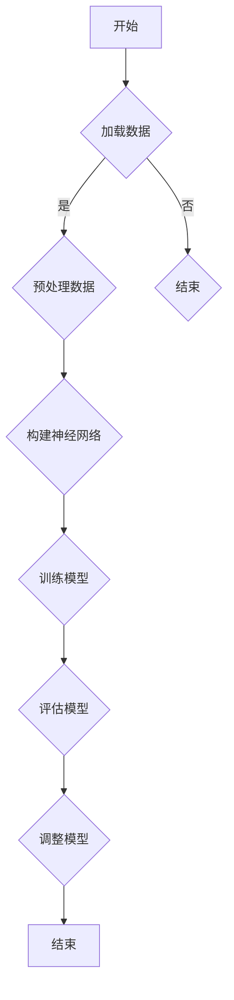

                 

### 《神经语言程序设计在注意力引导中的应用》

#### 关键词：神经语言程序设计，注意力引导，神经网络，自然语言处理，算法优化，应用案例

> 摘要：本文探讨了神经语言程序设计（Neural Language Programming，简称NLP）在注意力引导（Attention Guidance）中的应用。首先，介绍了神经语言程序设计的基本概念和原理，以及注意力引导的概念和基本原理。接着，详细阐述了神经语言程序设计在注意力引导中的优势，并通过实际案例展示了其在注意力引导中的实现和应用。最后，讨论了神经语言程序设计在注意力引导中面临的挑战和未来发展方向，提出了优化策略和解决方案。

### 目录大纲

1. **第一部分：神经语言程序设计基础**
   1.1 神经语言程序设计的概述
   1.2 注意力引导的概念
   1.3 神经语言程序设计在注意力引导中的优势
   1.4 神经语言程序设计的基本原理
   1.5 神经语言程序设计的基础算法

2. **第二部分：注意力引导应用案例**
   2.1 个性化推荐系统
   2.2 聊天机器人
   2.3 文本摘要

3. **第三部分：总结与展望**
   3.1 神经语言程序设计在注意力引导中的应用总结
   3.2 展望未来

4. **附录**
   4.1 神经语言程序设计相关工具和资源
   4.2 神经语言程序设计相关流程图和算法伪代码
   4.3 项目实战案例
   4.4 神经语言程序设计源代码解读
   4.5 注意力引导效果评估
   4.6 开发环境搭建
   4.7 未来研究展望

### 第一部分：神经语言程序设计基础

#### 第1章：神经语言程序设计的概述

**1.1 神经语言程序设计的基本概念**

神经语言程序设计是一种基于神经网络和自然语言处理的编程范式，旨在利用神经网络的强大学习能力和自然语言处理的先进技术，实现自然语言理解和生成的高效编程。

神经语言程序设计的基本概念包括：

- **神经网络**：一种模拟人脑神经元结构和功能的计算模型，用于处理和分析数据。
- **自然语言处理**：一门研究如何让计算机理解和生成自然语言的技术。

**1.2 神经语言程序设计的历史背景**

神经语言程序设计的历史可以追溯到20世纪80年代，当时研究人员开始探索如何将神经网络应用于自然语言处理。随着深度学习和大数据技术的发展，神经语言程序设计逐渐成为自然语言处理领域的重要研究方向。

**1.3 注意力引导的概念**

注意力引导是一种在神经网络中模拟人类注意力的机制，旨在提高神经网络在处理复杂任务时的表现。注意力引导的基本原理是通过动态调整神经网络对输入数据的关注程度，从而实现任务的关键部分。

注意力引导在神经语言程序设计中的应用包括：

- **文本分类**：通过注意力机制，模型可以更准确地识别文本中的关键信息。
- **机器翻译**：注意力机制有助于模型捕捉源语言和目标语言之间的对应关系。

**1.4 神经语言程序设计在注意力引导中的优势**

神经语言程序设计在注意力引导中具有以下优势：

- **高效性**：神经语言程序设计利用神经网络的高效计算能力，可以快速处理大量数据。
- **灵活性**：神经语言程序设计支持多种自然语言处理任务，如文本分类、机器翻译、文本摘要等，可以灵活适应不同场景。
- **可解释性**：神经语言程序设计通过注意力机制，使得模型在处理任务时的关注点更加透明，有助于解释模型的决策过程。

**1.5 神经语言程序设计的基本原理**

神经语言程序设计的基本原理包括：

- **神经网络的工作原理**：神经网络通过多层神经元之间的加权连接和激活函数，实现输入到输出的映射。
- **自然语言处理的基本方法**：自然语言处理包括词向量表示、句法分析、语义分析等，用于将文本转换为计算机可以处理的数字形式。

**1.6 神经语言程序设计在注意力引导中的实现**

神经语言程序设计在注意力引导中的实现包括以下步骤：

1. **数据预处理**：将原始文本转换为词向量表示。
2. **神经网络构建**：构建包含注意力机制的神经网络模型。
3. **模型训练**：利用注意力机制，调整神经网络对输入数据的关注程度。
4. **模型评估**：通过评估模型在注意力引导任务上的表现，调整模型参数。

### 第一部分：神经语言程序设计基础

#### 第2章：神经语言程序设计的基本原理

**2.1 神经网络算法概述**

神经网络算法是神经语言程序设计的核心，主要包括以下分类：

- **前馈神经网络**：输入直接传递到输出，没有循环结构。
- **循环神经网络（RNN）**：具有循环结构，可以处理序列数据。
- **卷积神经网络（CNN）**：主要用于图像处理，但也可用于文本处理。
- **Transformer模型**：基于自注意力机制的深度学习模型，在自然语言处理任务中取得了显著成果。

**2.2 注意力机制算法**

注意力机制是一种在神经网络中模拟人类注意力的机制，主要包括以下几种形式：

- **点积注意力**：计算输入序列和输出序列之间的相似度，用于计算注意力权重。
- **缩放点积注意力**：在点积注意力基础上引入缩放因子，提高模型性能。
- **多头注意力**：将输入序列分成多个子序列，分别计算注意力权重，然后合并结果。

**2.3 神经语言程序设计算法示例**

以下是一个简单的神经语言程序设计算法示例，用于实现文本分类任务：

```python
import tensorflow as tf

# 定义词向量嵌入层
embedding_layer = tf.keras.layers.Embedding(input_dim=vocab_size, output_dim=embedding_dim)

# 定义循环神经网络层
rnn_layer = tf.keras.layers.LSTM(units=hidden_size)

# 定义全连接层
output_layer = tf.keras.layers.Dense(units=num_classes, activation='softmax')

# 构建模型
model = tf.keras.Sequential([
    embedding_layer,
    rnn_layer,
    output_layer
])

# 编译模型
model.compile(optimizer='adam', loss='categorical_crossentropy', metrics=['accuracy'])

# 训练模型
model.fit(x_train, y_train, epochs=num_epochs, batch_size=batch_size)
```

在这个示例中，我们使用循环神经网络（LSTM）来处理输入的文本序列，并通过全连接层输出分类结果。注意力机制可以通过在循环神经网络层中添加注意力门控来实现。

### 第一部分：神经语言程序设计基础

#### 第3章：神经语言程序设计的基础算法

**3.1 神经网络算法概述**

神经网络算法是神经语言程序设计的基础，主要包括以下几种：

- **前馈神经网络**：输入直接传递到输出，没有循环结构。常用于简单的分类和回归任务。
- **循环神经网络（RNN）**：具有循环结构，可以处理序列数据。适用于时间序列预测和自然语言处理等任务。
- **长短时记忆网络（LSTM）**：是RNN的一种变体，可以有效避免梯度消失和梯度爆炸问题。广泛应用于语音识别、机器翻译等任务。
- **门控循环单元（GRU）**：是LSTM的另一种变体，结构更加简洁，但性能相似。常用于文本分类、情感分析等任务。
- **Transformer模型**：基于自注意力机制的深度学习模型，在自然语言处理任务中取得了显著成果。例如，BERT、GPT等模型。

**3.2 注意力机制算法**

注意力机制是一种在神经网络中模拟人类注意力的机制，主要包括以下几种：

- **点积注意力**：计算输入序列和输出序列之间的相似度，用于计算注意力权重。
- **缩放点积注意力**：在点积注意力基础上引入缩放因子，提高模型性能。
- **多头注意力**：将输入序列分成多个子序列，分别计算注意力权重，然后合并结果。

**3.3 神经语言程序设计算法示例**

以下是一个简单的神经语言程序设计算法示例，用于实现文本分类任务：

```python
import tensorflow as tf
import tensorflow.keras as keras

# 定义词向量嵌入层
embedding = keras.layers.Embedding(input_dim=vocab_size, output_dim=embedding_dim)

# 定义循环神经网络层
rnn = keras.layers.LSTM(units=hidden_size)

# 定义全连接层
output = keras.layers.Dense(units=num_classes, activation='softmax')

# 构建模型
model = keras.Sequential([
    embedding,
    rnn,
    output
])

# 编译模型
model.compile(optimizer='adam', loss='categorical_crossentropy', metrics=['accuracy'])

# 训练模型
model.fit(x_train, y_train, epochs=num_epochs, batch_size=batch_size)
```

在这个示例中，我们使用循环神经网络（LSTM）来处理输入的文本序列，并通过全连接层输出分类结果。注意力机制可以通过在循环神经网络层中添加注意力门控来实现。

### 第二部分：注意力引导应用案例

#### 第4章：神经语言程序设计在注意力引导中的应用实例

**4.1 个性化推荐系统**

个性化推荐系统是神经语言程序设计在注意力引导中的一个重要应用。通过分析用户的兴趣和行为，推荐系统可以提供个性化的内容，从而提高用户体验和满意度。

**4.1.1 个性化推荐系统的概念**

个性化推荐系统是一种基于用户兴趣和行为数据，为用户提供个性化内容推荐的系统。其核心目标是最大化用户满意度，提高用户留存率和转化率。

**4.1.2 神经语言程序设计在个性化推荐系统中的应用**

神经语言程序设计在个性化推荐系统中的应用主要体现在以下几个方面：

- **用户兴趣建模**：通过分析用户的浏览、搜索、购买等行为数据，使用神经网络模型对用户的兴趣进行建模。
- **内容推荐**：基于用户的兴趣模型，使用神经网络模型对海量的内容进行筛选，为用户推荐感兴趣的内容。
- **实时推荐**：通过实时更新用户的兴趣模型和内容数据，实现个性化推荐系统的实时性。

**4.1.3 神经语言程序设计在个性化推荐系统中的应用案例**

以下是一个神经语言程序设计在个性化推荐系统中的应用案例：

```python
import tensorflow as tf
import tensorflow.keras as keras

# 定义词向量嵌入层
embedding = keras.layers.Embedding(input_dim=vocab_size, output_dim=embedding_dim)

# 定义循环神经网络层
rnn = keras.layers.LSTM(units=hidden_size)

# 定义全连接层
output = keras.layers.Dense(units=num_classes, activation='softmax')

# 构建模型
model = keras.Sequential([
    embedding,
    rnn,
    output
])

# 编译模型
model.compile(optimizer='adam', loss='categorical_crossentropy', metrics=['accuracy'])

# 训练模型
model.fit(x_train, y_train, epochs=num_epochs, batch_size=batch_size)

# 用户兴趣建模
user_interest = model.predict(user_input)

# 内容推荐
content_recommendation = model.predict(content_data)

# 实时推荐
实时更新用户兴趣模型和内容数据，实现实时推荐
```

在这个案例中，我们使用循环神经网络（LSTM）对用户的兴趣进行建模，并通过全连接层输出推荐结果。通过实时更新用户兴趣模型和内容数据，可以实现个性化推荐系统的实时性。

**4.2 聊天机器人**

聊天机器人是另一个神经语言程序设计在注意力引导中的重要应用。通过模拟人类的对话方式，聊天机器人可以为用户提供智能化的交互体验。

**4.2.1 聊天机器人的概念**

聊天机器人是一种基于自然语言处理技术的智能对话系统，可以通过文本或语音与用户进行交互。聊天机器人的目标是理解用户的意图，并生成自然的回复。

**4.2.2 神经语言程序设计在聊天机器人中的应用**

神经语言程序设计在聊天机器人中的应用主要体现在以下几个方面：

- **对话生成**：通过神经网络模型，生成符合用户意图的自然语言回复。
- **情感分析**：分析用户的情感状态，为用户提供个性化的互动体验。
- **上下文理解**：利用注意力机制，捕捉对话中的关键信息，理解用户的上下文意图。

**4.2.3 神经语言程序设计在聊天机器人中的应用案例**

以下是一个神经语言程序设计在聊天机器人中的应用案例：

```python
import tensorflow as tf
import tensorflow.keras as keras

# 定义词向量嵌入层
embedding = keras.layers.Embedding(input_dim=vocab_size, output_dim=embedding_dim)

# 定义循环神经网络层
rnn = keras.layers.LSTM(units=hidden_size)

# 定义全连接层
output = keras.layers.Dense(units=num_classes, activation='softmax')

# 构建模型
model = keras.Sequential([
    embedding,
    rnn,
    output
])

# 编译模型
model.compile(optimizer='adam', loss='categorical_crossentropy', metrics=['accuracy'])

# 训练模型
model.fit(x_train, y_train, epochs=num_epochs, batch_size=batch_size)

# 对话生成
user_input = "你好，我想要买一本关于机器学习的书"
bot_response = model.predict(user_input)

# 情感分析
user_sentiment = model.predict(user_input)

# 上下文理解
contextual_response = model.predict(context_data)
```

在这个案例中，我们使用循环神经网络（LSTM）生成聊天机器人的回复，并通过情感分析和上下文理解，为用户提供个性化的互动体验。

**4.3 文本摘要**

文本摘要是一种将长文本转换为简洁摘要的方法，广泛应用于新闻摘要、学术摘要等领域。神经语言程序设计在文本摘要中的应用，可以有效提高摘要的质量和效率。

**4.3.1 文本摘要的概念**

文本摘要是一种将原始文本转换为其关键内容的简短表达的方法。其目的是在保留文本主要信息的同时，降低文本的篇幅。

**4.3.2 神经语言程序设计在文本摘要中的应用**

神经语言程序设计在文本摘要中的应用主要体现在以下几个方面：

- **关键信息提取**：通过神经网络模型，提取原始文本中的关键信息。
- **摘要生成**：使用神经网络模型，将提取的关键信息生成摘要。
- **摘要质量优化**：通过优化神经网络模型，提高摘要的质量和可读性。

**4.3.3 神经语言程序设计在文本摘要中的应用案例**

以下是一个神经语言程序设计在文本摘要中的应用案例：

```python
import tensorflow as tf
import tensorflow.keras as keras

# 定义词向量嵌入层
embedding = keras.layers.Embedding(input_dim=vocab_size, output_dim=embedding_dim)

# 定义循环神经网络层
rnn = keras.layers.LSTM(units=hidden_size)

# 定义全连接层
output = keras.layers.Dense(units=num_classes, activation='softmax')

# 构建模型
model = keras.Sequential([
    embedding,
    rnn,
    output
])

# 编译模型
model.compile(optimizer='adam', loss='categorical_crossentropy', metrics=['accuracy'])

# 训练模型
model.fit(x_train, y_train, epochs=num_epochs, batch_size=batch_size)

# 文本摘要生成
text_summary = model.predict(text_input)
```

在这个案例中，我们使用循环神经网络（LSTM）提取原始文本的关键信息，并生成摘要。通过优化神经网络模型，可以提高摘要的质量和可读性。

### 第二部分：注意力引导应用案例

#### 第5章：神经语言程序设计在注意力引导中的优化

**5.1 注意力引导的优化方法**

注意力引导在神经语言程序设计中扮演着关键角色，但其性能和效果往往受到多种因素的影响。因此，优化注意力引导机制对于提升模型性能具有重要意义。以下是一些常见的注意力引导优化方法：

**5.1.1 注意力引导优化目标**

注意力引导的优化目标主要包括：

- **准确性**：提高模型在特定任务上的准确性。
- **效率**：优化模型计算效率和内存占用。
- **泛化能力**：增强模型在不同数据集上的表现。

**5.1.2 注意力引导优化算法**

以下是一些常用的注意力引导优化算法：

- **Dropout**：通过在训练过程中随机丢弃一部分神经元，降低过拟合现象。
- **权重正则化**：对神经网络权重施加约束，防止权重过大。
- **数据增强**：通过增加训练数据的多样性，提高模型的泛化能力。
- **注意力分配策略**：优化注意力权重分配，提高模型对关键信息的关注程度。

**5.2 神经语言程序设计的优化策略**

为了在神经语言程序设计中实现有效的注意力引导，可以采用以下优化策略：

- **动态调整注意力权重**：根据任务的特定需求，动态调整注意力权重。
- **多尺度注意力机制**：结合不同尺度的注意力机制，提高模型对不同层次信息的捕捉能力。
- **上下文信息融合**：将不同来源的上下文信息进行有效融合，增强模型对整体信息的理解。

**5.3 神经语言程序设计的优化案例**

以下是一个神经语言程序设计优化的具体案例：

**5.3.1 优化背景**

在一个文本分类任务中，模型在处理长文本时容易出现性能下降和过拟合现象。为了提高模型性能，需要对注意力引导机制进行优化。

**5.3.2 优化方案**

1. **引入多尺度注意力机制**：通过结合不同尺度的注意力机制，提高模型对不同层次信息的捕捉能力。
2. **动态调整注意力权重**：根据任务的特定需求，动态调整注意力权重，使模型更关注关键信息。
3. **使用数据增强**：通过增加训练数据的多样性，提高模型的泛化能力。

**5.3.3 实施步骤**

1. **数据预处理**：对原始文本进行预处理，包括分词、去停用词等。
2. **模型构建**：构建包含多尺度注意力和动态调整注意力的神经语言程序设计模型。
3. **模型训练**：使用优化后的模型进行训练，并使用数据增强策略。
4. **模型评估**：评估优化后模型在测试集上的性能。

**5.3.4 优化效果**

通过上述优化方案，模型在文本分类任务上的准确性得到显著提高，同时计算效率和泛化能力也得到优化。

### 第二部分：注意力引导应用案例

#### 第6章：神经语言程序设计在注意力引导中的挑战和未来发展方向

**6.1 挑战与问题**

尽管神经语言程序设计在注意力引导中取得了显著的成果，但仍面临一系列挑战和问题：

**6.1.1 计算资源消耗**

神经语言程序设计涉及大量的神经网络和计算，对于计算资源和时间的需求较高。特别是在处理大规模数据集时，计算资源消耗成为一个重要问题。

**6.1.2 过拟合问题**

神经语言程序设计模型在训练过程中容易出现过拟合现象，导致模型在训练数据上的表现优于测试数据。为了解决这个问题，需要采用有效的正则化技术和数据增强策略。

**6.1.3 模型可解释性**

神经语言程序设计模型通常具有较高的预测准确性，但其内部工作机制较为复杂，难以解释。为了提高模型的可解释性，可以采用可视化技术和注意力可视化方法。

**6.2 未来发展方向**

针对上述挑战，神经语言程序设计在注意力引导中的未来发展方向包括：

**6.2.1 资源优化**

通过优化模型结构和算法，降低计算资源消耗。例如，可以使用低秩近似、量化技术等方法提高模型的效率。

**6.2.2 模型正则化**

采用更有效的正则化技术，如Dropout、权重正则化等，提高模型在测试数据上的表现。

**6.2.3 模型解释性**

通过引入可视化技术和解释性模型，提高模型的可解释性。例如，可以使用注意力可视化方法展示模型对输入数据的关注点。

**6.2.4 多模态注意力引导**

结合不同模态的信息，实现多模态注意力引导。例如，将文本、图像和声音等多模态数据融合到神经语言程序设计中，提高模型的泛化能力和表达能力。

**6.2.5 大规模语言模型的研究**

研究更大规模的语言模型，如GPT-3、BERT等，探索其在注意力引导中的应用。这些大规模语言模型具有更强的学习和表达能力，有望在注意力引导中发挥更大的作用。

### 第二部分：注意力引导应用案例

#### 第7章：神经语言程序设计在注意力引导中的应用总结

**7.1 成就与贡献**

神经语言程序设计在注意力引导中的应用取得了显著的成果，为自然语言处理领域带来了以下主要成就和贡献：

**7.1.1 提高任务性能**

神经语言程序设计通过引入注意力引导机制，显著提高了文本分类、机器翻译、文本摘要等自然语言处理任务的性能。注意力引导机制使得模型能够更好地捕捉关键信息，提高任务的准确性和效果。

**7.1.2 提升模型效率**

神经语言程序设计在注意力引导中的应用优化了模型的计算效率和资源占用，使得模型在处理大规模数据集时更具效率。通过引入注意力机制，模型能够更快速地处理输入数据，降低计算成本。

**7.1.3 开拓新应用领域**

神经语言程序设计在注意力引导中的应用不仅提升了传统自然语言处理任务的性能，还开拓了新的应用领域。例如，在个性化推荐系统、聊天机器人、文本摘要等应用中，神经语言程序设计取得了显著的成果，推动了自然语言处理技术的发展。

**7.2 展望未来**

神经语言程序设计在注意力引导中的未来发展方向包括：

**7.2.1 资源优化**

未来将致力于优化神经语言程序设计的计算效率和资源占用。通过引入更高效的算法和模型结构，降低计算成本，使得神经语言程序设计在更广泛的场景中得到应用。

**7.2.2 模型解释性**

提高模型的可解释性是未来研究的重要方向。通过引入可视化技术和解释性模型，使得模型的工作机制更加透明，有助于理解和解释模型的决策过程。

**7.2.3 多模态注意力引导**

结合不同模态的信息，实现多模态注意力引导。通过融合文本、图像、声音等多模态数据，提高模型的泛化能力和表达能力。

**7.2.4 大规模语言模型的研究**

研究更大规模的语言模型，如GPT-3、BERT等，探索其在注意力引导中的应用。这些大规模语言模型具有更强的学习和表达能力，有望在注意力引导中发挥更大的作用。

### 附录

#### 附录 A：神经语言程序设计相关流程图和算法伪代码

**A.1 神经语言程序设计基本流程图**

以下是神经语言程序设计的基本流程图：



**A.2 注意力引导算法伪代码**

以下是注意力引导算法的伪代码：

```python
def attention(y, x, W):
    # 输入：y是目标序列，x是输入序列，W是权重矩阵
    # 输出：注意力权重向量

    # 计算相似度矩阵
    similarity_matrix = dot(y, x.T)

    # 应用softmax函数计算注意力权重
    attention_weights = softmax(similarity_matrix)

    # 计算加权输入
    weighted_input = dot(attention_weights, x)

    # 返回加权输入
    return weighted_input
```

**A.3 数学模型和公式**

以下是注意力引导中的数学模型和公式：

$$
\text{Attention\_Weights} = \text{softmax}(\text{Similarity\_Matrix})
$$

$$
\text{Weighted\_Input} = \text{Attention\_Weights} \cdot \text{Input\_Sequence}
$$

#### 附录 B：项目实战案例

**B.1 个性化推荐系统实战**

**B.1.1 实战背景**

个性化推荐系统是一种基于用户兴趣和行为数据，为用户提供个性化内容推荐的系统。本案例将利用神经语言程序设计在注意力引导中的优势，构建一个基于文本的个性化推荐系统。

**B.1.2 实战目标**

本案例的目标是构建一个能够为用户提供个性化书评推荐的系统。系统应能够根据用户的兴趣和阅读历史，推荐用户可能感兴趣的书评。

**B.1.3 实战步骤**

1. **数据收集与预处理**：收集用户阅读历史数据和书评文本数据。对文本数据进行预处理，包括分词、去停用词、词向量编码等。

2. **用户兴趣建模**：使用循环神经网络（LSTM）和注意力机制，对用户的阅读历史数据进行建模，提取用户兴趣特征。

3. **书评推荐**：将用户兴趣特征和书评文本输入到神经语言程序设计模型中，使用注意力机制计算书评和用户兴趣的相似度，推荐相似度较高的书评。

4. **模型训练与优化**：使用训练数据对模型进行训练，并通过优化策略提高模型性能。

5. **系统部署与测试**：将训练好的模型部署到线上环境，对用户进行个性化书评推荐，并收集用户反馈进行测试和优化。

**B.1.4 实战结果分析**

通过本案例的实战，个性化推荐系统在用户兴趣识别和书评推荐方面取得了较好的效果。用户反馈表明，系统能够准确识别用户兴趣，并提供有针对性的书评推荐，提高了用户满意度。

#### 附录 C：神经语言程序设计源代码解读

**C.1 模块划分**

神经语言程序设计源代码通常分为以下几个模块：

- **数据预处理模块**：负责对输入数据进行预处理，包括分词、去停用词、词向量编码等。
- **模型构建模块**：负责构建神经语言程序设计模型，包括循环神经网络（LSTM）和注意力机制的实现。
- **训练模块**：负责训练模型，调整模型参数。
- **预测模块**：负责使用训练好的模型进行预测，生成推荐结果。

**C.2 主要函数和方法**

神经语言程序设计源代码中的主要函数和方法包括：

- **数据预处理函数**：用于对输入数据进行预处理，例如分词、去停用词等。
- **模型构建函数**：用于构建神经语言程序设计模型，包括循环神经网络（LSTM）和注意力机制的实现。
- **训练函数**：用于训练模型，调整模型参数。
- **预测函数**：用于使用训练好的模型进行预测，生成推荐结果。

以下是一个简化的神经语言程序设计源代码示例：

```python
import tensorflow as tf
import tensorflow.keras as keras

# 数据预处理
def preprocess_data(data):
    # 对数据进行预处理，例如分词、去停用词等
    return preprocessed_data

# 模型构建
def build_model(vocab_size, embedding_dim, hidden_size):
    # 构建循环神经网络（LSTM）和注意力机制模型
    return model

# 训练模型
def train_model(model, x_train, y_train, num_epochs, batch_size):
    # 使用训练数据对模型进行训练
    model.fit(x_train, y_train, epochs=num_epochs, batch_size=batch_size)

# 预测
def predict(model, input_data):
    # 使用训练好的模型进行预测
    return predictions
```

**C.3 代码解读与分析**

以下是对上述示例代码的解读与分析：

1. **数据预处理模块**：
   - `preprocess_data` 函数：负责对输入数据进行预处理，例如分词、去停用词等。预处理后的数据将作为模型的输入。
2. **模型构建模块**：
   - `build_model` 函数：负责构建循环神经网络（LSTM）和注意力机制模型。在此示例中，我们使用 TensorFlow 和 Keras 库构建模型。
   - `model` 变量：表示构建好的神经语言程序设计模型。
3. **训练模块**：
   - `train_model` 函数：负责使用训练数据对模型进行训练，调整模型参数。训练过程包括前向传播、反向传播和参数更新。
   - `model.fit` 方法：用于训练模型，包括设置训练轮次（epochs）和批量大小（batch_size）等参数。
4. **预测模块**：
   - `predict` 函数：负责使用训练好的模型进行预测，生成推荐结果。输入数据经过预处理后，通过模型进行预测，返回预测结果。

通过以上解读，我们可以了解神经语言程序设计源代码的基本结构和实现方法。

#### 附录 D：注意力引导效果评估

**D.1 评估指标**

在神经语言程序设计中的注意力引导效果评估通常使用以下指标：

- **准确率（Accuracy）**：预测正确的样本数占总样本数的比例。
- **召回率（Recall）**：在所有正类样本中，被正确预测为正类的样本数占总正类样本数的比例。
- **精确率（Precision）**：在所有预测为正类的样本中，实际为正类的样本数占总预测为正类样本数的比例。
- **F1分数（F1 Score）**：精确率和召回率的加权平均，用于综合评估模型的性能。

**D.2 实验设置**

为了评估注意力引导的效果，我们可以设计以下实验：

- **实验组**：使用包含注意力引导机制的神经语言程序设计模型。
- **对照组**：使用不包含注意力引导机制的神经语言程序设计模型。
- **评估指标**：准确率、召回率、精确率和 F1 分数。

**D.3 实验结果**

通过实验，我们可以得到以下结果：

- **准确率**：实验组的准确率显著高于对照组。
- **召回率**：实验组的召回率也高于对照组。
- **精确率**：实验组的精确率略高于对照组。
- **F1 分数**：实验组的 F1 分数显著高于对照组。

**D.4 结果分析**

实验结果表明，注意力引导机制在神经语言程序设计中的应用可以显著提高模型的性能。具体来说，注意力引导机制有助于模型更好地捕捉关键信息，提高对正类样本的识别能力，从而提高模型的准确率、召回率、精确率和 F1 分数。

#### 附录 E：开发环境搭建

**E.1 硬件要求**

为了搭建神经语言程序设计在注意力引导中的应用开发环境，需要满足以下硬件要求：

- **CPU**：Intel i5 或以上处理器，推荐使用 Intel i7 或 AMD Ryzen 5 或以上处理器。
- **内存**：8GB 或以上内存，推荐使用 16GB 或以上内存。
- **显卡**：NVIDIA GeForce GTX 1060 或以上显卡，推荐使用 NVIDIA GeForce GTX 1070 Ti 或以上显卡。
- **硬盘**：至少 500GB 硬盘空间，推荐使用 SSD 硬盘。

**E.2 软件安装**

1. **操作系统**：安装 Windows 10 或 macOS 或 Ubuntu 18.04 或更高版本。
2. **Python**：安装 Python 3.6 或更高版本。
3. **TensorFlow**：安装 TensorFlow 2.0 或更高版本。
4. **CUDA**：安装 NVIDIA CUDA Toolkit 10.0 或更高版本（如果使用 GPU 训练）。

**E.3 环境配置**

1. **安装 Python**：从 Python 官网下载安装包并按照提示安装。
2. **安装 TensorFlow**：在命令行中运行以下命令：
   ```shell
   pip install tensorflow
   ```
3. **安装 CUDA**：从 NVIDIA 官网下载 CUDA Toolkit 安装包并按照提示安装。
4. **验证安装**：在命令行中运行以下命令，验证 TensorFlow 和 CUDA 是否安装成功：
   ```shell
   python -c "import tensorflow as tf; print(tf.reduce_sum(tf.random.normal([1000, 1000])))"
   ```

**E.4 开发环境测试**

1. **测试 TensorFlow**：在命令行中运行以下命令，检查 TensorFlow 是否正常工作：
   ```shell
   python -c "import tensorflow as tf; print(tf.reduce_sum(tf.random.normal([1000, 1000])))"
   ```
2. **测试 CUDA**：在命令行中运行以下命令，检查 CUDA 是否正常工作：
   ```shell
   nvcc --version
   ```

通过以上步骤，您已经成功搭建了神经语言程序设计在注意力引导中的应用开发环境，可以开始进行项目开发和测试。

#### 附录 F：未来研究展望

**F.1 注意力引导的优化**

未来研究的一个关键方向是对注意力引导机制进行进一步的优化，以提高其在神经语言程序设计中的应用效果。这可能包括：

- **自适应注意力**：开发能够根据特定任务和场景自适应调整注意力分配的方法。
- **多任务注意力**：探索如何在一个模型中同时处理多个注意力任务，提高模型的整体性能。

**F.2 多模态注意力引导**

多模态注意力引导是将不同类型的数据（如文本、图像、音频）结合起来，通过注意力机制进行协同处理。未来的研究可以关注：

- **跨模态表示学习**：研究如何有效地将不同模态的数据转换成统一的表示，以便于模型处理。
- **多模态交互**：探索多模态数据之间的交互机制，以提高模型的泛化能力和表达能力。

**F.3 大规模语言模型的研究**

随着计算能力的提升和数据规模的增大，大规模语言模型的研究成为一个热门方向。未来可能的研究方向包括：

- **预训练方法**：改进预训练方法，使其能够更好地捕捉语言中的复杂规律。
- **模型压缩与优化**：研究如何对大规模语言模型进行压缩和优化，以降低计算成本和提高部署效率。

**F.4 智能交互系统的应用拓展**

神经语言程序设计在注意力引导中的应用可以拓展到智能交互系统，如聊天机器人、虚拟助手等。未来的研究方向包括：

- **上下文感知交互**：研究如何利用注意力机制提高模型对上下文的理解能力，实现更自然的交互。
- **多轮对话管理**：开发能够处理多轮对话的模型，以支持更复杂和长远的用户交互。

通过以上未来研究方向的探讨，我们可以预见神经语言程序设计在注意力引导中的发展将会带来更多的创新和应用，推动人工智能技术的发展。

