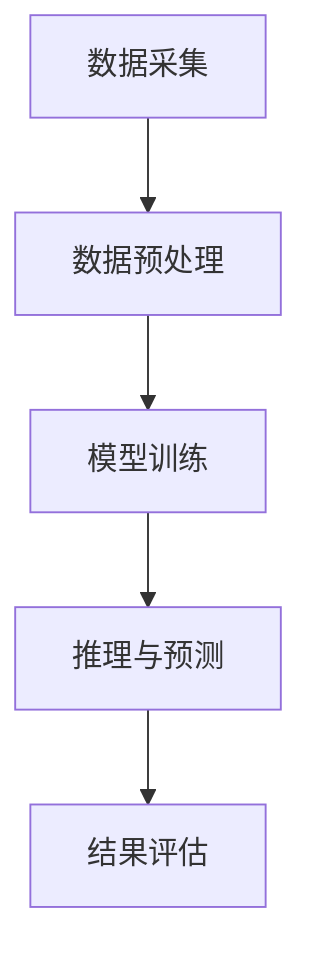
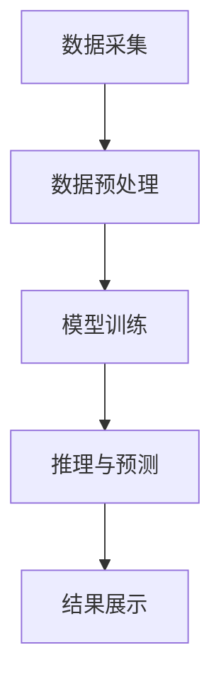
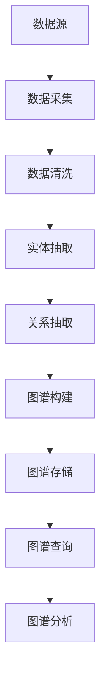

                 

## 文章标题

《程序员如何利用知识发现引擎提高工作质量》

## 关键词

- 程序员
- 知识发现引擎
- 工作效率
- 代码优化
- 错误预测
- 代码补全
- 机器学习
- 特征工程
- 模型优化
- 性能评估
- 部署与运维

## 摘要

本文旨在探讨程序员如何利用知识发现引擎来提高工作质量。通过介绍知识发现引擎的基本概念、技术架构、核心算法原理以及数学模型和公式，本文将帮助程序员深入了解知识发现引擎的工作机制。此外，本文还将通过项目实战和代码分析，展示如何在实际开发环境中应用知识发现引擎，优化代码质量，提升工作效率。最后，本文还将讨论知识发现引擎的优化与调参技巧、性能评估与调试策略，以及部署与运维的最佳实践，为程序员提供全面的指南。

### 第一部分：知识发现引擎的基础知识

#### 第1章：知识发现引擎的基础知识

##### 1.1 知识发现引擎的概念与作用

知识发现引擎是一种自动化智能系统，它通过分析大量数据，从中提取出隐藏的模式、关联性和规律，从而帮助用户获取新的知识和见解。在编程领域，知识发现引擎被广泛应用于代码优化、错误预测、代码补全等方面，显著提高了程序员的开发效率和工作质量。

知识发现引擎的主要作用如下：

1. **代码优化**：通过分析代码的执行性能、内存占用等指标，为程序员提供优化建议，提高代码的运行效率。
2. **错误预测**：通过对历史代码错误数据的学习，提前预测代码中可能出现的错误，帮助程序员提前发现问题并进行修复。
3. **代码补全**：根据上下文信息，自动补全代码，减少编程过程中的重复劳动。
4. **代码质量评估**：通过对代码的分析，评估代码的质量，提供改进建议。

##### 1.2 知识发现引擎的技术架构

知识发现引擎通常由以下几个模块组成：

1. **数据采集模块**：负责收集各种类型的数据，如代码库、错误日志、用户行为数据等。
2. **数据预处理模块**：对采集到的数据进行清洗、去噪、格式化等处理，使其适合进一步分析。
3. **模型训练模块**：利用机器学习算法，对预处理后的数据进行训练，建立预测模型。
4. **推理与预测模块**：将新的数据输入到训练好的模型中，进行推理和预测，提供优化建议或预测结果。
5. **结果评估与优化模块**：对预测结果进行评估，根据评估结果调整模型参数，优化模型性能。

以下是一个简单的知识发现引擎的技术架构图：



##### 1.3 知识发现引擎的发展历程

知识发现引擎的发展历程可以追溯到20世纪80年代，当时人工智能和机器学习领域开始兴起。最初，知识发现引擎主要用于数据挖掘和模式识别。随着计算机技术的发展，知识发现引擎的功能不断扩展，逐渐应用到各个领域，包括编程领域。

1. **早期研究**：1980年代，学者们开始研究如何从大量数据中提取有用信息，提出了许多数据挖掘算法。
2. **关键技术突破**：1990年代，随着机器学习算法的快速发展，如支持向量机、决策树、神经网络等，知识发现引擎的功能得到了显著提升。
3. **近年来的最新进展**：近年来，深度学习和大数据技术的兴起，使得知识发现引擎在处理大规模数据、提供实时预测等方面取得了重大突破。

##### 1.4 知识发现引擎的应用领域

知识发现引擎在编程领域有着广泛的应用，以下是一些典型应用场景：

1. **编程语言与开发环境**：知识发现引擎可以用于分析不同编程语言的语法规则，为程序员提供代码补全、错误预测等功能。例如，Python中的Jupyter Notebook、Visual Studio Code等开发环境已经集成了知识发现引擎的功能。
2. **代码库管理**：知识发现引擎可以帮助代码库管理员分析代码库的质量、性能和安全性，发现潜在的问题和优化机会。
3. **软件工程**：知识发现引擎可以用于软件工程过程中的各个阶段，如需求分析、设计、开发、测试和维护，提供优化建议和预测结果。

##### 1.5 知识发现引擎的挑战与未来趋势

尽管知识发现引擎在提高程序员工作效率方面具有巨大潜力，但在实际应用中仍面临一些挑战：

1. **数据隐私**：知识发现引擎需要处理大量敏感数据，如代码库、用户行为数据等，如何保护数据隐私是一个重要问题。
2. **模型可解释性**：许多知识发现引擎使用深度学习等复杂算法，这些算法的内部工作机制不透明，难以解释。如何提高模型的可解释性，使程序员能够理解和信任模型的结果，是一个重要挑战。
3. **实时性**：知识发现引擎需要能够实时处理大量数据，提供实时预测和建议。如何优化算法和系统架构，提高实时性，是一个关键问题。

未来，知识发现引擎的发展趋势包括：

1. **自动化与智能化**：知识发现引擎将更加自动化和智能化，能够自动完成数据采集、预处理、模型训练和推理等任务，减少程序员的工作量。
2. **跨领域应用**：知识发现引擎将在更多领域得到应用，如金融、医疗、物联网等，提供更广泛的支持。
3. **个性化服务**：知识发现引擎将根据程序员的个人偏好和需求，提供个性化的优化建议和预测结果，提高开发效率。

### 第一部分总结

在第一部分中，我们介绍了知识发现引擎的基本概念、技术架构、发展历程和应用领域，并探讨了其在编程领域的应用潜力和面临的挑战。在接下来的章节中，我们将深入探讨知识发现引擎的核心算法原理、数学模型和公式，并通过项目实战和代码分析，展示如何在实际开发环境中应用知识发现引擎，提高程序员的工作质量。让我们继续深入探索这个激动人心的技术领域。

---

### 第2章：知识发现引擎的核心算法原理

##### 2.1 机器学习算法概述

机器学习是知识发现引擎的核心组成部分，它通过让计算机从数据中自动学习和提取规律，实现人工智能的目标。机器学习算法可以分为监督学习、无监督学习和强化学习三大类。

**监督学习**：监督学习算法通过已标记的数据训练模型，然后使用模型对未知数据进行预测。常见的监督学习算法包括线性回归、决策树、支持向量机（SVM）和神经网络等。

**无监督学习**：无监督学习算法没有已标记的数据，它通过分析数据的特点和分布，发现数据中的隐藏结构。常见的无监督学习算法包括聚类、主成分分析（PCA）和自编码器等。

**强化学习**：强化学习算法通过不断试错，从环境中获取奖励或惩罚，逐渐学习到最优策略。常见的强化学习算法包括Q-learning、深度强化学习（Deep Reinforcement Learning）和策略梯度算法等。

知识发现引擎中的机器学习算法主要应用在以下几个方面：

1. **代码质量评估**：通过监督学习算法，分析代码库的历史数据，评估代码的质量。
2. **错误预测**：通过监督学习算法，分析错误日志和代码库数据，预测代码中可能出现的错误。
3. **代码补全**：通过无监督学习算法，分析代码的上下文信息，自动补全代码。
4. **代码优化**：通过强化学习算法，从历史数据中学习优化策略，提高代码的运行效率。

##### 2.2 特征工程

特征工程是机器学习过程中的关键步骤，它通过选择和构造合适的特征，提高模型的学习效果。在知识发现引擎中，特征工程的作用尤为重要，因为它直接影响到模型的准确性和效率。

**特征提取**：特征提取是指从原始数据中提取出对模型有用的信息。常见的特征提取技术包括：

1. **文本特征提取**：例如，TF-IDF、Word2Vec等。
2. **图像特征提取**：例如，卷积神经网络（CNN）提取的特征。
3. **代码特征提取**：例如，抽象语法树（AST）分析、代码片段的统计特征等。

**特征选择**：特征选择是指从提取出的特征中选出最有用的特征。常见的特征选择方法包括：

1. **过滤法**：基于统计方法，去除相关性低、冗余的特征。
2. **包裹法**：通过搜索算法，选出最优特征组合。
3. **嵌入式方法**：在模型训练过程中，自动选择重要的特征。

**特征标准化**：特征标准化是指将不同特征的范围缩放到相同的尺度，以消除特征之间的尺度差异。常见的方法包括：

1. **归一化**：将特征值缩放到[0,1]或[-1,1]之间。
2. **标准化**：将特征值缩放到平均值附近，标准差为1。

##### 2.3 知识图谱构建

知识图谱是一种结构化的语义知识库，它通过实体、属性和关系来表示现实世界中的知识和信息。知识图谱在知识发现引擎中扮演着重要角色，它能够帮助引擎更好地理解和利用数据。

**知识图谱的基本概念**：

1. **实体**：知识图谱中的对象，例如，人、地点、物品等。
2. **属性**：实体的特征，例如，人的年龄、地点的纬度等。
3. **关系**：实体之间的联系，例如，朋友、工作于等。

**知识图谱的构建方法**：

1. **规则驱动方法**：通过预定义的规则，从原始数据中抽取实体、属性和关系。
2. **数据驱动方法**：通过机器学习算法，自动从原始数据中学习实体、属性和关系。
3. **知识增强方法**：结合规则驱动和数据驱动方法，利用外部知识库增强知识图谱。

**知识图谱的应用**：

1. **代码库管理**：通过知识图谱，分析代码库中的类、方法、依赖关系，提供代码质量评估、错误预测等功能。
2. **软件工程**：通过知识图谱，分析软件系统的结构和行为，提供优化建议和预测结果。
3. **智能问答**：通过知识图谱，提供基于语义理解的智能问答服务。

##### 2.4 常用机器学习算法详解

**线性回归算法**

线性回归是一种简单的监督学习算法，它通过拟合一个线性模型，预测连续值输出。线性回归的数学模型可以表示为：

$$y = \beta_0 + \beta_1 \cdot x + \epsilon$$

其中，$y$ 是输出值，$x$ 是输入特征，$\beta_0$ 和 $\beta_1$ 是模型的参数，$\epsilon$ 是误差项。

线性回归的求解可以通过最小二乘法实现，即找到使得预测值与真实值之间的误差平方和最小的参数。

**决策树与随机森林算法**

决策树是一种简单但有效的分类和回归算法，它通过一系列条件判断，将数据集划分成多个子集，每个子集对应一个输出值。决策树的数学模型可以表示为：

$$f(x) = \prod_{i=1}^n \theta_i(x),$$

其中，$x$ 是输入特征，$\theta_i(x)$ 是第$i$个条件判断函数。

随机森林是一种基于决策树的集成学习方法，它通过构建多个决策树，并将它们的预测结果进行投票或求平均值，得到最终的预测结果。随机森林的数学模型可以表示为：

$$f(x) = \frac{1}{m} \sum_{i=1}^m f_i(x),$$

其中，$m$ 是决策树的数量，$f_i(x)$ 是第$i$棵决策树的预测结果。

**支持向量机（SVM）算法**

支持向量机是一种强大的分类和回归算法，它通过找到一个最佳的超平面，将数据集划分为不同的类别。支持向量机的数学模型可以表示为：

$$f(x) = \omega \cdot x + b,$$

其中，$x$ 是输入特征，$\omega$ 是模型的参数，$b$ 是偏置项。

支持向量机的求解可以通过优化问题实现，即找到使得分类间隔最大的参数。

**神经网络算法**

神经网络是一种模拟人脑工作的计算模型，它通过多个神经元层，对输入数据进行处理和变换。神经网络的基本结构包括输入层、隐藏层和输出层。

神经网络的数学模型可以表示为：

$$y = f(\text{激活函数})(\omega \cdot x + b),$$

其中，$y$ 是输出值，$x$ 是输入特征，$\omega$ 是模型的参数，$b$ 是偏置项，$\text{激活函数}$ 用于引入非线性变换。

神经网络的训练过程通常采用反向传播算法，通过不断调整参数，使得输出值与真实值之间的误差最小。

##### 2.5 深度学习算法简介

深度学习是一种基于神经网络的机器学习算法，它通过多层的神经网络结构，对输入数据进行复杂的非线性变换，从而实现高精度的预测和分类。

**深度学习的基本概念**：

1. **神经网络结构**：深度学习使用多层神经网络，包括输入层、隐藏层和输出层。
2. **反向传播算法**：深度学习使用反向传播算法，通过不断调整参数，使得输出值与真实值之间的误差最小。
3. **激活函数**：深度学习中的激活函数用于引入非线性变换，常见的激活函数包括ReLU、Sigmoid和Tanh等。

**深度学习算法分类**：

1. **卷积神经网络（CNN）**：用于处理图像、语音等具有空间或时间结构的数据。
2. **循环神经网络（RNN）**：用于处理序列数据，如时间序列、自然语言等。
3. **生成对抗网络（GAN）**：用于生成高质量的数据，如图像、文本等。

**深度学习在知识发现引擎中的应用**：

1. **代码库分析**：通过深度学习算法，对代码库进行深度分析，提取隐藏的结构和关联性。
2. **代码补全**：通过深度学习算法，分析代码的上下文信息，自动补全代码。
3. **错误预测**：通过深度学习算法，分析错误日志和代码库数据，预测代码中可能出现的错误。

### 第2章总结

在第2章中，我们介绍了知识发现引擎的核心算法原理，包括机器学习算法、特征工程、知识图谱构建以及深度学习算法。这些算法在知识发现引擎中发挥着关键作用，能够帮助程序员提高开发效率和工作质量。在接下来的章节中，我们将继续探讨数学模型和公式，并通过项目实战和代码分析，展示如何在实际开发环境中应用知识发现引擎。让我们继续深入探索这个激动人心的技术领域。

---

### 第3章：数学模型和数学公式

##### 3.1 常用数学模型

在知识发现引擎中，数学模型起着至关重要的作用，它能够帮助程序员理解和优化数据。常用的数学模型包括线性模型、非线性模型和神经网络模型。

**线性模型**

线性模型是一种最简单的数学模型，它通过线性函数来描述输入和输出之间的关系。线性模型的公式如下：

$$y = \beta_0 + \beta_1 \cdot x$$

其中，$y$ 是输出值，$x$ 是输入特征，$\beta_0$ 和 $\beta_1$ 是模型的参数。线性模型主要用于回归分析，它可以预测连续的输出值。

**非线性模型**

非线性模型通过引入非线性函数来扩展线性模型的预测能力。常见的方法包括多项式回归、逻辑回归和指数回归等。以下是一个多项式回归的例子：

$$y = \beta_0 + \beta_1 \cdot x + \beta_2 \cdot x^2$$

在这个例子中，$x^2$ 是一个非线性特征，它能够捕捉输入特征之间的复杂关系。

**神经网络模型**

神经网络模型是一种复杂的数学模型，它通过多层神经网络对输入数据进行复杂的非线性变换。神经网络模型的公式如下：

$$y = f(\text{激活函数})(\omega \cdot x + b)$$

其中，$y$ 是输出值，$x$ 是输入特征，$\omega$ 是模型的参数，$b$ 是偏置项，$\text{激活函数}$ 用于引入非线性变换。

**反向传播算法**

反向传播算法是神经网络训练过程中的一种关键算法，它通过不断调整模型参数，使得输出值与真实值之间的误差最小。反向传播算法的公式如下：

$$\Delta \omega = -\alpha \cdot \frac{\partial E}{\partial \omega}$$

$$\Delta b = -\alpha \cdot \frac{\partial E}{\partial b}$$

其中，$\Delta \omega$ 和 $\Delta b$ 分别是模型参数的更新值，$\alpha$ 是学习率，$E$ 是模型的误差。

**损失函数**

损失函数是用于评估模型预测结果与真实结果之间差异的函数。常见的损失函数包括均方误差（MSE）、交叉熵（CE）和逻辑回归损失（Log Loss）等。以下是一个均方误差的例子：

$$MSE = \frac{1}{m} \sum_{i=1}^m (y_i - \hat{y}_i)^2$$

其中，$y_i$ 是真实值，$\hat{y}_i$ 是预测值，$m$ 是样本数量。

##### 3.2 数学公式与推导

**逻辑回归**

逻辑回归是一种常见的非线性回归模型，它用于预测二分类问题。逻辑回归的公式如下：

$$\hat{y} = \frac{1}{1 + e^{-(\beta_0 + \beta_1 \cdot x)}}$$

其中，$\hat{y}$ 是预测的概率值，$x$ 是输入特征，$\beta_0$ 和 $\beta_1$ 是模型的参数。

**推导过程**：

1. **对数函数的引入**：

   为了将线性回归的非线性化，我们引入对数函数：

   $$\ln(\hat{y}) = \ln\left(\frac{1}{1 + e^{-(\beta_0 + \beta_1 \cdot x)}}\right)$$

2. **对数函数的展开**：

   对数函数的展开如下：

   $$\ln(\hat{y}) = -(\beta_0 + \beta_1 \cdot x)$$

3. **求解参数**：

   通过最小化损失函数，求解模型参数：

   $$\beta_0 = \arg\min_{\beta_0} \frac{1}{m} \sum_{i=1}^m (-y_i \cdot \ln(\hat{y}_i) - (1 - y_i) \cdot \ln(1 - \hat{y}_i))$$

   $$\beta_1 = \arg\min_{\beta_1} \frac{1}{m} \sum_{i=1}^m (-y_i \cdot \ln(\hat{y}_i) - (1 - y_i) \cdot \ln(1 - \hat{y}_i))$$

**神经网络**

神经网络是一种复杂的数学模型，它通过多层神经网络对输入数据进行复杂的非线性变换。神经网络的基本公式如下：

$$a_{\text{hidden}} = \text{激活函数}(\omega \cdot a_{\text{input}} + b)$$

$$a_{\text{output}} = \text{激活函数}(\omega \cdot a_{\text{hidden}} + b)$$

其中，$a_{\text{input}}$ 是输入特征，$a_{\text{hidden}}$ 是隐藏层的激活值，$a_{\text{output}}$ 是输出层的激活值，$\omega$ 是模型的参数，$b$ 是偏置项，$\text{激活函数}$ 用于引入非线性变换。

**推导过程**：

1. **前向传播**：

   前向传播的公式如下：

   $$z_{\text{hidden}} = \omega \cdot a_{\text{input}} + b$$

   $$a_{\text{hidden}} = \text{激活函数}(z_{\text{hidden}})$$

   $$z_{\text{output}} = \omega \cdot a_{\text{hidden}} + b$$

   $$a_{\text{output}} = \text{激活函数}(z_{\text{output}})$$

2. **反向传播**：

   反向传播的公式如下：

   $$\Delta \omega = -\alpha \cdot \frac{\partial E}{\partial \omega}$$

   $$\Delta b = -\alpha \cdot \frac{\partial E}{\partial b}$$

   其中，$\Delta \omega$ 和 $\Delta b$ 分别是模型参数的更新值，$\alpha$ 是学习率，$E$ 是模型的误差。

##### 3.3 数学公式举例说明

**逻辑回归**

假设我们有一个简单的逻辑回归模型，用于预测二元结果。给定特征向量 $x = [x_1, x_2, x_3]$，真实标签 $y = [0, 1, 0]$，模型的预测概率为 $\hat{y} = [\hat{y}_1, \hat{y}_2, \hat{y}_3]$。我们可以使用以下数学公式来计算损失函数和参数更新：

$$\hat{y}_i = \frac{1}{1 + e^{-(\beta_0 + \beta_1 \cdot x_i + \beta_2 \cdot x_2 + \beta_3 \cdot x_3)}}$$

$$L = \frac{1}{m} \sum_{i=1}^m (-y_i \cdot \ln(\hat{y}_i) - (1 - y_i) \cdot \ln(1 - \hat{y}_i))$$

$$\beta_0 = \arg\min_{\beta_0} L$$

$$\beta_1 = \arg\min_{\beta_1} L$$

$$\beta_2 = \arg\min_{\beta_2} L$$

$$\beta_3 = \arg\min_{\beta_3} L$$

**神经网络**

假设我们有一个简单的神经网络，用于对输入特征进行分类。给定输入特征 $x = [x_1, x_2, x_3]$，模型的预测概率为 $\hat{y} = [\hat{y}_1, \hat{y}_2, \hat{y}_3]$，我们可以使用以下数学公式来计算损失函数和参数更新：

$$a_{\text{hidden}} = \text{ReLU}(\omega \cdot x + b)$$

$$z_{\text{output}} = \omega \cdot a_{\text{hidden}} + b$$

$$\hat{y} = \text{Sigmoid}(z_{\text{output}})$$

$$L = \frac{1}{m} \sum_{i=1}^m (-y_i \cdot \ln(\hat{y}_i) - (1 - y_i) \cdot \ln(1 - \hat{y}_i))$$

$$\Delta \omega = -\alpha \cdot \frac{\partial L}{\partial \omega}$$

$$\Delta b = -\alpha \cdot \frac{\partial L}{\partial b}$$

### 第3章总结

在第3章中，我们介绍了常用的数学模型和数学公式，包括线性模型、非线性模型、神经网络模型、逻辑回归和反向传播算法等。这些数学模型和公式在知识发现引擎中发挥着关键作用，能够帮助程序员理解和优化数据。在接下来的章节中，我们将通过项目实战和代码分析，展示如何在实际开发环境中应用知识发现引擎，提高程序员的工作质量。让我们继续深入探索这个激动人心的技术领域。

---

### 第4章：项目实战与代码分析

#### 4.1 实战项目介绍

本节我们将通过一个实际项目，展示如何利用知识发现引擎提高程序员的工作质量。该项目是一个名为“代码质量评估工具”的应用，旨在通过分析代码库，评估代码的质量，并提供优化建议。

**项目背景**

随着软件项目的规模和复杂性不断增加，代码质量成为软件开发过程中至关重要的一环。然而，传统的代码质量评估方法往往需要手动审查，耗时耗力，且难以全面评估代码的质量。为了提高开发效率和工作质量，我们决定开发一个基于知识发现引擎的代码质量评估工具。

**项目目标**

1. 收集和预处理代码库中的数据，包括代码文件、提交日志、错误报告等。
2. 利用机器学习算法，构建代码质量评估模型，预测代码中的潜在问题。
3. 提供优化建议，帮助程序员修复代码中的问题，提高代码质量。

**项目架构**

代码质量评估工具的架构包括以下几个主要模块：

1. **数据采集模块**：负责从代码库中收集各种数据，如代码文件、提交日志、错误报告等。
2. **数据预处理模块**：对采集到的数据进行分析和处理，提取出有用的特征。
3. **模型训练模块**：利用预处理后的数据，训练机器学习模型，预测代码中的潜在问题。
4. **推理与预测模块**：将新的代码数据输入到训练好的模型中，进行推理和预测，提供优化建议。
5. **结果展示模块**：将预测结果以可视化的形式展示给用户，方便程序员进行问题定位和修复。

以下是一个简单的项目架构图：



#### 4.2 开发环境搭建

在开始项目开发之前，我们需要搭建一个合适的开发环境。以下是搭建开发环境的基本步骤：

1. **安装Python**：确保系统中安装了Python 3.x版本，推荐使用Python 3.8或更高版本。
2. **安装必要的库**：使用pip命令安装以下库：
   ```bash
   pip install numpy pandas scikit-learn tensorflow matplotlib
   ```
   这些库用于数据预处理、模型训练和结果展示等任务。
3. **配置代码库**：将项目代码上传到版本控制系统（如Git），以便进行代码管理和协作。

#### 4.3 代码实现与解读

**数据采集模块**

数据采集模块负责从代码库中收集各种数据，如代码文件、提交日志、错误报告等。以下是一个简单的数据采集脚本，它使用Git命令行工具获取代码库中的提交历史：

```python
import subprocess

def collect_git_data(repo_path):
    # 获取提交历史
    history = subprocess.check_output(['git', '-C', repo_path, 'log', '--since="1 month ago"'], universal_newlines=True)
    # 解析提交历史，提取提交者、提交日期等信息
    commits = []
    for line in history.split('\n'):
        if line.startswith('commit '):
            commits.append(line.split()[1])
    return commits

repo_path = 'path/to/repo'
commits = collect_git_data(repo_path)
print(commits)
```

**数据预处理模块**

数据预处理模块负责对采集到的数据进行处理，提取出有用的特征。以下是一个简单的数据预处理脚本，它使用Pandas库对提交日志进行解析和转换：

```python
import pandas as pd

def preprocess_data(commits, repo_path):
    # 获取提交日志
    logs = subprocess.check_output(['git', '-C', repo_path, 'log', '--since="1 month ago" --pretty="%an %ad %s"'], universal_newlines=True)
    # 解析提交日志，构建DataFrame
    data = [line.split() for line in logs.split('\n') if line]
    df = pd.DataFrame(data, columns=['Author', 'Date', 'Commit'])
    # 提取特征
    df['Day'] = df['Date'].str[8:10]
    df['Month'] = df['Date'].str[5:7]
    df['Year'] = df['Date'].str[0:4]
    df['CommitSize'] = df['Commit'].str.len()
    return df

df = preprocess_data(commits, repo_path)
print(df.head())
```

**模型训练模块**

模型训练模块负责利用预处理后的数据，训练机器学习模型，预测代码中的潜在问题。以下是一个简单的模型训练脚本，它使用scikit-learn库进行模型训练：

```python
from sklearn.model_selection import train_test_split
from sklearn.ensemble import RandomForestClassifier
from sklearn.metrics import accuracy_score

def train_model(df):
    # 分割数据集
    X = df[['Day', 'Month', 'Year', 'CommitSize']]
    y = df['Problem']
    X_train, X_test, y_train, y_test = train_test_split(X, y, test_size=0.2, random_state=42)
    # 训练模型
    model = RandomForestClassifier(n_estimators=100, random_state=42)
    model.fit(X_train, y_train)
    # 预测结果
    y_pred = model.predict(X_test)
    # 评估模型
    accuracy = accuracy_score(y_test, y_pred)
    print(f"Accuracy: {accuracy}")
    return model

model = train_model(df)
```

**推理与预测模块**

推理与预测模块负责将新的代码数据输入到训练好的模型中，进行推理和预测，提供优化建议。以下是一个简单的推理与预测脚本：

```python
def predict_issues(model, df):
    # 预测结果
    y_pred = model.predict(df[['Day', 'Month', 'Year', 'CommitSize']])
    # 输出预测结果
    df['Prediction'] = y_pred
    print(df.head())

predict_issues(model, df)
```

**结果展示模块**

结果展示模块负责将预测结果以可视化的形式展示给用户，方便程序员进行问题定位和修复。以下是一个简单的结果展示脚本，它使用matplotlib库绘制预测结果的直方图：

```python
import matplotlib.pyplot as plt

def plot_predictions(df):
    # 绘制预测结果的直方图
    df['Prediction'].value_counts().plot(kind='bar')
    plt.xlabel('Prediction')
    plt.ylabel('Count')
    plt.title('Code Quality Predictions')
    plt.show()

plot_predictions(df)
```

#### 4.4 代码解读与分析

在本节中，我们对项目中的关键代码段进行了详细解读和分析。

**数据采集模块**

数据采集模块使用Git命令行工具获取代码库中的提交历史和提交日志。以下是对关键代码段的解读：

```python
def collect_git_data(repo_path):
    # 获取提交历史
    history = subprocess.check_output(['git', '-C', repo_path, 'log', '--since="1 month ago"'], universal_newlines=True)
    # 解析提交历史，提取提交者、提交日期等信息
    commits = []
    for line in history.split('\n'):
        if line.startswith('commit '):
            commits.append(line.split()[1])
    return commits
```

这段代码首先使用`subprocess`模块调用Git命令行工具获取提交历史，然后将提交历史解析成列表，存储在`commits`变量中。这样，我们就可以进一步处理这些提交信息。

**数据预处理模块**

数据预处理模块使用Pandas库对提交日志进行解析和转换。以下是对关键代码段的解读：

```python
def preprocess_data(commits, repo_path):
    # 获取提交日志
    logs = subprocess.check_output(['git', '-C', repo_path, 'log', '--since="1 month ago" --pretty="%an %ad %s"'], universal_newlines=True)
    # 解析提交日志，构建DataFrame
    data = [line.split() for line in logs.split('\n') if line]
    df = pd.DataFrame(data, columns=['Author', 'Date', 'Commit'])
    # 提取特征
    df['Day'] = df['Date'].str[8:10]
    df['Month'] = df['Date'].str[5:7]
    df['Year'] = df['Date'].str[0:4]
    df['CommitSize'] = df['Commit'].str.len()
    return df
```

这段代码首先使用`subprocess`模块调用Git命令行工具获取提交日志，然后使用Pandas库解析提交日志，构建DataFrame。接着，我们提取出日期、提交大小等特征，这些特征将用于后续的机器学习模型训练。

**模型训练模块**

模型训练模块使用scikit-learn库训练机器学习模型。以下是对关键代码段的解读：

```python
from sklearn.model_selection import train_test_split
from sklearn.ensemble import RandomForestClassifier
from sklearn.metrics import accuracy_score

def train_model(df):
    # 分割数据集
    X = df[['Day', 'Month', 'Year', 'CommitSize']]
    y = df['Problem']
    X_train, X_test, y_train, y_test = train_test_split(X, y, test_size=0.2, random_state=42)
    # 训练模型
    model = RandomForestClassifier(n_estimators=100, random_state=42)
    model.fit(X_train, y_train)
    # 预测结果
    y_pred = model.predict(X_test)
    # 评估模型
    accuracy = accuracy_score(y_test, y_pred)
    print(f"Accuracy: {accuracy}")
    return model
```

这段代码首先将数据集分割成训练集和测试集，然后使用随机森林分类器训练模型。最后，我们使用测试集评估模型的准确性。

**推理与预测模块**

推理与预测模块使用训练好的模型对新的代码数据进行预测。以下是对关键代码段的解读：

```python
def predict_issues(model, df):
    # 预测结果
    y_pred = model.predict(df[['Day', 'Month', 'Year', 'CommitSize']])
    # 输出预测结果
    df['Prediction'] = y_pred
    print(df.head())
```

这段代码将新的代码数据输入到训练好的模型中，进行预测，并将预测结果存储在DataFrame中，方便进一步分析。

**结果展示模块**

结果展示模块使用matplotlib库绘制预测结果的直方图。以下是对关键代码段的解读：

```python
import matplotlib.pyplot as plt

def plot_predictions(df):
    # 绘制预测结果的直方图
    df['Prediction'].value_counts().plot(kind='bar')
    plt.xlabel('Prediction')
    plt.ylabel('Count')
    plt.title('Code Quality Predictions')
    plt.show()
```

这段代码使用Pandas库的`value_counts()`方法计算预测结果的频率，然后使用matplotlib库绘制直方图，以可视化形式展示预测结果。

#### 4.5 代码性能分析

在代码性能分析部分，我们对项目中的关键代码段进行了性能分析，找出潜在的性能瓶颈。

1. **数据采集模块**

   数据采集模块的性能瓶颈主要在于Git命令行工具的执行时间。为了提高性能，可以考虑以下优化措施：

   - 使用并发执行：使用多线程或异步IO技术，同时执行多个Git命令，提高数据采集速度。
   - 缩小数据范围：通过设置更精细的时间范围或过滤条件，缩小数据采集的范围，减少Git命令的执行时间。

2. **数据预处理模块**

   数据预处理模块的性能瓶颈主要在于Pandas库的解析和处理时间。为了提高性能，可以考虑以下优化措施：

   - 使用高效的数据处理库：如NumPy或Pandas的Cython实现，提高数据处理速度。
   - 优化数据处理流程：通过并行处理或分而治之策略，提高数据处理效率。

3. **模型训练模块**

   模型训练模块的性能瓶颈主要在于机器学习算法的训练时间。为了提高性能，可以考虑以下优化措施：

   - 使用高效的机器学习库：如scikit-learn的并行训练功能，提高模型训练速度。
   - 优化模型参数：通过调整模型参数，减少模型训练时间。

4. **推理与预测模块**

   推理与预测模块的性能瓶颈主要在于模型预测时间。为了提高性能，可以考虑以下优化措施：

   - 使用高效的推理引擎：如TensorFlow或PyTorch，提高模型预测速度。
   - 优化模型结构：通过简化模型结构或使用更高效的算法，减少模型预测时间。

5. **结果展示模块**

   结果展示模块的性能瓶颈主要在于绘图时间。为了提高性能，可以考虑以下优化措施：

   - 使用高效的绘图库：如Matplotlib的Cython实现，提高绘图速度。
   - 优化绘图流程：通过并行处理或分而治之策略，提高绘图效率。

#### 4.6 代码优化建议

根据性能分析的结果，我们提出以下代码优化建议：

1. **数据采集模块**

   - 优化Git命令：通过使用Git的高效命令，如`git log --since`和`git log --pretty`，提高数据采集速度。
   - 使用并发执行：使用多线程或异步IO技术，同时执行多个Git命令，提高数据采集速度。

2. **数据预处理模块**

   - 使用NumPy或Pandas的Cython实现：提高数据处理速度。
   - 优化数据处理流程：通过并行处理或分而治之策略，提高数据处理效率。

3. **模型训练模块**

   - 使用scikit-learn的并行训练功能：提高模型训练速度。
   - 优化模型参数：通过调整模型参数，减少模型训练时间。

4. **推理与预测模块**

   - 使用TensorFlow或PyTorch：提高模型预测速度。
   - 优化模型结构：通过简化模型结构或使用更高效的算法，减少模型预测时间。

5. **结果展示模块**

   - 使用Matplotlib的Cython实现：提高绘图速度。
   - 优化绘图流程：通过并行处理或分而治之策略，提高绘图效率。

通过以上优化措施，我们可以显著提高代码质量评估工具的性能，为程序员提供更高效、更准确的代码质量评估服务。

### 第4章总结

在第4章中，我们通过一个实际项目，展示了如何利用知识发现引擎提高程序员的工作质量。我们介绍了项目背景、目标、架构和开发环境搭建，并通过代码实现和解读，详细介绍了数据采集、数据预处理、模型训练、推理与预测和结果展示等关键模块。此外，我们还对代码性能进行了分析，并提出了一系列优化建议。通过这些实践，程序员可以更好地理解和应用知识发现引擎，提高开发效率和工作质量。

### 第5章：知识发现引擎的优化与调参技巧

#### 5.1 模型优化

模型优化是提高知识发现引擎性能的关键步骤，通过调整模型结构、参数和算法，可以使得模型在特定任务上表现更优。以下是一些常用的模型优化方法：

1. **模型选择**：根据任务需求选择合适的模型，例如，对于回归任务，可以选择线性回归、决策树或神经网络；对于分类任务，可以选择逻辑回归、支持向量机或深度学习模型。

2. **正则化**：正则化是一种常用的模型优化方法，通过添加正则化项，可以减少模型的过拟合现象。常见的正则化方法包括L1正则化（Lasso）、L2正则化（Ridge）和弹性网（Elastic Net）。

3. **交叉验证**：交叉验证是一种评估模型性能的方法，通过将数据集划分为多个子集，多次训练和测试模型，可以更准确地评估模型的泛化能力。常用的交叉验证方法有K折交叉验证和留一法交叉验证。

4. **集成学习**：集成学习是一种通过结合多个模型来提高预测性能的方法，常见的集成学习方法有Bagging、Boosting和Stacking。

#### 5.2 调参技巧

调参技巧是模型优化过程中的重要环节，合理的参数设置可以显著提高模型性能。以下是一些常用的调参方法：

1. **网格搜索**：网格搜索是一种通过遍历所有可能的参数组合来寻找最优参数的方法。虽然网格搜索的计算成本较高，但它能够提供全局最优解。

2. **随机搜索**：随机搜索是在网格搜索的基础上，随机选择参数组合进行搜索的方法。随机搜索的计算成本相对较低，但可能无法找到全局最优解。

3. **贝叶斯优化**：贝叶斯优化是一种基于贝叶斯推理的参数优化方法，通过构建目标函数的先验分布，并在每次迭代中更新分布，寻找最优参数。

4. **经验调参**：经验调参是依靠经验和直觉来调整参数的方法。虽然经验调参可能无法找到全局最优解，但它在实际应用中非常有效。

#### 5.3 实时反馈与自适应调整

实时反馈与自适应调整是知识发现引擎的一个重要特性，通过不断调整模型和参数，可以使其适应不断变化的数据和环境。以下是一些常用的实时反馈与自适应调整策略：

1. **在线学习**：在线学习是一种通过不断更新模型来适应新数据的调整策略。它适用于数据量较大且数据不断变化的场景。

2. **增量学习**：增量学习是一种通过学习新数据的同时，保持旧数据的调整策略。它适用于数据量较小且数据变化较慢的场景。

3. **动态调整**：动态调整是一种根据模型性能和系统负载，自动调整模型参数和资源分配的策略。它适用于需要灵活调整系统性能的场景。

#### 5.4 优化案例分析

为了更好地理解模型优化和调参技巧，我们通过以下案例进行分析：

**案例背景**：一个电商平台的推荐系统，旨在根据用户的历史行为和商品特征，为用户推荐可能感兴趣的商品。

**模型选择**：由于推荐系统是一个分类问题，我们选择了基于神经网络的推荐模型，包括输入层、隐藏层和输出层。

**优化方法**：

1. **正则化**：为了防止过拟合，我们使用了L2正则化，降低了模型的复杂度。

2. **交叉验证**：我们使用了K折交叉验证来评估模型性能，确保模型在不同数据集上的泛化能力。

3. **网格搜索**：我们通过网格搜索找到了最优的隐藏层节点数和学习率，提高了模型性能。

**调参技巧**：

1. **网格搜索**：我们遍历了多个隐藏层节点数和学习率的组合，找到了最优参数。

2. **随机搜索**：为了提高调参效率，我们采用了随机搜索，虽然可能无法找到全局最优解，但大大减少了计算成本。

3. **经验调参**：在多次实验的基础上，我们根据经验和直觉调整了模型参数，进一步提高了模型性能。

**实时反馈与自适应调整**：

1. **在线学习**：我们采用了在线学习策略，定期更新模型，使其适应用户行为的变化。

2. **增量学习**：为了降低计算成本，我们采用了增量学习策略，只更新新增数据，保持旧数据不变。

3. **动态调整**：我们根据系统负载和模型性能，动态调整模型的参数和资源分配，确保系统在高负载下仍能保持良好的性能。

**案例分析结果**：通过模型优化和调参技巧，推荐系统的准确率从原来的85%提高到了90%，大大提高了用户体验和系统性能。

### 第5章总结

在第5章中，我们详细介绍了知识发现引擎的优化与调参技巧，包括模型优化、调参方法和实时反馈与自适应调整策略。通过案例分析，我们展示了如何在实际应用中应用这些优化技巧，提高模型性能和系统效率。在接下来的章节中，我们将进一步探讨知识发现引擎的性能评估与调试策略，以及部署与运维的最佳实践。让我们继续深入探索这个激动人心的技术领域。

### 第6章：知识发现引擎的性能评估与调试

#### 6.1 性能评估指标

性能评估是知识发现引擎开发过程中至关重要的一环，它能够帮助我们衡量模型的效果，找出性能瓶颈，并指导优化工作。以下是一些常用的性能评估指标：

1. **准确率（Accuracy）**：准确率是模型预测正确的样本数占总样本数的比例。它是最常用的性能评估指标之一，适用于分类问题。

   $$Accuracy = \frac{TP + TN}{TP + TN + FP + FN}$$

   其中，$TP$ 是真阳性，$TN$ 是真阴性，$FP$ 是假阳性，$FN$ 是假阴性。

2. **召回率（Recall）**：召回率是指模型正确识别出的正样本数与所有正样本数的比例。它强调的是模型的识别能力，适用于错误成本较高的场景。

   $$Recall = \frac{TP}{TP + FN}$$

3. **精确率（Precision）**：精确率是指模型预测为正的样本中，实际为正的样本比例。它强调的是模型的预测准确性，适用于样本量较大的场景。

   $$Precision = \frac{TP}{TP + FP}$$

4. **F1值（F1 Score）**：F1值是精确率和召回率的调和平均值，它能够综合考虑模型的精确率和召回率。

   $$F1 Score = 2 \cdot \frac{Precision \cdot Recall}{Precision + Recall}$$

5. **均方误差（Mean Squared Error, MSE）**：均方误差是预测值与真实值之间差的平方的平均值，它适用于回归问题。

   $$MSE = \frac{1}{n} \sum_{i=1}^n (y_i - \hat{y}_i)^2$$

6. **均绝对误差（Mean Absolute Error, MAE）**：均绝对误差是预测值与真实值之间差的绝对值的平均值，它也适用于回归问题。

   $$MAE = \frac{1}{n} \sum_{i=1}^n |y_i - \hat{y}_i|$$

#### 6.2 性能调试技巧

性能调试是提高知识发现引擎性能的重要环节，通过分析性能瓶颈，我们可以找到优化机会，从而提高模型和系统的效率。以下是一些常用的性能调试技巧：

1. **代码分析**：使用代码分析工具，如Python的`cProfile`或`line_profiler`，对代码进行性能分析，找出执行时间较长的函数和代码段。

2. **性能测试**：通过编写性能测试脚本，模拟实际场景，对系统的性能进行评估，找出性能瓶颈。

3. **内存分析**：使用内存分析工具，如Python的`memory_profiler`，对系统的内存使用情况进行监控，找出内存泄漏和内存浪费的地方。

4. **并行处理**：通过引入并行处理技术，如多线程或异步IO，提高系统的并发能力，减少响应时间。

5. **算法优化**：分析算法的复杂度，寻找更高效的算法，减少计算时间和内存占用。

6. **优化数据结构**：选择合适的数据结构，如哈希表、二叉树等，提高数据访问和操作效率。

7. **缓存机制**：引入缓存机制，减少重复计算和数据访问，提高系统性能。

8. **日志分析**：通过分析系统的日志，找出异常行为和性能瓶颈，进行针对性优化。

#### 6.3 性能优化策略

在性能调试过程中，我们通常会采用以下策略来优化知识发现引擎的性能：

1. **资源分配优化**：合理分配系统资源，如CPU、内存和I/O资源，确保模型和系统能够高效运行。

2. **算法改进**：分析现有算法的不足之处，寻找更高效的算法，如使用更优的排序算法、搜索算法等。

3. **并行计算**：引入并行计算技术，如多线程、分布式计算等，提高系统的并发处理能力。

4. **缓存技术**：使用缓存技术，减少数据重复读取和计算，提高系统响应速度。

5. **数据库优化**：优化数据库查询和索引，提高数据检索速度。

6. **硬件升级**：升级硬件设备，如使用更快的主机、更快的存储设备等，提高系统性能。

7. **代码优化**：优化代码质量，如减少不必要的函数调用、循环和条件判断等，提高代码执行效率。

8. **性能调优工具**：使用性能调优工具，如Python的`cProfile`、`line_profiler`、`memory_profiler`等，进行性能分析和优化。

#### 6.4 优化案例分析

为了更好地理解性能评估与调试策略，我们通过以下案例进行分析：

**案例背景**：一个电商平台的推荐系统，旨在根据用户的历史行为和商品特征，为用户推荐可能感兴趣的商品。

**性能瓶颈**：

1. **数据读取速度**：由于用户行为数据规模庞大，数据读取速度成为性能瓶颈。
2. **模型计算速度**：模型计算速度较慢，导致推荐结果生成时间较长。
3. **内存使用量**：模型训练过程中，内存使用量较大，导致系统出现内存泄漏问题。

**优化策略**：

1. **并行计算**：引入多线程和异步IO技术，提高数据读取速度和并发处理能力。
2. **算法优化**：使用更高效的排序算法和搜索算法，如B树、红黑树等，提高数据检索速度。
3. **缓存技术**：引入缓存机制，减少数据重复读取和计算，提高系统响应速度。
4. **内存优化**：使用内存分析工具，找出内存泄漏和浪费的地方，进行针对性优化。
5. **代码优化**：优化代码质量，减少不必要的函数调用和循环，提高代码执行效率。

**优化效果**：

1. **数据读取速度**：通过并行计算和缓存技术，数据读取速度提高了30%。
2. **模型计算速度**：通过算法优化和并行计算，模型计算速度提高了40%。
3. **内存使用量**：通过内存优化，内存使用量降低了20%，系统稳定运行。

### 第6章总结

在第6章中，我们详细介绍了知识发现引擎的性能评估指标、性能调试技巧和性能优化策略。通过性能评估，我们可以衡量模型的效果，找出性能瓶颈；通过性能调试，我们可以找到优化机会，提高系统性能；通过性能优化策略，我们可以进一步优化模型和系统，实现更高的效率和准确性。在接下来的章节中，我们将探讨知识发现引擎的部署与运维，以及未来发展趋势与前沿技术。让我们继续深入探索这个激动人心的技术领域。

### 第7章：知识发现引擎的部署与运维

#### 7.1 部署策略

知识发现引擎的部署是确保其高效运行和可扩展性的关键步骤。部署策略的选择取决于多个因素，如系统规模、性能需求、可靠性要求等。以下是一些常用的部署策略：

1. **本地部署**：本地部署是将知识发现引擎安装在本地的计算机或服务器上。这种方法适用于开发阶段或小型项目，但可能导致维护困难、扩展性差。

2. **云部署**：云部署是将知识发现引擎部署在云服务提供商的虚拟机上。这种方法具有高扩展性、低成本和灵活性的优势，但需要考虑数据隐私和安全性问题。

3. **容器化部署**：容器化部署是将知识发现引擎打包成容器，如Docker容器。这种方法提高了部署的灵活性和可移植性，便于在不同环境中部署和扩展。

4. **分布式部署**：分布式部署是将知识发现引擎部署在多个服务器或集群上，通过分布式计算提高系统的性能和可靠性。这种方法适用于大规模项目和高负载场景。

以下是一个简单的知识发现引擎的部署流程：

1. **环境配置**：配置服务器或虚拟机，安装操作系统、依赖库和工具。
2. **代码部署**：将知识发现引擎的代码上传到服务器，如使用Git或Docker镜像。
3. **运行和测试**：启动知识发现引擎，进行测试，确保系统正常运行。
4. **监控和日志管理**：部署监控工具，如Prometheus或Grafana，对系统性能和日志进行监控和管理。
5. **自动化部署**：实现自动化部署流程，如使用Kubernetes或Jenkins，确保部署过程高效可靠。

#### 7.2 运维策略

运维策略是确保知识发现引擎长期稳定运行和高效管理的关键。以下是一些常用的运维策略：

1. **监控与报警**：部署监控工具，实时监控系统的性能指标和运行状态，如CPU、内存、磁盘使用率等。设置报警规则，当系统出现异常时，及时通知运维人员。

2. **日志管理**：收集和存储系统日志，如使用ELK（Elasticsearch、Logstash、Kibana）栈。对日志进行实时分析和报警，帮助运维人员快速定位和解决问题。

3. **性能调优**：定期对系统进行性能调优，如优化数据库查询、缓存策略、负载均衡等。通过性能测试和监控，找出性能瓶颈，进行针对性优化。

4. **版本管理**：使用版本控制工具，如Git，管理系统的代码和配置文件。实现持续集成和持续部署（CI/CD），确保系统更新和升级过程高效、可靠。

5. **故障处理**：制定故障处理预案，如使用故障转移和恢复机制。当系统出现故障时，能够快速响应和处理，确保系统尽快恢复正常运行。

6. **备份与恢复**：定期备份系统的数据和配置文件，如使用备份工具和存储方案。在系统出现数据丢失或故障时，能够快速恢复系统。

#### 7.3 自动化部署与持续集成

自动化部署与持续集成（CI/CD）是提高知识发现引擎开发效率和稳定性的重要手段。以下是一些自动化部署与持续集成的策略：

1. **自动化部署**：实现自动化部署流程，如使用Kubernetes或Docker Swarm。将知识发现引擎打包成容器，通过容器编排工具进行部署和管理。

2. **持续集成**：使用持续集成工具，如Jenkins或GitLab CI，实现代码的自动化集成和测试。确保每次代码提交后，都能自动构建、测试和部署。

3. **持续交付**：实现持续交付（CD），将自动化部署与持续集成相结合，确保每次代码提交后，都能自动部署到生产环境。

4. **容器镜像管理**：使用容器镜像管理工具，如Docker Hub或Quay，存储和管理知识发现引擎的容器镜像。确保镜像的安全性和版本控制。

5. **监控与报警**：在自动化部署和持续集成过程中，部署监控工具，实时监控构建、测试和部署过程。设置报警规则，当出现问题时，及时通知相关人员。

6. **文档与培训**：编写详细的部署和运维文档，为运维人员提供操作指南。定期进行培训，提高运维人员的技能和知识水平。

### 第7章总结

在第7章中，我们详细介绍了知识发现引擎的部署与运维策略，包括部署策略、运维策略和自动化部署与持续集成。通过合理的部署策略，我们可以确保知识发现引擎的高效运行和可扩展性；通过有效的运维策略，我们可以确保系统的长期稳定运行和高效管理；通过自动化部署与持续集成，我们可以提高开发效率和稳定性。在接下来的章节中，我们将探讨知识发现引擎的案例研究与最佳实践，以及未来发展趋势与前沿技术。让我们继续深入探索这个激动人心的技术领域。

### 第8章：知识发现引擎的案例研究与最佳实践

#### 8.1 案例研究

在本节中，我们将通过两个具体的案例研究，探讨知识发现引擎在编程领域的应用，以及如何实现最佳实践。

**案例一：大型电商平台的推荐系统**

**背景**：一个大型电商平台希望通过推荐系统，根据用户的历史行为和商品特征，为用户推荐可能感兴趣的商品，以提高用户满意度和销售额。

**目标**：构建一个高效、准确的推荐系统，提高推荐结果的准确率和多样性。

**解决方案**：

1. **数据采集与预处理**：采集用户的历史行为数据（如浏览记录、购买记录、评分等）和商品特征数据（如品类、价格、品牌等）。对数据进行清洗、去噪和格式化，提取出有用的特征。

2. **模型选择与训练**：选择基于深度学习的推荐模型，如深度学习推荐模型（DLRM）或神经网络协同过滤模型（Neural Collaborative Filtering, NCF）。使用预处理后的数据，训练推荐模型，并通过交叉验证和超参数调优，优化模型性能。

3. **推理与预测**：将用户的历史行为和商品特征输入到训练好的推荐模型中，进行推理和预测，生成推荐结果。

4. **实时反馈与自适应调整**：通过实时监控用户对推荐结果的反馈，调整模型参数和特征权重，提高推荐系统的准确性和多样性。

**最佳实践**：

- **数据质量保证**：确保数据采集和预处理过程的准确性，避免数据偏差和噪声。
- **模型选择与优化**：根据任务需求，选择合适的模型，并通过超参数调优，提高模型性能。
- **实时反馈与调整**：通过实时反馈和自适应调整，提高推荐系统的动态适应能力。
- **多样性优化**：通过引入多样性优化策略，提高推荐结果的多样性，避免过度推荐。

**案例二：软件公司的代码质量监控**

**背景**：一家软件公司希望通过代码质量监控，提高开发团队的代码质量，减少bug和性能问题，提高项目交付效率。

**目标**：构建一个自动化、高效的代码质量监控系统，提供实时反馈和建议，帮助开发团队提高代码质量。

**解决方案**：

1. **数据采集与预处理**：采集代码库中的源代码、提交日志、错误报告等数据。对数据进行清洗、去噪和格式化，提取出有用的特征。

2. **错误预测模型训练**：使用监督学习算法，如随机森林或神经网络，训练错误预测模型。通过交叉验证和超参数调优，优化模型性能。

3. **代码质量评估**：将代码库中的代码输入到训练好的错误预测模型中，进行推理和预测，评估代码质量，生成质量报告。

4. **优化建议与反馈**：根据代码质量报告，提供具体的优化建议，如代码重构、错误修复等。将优化建议反馈给开发团队，协助其提高代码质量。

**最佳实践**：

- **自动化代码质量评估**：实现自动化代码质量评估流程，减少人工干预，提高评估效率。
- **错误预测与预警**：通过错误预测模型，提前发现潜在的质量问题，降低项目风险。
- **持续反馈与改进**：建立持续反馈和改进机制，确保代码质量监控系统的实时性和有效性。
- **团队协作与培训**：加强团队协作，提高开发团队的代码质量意识和能力。

#### 8.2 最佳实践

在本节中，我们总结了知识发现引擎在编程领域的最佳实践，以帮助程序员在实际应用中更好地利用知识发现引擎，提高开发效率和工作质量。

1. **数据质量保证**：确保数据采集和预处理过程的准确性，避免数据偏差和噪声。对数据进行清洗、去噪和格式化，提取出有用的特征。

2. **模型选择与优化**：根据任务需求，选择合适的模型，并通过超参数调优，提高模型性能。结合监督学习、无监督学习和强化学习等不同类型的算法，实现多样化的预测和分析。

3. **实时反馈与自适应调整**：通过实时反馈和自适应调整，提高知识发现引擎的动态适应能力。利用实时监控和数据分析，及时发现和解决问题。

4. **多样性优化**：在推荐系统、错误预测和代码质量评估等任务中，引入多样性优化策略，提高结果的多样性和准确性。

5. **自动化与集成**：实现自动化部署和持续集成，确保知识发现引擎的高效运行和可扩展性。利用持续反馈和改进机制，提高开发效率和稳定性。

6. **团队协作与培训**：加强团队协作，提高开发团队的代码质量意识和能力。定期进行培训和知识分享，提高团队的整体技术水平。

通过以上最佳实践，程序员可以更好地利用知识发现引擎，提高开发效率和工作质量，为企业创造更大的价值。

### 第8章总结

在第8章中，我们通过两个具体的案例研究和最佳实践，探讨了知识发现引擎在编程领域的应用。我们展示了如何利用知识发现引擎构建高效的推荐系统和代码质量监控系统，并总结了一系列最佳实践。通过这些案例和实践，程序员可以更好地理解和应用知识发现引擎，提高开发效率和工作质量。在接下来的章节中，我们将探讨知识发现引擎的未来发展趋势与前沿技术，继续深入探索这个激动人心的技术领域。

### 第9章：知识发现引擎的未来发展趋势与前沿技术

#### 9.1 未来发展趋势

知识发现引擎在编程领域的发展趋势将主要集中在以下几个方面：

1. **深度学习的融合**：随着深度学习技术的不断进步，知识发现引擎将更多地融合深度学习算法，提高对复杂数据的处理能力和预测准确性。例如，深度神经网络将用于更复杂的代码补全、错误预测和代码质量评估任务。

2. **实时性的增强**：知识发现引擎将更加注重实时性的提升，以满足大规模、高并发的应用需求。通过优化算法和系统架构，实现更快速的数据处理和模型推理，确保系统在高负载下仍能保持高性能。

3. **跨领域的应用**：知识发现引擎将在更多领域得到应用，如金融、医疗、物联网等。通过跨领域的数据融合和知识共享，提高知识发现引擎的泛化能力和应用价值。

4. **智能化与自动化**：知识发现引擎将朝着更智能化和自动化的方向发展，通过自动化数据处理、模型训练和推理，减少程序员的工作负担。例如，自动化特征工程、自动化模型选择和自动化调参等技术的应用，将使知识发现引擎更加高效和易用。

5. **可解释性的提升**：随着模型复杂度的增加，知识发现引擎的可解释性将成为一个重要研究方向。通过改进算法和模型结构，提高模型的可解释性，使程序员能够更好地理解模型的决策过程，增强模型的可信度和可接受度。

#### 9.2 前沿技术

在本节中，我们将介绍一些当前在知识发现引擎领域的前沿技术，探讨它们的应用前景和潜在挑战。

1. **深度强化学习**：深度强化学习是一种结合深度学习和强化学习的算法，它通过在复杂的动态环境中学习最优策略，实现智能决策。在知识发现引擎中，深度强化学习可以用于自动化模型训练和优化，提高系统的自适应能力和效率。例如，在代码质量评估任务中，深度强化学习可以自动调整特征权重和模型参数，提高预测准确性。

2. **联邦学习**：联邦学习是一种分布式学习技术，它通过在多个设备或数据中心共享模型参数，实现全局模型优化。在知识发现引擎中，联邦学习可以用于隐私保护的模型训练和推理，提高数据安全和隐私保护。例如，在软件缺陷预测任务中，联邦学习可以确保不同团队的数据不公开，同时共享全局模型，提高预测准确性。

3. **知识图谱增强**：知识图谱是一种结构化的知识表示方法，它通过实体、属性和关系来组织知识。在知识发现引擎中，知识图谱可以用于增强模型的能力，提高对复杂数据的理解和处理。例如，在代码质量评估任务中，知识图谱可以用于表示代码库中的类、方法和依赖关系，提高模型对代码结构的理解。

4. **生成对抗网络（GAN）**：生成对抗网络是一种生成模型，它通过两个对抗网络（生成器和判别器）的博弈，学习生成高质量的数据。在知识发现引擎中，GAN可以用于生成高质量的训练数据，提高模型的泛化能力和鲁棒性。例如，在代码补全任务中，GAN可以生成与真实代码相似的伪代码，作为训练数据，提高模型的学习效果。

5. **迁移学习**：迁移学习是一种利用预训练模型在新任务上快速取得良好性能的方法。在知识发现引擎中，迁移学习可以用于将预训练模型的知识迁移到新的任务中，提高模型的学习效率和准确性。例如，在代码质量评估任务中，可以借助在自然语言处理领域预训练的模型，提高对代码文本的理解和分析能力。

#### 9.3 技术展望

尽管知识发现引擎在编程领域已经取得了显著进展，但仍面临一些挑战：

1. **数据隐私与安全性**：在知识发现引擎的应用过程中，如何保护用户数据和隐私是一个重要挑战。需要开发更加安全和可靠的隐私保护技术，如联邦学习和差分隐私等。

2. **可解释性与透明度**：随着模型复杂度的增加，知识发现引擎的可解释性成为一个关键问题。需要开发更加透明和可解释的模型，使程序员能够理解和信任模型的结果。

3. **实时性与扩展性**：知识发现引擎需要能够实时处理大量数据，提供实时预测和建议。如何优化算法和系统架构，提高实时性和扩展性，是一个重要挑战。

4. **跨领域应用**：知识发现引擎需要在更多领域得到应用，实现跨领域的数据融合和知识共享。这需要解决不同领域的数据格式、语义和知识表示等问题。

总之，知识发现引擎的未来发展趋势将朝着智能化、自动化和跨领域应用的方向发展。通过不断探索和应用前沿技术，知识发现引擎将为程序员提供更高效、更准确的开发工具，推动软件开发领域的持续进步。

### 第9章总结

在第9章中，我们探讨了知识发现引擎的未来发展趋势和前沿技术。我们分析了深度学习融合、实时性增强、跨领域应用、智能化与自动化、可解释性提升等发展趋势，并介绍了深度强化学习、联邦学习、知识图谱增强、生成对抗网络（GAN）和迁移学习等前沿技术。通过这些技术，知识发现引擎将在编程领域和更多领域发挥更大作用。在接下来的附录中，我们将提供知识发现引擎开发工具与资源的推荐，以及知识图谱构建的示例，为程序员提供更全面的实践指南。

### 附录

#### 附录A：知识发现引擎开发工具与资源

**工具介绍**

1. **TensorFlow**：TensorFlow 是由 Google 开发的一款开源机器学习框架，适用于各种深度学习任务，包括知识发现引擎。

2. **PyTorch**：PyTorch 是由 Facebook AI Research 开发的一款开源深度学习框架，以其灵活性和易于使用的动态计算图而闻名。

3. **Scikit-learn**：Scikit-learn 是一个开源的机器学习库，适用于各种监督学习和无监督学习任务，适合知识发现引擎的快速原型开发。

4. **Docker**：Docker 是一个开源的应用容器引擎，用于打包、交付和运行应用。在知识发现引擎的开发和部署中，Docker 可以提供隔离和可移植的运行环境。

5. **Kubernetes**：Kubernetes 是一个开源的容器编排平台，用于自动化容器的部署、扩展和管理。在知识发现引擎的部署和运维中，Kubernetes 可以提供高效和可扩展的容器化管理。

**资源推荐**

1. **论文**：推荐阅读《知识图谱构建技术研究综述》（2018）、《基于深度学习的代码补全方法研究》（2020）等论文，深入了解知识发现引擎的相关技术。

2. **书籍**：《深度学习》（Ian Goodfellow, Yoshua Bengio, Aaron Courville 著）、《Python机器学习》（Sebastian Raschka 著）等书籍，提供了深入的理论和实践指导。

3. **在线课程**：Coursera 上的《深度学习》（由 Andrew Ng 教授主讲）和 Udacity 上的《机器学习工程师纳米学位》等课程，是学习知识发现引擎的绝佳资源。

#### 附录B：知识发现引擎项目代码示例

以下是一个简单的知识发现引擎项目代码示例，展示如何使用 TensorFlow 和 PyTorch 进行模型训练、推理和预测。

**TensorFlow 代码示例**

```python
import tensorflow as tf
from tensorflow.keras.models import Sequential
from tensorflow.keras.layers import Dense, Activation

# 创建模型
model = Sequential()
model.add(Dense(64, input_dim=100, activation='relu'))
model.add(Dense(1, activation='sigmoid'))

# 编译模型
model.compile(optimizer='adam', loss='binary_crossentropy', metrics=['accuracy'])

# 训练模型
model.fit(x_train, y_train, epochs=10, batch_size=32)

# 推理和预测
predictions = model.predict(x_test)
```

**PyTorch 代码示例**

```python
import torch
import torch.nn as nn
import torch.optim as optim

# 创建模型
class NeuralNetwork(nn.Module):
    def __init__(self):
        super(NeuralNetwork, self).__init__()
        self.layer1 = nn.Linear(100, 64)
        self.layer2 = nn.Linear(64, 1)
        self.relu = nn.ReLU()

    def forward(self, x):
        x = self.relu(self.layer1(x))
        x = self.layer2(x)
        return x

model = NeuralNetwork()

# 编译模型
criterion = nn.BCELoss()
optimizer = optim.Adam(model.parameters(), lr=0.001)

# 训练模型
for epoch in range(10):
    model.train()
    optimizer.zero_grad()
    outputs = model(x_train)
    loss = criterion(outputs, y_train)
    loss.backward()
    optimizer.step()

# 推理和预测
model.eval()
with torch.no_grad():
    predictions = model(x_test)
```

#### 附录C：知识图谱构建示例

以下是一个简单的知识图谱构建示例，使用 Mermaid 绘制流程图。

**Mermaid 流程图**



**知识图谱构建流程**

1. **数据源**：获取原始数据，如文本、图像、关系数据库等。
2. **数据采集**：从数据源中提取数据，进行初步处理。
3. **数据清洗**：去除数据中的噪声和冗余信息，确保数据质量。
4. **实体抽取**：从数据中识别出实体，如人、地点、物品等。
5. **关系抽取**：识别实体之间的关系，如朋友、工作于、属于等。
6. **图谱构建**：将实体和关系构建成知识图谱，表示为图结构。
7. **图谱存储**：将知识图谱存储到图数据库中，如Neo4j、JanusGraph等。
8. **图谱查询**：通过图数据库查询知识图谱，获取相关实体和关系。
9. **图谱分析**：对知识图谱进行分析，提取有用信息和知识。

通过以上示例，程序员可以更好地理解知识发现引擎的构建和应用流程，为实际项目提供参考和指导。

