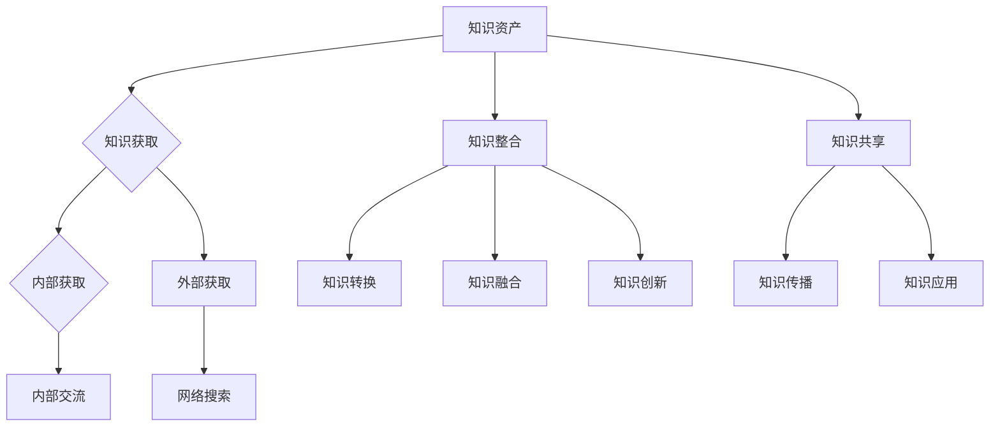

                 

## 第1章：知识管理系统的核心概念与原理

### 1.1 知识管理系统的定义与重要性

知识管理系统（Knowledge Management System, KMS）是一种旨在通过获取、共享、使用和创造知识来提高组织或个人竞争力的信息技术系统。知识管理系统不仅包括技术工具，还包括管理流程和文化。它的重要性体现在以下几个方面：

1. **提高知识利用效率**：知识管理系统可以帮助组织更好地获取、组织和利用知识，从而提高工作效率和创新能力。
2. **增强竞争力**：知识管理系统可以帮助组织快速响应市场变化，提高决策质量和执行力，增强竞争优势。
3. **促进知识共享**：知识管理系统提供了一个平台，使得组织内部或跨部门的知识交流更加便捷和高效。
4. **提升员工技能和满意度**：通过知识管理系统，员工可以更容易地获取所需的知识和技能，从而提高工作满意度和职业发展。

### 1.2 知识管理系统的基本框架

知识管理系统的基本框架通常包括以下几个组成部分：

1. **知识库**：存储组织或个人的各种知识资源，包括文档、数据、图像、音频和视频等。
2. **知识获取**：通过各种方式获取内外部知识，如网络搜索、专家咨询、内部交流和外部合作等。
3. **知识整合**：将获取到的知识进行整理、分类和标注，以便于检索和使用。
4. **知识共享**：通过平台或工具将整合后的知识共享给相关人员，促进知识流动。
5. **知识应用**：将知识应用于实际工作，提高工作效率和质量。
6. **知识创新**：在知识共享和应用的过程中，通过碰撞和融合，产生新的知识和创新。

### 1.3 知识管理系统的核心组成部分

知识管理系统的核心组成部分包括：

1. **技术平台**：提供存储、检索、共享和协作等功能，如数据库、搜索引擎和协作工具。
2. **管理流程**：定义知识获取、整合、共享和应用等流程，如知识审核、知识更新和知识评价等。
3. **组织文化**：建立知识共享和创新的氛围，如鼓励知识分享、尊重知识贡献者等。

### 1.4 知识管理系统的分类与应用领域

知识管理系统可以根据不同的分类标准进行划分，常见的分类方法有：

1. **按应用对象分类**：可以分为组织级知识管理系统和个人级知识管理系统。
2. **按应用领域分类**：可以分为企业级知识管理系统、教育级知识管理系统和医疗级知识管理系统等。

在实际应用中，知识管理系统广泛应用于各个领域，如：

1. **企业**：用于提高员工工作效率、促进知识传承和创新。
2. **教育**：用于教学资源的共享和学生学习成果的记录。
3. **科研**：用于科研数据的整理、共享和协作。

### 1.5 知识管理系统的核心概念与联系

知识管理系统涉及多个核心概念，它们之间有着紧密的联系。以下是这些概念以及它们之间的关系：

#### 1.5.1 知识资产

知识资产是知识管理系统的核心。它指的是组织或个人所拥有的知识资源，包括显性知识和隐性知识。知识资产可以是有形的（如文档、数据库等）或无形的（如经验、技能等）。

**联系**：知识管理系统的目标之一是确保知识资产得到有效管理和利用。

#### 1.5.2 知识获取

知识获取是指通过各种途径收集和获取知识的过程。这包括内部知识获取（如内部交流、培训等）和外部知识获取（如网络搜索、文献查阅等）。

**联系**：知识获取是知识管理系统的基础，决定了系统能够获取多少和什么类型的知识。

#### 1.5.3 知识整合

知识整合是将获取到的知识进行整理、分类和标注，以便于检索和使用。整合的过程通常涉及知识转换、融合和创新。

**联系**：知识整合使知识管理系统中的知识变得更有组织和可用性。

#### 1.5.4 知识共享

知识共享是指通过知识管理系统将整合后的知识共享给相关人员。知识共享可以增强组织内的协作和创新。

**联系**：知识共享是知识管理系统的关键功能之一，它直接影响知识的传播和应用。

#### 1.5.5 知识应用

知识应用是将知识应用于实际工作场景中，解决实际问题或提高工作效率。知识应用是知识管理的最终目标。

**联系**：知识应用是知识管理系统的核心价值体现，它使知识转化为实际的生产力。

#### 1.5.6 知识创新

知识创新是在知识共享和应用的过程中，通过新的思想、方法或技术的产生，推动知识的更新和发展。

**联系**：知识创新是知识管理系统的动力，它不断推动知识的积累和优化。

### 1.6 知识管理系统的核心概念与联系 - Mermaid 流程图

以下是一个使用Mermaid绘制的知识管理系统的核心概念和联系流程图：



这个流程图展示了知识管理系统的核心概念和它们之间的相互作用关系。

### 1.7 核心概念与联系 - 伪代码

以下是知识管理系统的核心概念和联系的一个简化的伪代码表示：

```plaintext
// 知识管理系统的核心概念与联系

// 定义核心概念
KnowledgeAsset
KnowledgeAcquisition
InternalKnowledge
ExternalKnowledge
KnowledgeIntegration
KnowledgeConversion
KnowledgeFusion
KnowledgeInnovation
KnowledgeSharing
KnowledgeApplication

// 关系表示
class Of {
    KnowledgeAsset -- KnowledgeAcquisition
    KnowledgeAsset -- KnowledgeIntegration
    KnowledgeAsset -- KnowledgeSharing
    KnowledgeAsset -- KnowledgeApplication
    KnowledgeAsset -- KnowledgeInnovation

    KnowledgeAcquisition -- InternalKnowledge
    KnowledgeAcquisition -- ExternalKnowledge

    KnowledgeIntegration -- KnowledgeConversion
    KnowledgeIntegration -- KnowledgeFusion

    KnowledgeSharing -- KnowledgeApplication
    KnowledgeApplication -- KnowledgeInnovation
}

// 知识管理流程
function KnowledgeManagementFlow() {
    // 知识获取
    InternalKnowledge = InternalKnowledgeSource();
    ExternalKnowledge = ExternalKnowledgeSource();

    // 知识整合
    KnowledgeConverted = ConvertKnowledge(ExternalKnowledge);
    KnowledgeFused = FuseKnowledge(InternalKnowledge, KnowledgeConverted);

    // 知识共享
    SharedKnowledge = ShareKnowledge(KnowledgeFused);

    // 知识应用
    AppliedKnowledge = ApplyKnowledge(SharedKnowledge);

    // 知识创新
    InnovativeKnowledge = InnovateKnowledge(AppliedKnowledge);
}
```

### 1.8 核心概念与联系 - 数学模型和公式

在知识管理系统中，可以使用数学模型和公式来描述知识管理过程。以下是一些常用的模型和公式：

#### 1.8.1 知识价值模型

知识价值模型（Knowledge Value Model, KVM）用于评估知识的价值。公式如下：

$$
V_k = \alpha \cdot I \cdot U
$$

- $V_k$：知识价值
- $\alpha$：知识共享系数
- $I$：知识重要性
- $U$：知识利用率

**解释**：知识价值取决于知识共享程度、知识的重要性和知识的使用率。

#### 1.8.2 知识传播模型

知识传播模型（Knowledge Dissemination Model, KDM）描述知识在组织中的传播过程。公式如下：

$$
D(t) = \gamma \cdot (1 - e^{-\beta t})
$$

- $D(t)$：在时间$t$时的知识传播程度
- $\gamma$：知识传播速率
- $\beta$：衰减系数

**解释**：知识传播随时间逐渐减弱，$D(t)$反映了知识传播的动态变化。

#### 1.8.3 知识整合模型

知识整合模型（Knowledge Integration Model, KIM）描述知识整合的过程。公式如下：

$$
I = \frac{\sum_{i=1}^{n} p_i \cdot r_i}{n}
$$

- $I$：整合后的知识水平
- $p_i$：第$i$项知识的概率
- $r_i$：第$i$项知识的可靠性

**解释**：知识整合是通过计算各项知识的概率和可靠性来评估整体知识水平。

### 1.9 核心概念与联系 - 数学模型和公式详解与举例说明

#### 1.9.1 知识价值模型详解

知识价值模型（KVM）是一个简单但有效的工具，用于评估知识的相对价值。以下是该模型的详细解释和实际应用示例。

**详细解释**：

- **知识共享系数（$\alpha$）**：这是一个介于0和1之间的系数，反映了组织内部知识共享的鼓励程度。例如，如果$\alpha = 0.8$，表示组织非常鼓励知识共享。
- **知识重要性（$I$）**：衡量知识对组织或个人的重要程度，通常通过专家评估或问卷调查来确定。
- **知识利用率（$U$）**：表示知识在实际应用中的利用率，可以通过知识应用的频率和效果来衡量。

**举例说明**：

假设在某个组织中，$\alpha = 0.8$，一项关于项目管理的新知识被评估为重要性$I = 0.9$，利用率$U = 0.8$。使用知识价值模型计算该知识的价值：

$$
V_k = 0.8 \cdot 0.9 \cdot 0.8 = 0.576
$$

这个结果表示，根据这个模型，这项知识的价值为0.576，组织应该重视并充分利用这项知识。

#### 1.9.2 知识传播模型详解

知识传播模型（KDM）是一个描述知识在组织中传播过程的动态模型。以下是该模型的详细解释和实际应用示例。

**详细解释**：

- **知识传播程度（$D(t)$）**：在时间$t$时，知识在组织中的传播程度。
- **知识传播速率（$\gamma$）**：反映了知识传播的速度，通常取决于组织的文化、沟通渠道和员工的活动。
- **衰减系数（$\beta$）**：表示知识传播的衰减速度，通常与知识本身的特性、组织的结构和文化有关。

**举例说明**：

假设在某个组织中，$\gamma = 0.2$，$\beta = 0.1$。在$t = 0$时，知识传播程度为1，即知识最初完全传播。随着时间的推移，知识传播程度会逐渐减弱。在$t = 10$时，知识传播程度计算如下：

$$
D(10) = 0.2 \cdot (1 - e^{-0.1 \cdot 10}) = 0.2 \cdot (1 - e^{-1}) \approx 0.2 \cdot 0.3679 = 0.0736
$$

这意味着，在$t = 10$时，知识传播程度约为7.36%，远低于初始的100%。

#### 1.9.3 知识整合模型详解

知识整合模型（KIM）用于描述如何通过整合多个来源的知识来提升整体的知识水平。以下是该模型的详细解释和实际应用示例。

**详细解释**：

- **整合后的知识水平（$I$）**：通过计算各项知识的概率和可靠性来评估整体知识水平。
- **概率（$p_i$）**：表示第$i$项知识出现的概率。
- **可靠性（$r_i$）**：表示第$i$项知识的可靠性，通常取决于知识的准确性和实用性。

**举例说明**：

假设有三项知识，分别为项目管理、软件开发和技术支持，其概率和可靠性如下：

- 项目管理：$p_1 = 0.4$，$r_1 = 0.9$
- 软件开发：$p_2 = 0.3$，$r_2 = 0.8$
- 技术支持：$p_3 = 0.3$，$r_3 = 0.7$

使用知识整合模型计算整体知识水平：

$$
I = \frac{0.4 \cdot 0.9 + 0.3 \cdot 0.8 + 0.3 \cdot 0.7}{0.4 + 0.3 + 0.3} = \frac{0.36 + 0.24 + 0.21}{0.9} = \frac{0.81}{0.9} = 0.9
$$

这个结果表示，整合后的知识水平为0.9，说明这三项知识的整体效果非常好。

通过以上详解和举例，我们可以看到数学模型和公式在知识管理系统中的应用，它们为评估、传播和整合知识提供了有效的工具。

### 第2章：知识管理系统的理论基础

### 2.1 知识管理的基本理论

知识管理（Knowledge Management, KM）是一种通过系统方法来获取、共享、使用和创造知识的过程，以提高组织或个人的竞争力和创新能力。知识管理的基本理论包括知识的层次结构、知识循环模型、知识获取与整合、知识共享与传播等。

#### 2.1.1 知识的层次结构

知识的层次结构是指知识按照其抽象程度和复杂度进行分类的方式。通常，知识可以分为以下三个层次：

1. **显性知识**：显性知识是可以明确表达、记录和传播的知识。它通常以文档、数据、报告等形式存在。显性知识容易获取和共享，但难以捕捉和利用个人的经验、直觉和创造力。

2. **隐性知识**：隐性知识是指难以明确表达、难以编码和传播的知识。它存在于个人的思维、经验、直觉和创造力中。隐性知识通常通过实践、观察和模仿来传递，需要个人之间密切的互动和交流。

3. **混合知识**：混合知识是显性知识和隐性知识的结合体。它既包括可以明确表达和记录的知识，也包括难以明确表达和传播的隐性知识。混合知识的价值在于通过显性知识的表达和隐性知识的实践，实现知识的创新和提升。

#### 2.1.2 知识循环模型

知识循环模型描述了知识在组织或个人中的循环过程，包括知识获取、知识整合、知识共享、知识应用和知识创新等环节。以下是知识循环模型的详细过程：

1. **知识获取**：知识获取是指通过多种途径获取内外部知识的过程。内部知识获取包括组织内部的经验、知识库、交流等；外部知识获取包括网络搜索、文献阅读、外部合作等。

2. **知识整合**：知识整合是将获取到的知识进行整理、分类、标注，使其易于检索和使用的过程。知识整合包括对知识的融合、比较、分析和综合，形成新的知识体系。

3. **知识共享**：知识共享是指通过适当的方式将整合后的知识传递给相关人员，促进知识在组织内的流动。知识共享可以通过会议、培训、内部交流、知识库、协作平台等途径实现。

4. **知识应用**：知识应用是将知识应用于实际工作中，解决实际问题或提高工作效率。知识应用是知识管理的核心目标，通过实践将知识转化为实际的生产力。

5. **知识创新**：知识创新是在知识共享和应用的过程中，通过新的思考、方法或技术的产生，推动知识的更新和发展。知识创新是组织或个人保持竞争力的重要途径。

#### 2.1.3 知识获取与整合

知识获取与整合是知识管理的重要环节。以下是相关知识获取与整合的方法：

1. **信息搜集策略**：信息搜集策略是指为了获取所需信息而制定的方法和技巧。信息搜集策略包括内部信息搜集（如内部数据库、文件系统、员工交流等）和外部信息搜集（如网络搜索、专业数据库、文献查阅等）。

2. **知识整合与融合**：知识整合与融合是将获取到的知识进行整理、分类、标注，使其易于检索和使用的过程。知识整合包括对知识的融合、比较、分析和综合，形成新的知识体系。

3. **知识库构建**：知识库是用于存储和管理知识资源的系统。知识库可以包括文档、数据、图像、音频、视频等多种形式的知识资源。知识库的构建包括知识资源的收集、整理、分类、标注和存储等步骤。

#### 2.1.4 知识共享与传播

知识共享与传播是知识管理的关键环节。以下是相关知识共享与传播的方法：

1. **知识共享机制**：知识共享机制是指为了促进知识在组织内流动而建立的管理制度和流程。知识共享机制包括激励机制、知识库、交流平台、协作工具等。

2. **知识传播模式**：知识传播模式是指知识在组织内或跨组织流动的方式。知识传播模式包括自上而下的传播（如领导层向基层传播知识）、自下而上的传播（如员工向上级反馈知识）和水平传播（如同事之间的知识交流）。

### 2.2 知识管理的基本理论 - 伪代码

以下是知识管理基本理论的伪代码表示：

```plaintext
// 知识管理基本理论

// 定义知识层次结构
class Knowledge {
    property: explicit, implicit, mixed
    method: classifyKnowledge()
}

// 知识获取与整合
function knowledgeAcquisition() {
    // 内部信息搜集
    internalKnowledge = internalSearch()

    // 外部信息搜集
    externalKnowledge = externalSearch()

    // 知识整合
    integratedKnowledge = integrateKnowledge(internalKnowledge, externalKnowledge)
}

// 知识共享与传播
function knowledgeSharing() {
    // 知识共享机制
    sharedKnowledge = implementSharingMechanism()

    // 知识传播模式
    propagatedKnowledge = implementPropagationMode()
}

// 知识应用与创新
function knowledgeApplication() {
    // 知识应用
    appliedKnowledge = applyKnowledge()

    // 知识创新
    innovativeKnowledge = innovateKnowledge()
}
```

### 2.3 知识管理的基本理论 - 数学模型和公式

在知识管理中，数学模型和公式可以用来描述知识获取、整合、共享、应用和创新的各个方面。以下是一些常用的数学模型和公式。

#### 2.3.1 知识价值模型

知识价值模型（Knowledge Value Model, KVM）用于评估知识的价值。公式如下：

$$
V_k = f(\alpha, I, U)
$$

- $V_k$：知识价值
- $\alpha$：知识共享系数
- $I$：知识重要性
- $U$：知识利用率

**解释**：知识价值取决于知识共享程度、知识的重要性和知识的使用率。

#### 2.3.2 知识传播模型

知识传播模型（Knowledge Dissemination Model, KDM）描述知识在组织中的传播过程。公式如下：

$$
D(t) = \gamma \cdot (1 - e^{-\beta t})
$$

- $D(t)$：在时间$t$时的知识传播程度
- $\gamma$：知识传播速率
- $\beta$：衰减系数

**解释**：知识传播随时间逐渐减弱，$D(t)$反映了知识传播的动态变化。

#### 2.3.3 知识整合模型

知识整合模型（Knowledge Integration Model, KIM）描述知识整合的过程。公式如下：

$$
I = \frac{\sum_{i=1}^{n} p_i \cdot r_i}{n}
$$

- $I$：整合后的知识水平
- $p_i$：第$i$项知识的概率
- $r_i$：第$i$项知识的可靠性

**解释**：知识整合是通过计算各项知识的概率和可靠性来评估整体知识水平。

### 2.4 知识管理的基本理论 - 数学模型和公式详解与举例说明

#### 2.4.1 知识价值模型详解

知识价值模型（KVM）是一个简单但有效的工具，用于评估知识的相对价值。以下是该模型的详细解释和实际应用示例。

**详细解释**：

- **知识共享系数（$\alpha$）**：这是一个介于0和1之间的系数，反映了组织内部知识共享的鼓励程度。例如，如果$\alpha = 0.8$，表示组织非常鼓励知识共享。
- **知识重要性（$I$）**：衡量知识对组织或个人的重要程度，通常通过专家评估或问卷调查来确定。
- **知识利用率（$U$）**：表示知识在实际应用中的利用率，可以通过知识应用的频率和效果来衡量。

**举例说明**：

假设在某个组织中，$\alpha = 0.8$，一项关于项目管理的新知识被评估为重要性$I = 0.9$，利用率$U = 0.8$。使用知识价值模型计算该知识的价值：

$$
V_k = 0.8 \cdot 0.9 \cdot 0.8 = 0.576
$$

这个结果表示，根据这个模型，这项知识的价值为0.576，组织应该重视并充分利用这项知识。

#### 2.4.2 知识传播模型详解

知识传播模型（KDM）是一个描述知识在组织中传播过程的动态模型。以下是该模型的详细解释和实际应用示例。

**详细解释**：

- **知识传播程度（$D(t)$）**：在时间$t$时，知识在组织中的传播程度。
- **知识传播速率（$\gamma$）**：反映了知识传播的速度，通常取决于组织的文化、沟通渠道和员工的活动。
- **衰减系数（$\beta$）**：表示知识传播的衰减速度，通常与知识本身的特性、组织的结构和文化有关。

**举例说明**：

假设在某个组织中，$\gamma = 0.2$，$\beta = 0.1$。在$t = 0$时，知识传播程度为1，即知识最初完全传播。随着时间的推移，知识传播程度会逐渐减弱。在$t = 10$时，知识传播程度计算如下：

$$
D(10) = 0.2 \cdot (1 - e^{-0.1 \cdot 10}) = 0.2 \cdot (1 - e^{-1}) \approx 0.2 \cdot 0.3679 = 0.0736
$$

这意味着，在$t = 10$时，知识传播程度约为7.36%，远低于初始的100%。

#### 2.4.3 知识整合模型详解

知识整合模型（KIM）用于描述如何通过整合多个来源的知识来提升整体的知识水平。以下是该模型的详细解释和实际应用示例。

**详细解释**：

- **整合后的知识水平（$I$）**：通过计算各项知识的概率和可靠性来评估整体知识水平。
- **概率（$p_i$）**：表示第$i$项知识出现的概率。
- **可靠性（$r_i$）**：表示第$i$项知识的可靠性，通常取决于知识的准确性和实用性。

**举例说明**：

假设有三项知识，分别为项目管理、软件开发和技术支持，其概率和可靠性如下：

- 项目管理：$p_1 = 0.4$，$r_1 = 0.9$
- 软件开发：$p_2 = 0.3$，$r_2 = 0.8$
- 技术支持：$p_3 = 0.3$，$r_3 = 0.7$

使用知识整合模型计算整体知识水平：

$$
I = \frac{0.4 \cdot 0.9 + 0.3 \cdot 0.8 + 0.3 \cdot 0.7}{0.4 + 0.3 + 0.3} = \frac{0.36 + 0.24 + 0.21}{0.9} = \frac{0.81}{0.9} = 0.9
$$

这个结果表示，整合后的知识水平为0.9，说明这三项知识的整体效果非常好。

通过以上详解和举例，我们可以看到数学模型和公式在知识管理系统中的应用，它们为评估、传播和整合知识提供了有效的工具。

### 第3章：知识管理系统中的关键技术

### 3.1 数据库与数据仓库技术

数据库与数据仓库技术是知识管理系统中不可或缺的关键技术。数据库用于存储和管理结构化数据，而数据仓库则用于存储和管理大量结构化、半结构化和非结构化数据。以下是数据库和数据仓库技术的详细介绍。

#### 3.1.1 数据库技术

1. **关系型数据库**

关系型数据库是一种基于关系模型的数据库管理系统，它使用二维表结构来存储数据。关系型数据库的核心是关系模型，它通过外键和主键之间的关系来管理数据。

- **优点**：结构清晰、易于管理和维护，适用于存储和管理结构化数据。
- **缺点**：扩展性较差，不适合存储大量非结构化数据。

2. **非关系型数据库**

非关系型数据库，也称为NoSQL数据库，是一种不同于关系型数据库的数据存储解决方案。非关系型数据库支持多种数据模型，如文档、键值对、图和列族等，适用于存储非结构化或半结构化数据。

- **优点**：扩展性好、灵活性强，适用于大规模数据的存储和处理。
- **缺点**：数据一致性保证较低，管理复杂度较高。

#### 3.1.2 数据仓库技术

数据仓库是一种用于存储和管理大量数据的系统，它通常包含多种数据源，如内部数据库、外部数据库和日志文件等。数据仓库的核心功能是数据集成、数据清洗、数据存储和数据分析。

1. **数据集成**

数据集成是将来自多个数据源的数据进行集成和整合，形成统一的数据视图。数据集成通常涉及数据抽取、数据清洗、数据转换和数据加载等步骤。

2. **数据清洗**

数据清洗是指对原始数据进行清洗、转换和标准化，提高数据质量。数据清洗通常涉及数据去重、数据验证、数据修正和数据标准化等步骤。

3. **数据存储**

数据存储是指将清洗后的数据存储在数据仓库中。数据存储通常采用分布式存储技术，以提高数据存储和检索的效率。

4. **数据分析**

数据分析是指使用数据挖掘、统计分析、报表生成等技术，对数据进行分析和处理，提取有价值的信息和知识。数据分析通常涉及数据挖掘、机器学习和自然语言处理等技术。

### 3.2 信息检索技术

信息检索技术是知识管理系统中的核心组成部分，它用于从大量数据中快速、准确地检索相关信息。以下是信息检索技术的详细介绍。

#### 3.2.1 搜索引擎算法

搜索引擎算法是用于从大规模数据中检索信息的算法。搜索引擎算法的核心是相似度计算，它通过计算查询和文档之间的相似度，确定文档的相关性。

1. **基于关键字匹配**

基于关键字匹配的搜索引擎算法通过计算查询和文档中的关键字匹配程度来确定文档的相关性。这种算法简单高效，但可能存在匹配不准确的问题。

2. **基于向量空间模型**

基于向量空间模型的搜索引擎算法将查询和文档表示为向量，计算它们之间的相似度。这种算法能够处理复杂的查询，但计算复杂度较高。

3. **基于机器学习**

基于机器学习的搜索引擎算法通过训练模型来预测查询和文档之间的相似度。这种算法具有较高的准确性和灵活性，但需要大量训练数据和计算资源。

#### 3.2.2 文本相似性度量

文本相似性度量是用于衡量文本之间相似程度的方法。文本相似性度量方法通常基于词频统计、词义相似性和语义分析等。

1. **基于词频统计**

基于词频统计的文本相似性度量方法通过计算文本中的词语频率来衡量文本的相似性。这种方法简单有效，但可能存在语义理解不准确的问题。

2. **基于词义相似性**

基于词义相似性的文本相似性度量方法通过计算词语的语义相似度来衡量文本的相似性。这种方法能够更好地理解语义，但计算复杂度

