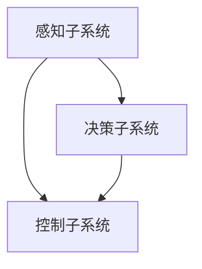
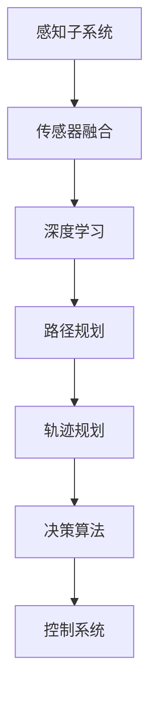
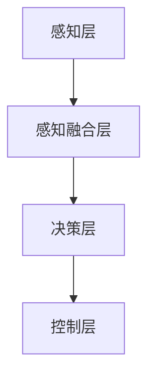
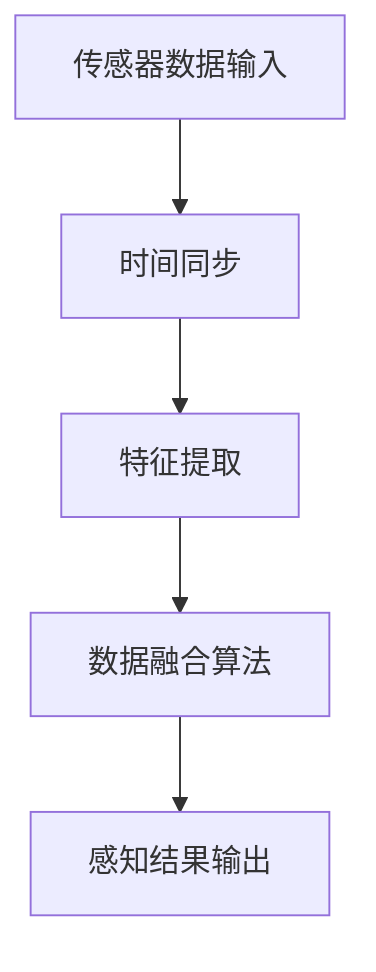

                 

### 《端到端自动驾驶的产业化进程》

#### 关键词：
- 自动驾驶
- 端到端学习
- 产业化
- 深度学习
- 安全伦理
- 技术创新

##### 摘要：

端到端自动驾驶技术作为自动驾驶领域的核心技术之一，正逐步从理论走向实践，并开始影响汽车产业和我们的生活。本文将从端到端自动驾驶的概述、技术基础、核心算法、系统实现、产业化背景以及案例研究等方面，详细探讨端到端自动驾驶的产业化进程。通过对自动驾驶技术的发展历程、系统架构、核心技术、算法原理、软件开发流程、产业化现状和未来趋势的深入分析，本文旨在为读者提供一个全面、系统的端到端自动驾驶技术解读，帮助读者理解该技术的本质、挑战和机遇。

### 目录大纲

#### 第一部分：端到端自动驾驶技术基础

- **第1章：端到端自动驾驶概述**
  - **1.1 自动驾驶的发展历程与未来趋势**
    - **1.1.1 自动驾驶的定义与分类**
    - **1.1.2 自动驾驶技术的发展历程**
    - **1.1.3 自动驾驶的产业趋势与挑战**
  - **1.2 端到端自动驾驶系统架构**
    - **1.2.1 端到端自动驾驶的总体架构**
    - **1.2.2 端到端自动驾驶的核心技术**
    - **1.2.3 端到端自动驾驶的层次划分**
  - **1.3 自动驾驶传感器与感知**
    - **1.3.1 传感器概述**
    - **1.3.2 传感器数据融合**
    - **1.3.3 感知算法与处理**

- **第2章：深度学习在自动驾驶中的应用**
  - **2.1 深度学习基础**
    - **2.1.1 神经网络原理**
    - **2.1.2 深度学习框架**
    - **2.1.3 深度学习优化算法**
  - **2.2 计算机视觉与图像识别**
    - **2.2.1 图像预处理**
    - **2.2.2 目标检测**
    - **2.2.3 路标识别与跟踪**
  - **2.3 机器学习与决策**
    - **2.3.1 决策树与支持向量机**
    - **2.3.2 神经网络与深度强化学习**
    - **2.3.3 自动驾驶决策算法设计**

- **第3章：端到端自动驾驶软件开发**
  - **3.1 软件开发环境与工具**
    - **3.1.1 操作系统与硬件要求**
    - **3.1.2 编程语言选择**
    - **3.1.3 软件开发框架**
  - **3.2 数据处理与预处理**
    - **3.2.1 数据采集与标注**
    - **3.2.2 数据清洗与归一化**
    - **3.2.3 特征提取与选择**
  - **3.3 自动驾驶系统集成与测试**
    - **3.3.1 系统集成与调试**
    - **3.3.2 自动驾驶系统测试**
    - **3.3.3 故障检测与容错处理**

- **第4章：端到端自动驾驶产业化背景**
  - **4.1 自动驾驶产业的国内外发展现状**
    - **4.1.1 国外自动驾驶产业发展现状**
    - **4.1.2 国内自动驾驶产业发展现状**
    - **4.1.3 自动驾驶产业政策分析**
  - **4.2 自动驾驶产业链分析**
    - **4.2.1 产业链主要环节与参与者**
    - **4.2.2 自动驾驶产业的价值链分析**
    - **4.2.3 自动驾驶产业生态系统构建**

- **第5章：端到端自动驾驶案例研究**
  - **5.1 案例一：特斯拉自动驾驶系统**
    - **5.1.1 特斯拉自动驾驶系统概述**
    - **5.1.2 特斯拉自动驾驶系统的技术特点**
    - **5.1.3 特斯拉自动驾驶系统的商业价值**
  - **5.2 案例二：Waymo自动驾驶系统**
    - **5.2.1 Waymo自动驾驶系统概述**
    - **5.2.2 Waymo自动驾驶系统的技术优势**
    - **5.2.3 Waymo自动驾驶系统的商业模式**

- **第6章：端到端自动驾驶产业化挑战与解决方案**
  - **6.1 自动驾驶安全与伦理问题**
    - **6.1.1 自动驾驶安全风险分析**
    - **6.1.2 自动驾驶伦理问题探讨**
    - **6.1.3 自动驾驶安全与伦理解决方案**
  - **6.2 自动驾驶产业化技术瓶颈**
    - **6.2.1 自动驾驶技术瓶颈分析**
    - **6.2.2 技术瓶颈的解决方案**
    - **6.2.3 自动驾驶技术的发展方向**

- **第7章：端到端自动驾驶产业化前景展望**
  - **7.1 自动驾驶产业未来发展趋势**
    - **7.1.1 自动驾驶市场的规模与增长预测**
    - **7.1.2 自动驾驶技术的创新趋势**
    - **7.1.3 自动驾驶产业的政策支持**
  - **7.2 自动驾驶在社会生活与经济发展中的作用**
    - **7.2.1 自动驾驶对社会的变革**
    - **7.2.2 自动驾驶对经济发展的贡献**
    - **7.2.3 自动驾驶与智能城市的关系**

#### 附录

- **附录A：端到端自动驾驶相关资源与工具**
  - **A.1 开源深度学习框架**
  - **A.2 自动驾驶传感器与处理工具**
  - **A.3 自动驾驶模拟测试平台**
  - **A.4 自动驾驶开源项目与社区**


### 文章正文部分

#### 第一部分：端到端自动驾驶技术基础

### 第1章：端到端自动驾驶概述

##### 1.1 自动驾驶的发展历程与未来趋势

自动驾驶技术的概念可以追溯到20世纪50年代，当时科学家们开始探索如何使车辆能够自动行驶。从那时起，自动驾驶技术经历了多个阶段的发展。以下是自动驾驶技术的发展历程：

**第一阶段：基于规则的自动驾驶（1950-1980s）**
在这一阶段，自动驾驶系统主要通过预设的规则和逻辑来控制车辆的运行。这些规则通常是基于对环境的静态分析，缺乏动态适应性。由于环境的复杂性和不确定性，这种方法的实际效果有限。

**第二阶段：基于传感器的自动驾驶（1980s-2000s）**
随着传感器技术的进步，自动驾驶系统开始利用雷达、激光雷达（LIDAR）和摄像头等传感器来感知周围环境。这些传感器能够提供更为详细和实时的数据，使得自动驾驶系统具备了一定的动态适应性。

**第三阶段：基于人工智能的自动驾驶（2000s-至今）**
近年来，随着人工智能技术的发展，特别是深度学习的兴起，自动驾驶技术进入了一个新的阶段。端到端的学习方法使得自动驾驶系统能够直接从大量数据中学习复杂的任务，从而实现更高水平的自动化。

未来，自动驾驶技术将继续朝着更加智能化、自适应和高效化的方向发展。以下是未来自动驾驶技术可能的一些趋势和挑战：

1. **智能化：**随着人工智能技术的进步，自动驾驶系统将能够更好地理解和应对复杂的环境变化，实现更高级别的自动化。
2. **安全性：**自动驾驶系统的安全性是一个关键问题。未来的技术发展将更多地关注如何确保系统的安全性和可靠性。
3. **标准化：**自动驾驶技术的标准化将为行业的发展奠定基础，促进不同制造商之间的协作。
4. **政策法规：**政府将出台更多的政策和法规来规范自动驾驶技术的发展和应用，确保公众的安全和权益。

##### 1.1.1 自动驾驶的定义与分类

自动驾驶技术是指车辆在无需人类干预的情况下，通过传感器、计算机系统和算法自动执行驾驶任务的能力。根据自动化程度的不同，自动驾驶技术可以分为多个级别：

1. **Level 0：无自动化**  
   车辆完全依赖人类驾驶员进行控制，没有任何自动化功能。

2. **Level 1：单一自动化功能**  
   车辆具备一个自动化功能，如自适应巡航控制（ACC）或车道保持辅助（LKA）。

3. **Level 2：部分自动化**  
   车辆同时具备多个自动化功能，如ACC和LKA，但驾驶员需要持续监控路况并随时接管控制。

4. **Level 3：有条件自动化**  
   车辆可以在特定条件下完全接管驾驶任务，但驾驶员需要在系统提示时随时接管控制。

5. **Level 4：高度自动化**  
   车辆可以在特定环境下完全自动化，无需驾驶员干预，但系统无法覆盖所有驾驶场景。

6. **Level 5：完全自动化**  
   车辆可以在所有环境下完全自动化，无需驾驶员干预。

##### 1.1.2 自动驾驶技术的发展历程

自动驾驶技术的发展历程可以分为以下几个阶段：

1. **第一阶段：基于规则的自动驾驶（1950-1980s）**
   在这一阶段，自动驾驶系统主要通过预设的规则和逻辑来控制车辆的运行。这种方法虽然简单，但难以应对复杂和多变的驾驶环境。

2. **第二阶段：基于传感器的自动驾驶（1980s-2000s）**
   随着传感器技术的进步，自动驾驶系统开始利用雷达、激光雷达（LIDAR）和摄像头等传感器来感知周围环境。这些传感器能够提供更为详细和实时的数据，使得自动驾驶系统具备了一定的动态适应性。

3. **第三阶段：基于人工智能的自动驾驶（2000s-至今）**
   近年来，随着人工智能技术的进步，特别是深度学习的兴起，自动驾驶技术进入了一个新的阶段。端到端的学习方法使得自动驾驶系统能够直接从大量数据中学习复杂的任务，从而实现更高水平的自动化。

4. **未来阶段：智能化、自适应和高效化的自动驾驶**
   未来，自动驾驶技术将继续朝着更加智能化、自适应和高效化的方向发展。随着技术的不断进步，自动驾驶系统将能够更好地理解和应对复杂的环境变化，实现更高级别的自动化。

##### 1.1.3 自动驾驶的产业趋势与挑战

自动驾驶技术的产业化进程正在加速，同时也面临着一系列挑战和机遇。以下是一些关键趋势和挑战：

**产业趋势：**

1. **技术进步：**随着人工智能、传感器和计算能力的不断进步，自动驾驶技术的性能和可靠性将得到显著提升。
2. **政策支持：**各国政府纷纷出台政策支持自动驾驶技术的发展，包括资金支持、测试许可和法规制定。
3. **市场竞争：**自动驾驶技术吸引了众多科技公司和传统汽车制造商的参与，市场竞争日益激烈。
4. **合作生态：**自动驾驶技术的发展需要跨行业合作，形成产业生态系统。

**挑战：**

1. **安全性：**自动驾驶系统的安全性是关键问题，需要确保系统在所有情况下都能安全运行。
2. **隐私保护：**自动驾驶系统需要收集大量的数据，如何保护用户隐私成为一个重要问题。
3. **伦理问题：**自动驾驶系统在遇到紧急情况时需要做出决策，如何平衡安全和道德问题需要深入探讨。
4. **标准化：**自动驾驶技术的标准化对于产业的健康发展至关重要，但标准化进程面临诸多挑战。

##### 1.2 端到端自动驾驶系统架构

端到端自动驾驶系统通常由多个子系统组成，包括感知、决策、控制等。以下是端到端自动驾驶系统的总体架构：

1. **感知子系统：**感知子系统负责收集车辆周围环境的数据，包括雷达、激光雷达、摄像头等传感器。感知子系统的主要任务是检测和识别道路标志、行人、车辆等对象，并提取相关的特征信息。
2. **决策子系统：**决策子系统根据感知子系统提供的信息，制定车辆的行驶策略。决策子系统通常包括路径规划、轨迹规划、目标追踪等功能。
3. **控制子系统：**控制子系统根据决策子系统提供的行驶策略，控制车辆的执行机构，包括方向盘、油门、刹车等。控制子系统的任务是确保车辆按照预定策略安全、稳定地行驶。

以下是端到端自动驾驶系统架构的Mermaid流程图：



##### 1.2.2 端到端自动驾驶的核心技术

端到端自动驾驶系统依赖于多种核心技术的支持，以下是其中的几个关键技术：

1. **深度学习：**深度学习是一种基于人工神经网络的机器学习技术，能够通过大量数据自动学习复杂的模式。在自动驾驶领域，深度学习被广泛应用于感知、决策和控制任务。
2. **传感器融合：**传感器融合是将多个传感器采集到的数据整合起来，以提高系统的感知能力和准确性。常用的传感器包括雷达、激光雷达、摄像头、GPS等。
3. **路径规划和轨迹规划：**路径规划是指确定车辆的行驶路径，轨迹规划是指确定车辆在路径上的具体行驶轨迹。路径规划和轨迹规划是实现自动驾驶的关键技术。
4. **决策算法：**决策算法用于确定车辆的行驶策略，包括目标追踪、交通规则遵守、紧急情况处理等。
5. **控制系统：**控制系统负责将决策子系统的指令转换为车辆的动作，确保车辆按照预定策略行驶。

以下是端到端自动驾驶核心技术的Mermaid流程图：



##### 1.2.3 端到端自动驾驶的层次划分

端到端自动驾驶系统可以根据功能层次进行划分，通常包括以下几个层次：

1. **感知层：**感知层负责采集车辆周围环境的数据，包括道路、交通标志、行人、车辆等。感知层主要依赖于各种传感器，如雷达、激光雷达、摄像头等。
2. **感知融合层：**感知融合层将不同传感器采集到的数据融合起来，以提高系统的整体感知能力和准确性。感知融合层通常采用多传感器数据融合算法。
3. **决策层：**决策层根据感知层提供的信息，制定车辆的行驶策略。决策层包括路径规划、轨迹规划、目标追踪等功能。
4. **控制层：**控制层根据决策层提供的行驶策略，控制车辆的执行机构，如方向盘、油门、刹车等。控制层需要实现精确的车辆控制，确保车辆按照预定策略行驶。

以下是端到端自动驾驶层次划分的Mermaid流程图：



##### 1.3 自动驾驶传感器与感知

自动驾驶系统依赖于多种传感器来感知车辆周围的环境。以下是常见的传感器及其作用：

1. **雷达（Radar）**：
   - **作用**：雷达主要用于检测前方障碍物和测量距离。
   - **原理**：通过发射无线电波并接收反射波，计算反射波的时间差来确定障碍物的位置和距离。

2. **激光雷达（LIDAR）**：
   - **作用**：激光雷达主要用于获取车辆周围的三维点云数据。
   - **原理**：通过发射激光束并测量激光束反射回来的时间，结合三角测量原理来计算三维空间中的点。

3. **摄像头**：
   - **作用**：摄像头主要用于图像识别和物体检测。
   - **原理**：通过捕捉图像，利用图像处理算法进行物体识别和场景理解。

4. **GPS**：
   - **作用**：GPS主要用于确定车辆的位置信息。
   - **原理**：通过接收卫星信号，计算接收器与卫星之间的距离，从而确定接收器的位置。

5. **超声波传感器**：
   - **作用**：超声波传感器主要用于短距离障碍物检测。
   - **原理**：通过发射超声波并接收反射波，计算反射波的时间差来确定障碍物的位置和距离。

传感器数据融合是将多个传感器采集到的数据整合起来，以提高系统的整体感知能力和准确性。以下是传感器数据融合的基本原理：

1. **时间同步**：确保不同传感器的数据在同一时间戳下进行融合，以避免数据不一致的问题。

2. **特征提取**：从传感器数据中提取关键特征，如距离、速度、方向等，为后续处理提供基础。

3. **数据融合算法**：采用合适的数据融合算法，如卡尔曼滤波、贝叶斯滤波等，将不同传感器的数据进行加权融合。

以下是感知算法与处理的基本流程：



感知算法与处理的关键步骤包括：

1. **图像预处理**：对摄像头捕获的图像进行去噪、增强等处理，以提高图像质量。

2. **目标检测**：利用深度学习算法对图像进行目标检测，识别出车辆、行人、交通标志等目标。

3. **轨迹预测**：根据目标检测的结果，预测目标未来的运动轨迹，为决策层提供基础。

4. **环境理解**：结合传感器数据和轨迹预测，对车辆周围环境进行整体理解，为决策层提供更丰富的信息。

### 第2章：深度学习在自动驾驶中的应用

##### 2.1 深度学习基础

深度学习是一种基于人工神经网络的机器学习技术，通过多层次的神经网络结构来模拟人类大脑的学习和认知过程。深度学习在自动驾驶领域具有广泛的应用，主要涉及感知、决策和控制等任务。

**2.1.1 神经网络原理**

神经网络（Neural Network，NN）是一种模拟生物神经系统的计算模型。神经网络由大量的神经元（节点）组成，每个神经元与其它神经元通过连接（权重）相互连接。神经网络通过训练来学习输入数据与输出数据之间的关系。

**神经网络的基本结构：**

1. **输入层**：接收外部输入数据。
2. **隐藏层**：对输入数据进行特征提取和变换。
3. **输出层**：产生最终的输出结果。

**神经网络的工作原理：**

1. **前向传播**：输入数据通过神经网络的前向传播路径，从输入层传递到输出层。
2. **反向传播**：根据输出结果与实际结果的误差，通过反向传播算法更新神经网络的权重。

**反向传播算法：**

1. **误差计算**：计算输出层节点的预测误差。
2. **梯度计算**：计算每个权重的梯度。
3. **权重更新**：根据梯度下降算法更新权重。

**神经网络的基本原理可以通过以下伪代码进行描述：**

```python
# 前向传播
for each layer from input to output:
  for each neuron in the layer:
    input = sum(weight * previous_neuron for previous_neuron in the previous layer) + bias
    activation = activation_function(input)

# 反向传播
for each layer from output to input:
  for each neuron in the layer:
    error = predicted_output - actual_output
    delta = error * activation_derivative(activation)
    for each weight connected to the neuron:
      weight_gradient = delta * previous_neuron
      weight += learning_rate * weight_gradient
```

**2.1.2 深度学习框架**

深度学习框架是一种用于构建和训练深度学习模型的软件库。常见的深度学习框架包括TensorFlow、PyTorch和Keras等。

**TensorFlow**：由Google开发，是一种开源的深度学习框架，支持多种编程语言和平台。

**PyTorch**：由Facebook开发，是一种开源的深度学习框架，以动态计算图著称。

**Keras**：是一种高层次的深度学习API，可以与TensorFlow和Theano等框架结合使用。

**2.1.3 深度学习优化算法**

深度学习优化算法是用于加速模型训练和提升模型性能的技术。以下是一些常用的深度学习优化算法：

1. **随机梯度下降（SGD）**：是最简单的优化算法，每次更新权重时使用整个数据集的平均梯度。

2. **动量（Momentum）**：引入动量项，加速梯度下降过程。

3. **Adam优化器**：结合了SGD和动量项，并引入了自适应学习率。

4. **LSTM（长短时记忆网络）**：用于处理序列数据，能够捕捉长期依赖关系。

5. **dropout**：用于防止模型过拟合，通过随机丢弃部分神经元来提高模型的泛化能力。

以下是使用PyTorch实现一个简单的线性回归模型的伪代码：

```python
import torch
import torch.nn as nn
import torch.optim as optim

# 定义模型
class LinearModel(nn.Module):
    def __init__(self):
        super(LinearModel, self).__init__()
        self.linear = nn.Linear(in_features=1, out_features=1)

    def forward(self, x):
        return self.linear(x)

# 初始化模型和优化器
model = LinearModel()
optimizer = optim.SGD(model.parameters(), lr=0.01)

# 训练模型
for epoch in range(num_epochs):
    for x, y in data_loader:
        optimizer.zero_grad()
        output = model(x)
        loss = nn.MSELoss()(output, y)
        loss.backward()
        optimizer.step()
```

### 第3章：深度学习在自动驾驶中的应用

#### 2.2 计算机视觉与图像识别

计算机视觉是深度学习在自动驾驶中的一个重要应用领域，它涉及到从图像中提取有用的信息，以实现对环境的理解和决策。以下将详细探讨计算机视觉在自动驾驶中的应用，包括图像预处理、目标检测和图像识别。

##### 2.2.1 图像预处理

图像预处理是计算机视觉任务中的第一步，其目的是提高图像质量，增强重要特征，从而为后续的图像分析提供更好的数据基础。常见的图像预处理方法包括：

1. **去噪**：去除图像中的噪声，可以提高图像的清晰度和质量。常用的去噪方法有均值滤波、中值滤波和高斯滤波等。

2. **对比度增强**：通过调整图像的亮度和对比度，可以使图像中的关键特征更加突出。常用的对比度增强方法有直方图均衡化和自适应对比度增强。

3. **边缘检测**：边缘检测是识别图像中重要特征的关键步骤，它可以提取图像的轮廓和边界。常用的边缘检测算法有Canny算子、Sobel算子和Prewitt算子等。

4. **图像分割**：图像分割是将图像划分为多个区域，每个区域代表图像中的不同物体或场景。常用的图像分割方法有基于阈值的分割、基于区域生长的分割和基于水平的分割等。

以下是一个简单的图像预处理流程，使用Python的OpenCV库实现：

```python
import cv2

# 加载图像
image = cv2.imread('image.jpg')

# 去噪
blurred = cv2.GaussianBlur(image, (5, 5), 0)

# 对比度增强
equalized = cv2.equalizeHist(blurred)

# 边缘检测
edges = cv2.Canny(equalized, 50, 150)

# 显示结果
cv2.imshow('Original', image)
cv2.imshow('Blurred', blurred)
cv2.imshow('Equalized', equalized)
cv2.imshow('Edges', edges)
cv2.waitKey(0)
cv2.destroyAllWindows()
```

##### 2.2.2 目标检测

目标检测是计算机视觉中的一个重要任务，其目的是识别图像中的目标对象并定位它们的位置。在自动驾驶中，目标检测用于识别车辆、行人、交通标志等关键对象，为决策和控制提供基础。

常见的目标检测算法有：

1. **区域提议算法（R-CNN系列）**：R-CNN、Fast R-CNN和Faster R-CNN等算法通过生成区域提议，然后对这些区域进行分类和定位。

2. **基于深度学习的目标检测算法**：YOLO（You Only Look Once）、SSD（Single Shot MultiBox Detector）和Faster R-CNN等算法通过直接从图像中检测目标，避免了区域提议的步骤。

以下是一个简单的目标检测流程，使用Python的TensorFlow Object Detection API实现：

```python
import cv2
import tensorflow as tf

# 加载预训练的模型
model_path = 'path/to/weights.h5'
detection_graph = tf.Graph()
with detection_graph.as_default():
    od_graph_def = tf.GraphDef()
    with tf.gfile.GFile(model_path, 'rb') as fid:
        serialized_graph = fid.read()
        od_graph_def.ParseFromString(serialized_graph)
        tf.import_graph_def(od_graph_def, name='')

# 定义输入和输出节点
input_tensor = detection_graph.get_tensor_by_name('image_tensor:0')
detection_boxes = detection_graph.get_tensor_by_name('detection_boxes:0')
detection_scores = detection_graph.get_tensor_by_name('detection_scores:0')
detection_classes = detection_graph.get_tensor_by_name('detection_classes:0')

# 处理图像
image = cv2.imread('image.jpg')
image_expanded = np.expand_dims(image, axis=0)

# 运行模型
with detection_graph.as_default():
    with tf.Session(graph=detection_graph) as sess:
        (boxes, scores, classes) = sess.run(
            [detection_boxes, detection_scores, detection_classes],
            feed_dict={input_tensor: image_expanded})

# 绘制检测结果
for box, score, class_id in zip(boxes[0], scores[0], classes[0]):
    if score > 0.5:
        cv2.rectangle(image, tuple(box.astype(int)), (0, 255, 0), 2)
        cv2.putText(image, f'Class {class_id}', tuple(box.astype(int)), cv2.FONT_HERSHEY_SIMPLEX, 1, (255, 0, 0), 2)

cv2.imshow('Detected Objects', image)
cv2.waitKey(0)
cv2.destroyAllWindows()
```

##### 2.2.3 路标识别与跟踪

在自动驾驶中，路标识别与跟踪是关键任务之一，它用于确定车辆的位置和方向，帮助自动驾驶系统进行路径规划和导航。路标识别与跟踪通常包括以下几个步骤：

1. **路标检测**：使用图像预处理和目标检测技术，识别图像中的路标。

2. **路标分类**：对识别出的路标进行分类，区分不同类型的路标。

3. **路标跟踪**：在连续的图像帧中跟踪路标的位置和运动轨迹，以便实时更新车辆的状态。

常用的路标识别与跟踪算法有：

1. **基于特征的匹配**：通过提取路标的特征点，利用特征匹配算法进行路标识别与跟踪。

2. **基于跟踪算法**：如卡尔曼滤波、粒子滤波等，用于对路标的位置和运动轨迹进行估计。

以下是一个简单的路标识别与跟踪流程，使用Python的OpenCV库实现：

```python
import cv2
import numpy as np

# 加载预训练的路标检测模型
model_path = 'path/to/lidar_model.pth'
model = LidarModel()
model.load_state_dict(torch.load(model_path))
model.eval()

# 定义卡尔曼滤波器
initial_state = torch.tensor([x, y, vx, vy])
state_estimate = initial_state
state_estimate_prev = initial_state

# 处理图像
image = cv2.imread('image.jpg')
gray = cv2.cvtColor(image, cv2.COLOR_BGR2GRAY)

# 路标检测
with torch.no_grad():
    lidar_input = torch.tensor([gray])
    detections = model(lidar_input)

# 路标分类
detections = detections[:, :2]

# 路标跟踪
for detection in detections:
    if detection[1] > 0.5:
        x, y = detection[0]
        state_estimate = kalman_filter(state_estimate_prev, [x, y])
        state_estimate_prev = state_estimate

# 绘制路标位置
cv2.circle(image, (state_estimate[0].item(), state_estimate[1].item()), 5, (0, 0, 255), -1)

# 显示结果
cv2.imshow('Radar Tracking', image)
cv2.waitKey(0)
cv2.destroyAllWindows()
```

### 第3章：端到端自动驾驶软件开发

#### 3.1 软件开发环境与工具

在进行端到端自动驾驶软件开发时，选择合适的开发环境与工具至关重要。以下将介绍操作系统、硬件要求、编程语言选择以及软件开发框架等方面的内容。

##### 3.1.1 操作系统与硬件要求

**操作系统：**
在自动驾驶软件开发中，常用的操作系统包括Linux和Windows。Linux由于其开源、稳定性和可定制性，被广泛应用于自动驾驶系统的开发。Windows则因其良好的用户界面和广泛的应用软件，在一些特定的应用场景中也得到使用。

**硬件要求：**
自动驾驶软件的开发和测试通常需要高性能的计算资源。以下是推荐的硬件配置：

1. **CPU：**建议使用Intel i7或AMD Ryzen 7系列处理器，以确保高效的计算性能。
2. **GPU：**NVIDIA GeForce GTX 1080 Ti或更高级别的显卡，用于加速深度学习模型的训练和推理。
3. **内存：**至少16GB的RAM，以支持大型数据集和多任务处理。
4. **存储：**至少1TB的SSD存储，以提高读写速度。

##### 3.1.2 编程语言选择

**C++：**
C++是一种高性能的编程语言，广泛应用于嵌入式系统和性能敏感的领域。在自动驾驶软件开发中，C++被用于实现复杂的算法和实时系统。

**Python：**
Python是一种易学易用的编程语言，拥有丰富的库和框架，适用于数据分析和原型开发。在自动驾驶领域，Python常用于数据预处理、模型训练和测试。

**Java：**
Java是一种跨平台的编程语言，具有良好的性能和稳定性。在自动驾驶软件开发中，Java被用于构建大规模的分布式系统和实时应用。

**其他语言：**
除了上述语言外，还有一些特定的语言和框架在自动驾驶软件开发中也有所应用，如Go用于分布式系统开发，Rust用于系统级编程等。

##### 3.1.3 软件开发框架

**ROS（Robot Operating System）：**
ROS是一种开源的机器人中间件，提供了丰富的库和工具，用于构建复杂的机器人系统。ROS支持多种编程语言，并提供了强大的通信机制和机器人模型库。

**CARLA（An Open Urban Driving Simulation Framework）：**
CARLA是一个开源的自动驾驶仿真平台，用于模拟复杂的城市交通环境。CARLA提供了详细的车辆模型、传感器模拟和场景编辑工具，是自动驾驶系统开发和测试的重要工具。

**PyTorch：**
PyTorch是一个流行的深度学习框架，提供了灵活的动态计算图和丰富的库函数，适用于自动驾驶领域的模型训练和推理。

**TensorFlow：**
TensorFlow是一个由Google开发的开源深度学习框架，以其强大的图计算能力和丰富的生态系统著称。TensorFlow在自动驾驶领域的应用包括模型训练、部署和测试。

**OpenCV：**
OpenCV是一个开源的计算机视觉库，提供了丰富的图像处理和计算机视觉算法。OpenCV在自动驾驶系统中的主要应用包括图像预处理、目标检测和图像识别等。

##### 3.1.4 开发环境搭建

以下是使用ROS和PyTorch搭建端到端自动驾驶软件开发环境的基本步骤：

1. **安装ROS：**
   - 访问ROS官网（[https://www.ros.org/](https://www.ros.org/)）下载ROS安装包。
   - 遵循ROS安装指南，安装ROS内核和ROS工具包。

2. **安装PyTorch：**
   - 访问PyTorch官网（[https://pytorch.org/get-started/locally/](https://pytorch.org/get-started/locally/)）下载适用于操作系统和CPU/GPU版本的PyTorch安装包。
   - 运行安装包进行安装。

3. **配置ROS和PyTorch：**
   - 打开终端，运行`source /opt/ros/$(rosdistro)`命令，配置ROS环境变量。
   - 运行`pip install --extra-index-url https://download.pytorch.org/whl/torch torchvision torchaudio`命令，配置PyTorch环境。

4. **测试环境：**
   - 运行ROS命令`roscore`启动ROS内核。
   - 运行`roslaunch example.launch`启动示例ROS节点，验证ROS环境是否正常运行。
   - 运行`python -c "import torch; print(torch.__version__)"`命令，验证PyTorch是否安装成功。

通过以上步骤，可以搭建一个基本的端到端自动驾驶软件开发环境。接下来，可以开始进行具体的软件开发工作，包括数据预处理、模型训练和系统集成等。

### 第3章：端到端自动驾驶软件开发（续）

#### 3.2 数据处理与预处理

在端到端自动驾驶软件开发中，数据处理与预处理是至关重要的一环。有效的数据处理和预处理可以显著提高模型训练的性能和效果。以下是数据处理与预处理的主要内容，包括数据采集与标注、数据清洗与归一化、特征提取与选择。

##### 3.2.1 数据采集与标注

**数据采集：**
自动驾驶系统依赖于大量高质量的实时数据。数据采集通常包括以下步骤：

1. **传感器数据采集**：使用车载传感器（如摄像头、雷达、激光雷达等）收集环境数据。
2. **道路数据采集**：通过GPS和IMU传感器收集车辆的位置、速度和加速度等信息。
3. **交通数据采集**：利用交通监控设备和交通传感器收集交通流量、路况等信息。

**数据标注：**
标注是将采集到的数据进行标记，以便模型能够理解和使用。以下是常见的标注方法：

1. **手动标注**：由专业人员进行图像或视频的标注，标记出道路标志、行人、车辆等对象的位置和属性。
2. **自动化标注**：使用机器学习算法和深度学习模型进行自动化标注，如使用目标检测算法自动识别图像中的对象。
3. **半自动化标注**：结合手动标注和自动化标注，提高标注的准确性和效率。

##### 3.2.2 数据清洗与归一化

**数据清洗：**
数据清洗是数据处理过程中的关键步骤，目的是去除无效、错误或重复的数据，确保数据的质量。以下是常见的数据清洗方法：

1. **去除噪声**：去除传感器数据中的噪声，如去除雷达数据中的异常点、图像中的噪声点等。
2. **填补缺失值**：对于缺失的数据，可以使用平均值、中位数或插值等方法进行填补。
3. **删除重复数据**：识别和删除重复的数据记录，避免对模型训练造成干扰。

**归一化：**
数据归一化是将数据转换为统一的尺度，以便模型能够更好地处理。以下是常见的归一化方法：

1. **缩放**：将数据缩放到一个固定的范围，如[0, 1]或[-1, 1]。
2. **标准化**：计算每个特征的均值和标准差，然后对数据进行标准化处理，使其具有零均值和单位方差。
3. **幂变换**：对数据进行幂变换，如平方或对数变换，以减小特征之间的差异。

##### 3.2.3 特征提取与选择

**特征提取：**
特征提取是从原始数据中提取具有区分性、代表性的特征。以下是常见特征提取方法：

1. **图像特征提取**：使用卷积神经网络（CNN）提取图像中的深层特征，如AlexNet、VGG、ResNet等。
2. **雷达特征提取**：对雷达数据进行分析，提取距离、速度、角度等特征。
3. **GPS特征提取**：提取车辆的位置、速度、加速度等特征。

**特征选择：**
特征选择是选择对模型训练具有最佳效果的特性。以下是常见特征选择方法：

1. **基于信息增益的特征选择**：选择能够提供最大信息量的特征。
2. **基于特征重要性的特征选择**：通过模型训练结果，选择对模型预测有重要影响的特征。
3. **基于互信息的特征选择**：选择特征之间的互信息最大，以提高模型的泛化能力。

以下是一个简单的数据处理与预处理流程，使用Python和OpenCV库实现：

```python
import cv2
import numpy as np

# 读取图像
image = cv2.imread('image.jpg')

# 数据清洗
image = cv2.cvtColor(image, cv2.COLOR_BGR2RGB)  # 转换图像格式
image = cv2.resize(image, (224, 224))  # 缩放图像

# 数据归一化
image = image / 255.0

# 特征提取
model = CNNModel()
features = model.extract_features(image)

# 特征选择
selected_features = feature_selection(features)

# 输出预处理后的数据
print(selected_features)
```

通过以上数据处理与预处理步骤，可以确保输入数据的质量和一致性，从而提高模型训练的效果和鲁棒性。

### 第3章：端到端自动驾驶软件开发（续）

#### 3.3 自动驾驶系统集成与测试

在端到端自动驾驶软件开发中，系统集成与测试是确保系统正常运行和可靠性的关键环节。以下是系统集成的流程、测试的方法以及故障检测与容错处理的技术。

##### 3.3.1 系统集成与调试

**系统集成流程：**
系统集成是将各个子系统和组件整合为一个完整的系统，使其能够协同工作。以下是系统集成的基本流程：

1. **需求分析**：明确系统集成的目标和要求，制定详细的集成计划。
2. **组件集成**：将各个子系统和组件（如感知、决策、控制等）进行集成，确保它们之间的通信和数据流符合设计要求。
3. **功能验证**：通过运行集成后的系统，验证各个功能模块是否正常工作，确保系统满足需求。
4. **性能优化**：根据测试结果，对系统集成进行优化，提高系统的效率和可靠性。

**调试技巧：**
在系统集成过程中，调试是确保系统正常运行的重要环节。以下是常用的调试技巧：

1. **逐层调试**：从底层模块开始，逐步调试并验证各个模块的功能。
2. **日志记录**：使用日志记录系统运行过程中的信息，便于定位问题和分析原因。
3. **隔离测试**：将集成后的系统分解为多个部分，分别测试每个部分的功能和性能。
4. **自动化测试**：使用自动化测试工具，对系统集成后的系统进行自动化测试，提高测试效率和覆盖率。

##### 3.3.2 自动驾驶系统测试

**测试方法：**
自动驾驶系统的测试包括功能测试、性能测试和可靠性测试等。以下是常见的测试方法：

1. **功能测试**：验证系统的各个功能模块是否按照设计要求正常工作，包括感知、决策、控制等功能。
2. **性能测试**：评估系统在特定场景下的响应时间、计算速度和处理能力，确保系统满足性能要求。
3. **可靠性测试**：通过长时间运行和反复测试，评估系统的稳定性和可靠性，确保系统能够在各种环境和条件下正常运行。

**测试场景：**
自动驾驶系统的测试需要在不同的场景下进行，包括以下几种：

1. **静态测试**：在实验室环境中，通过模拟传感器数据和场景进行测试，验证系统的功能和性能。
2. **动态测试**：在实际道路上或模拟器中进行测试，验证系统在真实环境下的性能和可靠性。
3. **极限测试**：在极端条件下（如高温、低温、雨雪等）进行测试，评估系统的适应性和鲁棒性。

**测试工具：**
以下是常用的自动驾驶系统测试工具：

1. **模拟器**：如CARLA、AirSim等，用于模拟自动驾驶系统在不同环境和场景下的运行。
2. **测试平台**：如Autonomous Driving Platform、AutoBox等，用于进行实际道路测试和性能评估。
3. **测试软件**：如Unity、Unreal Engine等，用于创建虚拟测试环境，进行功能验证和性能测试。

##### 3.3.3 故障检测与容错处理

**故障检测：**
故障检测是确保系统安全运行的重要措施。以下是常用的故障检测方法：

1. **传感器异常检测**：通过对比多个传感器的数据，识别传感器异常或数据异常。
2. **模型异常检测**：通过监测模型输出和实际结果的差异，识别模型异常。
3. **系统状态监测**：通过实时监测系统的运行状态和参数，识别系统异常。

**容错处理：**
容错处理是确保系统在出现故障时能够自动恢复或切换到备用系统，确保系统的连续运行。以下是常用的容错处理技术：

1. **冗余设计**：通过增加冗余传感器和计算模块，提高系统的可靠性。
2. **故障切换**：在检测到故障时，自动切换到备用系统或模块，确保系统正常运行。
3. **错误恢复**：在故障发生后，通过重新初始化或修复错误，使系统能够恢复正常运行。

以下是一个简单的故障检测与容错处理流程，使用Python和OpenCV库实现：

```python
import cv2
import numpy as np

# 初始化系统
system = AutonomousDrivingSystem()

# 运行系统
system.run()

# 监测传感器数据
while True:
    sensor_data = system.get_sensor_data()
    
    # 检测传感器异常
    if is_sensor_anomaly(sensor_data):
        print("Sensor anomaly detected")
        system.enter_fault_mode()  # 进入故障模式
    
    # 检测模型异常
    if is_model_anomaly(system.model_output, system.actual_output):
        print("Model anomaly detected")
        system.enter_fault_mode()  # 进入故障模式
    
    # 检测系统状态
    if is_system_faulty(system):
        print("System fault detected")
        system.recover_from_fault()  # 从故障中恢复
```

通过以上系统集成与测试、故障检测与容错处理技术，可以确保端到端自动驾驶系统的正常运行和可靠性，为自动驾驶技术的实际应用提供保障。

### 第4章：端到端自动驾驶产业化背景

#### 4.1 自动驾驶产业的国内外发展现状

##### 4.1.1 国外自动驾驶产业发展现状

自动驾驶技术在全球范围内都受到了极大的关注，多个国家和地区纷纷加大投入，推动自动驾驶技术的发展。以下是一些主要国家的自动驾驶产业发展现状：

**美国：**
美国是自动驾驶技术的先驱之一，众多科技公司、汽车制造商和初创公司都在积极参与自动驾驶技术的研发。美国政府对自动驾驶技术也给予了大力支持，出台了一系列政策法规，如联邦公路管理局（FHWA）的“自动驾驶车辆3级安全标准”和“自动驾驶测试与验证指南”。美国的主要自动驾驶技术公司包括特斯拉、谷歌的Waymo、通用汽车的Cruise和特斯拉的Autopilot等。

**欧洲：**
欧洲在自动驾驶技术方面也取得了显著进展。欧盟委员会发布了《自动驾驶汽车2020路线图》，旨在推动自动驾驶技术的研发和应用。欧洲的主要自动驾驶技术公司包括奥迪、宝马、大众和荷兰的TNO等。欧洲还注重自动驾驶技术的标准化工作，如国际标准化组织（ISO）的ISO 26262标准。

**日本：**
日本在自动驾驶技术方面同样具有较高的竞争力。日本政府提出了“智能交通系统（ITS）”和“自动驾驶革命”等战略，推动自动驾驶技术的发展。日本的主要自动驾驶技术公司包括丰田、本田和日产等。丰田的“未来移动社会”计划是日本自动驾驶技术的重要项目之一。

**其他国家：**
除了上述主要国家外，其他国家也在积极发展自动驾驶技术。例如，中国、韩国和新加坡等国家和地区都制定了自动驾驶技术的发展规划，并出台了一系列政策支持。

##### 4.1.2 国内自动驾驶产业发展现状

中国是全球最大的汽车市场，自动驾驶技术的发展也得到了政府和企业的高度重视。以下是中国自动驾驶产业发展的现状：

**政策支持：**
中国政府出台了一系列政策，支持自动驾驶技术的发展。例如，2018年发布的《智能网联汽车道路测试管理规范（试行）》和《国家智能网联汽车发展规划（2019-2025年）》等政策文件，为自动驾驶技术的研发和应用提供了指导和支持。

**研发投入：**
中国的汽车制造商、科技公司和研究机构都在加大对自动驾驶技术的研发投入。例如，百度、阿里巴巴、腾讯等科技公司都成立了自动驾驶技术团队，并在多个城市开展自动驾驶测试。汽车制造商如比亚迪、上汽、广汽等也在积极推进自动驾驶技术的研发和应用。

**测试与示范应用：**
中国在多个城市开展了自动驾驶测试和示范应用。例如，北京、上海、广州等城市已经开通了自动驾驶出租车服务，深圳、重庆等城市也开展了自动驾驶公交、物流等示范应用。此外，多个自动驾驶封闭测试场地也在建设中，为自动驾驶技术的测试提供了基础设施。

**产业链构建：**
中国自动驾驶产业链逐渐完善，包括传感器制造商、车载计算平台供应商、软件开发商、系统集成商和运营商等。例如，博世、德尔福、大陆等国际知名汽车零部件供应商在中国设有研发中心和生产基地，国内的企业如蔚来、理想等也在自动驾驶领域取得了一定的进展。

##### 4.1.3 自动驾驶产业政策分析

**全球政策分析：**
全球各国政府都在积极推动自动驾驶技术的发展，出台了一系列政策支持。以下是全球自动驾驶产业政策分析的主要内容：

1. **标准化：**各国政府纷纷推动自动驾驶技术的标准化工作，如ISO 26262标准、SAE J3016标准等，以确保不同厂商的自动驾驶系统具备互操作性和兼容性。
2. **测试与验证：**各国政府为自动驾驶技术的测试和验证提供了政策和法规支持，如美国的“自动驾驶测试与验证指南”和欧洲的“自动驾驶测试场建设指南”等。
3. **安全监管：**各国政府加强对自动驾驶车辆的安全监管，出台安全标准和认证要求，以确保自动驾驶车辆在道路上的安全运行。
4. **数据隐私保护：**各国政府关注自动驾驶车辆产生的海量数据隐私保护问题，出台数据隐私保护政策，确保用户数据的合法使用和保护。

**我国政策分析：**
中国政府在自动驾驶产业的发展中发挥了重要的推动作用，以下是我国政策分析的主要内容：

1. **政策引导：**中国政府通过发布政策文件和规划，明确自动驾驶技术的发展方向和目标，如《国家智能网联汽车发展规划（2019-2025年）》等。
2. **资金支持：**政府通过专项资金和科研经费支持，推动自动驾驶技术的研发和应用，如“国家重点研发计划”等。
3. **示范应用：**政府推动自动驾驶技术的示范应用，如在多个城市开通自动驾驶出租车、自动驾驶公交等示范项目。
4. **数据开放：**政府推动自动驾驶相关数据的开放共享，促进产业链各方的协同创新。

通过全球和我国的政策分析，可以看出自动驾驶产业的发展受到了各国政府的高度重视，政策支持为自动驾驶技术的研发和应用提供了有力保障。未来，随着政策的不断完善和产业生态的逐步成熟，自动驾驶技术将在全球范围内得到更广泛的应用和发展。

### 第4章：端到端自动驾驶产业化背景（续）

#### 4.2 自动驾驶产业链分析

自动驾驶产业的发展离不开完善的产业链支持。自动驾驶产业链涉及多个环节，包括传感器、车载计算平台、软件、系统集成和运营服务等。以下将详细分析自动驾驶产业链的主要环节、参与者以及价值链分析。

##### 4.2.1 产业链主要环节与参与者

**传感器环节：**
传感器是自动驾驶系统的关键组成部分，负责采集车辆周围环境的数据。主要参与者包括：

- 传感器制造商：如博世、德尔福、大陆等国际知名汽车零部件供应商，以及国内的速感科技、智行者等。
- 传感器模块供应商：如华为的MDC（Mobile Data Center）等，提供集成传感器模块的解决方案。

**车载计算平台环节：**
车载计算平台是自动驾驶系统的“大脑”，负责处理传感器数据并生成决策。主要参与者包括：

- 车载计算平台供应商：如英伟达、高通、英特尔等，提供高性能的自动驾驶计算平台。
- 车载计算平台集成商：如比亚迪、上汽、广汽等，将这些计算平台集成到车辆中。

**软件环节：**
自动驾驶软件是自动驾驶系统的核心，负责感知、决策和控制等任务。主要参与者包括：

- 软件开发商：如百度、谷歌的Waymo、特斯拉等，提供自动驾驶软件解决方案。
- 软件工具提供商：如MATLAB、PyTorch等，提供软件开发工具和框架。

**系统集成环节：**
系统集成是将各个子系统和组件整合为一个完整的自动驾驶系统。主要参与者包括：

- 系统集成商：如百度Apollo、英特尔Mobileye等，提供完整的自动驾驶系统集成解决方案。
- 车辆制造商：如特斯拉、通用汽车、奥迪等，将自动驾驶系统集成到自己的车型中。

**运营服务环节：**
运营服务是自动驾驶系统在实际运行中的应用，涉及自动驾驶出租车、自动驾驶公交、自动驾驶物流等。主要参与者包括：

- 自动驾驶运营商：如百度的Apollo试点项目、谷歌的Waymo等，提供自动驾驶出行服务。
- 运营商合作伙伴：如滴滴、美团等，与自动驾驶运营商合作，提供订单和运营支持。

##### 4.2.2 自动驾驶产业的价值链分析

**传感器环节价值分析：**
传感器是自动驾驶系统的“眼睛”和“耳朵”，其性能和可靠性直接影响自动驾驶系统的感知能力。传感器制造商通过提供高精度、低延迟的传感器，为自动驾驶系统提供可靠的数据支持。在价值链中，传感器环节占比较大，但毛利率较低，因为竞争激烈，技术门槛相对较低。

**车载计算平台环节价值分析：**
车载计算平台是自动驾驶系统的“大脑”，其性能直接决定了自动驾驶系统的响应速度和处理能力。车载计算平台供应商通过提供高性能、低功耗的计算平台，提升自动驾驶系统的整体性能。在价值链中，车载计算平台环节的毛利率较高，但市场份额相对集中。

**软件环节价值分析：**
自动驾驶软件是自动驾驶系统的核心，包括感知、决策和控制等任务。软件开发商通过提供先进的算法和解决方案，提升自动驾驶系统的智能化水平。在价值链中，软件环节的毛利率较高，但市场竞争较为激烈。

**系统集成环节价值分析：**
系统集成是将各个子系统和组件整合为一个完整的自动驾驶系统。系统集成商通过提供系统级解决方案，提升自动驾驶系统的集成度和可靠性。在价值链中，系统集成环节的毛利率较高，但需要具备较高的技术能力和项目管理能力。

**运营服务环节价值分析：**
运营服务是自动驾驶系统在实际运行中的应用，涉及自动驾驶出租车、自动驾驶公交、自动驾驶物流等。自动驾驶运营商通过提供自动驾驶出行服务，实现商业价值的最大化。在价值链中，运营服务环节的毛利率相对较低，但市场规模巨大。

通过分析自动驾驶产业链的各个环节和价值链，可以看出自动驾驶产业具有较高的技术门槛和市场潜力。随着技术的不断进步和市场需求的增加，自动驾驶产业链将逐渐成熟，为自动驾驶技术的广泛应用奠定基础。

### 第5章：端到端自动驾驶案例研究

#### 5.1 案例一：特斯拉自动驾驶系统

特斯拉自动驾驶系统是当前市场上最为先进的自动驾驶系统之一，其基于深度学习和人工智能技术，通过一系列传感器和计算机算法实现车辆的自动行驶。以下是特斯拉自动驾驶系统的概述、技术特点和商业价值。

##### 5.1.1 特斯拉自动驾驶系统概述

特斯拉自动驾驶系统主要包括以下几个部分：

1. **传感器**：特斯拉自动驾驶系统使用了多个高精度的传感器，包括摄像头、雷达、超声波传感器和GPS等。这些传感器负责实时感知车辆周围的环境。
2. **计算机**：特斯拉的自动驾驶计算机是基于英伟达Drive平台的高性能计算平台，能够处理大量的数据并实时生成驾驶策略。
3. **算法**：特斯拉自动驾驶系统使用了深度学习和人工智能技术，通过大量的数据训练和优化，实现了高效的感知、决策和控制。

##### 5.1.2 特斯拉自动驾驶系统的技术特点

特斯拉自动驾驶系统的技术特点主要体现在以下几个方面：

1. **端到端学习**：特斯拉自动驾驶系统采用了端到端的学习方法，直接从大量的驾驶数据中学习如何执行驾驶任务，避免了传统方法中繁琐的手工特征工程。
2. **多传感器融合**：特斯拉自动驾驶系统集成了多种传感器，通过多传感器融合技术，提高了系统的感知准确性和鲁棒性。
3. **高精度地图**：特斯拉自动驾驶系统使用了高精度的地图数据，这些数据有助于系统更好地理解和预测道路情况。
4. **实时决策**：特斯拉自动驾驶系统能够实时处理传感器数据，并根据环境情况做出快速决策，确保车辆的安全行驶。

##### 5.1.3 特斯拉自动驾驶系统的商业价值

特斯拉自动驾驶系统不仅提升了驾驶体验，还带来了显著的商业价值：

1. **提高行驶安全**：特斯拉自动驾驶系统通过精确的感知和决策，减少了交通事故的发生，提升了行驶安全。
2. **提升行驶效率**：特斯拉自动驾驶系统能够优化行驶路线，减少拥堵和等待时间，提高行驶效率。
3. **降低运营成本**：自动驾驶系统减少了人工驾驶的需求，降低了车辆的运营成本。
4. **拓展商业模式**：特斯拉自动驾驶系统为特斯拉打开了新的商业模式，如自动驾驶出租车服务、自动驾驶物流等。

特斯拉自动驾驶系统的成功不仅展示了深度学习和人工智能技术在自动驾驶领域的巨大潜力，也为整个行业提供了宝贵的经验和启示。特斯拉自动驾驶系统的商业价值不仅体现在技术优势上，更体现在其对行业生态的深远影响。

### 第5章：端到端自动驾驶案例研究（续）

#### 5.2 案例二：Waymo自动驾驶系统

Waymo自动驾驶系统是由谷歌旗下的自动驾驶公司开发的，它代表了自动驾驶技术的最高水平之一。以下是对Waymo自动驾驶系统进行概述、技术优势以及商业模式的详细分析。

##### 5.2.1 Waymo自动驾驶系统概述

Waymo自动驾驶系统是世界上最先进的自动驾驶系统之一，其技术核心在于深度学习和人工智能。Waymo自动驾驶系统主要由以下几个部分组成：

1. **传感器**：Waymo自动驾驶系统集成了多种传感器，包括激光雷达、摄像头、雷达和超声波传感器。这些传感器协同工作，为系统提供全面的环境感知能力。
2. **计算平台**：Waymo使用了自己开发的计算平台，这种平台能够处理大量的数据，并实时生成驾驶策略。
3. **软件算法**：Waymo自动驾驶系统的软件算法基于深度学习和人工智能，通过端到端的学习方法，使系统能够自动识别和理解复杂的驾驶环境。

##### 5.2.2 Waymo自动驾驶系统的技术优势

Waymo自动驾驶系统在技术方面具有以下显著优势：

1. **感知能力**：Waymo自动驾驶系统采用了最先进的激光雷达和高清摄像头，能够精确感知车辆周围的环境，包括行人、车辆、交通标志等。
2. **数据处理速度**：Waymo的计算平台拥有极高的处理速度，能够在毫秒级别内处理大量的传感器数据，生成实时的驾驶策略。
3. **高精度地图**：Waymo使用高精度的地图数据，这些地图不仅包含了道路信息，还包括了交通标志、人行道、交叉路口等详细信息，有助于系统更好地理解道路环境。
4. **自动驾驶框架**：Waymo的自动驾驶框架具有高度模块化和可扩展性，能够适应不同场景和不同驾驶任务。

##### 5.2.3 Waymo自动驾驶系统的商业模式

Waymo自动驾驶系统的商业模式主要包括以下几个方面：

1. **自动驾驶出租车服务**：Waymo已经在多个城市推出了自动驾驶出租车服务，用户可以通过手机应用预约自动驾驶车辆，这种服务模式为Waymo带来了稳定的收入来源。
2. **自动驾驶物流服务**：Waymo还提供自动驾驶物流服务，将自动驾驶技术应用于货物运输，提高物流效率，降低运营成本。
3. **技术授权**：Waymo将其自动驾驶技术授权给其他汽车制造商，帮助他们加速自动驾驶技术的研发和应用，从而扩大市场份额。
4. **数据服务**：Waymo收集了大量的驾驶数据，这些数据对自动驾驶技术的发展至关重要。Waymo通过提供数据服务，为合作伙伴提供有价值的数据资源。

Waymo自动驾驶系统的商业模式不仅为其自身带来了商业价值，也为整个自动驾驶行业的发展提供了新的思路和方向。通过提供高效、安全的自动驾驶服务，Waymo正在逐步改变人们的出行方式，推动自动驾驶技术的普及和应用。

### 第6章：端到端自动驾驶产业化挑战与解决方案

#### 6.1 自动驾驶安全与伦理问题

随着自动驾驶技术的发展，其安全性和伦理问题逐渐成为公众关注的焦点。自动驾驶系统在提高驾驶效率和安全性的同时，也带来了一系列新的挑战。以下是自动驾驶安全与伦理问题分析及其解决方案。

##### 6.1.1 自动驾驶安全风险分析

自动驾驶系统的安全性直接关系到用户的生命财产安全，以下是一些常见的安全风险：

1. **系统故障**：自动驾驶系统可能因硬件故障、软件错误或算法缺陷导致系统失效，从而引发交通事故。
2. **感知错误**：自动驾驶系统依赖于传感器感知环境，但在恶劣天气、复杂道路状况下，传感器的可靠性可能受到影响，导致系统错误地识别或理解环境。
3. **决策失误**：自动驾驶系统在处理复杂情况时，可能因算法或决策逻辑的问题，无法做出正确决策，从而引发事故。
4. **通信故障**：自动驾驶车辆之间的通信故障可能导致协作失效，影响整体交通安全。

##### 6.1.2 自动驾驶伦理问题探讨

自动驾驶系统在遇到紧急情况时，需要做出伦理决策，以下是一些常见的伦理困境：

1. **生命优先**：在无法避免事故时，自动驾驶系统需要决定是否牺牲某些对象（如行人、乘客）以保护其他对象。这种决策涉及到道德和法律问题。
2. **责任归属**：在事故发生时，如何确定责任归属成为一个复杂的问题。是自动驾驶系统的制造商、开发者、用户还是其他因素承担责任？
3. **隐私保护**：自动驾驶系统需要收集大量的用户数据，如行驶路线、速度等，如何保护用户隐私成为一个重要伦理问题。

##### 6.1.3 自动驾驶安全与伦理解决方案

为了解决自动驾驶安全与伦理问题，需要从技术、法规、教育等多方面采取措施：

1. **技术解决方案**：
   - **提高系统可靠性**：通过采用冗余设计、故障检测和系统恢复技术，提高自动驾驶系统的可靠性。
   - **增强感知能力**：通过研发更先进的传感器和感知算法，提高系统在复杂环境下的感知能力。
   - **优化决策算法**：通过设计更智能的决策算法，使系统在复杂情况下能够做出更合理的决策。

2. **法规与标准**：
   - **安全标准**：制定自动驾驶系统的安全标准，确保系统在设计、开发、测试和部署过程中符合安全要求。
   - **责任归属法规**：明确自动驾驶系统的责任归属，制定相应的法律和法规，以减少事故后的纠纷。
   - **数据隐私法规**：制定数据隐私保护法规，确保用户数据的合法使用和保护。

3. **教育与社会宣传**：
   - **司机教育**：加强对司机的教育，使其了解自动驾驶系统的优势和局限性，提高驾驶安全意识。
   - **公众宣传**：通过媒体和社区活动，提高公众对自动驾驶技术的了解和接受度，减少伦理争议。

通过技术、法规和教育等多方面的努力，可以逐步解决自动驾驶安全与伦理问题，推动自动驾驶技术的健康发展。

#### 6.2 自动驾驶产业化技术瓶颈

尽管自动驾驶技术在理论和实验阶段取得了显著进展，但在产业化过程中仍然面临诸多技术瓶颈。以下是对自动驾驶技术瓶颈的分析及其解决方案。

##### 6.2.1 自动驾驶技术瓶颈分析

**感知能力限制**：自动驾驶系统的感知能力是保证系统安全运行的基础。然而，当前感知技术在复杂环境下的准确性和可靠性仍有待提高。例如，在雨雪、大雾等恶劣天气条件下，激光雷达和摄像头等传感器的性能会受到影响。

**数据处理速度**：自动驾驶系统需要实时处理大量的传感器数据，以生成准确的驾驶策略。然而，现有的计算平台和处理算法在处理速度和效率方面还存在瓶颈，难以满足实时性的要求。

**决策算法复杂性**：自动驾驶系统的决策过程涉及多种因素，包括道路状况、交通规则、驾驶行为等。设计高效、可靠的决策算法是一个复杂的任务，目前尚无统一的标准和方法。

**系统可靠性**：自动驾驶系统的可靠性是产业化应用的关键。然而，当前自动驾驶系统在长期运行中可能出现故障，影响系统的稳定性和安全性。

**通信与协作**：自动驾驶车辆之间的通信和协作对于实现高效的自动驾驶至关重要。然而，当前通信技术（如V2X）尚未完全成熟，无法满足大规模自动驾驶系统的需求。

##### 6.2.2 技术瓶颈的解决方案

**提高感知能力**：
- **多传感器融合**：通过集成多种传感器（如激光雷达、摄像头、雷达等），实现多维度感知，提高系统的整体感知能力。
- **深度学习算法优化**：利用深度学习技术，对传感器数据进行处理和融合，提高感知的准确性和鲁棒性。

**提升数据处理速度**：
- **高性能计算平台**：采用更高性能的CPU和GPU，提高数据处理速度。
- **并行计算**：利用分布式计算和并行处理技术，加速数据处理的效率。

**优化决策算法**：
- **端到端学习**：采用端到端学习方法，直接从大量数据中学习复杂的驾驶任务，简化决策过程。
- **强化学习**：利用强化学习技术，使自动驾驶系统能够在动态环境中自适应地学习最优策略。

**增强系统可靠性**：
- **冗余设计**：采用冗余设计，增加系统的故障容忍能力。
- **实时故障检测**：利用实时监测和故障检测技术，及时发现和纠正系统故障。

**改进通信与协作**：
- **V2X通信**：推广车联网（V2X）技术，实现车辆之间的实时通信和协作。
- **边缘计算**：利用边缘计算技术，将部分数据处理和决策任务转移到车辆端，减少通信延迟。

通过以上技术手段，可以逐步克服自动驾驶产业化过程中的技术瓶颈，推动自动驾驶技术的广泛应用和商业化发展。

### 第7章：端到端自动驾驶产业化前景展望

#### 7.1 自动驾驶产业未来发展趋势

自动驾驶产业作为现代科技的重要发展方向，正面临着前所未有的发展机遇。以下将分析自动驾驶产业的未来发展趋势，包括市场规模与增长预测、技术创新趋势以及政策支持。

##### 7.1.1 自动驾驶市场的规模与增长预测

随着自动驾驶技术的不断进步和商业化应用的逐步推广，自动驾驶市场预计将呈现爆发式增长。根据市场研究机构的预测，未来几年内，自动驾驶市场的规模将呈指数级增长。

- **全球市场规模**：预计到2030年，全球自动驾驶市场规模将达到数千亿美元。其中，自动驾驶汽车、自动驾驶出租车和自动驾驶物流等领域将占据主要市场份额。
- **地区市场差异**：美国、欧洲和中国等发达市场将率先实现规模化应用，而新兴市场则有望在技术普及和基础设施完善后迎头赶上。
- **细分市场规模**：在自动驾驶市场中，传感器、计算平台和软件等核心部件将占据重要地位，而自动驾驶解决方案提供商和运营商则有望获得更高的市场份额。

##### 7.1.2 自动驾驶技术的创新趋势

自动驾驶技术的快速发展离不开持续的技术创新。以下是一些重要的创新趋势：

- **多传感器融合**：随着传感器技术的进步，自动驾驶系统将采用更多类型的传感器，实现更全面的环境感知。多传感器融合技术将成为自动驾驶系统提升感知能力和可靠性的关键。
- **深度学习与人工智能**：深度学习和人工智能技术在自动驾驶中的应用将更加广泛，从感知、决策到控制，深度学习算法将显著提高自动驾驶系统的智能化水平。
- **高精度地图**：高精度地图对于自动驾驶系统至关重要，未来将出现更多基于人工智能和高精度地图的自动驾驶解决方案，以实现更精准的路径规划和决策。
- **V2X通信**：车联网（V2X）技术的发展将实现车辆与车辆、车辆与基础设施之间的实时通信，为自动驾驶系统提供更丰富的信息和更安全的运行环境。
- **边缘计算**：边缘计算技术将使自动驾驶系统能够在本地处理部分计算任务，减少延迟，提高系统响应速度。

##### 7.1.3 自动驾驶产业的政策支持

政策支持是自动驾驶产业发展的重要保障。以下是一些国家和地区的政策支持情况：

- **美国**：美国政府通过立法、资金支持和技术合作，积极推动自动驾驶技术的发展。例如，联邦公路管理局（FHWA）发布了多项自动驾驶测试和认证指南，为自动驾驶技术提供了政策支持。
- **欧洲**：欧盟委员会发布了《自动驾驶汽车2020路线图》，提出了自动驾驶技术的发展目标和政策框架。欧盟还通过科研项目和资金支持，促进自动驾驶技术的研发和应用。
- **中国**：中国政府出台了一系列政策和规划，支持自动驾驶技术的发展。例如，《国家智能网联汽车发展规划（2019-2025年）》明确了自动驾驶技术的发展目标和政策措施。

通过全球各国的政策支持，自动驾驶产业将在未来获得更多的资源和发展机会，推动自动驾驶技术的广泛应用和商业化进程。

### 第7章：端到端自动驾驶产业化前景展望（续）

#### 7.2 自动驾驶在社会生活与经济发展中的作用

自动驾驶技术的广泛应用将对社会生活和经济产生深远的影响。以下将探讨自动驾驶技术在以下几个方面的影响：

##### 7.2.1 自动驾驶对社会的变革

1. **交通方式的变革**：自动驾驶技术的普及将彻底改变人们的出行方式。自动驾驶汽车具有更高的安全性、效率和舒适性，将取代传统的驾驶方式，改变人们的出行习惯。
2. **城市交通管理**：自动驾驶技术将提高城市交通管理的效率和精度。通过车联网（V2X）技术，自动驾驶车辆可以实时交换信息，优化交通流量，减少交通拥堵和事故。
3. **出行服务模式**：自动驾驶技术将推动出行服务模式的变革。自动驾驶出租车、自动驾驶公交等新型出行服务模式将降低出行成本，提高出行效率，满足不同用户的需求。
4. **生活方式的改变**：自动驾驶技术将使人们的出行更加便捷和舒适，人们有更多的时间和精力用于工作和娱乐，从而改变生活方式。

##### 7.2.2 自动驾驶对经济发展的贡献

1. **产业升级**：自动驾驶技术的广泛应用将推动传统汽车产业的升级，促进汽车制造、零部件生产、软件开发等产业链的发展。自动驾驶技术的研发和应用将带动相关产业的技术创新和产业升级。
2. **经济增长**：自动驾驶技术的商业化应用将带来巨大的经济效益。自动驾驶汽车、自动驾驶出租车、自动驾驶物流等新兴商业模式将创造大量的就业机会，推动经济增长。
3. **降低成本**：自动驾驶技术将提高交通效率和运输效率，降低交通事故和交通拥堵导致的损失。同时，自动驾驶技术将减少对人工驾驶的依赖，降低人力成本，提高运输和物流的效率。
4. **技术出口**：自动驾驶技术具有广阔的国际市场，将成为中国技术出口的新亮点。随着自动驾驶技术的不断成熟和推广，中国有望在全球自动驾驶市场中占据重要地位，提高国际竞争力。

##### 7.2.3 自动驾驶与智能城市的关系

自动驾驶技术是智能城市建设的重要组成部分，将推动智能城市的发展。以下是一些关键点：

1. **智慧交通**：自动驾驶技术将实现交通系统的智慧化，提高交通管理的智能化水平。通过车联网技术，自动驾驶车辆可以实时获取交通信息，优化交通流量，减少交通拥堵。
2. **智能基础设施**：自动驾驶技术将推动智能基础设施的建设，包括智能交通信号灯、智能停车场等。这些设施将提高城市交通的效率和安全性，提升城市居民的生活质量。
3. **智慧城市应用**：自动驾驶技术将在智能城市建设中发挥重要作用，如自动驾驶出租车、自动驾驶公交、自动驾驶物流等。这些应用将提高城市服务的质量和效率，促进城市可持续发展。
4. **数据资源共享**：自动驾驶车辆产生的海量数据将为城市管理者提供宝贵的决策依据。通过数据共享和智能分析，城市管理者可以更好地规划和管理城市，提高城市管理的智能化水平。

通过自动驾驶技术在智能城市建设中的应用，可以实现城市交通的智慧化、基础设施的智能化和服务质量的提升，推动智能城市的全面发展。

### 附录A：端到端自动驾驶相关资源与工具

为了更好地理解和实践端到端自动驾驶技术，以下列出了端到端自动驾驶相关的资源与工具，包括开源深度学习框架、自动驾驶传感器与处理工具、自动驾驶模拟测试平台以及自动驾驶开源项目与社区。

##### A.1 开源深度学习框架

- **TensorFlow**：由Google开发的开源深度学习框架，支持多种编程语言和平台，广泛应用于自动驾驶领域的模型训练和推理。
- **PyTorch**：由Facebook开发的开源深度学习框架，以其动态计算图和灵活的库函数著称，适用于自动驾驶模型的开发。
- **Keras**：基于Theano和TensorFlow的高层次深度学习API，提供了简洁的接口和丰富的预训练模型，便于快速原型开发。

##### A.2 自动驾驶传感器与处理工具

- **LIDAR**：激光雷达是一种用于自动驾驶车辆感知环境的传感器，用于获取周围环境的三维点云数据。
- **摄像头**：摄像头是自动驾驶车辆感知系统的重要组成部分，用于图像识别和物体检测。
- **雷达**：雷达用于检测前方障碍物和测量距离，是自动驾驶车辆感知系统的关键组件之一。
- **GPS**：全球定位系统用于确定车辆的位置信息，是自动驾驶车辆导航和定位的重要工具。
- **超声波传感器**：超声波传感器用于短距离障碍物检测，常用于车辆的前后保险杠。

##### A.3 自动驾驶模拟测试平台

- **CARLA**：一个开源的自动驾驶仿真平台，提供了详细的车辆模型、传感器模拟和场景编辑工具，是自动驾驶系统开发和测试的重要工具。
- **AirSim**：一个开源的自动驾驶模拟平台，支持多种传感器和控制器，用于自动驾驶车辆的仿真测试和训练。

##### A.4 自动驾驶开源项目与社区

- **Apollo**：百度开源的自动驾驶平台，提供了完整的自动驾驶解决方案，包括感知、决策和控制等模块。
- **OpenADAF**：一个开源的自动驾驶开发框架，提供了丰富的工具和库函数，用于自动驾驶系统的开发。
- **ROS（Robot Operating System）**：一个开源的机器人中间件，提供了丰富的库和工具，用于构建复杂的机器人系统，包括自动驾驶系统。
- **自动驾驶开源社区**：如GitHub上的自动驾驶项目，提供了大量的开源代码和资源，供开发者学习和交流。

通过利用这些资源与工具，开发者可以更加高效地研究和实践端到端自动驾驶技术，推动自动驾驶技术的创新和发展。

