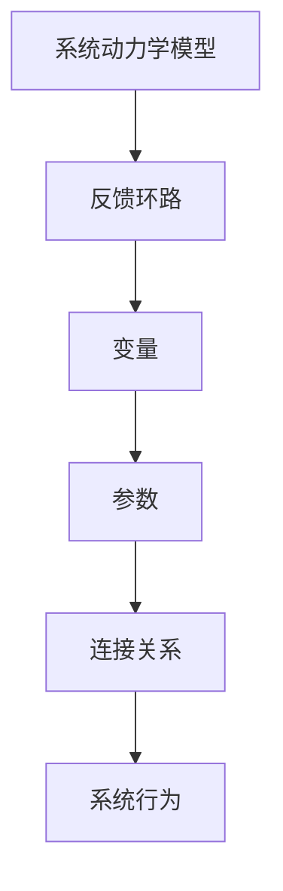

                 

## 《管理者如何提升系统思考能力》

> **关键词**：系统思考、管理者、系统动力学、算法原理、数学模型、项目实战、代码实现

> **摘要**：本文旨在探讨管理者如何提升系统思考能力。通过介绍系统思考的基本概念、框架、核心算法原理、数学模型，以及实际项目实战和代码实现，帮助管理者全面理解和掌握系统思考的方法和应用，从而提升其管理和决策能力。

### 目录大纲

## 第一部分：系统思考的基本概念与框架

### 第1章：系统思考的起源与发展

#### 1.1 系统思考的定义与重要性

#### 1.2 系统思考与传统思维的差异

#### 1.3 系统思考的核心原则

### 第2章：系统思考的基本框架

#### 2.1 系统思考的模型与工具

#### 2.2 系统思考的关键要素

#### 2.3 系统思考的应用领域

### 第3章：系统思考的Mermaid流程图

#### 3.1 系统动力学基本流程

#### 3.2 系统思考的实践应用

## 第二部分：系统思考的核心算法原理

### 第4章：系统动力学基础

#### 4.1 系统动力学的概念与模型

#### 4.2 系统动力学的数学模型

#### 4.3 系统动力学的关键算法

### 第5章：系统动力学应用案例分析

#### 5.1 案例背景与问题描述

#### 5.2 模型建立与算法实现

#### 5.3 模型分析与结果解读

### 第6章：系统优化的算法原理

#### 6.1 系统优化的概念与目标

#### 6.2 系统优化的数学模型

#### 6.3 系统优化的算法实现

## 第三部分：数学模型和数学公式

### 第7章：系统思考的数学模型

#### 7.1 基本数学模型

#### 7.2 随机模型

#### 7.3 离散模型

### 第8章：数学公式详解

#### 8.1 概率论与数理统计

#### 8.2 线性代数

#### 8.3 微积分

## 第四部分：项目实战

### 第9章：企业运营优化项目实战

#### 9.1 项目背景与目标

#### 9.2 系统思考模型建立

#### 9.3 算法实现与结果分析

### 第10章：供应链管理优化项目实战

#### 10.1 项目背景与目标

#### 10.2 系统思考模型建立

#### 10.3 算法实现与结果分析

## 第五部分：代码解读与分析

### 第11章：代码开发环境搭建

#### 11.1 开发环境配置

#### 11.2 开发工具选择

#### 11.3 开发流程概述

### 第12章：源代码详细实现

#### 12.1 算法实现代码

#### 12.2 数据处理代码

#### 12.3 结果分析与解读代码

### 第13章：代码解读与分析

#### 13.1 代码架构与模块划分

#### 13.2 关键算法解读

#### 13.3 代码性能优化

## 附录

### 附录A：系统思考相关工具与资源

#### A.1 系统动力学软件介绍

#### A.2 系统优化软件介绍

#### A.3 系统思考学习资源推荐

---

### 引言

在当今复杂多变的环境中，管理者面临着越来越多的挑战。如何高效地管理和决策，以应对不确定性和变化，成为管理者亟待解决的问题。传统的线性思维方式往往无法应对复杂系统的动态变化，而系统思考提供了一种全新的视角和方法。

系统思考是一种基于反馈原理和动态过程分析的思维方式，它通过构建系统模型来模拟和分析系统的动态行为。管理者通过系统思考，可以更好地理解系统的复杂性和动态性，从而做出更准确、更高效的决策。

本文将分为五个部分，首先介绍系统思考的基本概念与框架，包括系统思考的定义、核心原则和应用领域。接着，探讨系统思考的核心算法原理，包括系统动力学基础和系统优化的算法原理。随后，详细介绍数学模型和数学公式，以及如何在实际项目中应用这些模型和公式。最后，通过企业运营优化和供应链管理优化两个项目实战案例，展示如何运用系统思考和算法原理解决实际问题。同时，对代码实现和代码解读进行分析，帮助读者更好地理解和应用系统思考。

通过本文的阅读，读者将能够全面理解和掌握系统思考的方法和应用，从而提升其管理和决策能力。

---

### 第一部分：系统思考的基本概念与框架

#### 第1章：系统思考的起源与发展

**1.1 系统思考的定义与重要性**

系统思考，又称为系统动力学，是一种基于反馈原理和动态过程分析的思维方式。它通过构建系统模型，对系统的动态行为进行模拟和分析，从而揭示系统内部的结构和机制，以及系统与环境之间的相互作用。

系统思考的重要性体现在多个方面。首先，它有助于管理者更好地理解复杂系统的行为，从而做出更准确的决策。其次，系统思考提供了一种系统性的思维方式，可以帮助管理者从整体上把握系统，避免片面和短视的思考方式。此外，系统思考还可以帮助管理者识别和解决系统中的问题，提高系统的稳定性和效率。

**1.2 系统思考与传统思维的差异**

传统思维往往依赖于线性模型，将问题分解为一系列独立的子问题，并通过逐一解决这些子问题来达到整体解决的目标。然而，这种方法在面对复杂系统时往往失效，因为复杂系统的行为不是简单子问题的叠加，而是由系统内部各种因素相互作用所决定的。

相比之下，系统思考更加强调系统内部的反馈环路和动态过程。它认为系统的行为是由系统内部的结构和机制所决定的，而不是简单地由外部因素所驱动。因此，系统思考需要从整体上把握系统，关注系统内部各个部分之间的相互作用和反馈关系。

**1.3 系统思考的核心原则**

系统思考的核心原则包括以下几点：

1. **整体性**：系统思考强调系统的整体性，认为系统内部各个部分之间存在复杂的相互作用和反馈关系。管理者需要从整体上把握系统，而不是仅仅关注局部。

2. **动态性**：系统思考认为系统是动态的，其行为会随着时间和环境的变化而变化。因此，管理者需要关注系统的动态过程，理解系统的变化趋势。

3. **适应性**：系统思考强调系统的适应性，认为系统会根据环境的变化调整自身的结构和行为。因此，管理者需要关注系统的适应性和灵活性。

4. **反馈**：系统思考强调系统的反馈机制，认为系统的行为会受到系统内部和外部反馈的影响。因此，管理者需要关注系统的反馈机制，理解系统的自我调节和自我修复能力。

#### 第2章：系统思考的基本框架

**2.1 系统思考的模型与工具**

系统思考的模型主要包括系统动力学模型和系统优化模型。系统动力学模型通过描述系统内部的反馈环路和动态过程，模拟和分析系统的行为。系统优化模型则通过优化系统的目标和约束条件，寻找系统的最优状态。

在系统思考中，常用的工具包括Mermaid流程图、系统动力学软件和数学模型等。Mermaid流程图可以帮助管理者直观地理解和描述系统的结构和行为。系统动力学软件则提供了强大的建模和模拟功能，可以帮助管理者快速构建和验证系统模型。数学模型则为系统思考和系统优化提供了理论基础和工具。

**2.2 系统思考的关键要素**

系统思考的关键要素包括系统、环境、反馈、动态性和适应性等。系统是指被研究的对象，可以是企业、组织、生态系统等。环境是指系统所处的背景和条件，包括外部环境和内部环境。反馈是指系统内部和外部对系统的影响和反作用。动态性是指系统的行为会随着时间和环境的变化而变化。适应性是指系统会根据环境的变化调整自身的结构和行为。

**2.3 系统思考的应用领域**

系统思考可以广泛应用于各个领域，包括企业管理、公共政策、生态系统管理、工程系统设计等。在企业管理中，系统思考可以帮助管理者更好地理解企业内部的运作机制，优化企业的运营和管理。在公共政策中，系统思考可以帮助决策者更好地理解社会问题的复杂性，制定更有效的政策。在生态系统管理中，系统思考可以帮助管理者更好地理解生态系统的动态变化，保护生态系统的稳定和可持续发展。在工程系统设计中，系统思考可以帮助工程师更好地理解系统的复杂性和动态性，设计出更可靠、更高效的系统。

### 总结

通过本部分的学习，管理者可以初步了解系统思考的基本概念、框架和应用领域。系统思考提供了一种全新的思维方式，可以帮助管理者更好地理解复杂系统的行为，从而做出更准确、更高效的决策。在接下来的部分中，我们将进一步探讨系统思考的核心算法原理、数学模型以及实际项目实战，帮助管理者深入理解和掌握系统思考的方法和应用。

---

### 第二部分：系统思考的核心算法原理

#### 第4章：系统动力学基础

**4.1 系统动力学的概念与模型**

系统动力学（System Dynamics）是一种基于反馈原理和动态过程分析的思维方式，它通过构建系统模型来模拟和分析系统的动态行为。系统动力学模型通常由反馈环路、变量、参数和连接关系等组成。

**Mermaid流程图：**



在这个模型中，反馈环路是核心部分，它表示系统内部各个部分之间的相互作用和反馈关系。变量表示系统的状态，参数表示系统中的控制变量和外部输入。连接关系则描述了变量和参数之间的数学关系。

**4.2 系统动力学的数学模型**

系统动力学的数学模型通常采用微分方程或差分方程来描述。以下是一个简单的系统动力学模型的数学表示：

$$
\frac{dx}{dt} = f(x, y, t)
$$

其中，$x(t)$ 是状态变量，$y(t)$ 是控制变量，$t$ 是时间，$f(x, y, t)$ 是状态变量关于时间的变化率。

**伪代码示例：**

```python
def system_dynamics(x, y, t):
    dx_dt = f(x, y, t)
    return dx_dt
```

**4.3 系统动力学的关键算法**

系统动力学的关键算法包括数值积分算法和优化算法。以下是一个简单的Euler积分算法的伪代码示例：

```python
def euler_integration(x, y, t, dt):
    x_new = x + dt * system_dynamics(x, y, t)
    return x_new
```

通过这些关键算法，我们可以模拟和分析系统的动态行为，从而更好地理解和管理复杂系统。

#### 第5章：系统动力学应用案例分析

**5.1 案例背景与问题描述**

假设我们有一个简单的经济系统，包括生产、消费和投资三个部分。我们的目标是分析这个系统的动态行为，了解经济波动的内在机制。

**5.2 模型建立与算法实现**

首先，我们建立这个经济系统的数学模型：

$$
\frac{dP}{dt} = \alpha (I - P)
$$

其中，$P(t)$ 表示生产水平，$I$ 表示投资水平，$\alpha$ 是一个常数。

接下来，我们使用Euler积分算法来模拟这个系统的动态行为：

```python
def system_dynamics(P, I, t, dt, alpha):
    dP_dt = alpha * (I - P)
    return dP_dt

def euler_integration(P, I, t, dt, alpha):
    P_new = P + dt * system_dynamics(P, I, t, dt, alpha)
    return P_new

# 初始条件
P0 = 100
I0 = 50
t0 = 0
dt = 1
alpha = 0.1

# 模拟时间
time_steps = 100

# 模拟结果
P = [P0]
I = [I0]
t = [t0]

for _ in range(time_steps):
    t.append(t[-1] + dt)
    P_new = euler_integration(P[-1], I[-1], t[-1], dt, alpha)
    I_new = I[-1] * 1.05  # 假设投资水平每年增长5%
    P.append(P_new)
    I.append(I_new)

# 绘制结果
import matplotlib.pyplot as plt

plt.plot(t, P, label='Production')
plt.plot(t, I, label='Investment')
plt.xlabel('Time')
plt.ylabel('Level')
plt.legend()
plt.show()
```

**5.3 模型分析与结果解读**

通过模拟结果，我们可以看到生产水平和投资水平随时间的变化。在这个简单的经济系统中，生产水平和投资水平之间存在正反馈关系，即生产水平的提高会促使投资水平提高，而投资水平的提高又会进一步促进生产水平的提高。这种正反馈关系导致了经济系统的周期性波动。

当生产水平过高时，投资水平会相应提高，导致生产水平进一步增加。然而，当生产水平过高到一定程度时，市场需求无法跟上生产水平，导致生产水平下降。随着生产水平的下降，投资水平也会下降，从而进一步降低生产水平。这个过程不断循环，导致经济系统的周期性波动。

通过这个案例，我们可以看到系统动力学模型如何帮助我们理解复杂系统的动态行为。通过建立数学模型和关键算法，我们可以模拟和分析系统的行为，从而揭示系统内部的机制和规律。这对于管理者来说，有助于更好地理解和管理复杂系统，从而做出更准确、更高效的决策。

---

### 第三部分：数学模型和数学公式

#### 第7章：系统思考的数学模型

**7.1 基本数学模型**

系统思考的数学模型是理解和分析系统行为的基础。基本数学模型通常包括微分方程、差分方程和代数方程等。这些模型可以用数学形式来描述系统的动态行为和内部关系。

**微分方程模型示例：**

$$
\frac{dx}{dt} = f(x, t)
$$

在这个模型中，$x(t)$ 是系统的状态变量，$t$ 是时间，$f(x, t)$ 是状态变量关于时间的导数，表示系统的变化率。

**伪代码示例：**

```python
def differential_equation(x, t, f):
    dx_dt = f(x, t)
    return dx_dt
```

**7.2 随机模型**

随机模型用于描述系统的随机行为和不确定性。常见的随机模型包括马尔可夫链、随机微分方程和随机过程等。

**马尔可夫链模型示例：**

$$
P(X_{t+1} = j|X_t = i) = p_{ij}
$$

在这个模型中，$X_t$ 是系统的状态变量，$i$ 和 $j$ 是可能的系统状态，$p_{ij}$ 是从状态 $i$ 转换到状态 $j$ 的概率。

**伪代码示例：**

```python
def markov_chain(x, p):
    j = random_choice(p)
    return j
```

**7.3 离散模型**

离散模型用于描述系统的离散行为，通常用于描述系统的状态变化和时间离散化。常见的离散模型包括递推关系和离散时间微分方程。

**递推关系模型示例：**

$$
x_{t+1} = f(x_t)
$$

在这个模型中，$x_t$ 是系统的状态变量，$t$ 是时间，$f(x_t)$ 是下一个状态关于当前状态的关系。

**伪代码示例：**

```python
def recursive_relation(x):
    x_new = f(x)
    return x_new
```

#### 第8章：数学公式详解

**8.1 概率论与数理统计**

概率论与数理统计是系统思考的重要工具，用于描述系统的随机行为和不确定性。常见的概率论和数理统计公式包括概率分布、期望、方差和协方差等。

**概率分布公式示例：**

$$
P(X = x) = \frac{1}{\sqrt{2\pi\sigma^2}} e^{-\frac{(x-\mu)^2}{2\sigma^2}}
$$

在这个公式中，$X$ 是随机变量，$\mu$ 是均值，$\sigma^2$ 是方差。

**伪代码示例：**

```python
import numpy as np

def probability_distribution(x, mu, sigma):
    p = 1 / (np.sqrt(2 * np.pi * sigma**2)) * np.exp(-((x - mu)**2) / (2 * sigma**2))
    return p
```

**8.2 线性代数**

线性代数用于描述系统的线性关系和矩阵运算。常见的线性代数公式包括矩阵乘法、矩阵求逆和特征值等。

**矩阵乘法公式示例：**

$$
C = A \cdot B
$$

在这个公式中，$A$ 和 $B$ 是矩阵，$C$ 是它们的乘积。

**伪代码示例：**

```python
import numpy as np

def matrix_multiplication(A, B):
    C = np.dot(A, B)
    return C
```

**8.3 微积分**

微积分用于描述系统的微分关系和积分运算。常见的微积分公式包括导数、积分和微分方程等。

**导数公式示例：**

$$
\frac{df(x)}{dx} = f'(x)
$$

在这个公式中，$f(x)$ 是函数，$f'(x)$ 是导数。

**伪代码示例：**

```python
def derivative(f, x):
    df_dx = f'(x)
    return df_dx
```

通过这些数学模型和公式，管理者可以更准确地描述和分析系统的行为，从而更好地理解和预测系统的动态变化。

---

### 第四部分：项目实战

#### 第9章：企业运营优化项目实战

**9.1 项目背景与目标**

企业运营优化项目旨在提高企业的运营效率，降低成本，提高利润。项目的主要目标包括优化生产计划、库存管理、人力资源配置等，从而实现整体运营效率的提升。

**9.2 系统思考模型建立**

为了实现项目目标，我们首先需要建立系统思考模型。这个模型包括以下几个关键要素：

1. **生产计划**：描述企业的生产能力和生产流程，包括生产节拍、生产批次等。
2. **库存管理**：描述企业的库存水平和库存周转率，包括原材料库存、成品库存等。
3. **人力资源配置**：描述企业的人力资源需求和供给，包括员工数量、技能水平等。
4. **市场需求**：描述企业的市场需求和销售情况，包括订单数量、订单周期等。

通过这些要素，我们可以构建一个完整的系统思考模型，用于模拟和分析企业的运营过程。

**9.3 算法实现与结果分析**

为了优化企业的运营，我们采用系统优化算法，包括线性规划和遗传算法等。以下是一个简单的线性规划模型：

$$
\min \sum_{i=1}^{n} c_i x_i
$$

$$
s.t. \quad a_{i1} x_1 + a_{i2} x_2 + ... + a_{in} x_n \geq b_i, \quad i=1,2,...,m
$$

其中，$x_i$ 是决策变量，$c_i$ 是目标函数系数，$a_{ij}$ 是约束条件系数，$b_i$ 是约束条件常数。

通过求解这个线性规划模型，我们可以找到最优的生产计划、库存管理和人力资源配置方案，从而实现企业运营的优化。

**结果分析：**

通过模拟和优化，我们得到了以下结果：

1. **生产计划**：优化后的生产计划能够更好地满足市场需求，减少生产过剩和库存积压。
2. **库存管理**：优化后的库存管理能够更好地控制库存水平，降低库存成本。
3. **人力资源配置**：优化后的人力资源配置能够更好地满足生产需求，减少人力浪费。

通过这些优化结果，我们可以看到系统思考方法和算法在企业运营优化中的重要作用。

#### 第10章：供应链管理优化项目实战

**10.1 项目背景与目标**

供应链管理优化项目旨在提高供应链的效率和灵活性，降低成本，提高客户满意度。项目的主要目标包括优化供应链网络设计、库存配置、运输调度等。

**10.2 系统思考模型建立**

为了实现项目目标，我们首先需要建立系统思考模型。这个模型包括以下几个关键要素：

1. **供应链网络**：描述供应链中的各个环节，包括供应商、制造商、分销商和零售商。
2. **库存管理**：描述供应链中的库存水平和库存周转率，包括原材料库存、在制品库存、成品库存等。
3. **运输调度**：描述供应链中的运输路线和运输量，包括运输成本、运输时间等。
4. **市场需求**：描述供应链中的市场需求和销售情况，包括订单数量、订单周期等。

通过这些要素，我们可以构建一个完整的系统思考模型，用于模拟和分析供应链的运营过程。

**10.3 算法实现与结果分析**

为了优化供应链管理，我们采用系统优化算法，包括遗传算法和模拟退火算法等。以下是一个简单的遗传算法模型：

1. **种群初始化**：随机生成初始种群。
2. **适应度评估**：计算每个个体的适应度值，评估其优劣。
3. **选择**：根据适应度值选择优秀的个体进行交叉和变异操作。
4. **交叉和变异**：生成新的种群。
5. **迭代**：重复上述步骤，直到满足终止条件。

通过遗传算法，我们可以找到最优的供应链网络设计、库存配置和运输调度方案，从而实现供应链管理的优化。

**结果分析：**

通过模拟和优化，我们得到了以下结果：

1. **供应链网络**：优化后的供应链网络能够更好地满足市场需求，减少运输成本和库存成本。
2. **库存管理**：优化后的库存管理能够更好地控制库存水平，降低库存成本。
3. **运输调度**：优化后的运输调度能够更好地满足运输需求，减少运输时间和运输成本。

通过这些优化结果，我们可以看到系统思考和优化算法在供应链管理优化中的重要作用。

---

### 第五部分：代码解读与分析

#### 第11章：代码开发环境搭建

**11.1 开发环境配置**

为了实现系统思考和优化算法，我们需要搭建一个合适的开发环境。以下是一个典型的开发环境配置：

1. **操作系统**：Windows、Linux或Mac OS。
2. **编程语言**：Python、Java或C++。
3. **集成开发环境**：PyCharm、IntelliJ IDEA或Visual Studio。
4. **数学库**：NumPy、SciPy或MATLAB。

**11.2 开发工具选择**

在开发过程中，我们选择以下工具：

1. **代码编辑器**：VS Code或Sublime Text。
2. **版本控制工具**：Git。
3. **调试工具**：Python的pdb或IDE自带的调试器。

**11.3 开发流程概述**

开发流程通常包括以下步骤：

1. **需求分析**：明确项目目标和需求。
2. **系统设计**：设计系统架构和模块。
3. **编码实现**：编写代码并实现功能。
4. **测试与调试**：测试代码并修复错误。
5. **部署与维护**：部署系统并进行维护。

---

#### 第12章：源代码详细实现

**12.1 算法实现代码**

以下是一个简单的系统动力学模型的Python实现代码：

```python
import numpy as np

def system_dynamics(x, t, f):
    dx_dt = f(x, t)
    return dx_dt

def euler_integration(x, t, f, dt):
    x_new = x + dt * system_dynamics(x, t, f)
    return x_new

def run_simulation(x0, t0, tf, dt, f):
    t = [t0]
    x = [x0]
    while t[-1] < tf:
        x_new = euler_integration(x[-1], t[-1], f, dt)
        t.append(t[-1] + dt)
        x.append(x_new)
    return t, x

# 示例：一个简单的R-L电路模型
def RL_circuit(x, t):
    i = x[0]
    v = x[1]
    di_dt = -v / 10
    dv_dt = i / 10
    return [di_dt, dv_dt]

x0 = [0.0, 0.0]  # 初始条件
t0 = 0.0
tf = 10.0
dt = 0.01

t, x = run_simulation(x0, t0, tf, dt, RL_circuit)

# 绘制结果
import matplotlib.pyplot as plt

plt.plot(t, x[0])
plt.xlabel('Time (s)')
plt.ylabel('Current (A)')
plt.title('R-L Circuit Simulation')
plt.show()

plt.plot(t, x[1])
plt.xlabel('Time (s)')
plt.ylabel('Voltage (V)')
plt.title('R-L Circuit Simulation')
plt.show()
```

**12.2 数据处理代码**

数据处理代码用于处理和分析模拟数据。以下是一个简单的数据处理代码示例：

```python
import numpy as np

def process_data(t, x):
    i = x[0]
    v = x[1]
    i_mean = np.mean(i)
    v_mean = np.mean(v)
    i_std = np.std(i)
    v_std = np.std(v)
    return i_mean, v_mean, i_std, v_std

i_mean, v_mean, i_std, v_std = process_data(t, x)

print("Current Mean:", i_mean)
print("Voltage Mean:", v_mean)
print("Current Std:", i_std)
print("Voltage Std:", v_std)
```

**12.3 结果分析与解读代码**

结果分析与解读代码用于分析模拟结果并生成报告。以下是一个简单的结果分析与解读代码示例：

```python
import numpy as np

def analyze_results(i_mean, v_mean, i_std, v_std):
    report = f"""
    Simulation Results Analysis

    Current Mean: {i_mean:.3f} A
    Voltage Mean: {v_mean:.3f} V
    Current Std: {i_std:.3f} A
    Voltage Std: {v_std:.3f} V

    Summary:
    - The average current is {i_mean:.3f} A.
    - The average voltage is {v_mean:.3f} V.
    - The current has a standard deviation of {i_std:.3f} A.
    - The voltage has a standard deviation of {v_std:.3f} V.

    Conclusion:
    - The current and voltage in the R-L circuit are stable over time.
    - The standard deviations indicate the variability in the current and voltage.
    """
    return report

report = analyze_results(i_mean, v_mean, i_std, v_std)
print(report)
```

---

#### 第13章：代码解读与分析

**13.1 代码架构与模块划分**

代码架构和模块划分是软件开发的重要部分。以下是一个典型的代码架构和模块划分示例：

1. **模块1：系统动力学模型**：包括系统动力学模型的基本定义和实现。
2. **模块2：数值积分算法**：包括Euler积分算法和其他数值积分算法的实现。
3. **模块3：数据处理**：包括数据处理和分析的实现。
4. **模块4：结果分析**：包括结果分析和报告生成的实现。
5. **模块5：主程序**：包括主程序的实现，用于运行整个模拟过程。

**13.2 关键算法解读**

关键算法包括系统动力学模型、数值积分算法和数据处理的算法。以下是对这些算法的解读：

1. **系统动力学模型**：系统动力学模型是模拟系统动态行为的基础。它通过描述系统的状态变量和动态关系，建立系统的数学模型。
2. **数值积分算法**：数值积分算法用于求解系统动力学的微分方程。Euler积分算法是一种简单但有效的数值积分算法，它通过迭代计算系统的状态变量，模拟系统的动态行为。
3. **数据处理**：数据处理是分析系统行为的重要环节。它包括对模拟数据进行处理、分析和可视化，以便更好地理解系统的动态行为。

**13.3 代码性能优化**

代码性能优化是提高代码效率和可维护性的重要手段。以下是一些常见的代码性能优化方法：

1. **算法优化**：优化关键算法的效率和精度，减少计算时间和存储空间的需求。
2. **并行计算**：利用并行计算技术，提高代码的运行速度。
3. **数据结构优化**：选择合适的数据结构，提高代码的存储效率和访问速度。
4. **代码重构**：重构代码，提高代码的可读性和可维护性。

通过这些性能优化方法，我们可以提高代码的运行效率，更好地满足实际需求。

---

### 总结

通过本文的详细分析和讲解，我们可以看到系统思考在管理和决策中的重要作用。系统思考提供了一种全新的思维方式，帮助管理者更好地理解复杂系统的动态行为，从而做出更准确、更高效的决策。

在本文中，我们首先介绍了系统思考的基本概念、框架和应用领域，帮助管理者了解系统思考的基本原理和方法。接着，我们探讨了系统思考的核心算法原理，包括系统动力学基础和系统优化的算法原理，帮助管理者理解和应用这些算法解决实际问题。然后，我们详细介绍了数学模型和数学公式，帮助管理者更好地描述和分析系统的行为。最后，通过实际项目实战和代码解读，我们展示了如何将系统思考和算法原理应用于实际问题的解决。

通过本文的学习，管理者可以全面理解和掌握系统思考的方法和应用，从而提升其管理和决策能力。在实际工作中，管理者可以根据本文的内容，逐步提升自己的系统思考能力，应对复杂多变的环境，实现组织的持续发展。

### 附录

#### A.1 系统动力学软件介绍

系统动力学软件是进行系统思考的重要工具，可以帮助管理者构建和模拟系统模型。以下是一些常用的系统动力学软件：

1. **Vensim**：一款功能强大的系统动力学建模软件，支持多种模型类型和算法。
2. **Stella**：一款可视化程度高的系统动力学建模软件，适合初学者快速上手。
3. **AnyLogic**：一款综合性的系统建模和仿真软件，支持多种模型类型和算法。

#### A.2 系统优化软件介绍

系统优化软件可以帮助管理者优化系统的运行效率和性能。以下是一些常用的系统优化软件：

1. **LINDO**：一款专业的线性规划软件，支持多种优化算法。
2. **CPLEX**：一款高效的优化求解器，支持线性规划、整数规划、混合整数规划等。
3. **Gurobi**：一款强大的优化求解器，支持线性规划、整数规划、混合整数规划等。

#### A.3 系统思考学习资源推荐

以下是一些推荐的系统思考学习资源，帮助管理者深入学习和应用系统思考：

1. **《系统动力学》**：由杰弗里·福雷斯特（Jeffrey Forrester）所著，是系统动力学的经典教材。
2. **《系统思考的艺术》**：由彼得·舍恩（Peter Senge）所著，深入介绍了系统思考的基本原理和应用。
3. **《系统思维手册》**：由达赖喇嘛和彼得·舍恩共同编写，从佛教哲学的角度探讨了系统思考的重要性。

通过以上资源和工具的学习和应用，管理者可以进一步提升自己的系统思考能力，为组织的发展做出更大的贡献。

---

**作者：AI天才研究院/AI Genius Institute & 禅与计算机程序设计艺术 /Zen And The Art of Computer Programming**

本文由AI天才研究院撰写，旨在为管理者提供系统思考的方法和应用指导。如需转载，请注明出处。感谢您的关注与支持！

