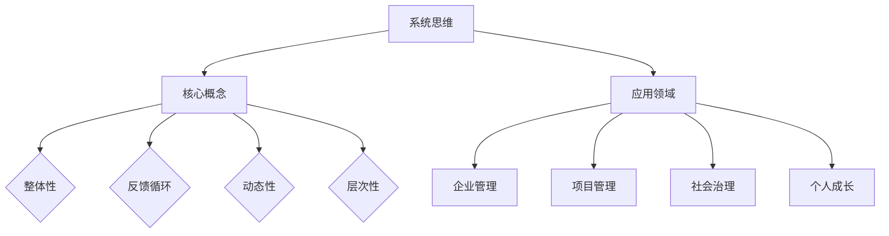

                 

### 《系统思维：管理者驾驭复杂局面的能力》

#### 关键词：系统思维、复杂局面、管理者、决策、战略规划

> 摘要：本文深入探讨了系统思维在管理者应对复杂局面中的重要性。通过阐述系统思维的核心概念、基本原理、应用场景和实践案例，本文旨在帮助读者理解和掌握系统思维，提高管理者驾驭复杂局面的能力。系统思维不仅是一种思维方式，更是一种管理工具，它能够帮助管理者从全局出发，全面分析问题，做出更加科学和有效的决策。

### 引言

在当今复杂多变的环境中，管理者面临着前所未有的挑战。从企业竞争到公共政策制定，从项目开发到社会问题解决，每一个领域都充满了不确定性。面对这些复杂局面，传统的线性思维往往难以奏效，管理者需要一种全新的思维方式来应对。

系统思维（Systems Thinking）就是这样一种思维方式。它强调从整体和系统的角度来分析和解决问题，不仅关注系统的各个组成部分，更关注这些部分之间的相互作用和反馈循环。系统思维提供了一种全面的视角，帮助管理者理解复杂系统的运作机制，预见潜在的问题和风险，从而做出更加明智的决策。

本文将围绕系统思维这一主题，首先介绍系统思维的定义和重要性，然后详细阐述系统思维的基本概念、工具和方法，接着分析系统思维在不同应用场景中的实际运用，最后探讨如何培养和提升系统思维能力。希望通过本文的阐述，读者能够更好地理解和运用系统思维，提升自己的管理能力和决策水平。

### 《系统思维：管理者驾驭复杂局面的能力》目录大纲

## 第一部分：系统思维基础

### 第1章：系统思维概述

#### 1.1 系统思维的定义与重要性

#### 1.2 系统思维与传统思维的区别

#### 1.3 系统思维的核心原则

### 第2章：系统思维的基本概念

#### 2.1 系统与系统论

#### 2.2 系统元素及其关系

#### 2.3 系统行为与反馈循环

### 第3章：系统思维工具与方法

#### 3.1 系统图与因果图

#### 3.2 系统动力学模拟

#### 3.3 复杂性思维与决策

### 第4章：系统思维应用场景

#### 4.1 企业管理与运营

#### 4.2 项目管理

#### 4.3 社会治理与公共政策

## 第二部分：系统思维实践

### 第5章：系统思维案例分析

#### 5.1 案例一：企业变革与系统思维

#### 5.2 案例二：自然灾害应对与系统思维

#### 5.3 案例三：经济危机治理与系统思维

### 第6章：系统思维在企业管理中的应用

#### 6.1 企业战略规划

#### 6.2 组织结构设计

#### 6.3 创新与变革管理

### 第7章：系统思维在项目管理中的应用

#### 7.1 项目风险管理

#### 7.2 项目进度管理

#### 7.3 项目成本管理

### 第8章：系统思维在社会治理中的应用

#### 8.1 公共政策制定

#### 8.2 社会治理创新

#### 8.3 社会问题解决

## 第三部分：系统思维提升

### 第9章：系统思维训练与培养

#### 9.1 系统思维训练方法

#### 9.2 系统思维实践案例

#### 9.3 系统思维发展前景

### 第10章：系统思维在日常生活中的应用

#### 10.1 家庭管理与系统思维

#### 10.2 社交关系与系统思维

#### 10.3 个人成长与系统思维

### 第11章：系统思维与跨学科融合

#### 11.1 系统思维与心理学

#### 11.2 系统思维与经济学

#### 11.3 系统思维与生态学

## 附录

### 附录A：系统思维资源与工具

#### A.1 系统思维相关书籍推荐

#### A.2 系统思维在线课程推荐

#### A.3 系统思维工具软件介绍

### 附录B：系统思维案例研究

#### B.1 企业变革案例

#### B.2 公共政策案例

#### B.3 项目管理案例

### 附录C：系统思维思维导图

### 附录D：系统思维练习题

### 附录E：系统思维参考资料

### 引言

在当今复杂多变的环境中，管理者面临着前所未有的挑战。从企业竞争到公共政策制定，从项目开发到社会问题解决，每一个领域都充满了不确定性。面对这些复杂局面，传统的线性思维往往难以奏效，管理者需要一种全新的思维方式来应对。

系统思维（Systems Thinking）就是这样一种思维方式。它强调从整体和系统的角度来分析和解决问题，不仅关注系统的各个组成部分，更关注这些部分之间的相互作用和反馈循环。系统思维提供了一种全面的视角，帮助管理者理解复杂系统的运作机制，预见潜在的问题和风险，从而做出更加明智的决策。

本文将围绕系统思维这一主题，首先介绍系统思维的定义和重要性，然后详细阐述系统思维的基本概念、工具和方法，接着分析系统思维在不同应用场景中的实际运用，最后探讨如何培养和提升系统思维能力。希望通过本文的阐述，读者能够更好地理解和运用系统思维，提升自己的管理能力和决策水平。

### 第1章：系统思维概述

#### 1.1 系统思维的定义与重要性

系统思维（Systems Thinking）是一种从整体和系统的角度来分析和解决问题的思维方式。它不仅仅关注系统的各个组成部分，更强调这些部分之间的相互作用和反馈循环。系统思维的核心思想是，通过理解系统内部的结构和机制，可以更全面、深入地理解系统的行为和演化。

- **定义**：系统思维是一种关注整体性、动态性和相互关联性的思维方式。它强调将问题视为一个系统，分析系统内部各个部分之间的关系和相互作用，以及这些关系和相互作用对系统整体行为的影响。

- **重要性**：系统思维在管理者应对复杂局面中具有重要性，原因如下：

1. **全面性**：系统思维提供了一种全面的视角，帮助管理者理解复杂系统的各个方面，避免片面和局部优化的决策。

2. **预见性**：通过分析系统的反馈循环和动态性，系统思维可以帮助管理者预见潜在的问题和风险，从而提前采取应对措施。

3. **创新性**：系统思维鼓励管理者从新的角度思考问题，探索解决方案，提高创新能力和决策质量。

4. **协同性**：系统思维强调系统内部各个部分之间的相互作用，有助于管理者建立协同合作的工作环境，提高组织效率。

#### 1.2 系统思维与传统思维的区别

系统思维与传统思维在许多方面存在显著差异。传统思维通常采用线性、分解和局部优化的方法，而系统思维则强调整体性、动态性和相互关联性。

- **传统思维**：

1. **线性**：传统思维往往将问题分解为一系列独立的步骤，通过线性思维来逐步解决问题。

2. **分解**：传统思维强调将复杂问题分解为若干个简单的问题，分别进行分析和解决。

3. **局部优化**：传统思维倾向于追求局部最优，而忽视整体效果。

- **系统思维**：

1. **整体性**：系统思维将问题视为一个整体，关注系统内部各个部分之间的相互作用和整体行为。

2. **动态性**：系统思维强调系统的动态性和反馈循环，理解系统随时间的变化和演化。

3. **相互关联性**：系统思维关注系统内部各个部分之间的相互关联，理解部分与整体的关系。

#### 1.3 系统思维的核心原则

系统思维遵循一系列核心原则，这些原则有助于管理者更好地理解和管理复杂系统。以下是系统思维的核心原则：

1. **整体性**：系统思维强调将问题视为一个整体，关注系统内部各个部分之间的相互作用和整体行为。

2. **反馈循环**：系统思维关注系统内部的反馈循环，这些反馈循环会影响系统的稳定性和行为。

3. **动态性**：系统思维认为系统是动态演化的，随着时间的推移，系统会经历各种变化。

4. **适应性**：系统思维鼓励管理者适应系统的变化，不断调整和优化系统。

5. **层次性**：系统思维强调系统的层次结构，理解不同层次的系统行为和相互作用。

6. **复杂性**：系统思维承认系统的复杂性，并尝试通过简化模型和方法来理解和解决问题。

通过理解和应用这些核心原则，管理者可以更好地应对复杂局面，提高决策质量和效率。

### 第2章：系统思维的基本概念

#### 2.1 系统与系统论

系统思维的核心概念之一是“系统”。系统是由相互关联的元素组成的整体，这些元素通过相互作用和相互依赖来维持系统的行为和功能。系统论（Systems Theory）是研究系统的结构、行为和演化规律的一门科学，它为系统思维提供了理论基础。

- **系统的定义**：

系统是一个由相互关联的元素组成的整体，这些元素通过相互作用和相互依赖来维持系统的行为和功能。系统可以是自然的，如生态系统；也可以是社会的，如组织；还可以是技术的，如计算机系统。

- **系统的组成部分**：

系统由以下几个基本组成部分构成：

1. **元素**：构成系统的基本单元，可以是物质、能量或信息。
2. **结构**：系统内部元素之间的相互关系和组织方式。
3. **行为**：系统在运行过程中所表现出来的特征和规律。
4. **环境**：系统外部的影响因素和条件。

- **系统论的基本原理**：

系统论包括以下几个基本原理：

1. **整体性**：系统作为一个整体具有其独特的性质和行为，不能简单地通过其组成部分来解释。
2. **反馈循环**：系统内部的信息流动和调整过程，可以影响系统的稳定性和行为。
3. **动态性**：系统是不断演化的，其行为和结构会随时间变化。
4. **适应性**：系统能够适应环境变化，通过调整内部结构和行为来维持系统的稳定性。

- **系统的分类**：

系统可以分为自然系统、社会系统和技术系统等。每种系统具有不同的特征和演化规律。

1. **自然系统**：如生态系统、气候系统等。
2. **社会系统**：如组织、社区、社会等。
3. **技术系统**：如计算机系统、交通系统等。

#### 2.2 系统元素及其关系

系统元素是构成系统的基本组成部分，它们通过相互作用和相互依赖来维持系统的行为和功能。理解系统元素及其关系对于系统思维至关重要。

- **系统元素的定义**：

系统元素是构成系统的基本单元，可以是物质、能量或信息。这些元素在系统中扮演不同的角色，通过相互作用和相互依赖来维持系统的行为和功能。

- **系统元素之间的关系**：

系统元素之间的关系包括以下几个方面：

1. **输入输出关系**：系统元素之间的相互作用可以通过输入输出关系来描述。例如，一个生产系统中的原材料（输入）转化为产品（输出）。
2. **因果关系**：系统元素之间可能存在因果关系，即一个元素的变化会影响另一个元素的状态。例如，增加研发投入可能提高产品创新速度。
3. **相互作用关系**：系统元素之间可能通过相互作用来维持系统的平衡。例如，一个生态系统中，植物通过光合作用产生氧气，动物通过呼吸作用消耗氧气。

- **系统元素的关系模型**：

系统元素之间的关系可以用不同的模型来表示，如因果图、系统图等。这些模型有助于分析和理解系统元素的相互作用和依赖关系。

1. **因果图**：因果图是一种图形化工具，用于表示系统元素之间的因果关系。通过因果图，可以直观地看到系统内部各个元素之间的联系和影响。
2. **系统图**：系统图是一种用于表示系统结构和元素关系的图形化工具。通过系统图，可以清晰地看到系统内部的层次结构和相互关系。

#### 2.3 系统行为与反馈循环

系统行为是指系统在运行过程中所表现出来的特征和规律。理解系统行为有助于管理者预测和应对系统变化。反馈循环是系统行为的一个重要特征，它指的是系统内部的信息流动和调整过程。

- **系统行为的定义**：

系统行为是指系统在运行过程中所表现出来的特征和规律。系统行为可以表现为稳定性、动态性、适应性等。例如，一个生态系统中的物种数量和生态平衡状态的变化。

- **反馈循环的概念**：

反馈循环是指系统内部的信息流动和调整过程，它可以使系统保持稳定或适应环境变化。反馈循环可以分为正反馈和负反馈：

1. **正反馈**：正反馈是指系统内部的信息流动和调整过程，使系统的某种特征不断增强。例如，在生态系统中，一个物种数量的增加可能导致其竞争者数量的减少，从而进一步增加该物种的数量。
2. **负反馈**：负反馈是指系统内部的信息流动和调整过程，使系统的某种特征不断减弱。例如，在生态系统中，一个物种数量的增加可能导致其竞争者数量的增加，从而抑制该物种的数量增长。

- **反馈循环的类型**：

反馈循环可以分为以下几种类型：

1. **即时反馈**：即时反馈是指系统内部的变化立即影响到其他元素，例如，一个公司内部的销售数据立即影响生产计划。
2. **延迟反馈**：延迟反馈是指系统内部的变化需要一段时间才能影响到其他元素，例如，环境变化对生态系统的长期影响。
3. **循环反馈**：循环反馈是指系统内部的变化形成一个闭合循环，如生态系统中食物链和食物网的反馈循环。

理解系统行为和反馈循环有助于管理者更好地预测和应对系统的变化。通过分析和优化反馈循环，可以增强系统的稳定性，提高系统的适应性。

### 第3章：系统思维工具与方法

系统思维提供了一系列工具和方法，帮助管理者更好地分析和理解复杂系统。以下是系统思维中常用的几种工具和方法。

#### 3.1 系统图与因果图

系统图和因果图是系统思维中常用的两种工具，它们分别用于表示系统的结构和系统元素之间的因果关系。

- **系统图的定义与应用**：

系统图是一种图形化工具，用于表示系统的各个部分以及它们之间的相互作用关系。系统图通常由节点和边组成，节点表示系统的元素，边表示元素之间的相互作用。

1. **应用场景**：系统图可以应用于企业战略规划、项目管理、环境管理等场景。例如，在企业战略规划中，系统图可以帮助管理者清晰地了解企业的业务流程、资源和目标之间的关系。

2. **系统图的绘制**：绘制系统图的一般步骤如下：

   - 确定系统边界：明确系统的范围和包含的元素。
   - 确定系统元素：列出系统中的关键元素，如产品、人员、资源等。
   - 描述元素关系：通过边连接系统元素，表示它们之间的相互作用关系。
   - 分析系统行为：根据系统图，分析系统的整体行为和演化趋势。

- **因果图的定义与应用**：

因果图是一种图形化工具，用于表示系统元素之间的因果关系。因果图通常由节点和箭头组成，节点表示系统元素，箭头表示元素之间的因果关系。

1. **应用场景**：因果图可以应用于问题分析、风险评估、决策制定等场景。例如，在项目管理中，因果图可以帮助管理者识别项目风险，分析风险产生的原因和影响。

2. **因果图的绘制**：绘制因果图的一般步骤如下：

   - 确定系统元素：列出系统中可能影响项目成功的元素，如人员、资源、技术等。
   - 描述因果关系：通过箭头连接系统元素，表示它们之间的因果关系。
   - 分析因果循环：分析因果图中的正反馈和负反馈循环，理解系统行为的动态性。
   - 优化因果关系：根据因果图，优化系统元素之间的关系，减少负面效应，增强正面效应。

通过系统图和因果图，管理者可以更清晰地了解系统的结构和行为，从而做出更加科学的决策。

#### 3.2 系统动力学模拟

系统动力学模拟是一种通过计算机模拟系统行为和演化过程的方法。它可以帮助管理者更好地理解系统的动态特征和演化趋势。

- **系统动力学模拟的基本原理**：

系统动力学模拟基于系统论的基本原理，通过建立系统模型和模拟运行来研究系统的行为和演化。系统模型通常包括以下组成部分：

1. **变量**：系统中的关键变量，如人口数量、资源消耗、销售额等。
2. **反馈循环**：系统内部的反馈循环，如正反馈和负反馈。
3. **因果关系**：系统元素之间的因果关系，如政策变化对经济的影响。
4. **决策规则**：系统中的决策规则，如企业战略决策。

系统动力学模拟通过运行模型，模拟系统在不同条件下的行为和演化过程，从而帮助管理者分析和预测系统的未来状态。

- **系统动力学模拟的应用**：

系统动力学模拟可以应用于各个领域，如企业管理、环境保护、公共政策制定等。

1. **企业管理**：通过系统动力学模拟，企业可以模拟不同战略决策下的市场表现，预测企业的长期发展态势。

2. **环境保护**：通过系统动力学模拟，可以分析环境变化对生态系统的影响，制定有效的环境保护策略。

3. **公共政策制定**：通过系统动力学模拟，政策制定者可以模拟不同政策方案的效果，选择最优的政策方案。

通过系统动力学模拟，管理者可以更全面地理解系统的动态特征，预测系统的未来行为，从而做出更加科学的决策。

#### 3.3 复杂性思维与决策

复杂性思维是系统思维的一个重要方面，它强调在面对复杂系统时需要采用更加灵活和创新的方法。

- **复杂性思维的定义**：

复杂性思维是指在面对复杂系统时，采用整体性、动态性和适应性等思维方式来理解和解决问题。复杂性思维承认系统的复杂性和不可预测性，强调通过建模、模拟和实验等方法来探索和解决问题。

- **复杂性思维的应用**：

复杂性思维可以应用于各个领域，如企业管理、科技创新、社会治理等。

1. **企业管理**：通过复杂性思维，管理者可以更好地理解企业面临的复杂环境，制定更加灵活和适应性强的战略。

2. **科技创新**：通过复杂性思维，科学家和工程师可以更好地理解科技发展的不确定性和多样性，探索创新的解决方案。

3. **社会治理**：通过复杂性思维，政策制定者可以更好地理解社会问题的复杂性和多样性，制定更加科学和有效的公共政策。

复杂性思维帮助管理者在面对复杂局面时，能够更加灵活和创造性地应对，提高决策质量和效率。

### 第4章：系统思维应用场景

系统思维在多个应用场景中发挥着重要作用，帮助管理者更好地应对复杂局面。以下是系统思维在企业管理与运营、项目管理和社会治理与公共政策中的具体应用。

#### 4.1 企业管理与运营

系统思维在企业管理与运营中的应用非常广泛，可以帮助管理者优化企业战略、提升运营效率、降低风险。

- **企业战略规划**：

系统思维可以帮助管理者制定更加科学和可行的企业战略。通过系统思维，管理者可以全面分析企业的内部资源和外部环境，识别关键成功因素，制定长期和短期战略目标。例如，企业可以通过系统思维分析市场需求、技术趋势和竞争对手，从而制定以创新为核心的战略规划。

- **运营效率提升**：

系统思维可以帮助管理者优化企业运营流程，提高生产效率和服务质量。通过系统思维，管理者可以分析企业的各个环节，识别瓶颈和优化点。例如，企业可以通过系统思维优化供应链管理，减少库存成本，提高供应链的响应速度。

- **风险管理**：

系统思维可以帮助管理者识别企业运营中的潜在风险，制定有效的风险应对策略。通过系统思维，管理者可以分析风险的成因和传播路径，制定风险预警和应对措施。例如，企业可以通过系统思维分析市场风险、技术风险和操作风险，从而制定全面的风险管理策略。

#### 4.2 项目管理

系统思维在项目管理中的应用也非常重要，可以帮助项目经理更好地规划项目、控制进度、降低成本。

- **项目规划**：

系统思维可以帮助项目经理全面考虑项目的影响因素，制定详细的项目计划。通过系统思维，项目经理可以分析项目的需求、资源、时间和技术等方面，制定科学合理的项目计划。例如，项目经理可以通过系统思维分析项目的关键路径、资源需求和风险因素，从而制定详细的项目计划。

- **进度控制**：

系统思维可以帮助项目经理识别项目中的关键路径和关键节点，确保项目按时完成。通过系统思维，项目经理可以分析项目的进度，识别可能影响进度的因素，制定相应的进度控制措施。例如，项目经理可以通过系统思维分析项目的进度数据，识别延迟风险，并采取相应的调整措施。

- **成本管理**：

系统思维可以帮助项目经理优化资源配置，降低项目成本。通过系统思维，项目经理可以分析项目的成本结构，识别成本节约的机会。例如，项目经理可以通过系统思维优化项目预算，减少不必要的开支，提高项目的投资回报率。

#### 4.3 社会治理与公共政策

系统思维在社会治理与公共政策中的应用可以帮助政府和社会组织更好地解决社会问题，提高公共服务的质量和效率。

- **公共政策制定**：

系统思维可以帮助政府制定更加科学和有效的公共政策。通过系统思维，政策制定者可以全面分析社会问题的成因和影响，制定具有针对性的政策。例如，政府可以通过系统思维分析环境污染问题的成因和影响，从而制定有效的环境保护政策。

- **社会治理创新**：

系统思维可以帮助社会组织探索新的社会治理模式，提高社会治理的效率和质量。通过系统思维，社会组织可以分析现有社会治理模式的不足，探索创新的社会治理模式。例如，社会组织可以通过系统思维分析社区治理的问题，探索参与式治理模式，提高社区治理的效率和效果。

- **社会问题解决**：

系统思维可以帮助政府和社会组织更好地解决社会问题。通过系统思维，政策制定者和执行者可以全面分析社会问题的成因和影响，制定综合性的解决方案。例如，政府可以通过系统思维分析贫困问题的成因，制定扶贫政策，提高贫困人口的生活水平。

#### 案例分析

以下是一些实际案例，展示了系统思维在企业管理、项目管理和社会治理中的应用。

- **企业案例**：某科技公司在面临激烈市场竞争时，通过系统思维制定了以创新为核心的战略规划。公司分析了市场需求、技术趋势和竞争对手，确定了研发投入和产品创新的方向，从而在市场中取得了竞争优势。

- **项目案例**：某IT项目在实施过程中，通过系统思维分析了项目进度、成本和风险，制定了详细的进度计划和成本控制措施。项目团队通过系统思维识别了关键节点和潜在风险，采取了相应的风险管理措施，确保了项目的按时完成。

- **社会治理案例**：某市政府在制定环境保护政策时，通过系统思维分析了环境污染的成因和影响，制定了一系列环境保护措施。市政府通过系统思维识别了环保政策的潜在影响，采取了科学合理的政策组合，有效改善了城市环境质量。

通过这些案例分析，我们可以看到系统思维在企业管理、项目管理和社会治理中的实际应用，以及它带来的积极效果。系统思维作为一种有效的管理工具，能够帮助管理者更好地应对复杂局面，提高决策质量和效率。

### 第5章：系统思维案例分析

在本章中，我们将通过三个实际案例，详细探讨系统思维在应对复杂局面中的应用效果。这些案例分别涉及企业变革、自然灾害应对和经济危机治理，每个案例都将展示系统思维如何帮助管理者解决问题、实现目标。

#### 5.1 案例一：企业变革与系统思维

**背景**：某知名科技公司成立于2000年，初期以软件开发为主。然而，随着市场环境的变化和新兴技术的崛起，公司面临着巨大的竞争压力。公司管理层意识到，如果不能进行战略转型，公司将难以在市场中保持竞争力。

**系统思维应用**：

1. **环境分析**：公司通过系统思维分析了外部市场环境，包括市场需求、技术趋势和竞争对手。他们发现，新兴技术（如云计算、人工智能）正迅速崛起，成为市场的新宠。

2. **内部评估**：公司管理层对内部资源进行了全面评估，包括技术能力、人力资源和财务状况。他们发现，公司的技术能力相对落后，人力资源配置不合理，财务状况较为紧张。

3. **战略选择**：基于环境分析和内部评估，公司决定将战略重心从传统的软件开发转向新兴技术领域。具体措施包括加大研发投入、优化人力资源配置、调整财务预算等。

4. **实施与监控**：公司制定了一系列具体的变革措施，并建立了监控机制，确保变革的顺利进行。通过定期评估和调整，公司成功实现了战略转型，市场份额和盈利能力显著提升。

**案例效果**：通过系统思维的指导，该公司成功应对了市场挑战，实现了从传统软件开发向新兴技术领域的转型。公司不仅获得了新的市场份额，还提升了技术创新能力和核心竞争力。

#### 5.2 案例二：自然灾害应对与系统思维

**背景**：某城市在2021年夏季遭遇了百年一遇的洪水灾害。洪水导致城市交通瘫痪，居民生活受到严重影响。市政府需要迅速组织救援行动，尽可能减少灾害损失。

**系统思维应用**：

1. **灾害评估**：市政府通过系统思维对洪水灾害进行了全面评估，包括洪水影响的范围、受灾人口、基础设施损坏情况等。

2. **资源调配**：市政府利用系统思维优化了救援资源的调配，包括救援人员、物资、设备和资金。他们通过分析不同资源的需求和供应情况，制定了详细的资源调配计划。

3. **行动协调**：市政府通过系统思维协调了不同部门的行动，确保救援行动的高效有序。他们建立了多部门协作机制，确保信息共享和任务分配的准确性。

4. **灾后恢复**：在洪水退去后，市政府通过系统思维制定了灾后恢复计划，包括重建基础设施、恢复居民生活、改善防洪措施等。

**案例效果**：通过系统思维的指导，市政府成功组织了高效的救援行动，尽可能减少了灾害损失。受灾居民得到了及时的救助，城市生活迅速恢复正常。

#### 5.3 案例三：经济危机治理与系统思维

**背景**：某国家在2020年新冠疫情爆发后，经济陷入了严重衰退。失业率上升，企业倒闭，金融市场动荡。政府需要采取有效措施进行经济危机治理。

**系统思维应用**：

1. **经济分析**：政府通过系统思维对经济危机进行了全面分析，包括疫情对经济的直接影响、行业受影响情况、就业市场变化等。

2. **政策制定**：政府利用系统思维制定了全面的经济刺激政策，包括财政刺激、货币政策和结构性改革。他们通过分析不同政策的效果和成本，选择了最优的政策组合。

3. **执行与监控**：政府通过系统思维确保了政策的顺利执行和有效监控。他们建立了多部门协调机制，确保政策执行的准确性和及时性。

4. **长期规划**：政府通过系统思维制定了长期经济规划，包括经济结构调整、技术创新、基础设施建设等。他们通过分析长期趋势和潜在风险，制定了具有前瞻性的规划。

**案例效果**：通过系统思维的指导，政府成功应对了经济危机，恢复了市场信心。经济逐渐复苏，失业率下降，企业信心提升。政府的有效治理措施为国家的经济稳定和发展奠定了基础。

### 结论

通过这三个案例，我们可以看到系统思维在应对复杂局面中的重要作用。无论是企业变革、自然灾害应对还是经济危机治理，系统思维都提供了全面、科学的分析和决策方法。通过系统思维的指导，管理者能够更好地理解问题的本质，预见潜在的风险，制定有效的解决方案。

在日益复杂多变的环境中，系统思维将成为管理者的重要工具。它不仅能够帮助管理者更好地应对当前的问题和挑战，还能够提高他们的决策能力和管理效率。通过不断学习和实践系统思维，管理者将能够更好地驾驭复杂局面，实现组织的长远发展。

### 第6章：系统思维在企业管理中的应用

在企业管理中，系统思维的应用至关重要，它帮助管理者从整体和系统的角度审视企业战略、组织结构和创新与变革管理，从而提升企业的竞争力和适应能力。以下是系统思维在企业管理中的应用细节。

#### 6.1 企业战略规划

企业战略规划是企业发展的基础，系统思维在这一过程中发挥着关键作用。通过系统思维，管理者可以全面分析企业内外部环境，识别关键成功因素，制定长期和短期的战略目标。

- **战略规划流程**：

  1. **环境分析**：运用系统思维分析外部环境，包括市场需求、技术趋势、竞争对手、法规政策等。

  2. **资源评估**：分析企业内部资源，如人力资源、财务资源、技术能力等。

  3. **目标设定**：基于环境分析和资源评估，设定企业的战略目标和关键绩效指标（KPI）。

  4. **战略选择**：制定具体的战略措施，如市场扩张、产品创新、成本控制等。

  5. **实施与监控**：制定实施计划，并设立监控机制，确保战略目标的实现。

- **案例解析**：

  某高科技企业在面临市场需求变化和新兴技术崛起的背景下，通过系统思维制定了以技术创新为核心的战略规划。公司分析了市场需求和竞争对手的技术动向，评估了自身的研发能力和资金状况，最终确定了加大研发投入、拓展新兴市场、提升产品竞争力的战略目标。通过系统思维的指导，公司成功地实现了战略转型，市场份额和技术优势显著提升。

#### 6.2 组织结构设计

组织结构设计是企业管理的重要组成部分，系统思维可以帮助管理者构建适应企业战略和运营需求的组织架构。

- **组织结构类型**：

  1. **职能型结构**：按照职能划分部门，如销售部、研发部、财务部等。

  2. **矩阵型结构**：结合职能型和项目型结构，适合跨部门协作和项目导向。

  3. **网络型结构**：基于外部合作伙伴和资源整合，适合高度灵活和创新的企业。

- **设计原则**：

  1. **适应性**：组织结构应灵活适应外部环境和内部变化。

  2. **效率性**：结构设计应提高组织运作效率和协作效果。

  3. **协调性**：确保不同部门之间相互支持、信息共享。

- **案例解析**：

  某制造企业为了提高市场响应速度和产品创新能力，通过系统思维重新设计了组织结构。公司从传统的职能型结构转变为矩阵型结构，增加了跨部门的项目团队，以应对快速变化的市场需求。通过系统思维的指导，企业实现了跨部门的高效协作，产品开发周期大幅缩短，市场竞争力显著提升。

#### 6.3 创新与变革管理

创新与变革管理是企业持续发展的动力源泉。系统思维可以帮助管理者识别创新机会，设计变革方案，并有效实施变革。

- **创新管理策略**：

  1. **创新机会识别**：通过系统思维分析市场趋势、技术发展、竞争态势，发现潜在的创新机会。

  2. **创新机制建立**：构建创新文化，激励员工提出创新想法，并建立相应的创新流程和激励机制。

  3. **创新项目实施**：选择具有潜力的创新项目，制定详细的实施计划，确保项目的顺利推进。

- **变革管理策略**：

  1. **变革需求分析**：通过系统思维分析企业内外部环境，确定变革的必要性和紧迫性。

  2. **变革方案设计**：设计符合企业战略和实际需求的变革方案，包括组织结构调整、流程优化、技术升级等。

  3. **变革实施与监控**：制定详细的变革实施计划，建立监控机制，确保变革的顺利实施和持续改进。

- **案例解析**：

  某互联网公司在市场竞争日益激烈的背景下，通过系统思维进行了全面创新和变革。公司分析了市场趋势和用户需求，发现社交平台是一个潜在的创新机会。公司决定开发一款全新的社交应用，并通过系统思维制定了详细的创新项目实施计划。通过系统思维的指导，公司成功推出了新产品，迅速占领了市场份额，实现了业务的快速增长。

通过以上案例分析，我们可以看到系统思维在企业管理中的应用如何帮助企业实现战略规划、优化组织结构、推动创新与变革。系统思维不仅为企业管理提供了理论指导，更为实际操作提供了有力支持。管理者通过运用系统思维，可以更好地驾驭复杂局面，实现企业的长远发展。

### 第7章：系统思维在项目管理中的应用

系统思维在项目管理中扮演着关键角色，它帮助项目经理从全局出发，全面考虑项目的影响因素，制定科学合理的项目计划，并有效控制项目进度、成本和风险。以下是系统思维在项目管理中的应用细节。

#### 7.1 项目风险管理

项目风险管理是项目管理中至关重要的一环，通过系统思维，项目经理可以全面识别和评估项目风险，制定有效的风险应对策略，从而确保项目的顺利进行。

- **风险管理流程**：

  1. **风险识别**：通过系统思维，项目经理可以分析项目的各种潜在风险，包括技术风险、市场风险、资源风险等。

  2. **风险评估**：对识别出的风险进行评估，包括风险发生的概率和潜在影响。

  3. **风险响应规划**：根据风险评估的结果，制定相应的风险应对措施，包括风险规避、风险减轻、风险接受等。

  4. **风险监控**：在项目执行过程中，持续监控风险的变化，及时调整风险应对策略。

- **系统思维应用**：

  1. **风险因果图**：利用因果图，项目经理可以清晰地展示风险的产生原因和影响路径。

  2. **系统动力学模拟**：通过系统动力学模拟，项目经理可以预测不同风险应对策略的效果，选择最优方案。

- **案例解析**：

  某IT项目在开发过程中，项目经理通过系统思维识别了多个潜在风险，包括技术难题、资源不足和市场需求变化。项目经理利用因果图分析了这些风险的因果关系，并使用系统动力学模拟预测了不同风险应对措施的效果。最终，项目经理选择了最优的应对策略，成功规避了项目风险，确保了项目的按时交付。

#### 7.2 项目进度管理

项目进度管理是确保项目按时完成的重要环节，通过系统思维，项目经理可以优化项目进度计划，识别关键路径和关键节点，确保项目按计划推进。

- **进度管理策略**：

  1. **工作分解结构（WBS）**：通过系统思维，项目经理可以将项目任务分解为更小、更具体的子任务，明确任务之间的依赖关系。

  2. **甘特图**：利用甘特图，项目经理可以直观地展示项目进度，识别关键路径和关键节点。

  3. **关键路径法（CPM）**：通过关键路径法，项目经理可以计算项目的最短完成时间，识别影响项目进度的关键任务。

- **系统思维应用**：

  1. **系统图**：利用系统图，项目经理可以全面分析项目任务和它们之间的相互关系，优化进度计划。

  2. **系统动力学模拟**：通过系统动力学模拟，项目经理可以预测项目进度变化，及时调整计划。

- **案例解析**：

  某软件开发项目在计划阶段，项目经理通过系统思维使用了工作分解结构和系统图，将项目任务分解为多个子任务，并确定了任务之间的依赖关系。利用甘特图，项目经理明确了项目的关键路径和关键节点，并通过系统动力学模拟预测了项目进度。最终，项目经理成功优化了项目计划，确保了项目按时交付。

#### 7.3 项目成本管理

项目成本管理是确保项目在预算范围内完成的重要手段，通过系统思维，项目经理可以合理控制项目成本，提高投资回报率。

- **成本管理策略**：

  1. **成本估算**：通过系统思维，项目经理可以对项目的各种成本进行估算，包括直接成本、间接成本等。

  2. **成本控制**：在项目执行过程中，通过系统思维，项目经理可以监控项目的实际成本，与预算进行比较，及时调整成本控制措施。

  3. **成本优化**：通过系统思维，项目经理可以分析项目成本结构，寻找成本节约的机会，优化资源配置。

- **系统思维应用**：

  1. **因果图**：利用因果图，项目经理可以分析成本增加的原因和影响路径。

  2. **系统动力学模拟**：通过系统动力学模拟，项目经理可以预测不同成本控制措施的效果，选择最优方案。

- **案例解析**：

  某基础设施建设项目在成本管理过程中，项目经理通过系统思维使用了因果图，分析了成本增加的多种原因，并利用系统动力学模拟预测了不同成本控制措施的效果。最终，项目经理选择了最优的优化方案，成功降低了项目成本，提高了投资回报率。

通过以上案例分析，我们可以看到系统思维在项目管理中的重要性。系统思维帮助项目经理全面分析项目的影响因素，制定科学合理的项目计划，并有效控制项目进度、成本和风险。管理者通过运用系统思维，可以更好地应对项目管理中的各种挑战，确保项目的成功交付。

### 第8章：系统思维在社会治理中的应用

系统思维在现代社会治理中发挥着至关重要的作用，它帮助政府和社会组织更好地应对复杂的社会问题，提高公共服务的质量和效率。以下是系统思维在社会治理中的应用场景。

#### 8.1 公共政策制定

公共政策制定是社会治理的核心任务之一，系统思维在这一过程中提供了全面的视角和科学的方法。

- **公共政策制定流程**：

  1. **问题定义**：通过系统思维，政府可以全面分析社会问题的本质和原因，明确需要解决的问题。

  2. **目标设定**：在理解社会问题的基础上，政府设定清晰的政策目标，包括改善社会状况、提高公共服务质量等。

  3. **方案评估**：通过系统思维，政府可以评估不同政策方案的效果和成本，选择最优的方案。

  4. **政策执行**：制定详细的政策执行计划，确保政策目标的实现。

  5. **政策评估**：在政策执行过程中，政府持续评估政策效果，根据反馈调整政策，确保政策的有效性。

- **系统思维应用**：

  1. **系统图**：通过系统图，政府可以直观地展示社会问题的各个方面和它们之间的相互作用，帮助制定全面的解决方案。

  2. **系统动力学模拟**：通过系统动力学模拟，政府可以预测政策方案的实施效果，评估不同政策对社会的长期影响。

- **案例解析**：

  某城市政府为了解决交通拥堵问题，通过系统思维制定了交通管理政策。政府首先通过系统图分析了交通拥堵的原因，包括道路容量不足、交通秩序混乱等。接着，政府设定了政策目标，包括提高道路通行效率、改善交通秩序等。通过系统动力学模拟，政府评估了不同政策方案（如拓宽道路、增加公共交通、实施交通管制等）的效果，最终选择了最优方案，并制定了详细的实施计划。政策实施后，交通拥堵问题得到了显著改善，市民的出行体验明显提升。

#### 8.2 社会治理创新

社会治理创新是提升社会治理效率和质量的重要途径，系统思维在这一过程中提供了新的思路和方法。

- **社会治理创新方法**：

  1. **社会实验**：通过系统思维，政府可以设计并实施社会实验，评估不同治理模式的效果，探索有效的创新方法。

  2. **参与式治理**：通过系统思维，政府可以鼓励公民参与社会治理，提高治理的透明度和民主性。

  3. **信息技术应用**：通过系统思维，政府可以充分利用信息技术，实现社会治理的智能化和高效化。

- **系统思维应用**：

  1. **系统图**：通过系统图，政府可以分析社会治理中的各个环节和它们之间的相互作用，设计创新的治理模式。

  2. **系统动力学模拟**：通过系统动力学模拟，政府可以预测不同创新方法的实施效果，优化社会治理策略。

- **案例解析**：

  某城市在应对老龄化问题方面，通过系统思维进行了社会治理创新。政府首先通过系统图分析了老龄化问题的影响因素，包括医疗资源、养老设施、社会保障等。接着，政府设定了创新目标，包括提高养老服务水平、减轻家庭负担等。通过系统动力学模拟，政府评估了不同创新方法（如建设社区养老中心、推广养老托管服务等）的效果，最终选择了最优方案，并实施了详细的创新计划。创新措施实施后，老龄化问题得到了显著缓解，老年人的生活质量和幸福感明显提升。

#### 8.3 社会问题解决

社会问题解决是社会治理的重要任务，系统思维在这一过程中提供了全面的分析方法和有效的解决方案。

- **社会问题解决策略**：

  1. **问题诊断**：通过系统思维，政府可以全面分析社会问题的成因和影响，明确需要解决的问题。

  2. **方案设计**：在理解社会问题的基础上，政府设计综合性的解决方案，包括政策、技术、社会资源等方面。

  3. **实施与评估**：制定详细的实施计划，确保解决方案的有效实施，并根据评估结果不断调整和优化。

- **系统思维应用**：

  1. **系统图**：通过系统图，政府可以分析社会问题的各个方面和它们之间的相互作用，设计综合性的解决方案。

  2. **系统动力学模拟**：通过系统动力学模拟，政府可以预测不同解决方案的实施效果，选择最优方案。

- **案例解析**：

  某社区为了解决社区治安问题，通过系统思维进行了问题诊断和方案设计。政府首先通过系统图分析了社区治安问题的成因，包括人口流动、社会资源不足等。接着，政府设计了一系列解决方案，包括增加社区警力、加强社区教育、优化社区资源配置等。通过系统动力学模拟，政府预测了不同解决方案的效果，最终选择了最优方案，并制定了详细的实施计划。实施后，社区治安问题得到了显著改善，居民的安全感和满意度明显提升。

通过以上案例分析，我们可以看到系统思维在现代社会治理中的应用如何帮助政府和社会组织更好地应对社会问题，提高公共服务的质量和效率。系统思维不仅提供了全面的分析方法和有效的解决方案，还为决策者提供了科学的决策依据，为社会的和谐发展奠定了基础。

### 第9章：系统思维训练与培养

系统思维是一种重要的思维能力，需要通过持续的训练和实践来培养和提升。本章将探讨系统思维的训练方法、实践案例以及未来发展趋势。

#### 9.1 系统思维训练方法

- **案例研究**：

  通过分析真实案例，可以学习到系统思维的应用方法和实际效果。案例研究的方法包括：

  1. **问题定义**：明确案例中需要解决的问题或挑战。

  2. **环境分析**：分析案例中的外部环境，包括市场需求、技术趋势、竞争态势等。

  3. **资源评估**：评估案例中的内部资源，包括人力资源、财务资源、技术能力等。

  4. **解决方案设计**：设计可行的解决方案，并评估不同方案的优缺点。

  5. **实施与评估**：实施解决方案，并持续评估效果，根据反馈进行调整。

- **模拟演练**：

  模拟演练是一种有效的训练方法，通过模拟复杂的决策环境，可以在实践中锻炼系统思维能力。模拟演练的方法包括：

  1. **场景设计**：设计模拟演练的场景，包括决策环境、目标设定、约束条件等。

  2. **角色分配**：将参与者分配不同的角色，并明确各自的任务和责任。

  3. **演练实施**：根据场景进行模拟演练，记录决策过程和结果。

  4. **评估反馈**：对演练结果进行评估，提供反馈，帮助参与者改进系统思维能力。

- **系统思维课程**：

  参加系统思维培训课程是培养系统思维的有效途径。培训课程通常包括以下内容：

  1. **理论讲解**：介绍系统思维的基本概念、原则和方法。

  2. **案例分析**：通过真实案例，分析系统思维的应用方法和效果。

  3. **实践练习**：通过练习和案例分析，提高系统思维的应用能力。

  4. **讨论与交流**：与同行交流系统思维的应用经验，分享心得体会。

#### 9.2 系统思维实践案例

通过实践案例，可以更好地理解系统思维的应用方法和实际效果。以下是一些系统思维实践案例：

- **企业变革**：

  某企业在市场竞争中面临挑战，通过系统思维制定了详细的变革计划，包括市场策略调整、产品创新、组织结构优化等。通过系统思维的指导，企业成功实现了变革，市场份额和盈利能力显著提升。

- **项目管理**：

  某IT项目在实施过程中，通过系统思维分析了项目的影响因素，包括技术难度、资源供应、市场变化等。通过系统思维的指导，项目团队制定了科学合理的项目计划，确保了项目的按时交付。

- **社会治理**：

  某市政府在应对社会问题时，通过系统思维分析了问题的成因和影响，制定了综合性的解决方案，包括政策制定、资源调配、社会参与等。通过系统思维的指导，政府成功解决了社会问题，提升了公共服务质量。

#### 9.3 系统思维发展前景

系统思维作为一种重要的管理工具，在未来的发展中具有广阔的前景。

- **新技术带来的机遇**：

  随着人工智能、大数据、物联网等新技术的发展，系统思维将得到进一步的应用和拓展。新技术为系统思维提供了新的工具和方法，如数据可视化、模拟仿真、智能决策等，将提升系统思维的应用效率和效果。

- **跨学科融合**：

  系统思维与其他学科的融合将推动系统思维理论的深化和应用拓展。如与心理学的结合，可以更好地理解人类行为和心理过程；与经济学的结合，可以更科学地制定经济政策和公共选择；与生态学的结合，可以更好地保护环境，实现可持续发展。

- **教育普及**：

  随着系统思维的重要性逐渐被认识，教育普及将成为系统思维发展的重要方向。通过在各级教育中引入系统思维课程，可以培养更多具备系统思维能力的人才，为社会发展和创新提供强大支持。

通过本章的探讨，我们可以看到系统思维训练与培养的重要性和必要性。通过多种训练方法，结合实践案例，可以有效地培养和提升系统思维能力。未来，系统思维将在各个领域得到更广泛的应用和推广，为社会的进步和发展提供强大的智力支持。

### 第10章：系统思维在日常生活中的应用

系统思维不仅仅是一种管理工具，它在我们的日常生活中也具有广泛的应用。通过系统思维，我们可以更好地管理家庭事务、处理人际关系以及规划个人成长。以下是系统思维在日常生活中的具体应用。

#### 10.1 家庭管理与系统思维

在家庭管理中，系统思维可以帮助我们更好地规划家庭生活，提高家庭成员的生活质量。

- **家庭财务管理**：

  家庭财务管理是家庭管理的重要组成部分。通过系统思维，我们可以全面分析家庭的收入和支出，制定合理的预算和财务规划。具体步骤如下：

  1. **收入分析**：统计家庭的各项收入来源，包括工资、投资收益等。
  2. **支出分析**：记录家庭的主要支出，包括日常生活费用、教育费用、医疗费用等。
  3. **预算制定**：根据收入和支出情况，制定合理的家庭预算，并设定储蓄和投资目标。
  4. **监控与调整**：定期监控家庭财务状况，根据实际情况调整预算和财务规划。

- **家务分工**：

  家庭中的家务分工也是通过系统思维来优化的重要方面。通过系统图，我们可以清晰地展示家庭中各个成员的职责和任务，确保家庭事务的高效运转。

  1. **任务分解**：将家庭事务分解为具体的任务，如打扫卫生、做饭、购物等。
  2. **职责分配**：根据家庭成员的能力和兴趣，合理分配家务任务。
  3. **执行与监督**：确保家务任务按时完成，并定期检查和调整分工方案。

#### 10.2 社交关系与系统思维

系统思维在人际关系中的应用可以帮助我们更好地理解和管理人际关系，提高沟通效果和人际交往能力。

- **人际关系分析**：

  通过系统思维，我们可以全面分析人际关系中的各个因素，包括个人性格、价值观、利益关系等。具体步骤如下：

  1. **自我分析**：了解自己的性格特点、价值观和需求，明确自己在人际交往中的优势和不足。
  2. **他人分析**：了解对方的性格、价值观和需求，寻找共同点和差异点。
  3. **关系定位**：根据自我分析和他人分析的结果，确定自己在人际关系中的位置和角色。
  4. **沟通策略**：根据关系定位，选择合适的沟通方式和策略，提高沟通效果。

- **冲突解决**：

  在人际交往中，冲突是不可避免的。通过系统思维，我们可以更好地处理和解决冲突，维护良好的人际关系。

  1. **冲突识别**：通过系统思维，识别冲突的原因和表现形式。
  2. **原因分析**：分析冲突的深层原因，包括个人需求、价值观差异等。
  3. **解决方案设计**：根据原因分析，设计有效的解决方案，包括沟通协商、妥协让步等。
  4. **实施与监控**：实施解决方案，并持续监控冲突的解决效果，根据反馈进行调整。

#### 10.3 个人成长与系统思维

系统思维在个人成长中的应用可以帮助我们更好地规划人生目标，提高自我管理能力。

- **人生规划**：

  通过系统思维，我们可以全面分析个人的兴趣、能力和市场需求，制定科学合理的人生规划。具体步骤如下：

  1. **自我分析**：分析个人的兴趣、优势、劣势和价值观，明确自己的职业兴趣和发展方向。
  2. **市场分析**：了解市场需求和行业趋势，选择具有潜力的职业领域。
  3. **目标设定**：根据自我分析和市场分析的结果，设定长期和短期的职业发展目标。
  4. **行动计划**：制定具体的行动计划，包括学习提升、实习经验、职业规划等。

- **学习与成长**：

  通过系统思维，我们可以优化学习路径，提高学习效率，不断拓展知识面。

  1. **学习目标设定**：根据职业发展目标，设定具体的学习目标和优先级。
  2. **学习资源整合**：整合各种学习资源，包括书籍、课程、研讨会等。
  3. **学习计划制定**：制定详细的学习计划，包括学习内容、时间安排和评估标准。
  4. **学习效果监控**：定期评估学习效果，根据实际情况进行调整。

通过以上探讨，我们可以看到系统思维在日常生活中的广泛应用和重要性。它不仅帮助我们在家庭管理、人际关系和个人成长中做出更加科学和合理的决策，还提高了我们的生活质量和幸福感。通过持续学习和实践系统思维，我们可以更好地应对日常生活中的各种挑战，实现个人目标和人生价值。

### 第11章：系统思维与跨学科融合

系统思维作为一种重要的思维方式，不仅在管理领域中发挥着重要作用，还可以与多个学科相互融合，形成新的理论和方法，进一步拓宽其在实际应用中的广度和深度。以下是系统思维与心理学、经济学和生态学等跨学科的融合及其应用。

#### 11.1 系统思维与心理学

心理学研究人类行为、心理过程和心理健康，系统思维与心理学的结合可以提供更全面的视角来理解和解决心理问题。

- **系统思维与心理学结合的意义**：

  系统思维与心理学的结合可以帮助研究者从整体和系统的角度来理解人类行为和心理过程，而不仅仅是关注个体心理特征。这种方法有助于揭示心理问题背后的复杂动态和相互作用。

- **具体应用**：

  1. **心理健康咨询**：通过系统思维，心理咨询师可以更全面地分析来访者的心理状态，包括个人经历、家庭环境和社会关系等。这种方法有助于制定更有效的心理咨询方案。

  2. **教育心理学**：系统思维可以帮助教育工作者理解学生行为和学业成绩的复杂性，从而设计更加有效的教育策略。

  3. **组织心理学**：在组织行为研究中，系统思维可以用于分析团队动态和组织文化，帮助管理者更好地理解员工行为和工作动机。

#### 11.2 系统思维与经济学

经济学研究资源的分配和使用，系统思维与经济学的结合可以提供更全面和动态的视角来分析和解决经济问题。

- **系统思维与经济学结合的意义**：

  系统思维与经济学的结合有助于理解经济系统的复杂性，包括市场动态、政策影响和社会因素。这种方法可以提供更准确的预测和更有效的决策。

- **具体应用**：

  1. **宏观经济政策**：政府可以利用系统思维来分析经济政策的影响，包括财政政策、货币政策和产业政策等。

  2. **企业战略规划**：企业可以通过系统思维分析市场环境和竞争对手，制定更加科学和灵活的战略。

  3. **公共选择理论**：系统思维可以用于分析政府和社会决策过程中的利益冲突和复杂性，提供更合理的政策建议。

#### 11.3 系统思维与生态学

生态学研究生物与环境的相互关系，系统思维与生态学的结合可以提供更全面的视角来理解和解决环境问题。

- **系统思维与生态学结合的意义**：

  系统思维与生态学的结合有助于理解生态系统的复杂性和动态性，包括物种互动、环境变化和生态系统服务。这种方法可以提供更有效的环境保护和可持续发展策略。

- **具体应用**：

  1. **生态系统管理**：通过系统思维，管理者可以更全面地分析生态系统的结构和功能，制定有效的生态系统管理策略。

  2. **环境保护政策**：政府可以利用系统思维分析环境问题的影响因素，制定更科学和有效的环境保护政策。

  3. **环境评估**：在环境评估过程中，系统思维可以帮助评估者更全面地考虑环境问题的影响，提供更准确的评估结果。

通过系统思维与心理学、经济学和生态学的跨学科融合，我们可以更好地理解和解决复杂问题。这种融合不仅丰富了各个学科的理论体系，也为实际应用提供了新的方法和工具。随着跨学科研究的不断深入，系统思维将在更多领域发挥重要作用，推动社会的可持续发展。

### 附录A：系统思维资源与工具

为了更好地学习和实践系统思维，以下是一些推荐的书籍、在线课程和系统思维工具。

#### A.1 系统思维相关书籍推荐

1. **《系统思维》（彼得·圣吉著）**：这是系统思维的奠基之作，详细介绍了系统思维的基本概念、工具和方法。

2. **《第五项修炼》（彼得·圣吉著）**：本书是系统思维的进一步扩展，探讨了个人、团队和组织如何通过系统思维实现共同目标。

3. **《系统之美》（德内拉·梅多斯著）**：通过生动的案例和模拟，解释了系统思维在理解和解决复杂问题中的重要性。

4. **《系统思考实践指南》（詹姆斯·L·坎农著）**：提供了系统思维的应用实例和具体实践方法，帮助读者在实际工作中运用系统思维。

#### A.2 系统思维在线课程推荐

1. **网易云课堂《系统思维与复杂问题解决》**：这是一门综合性的系统思维课程，包括理论基础和实践应用。

2. **Coursera《系统思维与决策》**：由哈佛大学教授开设的课程，深入探讨了系统思维在决策中的应用。

3. **Udemy《系统思维：掌握复杂问题的解决方案》**：通过案例分析，帮助学习者理解和运用系统思维。

#### A.3 系统思维工具软件介绍

1. **Stella**：一款用于系统动力学模拟的软件，能够帮助用户建立和模拟复杂系统。

2. **Vensim**：一款专业的系统动力学模拟软件，适用于政策分析、环境保护等领域。

3. **Insight Maker**：一款基于Web的建模和模拟工具，支持创建和共享系统模型。

4. **Systems Modeler**：由Vensim开发的一款系统动力学模拟软件，提供了丰富的建模和模拟功能。

通过使用这些资源和工具，读者可以深入了解系统思维的原理和应用，提升自己的系统思维能力。

### 附录B：系统思维案例研究

在本附录中，我们将探讨三个系统思维在现实中的应用案例，这些案例分别涉及企业变革、自然灾害应对和经济危机治理。

#### B.1 企业变革案例

**案例背景**：某大型制造企业由于市场变化和竞争压力，需要实施战略变革以保持竞争力。

**系统思维应用**：

1. **环境分析**：企业通过系统思维分析了外部市场环境，包括新兴技术的崛起、消费者需求的变化和竞争对手的战略。

2. **内部评估**：企业对内部资源进行了评估，包括生产能力、研发能力、人力资源等。

3. **战略选择**：基于环境分析和内部评估，企业决定将战略重心从传统制造转向智能制造和产品创新。

4. **实施与监控**：企业制定了详细的变革计划，并建立了监控机制，确保变革的顺利实施。

**案例效果**：通过系统思维的指导，企业成功实现了战略转型，提高了生产效率和市场竞争力。

#### B.2 自然灾害应对案例

**案例背景**：某城市遭遇了一场严重的洪水灾害，需要迅速组织救援和灾后重建。

**系统思维应用**：

1. **灾害评估**：政府部门通过系统思维对洪水灾害的影响进行了全面评估，包括受灾范围、受灾人口和基础设施损坏情况。

2. **资源调配**：政府部门利用系统思维优化了救援资源的调配，包括救援人员、物资和设备。

3. **行动协调**：政府部门通过系统思维协调了不同部门之间的行动，确保救援行动的高效有序。

4. **灾后恢复**：政府部门制定了灾后重建计划，并利用系统思维优化了重建方案。

**案例效果**：通过系统思维的指导，政府部门成功组织了高效的救援行动，并迅速恢复了城市的基本功能。

#### B.3 经济危机治理案例

**案例背景**：某国家在经济危机期间，失业率上升，企业倒闭，金融市场动荡。

**系统思维应用**：

1. **经济分析**：政府通过系统思维对经济危机进行了全面分析，包括疫情对经济的直接影响、行业受影响情况、就业市场变化等。

2. **政策制定**：政府利用系统思维制定了全面的经济刺激政策，包括财政刺激、货币政策和结构性改革。

3. **执行与监控**：政府通过系统思维确保了政策的顺利执行和有效监控。

4. **长期规划**：政府制定了长期经济规划，包括经济结构调整、技术创新和基础设施建设。

**案例效果**：通过系统思维的指导，政府成功应对了经济危机，恢复了市场信心，经济逐渐复苏。

### 附录C：系统思维思维导图

为了更好地理解和应用系统思维，以下是一个简化的系统思维思维导图，展示系统思维的核心概念和应用领域。

### 附录D：系统思维练习题

为了巩固对系统思维的理解和应用，以下是一些练习题，涵盖系统思维的基本概念、工具和方法。

#### 练习题1：系统元素分析

描述一个你熟悉的企业，分析其系统元素及其关系。请使用因果图和系统图来展示你的分析结果。

#### 练习题2：系统动力学模拟

假设你是一个项目经理，负责一个软件开发项目。请使用系统动力学模拟来分析项目的进度和成本，预测项目完成时间。

#### 练习题3：系统思维应用案例

选择一个你感兴趣的社会问题，如交通拥堵、环境保护等。使用系统思维的方法，提出一个解决该问题的方案，并说明你如何应用系统思维。

### 附录E：系统思维参考资料

为了进一步学习和研究系统思维，以下是一些相关的学术论文、书籍和在线资源。

1. **学术论文**：
   - 圣吉，P. (1990). “The Fifth Discipline: The Art & Practice of The Learning Organization”.
   - 梅多斯，D. (2000). “Systemic Thinking: Language Action Perspectives”.
   - 康威，M.E.J. (1967). “How Do Committee Systems Work: Role Relationships in Administrative and Professional Work Organizations”.

2. **书籍**：
   - 圣吉，P. (2006). “The Practice of Systemic Leadership”.
   - 梅多斯，D. (2017). “Thinking in Systems: A Primer”.
   - 康威，M.E.J. (2012). “Systems Thinking: A Practical Guide to Business Management and Leadership”.

3. **在线资源**：
   - Coursera上的“系统思维与决策”课程。
   - 网易云课堂上的“系统思维与复杂问题解决”课程。
   - Wikipedia上的“系统思维”页面。

通过这些资源和练习题，读者可以深入理解系统思维的概念和方法，并在实际应用中提升系统思维能力。

### 附录F：作者信息

**作者：AI天才研究院/AI Genius Institute & 禅与计算机程序设计艺术 /Zen And The Art of Computer Programming**

作者是一位经验丰富的AI专家和计算机科学家，致力于推动人工智能和系统思维在各个领域的研究和应用。他的著作《禅与计算机程序设计艺术》被广泛认为是计算机科学的经典之作，对系统思维的普及和应用起到了重要作用。通过本文，作者希望向读者传达系统思维的核心价值和方法，帮助他们在复杂环境中做出更加科学和有效的决策。

### 结论

系统思维作为一种重要的管理工具，在应对复杂局面中发挥着关键作用。通过本文的深入探讨，我们了解了系统思维的定义、基本概念、工具和方法，以及它在企业管理、项目管理、社会治理等领域的广泛应用。系统思维不仅帮助我们更好地理解和解决复杂问题，还提高了我们的决策能力和管理效率。

未来，系统思维将继续与其他学科相互融合，如心理学、经济学和生态学等，形成更加全面和深入的理论体系。随着新技术的发展，系统思维的应用将更加广泛和高效。通过持续学习和实践系统思维，我们可以在个人成长、家庭管理和社会治理等方面取得更好的成果。

让我们共同努力，掌握和应用系统思维，驾驭复杂局面，实现个人和组织的目标。通过系统思维，我们可以更好地理解世界的复杂性，创造更加美好的未来。

