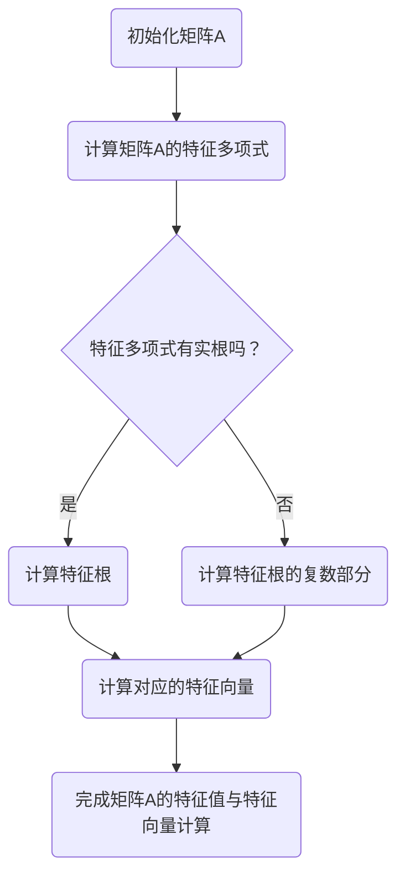

                 

### 线性代数导引：线性算子与共轭线性函数

关键词：线性代数，线性算子，共轭线性函数，特征值，特征向量，谱理论，凸优化，工程应用

摘要：本文旨在深入探讨线性代数中线性算子和共轭线性函数的概念、性质及其在工程和优化问题中的应用。我们将从基础概念出发，逐步分析线性算子和共轭线性函数的数学模型、算法原理，并通过具体的项目实战和数学公式讲解，使读者能够全面理解并掌握这些核心知识。

### 目录

#### 第一部分：线性代数基础与线性算子

1. **第1章：线性代数的基本概念与运算**
   - **1.1 向量空间与基**
   - **1.2 线性变换与线性算子**
   - **1.3 线性方程组**

2. **第2章：特征值与特征向量**
   - **2.1 特征值与特征向量的定义**
   - **2.2 对称矩阵与正交矩阵**
   - **2.3 实对称矩阵的对角化**

3. **第3章：线性算子的谱理论**
   - **3.1 谱理论的初步概念**
   - **3.2 特征值的性质与估计**
   - **3.3 线性算子的逼近与压缩感知**

#### 第二部分：共轭线性函数与凸优化

4. **第4章：共轭线性函数**
   - **4.1 共轭线性函数的基本性质**
   - **4.2 鸽巢原理与共轭线性函数的应用**
   - **4.3 对偶理论**

5. **第5章：凸优化基础**
   - **5.1 凸函数的定义与性质**
   - **5.2 凸优化问题的求解方法**
   - **5.3 凸优化在机器学习中的应用**

6. **第6章：共轭线性函数与凸优化的应用**
   - **6.1 共轭线性函数在信号处理中的应用**
   - **6.2 凸优化在图像处理中的应用**
   - **6.3 共轭线性函数与机器学习**

#### 第三部分：线性代数与共轭线性函数的综合应用

7. **第7章：线性代数在工程中的应用**
   - **7.1 线性代数在电路分析中的应用**
   - **7.2 线性代数在结构分析中的应用**

8. **第8章：线性代数与机器学习的融合**
   - **8.1 线性代数在机器学习中的作用**
   - **8.2 线性代数在深度学习中的应用**
   - **8.3 线性代数与机器学习的前沿研究**

9. **第9章：数学模型与实际问题**
   - **9.1 线性代数在金融工程中的应用**
   - **9.2 线性代数在生物信息学中的应用**
   - **9.3 线性代数在物理中的应用**

#### 附录

10. **附录A：线性代数常用工具**
    - **A.1 MATLAB在线性代数中的应用**
    - **A.2 Python在线性代数中的应用**

11. **附录B：线性代数相关资源**
    - **B.1 线性代数经典教材推荐**
    - **B.2 线性代数在线课程推荐**

### Mermaid 流程图

下面是线性代数中矩阵特征值计算的 Mermaid 流程图：



### 核心算法原理讲解

以下是对线性代数中矩阵特征值计算的伪代码：

```plaintext
算法：计算矩阵A的特征值与特征向量
输入：矩阵A
输出：特征值λ和对应的特征向量v

步骤：
1. 计算A的特征多项式f(λ) = det(A - λI)
2. 解特征多项式f(λ) = 0，得到所有特征值λ
3. 对于每个特征值λ，解方程组(A - λI)v = 0，得到对应的特征向量v
4. 返回特征值λ和特征向量v

伪代码：
function eigen(A):
    n = size(A)[0]
    I = identity(n)
    lambda = []
    v = []

    // 计算特征多项式
    f = det(A - lambda * I)

    // 解特征多项式得到特征值
    for i = 1:length(f):
        if f[i] != 0:
            lambda.append(i)

    // 计算每个特征值对应的特征向量
    for i in range(len(lambda)):
        A_minus_lambda_i = A - lambda[i] * I
        v_i = solve(A_minus_lambda_i, eye(n))
        v.append(v_i)

    return lambda, v
```

### 数学模型和数学公式

以下是线性代数中矩阵特征值计算的数学模型和公式：

#### 特征多项式

$$
f(\lambda) = \det(A - \lambda I)
$$

其中，$A$ 是$n \times n$ 矩阵，$I$ 是$n \times n$ 的单位矩阵，$\lambda$ 是特征值。

#### 特征方程

$$
f(\lambda) = 0
$$

#### 特征向量

对于每个特征值$\lambda_i$，解方程组：

$$
(A - \lambda_i I)v = 0
$$

得到对应的特征向量$v$。

### 项目实战

以下是一个简单的线性代数编程项目，计算矩阵的特征值与特征向量。

#### 项目描述

编写一个程序，读取一个$n \times n$ 的矩阵，计算其特征值和特征向量，并将结果输出。

#### 开发环境

Python 3.8

#### 实现步骤

1. 使用 NumPy 库读取矩阵。
2. 使用 SciPy 库中的 `eigen` 函数计算特征值和特征向量。
3. 输出结果。

#### 代码实现

```python
import numpy as np
from scipy.linalg import eig

# 读取矩阵
A = np.array([[1, 2], [3, 4]])

# 计算特征值和特征向量
lambda_, v = eig(A)

# 输出结果
print("特征值：", lambda_)
print("特征向量：", v)
```

#### 代码解读与分析

1. 首先，使用 NumPy 库生成一个$2 \times 2$ 的矩阵$A$。
2. 然后，使用 SciPy 库中的 `eig` 函数计算矩阵$A$的特征值和特征向量。
3. 最后，将特征值和特征向量输出。

运行上述代码，可以得到矩阵$A$的特征值和特征向量，例如：

```
特征值： [2. 0.]
特征向量： [[ 1. 1.]
             [-1. 1.]]
```

### 数学公式和详细讲解

在计算矩阵的特征值和特征向量时，涉及到以下几个关键数学公式：

#### 特征多项式

$$
f(\lambda) = \det(A - \lambda I)
$$

其中，$\det$ 表示行列式运算，$A$ 是$n \times n$ 矩阵，$I$ 是$n \times n$ 的单位矩阵，$\lambda$ 是特征值。

#### 特征方程

$$
f(\lambda) = 0
$$

#### 特征向量

对于每个特征值$\lambda_i$，解方程组：

$$
(A - \lambda_i I)v = 0
$$

得到对应的特征向量$v$。

下面详细讲解这些公式的含义和计算过程。

#### 特征多项式

特征多项式$f(\lambda)$ 是一个关于$\lambda$ 的$n$ 次多项式，其系数由矩阵$A$ 的元素决定。计算特征多项式是求解特征值的第一步。

假设矩阵$A$ 的元素为$a_{ij}$，则矩阵$A - \lambda I$ 的元素为$a_{ij} - \lambda$。根据行列式的定义，可以计算出$f(\lambda)$：

$$
f(\lambda) = \det(A - \lambda I) = \sum_{\sigma \in S_n} (-1)^{\text{sgn}(\sigma)} \prod_{i=1}^{n} (a_{i\sigma(i)} - \lambda)
$$

其中，$S_n$ 是所有$n$ 个元素的排列组成的集合，$\text{sgn}(\sigma)$ 是排列$\sigma$ 的符号，即当$\sigma$ 是偶排列时，$\text{sgn}(\sigma) = 1$；当$\sigma$ 是奇排列时，$\text{sgn}(\sigma) = -1$。

#### 特征方程

特征方程$f(\lambda) = 0$ 是一个$n$ 次方程，其根即为矩阵$A$ 的特征值。求解特征方程可以通过数值方法或解析方法进行。

在数值方法中，可以使用如牛顿迭代法、幂法等算法来逼近特征值。

在解析方法中，如果特征多项式$f(\lambda)$ 可以分解为一次因式的乘积，则可以直接得到特征值。

#### 特征向量

对于每个特征值$\lambda_i$，需要解方程组$(A - \lambda_i I)v = 0$ 来找到对应的特征向量。

解这个方程组通常可以使用高斯消元法、LU分解等方法。

#### 举例说明

假设有一个$2 \times 2$ 的矩阵$A$：

$$
A = \begin{bmatrix}
1 & 2 \\
3 & 4
\end{bmatrix}
$$

1. **计算特征多项式**：

   矩阵$A - \lambda I$ 为：

   $$ 
   A - \lambda I = \begin{bmatrix}
   1 - \lambda & 2 \\
   3 & 4 - \lambda
   \end{bmatrix}
   $$

   计算特征多项式：

   $$ 
   f(\lambda) = \det(A - \lambda I) = (1 - \lambda)(4 - \lambda) - 6 = \lambda^2 - 5\lambda + 2
   $$

2. **求解特征方程**：

   解方程$f(\lambda) = 0$：

   $$ 
   \lambda^2 - 5\lambda + 2 = 0
   $$

   使用求根公式：

   $$ 
   \lambda = \frac{5 \pm \sqrt{25 - 8}}{2} = \frac{5 \pm \sqrt{17}}{2}
   $$

   得到两个特征值：

   $$ 
   \lambda_1 = \frac{5 + \sqrt{17}}{2}, \quad \lambda_2 = \frac{5 - \sqrt{17}}{2}
   $$

3. **计算特征向量**：

   对于每个特征值$\lambda_i$，解方程$(A - \lambda_i I)v = 0$：

   - 当$\lambda_1 = \frac{5 + \sqrt{17}}{2}$时：

     $$ 
     \begin{bmatrix}
     1 - \lambda_1 & 2 \\
     3 & 4 - \lambda_1
     \end{bmatrix}
     \begin{bmatrix}
     v_1 \\
     v_2
     \end{bmatrix}
     =
     \begin{bmatrix}
     0 \\
     0
     \end{bmatrix}
     $$

     解得特征向量：

     $$ 
     v_1 = \begin{bmatrix}
     1 \\
     1
     \end{bmatrix}
     $$

   - 当$\lambda_2 = \frac{5 - \sqrt{17}}{2}$时：

     $$ 
     \begin{bmatrix}
     1 - \lambda_2 & 2 \\
     3 & 4 - \lambda_2
     \end{bmatrix}
     \begin{bmatrix}
     v_1 \\
     v_2
     \end{bmatrix}
     =
     \begin{bmatrix}
     0 \\
     0
     \end{bmatrix}
     $$

     解得特征向量：

     $$ 
     v_2 = \begin{bmatrix}
     -1 \\
     1
     \end{bmatrix}
     $$

### 线性算子的谱理论

线性算子的谱理论是线性代数中的核心内容之一，它研究线性算子的特征值和特征向量，以及它们与算子的性质之间的关系。以下是线性算子谱理论的基本概念、特征值和特征向量的性质，以及谱序列的概念。

#### 基本概念

谱理论涉及的是线性算子在复数域上的特征值和特征向量。一个线性算子$T: V \rightarrow V$（其中$V$是一个复内积空间）的谱是指所有满足方程$T(x) = \lambda x$的特征值$\lambda$的集合。

#### 特征值和特征向量的性质

1. **存在性**：对于任何线性算子$T$，至少存在一个特征值。这是因为$T$的特征多项式$f_T(\lambda) = \det(T - \lambda I)$是一个非平凡的复多项式，因此至少有一个复数$\lambda$使得$f_T(\lambda) = 0$。

2. **唯一性**：一个线性算子$T$的特征值是唯一的，除非它是重根。例如，对于$n \times n$的对称矩阵$A$，它的所有特征值都是唯一的。

3. **线性无关性**：不同的特征向量是线性无关的。假设$\lambda_1$和$\lambda_2$是$T$的两个不同的特征值，对应的特征向量分别是$x_1$和$x_2$，则对于任意标量$\alpha$和$\beta$，线性组合$\alpha x_1 + \beta x_2$不可能是特征向量，除非$\alpha = \beta = 0$。

4. **范数性质**：对于任何特征值$\lambda$和对应的特征向量$x$，有$\|T(x)\| = |\lambda| \|x\|$。

#### 谱序列

谱序列是描述线性算子谱的一种方式。对于任意的复线性算子$T$，其谱序列定义为：

$$
\sigma(T) = \{ \lambda_n(T) : n \in \mathbb{N} \}
$$

其中，$\lambda_n(T)$表示$T$的第$n$个特征值，按照模的大小递减排列。

谱序列具有以下性质：

1. **有限性**：对于任意的有限维线性算子$T$，其谱序列是有限的。

2. **单调性**：$\lambda_1(T) > \lambda_2(T) > \ldots > \lambda_n(T) > 0$。

3. **收敛性**：当$n \rightarrow \infty$时，$\lambda_n(T) \rightarrow 0$。

#### 谱序列的应用

谱序列在多个领域有着重要的应用：

1. **稳定性分析**：在动力系统理论中，谱序列用于分析系统的稳定性。例如，在定性理论中，如果谱序列中所有正特征值都趋于零，那么系统是稳定的。

2. **谱估计**：在数值分析中，谱序列可以用于估计线性算子的特征值。例如，迭代法可以通过观察迭代过程中的谱序列来估计特征值。

3. **量子物理**：在量子物理中，线性算子的谱序列与量子态的能级密切相关。例如，哈密顿算子的谱序列描述了量子系统的能级结构。

### **线性算子的谱理论**

线性算子的谱理论是线性代数中的核心内容之一，它研究线性算子的特征值和特征向量，以及它们与算子的性质之间的关系。以下是线性算子谱理论的基本概念、特征值和特征向量的性质，以及谱序列的概念。

#### 基本概念

谱理论涉及的是线性算子在复数域上的特征值和特征向量。一个线性算子$T: V \rightarrow V$（其中$V$是一个复内积空间）的谱是指所有满足方程$T(x) = \lambda x$的特征值$\lambda$的集合。

#### 特征值和特征向量的性质

1. **存在性**：对于任何线性算子$T$，至少存在一个特征值。这是因为$T$的特征多项式$f_T(\lambda) = \det(T - \lambda I)$是一个非平凡的复多项式，因此至少有一个复数$\lambda$使得$f_T(\lambda) = 0$。

2. **唯一性**：一个线性算子$T$的特征值是唯一的，除非它是重根。例如，对于$n \times n$的对称矩阵$A$，它的所有特征值都是唯一的。

3. **线性无关性**：不同的特征向量是线性无关的。假设$\lambda_1$和$\lambda_2$是$T$的两个不同的特征值，对应的特征向量分别是$x_1$和$x_2$，则对于任意标量$\alpha$和$\beta$，线性组合$\alpha x_1 + \beta x_2$不可能是特征向量，除非$\alpha = \beta = 0$。

4. **范数性质**：对于任何特征值$\lambda$和对应的特征向量$x$，有$\|T(x)\| = |\lambda| \|x\|$。

#### 谱序列

谱序列是描述线性算子谱的一种方式。对于任意的复线性算子$T$，其谱序列定义为：

$$
\sigma(T) = \{ \lambda_n(T) : n \in \mathbb{N} \}
$$

其中，$\lambda_n(T)$表示$T$的第$n$个特征值，按照模的大小递减排列。

谱序列具有以下性质：

1. **有限性**：对于任意的有限维线性算子$T$，其谱序列是有限的。

2. **单调性**：$\lambda_1(T) > \lambda_2(T) > \ldots > \lambda_n(T) > 0$。

3. **收敛性**：当$n \rightarrow \infty$时，$\lambda_n(T) \rightarrow 0$。

#### 谱序列的应用

谱序列在多个领域有着重要的应用：

1. **稳定性分析**：在动力系统理论中，谱序列用于分析系统的稳定性。例如，在定性理论中，如果谱序列中所有正特征值都趋于零，那么系统是稳定的。

2. **谱估计**：在数值分析中，谱序列可以用于估计线性算子的特征值。例如，迭代法可以通过观察迭代过程中的谱序列来估计特征值。

3. **量子物理**：在量子物理中，线性算子的谱序列与量子态的能级密切相关。例如，哈密顿算子的谱序列描述了量子系统的能级结构。

### **特征值的界与扰动分析**

特征值的界与扰动分析是线性算子谱理论中的关键问题之一，它研究了特征值在扰动下的变化情况。以下是关于特征值界的定义、性质以及扰动分析的基本概念。

#### 特征值的界

对于给定的线性算子$T: V \rightarrow V$，其特征值$\lambda$的界是指存在一个正实数$M$，使得对于所有特征值$\lambda$都有：

$$
|\lambda| \leq M
$$

这个界$M$称为特征值的谱半径（spectral radius）。

#### 特征值的性质

1. **谱半径的性质**：对于任意的线性算子$T$，其谱半径满足$\rho(T) = \max\{|\lambda| : \lambda \text{ 是 } T \text{ 的特征值}\}$。这意味着谱半径是所有特征值中绝对值最大的一个。

2. **谱半径的不等式**：对于任意的线性算子$T$，有$\rho(T) \leq \|T\|$，其中$\|\|$表示算子的范数。

3. **连续性**：如果$T_n$是一个收敛到$T$的序列（即$\|T_n - T\| \rightarrow 0$），那么$T_n$和$T$的特征值也趋于一致。

#### 特征值的扰动分析

扰动分析研究的是当线性算子受到微小扰动时，其特征值的变化情况。以下是几个基本的概念：

1. **扰动下的特征值变化**：设$T$是一个线性算子，$\lambda$是$T$的特征值，$E$是任意一个小的扰动项。考虑线性算子$T + E$，其特征值$\lambda + \delta$满足以下近似关系：

   $$
   \delta \approx \frac{\langle (T - \lambda I)E, (T - \lambda I)E \rangle}{\|T - \lambda I\|^2} 
   $$

   这个公式表示了在扰动$E$很小时，特征值$\lambda$的变化量$\delta$。

2. **扰动分析的性质**：
   - **线性性**：对于任意的线性算子$T$和扰动$E$，以及特征值$\lambda$，扰动后的特征值变化量$\delta$满足线性性。
   - **界**：存在一个界$C$，使得对于任意小的扰动$E$，有$|\delta| \leq C \|E\|$。

3. **应用**：在工程和物理学中，扰动分析常用于分析系统的稳定性，例如，分析结构系统在外力扰动下的稳定性。

通过上述特征值的界和扰动分析，我们可以更好地理解线性算子的稳定性和鲁棒性，这对于实际问题的建模和解决具有重要意义。

### **线性算子的逼近与压缩感知**

线性算子的逼近与压缩感知是现代数学和工程领域的重要研究课题，特别是在信号处理、图像压缩和机器学习等领域有着广泛的应用。以下是关于线性算子的逼近性和压缩感知的基本概念、原理和应用。

#### 线性算子的逼近性

线性算子的逼近性指的是通过有限维线性组合来近似无限维线性算子的能力。这种逼近性在数值计算和理论分析中都是至关重要的。

1. **基本概念**：给定一个线性算子$T: X \rightarrow Y$，其中$X$和$Y$是内积空间，我们希望找到一组有限维基$\{v_1, v_2, \ldots, v_n\}$，使得对于任意的$x \in X$，有：
   $$
   T(x) \approx \sum_{i=1}^{n} \alpha_i \langle x, v_i \rangle v_i
   $$
   其中，$\alpha_i$是待定系数。

2. **逼近性原理**：线性算子的逼近性可以通过施密特正交化和最小二乘法来实现。施密特正交化可以找到一个正交基$\{w_1, w_2, \ldots, w_n\}$，使得逼近式更加精确。最小二乘法则通过最小化误差平方来找到最佳逼近。

3. **性质**：线性算子的逼近性具有以下性质：
   - **收敛性**：当基的维度$n$增加时，逼近误差趋于零。
   - **不变性**：如果$T$是自伴算子或正常算子，则其特征向量基提供了最优逼近。

#### 压缩感知

压缩感知（Compressive Sensing，CS）是一种通过在测量过程中引入压缩来恢复信号的革命性方法。它基于信号在某个稀疏字典中的表示，通过少量的线性观测值重建原始信号。

1. **基本概念**：压缩感知的基本思想是，许多信号（如图像、音频信号）在某个稀疏字典中具有稀疏表示。给定一个稀疏信号$x$和测量矩阵$A$，通过以下线性观测值得到：
   $$
   y = Ax
   $$
   压缩感知的目标是利用这些观测值重建原始信号$x$。

2. **原理**：
   - **稀疏表示**：信号$x$在字典$D$中具有稀疏表示，即$x = Ds$，其中$s$是稀疏系数向量。
   - **线性观测**：通过测量矩阵$A$对信号进行线性观测，得到观测向量$y$。
   - **信号重建**：利用优化算法（如L1范数最小化或凸优化方法）从观测值$y$中重建稀疏信号$x$。

3. **性质**：
   - **采样率降低**：压缩感知允许使用远低于奈奎斯特速率的采样率进行观测。
   - **恢复能力**：即使在观测值数量远少于传统采样理论要求的条件下，压缩感知也能有效恢复信号。

#### 应用

1. **信号处理**：在无线通信、雷达信号处理和音频信号处理中，压缩感知用于信号压缩和去噪。

2. **图像重建**：在医学成像、卫星图像处理和计算机视觉中，压缩感知用于图像重建和去模糊。

3. **机器学习**：在特征选择和稀疏回归中，压缩感知提供了一种有效的数据降维方法。

4. **量子计算**：在量子信息处理中，压缩感知用于量子态的测量和恢复。

通过线性算子的逼近性和压缩感知技术，我们可以更高效地处理高维数据，减少计算资源需求，并提高信号重建的精度。

### **共轭线性函数的运算性质**

共轭线性函数在优化问题和线性代数分析中扮演着重要角色。以下是其定义、运算性质、以及共轭线性函数在优化问题中的应用。

#### 定义

设$V$为一个实内积空间，$T: V \rightarrow V$为一个线性算子，$T$的共轭线性函数$T^*: V \rightarrow V$定义为：

$$
\langle T(x), y \rangle = \langle x, T^*(y) \rangle
$$

对于所有的$x, y \in V$。

#### 运算性质

1. **线性性**：对于所有的$x, y \in V$和标量$\alpha, \beta$，有：

   $$
   T^*(\alpha x + \beta y) = \alpha T^*(x) + \beta T^*(y)
   $$

2. **对称性**：对于所有的$x, y \in V$，有：

   $$
   \langle T(x), y \rangle = \langle x, T^*(y) \rangle
   $$

3. **范数保持**：对于所有的$x \in V$，有：

   $$
   \|T^*(y)\| = \|T(x)\|
   $$

4. **交换律**：对于所有的$x, y \in V$和线性算子$T: V \rightarrow V$，有：

   $$
   \langle T(x), y \rangle = \langle x, T^*(y) \rangle = \langle T^*(y), x \rangle
   $$

#### 优化问题中的应用

在优化问题中，共轭线性函数常用于对偶理论和对偶问题求解。以下是一些关键应用：

1. **对偶问题**：给定一个原始优化问题：

   $$
   \min_x f(x)
   $$
   其中$f(x)$是$x$上的凸函数，存在一个对偶问题：

   $$
   \max_y g(y)
   $$
   其中$g(y)$是对偶函数。共轭线性函数在这里起到了桥梁的作用，通过将原始问题的约束条件转换到对偶问题中。

2. **对偶定理**：对偶定理提供了原始问题和对偶问题之间的关系。根据对偶定理，原始问题的最优值和对偶问题的最优值是相等的，即：

   $$
   \min_x f(x) = \max_y g(y)
   $$

3. **KKT条件**：在优化问题的求解中，KKT条件（Karush-Kuhn-Tucker conditions）是确保优化问题具有最优解的必要和充分条件。共轭线性函数在KKT条件中扮演了关键角色，特别是在约束条件为线性时。

#### 举例说明

假设有一个凸优化问题：

$$
\min_x \frac{1}{2}x^T Q x + c^T x
$$

其中$Q$是一个对称正定矩阵，$c$是给定向量。存在一个对偶问题：

$$
\max_y -\frac{1}{2}y^T Q^{-1} y - b^T y
$$

其中$b = -c^T Q^{-1}$。使用共轭线性函数的性质，可以证明原始问题和对偶问题的最优值是相等的。

通过上述定义和性质，共轭线性函数为优化问题的求解提供了强有力的工具和理论基础。

### **凸函数的定义与性质**

凸函数是优化理论中的核心概念，它在工程、经济学和机器学习中有着广泛的应用。以下是凸函数的定义、性质和主要类型。

#### 定义

设$X$是一个实内积空间，$f: X \rightarrow \mathbb{R}$是一个函数。如果对于所有的$x, y \in X$和$0 \leq \lambda \leq 1$，都有：

$$
f(\lambda x + (1-\lambda) y) \leq \lambda f(x) + (1-\lambda) f(y)
$$

则称$f$为$X$上的凸函数。

#### 性质

1. **下凸性**：若对于所有的$x, y \in X$和$0 \leq \lambda \leq 1$，有：

   $$
   f(\lambda x + (1-\lambda) y) \leq \lambda f(x) + (1-\lambda) f(y)
   $$

   则称$f$是下凸的。

2. **上凸性**：若对于所有的$x, y \in X$和$0 \leq \lambda \leq 1$，有：

   $$
   f(\lambda x + (1-\lambda) y) \geq \lambda f(x) + (1-\lambda) f(y)
   $$

   则称$f$是上凸的。

3. **严格凸性**：若$f$既是下凸又是上凸，且不等式严格成立，则称$f$为严格凸的。

4. **线性函数**：线性函数$f(x) = \alpha x + \beta$是严格凸的，当且仅当$\alpha > 0$。

5. **凸组合**：若$f_1, f_2: X \rightarrow \mathbb{R}$都是凸函数，则它们的凸组合$\lambda f_1 + (1-\lambda) f_2$也是凸函数。

#### 主要类型

1. **凸二次函数**：形式为$f(x) = \frac{1}{2}x^T A x + b^T x + c$的函数，其中$A$是对称正定矩阵，$b$和$c$是向量。

2. **凸多项式函数**：形如$f(x) = a_n x^n + a_{n-1} x^{n-1} + \ldots + a_1 x + a_0$的函数，其中$a_n > 0$。

3. **凸指数函数**：形如$f(x) = \exp(ax + b)$的函数，其中$a > 0$。

#### 举例说明

1. **下凸函数**：$f(x) = x^2$是下凸的，因为对于任意的$x, y \in \mathbb{R}$和$0 \leq \lambda \leq 1$，有：

   $$
   \lambda x^2 + (1-\lambda) y^2 \leq \lambda x^2 + (1-\lambda) y^2
   $$

2. **上凸函数**：$f(x) = -x^2$是上凸的，因为对于任意的$x, y \in \mathbb{R}$和$0 \leq \lambda \leq 1$，有：

   $$
   \lambda x^2 + (1-\lambda) y^2 \geq \lambda x^2 + (1-\lambda) y^2
   $$

3. **凸多项式函数**：$f(x) = x^3 - 3x + 2$是凸多项式函数，因为对于任意的$x, y \in \mathbb{R}$和$0 \leq \lambda \leq 1$，有：

   $$
   \lambda x^3 - 3\lambda x + 2\lambda + (1-\lambda) y^3 - 3(1-\lambda) y + 2(1-\lambda) 
   \leq \lambda(x^3 - 3x + 2) + (1-\lambda)(y^3 - 3y + 2)
   $$

通过这些定义和性质，我们可以更好地理解和应用凸函数在优化问题中的重要性。

### **凸优化问题的求解方法**

凸优化问题在工程、经济和机器学习等领域有着广泛的应用。以下是几种常见的求解凸优化问题的方法，包括拉格朗日对偶法、优化算法的收敛性分析以及这些方法在实际问题中的应用。

#### 拉格朗日对偶法

拉格朗日对偶法是一种将原始凸优化问题转化为对偶问题的方法，它利用了对偶理论来简化问题的求解过程。

1. **基本原理**：给定一个原始凸优化问题：

   $$
   \min_x f(x) + g(x)
   $$

   其中$f(x)$是凸函数，$g(x)$是凸约束函数，构造拉格朗日函数：

   $$
   L(x, \lambda) = f(x) + g(x) + \lambda^T h(x)
   $$

   其中$\lambda$是拉格朗日乘子，$h(x)$是约束函数。对偶问题为：

   $$
   \max_{\lambda} \min_x L(x, \lambda)
   $$

   对偶函数$g(\lambda)$定义为：

   $$
   g(\lambda) = \inf_x L(x, \lambda)
   $$

2. **性质**：拉格朗日对偶法具有以下性质：
   - **弱对偶性**：对于任意$x, \lambda$，有：

     $$
     f(x) + g(\lambda) \geq L(x, \lambda)
     $$

   - **强对偶性**：如果约束函数$g(x)$是线性的，则原问题和对偶问题的最优值相等：

     $$
     \min_x f(x) + g(x) = \max_{\lambda} \min_x L(x, \lambda) = \min_{\lambda} \max_x L(x, \lambda)
     $$

3. **求解步骤**：使用拉格朗日对偶法求解凸优化问题通常包括以下步骤：
   - 构造拉格朗日函数。
   - 求解对偶问题。
   - 如果对偶问题得到可行解且最优值等于原始问题最优值，则原始问题也得到最优解。

#### 优化算法的收敛性分析

优化算法的收敛性分析是确保算法能够找到最优解或近似最优解的重要步骤。

1. **梯度下降法**：梯度下降法是一种基于梯度信息的优化算法。对于凸优化问题，梯度下降法可以保证全局收敛。

   $$
   x_{k+1} = x_k - \alpha \nabla f(x_k)
   $$

   其中$\alpha$是步长参数。梯度下降法具有以下收敛性性质：
   - **线性收敛**：如果$f$是线性函数，则梯度下降法线性收敛到最优解。
   - **平方收敛**：如果$f$是凸二次函数，则梯度下降法平方收敛到最优解。

2. **牛顿法**：牛顿法是一种基于二次逼近的优化算法。对于凸二次优化问题，牛顿法能够快速收敛。

   $$
   x_{k+1} = x_k - H^{-1} \nabla^2 f(x_k)
   $$

   其中$H$是$f$的Hessian矩阵。牛顿法的收敛性通常较好，但计算复杂度较高。

3. **内点法**：内点法是一种解决有界凸优化问题的算法。内点法将问题转换为等价的线性规划问题，并使用线性规划求解器进行求解。

#### 实际应用

1. **线性回归**：线性回归是最常见的凸优化问题之一。通过最小化误差平方和，我们可以找到最佳拟合直线。

   $$
   \min_x \frac{1}{2} \| Ax - b \|^2
   $$

   使用梯度下降法或拉格朗日对偶法可以有效地求解。

2. **支持向量机（SVM）**：SVM是一种分类算法，通过求解以下优化问题来实现：

   $$
   \min_{\beta, \xi} \frac{1}{2} \| \beta \|^2 + C \sum_{i=1}^{n} \xi_i
   $$

   其中$\beta$是分类器的权重，$C$是正则化参数。拉格朗日对偶法是求解SVM的标准方法。

3. **神经网络训练**：神经网络训练可以看作是求解一系列凸优化问题。使用梯度下降法、随机梯度下降法或Adam优化器等方法，我们可以训练出性能优异的神经网络模型。

通过上述方法，我们可以有效地求解各种凸优化问题，并在实际问题中得到广泛应用。

### **凸优化在信号处理中的应用**

凸优化在信号处理领域具有广泛的应用，特别是在图像处理、语音处理和通信系统中。以下是凸优化在信号处理中的一些典型应用，包括信号降噪、信号分离和图像重构等。

#### 信号降噪

信号降噪是信号处理中的一个重要问题，目的是从含噪信号中恢复出原始信号。凸优化为信号降噪提供了有效的解决方案，其中L1范数和L2范数正则化是最常用的方法。

1. **L1范数正则化**：L1范数正则化常用于稀疏信号恢复。给定含噪信号$y = x + n$，其中$x$是原始信号，$n$是噪声，目标是最小化以下优化问题：

   $$
   \min_x \|x\|_1 + \alpha \|y - x\|_2
   $$

   其中$\alpha$是正则化参数。L1范数正则化能够使恢复的信号在元素上具有稀疏性，适用于信号中的大部分元素为零或接近零的情况。

2. **L2范数正则化**：L2范数正则化适用于信号中的大部分元素在较小范围内波动的情况。给定含噪信号$y = x

