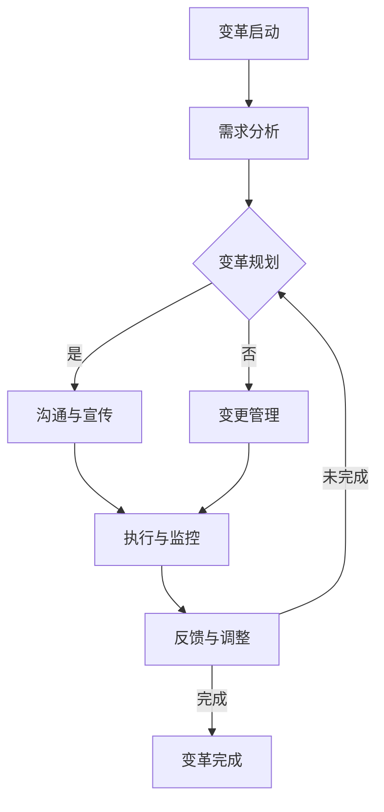

                 

# 第1章 引言与概述

## 1.1 组织发展经理的角色与职责

### 1.1.1 组织发展经理的定义与背景

组织发展经理（Organization Development Manager）是企业中负责推动组织变革、优化组织结构、提升组织效能的专业管理人员。这一职位起源于20世纪50年代的美国，最初由学者和管理专家提出，旨在通过系统的方法改进组织效能和员工绩效。

组织发展经理的角色主要包括：

1. **规划与战略制定**：根据企业战略目标，制定组织发展的长期和短期规划，确保组织结构、流程与文化与企业战略相匹配。
2. **组织变革管理**：在组织变革过程中，领导变革，确保变革的顺利实施，减少变革对组织运作和员工情绪的负面影响。
3. **团队建设与领导力培养**：培养管理团队的领导力，提升团队协作效率，促进组织内部的沟通与协调。
4. **组织文化与氛围建设**：营造积极向上的组织文化，促进员工忠诚度和工作满意度。

### 1.1.2 组织发展经理的职能与职责

组织发展经理的主要职能和职责包括：

1. **组织结构优化**：分析现有组织结构，识别结构问题，提出优化方案，提升组织运作效率和员工工作效率。
2. **流程再造**：评估现有业务流程，优化流程，提高流程效率，减少冗余和浪费。
3. **人才发展**：制定人才发展计划，进行员工培训和发展，提升员工能力，满足组织发展的需求。
4. **绩效管理**：建立科学的绩效管理体系，制定绩效评估标准，确保员工绩效与组织目标的一致性。
5. **组织变革**：设计并实施组织变革计划，应对外部环境变化，确保组织的灵活性和适应性。
6. **沟通与协作**：促进组织内部的有效沟通，加强各部门之间的协作，提高整体组织效能。

### 1.1.3 组织发展经理的挑战与机遇

作为组织发展经理，面临的挑战与机遇并存：

- **挑战**：企业内外部环境变化快，需要不断调整组织结构、流程和文化，以适应新的市场和技术环境。同时，员工对新变革的接受度和适应性也是一个重要挑战。
- **机遇**：随着企业对组织发展的重视，组织发展经理在企业中的地位不断提升，有更多机会参与企业的战略决策和业务发展。

## 1.2 创业的内涵与特征

### 1.2.1 创业的定义与本质

创业（Entrepreneurship）是指创业者通过创新和风险承担，创建新企业、新产品或新服务的过程。创业不仅仅是一种经济活动，更是一种思维方式和文化。

创业的本质包括：

1. **创新**：创业者通过创新来开发新产品、新服务或新商业模式，满足市场需求。
2. **风险承担**：创业者面对不确定性，愿意承担创业失败的风险。
3. **机会识别**：创业者能够识别和利用市场机会，抓住市场空白或需求。
4. **资源整合**：创业者具备整合各种资源（如资金、人力、技术等）的能力，以支持创业活动。

### 1.2.2 创业的特征与挑战

创业具有以下特征：

1. **不确定性**：创业过程中，市场环境、技术发展、竞争对手等因素充满不确定性，创业者需要具备应对不确定性的能力。
2. **动态性**：创业活动需要不断调整和适应市场变化，保持灵活性和适应性。
3. **高风险**：创业面临较高的失败风险，创业者需要具备心理承受能力和风险管理的技能。
4. **创造性**：创业者通过创新来创造价值，推动社会进步。

创业的挑战包括：

1. **资源限制**：创业初期，资金、人力、技术等资源有限，创业者需要充分利用有限的资源，实现资源最大化。
2. **市场竞争**：市场竞争激烈，创业者需要具备市场敏感性和竞争力，才能在市场中脱颖而出。
3. **团队建设**：创业者需要建立高效的团队，发挥团队成员的潜力，实现团队协作。

### 1.2.3 创业对组织发展的影响

创业对组织发展具有深远的影响：

1. **创新推动**：创业活动推动组织创新，促进技术进步和市场发展。
2. **结构优化**：创业过程中，组织结构、流程和文化需要不断调整和优化，以适应市场变化。
3. **人才成长**：创业活动为员工提供成长机会，提升员工能力和素质，促进人才发展。
4. **持续发展**：创业活动激发组织的活力和竞争力，推动组织的持续发展。

## 1.3 组织结构优化与变革管理的意义

### 1.3.1 组织结构优化的意义

组织结构优化是指通过调整组织内部结构，以提高组织效率和员工满意度。组织结构优化的意义包括：

1. **提升效率**：通过优化组织结构，明确职责分工，减少冗余和浪费，提高组织运作效率。
2. **增强适应性**：优化后的组织结构更具灵活性，能更好地适应市场变化和业务需求。
3. **提高员工满意度**：合理的组织结构能激发员工的工作热情和积极性，提高员工满意度。
4. **支持创新**：优化后的组织结构为创新提供支持，鼓励员工提出新想法和解决方案。

### 1.3.2 变革管理的意义

变革管理是指在组织内外部环境变化时，通过系统的方法和策略，引导组织成员适应变革，实现组织目标。变革管理的意义包括：

1. **应对外部挑战**：通过变革管理，组织能更好地应对市场竞争、技术变革等外部挑战。
2. **提升组织竞争力**：变革管理能提升组织竞争力，使组织在市场中保持领先地位。
3. **推动组织发展**：变革管理推动组织持续发展，实现长期战略目标。
4. **提高员工适应能力**：变革管理帮助员工适应变化，提高员工的工作能力和心理承受能力。

### 1.3.3 组织发展经理在创业中的重要作用

组织发展经理在创业中扮演着重要角色：

1. **战略规划**：组织发展经理参与创业战略规划，确保组织结构、流程和文化与战略目标一致。
2. **组织变革**：组织发展经理负责设计并实施组织变革计划，推动创业过程中的组织优化。
3. **团队建设**：组织发展经理培养和管理创业团队，提升团队协作效率和执行力。
4. **人才发展**：组织发展经理制定人才发展计划，为创业者提供培训和发展机会，提升团队整体能力。

综上所述，组织发展经理在创业中发挥着关键作用，通过组织结构优化和变革管理，推动组织的创新和发展，实现创业目标。

## 第2章 组织结构优化

## 2.1 组织结构概述

### 2.1.1 组织结构的基本类型

组织结构是指企业内部各个部门、职位和职能的配置和关系，以及信息、资源、权力和责任的分配方式。根据不同的分类标准，组织结构可以划分为以下几种基本类型：

1. **职能型组织结构**：职能型组织结构按照职能划分部门，每个部门由一个职能主管领导，如市场营销部、财务部、人力资源部等。职能型组织结构的优点是管理层次清晰，职责明确，有利于专业化和分工。然而，其缺点在于部门之间沟通不畅，容易形成“壁垒”，导致协调困难。

2. **事业部型组织结构**：事业部型组织结构将企业划分为若干个相对独立的事业部，每个事业部负责一个特定的产品线或市场区域。事业部型组织结构的优点是能够提高市场响应速度，增强事业部自主决策能力。缺点是可能导致内部竞争，影响企业整体利益。

3. **矩阵型组织结构**：矩阵型组织结构将职能和项目两种组织形式相结合，形成职能部门和项目团队的双重领导模式。矩阵型组织结构的优点是能够提高项目执行效率，增强部门之间的沟通与协作。缺点是可能导致管理层次复杂，权力分配不明确。

4. **网络型组织结构**：网络型组织结构以合同关系为基础，将企业内部和外部资源通过网络连接起来，形成一个灵活、动态的组织体系。网络型组织结构的优点是能够充分利用外部资源，提高创新能力。缺点是组织稳定性差，管理难度大。

### 2.1.2 组织结构的功能与作用

组织结构在企业中发挥着多种功能，对企业的运作和绩效产生深远影响：

1. **分工与协作**：组织结构明确员工的职责和权限，使员工能够专注于特定任务，提高工作效率。同时，组织结构促进部门之间的协作，实现资源的共享和优化配置。

2. **权力分配**：组织结构界定企业的权力结构和决策流程，确保企业各项决策能够迅速、有效地执行。合理的权力分配有助于提高企业运营效率和决策质量。

3. **沟通与协调**：组织结构为企业的沟通和协调提供框架和渠道，使信息在企业内部畅通流动。良好的沟通和协调能够提高企业的协作效率，减少冲突和误解。

4. **创新与变革**：组织结构为企业创新和变革提供支持。通过调整组织结构，企业可以激发员工的创新潜力，适应市场和技术变化。

5. **绩效评估**：组织结构为企业的绩效评估提供依据，使企业能够对员工的工作表现进行科学、公正的评价。绩效评估有助于激励员工，提升整体绩效。

### 2.1.3 组织结构的演变与发展趋势

组织结构随着企业的发展和社会环境的变化而不断演变。以下是组织结构演变的主要趋势：

1. **扁平化**：随着企业规模的扩大和市场竞争的加剧，企业逐渐从传统的层级化组织结构向扁平化组织结构转变。扁平化组织结构减少管理层次，提高决策效率，增强企业灵活性。

2. **网络化**：网络化组织结构以信息网络为基础，将企业内部和外部资源通过网络连接起来，形成一个高度灵活、动态的组织体系。网络化组织结构有助于企业充分利用外部资源，提高创新能力。

3. **动态化**：动态化组织结构强调组织结构的灵活性和适应性，根据外部环境和企业战略的变化，快速调整组织结构和运作方式。动态化组织结构有助于企业应对市场变化，保持竞争力。

4. **专业化**：专业化组织结构将企业内部职能进行高度专业化，使每个部门或团队专注于特定领域，提高专业水平和效率。

5. **多元化**：多元化组织结构将企业内部不同业务单元进行整合，形成多元化业务组合。多元化组织结构有助于企业拓展业务领域，分散风险。

## 2.2 组织结构优化的原则与方法

### 2.2.1 组织结构优化的原则

组织结构优化应遵循以下原则，以确保优化效果和可持续性：

1. **适应性原则**：组织结构应适应外部环境和内部需求的变化，保持灵活性。

2. **效率原则**：优化组织结构以提高企业运作效率，减少冗余和浪费。

3. **协同性原则**：组织结构应促进部门之间的协同工作，提高整体效能。

4. **激励性原则**：优化组织结构以激发员工的积极性和创造力，提高员工满意度。

5. **可持续性原则**：组织结构优化应考虑长期发展，确保优化效果能够持续。

### 2.2.2 组织结构优化的方法

组织结构优化可以采用以下方法，以实现优化目标：

1. **重新划分部门**：根据业务需求和企业战略，重新划分部门，明确部门职责和权限。

2. **调整管理层级**：减少管理层级，缩短决策路径，提高决策效率。

3. **整合业务单元**：整合业务单元，实现资源优化配置，提高协同效率。

4. **引入外部资源**：引入外部资源，如咨询公司、合作伙伴等，为组织结构优化提供专业支持。

5. **调整薪酬和激励制度**：调整薪酬和激励制度，激发员工的积极性和创造力。

### 2.2.3 组织结构优化的实施步骤

组织结构优化的实施步骤如下：

1. **需求分析**：分析外部环境和内部需求，确定组织结构优化目标和方向。

2. **现状评估**：评估现有组织结构的优缺点，识别优化重点和难点。

3. **方案设计**：设计组织结构优化方案，包括部门划分、管理层级调整、业务单元整合等。

4. **实施与调整**：实施优化方案，根据实际情况进行动态调整，确保优化效果。

5. **评估与反馈**：评估优化效果，收集员工反馈，持续改进组织结构。

## 2.3 组织结构优化的案例分析

### 2.3.1 案例介绍

某大型制造企业面临市场竞争加剧、产品同质化严重等问题，导致企业效益下滑。为了应对挑战，企业决定进行组织结构优化，以提高市场响应速度和创新能力。

### 2.3.2 案例分析与讨论

1. **需求分析**：企业外部环境分析显示，市场竞争激烈，客户需求多样化，企业内部存在部门间沟通不畅、决策效率低等问题。

2. **现状评估**：企业现有组织结构为传统的职能型组织结构，管理层次较多，部门间协同性差，导致市场响应速度慢。

3. **方案设计**：企业决定采用事业部型组织结构，将制造部门、销售部门、研发部门等划分为若干个独立的事业部，每个事业部负责特定的产品线或市场区域。

4. **实施与调整**：企业按照设计方案调整组织结构，同时引入外部咨询公司，为组织结构优化提供专业支持。

5. **评估与反馈**：调整后的组织结构提高了事业部自主决策能力，加快了市场响应速度。然而，企业也发现，事业部之间的竞争可能导致资源浪费。为此，企业进一步调整事业部之间的合作机制，促进资源共享和协同工作。

### 2.3.3 案例启示与建议

1. **适应性原则**：企业应根据外部环境和内部需求，灵活调整组织结构，保持组织适应性。

2. **协同性原则**：在组织结构优化过程中，应重视部门间的协同工作，确保整体效能。

3. **专业化原则**：通过专业化分工，提高员工专业技能和效率。

4. **动态化原则**：组织结构优化不是一次性任务，而是一个持续的过程，需要根据实际情况进行动态调整。

5. **专业化与协同并重**：在组织结构优化过程中，应平衡专业化与协同，避免过度竞争导致资源浪费。

通过以上案例分析，企业可以更好地理解组织结构优化的原则与方法，为自身的组织结构优化提供参考和启示。

## 第3章 变革管理

### 3.1 变革管理的概念与过程

#### 3.1.1 变革管理的定义

变革管理（Change Management）是指通过系统的方法和策略，引导组织成员适应组织变革，实现组织目标的过程。变革管理的核心目标是确保变革顺利实施，减少变革对组织运作和员工情绪的负面影响。

#### 3.1.2 变革管理的核心过程

变革管理通常包括以下核心过程：

1. **需求分析**：识别组织变革的需求，如外部环境变化、市场机遇、技术进步等。
2. **变革规划**：制定变革策略和计划，明确变革目标、时间表、资源需求等。
3. **沟通与宣传**：向组织成员传达变革信息，建立变革的共识和信任。
4. **执行与监控**：实施变革计划，确保变革目标实现，持续监控变革进展。
5. **反馈与调整**：收集变革过程中的反馈，根据实际情况调整变革计划，确保变革效果。

#### 3.1.3 变革管理的关键要素

变革管理的关键要素包括：

1. **领导力**：领导者是变革的推动者和倡导者，需要具备变革管理能力和领导力。
2. **沟通与协作**：有效的沟通和协作是变革成功的关键，需要建立良好的沟通机制和团队协作文化。
3. **员工参与**：员工是变革的实施者，需要积极参与变革过程，增强变革的接受度和适应性。
4. **组织文化**：组织文化对变革管理具有重要影响，需要营造积极向上的变革文化，推动变革的实施。
5. **变革管理工具与方法**：变革管理工具和方法有助于提高变革管理的效率和质量，如变革地图、变革模型等。

### 3.2 变革管理的策略与技巧

#### 3.2.1 变革管理的策略

变革管理可以采用以下策略：

1. **领导层推动**：领导者应积极参与变革，提供明确的方向和指导，确保变革得到组织内部的支持。
2. **利益相关者参与**：邀请利益相关者参与变革过程，了解他们的需求和期望，增强变革的合法性和可行性。
3. **渐进式变革**：通过逐步实施变革，减少变革对组织的冲击，提高员工的适应能力。
4. **强化培训与支持**：为员工提供必要的培训和指导，帮助他们适应变革，提高变革的成功率。
5. **激励机制**：建立激励机制，鼓励员工积极参与变革，提高变革的接受度和适应性。

#### 3.2.2 变革管理的技巧

变革管理可以采用以下技巧：

1. **明确变革目标**：明确变革的目标和愿景，使组织成员明确变革的意义和价值。
2. **建立沟通渠道**：建立多种沟通渠道，确保变革信息及时传达，减少信息传递的滞后和失真。
3. **建立支持网络**：建立支持网络，为员工提供心理支持和资源，帮助他们应对变革过程中的困难和挑战。
4. **关注员工情绪**：关注员工在变革过程中的情绪变化，及时解决员工的问题和担忧，提高员工的积极性和适应性。
5. **持续反馈与调整**：在变革过程中，持续收集反馈，根据实际情况调整变革计划，确保变革目标的实现。

### 3.3 变革管理的案例分析

#### 3.3.1 案例介绍

某大型科技公司面临市场变化和竞争压力，决定进行组织变革，以提升市场响应速度和创新能力。该公司采用了一系列变革管理策略和技巧，成功实现了变革目标。

#### 3.3.2 案例分析与讨论

1. **需求分析**：市场变化和竞争压力迫使公司进行组织变革，提升市场响应速度和创新能力。
2. **变革规划**：公司制定了详细的变革计划，明确变革目标、时间表和资源需求。
3. **沟通与宣传**：公司通过内部会议、邮件和公告等多种方式，向全体员工传达变革信息，建立变革的共识和信任。
4. **执行与监控**：公司按照变革计划逐步实施变革，同时设立变革监控机制，确保变革进展符合预期。
5. **反馈与调整**：公司定期收集员工反馈，根据实际情况调整变革计划，确保变革效果。

#### 3.3.3 案例启示与建议

1. **明确变革目标**：明确变革的目标和愿景，使组织成员明确变革的意义和价值。
2. **建立沟通渠道**：建立多种沟通渠道，确保变革信息及时传达，减少信息传递的滞后和失真。
3. **关注员工情绪**：关注员工在变革过程中的情绪变化，及时解决员工的问题和担忧，提高员工的积极性和适应性。
4. **持续反馈与调整**：在变革过程中，持续收集反馈，根据实际情况调整变革计划，确保变革目标的实现。
5. **强化培训与支持**：为员工提供必要的培训和指导，帮助他们适应变革，提高变革的成功率。

通过以上案例分析，企业可以更好地理解变革管理的策略和技巧，为自身的变革管理提供参考和启示。

## 第4章 组织发展中的领导力与团队管理

### 4.1 领导力的本质与作用

#### 4.1.1 领导力的定义与内涵

领导力是指领导者通过激励、指导和影响他人，实现共同目标和愿景的能力。领导力不仅包括对员工的引导和指挥，更涉及到对组织文化、价值观和行为规范的塑造。

#### 4.1.2 领导力在组织发展中的作用

领导力在组织发展中发挥着至关重要的作用，主要包括：

1. **设定方向**：领导者为组织设定明确的目标和愿景，为组织发展指明方向。
2. **激发潜能**：领导者激发员工的潜能，提高员工的工作积极性和创造力。
3. **协调资源**：领导者协调组织内部资源，确保资源得到最有效的利用。
4. **塑造文化**：领导者塑造组织文化，推动组织价值观和行为规范的建立。
5. **推动变革**：领导者推动组织变革，使组织能够适应外部环境的变化。

#### 4.1.3 领导力的分类与类型

领导力可以按照不同的维度进行分类，常见的分类方法包括：

1. **任务型领导力与关系型领导力**：任务型领导力强调任务完成和目标实现，关系型领导力注重员工关系和团队氛围。
2. **变革型领导力与交易型领导力**：变革型领导力通过激励和启发员工实现变革，交易型领导力通过奖励和惩罚维持组织稳定。
3. **权威型领导力与民主型领导力**：权威型领导力强调领导者权威和决策权，民主型领导力注重员工参与和民主决策。

### 4.2 领导风格与团队管理

#### 4.2.1 领导风格的概念与特征

领导风格是指领导者处理领导事务的方式和习惯。不同的领导风格会对团队管理和员工绩效产生不同的影响。常见的领导风格包括：

1. **权威型领导风格**：领导者决策果断，对下属控制严格，强调任务完成。
2. **民主型领导风格**：领导者鼓励员工参与决策，尊重员工意见，强调团队协作。
3. **参与型领导风格**：领导者鼓励员工参与目标设定和决策过程，提高员工的工作满意度。
4. **变革型领导风格**：领导者通过激励和启发员工实现变革，推动组织创新和持续发展。

#### 4.2.2 领导风格与团队管理的关系

领导风格对团队管理具有深远影响，主要体现在以下几个方面：

1. **激励作用**：不同的领导风格能够激发员工的不同动机和需求，提高员工的工作积极性。
2. **沟通效果**：领导风格影响团队内部的沟通模式和信息传递方式，影响团队的协作效率。
3. **团队氛围**：领导风格塑造团队氛围，影响员工的心理状态和行为习惯。
4. **团队绩效**：领导风格对团队绩效有直接影响，不同的领导风格能够带来不同的绩效水平。

#### 4.2.3 领导风格的评估与改进

为了提高领导力水平，领导者需要了解自己的领导风格，并进行适当的评估和改进。以下方法可以帮助领导者评估和改进领导风格：

1. **自我评估**：领导者通过反思自己的行为和决策，识别自己的领导风格和不足。
2. **员工反馈**：领导者收集员工对领导风格的反馈，了解员工的需求和期望。
3. **360度评估**：领导者通过360度评估，获取来自上级、同事和下属的多方面反馈。
4. **培训与学习**：领导者参加领导力培训和学习，提高领导技能和知识。

### 4.3 团队建设的策略与方法

#### 4.3.1 团队建设的定义与目标

团队建设是指通过一系列策略和方法，提高团队协作效率、增强团队凝聚力和成员满意度的过程。团队建设的目标主要包括：

1. **增强团队协作**：通过团队建设，提高团队成员之间的协作效率，实现共同目标。
2. **提升团队绩效**：通过团队建设，提高团队的整体绩效，实现组织目标。
3. **增强团队凝聚力**：通过团队建设，增强团队成员之间的信任和凝聚力。
4. **提高员工满意度**：通过团队建设，提高员工的工作满意度和归属感。

#### 4.3.2 团队建设的策略

团队建设可以采用以下策略：

1. **目标明确**：明确团队目标和愿景，使团队成员明确团队发展方向和任务。
2. **沟通与协作**：建立良好的沟通机制，促进团队成员之间的沟通与协作。
3. **培训与发展**：为团队成员提供培训和发展机会，提高团队整体能力。
4. **激励机制**：建立合理的激励机制，激发团队成员的积极性和创造力。
5. **团队活动**：组织团队活动，增强团队成员之间的互动和信任。

#### 4.3.3 团队建设的方法

团队建设可以采用以下方法：

1. **团队建设活动**：组织团队建设活动，如拓展训练、团队竞赛等，增强团队成员之间的互动和信任。
2. **团队讨论**：通过团队讨论，促进团队成员之间的沟通和交流，解决团队问题。
3. **团队领导力培训**：为团队成员提供领导力培训，提高团队领导者的领导能力和团队管理能力。
4. **团队绩效管理**：建立团队绩效管理体系，对团队绩效进行科学评估和激励。
5. **员工参与**：鼓励员工参与团队决策和活动，提高员工对团队的认同感和归属感。

通过以上团队建设的策略和方法，领导者可以有效地提高团队协作效率、增强团队凝聚力和成员满意度，推动组织发展。

## 第5章 人力资源管理

### 5.1 人力资源管理的核心内容

#### 5.1.1 人力资源管理的定义与内涵

人力资源管理（Human Resource Management，简称HRM）是指企业通过规划、招聘、培训、评估、激励等一系列管理活动，对人力资源进行有效利用和开发，以实现组织目标的过程。人力资源管理不仅关注员工的福利和权益，更注重如何提高员工的工作效率、激励员工创造价值。

#### 5.1.2 人力资源管理的核心任务

人力资源管理的核心任务主要包括以下几个方面：

1. **规划与招募**：根据组织的发展战略和需求，制定人力资源规划，确保组织拥有合适的人才。同时，通过有效的招聘策略和渠道，吸引和选拔优秀的人才。

2. **培训与发展**：提供员工培训和发展机会，提升员工的专业技能和工作能力。通过职业规划和个人发展计划，帮助员工实现个人成长和职业目标。

3. **绩效管理**：建立科学的绩效评估体系，对员工的工作绩效进行公正、客观的评估。通过绩效反馈和改进措施，提高员工的工作表现和团队绩效。

4. **薪酬与福利**：设计合理的薪酬体系和福利政策，确保员工的薪酬与其工作绩效、市场水平和公司实力相匹配，提高员工的满意度和忠诚度。

5. **员工关系与沟通**：建立和谐的员工关系，促进内部沟通，解决员工的问题和矛盾。通过有效的沟通，增强员工的归属感和认同感，提高团队凝聚力和工作效率。

#### 5.1.3 人力资源管理的重要性

人力资源管理在组织发展中具有至关重要的地位和作用，主要体现在以下几个方面：

1. **人才是核心资源**：人才是组织最宝贵的资源，人力资源管理通过吸引、培养、激励和留住人才，为组织提供持续的发展动力。

2. **提升组织绩效**：优秀的人力资源管理能够提高员工的工作效率、创造力和创新能力，从而提升组织的整体绩效和市场竞争力。

3. **促进组织发展**：通过科学的人力资源管理，组织能够更好地适应外部环境的变化，实现战略目标和可持续发展。

4. **增强企业凝聚力**：人力资源管理通过建立和谐的员工关系和良好的企业文化，增强员工的归属感和认同感，提高组织的整体凝聚力和战斗力。

### 5.2 人才招聘与选拔

#### 5.2.1 人才招聘的流程与方法

人才招聘是人力资源管理的重要环节，包括以下流程和方法：

1. **需求分析**：根据组织的发展战略和部门需求，分析人才招聘的岗位类型、岗位要求和数量。

2. **招聘策略**：制定招聘策略，选择合适的招聘渠道，如内部推荐、招聘网站、猎头公司等。

3. **招聘广告**：撰写并发布招聘广告，明确岗位要求、薪资待遇和招聘流程。

4. **筛选简历**：收集并筛选应聘者的简历，评估其基本条件和匹配度。

5. **面试与评估**：安排面试，对候选人进行综合评估，包括专业知识、技能、沟通能力和团队协作能力。

6. **录用决策**：根据面试结果，做出录用决策，并通知候选人。

7. **背景调查**：对录用候选人进行背景调查，确保其职业背景和信用记录符合要求。

#### 5.2.2 人才选拔的标准与技巧

人才选拔是招聘的关键环节，以下标准与技巧有助于选拔合适的人才：

1. **技能匹配**：评估候选人的专业技能和工作经验，确保其能够胜任岗位要求。

2. **能力评估**：通过面试、心理测试和案例分析等手段，评估候选人的能力水平，包括沟通能力、解决问题的能力和领导能力。

3. **潜力评估**：评估候选人的成长潜力和学习能力，关注其在面对新挑战时的适应能力和创新精神。

4. **文化适应性**：评估候选人是否与企业的价值观和文化相契合，以确保其能够融入企业团队。

5. **道德标准**：关注候选人的职业道德和诚信记录，确保其具有良好的职业操守。

6. **面试技巧**：运用开放性问题、情境问题和技术问题等面试技巧，全面评估候选人的综合素质。

### 5.3 员工培训与绩效管理

#### 5.3.1 员工培训的意义与内容

员工培训是人力资源管理的重要手段，对于提高员工素质和提升组织绩效具有重要意义。员工培训的内容主要包括：

1. **专业技能培训**：针对员工的岗位需求，提供专业知识和技能的培训，提高员工的专业水平。

2. **管理能力培训**：为中层管理人员提供管理技能和领导力的培训，提升其管理能力和决策水平。

3. **沟通与协作培训**：提高员工的沟通能力和协作技巧，增强团队内部的沟通效率和协作能力。

4. **职业素养培训**：培养员工的职业态度、职业道德和职业行为，提高员工的职业素质。

5. **创新思维培训**：激发员工的创新思维，提升组织的创新能力和竞争力。

6. **领导力发展**：为潜在领导者提供领导力发展项目，培养未来的领导者。

#### 5.3.2 员工培训的方法与策略

员工培训的方法和策略包括：

1. **内训**：企业内部的专业培训师或部门主管为员工提供培训，利用企业的资源和经验。

2. **外训**：将员工送到外部培训机构或大学参加培训，获取专业的知识和技能。

3. **在线学习**：利用在线学习平台，提供丰富的在线课程和资料，方便员工随时学习和提升。

4. **导师制度**：为新员工配备经验丰富的导师，帮助新员工快速融入企业，提升其工作能力。

5. **工作坊与研讨会**：组织工作坊和研讨会，促进员工之间的交流和互动，提高学习效果。

6. **激励机制**：建立激励机制，鼓励员工积极参与培训，提高培训的参与度和效果。

#### 5.3.3 员工绩效管理的核心要素

员工绩效管理是人力资源管理的重要组成部分，其核心要素包括：

1. **绩效目标设定**：根据组织目标和岗位职责，设定明确的绩效目标，确保员工的工作方向与组织目标一致。

2. **绩效评估标准**：制定科学的绩效评估标准，对员工的工作表现进行公正、客观的评估。

3. **绩效反馈与沟通**：及时给予员工绩效反馈，沟通绩效评估结果，帮助员工了解自己的优势和不足，制定改进计划。

4. **绩效改进**：根据绩效评估结果，制定绩效改进计划，提高员工的工作能力和绩效水平。

5. **激励与奖励**：建立激励与奖励机制，对表现优秀的员工进行奖励，激励员工持续提升绩效。

6. **绩效改进循环**：持续进行绩效评估和反馈，形成绩效改进循环，推动员工和组织的持续发展。

通过以上员工培训与绩效管理的核心要素，企业可以有效地提升员工的素质和工作能力，实现组织绩效的提升和可持续发展。

### 6.1 创新的内涵与类型

#### 6.1.1 创新的定义与本质

创新（Innovation）是指通过创造新的想法、方法、产品或服务，以满足市场需求、提高组织绩效或推动社会进步的过程。创新不仅仅是技术或产品的创新，还包括商业模式、管理方法、文化等方面的创新。

创新的本质在于：

1. **创造性思维**：创新源于创造性思维，通过重新组合现有知识、技能和资源，产生新的想法和解决方案。
2. **风险承担**：创新过程中不可避免地面临失败和风险，创新者需要具备承担风险的能力。
3. **价值创造**：创新的目的是创造新的价值，无论是经济价值、社会价值还是文化价值。
4. **持续性**：创新不是一次性的行为，而是一个持续的过程，需要不断地进行探索和改进。

#### 6.1.2 创新的类型与分类

创新可以按照不同的维度进行分类，常见的分类方法包括：

1. **产品创新**：开发新产品或改进现有产品，满足市场需求。
2. **过程创新**：改进生产过程或管理流程，提高生产效率或服务质量。
3. **服务创新**：提供新的服务或改进现有服务，提升用户体验。
4. **商业模式创新**：改变企业的盈利模式或运营方式，实现商业价值最大化。
5. **管理创新**：改进企业管理方法、组织结构和文化，提高管理效率。
6. **社会创新**：解决社会问题、改善社会福利的创新，如可持续发展、公益事业等。

#### 6.1.3 创新的重要性

创新在组织和社会发展中具有至关重要的意义，主要体现在以下几个方面：

1. **提高竞争力**：创新使组织能够保持市场竞争力，应对外部环境的变化。
2. **提升绩效**：创新提高组织的生产效率和服务质量，实现绩效提升。
3. **创造价值**：创新创造新的经济价值、社会价值和文化价值，推动社会进步。
4. **激发活力**：创新激发组织的活力和创造力，提高员工的积极性和满意度。
5. **持续发展**：创新推动组织的持续发展，实现长期战略目标。

### 6.2 创新的过程与管理

#### 6.2.1 创新的过程

创新过程是一个复杂且动态的系统，通常包括以下几个阶段：

1. **创意产生**：创意产生是创新过程的第一步，通过头脑风暴、市场调研、用户反馈等方式，收集和产生新的想法。
2. **创意筛选**：对产生的创意进行筛选，评估其可行性、市场潜力和资源需求，确定哪些创意值得进一步开发。
3. **原型开发**：将筛选出的创意转化为原型，进行实际开发和测试，验证创意的可行性和效果。
4. **测试与反馈**：对原型进行测试，收集用户反馈，根据反馈对原型进行改进，提高其质量和性能。
5. **市场推广**：将创新产品或服务推向市场，通过市场推广和销售策略，实现商业价值。

#### 6.2.2 创新的管理策略

为了有效管理和促进创新，组织可以采取以下策略：

1. **创新文化**：建立鼓励创新的文化氛围，鼓励员工提出新的想法和解决方案。
2. **激励机制**：设立激励机制，奖励创新行为和成果，激发员工的创新动力。
3. **资源投入**：为创新项目提供充足的资源支持，包括资金、人力、技术和设备等。
4. **团队协作**：建立跨部门、跨领域的创新团队，促进不同部门和领域的合作和交流。
5. **外部合作**：与外部合作伙伴建立合作关系，共享资源和知识，共同推动创新。
6. **持续学习**：鼓励员工持续学习和成长，提高其创新能力和专业水平。

#### 6.2.3 创新的管理实践

创新管理实践包括以下几个方面：

1. **创新管理流程**：建立完善的创新管理流程，确保创新项目从创意产生到市场推广的每个阶段都有明确的指导和规范。
2. **创新项目管理**：对创新项目进行科学的管理和监控，确保项目进度、质量和成本控制。
3. **创新评价体系**：建立创新评价体系，对创新项目进行评估和筛选，识别优秀创新项目并给予奖励。
4. **创新风险管理**：识别和管理创新项目中的风险，制定应对策略，降低创新失败的风险。
5. **创新文化建设**：通过内部培训、宣传和活动，营造积极向上的创新文化氛围，鼓励员工积极参与创新。

通过创新管理实践，组织可以有效地推动创新，实现持续发展。

### 6.3 组织的持续发展策略

#### 6.3.1 持续发展的定义与内涵

持续发展（Sustainable Development）是指满足当前需求而不损害后代满足其需求的能力的发展。持续发展强调经济、社会和环境的协调发展，旨在实现长期繁荣和可持续发展。

持续发展的内涵包括：

1. **经济持续发展**：通过创新和提高生产效率，实现经济增长，提高人民生活水平。
2. **社会持续发展**：促进社会公正、平等和包容，提高社会福利和民生水平。
3. **环境持续发展**：保护自然资源和生态环境，实现资源的可持续利用，减少环境污染。

#### 6.3.2 持续发展的核心要素

持续发展的核心要素包括：

1. **可持续发展目标**：明确组织的可持续发展目标，确保经济、社会和环境目标的协调一致。
2. **资源管理**：优化资源管理，提高资源利用效率，减少资源浪费。
3. **环境保护**：实施环保措施，减少环境污染，保护生态环境。
4. **社会责任**：承担社会责任，促进社会公正、平等和包容。
5. **创新驱动**：通过创新推动经济、社会和环境的发展，实现可持续发展。

#### 6.3.3 持续发展的策略与方法

为了实现持续发展，组织可以采取以下策略和方法：

1. **可持续发展规划**：制定可持续发展规划，明确组织的发展方向和目标，制定具体的行动方案。
2. **资源节约与循环利用**：通过技术创新和管理改进，提高资源利用效率，实现资源的循环利用。
3. **环境保护与治理**：实施环保措施，改善环境质量，减少环境污染。
4. **社会责任管理**：建立社会责任管理体系，确保组织行为符合社会责任要求，促进社会公正和包容。
5. **创新激励机制**：建立创新激励机制，鼓励员工提出创新方案，推动组织的创新和发展。
6. **合作伙伴关系**：与外部合作伙伴建立合作关系，共同推动可持续发展。

通过以上持续发展的策略和方法，组织可以有效地实现经济、社会和环境的协调发展，实现长期繁荣和可持续发展。

## 第7章 案例分析

### 7.1 案例介绍

案例公司是一家全球知名的电子产品制造商，成立于20世纪80年代。在过去的几十年里，公司凭借创新的产品和良好的市场策略，迅速发展成为行业领导者。然而，随着市场环境的变化和竞争的加剧，公司面临一系列挑战，如产品同质化、创新不足、组织结构僵化等。为了应对这些挑战，公司决定进行一系列组织结构优化和变革管理。

### 7.2 案例分析与讨论

#### 7.2.1 组织结构优化分析

1. **现状评估**：公司现有组织结构为传统的职能型组织结构，部门之间沟通不畅，决策效率低下。同时，公司内部存在严重的部门壁垒，导致资源浪费和创新不足。

2. **优化方案**：公司决定采用矩阵型组织结构，将职能部门和项目团队相结合。通过矩阵型组织结构，提高部门之间的协同性和沟通效率，增强项目的执行力和创新力。

3. **实施过程**：公司首先对现有组织结构进行详细分析，识别部门间的协同需求和问题。随后，公司制定详细的组织结构优化方案，包括部门调整、职责划分、人员配置等。在实施过程中，公司通过培训和沟通，确保员工理解并适应新的组织结构。

4. **效果评估**：优化后的组织结构提高了部门之间的协作效率，加快了决策速度。同时，矩阵型组织结构激发了员工的创新潜力，推动了公司的技术创新和产品升级。

#### 7.2.2 变革管理分析

1. **需求分析**：公司面临市场竞争加剧、客户需求多样化等外部挑战，需要通过变革管理提高组织的灵活性和创新能力。

2. **变革规划**：公司制定了详细的变革管理计划，包括变革目标、时间表、资源需求、变革团队等。变革计划旨在提高组织对市场变化的响应速度和创新能力。

3. **沟通与宣传**：公司通过内部会议、邮件、公告等形式，向全体员工传达变革信息，建立变革的共识和信任。同时，公司设立变革沟通渠道，及时回应员工的疑问和担忧。

4. **变革实施**：公司按照变革计划逐步实施变革，包括组织结构调整、流程优化、培训与支持等。在变革过程中，公司注重员工参与和反馈，确保变革顺利进行。

5. **效果评估**：变革管理取得了显著成效，公司市场响应速度明显提升，创新能力增强，产品竞争力提高。同时，员工对变革的接受度和适应性也得到提高。

#### 7.2.3 领导力与团队管理分析

1. **领导力提升**：公司在变革管理过程中，注重领导力的培养和提升。公司领导者通过参与变革管理培训和领导力培训，提高了领导能力和变革管理水平。

2. **团队建设**：公司通过团队建设活动、团队培训、团队竞赛等形式，增强团队成员之间的沟通和协作，提升团队绩效。

3. **激励机制**：公司建立激励机制，奖励在变革管理中表现优秀的员工，激发员工的积极性和创造力。

4. **员工参与**：公司鼓励员工参与变革过程，提供培训和发展机会，提高员工的参与度和满意度。

通过以上案例分析，公司成功地进行了组织结构优化和变革管理，提高了组织的灵活性和创新能力，实现了持续发展。

### 7.3 案例启示与建议

#### 7.3.1 案例启示

1. **组织结构优化**：组织结构优化有助于提高组织的协作效率和创新力，适应市场变化。公司应继续关注组织结构优化，根据业务需求和外部环境进行动态调整。

2. **变革管理**：有效的变革管理能够提高组织的灵活性和适应性，应对外部挑战。公司应建立完善的变革管理体系，确保变革顺利实施。

3. **领导力与团队管理**：领导力和团队管理在组织发展中具有重要地位，公司应注重领导力的培养和提升，加强团队建设，提高团队协作效率。

#### 7.3.2 案例建议

1. **持续优化组织结构**：公司应定期评估组织结构，确保其与业务需求相匹配。在组织结构调整过程中，应充分考虑员工意见和需求，确保变革的顺利实施。

2. **强化变革管理**：公司应建立完善的变革管理流程，确保变革目标的实现。在变革过程中，应注重沟通与宣传，建立信任和共识，提高员工对变革的接受度。

3. **提升领导力和团队管理能力**：公司应持续提升领导力和团队管理能力，通过培训和激励机制，提高领导者的领导水平和团队协作能力。

通过以上案例启示与建议，公司可以更好地进行组织结构优化、变革管理和领导力与团队管理，实现持续发展。

## 第8章 结论

### 8.1 组织发展经理的创业职能总结

组织发展经理在创业过程中扮演着至关重要的角色，其创业职能主要包括：

1. **战略规划**：组织发展经理负责制定企业的长期和短期战略规划，确保企业战略与市场环境和企业资源相匹配。

2. **组织变革**：组织发展经理通过变革管理，推动企业的组织结构优化、流程再造和文化建设，以提高企业灵活性和竞争力。

3. **领导力与团队管理**：组织发展经理培养和管理创业团队，提升团队协作效率和执行力，推动企业创新和发展。

4. **人力资源管理**：组织发展经理通过人才招聘、培训和绩效管理，确保企业拥有合适的人才和高效的员工队伍。

5. **持续发展**：组织发展经理关注企业的长期发展，推动企业的创新与持续发展，实现经济、社会和环境的协调发展。

### 8.2 组织结构优化与变革管理的实践启示

从实践案例中，我们可以得到以下组织结构优化与变革管理的实践启示：

1. **适应性原则**：企业应具备高度适应性，灵活调整组织结构和流程，以适应外部环境和内部需求的变化。

2. **协同性原则**：组织结构优化应促进部门之间的协同工作，提高整体效能，避免部门壁垒和资源浪费。

3. **动态化原则**：企业应采用动态化的组织结构，根据实际情况进行灵活调整，以应对快速变化的市场环境。

4. **专业化原则**：在组织结构优化过程中，应重视专业化分工，提高员工的专业技能和工作效率。

5. **循序渐进**：变革管理应采用渐进式变革，减少变革对组织运作和员工情绪的冲击，提高变革的成功率。

### 8.3 未来发展趋势与挑战

未来，组织发展经理将面临以下发展趋势和挑战：

1. **数字化与智能化**：随着数字化和智能化的发展，组织发展经理需要掌握相关技术和工具，推动企业的数字化转型和智能化升级。

2. **全球化**：全球化趋势下，组织发展经理需要具备跨文化沟通和管理能力，推动企业的全球化战略实施。

3. **人才竞争**：随着市场竞争的加剧，组织发展经理需要关注人才招聘、培养和激励，确保企业拥有高素质的人才队伍。

4. **可持续发展**：组织发展经理需要关注企业的可持续发展，推动经济、社会和环境的协调发展，实现长期繁荣。

5. **风险管理**：组织发展经理需要提高风险管理能力，应对市场变化和内部变革带来的风险，确保企业稳定发展。

### 8.4 对组织发展经理的建议

为了应对未来的发展趋势和挑战，组织发展经理可以采取以下策略：

1. **持续学习**：组织发展经理应持续学习，提升自身专业知识和技能，适应数字化和智能化的发展趋势。

2. **跨领域合作**：组织发展经理应积极寻求跨领域合作，借助外部资源和经验，推动企业的创新和发展。

3. **关注员工成长**：组织发展经理应关注员工的成长和发展，提供培训和发展机会，激发员工的潜能和创造力。

4. **建立风险管理机制**：组织发展经理应建立风险管理机制，识别和管理变革过程中的风险，确保企业稳定发展。

5. **推动可持续发展**：组织发展经理应推动企业的可持续发展，关注环境保护和社会责任，实现经济、社会和环境的协调发展。

通过以上策略和建议，组织发展经理可以更好地应对未来的发展趋势和挑战，推动企业的持续发展。

## 附录

### 附录A：参考资料

以下是一些关于组织发展经理的创业职能、组织结构优化与变革管理的相关书籍和资料：

1. **《组织变革管理》（Organizational Change Management）** - 作者：杰伊·拉姆（Jay Ram）
2. **《创业管理》（Entrepreneurship: Strategy, Organization, and Process）** - 作者：杰弗里·蒂蒙斯（Jeffrey A. Timmons）
3. **《组织发展》（Organization Development）** - 作者：唐纳德·舒勒（Donald Schön）
4. **《领导力与变革》（Leadership and Change）** - 作者：约翰·P.科特（John P. Kotter）
5. **《人才发展》（Human Resource Development）** - 作者：唐纳德·吉尔伯特（Donald J. Gilbert）

### 附录B：组织发展经理的创业职能实用工具与模板

以下是一些组织发展经理在创业职能中常用的实用工具和模板：

1. **组织结构图模板**：用于展示企业各部门的职责和关系。
2. **变革管理流程图**：用于描述变革管理的核心过程和步骤。
3. **人才发展计划模板**：用于制定员工培训和发展计划。
4. **绩效评估模板**：用于评估员工的工作绩效和表现。
5. **员工反馈问卷模板**：用于收集员工对组织变革和管理的反馈。

### 附录C：组织变革管理流程图与关键节点

以下是一个简化的组织变革管理流程图及其关键节点：

- **变革启动**：确定变革的必要性和紧迫性。
- **需求分析**：分析变革的需求和目标。
- **变革规划**：制定变革策略和计划。
- **沟通与宣传**：向组织成员传达变革信息。
- **执行与监控**：实施变革计划并监控进展。
- **反馈与调整**：收集反馈并调整变革计划。
- **变革完成**：确认变革目标实现，变革过程结束。

通过以上流程图和关键节点，组织发展经理可以更好地理解和管理变革过程，确保变革的成功实施。

