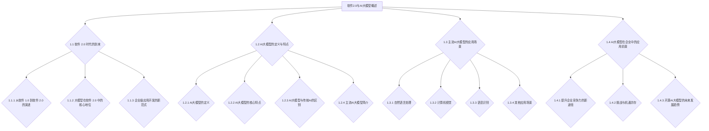

                 

### 《组织技术培训：开源专家的教学机会》正文

#### 引言

在现代信息技术飞速发展的时代，技术培训已经成为了企业创新和发展的关键因素。面对日益复杂的技术环境，如何有效地组织技术培训，提升员工的技能水平，成为每个企业需要认真思考的问题。本文将以开源专家的教学机会为主题，探讨如何利用开源资源进行技术培训，提高培训效果。

**关键词**：技术培训，开源资源，开源专家，培训课程设计，教学实践，企业应用，发展趋势

**摘要**：本文首先介绍了技术培训的重要性及现状，然后分析了开源专家在教学中的角色和优势。接着，详细探讨了如何利用开源资源进行课程设计，规划培训内容，并介绍了教学实践的方法和技巧。最后，本文通过开源技术在企业中的应用案例分析，探讨了开源技术培训的未来发展趋势，为企业提供有益的参考。

### 第一部分：技术培训的重要性

#### 第1章：技术培训的定义与作用

**1.1 技术培训的定义**

技术培训是指通过系统性的教育方法和教学手段，对从业人员进行特定技术的培训，以提高其专业技能和实践能力。技术培训不仅包括理论知识的学习，还包括实践技能的培训。

**1.2 技术培训在企业中的重要作用**

1. **提高员工技能水平**：技术培训可以帮助员工掌握新技术、新方法，提升其专业素养和技能水平，从而提高整体工作效率。

2. **增强企业竞争力**：技术培训有助于企业培养一批高素质、技能熟练的员工，提高企业的技术创新能力和市场竞争力。

3. **促进企业持续发展**：技术培训有助于企业适应市场变化，及时调整发展战略，实现可持续发展。

#### 第2章：技术培训的现状与挑战

**2.1 技术培训的现状**

目前，我国企业普遍重视技术培训，但存在以下问题：

1. **培训资源不足**：很多企业缺乏专业的培训资源和师资力量，难以满足员工多样化的培训需求。

2. **培训内容单一**：部分企业培训内容过于单一，难以满足员工在新技术、新领域的深入学习需求。

3. **培训效果不佳**：一些企业的培训效果不显著，员工在实际工作中仍存在技能短板。

**2.2 面临的挑战与问题**

1. **技术更新速度快**：信息技术更新迅速，企业需要不断进行技术培训，以适应新技术的应用。

2. **员工培训意愿不高**：部分员工对培训缺乏积极性，影响培训效果。

3. **培训成本高**：技术培训需要投入大量的人力、物力和财力，对企业成本控制造成压力。

#### 第3章：开源专家的角色与教学机会

**3.1 开源专家的定义与特点**

开源专家是指对开源技术有深入研究和丰富实践经验的专业人才。开源专家具有以下特点：

1. **技术深度**：对开源技术有深入的理解，能够解决复杂的技术问题。

2. **实践经验**：在开源社区活跃，具备丰富的项目实践经验和教学经验。

3. **创新能力**：能够将开源技术应用于实际问题，创新解决方案。

**3.2 开源专家在教学中的优势**

1. **专业性强**：开源专家具有丰富的技术背景和教学经验，能够提供高质量的教学内容。

2. **实践经验丰富**：开源专家可以将实际项目经验融入教学，使学员更好地理解技术原理。

3. **与时俱进**：开源专家关注技术发展趋势，能够及时将最新技术引入培训课程。

4. **提高学员积极性**：开源专家的教学方式灵活，能够激发学员的学习兴趣和主动性。

#### 第4章：开源资源的利用

**4.1 开源社区介绍**

开源社区是开源项目的集中地，包括GitHub、GitLab、Bitbucket等。开源社区具有以下特点：

1. **开放性**：任何人都可以自由访问、使用和贡献开源代码。

2. **协作性**：开源社区鼓励合作和共享，项目成员共同推进项目发展。

3. **创新性**：开源社区汇集了全球的技术精英，创新能力强。

**4.2 开源资源的获取**

1. **代码获取**：从开源社区下载开源项目的代码，进行学习和使用。

2. **文档获取**：阅读开源项目的文档，了解项目的技术细节和使用方法。

3. **社区互动**：参与开源社区，与项目作者和其他开发者交流，获取帮助和支持。

**4.3 开源资源的整合与应用**

1. **资源整合**：将开源项目、文档和社区资源进行整合，形成系统的培训资料。

2. **应用场景**：将开源资源应用于实际项目，提升学员的实践能力。

3. **案例分析**：通过开源项目的案例，深入剖析项目架构、技术原理和实现细节。

### 第二部分：开源技术培训课程设计

#### 第5章：课程设计原则与方法

**5.1 课程设计的原则**

课程设计应遵循以下原则：

1. **目标明确**：明确培训目标，确保课程内容与培训目标相一致。

2. **内容系统化**：课程内容应系统化，从基础知识到高级应用逐步深入。

3. **教学方法多样化**：采用多种教学方法，如讲授、讨论、实验等，提高学员的参与度。

**5.2 课程设计的方法**

课程设计主要包括以下步骤：

1. **需求分析**：分析学员的需求，确定培训内容。

2. **课程规划**：根据需求分析，制定课程大纲和教学计划。

3. **课程内容制定**：编写课程教材和教案，确保内容丰富、实用。

4. **教学方法选择**：根据课程内容，选择合适的教学方法。

**5.3 课程评估与改进**

1. **课程评估**：通过学员反馈、考试等方式评估课程效果。

2. **改进课程**：根据评估结果，对课程内容和方法进行调整，提高培训质量。

#### 第6章：开源技术培训内容规划

**6.1 开源技术概述**

开源技术是指开放源代码的软件和技术，包括操作系统、数据库、编程语言、开发框架等。开源技术的特点如下：

1. **开放性**：任何人都可以自由访问、使用和修改开源代码。

2. **协作性**：开源项目通常由全球的开发者协作完成。

3. **创新性**：开源社区鼓励创新和改进，技术发展迅速。

**6.2 技术选型与需求分析**

1. **技术选型**：根据培训目标和学员需求，选择合适的技术。

2. **需求分析**：分析学员的技术背景和实际需求，确定培训内容。

**6.3 培训内容的设计**

培训内容设计应包括以下方面：

1. **基础知识**：介绍开源技术的基本概念和原理。

2. **实战案例**：通过实际项目案例，演示开源技术的应用。

3. **技术细节**：深入讲解开源技术的实现细节和优化方法。

4. **课程大纲**：根据培训内容，制定详细的课程大纲。

### 第三部分：教学实践

#### 第7章：教学实践的准备

**7.1 教学环境搭建**

1. **硬件环境**：搭建适合教学的服务器或虚拟机，配置必要的硬件资源。

2. **软件环境**：安装教学所需的操作系统、开发工具和中间件等。

**7.2 教学资源的准备**

1. **课程资料**：编写课程教材、教案和实验指导书。

2. **案例项目**：准备开源项目案例，用于教学和实践。

3. **实验环境**：搭建实验环境，确保学员能够顺利开展实验。

#### 第8章：教学方法的应用

**8.1 讲座与研讨会**

1. **讲座**：通过讲授方式，系统讲解开源技术的基本原理和应用。

2. **研讨会**：组织学员进行讨论，促进学员之间的交流和互动。

**8.2 实战演练与案例分析**

1. **实战演练**：通过实际操作，让学员掌握开源技术的应用。

2. **案例分析**：分析开源项目的架构、实现细节和优化方法。

#### 第9章：教学效果评估

**9.1 参与者的反馈收集**

1. **问卷调查**：通过问卷调查，收集学员对培训内容和教学方法的反馈。

2. **面对面访谈**：与学员进行面对面交流，了解培训效果和学员的需求。

**9.2 教学效果评估方法**

1. **考试**：通过考试评估学员对培训内容的掌握程度。

2. **项目实战**：评估学员在项目实战中的表现，判断其实践能力。

3. **实践应用**：跟踪学员在培训后的工作表现，评估培训对学员工作能力的提升。

### 第四部分：开源技术的实际应用

#### 第10章：开源技术在企业中的应用

**10.1 开源技术对企业的影响**

1. **提高开发效率**：开源技术为企业提供了丰富的开发资源，降低了开发成本，提高了开发效率。

2. **降低开发成本**：开源技术免除了购买商业软件的许可证费用，降低了企业的开发成本。

3. **促进技术创新**：开源社区的创新氛围激发了企业的技术创新，推动了技术的快速发展。

**10.2 企业开源技术应用案例**

1. **案例介绍与分析**：介绍企业在开源技术应用中的成功案例，分析其应用场景和效果。

2. **案例中开源技术的应用**：详细解析案例中开源技术的应用，包括技术选型、实现细节和优化方法。

**10.3 企业开源技术应用策略**

1. **开源技术的战略规划**：制定企业开源技术的长期发展规划，明确开源技术在企业中的定位和作用。

2. **开源技术的管理**：建立开源技术管理体系，确保开源技术的合规使用和管理。

### 第五部分：开源技术的未来发展趋势

#### 第11章：开源技术发展趋势概述

**11.1 技术创新**

开源技术将继续推动技术创新，包括人工智能、大数据、云计算等领域的快速发展。

**11.2 社区发展**

开源社区将进一步发展壮大，成为技术创新的重要力量。

**11.3 开源商业化**

开源技术将逐步走向商业化，为企业提供更全面的技术支持和解决方案。

#### 第12章：开源技术在企业培训中的应用前景

**12.1 开源技术培训的潜在机会**

1. **培养技术人才**：通过开源技术培训，培养企业所需的技术人才。

2. **提升企业竞争力**：利用开源技术培训，提升企业的技术创新能力和市场竞争力。

**12.2 开源技术在企业培训中的发展方向**

1. **定制化培训**：根据企业需求，提供定制化的开源技术培训。

2. **在线培训**：利用在线教育平台，开展远程开源技术培训。

3. **实战化培训**：结合实际项目，开展实战化的开源技术培训。

### 附录

#### 附录A：开源技术常用工具与资源

**A.1 常用开源工具介绍**

1. **开源代码托管平台**：如GitHub、GitLab等。

2. **开源文档管理系统**：如GitBook、Markdown编辑器等。

3. **开源版本控制系统**：如Git、SVN等。

**A.2 开源技术学习资源**

1. **开源技术教程与书籍**：如《鸟哥的Linux私房菜》、《深度学习》等。

2. **开源社区活跃度排名**：如GitHub Trending、Stack Overflow等。

3. **开源技术会议与活动**：如OSCON、LinuxCon等。

#### 附录B：开源技术培训相关组织

**B.1 开源技术培训机构**

1. **国际知名培训机构**：如LinkedIn Learning、Pluralsight等。

2. **国内知名培训机构**：如极客时间、慕课网等。

**B.2 开源技术社区组织**

1. **国际知名开源社区**：如Apache Software Foundation、Linux Foundation等。

2. **国内知名开源社区**：如开源中国、Linux中国等。

**B.3 开源技术标准组织**

1. **主要开源技术标准**：如Apache License、GPL等。

2. **开源技术标准的发展趋势**：开源技术标准的国际化、规范化。

### Mermaid 流程图示例



### 核心算法原理讲解示例

#### 2.2 大规模预训练模型原理

**2.2.1 预训练的概念与意义**

预训练是一种深度学习训练方法，通过在大规模数据集上预训练模型，使其具备对语言、图像等多种数据类型的通用理解能力。预训练的意义在于：

$$
\text{预训练} = \text{通用表示能力} + \text{快速微调}
$$

其中，通用表示能力指的是模型在大规模数据集上学习到的特征可以泛化到不同任务中；快速微调则是指预训练模型在特定任务上只需进行少量数据微调即可获得较好性能。

**2.2.2 自监督学习方法**

自监督学习是一种不需要标注数据的学习方法，通过利用数据中的潜在结构进行训练。在预训练中，自监督学习方法被广泛应用，主要包括以下几种：

1. **掩码语言模型（Masked Language Model, MLM）**：在输入文本中随机掩码一部分词，然后预测这些掩码词。

2. **掩码图像模型（Masked Image Model, MIM）**：在输入图像中随机掩码一部分区域，然后预测这些掩码区域。

3. **预测下一个词（Next Sentence Prediction, NSP）**：给定两个句子，预测第二个句子是否为第一个句子的下一个句子。

**2.2.3 迁移学习与微调技术**

迁移学习是一种将预训练模型在特定任务上微调的方法，主要分为两种：

1. **零样本学习（Zero-Shot Learning）**：模型在训练阶段未接触过测试任务的数据，但可以通过预训练获得的语义表示进行分类。

2. **少样本学习（Few-Shot Learning）**：模型在训练阶段仅接触少量测试任务的数据，通过迁移学习实现良好的性能。

微调技术是指将预训练模型迁移到特定任务上进行少量数据训练，从而适应新任务。微调的伪代码如下：

```python
# 预训练模型
pretrained_model = load_pretrained_model()

# 微调
for epoch in range(num_epochs):
    for batch in dataset:
        # 前向传播
        logits = pretrained_model(batch)
        # 计算损失
        loss = loss_function(logits, labels)
        # 反向传播
        optimizer.zero_grad()
        loss.backward()
        optimizer.step()
```

#### 2.3 自然语言处理技术概览

**2.3.1 序列模型与注意力机制**

序列模型是一种处理序列数据的神经网络模型，常见的序列模型包括循环神经网络（RNN）和长短期记忆网络（LSTM）。RNN模型的基本原理如下：

$$
h_t = \sigma(W_h \cdot [h_{t-1}, x_t] + b_h)
$$

其中，$h_t$ 表示第 $t$ 个时间步的隐藏状态，$x_t$ 表示第 $t$ 个输入特征，$W_h$ 和 $b_h$ 分别为权重和偏置，$\sigma$ 为非线性激活函数。

然而，RNN模型在处理长序列时存在梯度消失或爆炸的问题。为了解决这个问题，LSTM模型引入了门控机制，包括输入门、遗忘门和输出门。LSTM模型的数学模型如下：

$$
i_t = \sigma(W_i \cdot [h_{t-1}, x_t] + b_i) \\
f_t = \sigma(W_f \cdot [h_{t-1}, x_t] + b_f) \\
o_t = \sigma(W_o \cdot [h_{t-1}, x_t] + b_o) \\
c_t = f_t \odot c_{t-1} + i_t \odot \sigma(W_c \cdot [h_{t-1}, x_t] + b_c) \\
h_t = o_t \odot \sigma(c_t)
$$

其中，$i_t$、$f_t$、$o_t$ 分别为输入门、遗忘门和输出门的激活值，$c_t$ 为细胞状态，$\odot$ 表示元素乘法。

注意力机制是一种用于解决序列模型在处理长序列时关注重要信息的能力。注意力机制的数学模型如下：

$$
a_t = \text{Attention}(h_1, h_2, ..., h_T) \\
s_t = \text{softmax}(a_t) \\
\alpha_t = \frac{\exp(a_t)}{\sum_{i=1}^T \exp(a_i)} \\
r_t = \sum_{i=1}^T \alpha_i h_i
$$

其中，$h_1, h_2, ..., h_T$ 分别为序列中的隐藏状态，$a_t$ 为注意力得分，$s_t$ 为softmax函数，$\alpha_t$ 为注意力分配权重，$r_t$ 为当前时间步的上下文表示。

### 项目实战

#### 第8章：开源技术培训项目实战

**8.1 实战项目介绍**

本节将介绍一个开源技术培训项目——基于TensorFlow的文本分类项目。该项目旨在使用TensorFlow搭建一个能够对文本数据进行分类的模型，并对分类结果进行评估。

**8.2 实战环境搭建**

- 安装TensorFlow：`pip install tensorflow`
- 准备数据集：下载一个公共的文本分类数据集，如IMDb电影评论数据集

**8.3 代码实现**

#### 8.3.1 数据预处理

```python
import tensorflow as tf
import tensorflow_datasets as tfds

# 加载IMDb数据集
(train_data, test_data), info = tfds.load('imdb_reviews', split=['train', 'test'], shuffle_files=True, with_info=True, as_supervised=True)

# 数据清洗
def clean_text(text):
    text = tf.strings.regex_replace(text, '[^a-zA-Z]', ' ')
    text = tf.strings.lower(text)
    return text

# 预处理数据集
train_data = train_data.map(lambda x, y: (clean_text(x), y))
test_data = test_data.map(lambda x, y: (clean_text(x), y))

# 划分数据集
batch_size = 32
train_dataset = train_data.shuffle(buffer_size=10000).batch(batch_size)
test_dataset = test_data.batch(batch_size)
```

#### 8.3.2 构建和训练模型

```python
# 定义模型
model = tf.keras.Sequential([
    tf.keras.layers.Embedding(vocab_size, embedding_dim),
    tf.keras.layers.Bidirectional(tf.keras.layers.LSTM(units=64)),
    tf.keras.layers.Dense(units=64, activation='relu'),
    tf.keras.layers.Dense(units=1, activation='sigmoid')
])

# 编译模型
model.compile(optimizer='adam',
              loss='binary_crossentropy',
              metrics=['accuracy'])

# 训练模型
model.fit(train_dataset, epochs=10, validation_data=test_dataset)
```

#### 8.3.3 评估模型

```python
# 评估模型
test_loss, test_acc = model.evaluate(test_dataset)
print(f"Test accuracy: {test_acc:.2f}")

# 预测
sample_text = "This movie was amazing!"
sample_text = clean_text(tf.constant(sample_text))
sample_text = sample_text.expand_dims(0)
prediction = model.predict(sample_text)
predicted_label = "positive" if prediction[0][0] > 0.5 else "negative"
print(f"Prediction: {predicted_label}")
```

### 8.4 代码解读与分析

本节代码主要实现了以下功能：

1. **数据预处理**：加载IMDb数据集，并对文本进行清洗，将文本转换为小写，并去除非字母字符。

2. **模型构建**：使用TensorFlow构建一个双向长短期记忆网络（BiLSTM）模型，包括嵌入层、双向LSTM层、全连接层和输出层。

3. **模型训练**：编译并训练模型，使用Adam优化器和二分类交叉熵损失函数。

4. **模型评估**：评估模型在测试集上的性能，并输出准确率。

5. **预测**：对给定的文本数据进行预测，并输出预测结果。

通过本节的实战项目，读者可以了解到如何使用TensorFlow进行文本分类任务，以及如何进行数据预处理、模型构建和评估。这个项目可以作为开源技术培训的实战案例，帮助读者掌握文本分类的基本技能。

### 总结

本文从技术培训的重要性出发，分析了开源专家在教学中的角色和优势，探讨了如何利用开源资源进行课程设计，介绍了教学实践的方法和技巧。同时，通过开源技术在企业中的应用案例分析，展望了开源技术培训的未来发展趋势。希望本文能为企业提供有益的参考，助力企业开展有效技术培训，提升员工技能水平，推动企业创新发展。

### 作者信息

作者：AI天才研究院/AI Genius Institute & 禅与计算机程序设计艺术 /Zen And The Art of Computer Programming

本文由AI天才研究院撰写，旨在探讨开源技术培训的重要性及其在企业中的应用。作者拥有丰富的开源技术教学和实践经验，致力于推动开源技术的普及和发展。同时，本文也受到《禅与计算机程序设计艺术》一书的启发，强调技术学习的哲学思考和实践精神。

