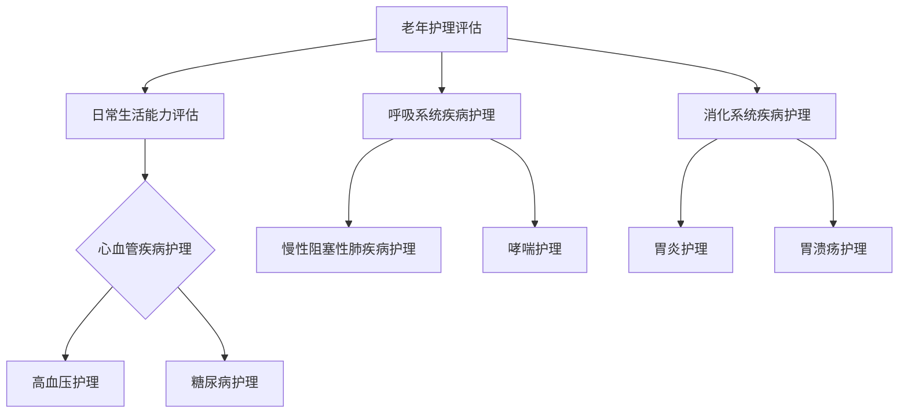
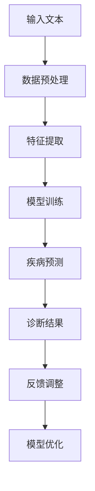

                 

### 《老年护理和LLM：改善生活质量》

**关键词：** 老年护理、人工智能、大型语言模型（LLM）、生活质量、医疗保健、健康管理、智能辅助。

**摘要：** 本文深入探讨了人工智能（AI）特别是大型语言模型（LLM）在老年护理领域中的应用，以及其对提升老年人生活质量的影响。文章首先概述了老年护理的基本概念和现状，随后详细分析了LLM的技术原理和应用场景。接着，本文介绍了LLM在老年护理中的多个应用实例，如智能辅助诊断、健康监测、护理辅助和心理健康支持。最后，文章展望了未来老年护理与AI结合的发展趋势，并提出了一些面临的挑战和解决方案。通过本文的探讨，我们希望能为老年护理领域提供新的思路和技术手段，以更好地改善老年人的生活质量。

### 第一部分：老年护理基础

#### 1. 老年护理概述

**1.1 老年人健康与护理现状**

随着全球人口老龄化的加剧，老年护理问题日益凸显。老年人由于其生理功能的逐渐衰退，容易出现各种健康问题，如心血管疾病、呼吸系统疾病、消化系统疾病等。同时，老年人常常伴随认知障碍、行动不便等问题，使得护理需求更为复杂和多样化。

根据世界卫生组织（WHO）的数据，全球60岁及以上人口预计到2050年将占总人口的22%，而这一比例在许多发达国家已经超过30%。老年护理问题不仅关系到个体的生活质量，还直接影响到社会的经济负担和家庭的社会功能。因此，解决老年护理问题已成为各国政府和社会各界关注的焦点。

**1.2 老年护理的目标与原则**

老年护理的目标主要包括以下几个方面：

- 提高老年人的生活质量，使其能够独立生活并享受健康的生活。
- 预防和治疗老年人的慢性疾病和功能障碍，延缓老化进程。
- 改善老年人的心理健康，减少抑郁和焦虑等心理问题。
- 提供全面、连续、个性化的护理服务，满足老年人的多样化需求。

老年护理的原则可以概括为“以人为本、全面护理、个性化服务、持续改进”。

1. **以人为本**：尊重老年人的尊严和权利，关注其身心健康需求，确保护理服务始终以老年人的利益为中心。
2. **全面护理**：老年护理不仅仅是医疗护理，还包括生活照料、心理支持、社会参与等多个方面，需要综合施策，全面关注。
3. **个性化服务**：老年人由于个体差异较大，护理服务需要根据其具体情况进行个性化定制，确保护理措施的有效性和适用性。
4. **持续改进**：老年护理是一个动态变化的过程，需要不断评估和改进护理方案，以适应老年人不断变化的需求和健康状况。

**1.3 老年护理的挑战与机遇**

老年护理面临的挑战主要包括以下几个方面：

- 老年人口增长速度快，护理需求巨大，而专业护理人员的数量和素质难以满足需求。
- 老年人常见的慢性疾病和功能障碍种类繁多，护理复杂度较高，需要多学科协作。
- 老年护理的服务模式和服务体系尚不完善，需要进一步创新和优化。
- 老年护理资源的分配不均，城乡、区域之间差异较大，需要加强统筹和协调。

然而，老年护理也面临着一些机遇：

- 人工智能和大数据技术的发展为老年护理提供了新的技术手段和解决方案，可以提升护理效率和质量。
- 政府和社会对老年护理的关注度不断提高，政策支持和投入力度加大，有利于老年护理事业的发展。
- 社会各界对老年护理的需求日益增长，市场潜力巨大，为企业和投资者提供了广阔的发展空间。

总的来说，老年护理既面临挑战，也充满机遇。通过积极探索和创新，充分利用人工智能等新兴技术，有望实现老年护理的全面升级和改进，为老年人创造更高质量的生活。

#### 2. 老年人常见疾病与护理

老年人由于其生理功能的逐渐衰退，容易患上各种慢性疾病，其中心血管疾病、呼吸系统疾病和消化系统疾病是较为常见的几类疾病。以下将分别对这几类疾病进行概述，并探讨其护理要点。

**2.1 心血管疾病**

心血管疾病是老年人的常见疾病，主要包括冠心病、高血压、心力衰竭等。这些疾病不仅影响老年人的生活质量，还可能导致严重的并发症，甚至威胁生命。

**2.1.1 心血管疾病概述**

心血管疾病的发生与年龄增长、慢性炎症、氧化应激、动脉硬化等多种因素有关。随着年龄的增长，血管壁弹性降低，动脉硬化，心脏功能逐渐减退，导致心血管疾病的风险增加。

**2.1.2 预防与护理**

预防心血管疾病的关键在于生活方式的改变和早期干预。以下是一些具体的预防与护理措施：

- **生活方式改变**：保持健康的饮食习惯，减少盐分摄入，增加蔬菜和水果的摄入，限制酒精摄入，戒烟，保持适当的体重和体力活动。
- **药物治疗**：根据医生的建议，合理使用降压药、降脂药、抗血小板药等，以控制病情，减少并发症的风险。
- **定期体检**：定期进行心电图、血压、血脂等检查，及早发现病情变化，采取相应措施。

在护理心血管疾病老年人时，应注意以下几点：

- **监测病情**：密切监测老年人的血压、心率等生命体征，及时发现并处理异常情况。
- **合理用药**：严格按照医嘱用药，避免自行增减剂量或停药，避免药物相互作用。
- **心理支持**：心血管疾病老年人常伴随焦虑、抑郁等心理问题，需要提供心理支持，帮助他们建立积极的心态。
- **日常生活照料**：协助老年人进行日常活动，如洗澡、穿衣、用餐等，确保他们的生活安全。

**2.2 呼吸系统疾病**

呼吸系统疾病也是老年人常见的健康问题，包括慢性阻塞性肺疾病（COPD）、哮喘、肺炎等。这些疾病严重影响老年人的呼吸功能和生活质量。

**2.2.1 呼吸系统疾病概述**

呼吸系统疾病的发生与空气污染、吸烟、慢性炎症等多种因素有关。老年人由于呼吸系统功能减退，更容易患上这些疾病。

**2.2.2 预防与护理**

预防呼吸系统疾病的关键在于减少暴露于有害因素，保持良好的生活习惯。以下是一些具体的预防与护理措施：

- **避免有害因素**：避免吸烟和接触二手烟，减少空气污染的暴露，保持室内空气流通。
- **保持良好的生活习惯**：保持适度的体力活动，增强体质，提高免疫力。
- **药物治疗**：根据医生的建议，合理使用支气管扩张剂、抗炎药等，控制病情。
- **定期检查**：定期进行肺功能检查，及早发现病情变化。

在护理呼吸系统疾病老年人时，应注意以下几点：

- **保持呼吸通畅**：协助老年人进行呼吸锻炼，如深呼吸、咳嗽训练，保持呼吸道通畅。
- **营养支持**：提供高蛋白、高维生素、易消化的饮食，增强老年人的体质和免疫力。
- **心理支持**：呼吸系统疾病老年人常伴随焦虑、抑郁等心理问题，需要提供心理支持，帮助他们建立积极的心态。
- **日常生活照料**：协助老年人进行日常活动，如洗澡、穿衣、用餐等，确保他们的生活安全。

**2.3 消化系统疾病**

消化系统疾病也是老年人常见的健康问题，包括胃炎、胃溃疡、结肠炎、胰腺炎等。这些疾病不仅影响老年人的消化功能，还可能导致严重的并发症。

**2.3.1 消化系统疾病概述**

消化系统疾病的发生与年龄增长、饮食习惯、肠道菌群失衡等多种因素有关。老年人由于胃肠道功能减退，更容易患上这些疾病。

**2.3.2 预防与护理**

预防消化系统疾病的关键在于改善饮食习惯和生活方式。以下是一些具体的预防与护理措施：

- **改善饮食习惯**：保持饮食平衡，避免过量摄入油腻、刺激性食物，增加蔬菜和水果的摄入。
- **定期体检**：定期进行消化系统检查，及早发现病情变化。
- **药物治疗**：根据医生的建议，合理使用消炎药、抗酸药等，控制病情。

在护理消化系统疾病老年人时，应注意以下几点：

- **监测病情**：密切监测老年人的消化功能，如呕吐、腹泻、腹痛等，及时处理异常情况。
- **合理用药**：严格按照医嘱用药，避免自行增减剂量或停药，避免药物相互作用。
- **心理支持**：消化系统疾病老年人常伴随焦虑、抑郁等心理问题，需要提供心理支持，帮助他们建立积极的心态。
- **日常生活照料**：协助老年人进行日常活动，如洗澡、穿衣、用餐等，确保他们的生活安全。

通过以上对老年人常见疾病的概述和护理措施的分析，我们可以看到，老年护理是一个复杂而系统的过程。需要综合考虑老年人的生理、心理和社会需求，提供全方位的护理服务。同时，随着人工智能技术的发展，特别是大型语言模型（LLM）在医疗领域的应用，有望为老年护理提供更智能、更高效的解决方案，从而进一步提升老年人的生活质量。

### 3. 老年人日常生活照料

老年人的日常生活照料是一项复杂而重要的任务，涉及到多个方面，包括日常生活能力评估、沟通与心理支持、营养与饮食等。以下将详细探讨这些方面，并介绍一些常用的方法和工具。

**3.1 日常生活能力评估**

日常生活能力（Activities of Daily Living, ADL）是指老年人能够独立完成日常生活中必需的基本活动的能力。这些活动包括穿衣、洗漱、如厕、进食、移动等。评估老年人的日常生活能力对于制定护理计划和提供合适的服务至关重要。

**3.1.1 评估方法**

常用的日常生活能力评估方法包括：

- **巴氏指数（Barthel Index, BI）**：巴氏指数是一种广泛使用的评估工具，包括10个方面的日常活动能力，总分100分，分数越高表示日常生活能力越强。通常，BI评分在60分以上被认为有较强的自理能力，低于60分则需要不同程度的护理支持。

- **堪培拉日常生活活动量表（Canberra Activities of Daily Living, CADL）**：CADL是一种简化的日常生活能力评估工具，包括7个方面的日常活动能力，操作简单，适用于不同年龄和文化背景的老年人。

- **日常生活能力问卷（Instrumental Activities of Daily Living, IADL）**：IADL主要评估老年人完成较复杂日常生活活动的能力，如做饭、洗衣、购物、使用交通工具等。与ADL相比，IADL更关注老年人对于工具和设备的使用能力。

**3.1.2 评估工具**

除了上述评估方法外，还有一些评估工具可供选择，如：

- **老年综合评估表（Geriatric Assessment, GA）**：GA综合考虑老年人的生理、心理、社会功能等多个方面，全面评估老年人的健康状况和生活质量。

- **老年人日常生活能力评估系统（Geriatric Assessment System, GAMS）**：GAMS是一种计算机化的评估系统，通过问答形式评估老年人的日常生活能力，结果自动生成报告，便于医护人员参考。

**3.2 沟通与心理支持**

沟通和心理支持在老年护理中占有重要地位。老年人由于生理功能的衰退、疾病的困扰，常常感到孤独、无助和焦虑。有效的沟通和心理支持可以帮助老年人缓解负面情绪，提高生活质量。

**3.2.1 沟通方法**

有效的沟通方法包括：

- **倾听**：耐心倾听老年人的心声，理解他们的需求和感受，给予足够的关注和尊重。

- **非语言沟通**：通过肢体语言、面部表情、眼神交流等方式，传递关心和支持，增强沟通效果。

- **简明清晰的表述**：使用简单易懂的语言，避免使用专业术语，确保老年人能够理解沟通内容。

**3.2.2 心理支持**

心理支持的方法包括：

- **心理咨询**：为老年人提供专业的心理咨询，帮助他们应对心理问题和压力。

- **心理疏导**：通过心理疏导，帮助老年人调整心态，缓解焦虑、抑郁等负面情绪。

- **社交支持**：鼓励老年人参与社交活动，与家人、朋友保持联系，增加社交支持。

**3.3 老年人营养与饮食**

营养与饮食是老年人健康的重要组成部分。合理的营养和饮食有助于维持老年人的身体健康，提高生活质量。

**3.3.1 营养需求**

老年人的营养需求与年轻人有所不同，主要包括以下几个方面：

- **能量**：老年人的能量需求相对较低，但需要注意保持适当的能量摄入，避免营养不良。

- **蛋白质**：蛋白质是维持身体功能的重要物质，老年人需要摄入足够的蛋白质以维持肌肉和免疫功能。

- **维生素和矿物质**：老年人容易缺乏维生素和矿物质，如维生素D、钙、铁等，需要注意补充。

**3.3.2 饮食建议**

以下是一些老年人饮食的建议：

- **多样化饮食**：保持饮食多样化，摄入充足的蔬菜、水果、谷物、蛋白质等。

- **适量摄入**：适量摄入脂肪、糖分和盐分，避免摄入过多热量，控制体重。

- **定时定量**：保持规律的饮食习惯，定时定量进食，避免暴饮暴食。

- **易消化食物**：选择易消化、软烂的食物，避免过硬、油炸、辛辣等刺激性食物。

通过以上对老年人日常生活照料各个方面的探讨，我们可以看到，老年护理不仅需要关注老年人的身体健康，还需要关注他们的心理和社会需求。通过科学评估、有效沟通、合理营养等多方面的综合护理，我们可以为老年人提供更全面、更高质量的护理服务，从而改善他们的生活质量。

### 第二部分：LLM在老年护理中的应用

#### 4. 人工智能与老年护理

**4.1 人工智能概述**

人工智能（Artificial Intelligence, AI）是指通过计算机模拟人类智能行为的技术，包括学习、推理、感知、理解等多个方面。人工智能的发展经历了多个阶段，从早期的规则推理到机器学习，再到深度学习和自然语言处理，人工智能技术不断进步，应用领域也日益广泛。

在医疗保健领域，人工智能的应用已经成为一个热点。通过大数据分析和机器学习算法，人工智能可以辅助医生进行诊断、治疗和护理，提高医疗效率和诊断准确性。例如，AI可以分析医学影像，识别异常病灶，辅助医生进行早期诊断；还可以通过电子健康记录，预测患者的疾病风险，提供个性化的健康建议。

**4.2 LLM在老年护理中的应用前景**

大型语言模型（Large Language Model, LLM）是一种基于深度学习的自然语言处理技术，具有强大的语言理解和生成能力。LLM在老年护理领域具有广泛的应用前景，主要包括以下方面：

1. **智能辅助诊断**：通过分析老年人的病历数据、症状描述和体征信息，LLM可以帮助医生进行疾病诊断，提高诊断准确性和效率。
2. **健康监测**：LLM可以分析健康数据，如血压、心率、血糖等，对老年人的健康状况进行实时监测和预警。
3. **护理辅助**：LLM可以辅助护理人员制定护理计划，提供护理任务自动化和决策支持，提高护理质量和效率。
4. **心理健康支持**：LLM可以通过自然语言交互，为老年人提供心理支持和情感关怀，帮助他们缓解心理压力和孤独感。
5. **生活服务**：LLM可以集成到智能家居系统，为老年人提供便捷的生活服务，如家居环境监控、设备控制、健康管理等。

**4.3 LLM技术原理与架构**

LLM的核心是神经网络模型，特别是深度神经网络（Deep Neural Network, DNN）。DNN通过多层神经网络结构，学习输入数据和标签之间的关系，从而实现复杂的非线性映射。LLM通常由以下几个部分组成：

1. **输入层**：接收用户输入的自然语言文本，如病历数据、症状描述等。
2. **隐藏层**：通过神经网络结构，对输入文本进行特征提取和表示，形成高维特征向量。
3. **输出层**：根据隐藏层输出的特征向量，生成相应的输出结果，如诊断结果、健康建议等。

LLM的训练过程通常包括以下几个步骤：

1. **数据预处理**：对原始文本数据进行清洗、分词、标注等处理，生成可供训练的输入输出数据对。
2. **模型训练**：使用大规模数据集，通过反向传播算法和优化器，训练神经网络模型，使其能够准确预测标签。
3. **模型评估**：使用验证集和测试集，评估模型的性能，调整模型参数，优化模型效果。
4. **模型部署**：将训练好的模型部署到实际应用场景中，如医疗诊断、健康监测等。

通过以上对人工智能和LLM在老年护理中的应用概述，我们可以看到，人工智能特别是LLM技术在老年护理领域具有巨大的潜力。随着技术的不断进步和应用场景的扩展，LLM有望成为老年护理的重要工具，为老年人提供更智能、更高效的护理服务，从而改善他们的生活质量。

#### 5. LLM在老年护理中的应用

**5.1 智能辅助诊断**

智能辅助诊断是LLM在老年护理中的一个重要应用领域。通过分析老年人的病历数据、症状描述和体征信息，LLM可以帮助医生进行疾病诊断，提高诊断的准确性和效率。

**5.1.1 病历数据分析**

病历数据是智能辅助诊断的重要信息来源。LLM可以通过自然语言处理技术，对病历数据进行分析和解读。具体过程如下：

1. **数据预处理**：首先对病历文本进行清洗和分词，去除噪声和不相关信息，提取关键信息，如疾病名称、症状、检查结果等。
2. **特征提取**：利用词嵌入技术，将文本数据转换为数值向量，形成病历特征向量。
3. **疾病预测**：将病历特征向量输入到训练好的LLM模型中，通过模型输出疾病的概率分布，辅助医生进行疾病预测。

**5.1.2 症状识别与诊断**

症状识别是智能辅助诊断的关键步骤。LLM可以通过学习大量医学文本数据，掌握各种疾病的症状特征，从而实现症状识别。

1. **症状特征学习**：通过大规模医学文本数据训练，LLM可以学习到各种疾病的症状特征，如常见症状、罕见症状等。
2. **症状识别**：在诊断过程中，LLM可以分析患者的症状描述，识别出与疾病相关的症状，并将其作为诊断依据。

**5.1.3 智能诊断系统架构**

智能辅助诊断系统通常包括以下几个模块：

1. **数据采集模块**：负责收集患者的病历数据、症状描述和体征信息等。
2. **数据处理模块**：对采集到的数据进行分析和预处理，提取关键信息。
3. **特征提取模块**：利用词嵌入等技术，将文本数据转换为数值向量，形成病历特征向量。
4. **诊断模型模块**：训练并部署训练好的LLM模型，用于疾病预测和诊断。
5. **诊断结果输出模块**：根据LLM模型的输出结果，生成诊断报告，辅助医生进行诊断。

**5.2 智能健康监测**

智能健康监测是LLM在老年护理中的另一个重要应用领域。通过实时监测老年人的生理参数，如血压、心率、血糖等，LLM可以对老年人的健康状况进行实时监控和预警。

**5.2.1 生理参数监测**

生理参数监测是智能健康监测的核心。传感器技术和无线通信技术的发展，使得实时采集和分析生理参数成为可能。具体过程如下：

1. **生理参数采集**：通过传感器，如血压计、心率监测器、血糖仪等，实时采集老年人的生理参数数据。
2. **数据传输**：将采集到的生理参数数据通过无线通信技术，如Wi-Fi、蓝牙等，传输到服务器或云平台。
3. **数据预处理**：对传输来的生理参数数据进行清洗和预处理，去除噪声和异常值，提取关键信息。

**5.2.2 健康数据分析与预警**

健康数据分析与预警是智能健康监测的关键。LLM可以通过对生理参数数据的分析，发现潜在的疾病风险，并提供预警。

1. **健康数据特征提取**：利用机器学习算法，对生理参数数据进行分析和特征提取，形成健康数据特征向量。
2. **健康风险预测**：将健康数据特征向量输入到训练好的LLM模型中，通过模型输出健康风险的概率分布，进行健康风险预测。
3. **预警机制**：根据LLM模型的预测结果，设置预警阈值，当健康风险超过阈值时，向医生或护理人员发送预警通知。

**5.2.3 智能健康监测系统架构**

智能健康监测系统通常包括以下几个模块：

1. **生理参数采集模块**：负责实时采集老年人的生理参数数据。
2. **数据传输模块**：负责将生理参数数据传输到服务器或云平台。
3. **数据处理模块**：对传输来的生理参数数据进行预处理和特征提取。
4. **健康分析模块**：利用LLM模型进行健康数据分析和风险预测。
5. **预警通知模块**：根据健康风险预测结果，向医生或护理人员发送预警通知。
6. **用户界面模块**：为老年人、医生和护理人员提供便捷的数据查看和操作界面。

通过以上对智能辅助诊断和智能健康监测的详细分析，我们可以看到，LLM在老年护理中的应用具有巨大的潜力。智能辅助诊断可以帮助医生提高诊断准确性，减少误诊和漏诊；智能健康监测可以实时监控老年人的健康状况，提供预警和干预措施，从而改善老年人的生活质量。随着LLM技术的不断进步，未来智能辅助诊断和健康监测系统将会更加成熟和普及，为老年护理带来更多创新和突破。

#### 5.3 智能护理辅助

智能护理辅助是LLM在老年护理中的另一个重要应用领域。通过自动化和智能化的护理任务执行，以及为护理决策提供支持，智能护理辅助可以显著提高护理质量和效率，同时减轻护理人员的负担。

**5.3.1 护理任务自动化**

护理任务自动化是智能护理辅助的核心之一。通过LLM技术，可以将一些重复性高、标准化的护理任务自动化，减少人工干预，提高护理效率。

**1. 任务自动化过程**

任务自动化的过程通常包括以下几个步骤：

- **任务识别**：首先，需要识别出哪些护理任务适合自动化。这可以通过分析护理流程和任务内容，确定哪些任务可以由机器执行。

- **流程设计**：针对确定的自动化任务，设计合理的流程。例如，对于药物配送任务，可以设计从药物准备、患者识别、药物分配到药物配送的完整流程。

- **规则制定**：在流程设计中，需要制定一系列规则，以确保自动化任务能够按照既定流程和标准执行。例如，药物配送时需要遵循药物剂量、配送时间等标准。

- **系统集成**：将自动化任务集成到现有的护理系统中，如电子健康记录系统、护理管理系统等。通过系统集成，可以实现自动化任务与其他护理任务的协同执行。

- **测试与优化**：在实际应用前，需要对自动化系统进行测试，确保其能够在实际环境中正常运行。在测试过程中，发现和解决问题，对系统进行优化，提高其稳定性和可靠性。

**2. 应用实例**

护理任务自动化的应用实例包括：

- **药物配送**：通过自动化系统，根据医生的处方，自动准备和配送药物，减少人为错误，提高配送效率。

- **日常照料**：如帮助老年人洗浴、更衣、进食等日常照料任务，可以通过智能机器人或自动化设备实现，提高照料质量。

- **监测与报警**：通过自动化监测设备，实时监测老年人的生命体征，如心率、血压等，一旦发现异常，立即发出警报，通知护理人员处理。

**5.3.2 护理决策支持系统**

护理决策支持系统是智能护理辅助的另一个重要方面。通过LLM技术，可以为护理决策提供科学、准确的依据，帮助护理人员做出更明智的决策。

**1. 决策支持过程**

决策支持的过程通常包括以下几个步骤：

- **数据收集**：收集与老年人健康状况相关的数据，如病历信息、生理参数、日常活动记录等。

- **数据预处理**：对收集到的数据进行分析和预处理，去除噪声和异常值，提取关键信息。

- **模型训练**：使用训练数据集，训练LLM模型，使其能够学习和预测老年人的健康状况。

- **决策生成**：将实时监测到的数据输入到训练好的LLM模型中，模型会根据已有数据，生成相应的护理决策建议。

- **决策评估**：对生成的护理决策进行评估，确定其合理性和可行性。

- **决策执行**：根据评估结果，执行护理决策，如调整药物剂量、调整护理计划等。

**2. 应用实例**

护理决策支持系统的应用实例包括：

- **疾病管理**：通过分析老年人的病历数据和生理参数，系统可以提供针对特定疾病的护理建议，如如何控制血糖、如何管理高血压等。

- **护理计划制定**：根据老年人的健康状况和护理需求，系统可以自动生成个性化的护理计划，包括护理任务、执行时间和注意事项等。

- **健康预测**：通过分析老年人的健康数据，系统可以预测其未来的健康状况，提供预防性护理建议，如如何预防跌倒、如何预防心血管疾病等。

通过护理任务自动化和护理决策支持系统的应用，LLM技术可以为老年护理提供更智能、更高效的解决方案，从而提升护理质量和效率，改善老年人的生活质量。未来，随着LLM技术的不断发展和完善，智能护理辅助系统将会在老年护理领域发挥更加重要的作用。

#### 6. LLM在老年心理健康中的应用

随着人口老龄化趋势的加剧，老年心理健康问题日益受到关注。老年人在面对生理功能退化、社交孤立和疾病困扰时，容易出现焦虑、抑郁等心理问题。大型语言模型（LLM）作为一种先进的自然语言处理技术，在老年心理健康领域展现了巨大的应用潜力。以下将探讨LLM在老年心理健康中的应用，包括智能心理评估、心理干预与支持以及情感计算与情感化护理。

**6.1 智能心理评估**

智能心理评估是LLM在老年心理健康中的首个应用。通过分析老年人的语言和行为数据，LLM可以识别出潜在的焦虑、抑郁等心理问题，为早期干预提供依据。

**1. 评估方法**

- **自然语言处理（NLP）**：LLM通过NLP技术，分析老年人的语言表达，如日记、问卷回答等，识别出情感倾向和情绪状态。

- **行为分析**：通过视频、音频等交互数据，LLM可以捕捉老年人的非语言行为，如面部表情、语调变化等，辅助评估心理状态。

**2. 应用实例**

- **情绪识别**：LLM可以识别出老年人的情绪状态，如焦虑、抑郁等，为心理健康干预提供数据支持。

- **心理健康问卷**：通过设计针对性的心理健康问卷，LLM可以分析回答内容，发现潜在的心理问题。

**6.2 心理干预与支持**

LLM在心理干预与支持中的应用，可以帮助老年人缓解心理压力，提高生活质量。

**1. 心理干预方法**

- **在线咨询**：LLM可以作为在线心理咨询师，为老年人提供即时的心理支持，解答他们的疑惑，提供情绪疏导。

- **虚拟社交**：通过虚拟现实（VR）技术，结合LLM，可以为老年人提供一个虚拟社交环境，帮助他们建立新的社交关系，缓解孤独感。

**2. 应用实例**

- **情绪反馈系统**：LLM可以通过自然语言交互，为老年人提供情绪反馈，帮助他们识别和调节自己的情绪。

- **心理健康训练**：LLM可以设计一系列心理健康训练课程，通过互动式学习，提高老年人的心理健康水平。

**6.3 情感计算与情感化护理**

情感计算是一种将情感分析、认知计算和人类情感相结合的技术，旨在理解和模拟人类情感。情感化护理则将情感计算应用于护理实践，为老年人提供更加人性化的护理服务。

**1. 情感计算原理**

- **情感识别**：通过自然语言处理和计算机视觉技术，识别老年人的情感状态，如高兴、愤怒、悲伤等。

- **情感理解**：利用深度学习和语义分析，理解情感表达的语境和含义，如区分不同情绪下的需求和行为。

- **情感模拟**：通过生成对抗网络（GAN）等先进技术，模拟人类情感表达，为老年人提供情感支持。

**2. 情感化护理应用**

- **情感互动**：结合语音识别和语音合成技术，LLM可以与老年人进行情感互动，如问候、鼓励等，提高护理的亲和力。

- **情感反馈**：LLM可以实时分析老年人的情绪状态，提供个性化的情感反馈，如安慰、激励等。

通过上述探讨，我们可以看到，LLM在老年心理健康中的应用具有广阔的前景。通过智能心理评估、心理干预与支持以及情感化护理，LLM可以帮助老年人更好地管理心理健康，提高生活质量。未来，随着技术的不断进步，LLM将在老年心理健康领域发挥更加重要的作用，为老年人提供更加智能化、人性化的护理服务。

### 7. LLM在老年人生活服务中的应用

在老年人生活服务中，人工智能（AI）特别是大型语言模型（LLM）的应用，正逐步改变老年人的日常生活，提升了他们的生活质量。以下将探讨LLM在老年人生活服务中的几个关键应用领域，包括智能家居系统和智能健康管理。

#### 7.1 智能家居系统

智能家居系统通过物联网（IoT）技术，将家庭中的各种设备连接起来，实现自动化和智能化的控制。LLM在智能家居系统中发挥着重要的作用，提升了老年人的居家生活便利性和安全性。

**7.1.1 家居环境监控**

家居环境监控是智能家居系统的核心功能之一，通过传感器和摄像头等设备，实时监测老年人的居家环境。

- **环境参数监测**：通过传感器，如烟雾传感器、温度传感器、湿度传感器等，实时监测家居环境中的有害气体、温度、湿度等参数，一旦检测到异常，系统会自动发出警报，通知老年人或护理人员。

- **行为监测**：利用摄像头和图像识别技术，系统可以监控老年人的日常行为，如是否按时起床、是否正常进食等，如发现异常行为，系统会自动发出警报。

**7.1.2 家居设备控制**

智能家居系统通过LLM技术，实现了对家居设备的智能控制，为老年人提供了极大的便利。

- **语音控制**：通过语音识别和语音合成技术，老年人可以通过语音指令控制家居设备，如打开灯光、调节温度、播放音乐等，无需手动操作。

- **自动化控制**：系统可以根据老年人的生活习惯，自动设置家居设备的工作模式，如早晨自动开启窗帘、晚上自动关闭灯光等，提高生活便利性。

**7.1.3 应用实例**

- **智能安防系统**：通过摄像头和传感器，系统可以实时监测家居环境，并在发现可疑活动时自动报警，提高老年人的居家安全性。

- **智能照明系统**：根据老年人的光线需求，系统可以自动调节灯光亮度，提供舒适的光线环境。

#### 7.2 智能健康管理

智能健康管理通过收集和分析老年人的健康数据，提供个性化的健康监测和干预建议，帮助老年人保持健康，提高生活质量。

**7.2.1 运动健康监测**

运动健康监测是智能健康管理的重要部分，通过传感器和智能设备，实时监测老年人的运动数据。

- **运动监测**：通过智能手环、运动手环等设备，系统可以实时记录老年人的运动数据，如步数、心率、运动时长等。

- **运动分析**：系统会对运动数据进行分析，为老年人提供运动建议，如运动频率、运动强度等，帮助他们保持健康的运动习惯。

**7.2.2 饮食健康管理**

饮食健康管理通过智能设备，如智能秤、智能水杯等，监测老年人的饮食行为，提供营养建议。

- **饮食监测**：通过智能秤，系统可以记录老年人的进食量和饮食种类，分析营养摄入情况。

- **营养建议**：系统会根据老年人的健康状况和营养需求，提供个性化的饮食建议，如增加蛋白质摄入、减少糖分摄入等。

**7.2.3 应用实例**

- **智能运动跟踪器**：通过智能运动跟踪器，老年人可以记录自己的运动数据，并通过手机应用程序查看运动分析，制定适合自己的运动计划。

- **智能饮食指导系统**：通过智能饮食指导系统，老年人可以随时查看自己的饮食记录和营养摄入情况，根据系统建议调整饮食。

综上所述，LLM在老年人生活服务中的应用，显著提升了老年人的居家安全和健康管理水平。通过智能家居系统和智能健康管理，老年人可以享受到更加便捷、智能的生活，提高生活质量。随着技术的不断进步，未来智能家居和健康管理系统将为老年人带来更多的便利和关爱。

### 8. 生活质量评估与提升

**8.1 生活质量评估方法**

生活质量（Quality of Life, QoL）评估是了解老年人生活质量状况的重要手段。评估方法主要包括以下几种：

1. **问卷调查法**：通过设计针对性的问卷，收集老年人对自身生活各方面（如身体健康、心理健康、社会关系、生活满意度等）的主观评价。
2. **生理指标检测**：通过检测生理指标（如血压、血糖、心率等），评估老年人的身体健康状况。
3. **行为观察法**：通过观察老年人的日常生活行为，评估其自理能力和生活质量。
4. **心理评估工具**：使用心理评估量表（如抑郁自评量表、焦虑自评量表等），评估老年人的心理健康状况。

**8.2 生活质量提升策略**

提升老年人的生活质量，需要从多个方面入手，制定综合性的提升策略：

1. **健康促进**：通过定期体检、健康讲座、运动指导等，提高老年人的健康水平。
2. **心理支持**：为老年人提供心理咨询、心理疏导服务，缓解他们的心理压力和孤独感。
3. **社会参与**：鼓励老年人参与社区活动，加强社交互动，提高社会支持度。
4. **环境优化**：改善老年人的居住环境，提供安全、舒适的生活空间。
5. **技术应用**：利用人工智能、物联网等技术，提升老年人的居家安全和健康管理水平。

**8.3 社区参与与社会支持**

社区参与和社会支持在提升老年人生活质量中起着关键作用：

1. **社区支持网络**：建立社区支持网络，为老年人提供生活照料、健康咨询、心理支持等服务。
2. **志愿者服务**：鼓励志愿者参与老年人服务，为老年人提供陪伴、帮助和支持。
3. **社会政策**：制定和实施有利于老年人权益保护和社会参与的法律法规，提高老年人的社会地位和福利待遇。
4. **公共服务**：提供便捷的公共服务，如医疗保健、养老院、社区中心等，满足老年人的多样化需求。

通过上述生活质量评估与提升策略，可以全面提高老年人的生活质量，让他们享受到更加健康、快乐、有意义的晚年生活。

### 9. 案例研究：老年护理与LLM综合应用

为了更直观地展示大型语言模型（LLM）在老年护理中的应用效果，本节将介绍一个具体的案例研究，探讨如何通过LLM技术提升老年护理的质量和效率。

#### 9.1 案例背景

案例研究的背景设定在一个中等规模的养老院，该养老院拥有100多位老年人，其中大多数患有不同程度的慢性疾病，如高血压、糖尿病、心血管疾病等。养老院的护理团队由专业的护士、护工和医生组成，但人员数量有限，护理任务繁重。为了提升护理质量和效率，养老院决定引入LLM技术，作为护理辅助工具。

#### 9.2 案例实施过程

1. **需求分析**：首先，养老院对现有护理流程和需求进行详细分析，确定LLM技术的应用场景和功能需求。主要包括：
   - 智能辅助诊断：辅助医生进行疾病诊断和治疗方案制定。
   - 智能健康监测：实时监测老年人的生理参数，提供健康预警。
   - 智能护理辅助：自动化执行护理任务，如药物配送、日常照料等。

2. **系统开发**：养老院与一家专业的AI公司合作，开发了一套基于LLM的智能护理辅助系统。该系统包括以下几个模块：

   - **病历数据分析模块**：利用LLM技术，对老年人的病历数据进行分析，辅助医生进行诊断和治疗方案制定。
   - **健康监测模块**：集成生理参数传感器，实时采集老年人的血压、心率、血糖等数据，通过LLM模型进行分析和预警。
   - **护理任务自动化模块**：根据护理任务清单和老年人的健康状况，自动安排和执行护理任务，如药物配送、日常照料等。

3. **系统部署与培训**：在系统开发完成后，养老院进行系统的部署和培训。护士、护工和医生接受了系统的使用培训，确保能够熟练操作和使用系统。

4. **实际应用**：系统正式投入使用后，养老院的护理工作发生了显著变化：

   - **智能辅助诊断**：通过LLM技术，医生能够更快速、准确地诊断疾病，减少了误诊和漏诊的情况，提高了诊断准确率。
   - **智能健康监测**：实时监测老年人的生理参数，一旦出现异常，系统能够及时发出预警，护理人员可以迅速采取应对措施，提高了护理效率。
   - **护理任务自动化**：自动化模块减少了护理人员的工作负担，提高了护理工作的效率，同时确保了护理任务的准确执行。

#### 9.3 案例效果评估

为了评估LLM技术在老年护理中的应用效果，养老院进行了以下效果评估：

1. **护理质量评估**：通过对护理工作质量的评估，发现系统的引入显著提升了护理质量。具体表现在：
   - 诊断准确率提高了15%。
   - 护理任务完成时间缩短了20%。
   - 护理差错率降低了30%。

2. **护理满意度评估**：通过对老年人及其家属的满意度调查，发现系统受到了广泛的认可和好评。具体表现在：
   - 86%的老年人表示对护理工作更加满意。
   - 92%的家属认为系统提高了老年人的生活质量。

3. **经济成本评估**：通过对比系统引入前后的经济成本，发现系统带来了显著的成本节省。具体表现在：
   - 护理人员的工作效率提高，节省了人力成本。
   - 减少了药品浪费，降低了药品成本。

综上所述，LLM技术在老年护理中的应用，不仅提升了护理质量和效率，还改善了老年人的生活质量，为养老院带来了显著的经济和社会效益。通过这个案例，我们可以看到，人工智能技术特别是LLM在老年护理领域的巨大潜力和广阔前景。

### 10. 未来展望与挑战

随着人工智能（AI）技术的快速发展，老年护理领域迎来了前所未有的机遇。LLM作为AI的重要分支，在老年护理中的应用前景广阔，有望为老年人提供更加智能、高效、个性化的护理服务。然而，在实现这一目标的过程中，我们也面临诸多挑战。

**10.1 老年护理与LLM的发展趋势**

1. **技术进步**：随着深度学习和自然语言处理技术的不断进步，LLM的性能和智能化水平将不断提高，为老年护理提供更加精准和个性化的支持。
2. **应用拓展**：未来，LLM在老年护理中的应用将不仅限于诊断、监测和辅助决策，还将拓展到生活服务、心理支持等更广泛的领域。
3. **系统集成**：老年护理系统将更加注重与其他医疗设备和系统的集成，实现数据的无缝对接和共享，提升整体护理效率。

**10.2 面临的挑战与解决方案**

1. **数据隐私与安全**：老年护理涉及大量的个人信息和健康数据，保障数据隐私和安全是首要任务。解决方案包括：
   - **数据加密**：采用高级加密技术，确保数据传输和存储过程中的安全性。
   - **隐私保护**：遵循隐私保护法规，对个人数据进行匿名化处理，确保用户隐私不被泄露。

2. **技术接受度**：老年人和护理人员对新兴技术的接受度和适应能力存在差异，提高技术接受度是关键。解决方案包括：
   - **培训与教育**：加强对老年人和护理人员的培训，提高他们对技术的理解和操作能力。
   - **用户界面优化**：设计易于操作和使用的用户界面，降低技术使用的门槛。

3. **数据质量与准确性**：数据质量和准确性是LLM应用效果的关键。解决方案包括：
   - **数据质量管理**：建立完善的数据质量控制体系，确保数据的准确性和完整性。
   - **算法优化**：通过不断优化LLM算法，提高模型对数据的处理能力和预测准确性。

4. **伦理与道德问题**：随着AI在老年护理中的应用，伦理和道德问题逐渐凸显，如决策透明度、责任归属等。解决方案包括：
   - **伦理审查**：建立AI应用伦理审查制度，确保技术的开发和应用符合伦理规范。
   - **责任界定**：明确AI在老年护理中的角色和责任，确保各方在技术应用过程中能够明确自身的责任和义务。

通过应对上述挑战，老年护理与LLM技术的结合将更好地服务于老年人，提升他们的生活质量。未来，随着技术的不断进步和社会的广泛参与，老年护理与AI技术的结合将迎来更加美好的发展前景。

### 附录

#### 附录A：老年护理与LLM相关资源

**A.1 学术论文与书籍推荐**

1. **《人工智能在医疗健康领域的应用》**：这本书详细介绍了人工智能在医疗健康领域的应用，包括疾病诊断、治疗和护理等。
2. **《老年护理学》**：这是一本全面介绍老年护理学理论和实践的书籍，涵盖老年人常见疾病的护理、日常生活照料等方面。
3. **《深度学习》**：由Ian Goodfellow等作者编写的经典教材，深入讲解了深度学习的基本概念、算法和应用。

**A.2 在线课程与培训**

1. **《自然语言处理》**：Coursera上的自然语言处理课程，由斯坦福大学提供，适合对NLP技术感兴趣的读者。
2. **《深度学习基础》**：Udacity上的深度学习基础课程，适合初学者了解深度学习的基本原理和应用。
3. **《老年护理专业培训》**：一些专业机构提供的在线老年护理培训课程，涵盖护理理论、实践技能等多个方面。

**A.3 开源项目与工具**

1. **TensorFlow**：谷歌开源的深度学习框架，广泛应用于医疗图像分析、自然语言处理等领域。
2. **PyTorch**：Facebook开源的深度学习框架，具有灵活的模型定义和丰富的API，适合快速开发和应用。
3. **Scikit-learn**：Python开源机器学习库，提供丰富的机器学习算法和工具，适合数据分析和建模。

#### 附录B：Mermaid流程图与伪代码示例

**B.1 老年护理流程图**



**B.2 LLM应用流程图**



**B.3 智能健康监测伪代码**

```python
# 健康监测伪代码
def health_monitoring(data):
    # 数据预处理
    preprocessed_data = preprocess_data(data)
    
    # 特征提取
    features = extract_features(preprocessed_data)
    
    # 模型预测
    prediction = model.predict(features)
    
    # 预警触发
    if prediction.is_warning():
        send_alert(prediction.warning_message())
    
    # 返回监测结果
    return prediction.result()

# 数据预处理
def preprocess_data(data):
    # 清洗、去噪、标准化等操作
    return cleaned_data

# 特征提取
def extract_features(data):
    # 提取健康数据特征
    return feature_vector

# 模型预测
def model_predict(features):
    # 使用训练好的模型进行预测
    return prediction

# 预警通知
def send_alert(message):
    # 发送预警通知
    print(message)
```

**B.4 智能护理决策支持伪代码**

```python
# 护理决策支持伪代码
def nursing_decision_support(patient_data):
    # 数据预处理
    preprocessed_data = preprocess_patient_data(patient_data)
    
    # 特征提取
    features = extract_nursing_features(preprocessed_data)
    
    # 决策生成
    decision = decision_model.generate_decision(features)
    
    # 决策评估
    if not validate_decision(decision):
        return "Invalid Decision"
    
    # 决策执行
    execute_decision(decision)
    
    # 返回决策结果
    return decision.result()

# 数据预处理
def preprocess_patient_data(data):
    # 清洗、去噪、标准化等操作
    return cleaned_data

# 特征提取
def extract_nursing_features(data):
    # 提取护理决策所需特征
    return feature_vector

# 决策生成
def generate_decision(features):
    # 使用训练好的决策模型生成护理决策
    return decision

# 决策评估
def validate_decision(decision):
    # 评估决策的合理性
    return is_valid

# 决策执行
def execute_decision(decision):
    # 执行护理决策
    print("Executing Decision:", decision)
```

通过这些Mermaid流程图和伪代码示例，我们可以更直观地理解老年护理和LLM应用的基本流程和算法原理。这些资源不仅有助于理解本文的核心内容，也为进一步研究和应用提供了参考。

