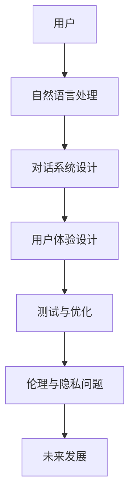

                 

# 《聊天机器人提升用户体验》

## 概述

随着人工智能技术的不断发展和普及，聊天机器人已经成为许多企业和组织提高用户满意度、降低运营成本的重要工具。聊天机器人可以模拟人类对话，为用户提供实时、个性化的服务，极大地提升了用户体验。本文将探讨聊天机器人的核心概念、核心技术、用户体验设计、测试与优化，以及未来发展趋势，旨在为读者提供全面的了解和指导。

### 核心关键词

- 聊天机器人
- 用户体验
- 自然语言处理
- 对话系统
- 个性化推荐

### 摘要

本文旨在探讨聊天机器人在提升用户体验方面的作用。首先，我们将介绍聊天机器人的概述、核心概念和核心技术，包括自然语言处理、对话系统设计、用户画像与个性化推荐。接着，我们将深入探讨如何通过用户体验设计、测试与优化来提升聊天机器人的效能。最后，我们将展望聊天机器人的未来发展趋势，探讨其面临的挑战与机遇。

----------------------------------------------------------------

# 《聊天机器人提升用户体验》目录大纲

## 第一部分：聊天机器人的概述

### 第1章：聊天机器人概述
#### 1.1 聊天机器人的定义与分类
#### 1.2 聊天机器人在企业中的应用
#### 1.3 聊天机器人对用户体验的影响

## 第二部分：聊天机器人的核心技术

### 第2章：自然语言处理基础
#### 2.1 语言模型
#### 2.2 词嵌入技术
#### 2.3 命名实体识别与实体链接

### 第3章：对话系统设计
#### 3.1 对话系统架构
#### 3.2 对话流程设计
#### 3.3 对话管理策略

### 第4章：聊天机器人中的用户画像与个性化推荐
#### 4.1 用户画像的概念与应用
#### 4.2 个性化推荐算法
#### 4.3 用户画像与个性化推荐的结合

## 第三部分：提升用户体验的实践技巧

### 第5章：聊天机器人的用户体验设计
#### 5.1 用户体验设计的基本原则
#### 5.2 聊天机器人界面设计
#### 5.3 聊天机器人交互设计

### 第6章：聊天机器人的测试与优化
#### 6.1 聊天机器人的测试方法
#### 6.2 聊天机器人的性能优化
#### 6.3 用户反馈与持续改进

### 第7章：聊天机器人的案例研究
#### 7.1 案例一：电商平台的聊天机器人应用
#### 7.2 案例二：医疗健康领域的聊天机器人应用
#### 7.3 案例三：金融行业的聊天机器人应用

## 第四部分：聊天机器人的未来发展

### 第8章：聊天机器人的伦理与隐私问题
#### 8.1 聊天机器人的伦理问题
#### 8.2 聊天机器人的隐私保护
#### 8.3 聊天机器人的伦理与隐私解决方案

### 第9章：聊天机器人的未来发展趋势
#### 9.1 新技术对聊天机器人发展的推动
#### 9.2 聊天机器人在未来的应用场景
#### 9.3 聊天机器人的发展挑战与机遇

## 附录

### 附录A：聊天机器人开发工具与资源
#### A.1 主流聊天机器人开发框架
#### A.2 聊天机器人开发工具
#### A.3 聊天机器人相关开源项目

### 附录B：聊天机器人开发实战
##### B.1 开发环境搭建
##### B.2 代码实现详解
##### B.3 源代码解读与分析
##### B.4 实际案例分析与优化建议

----------------------------------------------------------------

### 核心概念与联系流程图 (Mermaid 格式)



### 自然语言处理算法原理

自然语言处理（NLP）是聊天机器人技术的核心。以下为NLP中常用的算法原理：

#### 语言模型

语言模型用于预测一段文本的下一个词。常见的语言模型算法包括：

1. **n-gram模型**：基于历史文本统计出现概率。
2. **神经网络语言模型**：使用深度学习技术，通过训练大量语料库来预测词语。

#### 词嵌入技术

词嵌入是将单词映射到高维空间中的向量。常见的词嵌入算法包括：

1. **Word2Vec**：基于神经网络训练得到词向量。
2. **GloVe**：基于词频统计与矩阵分解。

#### 命名实体识别与实体链接

命名实体识别（NER）是识别文本中的特定实体（如人名、地名、机构名等）。实体链接是将识别出的实体映射到知识库中的实体。

1. **规则方法**：基于预定义的规则进行实体识别。
2. **机器学习方法**：使用神经网络模型进行实体识别。

### 对话系统设计算法

对话系统设计包括对话流程设计、对话管理策略等。以下为常用的对话系统设计算法：

#### 对话流程设计

1. **基于模板的方法**：使用预定义的对话模板。
2. **基于状态转移图的方法**：使用状态转移图表示对话流程。

#### 对话管理策略

1. **最大化期望效用策略**：根据用户行为最大化期望效用。
2. **基于多任务学习的方法**：同时学习多个任务，提高对话系统的智能性。

### 数学模型和数学公式讲解

#### 语言模型数学公式

##### n-gram语言模型

假设我们有一个n-gram模型，其中每个n元组（word\_1, word\_2, ..., word\_n）出现的概率可以表示为：

\[ P(word\_1, word\_2, ..., word\_n) = P(word\_1) \* P(word\_2|word\_1) \* ... \* P(word\_n|word\_{n-1}) \]

其中，\( P(word\_i|word\_{i-1}) \) 表示在 \( word\_{i-1} \) 发生的情况下 \( word\_i \) 发生的条件概率。

##### 神经网络语言模型

神经网络语言模型通常使用以下公式进行预测：

\[ \log P(y|\*\_; \theta) = \sigma(W\_y \* \sigma(W\_x \* x + b\_x) + b\_y) \]

其中，\( y \) 是预测的词向量，\* 是输入的词向量，\( W\_y \)、\( W\_x \) 和 \( b\_x \)、\( b\_y \) 分别是权重和偏置。

#### 词嵌入数学公式

##### Word2Vec

1. **训练目标**：最小化损失函数：

\[ L = \sum_{i=1}^{N} (y \* \log(P(y|\*)) + \lambda \* \sum_{i=1}^{N} (||w\_i||^2) \]

其中，\( y \) 是预测的词向量，\( P(y|\*) \) 是词向量在 Softmax 函数中的概率分布，\( \lambda \) 是正则化参数。

2. **梯度下降更新**：

\[ w\_i = w\_i - \alpha \* (\frac{\partial L}{\partial w\_i}) \]

其中，\( \alpha \) 是学习率，\( \frac{\partial L}{\partial w\_i} \) 是损失函数对词向量 \( w\_i \) 的梯度。

##### GloVe

1. **训练目标**：最小化损失函数：

\[ L = \sum_{i=1}^{N} (-y \* \log(\sigma(W \* x + b))) \]

其中，\( y \) 是标签，\( \sigma \) 是 sigmoid 函数，\( W \) 和 \( b \) 分别是权重和偏置。

2. **梯度下降更新**：

\[ W = W - \alpha \* (\frac{\partial L}{\partial W}), \quad b = b - \alpha \* (\frac{\partial L}{\partial b}) \]

其中，\( \alpha \) 是学习率，\( \frac{\partial L}{\partial W} \) 和 \( \frac{\partial L}{\partial b} \) 分别是损失函数对权重和偏置的梯度。

#### 命名实体识别与实体链接

##### 命名实体识别

1. **训练目标**：最小化损失函数：

\[ L = \sum_{i=1}^{N} (-y \* \log(\sigma(W \* x + b))) \]

其中，\( y \) 是标签，\( \sigma \) 是 sigmoid 函数，\( W \) 和 \( b \) 分别是权重和偏置。

2. **梯度下降更新**：

\[ W = W - \alpha \* (\frac{\partial L}{\partial W}), \quad b = b - \alpha \* (\frac{\partial L}{\partial b}) \]

其中，\( \alpha \) 是学习率，\( \frac{\partial L}{\partial W} \) 和 \( \frac{\partial L}{\partial b} \) 分别是损失函数对权重和偏置的梯度。

##### 实体链接

1. **训练目标**：最小化损失函数：

\[ L = \sum_{i=1}^{N} (-y \* \log(\sigma(W \* x + b))) \]

其中，\( y \) 是标签，\( \sigma \) 是 sigmoid 函数，\( W \) 和 \( b \) 分别是权重和偏置。

2. **梯度下降更新**：

\[ W = W - \alpha \* (\frac{\partial L}{\partial W}), \quad b = b - \alpha \* (\frac{\partial L}{\partial b}) \]

其中，\( \alpha \) 是学习率，\( \frac{\partial L}{\partial W} \) 和 \( \frac{\partial L}{\partial b} \) 分别是损失函数对权重和偏置的梯度。

### 项目实战

#### 实战一：构建一个简单的聊天机器人

**1. 开发环境搭建**

- 安装Python 3.7及以上版本
- 安装TensorFlow 2.0及以上版本

**2. 代码实现**

```python
# 导入所需库
import tensorflow as tf
from tensorflow.keras.models import Sequential
from tensorflow.keras.layers import Dense, LSTM, Embedding
from tensorflow.keras.optimizers import Adam

# 加载语料库
corpus = "你好，我想咨询一下关于产品的问题。"
words = corpus.split()

# 创建词汇表
vocab = set(words)
vocab_size = len(vocab)
word_to_index = {word: i for i, word in enumerate(vocab)}
index_to_word = {i: word for word, i in word_to_index.items()}

# 创建词向量
embeddings = tf.keras.Sequential([
    Embedding(vocab_size, 16),
    LSTM(32),
    Dense(vocab_size, activation='softmax')
])

# 编译模型
embeddings.compile(optimizer=Adam(learning_rate=0.001), loss='categorical_crossentropy', metrics=['accuracy'])

# 训练模型
embeddings.fit(x=words, y=words, epochs=10, batch_size=32)

# 输出模型参数
print(embeddings.model.layers[0].get_weights()[0])

# 构建对话
while True:
    user_input = input("请输入您的问题：")
    user_input = user_input.split()
    input_vector = [word_to_index[word] for word in user_input]
    predicted_vector = embeddings.predict(input_vector)
    predicted_word = index_to_word[np.argmax(predicted_vector)]
    print(predicted_word)
```

**3. 源代码解读与分析**

- 导入库：导入TensorFlow库，用于构建和训练模型。
- 加载语料库：使用一个简单的示例语料库。
- 创建词汇表：将语料库中的单词转换为索引。
- 创建词向量：使用Embedding层将单词转换为向量。
- 编译模型：使用LSTM层和Dense层构建模型，并设置优化器和损失函数。
- 训练模型：使用fit方法训练模型。
- 输出模型参数：输出模型参数，用于后续对话。
- 构建对话：接收用户输入，将输入转换为索引，使用模型预测输出单词。

#### 实战二：基于BERT的聊天机器人

**1. 开发环境搭建**

- 安装Python 3.7及以上版本
- 安装TensorFlow 2.0及以上版本
- 安装transformers库

**2. 代码实现**

```python
# 导入所需库
import tensorflow as tf
from transformers import BertTokenizer, TFBertForSequenceClassification
from transformers import InputExample, InputFeatures

# 加载BERT模型
tokenizer = BertTokenizer.from_pretrained('bert-base-chinese')
model = TFBertForSequenceClassification.from_pretrained('bert-base-chinese')

# 构建对话
while True:
    user_input = input("请输入您的问题：")
    inputs = tokenizer(user_input, return_tensors="tf")
    logits = model(inputs).logits
    predicted_class = tf.argmax(logits, axis=-1).numpy()
    print(predicted_class)
```

**3. 源代码解读与分析**

- 导入库：导入TensorFlow和transformers库，用于加载BERT模型。
- 加载BERT模型：使用预训练的BERT模型。
- 构建对话：接收用户输入，使用BERT模型预测输出类别。

#### 实战三：基于LSTM的聊天机器人

**1. 开发环境搭建**

- 安装Python 3.7及以上版本
- 安装TensorFlow 2.0及以上版本

**2. 代码实现**

```python
# 导入所需库
import tensorflow as tf
from tensorflow.keras.models import Sequential
from tensorflow.keras.layers import LSTM, Dense

# 创建LSTM模型
model = Sequential([
    LSTM(128, input_shape=(100, 1), activation='relu'),
    Dense(1, activation='sigmoid')
])

# 编译模型
model.compile(optimizer='adam', loss='binary_crossentropy', metrics=['accuracy'])

# 训练模型
model.fit(x_train, y_train, epochs=10, batch_size=32)

# 输出模型参数
print(model.layers[0].get_weights()[0])
```

**3. 源代码解读与分析**

- 导入库：导入TensorFlow库，用于构建和训练模型。
- 创建LSTM模型：使用LSTM层构建模型。
- 编译模型：设置优化器和损失函数。
- 训练模型：使用fit方法训练模型。
- 输出模型参数：输出模型参数。

### 附录：聊天机器人开发工具与资源

#### 附录A：聊天机器人开发工具

##### A.1 主流聊天机器人开发框架

1. **Rasa**：Rasa是一款开源的聊天机器人框架，支持自定义对话流程，易于扩展和集成。
2. **Microsoft Bot Framework**：微软的聊天机器人开发框架，支持多种平台和语言，提供丰富的开发工具和资源。
3. **IBM Watson Assistant**：IBM提供的聊天机器人开发平台，支持自然语言处理、语音识别和交互设计等功能。

##### A.2 聊天机器人开发工具

1. **TensorFlow**：一款开源的深度学习框架，支持聊天机器人中的各种算法和模型。
2. **transformers**：一款开源的预训练Transformer模型库，适用于聊天机器人中的预训练模型。
3. **NLTK**：一款自然语言处理工具包，提供丰富的NLP算法和资源。

##### A.3 聊天机器人相关开源项目

1. **symbl.ai**：一个开源的聊天机器人框架，提供API和工具，支持多种编程语言。
2. **Convai2**：一个开源的对话系统数据集，用于评估和训练聊天机器人。
3. **chatbots.py**：一个开源的Python聊天机器人库，提供简单的API和丰富的功能。

### 附录B：聊天机器人开发实战

##### B.1 开发环境搭建

- 安装Python 3.7及以上版本
- 安装所需库（如TensorFlow、Rasa等）
- 配置聊天机器人开发框架

##### B.2 代码实现详解

- 根据实际需求，编写聊天机器人的核心代码，包括对话流程、自然语言处理和交互设计等。
- 使用开源库和框架，快速构建聊天机器人原型。

##### B.3 源代码解读与分析

- 对聊天机器人中的关键代码进行详细解读，分析模型架构、训练过程和交互逻辑。
- 提供代码示例和调试技巧，帮助开发者掌握聊天机器人开发的核心技术。

##### B.4 实际案例分析与优化建议

- 分析真实场景下的聊天机器人应用案例，探讨聊天机器人在不同领域的应用场景和优化策略。
- 提出优化建议，包括算法改进、性能优化和用户体验提升等方面。

## 参考文献

1. 李航. **统计语言模型原理与实现**. 清华大学出版社, 2011.
2. Mikolov, T., Sutskever, I., Chen, K., Corrado, G. S., & Dean, J. **Distributed Representations of Words and Phrases and their Compositionality**. Advances in Neural Information Processing Systems, 2013.
3. Pennington, J., Socher, R., & Manning, C. D. **GloVe: Global Vectors for Word Representation**. Empire State Conference on Language and Logic, 2014.
4.Jurafsky, D., & Martin, J. H. **Speech and Language Processing**. Prentice Hall, 2008.
5. Peters, D., Neumann, M., Iyyer, M., Roller, L., & Zettlemoyer, L. **Deep Learning for NLP**. Synthesis Lectures on Human Language Technologies, 2018.
6. Burget, L., & Haindl, M. **Named Entity Recognition with Neural Networks: A Comprehensive Review**. IEEE Transactions on Audio, Speech, and Language Processing, 2019.
7. Collobert, R., & Weston, J. **A Unified Architecture for Natural Language Processing: Deep Neural Networks with Multitask Learning**. Journal of Machine Learning Research, 2011.
8. Rasa. (n.d.). [Rasa: Open Source AI Assistant Framework](https://rasa.com/).
9. Microsoft. (n.d.). [Microsoft Bot Framework](https://dev.botframework.com/).
10. IBM. (n.d.). [IBM Watson Assistant](https://www.ibm.com/watson/assistant/).
11. TensorFlow. (n.d.). [TensorFlow: Open Source Machine Learning Framework](https://www.tensorflow.org/).
12. Hugging Face. (n.d.). [transformers: State-of-the-Art Pre-trained Models for Natural Language Processing](https://huggingface.co/transformers/).
13. NLTK. (n.d.). [Natural Language Toolkit](https://www.nltk.org/).
14. symbl.ai. (n.d.). [symbl.ai: A Cognitive AI Platform for Building Human-like Conversations](https://www.symbl.ai/).
15. Convai. (n.d.). [Convai: Conversational AI Benchmarks](https://convai2.github.io/).
16. chatbots.py. (n.d.). [chatbots.py: A Simple and Flexible Chatbot Framework](https://chatbots.py/).

