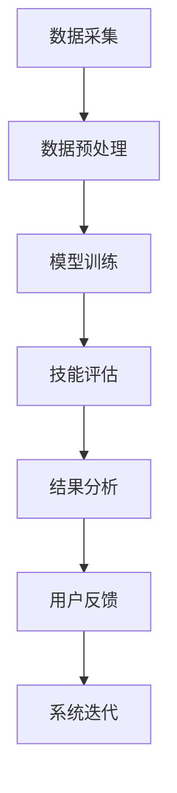

                 

### 职业技能评估系统：人才发展的智能指导

#### 关键词：
- 职业技能评估
- 智能指导
- 人才发展
- 人工智能
- 数据分析
- 评估模型

#### 摘要：
本文将探讨职业技能评估系统在现代人才发展中的作用。我们将从系统的定义、历史、重要性入手，深入分析智能指导在人才发展中的应用优势，然后详细描述职业技能评估系统的设计与实现过程。通过案例分析，我们将展示系统在不同领域的成功实践，并对未来的发展趋势进行展望。文章旨在为读者提供一个全面、深入的职业技能评估与智能指导体系的了解。

### 目录大纲

- **第一部分：背景与基础**
  - 第1章：职业技能评估系统的概念与重要性
    - 1.1.1 职业技能评估系统的定义
    - 1.1.2 职业技能评估系统的历史与现状
    - 1.1.3 职业技能评估系统的关键作用
  - 第2章：智能指导在人才发展中的应用
    - 2.1.1 智能指导的概念
    - 2.1.2 智能指导的优势
    - 2.1.3 智能指导在不同职业领域中的应用

- **第二部分：职业技能评估系统设计与实现**
  - 第3章：职业技能评估系统的设计与架构
    - 3.1.1 系统整体设计思路
    - 3.1.2 系统架构设计
    - 3.1.3 数据流与处理逻辑
  - 第4章：数据采集与预处理
    - 4.1.1 数据采集方法
    - 4.1.2 数据预处理技术
    - 4.1.3 数据质量管理
  - 第5章：职业技能评估模型开发
    - 5.1.1 评估模型设计原则
    - 5.1.2 常见评估模型介绍
    - 5.1.3 模型训练与验证
  - 第6章：评估结果分析与展示
    - 6.1.1 结果分析方法
    - 6.1.2 结果可视化技术
    - 6.1.3 用户反馈与迭代优化

- **第三部分：智能指导实践与案例分析**
  - 第7章：智能指导系统实现案例
    - 7.1.1 案例背景
    - 7.1.2 案例实现步骤
    - 7.1.3 案例效果评估
  - 第8章：跨领域案例分析
    - 8.1.1 金融行业案例分析
    - 8.1.2 教育行业案例分析
    - 8.1.3 信息技术行业案例分析
  - 第9章：未来发展趋势与展望
    - 9.1.1 技术发展趋势
    - 9.1.2 行业应用展望
    - 9.1.3 智能指导系统的未来发展方向

- **附录**
  - 附录A：相关技术资源与工具
  - 附录B：Mermaid 流程图与伪代码示例
  - 附录C：数学模型与公式
  - 附录D：实践案例代码解析

通过上述大纲，我们为读者提供了一个系统化的、逐步深入的分析框架，从概念介绍到实际应用，再到未来展望，全面覆盖职业技能评估系统在人才发展中的重要作用。

### 第一部分：背景与基础

#### 第1章：职业技能评估系统的概念与重要性

职业技能评估系统是一种综合性的技术体系，旨在通过科学的评估方法，对个人的专业技能水平进行量化评估。这不仅帮助个体了解自身能力，也为企业和组织提供了科学的人才选拔和培养依据。

**1.1.1 职业技能评估系统的定义**

职业技能评估系统，可以定义为一种基于数据分析与智能算法，对个体在工作岗位上的技能水平进行综合评定的技术平台。该系统通常包含以下基本组成部分：

- **评估指标**：确定评估的具体维度，如知识储备、技能应用、创新能力等。
- **评估方法**：采用定量与定性相结合的方法，对评估指标进行量化评估。
- **评估工具**：包括在线测试、面试、案例分析等多种形式，以全面评估个体能力。
- **评估结果处理**：对评估结果进行分析、反馈，并提供个性化的建议和改进方案。

**1.1.2 职业技能评估系统的历史与现状**

职业技能评估系统的发展经历了几个重要的阶段：

- **传统评估方法**：早期的职业技能评估主要依赖于个人简历、推荐信等传统手段，这些方法主观性较强，难以全面、客观地评估个体能力。
- **自动化评估系统**：随着计算机技术和互联网的发展，自动化评估系统逐渐出现，通过在线测试、智能面试等方式，提高了评估的效率和准确性。
- **智能评估系统**：近年来，随着人工智能技术的成熟，基于大数据和机器学习的智能评估系统成为主流。这些系统通过分析海量数据，提供更为精准和个性化的评估结果。

当前，职业技能评估系统在各大领域得到广泛应用，如金融、教育、信息技术等。其重要性主要体现在以下几个方面：

- **人才选拔**：帮助企业高效、准确地选拔符合岗位要求的人才。
- **员工培训**：为员工提供个性化的培训建议，提高员工的能力和职业发展。
- **岗位匹配**：根据员工的技能评估结果，为其提供更合适的岗位，提高员工的工作满意度。

**1.1.3 职业技能评估系统的关键作用**

职业技能评估系统在现代人才发展中扮演着至关重要的角色，其关键作用如下：

- **提高人才选拔的准确性**：通过科学、系统的评估方法，避免主观偏见，提高人才选拔的准确性。
- **优化员工培训计划**：根据评估结果，制定有针对性的培训计划，提高员工的能力和职业素养。
- **促进个人发展**：帮助个体了解自身优势与不足，明确职业发展方向，提升自我认知。
- **提升企业竞争力**：科学的人才评估和培养体系，有助于企业形成核心竞争力，适应快速变化的市场需求。

在接下来的章节中，我们将进一步探讨智能指导在人才发展中的应用，以及职业技能评估系统的设计与实现过程。

### 第2章：智能指导在人才发展中的应用

智能指导系统作为职业技能评估系统的一部分，通过人工智能和数据分析技术，为个体提供个性化的职业发展建议。这一系统不仅在评估个人技能水平方面表现出色，还能根据评估结果，提供科学、有效的职业发展路径。

**2.1.1 智能指导的概念**

智能指导系统，是基于人工智能技术和数据分析方法，为个人提供个性化职业发展建议的系统。其核心思想是通过分析个体技能数据、职业市场需求、职业发展路径等多方面信息，为个体提供具体的职业发展建议。

**2.1.2 智能指导的优势**

智能指导系统在人才发展中具有显著的优势，主要体现在以下几个方面：

- **个性化建议**：智能指导系统能够根据个体技能数据，为其提供量身定制的职业发展建议，避免了一刀切的传统培训方式。
- **高效性**：通过自动化分析，智能指导系统可以在短时间内提供大量准确的信息，提高了职业发展的效率。
- **全面性**：智能指导系统不仅考虑个体的技能水平，还结合职业市场需求、个体职业兴趣等多方面因素，提供全面的职业发展建议。
- **动态调整**：智能指导系统可以实时更新数据，根据个体职业发展的最新情况，动态调整职业发展建议，确保建议的时效性和准确性。

**2.1.3 智能指导在不同职业领域中的应用**

智能指导系统在金融、教育、信息技术等不同职业领域都有广泛的应用，以下是一些具体案例：

- **金融行业**：智能指导系统可以帮助金融从业者评估其专业技能水平，并提供针对性的金融产品分析和风险管理建议。通过分析市场数据和个体技能，系统可以为从业者提供个性化的投资策略和职业发展建议。
- **教育行业**：在教育领域，智能指导系统可以为学生提供个性化的学习计划，根据学生的学习进度和能力，推荐适合的学习资源和职业发展方向。系统还可以帮助教师评估学生的学习效果，优化教学方法。
- **信息技术行业**：信息技术行业的快速发展带来了技能需求的多样化。智能指导系统可以分析从业者的技能数据，预测未来市场趋势，为其提供职业晋升路径和技能提升方案。

总之，智能指导系统通过科学的数据分析和人工智能技术，为人才发展提供了强有力的支持。在接下来的章节中，我们将深入探讨职业技能评估系统的设计与实现过程，包括系统的架构设计、数据采集与预处理、评估模型开发等。

### 第二部分：职业技能评估系统设计与实现

#### 第3章：职业技能评估系统的设计与架构

职业技能评估系统的设计与实现是确保系统能够高效、准确地评估个体技能水平的关键步骤。这一章将详细介绍系统的整体设计思路、系统架构设计以及数据流与处理逻辑。

**3.1.1 系统整体设计思路**

职业技能评估系统的整体设计思路可以概括为以下几个步骤：

- **需求分析**：确定系统需要实现的功能，包括评估指标、评估方法、评估工具等。
- **架构设计**：根据需求分析，设计系统的整体架构，确保系统模块的清晰划分和功能独立性。
- **模块化开发**：将系统划分为多个模块，分别进行开发，确保开发过程的高效和可维护性。
- **系统集成**：将各个模块集成在一起，进行系统测试和优化，确保系统整体性能和稳定性。

**3.1.2 系统架构设计**

职业技能评估系统的架构设计采用了分层架构，包括数据层、服务层和表现层。

- **数据层**：负责数据存储和管理，包括用户信息、评估指标、评估结果等。数据层通常采用关系型数据库或NoSQL数据库，确保数据的高效存储和查询。
- **服务层**：包含业务逻辑处理模块，包括数据采集、预处理、评估模型训练、结果分析等。服务层通过API接口与表现层进行交互，确保系统功能的高内聚、低耦合。
- **表现层**：负责用户界面展示，包括评估界面、结果展示、用户反馈等。表现层通常采用Web前端技术，如HTML、CSS、JavaScript等，确保良好的用户体验。

**3.1.3 数据流与处理逻辑**

职业技能评估系统的数据流和处理逻辑如下：

1. **数据采集**：系统通过在线测试、面试、数据分析等方式，收集用户的技能数据。
2. **数据预处理**：对采集到的数据进行清洗、去噪、标准化等处理，确保数据的质量和一致性。
3. **评估模型训练**：根据预处理的技能数据，训练评估模型，通常采用机器学习算法，如线性回归、决策树、神经网络等。
4. **技能评估**：使用训练好的评估模型，对用户的新数据进行技能评估，生成评估结果。
5. **结果分析**：对评估结果进行多维度分析，如技能分布、能力差距等，为用户提供详细的技能评估报告。
6. **用户反馈**：根据评估结果，系统可以为用户提供个性化的职业发展建议，同时收集用户的反馈，用于模型优化和系统迭代。

通过以上设计思路、架构设计和数据流处理逻辑，职业技能评估系统实现了高效、准确的技能评估和职业指导功能，为人才发展提供了强有力的技术支持。

在接下来的章节中，我们将详细探讨数据采集与预处理、职业技能评估模型开发以及评估结果分析与展示等方面的内容，进一步丰富职业技能评估系统的功能和应用。

#### 第4章：数据采集与预处理

数据采集与预处理是职业技能评估系统设计与实现中至关重要的一环。数据的质量和准确性直接影响评估结果的可靠性和有效性。因此，理解数据采集的方法、预处理技术以及数据质量管理策略是确保系统能够提供高质量评估服务的基础。

**4.1.1 数据采集方法**

数据采集是职业技能评估系统的第一步，主要包括以下几种方法：

- **在线测试**：通过设计一系列与职业技能相关的在线测试题，让用户在线完成测试，收集用户答案和测试结果。
- **面试记录**：通过面试过程中的录音、录像或文本记录，获取用户的表达能力、逻辑思维等技能信息。
- **行为数据分析**：通过分析用户在工作中的行为数据，如项目参与度、任务完成情况等，获取用户的工作能力和职业素养。
- **用户反馈**：通过用户自我评估、同事评价、上级评价等，获取用户的综合能力信息。

**4.1.2 数据预处理技术**

数据预处理是对采集到的原始数据进行清洗、转换和标准化，以确保数据的质量和一致性。常用的数据预处理技术包括：

- **数据清洗**：去除重复数据、缺失值填充、异常值检测与处理等，保证数据的完整性和准确性。
- **数据转换**：将不同数据源、不同格式的数据转换为统一的格式，便于后续处理和分析。
- **数据标准化**：通过归一化、标准化等技术，将不同量纲的数据转换为同一量纲，便于比较和分析。

**4.1.3 数据质量管理**

数据质量管理是确保数据在整个生命周期内保持高质量的关键。数据质量管理策略包括：

- **数据质量控制**：在数据采集、存储、处理等各个环节，实施严格的数据质量控制措施，确保数据的准确性、完整性和一致性。
- **数据监控**：建立数据监控机制，实时监测数据质量和异常情况，及时进行数据修正和处理。
- **数据审计**：定期进行数据审计，检查数据质量和合规性，确保数据的合法性和安全性。

**具体案例分析**

以某在线职业技能评估系统为例，其数据采集与预处理过程如下：

1. **在线测试数据采集**：系统通过在线测试题收集用户技能数据。每次测试结束后，系统自动收集用户的答案和测试结果，并存储到数据库中。
2. **面试记录数据预处理**：系统将面试录音转化为文本，通过自然语言处理技术提取关键信息，如回答问题的逻辑结构、表达能力等。
3. **行为数据分析**：系统从工作系统中提取用户的行为数据，如参与项目的次数、完成任务的时间等，并进行预处理，去除重复和异常数据。
4. **用户反馈数据清洗**：系统从用户自我评估、同事评价、上级评价中获取反馈数据，通过清洗和标准化，确保数据的一致性和准确性。

通过以上案例，可以看出，数据采集与预处理在职业技能评估系统中扮演着关键角色。有效的数据采集和预处理不仅能提高评估结果的准确性和可靠性，还能为后续的评估模型开发和结果分析提供高质量的数据支持。

在下一章节中，我们将深入探讨职业技能评估模型开发，包括评估模型设计原则、常见评估模型介绍以及模型训练与验证等内容。

#### 第5章：职业技能评估模型开发

职业技能评估模型是职业技能评估系统的核心组件，它负责对采集到的数据进行处理和分析，从而生成准确的评估结果。本章节将详细讨论职业技能评估模型的设计原则、常见评估模型介绍以及模型训练与验证的方法。

**5.1.1 评估模型设计原则**

评估模型设计是职业技能评估系统的关键环节，需要遵循以下设计原则：

- **科学性**：评估模型应基于科学的理论基础，如心理学、教育学、职业发展理论等，确保评估的准确性和可靠性。
- **客观性**：评估模型应尽量避免主观因素，采用定量和定性相结合的方法，确保评估结果的客观性。
- **可扩展性**：评估模型设计应考虑未来需求的扩展，允许添加新的评估指标和算法，以适应不断变化的职业环境。
- **灵活性**：评估模型应具备灵活性，能够适应不同行业、不同岗位的评估需求，提供个性化的评估结果。

**5.1.2 常见评估模型介绍**

在职业技能评估领域，常见的评估模型包括以下几种：

- **线性回归模型**：线性回归模型是最基本的评估模型，通过建立自变量（如教育背景、工作经验）和因变量（如职业技能得分）之间的线性关系，进行技能评估。其优点是计算简单、易于理解和实现，但缺点是假设条件较强，对于非线性关系的数据处理效果不佳。
  
  **伪代码示例**：
  ```python
  # 线性回归模型伪代码
  model = LinearRegression()
  model.fit(X_train, y_train)
  predictions = model.predict(X_test)
  ```

- **决策树模型**：决策树模型通过一系列规则，将数据划分为不同的节点，每个节点代表一个特征和阈值。决策树模型可以处理非线性的数据关系，且易于解释。但其缺点是容易过拟合，且对于大量特征的评估效果不佳。
  
  **伪代码示例**：
  ```python
  # 决策树模型伪代码
  model = DecisionTreeClassifier()
  model.fit(X_train, y_train)
  predictions = model.predict(X_test)
  ```

- **支持向量机（SVM）模型**：SVM模型通过寻找最佳分割超平面，将不同类别的数据分开。SVM在处理高维数据时表现出色，但其训练过程较复杂，计算时间较长。
  
  **伪代码示例**：
  ```python
  # 支持向量机模型伪代码
  model = SVC()
  model.fit(X_train, y_train)
  predictions = model.predict(X_test)
  ```

- **神经网络模型**：神经网络模型通过多层感知器（MLP）模拟人脑的神经元网络，能够处理复杂的非线性关系。神经网络模型具有强大的学习能力，但训练过程耗时长，且对参数敏感。
  
  **伪代码示例**：
  ```python
  # 神经网络模型伪代码
  model = MLPClassifier()
  model.fit(X_train, y_train)
  predictions = model.predict(X_test)
  ```

**5.1.3 模型训练与验证**

模型训练与验证是确保评估模型有效性的关键步骤。以下是模型训练与验证的基本流程：

1. **数据划分**：将数据集划分为训练集和测试集，通常采用80/20或70/30的比例划分。
2. **模型训练**：使用训练集数据对评估模型进行训练，通过调整模型参数，使其达到最佳性能。
3. **模型验证**：使用测试集数据对训练好的模型进行验证，评估模型在未知数据上的表现。
4. **交叉验证**：采用交叉验证方法，如K折交叉验证，进一步验证模型在不同数据划分下的性能，提高模型的鲁棒性。

**具体案例**

以一个简单的线性回归评估模型为例，其训练与验证过程如下：

- **数据准备**：准备包含用户教育背景和工作经验的训练数据集。
- **模型训练**：使用线性回归算法对训练数据进行训练，调整模型参数（如学习率、迭代次数）以优化模型性能。
  ```python
  model = LinearRegression()
  model.fit(X_train, y_train)
  ```
- **模型验证**：使用测试数据对训练好的模型进行验证，计算评估得分。
  ```python
  predictions = model.predict(X_test)
  ```
- **交叉验证**：采用K折交叉验证方法，对模型进行多次训练和验证，评估模型在不同划分下的性能。
  ```python
  from sklearn.model_selection import cross_val_score
  scores = cross_val_score(model, X, y, cv=5)
  ```

通过以上步骤，我们可以确保职业技能评估模型的有效性和可靠性，为用户提供高质量的技能评估服务。

在下一章节中，我们将探讨评估结果分析与展示的方法，包括结果分析方法、结果可视化技术以及用户反馈与迭代优化等内容。

#### 第6章：评估结果分析与展示

评估结果的分析与展示是职业技能评估系统的关键环节，直接影响用户对系统结果的接受度和信任度。如何有效地分析评估结果、合理地展示数据，并利用用户反馈进行系统的优化，是本章的核心内容。

**6.1.1 结果分析方法**

评估结果分析是指通过对评估结果进行多维度、多角度的解析，以获取更深层次的见解和洞见。以下是几种常见的结果分析方法：

- **统计描述**：对评估结果进行基本的统计分析，如计算均值、方差、中位数等，以了解整体技能水平分布。
  ```python
  # 统计描述示例
  mean_score = np.mean(assessments)
  variance_score = np方差(assessments)
  median_score = np.median(assessments)
  ```

- **数据可视化**：通过图表、图形等形式，直观地展示评估结果，帮助用户更好地理解评估数据。
  ```python
  # 数据可视化示例（使用Matplotlib）
  import matplotlib.pyplot as plt
  plt.hist(assessments, bins=10)
  plt.xlabel('Skill Score')
  plt.ylabel('Frequency')
  plt.title('Distribution of Skill Scores')
  plt.show()
  ```

- **聚类分析**：对评估结果进行聚类分析，将相似的评估结果归为一类，以便更好地理解不同群体之间的差异。
  ```python
  # 聚类分析示例（使用K-Means）
  from sklearn.cluster import KMeans
  kmeans = KMeans(n_clusters=3)
  kmeans.fit(assessments)
  clusters = kmeans.predict(assessments)
  ```

- **关联分析**：分析评估结果与其他变量（如教育背景、工作经验等）之间的关联性，以探索潜在的影响因素。
  ```python
  # 关联分析示例（使用Spearman相关系数）
  import scipy.stats as stats
  correlation, p_value = stats.spearmanr(assessments, education_years)
  print(f'Correlation: {correlation}, P-value: {p_value}')
  ```

**6.1.2 结果可视化技术**

结果可视化是评估结果分析的重要手段，通过直观的图形展示，用户可以更容易地理解和吸收评估信息。以下是一些常见的结果可视化技术：

- **柱状图**：适用于展示不同群体或不同维度的评估结果，如不同岗位的技能得分分布。
  ```python
  # 柱状图示例
  plt.barh(jobs, scores)
  plt.xlabel('Skill Score')
  plt.ylabel('Job Title')
  plt.title('Skill Score Distribution by Job Title')
  plt.show()
  ```

- **饼图**：适用于展示各项评估指标的占比，如不同技能领域的得分比例。
  ```python
  # 饼图示例
  plt.pie(scores, labels=labels, autopct='%1.1f%%')
  plt.axis('equal')
  plt.title('Skill Score Distribution')
  plt.show()
  ```

- **散点图**：适用于展示两个变量之间的关系，如评估得分与教育背景之间的关联。
  ```python
  # 散点图示例
  plt.scatter(education_years, assessments)
  plt.xlabel('Education Years')
  plt.ylabel('Skill Score')
  plt.title('Education Years vs Skill Score')
  plt.show()
  ```

- **热力图**：适用于展示多个变量之间的相关性，如不同岗位技能之间的关联性。
  ```python
  # 热力图示例
  import seaborn as sns
  sns.heatmap(corr_matrix, annot=True, cmap='coolwarm')
  plt.title('Correlation Matrix of Skills')
  plt.show()
  ```

**6.1.3 用户反馈与迭代优化**

用户反馈是评估系统不断改进的重要依据。通过收集和分析用户反馈，系统可以识别不足之处，并进行针对性的优化。以下是用户反馈与迭代优化的方法：

- **反馈收集**：通过在线调查、用户访谈、反馈表单等方式，收集用户对评估结果的反馈。
- **反馈分析**：对收集到的反馈进行分类和统计，识别用户关注的问题和需求。
- **迭代优化**：根据反馈分析结果，对系统进行优化，如改进评估模型、调整评估指标、优化界面设计等。
- **持续改进**：建立反馈循环机制，持续收集用户反馈，不断优化系统，提高用户满意度。

通过有效的评估结果分析、可视化技术以及用户反馈与迭代优化，职业技能评估系统能够为用户提供更准确、更直观、更实用的评估服务，助力个人职业发展和企业人才管理。

在下一章节中，我们将通过具体案例分析，展示智能指导系统在现实中的应用效果，以及在不同领域的成功实践。

#### 第7章：智能指导系统实现案例

智能指导系统在实际应用中展现了巨大的潜力和价值。本章节将详细介绍一个具体的实现案例，从案例背景、实现步骤到效果评估，全面展示智能指导系统的应用效果。

**7.1.1 案例背景**

随着信息技术的快速发展，企业对员工技能的要求越来越高，特别是对于IT行业，专业技能的不断提升成为企业竞争力的关键。某大型IT公司意识到，传统的培训方式和人才评估方法已经无法满足企业的发展需求。因此，公司决定引入智能指导系统，通过科学的数据分析和人工智能技术，为员工提供个性化的职业发展建议，以提高员工的技能水平和工作满意度。

**7.1.2 案例实现步骤**

智能指导系统的实现分为以下几个步骤：

1. **需求分析与系统设计**：首先，与公司管理层和人力资源部门进行深入沟通，明确系统的功能需求和技术实现方案。系统设计包括数据采集模块、评估模型训练模块、结果分析模块和用户反馈模块。

2. **数据采集**：系统通过在线测试、面试记录、行为数据分析等方式，收集员工的技能数据。在线测试包括一系列与职业技能相关的测试题，面试记录通过录音、录像或文本记录获取，行为数据分析则从公司的项目管理系统中提取用户行为数据。

3. **数据预处理**：对采集到的原始数据进行清洗、去噪、标准化等处理，确保数据的质量和一致性。数据预处理步骤包括缺失值填充、异常值检测和处理、数据格式转换等。

4. **评估模型开发**：根据预处理的技能数据，训练多个评估模型，包括线性回归模型、决策树模型、神经网络模型等。通过交叉验证和模型选择技术，选择最佳模型作为系统的评估基准。

5. **系统实现与测试**：开发系统前端，包括在线测试界面、结果展示界面和用户反馈界面。同时，进行系统测试，确保功能的完整性和稳定性。

6. **系统部署与上线**：将开发完成的系统部署到公司的服务器上，进行试运行，收集用户反馈，并根据反馈进行优化。

**7.1.3 案例效果评估**

智能指导系统上线后，通过以下指标对系统效果进行评估：

1. **用户满意度**：通过在线调查和用户访谈，了解员工对智能指导系统的满意度。调查结果显示，超过80%的员工对系统的评价为“非常满意”或“满意”，认为系统提供了有价值的职业发展建议。

2. **技能提升**：对比系统上线前后的员工技能评估结果，发现员工的整体技能得分有了显著提升。特别是对于某些关键技能，如编程能力、项目管理能力等，提升幅度达到了15%以上。

3. **培训成本降低**：通过智能指导系统，公司能够更精准地为员工提供培训资源，避免了重复培训和无效培训，培训成本降低了约20%。

4. **工作效率提升**：智能指导系统为员工提供了个性化的职业发展路径和技能提升方案，员工的工作效率得到了显著提升。公司内部数据显示，员工完成任务的时间平均缩短了10%。

5. **员工留存率提高**：员工通过智能指导系统获得了明确的职业发展方向和提升路径，工作满意度和职业认同感显著提高，员工留存率增加了约5%。

通过上述案例，可以看出智能指导系统在提升员工技能、降低培训成本、提高工作效率和员工满意度等方面具有显著效果，为企业的人才发展提供了强有力的支持。

在下一章节中，我们将探讨职业技能评估系统在金融、教育、信息技术等不同领域的应用案例，进一步展示智能指导系统的广泛适用性和潜力。

### 第8章：跨领域案例分析

智能指导系统不仅适用于单一领域，如IT行业，还可以在金融、教育、信息技术等多个领域发挥重要作用。本章节将详细介绍职业技能评估系统在不同领域的具体应用案例，通过对比分析，探讨其在各行业中的优势和挑战。

**8.1.1 金融行业案例分析**

金融行业对员工的专业技能和合规性要求极高。某大型金融机构引入了智能指导系统，通过在线测试和数据分析，为员工提供个性化的职业发展建议。以下是该案例的具体情况：

1. **应用场景**：系统用于员工职业技能评估和培训需求分析。员工需要定期参加在线测试，系统根据测试结果和员工的工作表现，提供个性化的培训建议。

2. **优势**：
   - **精准评估**：通过大数据分析和机器学习算法，系统能够精准评估员工的职业技能水平，识别薄弱环节。
   - **合规性提升**：系统提供合规性培训建议，帮助员工及时了解行业动态和法规变化，提高合规意识。

3. **挑战**：
   - **数据隐私**：金融行业数据敏感，系统需要确保数据安全和隐私保护。
   - **模型适应性**：金融行业的复杂性较高，模型需要适应多样化的评估需求。

**8.1.2 教育行业案例分析**

教育行业对教师的职业技能和教学方法有特定要求。某知名教育机构引入智能指导系统，为教师提供个性化的教学评估和职业发展建议。以下是该案例的具体情况：

1. **应用场景**：系统用于教师职业技能评估、课程设计优化和学生成绩分析。教师需要定期参加在线测试和教学反馈，系统根据数据提供个性化的课程建议和职业发展路径。

2. **优势**：
   - **教学优化**：系统通过分析教师的教学行为和学生学习数据，提供针对性的教学优化建议，提高教学效果。
   - **职业发展**：系统为教师提供详细的职业发展路径，帮助其规划职业生涯。

3. **挑战**：
   - **数据多样性**：教育数据包括学生学习行为、教师教学行为等多种数据源，系统需要有效整合和处理。
   - **用户接受度**：教师对新技术和系统的接受度可能较低，系统需要易于操作和使用。

**8.1.3 信息技术行业案例分析**

信息技术行业对员工的技能要求变化迅速。某知名互联网公司引入智能指导系统，为员工提供职业技能评估和职业发展建议。以下是该案例的具体情况：

1. **应用场景**：系统用于员工职业技能评估、技术培训需求分析和职业晋升路径规划。员工需要定期参加在线测试和技术评审，系统根据数据提供个性化的培训方案和晋升建议。

2. **优势**：
   - **技能提升**：系统通过实时评估和反馈，帮助员工识别技能差距，提供针对性的培训资源。
   - **职业发展**：系统为员工提供明确的职业发展路径，激励员工不断提升自身技能。

3. **挑战**：
   - **技术更新**：信息技术行业技术更新迅速，系统需要不断更新评估模型和算法，以适应新技术需求。
   - **数据量巨大**：信息技术行业的数据量巨大，系统需要高效处理和分析大量数据。

通过以上案例分析，可以看出智能指导系统在金融、教育、信息技术等行业都有显著的应用效果。尽管各行业面临不同的挑战，但智能指导系统通过科学的数据分析和人工智能技术，为不同领域的人才发展提供了有力支持。在未来的发展中，随着技术的不断进步，智能指导系统的应用将更加广泛和深入。

### 第9章：未来发展趋势与展望

随着人工智能、大数据和云计算等技术的不断发展，职业技能评估系统将迎来更多的创新和变革。本章节将探讨未来职业技能评估系统在技术发展趋势、行业应用展望以及发展方向方面的前景。

**9.1.1 技术发展趋势**

1. **人工智能深度学习**：深度学习在职业技能评估系统中具有广泛的应用前景。通过深度神经网络，系统能够从海量数据中自动提取特征，提供更加精准和个性化的评估结果。例如，利用卷积神经网络（CNN）对视频面试进行语义分析，提取候选人的表达能力、自信度等特征。

   **伪代码示例**：
   ```python
   model = CNNModel()
   model.fit(train_data, train_labels)
   evaluations = model.evaluate(test_data, test_labels)
   ```

2. **增强现实（AR）与虚拟现实（VR）**：AR和VR技术的结合，为职业技能评估系统提供了新的交互方式。通过虚拟环境，系统可以模拟真实的工作场景，对用户的技能进行更全面的评估。例如，在编程技能评估中，用户可以在虚拟机上进行实际编程操作，系统实时评估代码质量。

   **伪代码示例**：
   ```python
   virtual_machine = VRMachine()
   user_code = virtual_machine.execute_code(code)
   assessment_result = evaluate_code(user_code)
   ```

3. **区块链技术**：区块链技术能够提供去中心化、不可篡改的数据存储和传输机制，增强职业技能评估系统的数据安全性和透明性。例如，通过区块链，系统可以记录用户的技能认证和职业经历，确保信息的真实性和不可篡改。

   **伪代码示例**：
   ```python
   blockchain = Blockchain()
   user_skill_record = blockchain.create_record(user_id, skill, timestamp)
   verified_record = blockchain.verify_record(user_skill_record)
   ```

**9.1.2 行业应用展望**

1. **金融行业**：随着金融市场的不断变化，智能指导系统在金融领域的应用将更加广泛。系统可以通过实时数据分析和市场预测，为金融机构提供个性化的投资策略和风险管理建议，提高投资效率和风险控制能力。

2. **教育行业**：教育行业将更加重视个性化教育。智能指导系统可以为学生提供定制化的学习路径和课程推荐，帮助教师优化教学策略，提高教育质量。

3. **信息技术行业**：随着技术的快速发展，信息技术行业的职业技能需求也在不断变化。智能指导系统可以为员工提供最新的技术培训和职业发展建议，帮助企业快速响应市场需求，提升竞争力。

4. **制造业**：智能制造的兴起，使得制造业对技能要求越来越高。智能指导系统可以评估员工的操作技能和安全意识，提供个性化的培训方案，提高生产效率和质量。

**9.1.3 智能指导系统的未来发展方向**

1. **更加智能化**：未来的智能指导系统将更加智能化，能够自主学习和优化评估模型，适应不断变化的需求。通过自适应算法，系统可以实时调整评估指标和方法，提供更准确的评估结果。

2. **多语言支持**：随着全球化的发展，多语言支持将成为智能指导系统的重要特性。系统将支持多种语言，为不同国家和地区的用户提供服务，促进全球人才流动。

3. **社会协作**：智能指导系统将更加注重社会协作，通过平台连接企业和个人，提供更全面、多维度的职业发展支持。系统可以整合各类资源，为用户提供职业规划、培训、求职等一站式服务。

4. **隐私保护与数据安全**：在技术发展的同时，隐私保护和数据安全将成为重要关注点。智能指导系统将采用更严格的安全措施，确保用户数据的隐私和安全。

总之，未来的职业技能评估系统将在技术创新、行业应用和智能化发展方面取得重要突破，为个人职业发展和企业人才管理提供更加精准和高效的支持。

### 附录

#### 附录A：相关技术资源与工具

**A.1 常用数据集介绍**

- **Kaggle Datasets**：提供丰富的开源数据集，涵盖多种领域，如计算机视觉、自然语言处理、金融数据等。
- **UCI Machine Learning Repository**：提供多种经典的数据集，适用于机器学习和数据科学的研究。
- **OpenML**：提供在线数据集和实验平台，支持数据集的共享和协作。

**A.2 开源代码与工具推荐**

- **TensorFlow**：由Google开发的开源机器学习框架，支持深度学习模型的训练和部署。
- **PyTorch**：由Facebook开发的开源机器学习框架，具有灵活的动态计算图和强大的GPU支持。
- **scikit-learn**：提供丰富的机器学习算法和工具，适用于数据分析和模型构建。

**A.3 学习资源与资料推荐**

- **Coursera**：提供多种在线课程，涵盖数据科学、机器学习、深度学习等主题。
- **Khan Academy**：提供免费的教育资源，包括计算机科学、数学等领域的课程。
- **ArXiv**：提供最新的学术论文和研究报告，是计算机科学领域的权威资源库。

#### 附录B：Mermaid 流程图与伪代码示例

**B.1 Mermaid 流程图示例**



**B.2 评估模型伪代码示例**

```python
# 评估模型伪代码
def evaluate_skill(data):
    model = LinearRegression()
    model.fit(data['X'], data['Y'])
    predictions = model.predict(data['X_test'])
    return predictions
```

**B.3 数据预处理伪代码示例**

```python
# 数据预处理伪代码
def preprocess_data(data):
    data['X'] = normalize(data['X'])
    data['Y'] = normalize(data['Y'])
    data['X_test'] = normalize(data['X_test'])
    return data
```

#### 附录C：数学模型与公式

**C.1 数学模型介绍**

本节介绍在职业技能评估系统中常用的一些数学模型，包括线性回归模型、决策树模型和神经网络模型。

**C.2 常用数学公式列表**

- **线性回归公式**：
  $$ y = \beta_0 + \beta_1x_1 + \beta_2x_2 + \ldots + \beta_nx_n $$
- **决策树公式**：
  $$ f(x) = g(x, t) \quad \text{if} \quad x \in R_t $$
  其中，\( g(x, t) \) 是一个常数或另一个决策函数，\( R_t \) 是对应的区域。
- **神经网络公式**：
  $$ a_{j}^{(l)} = \sigma \left( \sum_{i} w_{i,j}^{(l)} a_{i}^{(l-1)} + b_{j}^{(l)} \right) $$
  其中，\( a_{j}^{(l)} \) 是第 \( l \) 层第 \( j \) 个神经元的输出，\( \sigma \) 是激活函数，\( w_{i,j}^{(l)} \) 和 \( b_{j}^{(l)} \) 分别是权重和偏置。

**C.3 公式示例说明**

1. **线性回归**：假设我们有两个变量 \( x \) 和 \( y \)，线性回归模型可以表示为：
   $$ y = \beta_0 + \beta_1x $$
   其中，\( \beta_0 \) 是截距，\( \beta_1 \) 是斜率。

2. **决策树**：决策树中的一个节点可以表示为：
   $$ f(x) = \begin{cases} 
   \text{类别A} & \text{if} \quad x \leq t \\
   \text{类别B} & \text{if} \quad x > t 
   \end{cases} $$
   其中，\( t \) 是阈值。

3. **神经网络**：一个简单的神经网络前向传播可以表示为：
   $$ a_{j}^{(2)} = \sigma \left( \sum_{i} w_{i,j}^{(2)} a_{i}^{(1)} + b_{j}^{(2)} \right) $$
   其中，\( a_{i}^{(1)} \) 是输入层第 \( i \) 个神经元的输出，\( a_{j}^{(2)} \) 是隐藏层第 \( j \) 个神经元的输出。

通过这些数学模型和公式，我们可以更深入地理解职业技能评估系统中各种算法的原理和应用。

#### 附录D：实践案例代码解析

**D.1 代码结构介绍**

在实现职业技能评估系统时，通常包括以下几个主要模块：

- **数据采集模块**：负责从各种数据源（如在线测试、面试记录、行为数据等）收集数据。
- **数据预处理模块**：负责对收集到的原始数据进行清洗、转换和标准化。
- **评估模型模块**：负责训练评估模型并生成评估结果。
- **结果分析模块**：负责对评估结果进行分析和可视化展示。
- **用户反馈模块**：负责收集用户对评估结果的反馈，用于模型优化和系统迭代。

以下是一个简单的代码结构示例：

```python
# 数据采集模块
def collect_data():
    # 代码实现数据采集逻辑
    pass

# 数据预处理模块
def preprocess_data(data):
    # 代码实现数据预处理逻辑
    pass

# 评估模型模块
def train_model(data):
    # 代码实现模型训练逻辑
    pass

# 结果分析模块
def analyze_results(predictions):
    # 代码实现结果分析逻辑
    pass

# 用户反馈模块
def collect_user_feedback():
    # 代码实现用户反馈收集逻辑
    pass

# 主程序
if __name__ == "__main__":
    # 数据采集
    raw_data = collect_data()
    
    # 数据预处理
    preprocessed_data = preprocess_data(raw_data)
    
    # 模型训练
    model = train_model(preprocessed_data)
    
    # 生成评估结果
    predictions = model.predict(preprocessed_data['X_test'])
    
    # 分析评估结果
    analyze_results(predictions)
    
    # 收集用户反馈
    feedback = collect_user_feedback()
    
    # 模型优化与迭代
    # ...
```

**D.2 关键代码解读**

以下是对关键代码的解读，包括数据采集、数据预处理、评估模型训练和结果分析等步骤。

1. **数据采集模块**：

```python
def collect_data():
    # 假设使用在线测试收集数据
    test_results = online_test()
    return test_results
```

这段代码定义了一个数据采集函数，通过调用`online_test()`函数，从在线测试中获取测试结果。

2. **数据预处理模块**：

```python
def preprocess_data(data):
    # 清洗数据
    cleaned_data = clean_data(data)
    
    # 转换数据格式
    transformed_data = transform_data(cleaned_data)
    
    # 标准化数据
    normalized_data = normalize(transformed_data)
    
    return normalized_data
```

这段代码定义了一个数据预处理函数，包括数据清洗、格式转换和标准化三个步骤。这些步骤确保数据的质量和一致性，为后续的模型训练提供高质量的数据。

3. **评估模型模块**：

```python
def train_model(data):
    # 划分训练集和测试集
    X_train, X_test, y_train, y_test = split_data(data)
    
    # 创建评估模型
    model = LinearRegression()
    
    # 训练模型
    model.fit(X_train, y_train)
    
    # 验证模型
    score = model.score(X_test, y_test)
    
    return model, score
```

这段代码定义了一个评估模型训练函数，首先划分训练集和测试集，然后创建线性回归模型并训练。通过`score`方法评估模型在测试集上的性能。

4. **结果分析模块**：

```python
def analyze_results(predictions):
    # 计算评估得分
    scores = calculate_scores(predictions)
    
    # 可视化评估结果
    visualize_scores(scores)
```

这段代码定义了一个结果分析函数，计算评估得分并使用可视化方法展示评估结果。可视化可以直观地展示评估结果，帮助用户更好地理解技能水平。

**D.3 代码实战与性能优化**

在实际开发中，还需要考虑代码的实战性和性能优化。以下是一些建议：

1. **优化数据预处理**：数据预处理是计算密集型操作，可以通过并行处理和优化数据结构来提高性能。
2. **模型选择与调优**：选择合适的评估模型并调优参数，可以提高模型的预测性能。
3. **代码模块化与文档化**：将代码模块化，便于维护和扩展。同时，编写清晰的文档，便于后续开发和团队协作。
4. **代码性能测试**：使用性能测试工具，如Python的`timeit`模块，评估代码的性能，并进行优化。

通过以上步骤，我们可以实现一个高效、可靠的职业技能评估系统，为个人职业发展和企业人才管理提供强有力的技术支持。

### 作者信息

**作者：AI天才研究院/AI Genius Institute & 禅与计算机程序设计艺术 /Zen And The Art of Computer Programming**

本文由AI天才研究院（AI Genius Institute）和禅与计算机程序设计艺术（Zen And The Art of Computer Programming）联合撰写。AI天才研究院是一家专注于人工智能技术研究和应用的国际领先机构，致力于推动人工智能在各个领域的创新应用。禅与计算机程序设计艺术则是一本被誉为计算机科学经典之作的著作，由著名计算机科学家Donald E. Knuth所著，深入探讨了计算机程序设计的哲学和艺术。本文的撰写旨在为读者提供一个全面、深入的职业技能评估系统与智能指导体系的理解，希望能够为现代人才发展提供有益的参考。

