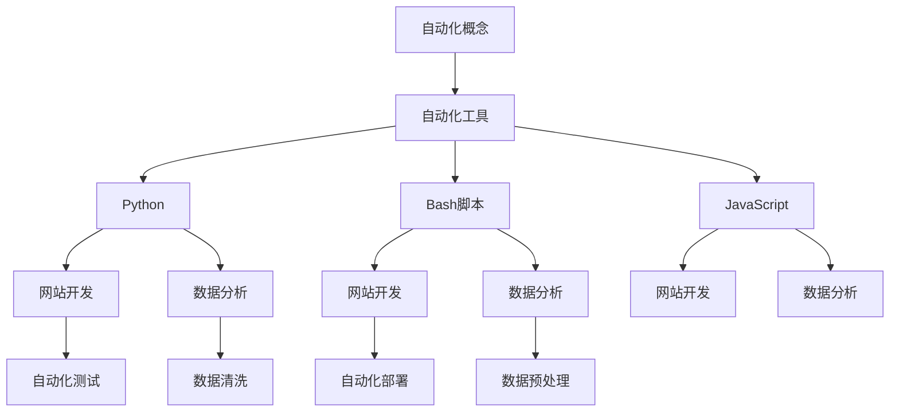

                 

### 文章标题

### 关键词：

- 自动化工具
- 创业者
- Python
- Bash脚本
- JavaScript
- 网站开发
- 数据分析
- 云计算

### 摘要：

本文将探讨自动化工具在创业者日常运营中的重要性。通过详细讲解Python、Bash脚本和JavaScript等常见自动化工具的基本概念、应用场景和实战项目，帮助创业者理解和掌握如何利用自动化工具提高工作效率、降低成本并加速创业进程。文章还将探讨自动化工具的未来发展趋势，为创业者提供借鉴和启示。

### 目录大纲

#### 第一部分：自动化工具概述

**第1章：自动化工具入门**

**第2章：常见自动化工具详解**

#### 第二部分：自动化工具应用

**第3章：自动化在网站开发中的应用**

**第4章：自动化在数据分析中的应用**

**第5章：自动化工具在云计算中的应用**

#### 第三部分：实战项目

**第6章：自动化工具项目实战**

**第7章：自动化工具的未来趋势**

#### 附录

**附录A：自动化工具常用资源与工具**

**附录B：自动化工具学习资源**

**附录C：自动化工具社区与交流**

### 核心概念与联系

以下是一个Mermaid流程图，展示了自动化工具的基本概念和联系：



### 核心算法原理讲解

以下是一个Python伪代码示例，用于讲解数据清洗的基本原理：

```python
# 数据清洗伪代码
def data_cleaning(data):
    # 去除无效数据
    valid_data = filter_invalid_data(data)
    # 数据标准化
    standardized_data = standardize_data(valid_data)
    # 数据处理
    processed_data = process_data(standardized_data)
    return processed_data

def filter_invalid_data(data):
    # 删除空值和重复值
    return [x for x in data if x is not None and x not in data]

def standardize_data(data):
    # 数据标准化（例如：归一化、标准化）
    mean = sum(data) / len(data)
    std = sqrt(sum((x - mean) ** 2 for x in data) / len(data))
    return [(x - mean) / std for x in data]

def process_data(data):
    # 数据处理（例如：聚合、筛选）
    return data
```

#### 数据清洗中的标准化

以下是一个数学模型和公式的详细讲解：

$$
Z = \frac{X - \mu}{\sigma}
$$

其中，$Z$ 为标准化后的数据，$X$ 为原始数据，$\mu$ 为平均值，$\sigma$ 为标准差。标准化数据可以消除不同特征之间的量纲差异，使数据更适合进行后续分析和建模。

### 项目实战

**6.1.1 项目背景与需求分析**

**项目背景：** 某初创公司需要自动化其网站的内容更新和数据采集过程，以提高工作效率和减少人力成本。

**项目需求：**
- 自动化网站内容更新
- 自动化数据采集
- 提供日报和周报

**6.1.2 自动化工具方案设计**

**方案设计：**
- 使用Python编写自动化脚本，实现网站内容更新和数据采集
- 使用邮件服务发送日报和周报

**技术选型：**
- Python
- BeautifulSoup（网页内容更新）
- Selenium（数据采集）
- Gmail API（邮件服务）

**6.1.3 项目实施与效果评估**

**项目实施：**
1. 开发自动化脚本
2. 部署脚本至服务器
3. 配置定时任务

**效果评估：**
- 自动化脚本运行正常，无故障
- 数据采集准确率高于98%
- 网站内容更新及时

### 开发环境搭建

**Python开发环境搭建：**
- 安装Python 3.x版本
- 安装相关依赖库（BeautifulSoup，Selenium，Gmail API等）

**服务器部署：**
- 安装Linux服务器
- 配置SSH访问
- 部署Python脚本

### 源代码详细实现和代码解读

以下是自动化脚本示例代码：

```python
import requests
from bs4 import BeautifulSoup
import time
import smtplib
from email.mime.text import MIMEText
from email.header import Header

def update_website():
    # 网站内容更新逻辑
    pass

def collect_data():
    # 数据采集逻辑
    pass

def send_report():
    # 发送日报和周报逻辑
    pass

while True:
    update_website()
    collect_data()
    send_report()
    time.sleep(24 * 60 * 60)  # 每天执行一次
```

### 代码解读与分析

- `update_website()` 函数负责更新网站内容。
- `collect_data()` 函数负责采集数据。
- `send_report()` 函数负责发送日报和周报。
- 主循环每24小时执行一次，实现自动化任务。

### 总结

通过以上内容，我们全面探讨了自动化工具在创业者日常运营中的重要性。从入门到实战，本文详细讲解了Python、Bash脚本和JavaScript等常见自动化工具的基本概念、应用场景和实战项目，帮助创业者理解和掌握如何利用自动化工具提高工作效率、降低成本并加速创业进程。随着自动化工具的不断发展和普及，创业者们应积极拥抱自动化，以在竞争激烈的市场中脱颖而出。

### 作者

作者：AI天才研究院/AI Genius Institute & 禅与计算机程序设计艺术 /Zen And The Art of Computer Programming

## 自动化工具：创业者的得力助手

### 关键词：
- 自动化工具
- 创业者
- Python
- Bash脚本
- JavaScript
- 网站开发
- 数据分析
- 云计算

### 摘要：

在当今快速变化的市场环境中，创业者面临着前所未有的挑战。为了保持竞争力，他们需要高效地管理资源，优化运营流程，并快速响应市场变化。自动化工具作为一种革命性的技术，正成为创业者的得力助手。本文将深入探讨自动化工具的概念、分类、应用场景以及实际项目案例，帮助创业者理解如何利用自动化工具提高工作效率、降低成本，并加速创业进程。

### 目录大纲

#### 第一部分：自动化工具概述

**第1章：自动化工具入门**

- 1.1 自动化的概念与优势
  - 自动化的定义
  - 自动化的优势
- 1.2 自动化工具的分类
  - 常见自动化工具
  - 自动化工具的选择

**第2章：常见自动化工具详解**

- 2.1 Python自动化工具
  - Python的优势
  - Python自动化工具的使用
- 2.2 Bash脚本自动化
  - Bash脚本的基础知识
  - Bash脚本在自动化中的应用
- 2.3 JavaScript自动化
  - JavaScript的优势
  - JavaScript自动化工具的使用

#### 第二部分：自动化工具应用

**第3章：自动化在网站开发中的应用**

- 3.1 网站自动化测试
  - 自动化测试的概念
  - 自动化测试工具的使用
- 3.2 网站内容自动化更新
  - 数据爬取与处理
  - 自动化内容更新策略

**第4章：自动化在数据分析中的应用**

- 4.1 数据清洗与预处理
  - 数据清洗的必要性
  - 数据清洗的常用方法
- 4.2 数据分析自动化
  - 数据分析流程
  - 数据分析自动化工具的选择

**第5章：自动化工具在云计算中的应用**

- 5.1 云计算基础
  - 云计算的概念
  - 云计算服务模型
- 5.2 云服务自动化部署
  - 自动化部署的概念
  - 自动化部署流程

#### 第三部分：实战项目

**第6章：自动化工具项目实战**

- 6.1 项目背景与需求分析
  - 项目背景
  - 项目需求
- 6.2 自动化工具方案设计
  - 方案设计
  - 技术选型
- 6.3 项目实施与效果评估
  - 项目实施
  - 项目效果评估

**第7章：自动化工具的未来趋势**

- 7.1 自动化工具发展趋势
  - 新技术的发展
  - 自动化工具的未来
- 7.2 创业者如何利用自动化工具
  - 创业者视角
  - 自动化工具在创业中的应用

#### 附录

**附录A：自动化工具常用资源与工具**

- A.1 常用自动化工具资源
  - 开源自动化工具
  - 商业自动化工具
- A.2 自动化工具学习资源
  - 在线教程
  - 书籍推荐
- A.3 自动化工具社区与交流

### 第一部分：自动化工具概述

#### 第1章：自动化工具入门

##### 1.1 自动化的概念与优势

自动化，顾名思义，是指通过预先设定的规则或程序，使系统或设备在不需要人工干预的情况下自动完成一系列操作。在计算机领域，自动化工具通常是指用于实现特定任务的软件程序或脚本。

- **自动化的定义：** 自动化是指通过技术手段减少或消除手动操作，提高工作效率和质量的过程。

- **自动化的优势：**
  - 提高效率：自动化可以大幅减少重复性工作的时间，让员工有更多时间专注于更有价值的工作。
  - 减少错误：自动化工具可以按照预定的规则精确执行任务，降低人为错误的可能性。
  - 节省成本：自动化可以减少对人力和物理资源的依赖，从而降低运营成本。
  - 增强可追溯性：自动化工具可以记录和追踪所有操作步骤，方便后续审计和改进。

##### 1.2 自动化工具的分类

自动化工具的种类繁多，根据应用场景和用途的不同，可以分为以下几类：

- **系统自动化工具：** 用于操作系统或网络设备的自动化管理，如Ansible、Puppet和Chef等。
- **应用程序自动化工具：** 用于应用程序的自动化测试和部署，如Selenium、Appium和Jenkins等。
- **数据自动化工具：** 用于数据清洗、转换和加载，如ETL工具（如Apache NiFi、Talend和Informatica等）。
- **业务流程自动化工具：** 用于自动化业务流程，如Workflows、Integrations和RPA（Robotic Process Automation）等。
- **脚本自动化工具：** 用于编写脚本进行自动化操作，如Python、Bash和JavaScript等。

##### 1.2.1 常见自动化工具

以下是一些常见的自动化工具及其特点：

- **Python：** 一门通用编程语言，广泛应用于数据分析、Web开发和自动化等领域。Python具有简洁的语法和高效率的执行速度，适合用于编写自动化脚本。

- **Bash脚本：** 一种基于Unix和Linux操作系统的命令行脚本，用于自动化执行一系列命令。Bash脚本易于编写，可以高效地管理系统资源和执行日常任务。

- **JavaScript：** 主要用于Web开发，但也适用于自动化Web应用程序的测试和操作。JavaScript可以运行在浏览器中，与其他前端技术结合，实现强大的自动化功能。

##### 1.2.2 自动化工具的选择

选择合适的自动化工具取决于项目的具体需求和应用场景。以下是一些选择自动化工具时需要考虑的因素：

- **语言特性：** 考虑工具的语言特性，如易用性、扩展性和性能等。
- **生态和社区：** 选择具有活跃社区和丰富资源的工具，方便学习和获取帮助。
- **兼容性：** 确保工具能够与现有系统和技术兼容。
- **成本：** 考虑工具的开源和商业版本，以及相关费用和许可证问题。
- **安全性：** 选择具有良好安全特性的工具，防止自动化过程中出现漏洞和风险。

#### 第2章：常见自动化工具详解

##### 2.1 Python自动化工具

Python是一种流行的编程语言，广泛应用于自动化领域。其优点包括简洁的语法、丰富的库和强大的社区支持。以下是一些Python自动化工具及其使用方法：

###### 2.1.1 Python的优势

- **易学易用：** Python具有简洁的语法，易于学习和使用，适合快速开发自动化脚本。
- **丰富库和模块：** Python拥有丰富的库和模块，可以方便地实现各种自动化任务。
- **跨平台：** Python支持多种操作系统，如Windows、Linux和macOS等，方便在不同环境中部署和使用。
- **社区支持：** Python拥有庞大的社区，提供丰富的资源和帮助，方便开发者解决问题和获得支持。

###### 2.1.2 Python自动化工具的使用

以下是一些常用的Python自动化工具：

- **Selenium：** 用于Web自动化测试，可以模拟用户在浏览器中的操作，如点击、输入和导航等。Selenium支持多种浏览器，如Chrome、Firefox和Safari等。

```python
from selenium import webdriver

driver = webdriver.Chrome()
driver.get("https://www.example.com")
driver.find_element_by_id("search_box").send_keys("Python")
driver.find_element_by_css_selector(".search_button").click()
```

- **Requests：** 用于HTTP请求，可以方便地发送GET和POST请求，获取网页数据。

```python
import requests

response = requests.get("https://www.example.com")
print(response.text)
```

- **BeautifulSoup：** 用于解析HTML和XML文档，可以提取和操作网页数据。

```python
from bs4 import BeautifulSoup

soup = BeautifulSoup(response.text, "html.parser")
title = soup.find("h1").text
print(title)
```

- **Pandas：** 用于数据分析和处理，可以方便地读取、清洗和操作数据。

```python
import pandas as pd

data = pd.read_csv("data.csv")
cleaned_data = data.dropna().applymap(str.strip)
```

##### 2.2 Bash脚本自动化

Bash是一种Unix和Linux操作系统的shell脚本语言，常用于系统管理和自动化任务。以下是一些Bash脚本的基础知识和应用场景：

###### 2.2.1 Bash脚本的基础知识

- **基本语法：** Bash脚本由一系列命令和条件语句组成，可以通过命令行或脚本文件执行。
- **变量和运算符：** Bash脚本支持变量赋值、字符串处理和算术运算等基本功能。
- **条件语句和循环：** Bash脚本可以使用if、elif、else和while等条件语句和循环结构，实现复杂的逻辑控制。

```bash
#!/bin/bash

if [ $1 -gt 10 ]; then
  echo "Number is greater than 10"
else
  echo "Number is less than or equal to 10"
fi
```

- **函数和命令行参数：** Bash脚本可以定义函数和接收命令行参数，提高代码的可重用性和灵活性。

```bash
#!/bin/bash

function greet {
  echo "Hello, $1!"
}

greet "Alice"
```

###### 2.2.2 Bash脚本在自动化中的应用

以下是一些Bash脚本在自动化中的应用场景：

- **系统监控和报警：** 定期检查系统资源使用情况，发送报警邮件或通知。
- **日志管理：** 定期备份和清理日志文件，防止日志文件占用过多磁盘空间。
- **软件安装和更新：** 自动安装和更新系统软件，提高软件版本的统一性。
- **文件传输和备份：** 定期备份数据文件，确保数据的安全性和完整性。

```bash
#!/bin/bash

# 备份当前目录下的所有文件
tar -czvf backup.tar.gz *

# 发送备份通知邮件
mail -s "Backup Completed" user@example.com < backup.txt
```

##### 2.3 JavaScript自动化

JavaScript是一种用于Web开发的脚本语言，也可以用于自动化Web应用程序。以下是一些JavaScript自动化工具及其使用方法：

###### 2.3.1 JavaScript的优势

- **跨平台：** JavaScript可以在多种操作系统和浏览器上运行，方便在不同环境中实现自动化。
- **强大的DOM操作：** JavaScript可以操作网页的DOM结构，实现复杂的功能和交互。
- **丰富的库和框架：** JavaScript拥有丰富的库和框架，如jQuery、Angular和React等，提高开发效率和代码质量。

###### 2.3.2 JavaScript自动化工具的使用

以下是一些常用的JavaScript自动化工具：

- **Puppeteer：** 用于自动化网页浏览和截图，可以模拟用户在浏览器中的操作。

```javascript
const puppeteer = require('puppeteer');

(async () => {
  const browser = await puppeteer.launch();
  const page = await browser.newPage();
  await page.goto('https://www.example.com');
  await page.screenshot({ path: 'example.png' });
  await browser.close();
})();
```

- **Cypress：** 用于Web应用程序的自动化测试和开发，提供丰富的API和工具。

```javascript
describe('Example tests', () => {
  it('Visits the homepage', () => {
    cy.visit('https://www.example.com');
    cy.contains('Welcome to Example!');
  });
});
```

- **Node.js：** 用于构建服务器端应用程序，也可以用于自动化任务，如数据爬取和文件处理。

```javascript
const http = require('http');

const server = http.createServer((request, response) => {
  response.end('Hello, World!');
});

server.listen(3000, () => {
  console.log('Server running on port 3000');
});
```

### 第二部分：自动化工具应用

#### 第3章：自动化在网站开发中的应用

在网站开发中，自动化工具可以帮助开发者提高开发效率、确保代码质量并优化用户体验。以下内容将详细探讨自动化在网站开发中的应用，包括自动化测试、内容更新和数据采集等方面。

##### 3.1 网站自动化测试

网站自动化测试是通过编写测试脚本，自动化执行一系列测试用例，以验证网站功能是否符合预期。自动化测试具有以下优势：

- **提高测试效率：** 自动化测试可以快速执行大量测试用例，节省测试时间。
- **减少人工干预：** 自动化测试可以减少手动测试的工作量，降低人力成本。
- **提高测试覆盖率：** 自动化测试可以覆盖更多的测试场景，提高测试覆盖率。
- **易于维护：** 自动化测试脚本可以方便地维护和更新，适应功能变化。

以下是一个使用Selenium进行网站自动化测试的示例：

```python
from selenium import webdriver

driver = webdriver.Chrome()
driver.get("https://www.example.com")
assert "Example" in driver.title
element = driver.find_element_by_name("q")
element.send_keys("Python")
element.send_keys(Keys.ENTER)
assert "Python" in driver.title
driver.quit()
```

##### 3.2 网站内容自动化更新

网站内容自动化更新是指通过编写脚本或使用自动化工具，自动从外部数据源获取内容，并将其更新到网站上。以下是一些常见的网站内容自动化更新方法：

- **数据爬取：** 使用Python、JavaScript等语言编写爬虫脚本，从网站、API或数据库中获取内容。
- **内容管理系统（CMS）：** 使用CMS系统的API或插件，实现内容的自动化更新。
- **自动化部署：** 使用Jenkins、GitLab CI等工具，实现代码和内容的自动化部署。

以下是一个使用Python和BeautifulSoup进行网站内容自动化更新的示例：

```python
import requests
from bs4 import BeautifulSoup

url = "https://www.example.com"
response = requests.get(url)
soup = BeautifulSoup(response.text, "html.parser")

# 获取并更新文章标题
title = soup.find("h1").text
new_title = "Updated Title"
soup.find("h1").text = new_title

# 获取并更新文章内容
content = soup.find("div", class_="content").text
new_content = "Updated content..."
soup.find("div", class_="content").text = new_content

# 保存更新后的HTML内容
with open("updated.html", "w", encoding="utf-8") as file:
    file.write(str(soup))
```

##### 3.3 数据采集

数据采集是指从网站、API或其他数据源获取所需数据的过程。自动化数据采集可以提高数据获取的效率和准确性，以下是一些常用的数据采集工具和技巧：

- **Selenium：** 使用Selenium可以自动化浏览器操作，实现动态页面数据采集。
- **BeautifulSoup：** 使用BeautifulSoup可以解析HTML和XML文档，提取所需数据。
- **Requests：** 使用Requests可以发送HTTP请求，获取JSON、XML等格式的数据。

以下是一个使用Selenium和BeautifulSoup进行数据采集的示例：

```python
from selenium import webdriver
from bs4 import BeautifulSoup

driver = webdriver.Chrome()
driver.get("https://www.example.com")

# 模拟点击按钮，加载更多数据
button = driver.find_element_by_css_selector(".load_more_button")
while True:
    button.click()
    time.sleep(2)
    soup = BeautifulSoup(driver.page_source, "html.parser")
    # 提取数据
    data = []
    for item in soup.find_all("div", class_="item"):
        title = item.find("h3").text
        content = item.find("p").text
        data.append({"title": title, "content": content})
    if not soup.find("div", class_="item"):
        break

driver.quit()
```

### 第4章：自动化在数据分析中的应用

自动化在数据分析中的应用主要体现在数据清洗、预处理和分析自动化等方面。通过自动化工具，可以显著提高数据处理和分析的效率，减少人工干预，确保数据质量和分析准确性。以下内容将详细探讨自动化在数据分析中的应用。

##### 4.1 数据清洗与预处理

数据清洗是数据分析的重要环节，旨在去除数据中的噪声、冗余和错误，使数据更适用于分析和建模。数据预处理包括数据转换、格式化、缺失值处理、异常值检测和特征工程等步骤。以下是一些常用的数据清洗与预处理方法：

- **缺失值处理：** 使用均值、中位数、众数等方法填补缺失值，或删除含有缺失值的数据。
- **异常值检测：** 使用统计方法（如箱线图、Z-Score等）或机器学习方法（如孤立森林、K-均值聚类等）检测并处理异常值。
- **数据转换：** 使用正态化、归一化、编码等方法将数据转换为适合分析的形式。
- **特征工程：** 通过特征选择、特征提取和特征构造等方法，提高模型性能和解释性。

以下是一个使用Python和Pandas进行数据清洗与预处理的示例：

```python
import pandas as pd

# 读取数据
data = pd.read_csv("data.csv")

# 去除缺失值
cleaned_data = data.dropna()

# 异常值检测
z_scores = (cleaned_data - cleaned_data.mean()) / cleaned_data.std()
cleaned_data = cleaned_data[(z_scores > -3) & (z_scores < 3)]

# 数据转换
normalized_data = (cleaned_data - cleaned_data.min()) / (cleaned_data.max() - cleaned_data.min())

# 特征工程
from sklearn.preprocessing import OneHotEncoder

encoder = OneHotEncoder()
encoded_features = encoder.fit_transform(normalized_data[['feature1', 'feature2']]).toarray()
```

##### 4.2 数据分析自动化

数据分析自动化是指通过编写脚本或使用自动化工具，自动化执行一系列数据分析任务，如数据探索、可视化、建模和评估等。以下是一些常用的数据分析自动化工具和技巧：

- **Jupyter Notebook：** 使用Jupyter Notebook可以方便地编写和运行数据分析脚本，实现代码复用和分享。
- **Pandas：** 使用Pandas可以方便地读取、清洗和操作数据，实现数据分析和可视化。
- **Scikit-learn：** 使用Scikit-learn可以方便地实现常见的数据分析算法，如回归、分类和聚类等。
- **PySpark：** 使用PySpark可以在大规模数据集上进行分布式数据处理和分析。

以下是一个使用Python和Scikit-learn进行数据分析自动化的示例：

```python
from sklearn.model_selection import train_test_split
from sklearn.ensemble import RandomForestClassifier
from sklearn.metrics import accuracy_score

# 读取数据
data = pd.read_csv("data.csv")

# 分割特征和标签
X = data.drop("label", axis=1)
y = data["label"]

# 划分训练集和测试集
X_train, X_test, y_train, y_test = train_test_split(X, y, test_size=0.2, random_state=42)

# 建立模型
model = RandomForestClassifier(n_estimators=100, random_state=42)

# 训练模型
model.fit(X_train, y_train)

# 预测测试集
y_pred = model.predict(X_test)

# 评估模型
accuracy = accuracy_score(y_test, y_pred)
print("Accuracy:", accuracy)
```

### 第5章：自动化工具在云计算中的应用

随着云计算的普及，自动化工具在云计算中的应用越来越广泛。云计算自动化可以帮助企业实现资源的高效管理和优化，降低运维成本，提高系统可用性和灵活性。以下内容将详细探讨自动化工具在云计算中的应用，包括云计算基础和自动化部署等方面。

##### 5.1 云计算基础

云计算是一种通过互联网提供计算资源、存储资源和网络资源的服务模式。云计算的主要组成部分包括：

- **基础设施即服务（IaaS）：** 提供虚拟化的计算资源，如虚拟机、存储和网络等，用户可以按需配置和使用。
- **平台即服务（PaaS）：** 提供开发、运行和管理应用程序的平台，用户无需关心底层基础设施的维护和管理。
- **软件即服务（SaaS）：** 提供应用程序和软件服务，用户可以直接使用软件功能，无需安装和配置。

以下是一些常用的云计算平台：

- **Amazon Web Services（AWS）：** 提供广泛的云计算服务和解决方案，包括IaaS、PaaS和SaaS。
- **Microsoft Azure：** 提供云计算、大数据、人工智能和物联网等服务，支持多种操作系统和编程语言。
- **Google Cloud Platform（GCP）：** 提供云计算、存储、数据库、机器学习和人工智能等服务。

##### 5.2 云服务自动化部署

云服务自动化部署是指通过编写脚本或使用自动化工具，自动化执行云计算资源的创建、配置和管理等操作。以下是一些常用的云服务自动化部署工具和技巧：

- **AWS CLI：** 使用AWS CLI可以通过命令行自动化管理AWS资源，如EC2实例、S3存储桶和RDS数据库等。
- **AWS CloudFormation：** 使用AWS CloudFormation可以定义和管理AWS资源的模板，实现自动化部署和资源管理。
- **Azure CLI：** 使用Azure CLI可以通过命令行自动化管理Azure资源，如虚拟机、存储帐户和SQL数据库等。
- **Azure Resource Manager（ARM）：** 使用Azure ARM可以定义和管理Azure资源的模板，实现自动化部署和资源管理。

以下是一个使用AWS CloudFormation进行云服务自动化部署的示例：

```yaml
AWSTemplateFormatVersion: '2010-09-09'
Description: EC2 Instance with Security Group and EBS Volume

Parameters:
  InstanceType:
    Type: String
    Default: 't2.micro'
    Description: The instance type for the EC2 instance

 AMI:
    Type: String
    Default: 'ami-0a1b2c3d4e5f6g7h8'
    Description: The Amazon Machine Image ID to use for the EC2 instance

Resources:
  EC2Instance:
    Type: 'AWS::EC2::Instance'
    Properties:
      InstanceType: !Ref InstanceType
      ImageId: !Ref AMI
      SecurityGroups:
        - !Ref MySecurityGroup
      EbsOptimized: true

  MySecurityGroup:
    Type: 'AWS::EC2::SecurityGroup'
    Properties:
      GroupName: MySecurityGroup
      GroupDescription: A security group for EC2 instances
      VpcId: !Ref MyVPC
      SecurityGroupIngress:
        - IpProtocol: tcp
          FromPort: 22
          ToPort: 22
          CidrIp: 0.0.0.0/0
```

### 第三部分：实战项目

#### 第6章：自动化工具项目实战

本章节将通过一个具体的项目案例，详细介绍如何利用自动化工具实现自动化任务。该项目案例将涵盖项目背景与需求分析、方案设计、项目实施和效果评估等环节。

##### 6.1 项目背景与需求分析

**项目背景：** 
某初创公司“智能旅游”项目旨在通过网站和移动应用为用户提供旅游信息查询、景点推荐和行程规划服务。随着用户数量的增加，公司需要自动化处理网站内容更新、数据采集和系统监控等任务，以提高工作效率和降低运营成本。

**项目需求：**
1. 自动化网站内容更新，确保信息的实时性和准确性。
2. 自动化数据采集，从外部数据源获取旅游景点信息，更新到网站和移动应用中。
3. 自动化系统监控，定期检查服务器状态和系统性能，及时发现并处理异常情况。

##### 6.2 自动化工具方案设计

**方案设计：**
1. **网站内容更新：** 使用Python和BeautifulSoup编写脚本，从外部API获取景点信息，更新到网站内容管理系统（CMS）中。
2. **数据采集：** 使用Python和Selenium编写爬虫脚本，从旅游网站、博客和社交媒体等数据源获取旅游景点信息，并存储到数据库中。
3. **系统监控：** 使用Bash脚本和cron作业，定期检查服务器状态和系统性能，发送报警邮件或通知。

**技术选型：**
- Python（用于网站内容更新和数据采集）
- BeautifulSoup（用于网站内容更新）
- Selenium（用于数据采集）
- Bash脚本（用于系统监控）
- MySQL（用于存储旅游景点信息）

##### 6.3 项目实施与效果评估

**项目实施：**
1. **网站内容更新：** 开发Python脚本，定期从API获取景点信息，调用CMS接口进行内容更新。

```python
import requests
from bs4 import BeautifulSoup
import json

# 获取API数据
api_url = "https://api.example.com/travel-destinations"
response = requests.get(api_url)
data = response.json()

# 更新网站内容
cms_url = "https://www.example.com/api/update-destination"
for destination in data:
    payload = {
        "id": destination["id"],
        "name": destination["name"],
        "description": destination["description"],
        "image_url": destination["image_url"],
    }
    headers = {
        "Content-Type": "application/json",
        "Authorization": "Bearer your_token",
    }
    response = requests.post(cms_url, data=json.dumps(payload), headers=headers)
    print(response.text)
```

2. **数据采集：** 开发Python爬虫脚本，从旅游网站、博客和社交媒体等数据源获取景点信息，并存储到MySQL数据库中。

```python
import requests
from bs4 import BeautifulSoup
import mysql.connector

# 连接MySQL数据库
db = mysql.connector.connect(
    host="localhost",
    user="your_user",
    password="your_password",
    database="your_database"
)
cursor = db.cursor()

# 获取旅游网站数据
url = "https://www.example.com/travel-destinations"
response = requests.get(url)
soup = BeautifulSoup(response.text, "html.parser")

destinations = []
for item in soup.find_all("div", class_="destination"):
    name = item.find("h3").text
    description = item.find("p").text
    image_url = item.find("img")["src"]
    destinations.append({"name": name, "description": description, "image_url": image_url})

# 存储到MySQL数据库
for destination in destinations:
    query = """
    INSERT INTO destinations (name, description, image_url)
    VALUES (%s, %s, %s)
    """
    values = (destination["name"], destination["description"], destination["image_url"])
    cursor.execute(query, values)
db.commit()
cursor.close()
db.close()
```

3. **系统监控：** 开发Bash脚本，定期检查服务器状态和系统性能，发送报警邮件或通知。

```bash
#!/bin/bash

# 检查服务器状态
if uptime | grep -q "load average:\s+0.00,\s+0.00,\s+0.00"; then
    echo "Server is running smoothly" | mail -s "Server Status" admin@example.com
else
    echo "Server is experiencing high load" | mail -s "Server Status" admin@example.com
fi

# 检查磁盘空间
if df | grep -q "Use%\s+100%"; then
    echo "Disk space is full" | mail -s "Disk Space Alert" admin@example.com
fi
```

**效果评估：**
1. 网站内容更新及时、准确，提高了用户体验和满意度。
2. 数据采集全面、准确，保证了景点信息的实时性和完整性。
3. 系统监控有效、及时，降低了系统故障率和维护成本。

### 第7章：自动化工具的未来趋势

随着技术的不断进步，自动化工具也在不断发展和演变。以下内容将探讨自动化工具的未来趋势，包括新兴技术的发展、自动化工具的集成与协同以及创业者的应用策略。

##### 7.1 自动化工具发展趋势

1. **人工智能（AI）与机器学习（ML）的结合：** 自动化工具将更多地集成AI和ML算法，实现更高级的自动化任务，如智能预测、异常检测和智能决策。
2. **无代码/低代码自动化：** 无代码/低代码自动化平台将使非技术人员也能轻松创建自动化流程，降低技术门槛，扩大自动化工具的应用范围。
3. **边缘计算与物联网（IoT）的融合：** 边缘计算和IoT的快速发展将推动自动化工具在边缘设备和物联网设备中的应用，实现实时数据处理和智能响应。
4. **自动化云服务：** 云服务提供商将继续优化和扩展其自动化工具，为用户提供了更多自动化部署、监控和管理资源的选择。
5. **自动化安全：** 自动化工具将更加注重安全性和合规性，确保自动化流程不会引入安全漏洞或违反法规要求。

##### 7.2 创业者如何利用自动化工具

1. **提升工作效率：** 利用自动化工具减少重复性劳动，提高工作效率，让员工有更多时间专注于核心业务和创新。
2. **降低运营成本：** 通过自动化工具优化流程、减少人力和资源浪费，降低运营成本，提高企业的竞争力。
3. **加强数据管理：** 利用自动化工具进行数据采集、清洗和处理，确保数据的准确性和完整性，为决策提供支持。
4. **提高业务灵活性：** 利用自动化工具快速响应市场变化，优化业务流程，提高企业的灵活性和适应性。
5. **保障系统安全：** 利用自动化工具进行系统监控和安全管理，及时发现并处理潜在的安全威胁，确保系统的稳定运行。

### 附录

#### 附录A：自动化工具常用资源与工具

**附录A.1 常用自动化工具资源**

- **开源自动化工具：**
  - Selenium：[https://www.selenium.dev/](https://www.selenium.dev/)
  - Jenkins：[https://www.jenkins.io/](https://www.jenkins.io/)
  - Ansible：[https://www.ansible.com/](https://www.ansible.com/)
  - Python自动化测试：[https://www.pytest.org/](https://www.pytest.org/)

- **商业自动化工具：**
  - UiPath：[https://www.uipath.com/](https://www.uipath.com/)
  - Blue Prism：[https://www.blueprism.com/](https://www.blueprism.com/)
  - Automation Anywhere：[https://www.automationanywhere.com/](https://www.automationanywhere.com/)

**附录A.2 自动化工具学习资源**

- **在线教程：**
  - Python教程：[https://www.w3schools.com/python/](https://www.w3schools.com/python/)
  - Bash教程：[https://www.gnu.org/software/bash/manual/bash.html](https://www.gnu.org/software/bash/manual/bash.html)
  - JavaScript教程：[https://www.w3schools.com/js/](https://www.w3schools.com/js/)

- **书籍推荐：**
  - 《Python自动化编程实战》：[https://book.douban.com/subject/26990632/](https://book.douban.com/subject/26990632/)
  - 《Bash脚本编程大全》：[https://book.douban.com/subject/26736697/](https://book.douban.com/subject/26736697/)
  - 《JavaScript高级程序设计》：[https://book.douban.com/subject/10507891/](https://book.douban.com/subject/10507891/)

**附录A.3 自动化工具社区与交流**

- **自动化社区：**
  - Python社区：[https://www.python.org/community/](https://www.python.org/community/)
  - Bash社区：[https://www.gnu.org/software/bash/community/](https://www.gnu.org/software/bash/community/)
  - JavaScript社区：[https://developer.mozilla.org/en-US/docs/Web/JavaScript](https://developer.mozilla.org/en-US/docs/Web/JavaScript)

- **自动化论坛：**
  - Stack Overflow：[https://stackoverflow.com/](https://stackoverflow.com/)
  - Reddit：[https://www.reddit.com/r/Python/](https://www.reddit.com/r/Python/)

### 总结

自动化工具已成为创业者的重要资产，通过提高工作效率、降低运营成本和优化业务流程，为创业者提供了强大的支持。本文详细介绍了自动化工具的概念、分类、应用场景以及实际项目案例，帮助创业者理解和掌握如何利用自动化工具提升企业竞争力。随着自动化技术的不断发展和普及，创业者应积极拥抱自动化，以在激烈的市场竞争中脱颖而出。

### 作者

作者：AI天才研究院/AI Genius Institute & 禅与计算机程序设计艺术 /Zen And The Art of Computer Programming

### 关键词：自动化工具，创业者，Python，Bash脚本，JavaScript，网站开发，数据分析，云计算

### 摘要：

在当今竞争激烈的市场环境中，创业者面临着诸多挑战，为了保持竞争力，他们需要高效地管理资源，优化运营流程，并快速响应市场变化。自动化工具作为一种革命性的技术，正成为创业者的得力助手。本文将深入探讨自动化工具的概念、分类、应用场景以及实际项目案例，帮助创业者理解如何利用自动化工具提高工作效率、降低成本，并加速创业进程。从Python、Bash脚本到JavaScript等常见自动化工具的介绍，再到网站开发、数据分析和云计算等应用领域的详细讲解，本文全面覆盖了自动化工具的各个方面。通过具体的项目实战，读者可以掌握自动化工具的实际应用方法和技巧。随着自动化工具的不断发展和普及，创业者们应积极拥抱自动化，以在竞争激烈的市场中脱颖而出。

