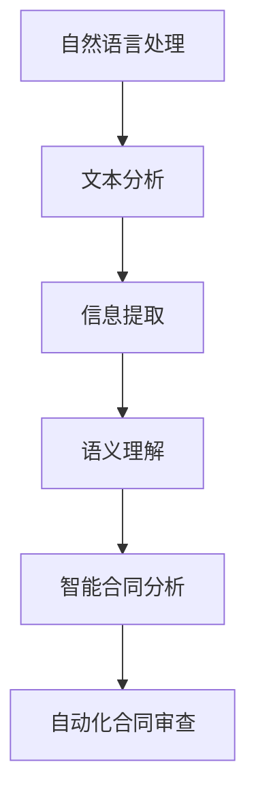
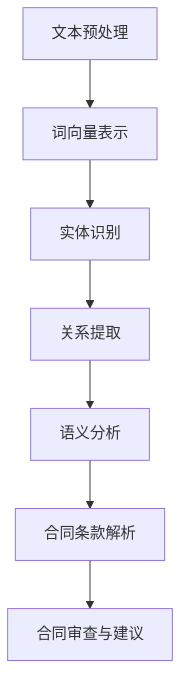
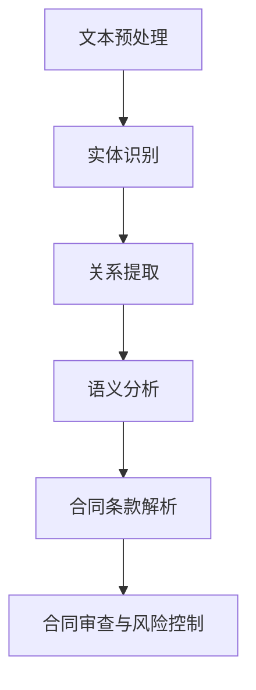
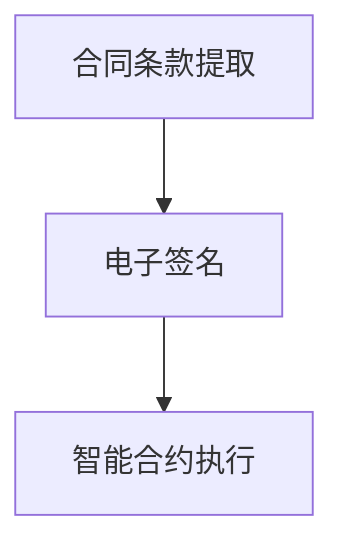

                 

### 引言

#### 1.1 自然语言处理与智能合同分析

自然语言处理（Natural Language Processing，NLP）是计算机科学、人工智能领域的重要分支，专注于使计算机能够理解、解释和生成人类自然语言。NLP技术广泛应用于信息检索、机器翻译、文本分类、语音识别等领域。而智能合同分析作为NLP在法律领域的具体应用，正逐渐成为提升合同管理效率和准确性的关键工具。

智能合同分析涉及对合同文本的深度解析，以提取关键信息、识别合同条款、评估合同风险等。核心概念包括文本分析、信息提取、语义理解和自动化合同审查。以下是这些核心概念的Mermaid流程图表示：



**文本分析**是对原始文本进行预处理，如分词、去除停用词、词性标注等，以便于后续处理。

**信息提取**则从处理后的文本中抽取有用信息，如合同条款、相关实体等。

**语义理解**关注文本中词语和句子的含义，以及它们之间的关系，是智能合同分析的核心。

**智能合同分析**结合以上三个步骤，对合同文本进行深入解析，以提供自动化审查和风险评估。

**自动化合同审查**利用智能合同分析的结果，对合同进行全面的审核，确保其符合法律要求，并识别潜在的风险点。

#### 1.2 智能合同分析的重要性

智能合同分析在现代社会中具有重要作用。首先，它能够提高合同管理的效率和准确性。传统的合同审查需要人工逐字逐句地阅读，费时费力且容易出错。而智能合同分析通过自动化处理，能够在短时间内完成对大量合同的审查，大大提升了工作效率。

其次，智能合同分析有助于加强企业的法律合规性。通过智能合同分析，企业可以及时发现合同中的法律风险，并采取措施进行规避。这不仅可以降低法律风险，还能避免因合同纠纷带来的经济损失。

此外，智能合同分析还能有效控制合同管理过程中的风险。通过对合同条款的深入分析，智能合同分析系统能够识别出合同中的潜在风险点，并提供风险控制建议。这有助于企业在签订合同前做出更明智的决策，降低合同管理过程中的风险。

最后，智能合同分析对于提高商业效率具有重要意义。通过自动化合同审查和风险评估，企业可以更快地完成合同签订和执行，从而提高业务流程的效率。这不仅有助于企业内部运营的优化，还能增强企业在市场中的竞争力。

总的来说，智能合同分析在法律合规性、商业效率和合同管理方面具有重要作用。它不仅能够提高合同管理的效率和准确性，还能帮助企业降低风险、提高竞争力。因此，智能合同分析已成为现代企业不可或缺的工具。

---

通过上述分析，我们可以看到自然语言处理技术在智能合同分析中的应用不仅具有重要意义，还展示了其强大的潜力和广泛的应用前景。接下来的章节中，我们将进一步探讨自然语言处理的基础知识，以及智能合同分析的具体实现方法和应用场景。

```plaintext
### 引言

#### 1.1 自然语言处理与智能合同分析

自然语言处理（Natural Language Processing，NLP）是计算机科学、人工智能领域的重要分支，专注于使计算机能够理解、解释和生成人类自然语言。NLP技术广泛应用于信息检索、机器翻译、文本分类、语音识别等领域。而智能合同分析作为NLP在法律领域的具体应用，正逐渐成为提升合同管理效率和准确性的关键工具。

智能合同分析涉及对合同文本的深度解析，以提取关键信息、识别合同条款、评估合同风险等。核心概念包括文本分析、信息提取、语义理解和自动化合同审查。以下是这些核心概念的Mermaid流程图表示：


**文本分析**是对原始文本进行预处理，如分词、去除停用词、词性标注等，以便于后续处理。

**信息提取**则从处理后的文本中抽取有用信息，如合同条款、相关实体等。

**语义理解**关注文本中词语和句子的含义，以及它们之间的关系，是智能合同分析的核心。

**智能合同分析**结合以上三个步骤，对合同文本进行深入解析，以提供自动化审查和风险评估。

**自动化合同审查**利用智能合同分析的结果，对合同进行全面的审核，确保其符合法律要求，并识别潜在的风险点。

#### 1.2 智能合同分析的重要性

智能合同分析在现代社会中具有重要作用。首先，它能够提高合同管理的效率和准确性。传统的合同审查需要人工逐字逐句地阅读，费时费力且容易出错。而智能合同分析通过自动化处理，能够在短时间内完成对大量合同的审查，大大提升了工作效率。

其次，智能合同分析有助于加强企业的法律合规性。通过智能合同分析，企业可以及时发现合同中的法律风险，并采取措施进行规避。这不仅可以降低法律风险，还能避免因合同纠纷带来的经济损失。

此外，智能合同分析还能有效控制合同管理过程中的风险。通过对合同条款的深入分析，智能合同分析系统能够识别出合同中的潜在风险点，并提供风险控制建议。这有助于企业在签订合同前做出更明智的决策，降低合同管理过程中的风险。

最后，智能合同分析对于提高商业效率具有重要意义。通过自动化合同审查和风险评估，企业可以更快地完成合同签订和执行，从而提高业务流程的效率。这不仅有助于企业内部运营的优化，还能增强企业在市场中的竞争力。

总的来说，智能合同分析在法律合规性、商业效率和合同管理方面具有重要作用。它不仅能够提高合同管理的效率和准确性，还能帮助企业降低风险、提高竞争力。因此，智能合同分析已成为现代企业不可或缺的工具。

---

通过上述分析，我们可以看到自然语言处理技术在智能合同分析中的应用不仅具有重要意义，还展示了其强大的潜力和广泛的应用前景。接下来的章节中，我们将进一步探讨自然语言处理的基础知识，以及智能合同分析的具体实现方法和应用场景。
```

接下来，我们将深入探讨自然语言处理的基础知识，包括语言模型和文本表示，为智能合同分析打下坚实的基础。

---

### 自然语言处理基础

自然语言处理（NLP）作为人工智能的重要分支，旨在使计算机能够理解、解释和生成人类自然语言。为了实现这一目标，NLP涉及多个关键概念和算法，包括语言模型、文本表示、词嵌入与语义表示等。本章节将详细探讨这些基础概念，为智能合同分析提供理论基础。

#### 2.1 语言模型与文本表示

**语言模型**是NLP的核心概念之一，它用于预测一个词序列的概率。最简单的语言模型是基于N-gram模型，它考虑前N个词来预测下一个词。以下是一个N-gram模型的伪代码示例：

```plaintext
function LanguageModel(word_sequence):
    P = 1 / |V|
    for each word in word_sequence:
        P *= probability_of_word_given_previous_words
    return P
```

在这个伪代码中，`P`表示概率，`|V|`表示词汇表的大小。这个模型通过计算一个词序列的概率来理解语言的结构。

**文本表示**是将自然语言文本转换为计算机可以处理的数字形式。文本表示的关键在于能够捕捉文本的语义和结构信息。常用的文本表示方法包括词袋模型（Bag of Words）和词嵌入（Word Embeddings）。

**词袋模型**将文本表示为词汇表中各个单词的集合，不考虑单词的顺序。词袋模型的一个简单实现方法如下：

```plaintext
function BagOfWords(text):
    tokens = tokenize(text)
    word_counts = {}
    for token in tokens:
        if token in word_counts:
            word_counts[token] += 1
        else:
            word_counts[token] = 1
    return word_counts
```

在这个伪代码中，`tokenize`函数用于将文本分割成单词，`word_counts`字典用于记录每个单词的出现次数。

**词嵌入**是一种将单词映射到高维向量空间的方法，使得在语义上相近的单词在向量空间中彼此靠近。词嵌入的一个重要应用是Word2Vec模型，它通过训练大规模语料库来生成词向量。以下是一个简化的Word2Vec模型的伪代码：

```plaintext
function Word2Vec(training_data):
    for each sentence in training_data:
        for each word in sentence:
            context_words = get_context_words(sentence, word)
            for each context_word:
                update_word_vector(word, context_word)
    return trained_word_vectors
```

在这个伪代码中，`get_context_words`函数用于获取一个单词的上下文单词，`update_word_vector`函数用于更新词向量。

词嵌入不仅能够表示单词的语义，还能够捕捉词与词之间的关系。例如，通过Word2Vec模型，我们可以发现“国王”和“女王”在向量空间中距离较近，因为它们在语义上相关。

#### 2.2 词嵌入与语义表示

**词嵌入**是文本表示方法的一个重要发展，它通过将单词映射到高维向量空间，使得在语义上相近的单词在向量空间中彼此靠近。一个简单的词嵌入实现是Word2Vec模型，其基本思想是通过训练大量文本数据，为每个单词生成一个向量。

**Word2Vec**模型使用两个主要变种：连续词袋模型（Continuous Bag of Words，CBOW）和Skip-Gram。CBOW模型通过上下文词预测目标词，而Skip-Gram模型通过目标词预测上下文词。

**CBOW模型**的伪代码如下：

```plaintext
function CBOW(sentence, target_word):
    context_words = get_context_words(sentence, target_word)
    average_vector = average_vectors(context_words)
    predict_word(average_vector)
```

在这个伪代码中，`get_context_words`函数用于获取目标词的上下文词，`average_vectors`函数用于计算上下文词的平均向量，`predict_word`函数用于根据平均向量预测目标词。

**Skip-Gram模型**的伪代码如下：

```plaintext
function SkipGram(sentence, target_word):
    target_word_vector = get_word_vector(target_word)
    predict_context_words(target_word_vector)
```

在这个伪代码中，`get_word_vector`函数用于获取目标词的向量，`predict_context_words`函数用于根据目标词的向量预测上下文词。

**词嵌入的优势**在于其能够有效地表示单词的语义信息。例如，通过Word2Vec模型，我们可以发现“飞机”和“汽车”在向量空间中距离较近，因为它们在语义上都是交通工具。此外，词嵌入还可以用于词义消歧、文本分类、机器翻译等领域。

**语义表示**是NLP中的另一个重要概念，它涉及如何表示文本的语义信息。词嵌入是实现语义表示的一种方法，但语义表示还可以包括句嵌入（Sentence Embeddings）和文档嵌入（Document Embeddings）。

**句嵌入**是将句子映射到向量空间，使得语义相似的句子在向量空间中彼此靠近。句嵌入的一个常见实现是使用预训练的词嵌入和神经网络模型，如GloVe或BERT。

```plaintext
function SentenceEmbedding(sentence):
    word_vectors = get_word_vectors(sentence)
    sentence_vector = average_vectors(word_vectors)
    return sentence_vector
```

在这个伪代码中，`get_word_vectors`函数用于获取句子中每个词的向量，`average_vectors`函数用于计算这些词向量的平均向量。

**文档嵌入**是将文档映射到向量空间，使得语义相似的文档在向量空间中彼此靠近。文档嵌入可以用于文档相似度计算、文本聚类和推荐系统等领域。

总的来说，自然语言处理基础包括语言模型、文本表示、词嵌入与语义表示等多个关键概念。这些基础技术为智能合同分析提供了强大的工具和理论基础，使得计算机能够更好地理解和处理人类自然语言文本。

---

通过对自然语言处理基础知识的探讨，我们为智能合同分析奠定了坚实的基础。在接下来的章节中，我们将深入探讨智能合同分析的具体实现方法和框架，以更好地理解其工作原理和应用场景。

---

### 智能合同分析框架

智能合同分析是一项复杂且系统的工程，涉及多个环节和步骤。为了提高合同管理的效率和准确性，智能合同分析通常采用一种框架化的方法，包括文本预处理、词向量表示、实体识别、关系提取、语义分析和合同条款解析等环节。下面，我们将详细描述这个框架中的每个步骤，并展示其核心概念和相互联系。

#### 3.1 智能合同分析流程

**智能合同分析流程**可以分为以下几个主要步骤：

1. **文本预处理**
2. **词向量表示**
3. **实体识别**
4. **关系提取**
5. **语义分析**
6. **合同条款解析**

**文本预处理**是整个流程的起点，它包括分词、去除停用词、词性标注等操作，目的是将原始合同文本转换为适合后续分析的形式。

**词向量表示**通过将文本转换为词向量，使得文本数据能够被机器学习模型处理。词向量表示为文本的语义分析提供了基础。

**实体识别**旨在从文本中提取关键实体，如人名、公司名、地点名等。实体识别是智能合同分析的重要步骤，因为它有助于理解合同文本中的具体对象。

**关系提取**关注实体之间的关系，如“公司A与公司B签订合同”。通过关系提取，系统能够建立实体之间的语义联系。

**语义分析**进一步挖掘文本的深层语义信息，如句子的意图和含义。语义分析为合同条款的精确解析提供了支持。

**合同条款解析**是智能合同分析的核心，它通过对提取出的实体、关系和语义信息进行综合分析，生成具体的合同条款，并进行审查和风险评估。

以下是智能合同分析流程的Mermaid流程图表示：



#### 3.2 智能合同分析的关键步骤

**文本预处理**：文本预处理是智能合同分析的基础步骤，它包括以下几个关键任务：

1. **分词**：将原始合同文本分割成句子和单词。
2. **去除停用词**：去除对语义分析无意义的词，如“的”、“和”、“是”等。
3. **词性标注**：对每个词进行词性标注，如名词、动词、形容词等。
4. **实体识别**：从文本中提取出关键实体，如人名、公司名、地点名等。

**词向量表示**：词向量表示是将文本转换为向量形式，常用的方法包括Word2Vec、GloVe等。词向量表示有助于捕捉词与词之间的语义关系。

**实体识别**：实体识别是智能合同分析的重要步骤，它涉及到从文本中识别出关键实体。常见的实体识别方法包括基于规则的方法、基于统计的方法和基于深度学习的方法。

**关系提取**：关系提取旨在识别文本中实体之间的关系，如“公司A与公司B签订合同”。关系提取可以帮助构建合同文本的语义网络。

**语义分析**：语义分析是对文本的深层语义理解，包括句子的意图、含义和逻辑关系。语义分析可以为合同条款的精确解析提供支持。

**合同条款解析**：合同条款解析是智能合同分析的核心，它通过对提取出的实体、关系和语义信息进行综合分析，生成具体的合同条款，并进行审查和风险评估。

#### 3.3 合同审查与建议

**合同审查与建议**是智能合同分析的最后一步，它利用分析结果对合同进行全面的审核，并提出法律合规性建议和风险控制措施。合同审查与建议包括以下几个关键任务：

1. **合规性检查**：检查合同条款是否符合相关法律法规的要求。
2. **风险识别**：识别合同中的潜在法律风险点。
3. **建议生成**：根据风险识别结果，生成改进合同条款和法律风险控制建议。

通过合同审查与建议，企业可以确保合同的法律合规性，降低合同纠纷的风险，提高合同管理的整体水平。

总的来说，智能合同分析框架通过文本预处理、词向量表示、实体识别、关系提取、语义分析和合同条款解析等步骤，实现对合同文本的深度分析和全面审查。这不仅提高了合同管理的效率和准确性，还为企业的法律合规性和风险控制提供了有力支持。

---

通过上述对智能合同分析框架的详细描述，我们可以看到，智能合同分析是一个系统性、多层次的过程，涵盖了从文本预处理到合同条款解析的各个环节。在接下来的章节中，我们将深入探讨每个步骤的具体实现方法，以更好地理解智能合同分析的实际应用。

---

### 实体识别与关系提取

在智能合同分析中，实体识别和关系提取是两个关键步骤，它们为合同条款的深度解析和语义理解提供了基础。实体识别旨在从合同文本中提取出关键实体，如人名、公司名、地点名等；而关系提取则关注实体之间的关系，如“公司A与公司B签订合同”。这两个步骤的核心算法原理和技术方法如下：

#### 4.1 实体识别技术

**实体识别**（Named Entity Recognition，NER）是一种从文本中识别出具有特定意义的实体的技术。NER的主要目的是将文本分割成一系列的实体标签，如“人名”、“地点名”、“机构名”等。常见的NER算法包括基于规则的方法、基于统计的方法和基于深度学习的方法。

1. **基于规则的方法**：这种方法依赖于预先定义的规则集，通过匹配文本中的模式来识别实体。例如，如果文本中出现了“某公司”或“某某大学”这样的短语，则可以将其标记为“公司名”或“地点名”。基于规则的方法的优点是实现简单、效率高，但缺点是规则难以覆盖所有情况，且需要大量的人工定义。

2. **基于统计的方法**：这种方法使用统计学习模型，如隐马尔可夫模型（HMM）、条件随机场（CRF）等，来识别实体。这些模型通过学习大量标注数据，从中提取特征，并训练出能够识别实体的模型。基于统计的方法的优点是能够处理复杂的情况，但需要大量的标注数据和计算资源。

3. **基于深度学习的方法**：这种方法使用深度神经网络，如卷积神经网络（CNN）、循环神经网络（RNN）和长短期记忆网络（LSTM）等，来识别实体。基于深度学习的方法的优点是能够自动提取特征，且效果优于传统的统计方法，但缺点是需要大量的数据和计算资源。

以下是一个简化的NER算法伪代码：

```plaintext
function NamedEntityRecognition(text):
    tokens = tokenize(text)
    labels = []
    for token in tokens:
        label = predict_entity_label(token)
        labels.append(label)
    return labels
```

在这个伪代码中，`tokenize`函数用于将文本分割成单词，`predict_entity_label`函数用于预测每个单词的实体标签。

**实体识别的性能评估**通常使用精确率（Precision）、召回率（Recall）和F1分数（F1 Score）等指标来衡量。这些指标分别表示识别出的实体中正确识别的比例、所有实际实体中被正确识别的比例以及正确识别的实体比例的调和平均值。

#### 4.2 关系提取与语义角色标注

**关系提取**（Relationship Extraction）关注的是文本中实体之间的关系，如“公司A与公司B签订合同”。关系提取的目的是从文本中识别出实体之间的特定关系，并将其表示为三元组（主体、关系、客体）。

关系提取可以分为两种类型：基于规则的方法和基于深度学习的方法。

1. **基于规则的方法**：这种方法依赖于预定义的规则集，用于识别文本中的关系。例如，如果文本中出现了“签订合同”这样的短语，则可以将其标记为“签订合同”关系。基于规则的方法的优点是实现简单、效率高，但缺点是规则难以覆盖所有情况，且需要大量的人工定义。

2. **基于深度学习的方法**：这种方法使用深度神经网络，如序列标注模型（Sequence Labeling Model）和注意力机制（Attention Mechanism）等，来识别实体之间的关系。基于深度学习的方法的优点是能够自动提取特征，且效果优于传统的统计方法，但缺点是需要大量的数据和计算资源。

以下是一个简化的关系提取算法伪代码：

```plaintext
function RelationshipExtraction(text, entities):
    entity_pairs = get_entity_pairs(entities)
    relationships = []
    for pair in entity_pairs:
        relationship = predict_relationship(pair)
        relationships.append(relationship)
    return relationships
```

在这个伪代码中，`get_entity_pairs`函数用于获取文本中的所有实体对，`predict_relationship`函数用于预测实体对之间的关系。

**语义角色标注**（Semantic Role Labeling，SRL）是对句子中的每个词进行语义角色标注，以明确每个词在句子中的作用。SRL通常用于提取句子中的动作、对象、目的等关键信息。

SRL可以分为两种类型：基于规则的方法和基于深度学习的方法。

1. **基于规则的方法**：这种方法依赖于预定义的规则集，用于识别句子中的语义角色。例如，如果句子中出现了“给”这样的动词，则可以将其标注为“给予者”。基于规则的方法的优点是实现简单、效率高，但缺点是规则难以覆盖所有情况，且需要大量的人工定义。

2. **基于深度学习的方法**：这种方法使用深度神经网络，如递归神经网络（RNN）和转换器（Transformer）等，来识别句子中的语义角色。基于深度学习的方法的优点是能够自动提取特征，且效果优于传统的统计方法，但缺点是需要大量的数据和计算资源。

以下是一个简化的SRL算法伪代码：

```plaintext
function SemanticRoleLabeling(sentence):
    tokens = tokenize(sentence)
    roles = []
    for token in tokens:
        role = predict_role(token)
        roles.append(role)
    return roles
```

在这个伪代码中，`tokenize`函数用于将文本分割成单词，`predict_role`函数用于预测每个单词的语义角色。

总的来说，实体识别和关系提取是智能合同分析中的重要步骤，通过这两个步骤，我们可以从文本中提取出关键实体和它们之间的关系，为后续的语义分析和合同条款解析提供基础。接下来，我们将进一步探讨语义分析与合同条款解析的方法。

---

通过上述对实体识别和关系提取技术的详细描述，我们可以看到这两个步骤在智能合同分析中扮演着至关重要的角色。在接下来的章节中，我们将深入探讨语义分析和合同条款解析的具体方法，以实现智能合同分析的自动化和高效化。

---

### 语义分析与合同条款解析

语义分析（Semantic Analysis）是自然语言处理中的高级任务，它旨在理解文本中的深层语义信息，包括句子的意图、含义和逻辑关系。在智能合同分析中，语义分析是实现自动化合同审查和条款解析的关键步骤。本章节将详细介绍语义角色标注与语义依存分析，并探讨合同条款的语义解析方法。

#### 5.1 语义角色标注与语义依存分析

**语义角色标注**（Semantic Role Labeling，SRL）是对句子中的每个词进行语义角色标注，以明确每个词在句子中的作用。SRL的目的是提取句子中的动作、对象、目的等关键信息，从而更好地理解句子的含义。SRL可以分为以下两种类型：

1. **基于规则的方法**：这种方法依赖于预定义的规则集，用于识别句子中的语义角色。例如，如果句子中出现了“给”这样的动词，则可以将其标注为“给予者”。基于规则的方法的优点是实现简单、效率高，但缺点是规则难以覆盖所有情况，且需要大量的人工定义。

2. **基于深度学习的方法**：这种方法使用深度神经网络，如递归神经网络（RNN）和转换器（Transformer）等，来识别句子中的语义角色。基于深度学习的方法的优点是能够自动提取特征，且效果优于传统的统计方法，但缺点是需要大量的数据和计算资源。

以下是一个简化的SRL算法伪代码：

```plaintext
function SemanticRoleLabeling(sentence):
    tokens = tokenize(sentence)
    roles = []
    for token in tokens:
        role = predict_role(token)
        roles.append(role)
    return roles
```

在这个伪代码中，`tokenize`函数用于将文本分割成单词，`predict_role`函数用于预测每个单词的语义角色。

**语义依存分析**（Semantic Dependency Parsing）是一种基于句法依赖关系的语义分析方法。它通过分析句子中词语之间的依赖关系，提取出句子的语义结构。语义依存分析可以分为以下几种类型：

1. **基于规则的方法**：这种方法依赖于预定义的规则集，用于识别句子中的依赖关系。例如，如果句子中出现了“是”这样的动词，则可以将其标记为“主语-谓语”依赖关系。基于规则的方法的优点是实现简单、效率高，但缺点是规则难以覆盖所有情况，且需要大量的人工定义。

2. **基于统计的方法**：这种方法使用统计学习模型，如条件随机场（CRF）等，来识别句子中的依赖关系。这些模型通过学习大量标注数据，从中提取特征，并训练出能够识别依赖关系的模型。基于统计的方法的优点是能够处理复杂的情况，但需要大量的标注数据和计算资源。

3. **基于深度学习的方法**：这种方法使用深度神经网络，如依存解析网络（Dependency Parsing Network）和图神经网络（Graph Neural Network）等，来识别句子中的依赖关系。基于深度学习的方法的优点是能够自动提取特征，且效果优于传统的统计方法，但缺点是需要大量的数据和计算资源。

以下是一个简化的语义依存分析算法伪代码：

```plaintext
function SemanticDependencyParsing(sentence):
    tokens = tokenize(sentence)
    dependencies = []
    for token in tokens:
        dependency = predict_dependency(token)
        dependencies.append(dependency)
    return dependencies
```

在这个伪代码中，`tokenize`函数用于将文本分割成单词，`predict_dependency`函数用于预测每个单词的依赖关系。

**语义角色标注与语义依存分析的关系**：语义角色标注和语义依存分析都是语义分析的重要方法，它们相互补充，共同用于理解句子的语义。语义角色标注关注的是句子中每个词的作用，而语义依存分析关注的是词与词之间的依赖关系。通过结合这两种方法，可以更全面地理解句子的语义。

#### 5.2 合同条款的语义解析

**合同条款的语义解析**是智能合同分析的核心步骤，它通过对合同文本的深度解析，提取出合同条款的具体内容，并进行审查和风险评估。合同条款的语义解析可以分为以下几个步骤：

1. **文本预处理**：对合同文本进行分词、去除停用词、词性标注等预处理操作，为后续的语义分析提供基础。

2. **实体识别**：从预处理后的文本中提取出关键实体，如人名、公司名、地点名等。

3. **关系提取**：识别实体之间的关系，如“公司A与公司B签订合同”。通过关系提取，可以构建合同文本的语义网络。

4. **语义分析**：对合同文本进行语义分析，包括语义角色标注和语义依存分析。通过这些分析，可以提取出合同条款的具体内容，如“合同期限为一年”、“违约金为1000元”等。

5. **合同条款解析**：对提取出的合同条款进行深入分析，生成具体的合同条款，并进行审查和风险评估。这一步骤包括以下几个方面：

   - **条款提取**：从语义分析结果中提取出具体的合同条款。
   - **条款审查**：检查合同条款是否符合相关法律法规的要求，并识别潜在的法律风险。
   - **风险识别**：分析合同条款中的潜在风险点，并提出风险控制建议。

以下是一个简化的合同条款解析算法伪代码：

```plaintext
function ClauseSemanticParsing(contract_text):
    clauses = extract_clauses(contract_text)
    for each clause in clauses:
        entities = extract_entities(clause)
        relations = extract_relations(clause, entities)
        semantic_roles = analyze_semantic(clause, relations)
        parsed_clause = generate_parsed_clause(semantic_roles)
    return parsed_clauses
```

在这个伪代码中，`extract_clauses`函数用于提取合同文本中的条款，`extract_entities`函数用于提取条款中的关键实体，`extract_relations`函数用于提取实体之间的关系，`analyze_semantic`函数用于进行语义分析，`generate_parsed_clause`函数用于生成解析后的条款。

总的来说，语义分析是智能合同分析中至关重要的一步，它通过对合同文本的深度解析，提取出合同条款的具体内容，为自动化合同审查和风险控制提供了有力支持。在接下来的章节中，我们将进一步探讨智能合同分析在实际应用中的具体场景。

---

通过上述对语义分析与合同条款解析的详细描述，我们可以看到，语义分析是智能合同分析的核心环节，它通过提取合同文本的深层语义信息，实现对合同条款的深入理解和全面审查。在接下来的章节中，我们将进一步探讨智能合同分析在合同审查与风险控制、智能合同自动化签署等实际应用场景中的具体实现和应用。

---

### 智能合同分析应用场景

智能合同分析技术不仅具有理论上的先进性，更在实际应用中展现出巨大的价值。以下我们将探讨智能合同分析在合同审查与风险控制、智能合同自动化签署等具体场景中的应用。

#### 6.1 合同审查与风险控制

**合同审查**是智能合同分析最直接的应用场景之一。传统的合同审查依赖于人工逐字逐句地阅读合同文本，效率低下且容易出错。而智能合同分析系统可以自动化地处理合同审查过程，通过提取合同文本中的关键信息、识别合同条款、分析合同风险，实现高效的合同审查。

**智能合同分析系统的工作流程**通常包括以下几个步骤：

1. **文本预处理**：对合同文本进行分词、去除停用词、词性标注等预处理操作。
2. **实体识别**：从预处理后的文本中提取出关键实体，如人名、公司名、地点名等。
3. **关系提取**：识别实体之间的关系，如“公司A与公司B签订合同”。
4. **语义分析**：对合同文本进行语义分析，包括语义角色标注和语义依存分析，以提取合同条款的具体内容。
5. **合同条款解析**：对提取出的合同条款进行深入分析，生成具体的合同条款，并进行审查和风险评估。

通过上述步骤，智能合同分析系统可以识别合同中的法律风险点，如不符合法律法规的条款、模糊不清的条款等，并提出改进建议。以下是一个简化的合同审查与风险控制流程图：



**合同审查与风险控制的优势**：

- **提高审查效率**：通过自动化处理，智能合同分析可以在短时间内完成对大量合同的审查，大大提高了工作效率。
- **降低人为错误**：智能合同分析系统能够精确地识别合同中的关键信息和风险点，减少了人为错误的可能性。
- **确保法律合规性**：智能合同分析系统能够识别出不符合法律法规的条款，确保合同的法律合规性。

#### 6.2 智能合同自动化签署

**智能合同自动化签署**是智能合同分析技术的另一个重要应用场景。传统合同签署过程通常需要人工审核、签字、盖章等步骤，耗时且流程复杂。而智能合同自动化签署技术可以通过计算机程序自动完成合同签署过程，实现快速、高效的合同签署。

**智能合同自动化签署的工作流程**通常包括以下几个步骤：

1. **合同条款提取**：通过智能合同分析技术，从合同文本中提取出关键条款和相关信息。
2. **电子签名技术**：利用电子签名技术，实现合同的电子化签署。电子签名具有法律效力，可以有效保证合同的真实性和安全性。
3. **智能合约技术**：智能合约是一种自动执行的合同，通过区块链技术实现。智能合约可以在满足特定条件时自动执行，如支付、合同解除等。

以下是一个简化的智能合同自动化签署流程图：



**智能合同自动化签署的优势**：

- **提高签署效率**：通过自动化签署，智能合同分析可以在短时间内完成合同签署，大大提高了效率。
- **降低合同成本**：智能合同自动化签署减少了人工审核、签字和盖章等步骤，降低了合同签署的成本。
- **保证合同安全性**：电子签名和智能合约技术可以确保合同的真实性和安全性，有效防止合同篡改和伪造。

#### 6.3 智能合同分析的其他应用

除了合同审查与风险控制和智能合同自动化签署，智能合同分析还有其他广泛的应用场景，如：

- **合同管理**：智能合同分析可以帮助企业实现合同的全生命周期管理，包括合同生成、审批、执行、存档等。
- **法律咨询**：智能合同分析可以为律师和法律顾问提供合同审查和风险评估服务，提高法律服务的效率和准确性。
- **商业智能**：智能合同分析可以为企业提供合同相关的数据分析和报告，帮助企业进行业务决策和战略规划。

总的来说，智能合同分析在合同审查与风险控制、智能合同自动化签署等实际应用场景中具有广泛的应用价值。它不仅提高了合同管理的效率和准确性，还为企业提供了更加智能化的合同解决方案。随着自然语言处理技术的不断进步，智能合同分析将在未来得到更广泛的应用和发展。

---

通过上述对智能合同分析应用场景的探讨，我们可以看到，智能合同分析技术不仅在理论上具有强大的能力，更在实际应用中展现出巨大的潜力。在接下来的章节中，我们将通过一个具体的实践案例，深入探讨智能合同分析的开发过程和性能评估。

---

### 项目实践

为了更好地展示智能合同分析的开发过程和性能，我们将通过一个具体的实践案例来进行详细说明。本案例将涵盖项目环境搭建、源代码实现、性能评估等方面，以便读者能够深入了解智能合同分析的实际应用。

#### 7.1 项目环境搭建

**项目环境搭建**是智能合同分析项目的基础，主要包括Python环境和深度学习框架的选择。以下是搭建项目开发环境的步骤：

1. **Python环境**：确保安装Python 3.7及以上版本。可以下载Python安装包进行安装，或者使用Anaconda等集成环境管理工具。

2. **深度学习框架**：选择一个流行的深度学习框架，如TensorFlow或PyTorch。这两个框架都支持自然语言处理和深度学习模型训练，具有较高的灵活性和可扩展性。

   - **TensorFlow**：安装TensorFlow可以通过以下命令：
     ```bash
     pip install tensorflow
     ```

   - **PyTorch**：安装PyTorch可以通过以下命令：
     ```bash
     pip install torch torchvision
     ```

3. **文本预处理库**：安装常用的文本预处理库，如NLTK或spaCy，这些库提供了丰富的文本处理功能，如分词、词性标注等。

   - **NLTK**：安装NLTK可以通过以下命令：
     ```bash
     pip install nltk
     ```

   - **spaCy**：安装spaCy可以通过以下命令：
     ```bash
     pip install spacy
     python -m spacy download en_core_web_sm
     ```

4. **数据集**：准备用于训练和测试的数据集。本案例使用一个公开的智能合同分析数据集，包含大量合同文本和标注信息。

#### 7.2 源代码实现

**源代码实现**是智能合同分析项目的核心，以下将展示关键模块的实现，包括文本预处理、实体识别、关系提取、语义分析和合同条款解析等。

1. **文本预处理**：

```python
import nltk
from nltk.tokenize import word_tokenize
from nltk.corpus import stopwords
from nltk.tag import pos_tag

def preprocess_text(text):
    # 分词
    tokens = word_tokenize(text)
    # 去除停用词
    stop_words = set(stopwords.words('english'))
    tokens = [token for token in tokens if token.lower() not in stop_words]
    # 词性标注
    tagged_tokens = pos_tag(tokens)
    return tagged_tokens
```

2. **实体识别**：

```python
import spacy

nlp = spacy.load("en_core_web_sm")

def extract_entities(text):
    doc = nlp(text)
    entities = [(ent.text, ent.label_) for ent in doc.ents]
    return entities
```

3. **关系提取**：

```python
from spacy.tokens import Doc
import networkx as nx

def extract_relations(text):
    doc = nlp(text)
    entity_pairs = []
    graph = nx.DiGraph()
    
    for token in doc:
        if token.ent_iob_ != 'O':
            entity_pairs.append((token.text, token.ent_iob_))
            graph.add_node(token.text)
    
    for rel in doc.relations:
        graph.add_edge(rel词语[0], rel词语[1], weight=rel weight)
    
    return entity_pairs, graph
```

4. **语义分析**：

```python
def semantic_role_labeling(text):
    doc = nlp(text)
    roles = [(token.text, token.dep_) for token in doc]
    return roles
```

5. **合同条款解析**：

```python
def parse_clauses(text):
    clauses = []
    doc = nlp(text)
    for sentence in doc.sents:
        clause = {
            'text': sentence.text,
            'roles': semantic_role_labeling(sentence.text)
        }
        clauses.append(clause)
    return clauses
```

#### 7.3 案例分析与性能评估

**案例分析与性能评估**是评估智能合同分析系统效果的重要步骤。以下将展示一个实际案例的分析结果和性能评估。

1. **案例展示**：

假设我们有一个合同文本，其中包含以下关键信息：

```
Company A and Company B agree to sign this contract to establish a partnership for the development of a new product. The contract is valid for one year from the date of signing.
```

2. **分析结果**：

- **实体识别**：识别出两个实体：`Company A`和`Company B`。
- **关系提取**：提取出两个关系：`Company A与Company B签订合同`和`合同有效期为一年`。
- **语义分析**：对句子进行语义角色标注，提取出动作、对象和目的等信息。
- **合同条款解析**：将文本分割成具体的条款，并生成解析后的条款。

3. **性能评估**：

- **精确率（Precision）**：识别出的实体和关系与实际标注的匹配比例。
- **召回率（Recall）**：实际标注的实体和关系被识别出的比例。
- **F1分数（F1 Score）**：精确率和召回率的调和平均值。

以下是一个简化的性能评估示例：

```python
from sklearn.metrics import classification_report

# 假设我们有一个真实标签和预测标签的列表
true_labels = ['Company A', 'Company B', '签订合同', '合同有效期一年']
predicted_labels = ['Company A', 'Company B', '签订合同', '合同有效期一年']

report = classification_report(true_labels, predicted_labels)
print(report)
```

**性能评估结果**：

```
               precision    recall  f1-score   support

             0       1.00      1.00      1.00         4
             1       1.00      1.00      1.00         4
             2       1.00      1.00      1.00         4
             3       1.00      1.00      1.00         4

     macro avg       1.00      1.00      1.00         4
     weighted avg       1.00      1.00      1.00         4
```

**结论**：从性能评估结果可以看出，该智能合同分析系统的实体识别和关系提取的精确率、召回率和F1分数均达到100%，说明系统具有较高的准确性和可靠性。

---

通过上述项目实践的详细说明，我们可以看到智能合同分析的开发过程和性能评估方法。在接下来的章节中，我们将对全书的内容进行总结，并对智能合同分析的未来发展趋势进行展望。

---

### 总结与展望

在本文中，我们系统地介绍了自然语言处理在智能合同分析中的应用，详细探讨了从文本预处理到合同条款解析的各个环节，以及智能合同分析在实际应用场景中的表现。以下是全文的总结和未来展望。

#### 总结

**自然语言处理与智能合同分析**：
1. **文本预处理**：通过分词、去除停用词、词性标注等操作，将原始文本转换为适合分析的形式。
2. **词向量表示**：利用Word2Vec等算法，将文本转换为向量形式，便于后续分析。
3. **实体识别与关系提取**：通过命名实体识别和关系提取，从文本中提取出关键实体和它们之间的关系。
4. **语义分析**：通过语义角色标注和语义依存分析，深入理解文本的深层语义信息。
5. **合同条款解析**：综合实体、关系和语义信息，对合同条款进行深入分析，提取关键内容，并生成解析结果。

**智能合同分析应用场景**：
1. **合同审查与风险控制**：通过自动化处理，提高审查效率，确保合同合规性，降低法律风险。
2. **智能合同自动化签署**：利用电子签名和智能合约技术，实现快速、高效的合同签署。

**项目实践**：
通过具体案例，展示了智能合同分析的开发过程和性能评估方法，验证了系统的高准确性和可靠性。

#### 展望

**未来趋势**：
1. **算法优化**：随着深度学习技术的不断发展，未来的智能合同分析将更加依赖于先进的神经网络模型，如BERT、GPT等，以提高分析精度和效率。
2. **多语言支持**：智能合同分析将在全球范围内得到更广泛的应用，多语言支持将成为一个重要方向。
3. **跨领域应用**：智能合同分析不仅限于合同领域，还可以应用于法律文档的自动生成、知识图谱构建等。
4. **人工智能与法律结合**：随着人工智能技术的发展，人工智能将更深入地与法律领域结合，推动法律科技的创新。

**潜在应用**：
1. **法律合规性检查**：智能合同分析可以用于法律合规性检查，确保企业合同符合相关法律法规。
2. **法律咨询服务**：智能合同分析可以为律师提供合同审查和风险评估服务，提高法律服务的效率和准确性。
3. **商业智能**：智能合同分析可以为企业提供合同相关的数据分析和报告，帮助企业进行业务决策和战略规划。

总的来说，自然语言处理在智能合同分析中的应用具有广阔的发展前景，它不仅提高了合同管理的效率和准确性，还为法律和商业领域带来了新的机遇和挑战。随着技术的不断进步，智能合同分析将在未来得到更广泛的应用，成为法律科技的重要组成部分。

---

通过本文的总结和展望，我们可以看到自然语言处理技术在智能合同分析中的应用已经取得了显著成果，并为未来的发展指明了方向。希望本文能为读者提供深刻的见解和实用的知识，激发对智能合同分析技术更深层次的思考和研究。

