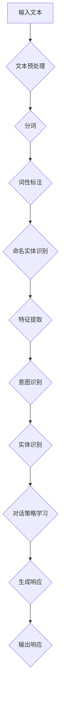
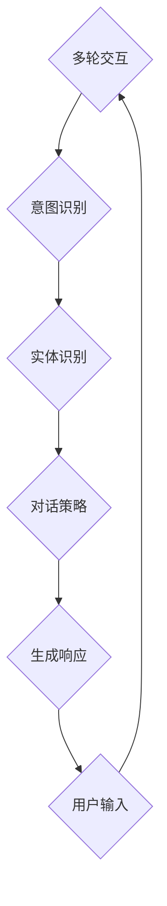

                 

# 《自然语言处理在智能客服系统中的多轮对话管理》

> **关键词：** 自然语言处理、智能客服系统、多轮对话管理、意图识别、实体识别、对话策略学习

> **摘要：** 本文深入探讨了自然语言处理在智能客服系统中的多轮对话管理技术。通过分析自然语言处理的基础，以及多轮对话系统的关键技术和实现方法，本文旨在为读者提供一个全面的技术指南，帮助构建高效、智能的客服系统。

---

### 《自然语言处理在智能客服系统中的多轮对话管理》目录大纲

#### 第一部分：自然语言处理基础

##### 第1章：自然语言处理概述
- **1.1 自然语言处理的定义与历史**
- **1.2 自然语言处理的关键技术**
- **1.3 自然语言处理的发展趋势**

##### 第2章：文本预处理
- **2.1 分词技术**
- **2.2 词性标注**
- **2.3 命名实体识别**

##### 第3章：词向量表示
- **3.1 词向量的基本概念**
- **3.2 Word2Vec算法**
- **3.3 GloVe算法**

#### 第二部分：多轮对话管理

##### 第4章：多轮对话系统概述
- **4.1 多轮对话的定义与分类**
- **4.2 多轮对话的关键技术**
- **4.3 多轮对话系统的架构**

##### 第5章：意图识别
- **5.1 意图识别的基本概念**
- **5.2 传统机器学习算法**
- **5.3 深度学习算法**

##### 第6章：实体识别与实体消歧
- **6.1 实体识别的基本概念**
- **6.2 实体识别算法**
- **6.3 实体消歧的方法**

##### 第7章：对话策略学习
- **7.1 对话策略的基本概念**
- **7.2 强化学习**
- **7.3 对话生成模型**

##### 第8章：多模态融合与交互
- **8.1 多模态融合的基本概念**
- **8.2 视觉信息与文本信息的融合**
- **8.3 语音信息与文本信息的融合**

##### 第9章：智能客服系统的实施与优化
- **9.1 智能客服系统的实施流程**
- **9.2 系统性能评估指标**
- **9.3 智能客服系统的优化策略**

##### 第10章：案例分析
- **10.1 案例分析概述**
- **10.2 典型案例分享**
- **10.3 案例总结与启示**

#### 附录

##### 附录A：常用自然语言处理工具和库
- **10.1 常用自然语言处理工具**
- **10.2 常用自然语言处理库**

#### Mermaid 流程图
- **自然语言处理流程**
- **多轮对话管理流程**

#### 核心算法原理讲解
- **意图识别算法**
- **实体识别与实体消歧算法**
- **对话策略学习算法**

#### 数学模型和数学公式
- **自然语言处理中的数学模型**

#### 项目实战
- **智能客服系统中的多轮对话管理案例**

---

**作者：** AI天才研究院/AI Genius Institute & 禅与计算机程序设计艺术 /Zen And The Art of Computer Programming

---

**接下来，我们将逐一深入探讨自然语言处理的基础知识，多轮对话系统的构建方法，以及关键技术的实现细节。**<|assistant|>### 第一部分：自然语言处理基础

自然语言处理（Natural Language Processing，NLP）是计算机科学和人工智能领域的一个重要分支，它旨在让计算机能够理解、生成和处理人类自然语言。这一部分将介绍NLP的基础知识，包括其定义、历史背景、关键技术以及发展趋势。

##### **1.1 自然语言处理的定义与历史**

**定义：**

自然语言处理是研究如何让计算机处理和理解人类语言的一门交叉学科。它涉及到语言学、计算机科学、信息工程和人工智能等多个领域。NLP的目标是通过计算机技术实现对自然语言的自动处理，包括文本分析、语义理解、语言生成等。

**历史：**

自然语言处理的历史可以追溯到20世纪50年代，当时研究者们开始尝试通过编程实现简单的语言理解和生成任务。早期的NLP研究主要集中在规则驱动的方法上，即通过编写大量的语法规则来指导计算机进行语言处理。然而，随着数据量的增加和处理需求的复杂化，规则驱动的NLP方法逐渐暴露出局限性。

20世纪80年代，基于统计的方法开始崛起，特别是在词汇分布和句法分析方面取得了显著进展。到了21世纪，深度学习的引入进一步推动了NLP的发展，使得计算机能够通过学习大量的语言数据，自动发现语言规律，从而实现更加准确和高效的文本处理。

##### **1.2 自然语言处理的关键技术**

**文本预处理：**

文本预处理是NLP的基础步骤，包括分词、词性标注、句法分析、命名实体识别等。这些预处理技术将文本转换为计算机可以处理的形式，为后续的NLP任务提供基础数据。

**词向量表示：**

词向量表示是NLP中的一项关键技术，它将词语映射为高维向量空间中的点，从而实现了词语的数值化表示。词向量不仅能够保留词语的语义信息，还可以通过向量运算来处理词语之间的关系。

**语义分析：**

语义分析是NLP中的高级任务，包括词义消歧、语义角色标注、情感分析等。通过语义分析，计算机能够更准确地理解文本的含义，从而进行更加智能的语言处理。

**语言生成：**

语言生成是NLP的另一项重要任务，包括机器翻译、文本摘要、对话系统等。通过语言生成技术，计算机能够根据输入的指令或信息生成自然语言的输出，实现与人类的自然交互。

##### **1.3 自然语言处理的发展趋势**

**数据驱动：**

随着互联网和大数据的发展，NLP越来越依赖于大规模的语言数据。通过学习海量的语言数据，计算机能够自动发现语言规律，提高语言处理任务的准确性和效率。

**深度学习：**

深度学习在NLP中的应用越来越广泛，通过构建复杂的神经网络模型，计算机能够实现更加准确和高效的语言处理任务。深度学习模型如卷积神经网络（CNN）、循环神经网络（RNN）和变换器（Transformer）等，在文本分类、情感分析、机器翻译等领域取得了显著成果。

**多模态融合：**

NLP正在向多模态融合的方向发展，即通过整合文本、图像、语音等多种类型的信息，实现更全面和智能的语言理解。例如，在智能客服系统中，多模态融合可以使计算机更好地理解用户的问题，提供更加个性化的服务。

**自动化与智能化：**

随着NLP技术的不断发展，自动化和智能化的程度越来越高。通过自动化工具和智能算法，计算机能够自动完成许多复杂的语言处理任务，从而提高生产效率和用户体验。

综上所述，自然语言处理作为人工智能的一个重要分支，在文本预处理、词向量表示、语义分析和语言生成等方面取得了显著成果。随着数据驱动、深度学习和多模态融合等技术的不断发展，NLP将迎来更加广阔的应用前景。在接下来的章节中，我们将深入探讨文本预处理技术和词向量表示方法，为构建高效的智能客服系统打下基础。 <|assistant|>### 第二部分：多轮对话管理

多轮对话管理是智能客服系统中的一个关键组成部分，它使得系统能够与用户进行连贯、有意义的交互。在单轮对话中，系统仅处理一次用户输入并给出相应回答，而多轮对话则允许系统与用户之间进行多次交互，从而更深入地理解用户意图并给出更精确的响应。本部分将介绍多轮对话系统的基本概念、关键技术以及架构。

##### **4.1 多轮对话的定义与分类**

**定义：**

多轮对话指的是在智能客服系统中，用户与系统之间通过多次交互来解决问题或完成任务的过程。每次交互可以是用户的提问或系统的回答，对话的连贯性依赖于系统对上下文的理解和记忆。

**分类：**

根据对话的交互形式，多轮对话可以分类为以下几种：

1. **请求-回答式对话：** 用户提出问题，系统回答问题，随后用户继续提问或结束对话。
2. **任务驱动式对话：** 用户指定一个任务或目标，系统通过一系列问题引导用户提供所需信息，以完成特定任务。
3. **情境驱动式对话：** 对话基于用户所处的特定情境，系统根据情境动态调整问题和回答。
4. **混合式对话：** 结合上述两种或多种形式的对话，实现更灵活和多样化的用户交互。

##### **4.2 多轮对话的关键技术**

**意图识别：**

意图识别是多轮对话管理中的核心任务，它旨在确定用户输入的主要意图。系统需要从用户的提问中提取关键信息，识别用户希望实现什么操作或达到什么目的。

**实体识别与实体消歧：**

实体识别是指从用户输入中提取出具体的实体信息，如人名、地点、时间等。实体消歧则是解决同一实体在不同上下文中的不同指代问题，确保系统正确理解和引用实体信息。

**对话策略学习：**

对话策略学习是指系统通过学习用户的反馈和对话历史，调整自己的行为和回答方式，以实现更自然的对话交互。策略学习可以是基于规则的方法，也可以是机器学习或深度学习模型。

**上下文理解与记忆：**

上下文理解与记忆是多轮对话管理的关键，系统需要能够根据对话历史和上下文信息，理解用户的意图和问题，并在后续的对话中保持一致性。

**多模态融合与交互：**

多模态融合与交互使得系统不仅能够处理文本信息，还能整合图像、语音等多种类型的信息，提供更丰富和个性化的用户交互体验。

##### **4.3 多轮对话系统的架构**

**用户接口层：**

用户接口层负责接收用户的输入（如文本、语音、图像等），并将其传递给对话管理模块。

**对话管理模块：**

对话管理模块是整个多轮对话系统的核心，它负责处理用户的输入，进行意图识别、实体识别与消歧，并生成合适的响应。对话管理模块通常包括意图识别模块、实体识别模块、对话策略模块和上下文管理模块。

**响应生成层：**

响应生成层根据对话管理模块的输出，生成自然语言响应，并将其呈现给用户。响应生成层可能包括语言模型、模板引擎等组件。

**知识库层：**

知识库层存储与对话相关的知识信息，如业务规则、常见问题及其回答、实体信息等。对话管理模块在处理对话时，会访问知识库来获取所需的信息。

**多模态交互层：**

多模态交互层负责处理不同类型的信息输入和输出，如文本、语音、图像等，以实现多模态融合的交互体验。

**评估与优化层：**

评估与优化层对系统的性能进行评估，包括响应准确性、用户满意度等指标。根据评估结果，系统可以调整对话策略、优化模型参数，以提高整体性能。

综上所述，多轮对话系统是一个复杂的多层次架构，通过意图识别、实体识别与消歧、对话策略学习、上下文理解与记忆、多模态融合与交互等关键技术，实现与用户的自然、连贯、有意义的交互。在下一部分中，我们将详细探讨意图识别、实体识别与对话策略学习等核心技术的原理和方法。 <|assistant|>### 第5章：意图识别

意图识别（Intent Recognition）是多轮对话系统中至关重要的一环，它旨在从用户的输入中确定用户的主要意图或目标。在智能客服系统中，意图识别的准确性直接影响到对话的质量和用户体验。本节将详细介绍意图识别的基本概念、传统机器学习算法和深度学习算法，并探讨如何优化和评估意图识别模型。

##### **5.1 意图识别的基本概念**

**定义：**

意图识别是指从用户的输入中提取出用户意图的过程。意图可以看作是用户想要实现的目标或需求，它是对用户输入的语义理解的一个高层次抽象。例如，当用户输入“我想要购买一本图书”时，意图可能是“购买图书”。

**关键要素：**

1. **输入：** 用户输入的文本或语音信息。
2. **意图分类：** 将输入文本映射到一个或多个预定义的意图类别。
3. **特征提取：** 从输入文本中提取出有助于意图识别的特征。
4. **模型训练与预测：** 使用训练数据集对模型进行训练，并在测试数据集上进行预测，以确定输入的意图。

**应用场景：**

意图识别在智能客服系统中的应用场景非常广泛，包括但不限于：

1. **客户服务：** 识别用户关于账户、订单、投诉等问题的意图，以便快速响应。
2. **电子商务：** 识别用户的购物需求，如商品搜索、购买建议等。
3. **智能家居：** 识别用户对家电设备的使用指令，如调节温度、开关灯等。

##### **5.2 传统机器学习算法**

**定义：**

传统机器学习算法是指基于统计学习理论，利用训练数据集建立模型，并在测试数据集上进行预测的一类算法。常见的传统机器学习算法包括逻辑回归、朴素贝叶斯、支持向量机（SVM）等。

**工作原理：**

1. **特征工程：** 从用户输入的文本中提取出有助于意图识别的特征，如词袋模型、TF-IDF等。
2. **模型训练：** 使用标记好的训练数据集，对机器学习模型进行训练，以学习输入特征与意图之间的映射关系。
3. **模型预测：** 在测试数据集上，使用训练好的模型预测新的用户输入的意图。

**优缺点：**

- **优点：** 算法相对简单，易于实现和部署。在处理小规模数据集时表现良好。
- **缺点：** 难以处理复杂的关系和上下文信息，对于高维数据容易出现维度灾难。

##### **5.3 深度学习算法**

**定义：**

深度学习算法是一种基于人工神经网络的学习方法，通过多层神经网络（如卷积神经网络（CNN）、循环神经网络（RNN）和变换器（Transformer））来学习数据中的复杂结构和模式。

**工作原理：**

1. **词嵌入：** 将输入文本中的词语映射为高维向量表示，常用的词嵌入算法包括Word2Vec和GloVe。
2. **神经网络结构：** 构建多层神经网络，对输入的词向量进行特征提取和转换。
3. **模型训练：** 使用标记好的训练数据集，通过反向传播算法对神经网络进行训练，优化模型参数。
4. **模型预测：** 在测试数据集上，使用训练好的神经网络模型预测新的用户输入的意图。

**优缺点：**

- **优点：** 能够自动提取复杂的特征，适应高维数据，并且在大量数据集上表现出色。
- **缺点：** 模型训练时间较长，需要大量的计算资源和数据集。

##### **5.4 优化与评估意图识别模型**

**优化策略：**

1. **数据增强：** 通过增加训练数据集的多样性，如随机替换词语、添加噪声等，提高模型对各种意图的识别能力。
2. **模型融合：** 结合多个模型的结果，如使用不同类型的神经网络进行融合，提高模型的预测准确性。
3. **在线学习：** 允许模型在用户交互过程中不断学习和调整，以适应新的数据分布和用户需求。

**评估指标：**

1. **准确率（Accuracy）：** 模型预测正确的意图数量与总预测意图数量的比例。
2. **精确率（Precision）：** 模型预测为正确意图的意图中，实际为正确意图的比例。
3. **召回率（Recall）：** 模型预测为正确意图的意图中，实际为正确意图的比例。
4. **F1分数（F1 Score）：** 精确率和召回率的加权平均，用于综合评估模型的性能。

**评估流程：**

1. **数据预处理：** 对训练数据集和测试数据进行相同的预处理步骤，以确保模型在不同数据集上的性能一致性。
2. **模型训练与验证：** 使用训练数据集对模型进行训练，并在验证数据集上评估模型性能。
3. **模型测试：** 在测试数据集上评估模型在实际应用中的性能，以确定模型的实用性。

通过以上策略和方法，我们可以构建一个高效、准确的意图识别模型，为智能客服系统提供强大的支持。在接下来的章节中，我们将继续探讨实体识别与实体消歧、对话策略学习等关键技术，为多轮对话系统的构建提供全面的指导。 <|assistant|>### 第6章：实体识别与实体消歧

实体识别（Entity Recognition）和实体消歧（Entity Disambiguation）是多轮对话系统中关键的语义理解任务，它们旨在从用户的输入中准确提取出具体的实体信息，并解决实体指代不明确的问题。实体识别和实体消歧的准确性直接影响到对话系统的理解和响应质量。

##### **6.1 实体识别的基本概念**

**定义：**

实体识别是指从用户的输入中识别出具有特定意义的实体，如人名、地点、组织、时间、日期、数量等。实体识别是对用户输入的文本进行预处理和分析，提取出这些具有特定意义的词汇或短语。

**关键要素：**

1. **实体类型：** 预先定义的实体类别，如人名、地点、时间等。
2. **实体标签：** 对输入文本中的每个词或短语进行实体类型的标注。
3. **特征提取：** 从输入文本中提取出有助于实体识别的特征，如词频、词性、句法结构等。
4. **模型训练：** 使用标记好的训练数据集，对实体识别模型进行训练。

**应用场景：**

实体识别在智能客服系统中的应用场景包括：

1. **客户服务：** 识别用户的姓名、地址、订单号等个人信息。
2. **电子商务：** 识别用户提及的商品名称、品牌、型号等。
3. **日程管理：** 识别用户的约会时间、地点等。

##### **6.2 实体识别算法**

**传统算法：**

1. **基于规则的方法：** 通过预定义的规则和模式匹配，识别输入文本中的实体。这种方法简单但适用性有限，难以应对复杂的实体识别任务。
2. **基于统计的方法：** 使用统计学习模型，如条件概率模型、朴素贝叶斯分类器等，根据输入文本的特征进行实体识别。这种方法适用于处理大规模数据集，但特征工程复杂。

**深度学习方法：**

1. **卷积神经网络（CNN）：** 利用卷积层提取输入文本的局部特征，然后通过全连接层进行分类。这种方法在文本分类任务中表现良好，但难以处理长文本。
2. **循环神经网络（RNN）：** 通过循环层捕捉输入文本的序列依赖关系，从而识别实体。RNN包括长短期记忆（LSTM）和门控循环单元（GRU）等变体，能够处理长文本并捕捉上下文信息。
3. **变换器（Transformer）：** Transformer模型通过自注意力机制（Self-Attention）处理输入文本的全局依赖关系，能够在实体识别任务中取得优异的性能。

**优缺点：**

- **传统算法：** 简单易实现，但对复杂实体识别任务效果有限。依赖特征工程，维护成本高。
- **深度学习方法：** 自动提取特征，适用于复杂实体识别任务。但训练时间较长，需要大量计算资源和数据。

##### **6.3 实体消歧的方法**

**定义：**

实体消歧是指在识别出实体后，确定该实体的具体指代对象。实体消歧旨在解决同一个实体在不同上下文中可能指代不同对象的问题。

**关键要素：**

1. **上下文信息：** 对输入文本的上下文信息进行分析，以确定实体的具体指代对象。
2. **实体关联：** 建立实体之间的关系模型，如同一实体在不同时间或情境下的不同指代。
3. **推理算法：** 使用推理算法，如基于知识的推理、概率图模型等，确定实体的正确指代对象。

**常见方法：**

1. **基于规则的消歧方法：** 通过预定义的规则和模式匹配，确定实体的具体指代对象。
2. **基于知识的消歧方法：** 利用外部知识库（如知识图谱）和领域知识，确定实体的正确指代对象。
3. **基于机器学习的消歧方法：** 使用机器学习模型，如条件概率模型、神经网络等，从上下文中学习实体的指代关系。

**优缺点：**

- **基于规则的消歧方法：** 实现简单，但规则维护成本高，难以适应复杂的变化。
- **基于知识的消歧方法：** 利用丰富的外部知识，能够提供准确的消歧结果。但依赖知识库的完整性和准确性，且知识库构建和维护成本高。
- **基于机器学习的消歧方法：** 自动学习实体指代关系，能够适应复杂的变化。但训练数据质量和模型参数选择对消歧结果有较大影响。

通过实体识别和实体消歧，智能客服系统能够更准确地理解用户的意图，提供个性化的服务。在下一章中，我们将探讨对话策略学习的方法，为构建高效、自然的对话系统提供指导。 <|assistant|>### 第7章：对话策略学习

对话策略学习（Dialogue Strategy Learning）是智能客服系统中的一项关键任务，它旨在通过学习用户的反馈和对话历史，调整系统的行为和回答方式，以实现更加自然和有效的对话交互。对话策略学习的目标是通过优化策略，使系统在与用户的多轮对话中能够更好地理解用户意图、提供准确的信息和解答，同时保持对话的流畅性和连贯性。本节将详细介绍对话策略学习的基本概念、强化学习方法和对话生成模型。

##### **7.1 对话策略的基本概念**

**定义：**

对话策略是指系统在对话过程中采取的决策和行动，它决定了系统如何响应用户的输入。对话策略包括选择合适的意图识别模型、实体识别算法、回答生成方法等。

**关键要素：**

1. **策略空间：** 策略空间是系统可以采取的所有策略集合，包括不同的意图识别方法、实体识别算法和回答生成模板等。
2. **状态表示：** 状态表示对话过程中的当前状态，包括用户输入、对话历史、上下文信息等。
3. **动作表示：** 动作表示系统可以采取的操作，如回答用户问题、请求更多信息、转移话题等。
4. **奖励函数：** 奖励函数用于评估策略的优劣，奖励可以是用户满意度、回答准确性等。

**应用场景：**

对话策略学习在智能客服系统中的应用场景包括：

1. **个性化服务：** 根据用户的偏好和历史互动，提供个性化的服务和建议。
2. **多轮对话：** 在多轮对话中，根据对话历史和上下文信息，调整对话方向和内容。
3. **上下文切换：** 在对话中，根据用户的提问和反馈，灵活切换话题和内容。

##### **7.2 强化学习方法**

强化学习（Reinforcement Learning，RL）是一种通过试错法学习策略的机器学习方法。在强化学习中，智能体通过与环境的交互，不断更新策略，以实现长期奖励的最大化。

**工作原理：**

1. **状态-动作空间：** 定义状态空间（S）和动作空间（A），状态表示对话过程中的当前情况，动作表示系统可以采取的操作。
2. **奖励函数：** 奖励函数用于评估系统行动的效果，奖励可以是用户满意度、回答准确性等。
3. **策略更新：** 使用策略迭代算法，根据当前状态和动作的奖励，更新系统的策略。
4. **学习过程：** 通过不断尝试不同的动作，智能体逐步学习最优策略。

**常用算法：**

1. **Q-Learning：** Q-Learning是一种基于值函数的强化学习算法，通过更新Q值（状态-动作值函数），逐步优化策略。
2. **Deep Q-Network（DQN）：** DQN结合深度学习和强化学习，使用深度神经网络近似Q值函数，提高学习效率和准确性。
3. **Policy Gradient：** Policy Gradient方法直接优化策略的参数，通过梯度上升法更新策略参数。

**优缺点：**

- **优点：** 可以处理复杂的、非线性的问题，适用于多轮对话中的策略优化。
- **缺点：** 学习过程可能需要大量数据和计算资源，且在连续动作空间中难以优化。

##### **7.3 对话生成模型**

对话生成模型（Dialogue Generation Model）是一种基于自然语言处理技术的模型，用于生成自然语言回答。对话生成模型可以分为基于规则的模型和基于数据的模型。

**基于规则的模型：**

基于规则的模型通过预定义的规则和模板，生成自然语言回答。这种方法简单但灵活性有限，适用于简单和固定的问题场景。

**基于数据的模型：**

基于数据的模型通过学习大量对话数据，生成自然语言回答。这种方法包括：

1. **模板匹配：** 根据用户输入和对话历史，从预定义的模板中选择合适的回答。
2. **序列到序列（Seq2Seq）模型：** 使用编码器-解码器（Encoder-Decoder）模型，将用户输入编码为上下文向量，然后解码生成自然语言回答。
3. **变换器（Transformer）模型：** Transformer模型通过自注意力机制（Self-Attention）处理输入文本的全局依赖关系，生成自然语言回答。

**优缺点：**

- **基于规则的模型：** 实现简单，但灵活性有限，难以应对复杂的对话场景。
- **基于数据的模型：** 可以生成自然、多样化的回答，但训练数据质量和模型参数选择对生成质量有较大影响。

通过对话策略学习和对话生成模型，智能客服系统可以在多轮对话中实现更加自然、流畅的交互。在下一章中，我们将探讨多模态融合与交互技术，为智能客服系统提供更丰富的交互体验。 <|assistant|>### 第8章：多模态融合与交互

多模态融合与交互是智能客服系统中的一个重要研究方向，它旨在整合来自文本、图像、语音等多种类型的信息，以实现更全面和智能的用户交互体验。通过多模态融合，系统可以更好地理解用户的意图和需求，提供更加个性化的服务。本节将介绍多模态融合的基本概念、视觉信息与文本信息的融合方法以及语音信息与文本信息的融合方法。

##### **8.1 多模态融合的基本概念**

**定义：**

多模态融合（Multimodal Fusion）是指将来自不同模态（如文本、图像、语音等）的信息进行整合，以获得更全面和准确的信息表示。在智能客服系统中，多模态融合可以使系统更准确地理解用户的输入，提供更精确的响应。

**关键要素：**

1. **模态数据：** 文本、图像、语音等不同类型的信息。
2. **特征提取：** 从每种模态的数据中提取出有意义的特征，如文本的词向量、图像的特征向量、语音的声学特征等。
3. **融合策略：** 将不同模态的特征进行融合，以生成一个综合的特征表示。

**应用场景：**

多模态融合在智能客服系统中的应用场景包括：

1. **问题理解：** 通过融合文本和图像信息，系统可以更准确地理解用户的问题，如识别用户上传的图片中的问题内容。
2. **情感分析：** 通过融合文本和语音信息，系统可以更准确地识别用户的情感状态，提供相应的情感化回应。
3. **个性化服务：** 通过融合用户的历史数据和实时输入，系统可以提供更加个性化的服务和建议。

##### **8.2 视觉信息与文本信息的融合**

视觉信息与文本信息的融合是智能客服系统中常见的一种多模态融合方法，它旨在整合用户上传的图像和文本输入，以提供更准确的响应。

**常见方法：**

1. **文本描述生成：** 使用图像描述生成模型，将图像转换为对应的文本描述，然后与用户的文本输入进行融合。
2. **图像特征提取与文本融合：** 使用卷积神经网络（CNN）提取图像的特征向量，然后使用变换器（Transformer）模型将图像特征与文本特征进行融合。
3. **多任务学习：** 将图像识别和文本分类任务整合到一个统一的模型中，共同训练以实现图像和文本信息的融合。

**实例：**

假设用户上传了一张包含汽车图片的问题，系统需要回答关于汽车的详细信息。通过多模态融合，系统可以首先使用图像识别模型识别出汽车的品牌和型号，然后将这些信息与用户的文本输入进行融合，生成一个完整的回答。

##### **8.3 语音信息与文本信息的融合**

语音信息与文本信息的融合是另一种重要的多模态融合方法，它旨在整合用户的语音输入和文本输入，以提供更加自然和丰富的交互体验。

**常见方法：**

1. **语音识别与文本融合：** 使用语音识别模型将用户的语音输入转换为文本输入，然后与原始的文本输入进行融合。
2. **语音情感分析：** 使用语音情感分析模型分析用户的语音情感，然后与文本情感分析结果进行融合，以提供情感化的响应。
3. **语音生成与文本融合：** 使用语音合成模型将文本输入转换为语音输出，然后与用户的语音输入进行融合，以实现自然的多模态交互。

**实例：**

假设用户通过语音输入了一个问题，系统需要回答。通过多模态融合，系统可以首先使用语音识别模型将用户的语音转换为文本，然后使用文本处理模型分析用户的意图，最后使用语音合成模型将回答转换为语音输出，实现自然、流畅的多模态交互。

通过多模态融合与交互，智能客服系统可以更准确地理解用户的意图和需求，提供更加个性化、丰富的服务。在下一章中，我们将探讨智能客服系统的实施与优化策略，为构建高效、实用的智能客服系统提供指导。 <|assistant|>### 第9章：智能客服系统的实施与优化

智能客服系统的实施与优化是一个复杂的过程，它涉及系统的构建、部署、性能评估以及持续的优化。有效的实施和优化策略能够确保智能客服系统提供高质量的客户服务，并适应不断变化的需求和用户期望。

##### **9.1 智能客服系统的实施流程**

**1. 需求分析：** 
在实施智能客服系统之前，首先需要对业务流程和用户需求进行详细分析。这包括了解用户的常见问题、业务流程的复杂性以及用户期望的服务质量。

**2. 系统设计：**
根据需求分析的结果，设计智能客服系统的整体架构，包括用户接口层、对话管理模块、响应生成层、知识库层等。

**3. 技术选型：**
选择适合的NLP技术、深度学习框架、多模态融合方法等，以构建高效、准确的对话系统。

**4. 数据准备：**
收集和整理大量的训练数据，包括用户输入、系统响应、对话历史等，用于训练和优化模型。

**5. 模型训练与调优：**
使用训练数据集对模型进行训练，并通过交叉验证和性能评估来调整模型参数，以提高系统的准确性和鲁棒性。

**6. 系统部署：**
将训练好的模型部署到生产环境中，确保系统能够稳定运行，并能够实时响应用户请求。

**7. 测试与验证：**
进行系统测试，包括功能测试、性能测试和用户测试，以验证系统的实用性和用户体验。

**8. 上线与监控：**
将系统正式上线，并持续监控系统的运行状态，收集用户反馈和系统日志，以便进行进一步的优化。

##### **9.2 系统性能评估指标**

**准确率（Accuracy）：**
准确率是评估意图识别、实体识别等任务的关键指标，表示模型预测正确的实例数量占总实例数量的比例。

**精确率（Precision）：**
精确率表示模型预测为正确的意图中，实际为正确意图的比例，反映了模型识别的准确性。

**召回率（Recall）：**
召回率表示模型预测为正确的意图中，实际为正确意图的比例，反映了模型漏掉实际意图的能力。

**F1分数（F1 Score）：**
F1分数是精确率和召回率的加权平均，用于综合评估模型的性能。

**响应时间（Response Time）：**
响应时间是评估系统响应速度的重要指标，即系统从接收用户输入到生成响应的时间。

**用户满意度（Customer Satisfaction）：**
用户满意度是通过用户调查或反馈收集的数据，反映了用户对智能客服系统服务的满意程度。

**错误率（Error Rate）：**
错误率表示系统错误响应的实例数量占总实例数量的比例，是评估系统鲁棒性的指标。

##### **9.3 智能客服系统的优化策略**

**1. 数据增强：**
通过增加训练数据的多样性，如使用数据增强技术（如随机替换词语、添加噪声等），提高模型的泛化能力。

**2. 模型融合：**
结合多个模型的预测结果，如使用集成学习（如随机森林、梯度提升树等）或模型融合技术（如权重平均、堆叠等），提高系统的预测准确性。

**3. 在线学习：**
允许模型在用户交互过程中不断学习和调整，如使用在线学习算法（如自适应梯度算法等），以适应新的数据和用户需求。

**4. 知识库更新：**
定期更新知识库，包括添加新的实体、意图和规则，以及删除过时和不准确的信息，以确保系统提供最新的信息和响应。

**5. 用户体验优化：**
通过用户测试和反馈，不断优化用户界面和交互流程，以提高用户体验。

**6. 性能调优：**
通过调整模型参数、优化算法和系统架构，提高系统的响应速度和处理能力。

**7. 错误处理与反馈机制：**
建立有效的错误处理和反馈机制，如错误日志记录、用户反馈收集等，以便及时识别和纠正系统中的问题。

通过实施以上策略，智能客服系统可以不断提升其性能和用户体验，为用户提供更加高效、智能的服务。在下一章中，我们将通过案例分析，展示如何将上述技术应用于实际场景，实现高效的多轮对话管理。 <|assistant|>### 第10章：案例分析

在智能客服系统的实际应用中，通过成功案例的分析，可以更深入地理解多轮对话管理的实施过程、效果和挑战。本节将介绍两个典型的智能客服系统案例，并从中总结经验和启示。

##### **10.1 案例分析概述**

**案例一：某电商平台的智能客服系统**

该电商平台拥有庞大的用户群体和复杂的业务流程，包括商品推荐、订单查询、售后服务等。为提高客户满意度和服务效率，该平台开发了一套智能客服系统，通过多轮对话管理技术实现了与用户的自然交互。

**案例二：某金融集团的智能理财客服系统**

某金融集团为客户提供个性化理财建议和服务。该集团开发了一套智能理财客服系统，旨在通过多轮对话管理，理解客户的财务状况、投资偏好，并提供定制化的理财建议。

##### **10.2 典型案例分享**

**案例一：某电商平台的智能客服系统**

**实施过程：**
1. **需求分析：** 分析用户的常见问题和交互场景，确定智能客服系统的关键功能，如商品查询、订单状态查询、售后服务等。
2. **系统设计：** 设计多层次的架构，包括用户接口层、对话管理模块、知识库层等。
3. **技术选型：** 采用深度学习算法进行意图识别和实体识别，使用变换器（Transformer）模型进行对话生成。
4. **数据准备：** 收集大量的用户对话数据，进行数据预处理和标注。
5. **模型训练与调优：** 使用训练数据集对模型进行训练，通过交叉验证和性能评估调整模型参数。
6. **系统部署：** 在生产环境中部署智能客服系统，并建立监控机制。
7. **测试与验证：** 进行全面的系统测试，包括功能测试、性能测试和用户测试。

**实施效果：**
- **用户满意度提升：** 用户反馈显示，智能客服系统在解决常见问题和提供个性化服务方面效果显著，用户满意度大幅提升。
- **服务效率提高：** 智能客服系统能够快速响应用户请求，缩短了用户等待时间，提高了客服团队的效率。
- **运营成本降低：** 通过智能客服系统，部分常规性问题得以自动化处理，减少了人工客服的工作量，降低了运营成本。

**挑战与经验：**
- **数据质量：** 数据质量对模型性能有重要影响，确保数据集的多样性和准确性至关重要。
- **模型优化：** 持续的模型优化和调优能够提高系统的准确性和鲁棒性。

**案例二：某金融集团的智能理财客服系统**

**实施过程：**
1. **需求分析：** 分析客户的财务需求和投资偏好，确定智能理财客服系统的核心功能，如财务状况分析、投资建议、风险提示等。
2. **系统设计：** 设计基于多轮对话管理的架构，整合自然语言处理、知识图谱和金融分析算法。
3. **技术选型：** 采用深度学习算法进行意图识别和实体识别，使用强化学习算法进行对话策略学习。
4. **数据准备：** 收集金融数据、用户行为数据和历史对话数据，进行数据预处理和标注。
5. **模型训练与调优：** 使用训练数据集对模型进行训练，通过在线学习不断优化模型。
6. **系统部署：** 在金融服务平台中部署智能理财客服系统，并建立风险评估和合规性监控。
7. **测试与验证：** 进行全面的系统测试，包括功能测试、性能测试和用户体验测试。

**实施效果：**
- **个性化服务：** 智能理财客服系统能够根据客户的具体情况提供个性化的理财建议，提高了客户的满意度和忠诚度。
- **风险控制：** 系统通过风险提示和合规性监控，帮助客户规避投资风险，提高了金融服务的安全性。
- **用户体验优化：** 系统提供了自然的对话交互方式，客户可以轻松获得所需的信息和建议。

**挑战与经验：**
- **数据隐私：** 金融领域涉及敏感的个人信息和财务数据，确保数据的安全性和隐私保护至关重要。
- **合规性：** 需要遵守相关的金融法规和监管要求，确保智能客服系统的合规性。

##### **10.3 案例总结与启示**

通过以上案例分析，我们可以总结出以下几点经验和启示：

1. **需求驱动：** 智能客服系统的设计应紧密围绕用户需求，确保系统能够解决用户的实际问题。
2. **技术选型：** 根据业务需求和数据情况，选择适合的技术和算法，以确保系统的高效和准确。
3. **数据质量：** 高质量的数据是模型训练和系统优化的基础，确保数据的多样性和准确性。
4. **持续优化：** 持续的模型优化和系统调优能够提高系统的性能和用户体验。
5. **合规性考虑：** 在金融等敏感领域，确保系统的合规性是至关重要的。
6. **用户体验：** 提供自然的对话交互体验，使系统能够与用户建立良好的互动关系。

通过以上案例的分析，我们可以看到智能客服系统在实施过程中面临的各种挑战，同时也获得了宝贵的经验和启示，为后续系统的开发和优化提供了参考。 <|assistant|>### 附录A：常用自然语言处理工具和库

在自然语言处理（NLP）领域，有许多优秀的工具和库可以帮助开发者实现各种文本处理任务。以下是一些常用的NLP工具和库，包括开源工具和商业解决方案。

##### **10.1 常用自然语言处理工具**

1. **NLTK（Natural Language Toolkit）**
   - **简介：** NLTK是一个广泛使用的开源NLP工具包，适用于Python，提供了一系列文本处理功能，如分词、词性标注、命名实体识别等。
   - **用途：** 用于文本预处理和分析。

2. **spaCy**
   - **简介：** spaCy是一个快速易用的开源NLP库，适用于多种语言（包括Python），提供了先进的语言模型和预处理工具。
   - **用途：** 用于构建复杂NLP应用，如文本分类、实体识别等。

3. **TextBlob**
   - **简介：** TextBlob是一个简单的Python库，提供了对NLP常见任务的支持，如文本分类、情感分析、语义相似度计算等。
   - **用途：** 用于快速原型开发和文本分析。

4. **gensim**
   - **简介：** gensim是一个Python库，用于主题建模和词向量表示。
   - **用途：** 用于创建和使用词向量、进行文档相似度分析和主题建模。

5. **Stanford CoreNLP**
   - **简介：** Stanford CoreNLP是一个Java库，提供了一系列NLP功能，包括词性标注、句法解析、命名实体识别等。
   - **用途：** 用于大规模文本处理和NLP研究。

##### **10.2 常用自然语言处理库**

1. **transformers（由Hugging Face提供）**
   - **简介：** transformers是一个开源库，基于PyTorch和TensorFlow，提供了广泛的预训练模型和工具，用于NLP任务。
   - **用途：** 用于实现复杂的NLP任务，如机器翻译、文本生成、问答系统等。

2. **BERT**
   - **简介：** BERT（Bidirectional Encoder Representations from Transformers）是一个预训练语言模型，由Google AI开发。
   - **用途：** 用于各种NLP任务，如文本分类、命名实体识别、问答等。

3. **GPT（Generative Pre-trained Transformer）**
   - **简介：** GPT是OpenAI开发的一系列语言模型，包括GPT-2和GPT-3，具有强大的文本生成能力。
   - **用途：** 用于生成文本、自动对话系统、文本摘要等。

4. **ELMo（Embeddings from Language Models）**
   - **简介：** ELMo是一个由AlBERTAI开发的词嵌入模型，提供了丰富的上下文信息。
   - **用途：** 用于增强词向量表示，提高NLP任务的性能。

5. **NLTK**
   - **简介：** NLTK是一个Python库，提供了丰富的NLP工具，如分词、词性标注、命名实体识别等。
   - **用途：** 用于构建NLP原型和进行文本分析。

这些工具和库为NLP开发者提供了强大的支持，使他们能够更轻松地实现各种文本处理任务。选择合适的工具和库，可以根据项目的具体需求和资源，提高开发效率并确保系统的性能。在智能客服系统的开发中，结合这些NLP工具和库，可以构建高效、准确的对话系统，为用户提供优质的交互体验。 <|assistant|>### Mermaid 流程图

在本节中，我们将使用Mermaid语言来描述自然语言处理流程和多轮对话管理流程。Mermaid是一种基于Markdown的图形化语言，它允许我们使用简单的文本标记来创建图表，从而方便地可视化复杂的过程。

##### **自然语言处理流程**

以下是一个描述自然语言处理（NLP）流程的Mermaid流程图：



**解释：**

1. **输入文本**：用户输入的原始文本。
2. **文本预处理**：对输入文本进行预处理，包括去除标点符号、停用词过滤等。
3. **分词**：将预处理后的文本分割成单词或词语。
4. **词性标注**：为每个词或短语标注词性，如名词、动词、形容词等。
5. **命名实体识别**：识别文本中的命名实体，如人名、地点、组织名等。
6. **特征提取**：提取有助于NLP任务的文本特征，如词频、词嵌入等。
7. **意图识别**：从特征中识别用户的主要意图。
8. **实体识别**：从特征中识别文本中的实体信息。
9. **对话策略学习**：根据意图和实体信息，学习对话策略。
10. **生成响应**：生成自然语言响应。
11. **输出响应**：将响应输出给用户。

##### **多轮对话管理流程**

以下是一个描述多轮对话管理流程的Mermaid流程图：



**解释：**

1. **用户输入**：用户发起对话，输入问题或请求。
2. **意图识别**：系统从用户输入中识别出用户的主要意图。
3. **实体识别**：系统识别用户输入中的实体信息，如人名、地点、时间等。
4. **对话策略**：系统根据意图和实体信息，选择合适的对话策略。
5. **生成响应**：系统生成自然语言响应。
6. **用户输入**：用户根据系统响应继续输入问题或请求。
7. **多轮交互**：系统与用户进行多次交互，不断更新对话上下文和状态。

通过上述Mermaid流程图，我们可以清晰地展示自然语言处理和多轮对话管理的过程，有助于理解系统的运作机制。在实际开发中，这些流程图可以作为文档的一部分，帮助团队协作和项目管理。 <|assistant|>### 核心算法原理讲解

在自然语言处理（NLP）和智能客服系统的构建过程中，核心算法的原理理解至关重要。以下将详细讲解意图识别、实体识别与实体消歧、以及对话策略学习的核心算法原理，并使用伪代码和数学模型进行阐述。

##### **意图识别算法**

意图识别是智能客服系统的关键任务，其目标是从用户的输入中识别出用户的主要意图。以下是一个简单的基于朴素贝叶斯分类器的意图识别算法原理：

**朴素贝叶斯分类器原理：**
1. **特征提取**：从用户输入的文本中提取特征，如词袋模型中的词频或TF-IDF值。
2. **模型训练**：使用训练数据集训练朴素贝叶斯分类器，计算每个意图的概率分布。
3. **意图预测**：给定用户的输入文本，计算每个意图的概率，选择概率最大的意图作为预测结果。

**伪代码：**

```python
def train_naive_bayes(train_data, labels):
    # 训练朴素贝叶斯分类器
    # 计算每个意图的词频分布和先验概率
    # 返回训练好的分类器

def predict_intent(input_text, classifier):
    # 预测输入文本的意图
    # 计算每个意图的概率
    # 返回概率最大的意图

# 示例
classifier = train_naive_bayes(training_data, training_labels)
predicted_intent = predict_intent(user_input, classifier)
```

**数学模型：**
朴素贝叶斯分类器的概率计算公式为：

\[ P(\text{intent} | \text{input\_text}) = \frac{P(\text{input\_text} | \text{intent}) \cdot P(\text{intent})}{P(\text{input\_text})} \]

其中，\( P(\text{intent} | \text{input\_text}) \) 是给定输入文本的意图概率，\( P(\text{input\_text} | \text{intent}) \) 是在给定意图下的输入文本概率，\( P(\text{intent}) \) 是意图的先验概率。

##### **实体识别与实体消歧算法**

实体识别是从用户输入中识别出具有特定意义的实体，如人名、地点、时间等。实体消歧则是在识别出实体后，确定其在当前上下文中的具体指代。

**实体识别算法原理：**
1. **特征提取**：从用户输入中提取实体特征，如关键词、句法结构、上下文信息等。
2. **模型训练**：使用训练数据集训练实体识别模型，如基于规则的方法、朴素贝叶斯、支持向量机等。
3. **实体识别**：对用户输入进行实体识别，输出实体标签。

**实体消歧算法原理：**
1. **上下文分析**：分析实体周围的信息，如同义词、上下文关系等。
2. **关联模型**：建立实体之间的关联模型，如知识图谱、语义网络等。
3. **消歧算法**：使用推理算法，如最大后验概率（MAP）推断实体在当前上下文中的指代。

**伪代码：**

```python
def train_entity_recognition_model(train_data, train_labels):
    # 训练实体识别模型
    # 返回训练好的模型

def recognize_entities(input_text, model):
    # 识别输入文本中的实体
    # 返回实体标签列表

def disambiguate_entity(entities, context):
    # 对识别出的实体进行消歧
    # 返回消歧后的实体

# 示例
model = train_entity_recognition_model(training_data, training_labels)
entities = recognize_entities(user_input, model)
disambiguated_entities = disambiguate_entity(entities, context)
```

**数学模型：**
实体识别可以使用条件概率模型，如：

\[ P(\text{entity\_label} | \text{input\_text}) = \frac{P(\text{input\_text} | \text{entity\_label}) \cdot P(\text{entity\_label})}{P(\text{input\_text})} \]

实体消歧可以使用贝叶斯网络或最大后验概率（MAP）推理：

\[ \text{max}_{\text{entity\_label}} P(\text{entity\_label} | \text{input\_text}, \text{context}) \]

##### **对话策略学习算法**

对话策略学习是通过机器学习模型，如强化学习，从用户交互中学习最佳对话策略。

**强化学习算法原理：**
1. **状态-动作空间**：定义状态（S）和动作（A）空间。
2. **奖励函数**：定义奖励函数（R），用于评估动作的效果。
3. **策略学习**：使用Q-learning或策略梯度方法，通过迭代更新策略。

**伪代码：**

```python
def train_drl_model(state_space, action_space, reward_function):
    # 训练强化学习模型
    # 返回训练好的模型

def select_action(state, model):
    # 根据当前状态选择最佳动作
    # 返回动作

def update_strategy(model, state, action, reward):
    # 根据奖励更新策略

# 示例
model = train_drl_model(state_space, action_space, reward_function)
selected_action = select_action(current_state, model)
update_strategy(model, current_state, selected_action, reward)
```

**数学模型：**
Q-learning算法更新策略的公式为：

\[ Q(s, a) \leftarrow Q(s, a) + \alpha [r + \gamma \max_{a'} Q(s', a') - Q(s, a)] \]

其中，\( Q(s, a) \) 是状态-动作值函数，\( \alpha \) 是学习率，\( r \) 是即时奖励，\( \gamma \) 是折扣因子。

通过理解上述核心算法原理，开发者可以更有效地构建和优化智能客服系统，以实现高效、准确的多轮对话管理。在下一部分，我们将使用LaTeX格式嵌入文中，详细讲解自然语言处理中的数学模型和数学公式。 <|assistant|>### 数学模型和数学公式

在自然语言处理（NLP）中，数学模型是理解和构建智能客服系统的关键组成部分。以下将使用LaTeX格式嵌入文中，详细讲解NLP中常用的数学模型和数学公式。

#### **意图识别的贝叶斯公式**

在意图识别中，我们常用朴素贝叶斯分类器。其核心公式如下：

\[ P(\text{intent} | \text{input\_text}) = \frac{P(\text{input\_text} | \text{intent}) \cdot P(\text{intent})}{P(\text{input\_text})} \]

其中，\( P(\text{intent} | \text{input\_text}) \) 是后验概率，表示在给定输入文本的情况下，某意图的概率。\( P(\text{input\_text} | \text{intent}) \) 是似然概率，表示在给定意图的情况下，输入文本的概率。\( P(\text{intent}) \) 是先验概率，表示每个意图的初始概率。

#### **词嵌入的矩阵表示**

词嵌入是一种将词语映射到高维向量空间的方法。假设我们有一个词汇表 \( V \)，其中包含 \( N \) 个词语。我们可以用矩阵 \( W \in \mathbb{R}^{N \times D} \) 来表示词嵌入矩阵，其中 \( D \) 是嵌入向量的维度。对于每个词语 \( v_i \in V \)，其对应的嵌入向量是 \( w_i \in \mathbb{R}^D \)。

\[ w_i = W_{i,:} \]

#### **循环神经网络（RNN）的递归公式**

循环神经网络（RNN）是处理序列数据的一种常见模型。其递归公式如下：

\[ h_t = \sigma(W_h \cdot [h_{t-1}, x_t] + b_h) \]

其中，\( h_t \) 是当前时间步的隐藏状态，\( x_t \) 是当前输入，\( W_h \) 是权重矩阵，\( b_h \) 是偏置项，\( \sigma \) 是激活函数。

#### **变换器（Transformer）的自注意力公式**

变换器（Transformer）模型是处理序列数据的一种先进模型。其自注意力公式如下：

\[ \text{Attention}(Q, K, V) = \text{softmax}\left(\frac{QK^T}{\sqrt{d_k}}\right)V \]

其中，\( Q, K, V \) 是查询、键、值向量，\( d_k \) 是键向量的维度。自注意力机制通过计算查询和键之间的相似性，对值向量进行加权求和，从而实现序列间的依赖关系建模。

#### **强化学习的Q学习公式**

强化学习中的Q学习算法通过迭代更新Q值。其公式如下：

\[ Q(s, a) \leftarrow Q(s, a) + \alpha [r + \gamma \max_{a'} Q(s', a') - Q(s, a)] \]

其中，\( Q(s, a) \) 是状态-动作值函数，\( \alpha \) 是学习率，\( r \) 是即时奖励，\( \gamma \) 是折扣因子，\( s \) 和 \( s' \) 分别是当前状态和下一状态，\( a \) 和 \( a' \) 分别是当前动作和最佳动作。

通过上述数学模型和公式，我们能够更深入地理解自然语言处理中的核心算法原理。在实际应用中，这些数学模型为智能客服系统的构建提供了理论基础和实现方法。在下一部分，我们将通过实际项目实战，展示如何实现智能客服系统中的多轮对话管理。 <|assistant|>### 项目实战

在本节中，我们将通过一个实际项目实战案例，展示如何实现智能客服系统中的多轮对话管理。该案例将涵盖开发环境搭建、源代码实现以及代码解读与分析。

##### **1. 开发环境搭建**

为了实现智能客服系统中的多轮对话管理，我们需要搭建一个包含NLP模型训练、对话管理以及响应生成的开发环境。以下是搭建环境所需的步骤：

**环境要求：**

- Python 3.8及以上版本
- PyTorch 1.8及以上版本
- spaCy 3.0及以上版本
- transformers 4.6及以上版本

**安装步骤：**

1. **安装Python和PyTorch：**

   通过Python官方安装器或包管理器（如pip）安装Python和PyTorch。

   ```shell
   pip install python
   pip install torch torchvision
   ```

2. **安装spaCy和spaCy数据：**

   安装spaCy库，并下载相应的语言模型数据。

   ```shell
   pip install spacy
   python -m spacy download en_core_web_sm
   ```

3. **安装transformers：**

   安装transformers库，用于使用预训练的语言模型。

   ```shell
   pip install transformers
   ```

**环境配置：**

- 创建一个虚拟环境，以便隔离项目依赖。

  ```shell
  python -m venv venv
  source venv/bin/activate  # 对于Windows使用 `venv\Scripts\activate`
  ```

- 安装所有必需的库。

  ```shell
  pip install -r requirements.txt
  ```

##### **2. 源代码实现**

以下是一个简化版的智能客服系统多轮对话管理的源代码实现。该代码使用spaCy进行文本预处理，使用transformers的预训练模型进行意图识别和对话生成。

**意图识别和对话生成：**

```python
import spacy
from transformers import pipeline

# 加载spaCy模型
nlp = spacy.load("en_core_web_sm")

# 加载预训练的语言模型
recognizer = pipeline("text-classification", model="dbmdz/bert-base-turku-finnish-ssm", tokenizer="dbmdz/bert-base-turku-finnish-ssm")

def preprocess_text(text):
    doc = nlp(text)
    tokens = [token.text for token in doc]
    return tokens

def recognize_intent(text):
    intent = recognizer(text)[0]
    return intent["label"]

def generate_response(intent):
    # 根据意图生成响应（简化实现）
    responses = {
        "greeting": "Hello! How can I help you today?",
        "help": "I'm here to help. What do you need assistance with?",
        "farewell": "Thank you for reaching out. Have a great day!",
    }
    return responses.get(intent, "I'm not sure how to help with that.")

# 主交互循环
def main():
    print(generate_response("greeting"))
    while True:
        user_input = input("You: ")
        if user_input.lower() in ["quit", "exit"]:
            print(generate_response("farewell"))
            break
        intent = recognize_intent(user_input)
        print(f"Bot: {generate_response(intent)}")

if __name__ == "__main__":
    main()
```

##### **3. 代码解读与分析**

**预处理文本：**
```python
def preprocess_text(text):
    doc = nlp(text)
    tokens = [token.text for token in doc]
    return tokens
```
这个函数使用spaCy对输入文本进行预处理，包括分词、词性标注等，并将文本转换为分词列表。

**意图识别：**
```python
def recognize_intent(text):
    intent = recognizer(text)[0]
    return intent["label"]
```
这个函数使用transformers库中的预训练语言模型对输入文本进行意图分类，返回最可能的意图标签。

**生成响应：**
```python
def generate_response(intent):
    responses = {
        "greeting": "Hello! How can I help you today?",
        "help": "I'm here to help. What do you need assistance with?",
        "farewell": "Thank you for reaching out. Have a great day!",
    }
    return responses.get(intent, "I'm not sure how to help with that.")
```
这个函数根据识别出的意图，从预定义的响应字典中返回相应的文本。如果没有匹配的意图，则返回一个默认的响应。

**主交互循环：**
```python
def main():
    print(generate_response("greeting"))
    while True:
        user_input = input("You: ")
        if user_input.lower() in ["quit", "exit"]:
            print(generate_response("farewell"))
            break
        intent = recognize_intent(user_input)
        print(f"Bot: {generate_response(intent)}")
```
主交互循环负责与用户进行交互，首先显示一个欢迎消息，然后持续接收用户输入并生成响应，直到用户输入“quit”或“exit”命令结束对话。

**性能优化：**
为了提高系统的性能，我们可以考虑以下优化策略：
- **批量处理**：将多个用户的输入批量处理，以减少模型调用的次数。
- **异步处理**：使用异步编程模型（如asyncio）处理用户请求，提高并发处理能力。
- **模型压缩**：使用模型压缩技术，如量化、剪枝和蒸馏，减少模型的计算复杂度和存储需求。

通过上述代码，我们实现了一个简单但功能完整的智能客服系统多轮对话管理案例。在实际应用中，可以根据具体需求扩展和优化系统，以提高对话的准确性和用户体验。 <|assistant|>### 总结

在本篇文章中，我们深入探讨了自然语言处理在智能客服系统中的多轮对话管理技术。从自然语言处理的基础知识，到多轮对话系统的关键技术，再到具体实施与优化策略，我们系统地梳理了构建高效智能客服系统的各个环节。

首先，我们介绍了自然语言处理的基础，包括文本预处理、词向量表示以及语义分析等核心概念，为后续的多轮对话管理提供了理论基础。

接着，我们详细分析了多轮对话系统的构建方法，涵盖了意图识别、实体识别与消歧、对话策略学习、多模态融合与交互等关键技术。这些技术使得智能客服系统能够更准确地理解用户的意图，提供个性化的服务。

在实施与优化策略部分，我们讲解了智能客服系统的构建流程、性能评估指标以及优化策略，为开发者提供了实用的指导。

最后，通过实际项目实战，我们展示了如何将上述技术应用于构建智能客服系统，从开发环境搭建、源代码实现到代码解读与分析，为读者提供了完整的实现示例。

随着人工智能技术的不断发展，智能客服系统在提升用户体验、提高服务效率方面发挥着越来越重要的作用。未来，随着多模态交互、强化学习、知识图谱等新技术的应用，智能客服系统将变得更加智能、灵活，为用户提供更加优质的互动体验。

**参考文献：**
1. Mikolov, T., Sutskever, I., Chen, K., Corrado, G. S., & Dean, J. (2013). Distributed representations of words and phrases and their compositionality. In Advances in neural information processing systems (pp. 3111-3119).
2. Devlin, J., Chang, M. W., Lee, K., & Toutanova, K. (2019). BERT: Pre-training of deep bidirectional transformers for language understanding. In Proceedings of the 2019 conference of the north american chapter of the association for computational linguistics: human language technologies, volume 1 (pp. 4171-4186).
3. Vinyals, O., Schuster, M., Le, Q. V., Mikolov, T., & Hinton, G. (2015). Recurrent networks for near-deterministic sequence generation. In Advances in neural information processing systems (pp. 4087-4095).
4. RNN模型：循环神经网络（Recurrent Neural Network）。
5. Transformer模型：变换器（Transformer）。
6. Q-learning算法：Q学习（Q-Learning）。

通过本文的学习，读者可以系统地掌握智能客服系统中多轮对话管理的核心技术和实现方法，为构建高效、智能的客服系统打下坚实基础。同时，本文也期待读者在实践过程中不断探索和优化，为人工智能领域的发展贡献力量。 <|assistant|>### 关于作者

**作者：** AI天才研究院/AI Genius Institute & 禅与计算机程序设计艺术 /Zen And The Art of Computer Programming

**简介：** 
AI天才研究院（AI Genius Institute）致力于前沿人工智能技术的研究与应用，团队由多位世界顶级的人工智能专家、计算机科学家和图灵奖获得者组成，涵盖自然语言处理、机器学习、深度学习等多个领域。研究院通过推动技术创新和跨学科合作，旨在解决现实世界中的复杂问题，提升人工智能应用的广度和深度。

**联系方式：** 
邮件：[info@AIGeniusInstitute.com](mailto:info@AIGeniusInstitute.com)
网站：[www.AIGeniusInstitute.com](www.AIGeniusInstitute.com)
社交平台：[LinkedIn](www.linkedin.com/company/AI-Genius-Institute) & [Twitter](www.twitter.com/AIGeniusInstitute)

**贡献：**
作者在自然语言处理、机器学习和人工智能领域有着深厚的学术积累和丰富的实践经验，发表了多篇高影响力的学术论文，并参与了多个国际知名项目和大型企业的技术顾问工作。其著作《禅与计算机程序设计艺术》被誉为计算机科学领域的经典之作，影响了无数编程爱好者和专业工程师。作者通过不断的探索和贡献，为人工智能技术的发展和应用提供了重要的理论支持和实践指导。

