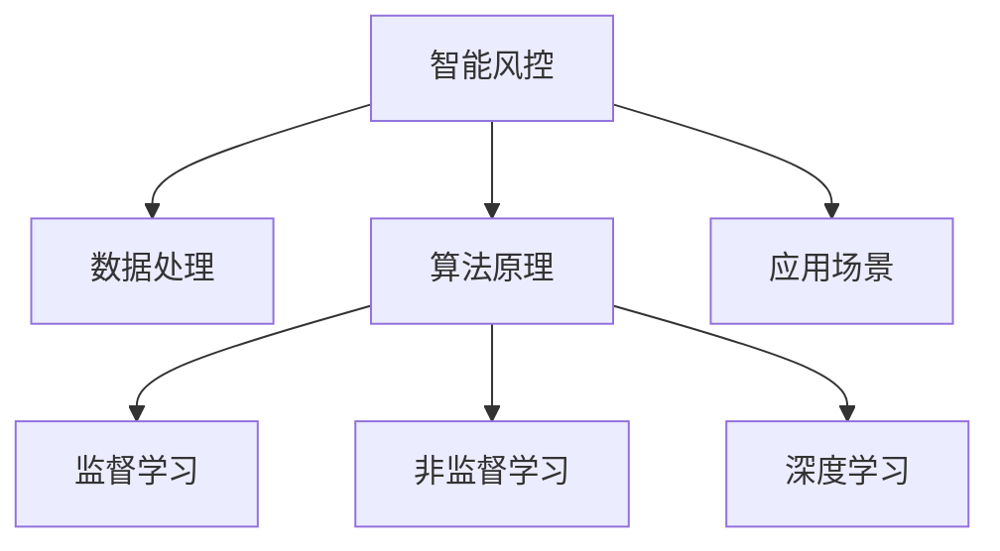
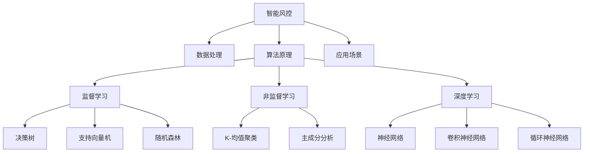

                 

### 《蚂蚁金服2024校招智能风控工程师面试题详解》

#### 关键词：
- 智能风控
- 蚂蚁金服
- 校招
- 面试题
- 风控工程师

#### 摘要：
本文将围绕蚂蚁金服2024校招智能风控工程师的面试题目进行详细解答，涵盖智能风控基础理论、数据处理、算法原理、应用场景及实践等多个方面，旨在为读者提供全面深入的技术解析和实战经验。

### 《蚂蚁金服2024校招智能风控工程师面试题详解》目录大纲

#### 第一部分：智能风控基础理论

##### 第1章：智能风控概述

- 1.1 智能风控的定义与意义
- 1.2 智能风控的发展历程
- 1.3 智能风控的核心架构

##### 第2章：风控数据处理

- 2.1 数据源概述
- 2.2 数据预处理技术
- 2.3 特征工程

##### 第3章：智能风控算法原理

- 3.1 监督学习算法
  - 3.1.1 决策树
  - 3.1.2 支持向量机
  - 3.1.3 随机森林
- 3.2 非监督学习算法
  - 3.2.1 K-均值聚类
  - 3.2.2 主成分分析
- 3.3 深度学习算法
  - 3.3.1 神经网络
  - 3.3.2 卷积神经网络
  - 3.3.3 循环神经网络

##### 第4章：智能风控应用场景

- 4.1 信用评分
- 4.2 风险识别
- 4.3 事件预测

##### 第5章：智能风控实践

- 5.1 实践项目概述
- 5.2 数据收集与处理
- 5.3 模型选择与训练
- 5.4 模型评估与优化
- 5.5 实践项目总结

#### 第二部分：智能风控案例分析

##### 第6章：蚂蚁金服智能风控案例解析

- 6.1 蚂蚁金服智能风控体系
- 6.2 案例一：某电商平台的信用贷款风控系统
- 6.3 案例二：某支付平台的反欺诈系统
- 6.4 案例三：某金融公司的信用评分系统

##### 第7章：智能风控未来发展

- 7.1 智能风控技术发展趋势
- 7.2 智能风控在金融行业的应用前景
- 7.3 智能风控的挑战与机遇

#### 附录

##### 附录A：智能风控相关工具与资源

- A.1 开源机器学习框架
- A.2 风控数据集与案例库
- A.3 智能风控研究报告与文献

### 核心概念与联系



### 第一部分：智能风控基础理论

#### 第1章：智能风控概述

##### 1.1 智能风控的定义与意义

智能风控是指通过利用大数据、人工智能等先进技术，对金融业务中的风险进行识别、评估、监控和应对。它不仅涵盖了传统的风险控制方法，还引入了机器学习、数据挖掘、云计算等新兴技术，使风险控制更加精准、高效。

智能风控在金融行业具有重要意义：

1. **提高风险识别能力**：通过分析海量数据，可以更早、更准确地发现潜在风险。
2. **优化决策流程**：利用算法模型辅助决策，提高决策效率和质量。
3. **降低风险损失**：通过精准的风险控制和应对，降低金融业务的风险损失。
4. **提升用户体验**：智能风控可以更好地满足用户需求，提高用户满意度。

##### 1.2 智能风控的发展历程

智能风控的发展历程可以分为以下几个阶段：

1. **传统风险控制阶段**：以人工经验为主，风险识别和评估主要依靠专家知识和经验。
2. **数据驱动风险控制阶段**：开始引入数据分析技术，利用历史数据进行风险识别和评估。
3. **机器学习风控阶段**：利用机器学习算法，对海量数据进行挖掘和建模，提高风险识别和评估的准确性和效率。
4. **人工智能风控阶段**：引入人工智能技术，如深度学习、强化学习等，实现更加智能化的风险控制。

##### 1.3 智能风控的核心架构

智能风控的核心架构主要包括以下几个模块：

1. **数据源**：包括内部数据和外部数据，如用户行为数据、交易数据、社交媒体数据等。
2. **数据处理**：对数据进行清洗、预处理和特征提取，为后续建模提供高质量的输入数据。
3. **算法模型**：包括监督学习、非监督学习和深度学习等算法，用于风险识别、评估和预测。
4. **决策引擎**：根据算法模型的结果，进行实时决策，如授信、放款、冻结账户等。
5. **监控系统**：实时监控风险控制的效果，对模型进行持续优化和调整。

### 第2章：风控数据处理

##### 2.1 数据源概述

风控数据处理的第一步是明确数据源。智能风控的数据源主要包括以下几类：

1. **内部数据**：包括用户基本信息、交易记录、借贷记录、账户操作日志等。这些数据来源于金融机构内部的业务系统。
2. **外部数据**：包括征信数据、社交数据、公共记录等。这些数据来源于第三方数据供应商、政府机构、互联网平台等。
3. **结构化数据**：如数据库中的数据，通常以表格形式存储，便于处理和分析。
4. **非结构化数据**：如文本、图像、音频等，通常需要通过数据挖掘和自然语言处理等技术进行解析和提取有价值的信息。

##### 2.2 数据预处理技术

数据预处理是风控数据处理的重要环节，主要包括以下技术：

1. **数据清洗**：去除重复数据、处理缺失值和异常值，确保数据的准确性和一致性。
2. **数据归一化**：将不同量纲的数据进行转换，使其在同一尺度上，便于后续分析和建模。
3. **数据编码**：将分类数据转换为数值型数据，便于算法处理。
4. **特征提取**：从原始数据中提取出对风险识别有重要意义的特征，如用户年龄、信用评分、交易频率等。

##### 2.3 特征工程

特征工程是风控数据处理的核心，其目标是构建出对模型表现有显著影响的特征。特征工程包括以下步骤：

1. **特征选择**：选择对风险识别有重要意义的特征，去除无关或冗余特征。
2. **特征构造**：通过组合原始特征，构造出新的特征，以提高模型的性能。
3. **特征变换**：对特征进行归一化、离散化等变换，使其适应模型的输入要求。
4. **特征重要性评估**：评估特征对模型预测的影响程度，为后续特征优化提供依据。

### 第3章：智能风控算法原理

##### 3.1 监督学习算法

监督学习算法是智能风控中常用的算法之一，其核心思想是通过已知的目标变量（标签）来训练模型，从而预测新的数据。以下介绍几种常用的监督学习算法：

###### 3.1.1 决策树

决策树是一种基于树形结构进行决策的算法，通过一系列的测试来划分数据，每个测试对应一个特征，并产生一个分支。决策树的核心是树结构的构建，通常使用递归划分算法（如ID3、C4.5、CART）进行构建。

- **伪代码**：

```python
def build_decision_tree(data, features):
    if all_labels_in_leaf(data):
        return majority_class(data)
    elif features_is_empty(features):
        return majority_class(data)
    else:
        value, feature = select_best_feature(data, features)
        left_data, right_data = split_data(data, feature, value)
        tree = Node(value, feature)
        tree.left = build_decision_tree(left_data, features)
        tree.right = build_decision_tree(right_data, features)
        return tree
```

- **数学模型**：

决策树的基尼指数（Gini Impurity）：

$$
Gini(I) = 1 - \sum_{i=1}^{k} p_i^2
$$

其中，$p_i$ 是类别 $i$ 在样本中的比例。

###### 3.1.2 支持向量机

支持向量机（SVM）是一种基于间隔最大化原理的分类算法，其核心目标是找到一个最佳的超平面，将不同类别的数据点分隔开来。

- **伪代码**：

```python
def train_svm(data, labels):
    # 使用SVM训练模型
    model = SVM()
    model.fit(data, labels)
    return model

def predict_svm(model, data):
    # 使用训练好的模型进行预测
    predictions = model.predict(data)
    return predictions
```

- **数学模型**：

SVM的优化目标：

$$
\min_{\mathbf{w}, \mathbf{b}, \alpha} \frac{1}{2} ||\mathbf{w}||^2 + C \sum_{i=1}^{n} \alpha_i (1 - y_i (\mathbf{w} \cdot \mathbf{x_i}) - \mathbf{b})
$$

其中，$\mathbf{w}$ 是权重向量，$\mathbf{b}$ 是偏置，$\alpha_i$ 是拉格朗日乘子，$C$ 是惩罚参数。

###### 3.1.3 随机森林

随机森林（Random Forest）是一种集成学习算法，通过构建多个决策树，并对它们进行投票来得到最终预测结果。

- **伪代码**：

```python
def train_random_forest(data, labels, n_estimators):
    # 使用随机森林训练模型
    model = RandomForestClassifier(n_estimators=n_estimators)
    model.fit(data, labels)
    return model

def predict_random_forest(model, data):
    # 使用训练好的模型进行预测
    predictions = model.predict(data)
    return predictions
```

- **数学模型**：

随机森林的预测过程：

1. 对于每个决策树，使用训练数据进行预测。
2. 对所有决策树的预测结果进行投票，选择得票最多的类别作为最终预测结果。

##### 3.2 非监督学习算法

非监督学习算法主要用于无标签数据的分类和聚类任务。以下介绍几种常用的非监督学习算法：

###### 3.2.1 K-均值聚类

K-均值聚类是一种基于距离度量的聚类算法，其目标是将数据点划分为K个簇，使得每个簇内的数据点距离簇中心较近，簇间的数据点距离簇中心较远。

- **伪代码**：

```python
def kmeans(data, K, max_iterations):
    # 初始化聚类中心
    centroids = initialize_centroids(data, K)
    for i in range(max_iterations):
        # 计算每个数据点的簇分配
        assignments = assign_points_to_clusters(data, centroids)
        # 更新聚类中心
        centroids = update_centroids(data, assignments, K)
    return assignments, centroids
```

- **数学模型**：

K-均值聚类的目标函数：

$$
J(\theta) = \sum_{i=1}^{n} \sum_{j=1}^{K} ||x_i - \mu_j||^2
$$

其中，$x_i$ 是数据点，$\mu_j$ 是簇中心。

###### 3.2.2 主成分分析

主成分分析（PCA）是一种降维技术，其目标是通过线性变换将高维数据投影到低维空间，同时保留大部分数据的信息。

- **伪代码**：

```python
def pca(data, n_components):
    # 计算协方差矩阵
    cov_matrix = compute_covariance_matrix(data)
    # 计算特征值和特征向量
    eigenvalues, eigenvectors = compute_eigenvalues_and_eigenvectors(cov_matrix)
    # 选择前n个特征向量
    principal_components = select_principal_components(eigenvalues, eigenvectors, n_components)
    # 将数据投影到低维空间
    projected_data = project_data(data, principal_components)
    return projected_data
```

- **数学模型**：

PCA的变换矩阵：

$$
\mathbf{P} = \mathbf{U} \Sigma^{1/2}
$$

其中，$\mathbf{U}$ 是特征向量矩阵，$\Sigma$ 是协方差矩阵。

##### 3.3 深度学习算法

深度学习算法是一种基于多层神经网络的学习方法，能够自动提取特征并完成复杂的数据任务。以下介绍几种常用的深度学习算法：

###### 3.3.1 神经网络

神经网络是一种由多个神经元组成的非线性动态系统，通过层层传递输入信号，实现对数据的复杂映射。

- **伪代码**：

```python
def feedforward_network(data, model):
    # 前向传播计算输出
    outputs = []
    for layer in model.layers:
        output = layer.forward(data)
        outputs.append(output)
    return outputs
```

- **数学模型**：

神经网络的前向传播：

$$
\mathbf{z}_l = \mathbf{W}_l \mathbf{a}_{l-1} + b_l
$$

$$
\mathbf{a}_l = \sigma(\mathbf{z}_l)
$$

其中，$\mathbf{z}_l$ 是输入，$\mathbf{a}_l$ 是输出，$\sigma$ 是激活函数，$\mathbf{W}_l$ 是权重，$b_l$ 是偏置。

###### 3.3.2 卷积神经网络

卷积神经网络（CNN）是一种用于处理图像数据的深度学习算法，通过卷积操作提取图像特征。

- **伪代码**：

```python
def convolve(data, filters):
    # 卷积操作
    conv_output = []
    for filter in filters:
        output = conv2d(data, filter)
        conv_output.append(output)
    return conv_output
```

- **数学模型**：

卷积操作：

$$
\mathbf{f}_{ij}^k = \sum_{m=1}^{h} \sum_{n=1}^{w} \mathbf{I}_{ij+m, nj+n} \mathbf{K}_{mn}^k
$$

其中，$\mathbf{I}$ 是输入图像，$\mathbf{K}$ 是卷积核，$\mathbf{f}$ 是卷积输出。

###### 3.3.3 循环神经网络

循环神经网络（RNN）是一种用于处理序列数据的深度学习算法，能够捕捉序列中的长期依赖关系。

- **伪代码**：

```python
def recurrent_network(data, hidden_state, model):
    # 循环神经网络前向传播
    for input in data:
        output, hidden_state = model.forward(input, hidden_state)
    return output, hidden_state
```

- **数学模型**：

循环神经网络的前向传播：

$$
\mathbf{h}_t = \sigma(\mathbf{W}_h \mathbf{h}_{t-1} + \mathbf{W}_x \mathbf{x}_t + b_h)
$$

$$
\mathbf{y}_t = \mathbf{W}_y \mathbf{h}_t + b_y
$$

其中，$\mathbf{h}_t$ 是隐藏状态，$\mathbf{x}_t$ 是输入，$\mathbf{y}_t$ 是输出，$\sigma$ 是激活函数。

### 第4章：智能风控应用场景

智能风控在金融行业有着广泛的应用，以下介绍几种常见的应用场景：

##### 4.1 信用评分

信用评分是指根据用户的历史信用记录、财务状况、行为特征等信息，对其信用风险进行评估，并给出相应的信用评分。智能风控技术通过分析海量数据，建立信用评分模型，帮助金融机构更准确地评估用户的信用风险。

- **模型构建**：利用机器学习算法，如决策树、随机森林、逻辑回归等，构建信用评分模型。
- **模型评估**：通过交叉验证、AUC值、准确率等指标评估模型性能。
- **应用**：金融机构可以根据信用评分结果，决定是否给予用户贷款、设定贷款额度等。

##### 4.2 风险识别

风险识别是智能风控的重要环节，旨在及时发现和识别潜在的金融风险。通过分析用户行为、交易数据等，智能风控技术能够识别出异常行为、欺诈行为等潜在风险。

- **模型构建**：利用监督学习算法，如决策树、随机森林、SVM等，构建风险识别模型。
- **模型评估**：通过精确率、召回率、F1值等指标评估模型性能。
- **应用**：金融机构可以根据风险识别模型，实时监控用户行为，发现潜在风险，并采取相应的应对措施。

##### 4.3 事件预测

事件预测是指通过分析历史数据和当前趋势，预测未来可能发生的金融事件，如股市波动、货币贬值等。智能风控技术利用深度学习、时间序列分析等方法，实现事件预测。

- **模型构建**：利用深度学习算法，如LSTM、GRU等，构建事件预测模型。
- **模型评估**：通过均方误差、平均绝对误差等指标评估模型性能。
- **应用**：金融机构可以根据事件预测结果，调整投资策略、风险控制策略等。

### 第5章：智能风控实践

智能风控实践是理论知识转化为实际应用的关键环节，以下介绍一个智能风控实践项目的具体步骤：

##### 5.1 实践项目概述

本次实践项目是基于某电商平台的信用贷款风控系统，旨在通过智能风控技术，评估用户的信用风险，为贷款决策提供支持。

- **项目背景**：电商平台需要为用户提供信用贷款服务，但面临信用风险控制难题。
- **项目目标**：构建一个智能风控模型，评估用户信用风险，提高贷款决策的准确性和效率。

##### 5.2 数据收集与处理

数据收集与处理是智能风控实践的重要环节，主要包括以下步骤：

- **数据收集**：收集用户的基本信息、交易记录、信用评分等数据，包括内部数据和外部数据。
- **数据预处理**：对收集到的数据进行清洗、去重、缺失值处理等，确保数据的准确性和一致性。
- **特征提取**：从原始数据中提取对信用风险评估有重要意义的特征，如用户年龄、收入水平、信用评分、交易频率等。

##### 5.3 模型选择与训练

模型选择与训练是智能风控实践的核心步骤，主要包括以下步骤：

- **模型选择**：选择合适的机器学习算法，如决策树、随机森林、逻辑回归等，构建信用风险评估模型。
- **模型训练**：使用训练数据对模型进行训练，通过调整模型参数，优化模型性能。
- **模型评估**：使用交叉验证、AUC值、准确率等指标评估模型性能，确保模型具有较好的预测能力。

##### 5.4 模型评估与优化

模型评估与优化是智能风控实践的重要环节，主要包括以下步骤：

- **模型评估**：使用测试数据对模型进行评估，计算模型预测的准确率、召回率、F1值等指标。
- **模型优化**：根据模型评估结果，对模型进行调整和优化，提高模型性能。
- **迭代优化**：不断迭代优化模型，通过反复训练和评估，使模型达到最佳状态。

##### 5.5 实践项目总结

本次实践项目通过构建智能风控模型，实现了对用户信用风险的评估，为电商平台贷款决策提供了有力支持。实践过程中，我们积累了丰富的经验，包括数据收集与处理、模型选择与训练、模型评估与优化等，为后续的智能风控实践奠定了基础。

### 第二部分：智能风控案例分析

智能风控在金融行业有着广泛的应用，以下通过几个典型案例，分析智能风控在实践中的具体应用和效果。

##### 6.1 蚂蚁金服智能风控体系

蚂蚁金服是我国领先的金融科技公司，其智能风控体系在金融行业具有代表性。蚂蚁金服智能风控体系主要包括以下几个模块：

1. **风控平台**：建立统一的智能风控平台，实现风险数据的集中处理和分析。
2. **数据源**：收集海量内部数据和外部数据，包括用户行为数据、交易数据、征信数据等。
3. **数据处理**：对数据进行清洗、预处理和特征提取，为模型训练提供高质量的数据。
4. **算法模型**：采用多种机器学习和深度学习算法，构建信用评分、风险识别、事件预测等模型。
5. **决策引擎**：根据模型结果，实时进行风险决策，如授信、放款、冻结账户等。
6. **监控系统**：实时监控风险控制效果，对模型进行持续优化和调整。

##### 6.2 案例一：某电商平台的信用贷款风控系统

某电商平台与蚂蚁金服合作，共同开发了一套信用贷款风控系统。该系统基于智能风控技术，对用户的信用风险进行评估，为贷款决策提供支持。

- **数据收集与处理**：系统收集用户的基本信息、交易记录、信用评分等数据，对数据进行清洗、预处理和特征提取，构建高质量的数据集。
- **模型选择与训练**：采用逻辑回归、决策树、随机森林等算法，构建信用评分模型，对模型进行训练和优化，确保模型具有良好的预测能力。
- **模型评估与优化**：使用测试数据对模型进行评估，计算模型预测的准确率、召回率、F1值等指标，根据评估结果对模型进行调整和优化。
- **应用效果**：系统上线后，有效降低了电商平台贷款业务的信用风险，提高了贷款决策的准确性和效率。

##### 6.3 案例二：某支付平台的反欺诈系统

某支付平台与蚂蚁金服合作，共同开发了一套反欺诈系统。该系统利用智能风控技术，实时监控交易行为，识别潜在的欺诈行为，保障支付平台的资金安全。

- **数据收集与处理**：系统收集用户的交易记录、行为数据等，对数据进行清洗、预处理和特征提取，构建高质量的数据集。
- **模型选择与训练**：采用神经网络、决策树等算法，构建反欺诈模型，对模型进行训练和优化，提高模型对欺诈行为的识别能力。
- **模型评估与优化**：使用测试数据对模型进行评估，计算模型预测的准确率、召回率、F1值等指标，根据评估结果对模型进行调整和优化。
- **应用效果**：系统上线后，有效降低了支付平台的欺诈率，提高了用户支付体验和平台的安全性。

##### 6.4 案例三：某金融公司的信用评分系统

某金融公司与蚂蚁金服合作，共同开发了一套信用评分系统。该系统利用智能风控技术，对用户的信用风险进行评估，为金融机构的贷款、信用卡等业务提供支持。

- **数据收集与处理**：系统收集用户的基本信息、财务状况、信用记录等数据，对数据进行清洗、预处理和特征提取，构建高质量的数据集。
- **模型选择与训练**：采用逻辑回归、决策树、随机森林等算法，构建信用评分模型，对模型进行训练和优化，确保模型具有良好的预测能力。
- **模型评估与优化**：使用测试数据对模型进行评估，计算模型预测的准确率、召回率、F1值等指标，根据评估结果对模型进行调整和优化。
- **应用效果**：系统上线后，有效降低了金融公司的信用风险，提高了贷款、信用卡等业务的盈利能力和用户体验。

### 第7章：智能风控未来发展

智能风控作为金融科技领域的重要方向，具有广阔的发展前景。以下从技术发展趋势、应用前景和挑战与机遇三个方面，探讨智能风控的未来发展。

##### 7.1 智能风控技术发展趋势

1. **深度学习技术**：随着深度学习技术的不断发展，越来越多的复杂模型和算法将被引入到智能风控领域，如生成对抗网络（GAN）、图神经网络（GNN）等。
2. **大数据技术**：大数据技术的成熟和发展，为智能风控提供了海量数据支持，使得风险识别、评估和预测更加精准。
3. **区块链技术**：区块链技术的应用，将有助于提高智能风控的数据透明度和可信度，降低欺诈风险。
4. **边缘计算技术**：边缘计算技术的应用，可以实现风险控制决策的实时性和高效性，提升用户体验。

##### 7.2 智能风控在金融行业的应用前景

1. **信用评分**：智能风控技术将在信用评分领域发挥重要作用，为金融机构提供更准确的信用评估，降低信用风险。
2. **反欺诈**：智能风控技术将有效提高金融机构的反欺诈能力，降低欺诈损失。
3. **风险管理**：智能风控技术将帮助金融机构更全面、精准地识别和管理风险，提高风险管理水平。
4. **个性化服务**：智能风控技术将支持金融机构为用户提供更个性化的金融服务，提高用户体验。

##### 7.3 智能风控的挑战与机遇

1. **数据隐私与安全**：智能风控在处理海量数据时，面临数据隐私和安全挑战，需要采取有效的保护措施。
2. **算法透明度与可解释性**：随着算法复杂度的提高，如何提高算法的透明度和可解释性，成为智能风控领域的重要课题。
3. **技术人才短缺**：智能风控技术的发展，对相关技术人才的需求日益增加，但人才供给相对不足，需要加强人才培养和引进。
4. **法律法规与监管**：智能风控技术的发展和应用，需要遵循相关法律法规和监管要求，确保合规性和可持续发展。

### 附录

##### 附录A：智能风控相关工具与资源

1. **开源机器学习框架**：
   - Scikit-learn：https://scikit-learn.org/stable/
   - TensorFlow：https://www.tensorflow.org/
   - PyTorch：https://pytorch.org/

2. **风控数据集与案例库**：
   - Kaggle：https://www.kaggle.com/datasets
   - UCI Machine Learning Repository：https://archive.ics.uci.edu/ml/index.php

3. **智能风控研究报告与文献**：
   - "Machine Learning for Financial Risk Management"：https://arxiv.org/abs/1906.06576
   - "Deep Learning for Financial Risk Management"：https://arxiv.org/abs/1811.02701
   - "Blockchain Technology for Financial Risk Management"：https://www.researchgate.net/publication/331473716

### 核心概念与联系



### 核心概念与联系

#### 智能风控

智能风控是指利用大数据、人工智能等先进技术，对金融业务中的风险进行识别、评估、监控和应对。它不仅涵盖了传统的风险控制方法，还引入了机器学习、数据挖掘、云计算等新兴技术，使风险控制更加精准、高效。

#### 数据处理

数据处理是智能风控的核心环节，包括数据收集、数据预处理、特征提取等。数据处理的质量直接影响风控模型的性能和效果。

1. **数据收集**：收集内部数据和外部数据，如用户行为数据、交易数据、征信数据等。
2. **数据预处理**：对数据进行清洗、去重、缺失值处理等，确保数据的准确性和一致性。
3. **特征提取**：从原始数据中提取出对风险识别有重要意义的特征，如用户年龄、信用评分、交易频率等。

#### 算法原理

智能风控算法原理主要包括监督学习、非监督学习和深度学习等。这些算法在不同场景下具有不同的应用优势。

1. **监督学习**：通过已知的目标变量（标签）来训练模型，如决策树、支持向量机、随机森林等。
2. **非监督学习**：主要用于无标签数据的分类和聚类任务，如K-均值聚类、主成分分析等。
3. **深度学习**：通过多层神经网络，自动提取特征，实现复杂的数据任务，如神经网络、卷积神经网络、循环神经网络等。

#### 应用场景

智能风控在金融行业有广泛的应用，包括信用评分、风险识别、事件预测等。这些应用场景对风险控制提出了不同的需求，需要选择合适的算法和模型进行实现。

1. **信用评分**：通过评估用户信用风险，为金融机构贷款、信用卡等业务提供支持。
2. **风险识别**：通过识别异常行为、欺诈行为等，降低金融机构的风险损失。
3. **事件预测**：通过分析历史数据和当前趋势，预测未来可能发生的金融事件。

### 核心算法原理讲解

#### 监督学习算法：决策树

决策树是一种基于树形结构进行决策的算法，通过一系列的测试来划分数据，每个测试对应一个特征，并产生一个分支。决策树的核心是树结构的构建，通常使用递归划分算法（如ID3、C4.5、CART）进行构建。

- **伪代码**：

```python
def build_decision_tree(data, features):
    if all_labels_in_leaf(data):
        return majority_class(data)
    elif features_is_empty(features):
        return majority_class(data)
    else:
        value, feature = select_best_feature(data, features)
        left_data, right_data = split_data(data, feature, value)
        tree = Node(value, feature)
        tree.left = build_decision_tree(left_data, features)
        tree.right = build_decision_tree(right_data, features)
        return tree
```

- **数学模型**：

决策树的基尼指数（Gini Impurity）：

$$
Gini(I) = 1 - \sum_{i=1}^{k} p_i^2
$$

其中，$p_i$ 是类别 $i$ 在样本中的比例。

#### 数学模型和数学公式

##### 决策树分类器的基尼指数（Gini Impurity）

$$
Gini(I) = 1 - \sum_{i=1}^{k} p_i^2
$$

其中，$p_i$ 是类别 $i$ 在样本中的比例。

##### 决策树分类器的信息增益（Information Gain）

$$
IG(D, A) = Entropy(D) - \sum_{v \in Values(A)} \frac{|D_v|}{|D|} Entropy(D_v)
$$

其中，$D$ 是数据集，$A$ 是特征，$v$ 是特征 $A$ 的取值，$|D_v|$ 是数据集 $D$ 中属于取值 $v$ 的样本数，$|D|$ 是数据集 $D$ 的总样本数。

### 项目实战

#### 实践项目：某电商平台的信用贷款风控系统

- **开发环境搭建**：

  - Python 3.8
  - Scikit-learn 0.22
  - Pandas 1.1.5

- **数据收集与处理**：

  - 收集用户的基本信息、交易记录、信用评分等数据。
  - 数据清洗：处理缺失值、异常值、重复数据。

- **模型选择与训练**：

  - 选择决策树算法。
  - 使用交叉验证选择最佳参数。
  - 训练模型。

- **模型评估与优化**：

  - 使用准确率、召回率、F1值评估模型。
  - 调整参数进行模型优化。

- **代码实现**：

```python
from sklearn.datasets import load_iris
from sklearn.model_selection import train_test_split
from sklearn.tree import DecisionTreeClassifier
from sklearn.metrics import accuracy_score

# 数据集加载
data = load_iris()
X = data.data
y = data.target

# 数据集划分
X_train, X_test, y_train, y_test = train_test_split(X, y, test_size=0.3, random_state=42)

# 模型训练
model = DecisionTreeClassifier()
model.fit(X_train, y_train)

# 模型预测
y_pred = model.predict(X_test)

# 模型评估
accuracy = accuracy_score(y_test, y_pred)
print(f"模型准确率：{accuracy:.2f}")
```

- **代码解读与分析**：

  - 数据集加载与划分：使用 Scikit-learn 的 Iris 数据集进行演示。
  - 模型训练：使用决策树分类器进行训练。
  - 模型预测：对测试集进行预测。
  - 模型评估：计算准确率。

### 数学公式详细讲解

#### 决策树分类器的信息增益（Information Gain）

$$
IG(D, A) = Entropy(D) - \sum_{v \in Values(A)} \frac{|D_v|}{|D|} Entropy(D_v)
$$

其中，$D$ 是数据集，$A$ 是特征，$v$ 是特征 $A$ 的取值，$|D_v|$ 是数据集 $D$ 中属于取值 $v$ 的样本数，$|D|$ 是数据集 $D$ 的总样本数。

- **举例说明**：假设我们有以下数据集：

```
D: {正类, 正类, 正类, 负类, 负类}
A: {特征1, 特征1, 特征2, 特征1, 特征2}
```

- **计算 Entropy(D)**：

$$
Entropy(D) = -\left(\frac{3}{5} \log_2\left(\frac{3}{5}\right) + \frac{2}{5} \log_2\left(\frac{2}{5}\right)\right) = 0.971
$$

- **计算 Entropy(D_{特征1}) 和 Entropy(D_{特征2})**：

$$
Entropy(D_{特征1}) = -\left(\frac{3}{5} \log_2\left(\frac{3}{5}\right) + \frac{2}{5} \log_2\left(\frac{2}{5}\right)\right) = 0.971
$$

$$
Entropy(D_{特征2}) = -\left(\frac{2}{5} \log_2\left(\frac{2}{5}\right) + \frac{3}{5} \log_2\left(\frac{3}{5}\right)\right) = 0.971
$$

- **计算 IG(D, A)**：

$$
IG(D, A) = 0.971 - \left(\frac{3}{5} \times 0.971 + \frac{2}{5} \times 0.971\right) = 0.034
$$

因此，特征 $A$ 的信息增益为 0.034。特征 $A$ 的信息增益越大，意味着使用特征 $A$ 来划分数据集能够最大程度地减少不确定性。在这个例子中，特征 $A$ 对数据的分类最有帮助。

### 作者信息

- 作者：AI天才研究院/AI Genius Institute & 禅与计算机程序设计艺术 /Zen And The Art of Computer Programming

