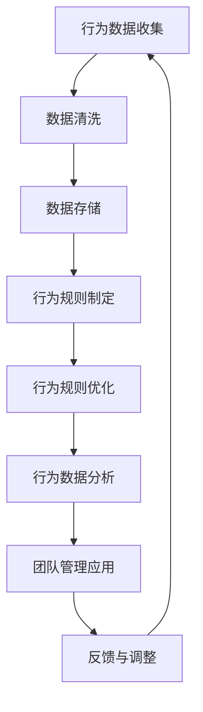

                 

# 行为模型：管理者塑造团队习惯的工具

> **关键词：** 行为模型、团队习惯、管理者、数据分析、人工智能

> **摘要：** 本文章探讨了行为模型在管理者塑造团队习惯中的应用。通过分析行为模型的基本概念、数据收集与处理、规则制定与优化，以及行为模型在团队习惯塑造中的应用，文章旨在为管理者提供一套实用的工具，以提升团队工作效率和凝聚力。

### 第一部分：行为模型概述

#### 第1章：行为模型基本概念

在企业管理中，行为模型是一种强大的工具，它能够帮助管理者了解和塑造团队的习惯。为了深入探讨这一主题，我们首先需要了解行为模型的基本概念。

#### 1.1 行为模型的定义

行为模型是一种基于数据和行为规则的系统，用于描述和分析个体的行为。它包括以下两个核心组成部分：

- **行为数据**：记录个体的行为表现，包括但不限于行为频率、行为模式、行为时长等。
- **行为规则**：根据行为数据，提炼出的行为规律和标准。

行为模型的基本原理可以表示为：

$$
行为模型 = \text{行为数据} + \text{行为规则}
$$

##### 行为数据

行为数据是行为模型的基础，它提供了关于个体行为的详细记录。以下是行为数据的一些关键指标：

- **行为频率**：指个体在一定时间内执行某一行为的次数。
- **行为模式**：指个体在特定时间段内行为的分布情况。
- **行为时长**：指个体执行某一行为所花费的时间。

##### 行为规则

行为规则是对行为数据进行归纳和提炼的结果，它定义了什么样的行为是可接受的，什么样的行为是不被鼓励的。行为规则可以包括以下内容：

- **行为准则**：明确什么样的行为是符合团队规范的。
- **奖惩机制**：对遵守行为准则的成员进行奖励，对违反行为准则的成员进行惩罚。

#### 1.2 行为模型的应用领域

行为模型在多个领域具有广泛的应用，其中最典型的应用包括：

##### 企业管理

在企业管理中，行为模型可以帮助管理者了解员工的工作习惯和行为特点，从而优化管理策略和提高团队效率。具体应用包括：

- **员工行为分析**：通过分析员工的行为数据，了解员工的工作状态和工作效率，为管理者提供决策依据。
- **团队协作**：通过行为模型，优化团队沟通和协作效率，提高团队的整体生产力。

##### 社交网络

在社交网络中，行为模型可以帮助平台运营者了解用户的行为偏好和习惯，从而提供个性化推荐和改进用户体验。具体应用包括：

- **用户行为分析**：通过分析用户的行为数据，了解用户的行为特征和需求，为平台提供个性化推荐。
- **社群管理**：通过行为模型，监测社群成员的行为，维护社群秩序，提升社群活跃度。

#### 1.3 行为模型的发展趋势

随着大数据和人工智能技术的不断发展，行为模型也在不断演进。以下是行为模型发展的几个关键趋势：

##### 大数据分析与人工智能

大数据分析技术使得行为数据收集和处理变得更加高效和准确。人工智能技术的引入，使得行为模型能够自动提取行为特征和预测行为趋势。以下是具体的应用：

- **数据驱动**：利用大数据分析技术，实现对行为数据的深度挖掘和分析。
- **人工智能**：借助机器学习算法，自动提取行为特征和预测行为趋势。

##### 动态优化

行为模型不再是静态的，而是可以根据实际情况进行动态优化。这意味着行为模型可以随着团队和组织的变化而不断调整，以适应新的环境和需求。

#### 1.4 行为模型的核心架构

行为模型的核心架构包括以下几个方面：

##### 行为数据收集与处理

行为数据收集与处理是行为模型的基础。具体包括：

- **数据采集**：从多种渠道获取行为数据。
- **数据处理**：清洗、转换和存储行为数据。

##### 行为规则制定与优化

行为规则制定与优化是行为模型的核心。具体包括：

- **行为规则库**：定义行为规则和标准。
- **规则优化**：根据实际情况调整和优化行为规则。

##### 行为数据分析和应用

行为数据分析和应用是将行为模型转化为实际行动的关键。具体包括：

- **行为数据分析**：对行为数据进行分析，提取有价值的信息。
- **行为模型应用**：将分析结果应用到实际管理中，提升团队效率和凝聚力。

#### 1.5 行为模型在管理者塑造团队习惯中的应用

##### 团队习惯的重要性

团队习惯是团队成员在长期工作中形成的共同行为模式和文化。它对团队的工作效率和凝聚力具有重要影响。以下是团队习惯的重要性：

- **提高工作效率**：规范化的团队习惯有助于提高工作效率。
- **增强团队凝聚力**：统一的团队习惯有助于增强团队的凝聚力。

##### 行为模型在团队习惯塑造中的应用

行为模型在团队习惯塑造中的应用主要包括以下几个方面：

- **行为习惯监测**：通过行为模型，监测团队成员的行为习惯，及时发现和纠正不良行为。
- **反馈与调整**：根据行为模型提供的数据，及时反馈并调整团队行为，优化团队习惯。

#### 1.6 本章小结

行为模型是企业管理和团队协作的重要工具。通过掌握行为模型的基本原理和应用，管理者可以更好地塑造团队习惯，提高团队工作效率和凝聚力。

### 第二部分：行为数据收集与处理

#### 第2章：行为数据的收集方法

要构建有效的行为模型，首先需要收集准确的行为数据。本章将探讨行为数据的收集方法，包括数据源分类、数据收集工具和数据处理技术。

#### 2.1 行为数据的收集方法

##### 2.1.1 数据源分类

行为数据的来源可以分为内部数据和外部数据两大类：

- **内部数据源**：包括企业内部的各种系统数据，如员工管理系统、CRM系统、ERP系统等。这些数据通常记录了员工的工作时间、工作内容、绩效评估等。
- **外部数据源**：包括外部社交网络、行业报告、公开数据集等。这些数据可以为团队提供更全面的行为分析视角。

##### 2.1.2 数据收集工具

收集行为数据需要使用多种工具和技术，以下是常用的几种：

- **传感器**：物联网设备、移动设备等可以用来收集行为数据。例如，员工的移动设备可以记录他们的地理位置、工作时间等。
- **爬虫**：用于从互联网上收集数据。例如，可以通过爬虫获取社交网络上的用户行为数据。

##### 2.1.3 数据收集方法

- **主动收集**：通过系统日志、数据库记录等主动收集数据。
- **被动收集**：通过监控设备、移动应用等被动收集数据。

#### 2.2 行为数据处理

##### 2.2.1 数据清洗

数据清洗是数据处理的重要环节，主要包括以下步骤：

- **缺失值处理**：填补缺失值或删除缺失数据。
- **异常值处理**：识别并处理异常值。
- **数据标准化**：将不同来源的数据进行标准化处理，以便后续分析。

##### 2.2.2 数据存储

行为数据存储需要考虑数据的可扩展性、安全性和易访问性。以下是常用的几种数据存储方法：

- **关系型数据库**：如MySQL、PostgreSQL等，适用于结构化数据的存储。
- **非关系型数据库**：如MongoDB、Redis等，适用于非结构化或半结构化数据的存储。

##### 2.2.3 数据处理工具

数据处理工具包括Python、R、MATLAB等，这些工具提供了丰富的数据清洗、转换和分析功能。

#### 2.3 行为数据挖掘与分析

##### 2.3.1 数据可视化

数据可视化是将行为数据以图表形式展示的技术，有助于发现数据中的模式和趋势。常用的数据可视化工具有：

- **统计图表**：如柱状图、饼图、折线图等。
- **交互式数据探索**：利用数据可视化工具进行交互式探索。

##### 2.3.2 数据挖掘

数据挖掘是从大量行为数据中提取有价值信息的过程。常用的数据挖掘技术包括：

- **聚类分析**：发现数据中的相似群体。
- **关联规则挖掘**：找出数据中相关的行为模式。
- **分类与预测**：对行为数据进行分析，预测未来的行为趋势。

#### 2.4 本章小结

行为数据的收集与处理是构建行为模型的基础。通过有效的数据收集和处理，可以为管理者提供准确的行为分析结果，从而更好地塑造团队习惯。

### 第三部分：行为规则制定与优化

#### 第3章：行为规则制定

行为规则的制定是行为模型的核心环节之一，它直接影响到团队的行为规范和工作效率。本章将详细介绍行为规则的制定过程，包括行为规则的定义和制定步骤。

#### 3.1 行为规则的定义

行为规则是一种规范，用于指导团队成员的行为。它包括以下两个核心组成部分：

- **行为准则**：明确什么样的行为是可接受的，什么样的行为是不可接受的。行为准则为团队成员提供了行为的标准。
- **奖惩机制**：对遵守行为准则的成员进行奖励，对违反行为准则的成员进行惩罚。奖惩机制是行为规则的重要保障。

行为规则可以表示为：

$$
行为规则 = \text{行为准则} + \text{奖惩机制}
$$

##### 行为准则

行为准则是行为规则的核心部分，它定义了团队成员应该遵守的行为规范。以下是行为准则的一些关键要素：

- **职责明确**：明确团队成员的职责和工作任务。
- **行为标准**：规定团队成员应该具备的行为标准，如礼貌、诚信、高效等。
- **行为规范**：详细描述团队成员在具体场景中的行为要求，如会议礼仪、工作态度等。

##### 奖惩机制

奖惩机制是行为规则的保障，它通过奖励和惩罚来激励团队成员遵守行为准则。以下是奖惩机制的一些关键要素：

- **奖励**：对遵守行为准则的团队成员进行奖励，如奖金、晋升机会、荣誉表彰等。
- **惩罚**：对违反行为准则的团队成员进行惩罚，如警告、降职、解雇等。

#### 3.2 行为规则的制定步骤

制定有效的行为规则需要遵循以下步骤：

##### 3.2.1 需求分析

需求分析是行为规则制定的第一步，它旨在明确团队需要制定的行为规则。以下是需求分析的关键步骤：

- **明确目标**：确定行为规则的应用目标和预期效果。
- **收集需求**：通过访谈、问卷调查等方式，收集团队成员和管理者的需求。
- **分析需求**：对收集到的需求进行分类和分析，确定行为规则的具体内容。

##### 3.2.2 规则定义

规则定义是根据需求分析的结果，明确具体的行为准则和奖惩机制。以下是规则定义的关键步骤：

- **定义行为准则**：根据需求分析，明确团队成员应该遵守的行为准则。
- **定义奖惩机制**：根据行为准则，明确奖励和惩罚的具体措施。

##### 3.2.3 规则审查

规则审查是确保行为规则有效性和可行性的关键步骤。以下是规则审查的关键步骤：

- **内部审查**：由团队内部成员对行为规则进行审查，确保规则内容合理、完整。
- **外部审查**：邀请外部专家对行为规则进行审查，获取外部意见和建议。

##### 3.2.4 规则发布

规则发布是将制定好的行为规则正式发布给团队成员的过程。以下是规则发布的关键步骤：

- **发布通知**：通过内部通讯、会议等方式，向团队成员发布行为规则。
- **培训讲解**：组织培训课程，向团队成员讲解行为规则的具体内容和实施方法。
- **反馈收集**：在规则发布后，及时收集团队成员的反馈，对规则进行优化和调整。

#### 3.3 行为规则优化

行为规则不是一成不变的，它需要根据实际情况进行调整和优化。以下是行为规则优化的关键步骤：

##### 3.3.1 评估方法

评估方法是行为规则优化的第一步，它旨在评估行为规则的实际效果。以下是常用的评估方法：

- **效果评估**：通过数据分析，评估行为规则的实际效果，如团队效率、员工满意度等。
- **用户反馈**：收集团队成员对行为规则的反馈，了解规则的实际应用效果。

##### 3.3.2 优化策略

优化策略是根据评估结果和用户反馈，对行为规则进行调整和优化的方法。以下是常用的优化策略：

- **持续调整**：根据评估结果和用户反馈，持续调整行为规则，确保规则内容合理、有效。
- **动态优化**：根据团队的发展和变化，实时调整行为规则，以适应新的环境和需求。

##### 3.3.3 实施步骤

实施步骤是将优化后的行为规则应用到团队管理中的过程。以下是实施步骤：

- **规则宣传**：通过内部通讯、培训等方式，向团队成员宣传行为规则。
- **规则实施**：在团队管理中，严格执行行为规则。
- **反馈机制**：建立反馈渠道，及时收集团队成员的反馈，对行为规则进行调整。

#### 3.4 本章小结

行为规则的制定与优化是塑造团队习惯的关键。通过科学的方法和持续的调整，可以不断提升团队的行为规范和效率，从而实现团队目标。

### 第四部分：行为模型在团队习惯塑造中的应用

#### 第4章：团队习惯塑造的重要性

团队习惯是团队成员在长期合作中形成的行为模式和文化，它对团队的工作效率和凝聚力具有重要影响。本章将探讨团队习惯的重要性，以及行为模型在团队习惯塑造中的应用。

#### 4.1 团队习惯的定义

团队习惯是指团队成员在共同工作中形成的行为规范和文化。它包括以下几个方面：

- **工作习惯**：团队成员在日常工作中的行为规范，如会议礼仪、工作流程等。
- **沟通习惯**：团队成员之间的沟通方式和文化，如语言表达、沟通频率等。
- **协作习惯**：团队成员在合作过程中的协作方式和文化，如分工合作、资源共享等。
- **文化习惯**：团队整体的文化特征，如价值观、使命等。

#### 4.2 团队习惯的重要性

团队习惯对团队的工作效率和凝聚力具有重要作用，具体体现在以下几个方面：

- **提高工作效率**：规范化的团队习惯有助于减少工作中的混乱和误解，提高工作效率。
- **增强团队凝聚力**：统一的团队习惯有助于增强团队成员之间的信任和协作，提高团队的凝聚力。
- **培养企业文化**：团队习惯是企业文化的重要组成部分，它能够传承和弘扬企业的核心价值观。

#### 4.3 团队习惯塑造的挑战

团队习惯塑造过程中面临着一些挑战，主要包括以下几个方面：

- **多样性**：团队成员来自不同的背景和文化，他们的行为习惯和价值观可能存在差异，这给团队习惯的统一和规范带来了挑战。
- **动态性**：团队的发展和变化要求团队习惯也要不断调整和适应，这需要管理者具备良好的应变能力。

#### 4.4 行为模型在团队习惯塑造中的应用

行为模型在团队习惯塑造中具有重要作用，它可以帮助管理者了解和塑造团队的习惯。以下是行为模型在团队习惯塑造中的应用：

##### 4.4.1 行为数据监测

通过行为模型，管理者可以实时监测团队成员的行为数据，了解他们的工作状态和行为模式。以下是行为数据监测的具体应用：

- **工作行为监测**：通过监测团队成员的工作行为，了解他们的工作效率和工作质量。
- **沟通行为监测**：通过监测团队成员的沟通行为，了解他们的沟通频率和沟通效果。
- **协作行为监测**：通过监测团队成员的协作行为，了解他们的协作效率和协作效果。

##### 4.4.2 行为数据反馈

通过行为模型，管理者可以及时获取团队成员的行为数据，并根据这些数据进行反馈。以下是行为数据反馈的具体应用：

- **工作反馈**：根据团队成员的工作行为数据，提供具体的工作反馈，帮助团队成员改进工作方法。
- **沟通反馈**：根据团队成员的沟通行为数据，提供沟通反馈，帮助团队成员提高沟通效果。
- **协作反馈**：根据团队成员的协作行为数据，提供协作反馈，帮助团队成员提升协作效率。

##### 4.4.3 行为数据调整

通过行为模型，管理者可以根据团队成员的行为数据，调整团队的行为规范和工作流程。以下是行为数据调整的具体应用：

- **工作流程调整**：根据团队成员的工作行为数据，优化工作流程，提高工作效率。
- **沟通机制调整**：根据团队成员的沟通行为数据，调整沟通机制，提高沟通效果。
- **协作策略调整**：根据团队成员的协作行为数据，调整协作策略，提升协作效率。

#### 4.5 本章小结

团队习惯是团队工作的重要组成部分，对团队的工作效率和凝聚力具有重要影响。通过行为模型，管理者可以了解和塑造团队的习惯，提高团队的工作效率和凝聚力。

### 第五部分：行为模型在不同领域的应用

#### 第5章：行为模型在不同领域的应用

行为模型不仅在企业管理和团队协作中有着广泛的应用，还在多个领域中展现出其独特的价值。本章将探讨行为模型在不同领域的具体应用，包括企业管理、社交网络、教育领域和医疗领域。

#### 5.1 企业管理中的应用

在企业中，行为模型可以帮助管理者了解员工的行为模式，从而优化管理策略和提高团队效率。以下是行为模型在企业管理中的一些具体应用：

##### 5.1.1 员工行为分析

- **行为数据分析**：通过行为模型，对员工的工作行为、沟通行为和协作行为进行详细分析，识别优秀员工和需要改进的员工。
- **绩效评估**：结合行为数据和绩效评估指标，制定科学的绩效评估体系，确保评估结果的准确性和公正性。

##### 5.1.2 团队建设

- **团队行为监测**：通过行为模型，监测团队的行为数据，发现团队协作中的问题和机会。
- **团队文化建设**：利用行为模型，推动团队文化的形成和传承，增强团队的凝聚力和归属感。

#### 5.2 社交网络中的应用

在社交网络中，行为模型可以帮助平台运营者了解用户的行为偏好和习惯，从而提供个性化推荐和改进用户体验。以下是行为模型在社交网络中的一些具体应用：

##### 5.2.1 用户行为分析

- **用户行为特征识别**：通过行为模型，识别用户的行为特征，如活跃时间、互动频率等，为平台提供个性化推荐。
- **用户互动分析**：分析用户之间的互动行为，优化社交网络的结构和功能，提升用户活跃度和满意度。

##### 5.2.2 社群管理

- **社群行为监测**：通过行为模型，监测社群成员的行为，维护社群秩序，提升社群活跃度。
- **社群发展策略**：利用行为模型，制定社群发展策略，引导用户形成积极的社群文化，增强社群凝聚力。

#### 5.3 教育领域的应用

在教育领域，行为模型可以帮助教师了解学生的学习行为和学习效果，从而优化教学方法和提高教学质量。以下是行为模型在教育领域中的一些具体应用：

##### 5.3.1 学生行为分析

- **学习行为监测**：通过行为模型，监测学生的学习行为，发现学习中的问题和机会。
- **学习效果评估**：结合行为数据和考试结果，评估学生的学习效果，为教师提供教学反馈。

##### 5.3.2 教师管理

- **教师行为监测**：通过行为模型，监测教师的教学行为，优化教学方法和策略。
- **教师评估**：结合行为数据和教学成果，评估教师的教学质量，提升教师的教学水平。

#### 5.4 医疗领域的应用

在医疗领域，行为模型可以帮助医疗机构了解病人的行为和健康状况，从而提供个性化的健康指导和医疗服务。以下是行为模型在医疗领域中的一些具体应用：

##### 5.4.1 病人行为分析

- **病人行为监测**：通过行为模型，监测病人的日常行为，如生活习惯、运动情况等，预测病人的健康状况。
- **健康指导**：根据病人行为数据和医学知识，提供个性化的健康指导，帮助病人改善生活习惯。

##### 5.4.2 医疗服务优化

- **医疗服务行为监测**：通过行为模型，监测医疗服务流程中的行为，优化医疗服务流程，提高医疗服务的效率和质量。
- **医疗资源调配**：利用行为模型，预测医疗需求，合理调配医疗资源，确保医疗资源的有效利用。

#### 5.5 本章小结

行为模型在企业管理、社交网络、教育领域和医疗领域具有广泛的应用前景。通过科学的方法和持续的应用，行为模型可以提升各领域的管理效率和服务质量，为人们的生活带来更多的便利和改善。

### 第六部分：行为模型与人工智能的结合

#### 第6章：行为模型与人工智能的结合

人工智能（AI）的快速发展为行为模型的应用提供了新的机遇。本章将探讨行为模型与人工智能的结合，包括AI在行为模型中的应用、具体案例以及面临的挑战和未来趋势。

#### 6.1 人工智能在行为模型中的应用

人工智能技术为行为模型提供了强大的数据分析和预测能力。以下是AI在行为模型中的应用：

##### 6.1.1 机器学习算法

机器学习算法可以从行为数据中自动提取特征和模式，帮助预测未来的行为趋势。以下是几种常用的机器学习算法：

- **分类与回归分析**：用于对行为数据进行分类和回归分析，预测行为趋势。
- **聚类分析**：用于对行为数据进行聚类，发现相似的行为群体。
- **关联规则挖掘**：用于找出数据中相关的行为模式。

##### 6.1.2 深度学习模型

深度学习模型在处理大规模行为数据方面具有优势，可以自动提取复杂的行为特征。以下是几种常用的深度学习模型：

- **卷积神经网络（CNN）**：用于处理图像和视频数据，分析行为特征。
- **循环神经网络（RNN）**：用于处理序列数据，分析行为序列模式。

#### 6.2 人工智能在行为模型中的应用案例

以下是一些行为模型与人工智能结合的成功案例：

##### 6.2.1 智能安防系统

- **背景**：利用行为模型和人工智能技术，提升安防系统的智能化水平。
- **措施**：通过行为数据监测和分析，实时识别异常行为，预测潜在的威胁。
- **结果**：提高了安防系统的准确性和响应速度，减少了安全隐患。

##### 6.2.2 智能客服系统

- **背景**：利用行为模型和人工智能技术，提高客服系统的服务质量和效率。
- **措施**：通过用户行为分析，实现智能客服的个性化服务，提升用户体验。
- **结果**：提高了用户满意度，减少了人工客服的工作负担。

#### 6.3 人工智能在行为模型中的挑战与未来趋势

虽然人工智能在行为模型中具有巨大潜力，但同时也面临着一些挑战。以下是人工智能在行为模型中的挑战和未来趋势：

##### 6.3.1 数据隐私保护

行为数据通常包含个人隐私信息，如何在数据收集、处理和应用过程中保护用户隐私是一个重要挑战。以下是解决数据隐私保护的几种方法：

- **数据加密**：采用加密技术，保护行为数据的安全。
- **隐私计算**：利用隐私计算技术，在数据使用过程中保护用户隐私。

##### 6.3.2 模型可解释性

人工智能模型的决策过程往往难以解释，这给行为模型的应用带来了挑战。以下是提升模型可解释性的几种方法：

- **可解释性模型**：开发可解释的机器学习模型，提高模型的可解释性。
- **模型审计**：建立模型审计机制，确保行为模型的应用符合伦理和法律要求。

##### 6.3.3 未来趋势

未来，人工智能在行为模型中的应用将继续深化和扩展，以下是几个可能的发展趋势：

- **多模态数据融合**：结合不同类型的数据（如文本、图像、音频等），提高行为模型的预测准确性。
- **实时行为分析**：利用实时数据处理技术，实现行为数据的实时分析，提高行为模型的响应速度。
- **自适应行为模型**：开发自适应的行为模型，能够根据环境和用户行为的变化进行动态调整。

#### 6.4 本章小结

行为模型与人工智能的结合为各领域带来了新的发展机遇。通过不断的创新和应用，行为模型和人工智能将在更多领域发挥重要作用，提升管理效率和服务质量。

### 第七部分：行为模型的设计与实现

#### 第7章：行为模型的设计与实现

行为模型的设计与实现是确保其有效性和实用性的关键步骤。本章将详细探讨行为模型的设计原则、实现流程、开发工具与框架，以及一个实际案例。

#### 7.1 行为模型设计原则

设计行为模型时，应遵循以下原则，以确保模型的有效性和实用性：

##### 7.1.1 系统性

行为模型应全面覆盖团队成员的各种行为，包括工作行为、沟通行为和协作行为。同时，模型应具备层次性，能够区分不同行为的重要性和影响。

##### 7.1.2 可操作性

行为数据应具有可度量性，以便分析和评估。行为模型应具备实用性，能够实际应用于团队管理和决策。

##### 7.1.3 动态性

行为模型应具备适应性，能够根据团队的变化进行调整。同时，模型应具备灵活性，能够适应不同的团队规模和业务场景。

#### 7.2 行为模型实现流程

行为模型的实现流程包括以下步骤：

##### 7.2.1 需求分析

明确行为模型的应用目标和预期效果，收集团队成员和管理者的需求，了解团队的具体情况。

##### 7.2.2 数据采集

确定行为数据的来源，包括内部系统和外部数据源。使用传感器、爬虫等技术收集行为数据。

##### 7.2.3 数据处理

清洗、转换和存储行为数据，确保数据的质量和一致性。

##### 7.2.4 行为规则制定

根据需求分析，定义具体的行为规则。行为规则应包括行为准则和奖惩机制。

##### 7.2.5 行为规则优化

根据实际情况和用户反馈，持续优化行为规则，确保其有效性和可行性。

##### 7.2.6 行为数据分析和应用

对行为数据进行分析，提取有价值的信息，并将分析结果应用到实际管理中，提升团队效率和凝聚力。

#### 7.3 行为模型开发工具与框架

开发行为模型需要使用多种工具和框架，以下是常用的几种：

##### 7.3.1 数据分析工具

- **Python**：Python提供了丰富的数据分析库，如Pandas、NumPy等。
- **R**：R是一种专门用于统计分析和图形表示的语言。
- **MATLAB**：MATLAB提供了强大的数据处理和分析工具。

##### 7.3.2 数据库管理系统

- **关系型数据库**：如MySQL、PostgreSQL等。
- **非关系型数据库**：如MongoDB、Redis等。

##### 7.3.3 开发框架

- **机器学习框架**：如TensorFlow、PyTorch、Scikit-learn等。
- **数据可视化框架**：如D3.js、Plotly、ECharts等。

#### 7.4 实际案例

以下是一个基于行为模型的企业团队管理实际案例：

##### 7.4.1 背景与需求

某企业希望通过行为模型提高团队的工作效率和凝聚力。需求包括：

- 监测团队成员的工作行为。
- 分析团队成员的沟通行为。
- 制定合理的行为规则，优化团队管理。

##### 7.4.2 数据采集

使用物联网设备（如员工工卡）和社交媒体监控工具（如微信、邮件）收集行为数据。

##### 7.4.3 数据处理

使用Python对采集到的行为数据进行清洗、转换和存储。以下是数据处理步骤的伪代码：

```python
# 数据清洗
data = clean_data(data)

# 数据转换
data = transform_data(data)

# 数据存储
store_data(data)
```

##### 7.4.4 行为规则制定

根据需求分析，制定以下行为规则：

- **工作行为准则**：按时完成任务，保证工作质量。
- **沟通行为准则**：积极沟通，尊重他人意见。
- **奖惩机制**：对遵守规则的成员给予奖励，对违反规则的成员进行惩罚。

##### 7.4.5 行为规则优化

通过定期评估行为规则的实际效果，持续优化规则，确保其适应团队的变化。

##### 7.4.6 行为数据分析和应用

对行为数据进行深入分析，识别团队成员的行为特点，将分析结果应用到团队管理中，提高团队工作效率和凝聚力。

#### 7.5 本章小结

行为模型的设计与实现是构建高效团队的重要环节。通过遵循设计原则、实现流程，使用合适的工具与框架，可以构建出具有实际应用价值的行为模型，提升团队的工作效率和凝聚力。

## 附录

### 附录A：行为模型相关资源

#### A.1 书籍推荐

- 《行为科学与管理：行为学视角下的团队管理》
- 《人工智能在团队管理中的应用：行为模型与算法》
- 《大数据与行为分析：企业决策的新视角》

#### A.2 论文推荐

- "Behavioral Model for Team Management: A Data-Driven Approach"
- "Application of AI in Team Habit Formation and Optimization"
- "Data Privacy Protection in Behavioral Model Development"

#### A.3 在线课程

- "Introduction to Behavioral Science"
- "Deep Learning for Team Management"
- "Data Mining and Predictive Analytics for Organizations"

### 附录B：Mermaid 流程图

以下是行为模型的核心流程图的 Mermaid 表示：



### 附录C：伪代码

以下是行为模型数据处理部分的伪代码：

```python
# 伪代码：数据清洗
def clean_data(data):
    cleaned_data = []
    for record in data:
        if is_valid(record):
            cleaned_data.append(record)
        else:
            handle_invalid(record)
    return cleaned_data

# 伪代码：数据转换
def transform_data(data):
    transformed_data = []
    for record in data:
        transformed_data.append(translate(record))
    return transformed_data

# 伪代码：数据存储
def store_data(data):
    database.save(data)
```

### 附录D：代码实际案例和解读

以下是行为模型应用中的一个简单代码案例，用于监测和反馈团队成员的行为：

```python
# Python 代码：行为数据监测
import pandas as pd
from sklearn.cluster import KMeans

# 数据加载
data = pd.read_csv('team_behavior_data.csv')

# 数据预处理
data = clean_data(data)

# 行为聚类
kmeans = KMeans(n_clusters=3)
clusters = kmeans.fit_predict(data)

# 行为反馈
for index, cluster in enumerate(clusters):
    if cluster == 0:
        give_reward(index)
    elif cluster == 1:
        give_warning(index)
    elif cluster == 2:
        give_punishment(index)

# 伪代码：给予奖励
def give_reward(index):
    print(f"Member {index} received a reward for good behavior.")

# 伪代码：给予警告
def give_warning(index):
    print(f"Member {index} received a warning for suboptimal behavior.")

# 伪代码：给予惩罚
def give_punishment(index):
    print(f"Member {index} received a punishment for poor behavior.")
```

### 作者信息

- **作者：AI天才研究院/AI Genius Institute & 禅与计算机程序设计艺术 /Zen And The Art of Computer Programming**

