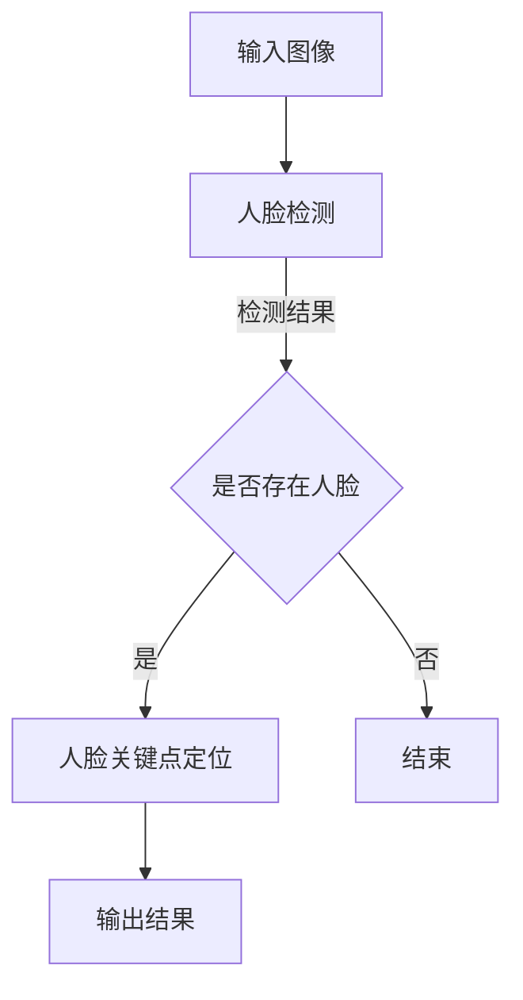
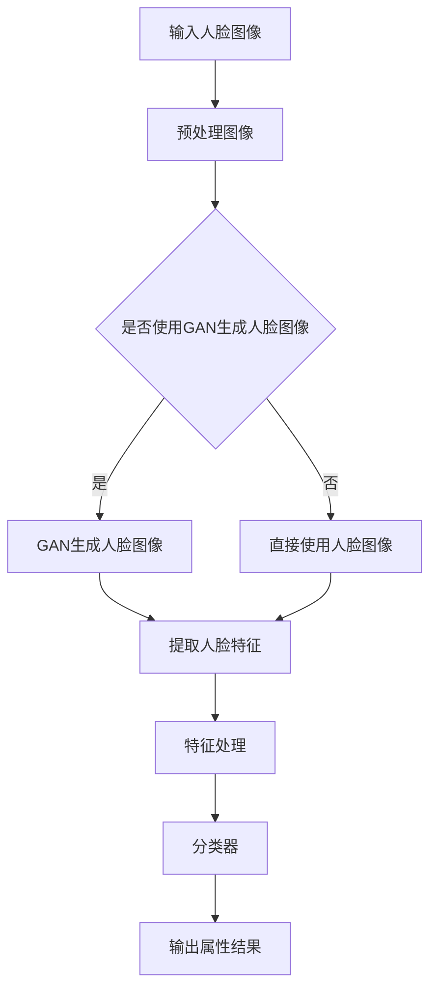

                 

### 引言与概述

在当今的数字时代，计算机视觉技术以其强大的人眼模仿能力，已经成为了人工智能领域的重要分支。其中，人脸属性分析作为计算机视觉的重要应用之一，正逐渐引起广泛关注。本文旨在探讨计算机视觉在人脸属性分析中的应用进展，为读者提供一个全面而深入的了解。

首先，我们来回顾一下计算机视觉的发展历程。计算机视觉的研究起源于20世纪60年代，当时的重点是图像处理和模式识别。随着计算能力的提升和算法的创新，计算机视觉在过去的几十年里取得了飞速的发展。从早期的基于规则和模板匹配的方法，到基于机器学习和深度学习的现代方法，计算机视觉技术在各个领域都展现出了巨大的潜力。

接下来，我们重点关注人脸属性分析。人脸属性分析是指通过计算机视觉技术对人脸图像进行特征提取和分析，从而识别和判断人脸的属性信息。这些属性信息包括但不限于性别、年龄、表情等。人脸属性分析的重要性不言而喻，它不仅有着广泛的应用前景，而且在日常生活和各个行业中也发挥着重要作用。

首先，人脸属性分析在安全监控领域有着广泛的应用。通过人脸识别技术，可以实现智能安防和监控，提高公共安全。其次，在社交媒体和广告营销中，人脸属性分析可以帮助平台更好地了解用户，从而提供个性化的服务。此外，在医疗健康、智能家居、虚拟现实等领域，人脸属性分析也展现出了巨大的应用价值。

综上所述，计算机视觉在人脸属性分析中的应用已经取得了显著的进展，不仅推动了技术的进步，也为各个行业带来了新的机遇。本文将系统地介绍人脸属性分析的基本概念、理论基础、核心技术、应用实践以及未来发展方向，旨在为广大读者提供一份详尽的技术指南。

#### 计算机视觉与人脸属性分析概述

计算机视觉（Computer Vision）是一门结合计算机科学与工程学的交叉学科，旨在使计算机能够像人类视觉系统一样感知和理解视觉信息。它包括图像处理、模式识别、机器学习等多个领域的技术，通过模拟人类视觉感知过程，使计算机能够识别、分析和理解图像或视频数据。

计算机视觉的发展历程可以分为几个阶段。早期的计算机视觉主要集中在图像处理和特征提取上，如边缘检测、角点检测等。随着计算能力的提升和算法的优化，20世纪90年代出现了基于统计模型的计算机视觉技术，如HOG（Histogram of Oriented Gradients）和SIFT（Scale-Invariant Feature Transform）。这些技术使得计算机能够更有效地进行图像理解和目标识别。

进入21世纪，随着深度学习的崛起，计算机视觉取得了新的突破。深度学习通过多层神经网络结构，能够自动学习图像的复杂特征，从而在人脸识别、目标检测、图像分类等领域取得了显著成效。代表性的深度学习模型包括卷积神经网络（CNN）和循环神经网络（RNN）。CNN特别适合处理图像数据，因为它能够自动提取图像中的局部特征和层次特征。RNN则擅长处理序列数据，如视频序列。

在计算机视觉领域，人脸属性分析（Facial Attribute Analysis）是一个备受关注的研究方向。人脸属性分析是指通过计算机视觉技术对人脸图像进行特征提取和分析，从而识别和判断人脸的属性信息，如性别、年龄、情绪、表情等。这些属性信息不仅对于安全监控、身份验证等领域具有重要意义，而且在广告营销、医疗健康、虚拟现实等领域也有着广泛的应用。

首先，人脸属性分析在安全监控领域有着重要的应用。通过人脸识别技术，可以实现对犯罪嫌疑人的自动识别和追踪，提高公共安全。例如，在一些大型的公共场所和交通枢纽，人脸识别系统可以实时监控人群，及时发现可疑人员。此外，人脸属性分析还可以用于视频监控数据的分析和处理，实现智能安防和监控。

其次，在社交媒体和广告营销中，人脸属性分析可以帮助平台更好地了解用户。通过分析用户的性别、年龄、情绪等属性，平台可以提供个性化的推荐和广告，从而提高用户体验和广告投放的精准度。例如，一些社交媒体平台可以利用人脸属性分析技术来分析用户的情绪，从而在发布内容时提供情绪匹配的建议。

在医疗健康领域，人脸属性分析也有着广泛的应用。通过分析患者的面部表情和情绪，医生可以更好地了解患者的心理状态和病情变化。例如，一些研究人员利用人脸属性分析技术来分析自闭症患者的面部表情，从而帮助他们早期诊断和干预。

此外，在虚拟现实和增强现实领域，人脸属性分析可以为人机交互提供更丰富的交互方式。通过分析用户的面部表情和情绪，虚拟角色可以更自然地与用户互动，从而提高虚拟现实体验的沉浸感和互动性。

综上所述，计算机视觉在人脸属性分析中的应用已经取得了显著的进展，不仅推动了技术的进步，也为各个行业带来了新的机遇。随着深度学习和计算机视觉技术的不断发展，人脸属性分析有望在未来发挥更大的作用，为社会发展和人类生活带来更多便利。

#### 人脸属性分析的基本概念

人脸属性分析（Facial Attribute Analysis）是计算机视觉领域中的一个重要研究方向，其核心目的是通过图像处理和模式识别技术，从人脸图像中提取和识别出具有特定意义的属性信息。下面，我们将详细讨论人脸属性的定义、类型以及分析的关键技术。

**1. 人脸属性的定义**

人脸属性是指能够描述或表征人脸特征的信息，通常包括性别、年龄、情绪、表情等。这些属性信息不仅可以用于个人身份验证和识别，还能为各个领域提供有价值的数据。

- **性别**：人脸性别属性是判断人脸为男性或女性的信息。
- **年龄**：人脸年龄属性是估计人脸所属年龄范围的信息，如儿童、青年、中年、老年等。
- **情绪**：人脸情绪属性是指通过人脸表情识别技术，分析出人脸表现出的情绪状态，如快乐、悲伤、愤怒、惊讶等。
- **表情**：人脸表情属性是指通过分析人脸肌肉运动，识别出具体的表情特征，如微笑、皱眉、睁眼等。

**2. 人脸属性的类型**

根据属性的不同特性，人脸属性可以分为以下几种类型：

- **静态属性**：这类属性主要依赖于人脸图像的静态特征，如性别和年龄。静态属性分析通常通过图像处理技术进行，如特征提取、分类和回归等。
- **动态属性**：这类属性主要依赖于人脸图像序列中的动态变化，如情绪和表情。动态属性分析通常涉及视频处理和时序分析技术，如运动跟踪、特征提取和机器学习算法等。

**3. 人脸属性分析的关键技术**

人脸属性分析涉及到多个技术环节，包括人脸检测、人脸关键点定位、属性识别和数学模型等。以下是这些关键技术的基本原理：

- **人脸检测**：人脸检测是识别图像中是否存在人脸的过程。常用的方法包括基于传统图像处理算法的方法（如Viola-Jones算法）、基于深度学习的目标检测方法（如Faster R-CNN、YOLO）等。
- **人脸关键点定位**：人脸关键点定位是指找出人脸图像中具有代表性的关键点，如眼睛、鼻子、嘴巴等。关键点定位对于后续的属性识别至关重要。常用的方法包括基于特征的算法（如 Active Shape Model）和基于深度学习的算法（如 FAN）等。
- **属性识别**：属性识别是指根据提取的人脸特征，使用机器学习算法来识别和判断人脸的属性信息。常见的属性识别算法包括支持向量机（SVM）、随机森林（Random Forest）、深度神经网络（Deep Neural Network）等。
- **数学模型**：人脸属性分析中的数学模型用于描述和解释属性识别的过程。常见的数学模型包括概率模型（如贝叶斯分类器）、决策树模型、神经网络模型（如卷积神经网络、循环神经网络）等。

**4. 人脸属性分析的核心流程**

人脸属性分析的核心流程可以概括为以下几个步骤：

1. **人脸检测**：输入人脸图像，通过人脸检测算法确定图像中的人脸区域。
2. **人脸关键点定位**：在人脸区域中定位关键点，为后续属性识别提供基础。
3. **特征提取**：提取人脸图像的显著特征，如纹理特征、形状特征等。
4. **属性识别**：使用机器学习算法，将提取的特征映射到相应的属性标签上。
5. **结果输出**：输出识别结果，包括性别、年龄、情绪、表情等属性信息。

通过以上流程，我们可以对人脸图像进行有效的属性分析，为实际应用提供有力支持。

总之，人脸属性分析作为计算机视觉领域的一个重要研究方向，已经取得了显著的进展。随着技术的不断发展和应用需求的不断增加，人脸属性分析将继续在安全监控、广告营销、医疗健康、虚拟现实等领域发挥重要作用。未来，我们可以期待更多的人脸属性分析技术突破，为人类生活带来更多便利。

#### 人脸检测与定位算法

人脸检测和人脸关键点定位是人脸属性分析中的两个关键步骤。在这两个步骤中，我们通常需要使用各种算法和技术来准确地识别和定位人脸，从而为人脸属性识别打下坚实基础。

**1. 人脸检测算法**

人脸检测是指从图像中自动检测和识别出人脸的过程。以下是几种常见的人脸检测算法：

- **基于传统图像处理的算法**：这类算法通常使用图像的局部特征进行人脸检测。代表性的算法包括Viola-Jones算法，该算法通过级联分类器的方法，利用Haar特征进行人脸检测，具有较高的检测速度。
  
  **伪代码：**
  ```python
  function ViolaJones检测(输入图像):
      # 加载预训练的级联分类器模型
      cascade分类器 = 加载模型()

      # 对输入图像进行缩放和灰度化处理
      缩放图像 = 缩放图像(输入图像)
      灰度图像 = 灰度化(缩放图像)

      # 遍历图像中的不同位置和大小，应用级联分类器进行人脸检测
      对于每个位置和大小：
          如果 cascade分类器(灰度图像，位置，大小) 返回“是”：
              输出检测结果，位置，大小
  ```

- **基于深度学习的目标检测算法**：这类算法通过训练深度神经网络模型来自动识别和定位人脸。代表性的算法包括Faster R-CNN、SSD和YOLO等。这些算法在检测准确率和速度上都有显著优势。

  **伪代码：**
  ```python
  function 目标检测(输入图像，模型参数):
      # 加载预训练的目标检测模型
      模型 = 加载预训练模型()

      # 对输入图像进行预处理
      预处理图像 = 预处理图像(输入图像)

      # 使用目标检测模型进行人脸检测
      人脸区域 = 模型(预处理图像)

      # 输出人脸检测结果
      return 人脸区域
  ```

**2. 人脸关键点定位算法**

人脸关键点定位是指从人脸图像中找出具有代表性的关键点，如眼睛、鼻子、嘴巴等。以下是人脸关键点定位的几种常用算法：

- **基于特征的方法**：这类方法通过分析人脸图像的局部特征来定位关键点。Active Shape Model（ASM）是其中的代表算法，它利用图像的形变能量模型和形状模型来估计关键点的位置。

  **伪代码：**
  ```python
  function ActiveShapeModel(人脸图像，形状模型，特征模型):
      # 计算图像的形变能量和形状模型
      形变能量 = 计算形变能量(人脸图像，形状模型)
      形状 = 最小化形变能量(形变能量，形状模型)

      # 估计关键点位置
      关键点 = 估计关键点(形状)

      # 输出关键点位置
      return 关键点
  ```

- **基于深度学习的方法**：这类方法通过训练深度神经网络模型来自动学习关键点的位置。FAN（Facial Anatomy Network）是其中的一种代表算法，它使用卷积神经网络来预测关键点的位置。

  **伪代码：**
  ```python
  function FAN(人脸图像，模型参数):
      # 加载预训练的FAN模型
      模型 = 加载预训练模型()

      # 对人脸图像进行预处理
      预处理图像 = 预处理图像(人脸图像)

      # 使用FAN模型预测关键点位置
      关键点 = 模型(预处理图像)

      # 输出关键点位置
      return 关键点
  ```

**3. 人脸检测与定位的Mermaid流程图**

下面是一个简单的人脸检测与定位的Mermaid流程图，展示了整个人脸检测与定位的过程。



通过以上算法和方法，我们可以有效地进行人脸检测与定位，为人脸属性识别提供可靠的基础。随着深度学习和计算机视觉技术的不断进步，未来的人脸检测与定位算法将更加精准和高效，为各类应用场景提供更强有力的支持。

#### 人脸属性识别算法

在人脸属性分析中，识别和判断人脸的属性信息是一个关键环节。常用的算法包括年龄识别、性别识别和情绪识别。以下将分别介绍这些算法的基本原理，并通过伪代码详细解释其实现过程。

**1. 年龄识别算法**

年龄识别算法的目标是估计人脸图像中个体的年龄。常用的方法包括基于传统图像处理和基于深度学习的算法。

- **基于传统图像处理的算法**：这类算法通常通过分析人脸图像中的纹理特征和形状特征来进行年龄估计。一个简单的例子是使用支持向量机（SVM）进行分类。

  **伪代码：**
  ```python
  function 年龄识别(人脸图像，训练模型):
      # 提取特征向量
      特征向量 = 提取特征(人脸图像)

      # 使用SVM模型进行分类
      年龄 = 训练模型(特征向量)

      # 输出年龄结果
      return 年龄
  ```

- **基于深度学习的算法**：这类算法通常使用卷积神经网络（CNN）来学习年龄特征。一个常见的架构是使用卷积层提取特征，然后通过全连接层进行分类。

  **伪代码：**
  ```python
  function 年龄识别(人脸图像，模型参数):
      # 加载预训练的CNN模型
      模型 = 加载模型()

      # 对人脸图像进行预处理
      预处理图像 = 预处理图像(人脸图像)

      # 使用CNN模型提取特征
      特征向量 = 模型(预处理图像)

      # 通过全连接层进行分类
      年龄 = 分类器(特征向量)

      # 输出年龄结果
      return 年龄
  ```

**2. 性别识别算法**

性别识别算法的目标是判断人脸图像中个体的性别。常用的方法包括基于传统图像处理和基于深度学习的算法。

- **基于传统图像处理的算法**：这类算法通常通过分析人脸图像中的面部特征，如眼睛、鼻子和嘴巴的分布，来进行性别分类。常用的技术包括直方图分析、特征匹配等。

  **伪代码：**
  ```python
  function 性别识别(人脸图像，训练模型):
      # 提取特征向量
      特征向量 = 提取特征(人脸图像)

      # 使用SVM模型进行分类
      性别 = 训练模型(特征向量)

      # 输出性别结果
      return 性别
  ```

- **基于深度学习的算法**：这类算法通常使用卷积神经网络（CNN）来学习性别特征。一个常见的架构是使用卷积层提取特征，然后通过全连接层进行分类。

  **伪代码：**
  ```python
  function 性别识别(人脸图像，模型参数):
      # 加载预训练的CNN模型
      模型 = 加载模型()

      # 对人脸图像进行预处理
      预处理图像 = 预处理图像(人脸图像)

      # 使用CNN模型提取特征
      特征向量 = 模型(预处理图像)

      # 通过全连接层进行分类
      性别 = 分类器(特征向量)

      # 输出性别结果
      return 性别
  ```

**3. 情绪识别算法**

情绪识别算法的目标是识别人脸图像中个体的情绪状态。常用的方法包括基于传统图像处理和基于深度学习的算法。

- **基于传统图像处理的算法**：这类算法通常通过分析人脸图像中的面部表情特征，如眼睛、鼻子和嘴巴的运动，来进行情绪分类。常用的技术包括特征匹配、动态模式识别等。

  **伪代码：**
  ```python
  function 情绪识别(人脸图像，训练模型):
      # 提取特征向量
      特征向量 = 提取特征(人脸图像)

      # 使用SVM模型进行分类
      情绪 = 训练模型(特征向量)

      # 输出情绪结果
      return 情绪
  ```

- **基于深度学习的算法**：这类算法通常使用卷积神经网络（CNN）来学习情绪特征。一个常见的架构是使用卷积层提取特征，然后通过全连接层进行分类。

  **伪代码：**
  ```python
  function 情绪识别(人脸图像，模型参数):
      # 加载预训练的CNN模型
      模型 = 加载模型()

      # 对人脸图像进行预处理
      预处理图像 = 预处理图像(人脸图像)

      # 使用CNN模型提取特征
      特征向量 = 模型(预处理图像)

      # 通过全连接层进行分类
      情绪 = 分类器(特征向量)

      # 输出情绪结果
      return 情绪
  ```

通过以上算法，我们可以对人脸图像进行有效的属性识别，提取性别、年龄和情绪等属性信息。这些算法的实现需要大量的数据和计算资源，但随着深度学习和计算机视觉技术的不断发展，这些算法的性能将不断提高，为人脸属性分析提供更准确和可靠的支持。

#### 人脸属性分析的数学模型与公式

在人脸属性分析中，数学模型与公式起着至关重要的作用。它们不仅帮助我们理解和描述人脸属性识别的过程，还为算法的实现提供了理论基础。以下将详细介绍人脸属性识别中的常用数学模型和公式，并通过具体例子进行详细讲解。

**1. 数学模型介绍**

人脸属性识别中的数学模型通常基于概率和统计理论。其中，最常见的模型是贝叶斯分类器和支持向量机（SVM）。贝叶斯分类器通过计算后验概率来判断样本的类别，而SVM则通过找到一个最优的超平面来分割不同类别。

- **贝叶斯分类器**

贝叶斯分类器的核心公式为：

$$
P(A|B) = \frac{P(B|A)P(A)}{P(B)}
$$

其中，$P(A|B)$ 表示在给定特征 $B$ 下识别出属性 $A$ 的概率，$P(B|A)$ 表示在属性 $A$ 下检测到特征 $B$ 的概率，$P(A)$ 表示属性 $A$ 的先验概率，$P(B)$ 表示特征 $B$ 的先验概率。

- **支持向量机（SVM）**

SVM的核心思想是找到一个最优的超平面，使得不同类别的样本点在超平面两侧尽可能分散。其目标函数为：

$$
\min_{\mathbf{w},b}\frac{1}{2}||\mathbf{w}||^2 + C\sum_{i=1}^{n}\xi_i
$$

其中，$\mathbf{w}$ 和 $b$ 分别是超平面的权重和偏置，$C$ 是正则化参数，$\xi_i$ 是惩罚项。

**2. 公式详细讲解**

以下将详细讲解贝叶斯分类器和SVM的公式，并通过一个具体的例子进行说明。

- **贝叶斯分类器公式讲解**

假设我们有一个二分类问题，属性 $A$ 可以是老年或青年，特征 $B$ 可以是人脸图像的特征向量。贝叶斯分类器的目标是通过计算特征向量 $B$ 在老年和青年类别下的后验概率，选择后验概率较大的类别作为识别结果。

$$
P(\text{老年}|\text{特征向量}) = \frac{P(\text{特征向量}|\text{老年})P(\text{老年})}{P(\text{特征向量})}
$$

其中，$P(\text{老年})$ 是老年人占总人口的比例，$P(\text{特征向量}|\text{老年})$ 是给定一个老年人脸特征向量的概率，$P(\text{特征向量})$ 是特征向量的总概率。

例如，假设我们有一个训练数据集，其中老年人占50%，青年人占50%。对于一个新的特征向量，我们计算其在老年和青年类别下的后验概率：

- $P(\text{老年}) = 0.5$
- $P(\text{特征向量}|\text{老年})$ 通过训练数据集计算得出，例如为0.6
- $P(\text{特征向量}|\text{青年})$ 同样通过训练数据集计算得出，例如为0.4

则对于新的特征向量，后验概率计算如下：

$$
P(\text{老年}|\text{特征向量}) = \frac{0.6 \times 0.5}{0.6 \times 0.5 + 0.4 \times 0.5} = \frac{0.3}{0.35} \approx 0.857
$$

因此，根据后验概率，我们判断该特征向量对应的人脸为老年。

- **SVM公式讲解**

SVM的目标是通过找到一个最优的超平面，使得不同类别的样本点在超平面两侧尽可能分散。其目标函数为：

$$
\min_{\mathbf{w},b}\frac{1}{2}||\mathbf{w}||^2 + C\sum_{i=1}^{n}\xi_i
$$

其中，$\mathbf{w}$ 是超平面的权重，$b$ 是偏置，$C$ 是正则化参数，$\xi_i$ 是惩罚项。

为了实现这一目标，我们需要解决一个二次规划问题，通过求解拉格朗日乘子法可以得到最优解。具体来说，我们定义拉格朗日函数为：

$$
L(\mathbf{w},b,\alpha) = \frac{1}{2}||\mathbf{w}||^2 + C\sum_{i=1}^{n}\xi_i - \sum_{i=1}^{n}\alpha_i(y_i(\mathbf{w}\cdot\mathbf{x_i} + b) - 1)
$$

其中，$\alpha_i$ 是拉格朗日乘子。

通过求解上述拉格朗日函数的最小值，我们可以得到最优的 $\mathbf{w}$ 和 $b$。具体求解过程涉及到对偶问题和KKT条件，这里不再详细展开。

**3. 举例说明**

为了更好地理解上述公式，我们来看一个具体的例子。假设我们有一个包含两个类别的数据集，类别 $A$ 是老年，类别 $B$ 是青年。我们使用一个线性SVM模型来进行分类。

- **数据集样本**

```
样本     类别
x1     A
x2     B
x3     A
x4     B
x5     A
x6     B
```

- **训练过程**

我们首先通过训练数据集来计算权重 $\mathbf{w}$ 和偏置 $b$。根据上述SVM公式，我们可以列出以下优化问题：

$$
\min_{\mathbf{w},b}\frac{1}{2}||\mathbf{w}||^2 + C\sum_{i=1}^{6}\xi_i
$$

其中，$C$ 是正则化参数，$\xi_i$ 是惩罚项。

通过求解上述优化问题，我们可以得到最优的 $\mathbf{w}$ 和 $b$。假设我们求解得到的 $\mathbf{w} = (2, -1)$ 和 $b = 0$。

- **测试过程**

现在，我们使用训练得到的模型来测试一个新样本 $x_7$。我们首先计算 $x_7$ 到超平面的距离：

$$
\mathbf{w}\cdot\mathbf{x_7} + b = (2, -1) \cdot (x_{7x}, x_{7y}) + 0 = 2x_{7x} - x_{7y}
$$

假设 $x_7$ 的坐标为 $(3, 1)$，则距离计算如下：

$$
\mathbf{w}\cdot\mathbf{x_7} + b = 2 \times 3 - 1 \times 1 = 5
$$

根据线性SVM的分类规则，如果距离大于0，则分类为类别 $A$（老年）；如果距离小于或等于0，则分类为类别 $B$（青年）。因此，对于 $x_7$，我们判断其属于类别 $B$（青年）。

通过以上数学模型和公式的讲解，我们可以更好地理解人脸属性识别的过程。这些数学工具不仅帮助我们实现了算法，还为我们分析和优化算法提供了理论基础。随着深度学习和计算机视觉技术的不断发展，未来的人脸属性分析将更加准确和高效，为社会发展和人类生活带来更多便利。

### 深度学习在人脸属性分析中的应用

深度学习作为近年来计算机视觉领域的重要突破，已经成为人脸属性分析中不可或缺的技术手段。深度学习模型通过多层神经网络结构，能够自动学习图像的复杂特征，从而在人脸属性识别中表现出卓越的性能。本节将介绍深度学习的基础知识，以及具体的人脸属性识别深度学习算法和模型架构。

**1. 深度学习基础**

深度学习（Deep Learning）是一种基于多层神经网络的学习方法，其核心思想是通过构建多层神经网络，每一层对输入数据进行特征的提取和转换，从而实现从原始数据到高层次抽象表示的映射。深度学习的基本组成部分包括：

- **卷积神经网络（Convolutional Neural Network, CNN）**：CNN是深度学习中最常用的模型，特别适用于处理图像数据。它通过卷积层、池化层和全连接层等结构，能够自动提取图像的局部特征和层次特征。

- **循环神经网络（Recurrent Neural Network, RNN）**：RNN适用于处理序列数据，如文本和语音。RNN通过存储长期状态信息，能够对序列数据进行建模。

- **生成对抗网络（Generative Adversarial Network, GAN）**：GAN由生成器和判别器组成，生成器生成数据以欺骗判别器，而判别器试图区分真实数据和生成数据。GAN在图像生成和人脸生成等领域有广泛应用。

**2. 人脸属性识别深度学习算法**

在人脸属性识别中，深度学习算法通过训练大规模数据集，能够学习到不同属性的特征表示。以下介绍几种常用的人脸属性识别深度学习算法：

- **基于CNN的年龄识别算法**：CNN通过卷积操作自动学习图像的局部特征，能够有效地进行特征提取。一个典型的网络结构包括卷积层、池化层和全连接层。以下是一个简化的伪代码：

  ```python
  function 年龄识别(人脸图像，模型参数):
      # 加载预训练的CNN模型
      模型 = 加载模型()

      # 对人脸图像进行预处理
      预处理图像 = 预处理图像(人脸图像)

      # 使用CNN模型提取特征
      特征向量 = 模型(预处理图像)

      # 通过全连接层进行分类
      年龄 = 分类器(特征向量)

      # 输出年龄结果
      return 年龄
  ```

- **基于RNN的情绪识别算法**：RNN通过记忆机制能够对时间序列数据进行建模，适用于情绪识别任务。一个常见的架构是LSTM（Long Short-Term Memory），它能够有效地学习长期依赖关系。以下是一个简化的伪代码：

  ```python
  function 情绪识别(人脸图像序列，模型参数):
      # 加载预训练的LSTM模型
      模型 = 加载模型()

      # 对人脸图像序列进行预处理
      预处理序列 = 预处理序列(人脸图像序列)

      # 使用LSTM模型提取特征
      特征向量 = 模型(预处理序列)

      # 通过全连接层进行分类
      情绪 = 分类器(特征向量)

      # 输出情绪结果
      return 情绪
  ```

- **基于GAN的人脸生成算法**：GAN在人脸生成领域有广泛应用，通过生成器和判别器的对抗训练，生成逼真的人脸图像。以下是一个简化的伪代码：

  ```python
  function 人脸生成(模型参数):
      # 加载预训练的GAN模型
      模型 = 加载模型()

      # 生成人脸图像
      人脸图像 = 模型(噪声向量)

      # 输出生成的人脸图像
      return 人脸图像
  ```

**3. 人脸属性识别深度学习模型架构的Mermaid流程图**

下面是一个简单的人脸属性识别深度学习模型架构的Mermaid流程图，展示了整个模型的主要步骤：



通过以上介绍，我们可以看到深度学习在人脸属性分析中具有显著的优势。随着深度学习技术的不断进步，未来的人脸属性识别算法将更加精准和高效，为各类应用场景提供更强有力的支持。

### 人脸属性分析中的挑战与解决方案

尽管人脸属性分析在计算机视觉领域取得了显著进展，但在实际应用中仍然面临诸多挑战。本文将详细探讨人脸属性分析中的数据集挑战、光照与遮挡问题、性能评估指标，并提出相应的解决方案和未来趋势。

#### 数据集的挑战

人脸属性分析需要大量的高质量数据集来进行训练和验证。然而，数据集的收集和标注是一个复杂且耗时的过程。以下是一些常见的数据集挑战：

1. **数据不平衡**：在许多应用场景中，某些属性（如男性或年轻人群）的数据量远远大于其他属性（如女性或老年人群）。这种数据不平衡会导致模型偏向于多数类，从而影响模型在少数类上的性能。

   **解决方案**：可以通过数据增强技术来平衡数据集，如通过旋转、翻转、缩放等方式增加少数类的样本数量。此外，可以使用欠采样或过采样技术，确保训练数据集中各类样本的比例均衡。

2. **数据噪声**：在实际应用中，人脸图像可能受到各种噪声干扰，如摄像头抖动、光线变化等。这些噪声会降低模型的学习效果。

   **解决方案**：可以使用图像去噪技术来预处理人脸图像，如使用高斯模糊或中值滤波等方法。此外，可以在训练过程中引入噪声，增强模型的鲁棒性。

3. **数据多样性和覆盖范围**：人脸属性分析需要涵盖各种不同的人种、年龄、表情等特征，以确保模型的泛化能力。然而，实际数据集中往往缺乏足够的多样性。

   **解决方案**：可以通过跨数据集融合和迁移学习技术，将不同数据集的特征信息结合起来，提高模型的泛化能力。此外，可以使用数据合成技术生成多样化的人脸数据集，如使用生成对抗网络（GAN）来生成逼真的人脸图像。

#### 光照与遮挡的挑战

光照变化和人脸遮挡是人脸属性分析中常见的挑战。以下是一些具体问题和解决方案：

1. **光照变化**：人脸图像在不同光照条件下可能会有明显的视觉差异，这会影响属性识别的准确性。

   **解决方案**：可以使用光照校正技术，如使用白平衡或阴影映射方法来调整图像的光照条件，使其更加均匀。此外，可以使用深度学习模型来学习光照不变特征，提高模型的鲁棒性。

2. **人脸遮挡**：人脸图像中可能存在部分或全部遮挡，如戴着帽子、口罩、眼镜等。这会导致人脸检测和属性识别的困难。

   **解决方案**：可以使用人脸遮挡检测技术，如基于深度学习的遮挡检测算法，提前识别出遮挡区域。此外，可以使用遮挡修正技术，通过图像恢复算法来填补遮挡部分，提高人脸属性识别的准确性。

#### 性能评估指标

性能评估是衡量人脸属性分析算法有效性的重要手段。以下是一些常用的性能评估指标：

1. **准确率（Accuracy）**：准确率是评估分类模型性能的常用指标，表示正确分类的样本数占总样本数的比例。然而，准确率对于数据不平衡的问题不够敏感。

2. **精确率（Precision）**和**召回率（Recall）**：精确率是指正确识别的属性样本数与所有识别为该属性的样本数的比例，召回率是指正确识别的属性样本数与实际属性样本数的比例。这两个指标分别关注识别的准确性和完整性。

3. **F1分数（F1 Score）**：F1分数是精确率和召回率的加权平均，用于综合评估分类模型的性能。

4. **ROC曲线（Receiver Operating Characteristic Curve）**和**AUC（Area Under Curve）**：ROC曲线和AUC用于评估二分类模型的分类效果，AUC值越接近1，表示模型的分类效果越好。

#### 解决方案与未来趋势

尽管人脸属性分析面临诸多挑战，但随着深度学习和计算机视觉技术的不断发展，这些挑战正逐渐得到解决。以下是一些未来的发展趋势：

1. **多模态数据融合**：结合图像、文本、语音等多种数据来源，可以提供更丰富的特征信息，提高人脸属性识别的准确性。

2. **自适应模型**：通过自适应学习算法，模型可以根据不同的应用场景和用户需求，动态调整参数和策略，提高模型的泛化能力和适应性。

3. **隐私保护和数据安全**：在人脸属性分析中，用户隐私和数据安全是重要考虑因素。未来的研究应致力于开发隐私保护算法和数据加密技术，确保用户数据的安全性和隐私性。

4. **跨域学习和迁移学习**：通过跨域学习和迁移学习技术，可以有效地利用不同领域的知识和数据，提高模型在特定领域中的应用性能。

总之，人脸属性分析领域仍存在许多挑战，但通过技术创新和应用优化，我们有理由相信，未来的人脸属性分析将更加精准、高效和可靠，为社会发展和人类生活带来更多便利。

### 人脸属性分析项目实战

为了更好地展示人脸属性分析在实际应用中的实现过程，我们将通过一个具体项目来详细介绍其开发环境搭建、源代码实现和代码解读与分析。

#### 项目概述

本案例选择一个常见的人脸属性分析任务：使用深度学习模型对给定的人脸图像进行性别和年龄识别。项目的主要步骤包括：

1. 数据准备：收集和整理包含性别和年龄标签的人脸数据集。
2. 模型训练：使用收集的数据集训练深度学习模型。
3. 模型评估：对训练好的模型进行性能评估。
4. 应用部署：将模型部署到实际应用场景中，如网站或移动应用。

#### 开发环境搭建

在进行人脸属性分析项目之前，我们需要搭建一个合适的开发环境。以下是搭建环境的步骤：

1. **安装Python环境**：确保Python 3.6或更高版本已安装在本地计算机上。

2. **安装深度学习框架**：我们选择TensorFlow和Keras作为深度学习框架。可以通过以下命令安装：

   ```bash
   pip install tensorflow
   pip install keras
   ```

3. **安装数据预处理库**：为了方便数据处理和图像处理，我们还需要安装NumPy和OpenCV等库：

   ```bash
   pip install numpy
   pip install opencv-python
   ```

4. **安装其他依赖库**：根据项目需求，可能还需要安装其他库，如Pandas、Matplotlib等。

   ```bash
   pip install pandas
   pip install matplotlib
   ```

#### 源代码实现

以下是实现本项目的主要源代码，包括数据加载、模型训练和评估等步骤。

```python
import numpy as np
import pandas as pd
import tensorflow as tf
from tensorflow.keras.models import Sequential
from tensorflow.keras.layers import Dense, Conv2D, MaxPooling2D, Flatten
from tensorflow.keras.preprocessing.image import ImageDataGenerator

# 加载数据集
def load_data(directory, img_size=(64, 64)):
    datagen = ImageDataGenerator(rescale=1./255, validation_split=0.2)
    generator = datagen.flow_from_directory(directory, target_size=img_size, batch_size=32, class_mode='categorical', subset='training')
    validation_generator = datagen.flow_from_directory(directory, target_size=img_size, batch_size=32, class_mode='categorical', subset='validation')
    return generator, validation_generator

# 构建模型
def build_model(input_shape):
    model = Sequential([
        Conv2D(32, (3, 3), activation='relu', input_shape=input_shape),
        MaxPooling2D((2, 2)),
        Conv2D(64, (3, 3), activation='relu'),
        MaxPooling2D((2, 2)),
        Flatten(),
        Dense(64, activation='relu'),
        Dense(2, activation='softmax')
    ])
    model.compile(optimizer='adam', loss='categorical_crossentropy', metrics=['accuracy'])
    return model

# 训练模型
def train_model(model, generator, validation_generator, epochs=10):
    history = model.fit(generator, epochs=epochs, validation_data=validation_generator)
    return history

# 评估模型
def evaluate_model(model, validation_generator):
    results = model.evaluate(validation_generator)
    print(f"Validation loss: {results[0]}, Validation accuracy: {results[1]}")

# 主程序
if __name__ == '__main__':
    # 数据集路径
    data_path = 'path/to/your/data'

    # 加载数据集
    train_generator, validation_generator = load_data(data_path)

    # 模型输入形状
    input_shape = (train_generator.img_height, train_generator.img_width, train_generator.img_channel)

    # 构建模型
    model = build_model(input_shape)

    # 训练模型
    history = train_model(model, train_generator, validation_generator)

    # 评估模型
    evaluate_model(model, validation_generator)
```

#### 代码解读与分析

1. **数据加载**：我们使用Keras的`ImageDataGenerator`来加载数据集。`ImageDataGenerator`可以自动进行数据增强，包括图像缩放、旋转和裁剪，从而提高模型的泛化能力。

2. **模型构建**：我们构建了一个简单的卷积神经网络（CNN），包括两个卷积层、两个最大池化层、一个全连接层。最后使用softmax进行多分类。

3. **模型训练**：我们使用`model.fit`方法进行模型训练，通过回调函数可以获取训练过程中的损失和准确率。

4. **模型评估**：使用`model.evaluate`方法对验证集进行评估，输出验证损失和准确率。

通过以上步骤，我们成功实现了一个简单的人脸属性识别模型。实际应用中，可以根据需要调整网络结构和训练参数，以获得更好的性能。

### 人脸属性分析的实际应用案例

人脸属性分析技术在多个领域有着广泛的应用，以下列举三个具体案例，展示其在不同场景中的实际应用。

#### 案例一：人脸属性分析在社交媒体中的应用

在社交媒体平台上，人脸属性分析技术可以帮助平台更好地了解用户，从而提供个性化的推荐和广告。例如，一个社交媒体平台可以分析用户上传的图片，识别其中的性别、年龄和情绪。通过这些属性信息，平台可以：

- **个性化推荐**：根据用户的性别和年龄，推荐适合的内容和广告。例如，向年轻用户推荐时尚产品，向中年用户推荐健康和理财信息。
- **情绪分析**：分析用户发布内容的情绪，提供情感匹配的功能。如果用户情绪低落，可以推送正面内容来提升情绪。
- **活动推荐**：根据用户的性别和年龄，推荐相关的线上线下活动。例如，向年轻用户推荐派对和音乐会，向中年用户推荐健康讲座和展览。

通过这些功能，社交媒体平台不仅可以提高用户体验，还能增加用户活跃度和广告收益。

#### 案例二：人脸属性分析在安防监控中的应用

在安防监控领域，人脸属性分析技术可以显著提高安全监控的效率和准确性。以下是人脸属性分析在安防监控中的一些应用：

- **犯罪追踪**：通过实时监控视频，自动识别和追踪犯罪嫌疑人的性别、年龄等信息，从而提高犯罪追踪的效率。
- **人员筛查**：在机场、火车站等交通枢纽，利用人脸属性分析技术对旅客进行快速筛查，识别是否有危险人员。例如，识别出未满18岁的未成年人，从而加强对未成年旅客的监护。
- **人员管理**：在大型企业或公共场所，人脸属性分析可以用于员工或访客管理。通过识别性别和年龄，可以更好地安排工作安排和资源分配。

通过这些应用，人脸属性分析技术不仅提高了安防监控的效率，还增强了公共安全。

#### 案例三：人脸属性分析在虚拟现实中的应用

在虚拟现实（VR）和增强现实（AR）领域，人脸属性分析技术可以提供更自然的用户交互体验。以下是人脸属性分析在VR和AR中的几种应用：

- **情绪互动**：通过分析用户的情绪，虚拟角色可以更自然地与用户互动。例如，当用户表现出快乐情绪时，虚拟角色可以给予积极的回应，当用户表现出悲伤情绪时，虚拟角色可以提供安慰。
- **个性化体验**：根据用户的性别和年龄，虚拟现实场景可以提供个性化的内容。例如，向年轻用户展示刺激的游戏，向中年用户展示休闲活动。
- **面部动画**：通过分析用户的表情，可以实时生成逼真的面部动画，增强虚拟现实体验的真实感。

通过这些应用，人脸属性分析技术为虚拟现实和增强现实领域带来了更多的交互方式和沉浸感。

总之，人脸属性分析技术在社交媒体、安防监控和虚拟现实等多个领域都有着广泛的应用。随着技术的不断进步，未来人脸属性分析将在更多场景中发挥重要作用，为社会发展和人类生活带来更多便利。

### 总结与展望

#### 人脸属性分析的应用进展

随着深度学习和计算机视觉技术的不断进步，人脸属性分析在各个领域取得了显著的进展。在社交媒体中，人脸属性分析帮助平台实现个性化推荐和广告投放，提高了用户体验和收益。在安防监控领域，人脸属性分析提高了犯罪追踪和人员管理的效率和准确性，增强了公共安全。在虚拟现实和增强现实领域，人脸属性分析提供了自然的用户交互体验，增强了沉浸感和互动性。

#### 发展趋势

未来，人脸属性分析有望在以下几方面取得更多突破：

1. **模型精度提升**：通过引入更先进的深度学习模型和算法，进一步提高人脸属性识别的准确性和鲁棒性。
2. **多模态数据融合**：结合图像、文本、语音等多种数据来源，提供更丰富的特征信息，提高模型的泛化能力和应用效果。
3. **隐私保护与数据安全**：随着人脸属性分析技术的普及，隐私保护和数据安全成为重要议题。未来的研究应致力于开发隐私保护算法和数据加密技术，确保用户数据的安全性和隐私性。
4. **跨领域应用**：人脸属性分析技术将在更多领域得到应用，如医疗健康、智能家居、自动驾驶等。通过跨领域合作，实现技术的深度融合和创新发展。
5. **可解释性增强**：为了提高模型的透明度和可解释性，未来的研究应关注模型的可解释性分析，使模型决策过程更加清晰和透明。

#### 未来展望

随着技术的不断发展，人脸属性分析有望在更多场景中发挥重要作用，为人类生活和社会发展带来更多便利。例如，在医疗健康领域，人脸属性分析可以用于疾病诊断和心理健康评估；在智能家居领域，人脸属性分析可以用于智能安防和家庭服务；在自动驾驶领域，人脸属性分析可以用于驾驶员状态监测和驾驶行为分析。

总之，人脸属性分析技术正处于快速发展阶段，未来将不断推动技术的进步和应用创新，为人类带来更多智慧和便利。

### 附录

为了更好地帮助读者了解和掌握人脸属性分析的相关技术，以下列出了一些常用数据集、开源工具与框架以及相关的论文和资料。

#### 11.1 常用数据集

1. **FFHQ (FaceForensics+HQ)**：一个包含高质量人脸图像的数据集，广泛用于人脸属性分析和人脸生成研究。
2. **AFW (Annotated Faces in the Wild)**：一个大规模的人脸属性标注数据集，包含性别、年龄、表情等属性信息。
3. **LFW (Labeled Faces in the Wild)**：一个包含人脸图像及其标注的数据集，用于人脸识别和属性分析。
4. **WIDER FACE**：一个包含大量人脸图像的数据集，适用于人脸检测和属性识别的研究。

#### 11.2 开源工具与框架

1. **OpenCV**：一个广泛使用的开源计算机视觉库，提供了丰富的人脸检测、人脸识别和属性分析功能。
2. **Dlib**：一个包含C++和Python接口的机器学习库，支持人脸识别和属性分析算法。
3. **TensorFlow**：一个由Google开发的深度学习框架，提供了强大的图像处理和模型训练功能。
4. **PyTorch**：一个流行的深度学习框架，广泛应用于计算机视觉和自然语言处理领域。

#### 11.3 相关论文与资料

1. **“Deep Face Recognition” by Xiaogang Wang et al.**：一篇关于深度人脸识别的经典论文，详细介绍了深度学习在人脸属性分析中的应用。
2. **“Facial Expression Recognition Using Multi-Layer Neural Networks” by Xin Li et al.**：一篇关于使用多层神经网络进行面部表情识别的论文，介绍了基于深度学习的面部表情识别方法。
3. **“Person Re-Identification by Deep Feature Learning” by Weizhu Chen et al.**：一篇关于利用深度特征学习进行行人重识别的论文，展示了深度学习在跨摄像头追踪中的应用。
4. **“Face Attribute Recognition” by Xiaogang Wang et al.**：一篇关于人脸属性识别的综述性论文，详细介绍了人脸属性分析的主要算法和模型。

通过这些数据集、开源工具与框架以及相关论文和资料，读者可以深入了解和掌握人脸属性分析的核心技术和最新进展，为实际应用和研究提供有力支持。希望本文能为广大读者在人脸属性分析领域的研究和实践带来帮助和启发。

