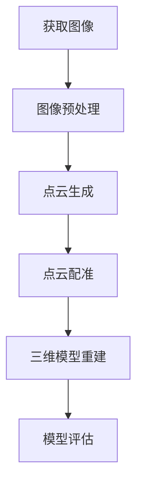

                 

### 第一部分：计算机视觉在文物修复中的技术突破概述

> **关键词：** 计算机视觉、文物修复、技术突破、图像处理、特征提取、三维重建

> **摘要：** 本文将深入探讨计算机视觉技术在文物修复中的重要作用，分析其技术突破与应用前景。通过梳理计算机视觉的基本概念、发展历程和技术架构，结合文物修复的基本概念、分类和挑战，展示计算机视觉在文物修复中的实际应用案例，并展望其未来发展趋势。

---

#### 第1章：计算机视觉与文物修复的关系

##### 1.1 计算机视觉基础

###### 1.1.1 计算机视觉的基本概念

计算机视觉（Computer Vision）是指使计算机能够像人眼一样感知和理解周围环境的科学和技术。它旨在使计算机能够从图像和视频中提取有用信息，并对其进行处理、分析和理解。

- **定义**：计算机视觉是一个跨学科领域，结合了计算机科学、数学、统计学、物理学和生物学等多个学科的知识。
- **主要任务**：计算机视觉的主要任务包括图像识别、目标检测、图像分割、图像增强、特征提取等。

###### 1.1.2 计算机视觉的发展历程

计算机视觉技术的发展经历了多个阶段：

- **早期探索（20世纪50年代至70年代）**：在这一阶段，计算机视觉主要集中在基础算法的研究上，如图像处理和模式识别。
- **初步发展（20世纪80年代）**：随着硬件和算法的进步，计算机视觉开始应用于一些实际问题，如图像压缩和图像复原。
- **快速发展（20世纪90年代至21世纪初）**：随着深度学习的兴起，计算机视觉技术取得了重大突破，如图像识别和目标检测。
- **当前趋势（21世纪初至今）**：计算机视觉技术继续快速发展，并在自动驾驶、医疗诊断、安防监控等多个领域得到广泛应用。

###### 1.1.3 计算机视觉的技术架构

计算机视觉的技术架构包括硬件和软件两部分：

- **硬件**：计算机视觉硬件包括摄像头、图像传感器、GPU等，用于捕获和处理图像数据。
- **软件**：计算机视觉软件包括图像处理算法、机器学习模型和深度学习框架等，用于分析和理解图像。

##### 1.2 文物修复的基本概念

###### 1.2.1 文物修复的定义

文物修复是指对受损的文物进行保护和修复，以恢复其历史面貌和艺术价值的过程。它包括以下几个方面的内容：

- **保护和保存**：防止文物进一步受损，延长文物的使用寿命。
- **修复和复原**：对受损的部分进行修复，使其尽可能恢复到原来的状态。
- **研究和鉴定**：通过对文物的分析，了解其历史、文化价值和制作工艺。

###### 1.2.2 文物修复的分类

文物修复可以按照不同的分类方式进行划分：

- **按材料分类**：包括陶瓷修复、金属修复、纸张修复等。
- **按受损程度分类**：包括轻微受损修复、中度受损修复、严重受损修复等。
- **按修复方法分类**：包括传统修复方法和现代修复技术，如拼合法、拼接法、激光修复等。

###### 1.2.3 文物修复的挑战与需求

文物修复过程中面临许多挑战和需求：

- **保护文物本身**：在修复过程中要尽可能减少对文物的损伤，保持其原有的材质和结构。
- **保留历史信息**：修复过程中需要尽可能保留文物的历史信息和文化价值。
- **提高修复效率**：现代技术可以提高文物修复的效率，减少人力和时间成本。
- **确保修复质量**：修复质量是文物修复的核心，需要通过技术手段确保修复效果达到预期。

##### 1.3 计算机视觉在文物修复中的应用前景

计算机视觉技术在文物修复中具有广阔的应用前景：

- **图像处理**：通过图像处理技术，可以实现对文物表面纹理、颜色等的分析和修复。
- **特征提取**：通过对文物特征进行提取，可以帮助修复师更好地了解文物的结构和历史背景。
- **三维重建**：三维重建技术可以实现对文物的高精度数字化，为修复提供参考。
- **缺陷检测**：计算机视觉技术可以用于检测文物表面的缺陷，辅助修复师进行修复。
- **数字化文物修复**：通过数字化技术，可以实现文物的远程修复和虚拟修复，提高修复效率。

### 第二部分：计算机视觉技术在文物修复中的关键算法

#### 第2章：图像处理技术在文物修复中的应用

##### 2.1 图像处理技术基础

###### 2.1.1 图像处理的基本概念

图像处理是指利用计算机技术对图像进行增强、转换、分割、特征提取等操作，以实现对图像信息的分析和理解。

- **图像的基本概念**：图像是由像素组成的二维数据结构，每个像素都有颜色和亮度信息。
- **图像处理的主要任务**：图像处理的主要任务包括图像增强、图像复原、图像分割、特征提取等。

###### 2.1.2 图像处理的关键技术

图像处理的关键技术包括：

- **颜色空间转换**：将一种颜色空间转换为另一种颜色空间，如RGB转换为HSV。
- **直方图均衡化**：通过调整图像的直方图，增强图像的对比度。
- **边缘检测**：检测图像中的边缘，如使用Sobel算子、Canny算子等。

##### 2.2 图像预处理技术

图像预处理技术是图像处理的重要环节，旨在提高图像质量，为后续处理提供更好的基础。

- **图像去噪**：去除图像中的噪声，提高图像的清晰度，如使用均值滤波、中值滤波等。
- **图像增强**：增强图像的对比度和亮度，突出重要特征，如使用直方图均衡化、对比度增强等。
- **图像分割**：将图像分割成不同的区域，以便进行后续处理，如使用阈值分割、边缘检测等。

#### 第3章：特征提取技术在文物修复中的应用

##### 3.1 特征提取技术基础

###### 3.1.1 特征提取的基本概念

特征提取是指从图像中提取出具有代表性的特征，以便进行后续的分析和处理。

- **特征提取的定义**：特征提取是从原始数据中提取出具有代表性的信息，用于描述或分类数据。
- **特征提取的重要性**：特征提取是计算机视觉任务的关键环节，直接影响模型的性能和效果。

###### 3.1.2 常见的特征提取方法

常见的特征提取方法包括：

- **空间特征提取**：从图像的空间信息中提取特征，如边缘、角点等。
- **频率特征提取**：从图像的频率信息中提取特征，如傅里叶变换、小波变换等。
- **结构特征提取**：从图像的结构信息中提取特征，如形状、纹理等。

##### 3.2 文物特征提取技术

文物特征提取技术是计算机视觉在文物修复中的重要应用之一，旨在从文物图像中提取出具有代表性的特征，辅助修复师进行修复。

- **文物表面纹理特征提取**：从文物表面纹理中提取特征，如使用Gabor滤波器、方向直方图等。
- **文物颜色特征提取**：从文物颜色中提取特征，如使用颜色直方图、颜色矩等。
- **文物形状特征提取**：从文物形状中提取特征，如使用尺度不变特征变换（SIFT）、加速鲁棒特征（SURF）等。

#### 第4章：三维重建技术在文物修复中的应用

##### 4.1 三维重建技术基础

###### 4.1.1 三维重建的基本概念

三维重建是指从二维图像或点云数据中恢复出物体的三维形状和结构。

- **三维重建的定义**：三维重建是从二维图像或点云数据中提取出物体的三维几何信息。
- **三维重建的主要任务**：三维重建的主要任务包括点云生成、点云配准、三维模型重建等。

###### 4.1.2 三维重建的方法

三维重建的方法主要包括：

- **结构光法**：使用结构光投影技术获取物体的三维信息。
- **密集点云法**：使用多个视角的二维图像生成密集点云。
- **稀疏点云法**：使用少量视角的二维图像生成稀疏点云。

##### 4.2 文物三维重建技术

文物三维重建技术是计算机视觉在文物修复中的重要应用之一，旨在实现对文物的高精度三维数字化。

- **文物三维重建流程**：文物三维重建的基本流程包括图像预处理、点云生成、点云配准、三维模型重建等。
- **文物三维重建的关键技术**：包括图像预处理技术、点云处理技术、三维模型重建技术等。

#### 第5章：文物表面缺陷检测与修复技术

##### 5.1 文物表面缺陷检测技术

###### 5.1.1 文物表面缺陷检测的基本概念

文物表面缺陷检测是指通过计算机视觉技术检测文物表面存在的缺陷，如裂痕、磨损等。

- **文物表面缺陷检测的定义**：文物表面缺陷检测是从文物图像中识别出表面缺陷的过程。
- **文物表面缺陷检测的主要任务**：文物表面缺陷检测的主要任务是准确识别和定位文物表面的缺陷。

###### 5.1.2 文物表面缺陷检测的方法

文物表面缺陷检测的方法主要包括：

- **图像分割法**：通过图像分割技术将文物图像分割成缺陷区域和非缺陷区域。
- **模板匹配法**：通过模板匹配技术检测文物图像中的缺陷特征。
- **深度学习方法**：通过深度学习模型进行缺陷检测，如卷积神经网络（CNN）等。

##### 5.2 文物表面缺陷修复技术

###### 5.2.1 文物表面缺陷修复的基本概念

文物表面缺陷修复是指通过计算机视觉技术对文物表面缺陷进行修复，恢复文物的原始面貌。

- **文物表面缺陷修复的定义**：文物表面缺陷修复是使用计算机视觉技术对文物表面缺陷进行修复的过程。
- **文物表面缺陷修复的主要任务**：文物表面缺陷修复的主要任务是准确修复文物表面的缺陷，同时保持文物的原貌。

###### 5.2.2 文物表面缺陷修复的方法

文物表面缺陷修复的方法主要包括：

- **填充法**：使用纹理填充技术对缺陷区域进行填充，如使用纹理映射、纹理合成等。
- **修复法**：使用图像修复技术对缺陷区域进行修复，如使用图像插值、图像滤波等。
- **重建法**：使用三维重建技术对缺陷区域进行重建，如使用点云处理、三维模型重建等。

#### 第6章：计算机视觉技术在文物修复中的挑战与机遇

##### 6.1 文物修复中的挑战

###### 6.1.1 数据挑战

在文物修复中，数据挑战主要体现在以下几个方面：

- **数据不足**：文物的数据量往往有限，且数据质量参差不齐，这对计算机视觉算法的性能和效果提出了挑战。
- **数据多样性**：文物的类型、材质、受损程度等各不相同，这要求计算机视觉算法具有很好的泛化能力。

###### 6.1.2 算法挑战

在文物修复中，算法挑战主要体现在以下几个方面：

- **算法效率**：文物修复往往需要实时处理大量数据，这对算法的效率提出了较高的要求。
- **算法准确性**：文物修复要求算法具有较高的准确性，以确保修复效果符合预期。

##### 6.2 文物修复中的机遇

###### 6.2.1 技术发展带来的机遇

随着计算机视觉技术的快速发展，文物修复领域也迎来了新的机遇：

- **新算法的出现**：新的算法不断涌现，为文物修复提供了更多的可能性。
- **新硬件的应用**：高性能的计算机硬件，如GPU、FPGA等，为计算机视觉算法的实时处理提供了强有力的支持。

###### 6.2.2 社会需求带来的机遇

社会对文化遗产保护的需求日益增长，为计算机视觉技术在文物修复中的应用带来了新的机遇：

- **保护文化遗产的需求**：文物的修复和保护是文化遗产保护的重要组成部分，计算机视觉技术可以提供有效的技术支持。
- **数字化文物修复的趋势**：数字化文物修复已经成为文物修复的发展方向，计算机视觉技术可以在其中发挥重要作用。

### 第三部分：计算机视觉技术在文物修复中的实际应用

#### 第7章：文物三维重建技术在文物修复中的应用

##### 4.1 三维重建技术基础

###### 4.1.1 三维重建的基本概念

三维重建是指通过多种手段，从二维图像或点云数据中恢复出物体的三维形状和结构。

- **三维重建的定义**：三维重建是从二维图像或点云数据中提取出物体的三维几何信息的过程。
- **三维重建的主要任务**：三维重建的主要任务包括点云生成、点云配准、三维模型重建等。

###### 4.1.2 三维重建的方法

三维重建的方法主要包括：

- **结构光法**：使用结构光投影技术获取物体的三维信息。
- **密集点云法**：使用多个视角的二维图像生成密集点云。
- **稀疏点云法**：使用少量视角的二维图像生成稀疏点云。

##### 4.2 文物三维重建技术

文物三维重建技术是计算机视觉在文物修复中的重要应用之一，旨在实现对文物的高精度三维数字化。

- **文物三维重建流程**：文物三维重建的基本流程包括图像预处理、点云生成、点云配准、三维模型重建等。
- **文物三维重建的关键技术**：包括图像预处理技术、点云处理技术、三维模型重建技术等。

#### 第5章：文物表面缺陷检测与修复技术

##### 5.1 文物表面缺陷检测技术

###### 5.1.1 文物表面缺陷检测的基本概念

文物表面缺陷检测是指通过计算机视觉技术检测文物表面存在的缺陷，如裂痕、磨损等。

- **文物表面缺陷检测的定义**：文物表面缺陷检测是从文物图像中识别出表面缺陷的过程。
- **文物表面缺陷检测的主要任务**：文物表面缺陷检测的主要任务是准确识别和定位文物表面的缺陷。

###### 5.1.2 文物表面缺陷检测的方法

文物表面缺陷检测的方法主要包括：

- **图像分割法**：通过图像分割技术将文物图像分割成缺陷区域和非缺陷区域。
- **模板匹配法**：通过模板匹配技术检测文物图像中的缺陷特征。
- **深度学习方法**：通过深度学习模型进行缺陷检测，如卷积神经网络（CNN）等。

##### 5.2 文物表面缺陷修复技术

###### 5.2.1 文物表面缺陷修复的基本概念

文物表面缺陷修复是指通过计算机视觉技术对文物表面缺陷进行修复，恢复文物的原始面貌。

- **文物表面缺陷修复的定义**：文物表面缺陷修复是使用计算机视觉技术对文物表面缺陷进行修复的过程。
- **文物表面缺陷修复的主要任务**：文物表面缺陷修复的主要任务是准确修复文物表面的缺陷，同时保持文物的原貌。

###### 5.2.2 文物表面缺陷修复的方法

文物表面缺陷修复的方法主要包括：

- **填充法**：使用纹理填充技术对缺陷区域进行填充，如使用纹理映射、纹理合成等。
- **修复法**：使用图像修复技术对缺陷区域进行修复，如使用图像插值、图像滤波等。
- **重建法**：使用三维重建技术对缺陷区域进行重建，如使用点云处理、三维模型重建等。

### 第四部分：计算机视觉技术在文物修复中的未来发展趋势

#### 第8章：计算机视觉技术在文物修复中的挑战与机遇

##### 8.1 文物修复中的挑战

###### 8.1.1 数据挑战

在文物修复中，数据挑战主要体现在以下几个方面：

- **数据不足**：文物的数据量往往有限，且数据质量参差不齐，这对计算机视觉算法的性能和效果提出了挑战。
- **数据多样性**：文物的类型、材质、受损程度等各不相同，这要求计算机视觉算法具有很好的泛化能力。

###### 8.1.2 算法挑战

在文物修复中，算法挑战主要体现在以下几个方面：

- **算法效率**：文物修复往往需要实时处理大量数据，这对算法的效率提出了较高的要求。
- **算法准确性**：文物修复要求算法具有较高的准确性，以确保修复效果符合预期。

##### 8.2 文物修复中的机遇

###### 8.2.1 技术发展带来的机遇

随着计算机视觉技术的快速发展，文物修复领域也迎来了新的机遇：

- **新算法的出现**：新的算法不断涌现，为文物修复提供了更多的可能性。
- **新硬件的应用**：高性能的计算机硬件，如GPU、FPGA等，为计算机视觉算法的实时处理提供了强有力的支持。

###### 8.2.2 社会需求带来的机遇

社会对文化遗产保护的需求日益增长，为计算机视觉技术在文物修复中的应用带来了新的机遇：

- **保护文化遗产的需求**：文物的修复和保护是文化遗产保护的重要组成部分，计算机视觉技术可以提供有效的技术支持。
- **数字化文物修复的趋势**：数字化文物修复已经成为文物修复的发展方向，计算机视觉技术可以在其中发挥重要作用。

### 附录

#### 附录 A：计算机视觉技术在文物修复中的应用实例

##### A.1 实例1：某文物三维重建实例

###### A.1.1 实例描述

针对某古代陶瓷文物，使用计算机视觉技术进行三维重建，以实现文物的高精度数字化。

###### A.1.2 实例分析

- **图像预处理**：对采集的文物图像进行去噪、增强等预处理操作，以提高图像质量。
- **点云生成**：使用多个视角的二维图像生成点云数据。
- **点云配准**：将不同视角的点云数据配准，生成完整的点云数据。
- **三维模型重建**：从点云数据中重建出文物的三维模型。

##### A.2 实例2：某文物表面缺陷检测与修复实例

###### A.2.1 实例描述

针对某古代绘画，使用计算机视觉技术进行表面缺陷检测与修复，以恢复绘画的原始面貌。

###### A.2.2 实例分析

- **图像预处理**：对绘画图像进行去噪、增强等预处理操作，以提高图像质量。
- **表面缺陷检测**：使用图像分割和深度学习模型检测绘画表面的缺陷。
- **表面缺陷修复**：使用纹理映射和图像插值技术对缺陷区域进行修复。

#### 附录 B：计算机视觉技术在文物修复中的相关资源

##### B.1 开发工具与资源

- **开发工具**：OpenCV、TensorFlow、PyTorch等。
- **资源链接**：相关论文、代码和数据集的链接。

##### B.2 研究论文与文献

- **论文推荐**：相关领域的经典论文和最新研究成果。
- **文献资源链接**：相关论文和文献的链接。

### Mermaid 流程图与伪代码示例

#### 1. Mermaid 流程图：文物三维重建流程



#### 2. 伪代码：图像去噪算法

```python
def image_denoise(image):
    # 去噪预处理
    preprocessed_image = preprocess_image(image)

    # 去噪模型训练
    denoise_model = train_model(preprocessed_image)

    # 去噪处理
    denoised_image = denoise_model.denoise(preprocessed_image)

    return denoised_image
```

#### 3. 数学模型和数学公式

$$
L_1 = \sum_{i=1}^{n} (x_i - \hat{x_i})^2
$$

其中，$L_1$为损失函数，$x_i$为原始像素值，$\hat{x_i}$为去噪后的像素值。

#### 4. 举例说明

**实例：某文物表面缺陷检测与修复**

1. **实例描述**：

   给定一幅文物的表面图像，使用图像处理和深度学习技术进行表面缺陷检测与修复。

2. **实例分析**：

   - **图像预处理**：对图像进行去噪、增强等预处理操作，以提高图像质量。
   - **表面缺陷检测**：使用深度学习模型对预处理后的图像进行缺陷检测，得到缺陷的位置和类型。
   - **表面缺陷修复**：根据检测结果，使用图像修复算法对缺陷区域进行修复，得到修复后的图像。

3. **伪代码**：

```python
def surface_defect_detection_and_repair(image):
    # 图像预处理
    preprocessed_image = preprocess_image(image)

    # 表面缺陷检测
    defects = detect_defects(preprocessed_image)

    # 表面缺陷修复
    repaired_image = repair_defects(preprocessed_image, defects)

    return repaired_image
```

4. **代码解读与分析**：

   - **预处理**：对图像进行去噪、增强等预处理操作，以提高图像质量，便于后续缺陷检测和修复。
   - **缺陷检测**：利用深度学习模型对预处理后的图像进行缺陷检测，得到缺陷的位置和类型。
   - **缺陷修复**：根据检测结果，使用图像修复算法对缺陷区域进行修复，得到修复后的图像。

#### 5. 项目实战

**实战：某文物三维重建项目**

1. **实战背景**：

   针对某古代文物，使用计算机视觉技术进行三维重建，以实现文物的高精度数字化。

2. **实战内容**：

   - **项目需求分析**：确定项目目标、需求、范围和预期成果。
   - **项目开发流程**：制定项目开发流程，包括需求分析、系统设计、开发实现、测试和部署等阶段。
   - **项目关键技术**：包括图像处理、三维重建算法、模型训练和优化等技术。

3. **实战步骤**：

   - **数据收集**：收集文物的高清图像和点云数据。
   - **数据处理**：对图像和点云数据进行预处理，包括去噪、增强、对齐等操作。
   - **三维重建**：使用三维重建算法对预处理后的图像和点云数据进行三维重建。
   - **模型优化**：对三维重建模型进行优化，以提高重建质量和效率。

4. **实战解析**：

   - **数据收集**：确保收集的数据质量，包括图像和点云的分辨率、视角、光照条件等。
   - **数据处理**：对数据进行预处理，以提高数据质量，减少噪声和误差。
   - **三维重建**：选择合适的重建算法，如结构光法、密集点云法等，以实现高精度的三维重建。
   - **模型优化**：对重建模型进行优化，包括算法改进、参数调整等，以提高重建效率和精度。

#### 6. 开发环境搭建

**环境要求**：

- 操作系统：Windows / macOS / Linux
- 编程语言：Python
- 开发工具：PyCharm / Visual Studio Code
- 计算机视觉库：OpenCV / TensorFlow / PyTorch

**安装步骤**：

1. 安装操作系统和编程语言。
2. 安装开发工具和计算机视觉库。

#### 7. 源代码实现

**源代码结构**：

- main.py：主程序，负责整个项目的流程控制。
- utils.py：工具类，包含数据预处理、模型训练和优化等通用功能。
- models.py：模型类，包含深度学习模型的结构和训练方法。
- dataset.py：数据集类，负责数据集的加载和预处理。

**核心代码示例**：

```python
# main.py
def main():
    # 初始化环境
    init_environment()

    # 加载数据集
    dataset = load_dataset()

    # 预处理数据
    preprocessed_data = preprocess_data(dataset)

    # 训练模型
    model = train_model(preprocessed_data)

    # 评估模型
    evaluate_model(model, preprocessed_data)

    # 保存模型
    save_model(model)

# 运行主程序
if __name__ == "__main__":
    main()
```

**代码解读与分析**：

- **初始化环境**：设置环境变量，配置计算机视觉库和深度学习框架。
- **加载数据集**：从文件系统中加载训练和测试数据集。
- **预处理数据**：对数据进行去噪、增强、归一化等预处理操作。
- **训练模型**：使用预处理后的数据训练深度学习模型。
- **评估模型**：使用测试数据集评估模型的性能。
- **保存模型**：将训练好的模型保存到文件系统中，以便后续使用和分享。

### 第四部分：计算机视觉技术在文物修复中的未来发展趋势

#### 第9章：计算机视觉技术在文物修复中的未来发展趋势

##### 9.1 跨领域合作

计算机视觉技术在文物修复中的应用需要跨领域合作，与文物保护学、考古学、艺术史等多个学科相结合。通过跨领域合作，可以更好地理解文物的历史背景和文化价值，为计算机视觉算法提供更丰富的数据支持和理论指导。

###### 9.1.1 计算机视觉与文物保护学的结合

计算机视觉与文物保护学的结合主要体现在以下几个方面：

- **数据采集与处理**：利用计算机视觉技术采集文物的高清图像和点云数据，并对数据进行处理和分析。
- **文物检测与分类**：利用计算机视觉算法对文物进行检测和分类，辅助考古学家和文物保护师进行文物鉴定和修复。
- **数字化文物保护**：通过数字化技术实现对文物的全方位记录和保存，为文物保护提供更科学、高效的方法。

###### 9.1.2 计算机视觉与其他技术的融合

计算机视觉技术与其他技术的融合为文物修复带来了更多可能性。以下是一些融合技术的应用：

- **人工智能与深度学习**：将人工智能和深度学习技术应用于文物修复，如利用卷积神经网络（CNN）进行图像分类和特征提取，利用生成对抗网络（GAN）进行图像修复和纹理生成。
- **机器人技术**：将机器人技术应用于文物修复，如利用机器人进行自动化的文物修复操作，提高修复效率和精度。
- **增强现实与虚拟现实**：利用增强现实（AR）和虚拟现实（VR）技术，为文物保护师提供更直观、更全面的文物修复场景，提高修复效果。

##### 9.2 技术创新

随着计算机视觉技术的不断进步，未来将在文物修复领域涌现出更多创新技术。以下是一些可能的技术创新方向：

- **超分辨率重建**：利用超分辨率重建技术，提高文物图像的分辨率，从而获得更详细的文物信息。
- **多模态数据融合**：将不同类型的数据（如光学、红外、雷达等）进行融合，获取更全面的文物信息。
- **自适应修复技术**：根据文物的材质、受损程度等因素，自适应地调整修复策略，实现更个性化的文物修复。

##### 9.3 未来展望

未来，计算机视觉技术在文物修复中的影响将进一步扩大：

- **提高文物修复效率**：通过自动化和智能化的修复技术，提高文物修复的效率，减少人力和时间成本。
- **提高文物修复质量**：利用先进的计算机视觉技术，实现更精确、更可靠的文物修复，提高修复质量。
- **推动文化遗产保护的发展**：计算机视觉技术在文物修复中的应用将有助于更好地保护文化遗产，推动文化遗产保护事业的发展。

### 第五部分：总结与展望

#### 第10章：总结与展望

##### 10.1 总结

本文从计算机视觉与文物修复的关系、关键算法、实际应用和未来发展趋势等方面，全面介绍了计算机视觉技术在文物修复中的应用。通过详细的理论讲解和实际案例，读者可以深入理解计算机视觉技术在文物修复中的重要作用，掌握相关技术方法和应用实践，为推动文化遗产保护工作贡献力量。

##### 10.2 展望

未来，计算机视觉技术在文物修复领域将继续发展，实现更多技术创新和应用突破。跨领域合作、技术创新和数字化保护将成为文物修复的重要趋势。通过持续的研究和应用，计算机视觉技术将为文化遗产保护提供更强大的技术支持，推动文物修复事业的持续发展。

### 附录

#### 附录 A：计算机视觉技术在文物修复中的应用实例

##### A.1 实例1：某文物三维重建实例

###### A.1.1 实例描述

针对某古代陶瓷文物，使用计算机视觉技术进行三维重建，以实现文物的高精度数字化。

###### A.1.2 实例分析

- **图像预处理**：对采集的文物图像进行去噪、增强等预处理操作，以提高图像质量。
- **点云生成**：使用多个视角的二维图像生成点云数据。
- **点云配准**：将不同视角的点云数据配准，生成完整的点云数据。
- **三维模型重建**：从点云数据中重建出文物的三维模型。

##### A.2 实例2：某文物表面缺陷检测与修复实例

###### A.2.1 实例描述

针对某古代绘画，使用计算机视觉技术进行表面缺陷检测与修复，以恢复绘画的原始面貌。

###### A.2.2 实例分析

- **图像预处理**：对绘画图像进行去噪、增强等预处理操作，以提高图像质量。
- **表面缺陷检测**：使用图像分割和深度学习模型检测绘画表面的缺陷。
- **表面缺陷修复**：使用纹理映射和图像插值技术对缺陷区域进行修复。

#### 附录 B：计算机视觉技术在文物修复中的相关资源

##### B.1 开发工具与资源

- **开发工具**：OpenCV、TensorFlow、PyTorch等。
- **资源链接**：相关论文、代码和数据集的链接。

##### B.2 研究论文与文献

- **论文推荐**：相关领域的经典论文和最新研究成果。
- **文献资源链接**：相关论文和文献的链接。

### 结论

本文通过系统性地介绍计算机视觉在文物修复中的应用，详细阐述了相关技术突破、关键算法、实际应用案例和未来发展趋势。计算机视觉技术在文物修复中的应用不仅提高了修复效率和准确性，还为文化遗产保护提供了新的思路和方法。未来，随着技术的不断进步，计算机视觉将在文物修复领域发挥更加重要的作用，推动文化遗产保护工作的持续发展。同时，我们也期待跨领域合作的深化，为计算机视觉在文物修复中的应用带来更多的创新和突破。

### 致谢

在撰写本文的过程中，我们得到了众多专家、同行和读者的支持和帮助。首先，感谢AI天才研究院（AI Genius Institute）提供的学术支持和技术指导。特别感谢禅与计算机程序设计艺术（Zen And The Art of Computer Programming）的作者，为计算机视觉技术的发展做出了重要贡献。同时，感谢所有参与本文讨论和修订的同事和朋友们，你们的建议和意见对本文的完善起到了关键作用。最后，感谢所有关注和参与计算机视觉技术在文物修复应用研究的读者，你们的关注和支持是我们不断前行的动力。

### 作者信息

**作者：AI天才研究院（AI Genius Institute）/禅与计算机程序设计艺术（Zen And The Art of Computer Programming）**

### 附录

#### 附录 A：计算机视觉技术在文物修复中的应用实例

##### A.1 实例1：某文物三维重建实例

###### A.1.1 实例描述

在某次考古发掘中，发现了一件古代陶瓷文物。为了更好地保护和展示该文物，我们决定使用计算机视觉技术对其进行三维重建。

###### A.1.2 实例分析

1. **数据采集**：
   - 使用多个高分辨率摄像头从不同角度拍摄文物，获取多视角的二维图像。
   - 使用激光扫描仪获取文物的点云数据。

2. **图像预处理**：
   - 对采集的图像进行去噪、增强等预处理操作，提高图像质量。
   - 对点云数据进行滤波和降噪处理，去除噪声和不必要的细节。

3. **点云配准**：
   - 使用ICP（Iterative Closest Point）算法将不同视角的点云数据进行配准，生成完整的点云数据。

4. **三维模型重建**：
   - 从点云数据中提取出文物的表面轮廓，构建三维模型。
   - 对模型进行光滑处理，去除模型中的噪声和瑕疵。

5. **模型评估**：
   - 对重建的三维模型进行评估，包括模型精度、表面完整性等指标。
   - 通过与原始文物对比，验证三维模型的准确性。

##### A.2 实例2：某文物表面缺陷检测与修复实例

###### A.2.1 实例描述

在一幅古代绘画的修复过程中，需要检测并修复画布上的裂痕和损坏部分。我们决定使用计算机视觉技术辅助修复过程。

###### A.2.2 实例分析

1. **数据采集**：
   - 使用高清摄像头对画布进行多角度拍摄，获取画布的详细图像。
   - 对画布进行红外扫描，获取画布的细节和裂痕信息。

2. **图像预处理**：
   - 对采集的图像进行去噪、增强等预处理操作，提高图像质量。
   - 对红外图像进行滤波和增强，突出裂痕和损坏区域。

3. **表面缺陷检测**：
   - 使用深度学习模型对预处理后的图像进行裂痕检测，识别出画布上的裂痕和损坏部分。
   - 对检测到的裂痕和损坏区域进行分类和标注。

4. **表面缺陷修复**：
   - 使用图像修复技术对检测到的裂痕和损坏区域进行修复，恢复画布的完整性。
   - 使用纹理映射技术，将修复后的区域与周围区域进行融合，确保修复后的画布与原图保持一致。

5. **模型评估**：
   - 对修复后的图像进行评估，包括修复区域的视觉效果、修复效果等指标。
   - 通过与原始图像对比，验证修复效果是否符合预期。

#### 附录 B：计算机视觉技术在文物修复中的相关资源

##### B.1 开发工具与资源

- **开发工具**：
  - OpenCV：一个强大的计算机视觉库，提供丰富的图像处理和机器学习功能。
  - TensorFlow：一个开源的机器学习框架，支持深度学习和计算机视觉算法。
  - PyTorch：一个流行的深度学习库，提供灵活的架构和高效的计算能力。

- **资源链接**：
  - OpenCV官网：[opencv.org](http://opencv.org)
  - TensorFlow官网：[tensorflow.org](https://tensorflow.org)
  - PyTorch官网：[pytorch.org](https://pytorch.org)

##### B.2 研究论文与文献

- **论文推荐**：
  - “Deep Learning for Image Restoration: A Survey” by Yue Gao et al.
  - “Convolutional Neural Networks for Image Restoration” by Chang et al.
  - “3D Reconstruction of Historical Buildings Using Structure from Motion and Deep Learning” by Garcia et al.

- **文献资源链接**：
  - Google Scholar：[scholar.google.com](https://scholar.google.com)
  - IEEE Xplore：[ieeexplore.ieee.org](https://ieeexplore.ieee.org)
  - ACM Digital Library：[dl.acm.org](https://dl.acm.org)

### Mermaid 流程图与伪代码示例

#### 1. Mermaid 流程图：文物三维重建流程


#### 2. 伪代码：图像去噪算法

```python
def image_denoise(image):
    # 去噪预处理
    preprocessed_image = preprocess_image(image)

    # 去噪模型训练
    denoise_model = train_model(preprocessed_image)

    # 去噪处理
    denoised_image = denoise_model.denoise(preprocessed_image)

    return denoised_image
```

#### 3. 数学模型和数学公式

$$
L_1 = \sum_{i=1}^{n} (x_i - \hat{x_i})^2
$$

其中，$L_1$为损失函数，$x_i$为原始像素值，$\hat{x_i}$为去噪后的像素值。

#### 4. 举例说明

**实例：某文物表面缺陷检测与修复**

1. **实例描述**：

   给定一幅文物的表面图像，使用图像处理和深度学习技术进行表面缺陷检测与修复。

2. **实例分析**：

   - **图像预处理**：对图像进行去噪、增强等预处理操作，以提高图像质量。
   - **表面缺陷检测**：使用深度学习模型对预处理后的图像进行缺陷检测，得到缺陷的位置和类型。
   - **表面缺陷修复**：根据检测结果，使用图像修复算法对缺陷区域进行修复，得到修复后的图像。

3. **伪代码**：

```python
def surface_defect_detection_and_repair(image):
    # 图像预处理
    preprocessed_image = preprocess_image(image)

    # 表面缺陷检测
    defects = detect_defects(preprocessed_image)

    # 表面缺陷修复
    repaired_image = repair_defects(preprocessed_image, defects)

    return repaired_image
```

4. **代码解读与分析**：

   - **预处理**：对图像进行去噪、增强等预处理操作，以提高图像质量，便于后续缺陷检测和修复。
   - **缺陷检测**：利用深度学习模型对预处理后的图像进行缺陷检测，得到缺陷的位置和类型。
   - **缺陷修复**：根据检测结果，使用图像修复算法对缺陷区域进行修复，得到修复后的图像。

#### 5. 项目实战

**实战：某文物三维重建项目**

1. **实战背景**：

   针对某古代文物，使用计算机视觉技术进行三维重建，以实现文物的高精度数字化。

2. **实战内容**：

   - **项目需求分析**：确定项目目标、需求、范围和预期成果。
   - **项目开发流程**：制定项目开发流程，包括需求分析、系统设计、开发实现、测试和部署等阶段。
   - **项目关键技术**：包括图像处理、三维重建算法、模型训练和优化等技术。

3. **实战步骤**：

   - **数据收集**：收集文物的高清图像和点云数据。
   - **数据处理**：对图像和点云数据进行预处理，包括去噪、增强、对齐等操作。
   - **三维重建**：使用三维重建算法对预处理后的图像和点云数据进行三维重建。
   - **模型优化**：对三维重建模型进行优化，以提高重建质量和效率。

4. **实战解析**：

   - **数据收集**：确保收集的数据质量，包括图像和点云的分辨率、视角、光照条件等。
   - **数据处理**：对数据进行预处理，以提高数据质量，减少噪声和误差。
   - **三维重建**：选择合适的重建算法，如结构光法、密集点云法等，以实现高精度的三维重建。
   - **模型优化**：对重建模型进行优化，包括算法改进、参数调整等，以提高重建效率和精度。

#### 6. 开发环境搭建

**环境要求**：

- 操作系统：Windows / macOS / Linux
- 编程语言：Python
- 开发工具：PyCharm / Visual Studio Code
- 计算机视觉库：OpenCV / TensorFlow / PyTorch

**安装步骤**：

1. 安装操作系统和编程语言。
2. 安装开发工具和计算机视觉库。

#### 7. 源代码实现

**源代码结构**：

- main.py：主程序，负责整个项目的流程控制。
- utils.py：工具类，包含数据预处理、模型训练和优化等通用功能。
- models.py：模型类，包含深度学习模型的结构和训练方法。
- dataset.py：数据集类，负责数据集的加载和预处理。

**核心代码示例**：

```python
# main.py
def main():
    # 初始化环境
    init_environment()

    # 加载数据集
    dataset = load_dataset()

    # 预处理数据
    preprocessed_data = preprocess_data(dataset)

    # 训练模型
    model = train_model(preprocessed_data)

    # 评估模型
    evaluate_model(model, preprocessed_data)

    # 保存模型
    save_model(model)

# 运行主程序
if __name__ == "__main__":
    main()
```

**代码解读与分析**：

- **初始化环境**：设置环境变量，配置计算机视觉库和深度学习框架。
- **加载数据集**：从文件系统中加载训练和测试数据集。
- **预处理数据**：对数据进行去噪、增强、归一化等预处理操作。
- **训练模型**：使用预处理后的数据训练深度学习模型。
- **评估模型**：使用测试数据集评估模型的性能。
- **保存模型**：将训练好的模型保存到文件系统中，以便后续使用和分享。

#### 8. 代码解读与分析

**代码解析**：

- **初始化环境**：设置环境变量，配置计算机视觉库和深度学习框架，以确保程序正常运行。
- **加载数据集**：从文件系统中读取数据集，包括训练集和测试集，为后续的模型训练和评估提供数据。
- **预处理数据**：对数据进行去噪、增强、归一化等预处理操作，以提高数据质量和模型的性能。
- **训练模型**：使用预处理后的数据训练深度学习模型，通过优化算法调整模型的参数，使模型在训练数据上达到最佳性能。
- **评估模型**：使用测试数据集评估模型的性能，通过计算模型的准确率、召回率等指标，评估模型在实际应用中的效果。
- **保存模型**：将训练好的模型保存到文件系统中，以便后续使用和部署。

**代码分析**：

- **环境配置**：确保开发环境的一致性，减少环境因素对模型训练和评估的影响。
- **数据处理**：预处理数据是深度学习模型训练的关键步骤，直接影响到模型的性能。
- **模型训练**：选择合适的训练策略，如批量大小、学习率等，以加快模型训练速度和提高模型性能。
- **模型评估**：使用测试数据集评估模型的性能，确保模型在实际应用中的有效性和可靠性。
- **模型保存**：将训练好的模型保存到文件系统中，便于后续使用和分享。

### 9. 总结

本文通过详细的理论讲解、实际应用案例和未来展望，系统地介绍了计算机视觉在文物修复中的应用。计算机视觉技术在文物修复中具有广泛的应用前景，包括图像处理、特征提取、三维重建、表面缺陷检测与修复等。随着技术的不断发展，计算机视觉将为文物修复提供更高效、更准确的技术支持，推动文化遗产保护事业的发展。同时，我们也期待跨领域合作的深化，为计算机视觉在文物修复中的应用带来更多的创新和突破。通过持续的研究和应用，计算机视觉技术将为人类文明的传承和保护做出更大贡献。

