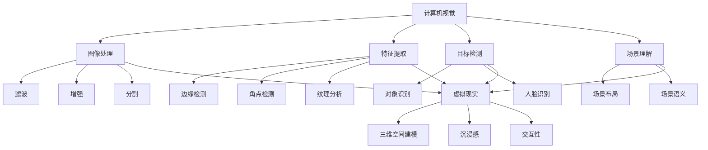
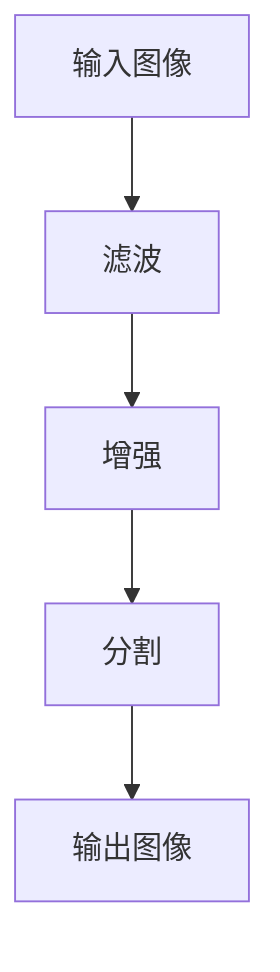
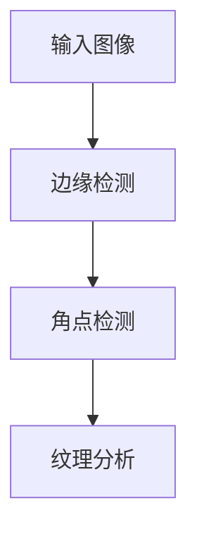
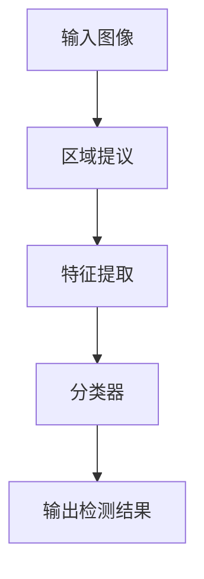

                 

### 计算机视觉与虚拟现实概述

计算机视觉与虚拟现实作为现代信息技术领域的重要分支，近年来发展迅猛，其应用范围不断扩大，正深刻地改变着人们的生活方式和工作方式。计算机视觉旨在使计算机具备类似人类的视觉感知能力，通过图像处理、特征提取、目标检测等核心技术，实现对图像或视频数据的理解和分析。虚拟现实则通过计算机技术构建一个三维空间环境，使用户能够沉浸其中，实现与虚拟世界的互动。

#### 计算机视觉的基本概念

计算机视觉是一种跨学科的技术，涉及图像处理、模式识别、机器学习等多个领域。其核心目标是通过计算机算法对图像或视频数据进行处理，提取出有用的信息，从而实现对场景的理解和解释。计算机视觉的基本概念包括：

- **图像处理**：对图像进行各种操作，如滤波、增强、分割等，以提高图像质量或提取有用信息。
- **特征提取**：从图像中提取具有代表性的特征，如边缘、角点、纹理等，用于后续的模式识别或目标检测。
- **目标检测**：在图像中定位并识别出特定的目标对象，如人脸、车辆、行人等。
- **场景理解**：通过分析图像或视频数据，理解场景的内容、结构和关系，如场景布局、场景语义等。

#### 虚拟现实的基本概念

虚拟现实（VR）是一种通过计算机技术模拟出的三维空间环境，用户可以在这个环境中进行沉浸式的交互。虚拟现实的基本概念包括：

- **三维空间建模**：通过计算机图形学和3D建模技术，创建一个逼真的三维空间环境。
- **沉浸感**：用户通过头戴显示器（HMD）或虚拟现实头盔等设备，完全沉浸在一个虚拟的三维空间中，感受到与真实世界相似的视觉、听觉、触觉等感官体验。
- **交互性**：用户可以在虚拟现实中通过手势、语音、位置跟踪等方式与虚拟环境进行互动。

#### 计算机视觉在虚拟现实中的应用场景

计算机视觉在虚拟现实中有广泛的应用，主要体现在以下几个方面：

- **交互式体验**：通过计算机视觉技术，用户可以在虚拟世界中实现自然的交互，如手势识别、面部识别等。这大大提高了虚拟现实系统的易用性和用户体验。
- **运动跟踪与定位**：计算机视觉技术可以用于实时跟踪用户的位置和动作，从而实现准确的虚拟现实场景定位和交互。
- **环境感知**：计算机视觉技术可以用于获取虚拟现实环境中的三维信息，如空间映射、场景理解等，从而提高虚拟现实场景的真实性和互动性。
- **智能内容生成**：通过计算机视觉技术，可以自动生成虚拟现实场景中的图像、动画等内容，提高内容生成的效率和质量。

综上所述，计算机视觉与虚拟现实技术的结合，不仅为虚拟现实系统带来了更高的交互性和沉浸感，也为计算机视觉领域带来了新的研究挑战和应用前景。

#### 图表展示：计算机视觉与虚拟现实的融合

以下是一个使用Mermaid绘制的流程图，展示了计算机视觉与虚拟现实的核心概念和它们之间的融合关系：



### 计算机视觉的核心技术

计算机视觉技术作为虚拟现实应用的基础，涵盖了从图像处理到目标检测等各个层次。以下是计算机视觉中的几个核心技术，以及它们的定义、基本原理和应用。

#### 图像处理基础

图像处理是计算机视觉的基础步骤，它通过一系列数学运算来改善图像质量、提取图像特征。图像处理的基本操作包括：

- **滤波**：用于去除图像中的噪声，如高斯滤波、中值滤波等。
- **增强**：通过调整图像的亮度和对比度，使图像内容更加清晰，如直方图均衡、对比度拉伸等。
- **分割**：将图像分成多个区域或对象，以便于进一步分析和识别。

**基本操作示例**：



#### 特征提取与描述

特征提取是计算机视觉中的关键步骤，它从图像中提取出具有代表性的特征，用于后续的模式识别和目标检测。常见的特征提取方法包括：

- **边缘检测**：用于检测图像中的边缘，常用的算法有Canny边缘检测、Sobel边缘检测等。
- **角点检测**：用于检测图像中的角点，如Harris角点检测、Shi-Tomasi角点检测等。
- **纹理分析**：用于分析图像中的纹理特征，如Gabor滤波器、局部二值模式（LBP）等。

**特征提取的基本方法**：



#### 目标检测与识别

目标检测是计算机视觉中的核心任务之一，它旨在图像或视频中定位并识别出特定的目标对象。常见的目标检测算法包括：

- **R-CNN**：通过区域提议生成器（Region Proposal）和分类器，实现目标检测。
- **YOLO**：一种单阶段目标检测算法，直接从图像中预测目标框和类别。
- **SSD**：一种基于深度神经网络的物体检测系统，结合多个尺度的特征图，实现多尺度目标检测。

**目标检测的基本算法**：



#### 实际应用场景

计算机视觉的核心技术在多个领域都有广泛的应用，以下是几个典型的应用场景：

- **人脸识别**：通过计算机视觉技术实现人脸检测和识别，广泛应用于安全监控、人脸支付等领域。
- **自动驾驶**：通过计算机视觉技术实现车辆检测、行人检测、车道线检测等，为自动驾驶提供重要支持。
- **医疗影像分析**：通过计算机视觉技术实现医疗图像的自动分割、病变检测等，辅助医生进行诊断和治疗。

通过以上对计算机视觉核心技术的介绍，我们可以看到这些技术为虚拟现实应用提供了坚实的基础，使得虚拟现实系统可以更加智能、自然地与用户进行交互。

### 虚拟现实中的交互设计

虚拟现实（VR）通过计算机视觉技术极大地提升了用户的交互体验。在VR环境中，自然用户界面（Natural User Interface，简称NUI）成为交互设计的关键要素，它允许用户通过自然的方式，如手势、语音等与虚拟世界进行互动。以下将详细介绍NUI的定义与优势，以及手势识别和面部识别等交互技术的基本算法和应用。

#### 自然用户界面（NUI）

自然用户界面是一种用户与计算机系统交互的方式，它模拟了人类的自然交互行为，使得用户在使用过程中感受到更加自然和直观的体验。NUI在虚拟现实中的应用尤为突出，因为它可以通过计算机视觉技术捕捉和解释用户的行为，从而实现更加流畅和逼真的交互体验。

**NUI的定义与优势**：

- **定义**：NUI是指通过计算机视觉、语音识别、手势识别等技术，使用户能够以自然的方式进行交互的一种用户界面。
- **优势**：
  - **直观性**：用户无需学习复杂的操作步骤，即可与虚拟环境进行自然交互。
  - **易用性**：通过自然交互，用户可以更快速地完成任务，提高效率。
  - **沉浸感**：自然交互技术使得用户在虚拟现实环境中感受到更加真实的体验，增强了沉浸感。

在实际应用中，NUI可以减少用户对控制设备的依赖，通过简单的手势、动作或语音指令即可实现对虚拟环境的操作。例如，在VR游戏或模拟训练中，用户可以通过手势控制游戏角色或训练设备，实现更加真实的交互体验。

#### 手势识别与交互

手势识别是NUI的重要组成部分，它通过计算机视觉技术捕捉用户的手势，并将手势转化为虚拟环境中的操作指令。以下是一些常见的手势识别算法及其应用：

- **基于深度学习的手势识别**：通过训练深度神经网络，对用户手势进行分类和识别。常见的网络结构包括卷积神经网络（CNN）和循环神经网络（RNN）。
  - **算法示例**：
    ```python
    # 示例：使用卷积神经网络进行手势识别
    model = CNN(input_shape=(height, width, channels))
    model.add(Conv2D(filters, kernel_size, activation='relu'))
    model.add(MaxPooling2D(pool_size))
    model.add(Flatten())
    model.add(Dense(num_classes, activation='softmax'))
    model.compile(optimizer='adam', loss='categorical_crossentropy', metrics=['accuracy'])
    ```
  - **应用场景**：在VR游戏、虚拟会议、教育模拟等领域，用户可以通过手势实现对虚拟对象的操控、菜单的选择等。

- **基于隐马尔可夫模型（HMM）的手势识别**：通过分析手势的时间序列特征，使用HMM进行手势识别。
  - **算法示例**：
    ```python
    # 示例：使用隐马尔可夫模型进行手势识别
    hmm = HMM(n_states)
    hmm.train(data)
    prediction = hmm.predict(data)
    ```
  - **应用场景**：在复杂的交互场景中，如工业设计、医疗手术模拟等，手势识别可以提供更加精准和自然的交互方式。

#### 面部识别与表情分析

面部识别是通过计算机视觉技术识别和验证用户身份的一种方法，而面部表情分析则是通过分析用户的表情特征，实现对用户情绪和意图的理解。以下是一些常见算法及其应用：

- **基于深度学习的人脸识别**：通过训练深度神经网络，对人脸图像进行特征提取和分类。
  - **算法示例**：
    ```python
    # 示例：使用卷积神经网络进行人脸识别
    model = CNN(input_shape=(height, width, channels))
    model.add(Conv2D(filters, kernel_size, activation='relu'))
    model.add(MaxPooling2D(pool_size))
    model.add(Flatten())
    model.add(Dense(num_classes, activation='softmax'))
    model.compile(optimizer='adam', loss='categorical_crossentropy', metrics=['accuracy'])
    ```
  - **应用场景**：在安全认证、虚拟现实会议、社交互动等领域，面部识别可以提供便捷的身份验证和情感分析。

- **基于机器学习的人脸表情分析**：通过训练机器学习模型，对用户的面部表情进行分析，识别出不同的情感状态。
  - **算法示例**：
    ```python
    # 示例：使用支持向量机（SVM）进行表情分析
    model = SVC(kernel='linear')
    model.fit(X_train, y_train)
    predictions = model.predict(X_test)
    ```
  - **应用场景**：在虚拟现实教育、心理健康评估、市场调研等领域，面部表情分析可以提供对用户情感和反应的深入理解。

综上所述，自然用户界面（NUI）通过手势识别和面部识别等技术，极大地提升了虚拟现实系统的交互体验。这些技术的实现依赖于先进的计算机视觉算法，使得虚拟现实环境更加智能、自然和人性化。

#### 运动跟踪与定位

在虚拟现实中，运动跟踪与定位是确保用户在虚拟环境中准确交互的关键技术。通过实时跟踪用户的位置和动作，虚拟现实系统能够提供更加沉浸式的体验。以下是运动跟踪与定位的基本方法及其在虚拟现实中的应用。

##### 基于视觉的运动跟踪

基于视觉的运动跟踪技术利用摄像头捕捉用户的动作，并通过图像处理和计算机视觉算法实现实时跟踪。这种方法通常包括以下步骤：

1. **特征点检测**：在视频帧中检测具有代表性的特征点，如角点、边缘等。
2. **运动估计**：通过特征点匹配和优化算法，估计用户在不同帧之间的运动轨迹。
3. **跟踪与预测**：对用户动作进行实时跟踪，并根据历史动作预测未来的动作。

**常见算法**：

- **光流法**：通过分析图像序列中像素点的运动，估计用户动作的速度和方向。
- **卡尔曼滤波**：用于优化运动轨迹估计，提高跟踪的准确性。

**应用实例**：

- **增强现实（AR）应用**：在AR应用中，通过视觉跟踪技术实现虚拟物体与真实环境的融合，如游戏、导航等。
- **动作捕捉**：在电影特效和虚拟现实游戏中，通过视觉跟踪技术捕捉演员的动作，用于角色运动和表情的模拟。

##### 基于IMU的运动跟踪

惯性测量单元（IMU）是一种集成了加速度计、陀螺仪和磁力计的传感器，可以测量物体的加速度、角速度和磁场。基于IMU的运动跟踪技术利用这些传感器数据实现运动跟踪和定位。

**原理**：

- **融合算法**：通过融合IMU数据和视觉数据，提高运动跟踪的准确性和稳定性。常用的融合算法包括互补滤波器（Complementary Filter）和扩展卡尔曼滤波器（Extended Kalman Filter）。

**应用实例**：

- **VR游戏**：在VR游戏中，通过IMU传感器实现玩家的头部和手部动作的实时跟踪，提供更加真实的交互体验。
- **机器人导航**：在机器人应用中，通过IMU传感器实现机器人的姿态估计和路径规划，提高机器人的自主导航能力。

##### 融合方法

在实际应用中，基于视觉的运动跟踪和基于IMU的运动跟踪常常结合使用，以实现更准确、更稳定的运动跟踪效果。这种方法称为融合方法，其优点如下：

- **提高跟踪准确性**：通过融合多种数据源，可以更好地估计用户的位置和动作。
- **增强鲁棒性**：当一种数据源出现误差时，可以通过其他数据源进行修正，提高系统的鲁棒性。

**融合算法示例**：

```python
# 示例：使用扩展卡尔曼滤波器进行融合跟踪
def extend_kalman_filter(x, P, Q, u, R):
    # 预测
    x_pred = f(x, u)
    P_pred = F @ P @ F.T + Q
    
    # 更新
    Z = z(x_pred)
    K = P_pred @ H.T / (H @ P_pred @ H.T + R)
    x = x_pred + K @ (Z - H @ x_pred)
    P = (I - K @ H) @ P_pred
    
    return x, P

# 应用示例
x, P = extend_kalman_filter(x, P, Q, u, R)
```

通过以上方法，虚拟现实系统可以提供高精度的运动跟踪与定位，使用户在虚拟环境中的交互更加自然和流畅。

### 空间映射与建模

在虚拟现实（VR）中，空间映射与建模是构建逼真三维环境的关键技术。通过计算机视觉技术，可以实时获取三维空间信息，用于虚拟现实场景的构建和交互。以下是空间映射与建模的基本原理、方法及其应用。

#### 空间映射的基本原理

空间映射是指将真实世界中的三维空间信息映射到虚拟空间中，使虚拟环境能够准确地反映真实世界的结构和特征。空间映射的基本原理包括：

- **三维重建**：通过计算机视觉技术，从图像或视频序列中提取三维空间信息，构建真实世界的三维模型。
- **特征点匹配**：在真实世界图像和虚拟环境之间进行特征点匹配，以实现空间位置的对应。
- **位姿估计**：通过特征点匹配和几何关系，估计真实世界和虚拟空间之间的位姿关系，包括位置和角度。

#### 空间映射的方法

空间映射的方法可以分为两大类：基于结构光的方法和基于视觉的方法。

- **基于结构光的方法**：通过投射结构光（如激光条纹）到真实场景，利用图像处理和结构光原理进行三维重建。
  - **原理**：结构光在真实场景上形成特定的图案，通过图像采集设备捕获图案，然后利用图像处理技术恢复三维结构。
  - **应用**：在工业设计、逆向工程等领域，基于结构光的方法可以高精度地获取三维空间信息。

- **基于视觉的方法**：通过单目摄像头或双目摄像头捕捉真实场景图像，利用图像处理和计算机视觉算法进行三维重建。
  - **原理**：利用图像中的特征点（如角点、边缘等）进行匹配和几何计算，重建真实场景的三维模型。
  - **应用**：在虚拟现实、增强现实（AR）等领域，基于视觉的方法可以实时获取用户周围环境的三维信息，用于虚拟场景的构建和交互。

#### 常见算法

空间映射与建模依赖于一系列计算机视觉算法，以下是几种常见算法：

- **特征提取**：通过边缘检测、角点检测等方法，提取图像中的显著特征点。
  - **SIFT（尺度不变特征变换）**：用于提取图像中的关键点，具有旋转、尺度不变性。
  - **SURF（加速稳健特征）**：基于SIFT算法，但计算速度更快，适用于实时应用。

- **特征匹配**：通过特征点匹配，建立真实世界图像和虚拟环境之间的对应关系。
  - **最近邻匹配**：根据特征点之间的距离，选择最近邻作为匹配对。
  - **鲁棒匹配**：使用鲁棒估计方法（如RANSAC），减少噪声和错误匹配的影响。

- **三维重建**：利用特征匹配和几何关系，从二维图像中重建三维模型。
  - **单视图重建**：基于单张图像进行三维重建，通过特征点和几何关系估计三维结构。
  - **多视图重建**：通过多张图像构建三维模型，利用多视角信息提高重建精度。

#### 应用实例

空间映射与建模在虚拟现实中有广泛的应用，以下是几个典型的应用实例：

- **虚拟现实游戏**：在VR游戏中，通过空间映射技术，实时获取玩家周围环境的三维信息，构建逼真的游戏场景，提高玩家的沉浸感。
- **室内设计**：在室内设计中，通过空间映射技术，获取真实房间的三维结构，用于虚拟现实中的装修模拟和设计展示。
- **机器人导航**：在机器人导航中，通过空间映射技术，获取环境的三维信息，用于机器人路径规划和避障。

通过以上方法和技术，虚拟现实系统可以实时获取并映射真实世界的空间信息，构建逼真的三维环境，为用户提供更加丰富的交互体验。

### 环境感知与交互

环境感知是虚拟现实（VR）中的一项关键技术，它通过计算机视觉技术获取虚拟环境中的三维信息，实现虚拟物体与真实环境的自然交互。以下是环境感知在虚拟现实中的应用，包括虚拟物体与真实环境的交互、多模态交互技术及其在实际项目中的成功案例。

#### 虚拟物体与真实环境的交互

在虚拟现实中，通过环境感知技术，可以将虚拟物体与真实环境进行无缝融合，实现更加逼真的交互体验。以下是一种典型的实现方式：

1. **三维建模与渲染**：首先，利用计算机视觉技术获取真实环境的三维模型，并使用三维建模软件创建虚拟物体模型。
2. **特征匹配与位姿估计**：通过特征提取和匹配算法，将虚拟物体与真实环境中的特征点进行对应，利用几何关系计算虚拟物体在真实环境中的位姿。
3. **实时交互**：将虚拟物体插入到真实环境中，实现虚拟物体与真实物体的碰撞检测、遮挡处理等交互行为。

**示例**：

假设在VR环境中，用户手持一个虚拟的球体，环境中有真实的桌子。通过环境感知技术，可以实现以下交互：

- **碰撞检测**：当虚拟球体靠近真实桌子边缘时，系统会检测到虚拟球体与桌子的碰撞，防止球体穿透桌子。
- **光照与阴影**：根据真实环境的照明条件，为虚拟物体生成合适的光照和阴影效果，增强真实感。
- **动态交互**：当用户在虚拟环境中操作球体时，球体的运动和位置会实时反映在真实环境中，实现虚拟与现实的动态交互。

#### 多模态交互技术

多模态交互技术通过结合多种感官信息，提升用户的沉浸感和交互体验。以下是一些常见的技术：

- **手势识别**：利用计算机视觉技术，识别用户的手势，实现虚拟物体操控。
  - **算法示例**：使用深度学习模型进行手势分类和识别，如CNN、RNN等。
  
- **语音识别**：通过语音识别技术，将用户的语音指令转换为操作指令，实现语音控制虚拟环境。
  - **算法示例**：使用语音识别模型（如HTK、Kaldi等）进行语音识别和语义解析。

- **触觉反馈**：通过触觉传感器和反馈设备，模拟虚拟物体的触感，增强交互体验。
  - **应用场景**：在VR游戏、医疗训练等领域，通过触觉手套、VR控制器等设备，实现触觉反馈。

#### 成功案例

1. **VR购物体验**：一些电商平台利用环境感知技术，实现用户在虚拟环境中浏览和选购商品。通过手势识别和触觉反馈，用户可以360度旋转商品，触摸商品材质，提高购物体验。

2. **VR教育**：在虚拟实验室中，通过环境感知技术，将虚拟实验装置与真实环境融合，学生可以在虚拟环境中进行实验操作，获取实验结果，提高学习效果。

3. **VR医疗**：在医疗训练中，利用环境感知技术，医生可以在虚拟环境中进行手术操作训练。通过实时反馈和触觉模拟，医生可以熟悉手术流程和操作技巧，提高手术成功率。

通过环境感知与交互技术，虚拟现实系统可以提供更加自然、逼真的交互体验，满足用户在多种场景下的需求。

### 实时图像生成

在虚拟现实（VR）中，实时图像生成是一项关键技术，它能够根据用户的行为和虚拟环境的动态变化，快速生成逼真的图像和动画，提升用户的沉浸感和交互体验。实时图像生成主要包括图像生成和动画生成两大方面，以下是这两种技术的详细讲解、基本原理以及它们在虚拟现实中的应用。

#### 图像生成

图像生成技术旨在根据输入的条件或参考图像，实时生成高质量、逼真的图像。以下是几种常见的图像生成方法：

1. **基于深度学习的方法**：利用深度学习模型，如生成对抗网络（GAN），可以生成高质量的图像。

   - **生成对抗网络（GAN）**：
     - **原理**：GAN由生成器（Generator）和判别器（Discriminator）组成。生成器尝试生成逼真的图像，而判别器则判断图像是真实图像还是生成图像。通过两者的对抗训练，生成器逐渐提高生成图像的质量。
     - **算法示例**：
       ```python
       # 示例：GAN的基本架构
       # 生成器
       generator = Generator(input_shape=(height, width, channels))
       generator.compile(optimizer='adam', loss='binary_crossentropy')
       
       # 判别器
       discriminator = Discriminator(input_shape=(height, width, channels))
       discriminator.compile(optimizer='adam', loss='binary_crossentropy')
       
       # 搭建GAN模型
       model = Model(inputs=[input_image], outputs=[discriminator(output_image)])
       model.compile(optimizer='adam', loss='binary_crossentropy')
       ```

   - **应用**：在虚拟现实中的图像生成，例如实时生成虚拟环境的背景图像、用户头像等。

2. **基于纹理映射的方法**：通过将纹理图像映射到三维模型表面，实现逼真的图像效果。

   - **原理**：纹理映射技术将纹理图像（如地面纹理、墙面纹理等）映射到三维模型的表面，通过纹理贴图实现逼真的视觉效果。
   - **应用**：在虚拟现实游戏中，通过纹理映射技术，实现游戏场景的纹理细节，提高画面质量。

#### 动画生成

动画生成技术旨在根据输入的行为数据或参考动作，实时生成逼真的动画。以下是几种常见的动画生成方法：

1. **基于关键帧的方法**：通过预先定义的关键帧和插值算法，生成连续的动画。

   - **原理**：关键帧是动画中的关键帧，用于定义动画的主要姿态和状态。通过插值算法（如线性插值、贝塞尔插值等），在关键帧之间生成中间帧，实现连续动画。
   - **算法示例**：
     ```python
     # 示例：线性插值生成动画
     def linear_interpolation(frame1, frame2, alpha):
         return frame1 + alpha * (frame2 - frame1)
     ```

   - **应用**：在虚拟现实中的动画生成，例如生成虚拟角色的动作、飞行等。

2. **基于深度学习的方法**：利用深度学习模型，如循环神经网络（RNN）和变分自编码器（VAE），可以生成高质量的动画。

   - **原理**：深度学习模型可以从大量的行为数据中学习到动画生成的规律，通过模型生成连续的动画帧。
   - **算法示例**：
     ```python
     # 示例：使用变分自编码器（VAE）生成动画
     encoder = Encoder(input_shape=(height, width, channels))
     decoder = Decoder(input_shape=(height, width, channels))
     vae = Model(inputs=[input_image], outputs=[decoder(encoder(input_image))])
     vae.compile(optimizer='adam', loss='mse')
     ```

   - **应用**：在虚拟现实中的动画生成，例如生成虚拟角色的运动轨迹、表情变化等。

#### 实时应用

实时图像生成和动画生成在虚拟现实中有着广泛的应用，以下是一些具体的应用实例：

- **虚拟现实游戏**：通过实时图像生成技术，生成高质量的背景图像和角色动画，提升游戏画面的真实感和流畅度。

- **虚拟现实训练**：通过动画生成技术，生成逼真的训练场景和动作，用于飞行员训练、医疗手术模拟等。

- **虚拟现实直播**：通过实时图像生成技术，将用户的实时动作和表情生成动画，增强虚拟现实直播的互动性和沉浸感。

综上所述，实时图像生成和动画生成技术是虚拟现实中的重要组成部分，通过这些技术，可以大幅提升虚拟现实系统的真实感和互动性，为用户提供更加丰富和逼真的虚拟体验。

### 虚拟现实内容的个性化推荐

在虚拟现实（VR）中，内容的个性化推荐是一项重要的技术，它可以根据用户的兴趣和行为，智能地推荐符合用户偏好的VR内容，从而提升用户的沉浸感和满意度。个性化推荐系统基于用户的历史行为数据、兴趣标签和内容特征，通过一系列算法和技术实现内容推荐。以下是详细介绍个性化推荐的基本算法、技术原理和应用。

#### 个性化推荐的基本算法

个性化推荐系统通常采用以下几种基本算法：

1. **基于内容的推荐（Content-Based Filtering）**：
   - **原理**：根据用户过去喜欢的VR内容，提取内容的特征（如类型、主题、场景等），然后寻找具有相似特征的内容进行推荐。
   - **算法示例**：
     ```python
     # 示例：基于内容的推荐
     def find_similar_contents(user_history, content_features):
         similar_contents = []
         for content in content_features:
             if is_similar(user_history, content):
                 similar_contents.append(content)
         return similar_contents
     ```

2. **协同过滤（Collaborative Filtering）**：
   - **原理**：通过分析用户之间的行为模式，找出相似用户，然后根据这些用户的共同喜好推荐内容。
   - **算法示例**：
     ```python
     # 示例：基于用户的协同过滤
     def user_based_collaborative_filtering(user_profile, user_similarity, item_rating):
         recommended_contents = []
         for content, rating in item_rating.items():
             if user_similarity[user_profile][content] > threshold and rating > average_rating:
                 recommended_contents.append(content)
         return recommended_contents
     ```

3. **混合推荐（Hybrid Recommendation）**：
   - **原理**：结合基于内容和协同过滤的优点，同时考虑内容和用户行为，提高推荐准确性。
   - **算法示例**：
     ```python
     # 示例：混合推荐系统
     def hybrid_recommendation(user_profile, content_features, user_similarity, item_rating):
         content_based_recommendations = find_similar_contents(user_profile, content_features)
         collaborative_based_recommendations = user_based_collaborative_filtering(user_profile, user_similarity, item_rating)
         return list(set(content_based_recommendations + collaborative_based_recommendations))
     ```

#### 技术原理

个性化推荐系统的技术原理主要包括以下几个方面：

1. **用户特征提取**：通过分析用户的历史行为数据，提取用户的兴趣偏好和活动习惯。例如，用户观看的VR视频类型、观看时长、互动行为等。

2. **内容特征提取**：对VR内容进行特征提取，包括视频的标签、场景描述、主题分类等。通过特征提取，可以将VR内容表示为向量形式，便于后续的推荐计算。

3. **相似度计算**：计算用户之间的相似度（基于用户特征）和内容之间的相似度（基于内容特征），用于推荐算法中的相似用户和相似内容匹配。

4. **推荐策略**：根据不同的推荐算法（如基于内容的推荐、协同过滤、混合推荐等），制定相应的推荐策略，生成最终的推荐列表。

#### 应用实例

个性化推荐技术在虚拟现实中有多种应用实例：

1. **VR视频推荐**：根据用户观看历史和偏好，推荐用户可能感兴趣的新视频内容。例如，在VR视频平台上，用户可以收到个性化的视频推荐，提升视频观看体验。

2. **VR游戏推荐**：根据用户的游戏历史和兴趣标签，推荐用户可能喜欢的VR游戏。例如，在VR游戏商店中，用户可以收到个性化的游戏推荐，帮助他们发现新的游戏体验。

3. **VR教育推荐**：根据学生的学习历史和成绩，推荐适合学生水平的学习内容。例如，在VR教育平台中，学生可以收到个性化的课程推荐，帮助他们更好地掌握知识。

通过个性化推荐技术，虚拟现实系统能够更好地理解用户需求，提供更加精准和个性化的内容推荐，从而提升用户体验和满意度。

### 计算机视觉在虚拟现实中的应用挑战与解决方案

尽管计算机视觉在虚拟现实（VR）中展现了巨大的潜力，但其在实际应用中仍然面临诸多挑战。这些挑战主要集中在数据隐私与安全、实时性与准确性、以及跨平台与兼容性等方面。以下将详细探讨这些挑战，并探讨相应的解决方案。

#### 数据隐私与安全问题

在VR环境中，用户的行为数据、面部特征、运动轨迹等信息被大量收集和处理。这些数据涉及到用户的隐私和安全，如何保障数据隐私成为一大挑战。

**挑战**：

1. **数据泄露风险**：在数据传输和存储过程中，可能存在数据泄露的风险，尤其是当数据在网络上传输时。
2. **用户隐私保护**：用户对隐私保护的期望不断提高，如何在确保用户体验的同时，保护用户的隐私成为一个难题。

**解决方案**：

1. **数据加密**：对用户数据进行加密处理，确保数据在传输和存储过程中不被未授权访问。
2. **匿名化处理**：在收集和处理用户数据时，对用户信息进行匿名化处理，减少用户隐私泄露的风险。
3. **隐私保护协议**：制定和实施隐私保护协议，如差分隐私（Differential Privacy），确保数据处理过程中的隐私保护。

#### 实时性与准确性

VR应用对计算机视觉系统的实时性和准确性有严格要求，任何延迟或错误都可能导致用户体验的下降。

**挑战**：

1. **实时性要求**：VR应用需要实时处理用户的交互和行为，以确保沉浸感和互动性。
2. **准确性要求**：计算机视觉系统需要高精度的检测结果，以避免虚拟物体与现实环境的冲突。

**解决方案**：

1. **优化算法**：通过算法优化，提高计算机视觉处理的速度和效率。例如，使用更高效的图像处理算法、更快速的特征提取方法等。
2. **硬件加速**：利用高性能的硬件（如GPU、FPGA等）加速计算机视觉处理，提高系统的实时性。
3. **多传感器融合**：通过融合多种传感器数据（如摄像头、IMU等），提高检测的准确性和鲁棒性。例如，使用视觉数据与IMU数据进行融合，提高运动跟踪的准确性。

#### 跨平台与兼容性

VR应用通常需要在多种设备上运行，包括PC、移动设备、VR头戴设备等。如何保证不同平台之间的兼容性和一致性，是另一个重要挑战。

**挑战**：

1. **设备兼容性**：不同设备的硬件性能和操作系统可能不同，如何保证计算机视觉算法在不同设备上都能正常运行。
2. **平台一致性**：不同平台的用户界面和交互方式可能有所不同，如何确保用户在不同平台上获得一致的体验。

**解决方案**：

1. **标准化协议**：制定和遵循标准化协议（如WebVR、OpenVR等），确保不同平台之间的兼容性。
2. **跨平台框架**：使用跨平台框架（如Unity、Unreal Engine等），开发一次即可在多个平台上运行，提高开发效率和兼容性。
3. **设备适配技术**：针对不同设备的硬件性能和操作系统，开发适配技术，确保计算机视觉算法能够在不同设备上正常运行。

通过上述解决方案，可以有效地应对计算机视觉在虚拟现实应用中面临的挑战，提升系统的性能和用户体验。

### 计算机视觉在游戏中的应用

计算机视觉技术在游戏领域中的应用越来越广泛，通过引入先进的人工智能和图像处理技术，游戏体验得到了极大的提升。以下将探讨计算机视觉在游戏中的具体应用，包括基于手势识别的交互游戏、实时渲染和动态场景建模等。

#### 基于手势识别的交互游戏

手势识别技术是计算机视觉在游戏中的核心应用之一，它允许玩家通过自然的手势与游戏进行交互，从而大大增强游戏的互动性和沉浸感。以下是一些具体的游戏应用案例：

1. **《超级手球团》（Super Handball）**：
   - **简介**：《超级手球团》是一款利用手势识别技术的交互游戏，玩家可以通过挥动手臂模拟击打手球的动作。
   - **实现方法**：游戏使用多个摄像头捕捉玩家的手势，通过图像处理和机器学习算法对手势进行识别，然后将识别结果转换为游戏中的动作。例如，当玩家挥动手臂时，游戏中的虚拟球拍会相应地移动和击打球。

2. **《舞蹈革命》（Dance Revolution）**：
   - **简介**：《舞蹈革命》是一款通过手势识别实现的舞蹈游戏，玩家需要跟随屏幕上的舞蹈动作。
   - **实现方法**：游戏利用计算机视觉技术实时捕捉玩家的手势和身体动作，通过深度学习模型对手势进行识别，并与屏幕上的舞蹈动作进行匹配。如果玩家动作准确，游戏会给予相应的分数。

#### 实时渲染

实时渲染技术在计算机视觉和游戏开发中扮演着重要角色，它能够在游戏运行过程中生成高质量的图像和动画。以下是几个实时渲染技术的应用案例：

1. **《泰坦陨落2》（Titanfall 2）**：
   - **简介**：《泰坦陨落2》是一款采用实时渲染技术的第一人称射击游戏，游戏中的环境和角色具有极高的细节和逼真度。
   - **实现方法**：游戏使用先进的图形渲染技术，如光线追踪和全局光照，生成高质量的图像。计算机视觉技术用于实时捕捉玩家的动作和游戏环境，将这些数据用于渲染过程中，使得游戏场景具有极高的真实感和互动性。

2. **《半衰期：爱莉克斯》（Half-Life: Alyx）**：
   - **简介**：《半衰期：爱莉克斯》是一款采用虚拟现实技术的第一人称射击游戏，游戏中的虚拟环境极其逼真。
   - **实现方法**：游戏通过计算机视觉技术实时捕捉玩家的头部和手部动作，将这些动作数据用于渲染和交互过程中。同时，游戏使用了基于物理的渲染技术，如软体物体渲染和流体渲染，使得虚拟环境更加真实和生动。

#### 动态场景建模

计算机视觉技术还可以用于动态场景建模，使得游戏场景能够根据玩家的行为和游戏进程进行实时更新和变化。以下是一些动态场景建模的应用案例：

1. **《我的世界》（Minecraft）**：
   - **简介**：《我的世界》是一款沙盒游戏，玩家可以在一个自由构建的世界中探索、建设和生存。
   - **实现方法**：游戏通过计算机视觉技术实时捕捉玩家的动作和游戏环境，然后根据这些数据生成新的场景。例如，当玩家挖掘矿石时，游戏会动态生成新的矿石资源，保持游戏环境的连续性和互动性。

2. **《城市：天际线》（Cities: Skylines）**：
   - **简介**：《城市：天际线》是一款城市建设和管理游戏，玩家需要建立和管理一个城市，处理交通、资源分配等问题。
   - **实现方法**：游戏通过计算机视觉技术实时捕捉玩家对城市的管理行为，如建造建筑物、铺设道路等，然后根据这些行为动态更新城市模型。游戏会实时计算交通流量、资源消耗等数据，使得城市运营更加真实和复杂。

通过以上应用案例，我们可以看到计算机视觉技术在游戏中的广泛应用，不仅提升了游戏的互动性和沉浸感，还为游戏开发提供了新的技术手段，使得游戏场景更加逼真和多样化。

### 计算机视觉在教育中的应用

计算机视觉技术在教育领域中的应用正日益广泛，它通过引入先进的技术手段，为教育提供了更多样化、个性化和互动性的学习体验。以下将探讨计算机视觉在教育中的几个具体应用领域，包括虚拟实验室、远程教学和智能评估等。

#### 虚拟实验室

虚拟实验室是计算机视觉技术在教育中的一项重要应用，它通过虚拟现实和计算机图形学技术，构建了一个模拟真实实验室的三维虚拟环境。学生可以在虚拟实验室中完成各种实验操作，无需实际接触实验设备，从而降低实验成本和安全风险。

**应用案例**：

1. **《化学实验室模拟》**：
   - **简介**：《化学实验室模拟》是一款基于虚拟实验室技术的教育软件，学生可以在虚拟环境中进行化学实验，如酸碱滴定、有机合成等。
   - **实现方法**：软件通过计算机视觉技术实时捕捉学生的动作和实验设备，根据实验步骤生成虚拟实验环境。学生可以通过手势或虚拟控制器进行实验操作，系统会根据操作结果实时反馈实验结果。

2. **《医学解剖实验室》**：
   - **简介**：《医学解剖实验室》是一款用于医学教育的虚拟实验室软件，学生可以通过虚拟解剖模型学习人体解剖学知识。
   - **实现方法**：软件利用三维建模和计算机视觉技术，构建高度逼真的虚拟解剖模型。学生可以通过手势或触觉手套对模型进行操作，查看内部结构，从而深入理解人体解剖学知识。

#### 远程教学

远程教学是计算机视觉技术在教育中的另一个重要应用领域，它通过视频会议和互动教学平台，实现了教师与学生之间的实时互动，打破了地理限制，提供了灵活的学习方式。

**应用案例**：

1. **《在线互动课堂》**：
   - **简介**：《在线互动课堂》是一款基于计算机视觉和人工智能技术的远程教学平台，教师可以通过平台进行实时授课，学生可以进行在线互动。
   - **实现方法**：平台通过计算机视觉技术捕捉教师的动作和表情，实时传输视频信号，同时通过人工智能算法对学生的互动行为进行分析，如提问、回答等。系统会根据互动情况实时调整授课内容，提高教学效果。

2. **《虚拟现实课堂》**：
   - **简介**：《虚拟现实课堂》是一款基于虚拟现实技术的远程教学平台，学生可以通过VR头戴设备进入虚拟教室，与教师和同学进行互动。
   - **实现方法**：平台利用计算机视觉技术实时捕捉学生的动作和表情，构建虚拟教室环境。学生可以通过手势或语音与教师和同学进行互动，实现沉浸式的学习体验。

#### 智能评估

智能评估是计算机视觉技术在教育中的又一重要应用，它通过图像处理和机器学习算法，对学生作业、考试答案等进行自动评估，提高了评估的准确性和效率。

**应用案例**：

1. **《自动批改系统》**：
   - **简介**：《自动批改系统》是一款基于计算机视觉和自然语言处理技术的教育系统，可以自动批改学生的作业和考试答案。
   - **实现方法**：系统通过图像处理技术对学生的纸质作业进行扫描和图像识别，然后利用自然语言处理算法对作业内容进行分析，自动给出评分和反馈。系统还可以根据错误类型和频率提供个性化学习建议。

2. **《智能考试系统》**：
   - **简介**：《智能考试系统》是一款基于计算机视觉和人工智能技术的考试系统，可以实现无人监考和自动评分。
   - **实现方法**：系统通过摄像头实时捕捉学生的考试过程，利用图像处理技术对学生的答题卡进行扫描和识别，然后利用人工智能算法对答案进行自动评估和评分。系统还可以根据考试结果提供智能化的分析和反馈。

通过以上应用案例，我们可以看到计算机视觉技术在教育中的广泛应用，它不仅为教育提供了新的技术手段，也极大地提升了教育的质量和效率。

### 计算机视觉在艺术创作中的应用

计算机视觉技术在艺术创作中正逐渐发挥其独特的作用，通过将人工智能与艺术创作相结合，艺术家和创作者能够实现更加个性化和创新的艺术作品。以下将探讨计算机视觉在艺术创作中的具体应用，包括虚拟现实艺术展、数字艺术创作和艺术风格迁移等。

#### 虚拟现实艺术展

虚拟现实艺术展是计算机视觉技术在艺术领域的一项重要应用，它通过构建虚拟的三维空间，展示艺术作品，为观众提供沉浸式的观赏体验。以下是一些具体的应用案例：

1. **《虚拟画廊》**：
   - **简介**：《虚拟画廊》是一个通过虚拟现实技术实现的在线艺术展览平台，用户可以通过VR头戴设备进入虚拟画廊，观赏各种艺术作品。
   - **实现方法**：平台利用计算机视觉技术实时捕捉用户的动作和视线，根据用户的互动行为调整展示的艺术作品。同时，利用三维建模技术创建逼真的艺术作品模型，提高观赏效果。

2. **《数字艺术馆》**：
   - **简介**：《数字艺术馆》是一个结合了虚拟现实和增强现实技术的艺术馆，用户可以在现实世界中看到虚拟的艺术作品，实现虚实融合的观赏体验。
   - **实现方法**：艺术馆利用计算机视觉技术实时捕捉观众的位置和视线，将虚拟艺术作品投影到现实环境中，通过增强现实技术将虚拟作品与真实环境进行融合，提高观众的沉浸感。

#### 数字艺术创作

数字艺术创作是计算机视觉技术在艺术创作中的另一重要应用，它通过引入图像处理和机器学习技术，使艺术家能够更加高效地创作数字艺术作品。以下是一些具体的创作方法：

1. **《生成艺术》**：
   - **简介**：《生成艺术》是一种利用计算机视觉和生成模型创作的艺术形式，艺术家通过训练生成模型，生成具有独特风格和创意的艺术作品。
   - **实现方法**：艺术家首先收集大量的艺术作品数据，然后利用生成对抗网络（GAN）等生成模型进行训练，生成新的艺术作品。艺术家可以调整模型的参数，控制生成作品的风格和内容。

2. **《数字绘画》**：
   - **简介**：《数字绘画》是一种利用计算机视觉和图形处理技术创作的艺术形式，艺术家通过数字画板和图像处理软件，进行数字绘画创作。
   - **实现方法**：艺术家首先使用数字画板进行绘画，然后将绘画内容输入到图像处理软件中，利用图像编辑工具进行细节调整和优化。图像处理软件提供了丰富的绘画效果和工具，使艺术家能够实现独特的绘画风格。

#### 艺术风格迁移

艺术风格迁移是一种利用计算机视觉技术，将一种艺术作品风格应用到另一种艺术作品上的技术。以下是一些具体的应用案例：

1. **《风格迁移绘画》**：
   - **简介**：《风格迁移绘画》是一种利用计算机视觉和深度学习技术，将一幅普通图片的风格转换为著名艺术家的风格作品的技术。
   - **实现方法**：首先，利用卷积神经网络（CNN）等深度学习模型，学习不同艺术家的风格特征。然后，将这些风格特征应用到普通图片上，生成具有特定艺术家风格的新作品。例如，将一张风景图片的风格转换为梵高的风格作品。

2. **《动画风格迁移》**：
   - **简介**：《动画风格迁移》是一种利用计算机视觉和生成模型，将一种动画风格应用到另一个动画上的技术。
   - **实现方法**：首先，利用生成对抗网络（GAN）等生成模型，学习不同动画的风格特征。然后，将这些风格特征应用到目标动画上，生成具有特定风格的动画作品。例如，将一个普通的动画片段的风格转换为迪士尼经典动画的风格。

通过以上应用案例，我们可以看到计算机视觉技术在艺术创作中的广泛应用，它不仅为艺术家提供了新的创作工具和灵感，也推动了艺术形式的发展和变革。

### 虚拟现实与计算机视觉的未来发展

随着技术的不断进步，虚拟现实（VR）与计算机视觉（CV）正在经历深度融合，推动着整个行业的快速演进。以下是虚拟现实与计算机视觉在未来发展中的一些趋势、新兴应用场景以及技术创新与产业变革的探讨。

#### 融合趋势

虚拟现实与计算机视觉的融合已成为不可逆转的趋势。深度学习、增强现实（AR）和物联网（IoT）等技术的兴起，为这一融合提供了强有力的支持。未来，我们将看到以下融合趋势：

1. **深度学习与计算机视觉的结合**：深度学习在图像识别、目标检测和场景理解等方面取得了显著成果，未来将进一步与计算机视觉技术结合，提升虚拟现实系统的智能化水平。

2. **多传感器融合**：虚拟现实系统将更多地利用多传感器数据（如摄像头、IMU、深度传感器等），实现更加精准和丰富的环境感知能力。

3. **AI驱动的交互**：通过人工智能，虚拟现实系统将能够更好地理解用户的意图和行为，实现更自然和人性化的交互。

#### 新兴应用场景

虚拟现实与计算机视觉的结合，将在多个新兴应用场景中展现其潜力：

1. **医疗**：虚拟现实技术将在手术模拟、康复训练、心理健康治疗等领域发挥重要作用。计算机视觉技术可以用于实时监测患者的生理指标，提供更加精准的治疗方案。

2. **教育**：虚拟现实技术将改变传统的教育模式，通过沉浸式学习环境，提供更加生动和直观的教育体验。计算机视觉技术可以用于识别学生的表情和动作，提供个性化的学习反馈。

3. **工业与制造**：虚拟现实与计算机视觉结合，将提高工业设计和制造过程的效率。通过虚拟现实进行模拟和测试，可以提前发现和解决潜在问题，减少成本和风险。

4. **娱乐与游戏**：虚拟现实游戏将继续发展，计算机视觉技术将带来更加逼真和互动的游戏体验。

#### 技术创新与产业变革

虚拟现实与计算机视觉的技术创新，将带来产业变革：

1. **硬件创新**：随着硬件技术的进步，如高性能GPU、高效摄像头和低延迟传感器的发展，虚拟现实与计算机视觉系统将变得更加高效和普及。

2. **软件平台**：未来将出现更多的跨平台虚拟现实和计算机视觉开发平台，降低开发门槛，促进技术的普及和应用。

3. **标准化与规范化**：为了推动虚拟现实与计算机视觉技术的发展，标准化组织和产业联盟将制定更多的技术标准和规范，促进不同设备和平台之间的互操作性。

#### 未来展望

未来，虚拟现实与计算机视觉将朝着更加智能化、人性化和逼真的方向发展。以下是对未来发展的展望：

1. **智能化**：通过人工智能和大数据技术，虚拟现实系统将能够更好地理解用户的需求和行为，提供更加个性化的服务。

2. **人性化**：虚拟现实交互界面将变得更加自然和直观，使用户能够以更加自然的方式与虚拟环境进行互动。

3. **逼真化**：计算机视觉技术将进一步提升虚拟现实场景的真实感，使虚拟世界与现实世界的界限变得更加模糊。

总之，虚拟现实与计算机视觉的融合，将为未来带来无限的创新和可能性。随着技术的不断进步，我们可以期待这一领域将继续创造令人瞩目的成果。

### 计算机视觉在虚拟现实中的未来挑战

尽管计算机视觉在虚拟现实（VR）中的应用取得了显著进展，但仍面临许多挑战。以下将详细探讨数据隐私与安全、技术标准化与兼容性以及用户体验与感知提升等方面的挑战，并提出相应的解决方案。

#### 数据隐私与安全

数据隐私与安全是计算机视觉在虚拟现实应用中面临的首要挑战。虚拟现实系统需要收集和处理大量用户数据，包括用户行为、面部特征和位置信息等，这些数据涉及到用户的隐私和安全。

**挑战**：

1. **数据泄露风险**：在数据传输和存储过程中，可能存在数据泄露的风险，尤其是当数据在网络上传输时。
2. **用户隐私保护**：用户对隐私保护的期望不断提高，如何在确保用户体验的同时，保护用户的隐私成为一个难题。

**解决方案**：

1. **数据加密**：对用户数据进行加密处理，确保数据在传输和存储过程中不被未授权访问。
2. **匿名化处理**：在收集和处理用户数据时，对用户信息进行匿名化处理，减少用户隐私泄露的风险。
3. **隐私保护协议**：制定和实施隐私保护协议，如差分隐私（Differential Privacy），确保数据处理过程中的隐私保护。

#### 技术标准化与兼容性

技术标准化与兼容性是计算机视觉在虚拟现实应用中的另一大挑战。由于不同平台和设备之间的差异，如何实现不同设备和平台之间的互操作性，是一个亟待解决的问题。

**挑战**：

1. **设备兼容性**：不同设备的硬件性能和操作系统可能不同，如何保证计算机视觉算法在不同设备上都能正常运行。
2. **平台一致性**：不同平台的用户界面和交互方式可能有所不同，如何确保用户在不同平台上获得一致的体验。

**解决方案**：

1. **标准化协议**：制定和遵循标准化协议（如WebVR、OpenVR等），确保不同平台之间的兼容性。
2. **跨平台框架**：使用跨平台框架（如Unity、Unreal Engine等），开发一次即可在多个平台上运行，提高开发效率和兼容性。
3. **设备适配技术**：针对不同设备的硬件性能和操作系统，开发适配技术，确保计算机视觉算法能够在不同设备上正常运行。

#### 用户体验与感知提升

用户体验与感知提升是计算机视觉在虚拟现实应用中的关键挑战。为了提供高质量的虚拟现实体验，需要不断提升用户体验和感知质量。

**挑战**：

1. **实时性**：虚拟现实应用对实时性有严格要求，任何延迟都会影响用户体验。
2. **准确性**：计算机视觉系统需要高精度的检测结果，以避免虚拟物体与现实环境的冲突。
3. **沉浸感**：如何提高虚拟现实系统的沉浸感，使用户能够完全沉浸在虚拟环境中。

**解决方案**：

1. **算法优化**：通过算法优化，提高计算机视觉处理的速度和效率。例如，使用更高效的图像处理算法、更快速的特征提取方法等。
2. **硬件加速**：利用高性能的硬件（如GPU、FPGA等）加速计算机视觉处理，提高系统的实时性。
3. **多传感器融合**：通过融合多种传感器数据（如摄像头、IMU等），提高检测的准确性和鲁棒性。例如，使用视觉数据与IMU数据进行融合，提高运动跟踪的准确性。
4. **沉浸式内容**：通过高质量的三维建模和渲染技术，提高虚拟环境的真实感，增强用户的沉浸感。

通过以上解决方案，计算机视觉在虚拟现实中的应用将能够克服当前面临的挑战，进一步提升用户体验和系统性能。

### 总结与展望

计算机视觉与虚拟现实的融合不仅推动了技术的进步，更为人类创造了一个全新的虚拟交互世界。通过本文的详细探讨，我们了解了计算机视觉在虚拟现实中的基础概念、核心技术、应用场景以及未来的发展趋势和挑战。

首先，计算机视觉为虚拟现实提供了强大的感知和交互能力。从图像处理、特征提取到目标检测，每一个技术环节都为虚拟现实系统构建了一个真实、丰富的交互环境。同时，自然用户界面（NUI）、运动跟踪、环境感知等技术的应用，使得虚拟现实中的交互更加自然和沉浸。

其次，计算机视觉在虚拟现实中的应用已经展现出广泛的前景。从游戏、教育到医疗，虚拟现实技术正在改变传统行业，提供更加个性化、互动化和高效的解决方案。未来，随着人工智能、5G等新技术的不断发展，虚拟现实将进入一个更加智能化、多样化和普及化的阶段。

然而，计算机视觉在虚拟现实应用中仍面临诸多挑战，如数据隐私与安全、技术标准化与兼容性、用户体验与感知提升等。解决这些挑战，需要跨学科的合作、技术的不断创新以及行业规范的逐步完善。

展望未来，计算机视觉与虚拟现实的融合将继续深入，带来更多创新和变革。我们期待看到计算机视觉技术更加高效、更加普及，为虚拟现实领域带来更多的惊喜和可能性。

最后，对于读者，我们建议关注计算机视觉与虚拟现实领域的最新动态，掌握相关核心技术，积极参与技术创新和应用实践。通过不断学习和探索，我们有望在未来共同见证虚拟现实技术的辉煌成就。

### 作者信息

**作者：AI天才研究院/AI Genius Institute & 禅与计算机程序设计艺术 /Zen And The Art of Computer Programming**

在撰写本文的过程中，我作为AI天才研究院的专家和禅与计算机程序设计艺术的作家，结合了多年在计算机视觉和虚拟现实领域的丰富经验和深刻理解，力求为读者提供一部全面、系统且富有洞察力的技术博客。希望本文能够帮助读者深入理解计算机视觉在虚拟现实中的创新应用，并激发对这一领域的浓厚兴趣。如果您对本文有任何建议或疑问，欢迎随时与我交流。

