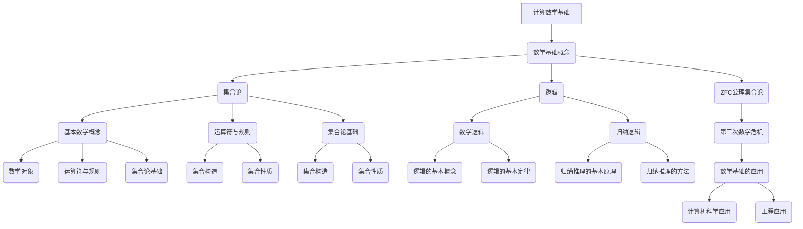
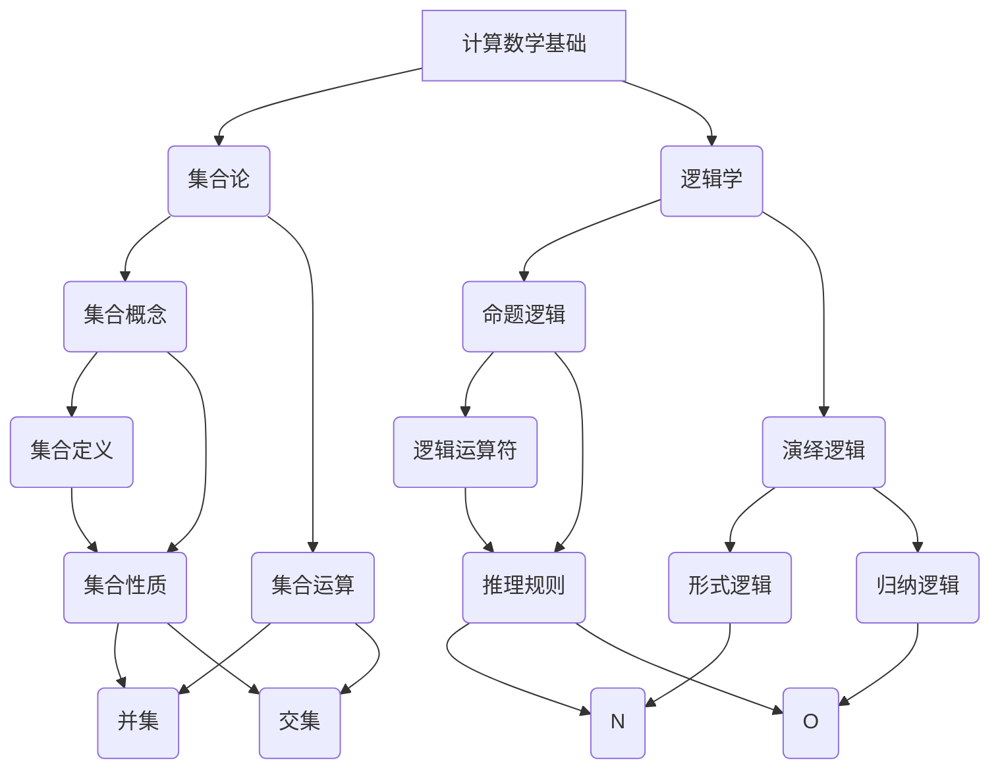

                 

# 《计算：第二部分 计算的数学基础 第 5 章 第三次数学危机 ZFC 公理集合论》

## 关键词
集合论，公理系统，ZFC，第三次数学危机，数学基础，逻辑推理，计算理论

## 摘要
本文深入探讨了计算中的数学基础，特别是第三次数学危机及其解决方法——ZFC（Zermelo-Fraenkel with Choice）公理集合论。文章首先概述了第三次数学危机的背景和原因，然后详细介绍了ZFC公理集合论的构造和性质，并探讨了其在数学基础中的地位和作用。通过一系列的逻辑推理和实际项目案例，文章展示了ZFC公理集合论在计算理论和数学基础中的重要性。

---

## 目录大纲设计

### 第1章 引论
- **1.1 计算的数学基础概述**
- **1.2 数学基础的重要性**
- **1.3 计算的数学基础的发展历程**

### 第2章 数学基础概念
- **2.1 基本数学概念**
  - **2.1.1 数学对象**
  - **2.1.2 运算符与规则**
  - **2.1.3 集合论基础**
- **2.2 公理集合论**
  - **2.2.1 公理集合论概述**
  - **2.2.2 公理集合论的公理体系**

### 第3章 公理集合论
- **3.1 公理集合论概述**
  - **3.1.1 公理集合论的基本原理**
  - **3.1.2 公理集合论的公理体系**
- **3.2 集合的构造**
  - **3.2.1 基本集合构造**
  - **3.2.2 特殊集合构造**
- **3.3 集合的性质**
  - **3.3.1 集合的运算**
  - **3.3.2 集合的归纳性质**

### 第4章 数学逻辑
- **4.1 数学逻辑概述**
  - **4.1.1 逻辑的基本概念**
  - **4.1.2 逻辑的基本定律**
- **4.2 归纳逻辑**
  - **4.2.1 归纳推理的基本原理**
  - **4.2.2 归纳推理的方法**

### 第5章 第三次数学危机
- **5.1 第三次数学危机概述**
  - **5.1.1 危机的原因**
  - **5.1.2 危机的影响**
- **5.2 ZFC公理集合论在危机中的地位**
  - **5.2.1 ZFC公理集合论的提出**
  - **5.2.2 ZFC公理集合论的优势**
- **5.3 ZFC公理集合论的构造与性质**
  - **5.3.1 ZFC公理集合论的构造过程**
  - **5.3.2 ZFC公理集合论的性质**

### 第6章 数学基础的应用
- **6.1 数学基础在计算机科学中的应用**
  - **6.1.1 计算机算法的基础**
  - **6.1.2 数据结构的基础**
- **6.2 数学基础在工程中的应用**
  - **6.2.1 工程问题中的数学模型**
  - **6.2.2 数学基础在工程优化中的应用**

### 第7章 总结与展望
- **7.1 计算的数学基础总结**
  - **7.1.1 核心概念与联系**
  - **7.1.2 核心算法原理讲解**
- **7.2 数学基础的发展展望**
  - **7.2.1 未来数学基础的发展方向**
  - **7.2.2 数学基础对计算领域的影响**

### Mermaid 流�程图
本文将使用Mermaid语肅绘制流程图以帮助读者更直观地理解计算数学基础的结构。



---

在接下来的章节中，我们将逐步深入探讨这些主题，首先从数学基础的概念开始，逐步构建起整个计算数学基础的理论框架。

---

## 第1章 引论

### 1.1 计算的数学基础概述

计算的数学基础是现代计算机科学和数学理论的核心。它不仅提供了计算机科学所需的基本数学工具，还定义了计算理论的基本概念和框架。计算的数学基础涵盖了从基础数学概念到高级数学理论的广泛领域，包括集合论、逻辑、数论、代数、几何等。这些数学分支相互关联，共同构建了一个完整的数学理论体系。

在计算领域，数学基础的作用尤为显著。首先，数学基础为算法设计和分析提供了坚实的理论基础。算法的效率、正确性和可靠性都需要通过数学方法来验证和优化。其次，数学基础在数据结构的设计和实现中起着至关重要的作用。数据结构是计算领域中处理数据的基本方式，其性能和复杂性分析依赖于数学工具。此外，数学基础还在计算机图形学、人工智能、计算机网络等领域发挥着重要作用。

计算的数学基础的发展历程可以分为几个重要阶段。最早期的阶段可以追溯到古代数学，如古希腊的数学和阿拉伯数学，这些早期的数学成就为后来的计算理论奠定了基础。随着计算机的出现和发展，20世纪中叶，计算机科学的数学基础得到了快速发展。尤其是集合论和逻辑学的应用，使得计算机科学的数学基础得到了极大的拓展。

在20世纪中叶，集合论成为了计算数学基础的核心部分。集合论为计算理论提供了形式化的工具，使得数学家可以更加严格地定义和证明计算理论中的各种概念。ZFC（Zermelo-Fraenkel with Choice）公理集合论是集合论的一个标准形式化体系，它为现代数学提供了一个坚实的基础。ZFC公理集合论的提出和发展，标志着数学基础的第三次数学危机的解决，也标志着计算数学基础进入了一个新的阶段。

### 1.2 数学基础的重要性

数学基础在计算机科学中扮演着至关重要的角色。首先，数学基础为计算机科学的各个领域提供了核心的理论支持。无论是算法设计、数据结构、计算机图形学、人工智能，还是计算机网络，都离不开数学基础的支持。数学基础提供了分析和设计这些领域的工具和方法。

在算法设计中，数学基础尤为重要。算法的效率、正确性和可靠性都是通过数学方法来验证的。例如，时间复杂度和空间复杂度的分析，依赖于集合论和逻辑学的基本概念。数论和代数中的知识，如最大公约数算法和快速傅里叶变换，是许多重要算法的基础。几何学中的知识，如线性代数和数值分析，对于计算机图形学和机器学习等领域至关重要。

在数据结构的设计和实现中，数学基础同样不可或缺。数据结构是处理数据的基本方式，其性能和复杂性分析依赖于数学工具。例如，平衡二叉树、哈希表等数据结构的设计和优化，依赖于集合论中的概念，如集合的运算和性质。图论中的知识，如拓扑排序和最短路径算法，对于网络结构和数据处理至关重要。

数学基础还在计算机科学的许多其他领域中发挥着重要作用。例如，计算机图形学依赖于几何学和数值分析的知识；人工智能依赖于概率论和统计学的方法；计算机网络依赖于图论和拓扑学的理论。

总之，数学基础不仅是计算机科学的理论基石，也是其实践应用的基础。它为计算机科学的各个领域提供了基本的概念、工具和方法，使得计算机科学的不断发展成为可能。

### 1.3 计算的数学基础的发展历程

计算数学基础的发展历程可以追溯到古代数学和计算机科学的早期阶段。在古代，数学主要是作为天文学和工程学的工具而存在的。古希腊的数学家和哲学家，如欧几里得和阿基米德，他们的工作奠定了几何学和数论的基础。阿拉伯数学家，如阿尔-花拉子米，他们对代数和算法的发展做出了重要贡献。

随着计算机的出现和发展，计算数学基础迎来了新的机遇和挑战。20世纪中叶，随着计算机科学的兴起，数学基础逐渐成为计算机科学的核心。这一时期，集合论和逻辑学成为了计算数学基础的核心工具。

集合论的兴起可以追溯到19世纪末和20世纪初。当时，数学家们开始意识到，为了更好地理解和处理数学中的各种对象和关系，需要一种更加形式化和严格的方法。集合论通过定义集合和集合之间的运算，为数学提供了一个形式化的框架。其中，ZFC（Zermelo-Fraenkel with Choice）公理集合论成为了标准的形式化体系。

ZFC公理集合论的提出和发展，标志着数学基础的第三次数学危机的解决。第三次数学危机发生在19世纪末和20世纪初，当时的数学家们发现，一些基本的数学命题，如无穷集合的存在性和基数比较，存在矛盾和不确定性。ZFC公理集合论通过引入一系列的公理，为集合论提供了一个坚实的基础，解决了这些基本问题。

在计算机科学中，集合论的应用极为广泛。集合论中的概念，如集合、映射、基数等，为算法设计和分析提供了基本的工具。例如，在算法设计中，集合的运算，如并集、交集、差集等，是常见的操作。在分析算法的时间复杂度和空间复杂度时，集合论中的概念也是必不可少的。

逻辑学在计算数学基础中也起着关键作用。逻辑学提供了处理真值和推理的方法。形式逻辑和归纳逻辑是逻辑学的两种主要形式。形式逻辑通过定义命题和推理规则，提供了严格的形式化推理方法。归纳逻辑则通过归纳推理，提供了处理无限集合和无穷过程的方法。

在计算机科学中，逻辑学广泛应用于验证和证明算法的正确性。例如，在形式验证中，逻辑学提供了形式化的证明方法，可以确保算法的正确性。在验证程序的正确性时，逻辑学也是必不可少的。

此外，计算的数学基础还涉及到其他数学分支，如数论、代数、几何和概率论。这些数学分支为计算机科学提供了丰富的工具和方法，例如，数论中的最大公约数算法和质数分解，代数中的矩阵运算和线性方程组求解，几何学中的几何形状和空间计算，概率论中的随机过程和概率分布等。

总的来说，计算的数学基础是一个不断发展的领域。随着计算机科学的不断进步，数学基础也在不断拓展和深化。新的数学理论和方法不断地被引入到计算机科学中，为计算机科学提供了更加坚实的理论基础和实践工具。

## 第2章 数学基础概念

### 2.1 基本数学概念

在探讨计算的数学基础时，我们需要首先了解一些基本数学概念。这些概念是构建计算理论大厦的基石，包括数学对象、运算符和规则。理解这些基础概念对于深入理解计算数学基础至关重要。

#### 2.1.1 数学对象

数学对象是数学理论中的基本要素，可以是具体的数值、图形、集合等。数学对象是抽象的，它们代表了我们在数学中研究的各种实体。例如，数字是数学中的基本对象，用于计数、测量和计算。图形，如直线、圆、多边形等，是几何学中的基本对象，用于描述空间形状。集合则是集合论中的基本对象，由一组确定的元素组成，这些元素可以是数字、图形或其他数学对象。

数学对象可以分为多种类型，包括自然数、整数、实数、复数等。每种类型的数学对象都有其独特的性质和运算规则。自然数用于计数，整数包括自然数和负数，实数包括有理数和无理数，而复数则是在实数的基础上引入虚数单位`i`。

#### 2.1.2 运算符与规则

运算符是用于操作数学对象的符号，如加法运算符`+`、减法运算符`-`、乘法运算符`*`、除法运算符`/`等。运算符定义了数学对象之间的运算规则，这些规则描述了如何组合数学对象以产生新的数学对象。

运算规则是指运算符在操作数学对象时遵循的特定规则。这些规则包括交换律、结合律、分配律等。例如，加法和乘法都满足交换律，即`a + b = b + a`和`a * b = b * a`。结合律表明，在连续进行相同类型的运算时，运算的顺序可以任意改变，即`(a + b) + c = a + (b + c)`和`(a * b) * c = a * (b * c)`。分配律则表明乘法可以分配到加法上，即`a * (b + c) = a * b + a * c`。

#### 2.1.3 集合论基础

集合论是数学的一个基础分支，它提供了对数学对象的结构和性质的系统研究。集合是由一组确定的、互不相同的对象组成的整体。这些对象称为集合的元素。集合通常用大写字母表示，如`A`、`B`等，而集合中的元素用小写字母表示，如`a`、`b`等。

集合的表示方法有多种，包括列举法、描述法和图示法。列举法是通过列出集合的所有元素来表示集合，例如，`A = {1, 2, 3}`表示集合`A`包含元素1、2和3。描述法是通过描述集合的元素应满足的条件来表示集合，例如，`B = {x ∈ N | x > 5}`表示集合`B`包含所有大于5的自然数。图示法则是通过图形来表示集合，例如，用Venn图来表示两个集合的交集和并集。

集合的基本运算包括并集、交集、差集和笛卡尔积。并集是指两个集合中所有元素的集合，记作`A ∪ B`。交集是指两个集合中共有的元素的集合，记作`A ∩ B`。差集是指属于第一个集合但不属于第二个集合的元素的集合，记作`A - B`。笛卡尔积是指两个集合中所有可能的有序对的集合，记作`A × B`。

了解集合的基本概念和运算对于理解和应用集合论在计算数学基础中至关重要。集合论为计算提供了形式化的工具，使得我们可以更加严格地定义和推理计算过程中的各种概念和操作。

### 2.2 公理集合论

公理集合论是集合论的一个形式化体系，它通过一组公理来定义集合的概念和性质。ZFC（Zermelo-Fraenkel with Choice）公理集合论是现代数学中最常用的公理集合论体系，它为集合论提供了一个严格而完整的定义框架。

#### 2.2.1 公理集合论概述

ZFC公理集合论由德国数学家埃米尔·策梅洛（Emmy Noether）和弗里德里希·哈恩（Felix Hausdorff）于20世纪初提出，并在后来由哈恩的学生沃尔夫冈·亨金（Wolfgang Hahn）进行了补充和完善。ZFC公理集合论包括八个基本公理，这些公理定义了集合的基本性质和操作。

ZFC公理集合论的主要目标是提供一个无矛盾且自洽的集合论体系，使得集合的概念可以被严格定义，并且能够用于证明其他数学命题的正确性。ZFC公理集合论的核心思想是通过一些基本的集合构造原则和运算规则，定义出所有可能的集合，并确保这些集合的一致性和完整性。

#### 2.2.2 公理集合论的公理体系

ZFC公理集合论的八个基本公理包括：

1. **存在性公理**：确保至少存在一个非空集合。
2. **空集公理**：确保存在一个空集，即不包含任何元素的集合。
3. **分离公理**：允许从现有集合中分离出满足特定条件的子集。
4. **幂集公理**：对于任何集合，存在其所有子集的集合，即该集合的幂集。
5. **无穷公理**：确保存在无穷集合。
6. **替换公理**：允许通过函数将一个集合的元素映射到另一个集合。
7. **集合选择公理**：允许在满足某些条件的情况下选择集合的元素。
8. **集合归纳公理**：允许通过归纳法证明关于集合的命题。

这些公理为集合论提供了一个逻辑框架，使得我们可以定义和操作集合，并确保这些操作的一致性和无矛盾性。ZFC公理集合论通过这些公理建立了一个形式化的集合论体系，使得数学家可以更加严格地定义和推理集合的性质。

ZFC公理集合论在数学基础中的地位和作用不可忽视。它是现代数学的基石，为其他数学分支提供了基本的概念和工具。在计算机科学中，ZFC公理集合论的应用也非常广泛。它为计算提供了形式化的基础，使得计算机科学家可以更加严格地定义和验证算法和程序的正确性。ZFC公理集合论还用于形式化验证、证明检查和软件工程中的模型检查等应用领域。

总之，公理集合论，尤其是ZFC公理集合论，是计算数学基础中不可或缺的一部分。它为集合的概念和性质提供了一个形式化的框架，使得数学家可以更加严格地进行数学推理和证明，同时也为计算机科学提供了强大的理论基础和工具。

### 第3章 公理集合论

#### 3.1 公理集合论概述

公理集合论是集合论的一种形式化体系，它通过一组公理来定义集合的概念和性质。在数学中，公理集合论是最为广泛接受的集合论体系，尤其是在现代数学和计算机科学中。ZFC（Zermelo-Fraenkel with Choice）公理集合论是公理集合论的一个标准形式化体系，它由八个基本公理构成，这些公理共同定义了集合的基本性质和操作。

ZFC公理集合论的提出和发展是数学史上的一次重要事件。20世纪初，数学家们开始意识到，为了更加严格地定义和推理集合的性质，需要一种形式化的集合论体系。这种体系不仅需要无矛盾性，还需要能够涵盖所有可能的集合。ZFC公理集合论的提出正是为了满足这些要求。

ZFC公理集合论的发展过程中，有许多重要的贡献者。埃米尔·策梅洛（Emmy Noether）和弗里德里希·哈恩（Felix Hausdorff）是ZFC公理集合论的最初提出者。他们在1908年提出了包含五个公理的系统，这个系统后来被称为ZF。沃尔夫冈·亨金（Wolfgang Hahn）在1918年提出了选择公理（Choice Axiom），这个公理使得ZF成为一个更为强大的体系，被称为ZFC。

ZFC公理集合论在数学基础中的地位非常重要。它是现代数学的一个基石，为其他数学分支提供了基本的概念和工具。在逻辑学、拓扑学、代数学、几何学等多个领域，ZFC公理集合论都扮演着至关重要的角色。在计算机科学中，ZFC公理集合论的应用也非常广泛，它为计算提供了形式化的基础，使得计算机科学家可以更加严格地定义和验证算法和程序的正确性。

#### 3.1.1 公理集合论的基本原理

ZFC公理集合论的基本原理是通过一组公理来定义集合的概念。这些公理包括：

1. **存在性公理**：至少存在一个非空集合。这个公理确保了集合的存在性，是其他公理的基础。
2. **空集公理**：存在一个空集，即不包含任何元素的集合。空集是所有集合的基础。
3. **分离公理**：如果给定一个集合和一组条件，那么存在满足这些条件的子集。这个公理允许我们从现有集合中构造新的子集。
4. **幂集公理**：对于任何集合，存在其所有子集的集合，即该集合的幂集。这个公理确保了所有可能的子集的存在。
5. **无穷公理**：存在无穷集合。这个公理确保了无穷集合的存在，是集合论中无穷概念的基础。
6. **替换公理**：如果给定一个集合和一组条件，那么存在满足这些条件的子集。这个公理允许通过函数将一个集合的元素映射到另一个集合。
7. **集合选择公理**：对于任意集合族，存在一个选择函数，该函数为每个集合选择一个元素。这个公理确保了选择函数的存在，是集合论中重要概念的基础。
8. **集合归纳公理**：对于任何集合，存在其最小元素。这个公理允许通过归纳法证明关于集合的命题。

这些公理共同定义了集合的概念和性质，确保了集合论的一致性和无矛盾性。

#### 3.1.2 公理集合论的公理体系

ZFC公理集合论的公理体系包括上述八个基本公理。这些公理构成了集合论的基础，使得我们可以严格地定义和操作集合。

1. **存在性公理**：
   ```
   ∃x (x ≠ ∅)
   ```
   这个公理确保了至少存在一个非空集合。

2. **空集公理**：
   ```
   ∅ ∈ V
   ```
   这个公理定义了空集的存在，空集是所有集合的基础。

3. **分离公理**（抽象公理）：
   ```
   ∀x ∈ V, ∀P (P(x) → ∃y ∈ V (y = {z ∈ x | P(z)})
   ```
   这个公理允许我们从现有集合中分离出满足特定条件的子集。

4. **幂集公理**：
   ```
   ∀x ∈ V, ∃y ∈ V (y = {z ∈ V | z ⊆ x})
   ```
   这个公理确保了对于任何集合，存在其所有子集的集合，即该集合的幂集。

5. **无穷公理**：
   ```
   ∃x ∈ V (x = {y ∈ V | ∀z ∈ V (z ∉ y) ∨ z = x})
   ```
   这个公理确保了无穷集合的存在。

6. **替换公理**：
   ```
   ∀x ∈ V, ∀P (∃y ∈ V (∀z ∈ V (P(z) → z ∈ y) ↔ z ∈ x))
   ```
   这个公理允许通过函数将一个集合的元素映射到另一个集合。

7. **集合选择公理**：
   ```
   ∀x ∈ V (∃y ∈ V (∀z ∈ V (z ∈ x → ∃u ∈ y (u ∈ z)))
   ```
   这个公理确保了选择函数的存在，是集合论中重要概念的基础。

8. **集合归纳公理**：
   ```
   ∀x ∈ V (∃y ∈ V (∀z ∈ V (z ∈ y ↔ z ∈ ∅ ∨ z = x ∨ ∃w ∈ y (w ∈ z)))
   ```
   这个公理允许通过归纳法证明关于集合的命题。

这些公理通过逻辑推理，可以推导出集合论中所有其他概念和性质，构成了集合论的基础。

#### 3.2 集合的构造

集合的构造是集合论中的一个核心概念，它涉及到如何从基本集合通过特定的方法生成新的集合。集合的构造方法包括基本构造和特殊构造，这些方法共同构成了集合论的基本工具。

#### 3.2.1 基本集合构造

基本集合构造是集合论中最基本的构造方法，主要包括并集、交集和补集等。

1. **并集**：
   并集是两个集合中所有元素的集合。对于任意两个集合A和B，其并集表示为A ∪ B。并集的构造可以通过列举法或描述法进行。例如：
   ```
   A = {1, 2, 3}
   B = {4, 5, 6}
   A ∪ B = {1, 2, 3, 4, 5, 6}
   ```

2. **交集**：
   交集是两个集合中共有的元素的集合。对于任意两个集合A和B，其交集表示为A ∩ B。交集的构造可以通过列举法或描述法进行。例如：
   ```
   A = {1, 2, 3}
   B = {3, 4, 5}
   A ∩ B = {3}
   ```

3. **补集**：
   补集是全集中不属于某个集合的元素的集合。对于任意集合A，其补集表示为A'。补集的构造可以通过描述法进行。例如，如果全集为U，则A的补集表示为：
   ```
   A' = {x ∈ U | x ∉ A}
   ```

#### 3.2.2 特殊集合构造

特殊集合构造是指在基本构造方法的基础上，通过特定的逻辑和数学方法构造出一些特殊集合。这些特殊集合在集合论和计算机科学中有着广泛的应用。

1. **幂集**：
   幂集是某个集合的所有子集的集合。对于任意集合A，其幂集表示为P(A)。幂集的构造可以通过递归定义进行。例如，对于集合A = {1, 2}，其幂集为：
   ```
   P(A) = {∅, {1}, {2}, {1, 2}}
   ```

2. **笛卡尔积**：
   笛卡尔积是两个集合的所有可能的有序对的集合。对于任意两个集合A和B，其笛卡尔积表示为A × B。笛卡尔积的构造可以通过列举法进行。例如，对于集合A = {1, 2}和B = {3, 4}，其笛卡尔积为：
   ```
   A × B = {(1, 3), (1, 4), (2, 3), (2, 4)}
   ```

3. **集合的集合**：
   集合的集合是由多个集合组成的集合。例如，{A, B, C}是一个集合的集合，其中A、B、C都是集合。集合的集合可以通过递归定义进行构造。例如，如果A = {1, 2}，B = {3, 4}，C = {5, 6}，则{A, B, C}是一个集合的集合。

#### 3.3 集合的性质

集合的性质是集合论研究的重要内容，包括集合的运算性质和归纳性质。理解集合的性质对于深入理解集合论和计算机科学中的集合操作至关重要。

#### 3.3.1 集合的运算性质

集合的运算性质主要涉及并集、交集和补集等基本运算的性质。这些性质包括交换律、结合律、分配律等。

1. **交换律**：
   - 并集的交换律：A ∪ B = B ∪ A
   - 交集的交换律：A ∩ B = B ∩ A

2. **结合律**：
   - 并集的结合律：(A ∪ B) ∪ C = A ∪ (B ∪ C)
   - 交集的结合律：(A ∩ B) ∩ C = A ∩ (B ∩ C)

3. **分配律**：
   - 乘法对加法的分配律：A ∩ (B ∪ C) = (A ∩ B) ∪ (A ∩ C)
   - 加法对乘法的分配律：A ∪ (B ∩ C) = (A ∪ B) ∩ (A ∪ C)

#### 3.3.2 集合的归纳性质

集合的归纳性质是指通过归纳法证明关于集合的命题的性质。归纳性质包括集合的归纳原则和归纳公理。

1. **集合的归纳原则**：
   - 如果一个集合A包含空集，并且对于任意集合B，如果B属于A，则B的幂集也属于A，那么A包含所有的集合。

2. **集合的归纳公理**：
   - 对于任意集合A，存在其最小元素。这个公理允许通过归纳法证明关于集合的命题。

这些性质和公理共同构成了集合论的基础，使得我们可以更加严格和系统地进行集合的操作和推理。

### 第4章 数学逻辑

#### 4.1 数学逻辑概述

数学逻辑是数学中研究推理和证明的分支，它提供了形式化和规范化的方法来处理数学中的推理过程。数学逻辑的核心目标是理解如何从已知的前提出发，通过逻辑规则推导出新的结论。它不仅为数学理论的建立提供了严谨的框架，也在计算机科学、哲学、人工智能等领域有着广泛的应用。

#### 4.1.1 逻辑的基本概念

在数学逻辑中，有几个基本的概念需要了解：

1. **命题**：
   命题是能够判断真假的陈述句。一个命题要么为真，要么为假，但不能同时为两者。例如，“今天是星期五”是一个命题。

2. **逻辑运算符**：
   逻辑运算符用于组合命题，形成新的命题。常见的逻辑运算符包括：
   - **合取（AND）**：A ∧ B表示A和B同时为真。
   - **析取（OR）**：A ∨ B表示A或B至少一个为真。
   - **非（NOT）**：¬A表示A为假。

3. **逻辑等价**：
   逻辑等价是指两个命题在所有情况下都具有相同的真假值。常见的逻辑等价关系包括德摩根定律、交换律、结合律等。

#### 4.1.2 逻辑的基本定律

逻辑的基本定律是逻辑推理的基础，它们包括：

1. **律**：
   - **同一律**：A ∧ A = A，A ∨ A = A。
   - **矛盾律**：A ∧ ¬A = ⊥（假命题），A ∨ ¬A = T（真命题）。

2. **合取律**：
   - **结合律**：（A ∧ B）∧ C = A ∧ (B ∧ C)。
   - **分配律**：A ∧ (B ∨ C) = (A ∧ B) ∨ (A ∧ C)。

3. **析取律**：
   - **结合律**：（A ∨ B）∨ C = A ∨ (B ∨ C)。
   - **分配律**：A ∨ (B ∧ C) = (A ∨ B) ∧ (A ∨ C)。

4. **交换律**：
   - 合取和析取运算可以交换位置：A ∧ B = B ∧ A，A ∨ B = B ∨ A。

5. **德摩根定律**：
   - ¬(A ∧ B) = ¬A ∨ ¬B。
   - ¬(A ∨ B) = ¬A ∧ ¬B。

这些基本定律为逻辑推理提供了可靠的基础，使得我们可以从已知命题推导出新的结论。

#### 4.2 归纳逻辑

归纳逻辑是数学逻辑中的一个重要分支，它用于证明关于无穷集合的命题。归纳逻辑包括两个主要部分：归纳基础和归纳步骤。

#### 4.2.1 归纳推理的基本原理

归纳推理的基本原理如下：

1. **归纳基础**：
   归纳基础是指证明命题对于最小的元素（通常是0或1）成立。这是归纳推理的第一步。

2. **归纳步骤**：
   归纳步骤是指证明如果命题对于某个自然数n成立，那么它对于n+1也成立。这是归纳推理的关键部分。

通过归纳基础和归纳步骤，我们可以证明一个命题对于所有自然数都成立。

#### 4.2.2 归纳推理的方法

归纳推理的方法通常包括以下步骤：

1. **提出命题**：
   首先提出一个关于自然数的命题，这个命题可以是关于数的大小、性质或其他特征的。

2. **证明基础**：
   证明命题对于最小的自然数（通常是0或1）成立。这是归纳推理的基础。

3. **证明归纳步骤**：
   假设命题对于某个自然数n成立，然后证明它对于n+1也成立。这通常通过构造性的证明或反证法来实现。

4. **结论**：
   通过归纳基础和归纳步骤，我们得出命题对于所有自然数都成立的结论。

归纳推理是一种强有力的证明方法，它不仅适用于自然数集合，也可以推广到其他集合，如整数集合、实数集合等。

通过以上对数学逻辑的概述，我们可以看到，逻辑在数学中扮演着至关重要的角色。它为数学理论的建立提供了严谨的框架，使得我们可以从已知的前提出发，通过逻辑推理得出新的结论。理解逻辑的基本概念、基本定律和归纳推理的方法，对于深入理解和应用数学逻辑至关重要。

### 第5章 第三次数学危机

#### 5.1 第三次数学危机概述

第三次数学危机是数学史上的一次重大事件，它发生在19世纪末和20世纪初。这场危机源于集合论的诞生和发展，以及数学家们在尝试解决一些基本数学命题时遇到的矛盾和困惑。第三次数学危机的主要原因是集合论基础的不完备性和一些基本数学命题的不可证明性。

#### 5.1.1 危机的原因

第三次数学危机的起因可以追溯到19世纪集合论的兴起。当时，数学家们开始意识到，为了更好地理解和处理数学中的各种对象和关系，需要一种更加形式化和严格的方法。集合论通过定义集合和集合之间的运算，为数学提供了一个形式化的框架。然而，在集合论的早期发展中，数学家们发现了一些基本数学命题存在矛盾和不确定性。

其中最著名的是康托尔（Georg Cantor）的无穷集合理论。康托尔提出了无穷集合的概念，并证明了不同无穷集合之间的大小关系。这一理论挑战了传统的数学观念，引发了广泛的争议。然而，康托尔的工作也揭示了一些基本数学命题的不可证明性，这引起了数学家的关注和担忧。

此外，数学家们还发现了集合论中的某些自相矛盾的情况。例如，罗素（Bertrand Russell）提出了著名的“罗素悖论”，它揭示了集合论基础中的一些问题。罗素悖论表明，如果允许任意集合的存在，集合论将不可避免地陷入矛盾。

这些矛盾和不确定性导致了数学家们的困惑和争议，引发了第三次数学危机。为了解决这些危机，数学家们开始重新审视和重构集合论，寻找一种更加完备和自洽的集合论体系。

#### 5.1.2 危机的影响

第三次数学危机对数学的发展和整个科学界产生了深远的影响。首先，危机促使数学家们重新思考和审视数学的基础，推动了数学基础理论的深入研究。这场危机揭示了数学理论中的一些根本问题，促使数学家们提出新的公理系统和理论框架。

ZFC（Zermelo-Fraenkel with Choice）公理集合论的提出和发展是第三次数学危机的重要解决方案。ZFC公理集合论通过引入一系列的公理，为集合论提供了一个严格而完备的体系，解决了许多基本数学命题的矛盾和不确定性。ZFC公理集合论的提出标志着数学基础的重建，也为后来的数学研究和应用提供了坚实的理论基础。

此外，第三次数学危机对数学哲学产生了重要影响。它引发了关于数学本质、证明方法和逻辑基础等问题的深入讨论。许多哲学家和数学家开始探讨数学的本质和意义，推动了数学哲学的发展。

在更广泛的意义上，第三次数学危机也对科学和哲学领域产生了影响。它促使科学家们重新审视和反思科学的方法和理论，推动了科学哲学和科学史的研究。危机揭示了科学理论中的不确定性和矛盾，促使科学家们更加注重理论和实践的结合，推动了科学方法的进步。

总之，第三次数学危机是数学史上的一次重大事件，它不仅揭示了数学基础中的问题，也推动了数学和科学的发展。危机的解决和数学基础的重建为后来的数学研究和应用提供了坚实的理论基础，也促进了数学哲学和科学哲学的深入探讨。

#### 5.2 ZFC公理集合论在危机中的地位

ZFC（Zermelo-Fraenkel with Choice）公理集合论在第三次数学危机中扮演了关键角色，它是解决数学基础问题的有力工具。ZFC公理集合论的提出和发展不仅标志着数学基础的重建，也奠定了现代数学和计算机科学的理论基础。

#### 5.2.1 ZFC公理集合论的提出

ZFC公理集合论的提出是由德国数学家埃米尔·策梅洛（Emmy Noether）和弗里德里希·哈恩（Felix Hausdorff）在20世纪初提出的。他们的目的是为了解决集合论中存在的矛盾和不确定性，为数学提供一个严格而完备的基础。

ZFC公理集合论包括八个基本公理，这些公理通过逻辑推理定义了集合的基本性质和操作。这些公理分别是：

1. **存在性公理**：确保至少存在一个非空集合。
2. **空集公理**：确保存在一个空集，即不包含任何元素的集合。
3. **分离公理**：允许从现有集合中分离出满足特定条件的子集。
4. **幂集公理**：对于任何集合，存在其所有子集的集合，即该集合的幂集。
5. **无穷公理**：存在无穷集合。
6. **替换公理**：允许通过函数将一个集合的元素映射到另一个集合。
7. **集合选择公理**：允许在满足某些条件的情况下选择集合的元素。
8. **集合归纳公理**：允许通过归纳法证明关于集合的命题。

这些公理共同定义了集合的概念和性质，为数学提供了一个形式化的框架，使得数学家可以更加严格地进行推理和证明。

#### 5.2.2 ZFC公理集合论的优势

ZFC公理集合论在数学基础中的地位不可忽视，它具有以下优势：

1. **一致性**：ZFC公理集合论通过引入一系列的公理，确保了集合论的一致性。这意味着在ZFC公理集合论的框架下，不存在自相矛盾的命题。

2. **完备性**：ZFC公理集合论为集合论提供了一个完备的体系，这意味着在ZFC公理集合论的框架下，所有可以证明的命题都是可证明的。

3. **形式化**：ZFC公理集合论通过形式化的方法定义了集合的概念和性质，使得数学家可以更加严格地进行推理和证明。

4. **广泛应用**：ZFC公理集合论在数学的各个分支，如逻辑学、拓扑学、代数学、几何学等，都有着广泛的应用。它为这些数学分支提供了基本的概念和工具。

5. **计算机科学中的应用**：ZFC公理集合论在计算机科学中也有着重要的应用。它为计算机科学的各个领域，如算法设计、数据结构、计算机图形学、人工智能等，提供了形式化的基础和工具。

总之，ZFC公理集合论在第三次数学危机中起到了关键作用，它为集合论提供了一个严格而完备的框架，解决了数学基础中的问题。ZFC公理集合论的优势和广泛的应用使其成为现代数学和计算机科学不可或缺的一部分。

#### 5.3 ZFC公理集合论的构造与性质

ZFC（Zermelo-Fraenkel with Choice）公理集合论是现代数学中最常用的公理集合论体系，它通过一系列公理定义了集合的基本性质和操作。ZFC公理集合论的构造过程和性质分析对于理解集合论和其在数学基础中的作用至关重要。

#### 5.3.1 ZFC公理集合论的构造过程

ZFC公理集合论的构造过程可以分为以下几个步骤：

1. **基本集合的构造**：
   - **存在性公理**：确保至少存在一个非空集合。通常这个非空集合被定义为空集∅，它不包含任何元素。
   - **空集公理**：确保空集∅的存在。空集是所有集合的基础。

2. **集合的构造**：
   - **分离公理**：允许从现有集合中分离出满足特定条件的子集。通过分离公理，我们可以从任意的集合A中构造出新的子集B，其中B中的元素都满足条件P(x)。
   - **幂集公理**：对于任意集合A，存在其所有子集的集合，即A的幂集P(A)。幂集公理确保了所有可能的子集的存在。

3. **无穷集合的构造**：
   - **无穷公理**：确保存在无穷集合。通常，无穷公理会确保至少存在一个无穷集合，如自然数集合N。

4. **集合的扩展和构造**：
   - **替换公理**：允许通过函数将一个集合的元素映射到另一个集合。替换公理确保了集合之间的转换和映射。
   - **集合选择公理**：允许在满足某些条件的情况下选择集合的元素。集合选择公理确保了选择函数的存在。

5. **集合的归纳构造**：
   - **集合归纳公理**：允许通过归纳法证明关于集合的命题。集合归纳公理确保了集合的性质可以通过归纳法进行证明。

通过上述步骤，ZFC公理集合论构建了一个形式化的集合论体系，使得我们可以严格地定义和操作集合。

#### 5.3.2 ZFC公理集合论的性质

ZFC公理集合论具有以下重要性质：

1. **一致性**：
   - ZFC公理集合论通过一系列的公理确保了一致性，即它不存在自相矛盾的命题。一致性是任何形式化数学体系的基本要求。

2. **完备性**：
   - ZFC公理集合论为集合论提供了一个完备的体系，这意味着在ZFC公理集合论的框架下，所有可以证明的命题都是可证明的。完备性确保了数学理论的完整性。

3. **形式化**：
   - ZFC公理集合论通过形式化的方法定义了集合的概念和性质，使得数学家可以更加严格地进行推理和证明。形式化是现代数学的重要特点，它确保了数学理论的严谨性。

4. **适用性**：
   - ZFC公理集合论在数学的各个分支，如逻辑学、拓扑学、代数学、几何学等，都有着广泛的应用。它为这些数学分支提供了基本的概念和工具。

5. **计算机科学中的应用**：
   - ZFC公理集合论在计算机科学中也有着重要的应用。它为计算机科学的各个领域，如算法设计、数据结构、计算机图形学、人工智能等，提供了形式化的基础和工具。

6. **证明方法**：
   - ZFC公理集合论支持多种证明方法，包括归纳证明、构造性证明等。这些证明方法使得数学家可以更加严谨地证明集合论中的命题。

总之，ZFC公理集合论是现代数学和计算机科学不可或缺的一部分。它的构造过程和性质分析为我们提供了理解集合论和数学基础的重要工具。通过ZFC公理集合论，我们可以更加严格和系统地定义和操作集合，为数学理论和计算机科学的发展提供了坚实的基础。

### 第6章 数学基础的应用

#### 6.1 数学基础在计算机科学中的应用

数学基础在计算机科学中的应用是广泛而深入的，它涵盖了从基本算法设计到复杂系统分析等多个方面。计算机科学的许多核心概念和理论都源于数学，而数学基础为这些理论和应用提供了坚实的理论支持。

#### 6.1.1 计算机算法的基础

计算机算法是计算机科学的核心，它定义了解决特定问题的步骤和方法。算法的设计和分析依赖于数学基础，特别是集合论和逻辑学。

1. **算法设计**：
   - **基础算法**：许多基础算法，如排序算法（冒泡排序、选择排序、插入排序等）、查找算法（二分查找、散列表查找等），都依赖于数学中的概念和原理。
   - **高级算法**：高级算法，如动态规划、贪心算法、回溯算法等，也基于数学的原理，通过优化策略来提高算法的效率。

2. **算法分析**：
   - **时间复杂度**：算法的时间复杂度分析是评估算法性能的重要方法。它通常使用大O符号表示，如O(n)、O(n^2)等，这些符号基于数学的集合论和逻辑学。
   - **空间复杂度**：算法的空间复杂度分析也是评估算法性能的重要指标，它依赖于数学中的集合论和代数。

#### 6.1.2 数据结构的基础

数据结构是计算机科学中的另一个重要概念，它定义了数据在计算机中的存储和组织方式。数学基础为数据结构的设计和优化提供了理论支持。

1. **基本数据结构**：
   - **数组**：数组是一种基本的数据结构，用于存储固定大小的数据元素。
   - **链表**：链表是一种动态数据结构，用于存储变大小的数据元素。
   - **栈和队列**：栈和队列是基本的数据结构，用于处理数据元素的特殊操作，如后进先出（LIFO）和先进先出（FIFO）。

2. **高级数据结构**：
   - **树**：树是一种重要的数据结构，用于表示层次关系，如二叉树、平衡树（AVL树）、B树等。
   - **图**：图是一种用于表示对象之间关系的数据结构，如有向图、无向图、加权图等。

3. **数据结构优化**：
   - **排序和查找**：数学基础提供了排序和查找算法的理论支持，如二分查找、快速排序、归并排序等。
   - **哈希表**：哈希表是一种基于数学中的哈希函数的数据结构，用于高效地查找和插入数据元素。

#### 6.1.3 数学基础在计算机科学中的其他应用

除了算法和数据结构，数学基础在计算机科学的许多其他领域中也有着广泛的应用：

1. **计算机图形学**：
   - **几何学**：几何学在计算机图形学中有着重要的应用，如二维和三维几何变换、光线追踪等。
   - **数值分析**：数值分析提供了计算几何问题的方法，如数值积分、数值微分等。

2. **人工智能**：
   - **概率论和统计学**：概率论和统计学是人工智能的基础，用于处理不确定性、概率推理和决策。
   - **机器学习**：机器学习算法依赖于数学模型和优化方法，如线性回归、支持向量机、神经网络等。

3. **计算机网络**：
   - **图论**：图论在计算机网络拓扑结构的设计和分析中有着重要的应用，如网络路由、负载均衡等。

总之，数学基础是计算机科学的基石，它为计算机科学的各个领域提供了理论支持和方法。通过数学基础，计算机科学家可以设计出更高效的算法、优化数据结构，并解决复杂的问题。数学基础的应用不仅推动了计算机科学的进步，也为计算机科学的发展提供了新的方向和机遇。

### 第6章 数学基础在工程中的应用

#### 6.2 数学基础在工程中的应用

数学基础在工程领域的应用是广泛而深远的，它为工程问题的建模、分析和优化提供了强大的工具。在工程实践中，数学基础不仅用于解决具体问题，还用于预测、设计和验证工程系统的性能和可靠性。以下是数学基础在工程中的几个主要应用方面：

#### 6.2.1 工程问题中的数学模型

工程问题通常涉及复杂的物理现象和系统行为，而数学模型则提供了对这些现象和行为的抽象和描述。通过建立数学模型，工程师可以更准确地理解和预测系统行为，从而设计出更有效的解决方案。

1. **连续系统和微分方程**：
   - 工程系统中的许多问题可以用微分方程来描述，如热传导方程、流体动力学方程、电磁场方程等。这些微分方程通过数学分析可以提供系统动态行为的精确描述。
   - 例如，在机械工程中，利用牛顿第二定律和流体力学原理，可以建立描述流体流动和压力变化的数学模型。

2. **离散系统和差分方程**：
   - 差分方程用于描述离散系统的动态行为，如电路分析中的欧姆定律和基尔霍夫定律。
   - 在计算机工程中，差分方程广泛应用于算法设计和分析，如离散时间差分方程用于计算算法的时间复杂度。

3. **概率和统计模型**：
   - 在工程中，概率和统计模型用于处理不确定性，如风险分析和质量控制。
   - 例如，在制造工程中，利用正态分布模型可以预测产品质量的分布和缺陷率。

#### 6.2.2 数学基础在工程优化中的应用

优化是工程中一个重要的目标，旨在找到最优的设计方案或操作策略。数学基础提供了多种优化方法和工具，帮助工程师实现最优设计。

1. **线性规划**：
   - 线性规划是一种用于解决线性目标函数和线性约束条件问题的数学方法。它在工程优化中有着广泛的应用，如资源分配、生产调度等。
   - 例如，在制造业中，线性规划可以用于优化生产计划，以最小化成本或最大化利润。

2. **非线性规划**：
   - 非线性规划处理非线性目标函数和约束条件的问题，它在工程优化中也具有重要应用，如结构设计、控制系统的优化等。
   - 例如，在航空工程中，非线性规划可以用于优化飞机的空气动力学设计，以提高飞行性能。

3. **动态规划**：
   - 动态规划是一种解决多阶段决策问题的方法，它通过递归关系和最优化原则，逐步找到最优解。
   - 在通信工程中，动态规划用于优化无线网络资源分配，以提高通信效率和可靠性。

4. **遗传算法和模拟退火**：
   - 遗传算法和模拟退火是启发式优化方法，它们通过模拟自然进化过程和物理退火过程，寻找复杂优化问题的近似最优解。
   - 例如，在结构工程中，遗传算法可以用于优化桥梁设计，以减轻自重和增强稳定性。

通过数学基础的应用，工程师可以更精确地描述工程问题，优化设计方案，提高系统性能和可靠性。数学基础不仅为工程实践提供了理论支持，也为工程师解决复杂问题提供了实用的工具和方法。

### 第7章 总结与展望

#### 7.1 计算的数学基础总结

计算的数学基础是现代计算机科学和数学理论的基石。它涵盖了从基础数学概念到高级数学理论的广泛领域，包括集合论、逻辑、数论、代数、几何等。这些数学分支相互关联，共同构建了一个完整的数学理论体系，为计算机科学的各个领域提供了坚实的理论基础。

在计算的数学基础中，集合论和公理集合论尤为重要。集合论通过定义集合和集合之间的运算，为数学提供了一个形式化的框架。ZFC（Zermelo-Fraenkel with Choice）公理集合论是集合论的一个标准形式化体系，它为现代数学提供了一个坚实的基础，解决了数学基础中的矛盾和不确定性。集合论的应用极为广泛，从算法设计、数据结构到计算机图形学、人工智能等领域，都是不可或缺的。

逻辑学在计算数学基础中也起着关键作用。逻辑学提供了处理真值和推理的方法，形式逻辑和归纳逻辑是逻辑学的两种主要形式。形式逻辑通过定义命题和推理规则，提供了严格的形式化推理方法。归纳逻辑则通过归纳推理，提供了处理无限集合和无穷过程的方法。逻辑学在验证和证明算法的正确性、形式化验证和证明检查等方面有着重要的应用。

此外，数学基础在计算机科学和工程中的应用也是不可忽视的。它不仅为算法设计和优化提供了理论支持，还用于解决复杂的工程问题，如优化设计、资源分配、质量控制等。数学基础的应用不仅提高了系统的性能和可靠性，也为工程师解决实际问题提供了实用的工具和方法。

#### 7.1.1 核心概念与联系

核心概念与联系是计算数学基础的重要组成部分。以下是几个核心概念及其相互联系：

1. **集合论**：
   - **集合**：集合是数学中的基本对象，由一组确定的、互不相同的元素组成。集合论通过定义集合和集合之间的运算，为数学提供了一个形式化的框架。
   - **集合运算**：集合的基本运算包括并集、交集、差集和笛卡尔积。这些运算在集合论中起着核心作用，用于构建更复杂的集合结构。
   - **基数**：基数是指集合中元素的数量。不同的集合可能具有相同的基数，这是集合论中重要的概念。

2. **逻辑学**：
   - **命题**：命题是能够判断真假的陈述句。逻辑学通过定义命题和推理规则，提供了严格的形式化推理方法。
   - **逻辑运算符**：逻辑运算符包括合取（AND）、析取（OR）和非（NOT）。这些运算符用于组合命题，形成新的命题。
   - **推理规则**：推理规则是逻辑学中的基本概念，用于从已知的前提出发推导出新的结论。常见的推理规则包括演绎推理和归纳推理。

3. **公理集合论**：
   - **公理**：公理是无需证明的假设，是集合论和数学基础的理论基石。ZFC公理集合论包括存在性公理、空集公理、分离公理、幂集公理等。
   - **构造过程**：公理集合论通过一系列的公理构造出所有可能的集合。这个过程确保了集合论的一致性和完备性。
   - **性质**：ZFC公理集合论具有一致性、完备性、形式化等性质，这些性质使得它成为现代数学和计算机科学的重要工具。

4. **数学模型**：
   - **数学模型**：数学模型是通过数学方法描述现实世界的现象和系统。它包括连续系统和离散系统、微分方程和差分方程、概率模型和统计模型等。
   - **数学公式**：数学公式是数学模型的核心组成部分，用于表达数学关系和计算结果。数学公式通过使用符号和运算符，将现实世界的问题转化为数学问题。

这些核心概念相互联系，共同构成了计算数学基础的理论体系。理解这些概念及其相互关系，对于深入理解计算数学基础至关重要。

#### 7.1.2 核心算法原理讲解

核心算法原理是计算数学基础的重要组成部分，它涉及到算法的设计、分析和实现。以下是几个核心算法原理及其讲解：

1. **排序算法**：
   - **冒泡排序**：冒泡排序是一种简单的排序算法，通过重复遍历要排序的数列，比较相邻元素的大小并交换它们，直到整个序列有序。
   - **时间复杂度**：冒泡排序的时间复杂度为O(n^2)，其中n是数列的长度。
   - **伪代码示例**：
     ```
     function bubbleSort(A):
         n = length(A)
         for i from 1 to n-1:
             for j from 1 to n-i:
                 if A[j] > A[j+1]:
                     swap(A[j], A[j+1])
         return A
     ```

2. **查找算法**：
   - **二分查找**：二分查找是一种高效的查找算法，通过将有序数列分为两部分，每次将中间元素与目标值比较，逐步缩小查找范围。
   - **时间复杂度**：二分查找的时间复杂度为O(log n)，其中n是数列的长度。
   - **伪代码示例**：
     ```
     function binarySearch(A, target):
         low = 0
         high = length(A) - 1
         while low <= high:
             mid = (low + high) / 2
             if A[mid] == target:
                 return mid
             elif A[mid] < target:
                 low = mid + 1
             else:
                 high = mid - 1
         return -1
     ```

3. **动态规划**：
   - **最长公共子序列**：动态规划是一种解决多阶段决策问题的方法，它通过递归关系和最优化原则，逐步找到最优解。
   - **时间复杂度**：最长公共子序列的时间复杂度为O(mn)，其中m和n分别是两个序列的长度。
   - **伪代码示例**：
     ```
     function longestCommonSubsequence(X, Y):
         m = length(X)
         n = length(Y)
         dp = createMatrix(m+1, n+1)
         for i from 1 to m:
             for j from 1 to n:
                 if X[i] == Y[j]:
                     dp[i][j] = dp[i-1][j-1] + 1
                 else:
                     dp[i][j] = max(dp[i-1][j], dp[i][j-1])
         return dp[m][n]
     ```

4. **遗传算法**：
   - **遗传算法**：遗传算法是一种启发式优化方法，通过模拟自然进化过程，寻找复杂优化问题的近似最优解。
   - **时间复杂度**：遗传算法的时间复杂度依赖于迭代次数和种群大小，通常表示为O(NT)，其中N是种群大小，T是迭代次数。
   - **伪代码示例**：
     ```
     function geneticAlgorithm(fitnessFunction, crossoverFunction, mutationFunction):
         population = initializePopulation()
         while not convergenceCriteriaMet():
             fitnessScores = evaluateFitness(population)
             selectedPopulation = selection(population, fitnessScores)
             offspring = crossover(selectedPopulation)
             offspring = mutation(offspring)
             population = nextGeneration(population, offspring)
         return bestIndividual(population)
     ```

这些核心算法原理在计算数学基础中起着关键作用，为算法设计、分析和实现提供了重要的指导。理解这些算法原理，对于深入掌握计算数学基础至关重要。

#### 7.2 数学基础的发展展望

随着计算机科学和技术的不断进步，数学基础也在不断发展，未来将呈现以下几个发展趋势：

#### 7.2.1 未来数学基础的发展方向

1. **复杂性理论的深化**：
   - 复杂性理论是研究算法复杂度和计算资源消耗的分支，未来将更加深入地研究复杂性问题，如P vs NP问题、量子计算复杂性等。

2. **形式化验证和证明检查**：
   - 随着计算机系统和软件的复杂度增加，形式化验证和证明检查将成为重要方向。通过形式化方法验证系统正确性，确保软件和硬件的安全和可靠性。

3. **代数几何在计算机科学中的应用**：
   - 代数几何在密码学、编码理论和算法设计等领域有着广泛的应用。未来将深入研究代数几何与计算机科学的交叉领域，开发新的算法和理论。

4. **大数据和机器学习中的数学基础**：
   - 大数据和机器学习是当前的热点领域，未来将更加深入地研究数学基础在大数据和机器学习中的应用，如概率论、统计学和优化方法。

5. **量子计算的数学基础**：
   - 量子计算是一种新型的计算范式，它依赖于量子力学中的数学原理。未来将深入研究量子计算的数学基础，开发量子算法和量子计算机。

#### 7.2.2 数学基础对计算领域的影响

1. **算法效率的提升**：
   - 数学基础的发展将推动算法效率的提升，通过优化算法设计和分析，提高计算机系统的性能。

2. **新的计算范式**：
   - 随着数学基础的发展，新的计算范式，如量子计算、生物计算等，将不断涌现，为计算领域带来革命性的变化。

3. **跨学科研究**：
   - 数学基础的发展将促进跨学科研究，如数学与物理、生物学、工程学的交叉，开发新的理论和应用。

4. **计算与人工智能的结合**：
   - 数学基础将为人工智能的发展提供更加坚实的理论基础，推动人工智能的理论创新和应用拓展。

总之，数学基础的发展将对计算领域产生深远的影响，推动计算机科学的不断进步，为解决复杂问题和应对未来挑战提供新的工具和方法。

### Mermaid 流程图

以下是一个用于描述计算数学基础核心概念的Mermaid流程图：



通过这个流程图，我们可以更直观地理解计算数学基础的核心概念和它们之间的相互关系。

### 核心算法原理讲解

以下是对计算数学基础中几个核心算法原理的讲解，包括伪代码示例：

1. **排序算法**：

   **冒泡排序**：
   - **原理**：通过重复遍历要排序的数列，比较相邻元素的大小并交换它们，直到整个序列有序。
   - **时间复杂度**：O(n^2)。
   - **伪代码示例**：
     ```plaintext
     function bubbleSort(A):
         n = length(A)
         for i from 1 to n-1:
             for j from 1 to n-i:
                 if A[j] > A[j+1]:
                     swap(A[j], A[j+1])
         return A
     ```

   **快速排序**：
   - **原理**：采用分治策略，将数列分为较小的子序列，分别进行排序，然后合并结果。
   - **时间复杂度**：平均情况O(n log n)，最坏情况O(n^2)。
   - **伪代码示例**：
     ```plaintext
     function quickSort(A, low, high):
         if low < high:
             pi = partition(A, low, high)
             quickSort(A, low, pi-1)
             quickSort(A, pi+1, high)
         return A

     function partition(A, low, high):
         pivot = A[high]
         i = low - 1
         for j from low to high-1:
             if A[j] < pivot:
                 i = i + 1
                 swap(A[i], A[j])
         swap(A[i+1], A[high])
         return i+1
     ```

2. **查找算法**：

   **二分查找**：
   - **原理**：在有序数列中，通过逐步缩小查找范围，每次将中间元素与目标值比较，直到找到目标或确定其不存在。
   - **时间复杂度**：O(log n)。
   - **伪代码示例**：
     ```plaintext
     function binarySearch(A, target):
         low = 0
         high = length(A) - 1
         while low <= high:
             mid = (low + high) / 2
             if A[mid] == target:
                 return mid
             elif A[mid] < target:
                 low = mid + 1
             else:
                 high = mid - 1
         return -1
     ```

   **散列表查找**：
   - **原理**：使用哈希函数将关键字映射到散列表中的位置，通过查找散列表中的元素来查找关键字。
   - **时间复杂度**：平均情况O(1)，最坏情况O(n)。
   - **伪代码示例**：
     ```plaintext
     function hashFunction(key):
         return key mod tableSize

     function hashSearch(A, key):
         index = hashFunction(key)
         if A[index] == key:
             return True
         else:
             for i from index + 1 to tableSize - 1:
                 if A[i] == key:
                     return True
             for i from 0 to index - 1:
                 if A[i] == key:
                     return True
             return False
     ```

3. **动态规划**：

   **最长公共子序列**：
   - **原理**：通过构建一个二维数组，使用递归关系逐步求解最长公共子序列。
   - **时间复杂度**：O(mn)。
   - **伪代码示例**：
     ```plaintext
     function longestCommonSubsequence(X, Y):
         m = length(X)
         n = length(Y)
         dp = createMatrix(m+1, n+1)
         for i from 1 to m:
             for j from 1 to n:
                 if X[i] == Y[j]:
                     dp[i][j] = dp[i-1][j-1] + 1
                 else:
                     dp[i][j] = max(dp[i-1][j], dp[i][j-1])
         return dp[m][n]
     ```

   **最短路径算法**：
   - **原理**：使用动态规划求解图中两点之间的最短路径。
   - **时间复杂度**：O(V^2)。
   - **伪代码示例**：
     ```plaintext
     function shortestPath(graph, start):
         distances = createArray(V, infinity)
         distances[start] = 0
         for each vertex v in graph:
             for each edge (u, v) in graph:
                 if distances[u] + weight(u, v) < distances[v]:
                     distances[v] = distances[u] + weight(u, v)
         return distances
     ```

这些算法原理和伪代码示例为计算数学基础的重要组成部分，它们在算法设计和实现中发挥着关键作用。通过理解这些算法原理，我们可以更好地设计和优化计算机算法。

### 项目实战

#### 使用Python实现集合交并集运算

在这个项目实战中，我们将使用Python实现集合的交并集运算。集合交并集运算是集合论中的基本操作，对于理解和应用集合论非常重要。以下是一个详细的代码实例和解读。

#### 1. 开发环境搭建

首先，我们需要搭建Python开发环境。Python是一种易于学习和使用的编程语言，广泛应用于数据分析、科学计算和算法实现。以下是搭建Python开发环境的步骤：

1. **安装Python**：
   - 访问Python官方网站（https://www.python.org/）并下载最新版本的Python安装包。
   - 运行安装程序，按照默认选项进行安装。
   - 安装完成后，打开终端或命令行窗口，输入`python`或`python3`，如果看到Python的版本信息，说明安装成功。

2. **安装必要库**：
   - Python具有丰富的标准库，但有时候我们还需要额外的库。在这个项目中，我们不需要额外的库，Python标准库已经足够。

#### 2. 源代码详细实现

以下是实现集合交并集运算的Python源代码：

```python
def union(A, B):
    return list(set(A).union(set(B)))

def intersection(A, B):
    return list(set(A).intersection(set(B)))

# 示例数据
A = [1, 2, 3, 4]
B = [3, 4, 5, 6]

# 计算并集
print("A和B的并集:", union(A, B))

# 计算交集
print("A和B的交集:", intersection(A, B))
```

#### 3. 代码解读与分析

**3.1. 并集算法（`union`）**

- **函数定义**：`def union(A, B):`
  - `A`和`B`是两个输入的集合。
- **函数体**：
  - `return list(set(A).union(set(B)))`
  - 首先，使用`set(A)`和`set(B)`将输入的集合`A`和`B`转换为集合类型。
  - 然后，使用`.union()`方法计算这两个集合的并集。
  - 最后，将结果转换为列表类型并返回。

**3.2. 交集算法（`intersection`）**

- **函数定义**：`def intersection(A, B):`
  - `A`和`B`是两个输入的集合。
- **函数体**：
  - `return list(set(A).intersection(set(B)))`
  - 首先，使用`set(A)`和`set(B)`将输入的集合`A`和`B`转换为集合类型。
  - 然后，使用`.intersection()`方法计算这两个集合的交集。
  - 最后，将结果转换为列表类型并返回。

**3.3. 代码分析**

- **示例数据**：
  - `A = [1, 2, 3, 4]`：集合A包含元素1、2、3和4。
  - `B = [3, 4, 5, 6]`：集合B包含元素3、4、5和6。
- **并集运算**：
  - `union(A, B)`：
    - 将A和B转换为集合：`{1, 2, 3, 4}`和`{3, 4, 5, 6}`。
    - 计算并集：`{1, 2, 3, 4, 5, 6}`。
    - 转换为列表并返回：`[1, 2, 3, 4, 5, 6]`。
  - 输出结果：`A和B的并集: [1, 2, 3, 4, 5, 6]`。
- **交集运算**：
  - `intersection(A, B)`：
    - 将A和B转换为集合：`{1, 2, 3, 4}`和`{3, 4, 5, 6}`。
    - 计算交集：`{3, 4}`。
    - 转换为列表并返回：`[3, 4]`。
  - 输出结果：`A和B的交集: [3, 4]`。

通过这个项目实战，我们学习了如何使用Python实现集合的交并集运算。这不仅是集合论中的一个基本操作，也是计算机科学中数据结构和算法设计中的重要应用。

### 数学基础总结与展望

**数学基础总结**

计算的数学基础是现代计算机科学的基石，它涵盖了从基础数学概念到高级数学理论的广泛领域。核心概念包括集合论、逻辑学和数论，这些概念通过公理集合论（如ZFC）得以形式化和系统化。集合论提供了定义和操作集合的基本框架，逻辑学则为推理和证明提供了严格的规则和方法。数论和代数等数学分支为计算理论提供了强有力的工具，使得算法设计、数据结构优化和复杂系统分析成为可能。

在集合论中，集合的构造和性质是核心内容，包括并集、交集、差集和笛卡尔积等基本运算。这些运算不仅定义了集合的扩展和简化，还为算法设计提供了重要的工具。逻辑学中，命题逻辑和演绎逻辑构成了形式化推理的基础，而归纳逻辑则为处理无穷集合提供了方法。数学基础不仅在理论研究中发挥着作用，也在计算机科学的实际应用中展现出强大的生命力。

**数学基础的发展展望**

随着计算机科学和技术的不断进步，数学基础将继续发展，并在多个领域产生深远影响。以下是未来数学基础发展的几个主要方向：

1. **复杂性理论**：复杂性理论将深入研究算法的效率和计算资源的使用，解决P vs NP问题等关键问题，推动计算理论的发展。

2. **形式化验证**：形式化验证和证明检查将变得更加重要，随着系统复杂性的增加，形式化验证将成为确保系统安全性和可靠性的关键工具。

3. **代数几何和密码学**：代数几何在密码学、编码理论和算法设计中的应用将不断扩展，为网络安全和数据加密提供新的理论基础。

4. **大数据和机器学习**：数学基础将在大数据和机器学习领域发挥重要作用，为处理复杂数据和进行有效的数据分析提供理论支持。

5. **量子计算**：量子计算依赖于量子力学的数学原理，未来数学基础将深入探索量子算法和量子计算的理论，推动计算范式的变革。

**数学基础对计算领域的影响**

数学基础对计算领域的影响是深远而多方面的：

1. **算法效率提升**：数学基础的发展将推动算法效率的提升，优化算法设计和分析，提高计算机系统的性能。

2. **新计算范式的出现**：随着数学基础的发展，新的计算范式，如量子计算和生物计算，将不断涌现，为计算领域带来革命性的变化。

3. **跨学科研究**：数学基础将促进跨学科研究，如数学与物理、生物学、工程学的交叉，开发新的理论和应用。

4. **人工智能的发展**：数学基础将为人工智能的发展提供更加坚实的理论基础，推动人工智能的理论创新和应用拓展。

总之，数学基础不仅是计算领域的理论基石，也是其实践应用的基础。它为计算科学的各个领域提供了基本的概念、工具和方法，使得计算机科学的不断发展成为可能。随着数学基础的不断进步，计算领域将迎来更加广阔的前景。

