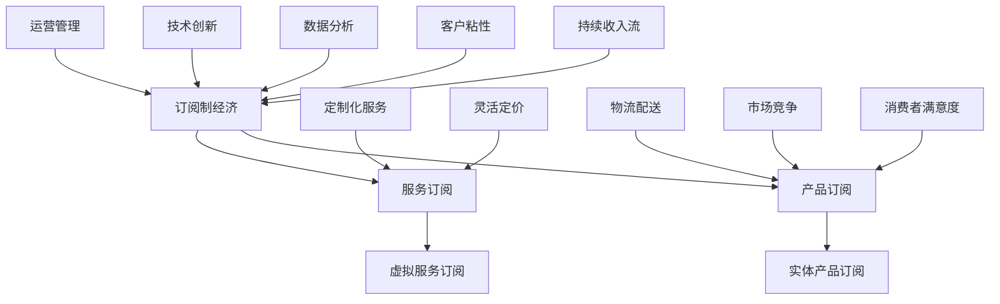

                 

## 《订阅制经济的发展趋势：从产品订阅到服务订阅》

### 关键词：订阅制经济、产品订阅、服务订阅、商业模式、未来趋势

> 摘要：本文从订阅制经济的背景与概述入手，详细分析了订阅制经济的核心概念、应用与模式，探讨了其发展趋势和挑战，并通过案例研究和工具资源部分为读者提供了实际应用和学习路径。文章旨在帮助读者全面了解订阅制经济的发展现状和未来方向。

#### 第一部分：订阅制经济的背景与概述

订阅制经济作为一种商业模式，正逐渐成为全球商业领域的重要趋势。本部分将首先介绍订阅制经济的定义与特点，回顾其发展历程，探讨主要参与者的角色，并分析全球订阅制经济的发展趋势。

#### 第1章：订阅制经济概述

##### 1.1 订阅制经济的定义与特点

订阅制经济，简而言之，就是通过订阅的方式向消费者提供产品或服务的一种商业模式。其核心在于客户通过定期支付一定费用，获得持续的、定期的产品供应或服务支持。

- **定义**：订阅制经济是指企业或个人通过向客户提供定期交付的产品或服务，换取持续收入的一种商业模式。

- **特点**：

  - **持续性**：订阅制经济强调持续的收入流，为企业和消费者带来稳定的经济收益。

  - **灵活性**：订阅模式允许消费者根据自己的需求灵活调整订阅内容和服务频率。

  - **定制化**：订阅制经济通常提供定制化的产品或服务，以满足不同消费者的需求。

  - **高客户粘性**：由于消费者已经支付了一定的订阅费用，他们更有可能保持长期合作关系，增加企业的客户粘性。

##### 1.2 订阅制经济的发展历程

订阅制经济的概念并非新生事物，但其发展历程可以追溯到几个世纪之前。以下是订阅制经济的主要发展阶段：

- **早期阶段**：19世纪初，邮购业务作为一种早期的订阅形式出现，消费者通过定期订阅邮购目录，购买商品。

- **20世纪**：随着电信、互联网和媒体的发展，订阅制经济在报刊、杂志、音乐、视频等领域得到了广泛应用。

- **21世纪初**：互联网技术的成熟推动了订阅制经济的进一步发展，电商、软件、云计算等领域的订阅模式逐渐兴起。

- **当前阶段**：随着消费者需求的不断变化和技术的快速发展，订阅制经济正在向更多领域扩展，呈现出多样化的发展趋势。

##### 1.3 订阅制经济的主要参与者

订阅制经济中，主要参与者包括订阅服务提供商、订阅消费者和技术平台。

- **订阅服务提供商**：他们提供产品或服务，通过订阅模式获得收入。这些提供商可以是企业、组织或个人。

- **订阅消费者**：他们是订阅制经济的直接受益者，通过支付订阅费用，获得持续的产品或服务供应。

- **技术平台**：技术平台在订阅制经济中起到至关重要的作用，提供订阅管理、支付处理、数据分析等功能，优化订阅体验。

##### 1.4 订阅制经济的全球趋势

全球订阅制经济呈现出以下趋势：

- **市场份额增加**：随着消费者对订阅模式的接受度提高，订阅制经济在全球范围内的市场份额不断增加。

- **行业多样性**：订阅制经济已从传统的媒体、电信领域扩展到电商、软件、餐饮、健康等多个行业。

- **技术创新**：人工智能、大数据、区块链等技术的应用，为订阅制经济提供了更高效、更智能的运营和管理方式。

- **消费者需求变化**：消费者对个性化和定制化的需求日益增长，推动了订阅制经济模式的创新和升级。

#### 第二部分：订阅制经济的核心概念

在深入了解订阅制经济后，我们需要进一步探讨其核心概念，包括产品订阅与服务订阅的区别、订阅模式与传统销售模式的对比，以及订阅制经济中的关键环节。

##### 第2章：订阅制经济的核心概念

##### 2.1 产品订阅与服务订阅

订阅制经济可以分为两大类：产品订阅和服务订阅。这两者在提供方式、定价模式、消费者体验等方面存在显著差异。

- **产品订阅**：

  - **定义**：产品订阅是指消费者定期购买实体产品的一种订阅模式。

  - **特点**：

    - **标准化**：产品订阅通常涉及标准化的产品，如电子产品、家居用品等。

    - **定价模式**：产品订阅通常采用固定定价，消费者根据订阅期限支付费用。

    - **消费者体验**：消费者可以享受产品的长期使用权，但无法获得定制化服务。

- **服务订阅**：

  - **定义**：服务订阅是指消费者定期购买某种服务的一种订阅模式。

  - **特点**：

    - **个性化**：服务订阅通常涉及个性化的服务，如健身会员、音乐流媒体等。

    - **定价模式**：服务订阅通常采用灵活定价，消费者可以根据需求选择不同的服务套餐。

    - **消费者体验**：消费者不仅可以享受服务，还可以获得定制化的体验和持续的服务支持。

##### 2.2 订阅模式与传统销售模式的比较

订阅模式与传统销售模式在多个方面存在差异，主要体现在以下几个方面：

- **收入模式**：

  - **传统销售模式**：以一次性销售为主，收入集中在销售过程中。

  - **订阅模式**：以持续收入为主，收入分布在订阅周期内。

- **消费者关系**：

  - **传统销售模式**：消费者与企业之间的联系较为短暂，交易结束后，双方关系结束。

  - **订阅模式**：消费者与企业之间存在长期合作关系，通过持续订阅，保持互动。

- **产品与服务**：

  - **传统销售模式**：主要提供实体产品，消费者获得产品的所有权。

  - **订阅模式**：主要提供虚拟产品或服务，消费者获得使用权，但无所有权。

- **市场竞争力**：

  - **传统销售模式**：企业需要通过降价促销等方式吸引消费者。

  - **订阅模式**：企业可以通过提供持续价值、个性化服务等方式增强竞争力。

##### 2.3 订阅制经济中的关键环节

订阅制经济中的关键环节包括订阅管理、支付处理、数据分析等。

- **订阅管理**：涉及订阅流程的设计、订阅状态的监控、订阅变更的处理等。

- **支付处理**：涉及订阅费用的收取、支付方式的选择、支付问题的解决等。

- **数据分析**：通过数据收集和分析，帮助企业了解消费者需求，优化订阅模式。

#### 第三部分：订阅制经济的应用与模式

在了解了订阅制经济的核心概念后，我们将进一步探讨其在实际中的应用和模式。本部分将详细分析产品订阅模式和服务订阅模式，探讨其基本原理、案例分析、优势与挑战。

##### 第3章：产品订阅模式

##### 3.1 产品订阅模式的基本原理

产品订阅模式是基于消费者定期购买实体产品的商业模式。其核心在于提供持续的产品供应，满足消费者的日常需求。

- **原理**：

  - 消费者选择订阅产品，并支付订阅费用。

  - 企业定期向消费者交付产品，确保持续供应。

  - 消费者可以根据需求随时调整订阅内容。

- **流程**：

  1. 消费者注册订阅账户，选择订阅产品。
  2. 企业收集订阅信息，安排产品供应。
  3. 企业向消费者交付产品，确保满意度。
  4. 消费者支付订阅费用，企业继续供应产品。

##### 3.2 产品订阅模式的案例分析

以下为几个产品订阅模式的典型案例：

- **案例1：亚马逊订阅服务**
  - 亚马逊提供了多种产品订阅服务，如亚马逊Prime会员、亚马逊订阅盒等。
  - 会员享受免费两日配送、专享折扣等优惠，提高用户粘性。

- **案例2：家居用品订阅服务**
  - 优家家居提供家居用品订阅服务，消费者可以根据需求订阅纸巾、洗洁精等日常用品。
  - 企业通过定期配送，确保消费者生活便利。

- **案例3：电子产品订阅服务**
  - 知名电子产品品牌如戴尔、惠普等，推出了电子产品订阅服务。
  - 消费者可以定期更换新款电子产品，享受最新的科技产品。

##### 3.3 产品订阅模式的优势与挑战

产品订阅模式具有以下优势：

- **优势**：

  - **提高客户粘性**：通过持续的产品供应，增强消费者与企业之间的联系。

  - **稳定收入**：订阅制经济带来稳定的收入流，降低企业的经营风险。

  - **优化库存管理**：企业可以根据订阅数据，优化库存管理，降低库存成本。

- **挑战**：

  - **消费者满意度**：确保订阅产品符合消费者的期望，提高满意度。

  - **物流配送**：有效的物流配送体系是产品订阅模式的关键，需要投入大量资源。

  - **市场竞争**：随着订阅制经济的普及，市场竞争加剧，企业需要不断创新，提升竞争力。

##### 第4章：服务订阅模式

##### 4.1 服务订阅模式的基本原理

服务订阅模式是基于消费者定期购买虚拟服务的商业模式。其核心在于提供持续的服务支持，满足消费者的多样化需求。

- **原理**：

  - 消费者选择订阅服务，并支付订阅费用。

  - 企业提供持续的服务支持，确保消费者满意。

  - 消费者可以根据需求调整订阅内容。

- **流程**：

  1. 消费者注册订阅账户，选择订阅服务。
  2. 企业收集订阅信息，安排服务供应。
  3. 企业向消费者提供持续的服务支持，确保满意度。
  4. 消费者支付订阅费用，企业继续提供服务。

##### 4.2 服务订阅模式的案例分析

以下为几个服务订阅模式的典型案例：

- **案例1：健身会员订阅服务**
  - 健身中心提供健身会员订阅服务，消费者可以享受健身器材、私人教练等资源。
  - 通过定期订阅，消费者可以持续享受健身服务，提高身体素质。

- **案例2：音乐流媒体订阅服务**
  - 音乐平台如Spotify、Apple Music等，提供音乐流媒体订阅服务。
  - 消费者可以无限制地享受海量音乐资源，满足音乐需求。

- **案例3：在线教育订阅服务**
  - 在线教育平台如Coursera、Udemy等，提供在线教育订阅服务。
  - 消费者可以学习各种课程，提升自己的知识和技能。

##### 4.3 服务订阅模式的优势与挑战

服务订阅模式具有以下优势：

- **优势**：

  - **个性化体验**：服务订阅模式可以根据消费者需求，提供个性化的服务体验。

  - **高附加值**：服务订阅模式可以为企业带来高附加值，如会员推荐、数据挖掘等。

  - **降低运营成本**：服务订阅模式可以降低企业的运营成本，如减少库存、简化物流等。

- **挑战**：

  - **服务质量**：确保订阅服务达到消费者期望，提高服务质量。

  - **消费者体验**：优化订阅流程，提高消费者体验。

  - **市场竞争**：随着服务订阅模式的普及，市场竞争加剧，企业需要不断创新，提升竞争力。

#### 第四部分：订阅制经济的未来趋势

在了解了订阅制经济的应用和模式后，我们将探讨其未来趋势。本部分将分析订阅制经济的新技术驱动因素、新模式，并预测其未来前景。

##### 第5章：订阅制经济的发展趋势

##### 5.1 新技术的驱动因素

订阅制经济的发展离不开新技术的驱动。以下是几个关键因素：

- **人工智能**：人工智能技术可以为企业提供精准的数据分析、智能推荐等功能，提高订阅模式的效率。

- **大数据**：大数据技术可以帮助企业了解消费者行为，优化订阅策略，提升用户体验。

- **区块链**：区块链技术可以确保订阅交易的透明性和安全性，增强消费者信任。

- **物联网**：物联网技术可以实现智能设备之间的互联互通，为订阅制经济提供更广泛的场景和应用。

##### 5.2 订阅制经济的新模式

随着技术的不断发展，订阅制经济将呈现以下新模式：

- **混合订阅模式**：将产品订阅和服务订阅相结合，提供更丰富的订阅体验。

- **个性化订阅模式**：基于消费者数据，提供个性化的订阅服务，满足多样化需求。

- **共享订阅模式**：通过共享经济理念，将订阅资源进行共享，降低消费者成本。

- **智能化订阅模式**：利用人工智能技术，实现订阅流程的自动化和智能化，提高运营效率。

##### 5.3 订阅制经济的未来前景

订阅制经济在未来具有广阔的前景：

- **市场规模扩大**：随着消费者对订阅模式的接受度提高，订阅制经济的市场规模将持续扩大。

- **行业渗透加深**：订阅制经济将逐步渗透到更多行业，如医疗、金融、教育等。

- **技术驱动创新**：新技术将不断推动订阅制经济的创新和发展，带来更多的商业机会。

#### 第五部分：订阅制经济的挑战与对策

在享受订阅制经济带来的机遇的同时，企业也需要面对一系列挑战。本部分将分析消费者行为的改变、企业转型的挑战、法律法规的挑战，并提出相应的对策与建议。

##### 第6章：订阅制经济的挑战与对策

##### 6.1 消费者行为的改变

订阅制经济的兴起，对消费者行为产生了深远影响：

- **消费观念转变**：消费者逐渐接受定期支付的方式，追求持续、稳定的产品或服务供应。

- **消费习惯改变**：消费者习惯于通过订阅获取产品或服务，减少一次性购买的需求。

- **消费需求多样**：消费者对个性化、定制化的需求日益增长，要求订阅制经济提供更丰富的订阅内容。

- **消费风险意识提高**：消费者对订阅服务的安全性、隐私性等要求提高，关注订阅合同和法律条款。

##### 6.2 企业转型的挑战

企业在转型订阅制经济过程中，面临以下挑战：

- **商业模式转变**：从传统的销售模式转向订阅模式，需要调整企业商业模式，适应新的市场需求。

- **运营管理优化**：订阅制经济涉及复杂的运营管理，包括订阅管理、支付处理、物流配送等，需要优化管理流程。

- **创新能力提升**：订阅制经济要求企业不断创新，提供个性化、定制化的订阅服务，以满足消费者需求。

- **员工技能培训**：企业需要为员工提供培训，提高他们在订阅模式下的运营能力和服务水平。

##### 6.3 法律法规的挑战

订阅制经济在法律法规方面面临以下挑战：

- **合同法律风险**：订阅合同涉及法律条款和消费者权益保护，企业需要确保合同的合法性和公平性。

- **消费者隐私保护**：订阅制经济涉及大量消费者数据，企业需要遵守相关法律法规，保护消费者隐私。

- **税务问题**：订阅制经济的税务处理相对复杂，企业需要了解相关税务政策，合理规避税务风险。

##### 6.4 对策与建议

为了应对订阅制经济的挑战，企业可以采取以下对策与建议：

- **加强消费者教育**：通过营销活动、用户指南等方式，提高消费者对订阅模式的理解和接受度。

- **优化运营管理**：建立完善的订阅管理流程，提高运营效率，降低运营成本。

- **加强创新能力**：关注消费者需求变化，不断优化和创新订阅服务，提升用户体验。

- **合规经营**：遵守相关法律法规，确保企业运营合法合规，降低法律风险。

#### 第7章：订阅制经济的案例研究

为了更好地理解订阅制经济的实际应用和效果，本部分将介绍几个国际和中国本土的订阅制经济案例，并分析其成功经验与启示。

##### 7.1 国际案例分析

- **案例1：亚马逊Prime会员**
  - **背景**：亚马逊Prime会员是亚马逊推出的订阅服务，会员享受免费两日配送、专享折扣等权益。
  - **成功经验**：亚马逊通过优化物流配送、提供丰富会员权益，成功吸引了大量消费者。

- **案例2：Netflix**
  - **背景**：Netflix是一家流媒体公司，提供在线视频订阅服务。
  - **成功经验**：Netflix通过个性化推荐、高质量内容，赢得了大量订阅用户。

- **案例3：Apple Music**
  - **背景**：Apple Music是苹果公司推出的音乐流媒体订阅服务。
  - **成功经验**：Apple Music通过高品质音乐、个性化推荐，成功吸引了大量用户。

##### 7.2 中国本土案例分析

- **案例1：美团外卖**
  - **背景**：美团外卖是美团旗下的外卖平台，提供外卖订阅服务。
  - **成功经验**：美团外卖通过高效的物流配送、丰富的餐厅选择，吸引了大量用户。

- **案例2：滴滴出行**
  - **背景**：滴滴出行是中国的出行平台，提供打车、专车等订阅服务。
  - **成功经验**：滴滴出行通过优化用户体验、提供多样化的服务，赢得了大量用户。

- **案例3：得到APP**
  - **背景**：得到APP是中国的知识付费平台，提供订阅课程服务。
  - **成功经验**：得到APP通过高质量内容、个性化推荐，吸引了大量用户。

##### 7.3 行业案例分析

- **案例1：电商行业**
  - **背景**：电商行业在订阅制经济中占据重要地位，如京东Plus会员、天猫超级会员等。
  - **成功经验**：电商企业通过会员权益、个性化推荐，提高了用户粘性。

- **案例2：餐饮行业**
  - **背景**：餐饮行业逐渐采用订阅制经济模式，如每日优鲜等。
  - **成功经验**：餐饮企业通过定期配送、优惠套餐，吸引了大量消费者。

- **案例3：教育行业**
  - **背景**：教育行业在订阅制经济中具有巨大潜力，如VIPKID、猿辅导等。
  - **成功经验**：教育机构通过在线课程、个性化辅导，提升了教育质量。

#### 第8章：订阅制经济的工具与平台

为了帮助企业和个人更好地应用订阅制经济，本部分将介绍一些主流的订阅制经济工具与平台，包括其特点和适用场景。

##### 8.1 主流订阅平台介绍

以下是一些主流的订阅制经济平台：

- **Substack**：一个专注于内容订阅的平台，适合自媒体和内容创作者。

- **会员猴**：一个专注于企业订阅管理的平台，提供会员管理、数据分析等功能。

- **Subscriptions Manager**：一个开源的订阅管理工具，适用于中小型企业。

- **PayPal Subscriptions**：PayPal提供的一款订阅管理工具，适用于电商和企业。

##### 8.2 订阅制经济工具的选择与使用

在选择订阅制经济工具时，企业应考虑以下因素：

- **需求分析**：根据企业需求和业务特点，选择适合的订阅制经济工具。

- **功能对比**：比较不同订阅制经济工具的功能，选择具有竞争力的工具。

- **成本预算**：考虑订阅制经济工具的预算，选择性价比高的工具。

- **用户体验**：关注订阅制经济工具的用户体验，确保操作简便、易于使用。

##### 8.3 开源订阅平台介绍

以下是一些开源的订阅制经济平台：

- **Subscription Machine**：一个开源的订阅管理工具，适用于电商和企业。

- **Memberful**：一个开源的会员管理工具，适合内容创作者和自媒体。

- **Subscriptions Manager**：一个开源的订阅管理工具，适用于中小型企业。

- **Recurly**：一个开源的订阅管理工具，提供多种功能，适用于大型企业。

#### 第9章：订阅制经济的资源与学习

为了深入了解订阅制经济，本部分将推荐一些订阅制经济相关的书籍、在线课程、研讨会和会议，帮助读者学习和了解订阅制经济的最新动态和最佳实践。

##### 9.1 订阅制经济相关书籍推荐

以下是一些值得推荐的订阅制经济相关书籍：

- 《订阅革命：打造高粘性、高回报的订阅制企业》
- 《订阅制商业：从传统销售到持续收入的转变》
- 《订阅制经济：模式、战略与实践》
- 《订阅制营销：打造持续增长的订阅模式》

##### 9.2 订阅制经济在线课程推荐

以下是一些订阅制经济相关的在线课程：

- 《订阅制经济入门与实战》
- 《订阅制商业模式设计与创新》
- 《订阅制经济数据分析与应用》
- 《订阅制经济营销策略与实战》

##### 9.3 订阅制经济相关的研讨会和会议

以下是一些订阅制经济相关的研讨会和会议：

- 《订阅制经济国际峰会》
- 《订阅制经济中国峰会》
- 《订阅制经济创新论坛》
- 《订阅制经济产业大会》

#### 附录

##### 附录A：订阅制经济关键概念图解

[订阅制经济关键概念图解](#appendix-a-subscription-economy-key-concept-diagrams)

##### 附录B：订阅制经济常见术语解释

[订阅制经济常见术语解释](#appendix-b-subscription-economy-common-terms-explanation)

##### 附录C：订阅制经济相关数据资源

[订阅制经济相关数据资源](#appendix-c-subscription-economy-related-data-resources)

##### 附录D：订阅制经济案例研究资料

[订阅制经济案例研究资料](#appendix-d-subscription-economy-case-study-materials)

#### 总结

订阅制经济作为一种新兴商业模式，正逐渐改变着全球商业格局。本文从订阅制经济的背景与概述、核心概念、应用与模式、未来趋势、挑战与对策等方面进行了详细分析，帮助读者全面了解订阅制经济的发展现状和未来方向。

通过本文的学习，读者可以：

- 理解订阅制经济的定义、特点和发展历程。
- 掌握产品订阅与服务订阅的原理和案例分析。
- 了解订阅制经济中的关键环节和挑战。
- 探索订阅制经济的未来趋势和创新模式。
- 学习订阅制经济的工具与资源，为实际应用提供参考。

让我们共同关注订阅制经济的发展，把握未来商业机会，共创美好未来！

### 附录A：订阅制经济关键概念图解

[订阅制经济关键概念图解](#appendix-a-subscription-economy-key-concept-diagrams)

### 附录B：订阅制经济常见术语解释

[订阅制经济常见术语解释](#appendix-b-subscription-economy-common-terms-explanation)

- **订阅制经济**：指通过订阅模式提供产品或服务的一种商业模式，客户支付定期费用以换取持续的产品或服务供应。
- **产品订阅**：指消费者定期购买实体产品的一种订阅模式，如电子设备、家居用品等。
- **服务订阅**：指消费者定期购买虚拟服务的一种订阅模式，如健身会员、音乐流媒体等。
- **持续收入流**：指订阅制经济带来的稳定收入流，为企业提供持续的经济收益。
- **客户粘性**：指客户对企业产品或服务的依赖程度，订阅制经济通过持续的服务供应增强客户粘性。
- **定制化服务**：指根据消费者需求提供个性化的产品或服务，满足多样化需求。
- **灵活定价**：指根据消费者需求和市场变化，灵活调整订阅价格和服务内容。
- **物流配送**：指将订阅产品按时交付给消费者的过程，是订阅制经济的重要组成部分。
- **数据分析**：指通过数据收集和分析，帮助企业了解消费者需求，优化订阅模式。
- **技术创新**：指利用新技术（如人工智能、大数据等）推动订阅制经济的发展和创新。
- **市场竞争**：指订阅制经济在不同行业和企业之间的竞争，企业需要不断创新和优化，提升竞争力。
- **消费者满意度**：指消费者对订阅产品或服务的满意程度，是订阅制经济成功的关键因素。
- **运营管理**：指企业对订阅制经济运营过程的管理，包括订阅管理、支付处理、物流配送等。
- **开源订阅平台**：指提供免费或低成本的订阅管理工具和资源，适用于不同规模的企业。

### 附录C：订阅制经济相关数据资源

[订阅制经济相关数据资源](#appendix-c-subscription-economy-related-data-resources)

- **国际数据公司（IDC）**：提供全球和地区性的订阅制经济市场报告，涵盖市场规模、增长率、行业趋势等。
- **高盛**：发布关于订阅制经济的白皮书，分析订阅制经济在不同行业的应用和前景。
- **市场研究公司**：如Statista、eMarketer等，提供订阅制经济的最新市场数据和分析报告。
- **行业报告**：如电子商务报告、媒体订阅报告、教育订阅报告等，针对特定行业的订阅制经济进行分析。
- **政府报告**：一些国家的政府部门会发布关于订阅制经济的统计数据和政策分析。
- **专业网站**：如Subscription Economy Collective、Substack Insights等，提供订阅制经济的最新动态、案例分析和研究报告。
- **社交媒体平台**：如LinkedIn、Twitter等，订阅制经济相关的专业人士和机构会分享行业动态和研究成果。

### 附录D：订阅制经济案例研究资料

[订阅制经济案例研究资料](#appendix-d-subscription-economy-case-study-materials)

- **亚马逊Prime会员**：详细了解亚马逊Prime会员的运营模式、会员权益、用户增长等数据。
- **Netflix订阅服务**：研究Netflix的订阅模式、内容策略、用户行为分析等。
- **Apple Music订阅服务**：分析苹果公司的音乐订阅服务，包括用户增长、盈利模式等。
- **美团外卖**：探讨美团外卖的订阅制经济模式、配送效率、用户体验等。
- **滴滴出行**：研究滴滴出行的订阅服务、出行数据、市场定位等。
- **得到APP**：分析得到APP的订阅课程、用户画像、内容策略等。
- **京东Plus会员**：了解京东Plus会员的权益设计、用户满意度、市场份额等。
- **每日优鲜**：研究每日优鲜的生鲜订阅服务、供应链管理、用户反馈等。
- **VIPKID**：探讨VIPKID的在线教育订阅服务、教学效果、用户评价等。
- **猿辅导**：分析猿辅导的订阅课程、学习数据、市场竞争力等。

### 作者信息

作者：AI天才研究院/AI Genius Institute & 禅与计算机程序设计艺术 /Zen And The Art of Computer Programming

---

**文章标题：《订阅制经济的发展趋势：从产品订阅到服务订阅》**

**关键词：订阅制经济、产品订阅、服务订阅、商业模式、未来趋势**

**摘要：本文从订阅制经济的背景与概述入手，详细分析了订阅制经济的核心概念、应用与模式，探讨了其发展趋势和挑战，并通过案例研究和工具资源部分为读者提供了实际应用和学习路径。文章旨在帮助读者全面了解订阅制经济的发展现状和未来方向。**

