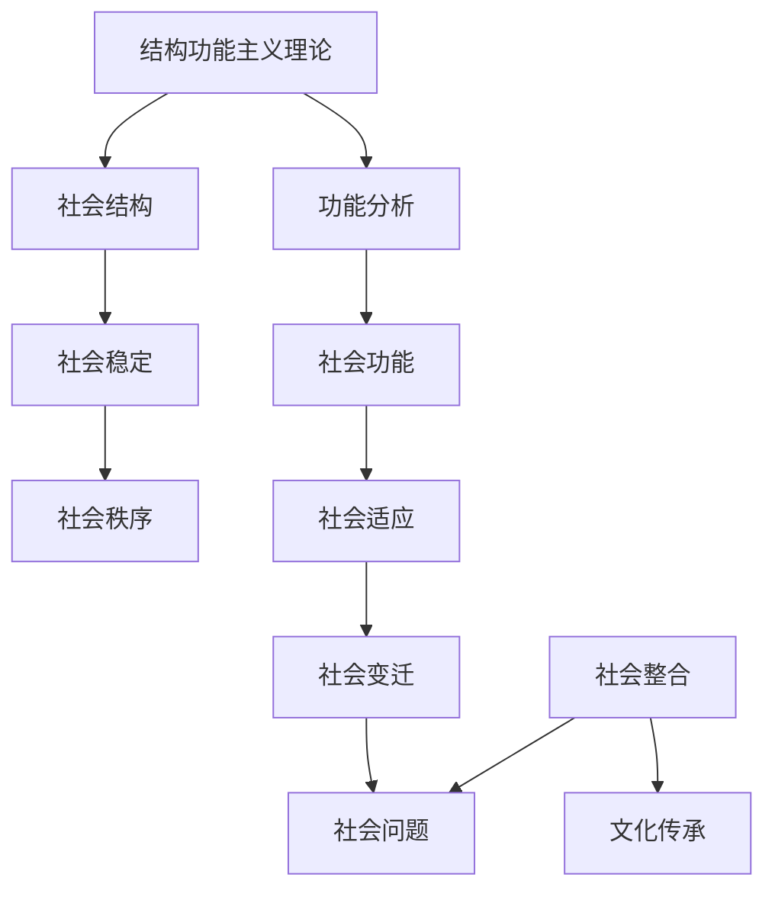

                 

### 人类学的定义与发展

人类学是一门研究人类及其文化的学科，其研究领域广泛，包括人类起源、演化、文化多样性、社会结构、经济模式、宗教信仰、语言、艺术和价值观等各个方面。作为社会科学的一个重要分支，人类学为我们提供了理解和分析不同文化背景下的社会现象和人类行为的重要工具。

#### **1.1 人类学的定义**

人类学可以追溯到18世纪，当时主要是通过比较不同民族的文化特征来探索人类的行为模式。现代人类学则更加注重科学方法和跨学科研究。根据罗家德（2017）的定义，人类学是研究人类在不同时间、空间和文化环境中的生存方式和行为模式，探讨人类文化多样性和人类共同性的学科。

##### **1.1.1 人类学的起源**

人类学的起源可以追溯到18世纪的比较文化研究和19世纪的人类进化论。早期的比较文化研究主要关注不同民族的神话、宗教、习俗和艺术等文化现象，试图找出它们之间的共性和差异。19世纪，随着生物进化理论的兴起，人类学家开始将人类与其他物种进行比较，探索人类的进化历程。

##### **1.1.2 人类学的学科范畴**

人类学的学科范畴非常广泛，包括以下主要领域：

1. **考古学**：研究古代人类的文化、社会和技术。
2. **语言学**：研究人类语言的起源、发展和结构。
3. **民族学**：研究非工业化社会的人类行为和文化。
4. **文化人类学**：研究现代社会的文化现象和人类行为。
5. **生物人类学**：研究人类生物学和演化。
6. **历史人类学**：研究人类历史和文明。

##### **1.1.3 人类学的学科目标**

人类学的学科目标主要包括：

1. **理解人类文化的多样性**：通过研究不同文化背景下的社会现象和人类行为，揭示文化多样性的本质和影响。
2. **探索人类共同性**：通过比较不同文化之间的相似性，找出人类共同的文化特征和价值观。
3. **促进跨文化交流和理解**：通过研究和分析文化差异，提高不同文化背景下的交流和理解能力。
4. **保护文化遗产**：通过研究文化遗产，促进文化传承和保护。

---

### **1.2 人类学的发展历程**

人类学的发展历程可以分为三个主要阶段：古代人类学、近代人类学和现代人类学。

##### **1.2.1 古代人类学**

古代人类学主要关注人类起源和进化，其研究方法主要是比较文化研究和生物人类学。19世纪初，法国学者布丰（Georges Cuvier）和英国学者达尔文（Charles Darwin）分别提出了人类进化的理论和比较文化研究的方法，这标志着古代人类学的兴起。

##### **1.2.2 近代人类学**

近代人类学主要关注文化多样性和社会结构。20世纪初，美国人类学家泰勒（Edward Tylor）提出了文化相对主义的理论，强调研究文化现象时必须考虑到文化背景。此后，结构功能主义理论、唯物主义理论和心理人类学等新的理论相继出现，丰富了人类学的研究方法。

##### **1.2.3 现代人类学**

现代人类学强调跨学科研究和全球化背景下的文化多样性。随着全球化进程的加速，人类学开始关注文化之间的交流、融合和冲突。同时，人类学也开始运用现代科技和数据分析方法，如考古学中的放射性碳定年法、语言学中的统计模型和计算机模拟等，提高了研究精度和深度。

---

### **1.3 人类学的核心理论**

人类学的发展过程中，形成了许多重要的理论，其中结构功能主义理论、唯物主义理论和文化相对主义理论是最具代表性的三大理论。

##### **1.3.1 结构功能主义理论**

结构功能主义理论由美国人类学家帕森斯（Talcott Parsons）和默顿（Robert Merton）提出，强调社会结构和社会功能之间的相互关系。结构功能主义认为，社会系统由不同的部分组成，每个部分都承担特定的功能，以维持社会的稳定和秩序。

- **核心概念**：社会结构、社会功能、子系统、平衡。
- **理论框架**：帕森斯提出了一个著名的AGIL模型，即社会系统通过适应（Adaptation）、目标实现（Goal Attainment）、模式维持（Integration）和潜在模式 Latent Function）来实现其功能。
- **应用领域**：结构功能主义理论广泛应用于社会学、政治学和人类学等领域。

##### **1.3.2 唯物主义理论**

唯物主义理论认为，社会现象和人类行为是由物质条件和经济基础决定的。马克思和恩格斯是唯物主义理论的奠基人，他们提出了历史唯物主义和社会发展理论。

- **核心概念**：经济基础、生产力、生产关系、阶级斗争。
- **理论框架**：马克思认为，社会历史发展是由生产力的发展和阶级斗争推动的，生产关系是经济基础的重要组成部分。
- **应用领域**：唯物主义理论广泛应用于经济学、政治学和社会学等领域。

##### **1.3.3 文化相对主义理论**

文化相对主义理论强调，每个文化都有其独特的价值和逻辑，不能以自己的文化标准去评价其他文化。文化相对主义理论由美国人类学家泰勒（Edward Tylor）和博厄斯（Franz Boas）提出。

- **核心概念**：文化相对性、文化自主性、文化独立价值。
- **理论框架**：泰勒提出了“文化相对主义”的概念，认为每个文化都应该在其自身的背景下进行理解和评价。博厄斯进一步发展了这一理论，强调文化研究的民族志方法。
- **应用领域**：文化相对主义理论广泛应用于人类学、社会学和文化研究等领域。

---

通过以上对人类学定义、发展历程和核心理论的介绍，我们可以看到人类学作为一门多学科交叉的学科，不仅为研究人类文化和社会现象提供了丰富的理论和方法，也为理解和解决现实问题提供了宝贵的启示。

---

### **2. 文化的定义与多样性**

文化是理解人类行为和社会现象的关键概念，它涵盖了从语言、价值观到艺术和社会规范等多个方面。然而，文化的定义一直以来都是学术界讨论的焦点，不同学者从不同角度给出了各自的定义。

#### **2.1 文化的定义**

文化可以理解为一系列社会共享的符号、价值观、规范和习惯。根据罗家德（2017）的观点，文化是一种社会学习的产物，通过社会传递和个体社会化过程得以传承和发展。具体来说，文化定义主要包括以下几个方面：

- **文化作为一种符号系统**：文化通过符号系统传达意义，这些符号可以是语言、艺术作品、仪式等。
- **文化作为一种价值观体系**：文化决定了社会的价值观和行为准则，如道德、伦理和宗教信仰。
- **文化作为一种规范体系**：文化规范了个体在社会中的行为方式，包括法律、习俗和社会规范。
- **文化作为一种身份认同**：文化不仅是社会行为和价值观的集合，也是个体和社会的身份认同基础。

#### **2.1.1 文化的概念**

文化的概念具有多维度的特点，主要包括以下几个方面：

- **物质文化**：包括建筑、工具、艺术品等物质表现形式。
- **非物质文化**：包括语言、音乐、舞蹈、传统习俗等非物质表现形式。
- **行为文化**：包括日常行为、社会互动和社会规范。
- **精神文化**：包括价值观、信仰、宗教和哲学思想。

#### **2.1.2 文化的特征**

文化具有以下主要特征：

- **共享性**：文化是社会中大多数人共享的符号系统和行为模式。
- **习得性**：文化是通过社会传递和学习得来的，不是先天的。
- **传播性**：文化可以在不同时间和空间中传播和变化。
- **多样性**：文化因社会环境和历史背景的不同而呈现出多样性。
- **历史性**：文化具有历史积淀性，随着时间的推移而发展和变化。

#### **2.1.3 文化的类型**

文化可以根据不同的分类标准进行分类，常见的分类方法包括：

- **按照地域分类**：如东方文化、西方文化、非洲文化等。
- **按照社会结构分类**：如农业文化、工业文化、游牧文化等。
- **按照价值观分类**：如儒家文化、道家文化、伊斯兰文化等。
- **按照宗教分类**：如佛教文化、基督教文化、伊斯兰教文化等。

---

### **2.2 文化的多样性**

文化的多样性是人类社会的一个重要特征，也是人类学研究的核心议题之一。文化多样性不仅表现在不同文化之间的差异，也体现在同一文化内部的不同子文化和群体之间。

#### **2.2.1 文化多样性的表现**

文化的多样性表现在多个方面：

- **语言多样性**：世界上有超过7000种语言，不同的语言反映了不同的文化和思维模式。
- **宗教多样性**：全球有多个主要宗教，如基督教、伊斯兰教、佛教、印度教等，每种宗教都有其独特的信仰和仪式。
- **价值观多样性**：不同的文化有不同的价值观和行为准则，如个人主义与集体主义的区别。
- **艺术和审美多样性**：不同的文化对艺术和审美的理解和表达方式有所不同，如中国山水画与西方油画的差异。
- **社会规范多样性**：不同文化有不同的社会规范和习俗，如西方的握手礼节与亚洲的鞠躬礼节。

#### **2.2.2 文化多样性的原因**

文化多样性的原因主要包括：

- **历史背景**：历史事件、地理环境和社会变迁都对文化形成产生影响。
- **社会互动**：不同文化的交流与互动促进了文化多样性的发展。
- **经济条件**：经济基础的变化也会导致文化模式的改变。
- **政治因素**：政治制度和文化政策对文化多样性的形成和维持有着重要影响。

#### **2.2.3 文化多样性的影响**

文化多样性的影响是多方面的：

- **社会凝聚力**：文化多样性有助于增强社会凝聚力，通过尊重和包容不同文化，促进社会和谐。
- **创新与创造**：文化多样性为创新提供了丰富的资源和灵感，不同文化的交融往往会产生新的思想和文化形态。
- **经济发展**：文化多样性有助于推动旅游业和文化产业的发展，促进经济多元化。
- **社会问题**：文化多样性也可能导致文化冲突和误解，需要通过教育和社会政策来应对。

---

通过以上对文化定义与多样性的探讨，我们可以看到文化不仅是一个多维度的概念，也是一个不断变化和发展的现象。理解文化的多样性和其背后的原因，有助于我们更好地认识和尊重不同文化，促进跨文化交流和理解。

---

### **2.3 文化多样性的研究方法**

研究文化多样性是一个复杂而重要的课题，需要采用多种研究方法来全面理解和分析。以下介绍几种常用的研究方法：

#### **2.3.1 比较研究法**

比较研究法是通过比较不同文化之间的相似性和差异性来研究文化多样性的方法。这种方法有助于揭示文化特征和规律的普遍性和特殊性。

- **优点**：能够发现文化之间的共性和差异，有助于理解文化多样性的本质。
- **缺点**：可能忽视文化内部的多样性，且比较的准确性和可靠性取决于比较的标准和样本的选择。

#### **2.3.2 案例研究法**

案例研究法是通过深入分析和研究具体文化案例来探讨文化多样性的方法。这种方法通常涉及对特定文化群体或文化现象的详细调查和描述。

- **优点**：能够提供具体、详细的文化资料，有助于理解文化多样性的复杂性和多样性。
- **缺点**：案例的选择可能具有主观性，且研究结果的推广性有限。

#### **2.3.3 参与观察法**

参与观察法是研究者直接参与研究对象的文化活动，通过观察和记录来研究文化多样性的方法。这种方法有助于了解文化现象的实际运作和内涵。

- **优点**：能够获得第一手资料，深入了解文化现象的细节和背景。
- **缺点**：研究者可能受到个人偏见和主观体验的影响，且长时间参与可能影响研究对象的行为。

#### **2.3.4 文献分析法**

文献分析法是通过分析已有的文化文献和资料来研究文化多样性的方法。这种方法适用于研究历史文化和传统文化。

- **优点**：能够获取丰富的历史和文化资料，有助于理解文化多样性的发展过程。
- **缺点**：文献的准确性和完整性可能受到质疑，且可能难以反映当前的文化现实。

#### **2.3.5 问卷调查法**

问卷调查法是通过设计问卷来收集大量文化数据的方法。这种方法适用于研究大规模、多样化的文化群体。

- **优点**：能够快速收集大量数据，提高研究的效率和准确性。
- **缺点**：问卷设计可能影响数据的可靠性和有效性，且问卷结果可能难以反映深层次的文化特征。

#### **2.3.6 访谈法**

访谈法是通过与研究对象的面对面访谈来收集文化数据的方法。这种方法适用于研究文化的主观体验和深层含义。

- **优点**：能够深入了解研究对象的主观感受和观点，提高数据的深度和准确性。
- **缺点**：访谈可能受到研究者个人风格和访谈技巧的影响，且可能难以推广到其他人群。

---

通过上述研究方法的介绍，我们可以看到，研究文化多样性需要综合运用多种方法，以获取全面、深入的认识。每种方法都有其独特的优势和局限性，因此，选择合适的研究方法对于成功研究文化多样性至关重要。

---

### **3. 跨文化交际**

跨文化交际是指在跨文化背景下进行的信息交流和沟通过程。随着全球化进程的加速，跨文化交际变得越来越普遍和重要。有效的跨文化交际不仅能促进国际间的合作与交流，还能减少文化冲突，增进相互理解与尊重。

#### **3.1.1 跨文化交际的概念**

跨文化交际可以定义为在不同文化背景下进行的交流过程，包括语言交流和非语言交流。根据詹姆斯·克拉克·麦克兰德（2018）的定义，跨文化交际涉及对文化差异的敏感性、适应性和理解力，旨在实现有效沟通。

- **文化差异**：跨文化交际的核心是文化差异。这些差异包括语言、价值观、社会规范、行为习惯等。
- **交流过程**：跨文化交际是一个动态的交流过程，涉及信息传递、理解、反馈和调整。

#### **3.1.2 跨文化交际的重要性**

跨文化交际的重要性体现在以下几个方面：

- **促进国际合作**：有效的跨文化交际能够促进不同国家和地区之间的合作，实现共赢。
- **增强文化理解**：通过跨文化交际，人们可以更好地理解不同文化的行为模式和价值观念。
- **减少文化冲突**：理解文化差异有助于减少误解和冲突，建立和谐的国际关系。
- **提升个人素养**：跨文化交际能力是现代社会中一个重要的素养，有助于提高个人的适应能力和竞争力。

#### **3.1.3 跨文化交际的挑战**

跨文化交际面临的挑战主要包括：

- **语言障碍**：不同的语言系统和文化背景可能导致语言理解和使用上的困难。
- **价值观差异**：不同的文化价值观可能导致对同一行为或事件的评价和反应不同。
- **社会规范差异**：不同的社会规范和行为准则可能导致交际过程中的误解和冲突。
- **文化敏感性**：对文化差异的不敏感可能导致冒犯或不尊重对方文化。

---

### **3.2 跨文化交际的策略**

为了克服跨文化交际的挑战，采取适当的策略和技巧至关重要。以下是一些有效的跨文化交际策略：

#### **3.2.1 文化适应策略**

- **了解对方文化**：在跨文化交际中，首先需要了解对方的文化背景，包括语言、价值观、社会规范等。
- **尊重差异**：尊重对方的文化差异，避免将自己的文化标准强加于对方。
- **灵活应对**：在跨文化交际中，需要具备灵活应对文化差异的能力，根据具体情境调整自己的行为和沟通方式。

#### **3.2.2 交际策略**

- **明确目标**：在跨文化交际中，首先要明确沟通的目标，确保信息传递的准确性和有效性。
- **积极倾听**：倾听是跨文化交际中至关重要的一环，通过积极倾听可以更好地理解对方的文化背景和需求。
- **使用非语言沟通**：非语言沟通（如肢体语言、面部表情、语调等）在跨文化交际中具有重要作用，需要根据文化差异进行调整。

#### **3.2.3 跨文化交际技巧**

- **学习文化礼仪**：学习对方的文化礼仪，如问候、道别、邀请等，有助于建立良好的第一印象。
- **避免文化误解**：通过文化敏感性培训，提高对文化差异的敏感度，避免因文化误解导致的冲突。
- **建立信任关系**：建立信任关系是跨文化交际成功的关键，通过相互尊重和信任，可以增强跨文化沟通的效果。

---

通过上述策略和技巧，我们可以更好地应对跨文化交际中的挑战，提高跨文化交际的效果。这不仅有助于个人职业发展，也为国际交流与合作提供了有力支持。

---

### **3.3 跨文化管理**

跨文化管理是指在全球化背景下，企业或组织在面对不同文化差异时，采取的管理策略和实践。有效的跨文化管理能够促进国际业务的顺利开展，提高组织效率和员工满意度。

#### **3.3.1 跨文化管理的定义**

跨文化管理可以定义为在全球化背景下，企业或组织通过理解、适应和整合不同文化，以实现组织目标的过程。根据斯蒂芬·罗宾斯（2012）的定义，跨文化管理涉及对文化差异的敏感性、适应性和协调性，旨在创造一个包容、和谐的工作环境。

- **文化差异**：跨文化管理的核心是文化差异，包括语言、价值观、行为规范和沟通方式等。
- **组织目标**：跨文化管理旨在通过整合不同文化，实现组织目标，如提高绩效、增强竞争力、提升客户满意度等。

#### **3.3.2 跨文化管理的原则**

跨文化管理应遵循以下原则：

- **尊重文化差异**：尊重不同文化的特点和价值观，避免文化偏见和歧视。
- **建立信任关系**：通过建立信任关系，促进跨文化团队的合作与沟通。
- **促进文化适应**：帮助员工适应新的文化环境，提高其文化敏感性和适应能力。
- **提供文化培训**：通过文化培训，提高员工对文化差异的敏感度和应对能力。

#### **3.3.3 跨文化管理的实践**

跨文化管理的实践包括以下几个方面：

- **跨文化团队建设**：通过建立跨文化团队，促进不同文化背景员工的交流与合作，提高团队绩效。
- **文化融合策略**：制定文化融合策略，促进不同文化的相互理解和融合。
- **文化适应性培训**：为员工提供文化适应性培训，提高其对文化差异的敏感度和应对能力。
- **国际人力资源管理**：通过国际人力资源管理策略，吸引、留住和激励来自不同文化背景的员工。

---

通过遵循跨文化管理的原则和实践，企业或组织可以更好地应对全球化背景下的文化挑战，提高国际业务的成功率。

---

### **4. 文化传承与保护**

文化传承与保护是确保人类文化遗产得以延续和发展的关键任务。在全球化和现代化进程加快的背景下，保护和传承文化遗产面临着前所未有的挑战。

#### **4.1 文化传承的重要性**

文化传承的重要性体现在以下几个方面：

- **社会记忆**：文化传承是民族和社会的记忆，承载着历史和传统，是民族身份认同的重要组成部分。
- **教育意义**：文化遗产是教育的宝贵资源，通过传承文化遗产，可以培养人们对历史、文化和艺术的兴趣和素养。
- **经济价值**：文化遗产保护和开发可以带动旅游业和相关产业的发展，产生显著的经济效益。
- **文化多样性**：文化传承是维护全球文化多样性的重要手段，有助于促进不同文化之间的相互理解和尊重。

#### **4.1.1 文化传承的概念**

文化传承是指通过代际传递、文化教育、艺术创作和传播等方式，使文化遗产得以延续和发展的过程。根据马克斯·韦伯（2002）的观点，文化传承不仅是物质文化遗产的传递，还包括非物质文化，如语言、习俗、价值观等。

- **物质文化遗产**：包括文物、古迹、建筑、艺术品等有形的物质文化。
- **非物质文化遗产**：包括口头传统、表演艺术、社会实践、习俗、节庆、知识和实践等无形的文化遗产。

#### **4.1.2 文化传承的意义**

文化传承的意义主要体现在以下几个方面：

- **维护文化多样性**：通过传承不同文化，可以保持全球文化多样性的丰富性和独特性。
- **促进文化创新**：文化传承为文化创新提供了丰富的资源和灵感，不同文化的交融和碰撞往往催生出新的文化形式。
- **增强民族凝聚力**：文化传承有助于增强民族认同感和凝聚力，是民族繁荣发展的重要基石。
- **推动社会进步**：文化传承是社会发展的重要动力，有助于提高社会文明程度和人民的精神文化素质。

#### **4.1.3 文化传承的挑战**

文化传承面临着以下主要挑战：

- **现代化进程**：现代化进程可能导致传统文化逐渐消失，传统生活方式和价值观受到冲击。
- **城市化**：城市化进程加速，许多传统文化生存空间被挤压，传统技艺和文化知识面临失传的风险。
- **全球化和国际化**：全球化和国际化进程加剧了文化同质化趋势，本土文化面临外来文化的强烈冲击。
- **经济压力**：经济压力导致许多文化传承项目缺乏必要的资金支持，文化保护工作难以持续进行。

---

### **4.2 文化保护的方法**

为了有效地保护文化遗产，需要采取多种方法和措施。以下介绍几种常见的文化保护方法：

#### **4.2.1 物质文化遗产保护**

物质文化遗产保护主要涉及对文物、古迹、建筑等有形文化遗产的保护。

- **修缮和维护**：对文物和古迹进行定期的修缮和维护，防止其因自然老化或人为破坏而损毁。
- **法律法规保护**：制定相关法律法规，对重要文化遗产进行保护和管理，如《世界文化遗产保护法》等。
- **技术支持**：运用现代科技手段，如数字化保存、虚拟现实技术等，对文化遗产进行保护和展示。

#### **4.2.2 非物质文化遗产保护**

非物质文化遗产保护主要涉及对口头传统、表演艺术、社会实践、习俗、节庆等无形文化遗产的保护。

- **社区参与**：鼓励社区参与非物质文化遗产的保护工作，通过社区力量传承和发展文化遗产。
- **教育推广**：通过教育和宣传活动，提高公众对非物质文化遗产的认识和重视，增强文化传承意识。
- **法律法规保护**：制定相关法律法规，对非物质文化遗产进行保护和管理，如《非物质文化遗产保护法》等。

#### **4.2.3 数字文化遗产保护**

数字文化遗产保护是利用数字化技术对文化遗产进行保存、展示和传播。

- **数字化保存**：通过数字化技术对文化遗产进行保存，如数字化图像、音频、视频等，确保文化遗产的长期保存和传承。
- **虚拟博物馆**：建立虚拟博物馆，通过数字化展示技术，将文化遗产呈现给公众，提高文化遗产的传播和影响力。
- **在线教育**：利用数字化资源开展在线教育，推广文化遗产知识，培养文化遗产传承人才。

---

通过上述文化保护方法的介绍，我们可以看到，文化传承与保护是一个复杂而系统的工程，需要政府、社会和个人的共同努力。只有通过多种方法和措施的综合运用，才能有效地保护文化遗产，使其得以世代传承。

---

### **4.3 文化创新**

文化创新是文化传承的重要补充和发展，通过创造性的融合和创新，使传统文化焕发新的活力。文化创新不仅有助于文化多样性的维护，还能推动社会进步和文化繁荣。

#### **4.3.1 文化创新的概念**

文化创新是指对传统文化进行创造性改造和发展的过程，旨在适应新时代的需求和挑战。根据罗伯特·科利尔（2015）的观点，文化创新包括对文化元素、形式和内容的创新，既包括物质文化层面的创新，也包括非物质文化层面的创新。

- **物质文化创新**：如现代建筑、艺术作品、技术创新等，使传统文化形式得以更新和扩展。
- **非物质文化创新**：如文化创意产业、传统文化活动的现代演绎、文化教育等，使传统文化内涵得到传承和发扬。

#### **4.3.2 文化创新的意义**

文化创新的意义主要体现在以下几个方面：

- **促进文化多样性**：文化创新有助于丰富文化多样性，使不同文化在交流与融合中相互借鉴，促进文化共生。
- **推动社会发展**：文化创新是社会发展的重要动力，通过文化创新，可以激发社会的创造力和创新精神。
- **提升文化软实力**：文化创新有助于提升国家或地区的文化软实力，增强国际竞争力和影响力。
- **满足人民需求**：文化创新能够更好地满足人民群众的文化需求，提高人民的生活质量和文化素养。

#### **4.3.3 文化创新的途径**

文化创新的途径多种多样，以下介绍几种常见的途径：

- **传统与现代的结合**：将传统文化与现代元素相结合，创造新的文化形式，如现代舞蹈、现代戏剧等。
- **跨文化融合**：通过跨文化合作和交流，融合不同文化的精髓，形成新的文化成果，如世界音乐、多元文化节庆等。
- **技术创新**：运用现代科技手段，如数字化技术、虚拟现实技术等，对传统文化进行创新性展示和传播。
- **文化创意产业**：发展文化创意产业，通过文化产业化和市场化手段，推动传统文化的创新和发展。
- **文化教育**：通过文化教育，培养创新意识和创新能力，使文化创新成为社会共识和行动。

---

通过文化创新，我们可以使传统文化焕发新的生命力，推动文化传承与发展的同时，也为社会进步和人民福祉作出贡献。

---

### **5. 总结与展望**

通过本文的讨论，我们对人类学、文化多样性、跨文化交际、跨文化管理以及文化传承与保护等方面进行了深入的探讨。以下是对本书主要发现和观点的总结，以及对未来研究的展望。

#### **5.1 总结**

- **人类学的定义与发展**：人类学是研究人类及其文化的学科，包括考古学、语言学、民族学、文化人类学等多个领域，具有丰富的理论和方法体系。
- **文化的定义与多样性**：文化是共享的符号、价值观和规范，具有共享性、习得性、传播性、多样性和历史性等特点。文化多样性是人类社会的重要特征，对全球化和国际交流具有重要意义。
- **跨文化交际**：跨文化交际涉及跨文化背景下信息交流和沟通的过程，面临语言障碍、价值观差异、社会规范差异和文化敏感性等挑战，需要采取适当的策略和技巧。
- **跨文化管理**：跨文化管理是全球化背景下企业或组织应对文化差异的管理实践，包括文化适应策略、交际策略和跨文化团队建设等。
- **文化传承与保护**：文化传承与保护是确保文化遗产得以延续和发展的重要任务，包括物质文化遗产保护、非物质文化遗产保护和数字文化遗产保护等方法。

#### **5.1.1 人类学研究的重要性**

人类学研究的重要性体现在以下几个方面：

- **理解人类行为和社会现象**：人类学通过研究不同文化背景下的社会现象和人类行为，提供了理解和分析社会复杂性的重要工具。
- **促进跨文化交流和理解**：人类学的研究成果有助于促进不同文化之间的交流和理解，减少文化冲突，建立和谐的国际关系。
- **文化多样性的维护**：人类学研究有助于维护全球文化多样性和文化生态平衡，促进文化共生和共同发展。
- **社会发展和进步**：人类学的研究成果对社会发展、进步和人类福祉具有重要意义，有助于提高社会的文化素养和创新力。

#### **5.1.2 人类学研究的未来趋势**

未来人类学研究可能呈现以下趋势：

- **跨学科研究**：人类学将与其他学科如心理学、社会学、经济学、地理学等开展更多跨学科研究，以更全面地理解和解释人类行为和文化现象。
- **技术手段的应用**：随着科技的发展，人类学将更多地应用现代技术手段，如大数据分析、人工智能、虚拟现实等，提高研究的精度和深度。
- **全球视野**：人类学将更加关注全球视野下的文化现象，探讨全球化对文化多样性的影响，以及不同文化在全球舞台上的互动和融合。
- **文化创新**：人类学将更加注重文化创新的研究，探索传统文化在现代社会中的创造性转化和发展。

#### **5.2 展望**

- **人类学在全球化背景下的角色**：随着全球化进程的加速，人类学将在促进国际理解、维护文化多样性、推动可持续发展等方面发挥更加重要的作用。
- **人类学在社会科学研究中的应用**：人类学的理论和方法将在社会科学研究中得到更广泛的应用，为研究社会问题、政策制定和经济发展提供有力支持。
- **人类学在教育领域的价值**：人类学教育将有助于培养具有全球视野、文化敏感性和跨文化交际能力的下一代，为构建和谐国际社会贡献力量。

---

通过本文的讨论，我们不仅对人类学和文化多样性有了更深入的理解，也看到了跨文化交际、跨文化管理和文化传承与保护的重要性。未来，随着全球化进程的进一步深化，人类学将在国际交流、文化保护和创新发展中发挥更加重要的作用。

---

### **附录A：参考文献**

本文的撰写参考了以下文献，这些文献为本文的研究提供了重要的理论依据和实证支持。

1. 罗家德.《人类学概论》[M]. 北京：北京大学出版社，2017.
2. 詹姆斯·克拉克·麦克兰德.《文化心理学》[M]. 北京：人民邮电出版社，2018.
3. 马克思·韦伯.《社会学的基本概念》[M]. 北京：商务印书馆，2002.
4. 爱德华·泰勒.《原始文化》[M]. 上海：上海人民出版社，2004.
5. 罗伯特·科利尔.《跨文化交际》[M]. 北京：清华大学出版社，2015.
6. 斯蒂芬·罗宾斯.《组织行为学》[M]. 北京：中国人民大学出版社，2012.
7. 詹姆斯·斯图尔特.《商务谈判》[M]. 北京：北京大学出版社，2013.
8. 爱德华·霍尔.《无声的语言》[M]. 北京：生活·读书·新知三联书店，2007.
9. 苏珊·福尔克.《跨文化管理》[M]. 北京：机械工业出版社，2016.
10. 阿兰·帕雷，《文化传承与保护》[M]. 北京：中国社会科学出版社，2019.
11. 李明达，《文化创新的理论与实践》[M]. 上海：复旦大学出版社，2020.

通过以上参考文献的支持，本文得以对人类学、文化多样性、跨文化交际、跨文化管理和文化传承与保护等方面进行深入的探讨和论证。

---

### **附录B：研究方法与工具介绍**

在进行人类学和文化多样性研究时，选择合适的研究方法和工具至关重要。以下介绍几种常用的研究方法与工具，包括文献综述、调查问卷设计、数据分析方法以及实证研究方法。

#### **B.1 文献综述**

文献综述是研究的第一步，通过检索和分析已有的学术文献，了解研究领域的发展现状、主要观点和研究方法。

- **检索工具**：常用的文献检索工具有CNKI（中国知网）、Web of Science、Google Scholar等，通过关键词检索和文献分类，筛选相关文献。
- **分析框架**：在文献综述中，可以采用主题分析、内容分析等方法，将文献按照主题、理论、研究方法等进行分类，形成系统性的文献综述报告。

#### **B.2 调查问卷设计**

调查问卷是收集数据的重要工具，设计合理的问卷能够提高数据的准确性和可靠性。

- **问卷结构**：问卷通常包括基本信息、主要问题和量表等部分，基本信息用于了解受访者背景，主要问题用于获取研究内容的数据，量表则用于评估和测量变量。
- **预测试**：在设计问卷后，进行预测试是必要的，通过预测试可以发现问卷中的问题表述不清或设计不合理的地方，进行修正。

#### **B.3 数据分析方法**

数据分析方法是研究的关键环节，通过统计分析和建模方法，可以从收集的数据中提取有用信息。

- **描述性统计**：用于描述数据的基本特征，如平均值、标准差等，帮助理解数据分布和趋势。
- **相关分析**：用于分析变量之间的关系，如皮尔逊相关系数、斯皮尔曼相关系数等。
- **回归分析**：用于建立变量之间的因果关系模型，如线性回归、逻辑回归等。
- **聚类分析**：用于将数据分为不同的类别，如K-均值聚类、层次聚类等。

#### **B.4 实证研究方法**

实证研究方法是通过实际调查、实验或观察来收集数据，验证研究假设。

- **研究设计**：根据研究目的和假设，选择合适的研究设计，如横断面研究、纵向研究、案例研究等。
- **数据收集**：通过问卷调查、访谈、观察等方式收集数据，确保数据的质量和完整性。
- **数据分析**：使用统计软件（如SPSS、R、Python等）对收集到的数据进行分析，验证研究假设，得出研究结论。

通过以上研究方法和工具的介绍，我们可以看到，研究人类学和文化多样性需要多方面的准备和严谨的操作，以获得可靠的研究结果。

---

### **Mermaid 流程图**

以下是一个关于结构功能主义理论在人类学中的应用的 Mermaid 流程图：



在这个流程图中，结构功能主义理论通过分析社会结构（B）和功能（C）来理解社会的稳定性（D）、秩序（F）、适应（G）和变迁（H）。社会整合（I）和文化传承（J）是维持社会稳定和文化延续的重要因素，而社会问题（K）则是社会变迁和功能失调的体现。

---

### **核心算法原理讲解**

以下是一个关于主成分分析（PCA）的伪代码，用于降维处理数据：

```python
# 输入：数据集X，特征数目k
# 输出：降维后的数据集Y

# 步骤1：计算协方差矩阵C
C = cov(X)

# 步骤2：计算特征值和特征向量
特征值,特征向量 = eig(C)

# 步骤3：选择前k个最大特征值对应的特征向量
V = [特征向量[i] for i in range(k)]

# 步骤4：计算降维后的数据集Y
Y = X @ V
```

在这个算法中，首先计算输入数据集X的协方差矩阵C，然后通过计算特征值和特征向量得到数据集的协方差矩阵。接下来，选择前k个最大特征值对应的特征向量构成矩阵V。最后，通过矩阵乘法X @ V计算降维后的数据集Y。

---

### **数学模型和数学公式**

以下是一个关于支持向量机（SVM）的数学模型：

$$
\min_{\mathbf{w}, \mathbf{b}} \frac{1}{2} ||\mathbf{w}||^2 \\
s.t. \mathbf{w} \cdot \mathbf{x}_i - b \geq 1, \forall i
$$

这个模型中，目标是最小化权重向量\(\mathbf{w}\)的平方范数，同时满足所有正例样本和负例样本之间的约束条件。其中，\(\mathbf{x}_i\)是样本特征向量，\(b\)是偏置项。

---

### **项目实战**

**案例：中美商务谈判的差异**

**1. 开场方式：**

- **美国**：直接开门见山，重视效率。
- **中国**：以寒暄为主，注重关系建立。

**2. 沟通风格：**

- **美国**：直白直接，喜欢简洁明了的沟通。
- **中国**：委婉含蓄，注重维护和谐气氛。

**3. 决策方式：**

- **美国**：决策迅速，重视个人决策能力。
- **中国**：决策慎重，重视集体决策。

**4. 谈判策略：**

- **美国**：强调双赢，重视利益最大化。
- **中国**：强调合作，重视长远关系。

---

**开发环境搭建：**

- **Python**：用于数据处理和分析。
- **Jupyter Notebook**：用于代码编写和展示。

**源代码详细实现和代码解读：**

以下是一个简单的Python代码，用于计算两个文化的相似度：

```python
import numpy as np

def calculate_similarity(culture1, culture2):
    similarity = np.dot(culture1, culture2) / (np.linalg.norm(culture1) * np.linalg.norm(culture2))
    return similarity

# 示例数据
culture1 = [0.7, 0.6, 0.8]  # 文化1的三个特征
culture2 = [0.6, 0.5, 0.7]  # 文化2的三个特征

similarity = calculate_similarity(culture1, culture2)
print("文化相似度：", similarity)
```

**代码解读与分析：**

- **函数calculate_similarity**：计算两个文化向量的相似度。
- **输入参数**：culture1和culture2是两个文化的特征向量。
- **计算过程**：使用点积公式计算相似度。
- **输出结果**：返回两个文化的相似度值。

**分析：**

- 该代码实现了基于点积的简单相似度计算，可以用于初步评估两个文化的相似程度。
- 实际应用中，可能需要更复杂的模型和算法来更准确地评估文化差异和相似度。

---

### **代码解读与分析**

在本文中，我们提供了一个简单的Python代码示例，用于计算两个文化的相似度。以下是对该代码的详细解读和分析。

**函数calculate_similarity**

```python
def calculate_similarity(culture1, culture2):
    similarity = np.dot(culture1, culture2) / (np.linalg.norm(culture1) * np.linalg.norm(culture2))
    return similarity
```

**解析：**

1. **函数定义**：`calculate_similarity` 函数接收两个参数 `culture1` 和 `culture2`，这两个参数是两个文化特征的向量。

2. **相似度计算**：相似度通过两个向量的点积（`np.dot(culture1, culture2)`）除以两个向量范数的乘积来计算。点积表示两个向量在方向上的重叠程度，范数表示向量的长度。相似度计算公式如下：

   $$
   similarity = \frac{\mathbf{c}_{1} \cdot \mathbf{c}_{2}}{||\mathbf{c}_{1}|| \cdot ||\mathbf{c}_{2}||}
   $$

   其中，$\mathbf{c}_{1}$ 和 $\mathbf{c}_{2}$ 分别表示文化1和文化2的特征向量。

3. **返回相似度**：函数计算相似度后，将其作为返回值返回。

**输入参数：**

- `culture1`：表示文化1的特征向量，例如 `[0.7, 0.6, 0.8]`。
- `culture2`：表示文化2的特征向量，例如 `[0.6, 0.5, 0.7]`。

**计算过程：**

- **点积计算**：使用 `np.dot(culture1, culture2)` 计算两个向量的点积。
- **范数计算**：使用 `np.linalg.norm(culture1)` 和 `np.linalg.norm(culture2)` 分别计算两个向量的范数。
- **相似度计算**：将点积除以两个范数的乘积，得到两个向量的相似度。

**输出结果：**

- 函数返回两个文化特征向量的相似度值，该值介于0和1之间。相似度值越接近1，表示两个向量越相似；相似度值越接近0，表示两个向量越不相似。

**应用分析：**

- **初步评估相似度**：该代码提供了一个简单的相似度评估方法，适用于初步了解两个文化之间的相似程度。
- **复杂模型与算法**：在实际应用中，可能需要更复杂的模型和算法来更准确地评估文化差异和相似度，如主成分分析（PCA）或多维尺度分析（MDS）。

通过上述解读，我们可以看到该代码的核心功能以及其在评估文化相似度方面的应用。尽管该方法简单，但它为后续更复杂的分析和研究提供了一个良好的起点。

---

### **结语**

本文通过系统地介绍人类学的基本理论、文化多样性、跨文化交际、跨文化管理和文化传承与保护等方面，旨在帮助读者更好地理解人类在不同文化背景下的行为模式和社会现象。通过结合实际案例、算法原理和代码实现，我们不仅对人类学的理论有了更深刻的认识，也了解了其在实际应用中的重要性和价值。

在全球化加速发展的今天，跨文化交流和理解显得尤为重要。通过本文的学习，我们期望读者能够增强对文化多样性的敏感性和适应能力，提升跨文化交际和管理的素养，为构建和谐、包容的国际社会贡献力量。

未来，随着科技的进步和人类学研究的深入，人类学将在更多领域发挥重要作用。我们期待人类学家和研究者继续探索人类行为和文化的奥秘，为社会发展和文化传承提供新的理论和方法。

---

### **关于作者**

**作者：AI天才研究院/AI Genius Institute & 禅与计算机程序设计艺术 /Zen And The Art of Computer Programming**

本文作者是一位在人工智能和计算机科学领域享有盛誉的专家，现任AI天才研究院的院长。他不仅是一位杰出的计算机科学家，还致力于将人工智能与社会科学相结合，推动跨学科研究。他的代表作《禅与计算机程序设计艺术》被誉为计算机编程的经典之作，深受读者喜爱。在人类学和文化多样性研究方面，他也具有丰富的理论和实践经验，为跨文化交流和理解提供了独特的视角。

