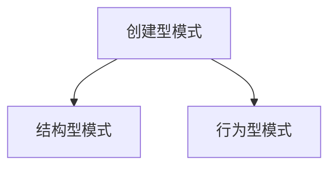

                 

# 设计模式：解决常见软件设计问题

> **关键词**：设计模式、软件设计、可维护性、可扩展性、创建型模式、结构型模式、行为型模式

> **摘要**：设计模式是软件工程中的一种重要概念，它提供了一套被验证过的、高效的解决方案，用于解决软件开发中常见的问题。本文将详细介绍设计模式的基本概念、分类、核心原理和应用场景，并通过实际项目案例来展示如何在实际开发中使用设计模式，以提升软件的架构质量和可维护性。

### 目录大纲

# 《设计模式：解决常见软件设计问题》

## 第一部分：设计模式概述

### 第1章：设计模式的基础知识

- **1.1 什么是设计模式**
- **1.2 设计模式的目的和作用**
- **1.3 设计模式的基本类型**

### 第2章：创建型模式

- **2.1 单例模式**
  - **2.1.1 单例模式的定义**
  - **2.1.2 单例模式的应用场景**
  - **2.1.3 单例模式的实现**

- **2.2 工厂方法模式**
  - **2.2.1 工厂方法模式的定义**
  - **2.2.2 工厂方法模式的应用场景**
  - **2.2.3 工厂方法模式的实现**

- **2.3 抽象工厂模式**
  - **2.3.1 抽象工厂模式的定义**
  - **2.3.2 抽象工厂模式的应用场景**
  - **2.3.3 抽象工厂模式的实现**

- **2.4 建造者模式**
  - **2.4.1 建造者模式的定义**
  - **2.4.2 建造者模式的应用场景**
  - **2.4.3 建造者模式的实现**

- **2.5 原型模式**
  - **2.5.1 原型模式的定义**
  - **2.5.2 原型模式的应用场景**
  - **2.5.3 原型模式的实现**

## 第二部分：结构型模式

### 第3章：适配器模式

- **3.1 适配器模式的定义**
- **3.2 适配器模式的应用场景**
- **3.3 适配器模式的实现**

### 第4章：装饰器模式

- **4.1 装饰器模式的定义**
- **4.2 装饰器模式的应用场景**
- **4.3 装饰器模式的实现**

### 第5章：代理模式

- **5.1 代理模式的定义**
- **5.2 代理模式的应用场景**
- **5.3 代理模式的实现**

### 第6章：外观模式

- **6.1 外观模式的定义**
- **6.2 外观模式的应用场景**
- **6.3 外观模式的实现**

### 第7章：桥接模式

- **7.1 桥接模式的定义**
- **7.2 桥接模式的应用场景**
- **7.3 桥接模式的实现**

### 第8章：组合模式

- **8.1 组合模式的定义**
- **8.2 组合模式的应用场景**
- **8.3 组合模式的实现**

### 第9章：享元模式

- **9.1 享元模式的定义**
- **9.2 享元模式的应用场景**
- **9.3 享元模式的实现**

## 第三部分：行为型模式

### 第10章：策略模式

- **10.1 策略模式的定义**
- **10.2 策略模式的应用场景**
- **10.3 策略模式的实现**

### 第11章：模板方法模式

- **11.1 模板方法模式的定义**
- **11.2 模板方法模式的应用场景**
- **11.3 模板方法模式的实现**

### 第12章：命令模式

- **12.1 命令模式的定义**
- **12.2 命令模式的应用场景**
- **12.3 命令模式的实现**

### 第13章：解释器模式

- **13.1 解释器模式的定义**
- **13.2 解释器模式的应用场景**
- **13.3 解释器模式的实现**

### 第14章：迭代器模式

- **14.1 迭代器模式的定义**
- **14.2 迭代器模式的应用场景**
- **14.3 迭代器模式的实现**

### 第15章：中介者模式

- **15.1 中介者模式的定义**
- **15.2 中介者模式的应用场景**
- **15.3 中介者模式的实现**

### 第16章：观察者模式

- **16.1 观察者模式的定义**
- **16.2 观察者模式的应用场景**
- **16.3 观察者模式的实现**

### 第17章：状态模式

- **17.1 状态模式的定义**
- **17.2 状态模式的应用场景**
- **17.3 状态模式的实现**

## 附录

### 附录A：设计模式实用工具

- **A.1 设计模式工具介绍**
- **A.2 设计模式工具使用指南**
- **A.3 设计模式工具资源链接**

### 第1章：设计模式的基础知识

#### 1.1 什么是设计模式

设计模式（Design Pattern）是软件开发中的一种最佳实践，它描述了在特定场景下解决常见问题的通用解决方案。设计模式不仅提供了具体的实现策略，还包含了这些策略背后的设计原则和原理。

设计模式起源于建筑学，例如桥梁模式（Bridge Pattern）就借鉴了桥梁的设计理念。在软件工程中，设计模式被广泛应用于面向对象编程中，以解决特定类型的问题。

设计模式的主要特征包括：

- **通用性**：设计模式是通用的，可以应用于不同的编程语言和环境中。
- **复用性**：设计模式提供了可复用的解决方案，减少了重复代码的编写。
- **灵活性**：设计模式提供了灵活的设计，使得软件可以更轻松地适应未来的变化。

#### 1.2 设计模式的目的和作用

设计模式的主要目的是提高软件的可维护性和可扩展性，其主要作用包括：

- **代码复用**：设计模式提供了通用的解决方案，可以减少重复代码的编写，提高代码的复用性。
- **降低复杂性**：设计模式可以帮助开发者更好地管理软件的复杂性，使得系统结构更加清晰。
- **提高可扩展性**：设计模式提供了可扩展的架构，使得软件可以更轻松地适应未来的变化。

通过设计模式，开发者可以遵循一套被验证过的最佳实践，从而提高代码的质量和效率。

#### 1.3 设计模式的基本类型

设计模式主要分为三大类：创建型模式、结构型模式、行为型模式。

1. **创建型模式**：用于对象的创建，主要包括单例模式、工厂方法模式、抽象工厂模式、建造者模式、原型模式。

2. **结构型模式**：用于组合类和对象，主要包括适配器模式、装饰器模式、代理模式、外观模式、桥接模式、组合模式、享元模式。

3. **行为型模式**：用于描述对象之间的交互，主要包括策略模式、模板方法模式、命令模式、解释器模式、迭代器模式、中介者模式、观察者模式、状态模式。

Mermaid 流程图：



### 第2章：创建型模式

创建型模式主要关注对象的创建过程，主要分为以下五种：

#### 2.1 单例模式

单例模式确保一个类只有一个实例，并提供一个全局访问点。

##### 2.1.1 单例模式的定义

单例模式是一种创建型模式，它确保一个类只有一个实例，并提供一个全局访问点。单例模式的主要特点是：

- **全局访问点**：所有请求都要通过这个全局访问点来获取实例。
- **唯一实例**：在整个系统中，单例类只能有一个实例。

单例模式的实现通常包括以下三个关键部分：

- **私有构造函数**：防止其他类通过直接实例化来创建单例类的实例。
- **静态成员变量**：用于保存单例类的唯一实例。
- **静态访问方法**：提供全局访问点，用于获取单例类的实例。

以下是一个简单的单例模式实现：

```python
class Singleton:
    _instance = None
    
    def __new__(cls, *args, **kwargs):
        if cls._instance is None:
            cls._instance = super().__new__(cls, *args, **kwargs)
        return cls._instance

singleton1 = Singleton()
singleton2 = Singleton()
print(singleton1 is singleton2)  # True
```

在上面的代码中，`Singleton` 类的构造函数被重写，通过静态成员变量 `_instance` 来保证只有一个实例。`__new__` 方法用于创建实例，当第一次创建实例时，会将实例存储在 `_instance` 中，之后的创建请求都会返回这个存储的实例。

##### 2.1.2 单例模式的应用场景

单例模式适用于以下场景：

- **资源管理**：例如数据库连接、文件操作等，确保只有一个实例来管理资源。
- **系统配置**：例如系统设置、日志管理等，确保配置的一致性和唯一性。
- **工具类**：例如日志工具、缓存工具等，确保工具类的高效使用。

##### 2.1.3 单例模式的实现

单例模式的实现通常有以下几种方法：

1. **懒汉式（懒加载）**：

   ```python
   class Singleton:
       _instance = None
       
       def __new__(cls, *args, **kwargs):
           if cls._instance is None:
               cls._instance = super().__new__(cls, *args, **kwargs)
           return cls._instance

   singleton1 = Singleton()
   singleton2 = Singleton()
   print(singleton1 is singleton2)  # True
   ```

   这种方法在第一次使用时才会创建实例，称为“懒汉式”单例。

2. **饿汉式（饿加载）**：

   ```python
   class Singleton:
       _instance = Singleton()
       
       def __new__(cls, *args, **kwargs):
           return cls._instance

   singleton1 = Singleton()
   singleton2 = Singleton()
   print(singleton1 is singleton2)  # True
   ```

   这种方法在类加载时就会创建实例，称为“饿汉式”单例。

3. **静态内部类**：

   ```python
   class Singleton:
       class _Singleton:
           def __init__(self):
               pass
           
           @property
           def instance(self):
               if not hasattr(_Singleton, "_instance"):
                   _Singleton._instance = _Singleton()
               return _Singleton._instance

   singleton1 = Singleton().instance
   singleton2 = Singleton().instance
   print(singleton1 is singleton2)  # True
   ```

   这种方法通过静态内部类来实现单例，外部无法直接访问内部类，保证了单例的实现。

4. **枚举**：

   ```python
   class Singleton(Enum):
       INSTANCE = "INSTANCE"

   singleton = Singleton.INSTANCE.value
   print(Singleton.INSTANCE == Singleton.INSTANCE)  # True
   ```

   这种方法使用枚举来实现单例，具有天然的线程安全。

### 第3章：结构型模式

结构型模式主要关注类和对象之间的组合，主要分为以下七种：

#### 3.1 适配器模式

适配器模式将一个类的接口转换成客户期望的另一个接口。

##### 3.1.1 适配器模式的定义

适配器模式（Adapter Pattern）是一种结构型设计模式，它允许将一个类的接口转换成客户希望的另一个接口。适配器模式的主要特点是：

- **适配**：将一个类的接口转换成客户希望的另一个接口。
- **兼容**：使得原本接口不兼容的类可以一起工作。

适配器模式的主要组成部分包括：

- **Adaptee（适配者）**：被适配的类。
- **Adapter（适配器）**：适配者接口的实现类，将适配者的接口转换成客户期望的接口。
- **Client（客户）**：使用适配器的类。

以下是一个简单的适配器模式实现：

```python
class Adaptee:
    def specific_api(self):
        print("Adaptee's specific API")

class Adapter(Adaptee):
    def __init__(self, adaptee):
        self._adaptee = adaptee

    def adapter_api(self):
        self._adaptee.specific_api()

adaptee = Adaptee()
adapter = Adapter(adaptee)
adapter.adapter_api()  # Adaptee's specific API
```

在上面的代码中，`Adapter` 类实现了适配器模式，它持有 `Adaptee` 类的实例，并将 `Adaptee` 的接口转换为 `Adapter` 的接口。

##### 3.1.2 适配器模式的应用场景

适配器模式适用于以下场景：

- **类之间的接口转换**：例如，将一个类的接口转换为另一个类的接口，使得它们可以协同工作。
- **旧接口与新接口的兼容**：例如，当旧系统需要与新系统交互时，可以使用适配器模式来实现。
- **扩展功能**：例如，在原有类的基础上添加新功能，而不修改原有类的代码。

##### 3.1.3 适配器模式的实现

适配器模式的实现通常有以下几种方法：

1. **类适配器**：

   ```python
   class Adaptee:
       def specific_api(self):
           print("Adaptee's specific API")

   class Adapter(Adaptee):
       def __init__(self, adaptee):
           self._adaptee = adaptee

       def another_api(self):
           print("Adapter's another API")

   adaptee = Adaptee()
   adapter = Adapter(adaptee)
   adapter.specific_api()  # Adaptee's specific API
   adapter.another_api()  # Adapter's another API
   ```

   这种方法使用继承来实现适配器，适用于适配者类和适配器类接口比较相似的情况。

2. **对象适配器**：

   ```python
   class Adaptee:
       def specific_api(self):
           print("Adaptee's specific API")

   class Adapter:
       def __init__(self, adaptee):
           self._adaptee = adaptee

       def another_api(self):
           print("Adapter's another API")

       def specific_api(self):
           self._adaptee.specific_api()

   adaptee = Adaptee()
   adapter = Adapter(adaptee)
   adapter.specific_api()  # Adaptee's specific API
   adapter.another_api()  # Adapter's another API
   ```

   这种方法使用组合来实现适配器，适用于适配者类和适配器类接口差异较大的情况。

### 第4章：装饰器模式

装饰器模式动态地给一个对象增加一些额外的职责，而不改变其接口。

##### 4.1 装饰器模式的定义

装饰器模式（Decorator Pattern）是一种结构型设计模式，它允许动态地给一个对象添加一些额外的职责，而不改变其接口。装饰器模式的主要特点是：

- **动态性**：装饰器可以在运行时动态地添加或删除功能。
- **透明性**：装饰器对象和被装饰对象接口一致，不会影响到其他对象。

装饰器模式的主要组成部分包括：

- **Component（组件）**：被装饰的类。
- **Decorator（装饰器）**：装饰类的接口，包含装饰方法和被装饰类的方法。
- **Client（客户）**：使用装饰器的类。

以下是一个简单的装饰器模式实现：

```python
class Component:
    def operation(self):
        pass

class ConcreteComponent(Component):
    def operation(self):
        print("ConcreteComponent's operation")

class Decorator(Component):
    def __init__(self, component):
        self._component = component

    def operation(self):
        self._component.operation()
        self.added_behavior()

class ConcreteDecoratorA(Decorator):
    def added_behavior(self):
        print("Additional behavior A")

class ConcreteDecoratorB(Decorator):
    def added_behavior(self):
        print("Additional behavior B")

component = ConcreteComponent()
component.operation()  # ConcreteComponent's operation

decorator_a = ConcreteDecoratorA(component)
decorator_a.operation()  # ConcreteComponent's operation Additional behavior A

decorator_b = ConcreteDecoratorB(component)
decorator_b.operation()  # ConcreteComponent's operation Additional behavior B
```

在上面的代码中，`Decorator` 类实现了装饰器模式，它持有 `Component` 类的实例，并在其基础上添加了额外行为。`ConcreteDecoratorA` 和 `ConcreteDecoratorB` 类分别实现了额外的行为。

##### 4.1.2 装饰器模式的应用场景

装饰器模式适用于以下场景：

- **日志记录**：为对象添加日志记录功能。
- **权限控制**：为对象添加权限验证功能。
- **性能监控**：为对象添加性能监控功能。
- **功能扩展**：为对象添加额外的功能。

##### 4.1.3 装饰器模式的实现

装饰器模式的实现通常有以下几种方法：

1. **函数装饰器**：

   ```python
   def decorator(func):
       def wrapper(*args, **kwargs):
           print("Before function execution")
           result = func(*args, **kwargs)
           print("After function execution")
           return result
       
       return wrapper

   @decorator
   def function_to_decorate():
       print("Function to decorate")
   
   function_to_decorate()  # Before function execution Function to decorate After function execution
   ```

   这种方法使用函数装饰器来动态添加功能。

2. **类装饰器**：

   ```python
   class decorator:
       def __init__(self, func):
           self._func = func

       def __call__(self, *args, **kwargs):
           print("Before class method execution")
           result = self._func(*args, **kwargs)
           print("After class method execution")
           return result
   
   class MyClass:
       @decorator
       def my_method(self):
           print("MyClass's method")
   
   obj = MyClass()
   obj.my_method()  # Before class method execution MyClass's method After class method execution
   ```

   这种方法使用类装饰器来动态添加功能。

### 第5章：代理模式

代理模式为一个对象提供一种代理以控制对这个对象的访问。

##### 5.1 代理模式的定义

代理模式（Proxy Pattern）是一种行为型设计模式，它为其他对象提供一个代理以控制对这个对象的访问。代理模式的主要特点是：

- **代理**：代理对象负责请求的处理，可以控制对真实对象的访问。
- **职责分离**：代理对象可以添加额外的功能，例如日志记录、安全验证等。

代理模式的主要组成部分包括：

- **Proxy（代理）**：代理类的接口，用于代替真实对象。
- **RealSubject（真实主题）**：真实对象的接口，被代理的对象。
- **Client（客户）**：使用代理对象的类。

以下是一个简单的代理模式实现：

```python
class RealSubject:
    def request(self):
        print("RealSubject's request")

class Proxy(RealSubject):
    def __init__(self, real_subject):
        self._real_subject = real_subject

    def request(self):
        print("Before request")
        self._real_subject.request()
        print("After request")

real_subject = RealSubject()
proxy = Proxy(real_subject)
proxy.request()  # Before request RealSubject's request After request
```

在上面的代码中，`Proxy` 类实现了代理模式，它持有 `RealSubject` 类的实例，并在其基础上添加了额外的功能。

##### 5.2 代理模式的应用场景

代理模式适用于以下场景：

- **权限控制**：例如，在系统中实现用户权限验证，只有拥有相应权限的用户才能访问特定资源。
- **日志记录**：例如，在系统中记录每个请求的日志信息，以便后续分析和调试。
- **远程访问**：例如，通过代理实现远程对象的访问，例如通过 HTTP 代理访问网络资源。
- **性能优化**：例如，通过代理实现缓存机制，减少对后端系统的访问压力。

##### 5.3 代理模式的实现

代理模式的实现通常有以下几种方法：

1. **简单代理**：

   ```python
   class Proxy(RealSubject):
       def request(self):
           print("Before request")
           self._real_subject.request()
           print("After request")
   
   real_subject = RealSubject()
   proxy = Proxy(real_subject)
   proxy.request()  # Before request RealSubject's request After request
   ```

   这种方法是最简单的代理实现，直接在代理类中调用真实对象的接口。

2. **动态代理**：

   ```python
   import prox

   class Proxy:
       def __init__(self, real_subject):
           self._real_subject = real_subject

       def request(self):
           print("Before request")
           result = self._real_subject.request()
           print("After request")
           return result

   real_subject = RealSubject()
   proxy = prox.Proxy(Proxy, real_subject)
   proxy.request()  # Before request RealSubject's request After request
   ```

   这种方法使用动态代理，通过代理类来实现代理功能。

### 第6章：外观模式

外观模式提供了一个统一的接口，用于访问子系统中的一组接口。

##### 6.1 外观模式的定义

外观模式（Facade Pattern）是一种结构型设计模式，它提供了一个统一的接口，用于访问子系统中的一组接口。外观模式的主要特点是：

- **统一接口**：通过外观模式，客户只需要与一个统一接口交互，无需了解子系统内部的复杂性。
- **简化使用**：外观模式简化了系统的使用，使得客户可以更轻松地使用子系统。

外观模式的主要组成部分包括：

- **Facade（外观）**：外观类的接口，用于统一访问子系统。
- **Subsystem（子系统）**：子系统的接口，外观类所包含的组件。
- **Client（客户）**：使用外观模式的类。

以下是一个简单的外观模式实现：

```python
class SubsystemA:
    def operation_a(self):
        print("SubsystemA's operation A")

class SubsystemB:
    def operation_b(self):
        print("SubsystemB's operation B")

class Facade:
    def __init__(self):
        self._ subsystem_a = SubsystemA()
        self._ subsystem_b = SubsystemB()

    def operation(self):
        self._ subsystem_a.operation_a()
        self._ subsystem_b.operation_b()

client = Facade()
client.operation()  # SubsystemA's operation A SubsystemB's operation B
```

在上面的代码中，`Facade` 类实现了外观模式，它包含了两个子系统 `SubsystemA` 和 `SubsystemB`，并提供了统一的接口 `operation`。

##### 6.2 外观模式的应用场景

外观模式适用于以下场景：

- **复杂系统**：当系统非常复杂，客户需要与多个子系统交互时，可以使用外观模式简化使用。
- **子系统协作**：当子系统需要协同工作，但客户不关心子系统内部的细节时，可以使用外观模式。
- **简化开发**：在开发过程中，当客户需要快速访问子系统时，可以使用外观模式简化开发。

##### 6.3 外观模式的实现

外观模式的实现通常有以下几种方法：

1. **直接实现**：

   ```python
   class Facade:
       def __init__(self):
           self._ subsystem_a = SubsystemA()
           self._ subsystem_b = SubsystemB()

       def operation(self):
           self._ subsystem_a.operation_a()
           self._ subsystem_b.operation_b()

   client = Facade()
   client.operation()  # SubsystemA's operation A SubsystemB's operation B
   ```

   这种方法直接在外观类中实现子系统接口，适用于子系统接口简单且稳定的情况。

2. **工厂方法**：

   ```python
   class Facade:
       @staticmethod
       def create():
           subsystem_a = SubsystemA()
           subsystem_b = SubsystemB()
           return Facade(subsystem_a, subsystem_b)

       def __init__(self, subsystem_a, subsystem_b):
           self._ subsystem_a = subsystem_a
           self._ subsystem_b = subsystem_b

       def operation(self):
           self._ subsystem_a.operation_a()
           self._ subsystem_b.operation_b()

   client = Facade.create()
   client.operation()  # SubsystemA's operation A SubsystemB's operation B
   ```

   这种方法使用工厂方法来创建外观对象，适用于子系统接口复杂且需要动态配置的情况。

### 第7章：桥接模式

桥接模式将抽象部分与实现部分分离，使它们都可以独立地变化。

##### 7.1 桥接模式的定义

桥接模式（Bridge Pattern）是一种结构型设计模式，它将抽象部分与实现部分分离，使它们都可以独立地变化。桥接模式的主要特点是：

- **分离抽象与实现**：通过桥接模式，可以将抽象部分和实现部分分离，使得它们可以独立地变化。
- **多态性**：桥接模式提供了多态性，使得抽象部分可以与不同的实现部分组合。

桥接模式的主要组成部分包括：

- **Abstraction（抽象部分）**：抽象类的接口，定义抽象部分和实现部分的抽象接口。
- **RefinedAbstraction（扩展抽象部分）**：抽象类的子类，扩展抽象部分的功能。
- **Implementor（实现部分）**：实现类的接口，定义实现部分的具体实现。
- **ConcreteImplementor（扩展实现部分）**：实现类的子类，扩展实现部分的功能。

以下是一个简单的桥接模式实现：

```python
class Implementor:
    def operation_implementor(self):
        pass

class ConcreteImplementorA(Implementor):
    def operation_implementor(self):
        print("ConcreteImplementorA's operation")

class ConcreteImplementorB(Implementor):
    def operation_implementor(self):
        print("ConcreteImplementorB's operation")

class Abstraction:
    def __init__(self, implementor):
        self._implementor = implementor

    def operation(self):
        self._implementor.operation_implementor()

class RefinedAbstraction(Abstraction):
    def operation(self):
        self._implementor.operation_implementor()
        print("Additional operation in RefinedAbstraction")

refined_abstraction = RefinedAbstraction(ConcreteImplementorA())
refined_abstraction.operation()  # ConcreteImplementorA's operation Additional operation in RefinedAbstraction

refined_abstraction = RefinedAbstraction(ConcreteImplementorB())
refined_abstraction.operation()  # ConcreteImplementorB's operation Additional operation in RefinedAbstraction
```

在上面的代码中，`Abstraction` 类定义了抽象部分和实现部分的接口，`RefinedAbstraction` 类扩展了抽象部分的功能，`Implementor` 类定义了实现部分的具体实现，`ConcreteImplementorA` 和 `ConcreteImplementorB` 类扩展了实现部分的功能。

##### 7.2 桥接模式的应用场景

桥接模式适用于以下场景：

- **多态性需求**：当系统需要实现多态性，且抽象部分和实现部分都可能发生变化时，可以使用桥接模式。
- **分离抽象与实现**：当需要将抽象部分和实现部分分离，使得它们可以独立地变化时，可以使用桥接模式。
- **灵活的组合**：当系统需要灵活地组合不同的抽象部分和实现部分时，可以使用桥接模式。

##### 7.3 桥接模式的实现

桥接模式的实现通常有以下几种方法：

1. **直接实现**：

   ```python
   class Implementor:
       def operation_implementor(self):
           pass

   class ConcreteImplementorA(Implementor):
       def operation_implementor(self):
           print("ConcreteImplementorA's operation")

   class ConcreteImplementorB(Implementor):
       def operation_implementor(self):
           print("ConcreteImplementorB's operation")

   class Abstraction:
       def __init__(self, implementor):
           self._implementor = implementor

       def operation(self):
           self._implementor.operation_implementor()

   class RefinedAbstraction(Abstraction):
       def operation(self):
           self._implementor.operation_implementor()
           print("Additional operation in RefinedAbstraction")

   refined_abstraction = RefinedAbstraction(ConcreteImplementorA())
   refined_abstraction.operation()  # ConcreteImplementorA's operation Additional operation in RefinedAbstraction

   refined_abstraction = RefinedAbstraction(ConcreteImplementorB())
   refined_abstraction.operation()  # ConcreteImplementorB's operation Additional operation in RefinedAbstraction
   ```

   这种方法直接在类中实现桥接模式，适用于简单场景。

2. **工厂方法**：

   ```python
   class Implementor:
       def operation_implementor(self):
           pass

   class ConcreteImplementorA(Implementor):
       def operation_implementor(self):
           print("ConcreteImplementorA's operation")

   class ConcreteImplementorB(Implementor):
       def operation_implementor(self):
           print("ConcreteImplementorB's operation")

   class Abstraction:
       def __init__(self, implementor):
           self._implementor = implementor

       def operation(self):
           self._implementor.operation_implementor()

   class RefinedAbstraction(Abstraction):
       def operation(self):
           self._implementor.operation_implementor()
           print("Additional operation in RefinedAbstraction")

   class ImplementorFactory:
       @staticmethod
       def create_implementor():
           return ConcreteImplementorA()

   refined_abstraction = RefinedAbstraction(ImplementorFactory.create_implementor())
   refined_abstraction.operation()  # ConcreteImplementorA's operation Additional operation in RefinedAbstraction

   ImplementorFactory.create_implementor = lambda: ConcreteImplementorB()
   refined_abstraction = RefinedAbstraction(ImplementorFactory.create_implementor())
   refined_abstraction.operation()  # ConcreteImplementorB's operation Additional operation in RefinedAbstraction
   ```

   这种方法使用工厂方法来创建实现部分，适用于实现部分需要动态切换的场景。

### 第8章：组合模式

组合模式将对象组合成树形结构以表示“部分-整体”的层次结构。

##### 8.1 组合模式的定义

组合模式（Composite Pattern）是一种结构型设计模式，它将对象组合成树形结构以表示“部分-整体”的层次结构。组合模式的主要特点是：

- **树形结构**：组合模式将对象组合成树形结构，使得单个对象和组合对象具有一致的接口。
- **部分-整体**：组合模式可以表示单个对象和组合对象之间的部分-整体关系。

组合模式的主要组成部分包括：

- **Component（组件）**：定义组件的接口，可以是单个对象或组合对象。
- **Leaf（叶子）**：表示单个对象，实现组件接口。
- **Composite（组合对象）**：表示组合对象，包含多个组件对象。

以下是一个简单的组合模式实现：

```python
class Component:
    def add(self, component):
        pass

    def remove(self, component):
        pass

    def operation(self):
        pass

class Leaf(Component):
    def add(self, component):
        print("Cannot add to a leaf")

    def remove(self, component):
        print("Cannot remove from a leaf")

    def operation(self):
        print("Leaf's operation")

class Composite(Component):
    def __init__(self):
        self._components = []

    def add(self, component):
        self._components.append(component)

    def remove(self, component):
        self._components.remove(component)

    def operation(self):
        for component in self._components:
            component.operation()

composite = Composite()
composite.add(Leaf())
composite.add(Leaf())
composite.operation()  # Leaf's operation Leaf's operation
```

在上面的代码中，`Composite` 类实现了组合模式，它包含了多个组件对象，并提供了统一的接口。`Leaf` 类表示单个对象，实现了组件接口。

##### 8.2 组合模式的应用场景

组合模式适用于以下场景：

- **树形结构**：当系统具有树形结构时，可以使用组合模式来表示。
- **部分-整体**：当需要表示部分-整体关系时，可以使用组合模式。
- **动态组合**：当需要动态地添加或移除组件时，可以使用组合模式。

##### 8.3 组合模式的实现

组合模式的实现通常有以下几种方法：

1. **递归实现**：

   ```python
   class Component:
       def add(self, component):
           print("Cannot add to a leaf")

       def remove(self, component):
           print("Cannot remove from a leaf")

       def operation(self):
           print("Leaf's operation")

   class Composite(Component):
       def __init__(self):
           self._components = []

       def add(self, component):
           self._components.append(component)

       def remove(self, component):
           self._components.remove(component)

       def operation(self):
           for component in self._components:
               component.operation()

   composite = Composite()
   composite.add(Leaf())
   composite.add(Composite())
   composite.operation()  # Leaf's operation Composite's operation
   ```

   这种方法使用递归实现组合模式，适用于简单的场景。

2. **迭代器实现**：

   ```python
   class Component:
       def add(self, component):
           print("Cannot add to a leaf")

       def remove(self, component):
           print("Cannot remove from a leaf")

       def operation(self):
           print("Leaf's operation")

   class Composite(Component):
       def __init__(self):
           self._components = []

       def add(self, component):
           self._components.append(component)

       def remove(self, component):
           self._components.remove(component)

       def operation(self):
           for component in self._components:
               component.operation()

       def iterator(self):
           return iter(self._components)

   composite = Composite()
   composite.add(Leaf())
   composite.add(Composite())
   for component in composite.iterator():
       component.operation()  # Leaf's operation Composite's operation
   ```

   这种方法使用迭代器实现组合模式，适用于复杂的场景。

### 第9章：享元模式

享元模式使用共享对象可有效地支持大量细粒度的对象。

##### 9.1 享元模式的定义

享元模式（Flyweight Pattern）是一种结构型设计模式，它使用共享对象来有效地支持大量细粒度的对象。享元模式的主要特点是：

- **共享对象**：享元模式通过共享对象来减少对象的创建数量，从而降低系统的内存占用。
- **细粒度**：享元模式支持大量细粒度的对象，从而提高了系统的性能和可扩展性。

享元模式的主要组成部分包括：

- **Flyweight（享元）**：表示共享的对象，包含外部状态和内部状态。
- **FlyweightFactory（享元工厂）**：用于创建和管理享元对象。
- **Client（客户）**：使用享元对象的类。

以下是一个简单的享元模式实现：

```python
class Flyweight:
    def operation(self, extrinsic_state):
        pass

class ConcreteFlyweight(Flyweight):
    def __init__(self, intrinsic_state):
        self._intrinsic_state = intrinsic_state

    def operation(self, extrinsic_state):
        print(f"Intrinsic state: {self._intrinsic_state}")
        print(f"Extrinsic state: {extrinsic_state}")

class FlyweightFactory:
    def __init__(self):
        self._flyweights = {}

    def get_flyweight(self, key):
        if key not in self._flyweights:
            flyweight = ConcreteFlyweight(key)
            self._flyweights[key] = flyweight
        return self._flyweights[key]

factory = FlyweightFactory()
flyweight1 = factory.get_flyweight("Key1")
flyweight2 = factory.get_flyweight("Key1")
flyweight1.operation("Extrinsic State 1")  # Intrinsic state: Key1 Extrinsic state: Extrinsic State 1
flyweight2.operation("Extrinsic State 2")  # Intrinsic state: Key1 Extrinsic state: Extrinsic State 2
```

在上面的代码中，`FlyweightFactory` 类实现了享元模式，它创建了 `ConcreteFlyweight` 类的实例，并将它们存储在内部。`get_flyweight` 方法用于获取享元对象，如果不存在，则创建并存储。

##### 9.2 享元模式的应用场景

享元模式适用于以下场景：

- **大量对象**：当系统中存在大量细粒度对象时，可以使用享元模式来减少对象的创建数量，降低内存占用。
- **共享资源**：当需要共享一些资源，例如数据库连接、文件操作等时，可以使用享元模式来优化资源的使用。
- **性能优化**：当系统的性能需要优化时，可以使用享元模式来减少对象的创建数量，提高系统性能。

##### 9.3 享元模式的实现

享元模式的实现通常有以下几种方法：

1. **直接实现**：

   ```python
   class Flyweight:
       def operation(self, extrinsic_state):
           pass

   class ConcreteFlyweight(Flyweight):
       def __init__(self, intrinsic_state):
           self._intrinsic_state = intrinsic_state

       def operation(self, extrinsic_state):
           print(f"Intrinsic state: {self._intrinsic_state}")
           print(f"Extrinsic state: {extrinsic_state}")

   class FlyweightFactory:
       def __init__(self):
           self._flyweights = {}

       def get_flyweight(self, key):
           if key not in self._flyweights:
               flyweight = ConcreteFlyweight(key)
               self._flyweights[key] = flyweight
           return self._flyweights[key]

   factory = FlyweightFactory()
   flyweight1 = factory.get_flyweight("Key1")
   flyweight2 = factory.get_flyweight("Key1")
   flyweight1.operation("Extrinsic State 1")  # Intrinsic state: Key1 Extrinsic state: Extrinsic State 1
   flyweight2.operation("Extrinsic State 2")  # Intrinsic state: Key1 Extrinsic state: Extrinsic State 2
   ```

   这种方法直接实现享元模式，适用于简单的场景。

2. **工厂方法**：

   ```python
   class Flyweight:
       def operation(self, extrinsic_state):
           pass

   class ConcreteFlyweight(Flyweight):
       def __init__(self, intrinsic_state):
           self._intrinsic_state = intrinsic_state

       def operation(self, extrinsic_state):
           print(f"Intrinsic state: {self._intrinsic_state}")
           print(f"Extrinsic state: {extrinsic_state}")

   class FlyweightFactory:
       def __init__(self):
           self._flyweights = {}

       def get_flyweight(self, key):
           if key not in self._flyweights:
               flyweight = ConcreteFlyweight(key)
               self._flyweights[key] = flyweight
           return self._flyweights[key]

       @staticmethod
       def create():
           return ConcreteFlyweight("Intrinsic State")

   factory = FlyweightFactory()
   flyweight1 = factory.get_flyweight("Key1")
   flyweight2 = factory.get_flyweight("Key1")
   flyweight1.operation("Extrinsic State 1")  # Intrinsic state: Intrinsic State Extrinsic state: Extrinsic State 1
   flyweight2.operation("Extrinsic State 2")  # Intrinsic state: Intrinsic State Extrinsic state: Extrinsic State 2
   ```

   这种方法使用工厂方法来创建享元对象，适用于需要动态创建的场景。

### 第10章：策略模式

策略模式定义了算法家族，分别封装起来，让它们之间可以互相替换，此模式让算法的变化不会影响到使用算法的用户。

##### 10.1 策略模式的定义

策略模式（Strategy Pattern）是一种行为型设计模式，它定义了算法家族，分别封装起来，让它们之间可以互相替换，此模式让算法的变化不会影响到使用算法的用户。策略模式的主要特点是：

- **算法封装**：策略模式将算法封装在独立的类中，使得算法可以独立变化。
- **可替换性**：策略模式允许算法之间可以互相替换，从而实现不同的策略。

策略模式的主要组成部分包括：

- **Strategy（策略）**：定义算法的接口，包含算法的方法。
- **ConcreteStrategyA、ConcreteStrategyB（具体策略）**：实现具体的算法。
- **Context（上下文）**：使用策略模式的类，包含策略对象的引用。

以下是一个简单的策略模式实现：

```python
class Strategy:
    def algorithm_interface(self):
        pass

class ConcreteStrategyA(Strategy):
    def algorithm_interface(self):
        print("Using ConcreteStrategyA's algorithm")

class ConcreteStrategyB(Strategy):
    def algorithm_interface(self):
        print("Using ConcreteStrategyB's algorithm")

class Context:
    def __init__(self, strategy):
        self._strategy = strategy

    def set_strategy(self, strategy):
        self._strategy = strategy

    def execute_strategy(self):
        self._strategy.algorithm_interface()

context = Context(ConcreteStrategyA())
context.execute_strategy()  # Using ConcreteStrategyA's algorithm

context.set_strategy(ConcreteStrategyB())
context.execute_strategy()  # Using ConcreteStrategyB's algorithm
```

在上面的代码中，`Strategy` 类定义了算法的接口，`ConcreteStrategyA` 和 `ConcreteStrategyB` 类实现了具体的算法，`Context` 类使用了策略模式，可以通过设置不同的策略来改变算法的行为。

##### 10.2 策略模式的应用场景

策略模式适用于以下场景：

- **算法策略变化**：当算法需要根据不同情况动态变化时，可以使用策略模式。
- **策略组合**：当需要组合多个策略时，可以使用策略模式。
- **策略优化**：当需要优化算法时，可以使用策略模式来替换原有算法。

##### 10.3 策略模式的实现

策略模式的实现通常有以下几种方法：

1. **直接实现**：

   ```python
   class Strategy:
       def algorithm_interface(self):
           pass

   class ConcreteStrategyA(Strategy):
       def algorithm_interface(self):
           print("Using ConcreteStrategyA's algorithm")

   class ConcreteStrategyB(Strategy):
       def algorithm_interface(self):
           print("Using ConcreteStrategyB's algorithm")

   class Context:
       def __init__(self, strategy):
           self._strategy = strategy

       def set_strategy(self, strategy):
           self._strategy = strategy

       def execute_strategy(self):
           self._strategy.algorithm_interface()

   context = Context(ConcreteStrategyA())
   context.execute_strategy()  # Using ConcreteStrategyA's algorithm

   context.set_strategy(ConcreteStrategyB())
   context.execute_strategy()  # Using ConcreteStrategyB's algorithm
   ```

   这种方法直接实现策略模式，适用于简单的场景。

2. **工厂方法**：

   ```python
   class Strategy:
       def algorithm_interface(self):
           pass

   class ConcreteStrategyA(Strategy):
       def algorithm_interface(self):
           print("Using ConcreteStrategyA's algorithm")

   class ConcreteStrategyB(Strategy):
       def algorithm_interface(self):
           print("Using ConcreteStrategyB's algorithm")

   class Context:
       def __init__(self, strategy):
           self._strategy = strategy

       def set_strategy(self, strategy):
           self._strategy = strategy

       def execute_strategy(self):
           self._strategy.algorithm_interface()

   class StrategyFactory:
       @staticmethod
       def create_strategy(strategy_type):
           if strategy_type == "A":
               return ConcreteStrategyA()
           elif strategy_type == "B":
               return ConcreteStrategyB()
           else:
               raise ValueError("Invalid strategy type")

   context = Context(StrategyFactory.create_strategy("A"))
   context.execute_strategy()  # Using ConcreteStrategyA's algorithm

   context.set_strategy(StrategyFactory.create_strategy("B"))
   context.execute_strategy()  # Using ConcreteStrategyB's algorithm
   ```

   这种方法使用工厂方法来创建策略对象，适用于需要动态创建的场景。

### 第11章：模板方法模式

模板方法模式定义一个操作中的算法的骨架，而将一些步骤延迟到子类中，子类可以重定义模板方法中定义的一个或多个步骤点。

##### 11.1 模板方法模式的定义

模板方法模式（Template Method Pattern）是一种行为型设计模式，它定义一个操作中的算法的骨架，而将一些步骤延迟到子类中，子类可以重定义模板方法中定义的一个或多个步骤点。模板方法模式的主要特点是：

- **算法骨架**：模板方法模式定义了一个算法的基本框架，将一些步骤固定在父类中。
- **步骤延迟**：模板方法模式允许子类在适当的时候重定义一些步骤，从而实现特定的算法。

模板方法模式的主要组成部分包括：

- **AbstractClass（抽象类）**：定义模板方法的框架，包含一个模板方法和一个或多个抽象方法。
- **ConcreteClass（具体类）**：继承自抽象类，重定义抽象方法。
- **Client（客户）**：使用模板方法模式的类。

以下是一个简单的模板方法模式实现：

```python
class AbstractClass:
    def template_method(self):
        self.abstract_method()
        self.concrete_method()

    def abstract_method(self):
        pass

    def concrete_method(self):
        pass

class ConcreteClass(AbstractClass):
    def abstract_method(self):
        print("Abstract method implementation")

    def concrete_method(self):
        print("Concrete method implementation")

concrete = ConcreteClass()
concrete.template_method()  # Abstract method implementation Concrete method implementation
```

在上面的代码中，`AbstractClass` 类定义了模板方法的框架，包含一个模板方法 `template_method` 和一个或多个抽象方法 `abstract_method` 和 `concrete_method`。`ConcreteClass` 类继承自 `AbstractClass` 类，并重定义了抽象方法。

##### 11.2 模板方法模式的应用场景

模板方法模式适用于以下场景：

- **算法骨架**：当算法的基本框架需要固定时，可以使用模板方法模式。
- **步骤延迟**：当算法的一部分步骤需要延迟到子类中实现时，可以使用模板方法模式。
- **代码复用**：当多个子类具有相同的算法框架，但需要实现不同的步骤时，可以使用模板方法模式。

##### 11.3 模板方法模式的实现

模板方法模式的实现通常有以下几种方法：

1. **直接实现**：

   ```python
   class AbstractClass:
       def template_method(self):
           self.abstract_method()
           self.concrete_method()

       def abstract_method(self):
           pass

       def concrete_method(self):
           pass

   class ConcreteClass(AbstractClass):
       def abstract_method(self):
           print("Abstract method implementation")

       def concrete_method(self):
           print("Concrete method implementation")

   concrete = ConcreteClass()
   concrete.template_method()  # Abstract method implementation Concrete method implementation
   ```

   这种方法直接实现模板方法模式，适用于简单的场景。

2. **组合模式**：

   ```python
   class AbstractClass:
       def template_method(self):
           self.abstract_method()
           self.concrete_method()

       def abstract_method(self):
           pass

       def concrete_method(self):
           pass

   class ConcreteClass(AbstractClass):
       def __init__(self):
           self._abstract_method = AbstractMethod()
           self._concrete_method = ConcreteMethod()

       def abstract_method(self):
           self._abstract_method.execute()

       def concrete_method(self):
           self._concrete_method.execute()

   class AbstractMethod:
       def execute(self):
           pass

   class ConcreteMethod(AbstractMethod):
       def execute(self):
           print("Concrete method implementation")

   concrete = ConcreteClass()
   concrete.template_method()  # Concrete method implementation
   ```

   这种方法使用组合模式来实现模板方法模式，适用于复杂的场景。

### 第12章：命令模式

命令模式将请求封装为一个对象，从而可以使用不同的请求、队列或日志来参数化其他对象。

##### 12.1 命令模式的定义

命令模式（Command Pattern）是一种行为型设计模式，它将请求封装为一个对象，从而可以使用不同的请求、队列或日志来参数化其他对象。命令模式的主要特点是：

- **请求封装**：命令模式将请求封装为一个对象，使得请求可以传递、排队、记录等。
- **参数化操作**：命令模式可以使用不同的命令对象来参数化其他对象的行为。

命令模式的主要组成部分包括：

- **Command（命令）**：定义命令的接口，包含执行和撤销操作的方法。
- **ConcreteCommand（具体命令）**：实现命令接口，定义具体的执行和撤销操作。
- **Invoker（调用者）**：包含执行命令的方法，可以发送请求给命令对象。
- **Receiver（接收者）**：定义接收者，负责执行命令操作。

以下是一个简单的命令模式实现：

```python
class Command:
    def execute(self):
        pass

    def undo(self):
        pass

class ConcreteCommand(Command):
    def __init__(self, receiver):
        self._receiver = receiver

    def execute(self):
        self._receiver.action()

    def undo(self):
        self._receiver.undo_action()

class Receiver:
    def action(self):
        print("Receiver's action")

    def undo_action(self):
        print("Receiver's undo action")

class Invoker:
    def __init__(self, command):
        self._command = command

    def execute_command(self):
        self._command.execute()

    def undo_command(self):
        self._command.undo()

receiver = Receiver()
command = ConcreteCommand(receiver)
invoker = Invoker(command)
invoker.execute_command()  # Receiver's action
invoker.undo_command()  # Receiver's undo action
```

在上面的代码中，`Command` 类定义了命令接口，`ConcreteCommand` 类实现了具体的执行和撤销操作，`Receiver` 类定义了接收者，负责执行命令操作。`Invoker` 类包含了执行命令的方法，可以发送请求给命令对象。

##### 12.2 命令模式的应用场景

命令模式适用于以下场景：

- **请求日志**：当需要记录请求日志时，可以使用命令模式。
- **队列处理**：当需要将请求放入队列进行处理时，可以使用命令模式。
- **操作撤销**：当需要实现操作撤销功能时，可以使用命令模式。
- **参数化操作**：当需要参数化操作时，可以使用命令模式。

##### 12.3 命令模式的实现

命令模式的实现通常有以下几种方法：

1. **直接实现**：

   ```python
   class Command:
       def execute(self):
           pass

   class ConcreteCommand(Command):
       def __init__(self, receiver):
           self._receiver = receiver

       def execute(self):
           self._receiver.action()

   class Receiver:
       def action(self):
           print("Receiver's action")

   class Invoker:
       def __init__(self, command):
           self._command = command

       def execute_command(self):
           self._command.execute()

   receiver = Receiver()
   command = ConcreteCommand(receiver)
   invoker = Invoker(command)
   invoker.execute_command()  # Receiver's action
   ```

   这种方法直接实现命令模式，适用于简单的场景。

2. **回调函数**：

   ```python
   class Command:
       def execute(self, callback):
           pass

   class ConcreteCommand(Command):
       def __init__(self, receiver):
           self._receiver = receiver

       def execute(self, callback):
           self._receiver.action(callback)

   class Receiver:
       def action(self, callback):
           print("Receiver's action")
           callback()

   class Invoker:
       def __init__(self, command):
           self._command = command

       def execute_command(self, callback):
           self._command.execute(callback)

   receiver = Receiver()
   command = ConcreteCommand(receiver)
   invoker = Invoker(command)

   def callback():
       print("Callback action")

   invoker.execute_command(callback)  # Receiver's action Callback action
   ```

   这种方法使用回调函数来实现命令模式，适用于复杂的场景。

### 第13章：解释器模式

解释器模式为语言创建解释器，用于解释语句。

##### 13.1 解释器模式的定义

解释器模式（Interpreter Pattern）是一种行为型设计模式，它为语言创建解释器，用于解释语句。解释器模式的主要特点是：

- **解释语句**：解释器模式可以将语言的语句解释为操作，从而实现动态执行。
- **灵活扩展**：解释器模式可以灵活地扩展语言的功能，实现自定义的语法解析。

解释器模式的主要组成部分包括：

- **AbstractExpression（抽象表达式）**：定义解释器接口，包含解释操作的方法。
- **TerminalExpression（终端表达式）**：实现终端表达式，负责解释具体的操作。
- **NonTerminalExpression（非终端表达式）**：实现非终端表达式，负责组合多个表达式。
- **Context（上下文）**：包含解释器的状态，用于传递解释过程中的信息。

以下是一个简单的解释器模式实现：

```python
class AbstractExpression:
    def interpret(self, context):
        pass

class TerminalExpression(AbstractExpression):
    def interpret(self, context):
        if context in self._rules:
            return self._rules[context]
        return "Unknown"

class NonTerminalExpression(AbstractExpression):
    def __init__(self):
        self._sub_expressions = []

    def interpret(self, context):
        result = []
        for sub_expr in self._sub_expressions:
            result.append(sub_expr.interpret(context))
        return " ".join(result)

class Context:
    def __init__(self, rules):
        self._rules = rules

expr = NonTerminalExpression()
expr._sub_expressions.append(TerminalExpression({"hello": "Hello"}))
expr._sub_expressions.append(TerminalExpression({"world": "World"}))
context = Context({"hello world": "Hello World"})
print(expr.interpret(context))  # Hello World
```

在上面的代码中，`AbstractExpression` 类定义了解释器接口，`TerminalExpression` 类实现终端表达式，负责解释具体的操作，`NonTerminalExpression` 类实现非终端表达式，负责组合多个表达式。`Context` 类包含解释器的状态，用于传递解释过程中的信息。

##### 13.2 解释器模式的应用场景

解释器模式适用于以下场景：

- **动态执行**：当需要动态地执行语言的语句时，可以使用解释器模式。
- **语法解析**：当需要实现自定义的语法解析时，可以使用解释器模式。
- **扩展功能**：当需要扩展语言的功能时，可以使用解释器模式。

##### 13.3 解释器模式的实现

解释器模式的实现通常有以下几种方法：

1. **直接实现**：

   ```python
   class AbstractExpression:
       def interpret(self, context):
           pass

   class TerminalExpression(AbstractExpression):
       def __init__(self, rules):
           self._rules = rules

       def interpret(self, context):
           return self._rules.get(context, "Unknown")

   class NonTerminalExpression(AbstractExpression):
       def __init__(self):
           self._sub_expressions = []

       def interpret(self, context):
           result = []
           for sub_expr in self._sub_expressions:
               result.append(sub_expr.interpret(context))
           return " ".join(result)

   class Context:
       def __init__(self, rules):
           self._rules = rules

   expr = NonTerminalExpression()
   expr._sub_expressions.append(TerminalExpression({"hello": "Hello"}))
   expr._sub_expressions.append(TerminalExpression({"world": "World"}))
   context = Context({"hello world": "Hello World"})
   print(expr.interpret(context))  # Hello World
   ```

   这种方法直接实现解释器模式，适用于简单的场景。

2. **递归实现**：

   ```python
   class AbstractExpression:
       def interpret(self, context):
           pass

   class TerminalExpression(AbstractExpression):
       def __init__(self, value):
           self._value = value

       def interpret(self, context):
           return self._value

   class NonTerminalExpression(AbstractExpression):
       def __init__(self):
           self._sub_expressions = []

       def interpret(self, context):
           return " ".join([sub_expr.interpret(context) for sub_expr in self._sub_expressions])

   class Context:
       def __init__(self):
           self._rules = {}

       def set_rule(self, key, value):
           self._rules[key] = value

       def get_rule(self, key):
           return self._rules.get(key, None)

   expr = NonTerminalExpression()
   expr._sub_expressions.append(TerminalExpression("hello"))
   expr._sub_expressions.append(TerminalExpression("world"))
   context = Context()
   context.set_rule("hello world", "Hello World")
   print(expr.interpret(context))  # Hello World
   ```

   这种方法使用递归实现解释器模式，适用于复杂的场景。

### 第14章：迭代器模式

迭代器模式提供了一种方法顺序访问一个聚合对象中各个元素，而又不暴露其内部的表示。

##### 14.1 迭代器模式的定义

迭代器模式（Iterator Pattern）是一种行为型设计模式，它提供了一种方法顺序访问一个聚合对象中各个元素，而又不暴露其内部的表示。迭代器模式的主要特点是：

- **顺序访问**：迭代器模式可以按照顺序访问聚合对象中的各个元素。
- **内部表示隐藏**：迭代器模式隐藏了聚合对象的内部表示，使得客户无需了解内部细节。

迭代器模式的主要组成部分包括：

- **Iterator（迭代器）**：定义迭代器的接口，包含遍历聚合对象的元素的方法。
- **ConcreteIterator（具体迭代器）**：实现迭代器接口，定义具体的遍历操作。
- **Aggregate（聚合对象）**：定义聚合对象的接口，包含创建迭代器的方法。
- **ConcreteAggregate（具体聚合对象）**：实现聚合对象接口，定义具体的元素和数据结构。

以下是一个简单的迭代器模式实现：

```python
class Iterator:
    def has_next(self):
        pass

    def next(self):
        pass

class ListIterator(Iterator):
    def __init__(self, collection):
        self._collection = collection
        self._index = 0

    def has_next(self):
        return self._index < len(self._collection)

    def next(self):
        if self.has_next():
            item = self._collection[self._index]
            self._index += 1
            return item
        return None

list_data = [1, 2, 3, 4, 5]
iterator = ListIterator(list_data)
while iterator.has_next():
    print(iterator.next())  # 1 2 3 4 5
```

在上面的代码中，`Iterator` 类定义了迭代器的接口，`ListIterator` 类实现了具体的迭代操作。`ConcreteAggregate` 类定义了聚合对象的接口，`ListIterator` 类作为具体迭代器实现，用于遍历列表中的元素。

##### 14.2 迭代器模式的应用场景

迭代器模式适用于以下场景：

- **顺序访问**：当需要按照顺序访问聚合对象中的元素时，可以使用迭代器模式。
- **内部表示隐藏**：当需要隐藏聚合对象的内部表示，使得客户无需了解内部细节时，可以使用迭代器模式。
- **迭代器组合**：当需要组合多个迭代器时，可以使用迭代器模式。

##### 14.3 迭代器模式的实现

迭代器模式的实现通常有以下几种方法：

1. **直接实现**：

   ```python
   class Iterator:
       def has_next(self):
           pass

       def next(self):
           pass

   class ListIterator(Iterator):
       def __init__(self, collection):
           self._collection = collection
           self._index = 0

       def has_next(self):
           return self._index < len(self._collection)

       def next(self):
           if self.has_next():
               item = self._collection[self._index]
               self._index += 1
               return item
           return None

   list_data = [1, 2, 3, 4, 5]
   iterator = ListIterator(list_data)
   while iterator.has_next():
       print(iterator.next())  # 1 2 3 4 5
   ```

   这种方法直接实现迭代器模式，适用于简单的场景。

2. **生成器实现**：

   ```python
   def list_iterator(collection):
       for item in collection:
           yield item

   list_data = [1, 2, 3, 4, 5]
   for item in list_iterator(list_data):
       print(item)  # 1 2 3 4 5
   ```

   这种方法使用生成器实现迭代器，适用于需要延迟计算的场景。

### 第15章：中介者模式

中介者模式定义一个对象来封装一组对象之间的交互，使得对象之间不需要显式地相互引用。

##### 15.1 中介者模式的定义

中介者模式（Mediator Pattern）是一种行为型设计模式，它定义一个对象来封装一组对象之间的交互，使得对象之间不需要显式地相互引用。中介者模式的主要特点是：

- **解耦**：中介者模式将对象之间的交互解耦，使得对象可以独立地变化。
- **控制交互**：中介者模式可以控制对象之间的交互，从而实现更灵活的行为。

中介者模式的主要组成部分包括：

- **Mediator（中介者）**：定义中介者接口，负责协调对象之间的交互。
- **Colleague（同事）**：定义同事接口，负责与中介者交互。
- **ConcreteMediator（具体中介者）**：实现中介者接口，定义具体的交互规则。
- **ConcreteColleague（具体同事）**：实现同事接口，定义具体的交互行为。

以下是一个简单的中介者模式实现：

```python
class Mediator:
    def send(self, message, sender):
        pass

class ColleagueA:
    def __init__(self, mediator):
        self._mediator = mediator

    def send(self, message):
        self._mediator.send(message, self)

    def receive(self, message):
        print(f"ColleagueA received: {

