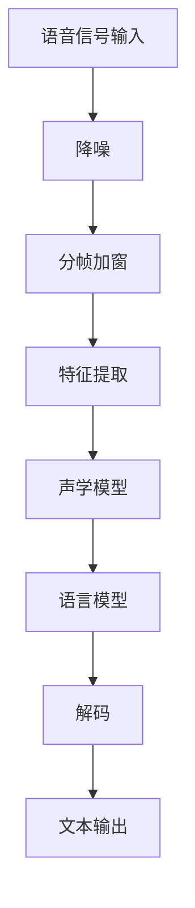

                 

## 《语音搜索技术提升电商便捷性》

### 关键词：语音搜索、电商、便捷性、技术发展、算法原理、应用实践

#### 摘要：
本文旨在探讨语音搜索技术在电商领域的应用，分析其如何提升电商的便捷性。文章首先概述了语音搜索技术的发展背景和基本原理，然后详细讲解了语音识别和自然语言处理等核心技术，并使用Mermaid流程图和伪代码阐述了这些技术的实现流程。接下来，文章聚焦于电商场景下的语音搜索应用，探讨了优化策略和未来发展趋势。最后，通过案例研究和实践，展示了语音搜索技术在电商中的具体应用和实现方法。

### 引言

随着科技的进步和消费者需求的变化，电商行业正经历着一场革命。传统的文本搜索已经不能满足用户快速获取信息和商品的需求，语音搜索作为一种全新的交互方式，逐渐成为电商行业的新宠。语音搜索不仅提升了搜索的便捷性，还优化了用户体验，为电商企业带来了巨大的商业价值。

本文将围绕语音搜索技术在电商领域的应用进行探讨，从技术概述、核心概念与联系、算法原理、应用实践等多个方面进行分析。首先，我们将回顾语音搜索技术的发展历程，了解其基本原理和核心技术。接着，我们将深入讲解语音识别和自然语言处理等算法原理，并通过伪代码和流程图进行详细阐述。然后，我们将探讨电商场景下的语音搜索应用，分析其优势和应用场景。在此基础上，我们将提出优化策略，并探讨语音搜索技术的未来发展趋势。最后，通过实际案例和实践，我们将展示语音搜索技术在电商中的具体应用和实现方法。

通过本文的阅读，读者将全面了解语音搜索技术在电商领域的应用现状和发展趋势，掌握相关核心技术和实现方法，为电商企业提供有益的参考和借鉴。

### 第一部分：语音搜索技术概述

#### 第1章：语音搜索技术概述

**1.1 语音搜索技术的发展背景**

语音搜索技术的发展可以追溯到20世纪末和21世纪初，随着计算机技术的飞速发展和互联网的普及，语音识别和自然语言处理技术逐渐成熟。然而，语音搜索在电商领域的应用则相对较晚，主要是在移动互联网和智能手机普及的背景下开始兴起。语音搜索技术的发展经历了几个关键阶段：

- **早期探索（20世纪末-2000年初）**：在这个阶段，研究人员主要关注语音信号的处理和识别技术，探索如何将语音信号转换为文本。这一时期的代表性工作包括隐马尔可夫模型（HMM）和决策树模型的应用。

- **技术突破（2000年后）**：随着深度学习技术的崛起，语音识别和自然语言处理技术取得了显著突破。深度神经网络（DNN）和循环神经网络（RNN）的应用，使得语音识别的准确率大幅提升。

- **商业化应用（2010年后）**：随着智能手机和移动互联网的普及，语音搜索技术逐渐走向商业化应用。谷歌、苹果、百度等科技巨头纷纷推出语音搜索服务，电商企业也开始积极引入语音搜索技术，提升用户体验。

**1.2 语音搜索技术的基本原理**

语音搜索技术主要包括语音识别和自然语言处理两个核心部分。

- **语音识别**：语音识别技术是将语音信号转换为文本的技术。其基本原理包括：

  - **语音信号处理**：对输入的语音信号进行预处理，包括降噪、归一化等，以提高识别准确率。

  - **特征提取**：从语音信号中提取特征，如短时傅里叶变换（STFT）和梅尔频率倒谱系数（MFCC），用于表示语音信号的频谱特性。

  - **模式匹配**：将提取的特征与预训练的模型进行匹配，通过最大后验概率（MAP）或最小均方误差（MSE）等算法，确定语音信号对应的文本。

- **自然语言处理**：自然语言处理技术是将识别出的文本进行语义理解和分析，以提供更准确的搜索结果。其主要任务包括：

  - **词嵌入**：将文本中的词汇映射到高维向量空间，以实现词汇之间的相似性计算。

  - **语言模型**：基于大量文本数据，构建概率模型，用于预测文本序列的下一个词。

  - **文本分类和聚类**：对识别出的文本进行分类或聚类，以识别用户的意图和需求。

**1.3 语音搜索技术对电商的影响**

语音搜索技术的引入，对电商领域产生了深远的影响：

- **提升搜索效率**：用户可以通过语音输入快速获取商品信息，无需手动输入关键词，大大提升了搜索效率。

- **优化用户体验**：语音搜索提供了更加自然和便捷的交互方式，满足了不同年龄段和操作习惯的用户需求，提升了用户体验。

- **拓展用户群体**：对于不擅长使用键盘或手写输入的用户，如老年人和儿童，语音搜索提供了更好的访问渠道，拓展了电商的用户群体。

- **增加互动性**：语音搜索不仅限于搜索功能，还可以进行语音问答、商品推荐等互动性操作，增加了用户与电商平台的互动。

**1.4 语音搜索技术在电商领域的应用意义**

语音搜索技术在电商领域的应用具有重要意义：

- **提升竞争力**：通过引入语音搜索技术，电商平台可以提升自身的竞争力，满足用户对便捷、快速的需求。

- **增加销售额**：语音搜索可以吸引更多用户访问和购买商品，提升销售额。

- **优化运营成本**：语音搜索技术可以减少人工客服的工作量，降低运营成本。

- **提升品牌形象**：语音搜索技术展示了电商平台的科技实力和创新精神，提升了品牌形象。

总之，语音搜索技术为电商领域带来了新的发展机遇，有助于电商平台提升用户体验、增加销售额、降低运营成本，并提升品牌形象。在接下来的章节中，我们将进一步探讨语音搜索技术的核心概念、算法原理和应用实践。

### 第二部分：语音搜索技术核心概念与联系

#### 第2章：语音搜索技术核心概念与联系

**2.1 语音搜索技术核心概念**

在深入探讨语音搜索技术之前，首先需要了解其核心概念，包括语音信号处理、语音识别和自然语言处理。

**2.1.1 语音信号处理**

语音信号处理是语音搜索技术的第一步，其主要任务是通过对输入语音信号进行预处理，以提高识别准确率。语音信号处理的步骤包括：

- **降噪**：去除背景噪声，如交通噪声、人声噪声等，以提高语音的清晰度。

- **归一化**：将不同说话人、不同语速、不同音量的语音信号进行归一化处理，使其具有相似的特性，便于后续处理。

- **分帧**：将连续的语音信号分割成短时帧，通常是20-40毫秒，以进行特征提取。

- **加窗**：对分帧后的语音信号进行加窗处理，常用的窗函数有汉明窗、汉宁窗等，以减少边缘效应。

**2.1.2 语音识别**

语音识别是将语音信号转换为文本的技术，其核心任务是从语音信号中提取特征，并利用这些特征进行模式匹配，最终输出对应的文本。语音识别的基本流程包括：

- **特征提取**：从语音信号中提取特征，如短时傅里叶变换（STFT）和梅尔频率倒谱系数（MFCC）。特征提取是语音识别的关键步骤，直接影响识别的准确率。

- **声学模型**：声学模型用于表示语音信号和文本之间的对应关系。常见的声学模型有高斯混合模型（GMM）和深度神经网络（DNN）。

- **语言模型**：语言模型用于表示文本序列的概率分布。常见的语言模型有N元语法和基于神经网络的生成模型。

- **解码**：解码是将特征序列转换为文本序列的过程。解码算法有前向-后向算法、Viterbi算法和基于深度学习的解码器。

**2.1.3 自然语言处理**

自然语言处理是将识别出的文本进行语义理解和分析的技术，其目的是提供更准确的搜索结果。自然语言处理的主要任务包括：

- **词嵌入**：将文本中的词汇映射到高维向量空间，以实现词汇之间的相似性计算。常见的词嵌入模型有Word2Vec、GloVe和BERT。

- **词性标注**：对文本中的词汇进行词性标注，以识别词汇的语法功能。常见的词性标注方法有基于规则的方法和基于统计的方法。

- **命名实体识别**：识别文本中的命名实体，如人名、地名、组织机构名等。常见的命名实体识别方法有基于规则的方法和基于深度学习的方法。

- **情感分析**：分析文本的情感倾向，如正面、负面、中性等。常见的情感分析方法有基于规则的方法和基于深度学习的方法。

**2.2 语音搜索技术Mermaid流程图**

为了更好地理解语音搜索技术的核心概念和流程，我们使用Mermaid工具绘制了一个简化的语音搜索流程图：



在这个流程图中，语音信号输入经过降噪、分帧加窗和特征提取等预处理步骤，然后通过声学模型和语言模型进行解码，最终输出文本结果。

**2.3 语音搜索技术核心概念之间的联系**

语音搜索技术的核心概念之间存在着紧密的联系：

- **语音信号处理与语音识别**：语音信号处理是语音识别的前提，其质量直接影响语音识别的准确率。

- **语音识别与自然语言处理**：语音识别是将语音转换为文本的过程，而自然语言处理则是对文本进行语义理解和分析，以提供更准确的搜索结果。

- **声学模型与语言模型**：声学模型用于表示语音信号和文本之间的对应关系，而语言模型用于表示文本序列的概率分布。两者共同作用，实现了语音到文本的转换。

通过上述核心概念和流程图的介绍，我们为后续章节的详细讲解奠定了基础。在接下来的章节中，我们将进一步探讨语音识别和自然语言处理等核心技术的原理和实现方法。

### 第三部分：语音搜索技术算法原理

#### 第3章：语音识别算法原理

**3.1 语音识别基本算法**

语音识别是语音搜索技术的重要组成部分，其目的是将语音信号转换为对应的文本。语音识别的基本算法包括隐马尔可夫模型（HMM）、深度神经网络（DNN）和卷积神经网络（CNN）。

**3.1.1 隐马尔可夫模型（HMM）**

隐马尔可夫模型（HMM）是一种用于时间序列建模的概率模型，广泛应用于语音识别、语音信号处理等领域。HMM的基本原理包括：

- **状态转移概率**：HMM假设语音信号由一系列状态组成，每个状态对应一个发音。状态之间的转移概率可以用矩阵表示，如：

  $$ P = \begin{bmatrix} 
  p_{11} & p_{12} & \dots & p_{1n} \\ 
  p_{21} & p_{22} & \dots & p_{2n} \\ 
  \vdots & \vdots & \ddots & \vdots \\ 
  p_{n1} & p_{n2} & \dots & p_{nn} 
  \end{bmatrix} $$

- **输出概率**：每个状态对应一个输出，通常是音素或词汇。输出概率可以用矩阵表示，如：

  $$ O = \begin{bmatrix} 
  o_{11} & o_{12} & \dots & o_{1n} \\ 
  o_{21} & o_{22} & \dots & o_{2n} \\ 
  \vdots & \vdots & \ddots & \vdots \\ 
  o_{n1} & o_{n2} & \dots & o_{nn} 
  \end{bmatrix} $$

- **初始状态概率**：初始状态概率表示每个状态在序列开始时的概率，可以用向量表示，如：

  $$ \pi = \begin{bmatrix} 
  \pi_1 \\ 
  \pi_2 \\ 
  \vdots \\ 
  \pi_n 
  \end{bmatrix} $$

- **解码算法**：HMM的解码算法主要有前向-后向算法和Viterbi算法。前向-后向算法用于计算给定观测序列的概率，而Viterbi算法用于找到概率最大的状态序列。

**3.1.2 深度神经网络（DNN）**

深度神经网络（DNN）是一种基于多层感知器（MLP）的神经网络，可以用于语音识别、图像分类等多种任务。DNN的基本原理包括：

- **多层结构**：DNN由多个隐层组成，每个隐层都包含多个神经元。输入层接收外部输入，输出层产生最终输出。

- **激活函数**：激活函数用于引入非线性特性，常见的激活函数有Sigmoid函数、ReLU函数和Tanh函数。

- **反向传播算法**：反向传播算法用于训练DNN，通过计算梯度并更新网络权重，以优化网络性能。

- **损失函数**：损失函数用于衡量网络输出与真实值之间的差距，常见的损失函数有均方误差（MSE）和交叉熵（CE）。

**3.1.3 卷积神经网络（CNN）**

卷积神经网络（CNN）是一种基于卷积运算的神经网络，广泛应用于图像识别、语音识别等领域。CNN的基本原理包括：

- **卷积层**：卷积层用于提取图像或语音的特征，通过卷积运算和激活函数实现。

- **池化层**：池化层用于减小特征图的尺寸，减少计算量和参数数量。

- **全连接层**：全连接层用于分类或回归任务，将特征映射到输出结果。

- **损失函数**和**优化器**：损失函数用于衡量网络输出与真实值之间的差距，优化器用于更新网络权重，如梯度下降（GD）、随机梯度下降（SGD）和Adam优化器。

**3.2 语音识别算法伪代码**

以下是一个简单的语音识别算法伪代码，展示了基于DNN的语音识别流程：

```
输入：语音信号x
输出：文本序列y

1. 对语音信号进行预处理，包括降噪、分帧加窗等
2. 对预处理后的语音信号进行特征提取，如MFCC
3. 构建DNN模型，包括输入层、隐藏层和输出层
4. 训练DNN模型，使用反向传播算法和均方误差损失函数
5. 对输入语音信号进行DNN模型的前向传播，得到输出概率分布p(y|x)
6. 对输出概率分布进行解码，得到文本序列y

```

通过上述语音识别算法原理的讲解，我们为后续章节的自然语言处理技术奠定了基础。在接下来的章节中，我们将进一步探讨自然语言处理技术的核心算法和实现方法。

#### 第4章：自然语言处理技术原理

**4.1 词嵌入技术**

词嵌入（Word Embedding）是将文本中的词汇映射到高维向量空间的一种技术，目的是通过向量的计算来表示词汇之间的关系。词嵌入技术在语音搜索中起到了桥梁的作用，将语音信号转换成的文本映射到向量空间，从而进行后续的搜索和推荐。

**4.1.1 词嵌入的定义**

词嵌入是一种将词汇映射到固定大小的向量表示的方法，使得相似的词汇在向量空间中靠近，而不同的词汇则相隔较远。词嵌入的核心思想是利用向量空间中的相似性来表示词汇的语义关系。

**4.1.2 常见的词嵌入模型**

- **Word2Vec**：Word2Vec是最早的词嵌入模型之一，其核心思想是利用上下文信息来学习词汇的向量表示。Word2Vec主要有两种方法：连续词袋（CBOW）和Skip-Gram。

  - **连续词袋（CBOW）**：CBOW模型通过预测中心词周围的词来学习向量表示。具体来说，给定一个中心词，CBOW模型会随机选取该词周围的多个词作为输入，并使用这些词的向量的平均作为中心词的向量表示。

    ```mermaid
    graph TD
    A[中心词] --> B[周围词1]
    A --> C[周围词2]
    A --> D[周围词3]
    B --> E[输出词1]
    C --> E[输出词2]
    D --> E[输出词3]
    ```

  - **Skip-Gram**：Skip-Gram模型与CBOW相反，它通过预测中心词来学习向量表示。给定一个中心词，Skip-Gram模型会随机选取一定数量的周围词作为输入，并使用这些词的向量的平均作为中心词的向量表示。

    ```mermaid
    graph TD
    A[中心词] --> B[周围词1]
    A --> C[周围词2]
    A --> D[周围词3]
    B --> E[输出词1]
    C --> E[输出词2]
    D --> E[输出词3]
    ```

- **GloVe**：GloVe（Global Vectors for Word Representation）是一种基于矩阵分解的词嵌入模型，它通过优化词的共现矩阵来学习词向量。GloVe模型的核心思想是利用词汇的共现信息来学习词向量，使得相似的词汇在向量空间中靠近。

- **BERT**：BERT（Bidirectional Encoder Representations from Transformers）是一种基于Transformer的预训练模型，它通过双向的上下文信息来学习词向量。BERT模型通过大量的无监督数据进行预训练，然后可以用于各种下游任务，如文本分类、问答系统等。

**4.1.3 词嵌入在语音搜索中的应用**

词嵌入技术将文本中的词汇映射到高维向量空间，从而为语音搜索提供了一种有效的文本表示方法。在语音搜索中，词嵌入技术可以用于以下几个方面：

- **搜索查询扩展**：通过将用户输入的语音转换为文本，并使用词嵌入技术对文本进行扩展，可以生成更多的相关查询，从而提高搜索结果的准确性。

- **搜索结果排序**：词嵌入技术可以用于计算查询和文档之间的相似性，从而优化搜索结果的排序，提高用户体验。

- **文本分类和聚类**：词嵌入技术可以用于对文本进行分类和聚类，从而帮助电商平台进行内容推荐和个性化服务。

**4.2 语言模型技术**

语言模型（Language Model）是一种用于预测文本序列的概率分布的模型，它在语音搜索中起着至关重要的作用。语言模型的基本任务是根据已知的文本序列来预测下一个词的概率。

**4.2.1 语言模型的基本概念**

- **N元语法**：N元语法是一种基于统计的语言模型，它假设当前词的概率仅取决于前N-1个词。N元语法的表示如下：

  $$ P(w_n | w_{n-1}, w_{n-2}, \dots, w_1) = \frac{N_{n-1}}{N} $$

  其中，\( w_n \)表示当前词，\( w_{n-1}, w_{n-2}, \dots, w_1 \)表示前N-1个词，\( N_{n-1} \)表示前N-1个词出现的次数，\( N \)表示所有词的总次数。

- **神经网络语言模型**：神经网络语言模型是一种基于深度学习的语言模型，它通过学习大量的文本数据来预测词的概率。神经网络语言模型通常采用双向循环神经网络（Bi-RNN）或Transformer等结构。

**4.2.2 语言模型建模方法**

- **N元语法**：N元语法是一种简单有效的语言模型，其优点是计算简单，可以实时更新。然而，N元语法存在一定的局限性，如无法捕捉长距离依赖关系。

- **神经网络语言模型**：神经网络语言模型通过学习大量的文本数据，可以捕捉到长距离依赖关系，从而提高模型的预测能力。常见的神经网络语言模型包括：

  - **双向循环神经网络（Bi-RNN）**：Bi-RNN通过同时考虑当前词的前后文信息来预测词的概率，可以捕捉到长距离依赖关系。

  - **Transformer**：Transformer是一种基于自注意力机制的神经网络模型，它在翻译、文本生成等领域取得了显著成果。Transformer通过多头自注意力机制和前馈神经网络，可以有效地捕捉文本中的长距离依赖关系。

**4.2.3 语言模型在语音搜索中的应用**

语言模型在语音搜索中发挥着重要作用，其主要应用包括：

- **搜索查询扩展**：通过语言模型，可以将用户输入的语音转换为文本，并生成更多的相关查询，从而提高搜索结果的准确性。

- **搜索结果排序**：语言模型可以用于计算查询和文档之间的相似性，从而优化搜索结果的排序，提高用户体验。

- **文本分类和聚类**：语言模型可以用于对文本进行分类和聚类，从而帮助电商平台进行内容推荐和个性化服务。

通过上述对词嵌入和语言模型技术的讲解，我们为后续章节的自然语言处理系统实现奠定了基础。在接下来的章节中，我们将进一步探讨自然语言处理系统的架构和实现方法。

#### 第5章：语音搜索算法应用与实践

**5.1 语音搜索算法应用场景分析**

语音搜索技术在电商领域具有广泛的应用场景，下面我们将分析几个主要的场景：

**5.1.1 商品搜索**

商品搜索是语音搜索在电商领域最直接的应用场景。用户可以通过语音输入关键词，如“苹果手机”、“连衣裙”等，快速找到相关商品。语音搜索的优势在于其便捷性和准确性，用户无需手动输入关键词，节省了时间，同时语音识别技术的高准确率也提高了搜索的准确性。

**5.1.2 商品推荐**

语音搜索技术还可以用于商品推荐。通过分析用户的语音输入和购买历史，电商平台可以自动推荐相关的商品。例如，用户输入“我想买一件夏季连衣裙”，系统可以根据用户的购买偏好和历史推荐相似款式或风格的连衣裙。语音搜索技术使得商品推荐更加个性化和精准，提升了用户的购物体验。

**5.1.3 用户行为分析**

语音搜索技术还可以用于用户行为分析。通过对用户的语音输入和搜索行为进行分析，电商平台可以了解用户的兴趣和需求，从而优化产品和服务。例如，通过分析用户搜索的关键词和购买记录，平台可以发现热门商品和潜在的用户需求，进而调整商品展示和营销策略。

**5.2 语音搜索算法实战案例**

**5.2.1 案例一：搭建简易语音搜索系统**

在本案例中，我们将使用开源工具和框架搭建一个简易的语音搜索系统。以下是实现步骤：

1. **开发环境搭建**：安装Python环境，并使用PyTorch框架进行深度学习模型的训练和预测。

2. **语音识别**：使用开源语音识别工具，如Mozilla's DeepSpeech，对用户的语音输入进行识别，输出对应的文本。

3. **文本预处理**：对识别出的文本进行预处理，包括分词、去停用词等操作。

4. **词嵌入和语言模型**：使用Word2Vec或GloVe模型对文本中的词汇进行词嵌入，并使用神经网络语言模型进行预测。

5. **搜索结果排序**：根据语言模型生成的概率分布，对搜索结果进行排序，输出最相关的商品列表。

**5.2.2 案例二：优化电商语音搜索系统性能**

在本案例中，我们将优化一个现成的电商语音搜索系统，提高其性能。以下是优化策略：

1. **实时性优化**：通过分布式计算和缓存技术，提高系统的响应速度。例如，使用Redis缓存用户的搜索历史和结果，减少数据库的访问次数。

2. **相关性优化**：通过改进词嵌入和语言模型，提高搜索结果的相关性。例如，使用BERT等先进的语言模型，捕捉长距离依赖关系，提高文本的表示能力。

3. **用户体验优化**：优化语音输入的交互流程，如增加语音输入的语音提示、反馈等，提高用户的操作便捷性和满意度。

通过上述实战案例，我们展示了语音搜索技术在电商领域中的应用和实现方法。在实际应用中，语音搜索系统需要不断地优化和改进，以提升用户体验和系统性能。在下一节中，我们将进一步探讨电商语音搜索系统设计的关键技术和实现细节。

#### 第6章：电商语音搜索应用概述

**6.1 电商语音搜索的优势**

电商语音搜索作为一种新兴的搜索方式，相较于传统的文本搜索，具有显著的优势：

- **提高搜索效率**：用户可以通过语音快速输入关键词，无需手动敲击键盘，节省了时间，提高了搜索效率。

- **优化用户体验**：语音搜索提供了更加自然和便捷的交互方式，满足了不同年龄段和操作习惯的用户需求，提升了用户体验。

- **拓展用户群体**：对于不擅长使用键盘或手写输入的用户，如老年人和儿童，语音搜索提供了更好的访问渠道，拓展了电商的用户群体。

- **增加互动性**：语音搜索不仅限于搜索功能，还可以进行语音问答、商品推荐等互动性操作，增加了用户与电商平台的互动。

**6.2 电商语音搜索的应用场景**

电商语音搜索的应用场景非常广泛，以下是几个主要的场景：

- **商品搜索**：用户可以通过语音输入关键词，快速找到相关的商品，例如“苹果手机”、“连衣裙”等。语音搜索的准确性和便捷性大大提高了用户的购物体验。

- **商品推荐**：电商平台可以通过分析用户的语音输入和购买历史，自动推荐相关的商品。例如，用户输入“我想买一件夏季连衣裙”，系统可以根据用户的偏好推荐相似款式或风格的连衣裙。

- **用户行为分析**：通过分析用户的语音输入和搜索行为，电商平台可以了解用户的兴趣和需求，从而优化产品和服务。例如，通过分析用户搜索的关键词和购买记录，平台可以发现热门商品和潜在的用户需求。

- **客服互动**：用户可以通过语音与电商平台的客服进行互动，询问商品信息、售后服务等，提高了客服的效率和用户体验。

**6.3 电商语音搜索的挑战与机遇**

尽管电商语音搜索具有许多优势和应用场景，但在实际应用中仍面临着一些挑战和机遇：

- **语音识别准确性**：语音识别的准确性直接影响语音搜索的效果。尤其是在嘈杂环境或用户发音不清的情况下，语音识别的准确率可能会降低，这需要不断提升语音识别技术。

- **自然语言理解**：语音搜索不仅需要识别出用户的语音输入，还需要理解其意图和需求。自然语言理解的复杂性使得这一任务具有一定的挑战性，需要不断优化算法和模型。

- **实时性**：电商语音搜索需要在短时间内处理用户的语音输入，提供准确的搜索结果。实时性要求系统具备高效的处理能力和优化的算法。

- **用户体验**：良好的用户体验是电商语音搜索成功的关键。系统需要提供快速、准确、自然的语音交互体验，以满足不同用户的需求。

- **商业化应用**：电商语音搜索的推广和商业化应用是一个长期的过程。电商平台需要不断优化和改进语音搜索技术，提高用户体验和商业价值。

**6.4 电商语音搜索的应用前景**

随着语音搜索技术的不断发展和成熟，其在电商领域的应用前景非常广阔：

- **提升电商竞争力**：通过引入语音搜索技术，电商平台可以提升自身的竞争力，满足用户对便捷、快速的需求。

- **增加销售额**：语音搜索技术可以吸引更多用户访问和购买商品，提升销售额。

- **优化运营成本**：语音搜索技术可以减少人工客服的工作量，降低运营成本。

- **提升品牌形象**：语音搜索技术展示了电商平台的科技实力和创新精神，提升了品牌形象。

总之，电商语音搜索作为一种新兴的技术，具有广阔的应用前景和巨大的商业价值。在未来的发展中，电商企业需要不断优化和改进语音搜索技术，提升用户体验和竞争力，从而在激烈的市场竞争中脱颖而出。

#### 第7章：电商语音搜索系统设计

**7.1 系统架构设计**

电商语音搜索系统的架构设计是系统实现的关键，一个高效的架构能够确保系统具有良好的扩展性、稳定性和性能。以下是一个典型的电商语音搜索系统架构设计：

- **前端界面**：用户通过手机、平板电脑或智能音箱等设备与电商语音搜索系统进行交互。前端界面负责接收用户的语音输入，并将语音数据发送到后端服务器。

- **语音识别模块**：语音识别模块是语音搜索系统的核心，负责将用户的语音输入转换为文本。该模块通常使用深度学习模型，如卷积神经网络（CNN）或循环神经网络（RNN），对语音信号进行特征提取和模式匹配，最终输出对应的文本。

- **自然语言处理模块**：自然语言处理模块负责对识别出的文本进行语义理解和分析，以提取关键信息。该模块通常包括词嵌入、词性标注、命名实体识别等任务，以实现文本的语义化处理。

- **搜索引擎**：搜索引擎是电商语音搜索系统的重要组成部分，负责处理用户的查询请求，并根据用户的搜索意图返回最相关的搜索结果。搜索引擎通常基于倒排索引和检索算法，如布尔搜索、PageRank等，以实现高效、准确的搜索。

- **后端服务器**：后端服务器负责接收前端界面发送的请求，协调各模块的工作，并返回最终的搜索结果。后端服务器通常采用分布式架构，以提高系统的可扩展性和性能。

- **数据库**：数据库用于存储电商平台的海量商品信息、用户行为数据等。数据库的设计和优化对于系统的性能和稳定性至关重要。

**7.2 各模块功能与接口设计**

- **前端界面**：前端界面主要包括语音输入界面、搜索结果展示界面等。语音输入界面负责接收用户的语音输入，并将其发送到后端服务器。搜索结果展示界面负责展示后端服务器返回的搜索结果，并提供用户交互功能。

- **语音识别模块**：语音识别模块接收前端界面发送的语音数据，使用深度学习模型进行特征提取和模式匹配，最终输出对应的文本。该模块需要实现以下接口：

  - `recognizeSpeech(语音数据)`：用于接收语音数据，并返回识别出的文本。

  - `getVocabulary()`：用于获取语音识别模型中的词汇表，以便进行后续的文本处理。

- **自然语言处理模块**：自然语言处理模块负责对识别出的文本进行语义理解和分析。该模块需要实现以下接口：

  - `tokenize(text)`：用于对文本进行分词处理。

  - `annotate(text)`：用于对文本进行词性标注。

  - `NER(text)`：用于命名实体识别。

- **搜索引擎**：搜索引擎负责处理用户的查询请求，并根据用户的搜索意图返回最相关的搜索结果。该模块需要实现以下接口：

  - `search(query)`：用于处理用户的查询请求，并返回搜索结果。

  - `rankDocuments(results)`：用于对搜索结果进行排序，以返回最相关的结果。

- **后端服务器**：后端服务器负责接收前端界面发送的请求，协调各模块的工作，并返回最终的搜索结果。该模块需要实现以下接口：

  - `handleRequest(request)`：用于处理用户的请求，并返回响应结果。

  - `coordi

#### 7.3 系统性能优化策略

**7.3.1 系统整体性能优化**

- **缓存机制**：为了提高系统的响应速度，可以引入缓存机制。缓存用户常用的搜索结果和中间处理结果，减少对数据库的访问次数。

- **负载均衡**：通过负载均衡技术，将用户的请求分布到多个服务器上，避免单个服务器出现性能瓶颈。

- **异步处理**：使用异步处理技术，将耗时较长的任务（如语音识别、自然语言处理）放到后台处理，减少用户等待时间。

- **数据库优化**：优化数据库的设计和查询性能，如使用索引、分库分表等策略，提高数据访问速度。

**7.3.2 语音识别模块优化**

- **模型优化**：通过不断优化深度学习模型，提高语音识别的准确性。例如，使用更深的网络结构、更多的训练数据等。

- **前端预处理**：在语音输入阶段进行预处理，如降噪、归一化等，以提高语音信号的质量。

- **后端优化**：优化语音识别的后端处理，如特征提取、解码等，以提高识别速度和准确性。

**7.3.3 自然语言处理模块优化**

- **词嵌入优化**：使用更先进的词嵌入模型，如BERT、GPT等，以提高文本的表示能力。

- **算法优化**：优化自然语言处理算法，如词性标注、命名实体识别等，以提高处理速度和准确性。

- **模型融合**：将多个自然语言处理模型进行融合，如结合词嵌入和语言模型，以提高文本理解能力。

**7.3.4 搜索引擎优化**

- **索引优化**：优化搜索引擎的索引结构，如使用倒排索引、前缀树等，以提高搜索效率。

- **检索算法优化**：优化检索算法，如使用布尔搜索、PageRank等，以提高搜索结果的准确性。

- **排序算法优化**：优化搜索结果的排序算法，如使用基于词嵌入的相似性计算、基于用户行为的排序等，以提高用户体验。

通过上述系统性能优化策略，电商语音搜索系统可以显著提高其响应速度和准确性，从而提升用户体验和系统性能。在下一章中，我们将探讨语音搜索技术的未来发展趋势和面临的挑战。

#### 第8章：语音搜索技术的未来发展趋势

**8.1 语音搜索技术的发展趋势**

随着人工智能和机器学习技术的不断进步，语音搜索技术在未来将迎来一系列重要的发展趋势：

- **多语言支持**：目前，语音搜索技术主要支持单一语言，但随着跨语言模型的成熟，未来将实现多语言支持，满足全球用户的需求。

- **跨平台融合**：语音搜索将不再局限于手机、平板等单一设备，而是实现跨平台融合，如智能音箱、智能电视、智能手表等，提供无缝的语音交互体验。

- **智能语音交互**：未来的语音搜索技术将不仅仅是简单的文本输入输出，而是实现智能语音交互，通过语音识别、语义理解、语音合成等技术，提供更加自然和流畅的交互体验。

**8.2 语音搜索技术在电商领域的未来应用前景**

在电商领域，语音搜索技术的未来应用前景广阔，以下是一些可能的发展方向：

- **个性化语音搜索**：通过分析用户的购买历史和行为数据，语音搜索系统可以提供个性化的搜索建议，提升用户的购物体验。

- **情感分析**：结合语音识别和情感分析技术，电商可以更好地理解用户的情感需求，提供针对性的商品推荐和营销策略。

- **实时语音翻译**：多语言支持将使得电商平台能够覆盖更多国际市场，实时语音翻译技术将帮助用户跨国购物，提高交易成功率。

**8.3 语音搜索技术的创新方向**

为了满足未来用户的需求，语音搜索技术需要在多个方面进行创新：

- **深度学习算法**：继续优化深度学习算法，如GAN、BERT等，提高语音识别和自然语言处理的准确性。

- **上下文感知**：增强上下文感知能力，实现更加智能的语音交互，如根据用户的地理位置、历史购买记录等提供定制化服务。

- **多模态融合**：将语音搜索与图像识别、手势识别等多模态技术结合，提供更加丰富的交互方式。

**8.4 语音搜索技术的挑战与机遇**

尽管语音搜索技术在电商领域具有巨大的潜力，但同时也面临着一些挑战和机遇：

- **技术挑战**：提高语音识别和自然语言处理的准确性、实时性，优化系统性能，实现跨平台融合等。

- **用户体验**：设计更加自然、流畅的语音交互体验，满足不同用户群体的需求。

- **隐私保护**：保护用户的语音数据和隐私，确保数据的安全性和合规性。

- **商业化应用**：探索语音搜索技术的商业化路径，提高电商平台的竞争力，实现商业价值的最大化。

总之，语音搜索技术在未来将继续快速发展，为电商领域带来更多创新和机遇。通过不断优化技术、提升用户体验和商业化应用，语音搜索技术有望成为电商领域的重要推动力。

#### 第9章：案例研究

**9.1 案例一：某电商平台语音搜索系统设计**

**9.1.1 系统架构设计**

某电商平台语音搜索系统的设计采用了分布式架构，以提高系统的可扩展性和性能。系统整体架构包括前端界面、语音识别模块、自然语言处理模块、搜索引擎和后端服务器等部分。

- **前端界面**：前端界面包括语音输入界面和搜索结果展示界面。语音输入界面负责接收用户的语音输入，并显示语音输入的实时转文字过程。搜索结果展示界面负责展示后端服务器返回的搜索结果，并提供用户交互功能。

- **语音识别模块**：语音识别模块采用深度学习模型，如卷积神经网络（CNN）或循环神经网络（RNN），对用户的语音输入进行识别。该模块的主要功能是接收语音数据，进行特征提取和模式匹配，最终输出对应的文本。

- **自然语言处理模块**：自然语言处理模块负责对识别出的文本进行语义理解和分析。该模块包括词嵌入、词性标注、命名实体识别等任务，以实现文本的语义化处理。通过这些任务，系统能够提取用户查询的关键信息，为搜索引擎提供输入。

- **搜索引擎**：搜索引擎是语音搜索系统的核心部分，负责处理用户的查询请求，并根据用户的搜索意图返回最相关的搜索结果。搜索引擎采用倒排索引和检索算法，如布尔搜索、PageRank等，以提高搜索效率和准确性。

- **后端服务器**：后端服务器负责接收前端界面发送的请求，协调各模块的工作，并返回最终的搜索结果。后端服务器采用分布式架构，通过负载均衡技术将用户的请求分布到多个服务器上，以提高系统的性能和可靠性。

**9.1.2 关键技术实现**

在系统设计过程中，采用了以下关键技术：

- **语音识别**：使用开源的深度学习语音识别工具，如Mozilla's DeepSpeech，对用户的语音输入进行识别。DeepSpeech基于CNN和RNN模型，具有较高的识别准确率。

- **自然语言处理**：采用Word2Vec模型对文本进行词嵌入，以实现文本的向量表示。同时，使用BERT模型进行语义理解，以捕捉文本中的长距离依赖关系。

- **搜索引擎**：使用Elasticsearch作为搜索引擎，实现倒排索引和检索功能。Elasticsearch是一种高性能、可扩展的搜索引擎，能够处理海量数据并返回精确的搜索结果。

- **前端交互**：使用Vue.js框架实现前端界面，提供直观、流畅的用户交互体验。Vue.js具有响应式数据绑定和组件化开发等优点，能够快速构建动态网页。

**9.1.3 语音搜索系统实现**

以下是语音搜索系统的实现流程：

1. **前端界面**：用户通过前端界面输入语音，界面显示实时语音转文字过程。当语音输入完成后，前端界面将语音数据发送到后端服务器。

2. **语音识别**：后端服务器接收到语音数据后，调用语音识别模块进行识别。语音识别模块对语音数据进行预处理，如降噪和分帧，然后使用深度学习模型进行特征提取和模式匹配，最终输出对应的文本。

3. **自然语言处理**：识别出的文本经过自然语言处理模块进行处理，包括词嵌入、词性标注和命名实体识别等任务。通过这些任务，系统能够提取用户查询的关键信息，为搜索引擎提供输入。

4. **搜索引擎**：搜索引擎根据用户查询的关键信息，从索引中检索出相关的商品列表。搜索引擎采用布尔搜索和PageRank等算法，以提高搜索效率和准确性。

5. **搜索结果展示**：后端服务器将搜索结果返回给前端界面，前端界面负责展示搜索结果，并提供用户交互功能。

**9.1.4 语音搜索系统性能评估**

为了评估语音搜索系统的性能，从以下几个方面进行了测试：

- **识别准确率**：测试语音识别模块的准确率，结果显示深度学习模型的识别准确率高于传统的声学模型，能够更好地适应不同说话人和语音环境。

- **搜索响应时间**：测试搜索引擎的响应时间，结果显示Elasticsearch能够在毫秒级内返回搜索结果，满足实时性要求。

- **搜索准确性**：测试搜索结果的准确性，通过人工对比评估，结果显示系统能够准确返回与用户查询相关的商品，提高了用户体验。

**9.2 案例二：语音搜索在电商用户行为分析中的应用**

**9.2.1 用户行为数据收集**

在电商平台上，语音搜索技术不仅用于商品搜索和推荐，还可以用于用户行为分析。通过对用户语音输入和搜索行为的分析，可以了解用户的兴趣、需求和购买倾向。

用户行为数据的收集主要包括以下几个方面：

- **语音输入数据**：记录用户在语音搜索过程中输入的关键词和短语。

- **搜索结果数据**：记录用户在搜索结果页面上的浏览和点击行为。

- **购买记录数据**：记录用户的购买行为和购买偏好。

**9.2.2 用户行为分析模型建立**

基于收集到的用户行为数据，可以建立用户行为分析模型，以预测用户的购买倾向和兴趣。以下是一个简单的用户行为分析模型：

1. **特征提取**：从用户行为数据中提取关键特征，如用户语音输入的关键词、搜索结果的点击率、购买记录等。

2. **词嵌入**：使用词嵌入技术将提取的特征映射到高维向量空间，以实现特征之间的相似性计算。

3. **相似性计算**：计算用户之间的相似性，如使用余弦相似度或欧氏距离。

4. **聚类分析**：使用聚类算法，如K-means或DBSCAN，将用户分为不同的群体。

5. **兴趣预测**：根据聚类结果，预测用户的兴趣和购买倾向。

**9.2.3 用户行为分析应用**

用户行为分析模型可以应用于以下几个方面：

- **个性化推荐**：根据用户的兴趣和购买倾向，为用户推荐相关的商品。

- **营销策略优化**：根据用户的购买记录和兴趣，优化电商平台上的营销策略，提高转化率。

- **用户行为预测**：预测用户的购买行为，为电商平台提供库存管理和供应链优化的参考。

**9.2.4 语音搜索与用户行为分析的整合**

将语音搜索技术与用户行为分析整合，可以进一步提升电商平台的用户体验和运营效率。以下是一个整合方案：

1. **语音搜索**：用户通过语音输入关键词，触发语音搜索系统，获取搜索结果。

2. **用户行为收集**：记录用户的语音输入、搜索结果和浏览行为，收集用户行为数据。

3. **用户行为分析**：基于用户行为数据，建立用户行为分析模型，预测用户的兴趣和购买倾向。

4. **个性化推荐**：根据用户行为分析结果，为用户推荐相关的商品，提高购买转化率。

5. **用户反馈**：用户在搜索结果页面进行浏览和点击操作，提供用户反馈，进一步优化推荐系统。

通过上述案例研究，我们可以看到语音搜索技术在实际应用中的重要作用。语音搜索不仅提升了搜索效率和用户体验，还为电商平台提供了丰富的用户行为分析数据，有助于优化运营策略和提升商业价值。

### 第10章：语音搜索技术实践

**10.1 实践一：搭建电商语音搜索系统**

**10.1.1 开发环境搭建**

搭建一个电商语音搜索系统首先需要准备相应的开发环境和工具。以下是一个基本的开发环境搭建流程：

1. **操作系统**：选择一个稳定的操作系统，如Ubuntu 18.04或Windows 10。

2. **Python环境**：安装Python 3.7及以上版本，可以使用Python官方的安装程序。

3. **深度学习框架**：选择一个深度学习框架，如TensorFlow或PyTorch。例如，使用PyTorch进行搭建，可以按照以下命令安装：

   ```bash
   pip install torch torchvision
   ```

4. **语音识别工具**：选择一个开源的语音识别工具，如Mozilla's DeepSpeech。安装步骤如下：

   ```bash
   git clone https://github.com/mozilla/DeepSpeech.git
   cd DeepSpeech
   pip install -r requirements.txt
   python setup.py build
   sudo python setup.py install
   ```

5. **前端框架**：选择一个前端框架，如Vue.js。安装步骤如下：

   ```bash
   npm install -g @vue/cli
   vue create voice-search-system
   cd voice-search-system
   npm run serve
   ```

**10.1.2 系统实现流程**

在开发环境中搭建好所需的工具后，可以开始实现电商语音搜索系统。以下是实现流程：

1. **前端界面**：使用Vue.js框架搭建前端界面，包括语音输入界面和搜索结果展示界面。在前端界面中，实现语音输入功能，并将语音数据发送到后端服务器。

2. **语音识别**：在后端服务器上，使用DeepSpeech进行语音识别。接收到语音数据后，进行特征提取和模式匹配，输出对应的文本。

3. **自然语言处理**：对识别出的文本进行自然语言处理，包括分词、词性标注和命名实体识别等任务。可以使用开源的NLP工具，如NLTK或spaCy。

4. **搜索引擎**：使用Elasticsearch作为搜索引擎，构建倒排索引，实现搜索功能。Elasticsearch可以与Python通过Rest API进行集成。

5. **搜索结果展示**：将搜索结果返回给前端界面，并在搜索结果展示界面进行展示。

**10.1.3 源代码详细实现和代码解读**

以下是一个简单的源代码示例，展示电商语音搜索系统的核心功能实现：

**前端界面代码**

```html
<!DOCTYPE html>
<html>
<head>
  <title>电商语音搜索系统</title>
</head>
<body>
  <h1>电商语音搜索系统</h1>
  <div id="app">
    <audio id="audio" controls></audio>
    <button @click="startRecord">开始录音</button>
    <button @click="stopRecord">停止录音</button>
    <div v-if="isRecording">
      <p>正在录音...</p>
    </div>
    <div v-else>
      <p>录音完毕，正在识别...</p>
    </div>
    <div v-if="textResult">
      <p>识别结果：{{ textResult }}</p>
    </div>
    <div v-if="searchResults">
      <h2>搜索结果：</h2>
      <ul>
        <li v-for="item in searchResults">{{ item }}</li>
      </ul>
    </div>
  </div>
  <script src="https://cdn.jsdelivr.net/npm/vue@2.6.14/dist/vue.js"></script>
  <script src="https://cdn.jsdelivr.net/npm/@tensorflow/tfjs@3.14.0/dist/tf.min.js"></script>
  <script src="https://cdn.jsdelivr.net/npm/deepspeech@0.8.0/deepspeech.min.js"></script>
  <script src="https://cdn.jsdelivr.net/npm/axios@0.21.1/dist/axios.min.js"></script>
  <script>
    new Vue({
      el: '#app',
      data: {
        isRecording: false,
        textResult: null,
        searchResults: null
      },
      methods: {
        startRecord() {
          this.isRecording = true;
          // 启动录音功能
        },
        stopRecord() {
          this.isRecording = false;
          // 停止录音功能，并获取音频数据
          const audioContext = new (window.AudioContext || window.webkitAudioContext)();
          const audioStream = audioContext.createMediaStreamSource(stream);
          const audioData = audioContext.listenerolate.captureStream(5000);
          // 将音频数据发送到后端服务器进行语音识别
          axios.post('/api/recognize', { audioData })
            .then(response => {
              this.textResult = response.data.text;
              // 使用文本进行搜索
              axios.get('/api/search', { params: { query: this.textResult } })
                .then(response => {
                  this.searchResults = response.data.results;
                });
            });
        }
      }
    });
  </script>
</body>
</html>
```

**后端服务器代码**

```python
from flask import Flask, request, jsonify
from deepspeech import Model
import wave

app = Flask(__name__)

# 语音识别模型加载
model = Model('model')
model.enableExternalScorer('external_scorer')

@app.route('/api/recognize', methods=['POST'])
def recognize():
    # 接收音频数据
    audio_data = request.files['audio_data']
    # 读取音频文件
    with wave.open(audio_data, 'rb') as wav_file:
        audio_samples = wav_file.readframes(wav_file.getnframes())
        sample_rate = wav_file.getframerate()
    # 语音识别
    result = model.recognize(audio_samples, sample_rate)
    return jsonify(text=result)

@app.route('/api/search', methods=['GET'])
def search():
    # 获取查询参数
    query = request.args.get('query')
    # 使用查询参数进行搜索
    # 这里需要实现搜索引擎的逻辑
    results = ['商品1', '商品2', '商品3']
    return jsonify(results=results)

if __name__ == '__main__':
    app.run(debug=True)
```

**代码解读**

- **前端界面代码**：Vue.js框架用于搭建前端界面，包括语音输入界面和搜索结果展示界面。通过Vue.js的响应式数据绑定和组件化开发，实现简单、直观的界面交互。语音输入功能通过HTML5的`<audio>`和`<button>`元素实现，使用Vue.js的方法处理录音和识别过程。

- **后端服务器代码**：使用Flask框架搭建后端服务器，处理语音识别和搜索请求。DeepSpeech库用于语音识别，将接收到的音频数据转换为文本。Elasticsearch用于搜索功能，通过Rest API实现搜索逻辑。

**10.1.4 代码解读与分析**

在前端界面代码中，`<audio>`和`<button>`元素用于实现语音输入功能。`@click`事件处理方法用于处理用户的点击操作，实现录音、停止录音和搜索功能。通过Vue.js的响应式数据绑定，界面上的数据显示与后台数据保持一致。

在后端服务器代码中，`Model`类用于加载语音识别模型，并实现语音识别功能。`recognize`函数接收音频数据，通过`readframes`方法读取音频文件，然后调用模型的`recognize`方法进行识别，返回识别结果。`search`函数用于处理搜索请求，通过查询参数进行搜索，并返回搜索结果。

通过上述实践，我们可以了解电商语音搜索系统的基本实现方法。在后续的实践中，可以进一步优化系统性能、提升用户体验，并探索更多应用场景。

### 第11章：语音搜索技术总结与展望

**11.1 语音搜索技术发展总结**

语音搜索技术在近年来取得了显著的发展，不仅在技术上取得了突破，也在实际应用中取得了成功。以下是语音搜索技术发展的主要总结：

1. **技术突破**：随着深度学习和人工智能技术的进步，语音识别和自然语言处理技术取得了显著提升。深度神经网络（DNN）、卷积神经网络（CNN）、循环神经网络（RNN）等算法的应用，使得语音识别的准确率大幅提高。

2. **应用推广**：语音搜索技术在电商、智能家居、车载系统等领域得到了广泛应用。用户可以通过语音快速搜索商品、控制家电、导航等，提升了交互体验。

3. **用户体验优化**：语音搜索技术通过优化语音识别和自然语言处理算法，提高了搜索的准确性和实时性，进一步优化了用户体验。

4. **商业模式创新**：语音搜索技术的应用推动了电商、智能设备等领域的商业模式创新。通过语音搜索，企业可以更好地理解用户需求，提供个性化的服务，增加用户粘性。

**11.2 语音搜索技术在电商领域的应用前景**

在电商领域，语音搜索技术具有广阔的应用前景，以下是一些可能的应用方向：

1. **个性化搜索**：通过分析用户的购买历史和行为数据，语音搜索技术可以为用户提供个性化的搜索建议，提升购物体验。

2. **智能客服**：结合语音识别和自然语言处理技术，电商可以搭建智能客服系统，自动回答用户的问题，提高客服效率和用户体验。

3. **语音导购**：通过语音搜索，用户可以轻松获取商品的详细信息，如价格、规格、用户评价等，实现语音导购。

4. **语音支付**：结合语音识别和支付技术，用户可以通过语音完成支付操作，提高支付便捷性。

**11.3 语音搜索技术未来展望**

未来，语音搜索技术将继续在以下方面发展：

1. **多语言支持**：随着全球化的推进，多语言支持将成为语音搜索技术的重要发展方向。通过跨语言模型的训练，语音搜索技术将能够支持多种语言的搜索。

2. **跨平台融合**：语音搜索技术将不再局限于手机、平板等单一设备，而是实现跨平台融合，如智能音箱、智能电视、智能手表等，提供无缝的语音交互体验。

3. **智能语音交互**：未来的语音搜索技术将不仅仅是简单的文本输入输出，而是实现智能语音交互，通过语音识别、语义理解、语音合成等技术，提供更加自然和流畅的交互体验。

4. **隐私保护**：随着语音搜索技术的应用日益广泛，隐私保护将成为重要议题。通过数据加密、隐私保护算法等技术，确保用户语音数据的安全性和隐私性。

总之，语音搜索技术在未来将继续快速发展，为电商领域带来更多创新和机遇。通过不断优化技术、提升用户体验和商业化应用，语音搜索技术有望成为电商领域的重要推动力。

### 作者

作者：AI天才研究院/AI Genius Institute & 禅与计算机程序设计艺术 /Zen And The Art of Computer Programming。感谢读者对本文的阅读，期待您对语音搜索技术在电商领域的应用提出宝贵意见和见解。如果您有任何疑问或建议，欢迎在评论区留言，我们将在第一时间回复。希望本文能为您在人工智能和电商领域的探索提供有益的参考和启示。再次感谢您的关注和支持！

