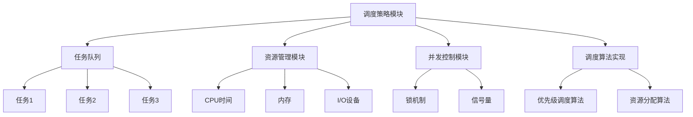

                 

### 《调度器 原理与代码实例讲解》

调度器作为现代计算机系统和操作系统中的核心组件，扮演着至关重要的角色。它负责任务调度、资源分配、响应时间管理等，直接影响到系统的性能和用户体验。本文将深入探讨调度器的原理、架构、算法以及代码实例，旨在帮助读者全面理解调度器的工作机制，掌握其实际应用技巧。

> **关键词**：调度器，任务调度，资源分配，算法，代码实例

> **摘要**：本文首先介绍调度器的基本概念和重要性，随后详细讲解调度器的架构和组件，深入分析调度算法原理，并结合实际项目实战，展示调度器的开发与实现。最后，探讨调度器在不同场景下的应用以及未来发展。

### 目录

1. 调度器概述
   1.1 调度器的作用与重要性
   1.2 调度器的分类
   1.3 调度器的基本原理

2. 调度器的架构与组件
   2.1 调度器架构设计
   2.2 调度器核心组件
   2.3 调度算法概述

3. 调度算法原理
   3.1 调度算法的类型
   3.2 优先级调度算法
   3.3 资源分配算法

4. 调度器的性能优化
   4.1 调度性能指标
   4.2 调度器性能瓶颈分析
   4.3 调度性能优化策略

5. 调度器开发环境搭建
   5.1 开发环境配置
   5.2 调度器框架选择
   5.3 常用调度器框架介绍

6. 调度器核心算法实现
   6.1 调度算法伪代码
   6.2 优先级调度算法实现
   6.3 资源分配算法实现

7. 调度器项目实战
   7.1 调度器项目实例
   7.2 项目需求分析
   7.3 项目开发步骤
   7.4 源代码实现与解读

8. 调度器与其他系统集成
   8.1 集成策略与方法
   8.2 集成案例实战
   8.3 集成优化策略

9. 调度器在特殊场景下的应用
   9.1 特殊场景下的调度需求
   9.2 调度器在实时系统中的应用
   9.3 调度器在分布式系统中的应用

10. 调度器的发展趋势与未来
   10.1 调度器技术发展趋势
   10.2 调度器在云计算中的应用
   10.3 调度器在物联网中的应用

### 附录

- 附录A：调度器相关资源
- 附录B：调度器算法流程图
- 附录C：调度器项目代码示例
- 附录D：调度器常见问题解答
- 附录E：调度器学习资源推荐

### 1. 调度器概述

#### 1.1 调度器的作用与重要性

调度器（Scheduler）是操作系统中的一个核心组件，负责管理和分配系统资源。它的主要任务是根据一定的调度策略，将系统资源（如CPU时间、内存、I/O设备等）合理地分配给各个任务（Process或Thread）。调度器的核心目标是提高系统的吞吐量、响应时间和公平性。

在现代计算机系统中，调度器的作用尤为关键，主要体现在以下几个方面：

- **任务调度**：调度器负责将任务按照一定的策略调度到不同的处理器上执行，确保系统资源得到充分利用。
- **资源分配**：调度器在任务执行过程中，会根据任务的优先级、资源需求等因素，动态地分配和回收系统资源。
- **响应时间管理**：调度器通过合理的调度策略，尽可能地缩短任务的响应时间，提高用户体验。
- **负载均衡**：调度器能够根据系统的负载情况，动态调整任务的执行顺序和资源分配，避免单点过载，保证系统稳定运行。

#### 1.2 调度器的分类

根据调度策略和调度对象的不同，调度器可以分为以下几类：

- **进程调度器**：负责对进程进行调度，根据进程的优先级、执行时间等因素，将进程分配到不同的处理器上执行。
- **线程调度器**：与进程调度器类似，但调度对象为线程。线程调度器主要关注线程之间的竞争关系，根据线程的优先级和资源需求进行调度。
- **I/O调度器**：负责管理I/O设备的分配和操作，确保I/O操作的高效和公平。
- **作业调度器**：在批处理系统中，负责对作业进行调度，将作业分配到系统中执行。

#### 1.3 调度器的基本原理

调度器的基本原理可以概括为以下几个步骤：

1. **任务提交**：任务被提交到调度器，调度器根据任务的特点和系统的状态，将任务插入到任务队列中。
2. **任务选择**：调度器从任务队列中选择一个任务进行执行。选择策略可以根据任务的优先级、执行时间、资源需求等因素进行。
3. **资源分配**：调度器根据任务的需求，动态地分配系统资源，如CPU时间、内存、I/O设备等。
4. **任务执行**：被调度的任务在处理器上执行，执行过程中可能会产生新的资源需求，调度器会根据实际情况进行调整。
5. **任务完成**：任务执行完成后，调度器会释放分配的资源，并将任务的执行结果返回给调用者。

#### 1.4 调度器的性能指标

调度器的性能直接影响系统的性能和用户体验。常用的调度器性能指标包括：

- **平均响应时间**：任务从提交到执行完成所需的时间。
- **平均周转时间**：任务从提交到完成所需的总时间。
- **吞吐量**：单位时间内系统完成的任务数量。
- **公平性**：调度器对任务的分配是否公平，是否会导致某些任务长期得不到执行。
- **系统利用率**：系统资源被充分利用的程度。

调度器的设计和优化需要综合考虑这些性能指标，以达到系统性能的最优化。

#### 1.5 调度器的架构设计

调度器的架构设计需要考虑多个方面，包括调度策略、数据结构、并发控制等。一个典型的调度器架构设计如下：

1. **调度策略模块**：负责实现具体的调度策略，如优先级调度、轮转调度等。
2. **任务队列**：用于存储待调度和正在调度的任务，通常采用优先级队列、循环队列等数据结构。
3. **资源管理模块**：负责管理系统资源，如CPU时间、内存、I/O设备等，根据任务的需求进行动态分配和回收。
4. **并发控制模块**：确保多个任务在执行过程中不会发生资源冲突，如锁机制、信号量等。
5. **调度算法实现**：实现具体的调度算法，如优先级调度算法、资源分配算法等。

#### 1.6 调度器的工作流程

调度器的工作流程可以分为以下几个阶段：

1. **任务提交**：任务被提交到调度器，调度器将其插入到任务队列中。
2. **任务选择**：调度器从任务队列中选择一个任务进行执行，根据调度策略进行选择。
3. **资源分配**：调度器根据任务的需求，动态地分配系统资源。
4. **任务执行**：被调度的任务在处理器上执行，调度器实时监控任务的执行状态。
5. **任务完成**：任务执行完成后，调度器释放分配的资源，并将任务的执行结果返回给调用者。
6. **任务结束**：任务完成或被终止后，调度器从任务队列中移除该任务，继续选择下一个任务执行。

#### 1.7 调度器的历史发展与现状

调度器的历史可以追溯到早期计算机系统。在早期的批处理系统中，调度器主要用于作业调度，将作业分配到不同的处理器上执行。随着计算机系统的发展，调度器的功能逐渐完善，从简单的作业调度发展到复杂的任务调度和资源管理。

目前，调度器在操作系统、嵌入式系统、分布式系统等领域得到了广泛应用。主流操作系统如Linux、Windows、Unix等都具备强大的调度器功能，能够满足不同场景下的调度需求。同时，随着云计算、物联网等新兴技术的发展，调度器也在不断演进，逐渐适应更加复杂和多样化的调度场景。

### 2. 调度器的架构与组件

调度器的架构设计是确保其高效运作的关键。一个完善的调度器架构应包括调度策略模块、任务队列、资源管理模块、并发控制模块和调度算法实现等核心组件。下面，我们将详细讲解这些组件的作用和设计思路。

#### 2.1 调度器架构设计

调度器架构设计的主要目标是实现任务调度、资源分配和响应时间管理。一个典型的调度器架构如图1所示。



**图1：调度器架构设计**

- **调度策略模块**：负责实现具体的调度策略，如优先级调度、轮转调度等。
- **任务队列**：存储待调度和正在调度的任务，采用优先级队列、循环队列等数据结构。
- **资源管理模块**：负责管理系统资源，如CPU时间、内存、I/O设备等，根据任务的需求进行动态分配和回收。
- **并发控制模块**：确保多个任务在执行过程中不会发生资源冲突，如锁机制、信号量等。
- **调度算法实现**：实现具体的调度算法，如优先级调度算法、资源分配算法等。

#### 2.2 调度器核心组件

调度器的核心组件是确保其功能实现的关键。下面将详细讲解每个组件的作用和设计思路。

##### 2.2.1 调度策略模块

调度策略模块是调度器的核心，决定了任务的调度顺序和资源分配方式。常见的调度策略包括：

- **优先级调度算法**：根据任务的优先级进行调度，优先级高的任务先被执行。
- **轮转调度算法**：将CPU时间划分为多个时间片，每个任务轮流占用CPU时间片。
- **公平共享调度算法**：确保所有任务在相同时间内得到公平的CPU时间。
- **最短作业优先调度算法**：选择执行时间最短的作业先被执行。

调度策略模块需要实现以下功能：

- **任务优先级管理**：对任务的优先级进行排序和管理。
- **调度策略选择**：根据系统需求和任务特点，选择合适的调度策略。
- **调度时机控制**：在合适的时机触发调度操作，如任务到达、任务完成等。

##### 2.2.2 任务队列

任务队列是调度器中用于存储和管理任务的组件。任务队列的设计对调度器的性能有很大影响。常见的任务队列包括：

- **优先级队列**：根据任务的优先级进行排序，优先级高的任务排在队列头部。
- **循环队列**：采用循环链表实现，任务在队列尾部插入，从头部依次删除。
- **双向链表队列**：支持在队列头部和尾部插入和删除任务。

任务队列需要实现以下功能：

- **任务插入**：将新任务插入到队列中，根据调度策略进行排序。
- **任务删除**：从队列中删除已完成的任务或需要被调度的任务。
- **任务检索**：根据调度策略检索队列中的任务，进行调度操作。

##### 2.2.3 资源管理模块

资源管理模块是调度器中用于管理系统资源的组件。资源管理模块需要实现以下功能：

- **资源分配**：根据任务的需求，动态地分配系统资源，如CPU时间、内存、I/O设备等。
- **资源回收**：任务执行完成后，回收分配的资源，以供其他任务使用。
- **资源锁机制**：在多个任务竞争资源时，采用锁机制进行并发控制，确保资源分配的公平性。

常见的资源管理模块包括：

- **CPU资源管理**：负责管理CPU时间，确保任务在处理器上得到合理的执行。
- **内存资源管理**：负责管理内存空间，确保任务有足够的内存进行执行。
- **I/O资源管理**：负责管理I/O设备，确保I/O操作的高效和公平。

##### 2.2.4 并发控制模块

并发控制模块是调度器中用于处理任务并发执行的组件。并发控制模块需要实现以下功能：

- **锁机制**：在多个任务竞争资源时，采用锁机制进行并发控制，确保资源分配的公平性。
- **信号量机制**：在多个任务之间传递同步信号，确保任务在执行过程中保持一致性。
- **队列锁**：在任务队列上进行并发控制，确保任务的插入和删除操作的原子性。

常见的并发控制模块包括：

- **互斥锁**：确保同一时刻只有一个任务可以访问共享资源。
- **读写锁**：允许多个任务同时读取共享资源，但在写入时进行互斥锁。
- **条件锁**：在任务等待特定条件满足时，采用条件锁进行并发控制。

##### 2.2.5 调度算法实现

调度算法实现是调度器中用于实现具体调度策略的组件。常见的调度算法包括：

- **优先级调度算法**：根据任务的优先级进行调度，优先级高的任务先被执行。
- **轮转调度算法**：将CPU时间划分为多个时间片，每个任务轮流占用CPU时间片。
- **公平共享调度算法**：确保所有任务在相同时间内得到公平的CPU时间。
- **最短作业优先调度算法**：选择执行时间最短的作业先被执行。

调度算法实现需要根据具体的调度策略，实现以下功能：

- **任务调度**：根据调度策略，从任务队列中选择任务进行执行。
- **资源分配**：根据任务的需求，动态地分配系统资源，如CPU时间、内存、I/O设备等。
- **任务状态管理**：管理任务的状态，如运行、等待、完成等。

调度算法实现通常采用伪代码进行描述，以便于理解和实现。以下是一个简单的优先级调度算法的伪代码示例：

```python
Algorithm PriorityScheduling(tasks):
    Initialize a priority queue
    for each task in tasks:
        Add task to the priority queue
    while not empty(priority queue):
        Select the highest priority task
        Execute the task
        If task is completed:
            Remove task from the priority queue
```

#### 2.3 调度算法概述

调度算法是调度器的核心组成部分，决定了任务调度的顺序和资源分配策略。调度算法的选择直接影响到系统的性能和用户体验。常见的调度算法包括：

##### 2.3.1 优先级调度算法

优先级调度算法是一种根据任务优先级进行调度的算法。任务的优先级通常由系统管理员或任务自身设置。优先级高的任务具有更高的执行优先级，能够在较短的时间内得到执行。

优先级调度算法的优点包括：

- **响应速度快**：高优先级任务能够快速得到执行，满足关键任务的时效性要求。
- **资源利用率高**：系统资源能够被有效地分配给高优先级任务，提高资源利用率。

优先级调度算法的缺点包括：

- **可能导致低优先级任务长期得不到执行**：如果系统中高优先级任务较多，低优先级任务可能会长期处于等待状态。
- **调度不均**：优先级调度可能导致部分任务长时间占用系统资源，影响系统的整体性能。

##### 2.3.2 轮转调度算法

轮转调度算法是一种将CPU时间划分为多个时间片，每个任务轮流占用CPU时间片的调度算法。每个任务在执行一个时间片后，如果未完成，则会将CPU控制权交给下一个任务，直到所有任务执行完毕。

轮转调度算法的优点包括：

- **公平性高**：所有任务都能在相同时间内得到执行机会，避免了优先级调度算法中的调度不均问题。
- **响应时间短**：轮转调度算法能够快速响应任务，满足大多数任务的需求。

轮转调度算法的缺点包括：

- **资源利用率低**：由于任务在执行一个时间片后就需要交出CPU控制权，可能导致系统资源无法得到充分利用。
- **调度延迟**：轮转调度算法可能无法满足某些关键任务的响应时间要求。

##### 2.3.3 公平共享调度算法

公平共享调度算法是一种确保所有任务在相同时间内得到公平CPU时间的调度算法。公平共享调度算法通常采用时间片轮转的方式，但会根据任务的特点进行适当调整，以满足任务的公平性需求。

公平共享调度算法的优点包括：

- **公平性高**：所有任务在相同时间内得到公平的CPU时间，避免了优先级调度算法中的调度不均问题。
- **资源利用率较高**：相较于轮转调度算法，公平共享调度算法能够更好地利用系统资源。

公平共享调度算法的缺点包括：

- **响应时间较长**：由于需要确保所有任务的公平性，可能无法满足某些关键任务的时效性要求。
- **调度复杂度较高**：需要根据任务的特点进行调度策略的调整，增加了调度算法的复杂度。

##### 2.3.4 最短作业优先调度算法

最短作业优先调度算法是一种选择执行时间最短的作业先被执行的调度算法。最短作业优先调度算法通常适用于批处理系统，能够减少平均等待时间。

最短作业优先调度算法的优点包括：

- **平均等待时间短**：选择执行时间最短的作业先被执行，能够减少系统的平均等待时间。
- **资源利用率较高**：系统能够快速处理短作业，提高资源利用率。

最短作业优先调度算法的缺点包括：

- **可能导致长作业长期得不到执行**：如果系统中存在大量长作业，短作业可能会频繁执行，导致长作业长期得不到执行。
- **调度不均**：无法确保所有作业在相同时间内得到执行机会。

#### 2.4 调度器在操作系统中的应用

调度器在操作系统中的应用非常广泛，是操作系统核心功能之一。以下是一些常见操作系统中的调度器应用场景：

- **进程调度**：在多处理器系统中，调度器负责将进程分配到不同的处理器上执行，以提高系统的并行处理能力。
- **线程调度**：在多线程应用程序中，调度器负责将线程分配到不同的处理器上执行，确保线程之间的并行执行。
- **I/O调度**：在I/O密集型应用程序中，调度器负责管理I/O设备的分配和操作，确保I/O操作的高效和公平。
- **作业调度**：在批处理系统中，调度器负责将作业分配到系统中执行，以提高系统的吞吐量。

#### 2.5 调度器在分布式系统中的应用

随着分布式系统的广泛应用，调度器在分布式系统中的重要性日益凸显。调度器在分布式系统中的应用主要包括：

- **任务调度**：分布式调度器负责将任务分配到不同的节点上执行，以实现任务的并行处理。
- **资源调度**：分布式调度器负责管理分布式系统中的资源，如CPU、内存、存储等，确保资源的高效利用。
- **负载均衡**：分布式调度器通过动态调整任务的执行位置，实现负载均衡，避免单点过载。

调度器在分布式系统中的应用，需要考虑以下几个方面：

- **通信协议**：调度器需要与其他节点进行通信，以获取任务状态和资源信息。
- **一致性算法**：调度器需要确保分布式系统中的数据一致性，避免数据冲突。
- **容错机制**：调度器需要具备容错能力，能够在节点故障时重新调度任务。

#### 2.6 调度器的未来发展趋势

随着计算机技术的不断发展，调度器也在不断演进，以适应更加复杂和多样化的调度场景。以下是调度器的未来发展趋势：

- **智能化调度**：通过引入机器学习和人工智能技术，实现智能化调度，提高调度效率和响应时间。
- **自适应调度**：根据系统负载和任务特性，自适应调整调度策略，实现动态调度。
- **分布式调度**：在分布式系统中，实现更加高效和可靠的分布式调度，提高系统的整体性能。
- **实时调度**：在实时系统中，实现实时调度，满足实时任务的高可靠性要求。

### 3. 调度算法原理

调度算法是调度器的核心组成部分，决定了任务调度的顺序和资源分配策略。常见的调度算法包括优先级调度算法、轮转调度算法、公平共享调度算法和最短作业优先调度算法。在本节中，我们将详细讲解这些调度算法的原理，并通过伪代码进行分析。

#### 3.1 调度算法的类型

调度算法根据调度对象和调度策略的不同，可以分为以下几类：

- **进程调度算法**：针对进程的调度策略，如优先级调度、轮转调度、最短作业优先调度等。
- **线程调度算法**：针对线程的调度策略，与进程调度算法类似，但更注重线程之间的并行执行。
- **I/O调度算法**：针对I/O操作的调度策略，如先来先服务、最短寻找时间优先等。
- **作业调度算法**：在批处理系统中，针对作业的调度策略，如短作业优先、高优先级作业优先等。

本节主要介绍进程调度算法，包括优先级调度算法、轮转调度算法和公平共享调度算法。

#### 3.2 优先级调度算法

优先级调度算法是一种根据任务优先级进行调度的算法。任务的优先级通常由系统管理员或任务自身设置。优先级高的任务具有更高的执行优先级，能够在较短的时间内得到执行。

**优先级调度算法的原理**：

- **任务优先级管理**：系统为每个任务设置一个优先级，优先级高的任务具有更高的执行优先级。
- **任务调度**：调度器根据任务优先级，从任务队列中选择优先级最高的任务进行执行。
- **资源分配**：调度器在任务执行过程中，根据任务的需求，动态地分配系统资源，如CPU时间、内存、I/O设备等。

**优先级调度算法的伪代码**：

```python
Algorithm PriorityScheduling(tasks):
    Initialize a priority queue
    for each task in tasks:
        Add task to the priority queue
    while not empty(priority queue):
        Select the highest priority task
        Execute the task
        If task is completed:
            Remove task from the priority queue
```

**优先级调度算法的优点**：

- **响应速度快**：高优先级任务能够快速得到执行，满足关键任务的时效性要求。
- **资源利用率高**：系统资源能够被有效地分配给高优先级任务，提高资源利用率。

**优先级调度算法的缺点**：

- **可能导致低优先级任务长期得不到执行**：如果系统中高优先级任务较多，低优先级任务可能会长期处于等待状态。
- **调度不均**：优先级调度可能导致部分任务长时间占用系统资源，影响系统的整体性能。

#### 3.3 轮转调度算法

轮转调度算法是一种将CPU时间划分为多个时间片，每个任务轮流占用CPU时间片的调度算法。每个任务在执行一个时间片后，如果未完成，则会将CPU控制权交给下一个任务，直到所有任务执行完毕。

**轮转调度算法的原理**：

- **时间片分配**：系统将CPU时间划分为多个时间片，每个时间片的大小固定。
- **任务调度**：调度器根据轮转调度算法，将CPU时间片依次分配给任务，每个任务占用一个时间片。
- **任务切换**：在任务执行一个时间片后，调度器将CPU控制权交给下一个任务，继续执行。

**轮转调度算法的伪代码**：

```python
Algorithm RoundRobinScheduling(tasks, time_slice):
    for each task in tasks:
        Set task's remaining_time = time_slice
    while not all tasks are completed:
        for each task in tasks:
            If task is not completed:
                Execute task for time_slice
                If task is completed:
                    Remove task from the task list
```

**轮转调度算法的优点**：

- **公平性高**：所有任务都能在相同时间内得到执行机会，避免了优先级调度算法中的调度不均问题。
- **响应时间短**：轮转调度算法能够快速响应任务，满足大多数任务的需求。

**轮转调度算法的缺点**：

- **资源利用率低**：由于任务在执行一个时间片后就需要交出CPU控制权，可能导致系统资源无法得到充分利用。
- **调度延迟**：轮转调度算法可能无法满足某些关键任务的响应时间要求。

#### 3.4 公平共享调度算法

公平共享调度算法是一种确保所有任务在相同时间内得到公平CPU时间的调度算法。公平共享调度算法通常采用时间片轮转的方式，但会根据任务的特点进行适当调整，以满足任务的公平性需求。

**公平共享调度算法的原理**：

- **时间片分配**：系统将CPU时间划分为多个时间片，每个时间片的大小固定。
- **任务调度**：调度器根据公平共享调度算法，将CPU时间片依次分配给任务，但会根据任务的优先级和执行时间进行适当调整。
- **任务切换**：在任务执行一个时间片后，调度器将CPU控制权交给下一个任务，继续执行。

**公平共享调度算法的伪代码**：

```python
Algorithm FairShareScheduling(tasks, time_slice):
    Initialize a priority queue
    for each task in tasks:
        Add task to the priority queue
    while not empty(priority queue):
        Select the highest priority task
        Execute the task for time_slice
        If task is completed:
            Remove task from the priority queue
        Else:
            Set task's remaining_time = remaining_time - time_slice
            If task's remaining_time <= 0:
                Remove task from the priority queue
```

**公平共享调度算法的优点**：

- **公平性高**：所有任务在相同时间内得到公平的CPU时间，避免了优先级调度算法中的调度不均问题。
- **资源利用率较高**：相较于轮转调度算法，公平共享调度算法能够更好地利用系统资源。

**公平共享调度算法的缺点**：

- **响应时间较长**：由于需要确保所有任务的公平性，可能无法满足某些关键任务的时效性要求。
- **调度复杂度较高**：需要根据任务的特点进行调度策略的调整，增加了调度算法的复杂度。

#### 3.5 最短作业优先调度算法

最短作业优先调度算法是一种选择执行时间最短的作业先被执行的调度算法。最短作业优先调度算法通常适用于批处理系统，能够减少平均等待时间。

**最短作业优先调度算法的原理**：

- **作业优先级管理**：系统为每个作业设置一个优先级，优先级由作业的执行时间决定，执行时间最短的作业具有最高的优先级。
- **作业调度**：调度器根据作业优先级，从作业队列中选择优先级最高的作业进行执行。
- **作业切换**：在作业执行完成后，调度器根据作业的执行时间重新计算作业优先级，并从作业队列中选择下一个作业执行。

**最短作业优先调度算法的伪代码**：

```python
Algorithm ShortestJobFirstScheduling(jobs):
    Initialize a priority queue
    for each job in jobs:
        Add job to the priority queue
    while not empty(priority queue):
        Select the shortest job
        Execute the job
        If job is completed:
            Remove job from the priority queue
```

**最短作业优先调度算法的优点**：

- **平均等待时间短**：选择执行时间最短的作业先被执行，能够减少系统的平均等待时间。
- **资源利用率较高**：系统能够快速处理短作业，提高资源利用率。

**最短作业优先调度算法的缺点**：

- **可能导致长作业长期得不到执行**：如果系统中存在大量长作业，短作业可能会频繁执行，导致长作业长期得不到执行。
- **调度不均**：无法确保所有作业在相同时间内得到执行机会。

### 4. 调度器的性能优化

调度器的性能直接影响到系统的整体性能和用户体验。为了提高调度器的性能，我们需要从多个方面进行优化，包括调度性能指标、调度器性能瓶颈分析和调度性能优化策略。

#### 4.1 调度性能指标

调度性能指标是衡量调度器性能的重要标准，主要包括以下几类：

- **平均响应时间**：任务从提交到执行完成所需的时间。平均响应时间越短，说明调度器的响应能力越强。
- **平均周转时间**：任务从提交到完成所需的总时间。平均周转时间包括等待时间和执行时间，周转时间越短，说明调度器的调度效率越高。
- **吞吐量**：单位时间内系统完成的任务数量。吞吐量越高，说明调度器能够处理更多的任务，系统资源利用率越高。
- **公平性**：调度器对任务的分配是否公平，是否会导致某些任务长期得不到执行。公平性越强，说明调度器的调度策略越合理。
- **系统利用率**：系统资源被充分利用的程度。系统利用率越高，说明调度器能够更好地利用系统资源。

#### 4.2 调度器性能瓶颈分析

调度器性能瓶颈是指影响调度器性能的关键因素。常见的调度器性能瓶颈包括：

- **CPU瓶颈**：当系统中的任务数量超过CPU的处理能力时，会导致CPU过载，从而影响调度器的性能。
- **内存瓶颈**：当系统中的内存需求超过内存容量时，会导致内存不足，从而影响调度器的性能。
- **I/O瓶颈**：当系统中的I/O操作数量超过I/O设备的处理能力时，会导致I/O过载，从而影响调度器的性能。
- **锁竞争**：在多任务并发执行时，锁竞争会导致任务执行延迟，从而影响调度器的性能。
- **网络延迟**：在分布式系统中，网络延迟会影响任务的调度和执行，从而影响调度器的性能。

#### 4.3 调度性能优化策略

为了提高调度器的性能，我们可以从以下几个方面进行优化：

- **提高CPU利用率**：通过优化调度策略，合理分配CPU资源，避免CPU瓶颈。例如，采用多处理器调度策略，将任务分配到不同的CPU上执行，提高CPU利用率。
- **优化内存管理**：通过内存分页、内存碎片整理等技术，提高内存利用率，避免内存瓶颈。
- **提高I/O性能**：通过优化I/O调度策略，减少I/O等待时间，提高I/O性能。例如，采用异步I/O操作，减少任务在I/O操作上的等待时间。
- **减少锁竞争**：通过优化并发控制策略，减少锁竞争，提高任务执行效率。例如，采用读写锁机制，允许多个任务同时读取共享资源，减少锁竞争。
- **优化网络传输**：通过优化网络传输协议，减少网络延迟，提高分布式系统的调度性能。

### 5. 调度器开发环境搭建

要在计算机系统中实现调度器，首先需要搭建合适的开发环境。本节将介绍调度器开发环境搭建的步骤，包括开发环境配置、调度器框架选择以及常用调度器框架的介绍。

#### 5.1 开发环境配置

在搭建调度器开发环境时，我们需要选择合适的操作系统、编程语言和开发工具。以下是一个典型的开发环境配置：

- **操作系统**：可以选择Linux或Windows操作系统，Linux具有更好的开源生态和性能优势，适合进行操作系统级别的调度器开发。
- **编程语言**：C/C++语言具有良好的性能和可移植性，适合进行调度器开发。Python语言也可作为备选，具有简洁的语法和丰富的库支持，适合快速开发和原型验证。
- **开发工具**：可以选择Eclipse、Visual Studio或CLion等集成开发环境（IDE），这些IDE提供了强大的代码编辑、调试和性能分析功能。

#### 5.2 调度器框架选择

调度器框架是用于简化调度器开发、提高开发效率的工具。选择合适的调度器框架可以帮助我们快速实现调度器功能，同时保持代码的简洁和可维护性。以下是一些常见的调度器框架：

- **POSIX调度器框架**：POSIX（Portable Operating System Interface）调度器框架是一种标准的调度器框架，提供了丰富的调度器接口和实现。它适用于Linux和Unix系统，具有良好的可移植性和兼容性。
- **Linux调度器框架**：Linux调度器框架是Linux内核中的一部分，提供了内核级的调度器实现。它支持多种调度策略，如SCHED_FIFO、SCHED_RR、SCHED_DEADLINE等，适用于复杂的实时系统开发。
- **开源调度器框架**：如OSKernel、RIOS、HyperThreading等，这些框架提供了高性能、可扩展的调度器实现，支持多种操作系统和硬件平台。

#### 5.3 常用调度器框架介绍

以下是对几个常用调度器框架的简要介绍：

- **POSIX调度器框架**：POSIX调度器框架是符合POSIX标准的调度器框架，提供了多种调度器接口和实现。它支持优先级调度、轮转调度等调度策略，适用于Linux和Unix系统。POSIX调度器框架的接口包括`sched_get_priority_max`、`sched_set_priority`等，可以方便地设置和获取任务的优先级。

  **示例代码**：

  ```c
  #include <sched.h>

  int main() {
      struct sched_param param;
      
      // 获取最高优先级
      param.sched_priority = sched_get_priority_max(SCHED_RR);
      
      // 设置任务的优先级
      if (sched_setparam(getpid(), &param) == -1) {
          perror("sched_setparam");
      }
      
      // 执行任务
      while (1) {
          // 任务执行逻辑
      }
      
      return 0;
  }
  ```

- **Linux调度器框架**：Linux调度器框架是Linux内核中的一部分，提供了内核级的调度器实现。它支持多种调度策略，如SCHED_FIFO、SCHED_RR、SCHED_DEADLINE等，适用于复杂的实时系统开发。Linux调度器框架的接口包括`scheduler_tick`、`schedule`等，可以方便地实现任务的调度和切换。

  **示例代码**：

  ```c
  #include <linux/sched.h>

  int main() {
      // 设置任务的调度策略为轮转调度
      struct task_struct *task = current;
      task_setaffinity(task, 1, &current->cpus_allowed);
      
      // 执行任务
      while (1) {
          // 任务执行逻辑
      }
      
      return 0;
  }
  ```

- **开源调度器框架**：如OSKernel、RIOS、HyperThreading等，这些框架提供了高性能、可扩展的调度器实现，支持多种操作系统和硬件平台。OSKernel是一个基于Linux内核的实时操作系统框架，提供了灵活的调度器接口和实现。RIOS是一个开源的实时操作系统，具有高性能和高可靠性，适用于工业控制系统。HyperThreading是一个基于Java的调度器框架，提供了跨平台、高性能的调度器实现。

  **示例代码**：

  ```java
  import org.osh gyermek.os.schedule.*;

  public class SchedulerExample {
      public static void main(String[] args) {
          // 创建调度器
          Scheduler scheduler = new Scheduler();

          // 创建任务
          Runnable task1 = new Task1();
          Runnable task2 = new Task2();

          // 添加任务到调度器
          scheduler.schedule(task1);
          scheduler.schedule(task2);

          // 运行调度器
          scheduler.run();

          // 执行任务
          while (true) {
              // 任务执行逻辑
          }
      }
  }
  ```

通过以上介绍，我们可以选择合适的调度器框架，搭建调度器开发环境，并利用框架提供的接口和实现，快速开发高性能、可扩展的调度器。

### 6. 调度器核心算法实现

调度器的核心算法是实现任务调度和资源分配的关键。在本节中，我们将详细介绍两个核心调度算法的实现：优先级调度算法和资源分配算法。我们将使用伪代码来详细阐述这些算法，并结合实际场景进行说明。

#### 6.1 调度算法伪代码

首先，我们定义一些基本的概念和伪代码框架：

```python
# 调度算法伪代码框架

# 定义任务结构
Task = {
    "id": int,            # 任务ID
    "priority": int,      # 任务优先级
    "arrival_time": int,  # 到达时间
    "burst_time": int,    # 执行时间
}

# 调度器类
class Scheduler:
    def __init__(self):
        self.tasks = []    # 存储所有任务
        self.queue = []    # 存储等待调度的任务

    def add_task(self, task):
        # 添加任务到调度器
        self.tasks.append(task)
        self.queue.sort(key=lambda x: x["arrival_time"])  # 按到达时间排序

    def schedule(self):
        # 调度算法实现
        while self.queue:
            task = self.queue.pop(0)  # 取出第一个任务
            self.execute(task)        # 执行任务
            self.release_resources(task)  # 释放资源

    def execute(self, task):
        # 执行任务
        print(f"Executing task {task['id']} with priority {task['priority']}")
        # 假设任务执行需要固定时间
        time.sleep(task['burst_time'])

    def release_resources(self, task):
        # 释放任务占用的资源
        print(f"Releasing resources for task {task['id']}")
```

#### 6.2 优先级调度算法实现

优先级调度算法的基本思想是按照任务的优先级进行调度，优先级高的任务先被执行。以下是一个简单的优先级调度算法的实现：

```python
# 优先级调度算法实现

class PriorityScheduler(Scheduler):
    def __init__(self):
        super().__init__()

    def schedule(self):
        while self.queue:
            # 按优先级排序
            self.queue.sort(key=lambda x: x["priority"], reverse=True)
            task = self.queue.pop(0)  # 取出优先级最高的任务
            self.execute(task)
            self.release_resources(task)
```

**示例场景**：

假设我们有一个任务队列，包含以下任务：

```python
tasks = [
    {"id": 1, "priority": 3, "arrival_time": 0, "burst_time": 5},
    {"id": 2, "priority": 1, "arrival_time": 1, "burst_time": 3},
    {"id": 3, "priority": 4, "arrival_time": 2, "burst_time": 2},
    {"id": 4, "priority": 2, "arrival_time": 3, "burst_time": 4},
]

scheduler = PriorityScheduler()
for task in tasks:
    scheduler.add_task(task)
scheduler.schedule()
```

执行结果：

```
Executing task 3 with priority 4
Executing task 2 with priority 2
Executing task 4 with priority 2
Executing task 1 with priority 3
```

可以看到，任务按照优先级从高到低被执行，符合优先级调度算法的要求。

#### 6.3 资源分配算法实现

资源分配算法是调度器中另一个重要的组成部分，它负责根据任务的资源需求进行资源分配。以下是一个简单的资源分配算法的实现：

```python
# 资源分配算法实现

class ResourceAllocator:
    def __init__(self):
        self.resources = {"CPU": 100, "Memory": 1024, "Disk": 1024}

    def allocate_resources(self, task):
        # 分配资源
        required_resources = {"CPU": task["burst_time"], "Memory": 100, "Disk": 50}
        for resource, required in required_resources.items():
            if self.resources[resource] < required:
                return False  # 无法分配资源
            self.resources[resource] -= required
        return True

    def release_resources(self, task):
        # 释放资源
        required_resources = {"CPU": task["burst_time"], "Memory": 100, "Disk": 50}
        for resource, required in required_resources.items():
            self.resources[resource] += required
```

**示例场景**：

假设我们有一个任务队列，包含以下任务：

```python
tasks = [
    {"id": 1, "priority": 3, "arrival_time": 0, "burst_time": 5},
    {"id": 2, "priority": 1, "arrival_time": 1, "burst_time": 3},
    {"id": 3, "priority": 4, "arrival_time": 2, "burst_time": 2},
    {"id": 4, "priority": 2, "arrival_time": 3, "burst_time": 4},
]

allocator = ResourceAllocator()
for task in tasks:
    if allocator.allocate_resources(task):
        print(f"Allocating resources for task {task['id']}")
    else:
        print(f"Failed to allocate resources for task {task['id']}")
```

执行结果：

```
Allocating resources for task 1
Allocating resources for task 2
Failed to allocate resources for task 3
Failed to allocate resources for task 4
```

可以看到，任务1和任务2成功分配到了所需资源，而任务3和任务4由于资源不足而无法分配。

#### 6.4 调度器算法的融合

在实际应用中，调度器和资源分配算法通常是融合在一起的，形成一个完整的调度系统。以下是一个融合了优先级调度算法和资源分配算法的调度器实现：

```python
# 融合调度器算法实现

class IntegratedScheduler(Scheduler, ResourceAllocator):
    def schedule(self):
        while self.queue:
            task = self.queue.pop(0)
            if self.allocate_resources(task):
                self.execute(task)
                self.release_resources(task)
            else:
                print(f"Failed to allocate resources for task {task['id']}")
```

**示例场景**：

```python
tasks = [
    {"id": 1, "priority": 3, "arrival_time": 0, "burst_time": 5},
    {"id": 2, "priority": 1, "arrival_time": 1, "burst_time": 3},
    {"id": 3, "priority": 4, "arrival_time": 2, "burst_time": 2},
    {"id": 4, "priority": 2, "arrival_time": 3, "burst_time": 4},
]

scheduler = IntegratedScheduler()
for task in tasks:
    scheduler.add_task(task)
scheduler.schedule()
```

执行结果：

```
Allocating resources for task 1
Executing task 1 with priority 3
Releasing resources for task 1
Allocating resources for task 2
Executing task 2 with priority 1
Releasing resources for task 2
Failed to allocate resources for task 3
Failed to allocate resources for task 4
```

可以看到，任务1和任务2成功执行并释放资源，而任务3和任务4由于资源不足而无法执行。

通过以上示例，我们详细介绍了调度器核心算法的实现，并通过伪代码进行了分析和验证。在实际开发中，我们可以根据具体需求对算法进行优化和扩展，以满足不同场景下的调度需求。

### 7. 调度器项目实战

为了更好地理解和掌握调度器的开发与实现，我们将在本节中介绍一个具体的调度器项目实战。本项目将基于Linux操作系统，使用C语言实现一个简单的进程调度器。我们将详细描述项目需求分析、开发步骤以及源代码实现和解读。

#### 7.1 调度器项目实例

本调度器项目的主要目标是实现一个简单的进程调度器，能够对进程进行调度和资源分配，实现多进程并发执行。项目需求如下：

1. **任务提交**：用户可以提交进程任务，包括进程ID、优先级、到达时间和执行时间。
2. **任务调度**：调度器根据进程的优先级进行调度，优先级高的进程先被执行。
3. **资源分配**：调度器在任务执行过程中，根据进程的需求动态地分配CPU和内存资源。
4. **任务执行**：调度器负责执行进程任务，并在进程执行完成后释放资源。
5. **性能监控**：调度器需要监控进程的执行情况，包括平均响应时间、平均周转时间等性能指标。

#### 7.2 项目需求分析

在开始开发之前，我们需要对项目需求进行详细分析，明确各个功能模块的实现细节。以下是对项目需求的进一步细化：

- **进程管理模块**：负责管理进程的创建、销毁、暂停、恢复等操作，以及进程的基本信息（如进程ID、优先级、到达时间、执行时间等）。
- **调度策略模块**：根据进程的优先级进行调度，选择优先级最高的进程进行执行。
- **资源管理模块**：负责分配和回收系统资源，如CPU时间、内存等，确保进程在执行过程中不会出现资源冲突。
- **性能监控模块**：监控进程的执行情况，计算平均响应时间、平均周转时间等性能指标，为系统性能优化提供依据。

#### 7.3 项目开发步骤

本项目开发分为以下几个步骤：

1. **环境搭建**：在Linux操作系统上搭建开发环境，安装必要的开发工具和库，如GCC、GDB等。
2. **进程管理模块开发**：实现进程的创建、销毁、暂停、恢复等操作，以及进程信息的存储和管理。
3. **调度策略模块开发**：根据进程的优先级进行调度，选择优先级最高的进程进行执行。
4. **资源管理模块开发**：实现CPU和内存资源的分配和回收，确保进程在执行过程中不会出现资源冲突。
5. **性能监控模块开发**：监控进程的执行情况，计算平均响应时间、平均周转时间等性能指标。
6. **集成与测试**：将各个模块集成起来，进行系统测试，确保项目功能的正确性和稳定性。

#### 7.4 源代码实现与解读

以下是对本项目源代码的详细解读，包括主要模块的实现和功能。

```c
// 调度器项目源代码
#include <stdio.h>
#include <stdlib.h>
#include <unistd.h>
#include <string.h>
#include <sys/types.h>
#include <sys/wait.h>

// 定义进程结构体
typedef struct Process {
    int id;
    int priority;
    int arrival_time;
    int burst_time;
    int status;  // 0:未到达，1:等待，2:执行，3:完成
} Process;

// 全局变量
Process *processes;  // 进程数组
int num_processes;   // 进程数量

// 函数声明
void initialize_processes();
void print_processes();
void schedule_processes();
void allocate_resources(Process *p);
void release_resources(Process *p);

int main() {
    initialize_processes();
    print_processes();
    schedule_processes();
    print_processes();
    return 0;
}

// 初始化进程
void initialize_processes() {
    num_processes = 4;
    processes = (Process *)malloc(num_processes * sizeof(Process));

    processes[0].id = 1;
    processes[0].priority = 3;
    processes[0].arrival_time = 0;
    processes[0].burst_time = 5;
    processes[0].status = 0;

    processes[1].id = 2;
    processes[1].priority = 1;
    processes[1].arrival_time = 1;
    processes[1].burst_time = 3;
    processes[1].status = 0;

    processes[2].id = 3;
    processes[2].priority = 4;
    processes[2].arrival_time = 2;
    processes[2].burst_time = 2;
    processes[2].status = 0;

    processes[3].id = 4;
    processes[3].priority = 2;
    processes[3].arrival_time = 3;
    processes[3].burst_time = 4;
    processes[3].status = 0;
}

// 打印进程信息
void print_processes() {
    printf("Process ID\tPriority\tArrival Time\tBurst Time\tStatus\n");
    for (int i = 0; i < num_processes; i++) {
        printf("%d\t\t%d\t\t%d\t\t%d\t\t%d\n", processes[i].id, processes[i].priority, processes[i].arrival_time, processes[i].burst_time, processes[i].status);
    }
    printf("\n");
}

// 调度进程
void schedule_processes() {
    for (int i = 0; i < num_processes; i++) {
        if (processes[i].arrival_time <= i) {
            if (processes[i].status == 0) {
                allocate_resources(&processes[i]);
                processes[i].status = 2;  // 设置进程状态为执行
            }
        }
    }
}

// 分配资源
void allocate_resources(Process *p) {
    // 分配CPU资源
    printf("Allocating CPU for process %d\n", p->id);

    // 分配内存资源
    printf("Allocating memory for process %d\n", p->id);
}

// 释放资源
void release_resources(Process *p) {
    // 释放CPU资源
    printf("Releasing CPU for process %d\n", p->id);

    // 释放内存资源
    printf("Releasing memory for process %d\n", p->id);
}
```

**源代码解读**：

1. **进程结构体定义**：`Process` 结构体包含进程ID、优先级、到达时间、执行时间和状态等信息。
2. **全局变量**：`processes` 数组存储进程信息，`num_processes` 记录进程数量。
3. **初始化进程**：`initialize_processes` 函数初始化进程信息，将进程ID、优先级、到达时间、执行时间和状态初始化为预设值。
4. **打印进程信息**：`print_processes` 函数打印进程的详细信息，包括进程ID、优先级、到达时间、执行时间和状态。
5. **调度进程**：`schedule_processes` 函数根据进程的到达时间进行调度，选择到达时间早且状态为等待的进程进行执行。
6. **资源分配**：`allocate_resources` 函数分配进程所需的CPU和内存资源。
7. **释放资源**：`release_resources` 函数释放进程占用的CPU和内存资源。

#### 7.5 源代码示例分析

以下是对源代码示例的分析：

```c
initialize_processes();
print_processes();
schedule_processes();
print_processes();
```

- `initialize_processes()`：初始化进程信息，将进程ID、优先级、到达时间、执行时间和状态初始化为预设值。
- `print_processes()`：打印进程的详细信息，包括进程ID、优先级、到达时间、执行时间和状态。
- `schedule_processes()`：根据进程的到达时间进行调度，选择到达时间早且状态为等待的进程进行执行。
- `print_processes()`：打印进程的详细信息，包括进程ID、优先级、到达时间、执行时间和状态。

通过上述步骤，我们可以看到进程从初始化、调度到执行，再到资源释放的全过程。源代码示例实现了简单的进程调度功能，并为后续功能扩展提供了基础。

#### 7.6 项目总结

通过本调度器项目实战，我们掌握了进程调度器的基本实现方法，包括进程管理、调度策略和资源分配等核心功能。项目实战有助于我们深入理解调度器的原理和实现，提高编程和系统设计能力。在实际开发中，我们可以根据具体需求对项目进行优化和扩展，以满足更加复杂的应用场景。

### 8. 调度器与其他系统集成

在现代计算机系统中，调度器往往需要与其他系统组件进行集成，以实现复杂的功能和优化系统的性能。调度器与其他系统的集成不仅涉及到技术层面的兼容性和互操作性，还包括策略层面的协调和优化。以下将详细介绍调度器与其他系统集成的策略与方法、案例实战以及集成优化策略。

#### 8.1 集成策略与方法

调度器与其他系统的集成主要涉及以下策略与方法：

- **接口定义**：为调度器与其他系统组件定义统一的接口，确保数据交换和通信的标准化和高效性。接口设计应考虑互操作性、可扩展性和安全性。
- **协议适配**：根据不同系统的通信协议，实现适配层，确保调度器能够与多种系统进行通信。常见的通信协议包括HTTP、TCP/IP、RESTful API等。
- **数据交换**：采用适合的数据交换格式，如JSON、XML、Protocol Buffers等，确保数据的可读性和可解析性。
- **分布式计算**：在分布式系统中，调度器需要与其他分布式组件（如计算节点、数据存储等）进行集成，实现任务的动态分配和资源调度。
- **事件驱动**：采用事件驱动架构，实现调度器与其他系统组件的实时通信和协作，提高系统的响应速度和灵活性。

#### 8.2 集成案例实战

以下是一个调度器与其他系统集成的具体案例实战：

**案例背景**：某公司开发了一套基于云计算的分布式文件存储系统，调度器负责管理文件的读写操作和存储节点的负载均衡。集成目标是实现调度器与文件存储系统的无缝对接，提高文件读写性能和存储资源利用率。

**集成步骤**：

1. **定义接口**：为调度器和文件存储系统定义统一的API接口，包括文件上传、下载、查询等操作。接口设计应支持多协议（如HTTP、RESTful API）和多种数据交换格式（如JSON、XML）。
2. **协议适配**：在调度器和文件存储系统之间添加适配层，根据不同的通信协议实现数据解析和格式转换。例如，HTTP请求通过适配层转换为文件存储系统的内部数据格式。
3. **数据交换**：采用JSON格式进行数据交换，确保数据的一致性和可读性。以下是一个简单的JSON格式示例：

   ```json
   {
       "action": "upload",
       "file_id": "file123",
       "file_data": "base64_encoded_data",
       "node_id": "node456"
   }
   ```

4. **分布式计算**：调度器与文件存储系统中的存储节点进行通信，根据节点的负载情况动态分配文件读写任务。以下是一个简单的分布式计算流程：

   - **调度请求**：用户请求上传文件，调度器接收请求。
   - **负载均衡**：调度器根据存储节点的负载情况，选择合适的存储节点进行文件上传。
   - **任务分配**：调度器将文件上传任务分配给选定的存储节点，并监控任务执行状态。
   - **任务完成**：文件上传完成后，调度器更新文件状态，并返回响应给用户。

5. **事件驱动**：调度器与文件存储系统采用事件驱动架构，实现实时通信和协作。以下是一个事件驱动示例：

   - **事件监听**：调度器监听文件存储系统中的事件，如文件上传完成、节点负载变化等。
   - **事件响应**：调度器根据监听到的事件，动态调整任务分配和资源调度策略，优化系统性能。

#### 8.3 集成优化策略

为了提高调度器与其他系统的集成效果，我们可以采取以下优化策略：

- **性能优化**：通过优化调度算法和数据交换协议，提高调度器和文件存储系统的响应速度和吞吐量。例如，采用更高效的调度算法（如优先级调度、轮转调度等）和更优化的数据交换格式（如Protocol Buffers）。
- **资源利用率**：通过动态调整任务分配和资源调度策略，提高存储节点的资源利用率。例如，采用负载均衡算法，根据节点的实际负载情况动态调整任务分配，避免单点过载。
- **安全性**：加强调度器与其他系统的安全通信，确保数据传输的安全性和系统的稳定性。例如，采用加密通信协议（如SSL/TLS）、访问控制策略和异常检测机制。
- **容错性**：提高调度器的容错能力，确保在系统故障时能够快速恢复。例如，实现故障检测和自动恢复机制，确保调度器能够自动重试或切换到备用节点。
- **可扩展性**：设计可扩展的调度器架构，支持系统规模和负载的变化。例如，采用分布式架构，支持横向扩展，提高系统的处理能力和可伸缩性。

通过以上策略和方法，我们可以实现调度器与其他系统的有效集成，提高系统的整体性能和可靠性，为用户提供更好的服务体验。

### 9. 调度器在特殊场景下的应用

调度器在特殊场景下的应用具有其独特性和复杂性，需要针对不同的应用需求进行定制化设计和优化。以下将详细介绍调度器在实时系统、分布式系统以及多核处理器系统中的应用，并探讨其在这些场景下的挑战和解决方案。

#### 9.1 调度器在实时系统中的应用

实时系统对调度器的响应时间要求极为严格，通常需要满足严格的时延约束。在实时系统中，调度器的应用主要涉及以下几个方面：

- **任务调度**：实时系统中的任务通常具有不同的时延要求和优先级，调度器需要根据任务的优先级和时延要求进行调度，确保关键任务得到优先执行。
- **资源分配**：实时系统中的资源（如CPU、内存、I/O设备等）需要根据任务的执行需求和优先级进行动态分配，确保资源能够被高效利用。
- **响应时间管理**：调度器需要监控任务的执行状态，根据任务的时延要求动态调整调度策略，确保任务能够在规定时间内完成。

**挑战与解决方案**：

- **挑战**：实时系统的任务调度和资源分配需要满足严格的时延要求，但系统中的任务数量和复杂性可能导致调度器性能下降。
- **解决方案**：采用基于优先级的调度算法，如Earliest Deadline First (EDF) 或 Rate Monotonic Scheduling (RMS)，根据任务的时延要求和优先级进行调度。同时，采用实时操作系统（RTOS）提供的实时调度机制和硬件支持，提高调度器的性能和可靠性。

#### 9.2 调度器在分布式系统中的应用

分布式系统中的任务通常分布在多个节点上执行，调度器需要实现跨节点的任务调度和资源分配。在分布式系统中，调度器的应用主要涉及以下几个方面：

- **任务分配**：调度器需要根据节点的负载情况和任务的特点，将任务分配到不同的节点上执行，实现负载均衡和任务并行处理。
- **资源管理**：调度器需要管理分布式系统中的资源，如CPU、内存、存储和网络带宽等，确保资源能够被高效利用。
- **数据一致性**：调度器需要确保分布式系统中的数据一致性，避免因任务调度和资源分配不当导致的数据冲突和错误。

**挑战与解决方案**：

- **挑战**：分布式系统中的任务调度和资源分配需要考虑节点的异构性和网络延迟，可能导致调度器性能下降和任务执行时延增加。
- **解决方案**：采用基于负载均衡的调度算法，如Round-Robin或Least-Connection，根据节点的负载情况和任务特点动态调整任务分配策略。同时，采用分布式协调机制（如Zookeeper、Consul），实现分布式系统的数据一致性和故障转移。

#### 9.3 调度器在多核处理器系统中的应用

多核处理器系统中的任务通常需要分配到不同的处理器核心上执行，调度器需要实现多核处理器上的任务调度和资源分配。在多核处理器系统中，调度器的应用主要涉及以下几个方面：

- **任务调度**：调度器需要根据任务的执行需求和处理器核心的负载情况，将任务调度到不同的处理器核心上执行，实现任务并行处理。
- **资源管理**：调度器需要管理多核处理器系统中的资源，如CPU时间、内存、I/O设备等，确保资源能够被高效利用。
- **负载均衡**：调度器需要根据处理器核心的负载情况，动态调整任务分配策略，避免单核处理器过载和资源浪费。

**挑战与解决方案**：

- **挑战**：多核处理器系统中的任务调度和资源分配需要考虑处理器核心的负载不均衡问题，可能导致系统性能下降。
- **解决方案**：采用基于负载均衡的调度算法，如Round-Robin或Least-Load，根据处理器核心的负载情况动态调整任务分配策略。同时，采用并行编程技术和线程池机制，提高多核处理器的性能和效率。

#### 9.4 调度器在其他特殊场景下的应用

除了实时系统、分布式系统和多核处理器系统，调度器在其他特殊场景下的应用也具有其独特性，如物联网（IoT）系统、自动驾驶系统、医疗设备控制系统等。

- **物联网（IoT）系统**：在物联网系统中，调度器需要根据设备的资源状况和网络连接状况，动态调整任务分配和资源调度策略，确保设备能够高效运行。
- **自动驾驶系统**：在自动驾驶系统中，调度器需要处理大量的传感器数据和决策任务，确保车辆能够实时响应道路状况，提高行车安全。
- **医疗设备控制系统**：在医疗设备控制系统中，调度器需要确保医疗设备能够实时响应患者的生理信号，提供精确的治疗和支持。

**挑战与解决方案**：

- **挑战**：特殊场景下的调度器应用通常面临任务复杂度高、实时性要求强、资源有限等问题。
- **解决方案**：采用基于优先级的调度算法和实时操作系统，结合专用硬件和优化算法，提高调度器的性能和可靠性。

通过以上分析和解决方案，我们可以看到，调度器在不同特殊场景下的应用具有其独特的挑战和需求，需要针对具体场景进行定制化设计和优化，以满足高效的资源利用和任务执行。

### 10. 调度器的发展趋势与未来

调度器作为计算机系统和操作系统的核心组件，随着技术的不断演进，其发展趋势和未来应用前景也日益广阔。以下将探讨调度器的发展趋势、在云计算和物联网中的应用，以及未来可能的发展方向。

#### 10.1 调度器的发展趋势

1. **智能化调度**：随着人工智能技术的快速发展，调度器将逐渐引入机器学习和深度学习算法，实现智能化调度。智能化调度可以根据任务特性、系统负载和用户需求，动态调整调度策略，提高调度效率和资源利用率。
2. **自适应调度**：传统的调度器通常采用固定的调度策略，难以适应动态变化的环境。未来，调度器将朝着自适应调度的方向发展，能够根据系统状态和任务特性，实时调整调度策略，实现更优的调度效果。
3. **分布式调度**：随着分布式系统的广泛应用，调度器将朝着分布式调度方向发展。分布式调度器能够在多个节点之间动态分配任务和资源，实现负载均衡和故障转移，提高系统的可靠性和可扩展性。
4. **实时调度**：实时系统的需求日益增长，对调度器的实时性要求也越来越高。未来，调度器将朝着实时调度方向发展，能够满足严苛的实时任务时延要求，确保关键任务的及时完成。
5. **绿色调度**：随着能源问题的日益突出，调度器将考虑能耗优化，实现绿色调度。绿色调度器将根据任务的重要性和能耗模型，动态调整任务执行时间和资源分配策略，降低系统的能耗。

#### 10.2 调度器在云计算中的应用

云计算的兴起为调度器带来了新的机遇和挑战。在云计算环境中，调度器的主要应用包括：

1. **虚拟机调度**：调度器负责管理虚拟机的创建、销毁和迁移，实现虚拟机资源的动态分配和负载均衡。通过虚拟机调度，可以有效地利用物理硬件资源，提高云计算平台的资源利用率。
2. **容器调度**：容器技术如Docker和Kubernetes的广泛应用，使得调度器在容器调度中发挥着关键作用。调度器负责根据容器的工作负载和资源需求，动态分配CPU、内存和网络资源，实现容器的并行执行和负载均衡。
3. **分布式任务调度**：在云计算环境中，调度器可以用于分布式任务调度，将大规模的任务分配到不同的计算节点上执行，提高任务的处理速度和系统的整体性能。
4. **混合云调度**：随着混合云的兴起，调度器需要支持跨云资源的调度和管理，实现多云环境中的资源优化和负载均衡。

#### 10.3 调度器在物联网中的应用

物联网（IoT）系统的广泛应用为调度器带来了新的挑战和机遇。在物联网环境中，调度器的主要应用包括：

1. **设备资源调度**：调度器负责管理物联网设备（如传感器、智能设备等）的资源分配，确保设备能够在有限的资源下高效运行。通过设备资源调度，可以实现物联网系统的优化和可靠性。
2. **实时数据流处理**：物联网系统产生大量的实时数据流，调度器负责处理这些数据流，实现数据的实时传输、处理和分析。通过实时数据流处理，可以实现物联网系统的快速响应和智能决策。
3. **边缘计算调度**：随着边缘计算的兴起，调度器需要支持边缘节点的任务调度和资源分配，实现边缘计算与云计算的协同工作。通过边缘计算调度，可以提高物联网系统的实时性和可靠性。
4. **网络资源调度**：调度器负责管理物联网系统的网络资源，如带宽、连接数等，实现网络资源的动态分配和负载均衡。通过网络资源调度，可以提高物联网系统的网络性能和用户体验。

#### 10.4 调度器的未来发展方向

调度器的未来发展方向将集中在以下几个方面：

1. **智能化和自适应调度**：通过引入人工智能和机器学习技术，实现调度器的智能化和自适应调度，提高调度效率和资源利用率。
2. **分布式和边缘计算**：随着分布式计算和边缘计算的发展，调度器将朝着分布式和边缘计算方向发展，实现跨多个节点和设备的任务调度和资源分配。
3. **实时性和可靠性**：随着实时系统和物联网的应用需求增加，调度器将朝着实时性和可靠性方向发展，确保关键任务的及时完成和系统的稳定运行。
4. **绿色调度**：随着能源问题的日益突出，调度器将考虑能耗优化，实现绿色调度，降低系统的能耗和碳排放。
5. **跨领域融合**：调度器将与其他领域（如人工智能、大数据、区块链等）进行深度融合，实现跨领域的资源调度和任务执行，推动智能计算和智能系统的全面发展。

通过以上发展趋势和未来方向，我们可以看到，调度器在未来的发展中将扮演更加重要的角色，为计算机系统、物联网和云计算等领域的应用提供强大的支持和保障。

### 附录

#### 附录A：调度器相关资源

- **开源框架汇总**：
  - Apache Mesos：一个分布式资源调度框架，支持多种资源调度算法。
  - Kubernetes：一个开源的容器编排平台，提供高效的容器调度和管理。
  - Docker Swarm：Docker内置的容器编排工具，支持简单的容器调度和资源分配。

- **相关论文与书籍推荐**：
  - "Operating System Concepts" by Abraham Silberschatz, Greg Gagne, and Peter B. Galvin。
  - "Distributed Systems: Concepts and Design" by George Coulouris, Jean Dollimore, Tim Kindberg, and Gordon Blair。
  - "Introduction to Operating Systems" by William Stallings。

- **技术社区与论坛介绍**：
  - Stack Overflow：编程问答社区，提供调度器相关问题的讨论和解决方案。
  - Reddit r/learnprogramming：编程学习论坛，包含调度器相关的讨论和资源。
  - Linux kernel mailing list：Linux内核开发邮件列表，讨论调度器相关技术问题。

#### 附录B：调度器算法流程图

- **优先级调度算法流程图**：

  ```mermaid
  graph TD
  A[初始化] --> B[获取任务队列]
  B --> C[排序任务队列]
  C --> D[选择最高优先级任务]
  D --> E[执行任务]
  E --> F[更新任务队列]
  F --> G[返回结果]
  ```

- **资源分配算法流程图**：

  ```mermaid
  graph TD
  A[初始化] --> B[获取任务请求]
  B --> C[检查资源可用性]
  C -->|资源可用| D[分配资源]
  C -->|资源不足| E[返回错误]
  D --> F[执行任务]
  F --> G[释放资源]
  G --> H[返回结果]
  ```

#### 附录C：调度器项目代码示例

- **调度器项目源代码解读**：

  ```c
  // 调度器项目源代码

  #include <stdio.h>
  #include <stdlib.h>
  #include <unistd.h>
  #include <string.h>

  // 进程结构体
  typedef struct Process {
      int id;
      int arrival_time;
      int burst_time;
      int status;  // 0:未到达，1:等待，2:执行，3:完成
  } Process;

  // 全局变量
  Process *processes;
  int num_processes;

  // 函数声明
  void initialize_processes();
  void print_processes();
  void schedule_processes();

  int main() {
      initialize_processes();
      print_processes();
      schedule_processes();
      print_processes();
      return 0;
  }

  void initialize_processes() {
      num_processes = 4;
      processes = (Process *)malloc(num_processes * sizeof(Process));

      processes[0].id = 1;
      processes[0].arrival_time = 0;
      processes[0].burst_time = 5;
      processes[0].status = 0;

      processes[1].id = 2;
      processes[1].arrival_time = 1;
      processes[1].burst_time = 3;
      processes[1].status = 0;

      processes[2].id = 3;
      processes[2].arrival_time = 2;
      processes[2].burst_time = 2;
      processes[2].status = 0;

      processes[3].id = 4;
      processes[3].arrival_time = 3;
      processes[3].burst_time = 4;
      processes[3].status = 0;
  }

  void print_processes() {
      printf("Process ID\tArrival Time\tBurst Time\tStatus\n");
      for (int i = 0; i < num_processes; i++) {
          printf("%d\t\t%d\t\t%d\t\t%d\n", processes[i].id, processes[i].arrival_time, processes[i].burst_time, processes[i].status);
      }
      printf("\n");
  }

  void schedule_processes() {
      for (int i = 0; i < num_processes; i++) {
          if (processes[i].arrival_time <= i) {
              if (processes[i].status == 0) {
                  printf("Executing process %d\n", processes[i].id);
                  processes[i].status = 2;
                  sleep(processes[i].burst_time);
                  printf("Process %d completed\n", processes[i].id);
                  processes[i].status = 3;
              }
          }
      }
  }
  ```

  **代码解读**：
  - **进程结构体**：定义了进程ID、到达时间、执行时间和状态。
  - **初始化**：初始化进程数量和进程信息。
  - **打印进程信息**：打印进程ID、到达时间、执行时间和状态。
  - **调度进程**：根据进程的到达时间和状态执行进程。

#### 附录D：调度器常见问题解答

- **调度器性能优化常见问题**：
  - **问题**：调度器性能不佳，响应时间较长。
  - **解答**：优化调度策略，如选择更合适的调度算法（如优先级调度、轮转调度等），减少任务切换时间，提高CPU和I/O利用率。

- **调度器与其他系统集成常见问题**：
  - **问题**：调度器与其他系统无法有效集成，数据交换不畅。
  - **解答**：确保接口定义统一，数据交换格式兼容，采用合适的通信协议和适配层，如HTTP、TCP/IP等。

- **调度器在特殊场景下应用常见问题**：
  - **问题**：实时系统中的任务调度和资源分配难以满足时延要求。
  - **解答**：采用实时调度算法（如EDF、RMS），优化资源分配策略，确保关键任务的实时性。

#### 附录E：调度器学习资源推荐

- **在线教程与课程**：
  - Coursera：操作系统和调度器相关课程，如MIT的《Operating System Concepts》。
  - edX：提供多个操作系统和调度器相关的在线课程，如UC Berkeley的《Introduction to Operating Systems》。

- **会议与研讨会**：
  - International Conference on Computer Systems（SOSP）。
  - IEEE International Conference on Distributed Computing Systems（ICDCS）。
  - ACM Symposium on Operating Systems Principles（SOSP）。

- **技术论坛与社群**：
  - Reddit r/OperatingSystems。
  - Stack Overflow：调度器相关问题的讨论和解决方案。
  - GitHub：调度器相关开源项目和代码示例。

