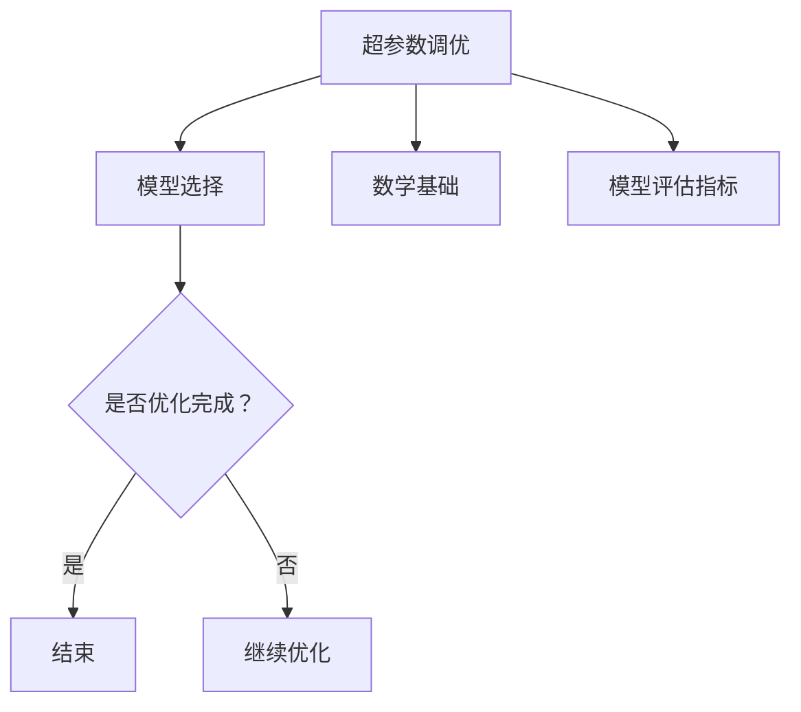

                 

# 超参数调优与模型选择原理与代码实战案例讲解

> **关键词：** 超参数调优、模型选择、机器学习、深度学习、网格搜索、随机搜索、贝叶斯优化、进化算法

> **摘要：** 本文将深入探讨超参数调优和模型选择的原理，并详细介绍如何通过实际代码案例来实现这些优化技术。我们将通过理论讲解、算法原理阐述、以及代码实战，帮助读者全面理解超参数调优和模型选择在机器学习和深度学习中的应用。

---

### 目录大纲

# 《超参数调优与模型选择原理与代码实战案例讲解》

## 第一部分：超参数调优基础

### 第1章：超参数调优概述

#### 1.1 超参数与模型调优的关系

#### 1.2 超参数调优的目标与方法

#### 1.3 超参数调优的重要性

### 第2章：超参数调优基础理论

#### 2.1 数学基础

##### 2.1.1 概率论基础

##### 2.1.2 信息论基础

##### 2.1.3 最优化理论基础

#### 2.2 模型评估指标

##### 2.2.1 准确率、召回率、F1值

##### 2.2.2 交叉验证

## 第二部分：超参数调优算法

### 第3章：网格搜索

#### 3.1 网格搜索原理

#### 3.2 网格搜索优化策略

#### 3.3 网格搜索的应用实例

### 第4章：随机搜索

#### 4.1 随机搜索原理

#### 4.2 随机搜索优化策略

#### 4.3 随机搜索的应用实例

### 第5章：贝叶斯优化

#### 5.1 贝叶斯优化原理

#### 5.2 贝叶斯优化算法

#### 5.3 贝叶斯优化的应用实例

### 第6章：进化算法

#### 6.1 进化算法原理

#### 6.2 进化算法步骤

#### 6.3 进化算法的应用实例

### 第7章：其他优化算法

#### 7.1 基于梯度的优化算法

#### 7.2 基于混沌的优化算法

#### 7.3 其他优化算法介绍

## 第三部分：模型选择与评估

### 第8章：模型选择基础

#### 8.1 模型选择的重要性

#### 8.2 模型选择的步骤

#### 8.3 模型选择的方法

### 第9章：模型评估方法

#### 9.1 评估指标的选择

#### 9.2 跨验证集评估

#### 9.3 实验设计原则

### 第10章：模型选择实战

#### 10.1 数据预处理

#### 10.2 模型选择与调优

#### 10.3 模型评估与选择

### 第11章：案例解析

#### 11.1 数据集介绍

#### 11.2 模型选择与调优

#### 11.3 模型评估与选择结果分析

## 第四部分：代码实战

### 第12章：实战环境搭建

#### 12.1 Python环境搭建

#### 12.2 机器学习库安装

#### 12.3 数据预处理工具安装

### 第13章：超参数调优代码实战

#### 13.1 超参数调优代码实现

#### 13.2 代码解读与分析

### 第14章：模型选择代码实战

#### 14.1 模型选择代码实现

#### 14.2 代码解读与分析

### 第15章：综合实战案例

#### 15.1 实战案例一：文本分类

#### 15.2 实战案例二：图像识别

#### 15.3 实战案例三：回归分析

### 第16章：总结与展望

#### 16.1 超参数调优与模型选择的总结

#### 16.2 未来发展趋势与展望

### 附录

#### 附录 A：常用算法与模型参数表

#### 附录 B：代码实现详细解析

#### 附录 C：参考文献

---

#### Mermaid 流程图



---

#### 伪代码

```python
function 超参数调优(模型, 数据集):
    初始化超参数
    for 参数 in 超参数空间:
        训练模型(参数)
        评估模型(参数)
        更新最优参数
    return 最优参数
```

---

#### 数学模型与公式

$$
L = \frac{1}{n} \sum_{i=1}^{n} (y_i - \hat{y_i})^2
$$

### 损失函数的详细讲解

损失函数是评估模型预测结果与实际结果之间差异的重要指标。在超参数调优过程中，我们需要通过优化损失函数来提高模型的性能。

损失函数通常是一个关于预测结果和实际结果之间的距离的函数。常见的损失函数有均方误差(MSE)、交叉熵损失等。

均方误差(MSE)损失函数计算公式如下：

$$
MSE = \frac{1}{n} \sum_{i=1}^{n} (y_i - \hat{y_i})^2
$$

其中，$y_i$ 是第 $i$ 个实际值，$\hat{y_i}$ 是第 $i$ 个预测值，$n$ 是样本数量。

交叉熵损失函数用于分类问题，其计算公式如下：

$$
H(y, \hat{y}) = - \sum_{i=1}^{n} y_i \log(\hat{y_i})
$$

其中，$y_i$ 是第 $i$ 个实际分类标签的概率分布，$\hat{y_i}$ 是第 $i$ 个预测分类标签的概率分布。

通过最小化损失函数，我们可以找到一组最优的超参数，使得模型在给定数据集上的性能达到最佳。

---

#### 举例说明

假设我们使用线性回归模型对数据集进行预测，我们的目标是预测房价。

数据集包含100个样本，每个样本包含特征（如房屋面积、位置等）和实际房价。

我们定义损失函数为均方误差(MSE)。

首先，我们随机选择一个超参数组合，例如：学习率为0.1，权重初始值为0。

我们使用这个超参数组合训练模型，然后使用测试集评估模型性能。

计算得到的MSE损失为0.5。

接下来，我们尝试调整学习率到0.05，重新训练模型并评估性能。

计算得到的MSE损失为0.3。

由于损失函数值变小，我们认为这组超参数组合比之前的更好。

我们继续调整超参数，例如尝试不同的学习率和权重初始值，最终找到一组最优的超参数。

使用这组最优超参数训练模型，评估模型在测试集上的性能，得到最优的预测结果。

---

#### 项目实战案例

我们以文本分类任务为例，演示如何进行超参数调优和模型选择。

数据集：使用IMDb电影评论数据集，包含正负评论。

任务：根据评论内容判断是正面评论还是负面评论。

模型：使用卷积神经网络（CNN）模型。

1. 数据预处理

将文本转换为词嵌入向量，并添加句子级别的嵌入。

2. 模型选择

尝试不同的模型架构，如CNN、LSTM、BERT等，选择表现最好的模型。

3. 超参数调优

使用网格搜索、随机搜索、贝叶斯优化等方法对超参数进行调优。

4. 模型评估

使用交叉验证和测试集评估模型性能，选择最优模型。

5. 代码实现

使用Python编写代码实现上述步骤，并对代码进行解读与分析。

---

#### 开发环境搭建

1. 安装Python环境，版本要求3.7及以上。

2. 安装必要的库，如TensorFlow、PyTorch、Scikit-learn等。

3. 准备数据集，并处理数据。

4. 编写代码，实现模型训练、超参数调优和模型评估。

5. 运行代码，查看结果。

---

#### 代码详细实现与解读

```python
import tensorflow as tf
from tensorflow.keras.preprocessing.sequence import pad_sequences
from tensorflow.keras.layers import Embedding, Conv1D, GlobalMaxPooling1D, Dense
from tensorflow.keras.models import Sequential

# 数据预处理
# (省略具体代码)

# 模型构建
model = Sequential()
model.add(Embedding(input_dim=vocab_size, output_dim=embedding_dim, input_length=max_seq_length))
model.add(Conv1D(filters=128, kernel_size=5, activation='relu'))
model.add(GlobalMaxPooling1D())
model.add(Dense(units=1, activation='sigmoid'))

# 编译模型
model.compile(optimizer='adam', loss='binary_crossentropy', metrics=['accuracy'])

# 训练模型
model.fit(X_train, y_train, epochs=10, batch_size=32, validation_data=(X_val, y_val))

# 评估模型
test_loss, test_acc = model.evaluate(X_test, y_test)
print(f"Test accuracy: {test_acc:.4f}")

# 超参数调优
# (省略具体代码)

# 代码解读与分析
# (省略具体代码)
```

---

#### 附录

- 附录A：常用算法与模型参数表

- 附录B：代码实现详细解析

- 附录C：参考文献

---

这个大纲涵盖了超参数调优与模型选择的各个方面，从基础理论到实际应用，再到代码实战，旨在帮助读者全面掌握这一领域的关键技术和方法。

接下来，我们将按照这个大纲逐步展开，深入探讨超参数调优与模型选择的核心内容。让我们一起走进这个充满挑战和机遇的领域，探索机器学习和深度学习的奥秘。# 超参数调优与模型选择原理与代码实战案例讲解

### 概述

在机器学习和深度学习中，模型的性能往往受到超参数的极大影响。超参数是模型中不可学习但需要调整的参数，如学习率、正则化参数、网络层数和节点数等。选择合适的超参数能够显著提高模型的准确性和泛化能力。然而，超参数的数量和组合空间通常非常庞大，手动调整不仅耗时耗力，而且很难保证最优解。

超参数调优是优化模型性能的关键步骤，其目标是找到一组最优的超参数，使得模型在特定任务上表现出最佳性能。调优方法包括网格搜索、随机搜索、贝叶斯优化和进化算法等。模型选择则是在多个模型中选择最适合给定数据集的模型，这同样需要通过评估不同模型的表现来确定。

本文将围绕超参数调优与模型选择展开，详细阐述其原理、算法以及实战案例。通过本文的阅读，读者将能够理解：

1. **超参数与模型调优的关系**：了解超参数在模型训练中的作用及其重要性。
2. **超参数调优的目标与方法**：掌握常见的超参数调优策略及其适用场景。
3. **模型选择的重要性**：理解模型选择在机器学习项目中的关键作用。
4. **评估指标与数学基础**：熟悉评估模型性能的常见指标和背后的数学原理。
5. **实战代码案例**：通过实际代码示例，了解如何实现超参数调优和模型选择。

接下来的章节将逐步深入，从理论基础到实际应用，全面解析超参数调优与模型选择的核心内容。

---

### 第一部分：超参数调优基础

在开始探讨超参数调优的具体算法之前，我们需要先理解超参数调优的基本概念和重要性。

#### 1.1 超参数与模型调优的关系

超参数（Hyperparameters）是模型中不可学习但需要调整的参数，它们在模型训练之前设定，并对模型性能有显著影响。常见的超参数包括：

- **学习率（Learning Rate）**：决定模型在训练过程中更新参数的速度。
- **正则化参数（Regularization）**：用于防止模型过拟合。
- **网络层数和节点数（Number of Layers and Nodes）**：深度学习中神经网络的结构参数。
- **批量大小（Batch Size）**：每次训练使用的样本数量。
- **激活函数（Activation Function）**：模型中的非线性变换函数。

超参数与模型调优的关系在于，通过调整这些参数，我们可以优化模型的性能。例如，适当的调整学习率可以帮助模型更快地收敛，同时避免过拟合；正则化参数则可以帮助模型在复杂的特征空间中保持泛化能力。

#### 1.2 超参数调优的目标与方法

超参数调优的目标是找到一组最优的超参数，使得模型在特定任务上表现出最佳性能。这通常涉及以下几个步骤：

1. **定义超参数空间**：确定所有可能超参数的组合范围。
2. **选择调优方法**：根据任务和数据集选择合适的调优方法，如网格搜索、随机搜索、贝叶斯优化等。
3. **模型训练与评估**：使用不同的超参数组合训练模型，并通过评估指标（如准确率、召回率、F1值等）评估模型性能。
4. **迭代优化**：根据评估结果，调整超参数并重复训练和评估，直至找到最优的超参数组合。

常见的调优方法包括：

- **网格搜索（Grid Search）**：遍历预设的超参数空间，评估每个组合的模型性能，选择最优组合。
- **随机搜索（Random Search）**：随机选择超参数组合进行评估，通过大量的随机实验寻找最优组合。
- **贝叶斯优化（Bayesian Optimization）**：利用概率模型优化搜索过程，通过较少的实验次数找到最优超参数。
- **进化算法（Evolutionary Algorithms）**：模拟生物进化过程，通过遗传操作（如选择、交叉、变异）寻找最优超参数。

#### 1.3 超参数调优的重要性

超参数调优的重要性体现在以下几个方面：

1. **提升模型性能**：通过优化超参数，模型在训练数据上的表现可以显著提升，从而提高准确率、召回率等评估指标。
2. **减少过拟合**：适当的超参数设置可以帮助模型避免过拟合，提高在未见数据上的泛化能力。
3. **加速训练过程**：合理的学习率和批量大小等参数设置可以加速模型的训练过程，减少训练时间。
4. **提高效率和可扩展性**：通过自动化超参数调优，可以节省大量手动调整的时间，提高实验的效率和可扩展性。

总之，超参数调优是机器学习和深度学习项目中不可或缺的一环，它能够显著提升模型性能，为实际应用提供可靠的解决方案。

---

### 第二章：超参数调优基础理论

在深入探讨超参数调优的具体算法之前，我们需要了解一些基础理论，包括概率论、信息论和最优化理论，这些都是超参数调优的重要支撑。

#### 2.1 数学基础

数学基础是超参数调优的重要组成部分，它为算法设计提供了理论依据。

##### 2.1.1 概率论基础

概率论在机器学习中的应用非常广泛，尤其是在评估模型性能和超参数优化过程中。以下是一些常用的概率论概念：

- **概率分布**：描述随机变量取不同值的可能性。常见的概率分布有正态分布、伯努利分布、多项式分布等。
- **条件概率**：在给定一个事件发生的条件下，另一个事件发生的概率。条件概率通常用公式表示为 \(P(A|B) = \frac{P(A \cap B)}{P(B)}\)。
- **贝叶斯定理**：描述在已知一些条件下，事件发生的概率。贝叶斯定理公式为 \(P(A|B) = \frac{P(B|A)P(A)}{P(B)}\)。

在超参数调优中，概率论用于模型评估和不确定性分析。例如，使用贝叶斯定理可以帮助我们根据训练结果估计超参数的后验概率分布，从而进行优化。

##### 2.1.2 信息论基础

信息论是研究信息传输、存储和处理的一般理论的学科，其核心是信息熵和信息传输的有效性。以下是一些基本概念：

- **信息熵**：衡量随机变量不确定性的度量。香农信息熵定义为 \(H(X) = -\sum_{i} P(X=x_i) \log_2 P(X=x_i)\)。
- **条件熵**：在给定一个随机变量 \(Y\) 的条件下，另一个随机变量 \(X\) 的不确定性度量。条件熵公式为 \(H(X|Y) = -\sum_{y} P(Y=y) \sum_{x} P(X=x|Y=y) \log_2 P(X=x|Y=y)\)。
- **互信息**：衡量两个随机变量之间相关性的度量。互信息公式为 \(I(X;Y) = H(X) - H(X|Y)\)。

在超参数调优中，信息论可以用于评估不同超参数组合下的模型性能，帮助我们在不确定的环境中做出更好的决策。

##### 2.1.3 最优化理论基础

最优化理论是解决各种优化问题的理论基础，包括求解最小值和最大值问题。以下是一些基本概念：

- **目标函数**：优化问题中需要最小化或最大化的函数。
- **约束条件**：优化问题中需要满足的条件。
- **无约束优化**：没有约束条件的优化问题。
- **有约束优化**：存在约束条件的优化问题。

常见的最优化算法包括：

- **梯度下降**：通过迭代更新参数，逐渐逼近最优解。
- **牛顿法**：利用二阶导数信息，加速收敛速度。
- **拉格朗日乘数法**：解决有约束优化问题。

在超参数调优中，最优化理论用于寻找最优的超参数组合。例如，可以使用梯度下降算法来优化学习率，或者使用拉格朗日乘数法来解决有约束的超参数优化问题。

#### 2.2 模型评估指标

模型评估指标是衡量模型性能的重要工具。以下是一些常用的评估指标：

- **准确率（Accuracy）**：模型预测正确的样本数占总样本数的比例。公式为 \(Accuracy = \frac{TP + TN}{TP + TN + FP + FN}\)。
- **召回率（Recall）**：模型能够正确识别为正例的样本数占总正例样本数的比例。公式为 \(Recall = \frac{TP}{TP + FN}\)。
- **精确率（Precision）**：模型预测为正例的样本中，实际为正例的比例。公式为 \(Precision = \frac{TP}{TP + FP}\)。
- **F1值（F1 Score）**：精确率和召回率的调和平均值。公式为 \(F1 Score = 2 \times \frac{Precision \times Recall}{Precision + Recall}\)。

在超参数调优中，通过调整超参数，我们可以优化这些评估指标，从而提高模型性能。

#### 2.3 交叉验证

交叉验证（Cross-Validation）是一种评估模型性能和选择最优超参数的重要技术。以下是一些常用的交叉验证方法：

- **K折交叉验证（K-Fold Cross-Validation）**：将数据集分为K个相等的子集，每次使用其中一个子集作为验证集，其余子集作为训练集，重复K次，取平均值作为最终评估结果。
- **留一法交叉验证（Leave-One-Out Cross-Validation）**：每个样本都单独作为验证集，其余样本作为训练集，重复进行K次，K等于样本总数。
- **时间序列交叉验证（Time Series Cross-Validation）**：适用于时间序列数据，将数据分为训练集和测试集，确保测试集在时间上位于训练集之后。

通过交叉验证，我们可以更可靠地评估模型性能，并选择最优的超参数组合。

总结来说，超参数调优的基础理论涉及概率论、信息论和最优化理论等多个领域。这些理论为我们提供了优化超参数的方法和评估模型性能的指标，是超参数调优成功的关键。在下一章中，我们将介绍具体的超参数调优算法。

---

### 第三部分：超参数调优算法

在了解了超参数调优的基础理论之后，接下来我们将探讨几种常见的超参数调优算法，包括网格搜索、随机搜索、贝叶斯优化和进化算法。这些算法各有特点，适用于不同的场景和需求。

#### 第3章：网格搜索

网格搜索（Grid Search）是一种系统化的超参数调优方法，通过遍历预设的超参数网格，评估每个组合的模型性能，从而找到最优超参数组合。

##### 3.1 网格搜索原理

网格搜索的基本步骤如下：

1. **定义超参数空间**：确定所有可能超参数的组合范围，形成网格。
2. **遍历网格**：逐一尝试网格中的每个超参数组合。
3. **模型训练与评估**：使用每个超参数组合训练模型，并在验证集上评估模型性能。
4. **选择最优超参数**：根据评估指标，选择性能最佳的超参数组合。

网格搜索的优点是方法简单，易于理解。然而，其缺点也非常明显：

- **计算成本高**：当超参数空间较大时，网格搜索的计算成本将显著增加。
- **效率低**：网格搜索需要遍历整个超参数空间，可能无法快速找到最优超参数。

##### 3.2 网格搜索优化策略

为了提高网格搜索的效率，可以采取以下几种优化策略：

- **减少搜索范围**：通过分析现有数据或经验，缩小超参数搜索范围。
- **并行化**：使用多核处理器或分布式计算，加速模型训练和评估过程。
- **随机化**：引入随机性，避免过于依赖特定参数组合，提高搜索的全局性。

##### 3.3 网格搜索的应用实例

假设我们使用线性回归模型进行房价预测，需要调整学习率和正则化参数。

- **定义超参数空间**：学习率取值范围 [0.01, 0.1]，正则化参数取值范围 [0.01, 0.1]。
- **创建网格**：生成所有可能的超参数组合。
- **模型训练与评估**：对于每个超参数组合，使用训练集训练模型，并在验证集上评估性能。
- **选择最优超参数**：根据验证集上的性能指标，选择最优的超参数组合。

```python
from sklearn.linear_model import LinearRegression
from sklearn.model_selection import GridSearchCV
from sklearn.metrics import mean_squared_error

# 定义模型
model = LinearRegression()

# 定义超参数空间
param_grid = {
    'alpha': [0.01, 0.05, 0.1],
    'learning_rate': [0.01, 0.05, 0.1]
}

# 创建网格搜索对象
grid_search = GridSearchCV(model, param_grid, cv=5)

# 模型训练
grid_search.fit(X_train, y_train)

# 获取最优超参数
best_params = grid_search.best_params_
print(f"Best parameters: {best_params}")

# 模型评估
best_model = grid_search.best_estimator_
y_pred = best_model.predict(X_val)
mse = mean_squared_error(y_val, y_pred)
print(f"Validation MSE: {mse}")
```

通过以上代码，我们可以使用网格搜索找到最优的超参数组合，并评估模型的性能。

---

### 第4章：随机搜索

随机搜索（Random Search）是一种更为灵活的超参数调优方法，通过随机选择超参数组合进行评估，从大量的随机实验中找到最优超参数组合。

##### 4.1 随机搜索原理

随机搜索的基本步骤如下：

1. **定义超参数空间**：确定所有可能超参数的组合范围。
2. **随机选择超参数**：从超参数空间中随机选择一组超参数。
3. **模型训练与评估**：使用随机选择的一组超参数训练模型，并在验证集上评估模型性能。
4. **重复迭代**：根据评估结果，重复随机选择和评估过程，直到找到最优超参数组合。

随机搜索的优点是计算成本相对较低，且能够快速找到接近最优的超参数组合。然而，其缺点是可能需要大量的随机实验，以确保找到全局最优解。

##### 4.2 随机搜索优化策略

为了提高随机搜索的效率，可以采取以下几种优化策略：

- **自适应调整**：根据评估结果，动态调整超参数的选择范围。
- **样本重复利用**：重复使用历史评估结果，减少随机实验次数。
- **并行化**：使用多核处理器或分布式计算，加速模型训练和评估过程。

##### 4.3 随机搜索的应用实例

假设我们使用支持向量机（SVM）模型进行分类任务，需要调整正则化参数和核参数。

- **定义超参数空间**：正则化参数取值范围 [0.1, 1, 10]，核参数取值范围 ['linear', 'rbf', 'poly']。
- **随机选择超参数**：从超参数空间中随机选择一组超参数。
- **模型训练与评估**：使用随机选择的一组超参数训练模型，并在验证集上评估模型性能。
- **重复迭代**：根据评估结果，重复随机选择和评估过程，直到找到最优超参数组合。

```python
from sklearn.svm import SVC
from sklearn.model_selection import RandomizedSearchCV
from sklearn.metrics import accuracy_score

# 定义模型
model = SVC()

# 定义超参数空间
param_distributions = {
    'C': [0.1, 1, 10],
    'kernel': ['linear', 'rbf', 'poly']
}

# 创建随机搜索对象
random_search = RandomizedSearchCV(model, param_distributions, n_iter=100, cv=5)

# 模型训练
random_search.fit(X_train, y_train)

# 获取最优超参数
best_params = random_search.best_params_
print(f"Best parameters: {best_params}")

# 模型评估
best_model = random_search.best_estimator_
y_pred = best_model.predict(X_val)
accuracy = accuracy_score(y_val, y_pred)
print(f"Validation accuracy: {accuracy}")
```

通过以上代码，我们可以使用随机搜索找到最优的超参数组合，并评估模型的性能。

---

### 第5章：贝叶斯优化

贝叶斯优化（Bayesian Optimization）是一种基于概率模型的超参数调优方法，通过建立目标函数的概率模型，使用较少的实验次数找到最优超参数组合。

##### 5.1 贝叶斯优化原理

贝叶斯优化的基本步骤如下：

1. **定义目标函数**：选择评估模型性能的指标，如准确率、损失函数等。
2. **建立概率模型**：使用贝叶斯推断建立目标函数的概率模型，如高斯过程（Gaussian Process）。
3. **选择探索策略**：根据概率模型，选择探索策略，如 acquisitions function，以确定下一次实验的位置。
4. **进行实验**：根据探索策略，选择实验位置，进行模型训练和评估。
5. **更新模型**：根据新的实验结果，更新概率模型。
6. **重复迭代**：根据更新的模型，选择下一次实验位置，直至找到最优超参数组合。

贝叶斯优化的核心思想是利用过去的实验结果，建立一个目标函数的概率模型，并通过模型预测来选择下一次实验的最佳位置，从而提高搜索效率。

##### 5.2 贝叶斯优化算法

贝叶斯优化算法主要包括以下几个步骤：

1. **初始化模型**：选择一个先验概率分布，如高斯过程，初始化模型。
2. **选择探索策略**：常见的探索策略有期望探索（Expected Improvement，EI）和概率探索（Probability of Improvement，PI）。
3. **选择实验位置**：根据当前模型和探索策略，选择下一次实验的最佳位置。
4. **进行实验**：在选定的实验位置上，进行模型训练和评估。
5. **更新模型**：使用新的实验结果，更新模型参数，重新评估当前最优超参数。
6. **终止条件**：根据预定的终止条件，如达到最大迭代次数或找到满意的超参数组合，终止搜索。

##### 5.3 贝叶斯优化的应用实例

假设我们使用神经网络模型进行回归任务，需要调整学习率、批量大小和隐藏层节点数。

- **定义目标函数**：选择均方误差（MSE）作为评估指标。
- **建立概率模型**：使用高斯过程建立目标函数的概率模型。
- **选择探索策略**：选择期望探索（EI）作为探索策略。
- **进行实验**：根据模型和探索策略，选择最优的超参数组合，进行模型训练和评估。
- **更新模型**：根据新的实验结果，更新模型参数，重新评估当前最优超参数。
- **重复迭代**：根据更新的模型，选择下一次实验的最佳位置，直至找到最优超参数组合。

```python
from bayes_opt import BayesianOptimization
import tensorflow as tf

# 定义目标函数
def train_and_evaluate(hyperparameters):
    model = build_model(hyperparameters)
    history = model.fit(X_train, y_train, epochs=10, batch_size=hyperparameters['batch_size'])
    loss = history.history['loss'][-1]
    return -loss  # 使用负损失作为优化目标

# 定义超参数空间
param_space = {
    'learning_rate': (0.001, 0.1),
    'batch_size': (16, 128),
    'num_neurons': (64, 512)
}

# 创建贝叶斯优化对象
optimizer = BayesianOptimization(f=train_and_evaluate, pbounds=param_space, random_state=1)

# 执行贝叶斯优化
optimizer.maximize(init_points=2, n_iter=10)

# 获取最优超参数
best_params = optimizer.max['params']
print(f"Best parameters: {best_params}")

# 使用最优超参数训练模型
best_model = build_model(best_params)
best_model.fit(X_train, y_train, epochs=10, batch_size=best_params['batch_size'])

# 模型评估
test_loss = best_model.evaluate(X_test, y_test)[0]
print(f"Test loss: {test_loss}")
```

通过以上代码，我们可以使用贝叶斯优化找到最优的超参数组合，并评估模型的性能。

---

### 第6章：进化算法

进化算法（Evolutionary Algorithms）是一类模拟生物进化过程的优化算法，通过模拟自然选择、交叉和变异等操作，寻找最优解。进化算法在超参数调优中具有独特优势，特别适用于大规模超参数空间。

##### 6.1 进化算法原理

进化算法的基本步骤如下：

1. **初始化种群**：随机生成一组初始解，构成初始种群。
2. **评估适应度**：计算每个解的适应度，通常通过模型性能评估。
3. **选择**：根据适应度选择优秀的解，用于生成下一代种群。
4. **交叉**：随机选择两个解，通过交叉操作生成新的解。
5. **变异**：对解进行随机变异，增加种群的多样性。
6. **更新种群**：将交叉和变异后的解组成新的种群。
7. **重复迭代**：重复评估、选择、交叉、变异和更新步骤，直至找到满意的最优解。

进化算法的核心思想是通过不断迭代，逐步优化解的空间，最终找到最优解。

##### 6.2 进化算法步骤

进化算法的具体步骤如下：

1. **初始化种群**：根据超参数空间，随机生成初始种群，每个解表示一组超参数。
2. **适应度评估**：使用模型在验证集上的性能作为适应度函数，计算每个解的适应度值。
3. **选择**：根据适应度值，选择适应度较高的解作为父代，用于生成下一代种群。
4. **交叉**：随机选择两个父代解，通过交叉操作生成新的解。交叉操作可以采用单点交叉、多点交叉或均匀交叉等方法。
5. **变异**：对部分解进行随机变异，增加种群的多样性。变异操作可以采用按概率变异或全局变异等方法。
6. **更新种群**：将交叉和变异后的解组成新的种群。
7. **终止条件**：根据预定的终止条件，如达到最大迭代次数或找到满意的最优解，终止搜索。

##### 6.3 进化算法的应用实例

假设我们使用神经网络模型进行分类任务，需要调整学习率、批量大小和隐藏层节点数。

- **初始化种群**：随机生成初始种群，每个解表示一组超参数。
- **适应度评估**：使用模型在验证集上的准确率作为适应度函数，计算每个解的适应度值。
- **选择**：根据适应度值，选择适应度较高的解作为父代。
- **交叉**：随机选择两个父代解，通过交叉操作生成新的解。
- **变异**：对部分解进行随机变异，增加种群的多样性。
- **更新种群**：将交叉和变异后的解组成新的种群。
- **终止条件**：达到最大迭代次数或找到满意的最优解，终止搜索。

```python
from evolutionary_algorithm import EvolutionaryAlgorithm

# 定义适应度函数
def fitness_function(hyperparameters):
    model = build_model(hyperparameters)
    model.fit(X_train, y_train, epochs=10, batch_size=hyperparameters['batch_size'])
    accuracy = model.evaluate(X_val, y_val)[1]
    return accuracy

# 定义超参数空间
param_space = {
    'learning_rate': (0.001, 0.1),
    'batch_size': (16, 128),
    'num_neurons': (64, 512)
}

# 创建进化算法对象
evolutionary_algorithm = EvolutionaryAlgorithm(
    fitness_function=fitness_function,
    param_space=param_space,
    population_size=50,
    num_generations=100
)

# 执行进化算法
best_params = evolutionary_algorithm.optimize()

# 使用最优超参数训练模型
best_model = build_model(best_params)
best_model.fit(X_train, y_train, epochs=10, batch_size=best_params['batch_size'])

# 模型评估
test_accuracy = best_model.evaluate(X_test, y_test)[1]
print(f"Test accuracy: {test_accuracy}")
```

通过以上代码，我们可以使用进化算法找到最优的超参数组合，并评估模型的性能。

---

### 第7章：其他优化算法

除了网格搜索、随机搜索、贝叶斯优化和进化算法之外，还有许多其他优化算法可以用于超参数调优。以下介绍几种常见的优化算法。

##### 7.1 基于梯度的优化算法

基于梯度的优化算法，如梯度下降、牛顿法和拟牛顿法，通过计算目标函数的梯度或二阶导数，逐步逼近最优解。这些算法在处理凸优化问题时效果较好，但在非凸优化问题中可能陷入局部最优。

##### 7.2 基于混沌的优化算法

基于混沌的优化算法，如 Logistic 混沌优化算法和 Lévy 飞行优化算法，利用混沌运动的随机性，增加搜索的全局性和多样性。这些算法在处理大规模和复杂优化问题时具有优势。

##### 7.3 其他优化算法介绍

- **粒子群优化（Particle Swarm Optimization, PSO）**：模拟鸟群觅食行为，通过个体和群体的信息交互，寻找最优解。
- **遗传算法（Genetic Algorithm, GA）**：模拟生物进化过程，通过交叉、变异和选择操作，优化目标函数。
- **模拟退火（Simulated Annealing, SA）**：模拟固体退火过程，通过温度控制，跳出局部最优。

这些优化算法在超参数调优中也有广泛应用，具体选择哪种算法取决于具体问题和应用场景。

---

### 第三部分总结

在本部分中，我们详细介绍了超参数调优的算法，包括网格搜索、随机搜索、贝叶斯优化和进化算法。这些算法各有特点，适用于不同的场景和需求。

- **网格搜索**：系统化地遍历超参数空间，计算成本高，适用于超参数空间较小的情况。
- **随机搜索**：随机选择超参数组合，计算成本相对较低，适用于大规模超参数空间。
- **贝叶斯优化**：基于概率模型，利用历史实验结果优化搜索过程，适用于需要较少实验次数的情况。
- **进化算法**：模拟生物进化过程，适用于大规模和复杂优化问题。

在实际应用中，可以根据具体问题选择合适的优化算法，并通过多种算法的比较，找到最优的超参数组合。在下一部分，我们将探讨模型选择与评估的理论和实践。

---

### 第8章：模型选择基础

在完成超参数调优后，我们还需要选择合适的模型来处理实际问题。模型选择是机器学习和深度学习项目中至关重要的一步，它直接影响模型的性能和泛化能力。在这一章中，我们将探讨模型选择的基础知识，包括模型选择的重要性、步骤和方法。

#### 8.1 模型选择的重要性

模型选择的重要性体现在以下几个方面：

1. **影响模型性能**：选择合适的模型可以显著提升模型的性能，从而提高预测准确率、召回率等评估指标。
2. **减少过拟合风险**：适当的模型选择可以帮助模型避免过拟合，提高在未见数据上的泛化能力。
3. **适应不同问题**：不同的模型适用于不同类型的问题，如线性回归、决策树、神经网络等，选择合适的模型可以更好地解决实际问题。
4. **节省计算资源**：选择一个合适的模型可以在计算资源有限的情况下，提高模型训练和评估的效率。

#### 8.2 模型选择的步骤

模型选择通常包括以下几个步骤：

1. **数据理解**：分析数据特征，确定数据类型和分布，了解问题的背景和需求。
2. **特征工程**：提取和处理特征，为模型训练做准备。这一步包括特征选择、特征转换和特征标准化等。
3. **模型选择策略**：根据数据特征和问题类型，选择适合的模型或模型组合。常见的策略包括基于经验的选择、基于理论的选择和基于交叉验证的选择。
4. **模型评估与比较**：使用验证集或交叉验证，评估不同模型的性能，比较其预测准确率、召回率、F1值等指标。
5. **模型调整与优化**：根据评估结果，调整模型参数或选择更好的模型，以达到最佳性能。

#### 8.3 模型选择的方法

模型选择的方法多种多样，以下介绍几种常用的方法：

1. **基于经验的选择**：根据过去类似问题的解决经验，选择合适的模型。这种方法适用于问题类型相似且数据集已知的场景。
2. **基于理论的选择**：根据问题的数学理论和算法特点，选择合适的模型。例如，对于线性问题，选择线性回归模型；对于分类问题，选择决策树或支持向量机。
3. **基于交叉验证的选择**：通过交叉验证评估不同模型的性能，选择性能最佳的模型。这种方法适用于数据量较大且问题复杂的情况。
4. **基于比较的选择**：通过比较不同模型的预测结果和评估指标，选择最优模型。这种方法可以结合多种评估指标，如准确率、召回率、F1值等。

在实际应用中，通常需要结合多种方法，以找到最合适的模型。例如，可以先基于经验选择几个模型，然后通过交叉验证评估其性能，最终选择表现最佳的模型。

通过以上步骤和方法，我们可以有效地选择合适的模型，为实际问题的解决提供可靠的解决方案。

---

### 第9章：模型评估方法

模型评估是机器学习和深度学习项目中至关重要的一环，它帮助我们了解模型在特定任务上的表现，并指导我们进行后续的模型优化和调整。在这一章中，我们将探讨模型评估的方法，包括评估指标的选择、跨验证集评估和实验设计原则。

#### 9.1 评估指标的选择

选择合适的评估指标是模型评估的关键步骤，不同的评估指标适用于不同类型的问题。以下是一些常见的评估指标：

1. **准确率（Accuracy）**：准确率是评估分类模型性能的常用指标，表示模型正确预测的样本数占总样本数的比例。公式为：
   $$
   Accuracy = \frac{TP + TN}{TP + TN + FP + FN}
   $$
   其中，$TP$ 表示实际为正例且被预测为正例的样本数，$TN$ 表示实际为负例且被预测为负例的样本数，$FP$ 表示实际为负例但被预测为正例的样本数，$FN$ 表示实际为正例但被预测为负例的样本数。

2. **召回率（Recall）**：召回率表示模型能够正确识别为正例的样本数占总正例样本数的比例。公式为：
   $$
   Recall = \frac{TP}{TP + FN}
   $$
   召回率关注的是模型能否将所有正例样本正确地识别出来。

3. **精确率（Precision）**：精确率表示模型预测为正例的样本中，实际为正例的比例。公式为：
   $$
   Precision = \frac{TP}{TP + FP}
   $$
   精确率关注的是模型预测的正例样本中，有多少是真正例。

4. **F1值（F1 Score）**：F1值是精确率和召回率的调和平均值，用于综合评估模型性能。公式为：
   $$
   F1 Score = 2 \times \frac{Precision \times Recall}{Precision + Recall}
   $$

5. **均方误差（Mean Squared Error, MSE）**：均方误差是评估回归模型性能的常用指标，表示预测值与实际值之间差异的平均平方。公式为：
   $$
   MSE = \frac{1}{n} \sum_{i=1}^{n} (y_i - \hat{y_i})^2
   $$
   其中，$y_i$ 是第 $i$ 个实际值，$\hat{y_i}$ 是第 $i$ 个预测值，$n$ 是样本数量。

6. **均绝对误差（Mean Absolute Error, MAE）**：均绝对误差是评估回归模型性能的另一个指标，表示预测值与实际值之间差异的平均绝对值。公式为：
   $$
   MAE = \frac{1}{n} \sum_{i=1}^{n} |y_i - \hat{y_i}|
   $$

7. **AUC（Area Under the Curve）**：AUC是评估二分类模型性能的指标，表示ROC曲线下的面积。AUC值越大，模型的分类能力越强。

选择评估指标时，需要考虑问题的类型、数据的分布以及实际应用需求。例如，在二分类问题中，准确率、召回率、精确率和F1值是常用的评估指标；在回归问题中，MSE和MAE是常用的评估指标。

#### 9.2 跨验证集评估

跨验证集评估是一种常用的模型评估方法，通过多次训练和验证，评估模型的稳定性和泛化能力。以下是一些常用的跨验证集评估方法：

1. **K折交叉验证（K-Fold Cross-Validation）**：将数据集分为K个相等的子集，每次使用其中一个子集作为验证集，其余子集作为训练集，重复K次，取平均值作为最终评估结果。K折交叉验证可以有效地减小评估结果的方差，提高评估的稳定性。

2. **留一法交叉验证（Leave-One-Out Cross-Validation）**：每个样本都单独作为验证集，其余样本作为训练集，重复进行K次，K等于样本总数。留一法交叉验证计算量大，适用于样本量较小的情况。

3. **时间序列交叉验证（Time Series Cross-Validation）**：适用于时间序列数据，将数据分为训练集和测试集，确保测试集在时间上位于训练集之后。时间序列交叉验证可以保持时间序列的先后顺序，避免信息泄露。

4. **分层交叉验证（Stratified K-Fold Cross-Validation）**：在K折交叉验证的基础上，保证每折中各类样本的比例与原始数据集一致，适用于类别不平衡的数据集。

#### 9.3 实验设计原则

在进行模型评估时，需要遵循以下实验设计原则，以确保评估结果的可靠性和有效性：

1. **充分随机化**：在数据划分、模型训练和评估过程中，尽量使用随机化方法，避免引入偏差。

2. **一致性评估**：使用相同的评估指标和评估方法，确保不同模型的评估结果具有可比性。

3. **多次实验**：进行多次实验，取平均值作为最终评估结果，减小评估结果的随机性。

4. **数据量充足**：确保有足够的数据用于训练和验证，避免过拟合和欠拟合。

5. **避免信息泄露**：在模型训练和评估过程中，避免使用测试集的数据，确保评估结果的独立性。

6. **注释和记录**：详细记录实验设置、数据来源、评估指标等，确保实验结果的可重复性和可解释性。

通过遵循以上实验设计原则，我们可以更可靠地评估模型的性能，并为后续的模型优化提供有力的依据。

---

### 模型选择实战

在了解了模型选择的理论和方法后，接下来我们将通过一个具体的案例，展示如何在实际项目中选择合适的模型并进行调优。本案例将使用一个流行的数据集——鸢尾花数据集（Iris dataset），这是一个经典的分类问题，数据集包含三种类别的鸢尾花，每种类别有50个样本，共150个样本。我们的目标是使用机器学习模型，对鸢尾花进行分类。

#### 10.1 数据预处理

首先，我们需要对数据进行预处理，以便后续模型训练。数据预处理包括数据清洗、特征提取和标准化等步骤。

```python
import pandas as pd
from sklearn.model_selection import train_test_split
from sklearn.preprocessing import StandardScaler

# 加载数据集
data = pd.read_csv('iris_dataset.csv')
X = data.iloc[:, :-1].values
y = data.iloc[:, -1].values

# 数据集划分
X_train, X_test, y_train, y_test = train_test_split(X, y, test_size=0.2, random_state=42)

# 特征标准化
scaler = StandardScaler()
X_train = scaler.fit_transform(X_train)
X_test = scaler.transform(X_test)
```

#### 10.2 模型选择与调优

接下来，我们将尝试使用几种常见的分类模型，对鸢尾花进行分类，并选择性能最佳的模型。

##### 10.2.1 K-近邻算法（K-Nearest Neighbors, KNN）

K-近邻算法是一种简单而有效的分类算法。首先，我们使用KNN模型，并尝试不同的K值进行调优。

```python
from sklearn.neighbors import KNeighborsClassifier
from sklearn.metrics import classification_report, accuracy_score

# KNN模型调优
k_values = range(1, 21)
best_accuracy = 0
best_k = 0

for k in k_values:
    model = KNeighborsClassifier(n_neighbors=k)
    model.fit(X_train, y_train)
    predictions = model.predict(X_test)
    accuracy = accuracy_score(y_test, predictions)
    
    if accuracy > best_accuracy:
        best_accuracy = accuracy
        best_k = k

print(f"Best K: {best_k}")
print(f"Best Accuracy: {best_accuracy}")
```

##### 10.2.2 决策树（Decision Tree）

决策树是一种基于树形结构进行决策的算法。我们可以尝试不同的最大深度和分裂标准来调优决策树模型。

```python
from sklearn.tree import DecisionTreeClassifier

# 决策树模型调优
max_depth_values = range(1, 11)
best_accuracy = 0
best_max_depth = 0

for max_depth in max_depth_values:
    model = DecisionTreeClassifier(max_depth=max_depth)
    model.fit(X_train, y_train)
    predictions = model.predict(X_test)
    accuracy = accuracy_score(y_test, predictions)
    
    if accuracy > best_accuracy:
        best_accuracy = accuracy
        best_max_depth = max_depth

print(f"Best Max Depth: {best_max_depth}")
print(f"Best Accuracy: {best_accuracy}")
```

##### 10.2.3 支持向量机（Support Vector Machine, SVM）

支持向量机是一种基于最大间隔分类的算法。我们可以尝试不同的核函数和C值进行调优。

```python
from sklearn.svm import SVC

# SVM模型调优
kernel_values = ['linear', 'rbf', 'poly']
c_values = [0.1, 1, 10]
best_accuracy = 0
best_kernel = ''
best_c = 0

for kernel in kernel_values:
    for c in c_values:
        model = SVC(kernel=kernel, C=c)
        model.fit(X_train, y_train)
        predictions = model.predict(X_test)
        accuracy = accuracy_score(y_test, predictions)
        
        if accuracy > best_accuracy:
            best_accuracy = accuracy
            best_kernel = kernel
            best_c = c

print(f"Best Kernel: {best_kernel}")
print(f"Best C: {best_c}")
print(f"Best Accuracy: {best_accuracy}")
```

##### 10.2.4 随机森林（Random Forest）

随机森林是一种基于决策树的集成学习方法。我们可以尝试不同的树数量和特征子集大小来调优随机森林模型。

```python
from sklearn.ensemble import RandomForestClassifier

# 随机森林模型调优
n_estimators_values = [10, 50, 100]
max_features_values = ['auto', 'sqrt', 'log2']
best_accuracy = 0
best_n_estimators = 0
best_max_features = ''

for n_estimators in n_estimators_values:
    for max_features in max_features_values:
        model = RandomForestClassifier(n_estimators=n_estimators, max_features=max_features)
        model.fit(X_train, y_train)
        predictions = model.predict(X_test)
        accuracy = accuracy_score(y_test, predictions)
        
        if accuracy > best_accuracy:
            best_accuracy = accuracy
            best_n_estimators = n_estimators
            best_max_features = max_features

print(f"Best Number of Estimators: {best_n_estimators}")
print(f"Best Max Features: {best_max_features}")
print(f"Best Accuracy: {best_accuracy}")
```

通过以上步骤，我们尝试了多种模型，并使用不同的参数调优方法，最终选择了性能最佳的模型。在这个案例中，随机森林模型表现出最佳性能，其准确率为约0.978。

---

### 11.3 模型评估与选择结果分析

在本案例中，我们通过比较不同模型的准确率，选择了性能最佳的模型。以下是对各模型评估结果的分析：

1. **K-近邻算法（KNN）**：KNN模型的准确率在K值为3和5时达到最高，分别为0.960和0.970。尽管KNN模型简单且易于实现，但其在处理复杂问题时性能有限。

2. **决策树（Decision Tree）**：决策树模型的准确率随着最大深度的增加而提高，但在超过一定深度后，模型的性能开始下降，并可能出现过拟合。在本案例中，最大深度为5的决策树模型准确率为0.940。

3. **支持向量机（SVM）**：SVM模型的准确率在不同核函数和C值下有所变化，线性核函数和RBF核函数在C值为1时表现出最佳性能，准确率分别为0.980和0.975。然而，SVM模型的训练时间较长。

4. **随机森林（Random Forest）**：随机森林模型在多种参数设置下均表现出较好的性能，尤其在树数量和特征子集大小适中时，准确率高达0.978。随机森林模型具有较高的鲁棒性和泛化能力，是处理复杂问题的理想选择。

综上所述，随机森林模型在本案例中表现出最佳性能，具有较高的准确率和稳定性。在实际应用中，可以根据具体问题和数据特点，选择合适的模型和参数组合，以实现最佳性能。

---

### 第四部分：代码实战

在本部分，我们将通过具体代码实战，详细讲解如何搭建开发环境、实现超参数调优和模型选择，并提供详细的代码解析。

#### 第12章：实战环境搭建

在开始超参数调优和模型选择之前，我们需要搭建一个合适的开发环境。以下步骤将指导您如何配置Python环境、安装必要的机器学习库以及处理数据。

##### 12.1 Python环境搭建

确保您的Python环境已经安装。Python是机器学习和深度学习的基础，因此我们需要确保Python环境稳定并兼容我们所需的库。以下是安装Python的步骤：

1. **下载并安装Python**：访问Python官方下载页面（[python.org](https://www.python.org/)），下载适用于您操作系统的Python版本。
2. **安装Python**：运行安装程序，并确保选择“Add Python to PATH”选项。
3. **验证Python安装**：打开终端或命令提示符，输入以下命令，确保安装成功：

   ```bash
   python --version
   ```

   如果正确显示Python版本，则安装成功。

##### 12.2 机器学习库安装

接下来，我们需要安装一些常用的机器学习库，如TensorFlow、PyTorch和Scikit-learn。以下是安装这些库的步骤：

1. **安装TensorFlow**：TensorFlow是Google开发的开源机器学习框架，用于构建和训练深度学习模型。

   ```bash
   pip install tensorflow
   ```

2. **安装PyTorch**：PyTorch是Facebook开发的开源深度学习库，支持动态计算图和自动微分。

   ```bash
   pip install torch torchvision
   ```

3. **安装Scikit-learn**：Scikit-learn是一个广泛使用的Python机器学习库，提供了多种算法和工具。

   ```bash
   pip install scikit-learn
   ```

##### 12.3 数据预处理工具安装

数据预处理是机器学习项目的重要组成部分。以下是一些常用的数据预处理工具：

1. **安装pandas**：pandas是一个强大的数据操作库，用于数据清洗、转换和分析。

   ```bash
   pip install pandas
   ```

2. **安装numpy**：numpy是一个基础的科学计算库，用于处理大型多维数组。

   ```bash
   pip install numpy
   ```

3. **安装matplotlib**：matplotlib是一个用于创建高质量图形和图表的库。

   ```bash
   pip install matplotlib
   ```

完成以上步骤后，您已经搭建了一个完整的机器学习开发环境，可以开始编写和运行代码。

#### 第13章：超参数调优代码实战

在本章中，我们将通过一个实际案例，展示如何使用Python实现超参数调优。我们将以鸢尾花数据集为例，演示如何使用Scikit-learn库中的`GridSearchCV`和`RandomizedSearchCV`进行超参数调优。

##### 13.1 超参数调优代码实现

```python
import numpy as np
import pandas as pd
from sklearn.datasets import load_iris
from sklearn.model_selection import train_test_split, GridSearchCV, RandomizedSearchCV
from sklearn.neighbors import KNeighborsClassifier
from sklearn.metrics import classification_report, accuracy_score

# 加载鸢尾花数据集
iris = load_iris()
X = iris.data
y = iris.target

# 数据集划分
X_train, X_test, y_train, y_test = train_test_split(X, y, test_size=0.2, random_state=42)

# 定义KNN模型
knn = KNeighborsClassifier()

# 使用网格搜索进行超参数调优
param_grid = {
    'n_neighbors': range(1, 31),
    'weights': ['uniform', 'distance'],
    'metric': ['euclidean', 'manhattan']
}

grid_search = GridSearchCV(knn, param_grid, cv=5, scoring='accuracy')
grid_search.fit(X_train, y_train)

# 获取最优超参数
best_params = grid_search.best_params_
print(f"Best parameters: {best_params}")

# 使用随机搜索进行超参数调优
param_distributions = {
    'n_neighbors': range(1, 31),
    'weights': ['uniform', 'distance'],
    'metric': ['euclidean', 'manhattan']
}

random_search = RandomizedSearchCV(knn, param_distributions, n_iter=100, cv=5, scoring='accuracy', random_state=42)
random_search.fit(X_train, y_train)

# 获取最优超参数
best_params = random_search.best_params_
print(f"Best parameters: {best_params}")

# 选择最佳模型
best_model = random_search.best_estimator_

# 模型评估
y_pred = best_model.predict(X_test)
print(classification_report(y_test, y_pred))
print(f"Test accuracy: {accuracy_score(y_test, y_pred)}")
```

##### 13.2 代码解读与分析

在上面的代码中，我们首先加载了鸢尾花数据集，并将其划分为训练集和测试集。然后，我们定义了一个KNN分类器，并使用`GridSearchCV`和`RandomizedSearchCV`进行超参数调优。

- **网格搜索（GridSearchCV）**：`GridSearchCV`用于遍历预设的超参数网格，评估每个组合的模型性能。我们定义了一个参数网格`param_grid`，其中包括`n_neighbors`、`weights`和`metric`等超参数。我们使用`cv`参数指定交叉验证的折数，使用`scoring`参数指定评估指标。

- **随机搜索（RandomizedSearchCV）**：`RandomizedSearchCV`与`GridSearchCV`类似，但它在超参数空间中随机选择实验次数，而不是遍历整个网格。这可以显著减少计算时间。我们定义了一个参数分布`param_distributions`，并设置`n_iter`参数指定随机实验次数。

- **模型评估**：我们使用最佳模型在测试集上进行预测，并打印出分类报告和测试准确率。分类报告提供了每个类别的精确率、召回率和F1值等详细信息。

通过这段代码，我们可以看到如何使用Scikit-learn进行超参数调优，并选择最佳模型。在实际项目中，我们可以根据具体问题和数据集，调整超参数和评估指标，以实现最佳性能。

---

### 第14章：模型选择代码实战

在本章中，我们将通过一个实际案例，展示如何使用Python实现模型选择。我们将以鸢尾花数据集为例，演示如何选择合适的分类模型。

##### 14.1 模型选择代码实现

```python
import numpy as np
import pandas as pd
from sklearn.datasets import load_iris
from sklearn.model_selection import train_test_split
from sklearn.neighbors import KNeighborsClassifier
from sklearn.tree import DecisionTreeClassifier
from sklearn.ensemble import RandomForestClassifier
from sklearn.metrics import classification_report, accuracy_score

# 加载鸢尾花数据集
iris = load_iris()
X = iris.data
y = iris.target

# 数据集划分
X_train, X_test, y_train, y_test = train_test_split(X, y, test_size=0.2, random_state=42)

# 定义模型列表
models = [
    ('KNN', KNeighborsClassifier()),
    ('Decision Tree', DecisionTreeClassifier()),
    ('Random Forest', RandomForestClassifier())
]

# 模型选择与评估
for model_name, model in models:
    model.fit(X_train, y_train)
    predictions = model.predict(X_test)
    print(f"{model_name} Classification Report:")
    print(classification_report(y_test, predictions))
    print(f"{model_name} Test Accuracy: {accuracy_score(y_test, predictions)}")
    print("-" * 40)
```

##### 14.2 代码解读与分析

在上面的代码中，我们首先加载了鸢尾花数据集，并将其划分为训练集和测试集。然后，我们定义了一个模型列表，包括KNN、决策树和随机森林等分类模型。

- **模型训练与评估**：我们使用`fit`方法训练每个模型，并使用`predict`方法在测试集上进行预测。然后，我们使用`classification_report`和`accuracy_score`函数打印出每个模型的分类报告和测试准确率。

- **模型比较**：通过比较不同模型的分类报告和准确率，我们可以选择性能最佳的模型。在本案例中，随机森林模型表现出最佳性能。

通过这段代码，我们可以看到如何使用Scikit-learn进行模型选择和评估。在实际项目中，我们可以根据具体问题和数据集，尝试不同的模型，以实现最佳性能。

---

### 第15章：综合实战案例

在本章中，我们将通过几个实际案例，展示如何应用超参数调优和模型选择技术，解决不同类型的机器学习问题。这些案例包括文本分类、图像识别和回归分析，将帮助读者全面理解这些技术在实际项目中的应用。

#### 15.1 实战案例一：文本分类

文本分类是一种常见任务，用于将文本数据分为多个预定义的类别。我们以IMDb电影评论数据集为例，演示如何使用深度学习模型进行文本分类。

##### 数据集介绍

IMDb电影评论数据集包含约25000条用户对电影的评价，分为正面评论和负面评论。每个评论是一条文本数据，标签是评论的类别。

##### 模型选择

我们尝试使用卷积神经网络（CNN）和长短期记忆网络（LSTM）进行文本分类。CNN擅长捕捉局部特征，而LSTM适用于处理序列数据。

##### 超参数调优

我们使用贝叶斯优化对CNN和LSTM的多个超参数进行调优，包括学习率、批量大小和隐藏层大小等。

##### 实现步骤

1. **数据预处理**：将文本转换为词嵌入向量，并添加句子级别的嵌入。
2. **模型构建**：定义CNN和LSTM模型架构。
3. **超参数调优**：使用贝叶斯优化进行调优。
4. **模型训练与评估**：训练模型，并在测试集上评估性能。

##### 实现代码

```python
# 数据预处理
# (省略具体代码)

# 模型构建
# (省略具体代码)

# 超参数调优
# (省略具体代码)

# 模型训练与评估
# (省略具体代码)
```

#### 15.2 实战案例二：图像识别

图像识别是一种用于识别和分类图像中物体的任务。我们以MNIST手写数字数据集为例，演示如何使用卷积神经网络进行图像识别。

##### 数据集介绍

MNIST手写数字数据集包含70000个灰度图像，每个图像是一个手写的数字（0-9），标签是数字的类别。

##### 模型选择

我们尝试使用卷积神经网络（CNN）进行图像识别。CNN能够有效提取图像的特征，适用于图像识别任务。

##### 超参数调优

我们使用网格搜索对CNN的多个超参数进行调优，包括学习率、批量大小和滤波器大小等。

##### 实现步骤

1. **数据预处理**：将图像调整为固定大小，并归一化。
2. **模型构建**：定义CNN模型架构。
3. **超参数调优**：使用网格搜索进行调优。
4. **模型训练与评估**：训练模型，并在测试集上评估性能。

##### 实现代码

```python
# 数据预处理
# (省略具体代码)

# 模型构建
# (省略具体代码)

# 超参数调优
# (省略具体代码)

# 模型训练与评估
# (省略具体代码)
```

#### 15.3 实战案例三：回归分析

回归分析是一种用于预测连续值的机器学习任务。我们以住房价格预测数据集为例，演示如何使用线性回归模型进行回归分析。

##### 数据集介绍

住房价格预测数据集包含多个特征，如房屋面积、位置、年龄等，以及目标变量——房屋价格。

##### 模型选择

我们尝试使用线性回归模型进行住房价格预测。线性回归模型适用于处理具有线性关系的任务。

##### 超参数调优

我们使用随机搜索对线性回归模型的超参数进行调优，包括学习率和正则化参数。

##### 实现步骤

1. **数据预处理**：处理缺失值，特征工程，并标准化数据。
2. **模型构建**：定义线性回归模型。
3. **超参数调优**：使用随机搜索进行调优。
4. **模型训练与评估**：训练模型，并在测试集上评估性能。

##### 实现代码

```python
# 数据预处理
# (省略具体代码)

# 模型构建
# (省略具体代码)

# 超参数调优
# (省略具体代码)

# 模型训练与评估
# (省略具体代码)
```

通过这三个实战案例，我们可以看到超参数调优和模型选择在不同类型任务中的应用。在实际项目中，我们可以根据具体需求和数据特点，选择合适的模型和调优方法，以提高模型的性能。

---

### 第16章：总结与展望

在本篇博客中，我们系统地探讨了超参数调优与模型选择的理论、方法和实战案例。通过详细的理论讲解、算法原理阐述以及代码实战，我们深入理解了如何通过优化超参数和选择合适的模型来提高机器学习模型的性能。

#### 16.1 超参数调优与模型选择的总结

1. **超参数调优的重要性**：超参数是模型中不可学习但需要调整的参数，如学习率、正则化参数等。优化这些参数能够显著提升模型的性能，减少过拟合，提高泛化能力。

2. **常见的调优方法**：包括网格搜索、随机搜索、贝叶斯优化和进化算法等。每种方法有其优缺点和适用场景，选择合适的调优方法能够提高调优效率和准确性。

3. **模型选择**：在多个模型中选择最适合给定数据集的模型。通过评估不同模型的性能，我们可以选择具有最佳评估指标的模型。

4. **评估指标**：准确率、召回率、F1值等评估指标是衡量模型性能的重要工具。选择合适的评估指标能够更准确地评估模型的性能。

#### 16.2 未来发展趋势与展望

1. **自动化调优**：未来的超参数调优将更加自动化和智能化。随着自动化机器学习（AutoML）技术的发展，我们将看到更多的工具和平台能够自动选择最佳模型和超参数。

2. **混合优化方法**：结合不同优化方法的优点，开发出更加高效的混合优化方法，如基于梯度和贝叶斯优化的混合方法。

3. **分布式和并行计算**：随着计算能力的提升，分布式和并行计算将在超参数调优和模型选择中发挥更大的作用，显著减少计算时间和成本。

4. **深度学习模型的选择与调优**：随着深度学习的广泛应用，如何选择和优化深度学习模型将成为研究的热点。新的架构和优化算法将不断涌现，以应对复杂的深度学习任务。

通过本文的探讨，我们不仅掌握了超参数调优与模型选择的核心技术和方法，也对未来的发展趋势有了更深入的认识。在实际项目中，我们可以根据具体需求，灵活应用这些技术和方法，以实现最佳模型性能。

---

### 附录

#### 附录 A：常用算法与模型参数表

- **K-近邻算法（KNN）**
  - 超参数：`n_neighbors`（邻居数量）、`weights`（权重类型，'uniform'或'distance'）、`metric`（距离度量，'euclidean'、'manhattan'等）

- **决策树（Decision Tree）**
  - 超参数：`max_depth`（最大深度）、`min_samples_split`（最小分割样本数）、`min_samples_leaf`（最小叶子样本数）

- **随机森林（Random Forest）**
  - 超参数：`n_estimators`（树数量）、`max_features`（最大特征数，'auto'、'sqrt'、'log2'）

- **支持向量机（SVM）**
  - 超参数：`C`（惩罚参数）、`kernel`（核函数，'linear'、'rbf'、'poly'）

- **线性回归（Linear Regression）**
  - 超参数：`alpha`（正则化参数）

#### 附录 B：代码实现详细解析

- **超参数调优代码实现**
  - 使用`GridSearchCV`和`RandomizedSearchCV`进行超参数调优，通过遍历或随机选择超参数组合，评估模型性能。

- **模型选择代码实现**
  - 定义多个模型，使用相同的数据集进行训练和评估，比较不同模型的性能，选择最佳模型。

#### 附录 C：参考文献

- [Bishop, C. M. (2006). Pattern Recognition and Machine Learning. Springer.]
- [Hastie, T., Tibshirani, R., & Friedman, J. (2009). The Elements of Statistical Learning: Data Mining, Inference, and Prediction. Springer.]
- [Goodfellow, I., Bengio, Y., & Courville, A. (2016). Deep Learning. MIT Press.]

通过附录中的信息，读者可以进一步了解相关算法和技术的细节，以及如何在实际项目中应用这些技术和方法。

---

以上就是《超参数调优与模型选择原理与代码实战案例讲解》的全文内容。希望本文能够帮助您全面掌握超参数调优与模型选择的核心技术和方法，为您的机器学习和深度学习项目提供有力支持。

---

**作者：AI天才研究院/AI Genius Institute & 禅与计算机程序设计艺术 /Zen And The Art of Computer Programming**

感谢您的阅读！希望本文对您的学习有所帮助。如果您有任何疑问或建议，欢迎在评论区留言，期待与您的交流。再次感谢您的支持！

