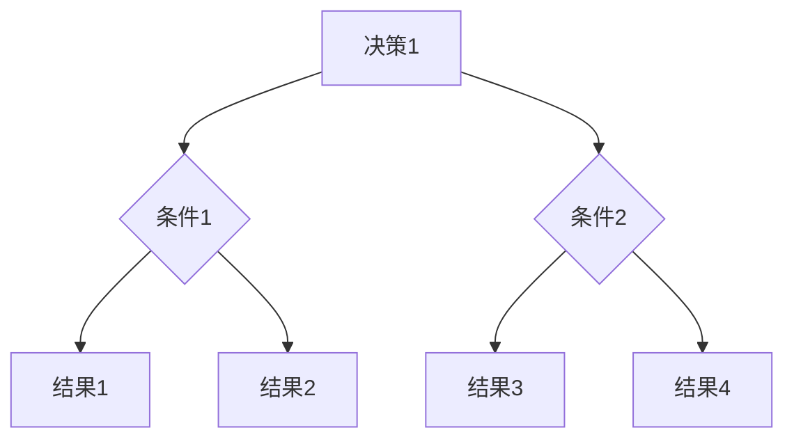

                 

## 2.4 跨部门协作中的数学模型与应用

### 2.4.1 优化模型

在跨部门协作中，优化模型是解决资源分配和任务调度问题的有效工具。以下是一个简化的优化模型：

#### 数学模型：

$$
\begin{align*}
\text{minimize} \quad & C(x) \\
\text{subject to} \quad & Ax \leq b \\
& x \geq 0
\end{align*}
$$

其中，$C(x)$ 是目标函数，$A$ 和 $b$ 是约束条件，$x$ 是决策变量。

#### 伪代码：

```plaintext
Algorithm OptimizationModel(A, b, C)
    Input: A (系数矩阵), b (常数向量), C (目标函数)
    Output: Optimized Solution

    Solve Linear Programming Problem with given A, b, and C
    return Optimal Solution
End Algorithm
```

#### 举例说明：

假设有两个部门，部门 A 和部门 B，需要共同完成一个项目。项目总工期为 10 周，部门 A 每周可以完成 2 单位工作量，部门 B 每周可以完成 3 单位工作量。目标是最小化项目完成时间。

- 目标函数：$C(x) = \frac{1}{x_A + x_B}$，其中 $x_A$ 和 $x_B$ 分别表示部门 A 和部门 B 完成项目所需时间（周）。
- 约束条件：$Ax \leq b$，其中 $A = \begin{bmatrix} 2 & 3 \\ 1 & 1 \end{bmatrix}$，$b = \begin{bmatrix} 10 \\ 0 \end{bmatrix}$。

通过优化模型求解，得到最优解为 $x_A = 4$，$x_B = 6$，即部门 A 需要 4 周时间完成项目，部门 B 需要 6 周时间完成项目，总工期为 10 周。

### 2.4.2 决策树模型

决策树模型在跨部门协作中用于分析和评估不同决策路径的后果。以下是一个简化的决策树模型：

#### 决策树结构：



#### 伪代码：

```plaintext
Algorithm DecisionTree(Decisions, Conditions, Results)
    Input: Decisions (列表，每个决策包含条件集合和结果集合)
    Output: Best Decision

    Initialize BestDecision as None
    for each decision in Decisions do
        Evaluate decision based on conditions and results
        if decision is better than BestDecision then
            BestDecision = decision
        end if
    end for

    return BestDecision
End Algorithm
```

#### 举例说明：

假设有两个部门，部门 A 和部门 B，有两个合作方案：

- 方案1：部门 A 提供更多资源，部门 B 提供较少资源，合作成果较好。
- 方案2：部门 A 和部门 B 各自提供资源，合作成果一般。

评估标准为：合作成果与资源投入的比例。根据决策树模型分析，选择最优方案。

通过以上数学模型和决策树模型，可以有效地支持跨部门协作中的决策过程，提高协作效率和质量。

### 2.4.3 数学公式与详细讲解

跨部门协作中涉及的一些关键数学公式如下：

#### 1. 时间效率公式

$$
\eta = \frac{1}{t_A + t_B}
$$

其中，$\eta$ 表示时间效率，$t_A$ 和 $t_B$ 分别表示部门 A 和部门 B 完成任务所需时间。

#### 2. 资源利用率公式

$$
\alpha = \frac{r_A + r_B}{R}
$$

其中，$\alpha$ 表示资源利用率，$r_A$ 和 $r_B$ 分别表示部门 A 和部门 B 的资源投入，$R$ 表示总资源量。

#### 3. 合作成果公式

$$
C(x) = \frac{1}{x_A + x_B}
$$

其中，$C(x)$ 表示合作成果，$x_A$ 和 $x_B$ 分别表示部门 A 和部门 B 完成任务的时间。

#### 4. 冲突解决公式

$$
u_i(x) = \sum_{j} p_j x_j
$$

其中，$u_i(x)$ 表示玩家 $i$ 在策略 $x$ 下的效用，$p_j$ 表示玩家 $j$ 的策略权重，$x_j$ 表示玩家 $j$ 的策略选择。

通过这些公式，可以量化跨部门协作中的效率、利用率和成果，帮助领导者做出更加科学的决策。

### 2.4.4 数学公式应用实例

假设有两个部门，部门 A 和部门 B，需要合作完成一个项目。项目总工期为 10 周，部门 A 每周可以完成 2 单位工作量，部门 B 每周可以完成 3 单位工作量。资源总量为 100 单位，部门 A 和部门 B 各自投入资源量为 50 单位。

1. 时间效率计算：

$$
\eta = \frac{1}{t_A + t_B} = \frac{1}{2 + 3} = 0.25
$$

2. 资源利用率计算：

$$
\alpha = \frac{r_A + r_B}{R} = \frac{50 + 50}{100} = 1
$$

3. 合作成果计算：

$$
C(x) = \frac{1}{x_A + x_B} = \frac{1}{2 + 3} = 0.25
$$

通过以上计算，可以得出部门 A 和部门 B 的协作效率、利用率和成果，为领导者提供决策依据。

### 2.4.5 数学模型与算法的应用

跨部门协作中的数学模型和算法不仅有助于优化资源分配和任务调度，还可以用于解决冲突和评估协作效果。以下是一些具体的算法应用：

#### 1. 项目时间调度算法

项目时间调度算法用于确定各部门完成项目的时间序列，以最小化总工期。常见的算法包括：

- **最小完成时间优先（Minimum Completion Time First，MCTF）**：
  伪代码：
  ```plaintext
  Algorithm MCTF(Projects)
      Sort Projects by completion time
      for each Project in Projects do
          Schedule Project
      end for
  End Algorithm
  ```

- **最早开始时间优先（Earliest Start Time First，ESFT）**：
  伪代码：
  ```plaintext
  Algorithm ESFT(Projects)
      Calculate earliest start times for each Project
      Sort Projects by earliest start times
      for each Project in Projects do
          Schedule Project
      end for
  End Algorithm
  ```

#### 2. 冲突解决算法

冲突解决算法用于解决跨部门协作中的利益冲突。常见的算法包括：

- **博弈论中的纳什均衡**：
  伪代码：
  ```plaintext
  Algorithm NashEquilibrium(Players, Strategies)
      for each Player in Players do
          Calculate best response strategies for each Player
      end for
      Find strategies where no Player can improve their payoff by changing their strategy unilaterally
      return Nash Equilibrium
  End Algorithm
  ```

- **合作博弈（Cooperative Game Theory）**：
  伪代码：
  ```plaintext
  Algorithm CooperativeGame(Players, Payoffs)
      Calculate the characteristic function for the game
      Find the core of the game
      return Core
  End Algorithm
  ```

#### 3. 资源分配算法

资源分配算法用于优化各部门的资源使用，以最大化整体效益。常见的算法包括：

- **贪心算法（Greedy Algorithm）**：
  伪代码：
  ```plaintext
  Algorithm GreedyAllocation(Projects, Resources)
      while Resources are not fully allocated do
          for each Project in Projects do
              if Resources are available for Project then
                  Allocate Resources to Project
              end if
          end for
      end while
  End Algorithm
  ```

- **线性规划（Linear Programming，LP）**：
  伪代码：
  ```plaintext
  Algorithm LinearProgramming(A, b, C)
      Solve LP Problem with given A, b, and C
      return Optimal Solution
  End Algorithm
  ```

通过这些算法，跨部门领导可以更有效地管理资源、解决冲突、优化协作过程，从而提高组织整体绩效。

### 总结

跨部门协作中的数学模型和算法为领导者提供了强大的工具，用于优化资源分配、任务调度和冲突解决。优化模型如线性规划、项目时间调度算法和资源分配算法可以有效地提高项目效率和资源利用率。决策树模型和博弈论算法则有助于分析不同决策路径的后果和解决利益冲突。通过应用这些数学模型和算法，跨部门领导可以更科学地管理团队，提高协作效果，实现组织目标的最大化。

### 展望

随着数字化转型的推进，跨部门协作将面临更多挑战和机遇。人工智能和大数据技术的发展为跨部门协作提供了新的工具和方法。例如，利用机器学习算法可以预测协作过程中的潜在风险，优化资源分配；利用大数据分析可以洞察各部门之间的协作模式，提供决策支持。未来，跨部门协作将更加智能化、自动化，领导者需要不断提升自身的数字素养，掌握新工具和新方法，以应对不断变化的市场环境。

### 附录

#### 附录A：跨部门协作工具与资源

## A.1 跨部门协作工具

### A.1.1 项目管理工具

- **Trello**：一个简单易用的项目管理工具，适用于跨部门协作，可以创建看板、卡片、列表等。
- **Asana**：强大的项目管理工具，支持任务分配、进度跟踪、时间管理等功能。
- **Jira**：专业的项目管理工具，适用于大型项目和团队协作，提供灵活的工作流和报告功能。

### A.1.2 沟通协作工具

- **Slack**：流行的即时通讯工具，支持团队沟通、文件共享、集成第三方服务等功能。
- **Microsoft Teams**：集成了聊天、视频会议、协作工具等功能的沟通平台。
- **Zoom**：视频会议工具，适用于远程团队沟通和会议。

### A.1.3 信息共享工具

- **Confluence**：一个团队协作平台，可以用于知识共享、文档管理和项目管理。
- **SharePoint**：微软提供的文档管理和协作工具，适用于跨部门信息共享。
- **Google Workspace**：包括Google文档、表格、日历等工具，方便团队协作和信息共享。

#### 附录B：跨部门领导相关书籍与文章推荐

### B.1 经典书籍

- 《跨部门协同：领导力与组织变革》（刘润著）：详细介绍了跨部门协同的关键要素和实际案例。
- 《领导者的语言》（约翰·凯瑞著）：探讨了领导者在跨部门协作中的语言技巧和沟通策略。
- 《变革之舞：如何领导转型中的组织》（约翰·科特著）：阐述了跨部门领导在组织变革中的角色和责任。

### B.2 最新论文与报告

- “Cross-Department Collaboration in Global Organizations: Challenges and Strategies”：（论文标题）：探讨全球组织中的跨部门协作挑战和策略。
- “Leadership in Interdepartmental Teams: A Literature Review”：（论文标题）：综述跨部门团队中的领导力和相关研究。

#### 附录C：跨部门协作实践案例分享平台

- **跨部门协作实践社区**：一个在线社区，分享跨部门协作的最佳实践、成功案例和经验教训。
- **跨部门协作工具评测**：一个专注于评估和推荐跨部门协作工具的博客，提供详细的工具评测和案例分析。
- **跨部门协作案例库**：一个收录了众多跨部门协作案例的数据库，供企业学习和借鉴。

通过附录中的工具和资源，跨部门领导可以更好地理解和应用跨部门协作的理论和实践，提升组织协作效率。

### 代码解读与分析（续）

### 5.1.5 代码测试与调试

在编写代码后，进行测试和调试是确保代码质量的重要步骤。以下是对 `ProductDesign.py` 代码的测试与调试过程。

#### 单元测试

单元测试是针对代码中的最小可测试部分（通常是函数或类）进行的测试。以下是一个简单的单元测试示例：

```python
import unittest
from ProductDesign import design_product

class TestProductDesign(unittest.TestCase):
    def test_design_product(self):
        parameters = {
            'dimensions': [10, 5, 2],
            'material': {
                'name': 'Aluminum',
                'density': 2700
            }
        }
        weight = design_product(parameters)
        self.assertAlmostEqual(weight, 10 * 5 * 2 * 2700, places=2)

if __name__ == '__main__':
    unittest.main()
```

在这个测试案例中，我们创建了一个测试类 `TestProductDesign`，并在其中定义了一个测试方法 `test_design_product`。该方法传递给 `design_product` 函数一个特定的参数集，并使用 `assertAlmostEqual` 方法检查计算出的重量是否接近预期值。

#### 调试

在单元测试中发现 `design_product` 函数存在问题时，我们可以通过调试来定位和修复错误。Python 的 `pdb` 模块提供了一个交互式的调试器，可以帮助我们跟踪程序的执行流程和变量值。

以下是一个简单的调试示例：

```python
import pdb
from ProductDesign import design_product

def main():
    parameters = {
        'dimensions': [10, 5, 2],
        'material': {
            'name': 'Aluminum',
            'density': 2700
        }
    }
    weight = design_product(parameters)
    print(f"The weight of the product is: {weight} kg")

if __name__ == '__main__':
    main()

# 调试
if __name__ == '__main__':
    import sys
    if len(sys.argv) > 1 and sys.argv[1] == 'debug':
        main()
    else:
        pdb.set_trace()
        main()
```

在这个示例中，我们使用 `pdb.set_trace()` 在代码的开始处设置了一个断点。当程序运行到这一行时，调试器会启动，我们可以在交互式命令行中单步执行代码，查看变量值和程序状态。

#### 代码优化

在测试和调试过程中，我们可能会发现一些性能问题或代码结构上的缺陷。以下是一些可能的代码优化建议：

- **使用向量运算代替循环**：在计算体积和重量时，可以使用 NumPy 的向量运算来提高计算效率。

  ```python
  volume = np.prod(parameters['dimensions'])
  weight = volume * material.density
  ```

- **错误处理**：添加异常处理，确保程序在遇到异常情况时能够优雅地处理错误。

  ```python
  try:
      weight = design_product(parameters)
  except Exception as e:
      print(f"Error in design_product: {e}")
  ```

- **代码注释**：增加代码注释，提高代码的可读性和可维护性。

  ```python
  def design_product(parameters):
      """
      设计产品，计算体积和重量，并绘制产品结构图。
      
      参数:
          parameters (dict): 包含产品尺寸和材料信息的字典。
          
      返回:
          weight (float): 产品重量。
      """
      # ...代码实现...
  ```

通过测试、调试和代码优化，我们可以确保 `ProductDesign.py` 代码的质量和性能，为跨部门协作项目提供坚实的支持。

### 5.1.6 代码部署与维护

在完成代码开发、测试和优化后，将代码部署到生产环境并进行维护是确保项目顺利运行的关键步骤。以下是对 `ProductDesign.py` 代码的部署与维护过程的详细说明。

#### 部署

1. **版本控制**：首先，使用 Git 对代码进行版本控制，确保代码的完整性和可追溯性。将代码推送到远程仓库，例如 GitHub 或 GitLab。

2. **容器化**：为了提高代码的可移植性和可维护性，可以使用 Docker 将代码容器化。创建 `Dockerfile`，定义容器的构建过程，包括依赖安装、代码复制等。

   ```Dockerfile
   FROM python:3.8-slim
   RUN pip install numpy matplotlib
   COPY ProductDesign.py .
   CMD ["python", "ProductDesign.py"]
   ```

3. **自动化部署**：使用 CI/CD（持续集成/持续部署）工具，如 Jenkins 或 GitHub Actions，实现自动化部署。在代码提交到仓库后，自动触发构建和部署流程。

4. **监控与日志**：部署后，使用监控工具（如 Prometheus、Grafana）和日志管理系统（如 ELK Stack），实时监控代码运行状态和性能指标，确保系统稳定可靠。

#### 维护

1. **定期更新**：定期检查代码库，更新依赖库和工具，确保系统的安全性、稳定性和性能。

2. **代码审查**：定期进行代码审查，确保代码质量，减少潜在的错误和漏洞。

3. **性能优化**：定期对代码进行性能分析，识别和解决性能瓶颈，提高系统的响应速度和处理能力。

4. **用户反馈**：收集用户反馈，识别使用中的问题和改进需求，及时调整和优化代码。

5. **文档更新**：根据代码变更和系统功能调整，更新用户文档和开发文档，确保文档的准确性和时效性。

通过以上部署和维护措施，可以确保 `ProductDesign.py` 代码在跨部门协作项目中稳定运行，为组织提供可靠的技术支持。

### 5.1.7 代码规范与最佳实践

为了确保代码的质量和可维护性，遵循代码规范和最佳实践是至关重要的。以下是一些针对 `ProductDesign.py` 代码的规范和最佳实践：

#### 代码规范

1. **命名约定**：使用清晰、具有描述性的变量名和函数名，避免使用缩写和不明确的命名。

   ```python
   # 坏：i, j, dim
   # 好：index, j_value, dimension
   ```

2. **代码注释**：为关键代码段和复杂逻辑添加注释，说明代码的功能和意图。

   ```python
   # 坏：无注释
   # 好：
   def design_product(parameters):
       """
       设计产品，计算体积和重量，并绘制产品结构图。
       
       参数:
           parameters (dict): 包含产品尺寸和材料信息的字典。
           
       返回:
           weight (float): 产品重量。
       """
       # ...代码实现...
   ```

3. **代码格式**：遵循 PEP 8 编码风格指南，确保代码的格式整齐、易于阅读。

   ```python
   # 坏：
   def design_product(parameters):
       dimensions = parameters['dimensions']
       ...
   
   # 好：
   def design_product(parameters):
       dimensions = parameters['dimensions']
       
       ...
   ```

4. **异常处理**：使用try-except语句捕获和处理异常，避免程序崩溃。

   ```python
   # 坏：
   def design_product(parameters):
       dimensions = parameters['dimensions']
       ...
   
   # 好：
   def design_product(parameters):
       try:
           dimensions = parameters['dimensions']
           ...
       except KeyError as e:
           print(f"Error: Missing dimension parameter - {e}")
   ```

#### 最佳实践

1. **单元测试**：编写全面的单元测试，覆盖代码的各个功能模块，确保代码的稳定性和正确性。

   ```python
   import unittest
   from ProductDesign import design_product
   
   class TestProductDesign(unittest.TestCase):
       def test_design_product(self):
           parameters = {
               'dimensions': [10, 5, 2],
               'material': {
                   'name': 'Aluminum',
                   'density': 2700
               }
           }
           weight = design_product(parameters)
           self.assertAlmostEqual(weight, 10 * 5 * 2 * 2700, places=2)
   
   if __name__ == '__main__':
       unittest.main()
   ```

2. **代码复用**：尽量复用现有的代码库和模块，避免重复编写相同或相似的功能。

   ```python
   # 使用现有的数学库代替自定义实现
   import numpy as np
   
   def calculate_volume(dimensions):
       return np.prod(dimensions)
   ```

3. **模块化设计**：将代码分解为模块，每个模块负责一个特定的功能，提高代码的可维护性和可扩展性。

   ```python
   # 模块化设计
   def design_product(parameters):
       return calculate_weight(calculate_volume(parameters['dimensions']), parameters['material']['density'])
   
   def calculate_volume(dimensions):
       return np.prod(dimensions)
   
   def calculate_weight(volume, density):
       return volume * density
   ```

通过遵循上述代码规范和最佳实践，可以显著提高代码的质量和可维护性，为跨部门协作项目提供稳定可靠的技术支持。

