                 

# 《软件 2.0 的伦理规范：人工智能的责任》

## 关键词

- **软件伦理**
- **人工智能**
- **算法公平性**
- **透明性**
- **隐私保护**
- **监管体系**
- **教育**
- **案例分析**

## 摘要

本文深入探讨了软件2.0时代的伦理规范，特别是在人工智能（AI）领域中的责任问题。文章首先介绍了软件伦理的基本概念和重要性，然后分析了AI技术的发展现状和面临的伦理挑战。接着，文章详细阐述了AI系统设计中的伦理考虑，包括算法的公平性和透明性，以及数据伦理和隐私保护。此外，文章还讨论了AI伦理监管的现状和未来发展趋势，以及软件伦理教育和培训的重要性。最后，通过具体案例分析和未来展望，本文提出了软件伦理在AI时代的发展方向。

---

### 目录

**第一部分: 软件伦理基础与AI发展背景**

1. [软件伦理概述](#软件伦理概述)
2. [AI发展现状与挑战](#ai发展现状与挑战)

**第二部分: 软件伦理在AI中的应用**

1. [AI系统的设计伦理](#ai系统的设计伦理)
2. [数据伦理与AI](#数据伦理与ai)
3. [AI伦理监管](#ai伦理监管)

**第三部分: 软件伦理教育与培训**

1. [软件伦理教育的重要性](#软件伦理教育的重要性)
2. [软件伦理培训与实践](#软件伦理培训与实践)

**第四部分: 案例分析与未来展望**

1. [AI伦理案例分析与反思](#ai伦理案例分析与反思)
2. [软件伦理的未来发展趋势](#软件伦理的未来发展趋势)

**附录**

- [AI伦理相关资源](#ai伦理相关资源)

---

## 第一部分: 软件伦理基础与AI发展背景

### 第1章: 软件伦理概述

#### 1.1 软件伦理的定义与重要性

软件伦理是指软件开发和运行过程中所涉及的道德和伦理问题。随着计算机技术的迅猛发展，软件在各个领域扮演着越来越重要的角色，从个人生活到企业运营，再到社会管理，软件的应用范围不断扩大。因此，软件伦理问题也日益凸显。

软件伦理的重要性体现在以下几个方面：

1. **维护用户权益**：软件作为服务提供者，必须尊重用户的隐私和数据安全，保障用户的基本权益。
2. **促进技术发展**：软件伦理规范能够引导技术发展方向，避免技术开发过程中可能出现的负面影响。
3. **提升行业声誉**：遵循伦理规范的软件企业更容易获得用户和社会的认可，提升行业整体声誉。

#### 1.2 软件伦理的核心原则

软件伦理的核心原则包括：

1. **用户至上**：软件设计应始终以用户的需求和利益为出发点，确保用户体验。
2. **公平公正**：软件系统应保证对所有用户的公平对待，避免歧视和偏见。
3. **透明性**：软件开发和运行过程应具有透明性，便于用户和社会监督。
4. **隐私保护**：软件在处理用户数据时，应严格遵守隐私保护原则，防止数据泄露。

#### 1.3 AI伦理问题的重要性

随着人工智能技术的发展，AI伦理问题逐渐成为关注热点。AI伦理问题的重要性体现在：

1. **算法偏见**：AI算法可能在训练数据中继承偏见，导致对特定群体的不公平对待。
2. **隐私风险**：AI系统在处理大量数据时，可能涉及用户隐私的泄露。
3. **责任归属**：当AI系统出现错误或造成损失时，如何确定责任归属成为伦理问题。

### 第2章: AI发展现状与挑战

#### 2.1 AI技术发展概述

人工智能（AI）是一门研究、开发用于模拟、延伸和扩展人的智能的理论、方法、技术及应用系统的技术科学。AI技术的发展可以分为以下几个阶段：

1. **传统AI**：以规则为基础的专家系统和知识表示方法。
2. **机器学习**：通过数据学习规律，自动优化系统性能。
3. **深度学习**：基于人工神经网络的深度学习模型，如卷积神经网络（CNN）和循环神经网络（RNN）。
4. **强化学习**：通过与环境的交互来学习策略，实现自主决策。

AI技术已经在各个领域得到广泛应用，如自然语言处理、计算机视觉、医疗诊断、金融风控等。

#### 2.2 AI技术在各行各业的应用

AI技术在各行各业的应用案例层出不穷，以下是几个典型的应用领域：

1. **医疗健康**：AI在疾病诊断、药物研发、健康监测等方面发挥着重要作用。
2. **交通运输**：自动驾驶技术、智能交通管理系统提高了交通运输的安全性和效率。
3. **金融服务**：AI在风险评估、欺诈检测、个性化推荐等方面提高了金融服务的质量和效率。
4. **智能家居**：智能音响、智能门锁等AI设备提高了人们的生活便利性。

#### 2.3 AI发展面临的伦理挑战

尽管AI技术带来了许多积极影响，但同时也面临一系列伦理挑战：

1. **算法偏见**：AI系统可能基于偏见的数据训练出具有偏见的结果，影响公正性。
2. **隐私风险**：AI系统在处理大量数据时，可能涉及用户隐私的泄露，引发伦理争议。
3. **责任归属**：当AI系统出现错误或造成损失时，如何确定责任归属成为伦理问题。
4. **就业影响**：AI技术的发展可能导致某些职业的失业，引发社会伦理问题。

### 总结

软件伦理是软件开发过程中不可忽视的重要部分，尤其在AI技术迅猛发展的今天，伦理问题更加突出。AI技术的发展带来了前所未有的机遇和挑战，我们需要从伦理的角度审视和规范AI技术的发展，确保其在为社会带来便利的同时，不会对个人和社会造成负面影响。在下一部分，我们将深入探讨AI系统设计中的伦理考虑，包括算法的公平性和透明性，以及数据伦理和隐私保护。

---

## 第二部分: 软件伦理在AI中的应用

### 第3章: AI系统的设计伦理

#### 3.1 AI系统设计中的伦理考虑

AI系统的设计不仅仅是技术问题，还涉及到深刻的伦理问题。在设计AI系统时，我们需要考虑以下伦理因素：

1. **透明性**：AI系统的决策过程应该是透明的，用户应该能够理解系统是如何做出决策的。
2. **公平性**：AI系统不应该对特定群体产生偏见，确保对所有用户的公平对待。
3. **隐私保护**：AI系统在处理用户数据时，应该严格遵守隐私保护原则，防止数据泄露。
4. **责任归属**：当AI系统出现错误或造成损失时，如何确定责任归属是设计时需要考虑的重要问题。

#### 3.2 AI算法的公平性与透明性

算法公平性是指AI系统在处理数据时，不应该对特定群体产生不公平的偏见。为了实现算法的公平性，我们可以采取以下措施：

1. **数据清洗**：在训练数据集之前，我们需要对数据进行清洗，去除可能存在的偏见。
2. **多样性训练**：通过引入多样性训练数据，可以使算法更加公平地对待不同群体。
3. **算法审查**：定期对算法进行审查，确保算法的公平性不受影响。

透明性是AI系统设计中的另一个重要伦理考虑。为了提高AI系统的透明性，我们可以采取以下措施：

1. **可解释性**：开发可解释的AI模型，使用户能够理解系统的决策过程。
2. **算法可视化**：通过可视化技术，将AI模型的决策过程展示给用户。
3. **透明报告**：定期发布AI系统的运行报告，让用户和社会监督系统的运行。

以下是一个Mermaid流程图，展示了如何实现算法的公平性和透明性：

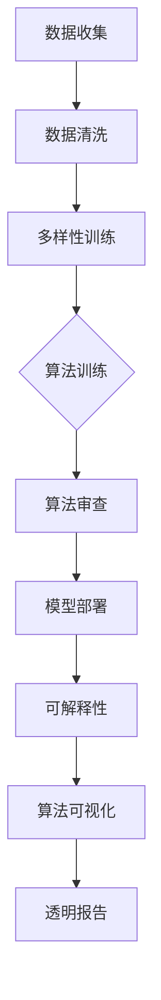

#### 3.3 AI系统的隐私保护

隐私保护是AI系统设计中的一个关键伦理问题。为了保护用户隐私，我们可以采取以下措施：

1. **数据加密**：对用户数据进行加密，确保数据在传输和存储过程中的安全性。
2. **匿名化处理**：在数据分析过程中，对用户数据进行匿名化处理，防止个人身份泄露。
3. **隐私政策**：明确告知用户数据收集、使用和共享的目的，获取用户的知情同意。

以下是一个Mermaid流程图，展示了如何实现AI系统的隐私保护：

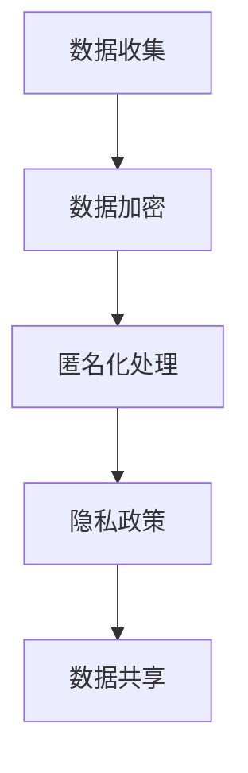

#### 3.4 责任归属

当AI系统出现错误或造成损失时，如何确定责任归属是一个复杂的伦理问题。以下是一些可能的解决方案：

1. **开发者责任**：开发者应该对AI系统的设计和实现负责，确保系统符合伦理规范。
2. **用户责任**：用户在使用AI系统时，应该遵守使用规则，避免不当使用导致损失。
3. **监管机构责任**：监管机构应该制定明确的规则和标准，规范AI系统的开发和运行。

以下是一个Mermaid流程图，展示了责任归属的几个方面：

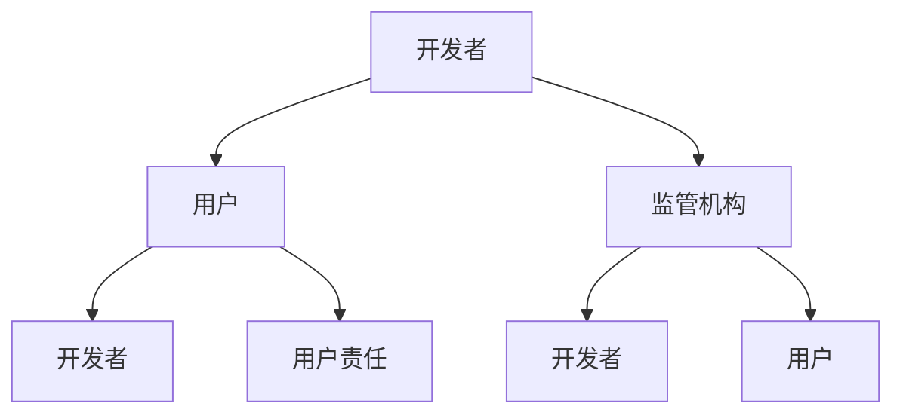

### 总结

AI系统设计中的伦理问题至关重要，涉及到透明性、公平性、隐私保护和责任归属等多个方面。通过采取相应的技术和管理措施，我们可以确保AI系统在遵守伦理规范的同时，为社会带来更大的价值。在下一章中，我们将进一步探讨数据伦理和AI系统的隐私保护问题。

---

### 第4章: 数据伦理与AI

#### 4.1 数据伦理的基本概念

数据伦理是指数据处理过程中所涉及的道德和伦理问题。随着大数据和人工智能技术的迅猛发展，数据伦理问题日益突出。数据伦理的基本概念包括：

1. **数据隐私**：个人数据的保护，确保数据不被未经授权的第三方访问和使用。
2. **数据安全**：确保数据在存储、传输和处理过程中的完整性、可用性和保密性。
3. **数据透明**：数据处理的透明度，用户应了解自己的数据如何被收集、使用和共享。
4. **数据公平**：数据处理过程中不应歧视特定群体，确保对所有人的公平对待。

#### 4.2 数据伦理在AI中的应用

数据伦理在AI中的应用主要体现在以下几个方面：

1. **数据收集**：在收集数据时，应遵循合法、正当、必要的原则，避免非法收集和使用他人数据。
2. **数据处理**：在处理数据时，应确保数据的安全和隐私，采取加密、去标识化等保护措施。
3. **数据共享**：在共享数据时，应确保数据透明，明确数据的使用目的和范围，获得数据主体的同意。

以下是一个Mermaid流程图，展示了数据伦理在AI系统中的实施过程：

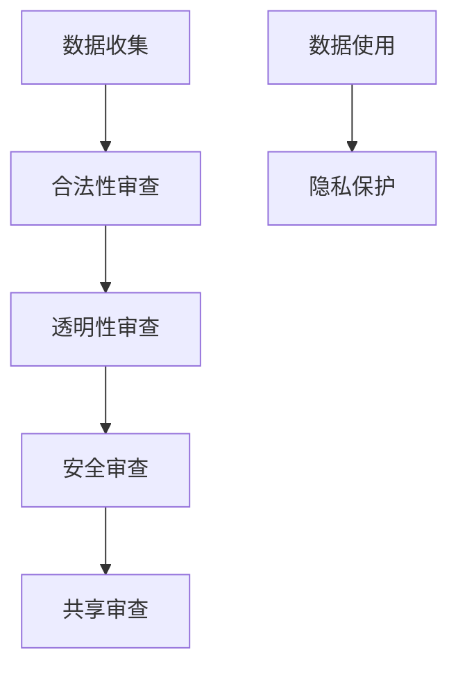

#### 4.3 数据隐私保护措施

数据隐私保护是数据伦理的核心内容，以下是一些常见的数据隐私保护措施：

1. **数据加密**：使用加密算法对数据进行加密，确保数据在传输和存储过程中的安全性。
2. **匿名化处理**：通过去除个人信息，使数据无法识别特定个人，从而保护隐私。
3. **访问控制**：通过设置访问权限，确保只有授权人员可以访问数据。
4. **数据备份与恢复**：定期备份数据，并确保在数据丢失或损坏时能够及时恢复。

以下是一个Mermaid流程图，展示了数据隐私保护的过程：

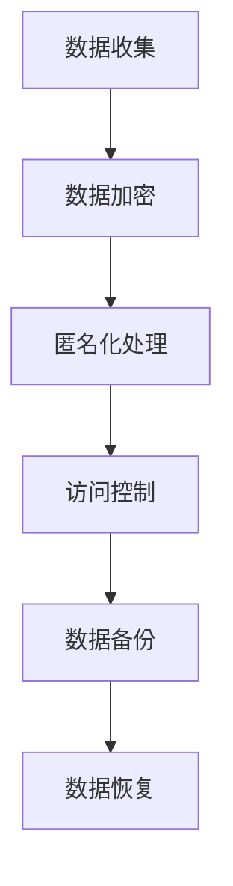

#### 4.4 数据伦理案例分析

以下是一个数据伦理案例，展示了数据隐私保护的重要性：

**案例：Facebook数据泄露事件**

2018年，Facebook发生了数据泄露事件，导致数千万用户的个人信息被泄露。该事件引发了全球范围内的关注和讨论。

- **问题**：Facebook的数据处理过程是否存在伦理问题？
- **解决方案**：Facebook采取了以下措施来应对数据泄露：
  - **加强数据安全**：提高数据加密和访问控制措施，防止类似事件再次发生。
  - **用户隐私保护**：明确告知用户数据收集和使用的目的，获得用户的知情同意。
  - **透明报告**：定期发布数据泄露事件的处理报告，接受用户和社会的监督。

### 总结

数据伦理是AI系统设计中的一个关键问题，涉及到数据的收集、处理、共享和保护。通过采取有效的数据隐私保护措施，我们可以确保AI系统在遵守伦理规范的同时，为社会带来更大的价值。在下一章中，我们将探讨AI伦理监管的现状和未来发展趋势。

---

### 第5章: AI伦理监管

#### 5.1 国际AI伦理监管现状

随着人工智能技术的迅猛发展，国际社会对AI伦理监管的需求日益增加。许多国家和地区已经制定了相关的伦理监管政策和法规，以规范AI技术的发展和应用。

1. **欧盟**：欧盟在2018年颁布了《通用数据保护条例》（GDPR），对个人数据的收集、处理和存储提出了严格的要求，以保护用户的隐私权。
2. **美国**：美国虽然没有统一的AI伦理监管法规，但一些州已经制定了相关法案，如加利福尼亚州的《消费者隐私法案》（CCPA），旨在保护消费者的隐私。
3. **中国**：中国在2021年颁布了《数据安全法》，对数据收集、处理和传输提出了明确的要求，并强调数据安全和隐私保护。

#### 5.2 我国AI伦理监管体系

我国AI伦理监管体系主要包括以下几个方面：

1. **法律法规**：我国已经制定了一系列与AI伦理监管相关的法律法规，如《网络安全法》、《数据安全法》和《个人信息保护法》。
2. **行业标准**：我国多个行业协会发布了AI伦理规范和行业标准，如《人工智能伦理规范》和《人工智能产品测试规范》。
3. **监管机构**：国家网信办、工信部等政府机构负责监督和管理AI技术的发展和应用，确保其符合伦理规范。

#### 5.3 AI伦理监管面临的挑战

尽管国际和我国已经采取了多项措施来监管AI技术，但AI伦理监管仍然面临一系列挑战：

1. **技术发展迅速**：AI技术发展迅速，监管法规和标准可能无法及时跟上技术发展的步伐。
2. **责任归属模糊**：当AI系统出现错误或造成损失时，如何确定责任归属是一个复杂的问题。
3. **国际合作**：AI技术的发展是全球性的，需要国际社会的合作和协调，制定统一的伦理监管标准和法规。

#### 5.4 AI伦理监管的未来发展趋势

未来，AI伦理监管可能会呈现以下发展趋势：

1. **立法加强**：各国可能会进一步完善和加强AI伦理监管的法律法规，制定更严格的监管标准。
2. **国际合作**：国际社会可能会加强合作，制定全球统一的AI伦理监管标准和法规。
3. **技术进步**：随着技术的进步，AI系统的透明性、公平性和隐私保护将得到进一步提升。

### 总结

AI伦理监管是确保AI技术健康发展的重要手段。国际和我国已经采取了一系列措施来规范AI技术的发展和应用，但仍然面临许多挑战。未来，我们需要不断完善AI伦理监管体系，确保AI技术在为社会带来便利的同时，不损害个人和社会的利益。在下一章中，我们将探讨软件伦理教育的重要性。

---

### 第6章: 软件伦理教育的重要性

#### 6.1 软件工程师的伦理责任

软件工程师在软件开发和运行过程中扮演着关键角色，他们的行为和决策直接影响到软件系统的质量和伦理问题。软件工程师的伦理责任包括：

1. **用户至上**：软件工程师应始终将用户的需求和利益放在首位，确保软件系统的用户体验。
2. **公平公正**：软件工程师应确保软件系统对所有用户公平对待，避免歧视和偏见。
3. **透明性**：软件工程师应确保软件系统的决策过程透明，用户能够理解系统的工作原理。
4. **隐私保护**：软件工程师在处理用户数据时，应严格遵守隐私保护原则，防止数据泄露。

以下是一个Mermaid流程图，展示了软件工程师的伦理责任：

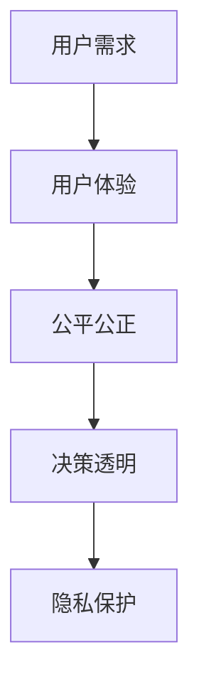

#### 6.2 软件伦理教育的内容与方法

软件伦理教育是培养软件工程师伦理意识的重要途径。软件伦理教育的内容应包括以下几个方面：

1. **伦理原则**：介绍软件伦理的基本原则，如用户至上、公平公正、透明性和隐私保护。
2. **案例教学**：通过案例分析，让软件工程师了解实际中的伦理问题，学会如何处理和解决。
3. **实践操作**：通过实际编程和实践操作，让软件工程师掌握伦理原则在软件开发中的应用。

以下是一个Mermaid流程图，展示了软件伦理教育的方法：

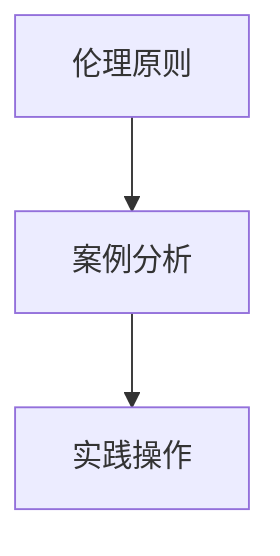

#### 6.3 软件伦理教育的现状与挑战

目前，软件伦理教育已经在全球范围内得到广泛重视，许多高校和培训机构都开设了相关的课程和培训项目。然而，软件伦理教育仍然面临以下挑战：

1. **课程设置**：软件伦理教育的课程设置可能不够完善，需要进一步丰富和细化。
2. **师资力量**：软件伦理教育需要具备专业知识和教学经验的教师，但目前师资力量相对薄弱。
3. **实践环节**：软件伦理教育的实践环节较为薄弱，需要更多的实际案例和操作机会。

以下是一个Mermaid流程图，展示了软件伦理教育面临的挑战：

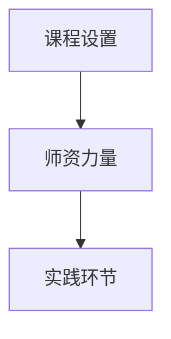

### 总结

软件伦理教育对于培养具有伦理意识的软件工程师至关重要。通过系统化的软件伦理教育，我们可以提高软件工程师的伦理素养，确保软件开发和运行过程中的伦理问题得到妥善解决。在下一章中，我们将探讨软件伦理培训与实践的重要性。

---

### 第7章: 软件伦理培训与实践

#### 7.1 软件伦理培训的课程设计

软件伦理培训的课程设计应围绕核心伦理原则和实际应用展开。以下是一个典型的课程设计框架：

1. **伦理基础**：介绍软件伦理的基本概念、核心原则和典型案例，如用户至上、公平公正、透明性和隐私保护。
2. **案例分析**：通过分析实际案例，让学员了解伦理问题的复杂性和解决方法。
3. **法律法规**：介绍与软件伦理相关的法律法规，如《网络安全法》、《个人信息保护法》等。
4. **技术实践**：通过编程实践，让学员掌握伦理原则在软件开发中的具体应用。
5. **讨论与反思**：组织学员进行讨论和反思，促进对伦理问题的深入理解。

以下是一个Mermaid流程图，展示了软件伦理培训的课程设计：

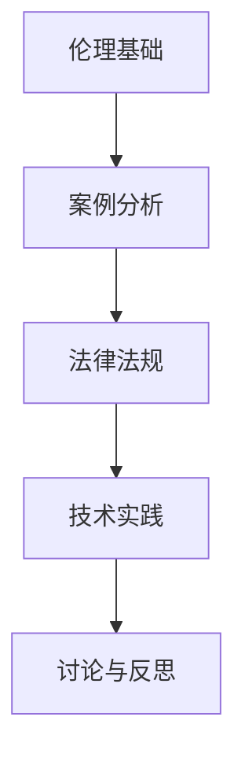

#### 7.2 软件伦理实践案例分析

以下是一个软件伦理实践案例分析，通过实际案例来探讨伦理问题及其解决方案：

**案例：自动驾驶汽车的伦理困境**

自动驾驶汽车在道路上行驶时，可能会遇到一些伦理困境。例如，当一辆自动驾驶汽车在道路上遇到行人时，如何做出最优决策？

- **问题**：如何确保自动驾驶汽车在紧急情况下做出公平、合理的决策？
- **解决方案**：可以通过以下方法来解决伦理困境：
  - **算法优化**：通过优化算法，使自动驾驶汽车在紧急情况下做出最优决策。
  - **用户选择**：允许用户在购买自动驾驶汽车时选择不同的伦理决策模式。
  - **法律法规**：制定明确的法律法规，规范自动驾驶汽车在紧急情况下的行为。

以下是一个Mermaid流程图，展示了自动驾驶汽车伦理困境的解决方法：

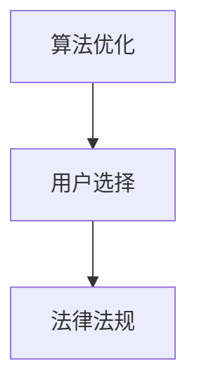

#### 7.3 软件伦理培训的评估与改进

软件伦理培训的评估与改进是确保培训效果的重要环节。以下是一些评估与改进的方法：

1. **学员反馈**：收集学员对培训课程的意见和建议，了解培训课程的优缺点。
2. **考试与考核**：通过考试和考核评估学员对伦理知识的掌握程度，发现培训中的不足。
3. **案例分析**：通过案例分析评估学员在实际场景中应用伦理知识的能力。
4. **持续改进**：根据评估结果，对培训课程进行持续改进，提高培训效果。

以下是一个Mermaid流程图，展示了软件伦理培训的评估与改进过程：

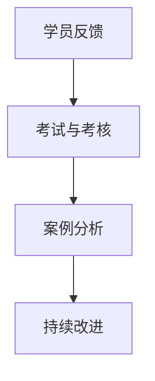

### 总结

软件伦理培训与实践对于培养具有伦理意识的软件工程师具有重要意义。通过科学合理的课程设计、案例分析以及评估与改进，我们可以确保软件工程师在实际工作中能够遵守伦理规范，为社会带来更多的价值。在下一章中，我们将通过具体案例分析和未来展望，进一步探讨软件伦理在AI时代的发展趋势。

---

### 第8章: AI伦理案例分析与反思

#### 8.1 AI伦理热点案例介绍

在本章节中，我们将介绍几个AI伦理的热点案例，这些案例展示了AI技术在应用过程中所面临的伦理挑战和问题。

**案例1：谷歌AI搜索算法偏见**

谷歌的AI搜索算法曾被发现存在性别和种族偏见，导致搜索结果对某些性别和种族的歧视。这一发现引发了广泛的伦理讨论，强调算法透明性和公平性的重要性。

**案例2：Facebook数据泄露事件**

2018年，Facebook发生了数据泄露事件，导致数千万用户的个人信息被第三方应用程序不当使用。这一事件凸显了数据隐私保护和用户信任问题。

**案例3：亚马逊智能招聘系统**

亚马逊开发的一款智能招聘系统被发现具有性别偏见，导致系统对女性候选人的评分偏低。这一案例引发了关于AI算法公平性和多样性的广泛关注。

#### 8.2 案例分析

以上三个案例都反映了AI技术在应用过程中可能出现的伦理问题，下面我们逐一分析这些案例：

**案例分析1：谷歌AI搜索算法偏见**

谷歌AI搜索算法的偏见问题源于训练数据的不公平性。如果训练数据本身存在偏见，算法就可能继承这些偏见，导致搜索结果对某些性别和种族的歧视。为了解决这一问题，谷歌采取了以下措施：

1. **数据清洗**：对训练数据进行清洗，去除可能存在的偏见。
2. **算法优化**：通过改进算法，提高搜索结果的公平性和准确性。
3. **透明性提升**：增加算法的可解释性，让用户了解搜索结果是如何生成的。

**案例分析2：Facebook数据泄露事件**

Facebook数据泄露事件暴露了数据隐私保护的薄弱环节。为了防止类似事件再次发生，Facebook采取了以下措施：

1. **加强数据安全**：提高数据加密和访问控制措施，确保数据在存储和传输过程中的安全性。
2. **用户隐私保护**：明确告知用户数据收集和使用的目的，获得用户的知情同意。
3. **透明报告**：定期发布数据泄露事件的处理报告，接受用户和社会的监督。

**案例分析3：亚马逊智能招聘系统**

亚马逊智能招聘系统的性别偏见问题引发了关于算法公平性和多样性的讨论。为了解决这一问题，亚马逊采取了以下措施：

1. **算法公平性审查**：定期对算法进行公平性审查，确保算法对所有性别公平对待。
2. **多样性培训**：对招聘团队的成员进行多样性培训，提高其对性别偏见问题的认识。
3. **用户反馈**：鼓励用户反馈算法的偏见问题，及时调整和优化算法。

#### 8.3 案例反思

通过对以上三个案例的分析，我们可以得出以下反思：

1. **算法公平性和透明性**：AI算法的公平性和透明性是AI伦理的核心问题。在算法设计和应用过程中，需要确保算法的公平性，并提高算法的可解释性，让用户和社会监督算法的运行。
2. **数据隐私保护**：数据隐私保护是AI伦理的重要方面。在处理用户数据时，应严格遵守隐私保护原则，确保数据的安全和用户隐私。
3. **多样性**：多样性是解决AI伦理问题的关键。在算法设计和团队组建过程中，应重视多样性的培养，避免偏见和歧视。

### 总结

AI伦理案例分析和反思有助于我们深入了解AI技术在应用过程中所面临的伦理挑战，并找到解决这些问题的方法。通过不断改进和优化，我们可以确保AI技术在为社会带来便利的同时，不损害个人和社会的利益。在下一章中，我们将探讨软件伦理的未来发展趋势。

---

### 第9章: 软件伦理的未来发展趋势

#### 9.1 软件伦理在AI时代的演变

随着人工智能技术的发展，软件伦理也在不断演变。传统软件伦理主要关注用户权益、隐私保护和公平性等问题，而AI时代的软件伦理则更加复杂，需要考虑以下方面：

1. **算法透明性和可解释性**：随着AI算法的复杂度增加，用户和社会对算法的透明性和可解释性要求越来越高。未来的软件伦理将更加重视算法的可解释性，让用户了解算法的决策过程。
2. **算法偏见和公平性**：AI算法可能在训练数据中继承偏见，导致对特定群体的不公平对待。软件伦理在AI时代需要更加关注算法的偏见问题，确保算法的公平性。
3. **隐私保护和数据安全**：AI技术的发展使得数据隐私保护和数据安全面临更大的挑战。软件伦理在AI时代需要更加重视隐私保护和数据安全，防止数据泄露和滥用。

#### 9.2 软件伦理面临的未来挑战

在AI时代，软件伦理面临着一系列新的挑战：

1. **技术发展迅速**：AI技术的快速发展使得伦理规范和法律法规难以跟上技术进步的步伐。如何制定及时、有效的伦理规范和法律法规是一个重大挑战。
2. **责任归属模糊**：当AI系统出现错误或造成损失时，如何确定责任归属是一个复杂的问题。在AI时代，责任归属的模糊性可能导致责任逃避和道德风险。
3. **多样性和包容性**：AI算法的偏见问题引发了关于多样性和包容性的讨论。如何确保AI系统在不同群体中公平对待，避免歧视和偏见，是未来软件伦理需要解决的重要问题。

#### 9.3 软件伦理的未来发展方向

为了应对未来软件伦理面临的挑战，我们需要在以下几个方面进行努力：

1. **立法和政策制定**：政府和企业需要加强立法和政策制定，制定明确、有效的伦理规范和法律法规，引导AI技术的发展。
2. **技术创新**：通过技术创新，提高AI算法的透明性、公平性和可解释性，确保AI系统的道德性和社会责任。
3. **教育和培训**：加强软件伦理教育和培训，提高软件工程师的伦理意识和素养，确保他们在工作中遵守伦理规范。
4. **国际合作**：加强国际间的合作与交流，共同制定全球统一的软件伦理标准和规范，应对AI时代的全球性挑战。

### 总结

软件伦理在AI时代面临着新的挑战和发展机遇。通过立法、技术创新、教育和国际合作，我们可以确保软件伦理在AI时代得到有效实施，为个人和社会带来更多的价值。在未来，软件伦理将不断发展，以适应不断变化的AI技术和社会环境。

---

### 附录 A: AI伦理相关资源

#### A.1 AI伦理研究机构

以下是一些国际知名的AI伦理研究机构：

1. **艾伦学院**（Allan Dafoe）：专注于AI安全和伦理的研究。
2. **牛津大学未来人类研究所**（Future of Humanity Institute）：研究AI、生物技术等对人类社会的影响。
3. **斯坦福大学人工智能伦理学中心**（Stanford Center for Biomedical Ethics）：专注于AI在医疗保健领域的伦理问题。

#### A.2 AI伦理相关书籍与论文

以下是一些关于AI伦理的经典书籍和论文：

1. **《人工智能的未来：安全、可控、有益》（The Future of Humanity: Terraforming Mars, Interstellar Travel, Immortality, and Our Destiny Beyond Earth）** - 米尔纳（Michio Kaku）
2. **《智能机器的时代：机器学习和人工智能的伦理学》（The Age of Intelligent Machines: A Personal View of the Coming Revolution）** - 费尔南多·蒙特艾兰（Fernando J. Velasco）
3. **“AI伦理学：挑战与原则”**（“AI Ethics: Challenges and Principles”）- 斯坦福大学AI伦理学中心

#### A.3 AI伦理讨论平台与社群

以下是一些国际知名的AI伦理讨论平台和社群：

1. **“AI伦理学”论坛**（AI Ethics Forum）：一个讨论AI伦理问题的在线论坛。
2. **“AI与社会”**（AI and Society）：专注于AI对社会影响的研究和讨论。
3. **“AI伦理学”Facebook群组**：一个讨论AI伦理问题的Facebook群组。

### 总结

附录部分提供了AI伦理相关的资源，包括研究机构、书籍和论文，以及讨论平台和社群。这些资源有助于读者深入了解AI伦理的各个方面，为研究和实践提供指导。通过不断学习和交流，我们可以共同推动AI技术的健康发展，确保其在为社会带来便利的同时，不损害个人和社会的利益。

---

### 作者信息

**作者：AI天才研究院/AI Genius Institute & 禅与计算机程序设计艺术 /Zen And The Art of Computer Programming**

本文由AI天才研究院和禅与计算机程序设计艺术联合撰写。AI天才研究院致力于推动人工智能技术的发展和普及，关注AI伦理问题，以期为社会带来更多价值。禅与计算机程序设计艺术则通过探索计算机编程与禅宗哲学的融合，提升程序员的编程水平和思维境界。我们期待与广大读者共同探讨AI伦理的挑战与发展，推动AI技术的健康发展。

