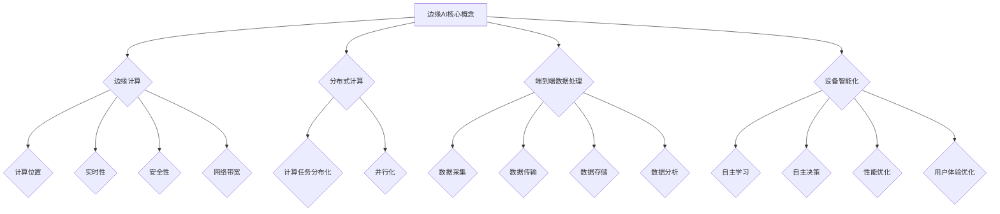
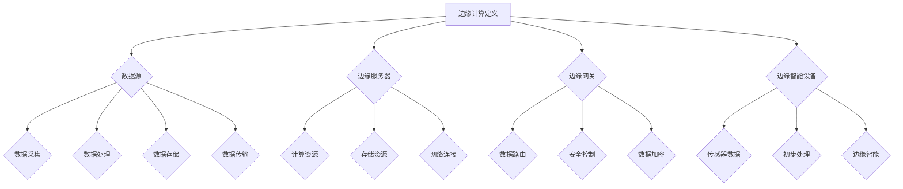

                 

### 引言

随着物联网（IoT）和5G技术的快速发展，边缘计算和人工智能（AI）正逐渐成为现代技术领域的热点。边缘AI，即设备端智能化，是将AI计算能力推至网络边缘的重要技术，它不仅能够降低延迟、节省带宽，还能提高数据的安全性和隐私保护。边缘AI的兴起，为智能监控、智能制造、物联网和自动驾驶等领域带来了新的机遇和挑战。

本文旨在系统地探讨边缘AI的技术原理、架构、应用实践以及面临的挑战和未来发展趋势。文章结构如下：

- **第一部分：边缘AI概述**：介绍边缘AI的定义、重要性、与传统云计算的区别、应用领域以及优势与挑战。
- **第二部分：边缘AI的技术架构**：详细讨论边缘计算基础、边缘AI硬件平台和软件框架。
- **第三部分：边缘AI的应用实践**：分析边缘AI在智能监控、智能制造和物联网领域的应用。
- **第四部分：边缘AI的挑战与未来**：探讨边缘AI的安全与隐私问题以及边缘AI的发展趋势与未来展望。
- **附录**：提供边缘AI开发工具和资源。

通过对边缘AI的深入探讨，本文希望能够为读者提供一个全面的技术视角，帮助理解边缘AI的核心概念和实际应用，同时揭示其在未来技术发展中的重要地位。

### 第一部分：边缘AI概述

#### 第1章：边缘AI的定义与重要性

边缘AI，即边缘智能，是指将人工智能计算能力推至网络边缘，实现设备端智能化的技术。与传统的云计算相比，边缘AI具有显著的实时性、低延迟、高可靠性和数据隐私性优势。其核心概念包括边缘计算、分布式计算、端到端数据处理和设备智能化。

**1.1 边缘AI的定义与核心概念**

- **边缘AI的定义**：边缘AI是将AI计算任务从传统的集中式数据中心转移到网络边缘设备（如传感器、智能手机、路由器等）的一种技术。这些设备能够独立执行AI算法，进行数据预处理、特征提取和模型推理，从而实现本地化决策和响应。

- **边缘AI的核心概念**：
  - **边缘计算**：在数据源附近进行计算，减少数据传输和延迟。
  - **分布式计算**：利用边缘设备协同工作，实现计算任务的分布化和并行化。
  - **端到端数据处理**：数据在采集、传输、处理和分析的过程中，保持完整性和实时性。
  - **设备智能化**：设备具备自主学习和决策能力，能够优化自身性能和用户体验。

**1.2 边缘AI与传统云计算的区别**

- **计算位置**：
  - **边缘AI**：在数据源附近进行计算，如智能设备和边缘服务器。
  - **传统云计算**：在远程数据中心进行计算，依赖互联网连接。

- **实时性**：
  - **边缘AI**：提供低延迟的响应，适用于实时应用场景。
  - **传统云计算**：由于数据传输和处理的延迟，适用于非实时应用场景。

- **安全性**：
  - **边缘AI**：本地化处理数据，减少数据泄露风险。
  - **传统云计算**：数据存储在数据中心，存在一定的安全风险。

- **网络带宽**：
  - **边缘AI**：减少数据传输量，降低网络带宽需求。
  - **传统云计算**：需要大量数据传输，可能导致带宽瓶颈。

**1.3 边缘AI的应用领域**

- **实时智能监控**：利用边缘AI进行实时视频分析、人脸识别和物体检测，提高监控效率和安全性。
- **智能制造**：通过边缘AI实现设备故障预测、生产过程优化和质量检测，提高生产效率和产品质量。
- **物联网**：利用边缘AI进行实时数据采集、处理和智能服务，优化资源利用和用户体验。
- **自动驾驶**：利用边缘AI进行实时环境感知、路径规划和决策，提高自动驾驶的安全性和可靠性。

**1.4 边缘AI的优势与挑战**

**优势**：

- **低延迟**：边缘AI能够快速响应用户需求，降低延迟，提高系统响应速度。
- **节省带宽**：边缘AI减少数据传输量，降低网络带宽需求。
- **提高安全性**：边缘AI通过本地化处理和存储，提高数据安全性。
- **可靠性增强**：边缘AI利用分布式计算，提高系统的可靠性和容错能力。

**挑战**：

- **硬件资源限制**：边缘设备的硬件资源有限，需要优化算法和系统架构以满足性能需求。
- **软件兼容性问题**：边缘AI需要适配多种操作系统和硬件平台，存在软件兼容性问题。
- **数据隐私和安全问题**：边缘AI处理的数据涉及隐私和安全问题，需要采取有效措施进行保护。
- **能源消耗**：边缘设备的能源消耗较高，需要优化能源管理策略以提高能效。

通过本章节的介绍，我们初步了解了边缘AI的定义、重要性以及与传统云计算的区别。接下来，我们将进一步探讨边缘AI的技术架构和应用实践。

### Mermaid 流程图：边缘AI的核心概念和架构



### 第2章：边缘AI的技术架构

#### 2.1 边缘计算基础

边缘计算是将数据处理和计算任务从云端转移到网络边缘的技术，它使得设备端能够独立执行计算任务，从而降低延迟、节省带宽、提高系统的安全性和可靠性。

**2.1.1 边缘计算的定义**

边缘计算（Edge Computing）是指将数据处理和计算任务从传统的集中式数据中心推至网络边缘，即接近数据源的位置。这里的边缘可以是智能设备、路由器、网关或其他边缘服务器。

**2.1.2 边缘计算的关键组件**

边缘计算系统通常包括以下关键组件：

- **边缘服务器**：提供计算资源，负责处理数据和执行应用程序。
- **边缘网关**：连接边缘设备和云服务，负责数据传输和路由。
- **边缘智能设备**：包括各种物联网设备，如传感器、智能摄像头、智能门锁等，负责数据的采集和初步处理。

**2.1.3 边缘计算网络架构**

边缘计算网络架构可以分为以下几个层次：

- **边缘节点**：最靠近数据源，负责数据的初步处理和实时分析。
- **区域边缘**：位于网络边缘，提供更集中的计算和存储资源，可以处理更多的数据。
- **云中心**：提供高级服务、存储和处理大量数据。

边缘计算网络架构的层次化设计使得计算任务可以根据数据的重要性和处理需求在不同层次上进行分配，提高了系统的整体性能和可扩展性。

**2.1.4 边缘计算与云计算的协同**

边缘计算和云计算并不是互相排斥的，而是相辅相成的。边缘计算能够处理实时性要求高、数据量较小的任务，而云计算则适合处理数据量庞大、计算密集型的任务。两者之间的协同工作，可以实现计算资源的最佳利用和系统性能的最优化。

#### 2.2 边缘AI硬件平台

边缘AI硬件平台是边缘AI系统的基础，它决定了边缘AI的性能和能效。一个高效的边缘AI硬件平台需要考虑硬件选择、性能优化和开发环境搭建等多个方面。

**2.2.1 硬件平台的选择**

在选择边缘AI硬件平台时，需要考虑以下因素：

- **计算能力**：根据应用场景选择合适的计算芯片，如CPU、GPU、FPGA等。
- **存储能力**：确保有足够的存储空间来存储数据和模型。
- **网络能力**：具备高速网络接口，以支持数据传输和实时通信。

常见的边缘AI硬件平台包括：

- **NVIDIA Jetson**：适用于高性能计算和深度学习应用的嵌入式平台。
- **Intel Atom和Intel Core**：适用于各种边缘计算场景，具有较好的平衡性能和能效。
- **ARM架构的处理器**：适用于低功耗边缘设备，如Raspberry Pi等。

**2.2.2 硬件平台的性能优化**

为了提高边缘AI硬件平台的性能，需要采取以下措施：

- **硬件加速**：利用GPU、FPGA等硬件加速技术，提高计算速度。
- **能耗管理**：通过动态功耗管理，优化能源消耗。
- **散热设计**：确保硬件平台在长时间运行中保持稳定的工作温度。

**2.2.3 硬件平台的开发环境搭建**

搭建边缘AI硬件平台的开发环境，需要以下步骤：

- **选择合适的操作系统**：如Ubuntu、Windows IoT等。
- **安装开发工具**：如IDE、编译器、调试工具等。
- **配置硬件驱动**：确保硬件平台与操作系统的兼容性。

#### 2.3 边缘AI软件框架

边缘AI软件框架是边缘AI系统的重要组成部分，它提供了边缘AI算法的实现、部署和运行环境。一个高效的边缘AI软件框架需要具备以下特性：

- **跨平台支持**：能够运行在不同的硬件和操作系统上。
- **模块化设计**：便于扩展和升级。
- **高效性能**：提供快速的数据处理和模型推理能力。
- **安全性和隐私保护**：保障数据安全和用户隐私。

常见的边缘AI软件框架包括：

- **TensorFlow Lite**：适用于移动设备和嵌入式设备的轻量级TensorFlow子集。
- **PyTorch Mobile**：适用于移动设备和嵌入式设备的PyTorch子集。
- **ONNX Runtime**：适用于多种平台的跨框架推理引擎。

**2.3.1 软件框架的选择**

在选择边缘AI软件框架时，需要考虑以下因素：

- **功能需求**：根据应用场景选择具备所需功能的软件框架。
- **兼容性**：选择跨平台、支持多种算法的软件框架。
- **性能**：选择性能优秀的软件框架，以降低延迟和提高能效。

**2.3.2 软件框架的功能模块**

边缘AI软件框架通常包括以下功能模块：

- **模型训练**：包括数据预处理、模型训练、模型评估等模块。
- **模型推理**：包括模型加载、输入处理、输出计算等模块。
- **数据处理**：包括数据采集、数据清洗、数据转换等模块。
- **数据存储**：包括数据存储、数据备份、数据检索等模块。

**2.3.3 软件框架的开发与部署**

边缘AI软件框架的开发与部署需要以下步骤：

- **需求分析**：根据应用场景和需求，确定软件框架的功能和性能要求。
- **设计实现**：根据需求设计软件架构，实现各个功能模块。
- **测试与优化**：对软件框架进行功能测试和性能优化，确保其稳定运行。
- **部署与维护**：将软件框架部署到边缘设备，进行实时监控和维护。

通过本章节的介绍，我们了解了边缘AI的技术架构，包括边缘计算基础、边缘AI硬件平台和软件框架。这些构成了边缘AI系统的核心组成部分，为边缘AI的应用提供了坚实的基础。

### 边缘计算核心概念与架构的Mermaid流程图



### 第3章：边缘AI的核心算法与原理

边缘AI的核心算法是边缘计算系统的“心脏”，它决定了边缘设备在数据处理和分析中的表现。本章将详细探讨几种重要的边缘AI算法，包括卷积神经网络（CNN）、递归神经网络（RNN）和深度强化学习（DRL），并使用伪代码展示其基本原理。

#### 3.1 卷积神经网络（CNN）

卷积神经网络是一种在图像和视频处理中广泛使用的深度学习模型。CNN通过卷积操作、池化操作和全连接层对图像进行特征提取和分类。

**3.1.1 基本结构**

- **卷积层**：卷积层通过卷积操作提取图像的局部特征。
- **池化层**：池化层通过下采样减少特征图的大小，从而减少模型的参数数量。
- **全连接层**：全连接层将池化层输出的特征映射到最终分类结果。

**3.1.2 核心算法原理**

- **卷积操作**：卷积操作通过滤波器（也称为卷积核）在图像上滑动，计算局部特征的加权求和，然后应用激活函数。
- **反向传播**：反向传播算法用于模型训练，通过计算损失函数的梯度来更新模型参数。

**3.1.3 伪代码**

```python
# 边缘AI中的CNN模型
# 初始化模型参数
model_params = initialize_model_params()

# 前向传播
def forward_pass(inputs):
    conv_output = convolve(inputs, model_params['conv_weights'])
    pooled_output = pool(conv_output)
    fc_output = fully_connected(pooled_output, model_params['fc_weights'])
    return fc_output

# 反向传播
def backward_pass(loss, inputs):
    dfc_output = derivative_of_fully_connected(fc_output, loss)
    dpooled_output = derivative_of_pool(pooled_output, dfc_output)
    dconv_output = derivative_of_convolve(conv_output, dpooled_output)
    update_model_params(dconv_output, dpooled_output)
```

#### 3.2 递归神经网络（RNN）

递归神经网络是一种用于处理序列数据的深度学习模型，如时间序列数据、语音信号等。RNN通过递归结构保持历史信息，实现序列数据的建模。

**3.2.1 基本结构**

- **输入层**：接收输入序列。
- **隐藏层**：通过递归方式处理输入序列，每个时间步的隐藏状态依赖于前一个时间步的隐藏状态。
- **输出层**：输出序列的预测结果。

**3.2.2 核心算法原理**

- **递归关系**：隐藏层的状态计算依赖于前一个时间步的隐藏状态，通过递归结构实现序列数据的建模。
- **门控机制**：门控机制（如遗忘门和输入门）控制信息的流动，实现更好的序列建模能力。

**3.2.3 伪代码**

```python
# 边缘AI中的RNN模型
# 初始化模型参数
model_params = initialize_model_params()

# 前向传播
def forward_pass(inputs):
    hidden_state = initialize_hidden_state()
    for input_t in inputs:
        hidden_state = activate(hidden_state, input_t, model_params['weights'])
    return hidden_state

# 反向传播
def backward_pass(loss, inputs):
    dhidden_state = derivative_of_activate(hidden_state, loss)
    dinputs = derivative_of_activate(inputs, dhidden_state)
    update_model_params(dhidden_state, dinputs)
```

#### 3.3 深度强化学习（DRL）

深度强化学习是一种结合深度学习和强化学习的方法，通过深度神经网络来估计价值函数或策略，实现智能体在环境中的决策。

**3.3.1 基本概念**

- **状态**：智能体在环境中所处的情境。
- **动作**：智能体可以采取的操作。
- **奖励**：动作带来的回报。

**3.3.2 核心算法原理**

- **价值函数**：预测从当前状态采取最佳动作的长期回报。
- **策略**：根据价值函数选择最佳动作。
- **策略梯度**：通过梯度上升方法优化策略。

**3.3.3 伪代码**

```python
# 边缘AI中的DRL模型
# 初始化模型参数
model_params = initialize_model_params()

# 前向传播
def forward_pass(state):
    action_values = evaluate_action_values(state, model_params['weights'])
    best_action = select_best_action(action_values)
    return best_action

# 反向传播
def backward_pass(reward, action):
    daction_values = derivative_of_evaluate_action_values(action_values, reward)
    update_model_params(daction_values)
```

通过本章的介绍，我们了解了边缘AI的几种核心算法，包括CNN、RNN和DRL。这些算法为边缘设备提供了强大的数据处理和分析能力，使得边缘AI能够在各种应用场景中发挥重要作用。

### 卷积神经网络（CNN）的数学模型和公式

卷积神经网络（CNN）是一种用于处理图像数据的深度学习模型，其核心思想是通过卷积操作和池化操作提取图像特征，从而实现图像的分类、识别和增强。以下是CNN的基本数学模型和公式：

**1. 卷积操作**

卷积操作是CNN中最基本的操作之一，用于提取图像的局部特征。假设输入图像为 $X$，卷积核为 $K$，卷积结果为 $H$，则卷积操作的公式为：

$$
H_{ij} = \sum_{m=1}^{M} \sum_{n=1}^{N} X_{i-m, j-n} \cdot K_{mn}
$$

其中，$H_{ij}$ 表示卷积结果矩阵中的元素，$X_{i-m, j-n}$ 表示输入图像矩阵中的元素，$K_{mn}$ 表示卷积核矩阵中的元素，$M$ 和 $N$ 分别表示卷积核的大小。

**2. 池化操作**

池化操作用于减少特征图的大小，从而减少模型的参数数量。常见的池化操作包括最大池化和平均池化。假设输入特征图为 $H$，输出特征图为 $P$，则最大池化的公式为：

$$
P_{ij} = \max_{m,n} H_{i-m, j-n}
$$

其中，$P_{ij}$ 表示输出特征图矩阵中的元素，$H_{i-m, j-n}$ 表示输入特征图矩阵中的元素。

**3. 激活函数**

激活函数用于引入非线性因素，使神经网络能够拟合复杂的非线性关系。常用的激活函数包括sigmoid函数、ReLU函数和Tanh函数。以ReLU函数为例，其公式为：

$$
f(x) = \max(0, x)
$$

**4. 反向传播**

反向传播是CNN训练过程中的关键步骤，用于更新模型参数。假设损失函数为 $L$，模型参数为 $\theta$，则反向传播的公式为：

$$
\Delta \theta = \frac{\partial L}{\partial \theta}
$$

其中，$\Delta \theta$ 表示模型参数的更新量，$\frac{\partial L}{\partial \theta}$ 表示损失函数对模型参数的梯度。

**5. 权重初始化**

在CNN中，权重初始化是一个重要的步骤，它影响模型的训练效果和收敛速度。常用的权重初始化方法包括随机初始化、高斯初始化和Xavier初始化。

- **随机初始化**：随机选择权重值，通常在 [-1, 1] 或 [-0.01, 0.01] 范围内。
- **高斯初始化**：使用正态分布初始化权重值，公式为 $W \sim \mathcal{N}(0, \frac{1}{\sqrt{n}})$，其中 $n$ 是输入特征的数量。
- **Xavier初始化**：根据输入和输出的维度自适应初始化权重值，公式为 $W \sim \mathcal{N}(0, \frac{2}{n_{\text{in}} + n_{\text{out}}})$，其中 $n_{\text{in}}$ 和 $n_{\text{out}}$ 分别是输入和输出的维度。

通过上述数学模型和公式，我们可以更好地理解卷积神经网络的工作原理，并在实际应用中进行有效的参数调整和模型优化。

#### 卷积神经网络（CNN）伪代码示例

```python
# 初始化参数
input_shape = (height, width, channels)
filter_shape = (filter_height, filter_width, in_channels, out_channels)
learning_rate = 0.001
num_epochs = 100

# 初始化权重
weights = initialize_weights(filter_shape)
biases = initialize_biases(out_channels)

# 前向传播
def forward_pass(input_image):
    conv_output = convolve(input_image, weights, biases)
    pooled_output = pool(conv_output)
    return pooled_output

# 反向传播
def backward_pass(dloss, pooled_output):
    dweights = derivative_of_convolve(pooled_output, dloss)
    dbiases = derivative_of_pool(pooled_output, dloss)
    return dweights, dbiases

# 训练模型
for epoch in range(num_epochs):
    for input_image, label in dataset:
        # 前向传播
        pooled_output = forward_pass(input_image)
        
        # 计算损失
        loss = compute_loss(pooled_output, label)
        
        # 反向传播
        dweights, dbiases = backward_pass(loss, pooled_output)
        
        # 更新权重
        weights = update_weights(weights, dweights, learning_rate)
        biases = update_biases(biases, dbiases, learning_rate)
```

在这个伪代码中，我们首先初始化输入图像的形状和卷积核的形状。然后，我们定义了一个 `forward_pass` 函数来执行卷积操作和池化操作。在反向传播过程中，我们计算了损失函数的梯度，并使用这些梯度来更新权重和偏置。

### 递归神经网络（RNN）的数学模型和公式

递归神经网络（RNN）是一种用于处理序列数据的深度学习模型，其核心思想是通过递归结构保持历史信息，从而实现序列数据的建模。以下是RNN的基本数学模型和公式：

**1. 基本结构**

RNN的基本结构包括输入层、隐藏层和输出层。输入层接收序列数据，隐藏层通过递归方式处理序列，输出层生成序列的预测结果。

**2. 递归关系**

在RNN中，每个时间步的隐藏状态 $h_t$ 依赖于前一个时间步的隐藏状态 $h_{t-1}$ 和当前时间步的输入 $x_t$，其公式为：

$$
h_t = \sigma(W_h \cdot [h_{t-1}, x_t] + b_h)
$$

其中，$W_h$ 是隐藏层权重矩阵，$b_h$ 是隐藏层偏置，$\sigma$ 是激活函数，如ReLU函数、Tanh函数等。

**3. 输出计算**

输出层的计算依赖于隐藏状态 $h_t$，其公式为：

$$
y_t = \sigma(W_y \cdot h_t + b_y)
$$

其中，$W_y$ 是输出层权重矩阵，$b_y$ 是输出层偏置，$y_t$ 是当前时间步的输出。

**4. 反向传播**

反向传播是RNN训练过程中的关键步骤，用于更新模型参数。假设损失函数为 $L$，模型参数为 $\theta$，则反向传播的公式为：

$$
\Delta \theta = \frac{\partial L}{\partial \theta}
$$

**5. 门控机制**

为了更好地处理序列数据，RNN引入了门控机制，如遗忘门、输入门和输出门。以下是门控机制的相关公式：

- **遗忘门**：

$$
f_t = \sigma(W_f \cdot [h_{t-1}, x_t] + b_f)
$$

$$
h_t^{'} = (1 - f_t) \cdot h_{t-1}
$$

- **输入门**：

$$
i_t = \sigma(W_i \cdot [h_{t-1}, x_t] + b_i)
$$

$$
h_t = i_t \cdot \sigma(W_h \cdot [h_{t-1}, x_t] + b_h)
$$

- **输出门**：

$$
o_t = \sigma(W_o \cdot [h_{t-1}, x_t] + b_o)
$$

$$
y_t = o_t \cdot \sigma(W_y \cdot h_t + b_y)
$$

**6. 权重初始化**

在RNN中，权重初始化是一个重要的步骤，它影响模型的训练效果和收敛速度。常用的权重初始化方法包括随机初始化、高斯初始化和Xavier初始化。

- **随机初始化**：随机选择权重值，通常在 [-1, 1] 或 [-0.01, 0.01] 范围内。
- **高斯初始化**：使用正态分布初始化权重值，公式为 $W \sim \mathcal{N}(0, \frac{1}{\sqrt{n}})$，其中 $n$ 是输入特征的数量。
- **Xavier初始化**：根据输入和输出的维度自适应初始化权重值，公式为 $W \sim \mathcal{N}(0, \frac{2}{n_{\text{in}} + n_{\text{out}}})$，其中 $n_{\text{in}}$ 和 $n_{\text{out}}$ 分别是输入和输出的维度。

通过上述数学模型和公式，我们可以更好地理解递归神经网络的工作原理，并在实际应用中进行有效的参数调整和模型优化。

#### 递归神经网络（RNN）伪代码示例

```python
# 初始化参数
input_shape = (sequence_length, feature_size)
hidden_size = 128
learning_rate = 0.001
num_epochs = 100

# 初始化权重
weights_input = initialize_weights((input_shape, hidden_size))
weights_hidden = initialize_weights((hidden_size, hidden_size))
weights_output = initialize_weights((hidden_size, output_size))
biases_hidden = initialize_biases(hidden_size)
biases_output = initialize_biases(output_size)

# 前向传播
def forward_pass(input_sequence):
    hidden_states = [initialize_hidden_state(hidden_size)]
    for input_t in input_sequence:
        input_t = embed(input_t)
        hidden_state = activate(hidden_state, input_t, weights_input, biases_hidden)
        hidden_states.append(hidden_state)
    output = activate(hidden_states[-1], weights_output, biases_output)
    return output

# 反向传播
def backward_pass(loss, hidden_states):
    dweights_input = derivative_of_activate(hidden_states[-2], input_sequence, weights_input)
    dweights_hidden = derivative_of_activate(hidden_states[-2], hidden_states[-3], weights_hidden)
    dweights_output = derivative_of_activate(hidden_states[-1], hidden_states[-2], weights_output)
    dbiases_hidden = derivative_of_activate(hidden_states[-2], hidden_states[-3], biases_hidden)
    dbiases_output = derivative_of_activate(hidden_states[-1], hidden_states[-2], biases_output)
    return dweights_input, dweights_hidden, dweights_output, dbiases_hidden, dbiases_output

# 训练模型
for epoch in range(num_epochs):
    for input_sequence, label in dataset:
        output = forward_pass(input_sequence)
        loss = compute_loss(output, label)
        dweights_input, dweights_hidden, dweights_output, dbiases_hidden, dbiases_output = backward_pass(loss, hidden_states)
        update_weights(weights_input, dweights_input, learning_rate)
        update_weights(weights_hidden, dweights_hidden, learning_rate)
        update_weights(weights_output, dweights_output, learning_rate)
        update_biases(biases_hidden, dbiases_hidden, learning_rate)
        update_biases(biases_output, dbiases_output, learning_rate)
```

在这个伪代码中，我们首先初始化输入序列的形状、隐藏层大小、学习率和训练迭代次数。然后，我们定义了一个 `forward_pass` 函数来执行前向传播，以及一个 `backward_pass` 函数来执行反向传播。

### 深度强化学习（DRL）的基本概念与算法原理

深度强化学习（DRL）是结合了深度学习和强化学习的一种先进机器学习技术。它旨在通过智能体的自主学习和决策，使其在动态环境中实现最优行为策略。DRL在自动驾驶、游戏AI、机器人控制等领域有着广泛的应用。

#### 深度强化学习的基本概念

**1. 状态（State）**：
状态是智能体在环境中所处的情境，通常用向量表示。状态可以是连续的或离散的，取决于具体应用场景。

**2. 动作（Action）**：
动作是智能体可以采取的操作，也是从状态空间中选择的一个动作。动作可以是连续的或离散的。

**3. 奖励（Reward）**：
奖励是智能体采取某个动作后获得的即时回报，用于指导智能体的学习过程。奖励可以是正的、负的或零。

**4. 策略（Policy）**：
策略是智能体在特定状态下采取最佳动作的规则。策略可以通过价值函数或策略网络表示。

**5. 环境模型（Environment Model）**：
环境模型是智能体执行动作并接收奖励的动态系统。环境可以是物理的、虚拟的或模拟的。

#### 深度强化学习的算法原理

**1. Q-学习（Q-Learning）**

Q-学习是一种基于值函数的强化学习算法，通过迭代更新Q值来优化策略。Q值表示在特定状态下采取特定动作的长期回报。Q-学习的核心更新公式为：

$$
Q(s, a) \leftarrow Q(s, a) + \alpha [r + \gamma \max_{a'} Q(s', a') - Q(s, a)]
$$

其中，$s$ 和 $a$ 分别表示状态和动作，$r$ 表示奖励，$\gamma$ 是折扣因子，$\alpha$ 是学习率。

**2. 策略梯度（Policy Gradient）**

策略梯度算法通过优化策略梯度来优化策略。策略梯度算法的核心更新公式为：

$$
\theta \leftarrow \theta + \alpha \frac{\partial L(\theta)}{\partial \theta}
$$

其中，$\theta$ 表示策略参数，$L(\theta)$ 是策略损失函数，$\alpha$ 是学习率。

**3. 深度Q网络（Deep Q-Network, DQN）**

DQN结合了深度神经网络和Q-学习算法，用于解决高维状态空间问题。DQN使用神经网络来近似Q值函数，并通过经验回放和目标网络来稳定训练过程。

**4. 策略梯度提升（Policy Gradient Boosting）**

策略梯度提升是一种基于策略梯度的增强学习算法，通过迭代优化策略来提高智能体的性能。策略梯度提升的核心更新公式为：

$$
\theta \leftarrow \theta + \alpha \sum_{s, a} \nabla_\theta \log \pi(a|s) \cdot [r + \gamma V(S') - V(S)]
$$

其中，$\pi(a|s)$ 是策略分布，$V(S')$ 和 $V(S)$ 分别是下一个状态的价值和当前状态的价值。

**5. 深度确定性策略梯度（Deep Deterministic Policy Gradient, DDPG）**

DDPG是一种基于策略梯度的强化学习算法，它结合了深度神经网络和确定性策略梯度方法。DDPG使用深度神经网络来近似状态值函数和策略网络，并通过经验回放和目标网络来稳定训练过程。

**6. 异步优势演员-评论家（Asynchronous Advantage Actor-Critic, A3C）**

A3C是一种基于策略梯度的异步强化学习算法，它使用多个并行智能体来模拟环境和学习策略。A3C通过异步训练和优势值函数来提高智能体的学习效率和性能。

#### 深度强化学习的伪代码

```python
# 初始化参数
learning_rate = 0.001
gamma = 0.99
num_episodes = 1000
batch_size = 32

# 初始化模型
actor_model = initialize_actor_model()
critic_model = initialize_critic_model()

# 训练模型
for episode in range(num_episodes):
    state = environment.reset()
    episode_reward = 0
    episode_steps = 0

    while not environment.is_done():
        # 使用演员模型选择动作
        action = actor_model.sample_action(state)

        # 执行动作并获取奖励
        next_state, reward, done = environment.step(action)
        episode_reward += reward
        episode_steps += 1

        # 收集经验
        experience = (state, action, reward, next_state, done)

        # 更新经验池
        replay_memory.append(experience)

        # 如果经验池足够大，进行梯度更新
        if len(replay_memory) > batch_size:
            batch = random.sample(replay_memory, batch_size)
            states, actions, rewards, next_states, dones = zip(*batch)

            # 计算优势值
            advantages = compute_advantages(rewards, dones, gamma)

            # 更新演员模型
            actor_loss = actor_model.update(states, actions, advantages)

            # 更新评论家模型
            critic_loss = critic_model.update(states, next_states, rewards, advantages, dones)

            # 打印训练进度
            print(f"Episode {episode + 1}, Step {episode_steps}, Reward {episode_reward}, Actor Loss {actor_loss}, Critic Loss {critic_loss}")

        # 更新状态
        state = next_state

    print(f"Episode {episode + 1}, Total Reward {episode_reward}, Total Steps {episode_steps}")
```

在这个伪代码中，我们首先初始化训练参数，包括学习率、折扣因子、训练迭代次数等。然后，我们初始化演员模型和评论家模型。在训练过程中，我们使用演员模型来选择动作，执行动作并获取奖励。通过经验回放和梯度更新，我们不断优化演员模型和评论家模型，最终实现智能体的最优策略。

### 深度强化学习（DRL）的伪代码示例

```python
# 初始化参数
state_size = 100
action_size = 10
learning_rate = 0.001
gamma = 0.99
epsilon = 0.1
num_episodes = 1000

# 初始化模型
actor_model = initialize_actor_model(state_size, action_size)
critic_model = initialize_critic_model(state_size, action_size)

# 训练模型
for episode in range(num_episodes):
    state = environment.reset()
    episode_reward = 0
    episode_steps = 0

    while not environment.is_done():
        # 选择动作
        action = actor_model.select_action(state, epsilon)

        # 执行动作并获取奖励
        next_state, reward, done = environment.step(action)
        episode_reward += reward
        episode_steps += 1

        # 计算目标值
        target_value = reward + (1 - done) * gamma * critic_model.predict(next_state)

        # 更新演员模型
        actor_loss = actor_model.update(state, action, target_value)

        # 更新评论家模型
        critic_loss = critic_model.update(state, next_state, reward, target_value)

        # 更新状态
        state = next_state

    # 调整探索策略
    epsilon = max(epsilon * 0.99, 0.01)

    # 打印训练进度
    print(f"Episode {episode + 1}, Total Reward {episode_reward}, Total Steps {episode_steps}, Epsilon {epsilon}")

# 评估模型
state = environment.reset()
while not environment.is_done():
    action = actor_model.select_action(state)
    next_state, reward, done = environment.step(action)
    state = next_state
    print(f"Step {episode_steps}, Reward {reward}, Done {done}")
```

在这个伪代码中，我们首先初始化训练参数，包括状态大小、动作大小、学习率、折扣因子和探索率。然后，我们初始化演员模型和评论家模型。在训练过程中，我们使用演员模型来选择动作，执行动作并获取奖励。通过目标值更新和梯度下降，我们不断优化演员模型和评论家模型。训练完成后，我们对模型进行评估，观察其性能表现。

### 边缘AI在智能监控领域的应用

#### 4.1 智能监控概述

智能监控是一种利用人工智能技术对视频、音频等数据进行实时分析、识别和响应的系统，以提高安全、效率和自动化水平。在边缘AI技术的推动下，智能监控系统能够在数据源附近进行实时处理和分析，从而大大降低延迟并提高系统的响应速度。

**智能监控的定义**：智能监控是一种结合计算机视觉、语音识别、自然语言处理等人工智能技术，对视频、音频等数据进行分析和处理，以实现目标检测、行为识别、异常检测等功能。

**智能监控的需求分析**：随着视频监控、安全监控、生产监控等场景的不断扩展，智能监控的需求日益增长。智能监控需要满足以下需求：
- **实时性**：智能监控系统需要在事件发生时迅速做出响应，实时分析视频数据。
- **准确性**：智能监控系统需要准确识别和分类监控目标，减少误报和漏报。
- **可靠性**：智能监控系统需要稳定运行，能够在各种环境下正常工作。
- **可扩展性**：智能监控系统需要能够适应不同规模和复杂度的监控场景。

#### 4.2 边缘AI在智能监控中的应用

边缘AI在智能监控领域的应用主要包括实时视频分析、人脸识别、物体检测等方面。

**实时视频分析**：
实时视频分析是智能监控的核心功能之一，它利用卷积神经网络（CNN）和递归神经网络（RNN）等技术，对视频流进行实时目标检测、行为识别和异常检测。

- **目标检测**：通过卷积神经网络，对视频帧中的物体进行检测和定位，识别出场景中的行人、车辆等目标。
- **行为识别**：利用递归神经网络，分析视频序列中的行为模式，识别出特定的行为，如奔跑、打斗等。
- **异常检测**：通过深度强化学习（DRL）等技术，对视频数据进行分析，识别出异常行为，如入侵、火灾等。

**人脸识别**：
人脸识别是一种重要的生物识别技术，它在智能监控系统中用于身份验证、追踪和识别。

- **人脸检测**：通过卷积神经网络，对视频帧进行人脸检测，识别出场景中的人脸。
- **人脸比对**：利用深度学习算法，对人脸图像进行比对，识别出特定的身份。
- **人脸追踪**：结合人脸检测和追踪算法，实时追踪人脸在视频流中的位置和运动轨迹。

**物体检测**：
物体检测是智能监控系统中常用的功能，它用于识别和分类场景中的物体。

- **目标分类**：通过卷积神经网络，对视频帧中的物体进行分类，识别出不同类型的物体，如交通工具、动物等。
- **区域分割**：结合图像分割技术，对视频帧中的物体进行区域分割，实现更精细的物体识别。
- **跟踪与计数**：通过目标检测和追踪算法，实时监测视频流中的物体，实现物体的跟踪和计数。

#### 案例研究：智能安防监控系统

**场景描述**：
某城市的一座大型购物中心需要建立一个智能安防监控系统，以保障人员安全和财产的安全。

**技术方案**：
- **边缘AI硬件平台**：采用高性能边缘服务器和智能摄像头，实现实时视频分析和人脸识别功能。
- **边缘AI软件框架**：使用TensorFlow Lite和PyTorch Mobile等边缘AI软件框架，实现实时数据处理和模型推理。
- **实时视频分析**：
  - **目标检测**：利用卷积神经网络，对视频流进行实时目标检测，识别出场景中的行人、车辆等目标。
  - **行为识别**：利用递归神经网络，分析视频序列中的行为模式，识别出特定的行为，如奔跑、打斗等。
  - **异常检测**：利用深度强化学习，对视频数据进行分析，识别出异常行为，如入侵、火灾等。
- **人脸识别**：
  - **人脸检测**：利用卷积神经网络，对视频帧进行人脸检测，识别出场景中的人脸。
  - **人脸比对**：利用深度学习算法，对人脸图像进行比对，识别出特定的身份。
  - **人脸追踪**：结合人脸检测和追踪算法，实时追踪人脸在视频流中的位置和运动轨迹。
- **报警与联动**：
  - 当检测到异常行为或人脸识别匹配时，自动触发报警和联动机制，通知相关人员。
  - 通过物联网设备，实时监测购物中心内的环境参数，如温度、湿度等，确保设备正常运行。

**实现步骤**：
1. **数据采集**：
   - 部署智能摄像头，采集购物中心内的视频数据。
   - 部署物联网设备，实时采集环境参数。
2. **数据处理**：
   - 利用边缘AI算法，对采集到的视频数据进行分析和处理，提取有用信息。
   - 利用人脸识别算法，对人脸图像进行检测和比对。
3. **实时监控**：
   - 实时监测视频流中的目标、行为和异常情况，触发报警和联动机制。
   - 监测环境参数，确保设备的正常运行。

通过这个案例研究，我们可以看到边缘AI在智能监控领域的广泛应用。边缘AI技术使得智能监控系统更加高效、准确和可靠，为人们的安全和生活提供了有力保障。

### 边缘AI在智能制造领域的应用

#### 6.1 智能制造概述

智能制造是一种利用信息技术和人工智能技术，通过自动化、数字化和网络化改造，实现制造过程智能化、高效化和灵活化的制造模式。边缘AI作为智能制造的关键技术之一，通过在设备端进行数据处理和智能决策，大大提升了生产效率和产品质量。

**智能制造的定义**：智能制造是一种基于信息技术和人工智能技术的先进制造模式，通过集成传感器、物联网、大数据分析、机器学习等技术，实现制造过程的自动化、智能化和高效化。

**智能制造的需求分析**：
1. **生产效率**：提高生产效率和减少生产成本是智能制造的核心需求。
2. **质量保障**：实现制造过程的实时监控和优化，提高产品质量和一致性。
3. **设备维护**：通过预测性维护减少设备故障，降低停机时间。
4. **生产计划**：基于实时数据优化生产计划，提高资源利用率和生产灵活性。

#### 6.2 边缘AI在智能制造中的应用

边缘AI在智能制造中的应用主要包括设备故障预测、生产过程优化和质量检测。

**设备故障预测**：
设备故障预测是智能制造中的关键应用，它通过传感器数据分析和机器学习算法，提前预测设备可能发生的故障，从而实现预测性维护。

- **实时监测**：通过传感器实时采集设备的运行数据，如温度、振动、压力等。
- **故障预测**：利用机器学习算法，对设备运行数据进行分析和建模，预测设备故障的发生时间。
- **预警与维护**：当检测到设备可能发生故障时，自动生成预警信息，安排维护人员进行预防性维护。

**生产过程优化**：
生产过程优化通过实时数据分析和智能算法，优化生产过程中的参数设置，提高生产效率和产品质量。

- **数据采集**：通过传感器和物联网设备，实时采集生产过程中的各种参数，如温度、压力、流量等。
- **过程优化**：利用边缘AI算法，对采集到的数据进行分析和处理，优化生产过程中的参数设置，如温度、压力、速度等。
- **效率提升**：通过优化生产参数，提高生产效率，减少生产成本。

**质量检测**：
质量检测通过图像识别、声音识别等技术，实时监测生产过程中的产品质量，识别和分类缺陷。

- **图像识别**：通过卷积神经网络（CNN），对生产过程中的图像进行实时识别，识别出产品缺陷。
- **声音识别**：通过声音识别技术，对生产过程中的声音进行识别，检测设备故障。
- **质量评估**：根据检测到的缺陷信息，对产品质量进行实时评估，确保产品质量符合标准。

#### 案例研究：智能生产工厂

**场景描述**：
某汽车制造厂采用边缘AI技术，实现生产过程的高度自动化和智能化，以提高生产效率和产品质量。

**技术方案**：
- **边缘AI硬件平台**：部署高性能边缘服务器和工业物联网设备，实现实时数据采集和处理。
- **边缘AI软件框架**：采用TensorFlow Lite和PyTorch Mobile等边缘AI软件框架，实现实时数据处理和模型推理。
- **设备故障预测**：
  - **实时监测**：通过传感器实时采集设备运行数据，如温度、振动、压力等。
  - **故障预测**：利用机器学习算法，对设备运行数据进行分析和建模，预测设备故障。
  - **预警与维护**：当检测到设备可能发生故障时，自动生成预警信息，安排维护人员进行预防性维护。
- **生产过程优化**：
  - **数据采集**：通过物联网设备，实时采集生产过程中的各种参数，如温度、压力、流量等。
  - **过程优化**：利用边缘AI算法，对采集到的数据进行分析和处理，优化生产过程中的参数设置，如温度、压力、速度等。
  - **效率提升**：通过优化生产参数，提高生产效率，减少生产成本。
- **质量检测**：
  - **图像识别**：通过卷积神经网络，对生产过程中的图像进行实时识别，识别出产品缺陷。
  - **声音识别**：通过声音识别技术，对生产过程中的声音进行识别，检测设备故障。
  - **质量评估**：根据检测到的缺陷信息，对产品质量进行实时评估，确保产品质量符合标准。

**实现步骤**：
1. **设备部署**：
   - 部署传感器和物联网设备，实现设备运行数据的实时采集。
   - 部署边缘服务器，实现数据的实时处理和存储。
2. **模型训练**：
   - 收集设备运行数据，利用机器学习算法训练故障预测模型。
   - 收集生产数据，利用边缘AI算法训练生产过程优化模型。
3. **系统集成**：
   - 将故障预测、生产过程优化和质量检测系统集成到生产线上。
   - 实现数据的实时采集、处理和反馈。
4. **运营监控**：
   - 监控设备运行状态，实时预警设备故障。
   - 监控生产过程，实时优化生产参数。
   - 监控产品质量，实时评估产品合格率。

通过这个案例研究，我们可以看到边缘AI在智能制造中的重要作用。边缘AI技术不仅提高了生产效率和产品质量，还实现了生产过程的高度自动化和智能化，为制造业的发展提供了新的动力。

### 边缘AI在物联网领域的应用

#### 6.1 物联网概述

物联网（Internet of Things，IoT）是指通过传感器、网络连接和数据处理技术，将各种物理设备、系统、机器等连接起来，实现信息的采集、传递和处理。物联网的应用范围广泛，涵盖了智能家居、智慧城市、工业物联网等多个领域。

**物联网的定义**：物联网是指通过互联网将各种设备连接起来，实现设备的智能互联和协同工作。

**物联网的需求分析**：
- **实时数据采集**：物联网设备能够实时采集各种数据，如温度、湿度、位置等。
- **数据处理能力**：物联网需要强大的数据处理能力，以处理和分析海量数据。
- **智能决策**：物联网设备需要具备智能决策能力，根据数据做出实时响应。
- **数据安全**：物联网设备面临数据安全和隐私保护的问题，需要采取有效的安全措施。

#### 6.2 边缘AI在物联网中的应用

边缘AI在物联网中的应用主要包括实时数据采集与分析、资源优化、边缘智能服务等。

**实时数据采集与分析**：
边缘AI在物联网中的应用，首先体现在实时数据采集与分析上。通过边缘设备，如传感器和智能网关，物联网系统能够实时采集环境参数、设备状态和用户行为等数据。

- **数据采集**：物联网设备通过传感器实时采集各种数据，如温度、湿度、光照、速度等。
- **边缘数据处理**：边缘服务器和智能网关对采集到的数据进行分析和处理，提取有用信息，如数据清洗、数据转换、特征提取等。
- **实时分析**：边缘AI算法对处理后的数据进行分析，实现实时监控、预测和决策。

**资源优化**：
边缘AI技术可以帮助物联网系统优化资源利用，提高系统效率和性能。

- **能效优化**：通过边缘AI算法，物联网设备能够实时监测能耗情况，实现能效优化，降低能源消耗。
- **资源调度**：根据物联网设备的实时状态和任务需求，边缘AI能够实现资源的智能调度，提高资源利用率。

**边缘智能服务**：
边缘AI技术使得物联网设备具备智能服务能力，能够根据用户需求提供个性化服务。

- **个性化服务**：边缘AI算法可以根据用户行为和偏好，提供个性化的推荐和服务，如智能家居控制系统、个性化健康监测等。
- **智能诊断与维护**：通过边缘AI技术，物联网设备能够实时监测自身状态，进行智能诊断和预测性维护，提高设备可靠性和使用寿命。

#### 案例研究：智能农业物联网

**场景描述**：
某农场采用智能农业物联网系统，通过边缘AI技术实现农业生产的智能化管理，提高产量和降低成本。

**技术方案**：
- **边缘AI硬件平台**：部署边缘服务器和物联网传感器，实现实时数据采集和处理。
- **边缘AI软件框架**：采用TensorFlow Lite和PyTorch Mobile等边缘AI软件框架，实现实时数据处理和模型推理。
- **实时数据采集**：
  - **土壤湿度传感器**：实时监测土壤湿度，为灌溉系统提供数据支持。
 

