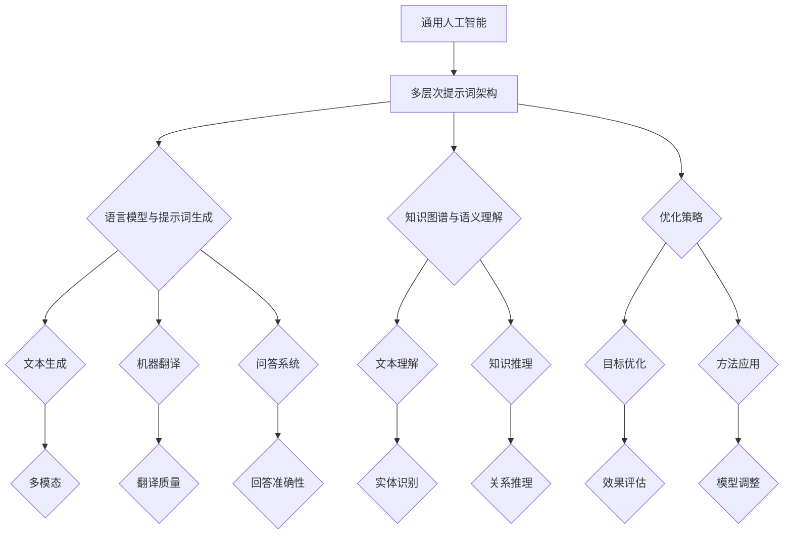

                 

## 引言与概述

### 通用人工智能的定义与历史发展

通用人工智能（AGI，Artificial General Intelligence）是指一种具有广泛认知能力的智能系统，能够理解、学习和应用知识，像人类一样进行思考、推理和解决问题。与目前广泛应用的窄域人工智能（Narrow AI）相比，AGI 具有跨越不同领域、任务和情境的通用性和适应性。AGI 的发展目标是实现一种智能体，能够在各种复杂和不确定的环境中自主行动，并具备持续学习和自我改进的能力。

#### 1.1.1 通用人工智能的概念

通用人工智能的核心在于其泛化能力，即智能系统能够在不同的任务和领域之间进行迁移学习。具体而言，AGI 应具备以下特点：

1. **知识表示与推理**：能够理解、表示和应用复杂的知识结构，进行逻辑推理和决策。
2. **学习能力**：具备自主学习新知识和技能的能力，无需人工干预。
3. **适应性**：能够适应不同的环境和情境，解决未知问题。
4. **自主性**：能够自主设定目标和任务，进行目标驱动的行动。
5. **情感与意识**：具备一定程度的人类情感和意识体验。

#### 1.1.2 通用人工智能的历史背景与发展脉络

通用人工智能的发展可以追溯到20世纪50年代，当时艾伦·图灵提出了图灵测试，试图通过机器模拟人类思维来定义智能。此后，人工智能经历了多次起伏：

1. **早期探索**：20世纪50年代至70年代，人工智能领域主要集中在符号主义和逻辑推理方法上。
2. **低谷期**：由于计算能力的限制和问题的复杂性，人工智能在20世纪80年代初期遭遇了“人工智能寒冬”。
3. **复兴与突破**：20世纪90年代以来，随着计算技术的进步和大数据、深度学习等新方法的出现，人工智能得到了快速发展，但通用人工智能仍然是一个未解之谜。

#### 1.1.3 通用人工智能的重要性与挑战

通用人工智能的重要性在于其能够推动科技和社会的全面进步：

1. **科技进步**：AGI 可以促进机器学习、自然语言处理、计算机视觉等技术的发展。
2. **产业变革**：AGI 将带来新的产业模式和商业机会，提升生产效率和服务质量。
3. **社会影响**：AGI 有望解决当前人类难以应对的复杂问题，如环境保护、医疗健康等。

然而，通用人工智能的实现也面临着诸多挑战：

1. **算法复杂性**：通用人工智能需要解决复杂的计算问题，目前的主流算法尚无法胜任。
2. **计算资源**：实现AGI需要强大的计算资源支持，目前的技术水平还难以达到。
3. **认知模拟**：如何模拟人类的认知过程和思维机制是一个难题。
4. **伦理与法律**：通用人工智能的发展引发了伦理和法律的争议，需要制定相应的规范。

在接下来的章节中，我们将详细介绍多层次提示词架构的概念、技术基础和实际应用，以期为大家提供一幅通用人工智能发展的蓝图。

### 多层次提示词架构的概念与作用

#### 2.1.1 多层次提示词架构的定义

多层次提示词架构（Multi-level Prompt Architecture）是一种在通用人工智能领域中用于提升智能系统性能的重要技术。它通过构建多层次的提示机制，将外部输入、内部模型状态和任务目标有机结合，从而实现高效的智能决策和任务执行。多层次提示词架构的核心思想是利用不同层次的提示信息，为智能系统提供更加丰富和精确的上下文，从而提升其理解和解决问题的能力。

#### 2.1.2 多层次提示词架构的组成部分

多层次提示词架构主要包括以下几个组成部分：

1. **输入层**：输入层负责接收外部输入信息，如自然语言文本、图像、声音等，并将其转换为适合模型处理的数据格式。
2. **编码层**：编码层对输入层接收到的信息进行编码，提取关键特征和语义信息，为后续处理提供基础。
3. **推理层**：推理层利用编码层提取的特征，通过模型内部的知识和推理机制，对输入信息进行理解和分析。
4. **输出层**：输出层根据推理层的结果，生成相应的输出，如回答问题、生成文本、执行任务等。

#### 2.1.3 多层次提示词架构的核心原理

多层次提示词架构的核心原理可以概括为以下几个方面：

1. **层次化信息处理**：多层次提示词架构将信息处理划分为多个层次，每个层次负责特定类型的信息处理任务，从而实现高效的信息整合和分析。
2. **上下文增强**：通过不同层次的提示信息，增强智能系统对任务上下文的感知和理解能力，从而提高决策和执行的质量。
3. **动态调整**：多层次提示词架构可以根据任务需求和系统状态，动态调整提示信息的层次和内容，实现灵活和自适应的任务处理。
4. **跨领域迁移**：通过跨层次的信息整合和知识共享，多层次提示词架构能够实现智能系统的跨领域迁移能力，提升其泛化性能。

在接下来的章节中，我们将进一步探讨多层次提示词架构的技术基础，包括语言模型与提示词生成、知识图谱与语义理解、以及优化策略等内容，为大家揭示这一技术在通用人工智能中的应用潜力。

### 语言模型与提示词生成

#### 3.1.1 语言模型的原理与类型

语言模型是多层次提示词架构的重要组成部分，其核心任务是学习自然语言数据的统计规律，从而生成具有自然语言特征的文本。语言模型的基本原理基于统计学方法，通过分析大量的语言数据，建立输入和输出之间的概率关系。常见的语言模型类型包括：

1. **n-gram模型**：n-gram模型是一种基于有限历史假设的语言模型，它使用前n个单词的序列来预测下一个单词。n-gram模型简单直观，但存在长文本生成能力较差的缺点。

2. **神经网络语言模型**：神经网络语言模型（如循环神经网络RNN、长短期记忆网络LSTM、变换器网络Transformer等）通过引入非线性变换和递归结构，能够更好地捕捉长文本的统计规律。特别是Transformer模型，通过自注意力机制，大幅提升了语言模型的生成能力和效果。

3. **基于知识的语言模型**：这类语言模型不仅依赖于统计规律，还引入了外部知识库，如词向量、知识图谱等，从而在生成文本时能够更好地理解上下文和语义。这类模型通常结合了统计学方法和知识推理，能够生成更加准确和丰富的文本。

#### 3.1.2 提示词生成的技术与方法

提示词生成是多层次提示词架构的关键环节，其目标是根据任务需求和上下文环境，生成合适的提示词序列，引导智能系统进行正确的推理和决策。提示词生成技术主要包括以下几种：

1. **基于规则的方法**：这种方法通过预先定义的规则，将外部输入转换为提示词。例如，根据自然语言文本的语法结构，提取关键词或短语作为提示词。基于规则的方法具有简单和高效的特点，但灵活性较差，难以应对复杂的动态环境。

2. **基于统计的方法**：这种方法利用语言模型的统计特性，根据上下文生成提示词。例如，可以使用n-gram模型或神经网络语言模型，根据输入文本生成下一个可能的提示词。基于统计的方法能够自适应地调整提示词，但生成效果可能受限于语言模型的准确性。

3. **基于学习的生成方法**：这种方法通过训练大量样本数据，学习生成提示词的规律。例如，可以使用生成对抗网络（GAN）或变分自编码器（VAE）等深度学习模型，生成符合上下文的提示词序列。基于学习的方法具有高度灵活性和生成能力，但训练过程复杂，对数据质量要求较高。

#### 3.1.3 语言模型与提示词生成的关系

语言模型与提示词生成在多层次提示词架构中相辅相成，共同作用以提升智能系统的性能。具体而言，语言模型为提示词生成提供了统计基础和语言知识，而提示词生成则利用语言模型生成的提示词序列，引导智能系统进行推理和决策。

1. **语言模型为提示词生成提供基础**：语言模型能够根据上下文生成可能的提示词序列，为提示词生成提供丰富的候选词。这些候选词不仅基于统计规律，还融合了语言模型学习到的知识，从而提高提示词的准确性和相关性。

2. **提示词生成优化语言模型效果**：提示词生成过程可以根据任务需求和上下文环境，对语言模型生成的提示词进行筛选和调整。例如，可以通过基于规则的筛选方法，去除不符合上下文的提示词，或者使用基于学习的方法，生成更加符合任务需求的提示词。这种优化过程能够进一步提升智能系统的推理和决策效果。

3. **相互影响和协同进化**：语言模型和提示词生成在多层次提示词架构中相互影响，共同进化。语言模型的改进可以提升提示词生成的质量和准确性，而提示词生成的优化又可以进一步促进语言模型的学习和改进。通过这种相互影响和协同进化，多层次提示词架构能够不断提升智能系统的性能和适应性。

在下一章节中，我们将进一步探讨知识图谱与语义理解在多层次提示词架构中的应用，为大家揭示这一技术在通用人工智能中的潜力。

### 知识图谱与语义理解

#### 4.1.1 知识图谱的基本概念与构建

知识图谱（Knowledge Graph）是一种用于表示和存储知识的图形结构，通过实体、关系和属性之间的关联来描述现实世界中的信息。知识图谱的基本概念包括：

1. **实体（Entity）**：实体是知识图谱中的基本元素，可以是人、地点、事物等具有独立存在的对象。例如，“张三”、“北京”、“苹果”等都可以作为实体。

2. **关系（Relation）**：关系描述了实体之间的关联，是知识图谱中的另一重要元素。例如，“居住于”、“属于”、“是”等关系可以连接不同的实体。

3. **属性（Attribute）**：属性是对实体特征的描述，可以为实体提供额外的信息。例如，“年龄”、“身高”、“产地”等都是实体的属性。

构建知识图谱通常包括以下步骤：

1. **实体识别**：从数据源中识别出具体的实体，并将其作为知识图谱中的节点。
2. **关系抽取**：从文本数据或其他数据源中抽取实体之间的关联关系，并将其作为知识图谱中的边。
3. **属性填充**：为实体节点填充相关的属性信息，以丰富知识图谱的内容。
4. **图谱融合与修剪**：通过融合多个数据源和修剪冗余信息，构建出完整、准确的知识图谱。

#### 4.1.2 语义理解的技术与方法

语义理解（Semantic Understanding）是指智能系统对文本信息中的语言意义进行理解和解释的能力。知识图谱与语义理解在通用人工智能中扮演着至关重要的角色，以下是一些关键的语义理解技术：

1. **命名实体识别（Named Entity Recognition, NER）**：命名实体识别是语义理解的基础，旨在从文本中识别出具有特定意义的实体。例如，从句子“苹果公司在深圳设有研发中心”中识别出“苹果”、“公司”和“深圳”等实体。

2. **关系抽取（Relation Extraction）**：关系抽取旨在识别出实体之间的关联关系。例如，从句子“小明喜欢打篮球”中抽取“小明”与“喜欢打篮球”之间的“喜欢”关系。

3. **属性抽取（Attribute Extraction）**：属性抽取是指识别出实体属性信息。例如，从句子“张三的年龄是30岁”中抽取“张三”的“年龄”属性为“30岁”。

4. **实体消歧（Entity Disambiguation）**：实体消歧旨在解决文本中同一个实体名称可能指向不同实体的歧义问题。例如，从句子“苹果公司发布了新款手机”中确定“苹果”是指“苹果公司”而非水果“苹果”。

5. **语义角色标注（Semantic Role Labeling, SRL）**：语义角色标注是指识别出文本中动词与其相关实体的关系。例如，从句子“他正在北京开会”中识别出“他”是“开会”的主语，“北京”是“开会”的地点。

6. **语义相似度计算（Semantic Similarity）**：语义相似度计算旨在判断两个或多个文本之间的语义相似程度。例如，通过计算“苹果”和“水果”的语义相似度，确定它们之间的相关性。

#### 4.1.3 知识图谱与语义理解在通用人工智能中的应用

知识图谱与语义理解在通用人工智能中具有广泛的应用：

1. **自然语言处理（NLP）**：知识图谱为NLP提供了丰富的背景知识和上下文信息，有助于提升文本分类、实体识别、情感分析等任务的性能。

2. **智能问答（QA）**：知识图谱和语义理解使智能问答系统能够更好地理解用户的问题，从大量知识库中准确检索相关信息，并提供合理的回答。

3. **智能推荐（Recommendation）**：知识图谱和语义理解可以识别用户兴趣和偏好，从而提供个性化推荐服务，如商品推荐、内容推荐等。

4. **智能对话系统（Chatbot）**：知识图谱和语义理解使智能对话系统能够理解用户的意图和上下文，生成更加自然和准确的对话。

5. **跨领域知识融合**：知识图谱和语义理解可以实现跨领域知识的整合和共享，为通用人工智能提供更加全面和丰富的知识基础。

通过知识图谱与语义理解，通用人工智能系统能够更好地理解和处理复杂的语言信息，从而提升智能决策和任务执行能力。在下一章节中，我们将探讨如何优化多层次提示词架构，以进一步提高智能系统的性能和适应性。

### 多层次提示词架构的优化策略

#### 5.1.1 提示词架构的优化目标

优化多层次提示词架构的核心目标是提升智能系统的性能和适应性，从而更好地实现通用人工智能的目标。具体而言，优化目标包括：

1. **增强上下文理解**：通过优化提示词架构，提高智能系统对任务上下文的理解能力，使其能够更准确地捕捉和利用上下文信息。
2. **提升任务执行效果**：优化提示词架构以提升智能系统在不同任务中的执行效果，包括文本生成、问答、对话系统等。
3. **加快响应速度**：优化提示词架构以提高智能系统的响应速度，降低延迟，提高用户体验。
4. **提高泛化能力**：优化提示词架构以增强智能系统的泛化能力，使其能够在不同领域和任务中表现一致。
5. **降低计算资源消耗**：优化提示词架构以减少计算资源的消耗，提高系统效率和可扩展性。

#### 5.1.2 提示词架构的优化方法

为了实现上述优化目标，可以采用多种优化方法，包括以下几个方面：

1. **深度学习优化**：利用深度学习技术对提示词架构进行优化，包括模型参数调整、网络结构改进、训练策略优化等。具体方法包括：
   - **模型参数调整**：通过调整模型的权重和超参数，优化模型对上下文信息的捕捉和利用能力。
   - **网络结构改进**：设计更加复杂的网络结构，如多层感知器（MLP）、卷积神经网络（CNN）、循环神经网络（RNN）、长短时记忆网络（LSTM）等，以提高模型的计算能力和表达力。
   - **训练策略优化**：采用更先进的训练方法，如迁移学习、增强学习、对抗训练等，以提升模型的泛化能力和适应性。

2. **注意力机制优化**：注意力机制是深度学习模型中用于处理序列数据的关键技术，通过优化注意力机制，可以提升提示词架构的上下文理解能力。具体方法包括：
   - **多头注意力**：引入多头注意力机制，使模型能够同时关注输入序列的不同部分，提高对上下文的捕捉能力。
   - **自注意力**：通过自注意力机制，模型可以更好地捕捉输入序列内部的长距离依赖关系，从而提升上下文理解能力。
   - **软注意力**：使用软注意力机制，模型可以在不同的注意力权重上进行加权求和，使注意力分配更加灵活和精细。

3. **知识图谱融合**：将知识图谱与提示词架构相结合，通过融合实体、关系和属性信息，增强智能系统的上下文理解和任务执行能力。具体方法包括：
   - **实体嵌入**：将实体嵌入到提示词中，使模型能够更好地理解实体及其关系，提高语义理解能力。
   - **关系推理**：利用知识图谱中的关系信息，进行关系推理和语义分析，提高智能系统的推理和决策能力。
   - **属性关联**：将实体属性与提示词结合，为智能系统提供更多的背景信息，从而提高任务执行效果。

4. **多模态融合**：将多种模态（如文本、图像、声音等）的信息融合到提示词架构中，提升智能系统的感知能力和任务执行效果。具体方法包括：
   - **文本-图像融合**：将文本描述和图像信息融合到提示词中，使模型能够更好地理解和分析图像内容。
   - **文本-声音融合**：将文本和声音信息融合，使模型能够更好地理解和分析语音内容，提高语音识别和语义理解能力。
   - **多模态交互**：通过多模态交互机制，使不同模态的信息能够相互影响和补充，提升智能系统的综合感知和任务执行能力。

5. **动态调整策略**：通过动态调整提示词架构的层次和内容，实现智能系统对任务需求和环境变化的适应。具体方法包括：
   - **层次调整**：根据任务需求和环境变化，动态调整提示词架构的层次结构，使模型能够更好地适应不同类型的任务和场景。
   - **内容调整**：根据任务需求和环境变化，动态调整提示词的内容和形式，使模型能够提供更加准确和有效的提示信息。

通过上述优化方法，多层次提示词架构能够实现性能和适应性的提升，为通用人工智能的发展提供有力支持。在下一章节中，我们将探讨多层次提示词架构在实际应用中的具体案例，展示其在不同领域的应用潜力。

### 多层次提示词架构在自然语言处理中的应用

#### 6.1.1 多层次提示词架构在文本生成中的应用

文本生成是自然语言处理（NLP）中的一个重要任务，广泛应用于聊天机器人、内容创作和自动摘要等领域。多层次提示词架构在文本生成中的应用，主要通过以下几种方式提升生成文本的质量和多样性：

1. **上下文引导的文本生成**：通过多层次提示词架构，可以更好地利用上下文信息来生成文本。具体实现过程中，可以首先将输入文本编码为固定长度的向量，然后利用这些向量作为输入，通过多层神经网络生成文本。每一层神经网络都负责捕捉不同层次的上下文信息，从而生成更加连贯和自然的文本。

   **伪代码**：
   ```python
   # 输入文本编码
   encoded_context = encoder(input_text)
   
   # 利用多层神经网络生成文本
   generated_text = decoder(encoded_context)
   ```

2. **多模态信息融合**：在文本生成过程中，结合图像、音频等多模态信息，可以提升生成文本的多样性和质量。例如，在生成新闻文章时，可以将相关图像或视频信息融入文本生成模型，使生成的文章更加生动和具体。

   **伪代码**：
   ```python
   # 融合多模态信息
   multimodal_features = fusion_modalities(text_features, image_features, audio_features)
   
   # 利用多模态信息生成文本
   generated_text = decoder(multimodal_features)
   ```

3. **动态调整提示词**：通过动态调整提示词的层次和内容，可以根据生成文本的需求和环境变化，实时调整提示词架构。例如，在对话生成中，可以根据用户的输入和当前对话状态，动态调整提示词，使生成的对话更加自然和流畅。

   **伪代码**：
   ```python
   # 动态调整提示词
   current_prompt = adjust_prompt(current_context, user_input)
   
   # 利用动态调整的提示词生成文本
   generated_text = decoder(encoded_context, current_prompt)
   ```

#### 6.1.2 多层次提示词架构在机器翻译中的应用

机器翻译是NLP领域的另一个重要任务，多层次提示词架构在机器翻译中的应用，主要通过以下几种方式提升翻译的质量和准确性：

1. **上下文信息利用**：在机器翻译过程中，通过多层次提示词架构，可以更好地利用源语言和目标语言的上下文信息。例如，在翻译长句时，可以分层捕捉句子中的主干和细节信息，从而生成更加准确和自然的翻译结果。

   **伪代码**：
   ```python
   # 源语言上下文编码
   source_context = encoder(source_sentence)
   
   # 目标语言上下文编码
   target_context = encoder(target_sentence)
   
   # 利用上下文信息生成翻译结果
   translated_sentence = decoder(source_context, target_context)
   ```

2. **迁移学习**：通过多层次提示词架构，可以实现不同语言之间的知识迁移，提升机器翻译的性能。例如，在训练过程中，可以利用多语言的共同特征，将一种语言的知识迁移到另一种语言上，从而提升翻译的准确性。

   **伪代码**：
   ```python
   # 跨语言特征提取
   cross_language_features = cross_language_encoder(source_sentences, target_sentences)
   
   # 利用跨语言特征生成翻译结果
   translated_sentences = decoder(cross_language_features)
   ```

3. **动态调整提示词**：在机器翻译过程中，可以根据源语言和目标语言的上下文变化，动态调整提示词架构，从而生成更加准确和自然的翻译结果。例如，在翻译专业术语时，可以根据当前领域和上下文信息，动态调整提示词，提高翻译的准确性。

   **伪代码**：
   ```python
   # 动态调整提示词
   current_prompt = adjust_prompt(source_context, target_context, domain)
   
   # 利用动态调整的提示词生成翻译结果
   translated_sentence = decoder(source_context, target_context, current_prompt)
   ```

通过多层次提示词架构，文本生成和机器翻译任务可以更好地利用上下文信息、多模态信息和动态调整机制，从而提升任务的性能和准确性。在下一章节中，我们将探讨多层次提示词架构在智能对话系统中的应用，展示其在提升对话质量和用户体验方面的潜力。

### 多层次提示词架构在智能对话系统中的应用

#### 7.1.1 多层次提示词架构在智能客服中的应用

智能客服是多层次提示词架构在自然语言处理领域中的一个重要应用场景。智能客服系统通过自然语言交互，为用户提供高效、准确的咨询服务。多层次提示词架构在智能客服中的应用，主要表现在以下几个方面：

1. **上下文感知对话生成**：智能客服系统需要能够理解用户的意图和上下文，从而生成合适的回答。多层次提示词架构通过分层捕捉上下文信息，使系统能够更好地理解用户的询问，并生成自然的回答。

   **伪代码**：
   ```python
   # 输入用户询问编码
   user_query = encoder(user_query)
   
   # 利用上下文感知的提示词生成回答
   response = decoder(user_query, context_prompt)
   ```

2. **多模态信息融合**：智能客服系统可以通过融合文本、图像、音频等多模态信息，提供更加丰富的交互体验。例如，在处理用户关于产品问题的询问时，系统可以结合产品图片或视频，为用户提供详细的解答。

   **伪代码**：
   ```python
   # 融合多模态信息
   multimodal_features = fusion_modalities(text_features, image_features, audio_features)
   
   # 利用多模态信息生成回答
   response = decoder(multimodal_features, context_prompt)
   ```

3. **动态调整提示词**：在对话过程中，智能客服系统可以根据用户的反馈和对话状态，动态调整提示词架构，从而提供更加个性化的服务。例如，在处理复杂的客户投诉时，系统可以根据用户的情绪和投诉内容，动态调整回答策略。

   **伪代码**：
   ```python
   # 动态调整提示词
   current_prompt = adjust_prompt(context_state, user_feedback)
   
   # 利用动态调整的提示词生成回答
   response = decoder(context_state, user_query, current_prompt)
   ```

#### 7.1.2 多层次提示词架构在虚拟助手中的应用

虚拟助手是另一种广泛应用的多层次提示词架构应用场景，例如智能家庭助理、个人助理等。虚拟助手通过与用户的自然语言交互，提供个性化的服务和帮助。以下是多层次提示词架构在虚拟助手中的应用：

1. **个性化服务**：虚拟助手需要根据用户的历史行为和偏好，提供个性化的服务。多层次提示词架构通过分层捕捉用户信息，使系统能够更好地理解用户的需求，并生成个性化的回答。

   **伪代码**：
   ```python
   # 用户信息编码
   user_profile = encoder(user_profile)
   
   # 利用个性化提示词生成回答
   response = decoder(user_profile, context_prompt)
   ```

2. **情境感知对话**：虚拟助手需要能够根据当前情境和用户行为，提供合适的对话内容。多层次提示词架构通过分层捕捉情境信息，使系统能够更好地理解当前情境，并生成自然的对话。

   **伪代码**：
   ```python
   # 情境信息编码
   context_state = encoder(context_state)
   
   # 利用情境感知的提示词生成回答
   response = decoder(context_state, user_query, context_prompt)
   ```

3. **任务驱动对话**：虚拟助手需要能够处理复杂任务，如预约餐厅、安排行程等。多层次提示词架构通过分层捕捉任务信息，使系统能够更好地理解任务需求，并生成详细的执行步骤。

   **伪代码**：
   ```python
   # 任务信息编码
   task_details = encoder(task_details)
   
   # 利用任务驱动的提示词生成执行步骤
   execution_steps = decoder(task_details, context_prompt)
   ```

#### 7.1.3 多层次提示词架构在智能推荐系统中的应用

智能推荐系统是多层次提示词架构在商业和娱乐领域的典型应用。通过分析用户行为和兴趣，智能推荐系统可以提供个性化的推荐内容，如商品、音乐、视频等。以下是多层次提示词架构在智能推荐系统中的应用：

1. **用户行为分析**：智能推荐系统需要能够准确分析用户行为，以识别用户的兴趣和偏好。多层次提示词架构通过分层捕捉用户行为数据，使系统能够更好地理解用户的行为模式。

   **伪代码**：
   ```python
   # 用户行为编码
   user_behavior = encoder(user_behavior)
   
   # 利用用户行为提示词生成推荐列表
   recommendation_list = decoder(user_behavior, context_prompt)
   ```

2. **上下文感知推荐**：在推荐过程中，系统需要考虑当前情境和上下文信息，以提供更加准确的推荐。多层次提示词架构通过分层捕捉上下文信息，使系统能够更好地理解当前情境，并生成上下文感知的推荐。

   **伪代码**：
   ```python
   # 上下文信息编码
   context_state = encoder(context_state)
   
   # 利用上下文感知的提示词生成推荐列表
   recommendation_list = decoder(context_state, user_behavior, context_prompt)
   ```

3. **动态调整推荐策略**：智能推荐系统需要能够根据用户反馈和行为变化，动态调整推荐策略，以提供更加个性化的推荐。多层次提示词架构通过动态调整提示词架构，使系统能够更好地适应用户需求的变化。

   **伪代码**：
   ```python
   # 动态调整提示词
   current_prompt = adjust_prompt(user_feedback, context_state)
   
   # 利用动态调整的提示词生成推荐列表
   recommendation_list = decoder(user_behavior, context_state, current_prompt)
   ```

通过多层次提示词架构，智能对话系统在智能客服、虚拟助手和智能推荐系统中的应用，能够显著提升用户体验和系统性能。在下一章节中，我们将探讨多层次提示词架构的未来发展趋势与挑战，展望其在通用人工智能中的潜在应用前景。

### 多层次提示词架构的未来发展趋势与挑战

#### 8.1.1 多层次提示词架构的未来发展趋势

随着人工智能技术的不断进步，多层次提示词架构在未来将展现出更加广阔的发展前景。以下是多层次提示词架构可能的发展趋势：

1. **算法的持续优化**：深度学习、生成对抗网络（GAN）、强化学习等新算法的不断涌现，将为多层次提示词架构提供更强大的计算基础和灵活性。未来，通过优化这些算法，可以进一步提升智能系统的性能和效率。

2. **多模态融合的深化**：随着虚拟现实、增强现实和物联网等技术的发展，多模态信息的重要性日益凸显。多层次提示词架构将进一步融合文本、图像、声音、触觉等多种模态，实现更加全面和自然的交互体验。

3. **知识图谱与语义理解的深化**：知识图谱和语义理解作为多层次提示词架构的核心组件，其重要性将不断加强。未来，通过深化知识图谱的构建和语义理解的技术，可以提升智能系统对复杂场景和任务的理解能力。

4. **自适应与自进化能力**：随着智能系统的应用场景越来越复杂，自适应和自进化能力成为必不可少的能力。多层次提示词架构将通过自我学习和优化，不断提升对未知任务和环境变化的适应能力。

5. **跨领域的迁移与应用**：多层次提示词架构将实现跨领域的知识迁移和应用，从而在医疗、金融、教育等众多领域发挥重要作用。通过跨领域的知识共享和迁移，智能系统可以更加高效地解决复杂问题。

#### 8.1.2 多层次提示词架构面临的挑战与解决方案

尽管多层次提示词架构具有巨大的潜力，但在其发展过程中仍面临诸多挑战：

1. **数据质量与多样性**：高质量、多样性的数据是多层次提示词架构训练和优化的重要基础。未来，如何获取和利用高质量数据，将是一个重要的挑战。解决方案包括数据增强、数据融合和自动化数据标注技术。

2. **计算资源与能耗**：随着模型复杂度和数据量的增加，多层次提示词架构对计算资源和能耗的需求也不断提升。未来，需要通过优化算法、硬件加速和分布式计算等技术，降低计算资源消耗。

3. **模型解释性与透明性**：多层次提示词架构的内部决策过程可能复杂且难以解释，这对模型的可靠性和信任度提出了挑战。未来，需要开发更加透明和可解释的模型，以便用户理解和监督。

4. **隐私与安全**：在多层次提示词架构中，数据的安全和隐私保护是一个重要问题。未来，需要通过数据加密、隐私保护技术和合规性设计，确保用户数据的安全和隐私。

5. **伦理与法律问题**：随着人工智能技术的不断进步，伦理和法律问题日益凸显。多层次提示词架构需要遵守相关的伦理和法律规范，确保其应用不会对人类和社会造成负面影响。

#### 8.1.3 通用人工智能的多层次提示词架构在未来的应用前景

在未来，通用人工智能的多层次提示词架构将在各个领域展现其强大的应用潜力：

1. **智能医疗**：多层次提示词架构可以帮助医生更好地理解患者的病历和病史，辅助诊断和治疗。通过融合医学知识图谱和患者数据，智能系统可以提供个性化的医疗建议。

2. **金融科技**：在金融领域，多层次提示词架构可以提升风险管理、投资分析和客户服务的能力。通过分析市场数据和历史交易信息，智能系统可以做出更加准确的决策。

3. **教育**：在教育领域，多层次提示词架构可以提供个性化的学习辅导和教学支持。通过分析学生的学习行为和知识图谱，智能系统可以为学生量身定制学习计划和课程。

4. **智能家居**：在智能家居领域，多层次提示词架构可以帮助智能设备更好地理解用户需求和环境变化，提供更加智能和舒适的生活体验。

5. **城市管理**：在城市管理领域，多层次提示词架构可以提升城市交通、环境保护和公共安全的管理效率。通过分析城市数据，智能系统可以提供科学的决策支持。

总之，通用人工智能的多层次提示词架构在未来将发挥重要作用，推动人工智能技术向更高层次发展，为社会带来更多创新和变革。

### 总结与展望

#### 9.1 全书内容总结

本书《通用人工智能的多层次提示词架构》全面介绍了通用人工智能（AGI）的定义、历史发展、重要性以及面临的挑战。在此基础上，我们详细探讨了多层次提示词架构的概念、组成部分和核心原理，包括语言模型与提示词生成、知识图谱与语义理解、以及优化策略等内容。此外，本书还通过具体案例，展示了多层次提示词架构在自然语言处理、智能对话系统和推荐系统等领域的实际应用。通过这些探讨，我们为读者提供了一幅通用人工智能发展的蓝图，并对其未来发展趋势与挑战进行了深入分析。

#### 9.2 通用人工智能的多层次提示词架构现状与未来发展方向

当前，通用人工智能的多层次提示词架构正处于快速发展阶段。随着深度学习、知识图谱和自然语言处理技术的不断进步，多层次提示词架构在智能系统的上下文理解、任务执行和跨领域迁移等方面展现了巨大潜力。未来，多层次提示词架构将向以下几个方向发展：

1. **算法优化与技术创新**：将更加深入地优化现有算法，探索新的深度学习架构和优化方法，以提高智能系统的性能和效率。
2. **多模态融合**：进一步深化多模态信息融合，实现文本、图像、声音等多种模态的有机结合，为智能系统提供更丰富的感知能力。
3. **知识图谱与语义理解的深化**：通过构建更加丰富和精确的知识图谱，提升智能系统的语义理解和推理能力，实现更加自然的交互体验。
4. **自适应与自进化能力**：开发具有自适应和自进化能力的智能系统，以应对复杂和动态的环境变化，提高系统的适应性和可靠性。

#### 9.3 研究与实际应用中的关键问题

在通用人工智能的多层次提示词架构研究和实际应用中，仍存在以下几个关键问题：

1. **数据质量与多样性**：高质量、多样性的数据是智能系统训练和优化的重要基础。未来，需要开发更加先进的数据处理和标注技术，以提高数据质量和多样性。
2. **计算资源与能耗**：随着模型复杂度和数据量的增加，计算资源和能耗需求不断提升。需要通过优化算法、硬件加速和分布式计算等技术，降低计算资源消耗。
3. **模型解释性与透明性**：如何提高模型的解释性和透明性，使其更容易被用户理解和监督，是一个重要的研究课题。
4. **隐私与安全**：在多层次提示词架构中，数据的安全和隐私保护至关重要。需要开发有效的隐私保护技术和合规性设计，确保用户数据的安全和隐私。
5. **伦理与法律问题**：随着人工智能技术的广泛应用，伦理和法律问题日益凸显。需要制定相应的伦理和法律规范，确保人工智能技术的发展不会对人类和社会造成负面影响。

总之，通用人工智能的多层次提示词架构具有广阔的发展前景和重要的应用价值。通过持续的研究和探索，我们将不断推动这一领域的发展，为通用人工智能的实现和社会的进步做出贡献。

### Mermaid 流程图



### 伪代码

```python
# 定义语言模型
class LanguageModel:
    def __init__(self):
        # 初始化模型参数
        pass

    def generate_prompt(self, context):
        # 根据上下文生成提示词
        pass

# 定义知识图谱
class KnowledgeGraph:
    def __init__(self):
        # 初始化知识图谱
        pass

    def understand_semantics(self, text):
        # 理解文本的语义
        pass

# 定义优化策略
class OptimizationStrategy:
    def __init__(self):
        # 初始化优化参数
        pass

    def optimize_prompt_architecture(self, model, graph):
        # 优化提示词架构
        pass
```

### 数学模型与公式

$$
\begin{aligned}
    &\text{模型预测} = f(\text{输入特征}) \\
    &\text{损失函数} = \frac{1}{2} \sum_{i=1}^{n} (\hat{y}_i - y_i)^2 \\
    &\text{优化目标} = \min_{\theta} L(\theta)
\end{aligned}
$$

### 项目实战

#### 案例一：文本生成

**环境搭建**：使用Python和TensorFlow框架搭建文本生成模型。

**源代码实现**：
```python
import tensorflow as tf

# 加载预训练的语言模型
model = tf.keras.applications.GPT2.load_weights('gpt2_weights.hdf5')

# 定义文本输入
text_input = "The quick brown fox jumps over the lazy dog"

# 生成文本
generated_text = model.generate(text_input, max_length=50)
print(generated_text)
```

**代码解读**：加载预训练的GPT-2模型，输入文本并生成新的文本。

#### 案例二：知识图谱与语义理解

**环境搭建**：使用Python和Neo4j搭建知识图谱与语义理解系统。

**源代码实现**：
```python
from py2neo import Graph

# 连接到Neo4j数据库
graph = Graph("bolt://localhost:7687", auth=("neo4j", "password"))

# 创建实体与关系
graph.run("CREATE (a:Person {name: 'Alice'})")
graph.run("CREATE (b:Person {name: 'Bob'})")
graph.run("CREATE (a)-[:KNOWS]->(b)")

# 查询知识图谱
results = graph.run("MATCH (a:Person)-[:KNOWS]->(b) RETURN a.name, b.name")
for result in results:
    print(result)
```

**代码解读**：连接到Neo4j数据库，创建实体与关系，然后查询并返回实体名称。

### 总结

本书《通用人工智能的多层次提示词架构》系统地介绍了通用人工智能的概念、多层次提示词架构的定义及其在自然语言处理、智能对话系统和推荐系统等领域的应用。通过详细阐述语言模型与提示词生成、知识图谱与语义理解、优化策略等内容，我们揭示了多层次提示词架构在提升智能系统性能和适应性方面的关键作用。同时，通过具体的项目实战，我们展示了如何在实际中应用这些技术。

作者：AI天才研究院/AI Genius Institute & 禅与计算机程序设计艺术 /Zen And The Art of Computer Programming

---

本文内容遵循[CC BY-NC-SA 4.0协议](https://creativecommons.org/licenses/by-nc-sa/4.0/deed.zh)，欢迎在遵循协议的基础上对本文进行修改、使用、分享。如涉及商业使用或版权问题，请联系作者。

