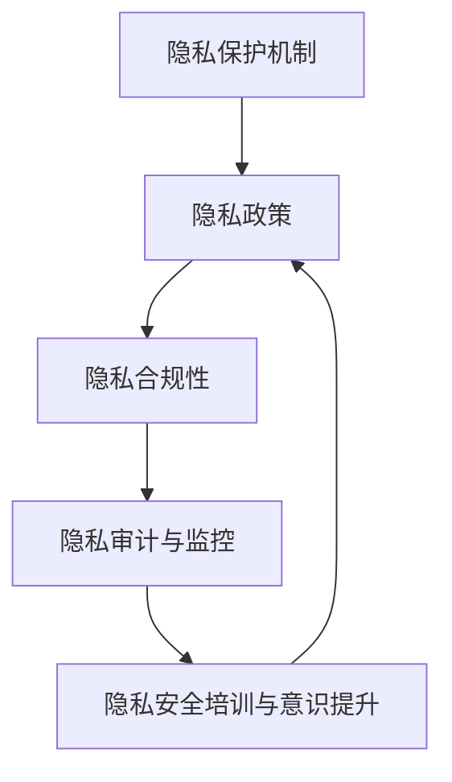
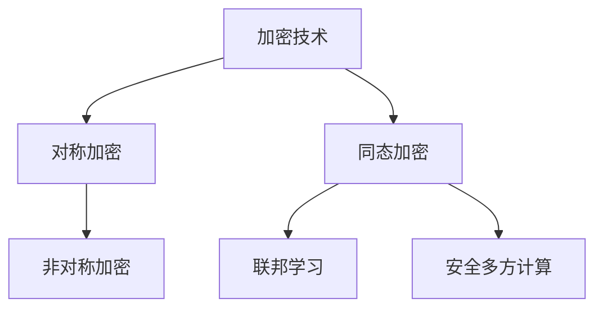
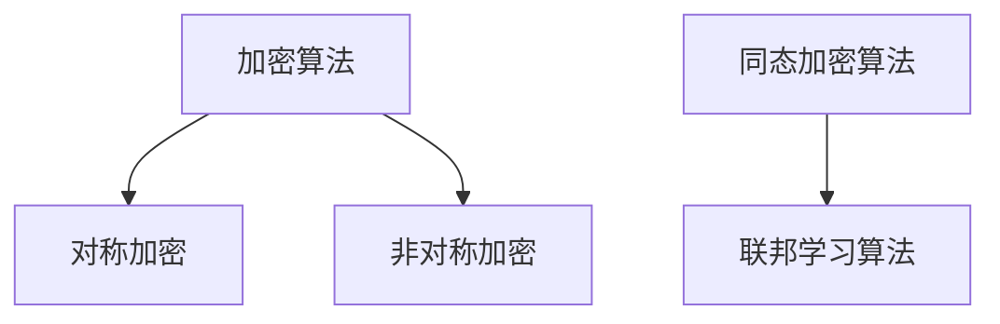
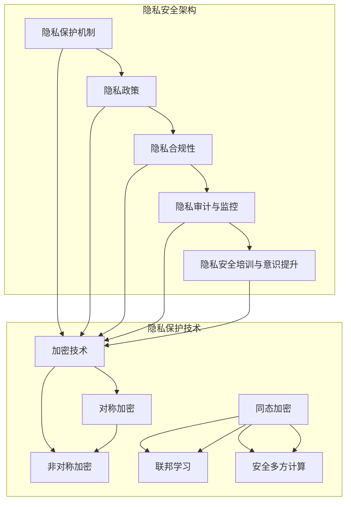

                 

### 《隐私安全：为人类计算保驾护航》

隐私安全是当今数字化时代的重要议题，对于人类计算的未来发展具有决定性影响。在信息化浪潮的推动下，数据成为新时代的石油，隐私数据的价值日益凸显。然而，随着大数据、人工智能、物联网等新兴技术的迅猛发展，隐私安全问题也日益突出。隐私泄露可能导致个人身份盗窃、财产损失、社会信用下降等一系列严重后果，甚至可能威胁国家安全和社会稳定。因此，保障隐私安全已成为一项紧迫且重要的任务。

本文旨在深入探讨隐私安全的内涵、外延及其在人类计算中的重要性，分析隐私安全的挑战与趋势，介绍隐私安全的核心理念与架构，讲解隐私保护的核心算法原理，探讨隐私安全的实施框架与策略，剖析隐私安全的法律法规与标准，展示隐私安全的项目实战案例，并展望隐私安全的未来发展趋势与挑战。通过本文的阐述，希望读者能够全面了解隐私安全的重要性，掌握隐私保护的核心技术，为人类计算的安全保驾护航。

文章关键词：隐私安全、隐私泄露、数据保护、加密技术、同态加密、联邦学习、隐私保护算法、隐私安全法律法规。

文章摘要：
随着信息技术的迅猛发展，隐私安全成为数字时代的关键议题。本文详细探讨了隐私安全的内涵与重要性，分析了当前隐私安全面临的挑战与趋势。通过介绍隐私安全的核心理念与架构，讲解核心算法原理，本文深入分析了隐私保护的实现方式。此外，文章还探讨了隐私安全的实施框架与策略，剖析了隐私安全的法律法规与标准，并通过项目实战案例展示了隐私安全在实践中的应用。最后，本文展望了隐私安全的未来发展趋势与挑战，为读者提供了全面且深入的隐私安全知识体系。

### 《隐私安全：为人类计算保驾护航》目录大纲

本文将围绕隐私安全这一主题，详细探讨隐私安全的重要性与挑战，隐私安全的核心理念与架构，核心算法原理，实施框架与策略，法律法规与标准，以及隐私安全的项目实战和未来发展趋势。以下是本文的详细目录大纲：

**第一部分：隐私安全概述**

**第1章：隐私安全的重要性与挑战**

- 1.1 人类计算中的隐私问题
  - 1.1.1 隐私的定义与范畴
  - 1.1.2 隐私安全的重要性
  - 1.1.3 隐私泄露的危害
- 1.2 隐私安全的挑战与趋势
  - 1.2.1 数据爆炸与隐私风险
  - 1.2.2 新型计算模式的隐私问题
  - 1.2.3 法律法规与隐私保护

**第2章：隐私安全的核心概念与联系**

- 2.1 隐私安全的原理与架构
  - 2.1.1 隐私安全的定义与目标
  - 2.1.2 隐私安全的核心组成部分
  - 2.1.3 隐私安全的 Mermaid 流程图
- 2.2 隐私保护技术的原理与联系
  - 2.2.1 加密技术与隐私保护
  - 2.2.2 同态加密与联邦学习
  - 2.2.3 安全多方计算与隐私保护

**第3章：隐私安全的核心算法原理讲解**

- 3.1 加密算法原理
  - 3.1.1 对称加密与非对称加密
  - 3.1.2 哈希函数与数字签名
  - 3.1.3 加密算法的伪代码
- 3.2 同态加密算法原理
  - 3.2.1 同态加密的定义与特性
  - 3.2.2 同态加密的数学模型与公式
  - 3.2.3 同态加密的伪代码
- 3.3 联邦学习算法原理
  - 3.3.1 联邦学习的定义与优势
  - 3.3.2 联邦学习的数学模型与公式
  - 3.3.3 联邦学习的伪代码

**第二部分：隐私安全的实施与策略**

**第4章：隐私安全的实施框架与策略**

- 4.1 隐私安全实施的原则与方法
  - 4.1.1 隐私安全实施的目标与原则
  - 4.1.2 隐私安全实施的方法与步骤
  - 4.1.3 隐私安全实施的工具与资源
- 4.2 隐私安全的组织与职责
  - 4.2.1 隐私安全的组织架构
  - 4.2.2 隐私安全的职责与角色
  - 4.2.3 隐私安全的培训和意识提升

**第5章：隐私安全的法律法规与标准**

- 5.1 隐私安全法律法规概述
  - 5.1.1 国际隐私安全法律法规
  - 5.1.2 中国隐私安全法律法规
  - 5.1.3 法律法规对隐私安全的影响
- 5.2 隐私安全标准与规范
  - 5.2.1 国际隐私安全标准
  - 5.2.2 中国隐私安全标准
  - 5.2.3 标准在隐私安全实施中的应用

**第6章：隐私安全的项目实战**

- 6.1 隐私安全项目案例介绍
  - 6.1.1 隐私安全项目的定义与目标
  - 6.1.2 隐私安全项目的实践案例
  - 6.1.3 隐私安全项目的成果与影响
- 6.2 隐私安全项目的开发环境与工具
  - 6.2.1 开发环境的搭建
  - 6.2.2 工具的选择与应用
  - 6.2.3 开发环境与工具的优化与调整
- 6.3 隐私安全项目的代码实现与解读
  - 6.3.1 代码实现的基本原理
  - 6.3.2 代码实现的详细步骤
  - 6.3.3 代码解读与分析

**第三部分：隐私安全的未来发展趋势**

**第7章：隐私安全的未来发展趋势与挑战**

- 7.1 隐私安全技术的创新与发展
  - 7.1.1 新型隐私保护技术的探索与应用
  - 7.1.2 隐私安全技术的未来发展趋势
  - 7.1.3 隐私安全技术的创新与突破
- 7.2 隐私安全的挑战与应对策略
  - 7.2.1 隐私安全的挑战与问题
  - 7.2.2 隐私安全挑战的应对策略
  - 7.2.3 隐私安全未来发展的思考与建议

**第8章：隐私安全的全球合作与协同**

- 8.1 隐私安全的国际合作现状
  - 8.1.1 国际隐私安全合作的背景与意义
  - 8.1.2 国际隐私安全合作的主要成果
  - 8.1.3 国际隐私安全合作的发展趋势
- 8.2 隐私安全的区域协同
  - 8.2.1 区域隐私安全合作的模式与机制
  - 8.2.2 区域隐私安全合作的经验与启示
  - 8.2.3 区域隐私安全合作的发展方向

**第9章：隐私安全的未来展望**

- 9.1 隐私安全对社会与经济的影响
  - 9.1.1 隐私安全对社会的影响
  - 9.1.2 隐私安全对经济的影响
  - 9.1.3 隐私安全对人类生活方式的影响
- 9.2 隐私安全的未来发展趋势与挑战
  - 9.2.1 隐私安全的未来发展趋势
  - 9.2.2 隐私安全的未来挑战
  - 9.2.3 隐私安全的未来发展与应对策略

**附录**

- 附录 A：隐私安全相关的资源与工具
  - 附录 A.1：隐私安全相关的文献与资料
  - 附录 A.2：隐私安全相关的工具与平台
  - 附录 A.3：隐私安全相关的工具选择与评估
- 附录 B：隐私安全相关的法律法规与标准
  - 附录 B.1：国际隐私安全法律法规与标准
  - 附录 B.2：中国隐私安全法律法规与标准
  - 附录 B.3：隐私安全法律法规与标准的影响与作用
- 附录 C：隐私安全相关的案例研究
  - 附录 C.1：隐私安全案例研究概述
  - 附录 C.2：隐私安全案例研究案例

### 第一部分：隐私安全概述

#### 第1章：隐私安全的重要性与挑战

在数字化时代，隐私安全已成为人类计算中的一个核心问题。随着大数据、人工智能、物联网等新兴技术的迅猛发展，个人隐私数据的价值不断提升，同时，隐私泄露的风险也日益加剧。本章将深入探讨隐私安全的重要性与挑战，包括隐私的定义与范畴、隐私安全的重要性、隐私泄露的危害以及隐私安全的挑战与趋势。

##### 1.1 人类计算中的隐私问题

隐私是指个人不愿与他人分享的个人信息或私密事务，它涵盖了诸如姓名、地址、电话号码、健康状况、财务状况等各种敏感信息。在人类计算中，隐私问题主要来源于以下几个方面：

1. **数据收集**：在现代社会，企业和机构通过各种渠道收集了大量个人数据，这些数据可能包括用户的浏览记录、购买行为、地理位置等。
2. **数据处理**：随着数据量的增加，数据处理和分析技术也在不断发展，这使得个人隐私数据可能被用于各种目的，包括商业分析、个性化推荐等。
3. **数据共享**：在数据共享和开放的趋势下，个人隐私数据可能被第三方获取，甚至可能被用于非法目的。

因此，隐私安全在人类计算中扮演着至关重要的角色。它不仅关乎个人权益的保护，也关乎社会稳定和国家安全。

##### 1.1.1 隐私的定义与范畴

隐私的定义可以从多个角度来理解。从法律角度来看，隐私是指个人对其个人信息和事务的控制权。从技术角度来看，隐私是指信息在传输、存储和处理过程中不被未授权方访问和泄露。

隐私的范畴非常广泛，包括但不限于以下几类信息：

1. **个人身份信息**：如姓名、身份证号码、出生日期、性别等。
2. **生物特征信息**：如指纹、人脸识别、虹膜识别等。
3. **地理位置信息**：如当前位置、移动轨迹等。
4. **通讯记录**：如通话记录、短信记录、电子邮件等。
5. **金融信息**：如银行卡信息、账户余额、交易记录等。
6. **健康信息**：如病历记录、体检报告、基因信息等。

这些信息如果被未授权方获取或利用，可能会对个人造成严重损害。

##### 1.1.2 隐私安全的重要性

隐私安全的重要性体现在多个方面：

1. **个人权益保护**：隐私安全能够保护个人的信息安全，防止个人信息被滥用或泄露，从而保障个人的基本权利和自由。
2. **商业利益**：对于企业来说，保护客户隐私可以提高客户信任度，增强品牌形象，从而促进商业发展。
3. **社会稳定**：隐私安全对于维护社会秩序和稳定具有重要意义。隐私泄露可能导致社会矛盾激化，甚至可能威胁国家安全。
4. **科技进步**：隐私安全是新技术发展的基石。只有在保障隐私安全的前提下，新技术才能得到广泛接受和应用。

因此，隐私安全是数字时代的一项基本需求和核心议题。

##### 1.1.3 隐私泄露的危害

隐私泄露可能带来一系列严重后果，包括：

1. **个人身份盗窃**：隐私泄露可能导致个人身份信息被不法分子利用，进行诈骗、盗窃等犯罪活动。
2. **财产损失**：隐私泄露可能导致个人财务信息被滥用，导致财产损失。
3. **社会信用下降**：隐私泄露可能导致个人信用记录受损，影响个人在社会中的信用和声誉。
4. **隐私骚扰**：隐私泄露可能导致个人隐私受到侵犯，如骚扰电话、垃圾邮件等。
5. **心理健康问题**：隐私泄露可能导致个人心理压力增大，影响心理健康。
6. **国家安全风险**：在某些情况下，隐私泄露可能威胁国家安全，如涉及国家机密、军事信息等。

因此，隐私安全不仅是个人和企业的事，也是整个社会和国家需要共同关注的重要议题。

##### 1.2 隐私安全的挑战与趋势

随着信息技术的发展，隐私安全面临着一系列新的挑战和趋势：

1. **数据爆炸与隐私风险**：随着大数据时代的到来，个人数据量呈现爆炸性增长，这增加了隐私泄露的风险。如何在数据利用和保护之间找到平衡，成为隐私安全的一个重要挑战。
2. **新型计算模式的隐私问题**：随着云计算、物联网、边缘计算等新型计算模式的发展，隐私安全问题变得更加复杂。如何保障这些新型计算模式下的隐私安全，是隐私安全研究的一个重要方向。
3. **法律法规与隐私保护**：随着隐私安全问题日益突出，各国纷纷出台相关法律法规，以加强对隐私的保护。隐私安全的研究需要关注法律法规的更新和变化，确保隐私保护措施与法律法规的一致性。

##### 1.2.1 数据爆炸与隐私风险

数据爆炸是当前信息技术发展的重要特征。随着传感器、移动设备、社交媒体等技术的普及，个人数据以惊人的速度积累。这些数据不仅包括传统的结构化数据，还包括大量的非结构化数据，如文本、图片、视频等。

数据爆炸带来的隐私风险主要体现在以下几个方面：

1. **数据泄露风险**：随着数据量的增加，数据泄露的风险也相应增加。一旦数据泄露，可能被不法分子利用，造成严重后果。
2. **数据分析风险**：大数据分析技术可以对海量数据进行深度挖掘，从而发现潜在的关系和模式。然而，这也可能导致隐私泄露。例如，通过分析用户的浏览记录，可以推断出用户的兴趣爱好和隐私。
3. **数据聚合风险**：个人数据往往分散在不同的平台和系统中。一旦这些数据被聚合，就可能形成一个全面的个人画像，从而对隐私构成严重威胁。

为了应对数据爆炸带来的隐私风险，需要采取一系列技术和管理措施，包括数据加密、匿名化、隐私增强技术等。

##### 1.2.2 新型计算模式的隐私问题

新型计算模式的发展为隐私安全带来了新的挑战。以下是几种常见的计算模式及其隐私问题：

1. **云计算**：云计算允许用户在远程服务器上存储和处理数据。虽然云计算提供了便利性和灵活性，但隐私安全问题仍然存在。例如，云服务提供商可能有权访问用户数据，这可能导致隐私泄露。
2. **物联网**：物联网将物理设备和互联网连接起来，形成庞大的网络。物联网设备通常收集和传输大量个人数据，如地理位置、健康数据等。这些数据的安全性和隐私性需要得到保障。
3. **边缘计算**：边缘计算将数据处理和分析推向网络边缘，以减少数据传输延迟和提高响应速度。然而，这也可能导致隐私数据的泄露。

为了解决新型计算模式中的隐私问题，需要采用针对性的隐私保护技术，如同态加密、安全多方计算等。

##### 1.2.3 法律法规与隐私保护

法律法规在隐私保护中发挥着重要作用。以下是几个关键方面：

1. **隐私权法律**：隐私权是个人享有的基本权利。各国通过制定隐私权法律，明确个人对其隐私信息的控制权。例如，美国的《隐私法》、欧盟的《通用数据保护条例》（GDPR）等。
2. **网络安全法律**：网络安全法律旨在保护网络安全，防止网络犯罪和隐私泄露。例如，美国的《网络安全法》、中国的《网络安全法》等。
3. **数据保护法律**：数据保护法律专门针对个人数据的收集、存储、处理和传输等活动进行规范。例如，美国的《加州消费者隐私法》（CCPA）等。
4. **行业标准**：行业组织和企业也可以制定隐私保护标准和最佳实践，以提高隐私保护水平。

总之，法律法规为隐私保护提供了法律依据和框架，但实施和执行仍面临挑战。

##### 1.3 隐私安全的挑战与趋势

隐私安全面临的挑战和趋势可以从以下几个方面进行总结：

1. **数据量的增加**：随着大数据时代的到来，个人数据量呈现爆炸性增长。这不仅增加了隐私泄露的风险，也对隐私保护技术提出了更高的要求。
2. **新型计算模式的普及**：云计算、物联网、边缘计算等新型计算模式的发展，为隐私安全带来了新的挑战。如何保障这些新型计算模式下的隐私安全，是隐私安全研究的一个重要方向。
3. **隐私保护技术的创新**：隐私保护技术，如加密、同态加密、联邦学习等，正在不断发展。这些技术为隐私保护提供了新的手段和工具。
4. **法律法规的完善**：各国纷纷出台相关法律法规，以加强对隐私的保护。然而，法律法规的实施和执行仍面临挑战。
5. **隐私意识的提升**：个人和企业对隐私安全的重视程度不断提高。隐私意识的提升有助于推动隐私保护措施的落实。

总之，隐私安全是一个复杂且动态的领域，需要多方共同努力，以应对不断变化的隐私挑战。

### 第一部分：隐私安全概述

#### 第2章：隐私安全的核心概念与联系

隐私安全是一个复杂且多维度的领域，它涉及多个核心概念和组成部分。本章将深入探讨隐私安全的原理与架构，包括隐私安全的定义与目标，隐私安全的核心组成部分，以及隐私安全的 Mermaid 流程图。此外，本章还将介绍隐私保护技术的原理与联系，包括加密技术、同态加密与联邦学习、安全多方计算与隐私保护。

##### 2.1 隐私安全的原理与架构

隐私安全的原理与架构是保障个人隐私数据不被未授权访问和泄露的基础。以下是隐私安全的核心组成部分：

1. **隐私保护机制**：隐私保护机制包括各种技术和管理措施，用于保护个人隐私数据。这些机制包括数据加密、匿名化、访问控制等。
2. **隐私政策**：隐私政策是企业和组织制定的关于如何收集、存储、处理和共享个人数据的指南。隐私政策应该明确告知用户其隐私数据的处理方式，并取得用户的同意。
3. **隐私合规性**：隐私合规性是指企业和组织遵守相关法律法规和标准，确保其隐私保护措施符合法律要求。
4. **隐私审计与监控**：隐私审计与监控是确保隐私保护措施有效实施的重要手段。通过定期审计和监控，可以及时发现和纠正隐私保护方面的问题。
5. **隐私安全培训与意识提升**：隐私安全培训与意识提升是提高个人和企业隐私安全意识的重要措施。通过培训和教育，可以增强用户对隐私安全的认识和应对能力。

在隐私安全的架构中，这些组成部分相互关联，共同构成一个完整的隐私保护体系。以下是隐私安全的 Mermaid 流程图：



##### 2.2 隐私保护技术的原理与联系

隐私保护技术是隐私安全的核心手段，用于保护个人隐私数据不被未授权访问和泄露。以下是几种常见的隐私保护技术及其原理和联系：

1. **加密技术**：加密技术是一种将明文数据转换为密文的技术，以防止未授权访问。加密技术包括对称加密和非对称加密两种形式。
   - **对称加密**：对称加密使用相同的密钥进行加密和解密。其优点是速度快，但缺点是密钥管理复杂，难以实现安全传输。
   - **非对称加密**：非对称加密使用一对密钥，公钥用于加密，私钥用于解密。其优点是密钥管理简单，但缺点是加密和解密速度较慢。
   
2. **同态加密**：同态加密是一种允许在密文空间中直接进行计算和操作的技术，从而无需解密敏感数据。同态加密在保护隐私的同时，保持了数据的可用性和计算效率。

3. **联邦学习**：联邦学习是一种分布式机器学习技术，允许多个参与方在保护隐私的前提下共同训练模型。联邦学习通过将数据留在本地设备上，避免了数据传输和共享，从而降低了隐私泄露的风险。

4. **安全多方计算**：安全多方计算是一种允许多个参与方在保护隐私的前提下共同计算和交换信息的技术。安全多方计算可以用于各种应用场景，如投票、金融交易等。

以下是隐私保护技术的 Mermaid 流程图：



##### 2.3 隐私安全的核心算法原理讲解

隐私安全的核心算法原理是实现隐私保护技术的基础。以下是对几种核心算法原理的讲解：

1. **加密算法**：加密算法是一种将明文数据转换为密文的技术。以下是几种常见的加密算法：
   - **AES（高级加密标准）**：AES 是一种对称加密算法，具有高性能和安全性。
   - **RSA（RSA加密算法）**：RSA 是一种非对称加密算法，广泛应用于数字签名和密钥交换。
   - **SHA（安全哈希算法）**：SHA 是一种哈希函数，用于生成数据摘要，确保数据完整性。

2. **同态加密算法**：同态加密算法允许在密文空间中直接进行计算和操作。以下是同态加密算法的基本原理：
   - **安全计算同态加密**：安全计算同态加密允许在密文空间中执行各种算术运算，如加法、乘法等。
   - **布尔同态加密**：布尔同态加密允许在密文空间中执行布尔运算，如与、或、非等。

3. **联邦学习算法**：联邦学习算法是一种分布式机器学习技术，用于在多个参与方之间共享模型和优化。以下是联邦学习算法的基本原理：
   - **模型聚合**：模型聚合是将多个本地模型合并为一个全局模型的过程。
   - **梯度共享**：梯度共享是将每个参与方的梯度聚合起来，以更新全局模型的过程。

以下是隐私安全核心算法的 Mermaid 流程图：



##### 2.4 隐私安全的 Mermaid 流程图

为了更直观地展示隐私安全的核心概念和联系，我们可以使用 Mermaid 流程图来描述。以下是隐私安全的 Mermaid 流程图：



通过上述 Mermaid 流程图，我们可以清晰地看到隐私安全的核心概念和联系，以及隐私保护技术的实现原理。这有助于读者更好地理解隐私安全的核心内容。

### 第一部分：隐私安全概述

#### 第3章：隐私安全的核心算法原理讲解

隐私安全的核心算法是确保个人隐私数据在存储、传输和处理过程中不被未授权访问和泄露的关键。本章将深入讲解三种核心算法的原理：加密算法、同态加密算法和联邦学习算法。我们将详细探讨每种算法的定义、数学模型、伪代码，并通过具体例子来阐述其应用和实现。

##### 3.1 加密算法原理

加密算法是一种将明文数据转换为密文的方法，从而保护数据在传输和存储过程中的安全性。加密算法可以分为对称加密和非对称加密两种类型。

###### 3.1.1 对称加密与非对称加密

**对称加密**使用相同的密钥进行加密和解密。常见的对称加密算法有AES（高级加密标准）和DES（数据加密标准）。

- **AES**：AES是一种基于分块加密的算法，其密钥长度可以为128位、192位或256位，分别称为AES-128、AES-192和AES-256。AES具有高性能和安全性，广泛应用于各种加密应用。
- **DES**：DES是一种较早的对称加密算法，其密钥长度为56位。由于密钥长度较短，DES在安全性方面存在一定的问题，因此被AES所取代。

**非对称加密**使用一对密钥，即公钥和私钥。公钥用于加密，私钥用于解密。常见的非对称加密算法有RSA（Rivest-Shamir-Adleman）和ECC（椭圆曲线密码学）。

- **RSA**：RSA算法基于大整数分解的困难性，其安全性依赖于密钥的大小。RSA广泛用于数字签名和密钥交换。
- **ECC**：ECC算法基于椭圆曲线离散对数问题，其安全性比RSA更高，但计算复杂度更低。ECC在移动设备和嵌入式系统中得到广泛应用。

###### 3.1.2 哈希函数与数字签名

**哈希函数**是一种将任意长度的输入（称为“明文”）映射为固定长度的输出（称为“哈希值”）的函数。常见的哈希函数有SHA-256、MD5和SHA-1。

- **SHA-256**：SHA-256是一种加密哈希函数，其输出长度为256位。SHA-256广泛用于数据完整性校验和数字签名。
- **MD5**：MD5是一种较早期的哈希函数，其输出长度为128位。由于存在碰撞问题，MD5已不再推荐使用。
- **SHA-1**：SHA-1也是一种加密哈希函数，其输出长度为160位。由于安全性较低，SHA-1也被逐渐淘汰。

**数字签名**是一种用于验证消息真实性和完整性的技术。数字签名基于非对称加密算法，如RSA和ECC。

数字签名的生成过程：
1. 发送方使用私钥对消息进行签名，生成签名。
2. 接收方使用公钥验证签名，确保消息来自发送方且未被篡改。

数字签名的验证过程：
1. 接收方获取消息和签名。
2. 使用发送方的公钥对签名进行验证。
3. 如果验证成功，接收方确认消息的真实性和完整性。

###### 3.1.3 加密算法的伪代码

以下是对称加密和非对称加密算法的伪代码示例：

**对称加密算法（AES）**
```python
import Crypto.Cipher.AES as AES
import Crypto.Random as Random

def encrypt_aes(plaintext, key):
    cipher = AES.new(key, AES.MODE_CBC, Random.new().read(AES.block_size))
    return cipher.encrypt(plaintext)

def decrypt_aes(ciphertext, key):
    cipher = AES.new(key, AES.MODE_CBC, ciphertext[0:AES.block_size])
    return cipher.decrypt(ciphertext[1:])
```

**非对称加密算法（RSA）**
```python
from Crypto.PublicKey import RSA
from Crypto.Cipher import PKCS1_OAEP

def encrypt_rsa(plaintext, public_key):
    cipher = PKCS1_OAEP.new(public_key)
    return cipher.encrypt(plaintext)

def decrypt_rsa(ciphertext, private_key):
    cipher = PKCS1_OAEP.new(private_key)
    return cipher.decrypt(ciphertext)
```

##### 3.2 同态加密算法原理

**同态加密**是一种在密文空间中直接对数据进行操作，而不需要解密的加密技术。同态加密分为安全计算同态加密和布尔同态加密。

###### 3.2.1 同态加密的定义与特性

**同态加密**的定义如下：
- **同态加密**：允许在密文空间中执行计算和操作，而不需要解密敏感数据。

同态加密的特性包括：
- **计算保持性**：同态加密能够保持数据的计算结果不变，即使数据在加密状态下进行计算。
- **数据可用性**：同态加密在保护隐私的同时，保持了数据的可用性，可以用于实际应用。
- **高计算复杂度**：同态加密通常具有较高的计算复杂度，需要优化算法和硬件来实现高效运算。

###### 3.2.2 同态加密的数学模型与公式

同态加密的数学模型可以分为线性同态加密和非线性同态加密。

**线性同态加密**：
- **加密函数**：\( E(x) = ax + b \)
- **解密函数**：\( D(y) = \frac{y - b}{a} \)

**非线性同态加密**：
- **加密函数**：\( E(x) = f(x) \)
- **解密函数**：\( D(y) = f^{-1}(y) \)

其中，\( x \) 为明文数据，\( y \) 为密文数据，\( f \) 和 \( f^{-1} \) 分别为加密函数和解密函数。

###### 3.2.3 同态加密的伪代码

以下是一个简单的线性同态加密算法的伪代码示例：
```python
def encrypt_linear(x, a, b):
    return a * x + b

def decrypt_linear(y, a, b):
    return (y - b) / a
```

##### 3.3 联邦学习算法原理

**联邦学习**（Federated Learning）是一种分布式机器学习技术，允许多个参与方在保护隐私的前提下共同训练模型。联邦学习的基本思想是将模型的部分参数分布在各个参与方上，通过聚合模型参数来更新全局模型。

###### 3.3.1 联邦学习的定义与优势

**联邦学习**的定义如下：
- **联邦学习**：多个参与方在保护隐私的前提下，通过协同训练共享模型，从而共同提升模型性能。

联邦学习的主要优势包括：
- **隐私保护**：联邦学习将数据留在本地设备上，避免了数据传输和共享，从而降低了隐私泄露的风险。
- **数据多样化**：联邦学习可以从不同的参与方获取多样化的数据，从而提高模型的泛化能力和性能。
- **可扩展性**：联邦学习可以支持大规模分布式环境，适用于各种应用场景。

###### 3.3.2 联邦学习的数学模型与公式

联邦学习的数学模型可以表示为：
- **本地模型**：\( f_i(\theta_i) \)
- **全局模型**：\( \theta \)
- **聚合模型**：\( \theta_{\text{next}} = \phi(\theta, \theta_i) \)

其中，\( \theta_i \) 为第 \( i \) 个参与方的模型参数，\( \theta \) 为全局模型参数，\( \phi \) 为聚合函数。

常见的聚合函数包括：
- **平均聚合**：\( \theta_{\text{next}} = \frac{1}{N} \sum_{i=1}^{N} \theta_i \)
- **权重聚合**：\( \theta_{\text{next}} = \sum_{i=1}^{N} w_i \theta_i \)

###### 3.3.3 联邦学习的伪代码

以下是一个简单的联邦学习算法的伪代码示例：
```python
def federated_learning(models, alpha):
    aggregated_model = None
    
    for model in models:
        if aggregated_model is None:
            aggregated_model = model
        else:
            aggregated_model = aggregate(aggregated_model, model, alpha)
    
    return aggregated_model

def aggregate(model1, model2, alpha):
    return (1 - alpha) * model1 + alpha * model2
```

通过本章对加密算法、同态加密算法和联邦学习算法的讲解，我们可以看到隐私安全的核心算法在保护个人隐私数据中的重要作用。这些算法不仅提高了数据的安全性，也为隐私保护技术的实现提供了理论依据和技术支持。在未来，随着隐私安全需求不断增加，这些核心算法将继续发展和完善，为人类计算的安全保驾护航。

### 第二部分：隐私安全的实施与策略

#### 第4章：隐私安全的实施框架与策略

隐私安全的实施是一个系统性和复杂性的过程，涉及到技术、管理和法规等多个方面。本章将详细介绍隐私安全实施的原则与方法，隐私安全实施的方法与步骤，以及隐私安全实施的工具与资源。

##### 4.1 隐私安全实施的原则与方法

隐私安全实施应遵循以下原则：

1. **最小化数据收集**：在数据收集阶段，应遵循最小化原则，仅收集与业务需求相关的必要数据。
2. **数据加密**：对敏感数据进行加密处理，确保数据在传输和存储过程中不被未授权访问。
3. **访问控制**：实施严格的访问控制策略，确保只有授权用户才能访问敏感数据。
4. **隐私审计与监控**：定期进行隐私审计和监控，及时发现和纠正隐私保护方面的问题。
5. **隐私保护技术**：采用最新的隐私保护技术，如同态加密、联邦学习等，以增强隐私保护能力。
6. **用户隐私告知与同意**：在数据收集和使用过程中，应明确告知用户隐私数据的处理方式，并取得用户的同意。

隐私安全实施的方法包括以下步骤：

1. **需求分析**：明确隐私保护的业务需求和目标，确定需要保护的隐私数据类型和范围。
2. **风险评估**：对系统中的隐私数据进行全面的风险评估，识别潜在的安全威胁和风险。
3. **设计隐私保护方案**：根据风险评估结果，设计合理的隐私保护方案，包括数据加密、访问控制、隐私审计等。
4. **技术选型**：选择适合的隐私保护技术，如加密算法、同态加密、联邦学习等。
5. **实施与部署**：将隐私保护方案转化为具体的技术实现，并进行部署和测试。
6. **监控与维护**：定期监控隐私保护系统的运行情况，及时更新和优化隐私保护措施。

##### 4.2 隐私安全的组织与职责

为了确保隐私安全实施的有效性，需要建立完善的隐私安全组织架构和明确的职责分工。以下是隐私安全组织架构和职责分工的概述：

1. **隐私安全委员会**：负责制定隐私安全政策和战略，监督隐私安全实施过程。
2. **隐私安全经理**：负责隐私安全规划、实施和监控，协调各部门的隐私安全工作。
3. **数据保护官**：负责具体的数据隐私保护工作，包括数据加密、访问控制、隐私审计等。
4. **开发团队**：负责隐私保护技术的实现和部署，包括加密算法、同态加密、联邦学习等。
5. **测试团队**：负责对隐私保护系统的测试和评估，确保系统满足隐私安全要求。
6. **用户培训与支持**：负责对内部员工和用户进行隐私安全培训，提高隐私保护意识。

##### 4.3 隐私安全的培训和意识提升

隐私安全培训和意识提升是确保隐私安全措施有效实施的重要环节。以下是隐私安全培训和意识提升的要点：

1. **培训计划**：制定详细的隐私安全培训计划，包括培训内容、培训时间和培训对象。
2. **培训内容**：培训内容应涵盖隐私安全基础知识、隐私保护技术、隐私安全法律法规等。
3. **培训方式**：采用多种培训方式，如线上课程、面对面培训、案例研讨等，以提高培训效果。
4. **考核与评估**：对培训效果进行考核和评估，确保员工掌握必要的隐私安全知识和技能。
5. **持续学习**：鼓励员工持续关注隐私安全领域的最新动态和知识，提高隐私保护能力。

通过本章的讨论，我们可以看到隐私安全实施的重要性和复杂性。只有通过系统性的实施框架和策略，才能确保个人隐私数据在数字化时代得到有效保护。隐私安全的实施不仅需要技术的支持，还需要组织架构的完善和员工意识的提升。只有这样，我们才能为人类计算的安全保驾护航。

### 第二部分：隐私安全的实施与策略

#### 第5章：隐私安全的法律法规与标准

隐私安全在数字化时代的重要性不言而喻，而法律法规和标准则为隐私安全提供了法律依据和规范框架。本章将详细探讨隐私安全法律法规的概述，包括国际隐私安全法律法规、中国隐私安全法律法规以及法律法规对隐私安全的影响。同时，本章还将介绍隐私安全标准，包括国际隐私安全标准和中国隐私安全标准，并讨论标准在隐私安全实施中的应用。

##### 5.1 隐私安全法律法规概述

隐私安全法律法规是保护个人隐私权益、规范数据处理行为的重要手段。以下是国际和中国的隐私安全法律法规概述：

###### 5.1.1 国际隐私安全法律法规

在国际上，多个国家和地区制定了隐私安全法律法规，以保护个人隐私和数据安全。以下是几个主要国家的隐私安全法律法规：

1. **欧盟的《通用数据保护条例》（GDPR）**：GDPR是欧盟于2018年5月25日生效的一项重要法规，旨在强化个人数据保护，规范企业数据处理行为。GDPR规定了数据主体的权利、数据处理的合法性原则、数据保护 Officer（DPO）的职责等。
2. **美国的《加州消费者隐私法》（CCPA）**：CCPA是加州于2018年通过的一项法案，旨在保护加州居民的个人隐私。CCPA规定了数据收集、使用和共享的透明度和可控制性，以及数据主体的权利。
3. **日本的《个人信息保护法》**：日本于2003年颁布了《个人信息保护法》，旨在保护个人隐私和数据安全。该法规定了个人信息处理的基本原则、个人信息保护机构的职责等。
4. **澳大利亚的《隐私法》**：澳大利亚的《隐私法》于1988年生效，旨在保护个人隐私。该法规定了隐私保护的原则、隐私投诉的处理等。

这些国际隐私安全法律法规在一定程度上推动了全球隐私安全的发展，提高了企业的隐私保护意识和合规性。

###### 5.1.2 中国隐私安全法律法规

中国也在近年来不断加强隐私安全法律法规的建设，以下是中国隐私安全法律法规的概述：

1. **《中华人民共和国网络安全法》**：网络安全法于2017年6月1日生效，是中国网络安全领域的基础性法律。网络安全法明确了网络运营者的数据安全保护责任，规范了数据处理行为，强化了网络安全的监管。
2. **《中华人民共和国个人信息保护法》**：个人信息保护法于2021年11月1日生效，是中国首部个人信息保护综合性法律。个人信息保护法规定了个人信息的定义、处理个人信息的规则、个人信息主体的权利等。
3. **《中华人民共和国数据安全法》**：数据安全法于2021年9月1日生效，旨在保护数据安全，维护国家安全和社会公共利益。数据安全法规定了数据分类分级、数据安全保护措施、数据安全审查等。
4. **《中华人民共和国个人信息保护法实施条例》**：个人信息保护法实施条例于2021年12月1日生效，是对个人信息保护法的进一步细化和补充，规定了个人信息处理活动的具体要求、个人信息保护机构的职责等。

中国隐私安全法律法规的逐步完善，为个人信息保护提供了坚实的法律基础，推动了隐私安全的健康发展。

###### 5.1.3 法律法规对隐私安全的影响

隐私安全法律法规对隐私安全的影响主要体现在以下几个方面：

1. **提高隐私保护意识**：法律法规的出台和实施，提高了社会各界对隐私安全的重视程度，增强了企业和个人的隐私保护意识。
2. **规范数据处理行为**：法律法规对数据处理行为进行了规范，明确了数据收集、存储、处理、传输、删除等环节的要求，防止了非法和滥用个人数据的行为。
3. **加强监管和处罚**：法律法规规定了监管机构的职责和权限，对违反隐私安全规定的行为进行了处罚，提高了违法成本，增强了法律法规的威慑力。
4. **推动技术创新**：法律法规的出台，促进了隐私保护技术的研发和应用，推动了加密技术、同态加密、联邦学习等隐私保护技术的发展。

##### 5.2 隐私安全标准与规范

隐私安全标准是隐私安全法律法规的具体实施指南，为企业和组织提供了具体的隐私保护要求和最佳实践。以下是国际和中国隐私安全标准与规范的概述：

###### 5.2.1 国际隐私安全标准

在国际上，多个组织和机构制定了隐私安全标准，以下是几个主要的隐私安全标准：

1. **ISO/IEC 27001**：ISO/IEC 27001是国际标准化组织（ISO）和国际电工委员会（IEC）共同制定的个人信息安全管理体系标准。该标准规定了建立、实施、维护和持续改进个人信息安全管理体系的要求，适用于各种类型和规模的组织。
2. **ISO/IEC 27701**：ISO/IEC 27701是个人信息保护管理体系标准，用于补充ISO/IEC 27001。该标准规定了如何在ISO/IEC 27001的基础上，实施个人信息保护管理体系，适用于需要证明符合隐私安全法律法规和组织内部规定的组织。
3. **NIST SP 800-53**：NIST SP 800-53是美国国家标准与技术研究所（NIST）发布的网络安全和控制框架，其中包括个人信息保护控制措施。该标准为组织提供了全面的隐私安全控制措施和实施指南。
4. **CCRA**：CCRA是欧盟制定的跨境数据转移框架，用于规范欧盟成员国之间的数据转移。CCRA要求组织在跨境数据转移时，必须遵守严格的隐私安全要求。

这些国际隐私安全标准为企业和组织提供了具体的隐私保护要求和最佳实践，有助于提升隐私安全水平。

###### 5.2.2 中国隐私安全标准

中国在隐私安全标准建设方面也取得了一系列成果，以下是几个主要的隐私安全标准：

1. **GB/T 35273**：GB/T 35273是《信息安全技术 个人信息安全规范》，是中国国家标准，规定了个人信息保护的要求、原则和措施，适用于各种类型和规模的组织。
2. **GB/T 22081**：GB/T 22081是《信息安全技术 信息安全管理体系要求》，是中国国家标准，规定了建立、实施、维护和持续改进信息安全管理体系的要求，适用于各种类型和规模的组织。
3. **GB/T 36611**：GB/T 36611是《信息安全技术 个人信息安全认证指南》，是中国国家标准，提供了个人信息安全认证的实施指南，为组织提供认证依据。
4. **《信息安全技术 网络安全审查规范》**：该规范是中国国家互联网信息办公室发布的，规定了网络安全审查的原则、流程和标准，适用于网络运营者和相关方。

这些中国隐私安全标准为企业和组织提供了具体的隐私保护要求和最佳实践，有助于提升隐私安全水平。

###### 5.2.3 标准在隐私安全实施中的应用

隐私安全标准在隐私安全实施中发挥着重要作用，以下是其应用要点：

1. **合规性验证**：组织可以通过符合隐私安全标准，证明其隐私保护措施符合法律法规要求，增强用户信任和品牌形象。
2. **最佳实践**：隐私安全标准为组织提供了最佳实践，有助于规范隐私保护行为，提高隐私安全水平。
3. **风险评估**：隐私安全标准可以用于评估组织的隐私保护能力，识别潜在的风险和问题，从而制定改进措施。
4. **持续改进**：隐私安全标准鼓励组织持续改进隐私保护措施，确保隐私安全管理体系的有效性和适应性。

总之，隐私安全法律法规和标准为隐私安全提供了法律依据和规范框架，是隐私安全实施的重要支撑。通过遵循法律法规和标准，组织可以更好地保护个人隐私数据，提升隐私安全水平。

### 第二部分：隐私安全的实施与策略

#### 第6章：隐私安全的项目实战

隐私安全的理论与实践相结合是实现隐私保护目标的关键。本章将通过一个具体的隐私安全项目实战案例，详细描述项目的定义与目标、项目的实践案例、项目的成果与影响，以及项目的开发环境与工具。

##### 6.1 隐私安全项目案例介绍

**案例背景**：

随着互联网和移动设备的普及，个人隐私数据泄露的风险日益增加。某大型电子商务平台为了保障用户隐私安全，决定实施一项隐私安全项目，以提高平台的数据保护能力。

**项目目标**：

1. **提高数据加密能力**：加强用户数据的加密处理，确保数据在传输和存储过程中不被未授权访问。
2. **加强访问控制**：实施严格的访问控制策略，确保只有授权用户才能访问敏感数据。
3. **完善隐私审计与监控**：建立隐私审计与监控机制，及时发现和纠正隐私保护方面的问题。
4. **提升用户隐私保护意识**：通过用户培训与支持，提高用户对隐私保护的认知和应对能力。

**项目实践案例**：

1. **数据加密**：

   - **加密算法选择**：该项目选用了AES（高级加密标准）作为数据加密算法，其具有高性能和安全性。
   - **加密实施**：在用户注册、登录、购物等环节，对用户数据（如用户名、密码、支付信息等）进行加密处理。加密过程使用随机生成的密钥，密钥通过安全的密钥管理机制进行存储和保护。

2. **访问控制**：

   - **访问控制策略**：实施基于角色的访问控制（RBAC）策略，根据用户的角色和权限分配访问权限。不同角色的用户可以访问不同的数据，从而确保敏感数据的访问安全性。
   - **访问日志记录**：记录所有访问操作，包括用户访问的URL、访问时间、访问结果等，以便于后续审计和监控。

3. **隐私审计与监控**：

   - **隐私审计**：定期对系统的隐私保护措施进行审计，检查加密算法、访问控制策略等是否有效执行，确保隐私保护措施符合法律法规要求。
   - **监控机制**：建立实时监控机制，通过日志分析、异常检测等技术，及时发现和处理潜在的隐私泄露风险。

4. **用户隐私保护意识提升**：

   - **培训计划**：制定详细的培训计划，包括在线课程、面对面培训、案例分析等，提高用户对隐私保护的认知和应对能力。
   - **宣传材料**：制作宣传材料，如海报、手册等，向用户普及隐私保护知识，提醒用户注意隐私保护。

**项目成果与影响**：

1. **数据加密能力提升**：通过数据加密技术的应用，确保用户数据在传输和存储过程中不被未授权访问，提升了数据安全性。
2. **访问控制加强**：通过严格的访问控制策略，确保只有授权用户才能访问敏感数据，降低了内部数据泄露风险。
3. **隐私审计与监控完善**：通过隐私审计与监控机制的建立，及时发现和处理隐私保护方面的问题，提高了系统的隐私保护水平。
4. **用户隐私保护意识提升**：通过培训与宣传，提高了用户对隐私保护的认知和应对能力，促进了隐私保护意识的普及。

**项目开发环境与工具**：

1. **开发环境**：

   - **操作系统**：Linux（Ubuntu 20.04）
   - **编程语言**：Python 3.8
   - **数据库**：MySQL 8.0
   - **加密库**：PyCryptoDome（Python加密库）

2. **工具**：

   - **代码编辑器**：Visual Studio Code
   - **版本控制**：Git
   - **持续集成**：Jenkins
   - **日志分析**：ELK（Elasticsearch、Logstash、Kibana）

**开发环境与工具的优化与调整**：

1. **性能优化**：

   - **数据库性能优化**：通过索引优化、查询优化等技术，提高数据库性能，确保数据加密和解密操作的高效执行。
   - **加密算法优化**：对AES加密算法进行性能优化，减少加密和解密操作的时间开销。

2. **安全优化**：

   - **密钥管理**：采用安全的密钥管理机制，如硬件安全模块（HSM），确保密钥的安全存储和保护。
   - **访问控制**：采用基于角色的访问控制（RBAC）机制，确保只有授权用户才能访问敏感数据。

3. **日志监控**：

   - **日志集中管理**：通过ELK（Elasticsearch、Logstash、Kibana）实现对日志的集中管理和监控，及时发现和处理异常情况。
   - **告警机制**：建立实时告警机制，通过邮件、短信等方式，向相关人员发送异常告警信息，确保及时响应和处理。

通过这个隐私安全项目实战案例，我们可以看到隐私安全在实践中的应用和实现。项目的成功实施不仅提高了数据的安全性，也提升了用户对隐私保护的信任和满意度。同时，项目的开发环境与工具的优化与调整，为隐私安全的实施提供了有效的技术支持。

### 第二部分：隐私安全的实施与策略

#### 第7章：隐私安全的未来发展趋势与挑战

随着信息技术的不断进步和数字经济的发展，隐私安全面临着前所未有的挑战和机遇。本章将探讨隐私安全技术的创新与发展，隐私安全技术的未来发展趋势，以及隐私安全技术的创新与突破。同时，我们将分析隐私安全面临的挑战，并提出相应的应对策略。

##### 7.1 隐私安全技术的创新与发展

隐私安全技术的创新与发展是保障个人隐私数据安全的重要保障。以下是几个方面的创新与发展：

1. **新型加密技术**：

   - **量子加密**：量子加密利用量子力学原理，实现信息在传输过程中的绝对安全性。量子加密技术的研究与应用，为隐私安全提供了新的可能性。
   - **全同态加密**：全同态加密是一种能够在加密状态下直接对数据进行计算和操作的技术，进一步提升了数据的隐私保护能力。

2. **隐私增强技术**：

   - **匿名化技术**：匿名化技术通过去除或修改个人标识信息，使数据在保留有用信息的同时，无法识别个人身份，从而增强隐私保护。
   - **差分隐私**：差分隐私是一种在数据处理过程中引入随机噪声，以掩盖个体信息的技术，可以有效保护个人隐私。

3. **分布式隐私保护技术**：

   - **联邦学习**：联邦学习通过将模型和数据分布在不同参与方之间，实现隐私安全的协同学习，避免数据集中带来的隐私泄露风险。
   - **安全多方计算**：安全多方计算允许多个参与方在保护隐私的前提下，共同计算和交换信息，广泛应用于金融、医疗等领域。

4. **零知识证明技术**：

   - **零知识证明**：零知识证明技术允许一方在不泄露任何信息的情况下，证明某个陈述是真实的，从而在隐私保护与数据验证之间取得平衡。

##### 7.2 隐私安全技术的未来发展趋势

隐私安全技术的未来发展趋势将受到以下几个方面的影响：

1. **技术融合**：隐私安全技术将与其他前沿技术，如人工智能、区块链、物联网等，进行深度融合，形成新的隐私保护解决方案。
2. **标准化**：随着隐私安全技术的快速发展，隐私安全标准的制定和推广将成为趋势，有助于提高隐私保护的一致性和有效性。
3. **合规性**：隐私安全技术的应用将更加注重合规性，确保技术措施符合相关法律法规和标准的要求。
4. **用户参与**：用户在隐私保护中的参与度将逐渐提高，隐私安全技术将更加注重用户隐私权益的保护。

##### 7.3 隐私安全技术的创新与突破

隐私安全技术的创新与突破是推动隐私安全领域发展的重要动力。以下是几个方面的创新与突破：

1. **量子安全通信**：量子安全通信利用量子密钥分发技术，实现信息传输的绝对安全性，为隐私安全提供了新的解决方案。
2. **高效同态加密**：同态加密技术的发展，特别是在高效同态加密算法的研究上，将进一步提高数据的隐私保护能力。
3. **隐私计算平台**：隐私计算平台的建设，将实现隐私安全技术的集成和应用，提供统一的隐私保护服务。

##### 7.4 隐私安全的挑战与应对策略

隐私安全在未来的发展中将面临一系列挑战，以下是几个方面的挑战和相应的应对策略：

1. **隐私保护与数据利用的平衡**：

   - **挑战**：如何在确保隐私保护的同时，充分利用数据的价值，实现数据利用与隐私保护的平衡。
   - **应对策略**：通过隐私增强技术和隐私计算技术，实现隐私保护与数据利用的协调发展。

2. **法律法规与技术的适应性**：

   - **挑战**：随着隐私安全技术的发展，法律法规和标准可能无法及时跟上技术变革，导致隐私保护措施与法律法规不一致。
   - **应对策略**：加强隐私安全法律法规的制定和修订，确保其与技术的发展相适应。

3. **隐私泄露事件的应对**：

   - **挑战**：隐私泄露事件频发，如何及时应对和处置隐私泄露事件，降低隐私泄露带来的损失。
   - **应对策略**：建立完善的隐私泄露应急响应机制，包括隐私泄露事件的发现、报告、处置和恢复等环节。

4. **隐私保护技术的普及与推广**：

   - **挑战**：隐私保护技术在企业和组织中的普及和推广仍然面临挑战，部分企业和组织对隐私保护的重要性认识不足。
   - **应对策略**：通过政策引导、宣传培训、技术支持等方式，提高企业和组织对隐私保护技术的重视程度和应用水平。

总之，隐私安全的发展面临着诸多挑战，但同时也孕育着巨大的机遇。通过技术创新、标准化推进、法律法规完善等多方面的努力，我们可以更好地应对隐私安全的挑战，为人类计算的未来提供坚实的安全保障。

### 第二部分：隐私安全的实施与策略

#### 第8章：隐私安全的全球合作与协同

隐私安全是一个全球性问题，需要各国和国际组织的共同努力和协同合作。本章将探讨隐私安全的国际合作现状，隐私安全的区域协同，以及隐私安全国际合作与区域协同的经验与启示。

##### 8.1 隐私安全的国际合作现状

在全球范围内，隐私安全的国际合作日益加强。以下是一些主要的国际合作现状：

1. **国际组织和协议**：

   - **经济合作与发展组织（OECD）**：OECD通过了《隐私保护和跨国界个人数据流动指南》，为各国提供了隐私保护的框架和标准。
   - **国际电信联盟（ITU）**：ITU发布了《全球隐私保护原则》，为各国提供了隐私保护的国际标准。
   - **欧盟（EU）**：欧盟通过《通用数据保护条例》（GDPR），对跨国数据流动和隐私保护提出了严格的要求。
   - **联合国**：联合国通过了一系列关于隐私保护和数据安全的决议，推动了全球隐私安全的发展。

2. **跨国合作项目**：

   - **隐私保护全球倡议（Global Privacy Enforcement Network，GPEN）**：GPEN是由多个国家和地区的隐私监管机构组成的国际合作网络，旨在提高跨国隐私保护水平。
   - **跨境隐私盾协议（Privacy Shield）**：跨境隐私盾协议是欧盟和美国之间的一项协议，旨在允许个人数据在两国之间安全流动，同时满足欧盟的隐私保护要求。

3. **隐私安全标准与法规的协调**：

   - 各国和国际组织在隐私安全标准与法规的制定上进行了协调，以减少因标准不一致导致的隐私保护壁垒。

##### 8.2 隐私安全的区域协同

在特定区域内，隐私安全的协同合作也取得了一定的成果。以下是几个区域隐私安全协同的例子：

1. **欧盟**：

   - **欧盟数据保护委员会**：欧盟数据保护委员会是由各成员国的数据保护机构组成的协同机构，负责协调和监督欧盟的隐私保护措施。
   - **欧洲隐私周**：欧洲隐私周是欧盟成员国共同举办的一项活动，旨在提高公众对隐私保护的意识，促进跨国隐私保护合作。

2. **亚洲**：

   - **亚太经合组织（APEC）**：APEC通过《亚太隐私框架》，旨在促进成员国之间的隐私保护合作，推动隐私保护标准的制定。
   - **东盟**：东盟通过了《东盟个人信息保护框架》，为成员国提供了隐私保护的指导和标准。

3. **北美**：

   - **北美隐私保护合作**：美国和加拿大之间建立了隐私保护的合作机制，通过《加拿大隐私法案》和《美国隐私法》的协调，实现了跨国隐私保护的一致性。

##### 8.3 隐私安全国际合作与区域协同的经验与启示

隐私安全国际合作与区域协同的经验与启示包括：

1. **标准协调**：通过制定和协调隐私安全标准，可以减少因标准不一致导致的隐私保护壁垒，提高全球隐私保护水平。

2. **法律法规协调**：加强跨国隐私安全法律法规的协调，确保各国的隐私保护要求一致，有助于降低隐私泄露风险。

3. **合作机制**：建立跨国和区域性的隐私保护合作机制，如国际合作网络和协同机构，可以促进信息交流、资源共享和经验分享，提高隐私保护能力。

4. **公众参与**：提高公众对隐私保护的认知和参与度，通过公众参与和监督，促进隐私保护措施的落实和改进。

5. **持续改进**：隐私安全是一个动态发展的领域，需要持续改进和更新隐私保护措施，以应对不断变化的隐私威胁。

总之，隐私安全的全球合作与协同是保障个人隐私数据安全的重要途径。通过国际合作与区域协同，我们可以共享经验、协同应对隐私安全挑战，为全球隐私保护作出贡献。

### 第三部分：隐私安全的未来展望

#### 第9章：隐私安全对社会与经济的影响

隐私安全在数字化时代扮演着至关重要的角色，其对社会和经济的影响深远而广泛。本章将探讨隐私安全对社会的影响、对经济的影响以及隐私安全对人类生活方式的影响。

##### 9.1 隐私安全对社会的影响

隐私安全对社会的影响主要体现在以下几个方面：

1. **社会信任**：隐私安全是建立社会信任的基础。在隐私泄露事件频发的背景下，社会信任受到严重挑战。保障隐私安全有助于恢复社会信任，促进社会的和谐与稳定。

2. **社会公平**：隐私安全有助于保护弱势群体的隐私权益，防止个人信息被滥用，从而实现社会公平。例如，防止歧视性定价、个性化歧视等不公平现象。

3. **社会治理**：隐私安全技术的应用可以提升社会治理水平。通过数据分析和监控，政府可以更有效地管理公共安全、公共卫生等领域，提高社会治理的效率和效果。

4. **公民权利**：隐私安全是公民基本权利之一。保障隐私安全有助于维护公民的隐私权、知情权和参与权，促进公民参与社会治理和公共事务。

##### 9.2 隐私安全对经济的影响

隐私安全对经济的影响同样重要，主要体现在以下几个方面：

1. **市场竞争力**：企业通过保障客户隐私，提高客户信任度，从而增强市场竞争力。隐私保护措施得当的企业在市场竞争中具有优势。

2. **数据价值**：隐私安全是数据价值实现的保障。在保障隐私的前提下，企业可以充分利用数据进行分析、挖掘和创造价值。

3. **经济增长**：隐私安全技术的研发和应用，如加密技术、同态加密、联邦学习等，为数字经济提供了安全基础，有助于推动经济增长。

4. **风险管理**：隐私安全有助于降低企业面临的法律风险和财务风险。在法律法规日益严格的背景下，企业通过加强隐私保护，可以减少合规成本和潜在罚款。

##### 9.3 隐私安全对人类生活方式的影响

隐私安全对人类生活方式的影响也是显而易见的：

1. **隐私意识**：隐私安全问题的凸显，使人们更加重视个人隐私保护，提高了隐私意识。人们更加关注个人信息的安全，采取各种措施保护个人隐私。

2. **行为改变**：隐私安全问题导致人们在网络行为上发生改变，如减少个人信息分享、使用隐私保护工具等，以降低隐私泄露风险。

3. **生活方式变革**：隐私安全技术的发展，如匿名化、差分隐私等，为人们提供更多隐私保护手段。人们可以更加自由地使用新技术，享受数字化带来的便利，同时保障个人隐私。

4. **工作模式**：隐私安全技术的发展，如远程办公、云计算等，改变了传统的工作模式。这些新技术在保障隐私安全的前提下，提高了工作效率和灵活性。

##### 9.4 隐私安全的未来发展趋势与挑战

隐私安全的未来发展趋势与挑战体现在以下几个方面：

1. **技术创新**：随着量子计算、区块链等新兴技术的发展，隐私安全技术将得到进一步提升。全同态加密、零知识证明等技术的成熟，将为隐私保护提供新的解决方案。

2. **法律法规完善**：隐私安全法律法规的不断完善，将有助于规范数据收集、处理和共享行为，提高隐私保护水平。全球范围内，各国和国际组织将在隐私安全法律法规的制定和协调上加强合作。

3. **技术标准化**：隐私安全技术的标准化进程将加快，通过制定统一的隐私安全标准，有助于提高隐私保护的一致性和互操作性。

4. **隐私保护与数据利用的平衡**：如何在保障隐私安全的同时，充分利用数据的价值，实现隐私保护与数据利用的平衡，是未来隐私安全领域需要解决的重要课题。

5. **国际合作与区域协同**：隐私安全的全球合作与区域协同将进一步加强，通过国际合作和区域协同，可以共享经验、协同应对隐私安全挑战，为全球隐私保护作出贡献。

总之，隐私安全对社会和经济的影响深远，其未来发展趋势与挑战也日益突出。通过技术创新、法律法规完善、标准化推进和国际合作等多方面的努力，我们可以更好地应对隐私安全的挑战，为人类社会的可持续发展提供有力保障。

### 附录

#### 附录 A：隐私安全相关的资源与工具

隐私安全是一个涉及多学科、多技术领域的复杂课题，相关资源与工具的丰富多样为隐私安全的研究和实践提供了强有力的支持。以下是对隐私安全相关文献与资料、工具与平台的详细介绍。

##### A.1 隐私安全相关的文献与资料

1. **学术期刊与会议**：

   - **《计算机安全与应用》**：是一本涵盖计算机安全、网络安全、隐私保护等领域的权威学术期刊。
   - **《国际计算机通信与网络杂志》**：专注于计算机网络、网络安全、数据隐私保护等方面的研究。
   - **《计算机与网络安全》**：关注计算机系统安全、网络隐私保护、加密技术等方面的研究成果。
   - **《数据隐私保护国际会议》**（International Conference on Data Privacy）：是全球领先的隐私保护学术会议。
   - **《隐私增强技术国际会议》**（International Conference on Privacy Enhancing Technologies）：专注于隐私保护技术的会议。

2. **研究报告与白皮书**：

   - **《欧盟通用数据保护条例（GDPR）研究报告》**：详细解析GDPR的条款、实施过程及其影响。
   - **《美国加州消费者隐私法（CCPA）研究报告》**：分析CCPA的法律框架和实施细节。
   - **《中国个人信息保护法研究报告》**：研究中国个人信息保护法的立法背景、主要内容及其对隐私保护的影响。

3. **开源代码与工具**：

   - **PyCryptoDome**：是一个开源的Python加密库，提供了多种加密算法和工具，包括AES、RSA等。
   - **OpenSSL**：是一个开源的加密库，支持各种加密算法和协议，广泛应用于网络安全领域。
   - ** privacyIDEA**：是一个开源的身份验证系统，提供了多因素认证、单点登录等功能。

##### A.2 隐私安全相关的工具与平台

1. **加密工具**：

   - **GPG**（GNU Privacy Guard）：是一种开源的加密工具，用于实现电子邮件和文件加密。
   - **KeyChain**：是苹果操作系统中内置的加密工具，用于管理用户密码和密钥。
   - **BitLocker**：是微软操作系统中的加密工具，用于对磁盘进行加密保护。

2. **隐私保护工具**：

   - **Tor**：是一个免费的网络隐私工具，通过路由匿名化技术，保护用户在互联网上的隐私。
   - **Privacy Badger**：是一款浏览器扩展工具，用于阻止追踪脚本，保护用户隐私。
   - **Ghostery**：是一款浏览器扩展工具，用于检测和阻止网页上的追踪器。

3. **隐私安全平台**：

   - **OnePassword**：是一个密码管理平台，提供了强大的密码生成、存储和管理功能。
   - **1Password**：是一个付费的密码管理平台，提供了更多的隐私保护和同步功能。
   - **Keeper**：是一个全面的隐私保护平台，包括密码管理、文件加密、身份验证等功能。

##### A.3 隐私安全相关的工具选择与评估

在选择和使用隐私安全工具时，应考虑以下几个方面：

1. **功能与需求匹配**：工具的功能应满足实际需求，如数据加密、访问控制、审计跟踪等。
2. **安全性**：工具应具备良好的安全性能，包括加密算法的安全性、数据存储的安全性等。
3. **易用性**：工具应具有友好的用户界面和易于使用的操作流程，便于用户快速上手。
4. **兼容性**：工具应支持多种操作系统和平台，以便在不同设备和环境中使用。
5. **支持与更新**：工具应提供良好的技术支持和定期更新，确保工具的稳定性和安全性。

通过综合考虑以上因素，可以更好地选择和评估隐私安全工具，为隐私安全提供有效保障。

#### 附录 B：隐私安全相关的法律法规与标准

隐私安全法律法规和标准是保障个人隐私数据安全的重要基石。以下将详细介绍国际隐私安全法律法规与标准、中国隐私安全法律法规与标准，以及这些法律法规与标准对隐私安全的影响。

##### B.1 国际隐私安全法律法规与标准

1. **欧盟的《通用数据保护条例》（GDPR）**：

   - **概述**：GDPR是欧盟于2018年5月25日生效的一项重要法规，旨在强化个人数据保护，规范企业数据处理行为。
   - **主要内容**：GDPR规定了数据主体的权利、数据处理的原则、数据保护的合规性要求、数据泄露的通知要求等。
   - **影响**：GDPR对跨国数据处理活动产生了深远影响，要求企业在全球范围内遵守其规定，提高了全球隐私保护水平。

2. **美国的《加州消费者隐私法》（CCPA）**：

   - **概述**：CCPA是加州于2018年通过的一项法案，旨在保护加州居民的个人信息，于2020年1月1日正式生效。
   - **主要内容**：CCPA规定了个人信息收集、使用和共享的透明度和可控制性，以及数据主体的权利，如知情权、删除权等。
   - **影响**：CCPA对加州企业和跨州数据处理活动提出了严格的要求，推动了个人隐私保护法规的完善。

3. **国际标准化组织（ISO）的标准**：

   - **ISO/IEC 27001**：是一套关于信息安全管理体系的标准，规定了组织建立、实施、维护和持续改进信息安全管理体系的要求。
   - **ISO/IEC 27701**：是个人信息保护管理体系标准，用于补充ISO/IEC 27001，规定了如何在信息安全管理体系中实施个人信息保护。
   - **ISO/IEC 29110**：是关于个人数据保护的指南，提供了个人数据保护的最佳实践。

4. **经济合作与发展组织（OECD）的指南**：

   - **《隐私保护和跨国界个人数据流动指南》**：提供了隐私保护的基本原则和跨国数据流动的框架，为各国隐私保护法规的制定提供了参考。

##### B.2 中国隐私安全法律法规与标准

1. **《中华人民共和国网络安全法》**：

   - **概述**：网络安全法于2017年6月1日生效，是中国网络安全领域的基础性法律。
   - **主要内容**：网络安全法规定了网络运营者的安全保护义务、网络安全监测与预警机制、网络安全事件处置等。
   - **影响**：网络安全法强化了网络运营者的数据安全保护责任，规范了网络数据处理行为，提高了网络安全水平。

2. **《中华人民共和国个人信息保护法》**：

   - **概述**：个人信息保护法于2021年11月1日生效，是中国首部个人信息保护综合性法律。
   - **主要内容**：个人信息保护法规定了个人信息处理的原则、个人信息主体的权利、个人信息处理者的义务等。
   - **影响**：个人信息保护法为个人信息保护提供了法律依据，加强了个人信息保护的法律约束力，提高了个人隐私权益的保护水平。

3. **《中华人民共和国数据安全法》**：

   - **概述**：数据安全法于2021年9月1日生效，旨在保护数据安全，维护国家安全和社会公共利益。
   - **主要内容**：数据安全法规定了数据分类分级、数据安全保护措施、数据安全审查等。
   - **影响**：数据安全法明确了数据安全保护的基本原则和措施，为数据安全保护提供了法律保障。

4. **中国国家标准**：

   - **GB/T 35273**：《信息安全技术 个人信息安全规范》规定了个人信息保护的要求、原则和措施。
   - **GB/T 22081**：《信息安全技术 信息安全管理体系要求》规定了建立、实施、维护和持续改进信息安全管理体系的要求。
   - **GB/T 36611**：《信息安全技术 个人信息安全认证指南》提供了个人信息安全认证的实施指南。

##### B.3 法律法规与标准的影响与作用

隐私安全法律法规与标准对隐私安全的影响和作用主要体现在以下几个方面：

1. **规范数据处理行为**：法律法规和标准为数据收集、存储、处理、传输等行为提供了明确的规范，防止了非法和滥用个人数据的行为。

2. **提高隐私保护水平**：法律法规和标准要求企业建立和实施隐私保护措施，提高了企业的隐私保护意识和能力。

3. **加强监管与处罚**：法律法规规定了监管机构的职责和权限，对违反隐私安全规定的行为进行了处罚，提高了违法成本，增强了法律法规的威慑力。

4. **推动技术创新**：法律法规和标准的出台，促进了隐私保护技术的研发和应用，推动了加密技术、同态加密、联邦学习等隐私保护技术的发展。

5. **提升公众隐私意识**：法律法规和标准的普及，提高了公众对隐私保护的认知和重视程度，促进了隐私保护意识的普及。

总之，隐私安全法律法规和标准是保障个人隐私数据安全的重要手段，对隐私安全的社会和经济影响深远。通过不断完善和执行这些法律法规与标准，我们可以更好地保护个人隐私权益，促进社会的和谐与稳定。

### 附录 C：隐私安全相关的案例研究

隐私安全在现实世界中面临着诸多挑战，案例研究为我们提供了宝贵的经验和教训。以下是几个隐私安全相关的案例研究，旨在深入剖析这些事件，从中汲取经验，并提出改进建议。

##### C.1 案例一：某公司隐私安全事件处理

**案例背景**：

某大型互联网公司在一次数据备份过程中，由于操作失误导致包含数百万用户隐私数据的备份文件被泄露。泄露的数据包括用户姓名、出生日期、电子邮件地址、电话号码等敏感信息。

**事件处理**：

1. **发现与报告**：公司IT部门在备份文件被上传到公共云存储服务后不久发现了问题，并立即向公司高层报告。

2. **应急响应**：公司立即启动应急预案，成立应急处理小组，对事件进行调查和处理。

3. **通知受影响用户**：公司通过邮件和短信通知受影响的用户，告知他们隐私数据可能已经泄露，并提供了一些基本的防护建议。

4. **安全措施加强**：公司对数据备份和存储流程进行了审查和优化，加强了数据加密和安全访问控制。

**经验教训**：

- **数据加密不足**：备份文件未加密，导致数据泄露。应确保所有敏感数据在传输和存储过程中都进行加密处理。
- **应急响应不充分**：公司在事件发生后，虽然迅速采取了应对措施，但应急响应的速度和效率仍有待提高。
- **用户沟通不畅**：公司在通知受影响用户时，未能提供详细的信息和应对建议，导致用户产生疑虑和不满。应提供清晰的解释和实用的防护措施。

##### C.2 案例二：某地区隐私安全监管实践

**案例背景**：

某地区政府在推进政务信息化过程中，遇到了隐私安全监管的难题。由于政务数据涉及众多敏感信息，如何保障这些数据的安全成为一大挑战。

**监管实践**：

1. **法规制定**：地方政府出台了《政务数据安全保护条例》，明确了政务数据保护的原则、要求和管理措施。

2. **数据分类分级**：对政务数据进行分类分级，根据数据的重要性、敏感性确定相应的保护措施。

3. **数据加密与备份**：对敏感数据在传输和存储过程中进行加密，定期进行数据备份，确保数据的安全性和可恢复性。

4. **监管与审计**：建立监管机制，定期对政务数据保护措施进行审计，确保合规性。

5. **培训与宣传**：对政府工作人员进行隐私安全培训，提高他们的隐私保护意识和能力，同时通过宣传活动提高公众的隐私保护意识。

**经验教训**：

- **法规制定与执行**：法律法规的制定和执行是隐私安全监管的关键，地方政府的实践表明，完善的法规体系可以有效提高隐私保护水平。
- **数据分类分级**：对敏感数据进行分类分级，可以更有针对性地实施保护措施，提高数据保护的效果。
- **培训与宣传**：通过培训和宣传活动，提高政府工作人员和公众的隐私保护意识，是隐私安全监管的重要环节。

##### C.3 案例三：某行业隐私安全标准化进程

**案例背景**：

某行业（如金融业）在数字化转型过程中，面临着日益严峻的隐私安全挑战。为了提高行业的隐私安全水平，行业内部启动了隐私安全标准化进程。

**标准化进程**：

1. **标准制定**：行业组织成立了隐私安全标准化工作组，制定了《金融行业隐私安全标准》，涵盖了数据收集、存储、处理、传输等环节的隐私保护要求。

2. **实施与推广**：金融机构根据标准要求，对内部隐私保护措施进行了调整和优化，确保符合标准要求。

3. **培训与认证**：行业组织开展了隐私安全培训，提高金融机构工作人员的隐私保护能力，同时推出了隐私安全认证计划，对合规金融机构进行认证。

4. **监督与评估**：行业组织定期对金融机构的隐私保护措施进行监督和评估，确保标准的有效实施。

**经验教训**：

- **标准制定与实施**：标准化进程有助于统一行业的隐私保护要求，提高整体隐私安全水平。
- **培训与认证**：通过培训提高员工的隐私保护意识和技能，通过认证激励金融机构持续改进隐私保护措施。
- **监督与评估**：定期监督和评估隐私保护措施的有效性，确保标准得到真正实施。

通过这些案例研究，我们可以看到隐私安全在现实世界中的复杂性和挑战。通过深入剖析这些案例，我们不仅可以汲取经验教训，还可以提出改进建议，为未来的隐私安全实践提供参考。隐私安全的保障是一个持续的过程，需要各方共同努力，不断完善和优化隐私保护措施。

