                 

### 第一部分：领导力基础

领导力是任何组织成功的关键因素，尤其是在这个快速变化和创新驱动的时代。领导力不仅仅是指导和激励团队，更是一种能够激发创新思维、推动组织发展的能力。本部分将详细探讨领导力的核心要素、发展历程以及领导力与创新能力之间的关系。

#### 1.1 领导力的核心要素

领导力的核心要素包括以下几个关键方面：

1. **影响力**：领导者需要具备影响力，能够引导团队成员朝着共同目标前进。影响力不仅仅依赖于职位和权力，更取决于领导者的人格魅力、沟通能力和信任度。
   
2. **目标设定**：一个优秀的领导者必须能够清晰设定目标，并确保团队成员理解并致力于实现这些目标。目标设定需要具有明确性、可行性和激励性。

3. **决策能力**：领导者需要在面对复杂问题时做出明智的决策。这需要领导者具备分析问题的能力、风险评估能力和果断的决策力。

4. **沟通技巧**：有效的沟通是领导者不可或缺的技能。领导者需要能够清晰、准确地传达信息，同时倾听团队成员的意见和建议。

5. **激励能力**：领导者需要能够激励团队成员，激发他们的工作热情和创造力。激励可以通过认可、奖励、提供成长机会等方式实现。

6. **执行力**：领导者不仅需要设定目标和制定计划，还需要确保计划能够得到有效执行。执行力是领导者成功的关键之一。

7. **应变能力**：在快速变化的环境中，领导者需要具备灵活性和适应性，能够迅速应对变化和挑战。

**Mermaid 图解：**

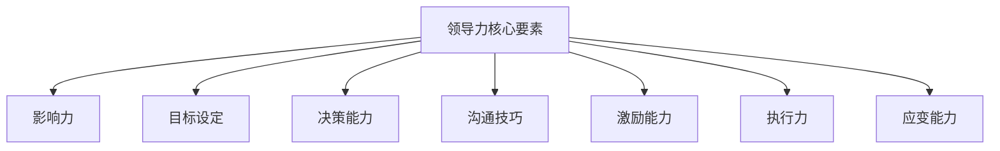

#### 1.2 领导力的发展历程

领导力的发展历程可以追溯到古代的军事领导理论，经过几百年的演变，逐渐形成了现代领导理论体系。以下是领导力发展历程的简要概述：

1. **传统领导理论**：早期领导理论主要关注领导者的个人特质和权力，如“伟大领袖”理论，强调领导者具有超凡的智慧和魅力。
   
2. **行为领导理论**：20世纪初期，领导研究者开始关注领导者的行为，认为领导行为可以通过培训和学习得到改善。

3. **情境领导理论**：随着组织环境的变化，情境领导理论提出领导风格应根据具体情况和环境灵活调整。

4. **变革型领导理论**：20世纪80年代，变革型领导理论强调领导者通过激发团队成员的潜能和积极性，推动组织实现变革。

5. **服务型领导理论**：21世纪初，服务型领导理论提出领导者应该以服务团队成员为核心，建立互信和合作关系。

**Mermaid 图解：**

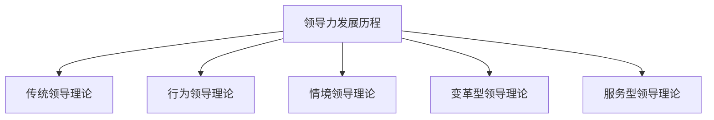

#### 1.3 领导力与创新能力的关系

领导力与创新能力密切相关。一个优秀的领导者不仅能够激发团队成员的创造力，还能为创新提供良好的环境和资源。以下是领导力与创新能力之间的一些关键联系：

1. **营造创新环境**：领导者需要营造一个鼓励创新、容忍失败的文化氛围，让团队成员敢于尝试和探索新的想法。

2. **提供资源支持**：领导者需要为创新项目提供充足的资源支持，包括资金、技术和人力等。

3. **激励和认可**：领导者需要通过激励和认可来激发团队成员的创新热情，例如通过奖励、晋升等方式。

4. **培养创新团队**：领导者需要识别和培养具有创新潜力的团队成员，组建一支高效的创新团队。

5. **引导创新方向**：领导者需要根据组织的战略目标，引导创新团队关注关键领域和前沿技术。

**Mermaid 图解：**

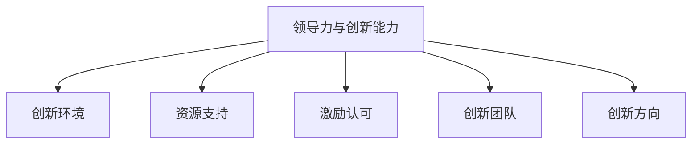

### 第2章：领导力与团队管理

团队管理是领导力的重要组成部分，一个高效的团队可以显著提高组织的整体绩效。在本节中，我们将探讨团队管理的挑战、领导者如何培养团队以及如何应对变革。

#### 2.1 团队管理的挑战

团队管理面临许多挑战，以下是其中几个关键挑战：

1. **成员多样性**：团队成员来自不同的背景和领域，可能会带来沟通障碍和协作困难。
   
2. **沟通障碍**：团队成员之间的沟通不畅可能导致信息传递错误和误解，影响团队效率。

3. **权力斗争**：团队内部可能会出现权力斗争，影响团队的稳定性和协作性。

4. **目标冲突**：团队成员的个人目标和团队目标之间可能存在冲突，导致团队目标无法实现。

5. **信息不对称**：团队成员可能无法获得充分的信息，影响他们的决策和工作效率。

6. **职责不明确**：团队职责不明确可能导致团队成员互相推诿责任，影响团队绩效。

**Mermaid 图解：**

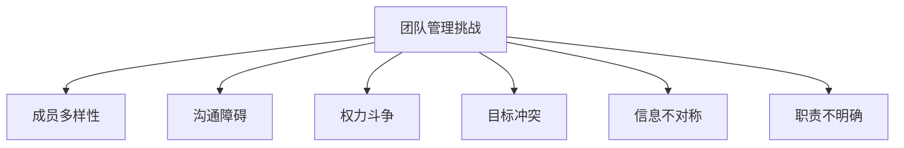

#### 2.2 领导者如何培养团队

领导者需要采取一系列策略来培养团队，以下是几个关键步骤：

1. **建立团队文化**：领导者需要建立积极的团队文化，鼓励团队成员相互支持、协作和共同成长。

2. **激励团队成员**：领导者需要通过奖励、晋升等方式激励团队成员，提高他们的工作热情和积极性。

3. **提供成长机会**：领导者需要为团队成员提供培训、学习和成长的机会，帮助他们提升技能和知识。

4. **建立信任**：领导者需要建立团队成员之间的信任，促进有效的沟通和协作。

5. **鼓励创新**：领导者需要鼓励团队成员提出新的想法和解决方案，推动团队创新。

6. **设定明确目标**：领导者需要为团队设定明确的目标，确保团队成员了解他们的工作方向和期望成果。

7. **认可成就**：领导者需要及时认可团队成员的成就和贡献，增强他们的归属感和团队意识。

**Mermaid 图解：**

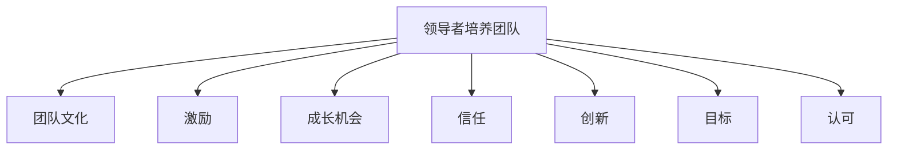

#### 2.3 领导者如何应对变革

变革是组织发展的必然过程，但变革往往伴随着挑战和阻力。以下是领导者应对变革的几个关键步骤：

1. **预见变革**：领导者需要敏锐地预见外部环境的变化，提前制定应对策略。

2. **制定变革计划**：领导者需要制定详细的变革计划，包括变革目标、时间表和实施步骤。

3. **沟通变革意图**：领导者需要与团队成员充分沟通变革的意图和重要性，消除他们的疑虑和担忧。

4. **激发员工参与**：领导者需要鼓励团队成员参与变革过程，提供反馈和建议，增加他们的参与感和责任感。

5. **提供支持与资源**：领导者需要为变革提供必要的支持和资源，确保变革能够顺利进行。

6. **管理变革过程**：领导者需要监控变革过程，及时调整计划，确保变革目标得到实现。

7. **应对阻力**：领导者需要识别并应对变革过程中的阻力，通过沟通、激励和辅导等方式帮助团队成员克服困难。

**Mermaid 图解：**

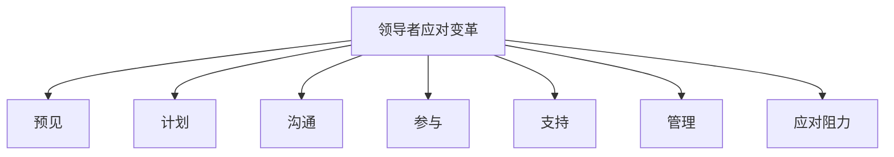

### 第3章：创意思维的概念与分类

创意思维是创新过程中不可或缺的一部分，它能够帮助团队突破传统思维模式，找到新的解决方案。在本节中，我们将探讨创意思维的概念、基本分类以及创新性评估方法。

#### 3.1 创意思维的概念

创意思维（Creative Thinking）是指运用创新的思维方式和技巧，产生新颖且有价值的想法和解决方案的过程。创意思维不仅仅是天马行空的想象，它需要基于现有的知识和信息，通过逻辑和推理，形成独特的见解和创意。

**Mermaid 图解：**

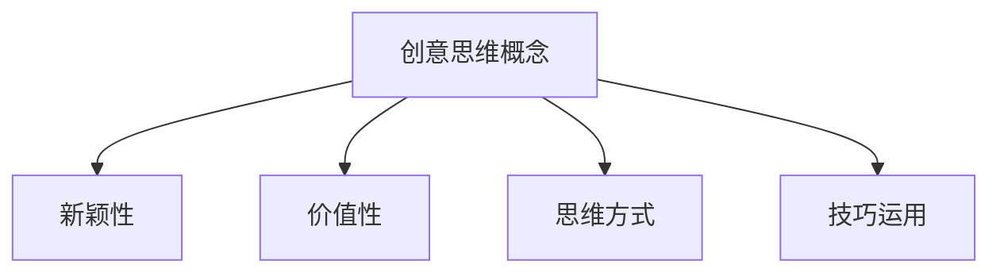

#### 3.2 创意思维的基本分类

创意思维可以分为多种类型，每种类型都有其独特的特点和适用场景。以下是几种常见的创意思维分类：

1. **直觉思维**：直觉思维是基于直觉和直接感受进行思考和决策。它往往不需要经过逻辑推理，而是依赖于内心的感受和洞察力。

2. **模仿思维**：模仿思维是通过模仿现有的成功案例或解决方案，来创造新的想法。这种方法能够快速获得灵感，但创新性可能相对较低。

3. **联想思维**：联想思维是通过将不同的事物或概念相互联系，产生新的创意。这种方法能够打破传统思维框架，找到独特的解决方案。

**Mermaid 图解：**

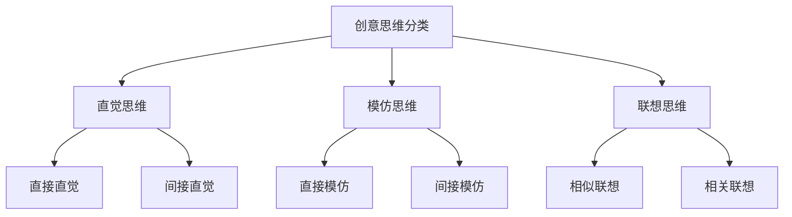

#### 3.3 创意思维的创新性评估

评估创意思维的创新性是确保创意具有实际应用价值的关键步骤。以下是一些常用的创新性评估方法：

1. **新颖性评估**：评估创意相对于现有解决方案的新颖程度。新颖性越高，创新性越强。

2. **实用性评估**：评估创意在实际应用中的可行性和效果。一个有实用性的创意能够真正解决实际问题。

3. **可行性评估**：评估创意在技术、资源、市场等方面的可行性。可行性越高，创意越有可能成功。

**Mermaid 图解：**

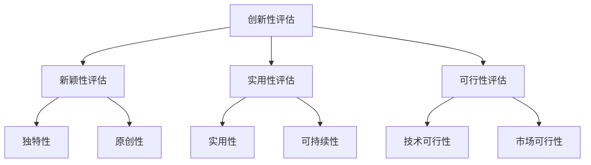

### 第4章：创意思维的激发方法

激发创意思维是创新过程中至关重要的一环。领导者需要采取多种策略和方法来激发团队成员的创造力，促进创新。在本节中，我们将探讨激发创意思维的触发因素、策略以及应用场景。

#### 4.1 创意思维的触发因素

创意思维的产生往往受到多种因素的影响，以下是几个关键触发因素：

1. **情感因素**：情感因素如好奇心、兴奋、焦虑等能够激发人的创造力。情感上的投入能够使人更加专注和投入，从而产生创新思维。

2. **知识因素**：知识积累是创意思维的基础。广泛的知识储备能够为创意提供丰富的素材和灵感。

3. **社会因素**：社会环境、文化背景、社会需求等都会对创意思维产生影响。社会因素可以提供新的视角和思考角度，激发创意。

**Mermaid 图解：**

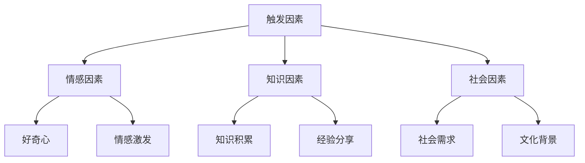

#### 4.2 创意思维的激发策略

为了激发创意思维，领导者可以采取多种策略和方法。以下是几种有效的激发策略：

1. **模拟练习**：通过模拟实际场景或问题，让团队成员在模拟环境中进行思考和讨论，从而激发创意。

2. **思维导图**：使用思维导图工具，将创意思维可视化，有助于团队成员梳理思路，发现新的关联和灵感。

3. **角色扮演**：通过角色扮演，让团队成员从不同的角度思考问题，激发创意。

**Mermaid 图解：**

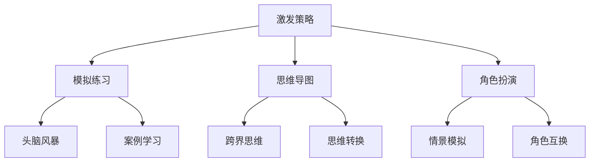

#### 4.3 创意思维的应用场景

创意思维在各个领域都有广泛的应用，以下是几个常见的应用场景：

1. **项目开发**：在项目开发过程中，创意思维可以帮助团队找到新的解决方案，优化项目设计和流程。

2. **产品创新**：在产品创新过程中，创意思维可以帮助团队发现新的产品功能、设计和技术，提高产品的竞争力。

3. **市场营销**：在市场营销活动中，创意思维可以帮助团队设计创新的营销策略和创意广告，提高市场影响力。

**Mermaid 图解：**

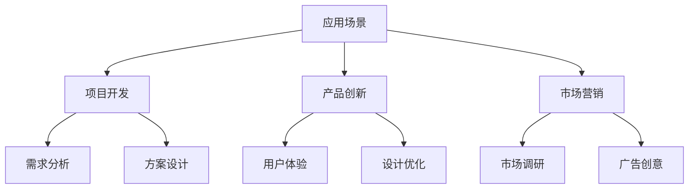

### 第5章：创意思维在实际工作中的应用

创意思维不仅是理论上的概念，它在实际工作中也有着广泛的应用。在实际工作中，创意思维可以帮助团队解决复杂问题，提高工作效率，推动组织发展。在本节中，我们将探讨创意思维在项目管理、产品设计和企业管理中的应用。

#### 5.1 创意思维在项目管理中的应用

在项目管理中，创意思维可以帮助团队更好地应对复杂问题，提高项目成功率。以下是创意思维在项目管理中的一些应用：

1. **需求分析**：通过创意思维，团队可以找到新的需求分析方法，深入了解用户需求，确保项目满足用户期望。

2. **方案设计**：创意思维可以帮助团队在方案设计阶段提出创新的解决方案，优化项目设计和流程。

3. **风险管理**：创意思维可以帮助团队识别潜在的风险，并设计应对策略，降低项目风险。

4. **项目评估**：创意思维可以帮助团队在项目评估阶段提出新的评估指标和方法，更全面地评估项目成果。

**Mermaid 图解：**

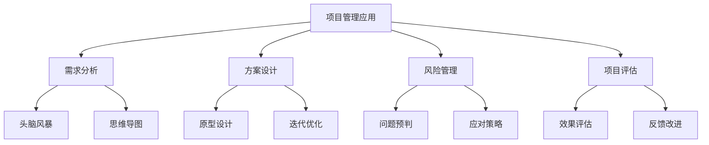

#### 5.2 创意思维在产品设计中的应用

在产品设计过程中，创意思维可以帮助团队提出创新的设计方案，提高产品的竞争力。以下是创意思维在产品设计中的几个应用：

1. **用户研究**：通过创意思维，团队可以找到新的用户研究方法，深入了解用户需求和偏好，为产品设计提供依据。

2. **需求分析**：创意思维可以帮助团队从多个角度分析用户需求，提出创新的需求解决方案。

3. **用户体验**：创意思维可以帮助团队设计更人性化的用户体验，提高用户满意度。

4. **设计优化**：创意思维可以帮助团队不断优化产品设计，提高产品的可用性和市场竞争力。

**Mermaid 图解：**

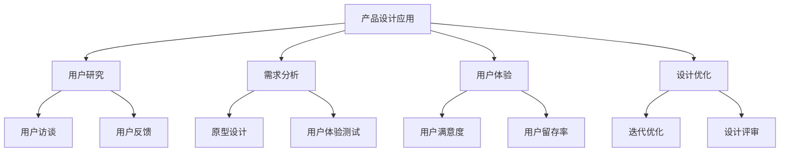

#### 5.3 创意思维在企业管理中的应用

在企业管理中，创意思维可以帮助领导者提高管理效率，推动组织创新。以下是创意思维在企业管理中的几个应用：

1. **战略规划**：创意思维可以帮助团队提出创新的战略规划方案，确保企业能够在竞争激烈的市场中立足。

2. **组织架构**：创意思维可以帮助团队设计更灵活、高效的组织架构，提高组织协同效率。

3. **人力资源管理**：创意思维可以帮助团队设计创新的激励机制和人才培养方案，提高员工满意度和工作效率。

4. **企业文化**：创意思维可以帮助团队塑造积极、创新的企业文化，增强员工归属感和凝聚力。

**Mermaid 图解：**

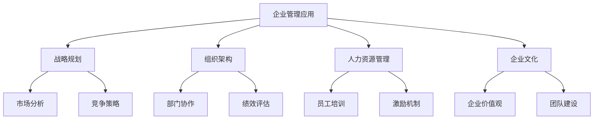

### 第6章：创新方法的概述

创新是推动企业发展的核心动力，它不仅能够提升企业的竞争力，还能够创造新的商业机会。在本节中，我们将详细探讨创新方法的概述，包括创新的定义、类型和创新的价值观。

#### 6.1 创新的定义

创新（Innovation）是指通过引入新的想法、方法、技术或产品，改进或变革现有业务模式，从而实现商业或社会价值的提升。创新不仅仅是开发新产品或技术，它还包括改进现有产品、优化业务流程、创造新的商业模式等。

**Mermaid 图解：**

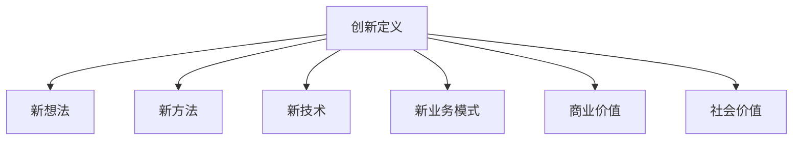

#### 6.2 创新的类型

创新可以分为多种类型，每种类型都有其独特的特点和实施方式。以下是几种常见的创新类型：

1. **产品创新**：产品创新是指开发新的产品或改进现有产品，以满足市场需求和提高用户体验。

2. **过程创新**：过程创新是指改进业务流程或生产过程，以提高效率、降低成本或提高质量。

3. **系统创新**：系统创新是指对整个业务系统进行变革，包括组织结构、业务流程、战略和文化等方面。

**Mermaid 图解：**

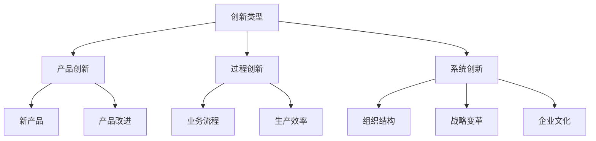

#### 6.3 创新的价值

创新的价值体现在多个方面，对于企业和社会都有着深远的影响。以下是创新的几个关键价值：

1. **提升竞争力**：创新能够帮助企业开发新产品、优化业务流程，从而提高市场竞争力。

2. **创造新机会**：创新能够开拓新的市场领域，创造新的商业模式和机会。

3. **增加价值**：创新能够提升产品和服务质量，满足客户需求，从而增加企业的价值。

4. **推动社会进步**：创新不仅对企业有益，还能够推动技术进步和社会发展。

**Mermaid 图解：**

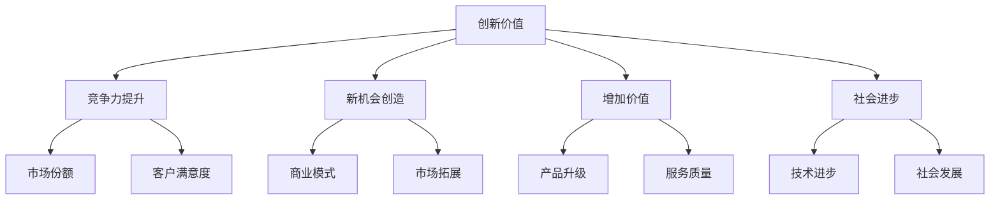

### 第7章：创新方法的实施步骤

创新不仅仅是一个想法，它需要系统的实施步骤和有效的管理。在本节中，我们将探讨创新方法的实施步骤，包括创新项目的启动、创新过程中的问题与解决以及创新成果的转化与推广。

#### 7.1 创新项目的启动

创新项目的启动是创新过程的第一步，它关系到项目的方向和目标。以下是创新项目启动的几个关键步骤：

1. **创新项目评估**：在启动创新项目之前，需要对项目的可行性进行评估。这包括市场需求、技术可行性、资源需求等方面的分析。

2. **创新项目规划**：根据项目评估的结果，制定详细的项目计划，包括项目目标、范围、时间表和资源分配等。

3. **创新团队组建**：组建一支具有专业技能和丰富经验的创新团队，明确团队成员的职责和协作方式。

**Mermaid 图解：**

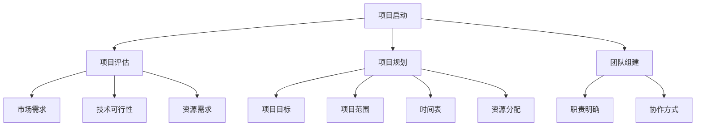

#### 7.2 创新过程中的问题与解决

在创新过程中，可能会遇到各种问题和挑战。以下是几个常见的问题及其解决策略：

1. **风险识别与评估**：在项目启动后，需要识别和评估可能的风险，包括技术风险、市场风险、资源风险等。

2. **挑战与应对**：面对创新过程中的挑战，需要制定有效的应对策略，确保项目能够按计划推进。

3. **资源配置**：合理配置项目资源，包括人力、财力和物力，是确保项目顺利进行的关键。

**Mermaid 图解：**

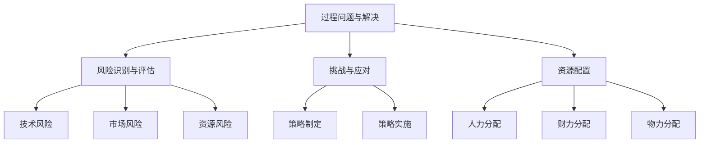

#### 7.3 创新成果的转化与推广

创新成果的转化与推广是创新过程的最后一步，它关系到创新的价值实现。以下是创新成果转化与推广的几个关键步骤：

1. **成果转化**：将创新成果转化为可执行的产品或服务，满足市场需求。

2. **成果推广**：通过有效的市场营销和宣传手段，将创新成果推向市场，提高企业的品牌知名度。

3. **反馈优化**：收集用户反馈，不断优化创新成果，确保其能够持续满足市场需求。

**Mermaid 图解：**

```mermaid
graph TD
    A[成果转化与推广]
    A --> B[成果转化]
    A --> C[成果推广]
    A --> D[反馈优化]
    B --> E[产品化]
    B --> F[服务化]
    C --> G[市场营销]
    C --> H[品牌建设]
    D --> I[用户反馈]
    D --> J[持续优化]
```

### 第8章：创新案例分析

通过分析成功和失败的创新案例，我们可以更好地理解创新过程和领导力在其中的作用。在本节中，我们将探讨几个典型的创新案例，并从中总结出有益的启示。

#### 8.1 成功创新案例

**案例一：苹果公司的创新历程**

苹果公司作为全球最具创新力的企业之一，其成功离不开持续的创新精神和卓越的领导力。以下是苹果公司的一些成功创新案例：

- **iPhone**：2007年，苹果公司推出iPhone，彻底改变了智能手机市场。iPhone的创新点包括触摸屏、多点触控、App Store等，这些创新不仅改变了人们的使用习惯，还推动了整个智能手机行业的发展。

- **iPad**：2010年，苹果公司推出iPad，开创了平板电脑市场。iPad的设计简洁、易用，配合iOS系统，迅速赢得了用户的喜爱。

- **MacBook Air**：2010年，苹果公司推出MacBook Air，这是一款超薄的笔记本电脑，具有出色的性能和续航能力。MacBook Air的推出，不仅改变了人们对笔记本电脑的期待，也推动了轻薄笔记本电脑的发展。

**启示**：

1. **持续创新**：苹果公司持续推出具有革命性的产品，说明持续创新是企业保持竞争力的关键。

2. **用户体验**：苹果公司始终关注用户体验，从产品设计到用户服务，都致力于提供最佳体验。

3. **领导力**：乔布斯的领导力对苹果的创新成功起到了关键作用。他不仅拥有卓越的创新能力，还能够激发团队的创新潜力。

**Mermaid 图解：**

```mermaid
graph TD
    A[苹果公司创新案例]
    A --> B[iPhone]
    A --> C[iPad]
    A --> D[MacBook Air]
    B --> E[触摸屏]
    B --> F[多点触控]
    B --> G[App Store]
    C --> H[平板电脑市场]
    C --> I[设计简洁]
    C --> J[iOS系统]
    D --> K[轻薄]
    D --> L[续航能力]
    D --> M[性能]
```

**案例二：特斯拉的电动汽车革命**

特斯拉（Tesla）公司通过创新的技术和商业模式，颠覆了传统汽车行业，成为电动汽车的领导者。以下是特斯拉的一些成功创新案例：

- **Model S**：特斯拉推出的Model S是一款高性能电动轿车，它具有出色的续航能力和卓越的驾驶体验。

- **Model 3**：Model 3是特斯拉推出的平价电动轿车，它以亲民的价格和优秀的性能，迅速赢得了市场的青睐。

- **电池回收系统**：特斯拉开发的电池回收系统，能够回收和再利用电动汽车的电池，降低了生产成本，同时也减少了环境污染。

**启示**：

1. **技术创新**：特斯拉通过自主研发和创新，在电动汽车技术上取得了突破性进展，这表明技术创新是推动行业变革的关键。

2. **商业模式**：特斯拉通过直销模式和能源生态系统，创造了独特的商业模式，这不仅提高了盈利能力，也增强了用户粘性。

3. **领导力**：埃隆·马斯克的领导力对特斯拉的成功起到了至关重要的作用。他不仅具备远见和决心，还能够激发团队的创新精神。

**Mermaid 图解：**

```mermaid
graph TD
    A[特斯拉创新案例]
    A --> B[Model S]
    A --> C[Model 3]
    A --> D[电池回收系统]
    B --> E[高性能]
    B --> F[续航能力]
    B --> G[驾驶体验]
    C --> H[平价]
    C --> I[性能]
    C --> J[市场认可]
    D --> K[电池回收]
    D --> L[环境友好]
    D --> M[成本降低]
```

#### 8.2 失败创新案例

**案例一：诺基亚的衰落**

诺基亚曾是手机市场的领导者，但在面对智能手机时代的变革时，未能及时进行创新，最终导致了市场份额的丧失和企业的衰落。以下是诺基亚的一些失败创新案例：

- **缺乏创新**：诺基亚在智能手机领域未能推出具有竞争力的产品，错失了市场机会。

- **过度依赖**：诺基亚过度依赖Symbian操作系统，未能及时转向其他操作系统，如Android或iOS。

- **战略失误**：诺基亚在管理层和战略决策上出现了失误，未能有效应对市场变化。

**启示**：

1. **及时创新**：在快速变化的市场环境中，企业必须及时进行创新，否则将面临被淘汰的风险。

2. **多元化战略**：企业应该采用多元化战略，避免过度依赖单一产品或技术。

3. **战略决策**：企业的战略决策必须基于市场分析和未来趋势，避免盲目跟风或固步自封。

**Mermaid 图解：**

```mermaid
graph TD
    A[诺基亚失败案例]
    A --> B[缺乏创新]
    A --> C[过度依赖]
    A --> D[战略失误]
    B --> E[智能手机市场]
    B --> F[操作系统]
    C --> G[Symbian]
    C --> H[Android]
    C --> I[iOS]
    D --> J[市场分析]
    D --> K[未来趋势]
    D --> L[盲目跟风]
```

**案例二：索尼公司的困境**

索尼公司在电子娱乐领域曾是一家巨头，但在面对技术创新和市场竞争时，未能进行有效的创新和调整，导致市场份额的下滑和业绩的恶化。以下是索尼公司的一些失败创新案例：

- **创新滞后**：索尼在智能手机和数码相机等领域的创新滞后，未能及时推出具有竞争力的产品。

- **产品同质化**：索尼的产品在设计和功能上缺乏差异化，难以吸引消费者。

- **市场定位**：索尼在市场定位上出现失误，未能抓住消费者的需求变化。

**启示**：

1. **持续创新**：企业必须保持持续的创新，否则将难以在竞争激烈的市场中立足。

2. **差异化战略**：企业应该通过差异化战略，打造独特的产品或服务，提高市场竞争力。

3. **市场洞察**：企业需要具备敏锐的市场洞察力，及时调整战略以适应市场变化。

**Mermaid 图解：**

```mermaid
graph TD
    A[索尼公司困境]
    A --> B[创新滞后]
    A --> C[产品同质化]
    A --> D[市场定位]
    B --> E[智能手机]
    B --> F[数码相机]
    C --> G[设计]
    C --> H[功能]
    D --> I[消费者需求]
    D --> J[市场趋势]
    D --> K[竞争策略]
```

#### 8.3 创新案例的启示

通过分析成功和失败的创新案例，我们可以得出以下启示：

1. **创新是关键**：成功的企业如苹果公司和特斯拉，都是通过持续创新来保持市场领先地位的。

2. **领导力至关重要**：领导者的远见、决断力和创新能力对于企业的成功至关重要。

3. **市场适应能力**：企业必须具备良好的市场适应能力，及时调整战略以应对市场变化。

4. **用户需求导向**：了解和满足用户需求是创新成功的关键。

5. **多元化战略**：采用多元化战略，避免过度依赖单一产品或技术。

6. **持续改进**：持续改进和创新，以应对不断变化的市场和技术环境。

**Mermaid 图解：**

```mermaid
graph TD
    A[创新案例启示]
    A --> B[创新关键]
    A --> C[领导力]
    A --> D[市场适应]
    A --> E[用户需求]
    A --> F[多元化]
    A --> G[持续改进]
    B --> H[持续创新]
    C --> I[远见]
    C --> J[决断力]
    D --> K[战略调整]
    E --> L[市场洞察]
    F --> M[差异化]
    G --> N[技术进步]
```

### 第9章：领导力与创新实践的重要性

领导力与创新实践在企业和社会发展中扮演着至关重要的角色。一个具备创新能力和领导力的领导者，不仅能够推动企业的持续发展，还能够推动社会进步。在本节中，我们将探讨领导力与创新实践的关系、创新实践的重要性以及创新实践的挑战与机遇。

#### 9.1 领导力与创新实践的关系

领导力与创新实践密切相关，一个成功的创新实践离不开有效的领导力。以下是领导力与创新实践之间的几个关键联系：

1. **领导者的影响力**：领导者具备影响力，能够激发团队成员的创新潜力，推动团队实现创新目标。

2. **领导力的目标导向**：领导者能够设定明确的目标，并确保团队成员理解并致力于实现这些目标，从而为创新实践提供方向。

3. **领导者的沟通技巧**：有效的沟通技巧有助于领导者将创新理念传递给团队成员，并建立团队成员之间的信任和协作。

4. **领导者的激励能力**：领导者需要具备激励团队成员的能力，通过认可、奖励等方式激发创新热情。

5. **领导者的应变能力**：在创新过程中，领导者需要具备灵活性和适应性，能够迅速应对变化和挑战。

**Mermaid 图解：**

```mermaid
graph TD
    A[领导力与创新实践]
    A --> B[影响力]
    A --> C[目标导向]
    A --> D[沟通技巧]
    A --> E[激励能力]
    A --> F[应变能力]
    B --> G[创新潜力]
    B --> H[目标实现]
    C --> I[理解]
    C --> J[协作]
    D --> K[信任]
    D --> L[协作]
    E --> M[热情]
    E --> N[动力]
    F --> O[适应]
    F --> P[应对]
```

#### 9.2 创新实践的重要性

创新实践对企业和社会都具有重要的价值。以下是创新实践的重要性和影响：

1. **提升竞争力**：创新实践能够帮助企业开发新产品、优化业务流程，提高市场竞争力。

2. **创造新机会**：创新实践能够开拓新的市场领域，创造新的商业模式和机会。

3. **增加价值**：创新实践能够提升产品和服务质量，满足客户需求，从而增加企业的价值。

4. **推动社会进步**：创新实践不仅对企业有益，还能够推动技术进步和社会发展。

**Mermaid 图解：**

```mermaid
graph TD
    A[创新实践重要性]
    A --> B[竞争力提升]
    A --> C[新机会创造]
    A --> D[增加价值]
    A --> E[社会进步]
    B --> F[市场份额]
    B --> G[客户满意度]
    C --> H[商业模式]
    C --> I[市场拓展]
    D --> J[产品升级]
    D --> K[服务质量]
    E --> L[技术进步]
    E --> M[社会发展]
```

#### 9.3 创新实践的挑战与机遇

创新实践虽然具有重要意义，但同时也面临诸多挑战和机遇。以下是创新实践中常见的挑战和应对策略：

1. **技术挑战**：技术创新是企业面临的主要挑战之一。企业需要投入大量资源进行技术研发，同时需要应对技术不确定性。

2. **市场挑战**：市场需求变化迅速，企业需要不断调整产品和服务，以适应市场变化。

3. **资源挑战**：创新实践需要充足的资源支持，包括资金、人力和物力。企业需要合理配置资源，确保创新项目的顺利进行。

4. **管理挑战**：创新实践需要高效的管理，包括项目规划、风险管理和团队协作等。企业需要建立有效的创新管理体系，确保创新实践的成功。

**Mermaid 图解：**

```mermaid
graph TD
    A[创新实践挑战与机遇]
    A --> B[技术挑战]
    A --> C[市场挑战]
    A --> D[资源挑战]
    A --> E[管理挑战]
    B --> F[技术研发]
    B --> G[技术不确定性]
    C --> H[市场变化]
    C --> I[产品调整]
    D --> J[资源支持]
    D --> K[资源配置]
    E --> L[项目规划]
    E --> M[风险管理]
    E --> N[团队协作]
```

### 第10章：领导力与创新实践的策略

为了有效地推动创新实践，领导者需要采取一系列策略和方法。在本节中，我们将探讨创新文化的建设、创新团队的领导以及创新项目的领导策略。

#### 10.1 创新文化的建设

创新文化是推动企业创新实践的基础，它包括对创新的重视、鼓励失败和容忍错误、鼓励学习和分享等价值观。以下是建设创新文化的几个关键策略：

1. **鼓励创新思维**：领导者需要鼓励员工大胆提出新的想法和解决方案，鼓励他们进行实验和尝试。

2. **建立反馈机制**：建立有效的反馈机制，让员工能够及时了解到他们的创新想法和建议的反馈，从而不断改进和创新。

3. **提供资源支持**：为创新项目提供充足的资源支持，包括资金、技术和人力等，确保创新实践能够顺利进行。

4. **建立激励机制**：建立激励机制，通过奖励、晋升等方式激励员工进行创新，提高他们的工作热情和积极性。

**Mermaid 图解：**

```mermaid
graph TD
    A[创新文化建设]
    A --> B[鼓励创新思维]
    A --> C[建立反馈机制]
    A --> D[提供资源支持]
    A --> E[建立激励机制]
    B --> F[大胆想法]
    B --> G[实验尝试]
    C --> H[及时反馈]
    C --> I[不断改进]
    D --> J[资金支持]
    D --> K[技术支持]
    D --> L[人力支持]
    E --> M[奖励]
    E --> N[晋升]
```

#### 10.2 创新团队的领导

创新团队是推动企业创新实践的核心力量，领导者需要具备有效的领导能力，激发团队的创造力和协作精神。以下是创新团队领导的几个关键策略：

1. **选拔团队成员**：领导者需要选拔具备专业技能、创新思维和协作精神的人才，组建一支高效的创新团队。

2. **设定明确目标**：为创新团队设定明确的目标，确保团队成员了解他们的工作方向和期望成果。

3. **提供成长机会**：为团队成员提供培训、学习和成长的机会，帮助他们提升技能和知识。

4. **建立信任**：建立团队成员之间的信任，促进有效的沟通和协作。

5. **鼓励合作**：鼓励团队成员之间进行合作，共同解决问题，推动创新实践。

**Mermaid 图解：**

```mermaid
graph TD
    A[创新团队领导]
    A --> B[选拔人才]
    A --> C[设定目标]
    A --> D[提供成长机会]
    A --> E[建立信任]
    A --> F[鼓励合作]
    B --> G[专业技能]
    B --> H[创新思维]
    B --> I[协作精神]
    C --> J[明确方向]
    C --> K[期望成果]
    D --> L[培训]
    D --> M[学习]
    E --> N[信任]
    E --> O[沟通]
    F --> P[协作]
    F --> Q[解决问题]
```

#### 10.3 创新项目的领导

创新项目是实现企业创新目标的关键步骤，领导者需要具备有效的项目领导能力，确保项目顺利进行并取得成功。以下是创新项目领导的几个关键策略：

1. **项目计划**：制定详细的项目计划，包括项目目标、范围、时间表和资源分配等，确保项目有条不紊地推进。

2. **项目监控**：监控项目进展，及时调整项目计划，确保项目能够按计划完成。

3. **风险管理**：识别和评估项目风险，制定应对策略，降低项目风险。

4. **团队协作**：促进团队成员之间的协作，确保项目团队能够高效地工作。

5. **成果转化**：确保创新项目成果能够得到有效的转化和应用，实现商业价值。

**Mermaid 图解：**

```mermaid
graph TD
    A[创新项目领导]
    A --> B[项目计划]
    A --> C[项目监控]
    A --> D[风险管理]
    A --> E[团队协作]
    A --> F[成果转化]
    B --> G[项目目标]
    B --> H[项目范围]
    B --> I[时间表]
    B --> J[资源分配]
    C --> K[项目进展]
    C --> L[计划调整]
    D --> M[风险识别]
    D --> N[风险评估]
    D --> O[应对策略]
    E --> P[协作]
    E --> Q[高效工作]
    F --> R[成果转化]
    F --> S[商业价值]
```

### 第11章：领导力与创新实践的案例分析

通过分析领导力与创新实践的成功和失败案例，我们可以更好地理解如何有效地推动创新，以及如何避免创新过程中的常见问题。在本节中，我们将探讨几个典型的案例，并从中总结出有益的启示。

#### 11.1 成功领导力与创新实践案例

**案例一：谷歌的创新文化**

谷歌（Google）以其创新文化和高效的项目管理而闻名。以下是谷歌成功创新的一些关键因素：

- **鼓励创新**：谷歌鼓励员工提出新的想法，并为员工提供时间和资源进行创新实验。谷歌的“20%时间”政策允许员工用20%的工作时间自由探索自己的项目，这激发了员工的创新热情。

- **支持跨部门合作**：谷歌鼓励不同部门之间的合作，通过跨部门的团队项目，促进了创新和知识共享。

- **注重用户体验**：谷歌始终关注用户体验，从产品的设计到功能，都致力于提供最佳的用户体验。

- **快速迭代**：谷歌采用快速迭代的方法，不断测试和优化产品，确保产品能够快速响应市场变化。

**启示**：

1. **鼓励创新**：领导者需要鼓励员工提出创新想法，并提供必要的支持。

2. **跨部门合作**：跨部门合作能够促进创新和知识共享。

3. **注重用户体验**：领导者需要关注用户体验，确保产品满足用户需求。

4. **快速迭代**：快速迭代能够帮助团队迅速响应市场变化，提高产品的竞争力。

**Mermaid 图解：**

```mermaid
graph TD
    A[谷歌创新文化]
    A --> B[鼓励创新]
    A --> C[跨部门合作]
    A --> D[用户体验]
    A --> E[快速迭代]
    B --> F[20%时间政策]
    B --> G[支持实验]
    C --> H[知识共享]
    C --> I[跨部门团队]
    D --> J[最佳体验]
    D --> K[用户需求]
    E --> L[快速测试]
    E --> M[优化产品]
```

**案例二：3M公司的创新之路**

3M公司以其持续的创新精神和成功的商业模式而著称。以下是3M公司成功创新的一些关键因素：

- **鼓励失败**：3M公司鼓励员工大胆尝试，即使失败也不受惩罚。这种鼓励失败的文化激发了员工的创新潜力。

- **持续投资**：3M公司持续投资于研发，确保有足够的资源支持创新项目。

- **灵活的工作环境**：3M公司提供灵活的工作环境，鼓励员工自由探索和实验。

- **激励机制**：3M公司建立激励机制，通过奖励、晋升等方式激励员工的创新行为。

**启示**：

1. **鼓励失败**：领导者需要鼓励员工大胆尝试，即使失败也不受惩罚。

2. **持续投资**：领导者需要持续投资于研发，确保有足够的资源支持创新项目。

3. **灵活的工作环境**：领导者需要提供灵活的工作环境，鼓励员工自由探索和实验。

4. **激励机制**：领导者需要建立激励机制，通过奖励、晋升等方式激励员工的创新行为。

**Mermaid 图解：**

```mermaid
graph TD
    A[3M公司创新之路]
    A --> B[鼓励失败]
    A --> C[持续投资]
    A --> D[灵活工作环境]
    A --> E[激励机制]
    B --> F[大胆尝试]
    B --> G[失败容忍]
    C --> H[研发投入]
    C --> I[资源支持]
    D --> J[自由探索]
    D --> K[实验环境]
    E --> L[奖励]
    E --> M[晋升]
```

#### 11.2 失败领导力与创新实践案例

**案例一：诺基亚的衰落**

诺基亚曾是手机市场的领导者，但在面对智能手机时代的变革时，未能进行有效的创新和调整，导致市场份额的丧失和企业的衰落。以下是诺基亚失败的一些关键因素：

- **创新滞后**：诺基亚在智能手机领域未能推出具有竞争力的产品，错失了市场机会。

- **过度依赖**：诺基亚过度依赖Symbian操作系统，未能及时转向其他操作系统，如Android或iOS。

- **战略失误**：诺基亚在管理层和战略决策上出现了失误，未能有效应对市场变化。

**启示**：

1. **及时创新**：在快速变化的市场环境中，企业必须及时进行创新，否则将面临被淘汰的风险。

2. **多元化战略**：企业应该采用多元化战略，避免过度依赖单一产品或技术。

3. **战略决策**：企业的战略决策必须基于市场分析和未来趋势，避免盲目跟风或固步自封。

**Mermaid 图解：**

```mermaid
graph TD
    A[诺基亚衰落案例]
    A --> B[创新滞后]
    A --> C[过度依赖]
    A --> D[战略失误]
    B --> E[智能手机市场]
    B --> F[操作系统]
    C --> G[Symbian]
    C --> H[Android]
    C --> I[iOS]
    D --> J[市场分析]
    D --> K[未来趋势]
    D --> L[盲目跟风]
```

**案例二：索尼公司的困境**

索尼公司在电子娱乐领域曾是一家巨头，但在面对技术创新和市场竞争时，未能进行有效的创新和调整，导致市场份额的下滑和业绩的恶化。以下是索尼公司失败的一些关键因素：

- **创新滞后**：索尼在智能手机和数码相机等领域的创新滞后，未能及时推出具有竞争力的产品。

- **产品同质化**：索尼的产品在设计和功能上缺乏差异化，难以吸引消费者。

- **市场定位**：索尼在市场定位上出现失误，未能抓住消费者的需求变化。

**启示**：

1. **持续创新**：企业必须保持持续的创新，否则将难以在竞争激烈的市场中立足。

2. **差异化战略**：企业应该通过差异化战略，打造独特的产品或服务，提高市场竞争力。

3. **市场洞察**：企业需要具备敏锐的市场洞察力，及时调整战略以适应市场变化。

**Mermaid 图解：**

```mermaid
graph TD
    A[索尼公司困境]
    A --> B[创新滞后]
    A --> C[产品同质化]
    A --> D[市场定位]
    B --> E[智能手机]
    B --> F[数码相机]
    C --> G[设计]
    C --> H[功能]
    D --> I[消费者需求]
    D --> J[市场趋势]
    D --> K[竞争策略]
```

#### 11.3 案例的启示与思考

通过分析成功和失败的创新案例，我们可以得出以下启示和思考：

1. **创新是关键**：成功的企业如谷歌和3M公司，都是通过持续创新来保持市场领先地位的。

2. **领导力至关重要**：领导者的远见、决断力和创新能力对于企业的成功至关重要。

3. **市场适应能力**：企业必须具备良好的市场适应能力，及时调整战略以应对市场变化。

4. **用户需求导向**：了解和满足用户需求是创新成功的关键。

5. **多元化战略**：采用多元化战略，避免过度依赖单一产品或技术。

6. **持续改进**：持续改进和创新，以应对不断变化的市场和技术环境。

**Mermaid 图解：**

```mermaid
graph TD
    A[案例启示与思考]
    A --> B[创新关键]
    A --> C[领导力]
    A --> D[市场适应]
    A --> E[用户需求]
    A --> F[多元化]
    A --> G[持续改进]
    B --> H[持续创新]
    C --> I[远见]
    C --> J[决断力]
    D --> K[战略调整]
    E --> L[市场洞察]
    F --> M[差异化]
    G --> N[技术进步]
```

### 第12章：领导力与创新的发展趋势

随着技术的快速发展和市场环境的不断变化，领导力与创新也在不断演进。在本节中，我们将探讨领导力与创新的发展趋势，包括创新驱动的发展战略、领导力的变革以及未来领导力与创新的发展方向。

#### 12.1 创新驱动的发展战略

创新驱动已成为现代经济发展的重要战略。各国政府和企业在推动经济增长、提升国际竞争力方面，越来越重视创新的作用。以下是创新驱动发展战略的几个关键趋势：

1. **政策支持**：政府通过制定创新政策、提供资金支持和税收优惠等手段，鼓励企业进行创新。

2. **科技投入**：企业加大对技术研发的投入，推动技术创新，以提升产品和服务的竞争力。

3. **人才培养**：企业注重人才培养，通过引进高层次人才、加强员工培训等方式，提升企业的创新能力。

4. **国际化合作**：加强国际间的创新合作，通过技术交流和合作项目，促进全球创新资源的共享。

**Mermaid 图解：**

```mermaid
graph TD
    A[创新驱动发展战略]
    A --> B[政策支持]
    A --> C[科技投入]
    A --> D[人才培养]
    A --> E[国际化合作]
    B --> F[创新政策]
    B --> G[资金支持]
    B --> H[税收优惠]
    C --> I[技术研发]
    C --> J[竞争力提升]
    D --> K[引进人才]
    D --> L[员工培训]
    E --> M[技术交流]
    E --> N[合作项目]
```

#### 12.2 领导力的变革

领导力在应对快速变化和创新驱动的环境中也在不断变革。以下是领导力变革的几个关键趋势：

1. **从权威型向赋能型转变**：传统的权威型领导逐渐向赋能型领导转变，领导者更加注重员工的自主性和创新性。

2. **从个体领导向团队领导转变**：领导者不再仅关注个人的领导能力，更加注重团队的协作和整体效能。

3. **从管理型向引领型转变**：领导者从单纯的管理者转变为引领者，更加关注企业的长远发展和战略目标。

4. **从经验型向知识型转变**：领导者从依赖个人经验转变为依赖知识和数据，更加注重科学决策和战略规划。

**Mermaid 图解：**

```mermaid
graph TD
    A[领导力变革]
    A --> B[权威型向赋能型]
    A --> C[个体领导向团队领导]
    A --> D[管理型向引领型]
    A --> E[经验型向知识型]
    B --> F[员工自主]
    B --> G[创新性]
    C --> H[团队协作]
    C --> I[整体效能]
    D --> J[长远发展]
    D --> K[战略目标]
    E --> L[科学决策]
    E --> M[战略规划]
```

#### 12.3 未来领导力与创新的发展方向

未来领导力与创新将面临新的机遇和挑战。以下是未来领导力与创新的发展方向：

1. **数字化领导**：随着数字化技术的快速发展，领导者需要具备数字化领导能力，能够利用大数据、人工智能等技术推动企业的数字化转型。

2. **生态领导**：在全球化背景下，领导者需要具备生态领导能力，能够建立跨组织、跨文化的创新生态系统。

3. **可持续领导**：在可持续发展成为全球共识的背景下，领导者需要具备可持续领导能力，推动企业实现经济、社会和环境的协调发展。

4. **人文领导**：在技术高速发展的同时，领导者需要更加注重人文关怀，关注员工的身心健康和幸福感。

**Mermaid 图解：**

```mermaid
graph TD
    A[未来领导力与创新方向]
    A --> B[数字化领导]
    A --> C[生态领导]
    A --> D[可持续领导]
    A --> E[人文领导]
    B --> F[数字化转型]
    B --> G[大数据]
    B --> H[人工智能]
    C --> I[跨组织合作]
    C --> J[跨文化]
    C --> K[生态系统]
    D --> L[可持续发展]
    D --> M[经济]
    D --> N[社会]
    D --> O[环境]
    E --> P[人文关怀]
    E --> Q[员工健康]
    E --> R[幸福感]
```

### 第13章：领导力与创新实践的未来展望

随着全球化和数字化技术的快速发展，领导力与创新实践也将迎来新的机遇和挑战。在本节中，我们将探讨领导力与创新实践的未来展望，包括创新驱动的社会发展、领导力创新的挑战与机遇以及领导力与创新实践的未来路径。

#### 13.1 创新驱动的社会发展

创新驱动已成为现代社会发展的重要动力。以下是一些创新驱动的社会发展趋势：

1. **技术创新**：随着技术的不断进步，新的技术不断涌现，如人工智能、物联网、区块链等，这些技术将深刻改变人们的生产方式和生活方式。

2. **产业升级**：创新驱动将推动传统产业的转型升级，推动新兴产业的发展，提高国家的整体产业竞争力。

3. **经济模式变革**：创新驱动将推动经济模式的变革，从传统的资源驱动型经济向创新驱动型经济转变，提高经济的质量和效益。

4. **社会进步**：创新驱动将推动社会进步，改善人们的生活质量，提高社会的整体福利水平。

**Mermaid 图解：**

```mermaid
graph TD
    A[创新驱动社会发展]
    A --> B[技术创新]
    A --> C[产业升级]
    A --> D[经济模式变革]
    A --> E[社会进步]
    B --> F[人工智能]
    B --> G[物联网]
    B --> H[区块链]
    C --> I[传统产业]
    C --> J[新兴产业]
    D --> K[资源驱动]
    D --> L[创新驱动]
    D --> M[经济质量]
    D --> N[经济效益]
    E --> O[生活质量]
    E --> P[社会福利]
```

#### 13.2 领导力创新的挑战与机遇

领导力创新在应对快速变化和创新驱动的环境中面临诸多挑战和机遇。以下是领导力创新的一些挑战和机遇：

1. **技术挑战**：数字化技术的快速发展对领导者提出了新的要求，领导者需要具备数字化领导能力，能够利用新技术推动企业的数字化转型。

2. **市场挑战**：市场竞争日益激烈，领导者需要具备市场洞察力和战略规划能力，能够把握市场动态，制定有效的竞争策略。

3. **人才挑战**：人才竞争成为企业竞争的关键，领导者需要具备人才管理能力，能够吸引、培养和激励人才。

4. **文化挑战**：文化变革对领导者提出了新的挑战，领导者需要推动企业文化创新，建立适应创新发展的企业文化。

5. **机遇**：创新驱动的发展趋势为领导者提供了新的机遇，领导者可以通过创新实践，推动企业实现跨越式发展。

**Mermaid 图解：**

```mermaid
graph TD
    A[领导力创新挑战与机遇]
    A --> B[技术挑战]
    A --> C[市场挑战]
    A --> D[人才挑战]
    A --> E[文化挑战]
    A --> F[机遇]
    B --> G[数字化领导]
    B --> H[数字化转型]
    C --> I[市场洞察]
    C --> J[战略规划]
    D --> K[人才管理]
    D --> L[人才吸引]
    D --> M[人才培养]
    E --> N[企业文化]
    E --> O[文化变革]
    F --> P[跨越式发展]
    F --> Q[创新实践]
```

#### 13.3 领导力与创新实践的未来路径

为了应对未来领导力与创新实践面临的挑战和机遇，领导者需要采取一系列策略和方法。以下是领导力与创新实践的未来路径：

1. **加强创新体系建设**：领导者需要建立完善的创新体系，包括创新机制、创新文化和创新平台等，为创新提供良好的环境和条件。

2. **推动数字化领导**：领导者需要具备数字化领导能力，能够利用新技术推动企业的数字化转型，提高企业的竞争力。

3. **培养创新型人才**：领导者需要注重人才培养，通过引进、培养和激励人才，建立一支具有创新精神和创新能力的人才队伍。

4. **推动企业文化创新**：领导者需要推动企业文化创新，建立适应创新发展的企业文化，激发员工的创新热情和积极性。

5. **加强国际合作**：领导者需要加强国际合作，通过国际合作项目，引进国外先进技术和管理经验，推动企业的创新发展。

**Mermaid 图解：**

```mermaid
graph TD
    A[领导力与创新实践未来路径]
    A --> B[创新体系建设]
    A --> C[数字化领导]
    A --> D[人才培养]
    A --> E[企业文化创新]
    A --> F[国际合作]
    B --> G[创新机制]
    B --> H[创新文化]
    B --> I[创新平台]
    C --> J[数字化转型]
    C --> K[竞争力提升]
    D --> L[人才引进]
    D --> M[人才培养]
    D --> N[人才激励]
    E --> O[企业文化]
    E --> P[文化变革]
    F --> Q[国际合作]
    F --> R[技术引进]
    F --> S[经验交流]
```

### 附录A：领导力与创新相关的书籍与资源推荐

在领导力与创新领域，有许多优秀的书籍和资源可以帮助读者深入了解相关理论和实践。以下是几本推荐的书籍以及相关的网络资源，供读者参考。

#### 附录A.1 领导力相关书籍推荐

1. **《领导力心理学》**：本书深入探讨了领导力的心理机制，分析了领导行为对团队和个体的影响。

    - 作者：Daniel Goleman
    - 出版年份：2000年

2. **《第五项修炼》**：本书提出了“学习型组织”的概念，强调了团队学习和系统思考在领导力发展中的重要性。

    - 作者：Peter Senge
    - 出版年份：1990年

#### 附录A.2 创新相关书籍推荐

1. **《创新者的窘境》**：本书分析了企业在创新过程中面临的挑战，提出了“破坏性创新”理论。

    - 作者：Clayton M. Christensen
    - 出版年份：1997年

2. **《创新者的路径》**：本书从实践角度出发，提供了企业进行创新的具体方法和策略。

    - 作者：Jeffrey D. Immelt
    - 出版年份：2011年

#### 附录A.3 领导力与创新相关的网络资源

1. **创新研究机构**：许多知名的研究机构和大学都开展了关于创新的研究，提供了丰富的学术资源和最新的研究成果。

    - 网址：https://www.nsf.gov/engsbir/

2. **领导力发展平台**：这些平台提供了领导力培训课程、研讨会和案例分析等资源，有助于提升领导力技能。

    - 网址：https://www.ldi.org/

3. **在线课程**：许多在线教育平台提供了关于领导力和创新的免费或付费课程，适合不同水平的读者。

    - 网址：https://www.coursera.org/

### 附录B：领导力与创新相关的名言

领导力与创新领域的名言警句能够激发我们的思考，提供宝贵的启示。以下是几条经典的领导力与创新名言：

#### 附录B.1 领导力名言

1. “领导力是影响人们，让他们做出超出自身能力的事情的能力。”
   - 作者：约翰·肯尼迪（John F. Kennedy）

2. “领导者不是靠权力来领导，而是靠信任和价值观。”
   - 作者：亚伯拉罕·林肯（Abraham Lincoln）

#### 附录B.2 创新名言

1. “创新不是寻找新事物，而是用新方式看待旧事物。”
   - 作者：乔治·伯纳德·肖（George Bernard Shaw）

2. “创新者敢于挑战现状，他们总是寻找机会，而不是寻找借口。”
   - 作者：汤姆·彼得斯（Tom Peters）

这些名言不仅体现了领导力和创新的精髓，也为我们提供了宝贵的行动指南。在领导力与创新的道路上，让我们时刻铭记这些名言，不断追求卓越。

