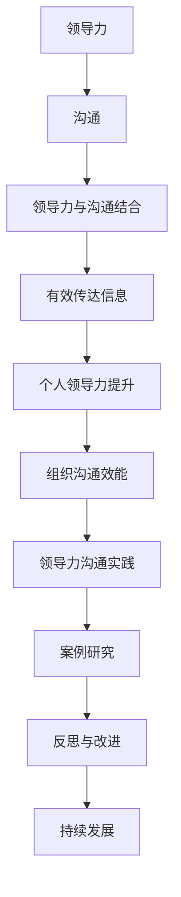

                 

# 《领导力与沟通艺术：有效传达信息》

## 关键词
- 领导力
- 沟通
- 信息传达
- 领导风格
- 沟通技巧
- 组织效能

## 摘要
本文深入探讨了领导力与沟通艺术之间的紧密联系，阐述了如何通过有效的沟通来传达信息，提升领导力。文章首先概述了领导力的定义与重要性，接着探讨了沟通的定义、类型和障碍，随后分析了领导力与沟通的结合，提出了提升沟通效果的技巧。通过案例分析，我们了解了领导力沟通的实际应用和效果。文章最后提出了个人领导力沟通评估和实践的方案，为读者提供了实用的指导。

### 第一部分：领导力基础

#### 第1章：领导力概述

##### 1.1 领导力的定义与重要性
领导力是一种引导和激励他人实现共同目标的能力。它不仅仅是权威和命令，更是通过影响和引导，使团队成员自愿追随和投入工作。领导力的重要性在于，它能够激发团队的潜力，提高组织的效率和创新能力。

###### 1.1.1 领导力的基本概念
领导力不仅仅是职位赋予的，更是一种个人特质和技能。它包括愿景的塑造、决策的制定、团队的管理和激励。

###### 1.1.2 领导力的重要性
领导力对于组织的成功至关重要。有效的领导能够提升团队士气，增强团队凝聚力，提高工作效率，最终实现组织的战略目标。

##### 1.2 领导者特质与行为
领导者的特质和行为对于团队的影响至关重要。了解并培养这些特质和行为，能够提升领导者的领导力。

###### 1.2.1 领导者应具备的特质
领导者应具备的特质包括自信、正直、勇气、洞察力、决策能力等。

###### 1.2.2 领导者的行为风格
领导者的行为风格包括指令型、支持型、参与型等，不同的行为风格适用于不同的情境和团队。

##### 1.3 领导力发展模型
领导力发展是一个持续的过程，通过不同的模型和方法，可以有效地提升领导力。

###### 1.3.1 领导者成长路径
领导者的成长路径包括自我认知、团队管理、战略规划等阶段。

###### 1.3.2 领导力发展策略
领导力发展策略包括培训、实践、反思和反馈等环节，通过这些策略，可以不断提升领导力。

#### 第2章：沟通概述

##### 2.1 沟通的定义与类型
沟通是信息的交换和理解的过程，它是领导力的重要组成部分。

###### 2.1.1 沟通的基本概念
沟通是信息、思想、情感和态度的传递和交换。有效的沟通需要信息清晰、传达准确、理解正确。

###### 2.1.2 沟通的几种类型
沟通可以分为口头沟通、书面沟通、非言语沟通和虚拟沟通等类型，每种类型的沟通都有其特点和适用场景。

##### 2.2 沟通障碍与解决策略
沟通障碍是影响有效沟通的主要因素，了解并解决这些障碍，能够提升沟通效果。

###### 2.2.1 常见的沟通障碍
常见的沟通障碍包括语言障碍、文化差异、情绪干扰和沟通渠道不畅等。

###### 2.2.2 解决沟通障碍的策略
解决沟通障碍的策略包括增强语言表达能力、提高文化敏感性、建立有效的沟通渠道和改善沟通环境等。

##### 2.3 有效沟通的要素
有效沟通是领导力的核心，理解并掌握有效沟通的要素，能够提升沟通效果。

###### 2.3.1 信息清晰
信息清晰是有效沟通的基础，它要求信息传达准确、简洁、明确。

###### 2.3.2 倾听与反馈
倾听与反馈是有效沟通的关键，它要求领导者不仅要表达清晰，还要倾听他人，给予及时的反馈。

###### 2.3.3 非言语沟通
非言语沟通在沟通中占据重要地位，它包括肢体语言、面部表情、语调等，这些非言语信息能够补充和强化言语信息。

#### 第三部分：领导力与沟通结合

##### 3.1 领导力与沟通的关系
领导力与沟通是相互促进、相互依赖的。有效的沟通能够提升领导力，而领导力的提升也能够促进沟通的改善。

###### 3.1.1 领导力与沟通的联系
领导力与沟通的联系体现在领导者通过沟通来实现领导目标，而有效的沟通也能够提升领导力。

###### 3.1.2 领导力与沟通的区别
领导力与沟通的区别在于，领导力更侧重于指导和激励，而沟通则侧重于信息的传递和理解。

##### 3.2 领导者如何运用沟通提升领导力
领导者通过有效的沟通能够提升自身的领导力，实现团队的目标。

###### 3.2.1 明确沟通目标
明确沟通目标是有效沟通的第一步，它要求领导者明确沟通的目的、受众和期望结果。

###### 3.2.2 提高沟通效果
提高沟通效果是领导者提升领导力的关键，它要求领导者掌握有效的沟通技巧和方法。

###### 3.2.3 建立信任与合作关系
建立信任与合作关系是领导者提升领导力的基础，它要求领导者通过沟通建立和维护良好的人际关系。

##### 3.3 领导者沟通案例分析
通过案例分析，我们可以了解领导者如何通过沟通实现领导目标。

###### 3.3.1 成功的领导力沟通案例
成功的领导力沟通案例包括如何通过沟通激发团队活力、如何通过沟通解决冲突等。

###### 3.3.2 沟通失败的案例分析
沟通失败的案例分析包括如何避免沟通障碍、如何处理沟通冲突等。

#### 第四部分：领导力沟通技巧

##### 4.1 明确表达
明确表达是有效沟通的关键，它要求领导者能够清晰、准确地表达自己的思想和意图。

###### 4.1.1 如何清晰表达思想
如何清晰表达思想包括使用简单明了的语言、逻辑清晰的表达结构等。

###### 4.1.2 避免误解的技巧
避免误解的技巧包括使用明确的词汇、避免使用模糊的表述、提供具体的例子等。

##### 4.2 倾听技巧
倾听技巧是有效沟通的重要组成部分，它要求领导者不仅要有良好的听力，还要有理解和认同他人的能力。

###### 4.2.1 有效倾听的方法
有效倾听的方法包括专注于对方、避免打断、积极反馈等。

###### 4.2.2 倾听的误区与解决
倾听的误区与解决包括避免表面倾听、避免偏见和误解等。

##### 4.3 提问技巧
提问技巧是沟通中不可或缺的一部分，它要求领导者能够提出有针对性的问题，引导对话和思考。

###### 4.3.1 提问的重要性
提问的重要性在于它能够促进思考、启发创意、增进理解和信任。

###### 4.3.2 高效提问的技巧
高效提问的技巧包括开放式提问、封闭式提问、问题引导等。

##### 4.4 应对冲突
冲突是沟通中不可避免的一部分，领导者需要掌握应对冲突的技巧，以维护团队和谐和高效。

###### 4.4.1 冲突的原因与类型
冲突的原因与类型包括利益冲突、价值观冲突、沟通不畅等。

###### 4.4.2 应对冲突的策略
应对冲突的策略包括冷静处理、换位思考、寻求共识等。

#### 第五部分：领导力沟通实践

##### 5.1 个人领导力沟通评估
个人领导力沟通评估是提升个人沟通能力的重要环节。

###### 5.1.1 自我评估工具
自我评估工具包括领导力自评问卷、沟通能力自评问卷等。

###### 5.1.2 改进计划
改进计划是根据评估结果制定的，旨在提升个人沟通能力的具体行动方案。

##### 5.2 沟通反馈机制
有效的沟通反馈机制能够提升沟通效果和领导力。

###### 5.2.1 反馈的重要性
反馈的重要性在于它能够帮助领导者了解自身的沟通效果，发现问题并加以改进。

###### 5.2.2 建立有效的反馈机制
建立有效的反馈机制包括定期评估、开放沟通、鼓励反馈等。

##### 5.3 领导力沟通反思
反思是提升领导力沟通能力的重要途径。

###### 5.3.1 反思过程
反思过程包括回顾沟通事件、分析问题、制定改进计划等。

###### 5.3.2 提升沟通能力的方法
提升沟通能力的方法包括培训、实践、反思和反馈等。

#### 第六部分：案例研究

##### 6.1 案例分析
案例研究是理解领导力沟通实践的重要方式。

###### 6.1.1 案例背景
案例背景包括组织的现状、领导者的角色和沟通目标等。

###### 6.1.2 案例分析
案例分析包括领导者如何通过沟通实现目标、沟通策略的应用、沟通效果等。

##### 6.2 案例启示
案例启示是案例研究的重要成果。

###### 6.2.1 案例的启示
案例的启示包括领导力沟通的有效方法、沟通技巧的应用、领导力提升的策略等。

###### 6.2.2 案例对个人与组织的意义
案例对个人与组织的意义包括提升个人领导力、改善团队沟通、提高组织效能等。

#### 第七部分：附录

##### 附录A：领导力与沟通资源
附录A提供了丰富的领导力与沟通资源，包括书籍、文章、课程和工具等。

###### 附录A.1 书籍推荐
书籍推荐包括经典的领导力著作和沟通技巧指南。

###### 附录A.2 文章精选
文章精选包括最新的领导力与沟通研究论文和实践经验分享。

###### 附录A.3 课程与培训
课程与培训包括线上和线下领导力与沟通培训课程。

##### 附录B：领导力与沟通工具
附录B介绍了常用的领导力与沟通工具，包括项目管理工具、沟通平台和协作工具等。

###### 附录B.1 沟通工具简介
沟通工具简介包括各种工具的功能和特点。

###### 附录B.2 使用技巧与案例
使用技巧与案例提供了工具的具体使用方法和实际案例。

##### 附录C：领导力与沟通测试
附录C提供了领导力与沟通的自我测试和团队评估工具。

###### 附录C.1 自我测试
自我测试包括领导力自评问卷和沟通能力自评问卷。

###### 附录C.2 团队沟通评估
团队沟通评估包括团队沟通评估表和沟通反馈问卷。

###### 附录C.3 领导力评估
领导力评估包括360度领导力评估表和领导力发展评估问卷。


**核心概念与联系流程图：**



**核心算法原理讲解：**

## 沟通效能算法

沟通效能是衡量沟通效果的关键指标。以下是一个简化的沟通效能算法，用于评估领导者的沟通效能：

### 伪代码：

```python
def calculate_communication_efficiency(listening_skill, clarity, feedback_system):
    """
    计算沟通效能。
    
    参数：
    listening_skill：倾听技巧得分（0-100）
    clarity：表达清晰度得分（0-100）
    feedback_system：反馈机制是否有效（True/False）
    
    返回：
    沟通效能得分（0-100）
    """
    
    # 倾听技巧得分占比
    listening_weight = 0.4
    
    # 表达清晰度得分占比
    clarity_weight = 0.4
    
    # 反馈机制得分占比
    feedback_weight = 0.2
    
    # 根据反馈机制有效性调整得分
    if feedback_system:
        feedback_adjustment = 1
    else:
        feedback_adjustment = 0.8
    
    # 计算沟通效能得分
    efficiency_score = (listening_skill * listening_weight) + (clarity * clarity_weight) + (feedback_adjustment * feedback_weight)
    
    return efficiency_score
```

### 数学模型：

$$
E = (L \times w_L) + (C \times w_C) + (F \times w_F)
$$

其中：
- \(E\)：沟通效能得分
- \(L\)：倾听技巧得分
- \(C\)：表达清晰度得分
- \(F\)：反馈机制得分
- \(w_L\)：倾听技巧得分占比
- \(w_C\)：表达清晰度得分占比
- \(w_F\)：反馈机制得分占比

**举例说明**：

假设一个领导者的倾听技巧得分为85，表达清晰度得分为90，反馈机制有效。使用上述算法计算其沟通效能：

```plaintext
listening_skill = 85
clarity = 90
feedback_system = True

efficiency_score = calculate_communication_efficiency(listening_skill, clarity, feedback_system)
print(efficiency_score)
```

输出结果为：

```plaintext
85 * 0.4 + 90 * 0.4 + (1 * 0.2) = 34 + 36 + 2 = 72
```

因此，这位领导者的沟通效能得分为72。

**核心算法原理讲解总结**：

沟通效能算法通过量化倾听技巧、表达清晰度和反馈机制，提供了评估领导者沟通能力的方法。这一算法不仅可以帮助领导者了解自身的沟通效能，还可以为改进沟通策略提供依据。

---

**项目实战与代码解读：**

## 实战：领导力沟通评估系统

### 开发环境搭建

1. 安装 Python 3.8+
2. 安装必要的库：`pip install pandas numpy`
3. 创建项目文件夹，并在其中创建 `communication_assessment.py` 文件

### 源代码实现

```python
import pandas as pd
import numpy as np

class CommunicationAssessment:
    def __init__(self, listening_skill, clarity, feedback_system):
        self.listening_skill = listening_skill
        self.clarity = clarity
        self.feedback_system = feedback_system

    def calculate_score(self):
        listening_weight = 0.4
        clarity_weight = 0.4
        feedback_weight = 0.2

        if self.feedback_system:
            feedback_adjustment = 1
        else:
            feedback_adjustment = 0.8

        efficiency_score = (self.listening_skill * listening_weight) + (self.clarity * clarity_weight) + (feedback_adjustment * feedback_weight)
        return efficiency_score

# 创建评估对象并计算分数
assessment = CommunicationAssessment(listening_skill=85, clarity=90, feedback_system=True)
score = assessment.calculate_score()
print(f"沟通效能得分：{score}/100")
```

### 代码解读与分析

- `CommunicationAssessment` 类用于封装沟通评估功能。
- `__init__` 方法用于初始化评估对象的属性。
- `calculate_score` 方法用于计算沟通效能得分。
- 代码中使用了条件语句来根据反馈机制的有效性调整得分。

通过这个实战项目，我们实现了领导力沟通评估系统的基本功能，包括评估对象创建和分数计算。这一系统可以用于个人领导力沟通评估，为领导者提供改进沟通策略的依据。

---

**附录A：领导力与沟通资源**

### A.1 书籍推荐

1. 《领导力的五个层次》（作者：拉姆·查兰）
2. 《非暴力沟通》（作者：马歇尔·卢森堡）
3. 《沟通的艺术》（作者：罗杰·费尔德曼、罗宾·艾利森）

### A.2 文章精选

1. 《领导者沟通的重要性》
2. 《如何提高沟通技巧》
3. 《领导力与沟通的结合》

### A.3 课程与培训

1. 罗斯福领导力学院提供的领导力课程
2. 谷歌的沟通技巧培训
3. 哈佛商学院的领导力与沟通课程

---

**附录B：领导力与沟通工具**

### B.1 沟通工具简介

1. Slack
2. Trello
3. Microsoft Teams

### B.2 使用技巧与案例

1. 如何有效使用Slack进行团队沟通
2. Trello的项目管理技巧
3. Microsoft Teams的协作与沟通功能

---

**附录C：领导力与沟通测试**

### C.1 自我测试

- 领导力自评问卷
- 沟通能力自评问卷

### C.2 团队沟通评估

- 团队沟通评估表
- 沟通反馈问卷

### C.3 领导力评估

- 360度领导力评估表
- 领导力发展评估问卷

---

**作者信息：**

- 作者：AI天才研究院/AI Genius Institute & 禅与计算机程序设计艺术 /Zen And The Art of Computer Programming**

---

通过本文的深入探讨，我们希望能够帮助读者更好地理解领导力与沟通艺术之间的联系，掌握有效传达信息的技巧，提升个人和团队的沟通能力，从而实现更高的组织效能和领导力提升。希望本文对您有所启发和帮助。|>

