                 

# 领导力与资源整合：优化资源配置的艺术

## 关键词：
领导力、资源整合、资源配置优化、战略规划、团队建设、组织文化、变革领导力、创新思维

## 摘要：
本文深入探讨领导力与资源整合的关系，以及如何通过优化资源配置来实现组织的战略目标。文章首先介绍了领导力的基本概念和特征，探讨了领导力的重要性及其在组织中的影响。接着，文章详细阐述了资源整合的概念、要素和优化策略，并介绍了战略规划的理论与实践。随后，文章重点分析了团队建设与领导艺术、领导力与组织文化的相互关系，以及如何通过变革领导力推动组织创新。最后，文章总结了领导力评估的方法与路径，并对领导力与资源整合的未来发展进行了展望。通过本文的阅读，读者将能够理解领导力与资源整合的核心原理，掌握优化资源配置的实践策略，为组织的发展提供有力支持。

----------------------------------------------------------------

## 第一部分：领导力理论基础

### 第1章：领导力的本质与价值

#### 1.1 领导力的定义与特征

**定义**：领导力是一种能力，它使个人或群体能够引导和激励他人朝着共同的目标前进。领导力不仅仅是职位赋予的权利，更是一种影响力，能够激发团队成员的积极性和创造力。

**特征**：
1. **影响力**：领导者通过言行影响他人，使其追随和认同。
2. **激励**：领导者激发团队成员的内在动机，促进其积极行动。
3. **愿景**：领导者对组织未来发展的清晰描绘。
4. **价值观**：领导者所秉持的核心信念和行为准则。

为了更好地理解领导力的特征，我们可以使用 Mermaid 流程图来展示领导力的影响过程：

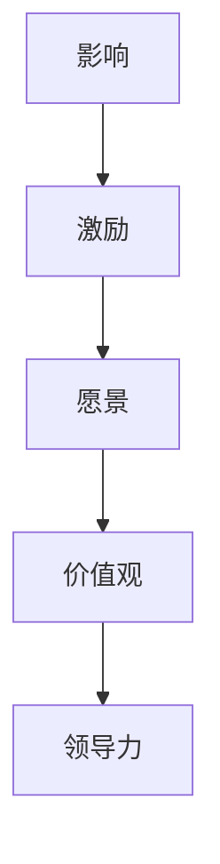

#### 1.2 领导力的重要性与影响

**重要性**：
1. **团队绩效**：领导力直接影响团队的工作效率和成果。
2. **员工满意度**：有效的领导力提升员工的工作满意度和忠诚度。
3. **组织文化**：领导力塑造和传承组织文化，影响组织发展。

**影响**：
1. **改变行为**：领导者的行为对团队成员的行为有示范作用。
2. **塑造团队氛围**：领导力影响团队的工作氛围和人际关系。
3. **决策质量**：领导力提升团队的决策能力和决策质量。

**影响分析**：
- 领导力对团队绩效的影响可以表示为以下数学模型：
  $$\text{团队绩效} = f(\text{领导力}, \text{团队能力}, \text{资源分配})$$
- 领导力对员工满意度的影响可以表示为：
  $$\text{员工满意度} = g(\text{领导力}, \text{工作环境}, \text{薪酬福利})$$
- 领导力对组织文化的影响可以表示为：
  $$\text{组织文化} = h(\text{领导力}, \text{历史传承}, \text{外部环境})$$

#### 1.3 领导力的三层次模型

**层次模型**：
1. **技术性领导力**：解决具体问题，掌握专业技能。
2. **人际性领导力**：处理人际关系，建立团队信任。
3. **概念性领导力**：制定战略规划，引领组织发展。

**技术性领导力**：领导者需要具备解决具体问题的能力和专业知识，如编程、项目管理等。

**人际性领导力**：领导者需要具备处理人际关系的技能，如沟通、激励、团队建设等。

**概念性领导力**：领导者需要具备制定战略规划的能力，如市场分析、资源配置等。

**层次模型图**：

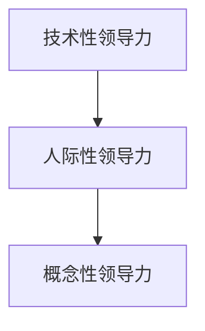

通过以上三个层次，领导者可以全面提高自己的领导力，从而更好地引领组织发展。

---

### 第2章：领导者的角色与责任

#### 2.1 领导者的自我认知与定位

**自我认知**：
1. **了解自身优势与不足**：领导者需要清楚自己的能力和局限性，以便在合适的位置发挥最大价值。
2. **建立个人品牌**：领导者需塑造自己的专业形象和价值观，树立个人品牌。

**定位**：
1. **明确角色职责**：领导者需要了解自己的角色定位，清晰界定职责范围。
2. **适应环境变化**：领导者要灵活调整自己的定位，以适应组织环境的变化。

**自我认知与定位**的关系可以用以下伪代码表示：

```python
def selfAwareness():
    # 分析个人优势和不足
    strengths = ["技术专长", "沟通能力", "决策能力"]
    weaknesses = ["时间管理", "情绪控制", "公共演讲"]
    
    # 塑造个人品牌
    brand = "技术专家，注重团队合作，擅长问题解决"

def rolePositioning():
    # 明确角色职责
    responsibilities = ["项目管理", "团队领导", "战略规划"]
    
    # 适应环境变化
    adaptToEnvironment()

def adaptToEnvironment():
    # 根据外部环境调整角色职责
    if externalFactor == "市场竞争激烈":
        responsibilities.append("市场分析")
    elif externalFactor == "技术变革快速":
        responsibilities.append("技术预研")
```

#### 2.2 领导者的沟通技巧

**沟通技巧**：
1. **倾听**：领导者要善于倾听，理解团队成员的需求和想法。
2. **表达**：领导者需清晰、准确地表达自己的想法和决策。
3. **反馈**：领导者要给予团队成员及时的反馈，促进个人成长。

**沟通技巧模型**：

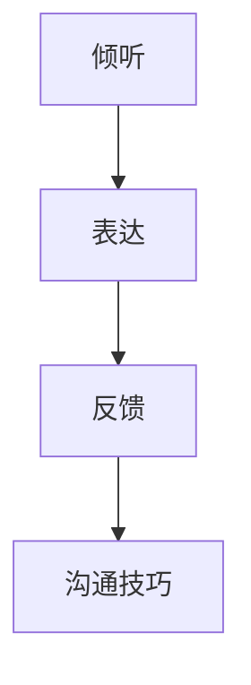

**倾听**：通过主动倾听，领导者可以获取团队成员的反馈和建议，提高团队凝聚力。

**表达**：领导者需要清晰、准确地传达信息，确保团队成员理解任务和要求。

**反馈**：领导者要及时给予团队成员反馈，帮助他们识别问题并改进。

#### 2.3 领导者的决策能力

**决策能力**：
1. **信息收集与分析**：领导者需收集全面的信息，进行深入分析。
2. **权衡利弊**：领导者要在决策时权衡各种因素，做出最优选择。
3. **风险评估**：领导者要评估决策的风险，制定应对措施。

**决策能力模型**：

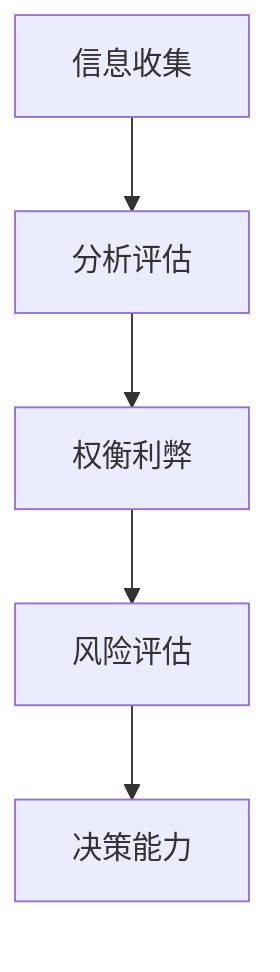

**信息收集与分析**：领导者要广泛收集信息，分析各种可能的决策路径。

**权衡利弊**：领导者要考虑不同决策的优劣，选择最佳方案。

**风险评估**：领导者要评估决策的风险，制定应对策略，确保决策的稳健性。

---

### 第3章：资源整合与战略规划

#### 3.1 资源整合的概念与要素

**资源整合**：
1. **定义**：资源整合是指企业通过对内部资源与外部资源的有效配置和整合，实现资源的最优利用和价值的最大化。
2. **目的**：提高企业竞争力，实现可持续发展。

**要素**：
1. **人力资源**：企业最宝贵的资源，包括员工技能、知识和经验。
2. **财务资源**：资金、资本等财务资源的有效配置。
3. **物质资源**：土地、设备、原材料等物质资源的合理利用。
4. **信息资源**：企业内部和外部的信息资源的整合与利用。

**资源整合模型**：

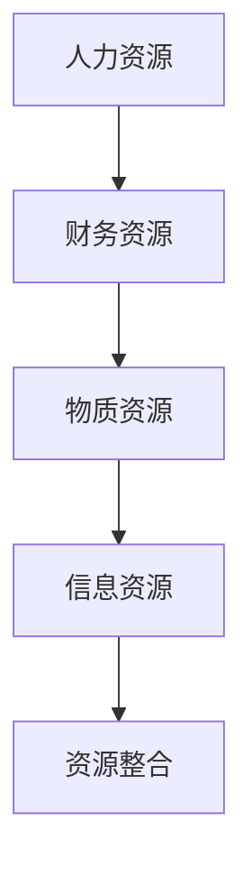

**人力资源**：领导者要关注员工培训、激励和团队建设，提升团队整体能力。

**财务资源**：领导者要合理规划资金使用，确保资源分配的效率。

**物质资源**：领导者要优化物质资源的使用，提高生产效率和产品质量。

**信息资源**：领导者要重视信息收集、处理和利用，为决策提供有力支持。

#### 3.2 战略规划的理论与实践

**理论**：
1. **企业战略规划理论**：企业战略规划是企业长期发展规划，是指导企业发展的总体方向。
2. **SWOT分析**：对企业内外部环境进行综合分析，确定企业的优势、劣势、机会和威胁。

**实践**：
1. **战略目标设定**：明确企业的长期和短期目标，确保资源的有效配置。
2. **战略规划实施**：制定详细的实施计划，明确责任人和时间节点。
3. **战略评估与调整**：定期评估战略实施效果，根据实际情况进行调整。

**战略规划模型**：

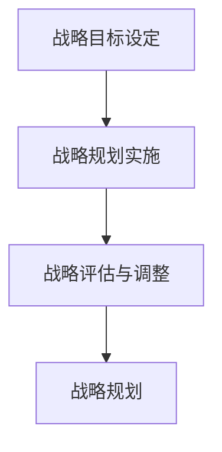

**战略目标设定**：领导者要明确企业的愿景和使命，设定具体、可量化的目标。

**战略规划实施**：领导者要制定详细的行动计划，确保战略目标的实现。

**战略评估与调整**：领导者要定期评估战略实施情况，根据市场变化和内部情况调整战略。

#### 3.3 资源配置的优化策略

**优化策略**：
1. **资源配置原则**：公平、合理、高效、可持续。
2. **资源分配方法**：基于绩效、能力、贡献等多维度进行分配。
3. **资源配置工具**：采用数学模型、优化算法等工具进行资源配置。

**资源配置优化模型**：

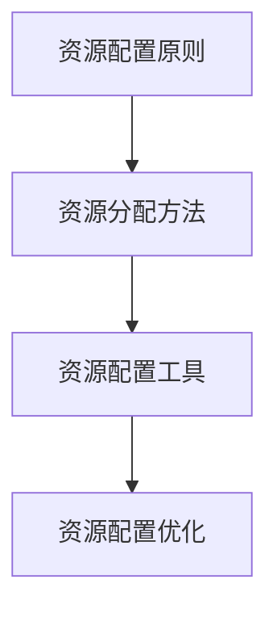

**资源配置原则**：领导者要遵循公平、合理、高效、可持续的原则，确保资源配置的公正性和效率。

**资源分配方法**：领导者要根据员工的绩效、能力和贡献，进行多维度的资源分配。

**资源配置工具**：领导者可以采用数学模型、优化算法等工具，提高资源配置的科学性和准确性。

---

### 第4章：团队建设与领导艺术

#### 4.1 团队建设的理论基础

**理论基础**：
1. **团队动力理论**：团队是由个人组成的集体，每个成员都有其独特的动力和角色。
2. **团队成熟度模型**：团队成熟度分为形成期、动荡期、规范期、执行期和休整期。

**团队动力理论**：

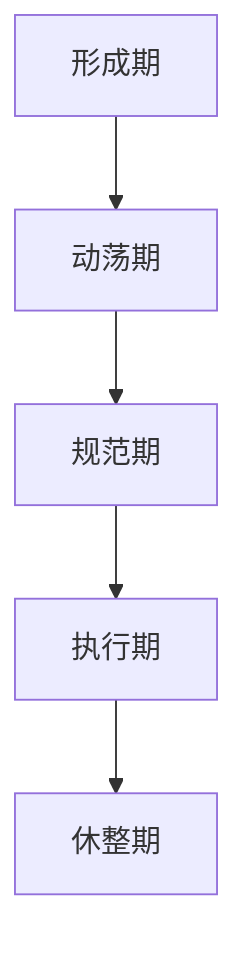

**形成期**：团队成员初次相识，开始建立联系。

**动荡期**：团队成员之间产生矛盾和冲突，团队凝聚力较低。

**规范期**：团队成员逐渐适应，开始形成共同的价值观和目标。

**执行期**：团队进入高效运行状态，实现组织目标。

**休整期**：团队完成任务后，进行总结和反思，为下一个项目做准备。

#### 4.2 领导者的角色与任务

**角色**：
1. **领导者作为榜样**：领导者要以身作则，树立良好的行为榜样。
2. **领导者作为协调者**：领导者要协调团队成员之间的关系，解决冲突。
3. **领导者作为导师**：领导者要指导和支持团队成员，促进其成长。

**任务**：
1. **明确团队目标**：领导者要确保团队成员对团队目标有清晰的认识。
2. **激励团队成员**：领导者要通过激励措施激发团队成员的积极性和创造力。
3. **提供资源支持**：领导者要确保团队成员有足够的资源来完成工作任务。

**领导者角色与任务的相互关系**：

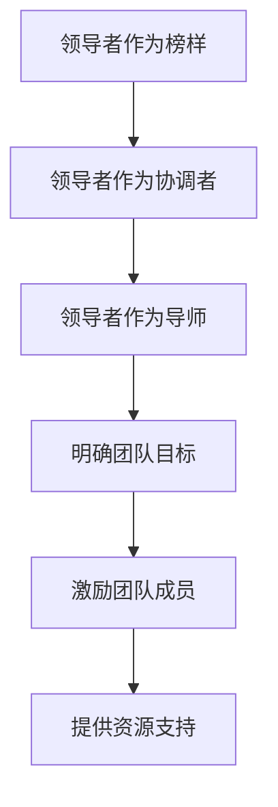

#### 4.3 团队协作与沟通技巧

**团队协作**：
1. **建立信任**：团队成员之间建立信任，促进协作。
2. **分工合作**：明确团队成员的职责和任务，确保高效协作。
3. **共享信息**：团队成员之间共享信息和资源，提高团队效率。

**团队协作模型**：

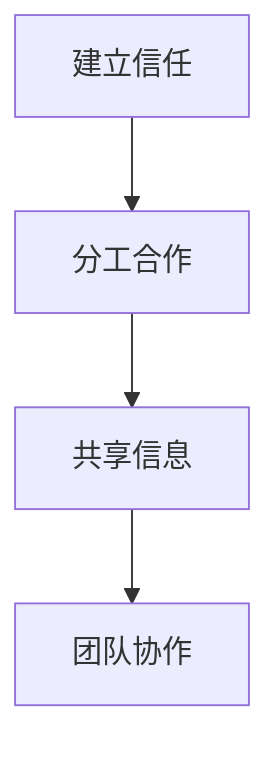

**建立信任**：领导者要通过诚信、透明和尊重，建立团队成员之间的信任。

**分工合作**：领导者要明确团队成员的职责，确保每个人都知道自己的任务。

**共享信息**：领导者要鼓励团队成员分享信息和资源，促进协作。

**沟通技巧**：
1. **倾听**：领导者要善于倾听团队成员的意见和反馈。
2. **表达**：领导者要清晰、准确地表达自己的想法和决策。
3. **反馈**：领导者要给予团队成员及时的反馈，促进个人成长。

**沟通技巧模型**：


**倾听**：领导者要耐心倾听，理解团队成员的需求和想法。

**表达**：领导者要清晰表达，确保团队成员理解任务和要求。

**反馈**：领导者要及时反馈，帮助团队成员改进和成长。

---

### 第5章：领导力与组织文化

#### 5.1 组织文化的内涵与类型

**内涵**：
1. **组织文化**：组织内部共同的价值观、信念、行为准则和工作方式。
2. **作用**：组织文化对员工的行为和团队协作有深远影响。

**类型**：
1. **功利型文化**：追求短期利益，忽视长期发展。
2. **学习型文化**：鼓励创新和学习，重视员工成长。
3. **参与型文化**：重视员工的参与和决策，增强员工的主人翁意识。

**组织文化模型**：

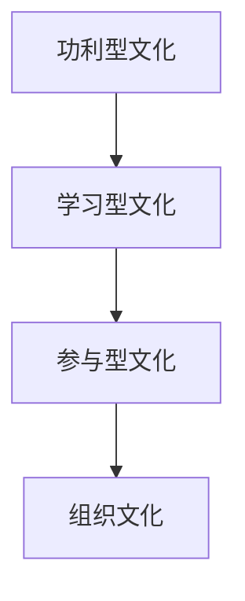

**功利型文化**：以短期利润为导向，可能导致员工缺乏长远眼光。

**学习型文化**：鼓励员工不断学习和创新，提升组织整体竞争力。

**参与型文化**：重视员工的参与和决策，增强员工的归属感和责任感。

#### 5.2 领导力对组织文化的影响

**影响**：
1. **塑造组织文化**：领导者的行为和价值观直接影响组织文化的形成。
2. **传承组织文化**：领导者通过言行传承和强化组织文化。
3. **变革组织文化**：领导者在组织变革中扮演关键角色，推动组织文化变革。

**影响分析**：

- **领导者塑造组织文化**：领导者的言行和行为是组织文化的缩影。领导者通过自身的言行，塑造组织的价值观和行为准则。

- **领导者传承组织文化**：领导者通过日常沟通和培训，将组织文化传递给新员工，确保组织文化的持续传承。

- **领导者变革组织文化**：在组织面临外部挑战或内部变革时，领导者要推动组织文化的变革，以适应新的环境。

**领导力与组织文化的互动模型**：

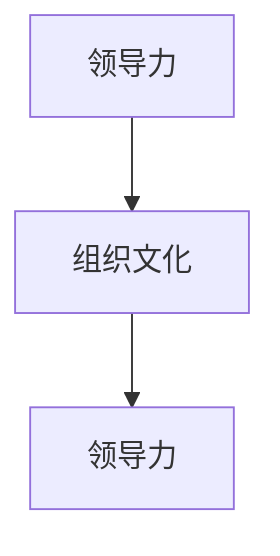

#### 5.3 塑造积极组织文化的策略

**策略**：
1. **建立共同愿景**：领导者要与员工共同确立组织的愿景和目标。
2. **强化价值观**：领导者要明确和强化组织的价值观，确保员工行为一致。
3. **培养团队精神**：领导者要通过团队活动和沟通培养员工的团队精神。

**策略模型**：

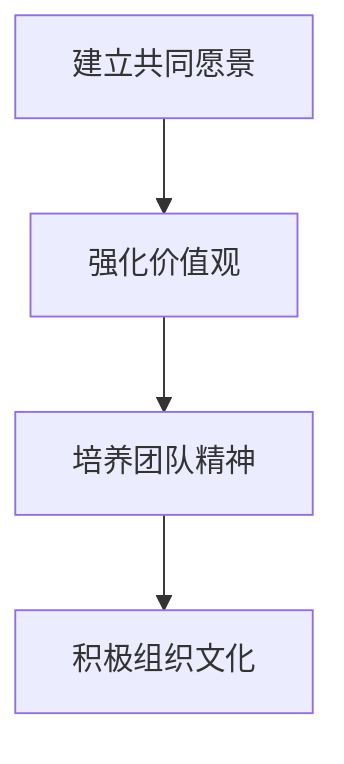

**建立共同愿景**：领导者要明确组织的长远目标，并与员工共同探讨实现目标的路径。

**强化价值观**：领导者要通过宣传和实际行动，强化组织的价值观，确保员工的行为与价值观一致。

**培养团队精神**：领导者要通过团队活动和沟通，增强员工的归属感和团队意识。

---

### 第6章：变革领导力与创新思维

#### 6.1 变革领导力的概念与特点

**概念**：
1. **变革领导力**：领导者推动组织变革的能力和技巧。
2. **特点**：
   - **前瞻性**：领导者要有远见，预见变革的趋势和方向。
   - **适应性**：领导者要具备灵活性和适应性，应对变革中的不确定性。
   - **沟通能力**：领导者要有效沟通，传递变革信息，获得员工的支持。

**变革领导力模型**：

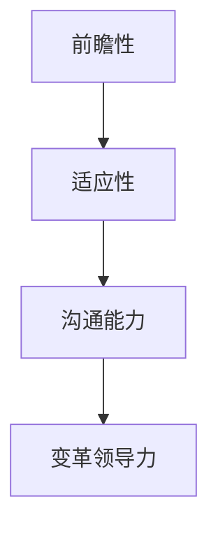

**前瞻性**：领导者要能够预见市场变化和趋势，提前做好准备。

**适应性**：领导者要能够快速调整自己的策略和行动，适应变革的需求。

**沟通能力**：领导者要善于沟通，传递变革信息，赢得员工的信任和支持。

#### 6.2 创新思维的方法与工具

**方法**：
1. **头脑风暴**：通过集体讨论激发创意。
2. **六顶思考帽**：通过不同的思考角度分析问题。
3. **SCAMPER**：通过改变、添加、提取、转换、结合、极简等策略激发创意。

**工具**：
1. **思维导图**：通过图形化方式梳理思路，提高创新效率。
2. **SWOT分析**：通过分析优势、劣势、机会和威胁，制定创新策略。
3. **创新矩阵**：通过矩阵分析，确定创新的优先级和路径。

**创新思维模型**：

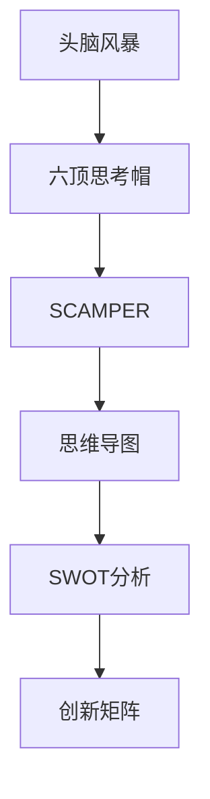

**头脑风暴**：通过集体讨论，激发团队成员的创意和灵感。

**六顶思考帽**：通过不同的思考角度，全面分析问题，避免思维定势。

**SCAMPER**：通过改变、添加、提取、转换、结合、极简等策略，激发创新思维。

**思维导图**：通过图形化方式，梳理创新思路，提高创新效率。

**SWOT分析**：通过分析优势、劣势、机会和威胁，制定创新策略。

**创新矩阵**：通过矩阵分析，确定创新的优先级和路径。

#### 6.3 变革领导力在实践中的应用

**应用**：
1. **领导变革项目**：领导者要明确变革目标，制定详细计划，推动项目实施。
2. **激励员工参与**：领导者要通过激励措施，鼓励员工参与变革。
3. **管理变革阻力**：领导者要识别和管理变革中的阻力，确保变革顺利进行。

**实践模型**：

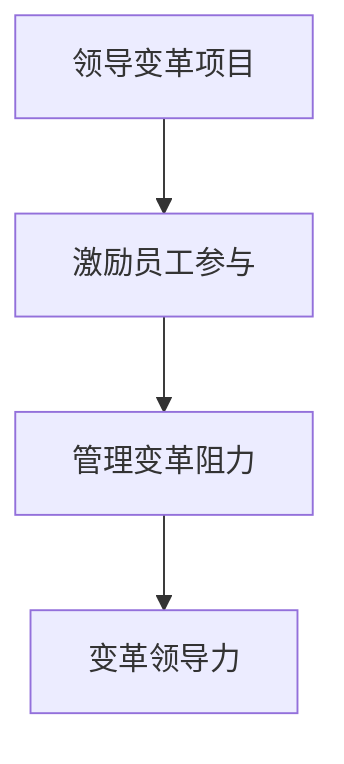

**领导变革项目**：领导者要明确变革的目标和路径，制定详细的实施计划。

**激励员工参与**：领导者要设计激励措施，激发员工的积极性和参与度。

**管理变革阻力**：领导者要识别变革中的阻力，采取有效措施进行管理和化解。

---

### 第7章：领导力评估与持续发展

#### 7.1 领导力评估的方法与指标

**方法**：
1. **360度评估**：通过多方反馈评估领导者的能力。
2. **行为观察法**：通过观察领导者的行为和表现评估其能力。
3. **领导力测试**：通过专业测试评估领导者的能力。

**指标**：
1. **领导能力**：领导者的决策能力、沟通能力、团队建设能力等。
2. **领导行为**：领导者的行为是否符合组织的价值观和文化。
3. **领导绩效**：领导者的工作成果和团队绩效。

**评估方法与指标模型**：

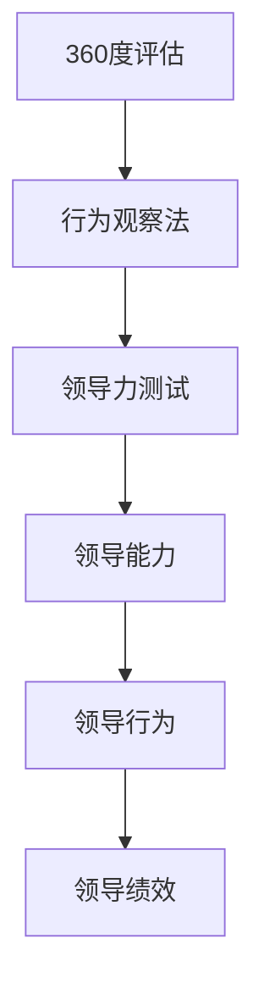

**360度评估**：通过上级、同事和下属的反馈，全面评估领导者的能力。

**行为观察法**：通过观察领导者的日常行为和表现，评估其领导力水平。

**领导力测试**：通过专业的测试工具，量化评估领导者的能力。

**领导能力**：评估领导者的决策能力、沟通能力和团队建设能力。

**领导行为**：评估领导者的行为是否符合组织的价值观和文化。

**领导绩效**：评估领导者的工作成果和团队绩效，衡量领导力对组织绩效的影响。

#### 7.2 领导力的自我提升路径

**路径**：
1. **自我反思**：领导者要通过反思自己的行为和决策，不断改进。
2. **学习和培训**：领导者要不断学习和接受专业培训，提升能力。
3. **实践与反思**：领导者要通过实践，不断总结经验，提升领导力。

**自我提升路径模型**：

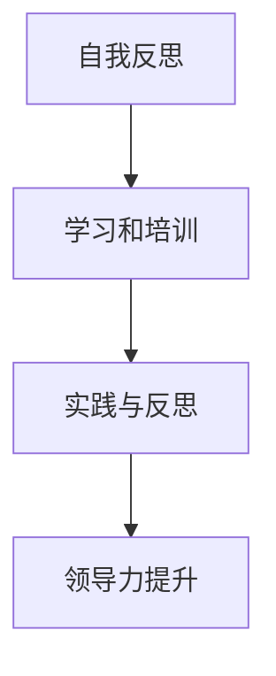

**自我反思**：领导者要定期反思自己的行为和决策，识别不足和改进方向。

**学习和培训**：领导者要主动参加培训和学习，提升专业知识和领导能力。

**实践与反思**：领导者要在实际工作中，不断总结经验，提升领导力。

#### 7.3 领导力发展的未来趋势

**趋势**：
1. **数字化领导力**：随着数字化技术的广泛应用，领导者需要具备数字化的思维和能力。
2. **全球领导力**：全球化背景下，领导者需要具备跨文化的沟通和领导能力。
3. **可持续领导力**：领导者要关注社会责任和可持续发展，推动组织的可持续发展。

**未来趋势模型**：

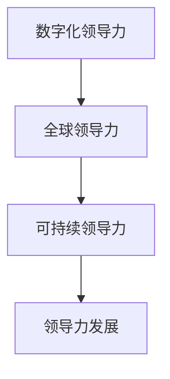

**数字化领导力**：领导者要掌握数字化工具和技术，提升工作效率。

**全球领导力**：领导者要具备跨文化的沟通和领导能力，适应全球化环境。

**可持续领导力**：领导者要关注社会责任和可持续发展，推动组织的可持续发展。

---

### 第8章：领导力实践案例分析

#### 8.1 案例一：成功的领导力实践

**案例描述**：
某公司是一家快速发展的科技企业，CEO李明通过创新思维和变革领导力，推动企业快速发展。

**领导行为**：
1. **创新思维**：李明积极推动技术创新，引入先进的技术和理念，提升企业的竞争力。
2. **变革领导力**：李明在组织变革中，善于沟通和激励员工，赢得员工的信任和支持。

**成果**：
1. **市场份额提升**：企业市场份额大幅提升，成为行业领导者。
2. **员工满意度提高**：员工满意度显著提高，团队凝聚力增强。

**案例分析**：
1. **领导力特点**：李明展示了强大的创新思维和变革领导力。
2. **成功因素**：有效的沟通、团队建设、战略规划和执行力。

#### 8.2 案例二：领导力失败的反思

**案例描述**：
某公司是一家历史悠久的大型制造企业，CEO张华过于保守，缺乏创新意识，无法适应市场变化。

**领导行为**：
1. **缺乏创新思维**：张华对市场变化反应迟缓，缺乏创新意识和创新能力。
2. **管理僵化**：公司管理制度僵化，缺乏灵活性，无法适应市场变化。

**成果**：
1. **市场份额下降**：企业市场份额逐年下降，面临市场压力。
2. **员工士气低落**：员工士气低落，团队凝聚力下降。

**案例分析**：
1. **领导力问题**：张华缺乏创新思维和变革领导力，无法应对市场变化。
2. **失败原因**：沟通不畅、团队建设不足、战略规划不明确。

#### 8.3 案例分析总结与启示

**总结**：
1. **成功案例**：有效的领导力是组织成功的关键。
2. **失败案例**：领导力的缺乏可能导致组织的衰退。

**启示**：
1. **加强领导力培养**：组织需要重视领导力的培养和发展。
2. **注重创新思维**：领导者需要具备创新思维，推动组织变革。
3. **构建积极组织文化**：领导者要塑造积极向上的组织文化，提高员工满意度。

---

### 第9章：领导力与资源整合的综合应用

#### 9.1 综合应用的理论基础

**理论基础**：
1. **领导力与资源整合的关系**：领导力是资源整合的关键，有效的领导力能够优化资源配置，提高组织绩效。
2. **领导力与战略规划的关系**：领导力是战略规划的核心，领导者的决策和行动直接影响战略规划的执行和效果。

**关系模型**：

```mermaid
graph TD
A[领导力] --> B[资源整合]
B --> C[战略规划]
C --> D[组织绩效]
```

**领导力与资源整合的关系**：领导力通过优化资源配置，提高组织绩效。

**领导力与战略规划的关系**：领导力通过战略规划，确保组织目标的实现。

#### 9.2 实践案例分享

**案例分享**：
某科技公司通过领导力提升和资源整合，成功实现了市场份额的快速扩大。

**案例描述**：
公司CEO李华通过创新思维和变革领导力，推动企业快速发展。他引入先进的研发团队，优化资源配置，提高生产效率，扩大市场份额。

**成果**：
1. **市场份额提升**：企业市场份额大幅提升，成为行业领导者。
2. **员工满意度提高**：员工满意度显著提高，团队凝聚力增强。

**案例分析**：
1. **领导力特点**：李华展示了强大的创新思维和变革领导力。
2. **成功因素**：有效的沟通、团队建设、战略规划和执行力。

#### 9.3 实践应用策略与建议

**策略与建议**：
1. **领导力提升策略**：组织需要建立领导力发展体系，包括培训、实践和反馈机制。
2. **资源整合策略**：组织需要制定明确的资源整合规划，包括资源评估、分配和监控。

**具体策略**：

```mermaid
graph TD
A[建立领导力发展体系] --> B[制定资源整合规划]
B --> C[优化资源配置]
C --> D[提高组织绩效]
```

**建立领导力发展体系**：通过培训、实践和反馈，提升领导者的能力。

**制定资源整合规划**：明确资源评估、分配和监控的流程，确保资源高效利用。

**优化资源配置**：通过优化资源配置，提高组织绩效。

---

### 第10章：领导力与资源整合的未来发展

#### 10.1 未来发展的趋势与挑战

**趋势**：
1. **数字化领导力**：随着数字化技术的广泛应用，领导者需要具备数字化的思维和能力。
2. **全球领导力**：全球化背景下，领导者需要具备跨文化的沟通和领导能力。
3. **可持续领导力**：领导者要关注社会责任和可持续发展，推动组织的可持续发展。

**趋势模型**：

```mermaid
graph TD
A[数字化领导力] --> B[全球领导力]
B --> C[可持续领导力]
```

**数字化领导力**：领导者要掌握数字化工具和技术，提升工作效率。

**全球领导力**：领导者要具备跨文化的沟通和领导能力，适应全球化环境。

**可持续领导力**：领导者要关注社会责任和可持续发展，推动组织的可持续发展。

**挑战**：
1. **快速变化的市场环境**：领导者需要适应快速变化的市场环境，提高应变能力。
2. **人力资源管理**：领导者需要有效管理人力资源，激发员工潜力。

**挑战模型**：

```mermaid
graph TD
A[快速变化的市场环境] --> B[人力资源管理]
```

**快速变化的市场环境**：领导者需要具备灵活性和敏捷性，迅速应对市场变化。

**人力资源管理**：领导者要关注员工需求，激发员工潜力，提高团队绩效。

#### 10.2 领导力与资源整合的前沿探索

**前沿探索**：
1. **领导力模型创新**：探索新的领导力模型，适应不同类型的企业和组织。
2. **资源整合工具与方法**：开发新的资源整合工具和方法，提高资源配置效率。

**前沿探索模型**：

```mermaid
graph TD
A[领导力模型创新] --> B[资源整合工具与方法]
```

**领导力模型创新**：通过研究和实践，探索适应不同企业组织的领导力模型。

**资源整合工具与方法**：开发新的工具和方法，提高资源配置的效率和效果。

#### 10.3 企业领导力发展的战略方向

**战略方向**：
1. **人才培养**：重视领导力的培养和发展，打造可持续的领导团队。
2. **创新驱动**：通过创新思维和变革领导力，推动企业持续发展。
3. **文化建设**：构建积极向上的组织文化，提升企业凝聚力和竞争力。

**战略方向模型**：

```mermaid
graph TD
A[人才培养] --> B[创新驱动]
B --> C[文化建设]
```

**人才培养**：通过培训、选拔和培养，打造具有领导力的可持续领导团队。

**创新驱动**：通过创新思维和变革领导力，推动企业持续发展。

**文化建设**：构建积极向上的组织文化，提升企业凝聚力和竞争力。

---

## 附录A：领导力与资源整合工具与方法

### A.1 领导力评估工具

**评估工具**：
1. **360度评估**：通过多方反馈评估领导者的能力。
2. **领导力问卷**：通过问卷形式评估领导者的领导力水平。

**使用方法**：
1. **360度评估**：收集上级、同事和下属的反馈，综合评估领导者的能力。
2. **领导力问卷**：设计问卷，涵盖领导力的各个方面，收集员工对领导者的评价。

### A.2 资源配置优化工具

**优化工具**：
1. **资源规划工具**：如ERP系统，用于优化资源分配。
2. **优化算法**：如线性规划、动态规划等，用于资源分配的优化。

**使用方法**：
1. **资源规划工具**：利用ERP系统，进行资源评估、分配和监控。
2. **优化算法**：应用线性规划、动态规划等算法，优化资源配置，提高效率。

### A.3 团队建设工具

**建设工具**：
1. **团队建设活动**：如团队建设培训、团队拓展训练等。
2. **团队协作工具**：如Slack、Trello等，用于提高团队协作效率。

**使用方法**：
1. **团队建设活动**：组织团队建设活动，增强团队成员之间的信任和合作。
2. **团队协作工具**：使用团队协作工具，提高团队沟通和协作效率。

---

## 附录B：领导力与资源整合参考书目

### B.1 领导力经典著作

**推荐书目**：
1. 《领导力的五个层次》：约翰·C·Maxwell 著。
2. 《领导者的品质》：沃伦·本尼斯 著。

**推荐理由**：
这两本书是领导力领域的经典著作，深入探讨了领导力的本质、特征和实践方法，对领导者提供了深刻的启示和指导。

### B.2 资源配置与管理著作

**推荐书目**：
1. 《资源规划与战略管理》：威廉·H·维尔斯 著。
2. 《资源整合与竞争优势》：约翰·P·科特 著。

**推荐理由**：
这些书籍详细介绍了资源配置与管理的理论和方法，对组织如何优化资源配置、提高绩效提供了宝贵的指导。

### B.3 领导力与组织行为研究最新成果

**推荐研究**：
1. 《领导力的数字时代》：马丁·莱瑟姆 著。
2. 《跨文化领导力》：萨奇·伊萨克森 著。

**推荐理由**：
这些研究探索了领导力在数字化时代和全球化背景下的新趋势和新挑战，为领导者提供了最新的理论支持和实践指导。

---

## 作者

**作者：AI天才研究院/AI Genius Institute & 禅与计算机程序设计艺术 /Zen And The Art of Computer Programming**

---

文章至此，我们对领导力与资源整合的理论和实践进行了全面的探讨。通过深入分析领导力的本质、要素和特征，我们了解了如何通过有效的领导力优化资源配置，推动组织发展。同时，我们也探讨了团队建设、变革领导力、创新思维等关键领域，为领导者提供了全面的指导。希望本文能够帮助读者更好地理解和应用领导力与资源整合的理论和实践，为组织的发展贡献智慧和力量。

