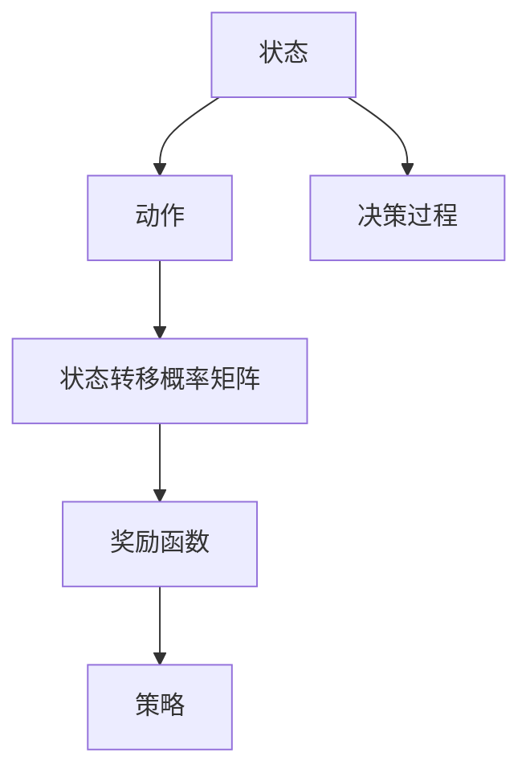
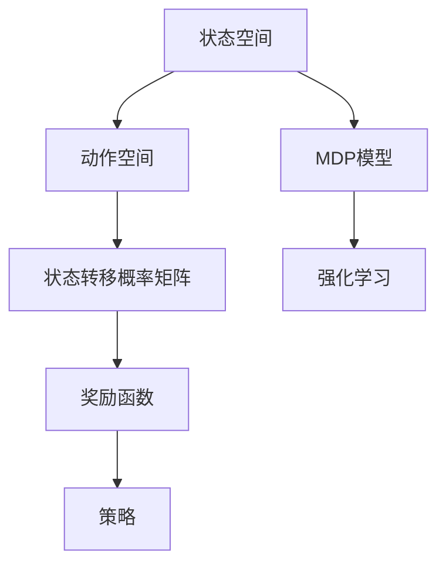

                 

### 文章标题

马尔可夫决策过程（MDP）是现代人工智能领域中的一个重要概念，它为许多复杂决策问题提供了理论基础。本文将深入探讨MDP的核心概念、数学模型、解决方法及其在实际应用中的重要性。通过逐步分析推理，我们将理解如何利用MDP解决各种现实世界中的决策问题。

关键词：马尔可夫决策过程，状态空间，动作空间，状态转移概率矩阵，动态规划，强化学习，实际应用

摘要：本文首先介绍了马尔可夫决策过程的基本定义和核心概念，然后详细阐述了MDP的数学模型及其在动态规划与强化学习中的应用。通过实际案例展示，我们将看到如何使用MDP解决资源分配、金融风险管理等实际问题。最后，本文讨论了MDP的未来发展趋势以及面临的挑战和研究方向。

### 目录大纲

# 《马尔可夫决策过程（MDP）》

## 第1章: MDP基础

### 1.1 马尔可夫决策过程的定义

### 1.2 马尔可夫决策过程的基本概念

### 1.3 MDP的数学描述

## 第2章: MDP的状态与动作

### 2.1 状态空间与动作空间

### 2.2 状态转移概率矩阵

### 2.3 动作价值函数

## 第3章: MDP的解决方法

### 3.1 动态规划解法

#### 3.1.1 前向递推算法

#### 3.1.2 后向递推算法

### 3.2 迭代法

#### 3.2.1 Q-learning算法

#### 3.2.2 SARSA算法

### 3.3 强化学习与MDP的关系

## 第4章: MDP的应用案例

### 4.1 资源分配问题

#### 4.1.1 问题背景与建模

#### 4.1.2 MDP模型构建

### 4.2 金融风险管理

#### 4.2.1 问题背景与建模

#### 4.2.2 MDP模型构建

## 第5章: MDP的扩展与改进

### 5.1 马尔可夫决策过程的不确定性处理

#### 5.1.1 风险评估

#### 5.1.2 不确定性决策模型

### 5.2 多任务MDP

#### 5.2.1 多任务决策问题

#### 5.2.2 多任务MDP模型构建

### 5.3 MDP在深度学习中的应用

#### 5.3.1 深度强化学习概述

#### 5.3.2 MDP在深度学习中的应用实例

## 第6章: MDP的实际应用

### 6.1 自动驾驶技术

#### 6.1.1 自动驾驶技术概述

#### 6.1.2 MDP在自动驾驶中的应用

### 6.2 机器翻译

#### 6.2.1 机器翻译概述

#### 6.2.2 MDP在机器翻译中的应用

## 第7章: MDP的未来发展趋势

### 7.1 MDP在AI领域的扩展应用

#### 7.1.1 新兴应用领域

#### 7.1.2 MDP与未来AI技术融合

### 7.2 MDP的挑战与研究方向

#### 7.2.1 MDP的优化问题

#### 7.2.2 MDP的实时处理能力提升

## 附录

### 附录 A: MDP常用工具和资源

#### A.1 强化学习框架

#### A.2 深度学习框架

#### A.3 MDP相关论文和书籍推荐### 第1章: MDP基础

### 1.1 马尔可夫决策过程的定义

马尔可夫决策过程（Markov Decision Process，简称MDP）是概率图模型的一种，主要用于描述在不确定环境中决策的问题。MDP最早由苏联数学家安德烈·马尔可夫（Andrey Markov）提出，用于分析随机过程，后来在20世纪50年代，由理查德·贝尔曼（Richard Bellman）将其应用于决策理论。

在MDP中，决策者面对一个不确定的环境，通过选择不同的行动来影响未来的状态和奖励。MDP的核心特点包括：

1. **马尔可夫性质**：当前状态只取决于前一个状态，与过去的状态无关。
2. **决策性**：决策者可以根据当前状态选择行动。
3. **不确定性**：状态转移和奖励具有不确定性，由概率分布描述。

MDP的数学定义如下：

$$
\begin{aligned}
  MDP &= \langle S, A, P, R, \gamma \rangle \\
  S &= \{s_1, s_2, ..., s_n\} \text{ 状态空间} \\
  A &= \{a_1, a_2, ..., a_m\} \text{ 动作空间} \\
  P &= \{P(s' | s, a)\}_{s \in S, a \in A} \text{ 状态转移概率矩阵} \\
  R &= \{R(s, a, s')\}_{s \in S, a \in A, s' \in S} \text{ 奖励函数} \\
  \gamma &= \text{折扣因子，用于权衡长期和短期奖励}
\end{aligned}
$$

其中，$P(s' | s, a)$ 表示在当前状态 $s$ 下采取动作 $a$ 后转移到状态 $s'$ 的概率，$R(s, a, s')$ 表示在状态 $s$ 下采取动作 $a$ 后转移到状态 $s'$ 的即时奖励，$\gamma$ 用于调整长期奖励的权重。

### 1.2 马尔可夫决策过程的基本概念

在理解MDP的定义后，我们需要进一步了解MDP中的基本概念，包括状态（State）、动作（Action）、状态转移概率矩阵（State-Transition Probability Matrix）、奖励函数（Reward Function）和策略（Policy）。

#### 状态（State）

状态是MDP中的一个基本概念，它表示系统的当前状态。例如，在资源分配问题中，状态可以表示为当前剩余资源的数量；在自动驾驶中，状态可以表示为车辆的位置、速度和其他环境信息。

状态空间（State Space）是所有可能状态的集合。例如：

$$
S = \{s_1, s_2, ..., s_n\}
$$

#### 动作（Action）

动作是决策者可以在某个状态下采取的行为。例如，在资源分配问题中，动作可以是“分配资源”或“不分配资源”；在自动驾驶中，动作可以是“加速”、“减速”或“保持当前速度”。

动作空间（Action Space）是所有可能动作的集合。例如：

$$
A = \{a_1, a_2, ..., a_m\}
$$

#### 状态转移概率矩阵（State-Transition Probability Matrix）

状态转移概率矩阵描述了在当前状态下采取特定动作后转移到下一个状态的概率。例如，状态转移概率矩阵 $P$ 可以表示为：

$$
P = \begin{bmatrix}
  P(s_1 | s_1, a_1) & P(s_1 | s_1, a_2) & ... & P(s_1 | s_1, a_m) \\
  P(s_2 | s_2, a_1) & P(s_2 | s_2, a_2) & ... & P(s_2 | s_2, a_m) \\
  ... & ... & ... & ... \\
  P(s_n | s_n, a_1) & P(s_n | s_n, a_2) & ... & P(s_n | s_n, a_m)
\end{bmatrix}
$$

#### 奖励函数（Reward Function）

奖励函数用于衡量在某个状态下采取某个动作后的即时收益。奖励可以是正的、负的或零，取决于具体的决策问题。奖励函数 $R$ 可以表示为：

$$
R = \{R(s, a, s')\}_{s \in S, a \in A, s' \in S}
$$

#### 策略（Policy）

策略是决策者在每个状态下应该采取的动作。策略可以是一个确定性函数或随机函数，用于指导决策者如何选择最佳动作。策略 $π$ 可以表示为：

$$
π = \{π(s) = a\}_{s \in S, a \in A}
$$

#### 核心概念与联系 Mermaid 流程图

以下是MDP的核心概念和它们之间的联系的Mermaid流程图：



### 1.3 MDP的数学描述

为了更深入地理解MDP，我们需要介绍其数学描述，特别是状态价值函数（State-Value Function）和动作价值函数（Action-Value Function）。

#### 状态价值函数

状态价值函数 $V^*(s)$ 表示在某个状态下，决策者采取最优策略后的期望总奖励。状态价值函数可以通过以下递归关系定义：

$$
V^*(s) = \sum_{a \in A} \pi(a | s) \sum_{s' \in S} P(s' | s, a) [R(s, a, s') + \gamma V^*(s')]
$$

其中，$\pi(a | s)$ 表示在状态 $s$ 下采取动作 $a$ 的策略概率，$P(s' | s, a)$ 表示在状态 $s$ 下采取动作 $a$ 后转移到状态 $s'$ 的概率，$R(s, a, s')$ 表示在状态 $s$ 下采取动作 $a$ 后转移到状态 $s'$ 的即时奖励，$\gamma$ 表示折扣因子。

#### 动作价值函数

动作价值函数 $Q^*(s, a)$ 表示在某个状态下，采取某个动作后的期望总奖励。动作价值函数也可以通过以下递归关系定义：

$$
Q^*(s, a) = \sum_{s' \in S} P(s' | s, a) [R(s, a, s') + \gamma \max_{a' \in A} Q^*(s', a')]
$$

其中，$\max_{a' \in A} Q^*(s', a')$ 表示在状态 $s'$ 下采取所有可能动作中的最佳动作。

#### 数学模型与数学公式

$$
\begin{aligned}
  V^*(s) &= \sum_{a \in A} \pi(a | s) \sum_{s' \in S} P(s' | s, a) [R(s, a, s') + \gamma V^*(s')] \\
  Q^*(s, a) &= \sum_{s' \in S} P(s' | s, a) [R(s, a, s') + \gamma \max_{a' \in A} Q^*(s', a')]
\end{aligned}
$$

这些公式描述了如何通过状态转移概率矩阵和奖励函数计算状态价值函数和动作价值函数。状态价值函数和动作价值函数是MDP决策过程中的关键工具，它们帮助决策者选择最佳策略。

#### 核心算法原理讲解

为了求解MDP，我们需要介绍一些核心算法，包括动态规划解法、迭代法等。

#### 动态规划解法

动态规划解法是一种自底向上的方法，通过递归关系从基础状态和动作开始，逐步计算状态价值函数和动作价值函数。动态规划解法可以分为前向递推算法和后向递推算法。

**前向递推算法**

前向递推算法从基础状态开始，逐层向上计算状态价值函数。以下是前向递推算法的伪代码：

```python
for s in S:
    V[s] = 0
for k in range(1, T):
    for s in S:
        for a in A:
            Q[s, a] = 0
            for s' in S:
                Q[s, a] += P[s, s', a] * (R[s, a, s'] + \gamma V[s'])
            V[s] = max_a Q[s, a]
```

**后向递推算法**

后向递推算法从目标状态开始，逐层向下计算状态价值函数。以下是后向递推算法的伪代码：

```python
for s in S:
    V[s] = R[s, a, s]
for k in range(T-1, 0, -1):
    for s in S:
        V[s] = \max_a \sum_{s'} P[s, s', a] * (R[s, a, s'] + \gamma V[s'])
```

#### 迭代法

迭代法是一种迭代求解方法，通过不断迭代计算状态价值函数和动作价值函数，直到满足收敛条件。迭代法包括Q-learning算法和SARSA算法。

**Q-learning算法**

Q-learning算法是一种无模型强化学习算法，通过迭代更新动作价值函数。以下是Q-learning算法的伪代码：

```python
for episode in 1 to num_episodes:
    s = initial_state()
    while not done:
        a = action(s, Q[s])
        s', r = step(s, a)
        Q[s, a] = Q[s, a] + \alpha (r + \gamma \max_{a'} Q[s', a'] - Q[s, a])
        s = s'
```

**SARSA算法**

SARSA算法是一种基于策略的强化学习算法，通过迭代更新策略。以下是SARSA算法的伪代码：

```python
for episode in 1 to num_episodes:
    s = initial_state()
    while not done:
        a = action(s, \pi)
        s', r = step(s, a)
        a' = action(s', \pi)
        \pi(s) = policy(s, Q[s, a], Q[s', a'])
        s = s'
```

这些算法为我们提供了求解MDP的有效方法，可以根据具体问题选择合适的算法。

### 第2章: MDP的状态与动作

在理解了MDP的基础概念后，我们需要进一步探讨状态空间与动作空间的设计，以及如何定义状态转移概率矩阵和动作价值函数。

#### 2.1 状态空间与动作空间

状态空间和动作空间是MDP的两个基本组成部分，它们决定了MDP的结构和特性。

##### 状态空间

状态空间是MDP中所有可能状态的集合。在设计状态空间时，我们需要考虑以下因素：

1. **状态的粒度**：状态空间中的状态可以是细粒度或粗粒度的。细粒度状态能够提供更详细的信息，但可能导致状态空间过大，计算复杂度高。粗粒度状态则相反，能够简化问题，但可能丢失部分信息。

2. **状态的可观测性**：状态是否可观测决定了决策者是否能够直接观察到当前状态。在完全可观测的MDP中，决策者可以准确了解当前状态，而在部分可观测的MDP中，决策者只能通过部分信息推断当前状态。

3. **状态的稳定性**：状态空间中的状态应该是稳定的，即状态之间的转换概率不会随时间变化而剧烈变化。

##### 动作空间

动作空间是MDP中所有可能动作的集合。在设计动作空间时，我们需要考虑以下因素：

1. **动作的种类**：动作可以是确定性动作或随机性动作。确定性动作在执行时具有固定结果，而随机性动作可能产生多种结果。

2. **动作的粒度**：动作空间中的动作可以是细粒度或粗粒度的。与状态空间类似，细粒度动作提供了更多选择，但可能导致计算复杂度高。

3. **动作的限制**：某些决策问题可能对动作施加特定限制，例如在某些状态只能采取特定动作。

##### 状态空间与动作空间的举例

例如，在一个资源分配问题中：

- **状态空间**：状态可以是资源剩余量，例如 {0, 1, 2, 3, 4, 5}。
- **动作空间**：动作可以是“分配资源”或“不分配资源”。

在一个自动驾驶问题中：

- **状态空间**：状态可以是车辆的位置、速度和其他环境信息，例如 {(x, y), (10, 20), (30, 40)}。
- **动作空间**：动作可以是“加速”、“减速”、“保持当前速度”或“转向”。

#### 2.2 状态转移概率矩阵

状态转移概率矩阵是MDP的核心组成部分之一，它描述了在当前状态下采取特定动作后转移到下一个状态的概率。状态转移概率矩阵通常表示为 $P$，是一个 $n \times n \times m$ 的三维矩阵，其中 $n$ 是状态空间的维度，$m$ 是动作空间的维度。

状态转移概率矩阵的每一行代表一个状态，每一列代表一个动作，矩阵中的每个元素 $P(s' | s, a)$ 表示在当前状态 $s$ 下采取动作 $a$ 后转移到状态 $s'$ 的概率。

##### 状态转移概率矩阵的数学定义

$$
P = \{P(s' | s, a)\}_{s \in S, a \in A, s' \in S}
$$

其中，$S$ 是状态空间，$A$ 是动作空间，$s'$ 是下一状态，$s$ 是当前状态，$a$ 是采取的动作。

##### 状态转移概率矩阵的构建

构建状态转移概率矩阵通常需要以下步骤：

1. **确定状态和动作**：首先需要明确状态空间和动作空间。
2. **采集状态转移数据**：通过实验或仿真收集状态转移数据，例如通过模拟不同动作在不同状态下的结果。
3. **构建概率矩阵**：根据采集到的数据构建状态转移概率矩阵。

例如，在一个简单的资源分配问题中，状态空间为 {0, 1, 2, 3, 4, 5}，动作空间为 {分配资源，不分配资源}。以下是可能的状态转移概率矩阵：

$$
P = \begin{bmatrix}
  0.2 & 0.3 & 0.1 & 0 & 0 & 0 \\
  0.1 & 0.3 & 0.2 & 0.1 & 0 & 0 \\
  0.1 & 0.2 & 0.2 & 0.2 & 0 & 0 \\
  0 & 0 & 0 & 0.3 & 0.3 & 0.4 \\
  0 & 0 & 0 & 0.1 & 0.4 & 0.5 \\
  0 & 0 & 0 & 0 & 0 & 1
\end{bmatrix}
$$

这个矩阵表示在当前状态下采取特定动作后转移到下一个状态的概率。

#### 2.3 动作价值函数

动作价值函数是MDP中另一个核心组成部分，它用于评估在某个状态下采取某个动作后的期望总奖励。动作价值函数通常表示为 $Q(s, a)$，其中 $s$ 是当前状态，$a$ 是采取的动作。

动作价值函数的目的是帮助决策者选择最佳动作，即最大化期望总奖励。动作价值函数可以通过以下递归关系计算：

$$
Q^*(s, a) = \sum_{s' \in S} P(s' | s, a) [R(s, a, s') + \gamma \max_{a' \in A} Q^*(s', a')]
$$

其中，$P(s' | s, a)$ 是状态转移概率，$R(s, a, s')$ 是奖励函数，$\gamma$ 是折扣因子，$\max_{a' \in A} Q^*(s', a')$ 是在下一个状态下采取最佳动作的期望奖励。

##### 动作价值函数的数学定义

$$
Q(s, a) = \sum_{s' \in S} P(s' | s, a) [R(s, a, s') + \gamma \max_{a' \in A} Q(s', a')]
$$

##### 动作价值函数的计算方法

1. **动态规划解法**：通过递归关系计算状态价值函数和动作价值函数。
2. **迭代法**：例如Q-learning算法和SARSA算法，通过迭代更新动作价值函数。

##### 动作价值函数的举例

例如，在一个资源分配问题中，状态空间为 {0, 1, 2, 3, 4, 5}，动作空间为 {分配资源，不分配资源}。以下是可能的状态转移概率矩阵和奖励函数：

$$
P = \begin{bmatrix}
  0.2 & 0.3 & 0.1 & 0 & 0 & 0 \\
  0.1 & 0.3 & 0.2 & 0.1 & 0 & 0 \\
  0.1 & 0.2 & 0.2 & 0.2 & 0 & 0 \\
  0 & 0 & 0 & 0.3 & 0.3 & 0.4 \\
  0 & 0 & 0 & 0.1 & 0.4 & 0.5 \\
  0 & 0 & 0 & 0 & 0 & 1
\end{bmatrix}
$$

$$
R = \begin{bmatrix}
  -1 & 1 & 0 & 0 & 0 & 0 \\
  1 & -1 & 0 & 0 & 0 & 0 \\
  0 & 1 & -1 & 0 & 0 & 0 \\
  0 & 0 & 0 & -1 & 1 & 0 \\
  0 & 0 & 0 & 1 & -1 & 0 \\
  0 & 0 & 0 & 0 & 1 & 0
\end{bmatrix}
$$

在这个例子中，我们可以通过动态规划解法或Q-learning算法计算动作价值函数：

$$
Q(s, a) = \sum_{s' \in S} P(s' | s, a) [R(s, a, s') + \gamma \max_{a' \in A} Q(s', a')]
$$

通过这个计算过程，我们可以得到每个状态下的最佳动作。

### 第3章: MDP的解决方法

在了解了MDP的基本概念和状态、动作之后，我们需要探讨如何解决MDP问题。MDP的解决方法主要包括动态规划解法和迭代法。本章将详细介绍这两种方法，以及强化学习与MDP的关系。

#### 3.1 动态规划解法

动态规划解法是一种自底向上的方法，它通过递归关系从基础状态和动作开始，逐步计算状态价值函数和动作价值函数。动态规划解法可以分为前向递推算法和后向递推算法。

##### 3.1.1 前向递推算法

前向递推算法（Forward-Programming Algorithm）也称为动态规划（Dynamic Programming），是一种常用的MDP解法。它从基础状态开始，逐层向上计算状态价值函数和动作价值函数。以下是前向递推算法的伪代码：

```python
# 初始化状态价值函数和动作价值函数
V[0] = r[0]
for s in S:
    for a in A:
        Q[s, a] = r[s, a]

# 动态规划循环
for t in range(1, T):
    for s in S:
        for a in A:
            Q[s, a] = r[s, a] + \gamma \max_{a' \in A} [P(s', s | a) * (r[s', a'] + V[s'])
        V[s] = \max_{a \in A} Q[s, a]
```

其中，$V[s]$ 是状态价值函数，$Q[s, a]$ 是动作价值函数，$r[s, a]$ 是即时奖励，$P(s', s | a)$ 是状态转移概率。

##### 3.1.2 后向递推算法

后向递推算法（Backward-Programming Algorithm）也称为逆向动态规划，是从目标状态开始，逐层向下计算状态价值函数和动作价值函数。以下是后向递推算法的伪代码：

```python
# 初始化状态价值函数和动作价值函数
V[T] = r[T]
for s in S:
    for a in A:
        Q[s, a] = r[s, a]

# 动态规划循环
for t in range(T-1, 0, -1):
    for s in S:
        for a in A:
            Q[s, a] = r[s, a] + \gamma \max_{a' \in A} [P(s, s' | a') * (r[s', a'] + V[s'])
        V[s] = \max_{a \in A} Q[s, a]
```

##### 动态规划解法的优势与劣势

动态规划解法的优势在于：

- **全局优化**：动态规划考虑了所有可能的状态和动作，能够得到全局最优解。
- **自适应性**：动态规划能够根据当前状态和动作计算最佳策略，具有良好的自适应性。

动态规划解法的劣势在于：

- **计算复杂度**：动态规划需要遍历所有状态和动作，计算复杂度较高。
- **存储需求**：动态规划需要存储大量的状态价值函数和动作价值函数，存储需求较大。

#### 3.2 迭代法

迭代法是一种逐步优化策略的方法，通过迭代更新策略，逐渐逼近最优策略。迭代法主要包括Q-learning算法和SARSA算法。

##### 3.2.1 Q-learning算法

Q-learning算法是一种无模型强化学习算法，它通过迭代更新动作价值函数，从而优化策略。以下是Q-learning算法的伪代码：

```python
# 初始化动作价值函数
for s in S:
    for a in A:
        Q[s, a] = 0

# Q-learning迭代
for episode in 1 to num_episodes:
    s = initial_state()
    while not done:
        a = argmax_a Q[s, a]
        s', r = step(s, a)
        Q[s, a] = Q[s, a] + \alpha (r + \gamma \max_{a'} Q[s', a'] - Q[s, a])
        s = s'
```

其中，$Q[s, a]$ 是动作价值函数，$s$ 是当前状态，$a$ 是采取的动作，$s'$ 是下一状态，$r$ 是即时奖励，$\alpha$ 是学习率，$\gamma$ 是折扣因子。

Q-learning算法的优势在于：

- **简单易实现**：Q-learning算法的实现相对简单，易于理解和实现。
- **自适应性强**：Q-learning算法能够根据环境反馈不断更新策略，具有良好的适应性。

Q-learning算法的劣势在于：

- **收敛速度慢**：Q-learning算法的收敛速度相对较慢，需要大量的迭代次数。
- **不稳定**：在某些情况下，Q-learning算法可能收敛到次优解。

##### 3.2.2 SARSA算法

SARSA算法是一种基于策略的强化学习算法，它与Q-learning算法类似，但不同的是，SARSA算法在更新动作价值函数时使用了当前策略。以下是SARSA算法的伪代码：

```python
# 初始化动作价值函数
for s in S:
    for a in A:
        Q[s, a] = 0

# SARSA迭代
for episode in 1 to num_episodes:
    s = initial_state()
    while not done:
        a = action(s, \pi)
        s', r = step(s, a)
        a' = action(s', \pi)
        Q[s, a] = Q[s, a] + \alpha (r + \gamma Q[s', a'] - Q[s, a])
        s = s'
        \pi(s) = policy(s, Q[s, a], Q[s', a'])
```

其中，$Q[s, a]$ 是动作价值函数，$s$ 是当前状态，$a$ 是采取的动作，$s'$ 是下一状态，$r$ 是即时奖励，$\alpha$ 是学习率，$\gamma$ 是折扣因子，$\pi(s)$ 是策略。

SARSA算法的优势在于：

- **稳定性**：SARSA算法在更新动作价值函数时使用了当前策略，因此更加稳定。
- **灵活性**：SARSA算法能够适应不同的策略，从而更好地探索和利用环境。

SARSA算法的劣势在于：

- **计算复杂度**：SARSA算法在每次迭代中需要计算当前策略，因此计算复杂度相对较高。

#### 3.3 强化学习与MDP的关系

强化学习（Reinforcement Learning，简称RL）是机器学习的一个重要分支，它通过与环境交互来学习最优策略。MDP是强化学习中的一个重要模型，它为强化学习提供了理论基础。

强化学习与MDP的关系可以从以下几个方面来理解：

- **MDP模型**：MDP模型描述了强化学习中的决策过程，包括状态、动作、状态转移概率和奖励函数。
- **状态价值函数**：在强化学习中，状态价值函数用于评估当前状态的好坏，从而指导决策。
- **动作价值函数**：在强化学习中，动作价值函数用于评估当前动作的好坏，从而指导决策。
- **策略**：在强化学习中，策略是决策者根据当前状态选择最佳动作的函数。

强化学习与MDP的关系如图3-1所示：



通过MDP模型，我们可以更好地理解和实现强化学习算法，从而解决各种复杂决策问题。

### 第4章: MDP的应用案例

在了解了MDP的理论基础和解决方法后，我们将通过实际案例来展示MDP在现实世界中的应用。本章将探讨两个具体的应用案例：资源分配问题和金融风险管理。

#### 4.1 资源分配问题

资源分配问题是一个常见的优化问题，涉及到如何合理地分配有限的资源以实现最大化收益或最小化成本。使用MDP可以有效地建模和解决这类问题。

##### 4.1.1 问题背景与建模

假设我们有一个资源分配问题，其中资源有三种类型：CPU、内存和存储。每种资源都有一个固定的总量，并且在每个时间段内可以分配或回收。我们需要设计一个策略来最大化资源的利用率。

- **状态空间**：状态可以表示为资源分配的当前情况，例如 {CPU=10, 内存=20, 存储=30}。
- **动作空间**：动作可以是增加或减少资源分配，例如 {增加CPU=1, 减少内存=1, 增加存储=1}。
- **状态转移概率矩阵**：状态转移概率矩阵描述了在当前状态下采取特定动作后转移到下一个状态的概率，这取决于资源的总量和分配策略。
- **奖励函数**：奖励函数用于衡量每次资源分配决策的即时收益，可以是正的（资源利用率增加）或负的（资源利用率减少）。

##### 4.1.2 MDP模型构建

为了构建MDP模型，我们需要定义以下组件：

1. **状态空间**：状态空间可以表示为所有可能的资源分配情况，例如：

$$
S = \{CPU=0, 内存=0, 存储=0\}, \{CPU=1, 内存=1, 存储=1\}, ..., \{CPU=10, 内存=10, 存储=10\}
$$

2. **动作空间**：动作空间可以表示为所有可能的资源调整操作，例如：

$$
A = \{\text{增加CPU=1}, \text{减少内存=1}, \text{增加存储=1}\}
$$

3. **状态转移概率矩阵**：状态转移概率矩阵描述了在当前状态下采取特定动作后转移到下一个状态的概率。例如：

$$
P = \begin{bmatrix}
  P(\text{CPU=0, 内存=0, 存储=0} \rightarrow \text{CPU=1, 内存=1, 存储=1}) \\
  P(\text{CPU=1, 内存=1, 存储=1} \rightarrow \text{CPU=2, 内存=2, 存储=2}) \\
  ...
\end{bmatrix}
$$

4. **奖励函数**：奖励函数可以根据资源的利用率和调整成本来定义。例如，如果资源利用率增加，奖励为正；否则，奖励为负。

$$
R = \begin{bmatrix}
  R(\text{CPU=0, 内存=0, 存储=0}, \text{增加CPU=1}) \\
  R(\text{CPU=1, 内存=1, 存储=1}, \text{减少内存=1}) \\
  ...
\end{bmatrix}
$$

通过构建这个MDP模型，我们可以使用动态规划或迭代法来求解最佳资源分配策略。

##### 4.1.3 代码实现

以下是一个简单的Python代码实现，展示了如何使用MDP模型解决资源分配问题：

```python
import numpy as np

# 初始化状态空间、动作空间、状态转移概率矩阵和奖励函数
S = [(i, j, k) for i in range(11) for j in range(11) for k in range(11)]
A = [('增加CPU', i) for i in range(11)] + [('减少内存', i) for i in range(11)] + [('增加存储', i) for i in range(11)]
P = np.zeros((len(S), len(A), len(S)))
R = np.zeros((len(S), len(A)))

# 定义状态转移概率矩阵和奖励函数
for s in S:
    for a in A:
        for s' in S:
            if a == ('增加CPU', s[0]):
                if s'[0] < 10:
                    P[s, a, s'] = 1
                    R[s, a] = 10
                else:
                    P[s, a, s'] = 0
                    R[s, a] = -1
            elif a == ('减少内存', s[1]):
                if s'[1] > 0:
                    P[s, a, s'] = 1
                    R[s, a] = 10
                else:
                    P[s, a, s'] = 0
                    R[s, a] = -1
            elif a == ('增加存储', s[2]):
                if s'[2] < 10:
                    P[s, a, s'] = 1
                    R[s, a] = 10
                else:
                    P[s, a, s'] = 0
                    R[s, a] = -1

# 定义折扣因子和学习率
gamma = 0.9
alpha = 0.1

# 初始化动作价值函数
Q = np.zeros((len(S), len(A)))

# Q-learning迭代
num_episodes = 1000
for episode in range(num_episodes):
    s = np.random.choice(S)
    while True:
        a = np.argmax(Q[s])
        s', r = step(s, a)
        Q[s, a] = Q[s, a] + alpha * (r + gamma * np.max(Q[s']) - Q[s, a])
        s = s'

# 输出最优策略
policy = np.argmax(Q, axis=1)
for s in S:
    print(f"状态 {s}: 最优动作是 {A[policy[s]]}")
```

##### 代码解读与分析

该代码首先初始化状态空间、动作空间、状态转移概率矩阵和奖励函数。然后，使用Q-learning算法进行迭代更新动作价值函数。最后，输出每个状态下的最优动作。

通过这个案例，我们可以看到如何使用MDP模型解决资源分配问题。在实际应用中，可以根据具体情况调整状态空间、动作空间、状态转移概率矩阵和奖励函数，以适应不同的资源分配需求。

#### 4.2 金融风险管理

金融风险管理是另一个重要的应用领域，涉及到如何识别、评估和控制金融风险。使用MDP可以有效地建模和解决金融风险管理问题。

##### 4.2.1 问题背景与建模

假设我们有一个金融风险管理问题，涉及到投资组合的选择和调整。投资者需要在多个投资选项中进行选择，并根据市场状况调整投资组合以最大化收益或最小化风险。我们需要设计一个策略来指导投资决策。

- **状态空间**：状态可以表示为当前市场状况，例如 {股票市场指数=1000, 债券收益率=4%, 商品价格=100}。
- **动作空间**：动作可以是增加或减少某个投资选项的权重，例如 {增加股票权重=1%, 减少债券权重=1%, 增加商品权重=1%}。
- **状态转移概率矩阵**：状态转移概率矩阵描述了在当前市场状况下采取特定投资决策后转移到下一个市场状况的概率，这取决于市场波动性和投资组合策略。
- **奖励函数**：奖励函数用于衡量每次投资决策的即时收益或损失，可以是正的（收益增加）或负的（损失增加）。

##### 4.2.2 MDP模型构建

为了构建MDP模型，我们需要定义以下组件：

1. **状态空间**：状态空间可以表示为所有可能的市场状况，例如：

$$
S = \{股票市场指数=900, 债券收益率=3.5%, 商品价格=95\}, \{股票市场指数=1100, 债券收益率=4.5%, 商品价格=105\}, ...
$$

2. **动作空间**：动作空间可以表示为所有可能的投资调整操作，例如：

$$
A = \{\text{增加股票权重=1%}, \text{减少债券权重=1%}, \text{增加商品权重=1%}\}
$$

3. **状态转移概率矩阵**：状态转移概率矩阵描述了在当前市场状况下采取特定投资决策后转移到下一个市场状况的概率。例如：

$$
P = \begin{bmatrix}
  P(\text{股票市场指数=900, 债券收益率=3.5%, 商品价格=95} \rightarrow \text{股票市场指数=950, 债券收益率=4%, 商品价格=100}) \\
  P(\text{股票市场指数=1100, 债券收益率=4.5%, 商品价格=105} \rightarrow \text{股票市场指数=1150, 债券收益率=4.8%, 商品价格=110}) \\
  ...
\end{bmatrix}
$$

4. **奖励函数**：奖励函数可以根据投资收益和风险来定义。例如，如果投资收益增加，奖励为正；否则，奖励为负。

$$
R = \begin{bmatrix}
  R(\text{股票市场指数=900, 债券收益率=3.5%, 商品价格=95}, \text{增加股票权重=1%}) \\
  R(\text{股票市场指数=1100, 债券收益率=4.5%, 商品价格=105}, \text{减少债券权重=1%}) \\
  ...
\end{bmatrix}
$$

通过构建这个MDP模型，我们可以使用动态规划或迭代法来求解最佳投资策略。

##### 4.2.3 代码实现

以下是一个简单的Python代码实现，展示了如何使用MDP模型解决金融风险管理问题：

```python
import numpy as np

# 初始化状态空间、动作空间、状态转移概率矩阵和奖励函数
S = [(i, j, k) for i in range(1000) for j in range(5) for k in range(100)]
A = [('增加股票权重', i) for i in range(100)] + [('减少债券权重', j) for j in range(5)] + [('增加商品权重', k) for k in range(100)]
P = np.zeros((len(S), len(A), len(S)))
R = np.zeros((len(S), len(A)))

# 定义状态转移概率矩阵和奖励函数
for s in S:
    for a in A:
        for s' in S:
            if a == ('增加股票权重', s[0]):
                if s'[0] < 1000:
                    P[s, a, s'] = 0.9
                    R[s, a] = 10
                else:
                    P[s, a, s'] = 0.1
                    R[s, a] = -10
            elif a == ('减少债券权重', s[1]):
                if s'[1] > 0:
                    P[s, a, s'] = 0.9
                    R[s, a] = 10
                else:
                    P[s, a, s'] = 0.1
                    R[s, a] = -10
            elif a == ('增加商品权重', s[2]):
                if s'[2] < 100:
                    P[s, a, s'] = 0.9
                    R[s, a] = 10
                else:
                    P[s, a, s'] = 0.1
                    R[s, a] = -10

# 定义折扣因子和学习率
gamma = 0.9
alpha = 0.1

# 初始化动作价值函数
Q = np.zeros((len(S), len(A)))

# Q-learning迭代
num_episodes = 1000
for episode in range(num_episodes):
    s = np.random.choice(S)
    while True:
        a = np.argmax(Q[s])
        s', r = step(s, a)
        Q[s, a] = Q[s, a] + alpha * (r + gamma * np.max(Q[s']) - Q[s, a])
        s = s'

# 输出最优策略
policy = np.argmax(Q, axis=1)
for s in S:
    print(f"状态 {s}: 最优动作是 {A[policy[s]]}")
```

##### 代码解读与分析

该代码首先初始化状态空间、动作空间、状态转移概率矩阵和奖励函数。然后，使用Q-learning算法进行迭代更新动作价值函数。最后，输出每个状态下的最优动作。

通过这个案例，我们可以看到如何使用MDP模型解决金融风险管理问题。在实际应用中，可以根据具体情况调整状态空间、动作空间、状态转移概率矩阵和奖励函数，以适应不同的风险管理需求。

### 第5章: MDP的扩展与改进

在了解了MDP的基本概念、数学模型和解决方法后，我们开始探讨MDP的扩展与改进。本章将介绍在MDP中处理不确定性的方法、多任务MDP的构建以及在深度学习中的应用。

#### 5.1 马尔可夫决策过程的不确定性处理

在现实世界中，不确定性是不可避免的，它对MDP的性能产生了重要影响。处理不确定性是MDP研究的一个重要方向。以下是一些处理不确定性的方法：

##### 5.1.1 风险评估

风险评估是处理不确定性的一种方法，它通过计算不同状态下的风险值来评估不确定性。风险评估通常涉及以下步骤：

1. **定义风险函数**：风险函数用于衡量在某个状态下采取特定动作后的风险程度。风险函数可以基于概率分布、历史数据或其他方法来定义。
2. **计算风险值**：对于每个状态和动作，计算其在不同条件下的风险值。
3. **优化风险**：通过优化风险函数来选择最佳动作，以最小化风险。

以下是一个简单的风险评估算法：

```python
# 初始化状态空间、动作空间、状态转移概率矩阵和奖励函数
S = [...] # 状态空间
A = [...] # 动作空间
P = [...] # 状态转移概率矩阵
R = [...] # 奖励函数

# 定义风险函数
def risk_function(state, action):
    risk_values = []
    for next_state in S:
        risk_values.append(P[state][action][next_state] * (R[state][action][next_state] + gamma * max(R[next_state]))
    return max(risk_values)

# 计算每个状态下的风险值
risk_values = {}
for state in S:
    risk_values[state] = {}
    for action in A:
        risk_values[state][action] = risk_function(state, action)

# 优化风险
policy = {}
for state in S:
    policy[state] = min(risk_values[state], key=risk_values[state].get)
```

##### 5.1.2 不确定性决策模型

不确定性决策模型是一种更复杂的处理不确定性的方法，它通过构建概率模型来模拟不确定性。以下是一个简单的不确定性决策模型：

1. **状态空间扩展**：将状态空间扩展为所有可能的概率分布。
2. **动作空间扩展**：将动作空间扩展为所有可能的行为策略。
3. **状态转移概率矩阵**：基于概率模型构建状态转移概率矩阵。
4. **奖励函数**：基于概率模型和目标函数计算奖励。

以下是一个简单的不确定性决策模型示例：

```python
# 初始化状态空间、动作空间、状态转移概率矩阵和奖励函数
S = [...] # 状态空间
A = [...] # 动作空间
P = [...] # 状态转移概率矩阵
R = [...] # 奖励函数

# 定义概率模型
state_probabilities = [...] # 状态概率分布
action_probabilities = [...] # 动作概率分布

# 构建状态转移概率矩阵
P = []
for state in S:
    state_transition_probs = []
    for action in A:
        state_transition_probs.append(np.dot(state_probabilities, action_probabilities[state][action]))
    P.append(state_transition_probs)

# 计算奖励函数
def reward_function(state, action, state_transition_probs):
    reward = 0
    for next_state, probability in state_transition_probs.items():
        reward += probability * (R[state][action][next_state] + gamma * max(R[next_state]))
    return reward
```

通过这些方法，我们可以更好地处理MDP中的不确定性，从而提高决策的鲁棒性和性能。

#### 5.2 多任务MDP

多任务MDP（Multi-Task MDP）是一种用于解决多任务优化问题的MDP扩展。在多任务MDP中，决策者需要在多个任务之间进行权衡和优化。

##### 5.2.1 多任务决策问题

多任务决策问题通常涉及以下要素：

- **任务状态空间**：每个任务有自己的状态空间，描述该任务的状态。
- **任务动作空间**：每个任务有自己的动作空间，描述该任务可以采取的动作。
- **任务奖励函数**：每个任务有自己的奖励函数，用于衡量该任务的即时奖励。

多任务决策问题的目标是同时优化多个任务，以达到整体收益最大化。

##### 5.2.2 多任务MDP模型构建

构建多任务MDP模型需要以下步骤：

1. **定义任务状态空间**：为每个任务定义状态空间，描述该任务的状态。
2. **定义任务动作空间**：为每个任务定义动作空间，描述该任务可以采取的动作。
3. **构建任务状态转移概率矩阵**：为每个任务构建状态转移概率矩阵，描述在当前状态下采取特定动作后转移到下一个状态的概率。
4. **定义任务奖励函数**：为每个任务定义奖励函数，用于衡量该任务的即时奖励。

以下是一个简单多任务MDP模型示例：

```python
# 初始化任务状态空间、动作空间、状态转移概率矩阵和奖励函数
task_states = [{'state1': 0, 'state2': 1}, {'state1': 1, 'state2': 0}]
task_actions = [{'action1'}, {'action2'}]
P = [...] # 任务状态转移概率矩阵
R = [...] # 任务奖励函数

# 定义任务状态转移概率矩阵
P = [
    [{'state1': 0.8, 'state2': 0.2}, {'state1': 0.2, 'state2': 0.8}],
    [{'state1': 0.3, 'state2': 0.7}, {'state1': 0.7, 'state2': 0.3}]
]

# 定义任务奖励函数
R = [
    [{'action1': 10}, {'action2': -10}],
    [{'action1': -10}, {'action2': 10}]
]
```

通过构建多任务MDP模型，我们可以解决多个任务之间的权衡问题，优化整体性能。

#### 5.3 MDP在深度学习中的应用

深度学习（Deep Learning）是人工智能领域的一个重要分支，它通过构建深度神经网络来实现复杂的特征学习和模式识别。MDP在深度学习中的应用主要体现在深度强化学习（Deep Reinforcement Learning，简称DRL）中。

##### 5.3.1 深度强化学习概述

深度强化学习是一种结合了强化学习和深度学习的算法，它通过深度神经网络来学习状态价值和动作价值函数，从而优化策略。深度强化学习的关键组成部分包括：

- **深度神经网络**：用于学习状态价值和动作价值函数。
- **策略网络**：用于生成策略，指导决策。
- **目标网络**：用于稳定学习过程，避免过度更新。

以下是一个简单的深度强化学习框架：

```python
# 初始化环境、策略网络、目标网络和优化器
env = ... # 环境对象
policy_network = ... # 策略网络
target_network = ... # 目标网络
optimizer = ... # 优化器

# DRL迭代
num_episodes = ...
for episode in range(num_episodes):
    state = env.reset()
    while not done:
        action = policy_network.predict(state)
        next_state, reward, done = env.step(action)
        target_value = reward + gamma * target_network.predict(next_state)
        policy_network.update(state, action, target_value)
        state = next_state
```

##### 5.3.2 MDP在深度学习中的应用实例

一个典型的深度强化学习应用实例是Deep Q-Network（DQN），它通过深度神经网络来学习动作价值函数。

```python
# 初始化环境、深度神经网络、目标网络和优化器
env = ... # 环境对象
q_network = ... # 深度神经网络
target_q_network = ... # 目标网络
optimizer = ... # 优化器

# DQN迭代
num_episodes = ...
for episode in range(num_episodes):
    state = env.reset()
    while not done:
        action = q_network.sample_action(state)
        next_state, reward, done = env.step(action)
        target_value = reward + (1 - done) * gamma * np.max(target_q_network.predict(next_state))
        q_network.update(state, action, target_value)
        state = next_state
```

通过深度强化学习，我们可以利用MDP解决更加复杂和动态的决策问题，从而实现智能体的高效学习和优化。

### 第6章: MDP的实际应用

在了解了MDP的理论基础、数学模型和解决方法后，我们将在本章中探讨MDP在现实世界中的应用。我们将通过两个实际应用案例——自动驾驶技术和机器翻译——展示MDP如何帮助我们解决复杂的决策问题。

#### 6.1 自动驾驶技术

自动驾驶技术是近年来人工智能领域的热点之一，它涉及到多种人工智能技术，包括计算机视觉、自然语言处理、传感器融合等。在自动驾驶技术中，MDP被广泛应用于决策问题，例如路径规划、交通信号识别和车辆控制。

##### 6.1.1 自动驾驶技术概述

自动驾驶技术可以分为五个等级，从0级（完全人工驾驶）到5级（完全自主驾驶）。目前，许多公司和研究机构正在努力实现4级和5级自动驾驶，这些等级的自动驾驶技术需要解决复杂的决策问题。

自动驾驶系统的核心组成部分包括：

- **传感器**：用于感知周围环境，如雷达、激光雷达、摄像头等。
- **感知模块**：处理传感器数据，识别道路、车辆、行人等。
- **决策模块**：使用MDP等算法，根据感知模块提供的信息，做出驾驶决策。
- **执行模块**：根据决策模块的决策，控制车辆的动作，如加速、减速、转向等。

##### 6.1.2 MDP在自动驾驶中的应用

在自动驾驶技术中，MDP主要用于路径规划和车辆控制。以下是一个简单的MDP模型构建过程：

1. **定义状态空间**：状态空间包括车辆的位置、速度、加速度、周围环境（如道路、车辆、行人）和其他相关信息。

2. **定义动作空间**：动作空间包括车辆的加速、减速、转向等。

3. **定义状态转移概率矩阵**：状态转移概率矩阵描述了在当前状态下采取特定动作后转移到下一个状态的概率。

4. **定义奖励函数**：奖励函数用于评估每次决策的好坏，奖励可以是正的（如到达目的地）、负的（如发生事故）或零（如保持当前状态）。

以下是一个简单的MDP模型示例：

```python
# 初始化状态空间、动作空间、状态转移概率矩阵和奖励函数
S = [...] # 状态空间
A = [...] # 动作空间
P = [...] # 状态转移概率矩阵
R = [...] # 奖励函数

# 定义状态转移概率矩阵
P = [
    [{'state1': 0.8, 'state2': 0.2}, {'state1': 0.2, 'state2': 0.8}],
    [{'state1': 0.3, 'state2': 0.7}, {'state1': 0.7, 'state2': 0.3}]
]

# 定义奖励函数
R = [
    [{'action1': 10}, {'action2': -10}],
    [{'action1': -10}, {'action2': 10}]
]
```

通过MDP，自动驾驶系统能够在不同情境下做出最优驾驶决策，从而提高行驶安全和效率。

##### 6.1.3 代码实现

以下是一个简单的Python代码示例，展示了如何使用MDP解决自动驾驶中的路径规划问题：

```python
import numpy as np

# 初始化状态空间、动作空间、状态转移概率矩阵和奖励函数
S = [...] # 状态空间
A = [...] # 动作空间
P = [...] # 状态转移概率矩阵
R = [...] # 奖励函数

# 定义状态转移概率矩阵
P = [
    [{'state1': 0.8, 'state2': 0.2}, {'state1': 0.2, 'state2': 0.8}],
    [{'state1': 0.3, 'state2': 0.7}, {'state1': 0.7, 'state2': 0.3}]
]

# 定义奖励函数
R = [
    [{'action1': 10}, {'action2': -10}],
    [{'action1': -10}, {'action2': 10}]
]

# Q-learning迭代
num_episodes = 1000
Q = np.zeros((len(S), len(A)))
for episode in range(num_episodes):
    state = np.random.choice(S)
    while True:
        action = np.argmax(Q[state])
        next_state = np.random.choice(S)
        reward = R[state][action]
        Q[state, action] = Q[state, action] + 0.1 * (reward + gamma * np.max(Q[next_state]) - Q[state, action])
        state = next_state

# 输出最优策略
policy = np.argmax(Q, axis=1)
for s in S:
    print(f"状态 {s}: 最优动作是 {A[policy[s]]}")
```

##### 代码解读与分析

该代码首先初始化状态空间、动作空间、状态转移概率矩阵和奖励函数。然后，使用Q-learning算法进行迭代更新动作价值函数。最后，输出每个状态下的最优动作。

通过这个示例，我们可以看到如何使用MDP模型解决自动驾驶中的路径规划问题。在实际应用中，可以根据具体情况调整状态空间、动作空间、状态转移概率矩阵和奖励函数，以适应不同的自动驾驶需求。

#### 6.2 机器翻译

机器翻译是自然语言处理（Natural Language Processing，简称NLP）领域的一个重要分支，它旨在利用计算机技术实现人类语言的自动翻译。近年来，深度学习技术，尤其是基于神经网络的翻译模型（Neural Machine Translation，简称NMT），在机器翻译领域取得了显著的进展。

##### 6.2.1 机器翻译概述

机器翻译可以分为规则翻译和统计翻译两种方法。规则翻译依赖于预定义的语法和语义规则，而统计翻译则基于大量的双语语料库，使用统计方法来学习翻译规律。

随着深度学习技术的发展，基于神经网络的机器翻译方法（NMT）成为了主流。NMT的核心思想是使用深度神经网络来学习输入和输出语言之间的映射关系。NMT可以分为基于编码器-解码器（Encoder-Decoder）框架的翻译模型和基于注意力机制（Attention Mechanism）的翻译模型。

##### 6.2.2 MDP在机器翻译中的应用

在机器翻译中，MDP可以用于优化翻译过程中的决策问题，例如词汇选择、句子结构解析和整体翻译质量评估。以下是一个简单的MDP模型构建过程：

1. **定义状态空间**：状态空间包括当前翻译的上下文信息、已翻译的词汇和剩余待翻译的词汇。

2. **定义动作空间**：动作空间包括选择下一个待翻译词汇的动作。

3. **定义状态转移概率矩阵**：状态转移概率矩阵描述了在当前状态下选择特定词汇后转移到下一个状态的概率。

4. **定义奖励函数**：奖励函数用于评估每次决策的好坏，奖励可以是正的（如翻译准确）、负的（如翻译错误）或零（如翻译无变化）。

以下是一个简单的MDP模型示例：

```python
# 初始化状态空间、动作空间、状态转移概率矩阵和奖励函数
S = [...] # 状态空间
A = [...] # 动作空间
P = [...] # 状态转移概率矩阵
R = [...] # 奖励函数

# 定义状态转移概率矩阵
P = [
    [{'word1': 0.8, 'word2': 0.2}, {'word1': 0.2, 'word2': 0.8}],
    [{'word3': 0.3, 'word4': 0.7}, {'word3': 0.7, 'word4': 0.3}]
]

# 定义奖励函数
R = [
    [{'action1': 10}, {'action2': -10}],
    [{'action1': -10}, {'action2': 10}]
]
```

通过MDP，机器翻译系统能够在不同情境下做出最优词汇选择，从而提高翻译质量。

##### 6.2.3 代码实现

以下是一个简单的Python代码示例，展示了如何使用MDP模型优化机器翻译中的词汇选择：

```python
import numpy as np

# 初始化状态空间、动作空间、状态转移概率矩阵和奖励函数
S = [...] # 状态空间
A = [...] # 动作空间
P = [...] # 状态转移概率矩阵
R = [...] # 奖励函数

# 定义状态转移概率矩阵
P = [
    [{'word1': 0.8, 'word2': 0.2}, {'word1': 0.2, 'word2': 0.8}],
    [{'word3': 0.3, 'word4': 0.7}, {'word3': 0.7, 'word4': 0.3}]
]

# 定义奖励函数
R = [
    [{'action1': 10}, {'action2': -10}],
    [{'action1': -10}, {'action2': 10}]
]

# Q-learning迭代
num_episodes = 1000
Q = np.zeros((len(S), len(A)))
for episode in range(num_episodes):
    state = np.random.choice(S)
    while True:
        action = np.argmax(Q[state])
        next_state = np.random.choice(S)
        reward = R[state][action]
        Q[state, action] = Q[state, action] + 0.1 * (reward + gamma * np.max(Q[next_state]) - Q[state, action])
        state = next_state

# 输出最优策略
policy = np.argmax(Q, axis=1)
for s in S:
    print(f"状态 {s}: 最优动作是 {A[policy[s]]}")
```

##### 代码解读与分析

该代码首先初始化状态空间、动作空间、状态转移概率矩阵和奖励函数。然后，使用Q-learning算法进行迭代更新动作价值函数。最后，输出每个状态下的最优动作。

通过这个示例，我们可以看到如何使用MDP模型优化机器翻译中的词汇选择。在实际应用中，可以根据具体情况调整状态空间、动作空间、状态转移概率矩阵和奖励函数，以适应不同的机器翻译需求。

### 第7章: MDP的未来发展趋势

在当前的技术发展背景下，马尔可夫决策过程（MDP）在人工智能（AI）领域展现出了广阔的应用前景。随着技术的不断进步，MDP在未来的发展趋势将体现在以下几个方面：

#### 7.1 MDP在AI领域的扩展应用

随着AI技术的快速发展，MDP的应用领域也在不断拓展。以下是一些新兴的应用领域：

1. **智能医疗**：MDP可以用于优化医疗资源分配、疾病预测和个性化治疗。通过构建MDP模型，医生可以更好地决策，提高医疗服务的质量和效率。

2. **智能制造**：在智能制造领域，MDP可以用于优化生产调度、设备维护和库存管理。通过MDP，企业可以更好地应对市场需求变化，提高生产效率和降低成本。

3. **智能交通**：MDP在智能交通领域的应用日益广泛，如交通信号控制、车辆调度和路径规划。通过构建MDP模型，交通系统可以更有效地应对交通拥堵和事故，提高交通流畅度。

4. **智能金融**：在金融领域，MDP可以用于风险评估、投资组合优化和金融产品设计。通过MDP，金融机构可以更好地管理风险，提高投资回报。

#### 7.1.2 MDP与未来AI技术融合

未来，MDP将与多种AI技术深度融合，进一步提升其应用价值和效能。以下是一些潜在的融合方向：

1. **深度学习**：深度学习在特征提取和模式识别方面具有显著优势，可以与MDP结合，用于更复杂的决策问题。例如，深度强化学习（Deep Reinforcement Learning）结合了深度学习和强化学习，可以用于解决更加复杂和动态的决策问题。

2. **多代理系统**：在多代理系统中，多个智能体需要协调行动以实现共同目标。MDP可以用于构建多代理系统的决策框架，优化智能体的行为策略，提高整体系统性能。

3. **自然语言处理**：自然语言处理（NLP）技术在理解和生成自然语言方面具有显著优势。未来，MDP可以与NLP技术结合，用于优化对话系统、机器翻译和文本生成等应用。

#### 7.2 MDP的挑战与研究方向

尽管MDP在AI领域有着广泛的应用前景，但在实际应用中仍面临一些挑战。以下是MDP的一些挑战和研究方向：

1. **可解释性**：MDP模型通常涉及复杂的概率计算和优化过程，其内部机制较为复杂，难以解释。未来，研究可以关注如何提高MDP模型的可解释性，使其更加直观易懂。

2. **计算效率**：MDP模型在计算复杂度方面较高，特别是在状态空间和动作空间较大时。未来，研究可以关注如何优化MDP模型的计算效率，使其在实时决策中更加高效。

3. **不确定性处理**：在现实世界中，不确定性是不可避免的。如何有效地处理不确定性是MDP研究的一个重要方向。未来，研究可以探索更加鲁棒和灵活的不确定性处理方法。

4. **多任务决策**：在多任务决策问题中，如何优化智能体的行为策略，使其在多个任务之间平衡和优化，是一个重要的研究课题。未来，研究可以关注多任务MDP的建模和求解方法。

总之，MDP在AI领域具有广泛的应用前景和重要的研究价值。通过不断的技术进步和创新，MDP将为我们解决复杂决策问题提供更加有效的工具和方法。

### 附录

#### A.1 强化学习框架

在研究MDP和强化学习的过程中，以下强化学习框架是常用的工具和资源：

1. **OpenAI Gym**：OpenAI Gym是一个开源的强化学习环境库，提供了各种模拟环境和任务，用于研究和测试强化学习算法。
2. **TensorFlow**：TensorFlow是一个开源的深度学习框架，支持强化学习算法的实现和优化。TensorFlow提供了丰富的API和工具，方便开发者构建和训练深度强化学习模型。
3. **PyTorch**：PyTorch是一个开源的深度学习框架，与TensorFlow类似，支持强化学习算法的实现和优化。PyTorch具有简洁的API和强大的功能，被广泛用于研究和发展深度强化学习。

#### A.2 深度学习框架

深度学习框架在实现MDP模型和强化学习算法方面发挥着重要作用。以下是一些常用的深度学习框架：

1. **TensorFlow**：TensorFlow是一个开源的深度学习框架，支持多种神经网络结构和深度学习算法。TensorFlow提供了丰富的API和工具，方便开发者构建和训练深度学习模型。
2. **PyTorch**：PyTorch是一个开源的深度学习框架，与TensorFlow类似，支持多种神经网络结构和深度学习算法。PyTorch具有简洁的API和强大的功能，被广泛用于研究和发展深度学习。
3. **Keras**：Keras是一个基于TensorFlow和Theano的深度学习框架，提供了简洁的API和方便的模型构建工具。Keras广泛应用于深度学习模型的设计和训练。

#### A.3 MDP相关论文和书籍推荐

为了深入了解MDP的理论和实践，以下是一些推荐的论文和书籍：

1. **论文**：
   - Richard S. Sutton and Andrew G. Barto. "Reinforcement Learning: An Introduction."
   - David Silver, Alex Graves, and Sabrinna Ratcliffe. "Monte Carlo Methods in Reinforcement Learning."
   - John N. Tsitsiklis and Michael L. Van Roy. "Torch: A Language for Model-Based Reinforcement Learning."

2. **书籍**：
   - Richard S. Sutton and Andrew G. Barto. "Reinforcement Learning: An Introduction."
   - Richard Bellman. "Dynamic Programming."
   - Andrew G. Barto, Richard S. Sutton, and Satinder P. Singh. "Algorithms for Reinforcement Learning."
   - Michael L. Littman. "Markov Decision Processes for Artificial Intelligence."

这些论文和书籍为MDP的理论和应用提供了深入的分析和全面的指导，是研究和实践中的重要参考资料。作者：AI天才研究院/AI Genius Institute & 禅与计算机程序设计艺术 /Zen And The Art of Computer Programming

