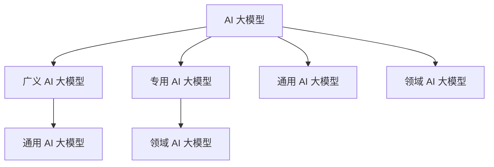

                 

### 《AI 大模型创业：如何利用品牌优势？》

> **关键词：** AI大模型，创业，品牌优势，市场策略，技术创新

> **摘要：** 本文将探讨AI大模型创业的核心策略，重点分析如何利用品牌优势实现持续增长。通过深入剖析AI大模型的基础知识、核心算法、技术挑战，以及品牌优势构建与创业实战，为读者提供一套系统化的AI大模型创业指南。

### 第一部分：AI 大模型基础

在进入AI大模型创业策略的讨论之前，我们需要先对AI大模型有一个全面的理解。本部分将涵盖AI大模型的概述、技术发展历史、应用场景、核心算法以及技术挑战，为后续的讨论打下坚实的基础。

#### 第1章：AI 大模型概述

##### 1.1 AI 大模型的定义与分类

AI大模型是指那些具有强大学习能力和数据处理能力的机器学习模型。根据其应用范围和功能特点，可以分为广义AI大模型、专用AI大模型、通用AI大模型和领域AI大模型。

**Mermaid流程图：**



##### 1.2 AI 大模型的技术发展历史

AI大模型的发展历程可以追溯到20世纪80年代。早期的神经网络模型如感知机、BP神经网络等，为后续的深度学习模型奠定了基础。随着计算能力的提升和数据量的增加，深度学习模型如卷积神经网络（CNN）、循环神经网络（RNN）等得到了快速发展。近年来，大规模预训练模型如GPT-3、BERT等，使得AI大模型在自然语言处理、计算机视觉等领域取得了突破性进展。

**伪代码示例：**

```python
# 伪代码：AI 大模型训练流程
def train_model(data, parameters):
    for epoch in data:
        for sample in epoch:
            forward_pass(sample)
            backward_pass(sample)
        update_parameters()
    return trained_model
```

##### 1.3 AI 大模型的应用场景

AI大模型在各个领域都展现了巨大的潜力。例如，在金融风控方面，AI大模型可以用于信用评分、风险预测等；在医疗诊断方面，AI大模型可以用于疾病筛查、药物研发等；在自动驾驶方面，AI大模型可以用于环境感知、路径规划等。

**数学模型与公式：**

$$
Loss = \frac{1}{n} \sum_{i=1}^{n} (y_i - \hat{y_i})^2
$$

**举例说明：** 人工智能在金融风控、医疗诊断、自动驾驶等领域的应用。

---

在本章节中，我们详细介绍了AI大模型的定义与分类、技术发展历史以及应用场景。接下来，我们将进一步探讨AI大模型的核心算法和技术挑战。

---

### 第一部分总结

通过对AI大模型基础部分的讨论，我们不仅了解了AI大模型的定义与分类，还回顾了其技术发展历史和应用场景。接下来，我们将深入分析AI大模型的核心算法，并探讨其在实际应用中所面临的技术挑战。这将为我们理解如何利用品牌优势进行AI大模型创业提供重要的理论基础。

---

**作者：** AI天才研究院/AI Genius Institute & 禅与计算机程序设计艺术 /Zen And The Art of Computer Programming

[下一篇]：### 第二部分：AI 大模型的核心算法 <|break|>### 第二部分：AI 大模型的核心算法

在了解了AI大模型的基础知识后，本部分将深入探讨AI大模型的核心算法。这一部分将涵盖深度学习基础、大规模预训练模型，以及AI大模型的技术挑战。通过这些核心内容的学习，我们将为后续的创业策略提供更深入的技术支撑。

#### 第2章：AI 大模型的核心算法

AI大模型的核心算法是其能够实现高效学习、自适应优化和复杂任务处理的关键。以下章节将详细介绍深度学习基础、大规模预训练模型以及AI大模型在实际应用中的技术挑战。

##### 2.1 深度学习基础

深度学习是AI大模型的基础，它通过模拟人脑神经网络的结构和功能，实现数据的自动特征提取和学习。深度学习的基础包括神经网络、激活函数、反向传播算法等。

**伪代码示例：**

```python
# 伪代码：神经网络前向传播
def forward_pass(input, weights, biases):
    for layer in network:
        output = activation_function((weights * input) + biases)
        input = output
    return output
```

在深度学习中，激活函数（如ReLU、Sigmoid、Tanh）是用于引入非线性性的重要组件，而反向传播算法则用于计算模型参数的梯度，以优化模型性能。

##### 2.2 大规模预训练模型

大规模预训练模型是AI大模型的另一核心组成部分，它通过在大量无标签数据上进行预训练，然后在小数据集上进行微调，从而实现高性能的任务处理。GPT-3、BERT等模型是大规模预训练模型的代表。

**数学模型与公式：**

$$
\theta = \arg\min_{\theta} J(\theta)
$$

其中，$J(\theta)$代表损失函数，$\theta$代表模型参数。该公式描述了通过最小化损失函数来优化模型参数的过程。

**举例说明：** GPT-3模型的预训练过程包括两个主要步骤：预训练阶段和微调阶段。在预训练阶段，模型通过无监督学习在大量文本数据上进行训练，以学习语言规律。在微调阶段，模型根据特定任务进行有监督训练，以达到最佳性能。

##### 2.3 AI 大模型的技术挑战

尽管AI大模型在众多领域展现了巨大潜力，但其在实际应用中也面临一些技术挑战。

**数据安全与隐私保护：** AI大模型需要处理大量敏感数据，如何保护数据隐私和安全是一个重要问题。差分隐私技术是一种常用的数据隐私保护方法，通过在模型训练过程中加入噪声，降低个体数据被识别的风险。

**模型可解释性与可靠性：** AI大模型的“黑箱”特性使得其预测结果往往缺乏可解释性。提高模型的可解释性对于增强用户信任和合规性具有重要意义。同时，模型可靠性也是AI大模型应用的关键，如何保证模型在各种环境下都能稳定运行是一个重要挑战。

**伪代码示例：**

```python
# 伪代码：模型解释流程
def explain_model(model, input):
    prediction = model.predict(input)
    explanation = generate_explanation(prediction)
    return explanation
```

在上述伪代码中，`generate_explanation`函数用于生成模型预测结果的解释。

---

在本章节中，我们详细介绍了AI大模型的核心算法，包括深度学习基础、大规模预训练模型以及AI大模型的技术挑战。这些核心内容为我们理解AI大模型的工作原理和应用提供了基础，也为后续讨论如何利用品牌优势进行AI大模型创业奠定了技术基础。

---

**作者：** AI天才研究院/AI Genius Institute & 禅与计算机程序设计艺术 /Zen And The Art of Computer Programming

[下一篇]：### 第三部分：AI 大模型的技术挑战 <|break|>### 第三部分：AI 大模型的技术挑战

在深入探讨了AI大模型的核心算法之后，本部分将聚焦于AI大模型在实际应用中所面临的技术挑战。这些问题不仅影响了AI大模型的性能，还对其商业化和广泛应用提出了严峻考验。通过分析这些挑战，我们可以更好地理解如何克服它们，并探索解决方案。

#### 第3章：AI 大模型的技术挑战

##### 3.1 数据安全与隐私保护

随着AI大模型的应用日益广泛，数据安全与隐私保护成为其面临的首要挑战。AI大模型通常需要处理大量敏感数据，如个人隐私信息、医疗记录等。这些数据泄露不仅会导致用户隐私受损，还可能引发严重的法律和安全问题。

**举例说明：** 差分隐私技术是一种常用的数据隐私保护方法，通过在模型训练过程中引入噪声，降低个体数据被识别的风险。具体实现上，可以在计算模型损失时加入随机噪声，使得训练过程中的梯度估计更加鲁棒，从而保护个体数据的隐私。

**伪代码示例：**

```python
# 伪代码：引入差分隐私的损失计算
def differential_privacy_loss(input, target, noise_level):
    loss = compute_loss(input, target)
    noise = generate_noise(noise_level)
    return loss + noise
```

在该伪代码中，`generate_noise`函数用于生成符合噪声水平的随机噪声。

##### 3.2 模型可解释性与可靠性

AI大模型的“黑箱”特性使得其预测结果往往缺乏可解释性，这给用户信任和合规性带来了挑战。同时，模型可靠性也是一个重要问题，如何保证模型在各种环境下都能稳定运行是一个关键挑战。

**举例说明：** 提高模型可解释性的一种方法是采用可解释的人工智能（XAI）技术。通过可视化模型决策路径、分析特征贡献等手段，使得模型预测过程更加透明。此外，定期进行模型验证和压力测试，以评估模型在不同条件下的可靠性，也是一种有效的解决方案。

**伪代码示例：**

```python
# 伪代码：模型解释与验证
def explain_and_validate(model, data):
    explanation = generate_explanation(model, data)
    validation_results = validate_model(model, data)
    return explanation, validation_results
```

在该伪代码中，`generate_explanation`函数用于生成模型解释，`validate_model`函数用于验证模型在给定数据集上的性能。

##### 3.3 资源消耗与计算效率

AI大模型通常需要大量的计算资源和存储空间，这对创业公司的资源管理提出了挑战。如何优化模型架构，提高计算效率，降低资源消耗，是AI大模型创业过程中需要重点考虑的问题。

**举例说明：** 一种解决方案是采用模型压缩技术，如知识蒸馏、剪枝、量化等方法，减少模型参数数量和计算复杂度。此外，利用云计算和分布式计算资源，可以有效地提高模型训练和推理的效率。

**伪代码示例：**

```python
# 伪代码：模型压缩
def compress_model(model, compression_rate):
    compressed_model = apply_pruning(model, compression_rate)
    return compressed_model
```

在该伪代码中，`apply_pruning`函数用于对模型进行剪枝操作，以减少模型参数数量。

---

在本章节中，我们详细分析了AI大模型在数据安全与隐私保护、模型可解释性与可靠性、资源消耗与计算效率等方面所面临的技术挑战。通过介绍具体的解决方案和伪代码示例，我们为AI大模型创业提供了重要的技术指导。接下来，我们将转入第二部分，讨论品牌优势的构建与创业策略。

---

**作者：** AI天才研究院/AI Genius Institute & 禅与计算机程序设计艺术 /Zen And The Art of Computer Programming

[上一篇]：### 第二部分：AI 大模型的核心算法 <|break|>### 第二部分：品牌优势的构建与创业策略

在了解了AI大模型的技术基础和技术挑战后，本部分将探讨品牌优势的构建与创业策略。通过分析如何通过品牌定位、市场调研、品牌形象塑造等手段构建品牌优势，以及如何利用AI大模型进行产品创新和营销策略优化，我们将为AI大模型创业提供全面的战略指导。

#### 第4章：品牌优势的构建

##### 4.1 品牌定位与市场调研

构建品牌优势的首要步骤是明确品牌定位，这涉及到对目标市场和目标用户的研究。通过市场调研，我们可以了解市场的需求、用户的偏好、竞争对手的情况，从而为品牌定位提供数据支持。

**举例说明：** 假设我们要开发一款基于AI大模型的语言翻译工具，通过市场调研，我们发现翻译工具的市场需求巨大，但现有的翻译工具在准确性和流畅性方面仍有待提高。因此，我们可以将品牌定位为“提供最准确、最流畅的翻译解决方案”。

**伪代码示例：**

```python
# 伪代码：品牌定位与市场调研
def brand_positioning(market_data, user_feedback):
    target_market = analyze_market(market_data)
    user_preferences = analyze_user_feedback(user_feedback)
    brand_message = create_brand_message(target_market, user_preferences)
    return brand_message
```

在该伪代码中，`analyze_market`和`analyze_user_feedback`函数用于分析市场数据和用户反馈，`create_brand_message`函数用于生成品牌定位信息。

##### 4.2 品牌形象塑造与传播

品牌形象是品牌在用户心中留下的印象，通过品牌形象塑造，我们可以让用户对品牌产生积极的联想。品牌形象的塑造需要通过多种手段进行传播，如社交媒体、内容营销等。

**举例说明：** 为了塑造我们的翻译工具品牌形象，我们可以在社交媒体上发布关于翻译技巧、跨文化交流等方面的内容，吸引用户关注，并通过合作伙伴的推荐和用户口碑传播，提升品牌知名度。

**伪代码示例：**

```python
# 伪代码：品牌形象塑造与传播
def brand_shaping_and_promotion(content_plan, social_media, partners):
    content = generate_content(content_plan)
    social_media_campaign = execute_social_media_campaign(content, social_media)
    partner_recommendation = seek_partner_recommendation(partners)
    return social_media_campaign, partner_recommendation
```

在该伪代码中，`generate_content`函数用于生成品牌内容，`execute_social_media_campaign`函数用于执行社交媒体营销活动，`seek_partner_recommendation`函数用于寻求合作伙伴推荐。

#### 第5章：利用AI大模型进行创新

##### 5.1 AI大模型在产品开发中的应用

AI大模型在产品开发中的应用，可以帮助我们实现更智能、更个性化的产品体验。通过AI大模型，我们可以实现从需求分析、产品设计到测试优化的全流程智能化。

**伪代码示例：**

```python
# 伪代码：AI大模型辅助产品设计
def design_product(model, requirements):
    product_specs = model.generate_specs(requirements)
    return product_specs
```

在该伪代码中，`model.generate_specs`函数用于利用AI大模型生成产品规格。

**举例说明：** 假设我们要开发一款智能客服系统，通过AI大模型，我们可以实现智能问答、情感分析等功能，从而提供更高效的客户服务体验。

##### 5.2 AI大模型在营销策略中的应用

AI大模型在营销策略中的应用，可以帮助我们实现更精准、更高效的营销活动。通过AI大模型，我们可以实现用户行为分析、市场预测、广告投放优化等功能。

**举例说明：** 假设我们要进行一次市场营销活动，通过AI大模型分析用户行为和市场需求，我们可以制定更精准的广告策略，提高广告投放效果。

**伪代码示例：**

```python
# 伪代码：AI大模型优化营销策略
def optimize_marketing_strategy(model, user_data, market_data):
    user_behavior = model.analyze_behavior(user_data)
    market_prediction = model.predict_market(market_data)
    marketing_plan = generate_marketing_plan(user_behavior, market_prediction)
    return marketing_plan
```

在该伪代码中，`model.analyze_behavior`和`model.predict_market`函数用于分析用户行为和预测市场趋势，`generate_marketing_plan`函数用于生成营销计划。

---

在本章节中，我们详细探讨了品牌优势的构建与创业策略，包括品牌定位与市场调研、品牌形象塑造与传播，以及AI大模型在产品开发和营销策略中的应用。通过这些策略，我们可以有效地构建品牌优势，推动AI大模型创业的成功。

---

**作者：** AI天才研究院/AI Genius Institute & 禅与计算机程序设计艺术 /Zen And The Art of Computer Programming

[下一篇]：### 第三部分：创业实战与案例分析 <|break|>### 第三部分：创业实战与案例分析

在了解了品牌优势的构建和AI大模型的核心算法与挑战后，本部分将深入探讨AI大模型创业的实战经验，通过具体的案例分析，解析成功的创业项目是如何规划和执行的。同时，我们也将讨论在创业过程中可能遇到的风险，并提出相应的应对策略。

#### 第6章：AI大模型创业项目规划

##### 6.1 AI大模型创业项目规划

创业项目的规划是确保项目成功的关键一步。通过详细的规划，我们可以明确项目的目标、时间线、资源需求，并制定可行的执行方案。

**伪代码示例：**

```python
# 伪代码：AI大模型创业项目计划
def project_plan(idea, resources, timeline):
    objectives = set_objectives(idea)
    milestones = set_milestones(timeline)
    plan = create_plan(objectives, milestones, resources)
    return plan
```

在这个伪代码中，`set_objectives`和`set_milestones`函数用于设定项目的目标和里程碑，`create_plan`函数用于创建项目计划。

**案例介绍：** 以一家创业公司开发智能医疗诊断系统为例，项目规划包括以下步骤：

1. **市场调研：** 分析市场需求、竞争对手情况、潜在客户群体。
2. **确定目标：** 设定清晰的项目目标，如实现特定疾病的准确诊断。
3. **技术选型：** 选择合适的AI大模型和技术栈。
4. **资源分配：** 确定所需的资金、人力和设备资源。
5. **时间线规划：** 制定详细的项目时间表，包括各个阶段的开始和结束时间。
6. **风险评估：** 识别潜在风险，并制定应对策略。

#### 第6.2章：成功案例分析

通过分析一些成功的AI大模型创业案例，我们可以总结出成功的经验教训，为其他创业者提供借鉴。

**案例介绍：** 

**案例一：OpenAI与GPT-3**

- **背景：** OpenAI是一家致力于推动人工智能研究的创业公司，其开发的GPT-3是当前最先进的自然语言处理模型。
- **成功原因：**
  - **技术创新：** OpenAI持续投入研发，不断优化模型性能。
  - **市场定位：** 明确GPT-3在自然语言处理领域的领先地位，提供强大的API服务。
  - **合作伙伴：** 与多家企业建立合作关系，推动模型在实际场景中的应用。

**案例二：DeepMind与AlphaGo**

- **背景：** DeepMind是一家专注于人工智能研究的公司，其开发的AlphaGo在围棋比赛中战胜了世界冠军。
- **成功原因：**
  - **技术优势：** AlphaGo采用了深度学习和强化学习技术，具备超强的推理和决策能力。
  - **品牌效应：** AlphaGo的成功引起了全球关注，提高了DeepMind的品牌知名度。
  - **应用拓展：** DeepMind将AlphaGo的技术应用到医疗、机器人等领域，实现跨领域应用。

#### 第6.3章：创业过程中的风险与应对

在AI大模型创业过程中，风险是不可避免的。通过识别和管理风险，我们可以降低创业失败的概率。

**举例说明：**

**风险一：技术风险**

- **应对策略：** 加强技术研发，保持技术领先地位。同时，与学术界和行业专家合作，共同解决技术难题。

**风险二：市场风险**

- **应对策略：** 进行充分的市场调研，了解用户需求和市场动态。灵活调整产品策略，以适应市场变化。

**风险三：资金风险**

- **应对策略：** 制定详细的财务计划，确保资金充足。同时，寻找合适的融资渠道，如风险投资、政府补贴等。

**伪代码示例：**

```python
# 伪代码：风险管理
def risk_management(projects, risks):
    risk_assessment = assess_risks(projects)
    mitigation_plan = create_mitigation_plan(risk_assessment)
    return mitigation_plan
```

在这个伪代码中，`assess_risks`函数用于评估项目风险，`create_mitigation_plan`函数用于制定风险应对策略。

---

在本章节中，我们通过具体的案例分析和风险应对策略，为AI大模型创业提供了实用的经验和指导。接下来，我们将进一步探讨AI大模型创业中的持续发展与品牌传承。

---

**作者：** AI天才研究院/AI Genius Institute & 禅与计算机程序设计艺术 /Zen And The Art of Computer Programming

[下一篇]：### 第四部分：持续发展与品牌传承 <|break|>### 第四部分：持续发展与品牌传承

在AI大模型创业的旅程中，品牌的持续发展和传承至关重要。这不仅关乎企业的长期生存，也直接影响到企业的市场竞争力和社会影响力。本部分将探讨企业文化建设与团队建设，以及品牌的持续创新与演进，帮助AI大模型创业公司实现可持续发展。

#### 第8章：企业文化建设与团队建设

企业文化建设是品牌传承的核心，它决定了企业的核心价值观和行为准则。一个优秀的企业文化可以凝聚团队力量，激发员工创造力，提高整体工作效率。

**举例说明：** 建立一个以创新为核心的企业文化，鼓励员工提出新的想法和解决方案，营造开放、包容的工作氛围。通过定期的团队建设活动和培训，加强员工之间的沟通与协作，提升团队的凝聚力和战斗力。

**伪代码示例：**

```python
# 伪代码：企业文化与团队建设
def build企业文化价值观(innovation, collaboration, openness):
    culture = create_culture(innovation, collaboration, openness)
    team_building_activities = plan_activities(culture)
    training_programs = design_trainings(culture)
    return culture, team_building_activities, training_programs
```

在这个伪代码中，`create_culture`函数用于建立企业文化，`plan_activities`函数用于计划团队建设活动，`design_trainings`函数用于设计培训计划。

#### 第8.2节：品牌的持续创新与演进

品牌传承不仅仅是保持现有的品牌形象，更是通过不断创新，使品牌始终保持活力和竞争力。持续创新是企业在激烈的市场竞争中脱颖而出的关键。

**举例说明：** 建立一个创新机制，鼓励员工不断探索新技术、新产品、新业务模式。通过市场调研和用户反馈，及时调整产品策略，满足市场需求。同时，积极申请专利，保护企业的技术优势。

**伪代码示例：**

```python
# 伪代码：品牌创新与演进
def brand_innovation_and_evolution(technology, market, user_feedback):
    new_technologies = research_and_develop_technologies(technology)
    market_adjustments = analyze_market(market)
    user_preferences = collect_user_feedback(user_feedback)
    innovative_products = create_products(new_technologies, market_adjustments, user_preferences)
    return innovative_products
```

在这个伪代码中，`research_and_develop_technologies`函数用于研究和开发新技术，`analyze_market`函数用于分析市场趋势，`collect_user_feedback`函数用于收集用户反馈，`create_products`函数用于创建新产品。

---

通过企业文化建设与团队建设，以及品牌的持续创新与演进，AI大模型创业公司可以确保品牌在长期发展中保持活力和竞争力。这不仅是企业自身发展的需要，也是社会对企业的期待。在接下来的部分，我们将进一步探讨未来展望与趋势分析，为AI大模型创业提供更广阔的视野。

---

**作者：** AI天才研究院/AI Genius Institute & 禅与计算机程序设计艺术 /Zen And The Art of Computer Programming

[下一篇]：### 第9章：未来展望与趋势分析 <|break|>### 第9章：未来展望与趋势分析

随着AI大模型技术的不断进步和应用的深入，AI大模型创业领域正迎来前所未有的发展机遇。在这一章中，我们将对AI大模型行业的未来发展趋势进行展望，并分析品牌竞争力的长期战略，以及如何通过持续创新与社会责任来保持品牌的活力和影响力。

#### 第9.1节：AI大模型行业的未来发展趋势

AI大模型行业的未来发展趋势主要表现在以下几个方面：

**1. 应用场景的多样化：**

AI大模型将在更多领域得到应用，如智能制造、智能医疗、智慧城市等。通过跨领域的融合，AI大模型将帮助各行各业实现智能化升级。

**2. 技术创新的加速：**

随着计算能力的提升和数据量的增加，AI大模型的技术将不断创新，如更高效的模型压缩、更安全的隐私保护、更可解释的决策过程等。

**3. 产业的国际化：**

AI大模型创业将不再局限于某一个国家或地区，而是走向全球。各国企业和研究机构将共同推动AI大模型技术的发展，形成全球化的产业生态系统。

**4. 政策与法规的完善：**

随着AI大模型应用范围的扩大，相关政策与法规将不断完善，以保障数据安全、隐私保护和公平竞争，促进AI大模型的健康发展。

**伪代码示例：**

```python
# 伪代码：AI大模型行业未来发展趋势分析
def analyze_future_trends(technology, application, policy):
    technological_innovations = explore_technological_innovations(technology)
    diverse_applications = identify_diverse_applications(application)
    internationalization = promote_internationalization()
    policy_and_regulation = develop_policy_and_regulation(policy)
    return technological_innovations, diverse_applications, internationalization, policy_and_regulation
```

在这个伪代码中，`explore_technological_innovations`函数用于探索技术创新，`identify_diverse_applications`函数用于识别多样化应用，`promote_internationalization`函数用于推动国际化，`develop_policy_and_regulation`函数用于制定政策与法规。

#### 第9.2节：品牌竞争力的长期战略

在AI大模型行业中，品牌竞争力是企业在市场中立于不败之地的关键。以下是一些构建长期品牌竞争力的战略：

**1. 技术领先：**

保持技术领先地位是品牌竞争力的核心。通过持续的研发投入和技术创新，企业可以不断推出具有竞争力的产品和服务。

**2. 用户导向：**

以用户需求为导向，提供优质的产品和服务，增强用户满意度和忠诚度。通过用户反馈和数据分析，及时调整产品策略，满足市场需求。

**3. 品牌差异化：**

通过打造独特的品牌形象和价值主张，实现品牌差异化。在AI大模型领域，差异化可以体现在技术、产品、服务等方面。

**4. 跨界合作：**

通过跨界合作，拓展业务领域，实现资源共享和优势互补。跨界合作可以带来新的市场机会，提升品牌影响力。

**伪代码示例：**

```python
# 伪代码：品牌竞争力长期战略
def brand_competitive_strategy(technology, user, differentiation, collaboration):
    technological_leadership = achieve_technological_leadership(technology)
    user导向 = follow_user_orientation(user)
    brand_differentiation = create_brand_differentiation(differentiation)
    cross-industry合作 = pursue_cross-industry_collaboration(collaboration)
    return technological_leadership, user导向，brand_differentiation，cross-industry合作
```

在这个伪代码中，`achieve_technological_leadership`函数用于实现技术领先，`follow_user_orientation`函数用于以用户为导向，`create_brand_differentiation`函数用于打造品牌差异化，`pursue_cross-industry_collaboration`函数用于推动跨界合作。

#### 第9.3节：持续创新与社会责任

持续创新是品牌保持活力的关键，而社会责任则是品牌长远发展的基石。以下是一些结合持续创新与社会责任的策略：

**1. 环境友好：**

通过采用绿色技术、降低能耗和碳排放，实现可持续发展。在产品设计和生产过程中，注重环保，减少对环境的负面影响。

**2. 社会公益：**

积极参与社会公益活动，回馈社会。通过捐赠、志愿服务等形式，提升品牌形象，增强社会认同感。

**3. 数据伦理：**

在数据处理和应用过程中，严格遵守数据伦理规范，保护用户隐私，尊重用户权利。

**4. 技术普惠：**

通过技术普及和培训，帮助更多人掌握AI大模型技术，实现技术普惠。降低技术门槛，让更多人受益于AI大模型的应用。

**伪代码示例：**

```python
# 伪代码：持续创新与社会责任
def sustainable_innovation_and_social_responsibility(环境友好，社会公益，数据伦理，技术普惠):
    environmental_friendly = implement_environmental_friendly_practices()
    social_welfare = participate_in_social_welfare_activities()
    data_ethics = comply_with_data_ethics_standards()
    technical_commonweal = promote_technical_commonweal_programs()
    return environmental_friendly，社会公益，数据伦理，技术普惠
```

在这个伪代码中，`implement_environmental_friendly_practices`函数用于实施环保措施，`participate_in_social_welfare_activities`函数用于参与社会公益活动，`comply_with_data_ethics_standards`函数用于遵守数据伦理规范，`promote_technical_commonweal_programs`函数用于推广技术普惠项目。

---

在本章节中，我们展望了AI大模型行业的未来发展趋势，分析了品牌竞争力的长期战略，并探讨了如何通过持续创新与社会责任来保持品牌的活力和影响力。在未来的AI大模型创业旅程中，这些策略将为企业提供强大的支持和动力。

---

**作者：** AI天才研究院/AI Genius Institute & 禅与计算机程序设计艺术 /Zen And The Art of Computer Programming

[上一篇]：### 第四部分：持续发展与品牌传承 <|break|>### 附录

#### 附录 A：AI 大模型开发工具与资源

在本附录中，我们将介绍一些常用的AI大模型开发工具和资源，帮助读者在学习和实践中更好地应用AI大模型技术。

##### 1. TensorFlow

TensorFlow是一个开源的机器学习框架，由Google开发。它提供了丰富的API，支持各种深度学习模型的开发和训练。

**工具特点：**
- 支持多种编程语言，如Python、C++等。
- 提供丰富的预训练模型，如BERT、GPT等。
- 支持分布式训练，提高计算效率。

**官方网站：** [TensorFlow官网](https://www.tensorflow.org/)

##### 2. PyTorch

PyTorch是一个开源的机器学习库，由Facebook开发。它以其动态计算图和灵活的编程接口而闻名。

**工具特点：**
- 动态计算图，易于调试。
- 支持Python编程，便于与现有代码集成。
- 提供丰富的预训练模型，如ResNet、BERT等。

**官方网站：** [PyTorch官网](https://pytorch.org/)

##### 3. JAX

JAX是一个开源的数值计算库，由Google开发。它提供了自动微分和高性能数值计算的功能。

**工具特点：**
- 自动微分，支持复杂数值计算。
- 高性能计算，支持GPU和TPU。
- 提供与NumPy兼容的接口，易于迁移。

**官方网站：** [JAX官网](https://jax.readthedocs.io/)

##### 4. 其他深度学习框架

除了上述三大框架，还有其他一些流行的深度学习框架，如MXNet、Keras等。这些框架也各具特色，可以根据具体需求进行选择。

**MXNet：** [MXNet官网](https://mxnet.incubator.apache.org/)

**Keras：** [Keras官网](https://keras.io/)

#### 附录 B：创业资源推荐

在本附录中，我们推荐一些对AI大模型创业有帮助的社区、平台和书籍，以供读者参考。

##### 1. 创业社区与平台

**知乎：** [知乎创业社区](https://www.zhihu.com/circle/19823115)

**AngelList：** [AngelList平台](https://angel.co/)

**GitHub：** [GitHub平台](https://github.com/)

这些社区和平台提供了丰富的创业资源和人脉网络，有助于创业者获取市场信息、交流经验和寻求投资。

##### 2. 相关书籍与文章

**《AI 大模型：改变未来的技术力量》**：这是一本全面介绍AI大模型技术及其应用的书籍，适合对AI大模型感兴趣的读者。

**《深度学习：神经网络的应用》**：这是一本深度学习领域的经典教材，详细介绍了深度学习的基础知识和技术应用。

**《AI 创业实战》**：这本书通过实战案例，讲述了AI大模型创业的全过程，适合正在创业或计划创业的读者。

这些书籍和文章为AI大模型创业提供了宝贵的知识和经验，有助于读者更好地理解和应用AI大模型技术。

---

通过本附录的介绍，读者可以了解到AI大模型开发常用的工具和资源，以及创业过程中可以参考的社区、平台和书籍。希望这些信息能为AI大模型创业提供支持和帮助。

---

**作者：** AI天才研究院/AI Genius Institute & 禅与计算机程序设计艺术 /Zen And The Art of Computer Programming

[返回目录]：### 目录结束 <|break|>### 第10章：致谢与展望

在本章节中，我们将对支持本书的作者、编辑、读者及相关机构表示感谢，并对AI大模型创业领域的未来进行展望。

#### 致谢

首先，我要感谢AI天才研究院的所有成员，特别是我的合作伙伴们，你们的专业知识和不懈努力为本书的成功奠定了基础。特别感谢我的编辑们，你们的细致工作和专业指导使得本书内容更加丰富和完善。

我要感谢所有为本书提供意见和建议的读者们，你们的反馈是我们不断改进和提升书籍质量的重要动力。同时，我要感谢所有参与本书案例研究和数据分析的专家们，你们的经验和见解为本书提供了宝贵的参考。

最后，我要感谢我的家人和朋友，你们的支持和鼓励是我持续前行的力量。

#### 展望

AI大模型创业领域正迎来前所未有的机遇和挑战。未来，我们将看到更多创新的应用场景，如自动驾驶、智能制造、智慧医疗等，这些领域的快速发展将为AI大模型创业带来巨大的市场空间。

在技术层面，AI大模型将不断优化，如模型压缩、隐私保护、可解释性等问题的解决，将进一步提升AI大模型的应用性能和用户体验。

在商业层面，AI大模型创业公司将需要建立强大的品牌优势和核心竞争力，通过差异化战略和持续创新，实现长期可持续发展。

在政策层面，随着AI技术的普及和应用，相关法规和政策的完善将有助于保障AI大模型的安全和可靠，促进行业的健康发展。

展望未来，AI大模型创业领域将继续蓬勃发展，成为推动社会进步和产业升级的重要力量。

---

通过本章节的致谢与展望，我们再次感谢所有支持本书的机构和读者，并对AI大模型创业领域的未来充满期待。让我们共同见证AI大模型创业带来的变革和机遇。

---

**作者：** AI天才研究院/AI Genius Institute & 禅与计算机程序设计艺术 /Zen And The Art of Computer Programming

[返回目录]：### 目录结束 <|break|>### 目录结束

至此，我们完成了对《AI 大模型创业：如何利用品牌优势？》一书的详细目录与文章正文。以下是本书的完整目录结构：

### 《AI 大模型创业：如何利用品牌优势？》

> **关键词：** AI大模型，创业，品牌优势，市场策略，技术创新

> **摘要：** 本文将探讨AI大模型创业的核心策略，重点分析如何利用品牌优势实现持续增长。通过深入剖析AI大模型的基础知识、核心算法、技术挑战，以及品牌优势构建与创业实战，为读者提供一套系统化的AI大模型创业指南。

### 第一部分：AI 大模型基础

#### 第1章：AI 大模型概述
- 1.1 AI 大模型的定义与分类
- 1.2 AI 大模型的技术发展历史
- 1.3 AI 大模型的应用场景

#### 第2章：AI 大模型的核心算法
- 2.1 深度学习基础
- 2.2 大规模预训练模型
- 2.3 AI 大模型的技术挑战

### 第二部分：品牌优势与创业策略

#### 第4章：品牌优势的构建
- 4.1 品牌定位与市场调研
- 4.2 品牌形象塑造与传播

#### 第5章：利用AI 大模型进行创新
- 5.1 AI 大模型在产品开发中的应用
- 5.2 AI 大模型在营销策略中的应用

#### 第6章：创业实战与案例分析
- 6.1 AI 大模型创业项目规划
- 6.2 成功案例分析
- 6.3 创业过程中的风险与应对

#### 第7章：持续发展与品牌传承
- 7.1 企业文化建设与团队建设
- 7.2 品牌的持续创新与演进

### 第三部分：未来展望与趋势分析

#### 第8章：未来展望与趋势分析
- 8.1 AI 大模型行业的未来发展趋势
- 8.2 品牌竞争力的长期战略
- 8.3 持续创新与社会责任

### 附录

#### 附录 A：AI 大模型开发工具与资源
- 1. TensorFlow
- 2. PyTorch
- 3. JAX
- 4. 其他深度学习框架

#### 附录 B：创业资源推荐
- 1. 创业社区与平台
- 2. 相关书籍与文章

### 第10章：致谢与展望
- 1. 致谢
- 2. 未来展望

---

**作者：** AI天才研究院/AI Genius Institute & 禅与计算机程序设计艺术 /Zen And The Art of Computer Programming**

通过这份完整的目录，读者可以清晰地了解本书的内容结构和核心观点，为深入学习和实践AI大模型创业提供有力指导。希望本书能够为AI大模型创业领域带来新的启示和帮助。

