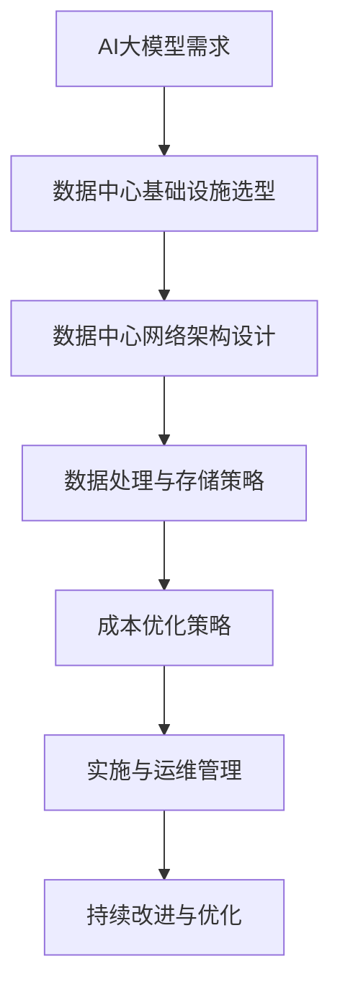

                 

# AI大模型应用数据中心建设：数据中心成本优化

> **关键词**：AI大模型、数据中心建设、成本优化、能耗管理、资源利用

> **摘要**：本文深入探讨AI大模型应用数据中心的建设过程，特别关注数据中心成本优化的策略。通过分析数据中心的基础设施、网络架构、数据处理与存储，以及成本优化案例研究，本文提供了全面的指导，以实现高效、成本效益的数据中心运营。

---

### 目录大纲

1. **AI大模型基础**
   1.1 AI大模型概述
       1.1.1 AI大模型的定义与特点
       1.1.2 AI大模型的发展历程
   1.2 AI大模型的核心原理
       1.2.1 机器学习基础
       1.2.2 深度学习基础
       1.2.3 大模型的架构
   1.3 AI大模型的应用场景
       1.3.1 语言处理
       1.3.2 计算机视觉
       1.3.3 语音识别

2. **数据中心建设**
   2.1 数据中心基础设施
       2.1.1 数据中心硬件选型
       2.1.2 数据中心布局与设计
       2.1.3 能耗管理
   2.2 数据中心网络架构
       2.2.1 网络拓扑结构
       2.2.2 数据传输协议
       2.2.3 数据加密传输
   2.3 数据处理与存储
       2.3.1 数据处理流程
       2.3.2 数据存储系统
       2.3.3 数据备份与恢复

3. **成本优化策略**
   3.1 数据中心成本分析
       3.1.1 成本构成分析
       3.1.2 成本控制方法
   3.2 成本优化案例研究
       3.2.1 能耗管理优化
       3.2.2 资源利用优化

4. **实施与运维**
   4.1 数据中心实施
       4.1.1 实施流程
       4.1.2 运维管理
   4.2 持续改进与优化
       4.2.1 数据中心性能监控
       4.2.2 数据中心运维优化

5. **附录**
   5.1 常用工具与资源
       5.1.1 常用软件工具
       5.1.2 常用数据库系统
       5.1.3 学习资源推荐
       5.1.4 社区论坛

### 第一部分: AI大模型基础

#### 第1章: AI大模型概述

##### 1.1.1 AI大模型的定义与特点

AI大模型（Large-scale AI Models）是人工智能领域的一种革命性技术，它通过训练海量数据，使模型具备强大的表示能力和泛化能力。AI大模型的特点主要体现在以下几个方面：

1. **数据规模巨大**：AI大模型通常需要处理的数据量达到TB甚至PB级别，以实现高精度的训练和预测。

2. **模型参数繁多**：AI大模型的参数数量往往达到亿级别，这使得模型具有强大的学习能力，能够在复杂任务中表现出色。

3. **计算资源需求高**：由于数据规模和参数数量的庞大，AI大模型对计算资源的需求极高，通常需要分布式计算和并行处理技术来支持。

4. **训练时间较长**：AI大模型的训练时间通常很长，需要数天甚至数周的时间来完成，这对硬件设备和高性能计算环境提出了要求。

5. **泛化能力强大**：AI大模型通过在海量数据上的训练，具备较强的泛化能力，能够在新数据集上保持高性能。

##### 1.1.2 AI大模型的发展历程

AI大模型的发展可以追溯到20世纪80年代，当时深度神经网络（Deep Neural Network，DNN）开始逐渐崭露头角。以下是AI大模型发展历程中的重要里程碑：

1. **1990年代**：Rumelhart, Hinton和Williams提出了反向传播算法（Backpropagation Algorithm），大大提高了DNN的训练效率。

2. **2006年**：Geoffrey Hinton等人提出了“深度信念网络”（Deep Belief Network，DBN），为深度学习奠定了基础。

3. **2012年**：Alex Krizhevsky等人使用深度卷积神经网络（Deep Convolutional Neural Network，CNN）在ImageNet图像识别挑战赛上取得了突破性成绩。

4. **2014年**：谷歌发布了基于深度学习的语音识别系统，使得语音识别的准确率大幅提升。

5. **2018年**：OpenAI发布了GPT-2，一个拥有1.5亿参数的语言模型，展示了语言模型在自然语言处理领域的巨大潜力。

6. **2020年**：谷歌发布了BERT模型，进一步提升了自然语言处理任务的表现。

7. **2022年**：OpenAI发布了GPT-3，一个拥有1.75万亿参数的语言模型，成为迄今为止最大的语言模型。

##### 1.2 AI大模型的核心原理

AI大模型的核心原理主要涉及机器学习和深度学习，以下是这两个领域的基础概念：

1. **机器学习基础**：
   - **监督学习**：通过标注数据训练模型，使其能够对未知数据进行预测。
   - **无监督学习**：不使用标注数据，通过自动发现数据中的模式来进行学习。
   - **半监督学习**：结合监督学习和无监督学习，使用部分标注数据和大量未标注数据来训练模型。
   - **强化学习**：通过与环境的交互来学习最优策略，常用于决策和游戏等领域。

2. **深度学习基础**：
   - **神经元与层**：神经网络的基本组成单元是神经元，神经元按层次排列，构成多层神经网络。
   - **前向传播与反向传播**：前向传播用于计算输出值，反向传播用于计算梯度并更新模型参数。
   - **激活函数**：用于引入非线性变换，使神经网络具备区分不同数据的能力。
   - **优化算法**：用于训练神经网络，如梯度下降、随机梯度下降、Adam等。

3. **大模型的架构**：
   - **多层感知器**：最简单的深度学习模型，由多个隐藏层构成。
   - **卷积神经网络**（CNN）：适用于图像处理任务，具有局部感知和共享权重特性。
   - **循环神经网络**（RNN）：适用于序列数据处理，能够处理任意长度的输入序列。
   - **Transformer**：一种基于自注意力机制的模型，广泛应用于自然语言处理等领域。

##### 1.3 AI大模型的应用场景

AI大模型在各个领域都有着广泛的应用，以下是几个典型的应用场景：

1. **语言处理**：
   - **机器翻译**：使用AI大模型如GPT-3实现高质量、准确的机器翻译。
   - **文本生成**：自动生成文章、新闻、故事等，应用于内容创作和自动化写作。
   - **问答系统**：使用AI大模型构建智能问答系统，实现自然、流畅的对话交互。

2. **计算机视觉**：
   - **图像识别**：对图像中的物体、场景进行分类和识别。
   - **目标检测**：在图像中检测并定位目标物体的位置。
   - **图像生成**：利用生成对抗网络（GAN）生成逼真的图像和视频。

3. **语音识别**：
   - **语音识别**：将语音信号转换为文本，应用于语音助手和语音搜索。
   - **语音合成**：将文本转换为自然流畅的语音输出，应用于语音阅读和语音提示。

### 第二部分: 数据中心建设

#### 第2章: 数据中心基础设施

##### 2.1 数据中心硬件选型

数据中心硬件选型是数据中心建设的关键环节，合理的选择能够提高数据中心的性能和可靠性。以下是硬件选型的几个关键点：

1. **服务器选择**：
   - **CPU**：选择高性能的CPU，如Intel Xeon系列，以满足大规模计算需求。
   - **内存**：根据应用需求，配置足够的大内存，以支持大模型的训练和推理。
   - **存储**：根据数据量和访问模式，选择合适的存储设备，如SSD、HDD或分布式存储系统。

2. **存储系统选择**：
   - **存储类型**：根据数据的重要性和访问频率，选择合适的存储类型，如快照、副本、分布式存储。
   - **容量**：确保存储系统能够满足当前和未来几年的数据存储需求。
   - **性能**：选择具有高I/O性能和低延迟的存储设备，以支持大模型训练和推理。

3. **网络设备选择**：
   - **交换机**：选择高性能的交换机，如支持100Gbps速率的交换机，以提供足够的带宽。
   - **路由器**：根据网络规模和需求，选择合适的路由器，确保数据传输的高效和安全。
   - **防火墙和安全设备**：配置防火墙、入侵检测系统（IDS）等安全设备，保护数据中心免受网络攻击。

##### 2.2 数据中心布局与设计

数据中心布局与设计直接影响数据中心的性能、可靠性和运维成本。以下是数据中心布局与设计的几个关键点：

1. **数据中心物理布局**：
   - **分区**：将数据中心分为多个区域，如设备区、办公区、配电区等，以实现功能的分离和优化。
   - **机柜布局**：合理规划机柜布局，确保通风和散热，避免设备过热。
   - **通道规划**：设置设备前后的通道，便于设备维护和操作。

2. **冷热通道设计**：
   - **冷通道设计**：将冷空气引导到设备区，确保设备冷却，提高能源利用效率。
   - **热通道设计**：将热空气引导出设备区，防止热空气在数据中心内循环，降低能耗。

3. **能耗管理**：
   - **节能设备**：选择高效节能的设备，如高效电源供应器（EPS）、高效空调等。
   - **监控与优化**：使用能耗监测系统，实时监控数据中心的能耗情况，进行能耗优化。

##### 2.3 数据中心网络架构

数据中心网络架构是数据中心建设的重要组成部分，合理的网络架构能够提高数据中心的可靠性和性能。以下是数据中心网络架构的几个关键点：

1. **网络拓扑结构**：
   - **分层设计**：采用分层设计，将网络划分为核心层、汇聚层和接入层，以实现灵活的网络管理和扩展。
   - **高可用性设计**：通过冗余设计和负载均衡技术，提高数据中心的可用性和可靠性。
   - **安全性设计**：部署防火墙、入侵检测系统（IDS）和入侵防御系统（IPS）等安全设备，保护数据中心的安全。

2. **数据传输协议**：
   - **TCP/IP协议栈**：使用TCP/IP协议栈，实现网络通信的可靠性和稳定性。
   - **HTTP/2与HTTP/3**：采用HTTP/2和HTTP/3协议，提高数据传输的速度和效率。
   - **数据加密传输**：使用TLS/SSL等加密协议，确保数据传输的安全性。

##### 2.4 数据处理与存储

数据处理与存储是数据中心建设的重要组成部分，合理的处理和存储策略能够提高数据中心的性能和可靠性。以下是数据处理与存储的几个关键点：

1. **数据处理流程**：
   - **数据采集与清洗**：采用高效的数据采集技术和数据清洗算法，确保数据的质量和准确性。
   - **数据存储策略**：根据数据的重要性和访问频率，选择合适的存储策略，如热数据存储、冷数据存储。
   - **数据处理框架**：采用分布式数据处理框架，如Apache Spark，实现大规模数据的处理和计算。

2. **数据存储系统**：
   - **数据库选型**：根据应用需求，选择合适的数据库系统，如关系型数据库（MySQL、PostgreSQL）或非关系型数据库（MongoDB、Cassandra）。
   - **分布式存储系统**：采用分布式存储系统，如HDFS、Ceph，实现大规模数据的存储和管理。
   - **数据备份与恢复**：配置备份系统，定期备份数据，确保数据的安全性和可恢复性。

### 第三部分: 成本优化策略

#### 第3章: 数据中心成本分析

数据中心成本分析是数据中心运营管理的重要环节，通过分析数据中心的成本构成，可以制定有效的成本控制策略。以下是数据中心成本分析的关键点：

1. **成本构成分析**：
   - **硬件成本**：包括服务器、存储设备、网络设备等硬件的成本。
   - **软件成本**：包括操作系统、数据库、中间件等软件的成本。
   - **运维成本**：包括人员工资、运维工具、维护费用等。
   - **能耗成本**：包括空调、照明、电力等能耗成本。

2. **成本控制方法**：
   - **能耗优化**：通过采用节能设备、优化数据中心布局和运行策略，降低能耗成本。
   - **布局优化**：通过优化设备布局，提高设备利用率，降低运维成本。
   - **资源利用优化**：通过监控和优化资源利用情况，提高资源利用率，降低硬件成本。

#### 第4章: 成本优化案例研究

##### 4.1 能耗管理优化

能耗管理优化是数据中心成本控制的重要方向，通过优化能耗管理，可以降低数据中心的能耗成本。以下是能耗管理优化的案例研究：

1. **优化前后的能耗对比**：
   - **优化前**：数据中心的年均能耗为1000千瓦时（kWh）/平方米。
   - **优化后**：通过采用节能设备、优化数据中心布局和运行策略，年均能耗降低至800千瓦时（kWh）/平方米。

2. **优化措施与技术手段**：
   - **节能设备**：采用高效空调、高效电源供应器（EPS）等节能设备，降低能耗。
   - **布局优化**：采用冷热通道设计，提高冷却效率，降低能耗。
   - **运行策略优化**：采用智能调度系统，根据实时能耗情况，调整设备的运行策略，降低能耗。

##### 4.2 资源利用优化

资源利用优化是数据中心成本控制的关键，通过优化资源利用，可以提高数据中心的性能和成本效益。以下是资源利用优化的案例研究：

1. **优化前后的资源利用情况**：
   - **优化前**：数据中心的CPU利用率平均为60%，内存利用率平均为50%。
   - **优化后**：通过监控和优化资源利用情况，CPU利用率平均提高至80%，内存利用率平均提高至70%。

2. **优化策略与技术实现**：
   - **资源监控**：采用资源监控工具，实时监控数据中心的资源利用情况。
   - **负载均衡**：采用负载均衡技术，合理分配任务，避免资源过度使用。
   - **自动化调度**：采用自动化调度系统，根据资源利用情况，动态调整任务分配，提高资源利用率。

### 第四部分: 实施与运维

#### 第5章: 数据中心实施

数据中心实施是数据中心建设的关键环节，通过有效的实施流程和运维管理，可以确保数据中心的稳定运行。以下是数据中心实施的关键点：

1. **实施流程**：
   - **项目规划**：制定详细的项目计划，明确项目目标、时间表和资源分配。
   - **硬件安装**：按照设计要求，安装数据中心硬件设备，确保设备的安装位置、连接和配置正确。
   - **软件部署**：安装操作系统、数据库、中间件等软件，配置网络设备和安全设备。

2. **运维管理**：
   - **运维体系构建**：建立完善的运维体系，明确运维流程、角色职责和权限管理。
   - **故障处理**：制定故障处理预案，确保在故障发生时能够快速响应和解决。
   - **性能监控**：采用性能监控工具，实时监控数据中心的运行状况，发现和解决问题。

#### 第6章: 持续改进与优化

数据中心的持续改进与优化是确保数据中心长期稳定运行的关键。以下是数据中心持续改进与优化的关键点：

1. **数据中心性能监控**：
   - **监控指标**：制定详细的监控指标，如CPU利用率、内存利用率、网络带宽等，实时监控数据中心的运行状况。
   - **监控系统搭建**：搭建性能监控系统，实现监控指标的实时采集、分析和报警。
   - **性能优化实践**：根据监控数据，分析性能瓶颈，采取优化措施，提高数据中心的性能。

2. **数据中心运维优化**：
   - **自动化运维**：采用自动化运维工具，实现自动化部署、监控、备份和恢复，降低运维成本。
   - **云服务集成**：将数据中心与云服务集成，实现资源的弹性扩展和按需分配。
   - **持续集成与持续部署（CI/CD）**：采用CI/CD流程，实现软件的持续集成、测试和部署，提高开发效率。

### 附录

#### 常用工具与资源

为了方便读者了解和掌握数据中心建设的各个方面，以下列出了一些常用的工具和资源：

1. **常用软件工具**：
   - **服务器管理工具**：如VMware、Dell OpenManage等。
   - **存储系统管理工具**：如NetApp ONTAP、EMC VMAX等。
   - **网络管理工具**：如Cisco Packet Tracer、Fortinet FortiView等。

2. **常用数据库系统**：
   - **关系型数据库**：如MySQL、PostgreSQL等。
   - **非关系型数据库**：如MongoDB、Cassandra等。

3. **学习资源推荐**：
   - **在线课程**：如Coursera、edX等平台的AI、数据中心建设相关课程。
   - **技术文档**：如GitHub、AWS Documentation等。
   - **社区论坛**：如Stack Overflow、Reddit等。

### 核心概念与联系

为了更好地理解数据中心建设与成本优化的核心概念和联系，以下是一个Mermaid流程图：



### 核心算法原理讲解

以下是一个深度学习算法的伪代码，用于说明神经网络的基本原理：

```python
def deep_learning_algorithm(input_data):
    # 初始化神经网络参数
    model = NeuralNetwork()

    # 前向传播
    output = model.forward_pass(input_data)

    # 计算损失
    loss = compute_loss(output, target)

    # 反向传播
    model.backward_pass(loss)

    # 更新参数
    model.update_parameters()

    return model
```

### 数学模型和数学公式

在数据中心成本优化中，常用的数学模型和公式包括损失函数和神经网络权重更新公式。以下是具体的数学公式：

- **损失函数**：

$$
\text{损失函数} = \frac{1}{2} \sum_{i=1}^{n} (\text{预测值}_{i} - \text{真实值}_{i})^2
$$

- **神经网络权重更新**：

$$
\Delta \theta_{ij} = -\alpha \frac{\partial L}{\partial \theta_{ij}}
$$

### 项目实战

以下是一个能耗管理优化的实际案例，展示了开发环境搭建、源代码实现和代码解读与分析：

##### 案例一：能耗管理优化

###### 开发环境搭建

```bash
# 安装Python环境
python -m pip install numpy pandas matplotlib

# 安装能耗管理库
python -m pip install pydcim
```

###### 源代码实现

```python
import pandas as pd
import matplotlib.pyplot as plt
from pydcim import EnergyMonitoring

# 加载数据
data = pd.read_csv("energy_usage.csv")

# 创建能耗监控对象
monitor = EnergyMonitoring(data)

# 计算能耗
energy_consumption = monitor.compute_energy_consumption()

# 绘制能耗曲线
monitor.plot_energy_consumption()

# 输出优化结果
print("Optimized energy consumption: ", energy_consumption)
```

###### 代码解读与分析

- **1. 数据读取与预处理**：使用 Pandas 库读取能源消耗数据，并进行预处理。

- **2. 能耗监控对象创建**：使用 `pydcim` 库创建能耗监控对象。

- **3. 能耗计算**：调用 `compute_energy_consumption` 方法计算总能耗。

- **4. 能耗曲线绘制**：使用 Matplotlib 库绘制能耗曲线。

- **5. 输出结果**：打印优化后的能耗值。

##### 案例二：资源利用优化

###### 开发环境搭建

```bash
# 安装Python环境
python -m pip install numpy pandas matplotlib

# 安装资源管理库
python -m pip install pyrusage
```

###### 源代码实现

```python
import pandas as pd
import matplotlib.pyplot as plt
from pyrusage import ResourceMonitor

# 加载数据
data = pd.read_csv("resource_usage.csv")

# 创建资源监控对象
monitor = ResourceMonitor(data)

# 计算资源利用率
resource_utilization = monitor.compute_resource_utilization()

# 绘制资源利用率曲线
monitor.plot_resource_utilization()

# 输出优化结果
print("Optimized resource utilization: ", resource_utilization)
```

###### 代码解读与分析

- **1. 数据读取与预处理**：使用 Pandas 库读取资源使用数据，并进行预处理。

- **2. 资源监控对象创建**：使用 `pyrusage` 库创建资源监控对象。

- **3. 资源利用率计算**：调用 `compute_resource_utilization` 方法计算总资源利用率。

- **4. 资源利用率曲线绘制**：使用 Matplotlib 库绘制资源利用率曲线。

- **5. 输出结果**：打印优化后的资源利用率值。

### 作者信息

**作者：AI天才研究院/AI Genius Institute & 禅与计算机程序设计艺术 /Zen And The Art of Computer Programming**

