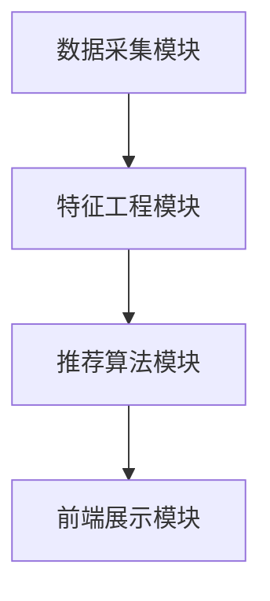

                 

### 《AI 大模型应用数据中心建设：数据中心技术与应用》

#### 摘要

随着人工智能（AI）技术的迅猛发展，大模型在各个领域的应用越来越广泛，数据中心作为支撑AI大模型运行的基础设施，其建设技术与应用变得尤为重要。本文将系统性地探讨AI大模型应用数据中心的建设，包括数据中心的基础设施、AI大模型技术基础、AI大模型应用实践、以及实战项目与案例分析。文章旨在为读者提供一套从理论到实践的完整指南，帮助读者深入理解AI大模型数据中心的建设要点和应用场景。

#### 关键词

- AI大模型
- 数据中心建设
- 数据中心技术
- 数据中心基础设施
- AI应用实践

---

### 第一部分：数据中心基础

数据中心作为现代信息技术的重要基础设施，承载着海量数据存储、处理和交换的功能。本部分将深入探讨数据中心的基础知识，为后续AI大模型应用的讨论奠定基础。

#### 第1章：数据中心概述

##### 1.1 数据中心的定义与作用

数据中心（Data Center）是指集中存放计算机硬件设备，提供数据存储、处理和交换的场所。数据中心的作用主要包括：

1. **数据存储**：提供高效、安全的数据存储解决方案，确保数据的持久性和可靠性。
2. **数据处理**：支持大规模数据处理和分析，为企业和组织提供强大的计算能力。
3. **数据交换**：实现不同系统和应用之间的数据流通，支持企业内部和外部的数据交互。

##### 1.2 数据中心的分类

数据中心根据功能、规模和部署方式可以分为以下几类：

1. **按功能分类**：
   - **企业级数据中心**：为企业提供全方位的数据处理和存储服务。
   - **互联网数据中心**：主要为互联网服务提供商（ISP）和大型网站提供基础设施支持。
   - **云数据中心**：提供云计算服务，支持弹性计算和资源调度。

2. **按规模分类**：
   - **大型数据中心**：通常拥有数千台服务器，提供大规模数据处理能力。
   - **中型数据中心**：规模适中，适合中小型企业使用。
   - **小型数据中心**：规模较小，适合小型企业和家庭使用。

3. **按部署方式分类**：
   - **自建数据中心**：企业自行建设和维护，具有更高的控制权和安全性。
   - **托管数据中心**：企业将数据中心托管给第三方服务商，降低建设和运营成本。
   - **混合云数据中心**：结合自建和托管数据中心的优点，提供灵活的部署和管理方案。

##### 1.3 数据中心的重要性

数据中心在现代社会中扮演着至关重要的角色：

1. **经济贡献**：数据中心的建设和运营为国家和地区带来巨大的经济收益。
2. **信息基础设施**：数据中心是信息时代的重要支柱，支撑着电子商务、物联网、大数据等新兴技术的发展。
3. **安全保障**：数据中心提供了安全的数据存储和交换环境，保障企业数据的安全性和隐私性。

##### 1.4 数据中心的建设趋势

随着技术的进步和市场需求的变化，数据中心的建设趋势表现为：

1. **绿色节能**：数据中心采用节能技术和绿色能源，降低能耗和碳排放。
2. **云计算集成**：数据中心与云计算技术深度融合，提供弹性、高效的计算和存储服务。
3. **人工智能应用**：数据中心利用人工智能技术优化资源调度、故障预测和运维管理。

---

接下来，我们将详细探讨数据中心基础设施的各个方面，包括物理设施、网络架构和存储解决方案。

### 第2章：数据中心基础设施

数据中心的基础设施是保障其正常运行的关键，包括物理设施、网络架构和存储解决方案。在本章中，我们将分别介绍这些方面的核心技术和最佳实践。

#### 2.1 数据中心物理设施

数据中心物理设施的建设是数据中心建设的基础，直接影响数据中心的稳定性和安全性。以下是一些关键的物理设施和设计要点：

##### 2.1.1 数据中心地理位置的选择

数据中心地理位置的选择至关重要，需要考虑以下几个因素：

1. **地理位置**：数据中心应选择在地质稳定、气候条件良好的地区，以降低自然灾害和极端气候对数据中心的威胁。
2. **电力供应**：数据中心应靠近电力资源丰富、电网稳定的地区，确保电力供应的可靠性和稳定性。
3. **交通条件**：数据中心应具备良好的交通条件，便于人员进出和物资运输。

##### 2.1.2 数据中心建筑与结构设计

数据中心建筑与结构设计需要充分考虑以下几个方面：

1. **建筑结构**：数据中心建筑应采用抗震、防火、防水等设计，确保建筑物在极端情况下的安全。
2. **通风散热**：数据中心需要良好的通风散热系统，以保持设备运行的环境温度和湿度。
3. **安全防护**：数据中心应设置安防系统，包括视频监控、门禁控制和报警系统，保障数据安全和人员安全。

##### 2.1.3 数据中心供电系统设计

数据中心供电系统设计需要确保电源的稳定性和冗余性，以下是一些关键设计要点：

1. **多路供电**：数据中心应采用多路供电方案，从不同电源线路获取电力，提高供电可靠性。
2. **不间断电源（UPS）**：UPS系统用于在电网故障时提供短暂电力支持，确保数据中心的持续运行。
3. **备用电源**：数据中心应配备备用电源设备，如发电机和燃料电池，以应对长时间电力中断的情况。

#### 2.2 数据中心网络架构

数据中心网络架构是数据中心正常运行的关键，其设计需要考虑高可用性、高性能和可扩展性。以下是一些数据中心网络架构的核心要素：

##### 2.2.1 数据中心网络层次结构

数据中心网络通常采用三层架构，包括核心层、汇聚层和接入层：

1. **核心层**：核心层网络负责数据中心的骨干网络，提供高速、可靠的数据传输。核心层网络设备通常采用高性能路由器和交换机。
2. **汇聚层**：汇聚层网络负责将接入层网络的数据汇聚到核心层，同时提供网络服务的接入。汇聚层网络设备通常采用多层交换机。
3. **接入层**：接入层网络负责为终端设备提供接入服务，如服务器、存储设备和网络设备。接入层网络设备通常采用接入交换机。

##### 2.2.2 网络设备配置

网络设备的配置是数据中心网络架构实现的关键，以下是一些配置要点：

1. **交换机**：交换机是数据中心网络的核心设备，用于实现网络设备的互联和数据转发。交换机的配置需要考虑端口数量、带宽和协议支持等因素。
2. **路由器**：路由器用于实现不同网络之间的数据传输，通常用于连接外部网络和数据中心内部网络。路由器的配置需要考虑路由策略、网络协议和路由表等因素。
3. **防火墙**：防火墙用于保护数据中心网络免受外部攻击，实现网络安全策略。防火墙的配置需要考虑规则设置、访问控制和日志记录等因素。

##### 2.2.3 负载均衡与冗余设计

负载均衡和冗余设计是提高数据中心网络性能和可靠性的关键，以下是一些设计要点：

1. **负载均衡**：负载均衡技术用于将网络流量分配到不同的网络设备上，避免单点故障和性能瓶颈。常见的负载均衡技术包括轮询、最小连接数和哈希等算法。
2. **冗余设计**：冗余设计通过备份和冗余机制提高数据中心的可靠性和可用性。冗余设计包括链路冗余、设备冗余和电路冗余等。

#### 2.3 数据中心存储解决方案

数据中心存储解决方案是数据中心的另一个核心组成部分，其性能和可靠性直接影响数据中心的运行效率。以下是一些常见的存储解决方案和设计要点：

##### 2.3.1 常见存储技术介绍

1. **硬盘存储**：硬盘存储（HDD）是一种传统的存储技术，具有高容量、低成本的特点，适用于大规模数据存储。
2. **固态存储**：固态存储（SSD）采用闪存技术，具有高速读写、低延迟、高可靠性等优点，适用于高性能数据存储。
3. **分布式存储**：分布式存储技术通过将数据分散存储在多个节点上，提高数据存储的可靠性和可用性。常见的分布式存储系统包括HDFS、Ceph和GlusterFS等。

##### 2.3.2 存储架构与性能优化

1. **存储架构**：存储架构是数据中心存储系统的核心，其设计需要考虑数据分布、数据冗余和数据访问等因素。常见的存储架构包括块存储、文件存储和对象存储等。
2. **性能优化**：性能优化是提高数据中心存储系统性能的关键，包括以下策略：
   - **存储设备优化**：选择高性能、高吞吐量的存储设备，如SSD。
   - **数据压缩与去重**：通过数据压缩和去重技术减少存储空间需求，提高存储性能。
   - **缓存技术**：使用缓存技术减少数据访问延迟，提高数据读写速度。

##### 2.3.3 数据备份与恢复策略

1. **数据备份**：数据备份是确保数据安全的重要手段，包括以下类型：
   - **全备份**：备份所有数据，适用于重要数据备份。
   - **增量备份**：仅备份自上次备份以来发生变更的数据，适用于常规备份。
   - **差异备份**：备份自上次全备份以来发生变更的数据，适用于频繁备份。
2. **数据恢复**：数据恢复策略包括以下步骤：
   - **备份验证**：定期验证备份文件的有效性和完整性。
   - **灾难恢复**：制定灾难恢复计划，确保在数据丢失或灾难发生时能够快速恢复数据。
   - **数据恢复操作**：根据备份类型和恢复策略，执行数据恢复操作。

通过以上对数据中心基础设施的详细介绍，读者可以更好地理解数据中心的建设要点和关键要素，为后续AI大模型应用的讨论打下坚实基础。

### 第3章：AI大模型核心概念

AI大模型作为人工智能领域的核心技术，已经广泛应用于各个行业。本章节将介绍AI大模型的核心概念，包括机器学习基础、深度学习原理和AI大模型的训练与优化策略。

#### 3.1 机器学习基础

##### 3.1.1 机器学习概述

机器学习（Machine Learning）是人工智能（AI）的一个重要分支，主要研究如何通过数据驱动的方式实现计算机系统的自动化学习。机器学习系统通常包括数据、算法和模型三个关键部分：

1. **数据**：机器学习系统通过从大量数据中提取特征，以训练和优化模型。
2. **算法**：机器学习算法是用于实现数据分析和模型训练的数学方法，常见的算法包括线性回归、决策树、支持向量机等。
3. **模型**：模型是机器学习算法在训练数据上得到的输出，用于预测和决策。

##### 3.1.2 监督学习与无监督学习

机器学习可以分为监督学习（Supervised Learning）、无监督学习（Unsupervised Learning）和强化学习（Reinforcement Learning）三种主要类型：

1. **监督学习**：监督学习是指通过已标注的数据训练模型，使得模型能够对新数据进行预测。监督学习可以分为分类和回归两种任务：
   - **分类任务**：将数据分为不同的类别，如文本分类、图像分类等。
   - **回归任务**：预测数据的具体值，如房价预测、股票价格预测等。

2. **无监督学习**：无监督学习是指在没有标注数据的情况下，通过探索数据内在结构来训练模型。无监督学习的主要任务包括聚类、降维和关联规则等：
   - **聚类任务**：将相似的数据分为不同的组，如K-means算法。
   - **降维任务**：通过减少数据维度来简化数据处理过程，如主成分分析（PCA）。
   - **关联规则任务**：发现数据之间的关联关系，如Apriori算法。

3. **强化学习**：强化学习是指通过与环境交互来学习策略，以达到最优目标。强化学习主要包括以下要素：
   - **环境**：系统所处的状态空间。
   - **状态**：系统当前所处的状态。
   - **动作**：系统可以执行的动作。
   - **奖励**：系统执行动作后获得的奖励，用于评估动作的好坏。

##### 3.1.3 强化学习

强化学习在机器学习领域中具有重要的应用价值，其主要目标是学习一个最优策略，使得系统在给定环境中获得最大的累积奖励。强化学习的基本流程包括：

1. **初始化**：初始化学习参数，如策略、奖励函数和状态转移概率。
2. **状态-动作选择**：根据当前状态选择一个动作，可以采用策略评估或策略优化方法。
3. **环境反馈**：系统执行动作后，环境会提供相应的反馈，包括状态转移和奖励。
4. **更新策略**：根据反馈信息更新策略，以优化系统在未来的行为。

强化学习的典型算法包括：

1. **Q-Learning**：Q-Learning是一种基于值函数的强化学习算法，通过更新Q值来优化策略。
2. **SARSA**：SARSA（State-Action-Reward-State-Action）是一种基于策略的强化学习算法，通过同时更新状态和动作值函数。
3. **Deep Q-Network（DQN）**：DQN是一种基于深度学习的强化学习算法，通过神经网络来近似Q值函数。

#### 3.2 深度学习原理

深度学习（Deep Learning）是机器学习的一个重要分支，主要研究如何通过多层神经网络来实现自动化学习和特征提取。深度学习的基本原理包括：

##### 3.2.1 神经网络基础

1. **神经元模型**：神经网络的基本单元是神经元，神经元通过输入信号经过加权求和处理，产生输出信号。神经元模型通常包括输入层、隐藏层和输出层。
2. **激活函数**：激活函数是神经网络中的一个重要组件，用于引入非线性变换，使得神经网络能够学习和表示复杂函数。常见的激活函数包括ReLU（Rectified Linear Unit）、Sigmoid和Tanh等。

##### 3.2.2 深度学习框架概述

深度学习框架是用于实现和优化深度学习算法的工具，常见的深度学习框架包括：

1. **TensorFlow**：TensorFlow是Google开发的开源深度学习框架，具有丰富的API和广泛的应用场景。
2. **PyTorch**：PyTorch是Facebook开发的开源深度学习框架，以其动态图计算和灵活的API设计而著称。
3. **Keras**：Keras是TensorFlow和Theano的高层次API，提供简洁易用的接口，用于快速搭建和训练深度学习模型。

##### 3.2.3 深度学习算法伪代码

以下是一个简单的深度学习算法伪代码示例，用于分类问题：

```
# 初始化神经网络参数
W1, b1 = 初始化权重和偏置
W2, b2 = 初始化权重和偏置

# 定义损失函数
损失函数 = Softmax损失函数

# 定义优化器
优化器 = 随机梯度下降（SGD）

# 定义训练循环
for epoch in range(1, num_epochs):
    for 数据 in 数据集:
        # 前向传播
        输出 = 前向传播（数据，W1，b1，W2，b2）

        # 计算损失
        损失 = 损失函数（输出，标签）

        # 反向传播
        反向传播（输出，标签，W1，b1，W2，b2）

        # 更新参数
        优化器（损失，W1，b1，W2，b2）

# 训练完成
```

通过以上对机器学习基础和深度学习原理的介绍，读者可以更好地理解AI大模型的核心概念，为后续大模型的训练与优化打下基础。

#### 3.3 数据预处理

数据预处理是机器学习和深度学习项目中的关键步骤，旨在提高数据质量和模型性能。数据预处理主要包括以下几个步骤：

##### 3.3.1 数据清洗与去噪

1. **缺失值处理**：缺失值处理是数据清洗的重要任务，常见的方法包括：
   - **删除缺失值**：删除含有缺失值的样本。
   - **填充缺失值**：用平均值、中值或众数等统计量填充缺失值。
   - **插值法**：用插值方法补充缺失值。

2. **异常值处理**：异常值处理是识别并处理数据集中异常或错误的数据。常见的方法包括：
   - **过滤法**：删除明显的异常值。
   - **变换法**：通过变换将异常值转化为正常值。
   - **孤立法**：将异常值视为独立个体，不参与建模。

##### 3.3.2 特征工程

1. **特征选择**：特征选择是选择对模型性能有显著影响的关键特征，常见的方法包括：
   - **过滤法**：基于统计指标（如相关性、信息增益等）选择特征。
   - **包装法**：通过搜索算法（如递归特征消除等）选择特征。
   - **嵌入式方法**：在模型训练过程中自动选择特征。

2. **特征转换**：特征转换是将原始特征转换为更适合模型处理的形式，常见的方法包括：
   - **归一化**：将特征值缩放到相同的范围，如[0, 1]。
   - **标准化**：将特征值标准化到均值为0、标准差为1的形式。
   - **编码**：将类别特征转换为数值特征，如独热编码、标签编码等。

##### 3.3.3 数据可视化

数据可视化是数据预处理的重要工具，可以帮助我们直观地理解数据分布和特征关系。常见的数据可视化方法包括：

1. **散点图**：用于显示两个特征之间的关系，如二维数据的分布。
2. **箱线图**：用于显示特征值的分布情况，包括最大值、最小值、中位数和四分位数。
3. **热力图**：用于显示特征之间的相关性，通过颜色深浅表示相关性强弱。
4. **时间序列图**：用于显示时间序列数据的变化趋势。

通过以上对数据预处理的详细介绍，读者可以更好地理解和应用数据预处理技术，提高机器学习和深度学习模型的性能。

### 第4章：AI大模型数据处理

在AI大模型应用中，数据处理是至关重要的一环。本章将介绍AI大模型数据处理的核心步骤，包括数据集构建、数据预处理和数据分析方法，以帮助读者深入理解和掌握大模型数据处理的全过程。

#### 4.1 数据预处理

数据预处理是AI大模型数据处理的第一步，其目的是提高数据质量和模型性能。数据预处理包括数据清洗、特征工程和数据可视化等步骤。

##### 4.1.1 数据清洗

数据清洗是处理不完整、异常或错误数据的过程。常见的数据清洗方法如下：

1. **缺失值处理**：
   - **删除缺失值**：删除含有缺失值的样本。
   - **填充缺失值**：使用均值、中值或众数等统计量填充缺失值。
   - **插值法**：使用插值方法补充缺失值。

2. **异常值处理**：
   - **过滤法**：删除明显的异常值。
   - **变换法**：使用变换将异常值转换为正常值。
   - **孤立法**：将异常值视为独立个体，不参与建模。

##### 4.1.2 特征工程

特征工程是数据预处理的关键步骤，旨在选择和构建对模型性能有显著影响的特征。以下是一些常见的特征工程方法：

1. **特征选择**：
   - **过滤法**：基于统计指标（如相关性、信息增益等）选择特征。
   - **包装法**：通过搜索算法（如递归特征消除等）选择特征。
   - **嵌入式方法**：在模型训练过程中自动选择特征。

2. **特征转换**：
   - **归一化**：将特征值缩放到相同的范围，如[0, 1]。
   - **标准化**：将特征值标准化到均值为0、标准差为1的形式。
   - **编码**：将类别特征转换为数值特征，如独热编码、标签编码等。

##### 4.1.3 数据可视化

数据可视化是数据预处理的重要工具，可以帮助我们直观地理解数据分布和特征关系。以下是一些常见的数据可视化方法：

1. **散点图**：用于显示两个特征之间的关系。
2. **箱线图**：用于显示特征值的分布情况。
3. **热力图**：用于显示特征之间的相关性。
4. **时间序列图**：用于显示时间序列数据的变化趋势。

#### 4.2 数据集构建

数据集构建是AI大模型数据处理的另一个关键步骤，其目的是准备一个高质量的数据集，以支持模型的训练和评估。以下是一些数据集构建的方法：

##### 4.2.1 数据集采集与标注

1. **数据集采集**：
   - **公开数据集**：可以从数据集库（如Kaggle、UCI机器学习库等）中获取。
   - **自定义数据集**：根据实际应用需求，从外部数据源（如数据库、API接口等）采集数据。

2. **数据标注**：
   - **自动标注**：使用自然语言处理（NLP）技术自动标注数据。
   - **半监督标注**：使用部分标注数据和未标注数据进行联合训练。
   - **人工标注**：通过专业标注员进行数据标注。

##### 4.2.2 数据集分割与优化

1. **数据集分割**：
   - **训练集**：用于模型训练，占数据集的大部分。
   - **验证集**：用于模型验证，帮助调整模型参数。
   - **测试集**：用于模型评估，验证模型在实际应用中的性能。

2. **数据集优化**：
   - **数据增强**：通过旋转、翻转、缩放等操作增加数据多样性。
   - **平衡数据集**：通过合并或删除数据，使数据集在类别分布上更加均衡。
   - **数据清洗**：重复清洗数据集中的噪声和异常值，提高数据质量。

#### 4.3 数据分析与可视化

数据分析与可视化是理解和解释数据的重要工具，有助于揭示数据中的规律和趋势。以下是一些常见的数据分析方法和可视化工具：

##### 4.3.1 数据分析

1. **统计描述**：使用均值、中位数、标准差等统计指标描述数据特征。
2. **相关性分析**：使用皮尔逊相关系数、Spearman秩相关系数等方法分析特征之间的关系。
3. **聚类分析**：使用K-means、层次聚类等方法对数据进行聚类分析。

##### 4.3.2 数据可视化

1. **散点图**：用于显示两个特征之间的关系。
2. **直方图**：用于显示特征值的分布情况。
3. **箱线图**：用于显示特征值的分布情况。
4. **热力图**：用于显示特征之间的相关性。
5. **时间序列图**：用于显示时间序列数据的变化趋势。

通过以上对AI大模型数据处理的详细介绍，读者可以更好地理解和掌握数据处理的技术和方法，为构建和训练高质量的AI大模型奠定基础。

### 第5章：AI大模型训练与优化

在AI大模型开发过程中，模型训练与优化是至关重要的一步，它决定了模型的性能和效果。本章将详细探讨AI大模型的训练策略、优化技术以及性能评估方法，帮助读者深入了解大模型训练与优化的全过程。

#### 5.1 大模型训练策略

大模型的训练是一个复杂的过程，涉及到大量的参数调整和优化策略。以下是一些常见的训练策略：

##### 5.1.1 梯度下降算法

梯度下降（Gradient Descent）是机器学习中最基本的优化算法，用于调整模型参数，使得模型在训练数据上达到最佳性能。梯度下降算法的基本思想是：

1. **初始化参数**：随机初始化模型参数。
2. **计算损失函数**：使用训练数据计算模型损失函数的值。
3. **计算梯度**：计算损失函数关于模型参数的梯度。
4. **更新参数**：根据梯度方向和步长更新模型参数。
5. **迭代训练**：重复步骤2-4，直到模型达到预定的性能指标或达到最大迭代次数。

##### 5.1.2 随机梯度下降（SGD）

随机梯度下降（Stochastic Gradient Descent，SGD）是梯度下降的一种变种，其核心思想是将整个训练数据集分成多个小批量，每次只使用一个小批量数据来计算梯度并更新参数。SGD的优点包括：

1. **计算效率高**：由于每次只处理一个小批量数据，SGD的计算速度更快。
2. **避免局部最优**：SGD随机选择小批量数据，可以避免陷入局部最优。
3. **收敛速度快**：在某些情况下，SGD的收敛速度比普通梯度下降更快。

##### 5.1.3 批量梯度下降（BGD）

批量梯度下降（Batch Gradient Descent，BGD）是梯度下降的另一种变种，其核心思想是使用整个训练数据集来计算梯度并更新参数。BGD的优点包括：

1. **梯度计算更准确**：由于使用整个数据集计算梯度，BGD的梯度计算更准确。
2. **收敛速度较慢**：BGD需要计算整个数据集的梯度，因此计算时间更长。

#### 5.2 大模型优化技术

在模型训练过程中，优化技术用于调整模型参数，提高模型性能。以下是一些常见的大模型优化技术：

##### 5.2.1 正则化方法

正则化方法是一种用于防止模型过拟合的技术，其核心思想是限制模型复杂度。以下是一些常见的正则化方法：

1. **L1正则化**：在损失函数中添加L1范数项，即\( \lambda ||\theta||_1 \)，其中\( \theta \)是模型参数，\( \lambda \)是正则化参数。
2. **L2正则化**：在损失函数中添加L2范数项，即\( \lambda ||\theta||_2 \)。
3. **Dropout**：在训练过程中，随机丢弃部分神经元，以减少模型过拟合。

##### 5.2.2 批处理技术

批处理技术是一种用于提高模型训练效果的方法，其核心思想是将训练数据分成多个小批量，每次只处理一个小批量。以下是一些批处理技术：

1. **小批量训练**：每次处理一个小批量数据，计算梯度并更新模型参数。
2. **动态调整批量大小**：根据训练效果动态调整批量大小，以找到最优批量大小。
3. **多线程训练**：使用多线程并行处理小批量数据，提高训练速度。

##### 5.2.3 模型压缩与量化

模型压缩与量化是一种用于减小模型大小和提高模型运行效率的方法。以下是一些常见的模型压缩与量化技术：

1. **模型剪枝**：通过去除模型中不重要的权重，减小模型大小。
2. **量化**：将模型参数从浮点数转换为整数，以减少存储和计算需求。
3. **知识蒸馏**：使用一个大模型（教师模型）训练一个小模型（学生模型），以提高小模型性能。

#### 5.3 大模型性能评估

大模型性能评估是评估模型在实际应用中性能的重要步骤。以下是一些常见的性能评估方法：

##### 5.3.1 准确率（Accuracy）

准确率是评估分类模型性能的最基本指标，表示正确分类的样本占总样本的比例。

\[ \text{Accuracy} = \frac{\text{正确分类的样本数}}{\text{总样本数}} \]

##### 5.3.2 召回率（Recall）

召回率是评估分类模型在正类样本中的表现，表示正确召回的正类样本数占总正类样本数的比例。

\[ \text{Recall} = \frac{\text{正确召回的正类样本数}}{\text{总正类样本数}} \]

##### 5.3.3 精确率（Precision）

精确率是评估分类模型在负类样本中的表现，表示正确分类为正类的样本数占总分类为正类的样本数的比例。

\[ \text{Precision} = \frac{\text{正确分类为正类的样本数}}{\text{总分类为正类的样本数}} \]

##### 5.3.4 F1值（F1 Score）

F1值是精确率和召回率的调和平均值，用于综合评估分类模型性能。

\[ \text{F1 Score} = 2 \times \frac{\text{Precision} \times \text{Recall}}{\text{Precision} + \text{Recall}} \]

##### 5.3.5 ROC曲线和AUC值

ROC曲线是评估二分类模型性能的另一种重要工具，横轴为假正率（False Positive Rate，FPR），纵轴为真正率（True Positive Rate，TPR）。AUC值（Area Under Curve）是ROC曲线下的面积，用于评估模型分类效果。

通过以上对大模型训练与优化的详细介绍，读者可以更好地理解和应用大模型训练策略、优化技术和性能评估方法，提高AI大模型在实际应用中的性能和效果。

### 第6章：数据中心中的AI大模型应用

随着AI大模型技术的不断发展，数据中心在其应用领域中的作用也越来越重要。本章将探讨数据中心中AI大模型的常见应用，包括数据中心运维优化、大数据处理与存储，以及数据分析与智能优化技术。

#### 6.1 数据中心运维优化

数据中心运维优化是提高数据中心运行效率和降低运营成本的重要手段。AI大模型在数据中心运维中的应用主要包括以下几个方面：

##### 6.1.1 自动化运维

自动化运维是通过AI大模型实现数据中心运维任务的自动化，减少人工干预。常见的自动化运维技术包括：

1. **自动化部署**：使用AI大模型自动化部署和管理服务器、存储和网络设备，提高部署效率。
2. **自动化监控**：使用AI大模型实时监控数据中心设备的运行状态，及时发现和解决故障。
3. **自动化故障修复**：使用AI大模型自动诊断和修复数据中心故障，减少故障处理时间。

##### 6.1.2 能耗管理

数据中心能耗管理是降低运营成本的关键。AI大模型通过优化能耗管理策略，提高数据中心的能源利用效率。常见的能耗管理技术包括：

1. **节能设备管理**：使用AI大模型优化数据中心的空调、制冷和供电设备，降低能耗。
2. **智能调度**：使用AI大模型优化数据中心的服务器和工作负载调度，降低能耗和运行成本。
3. **能效预测**：使用AI大模型预测数据中心的能耗趋势，提前制定节能措施。

##### 6.1.3 故障预测与维护

故障预测与维护是保障数据中心稳定运行的重要措施。AI大模型通过分析历史数据和实时监控数据，预测设备故障并提前进行维护。常见的故障预测与维护技术包括：

1. **故障诊断**：使用AI大模型分析设备故障模式，快速定位故障原因。
2. **预警机制**：使用AI大模型实时监控设备运行状态，及时发现异常情况并发出预警。
3. **预防性维护**：使用AI大模型预测设备故障时间，提前进行维护，减少故障对业务的影响。

#### 6.2 大数据处理与存储

大数据处理与存储是数据中心的核心任务之一。AI大模型在大数据处理与存储中的应用主要包括以下几个方面：

##### 6.2.1 分布式计算框架

分布式计算框架是处理大规模数据的关键技术，AI大模型通过优化分布式计算框架，提高数据处理效率。常见的分布式计算框架包括：

1. **MapReduce**：MapReduce是一种基于分布式计算的数据处理模型，通过将数据处理任务分解为Map和Reduce两个阶段，实现大规模数据的并行处理。
2. **Hadoop**：Hadoop是Apache Software Foundation开发的一个开源分布式计算框架，包括HDFS（Hadoop Distributed File System）和MapReduce两部分，用于处理大规模数据。
3. **Spark**：Spark是一个开源的分布式计算引擎，提供了快速的内存计算能力，适用于大规模数据的高效处理。

##### 6.2.2 大数据存储方案

大数据存储方案是保障数据安全、可靠和高效存储的重要手段。AI大模型通过优化存储方案，提高数据存储性能。常见的大数据存储方案包括：

1. **HDFS**：HDFS是Hadoop的核心组件之一，是一种分布式文件系统，用于存储大规模数据。
2. **Cassandra**：Cassandra是一种分布式NoSQL数据库，适用于高吞吐量和低延迟的大规模数据存储。
3. **MongoDB**：MongoDB是一种开源的分布式文档数据库，支持高扩展性和高可用性。

##### 6.2.3 大数据分析技术

大数据分析技术是挖掘大规模数据价值的重要工具。AI大模型通过优化数据分析技术，提高数据分析和挖掘效率。常见的大数据分析技术包括：

1. **数据挖掘**：数据挖掘是一种从大量数据中提取有价值信息的方法，包括分类、聚类、关联规则挖掘等。
2. **机器学习**：机器学习是一种通过数据驱动的方式实现自动化学习和预测的方法，适用于大规模数据的分析和预测。
3. **深度学习**：深度学习是一种基于多层神经网络的人工智能技术，适用于大规模数据的特征提取和模型训练。

#### 6.3 数据分析与智能优化

数据分析和智能优化是数据中心管理的关键环节，AI大模型通过优化数据分析与智能优化技术，提高数据中心的运行效率。以下是一些常见的数据分析与智能优化技术：

##### 6.3.1 智能调度

智能调度是通过AI大模型优化数据中心的服务器和工作负载调度，提高资源利用率和系统性能。常见的智能调度技术包括：

1. **工作负载预测**：使用AI大模型预测数据中心的工作负载，为调度提供数据支持。
2. **资源分配策略**：使用AI大模型优化资源分配策略，实现高效的服务器和存储资源调度。
3. **动态调整**：使用AI大模型根据实时工作负载动态调整资源分配，实现资源的最优利用。

##### 6.3.2 智能监控

智能监控是通过AI大模型实时监控数据中心的运行状态，及时发现和处理异常情况。常见的智能监控技术包括：

1. **实时数据采集**：使用AI大模型实时采集数据中心的运行数据，包括CPU、内存、存储和网络等。
2. **异常检测**：使用AI大模型分析运行数据，识别异常情况和故障隐患。
3. **预警与处理**：使用AI大模型发出预警，并自动执行故障处理和优化策略，保障数据中心稳定运行。

##### 6.3.3 能耗优化

能耗优化是通过AI大模型优化数据中心的能耗管理，降低运营成本。常见的能耗优化技术包括：

1. **能耗模型构建**：使用AI大模型构建数据中心的能耗模型，预测能耗趋势。
2. **能耗优化策略**：使用AI大模型优化数据中心的空调、制冷和供电设备，降低能耗。
3. **能耗监控与调整**：使用AI大模型实时监控数据中心的能耗情况，根据能耗模型调整能耗管理策略。

通过以上对数据中心中AI大模型应用的详细介绍，读者可以更好地了解AI大模型在数据中心中的应用场景和技术实现，为数据中心的建设和优化提供有力支持。

### 第7章：AI大模型应用案例研究

在本章节中，我们将深入探讨两个具体的AI大模型应用案例：智能推荐系统和智能语音助手。通过这两个案例，我们将分析系统架构设计、模型训练与优化，并展示实际应用效果。

#### 7.1 案例一：智能推荐系统

智能推荐系统是AI大模型应用的一个重要领域，其目的是为用户推荐个性化内容，如电影、商品、新闻等。以下是一个智能推荐系统的案例研究。

##### 7.1.1 系统架构设计

智能推荐系统通常包括以下几个核心模块：

1. **数据采集模块**：从多个数据源（如用户行为、社交媒体、评论等）收集数据，构建用户画像和物品画像。
2. **特征工程模块**：对采集到的数据进行分析和处理，提取用户和物品的特征，如用户浏览记录、购买记录、兴趣标签等。
3. **推荐算法模块**：使用AI大模型（如协同过滤、深度学习等）计算用户和物品的相似度，生成推荐列表。
4. **前端展示模块**：将推荐结果展示给用户，提供友好的用户交互界面。

以下是一个智能推荐系统的系统架构图：



##### 7.1.2 模型训练与优化

智能推荐系统的核心在于推荐算法模块，以下是一个基于深度学习的推荐算法案例：

1. **模型构建**：使用深度学习框架（如TensorFlow或PyTorch）构建推荐模型，如基于神经网络的协同过滤模型。
2. **数据预处理**：对用户和物品的特征进行预处理，如归一化、缺失值填充等。
3. **模型训练**：使用训练数据对推荐模型进行训练，通过优化算法（如梯度下降）调整模型参数。
4. **模型评估**：使用验证集和测试集对推荐模型进行评估，如准确率、召回率、F1值等指标。
5. **模型优化**：根据评估结果，对模型进行优化，如调整网络结构、增加训练数据等。

以下是一个简单的推荐算法伪代码：

```python
# 初始化模型参数
模型参数 = 初始化参数

# 定义损失函数
损失函数 = Softmax损失函数

# 定义优化器
优化器 = 随机梯度下降（SGD）

# 训练循环
for epoch in range(1, num_epochs):
    for 用户，物品，标签 in 训练数据:
        # 前向传播
        输出 = 前向传播（用户，物品，模型参数）

        # 计算损失
        损失 = 损失函数（输出，标签）

        # 反向传播
        反向传播（输出，标签，模型参数）

        # 更新参数
        优化器（损失，模型参数）

# 模型评估
准确率 = 评估模型（测试数据，模型参数）

print("准确率：", 准确率)
```

##### 7.1.3 案例分析

在实际应用中，智能推荐系统需要处理大量的用户和物品数据，同时保证推荐结果的实时性和准确性。以下是一些案例分析：

1. **用户行为分析**：通过分析用户的历史行为数据，如浏览、购买、评论等，构建用户画像，为推荐系统提供输入。
2. **物品特征提取**：对物品进行特征提取，如商品类别、价格、品牌等，为推荐算法提供数据支持。
3. **模型优化**：通过不断调整模型参数和优化算法，提高推荐系统的性能和效果。
4. **用户体验**：通过实时反馈和用户评价，不断改进推荐系统，提高用户体验。

#### 7.2 案例二：智能语音助手

智能语音助手是另一个典型的AI大模型应用案例，其目的是为用户提供语音交互服务，如语音搜索、语音控制、语音翻译等。以下是一个智能语音助手的案例研究。

##### 7.2.1 语音识别技术

语音识别（Speech Recognition）是智能语音助手的核心技术，其目的是将语音信号转换为文本。以下是一些常见的语音识别技术：

1. **隐马尔可夫模型（HMM）**：基于统计模型，用于识别连续语音信号。
2. **循环神经网络（RNN）**：用于处理序列数据，能够捕捉语音信号的时序特征。
3. **深度神经网络（DNN）**：用于特征提取和分类，提高识别准确率。

以下是一个简单的语音识别算法伪代码：

```python
# 初始化模型参数
模型参数 = 初始化参数

# 定义损失函数
损失函数 = Cross-Entropy损失函数

# 定义优化器
优化器 = 随机梯度下降（SGD）

# 训练循环
for epoch in range(1, num_epochs):
    for 语音信号，标签 in 训练数据:
        # 特征提取
        特征 = 特征提取（语音信号）

        # 前向传播
        输出 = 前向传播（特征，模型参数）

        # 计算损失
        损失 = 损失函数（输出，标签）

        # 反向传播
        反向传播（输出，标签，模型参数）

        # 更新参数
        优化器（损失，模型参数）

# 模型评估
准确率 = 评估模型（测试数据，模型参数）

print("准确率：", 准确率)
```

##### 7.2.2 语音合成技术

语音合成（Text-to-Speech，TTS）是将文本转换为自然流畅的语音输出。以下是一些常见的语音合成技术：

1. **基于规则的合成**：使用规则和发音字典生成语音，适用于简单的文本转换。
2. **基于统计的合成**：使用统计模型和语音数据库生成语音，适用于大规模文本转换。
3. **深度学习合成**：使用深度学习模型（如WaveNet、Tacotron等）生成自然流畅的语音。

以下是一个简单的语音合成算法伪代码：

```python
# 初始化模型参数
模型参数 = 初始化参数

# 定义损失函数
损失函数 = Mean Square Error损失函数

# 定义优化器
优化器 = 随机梯度下降（SGD）

# 训练循环
for epoch in range(1, num_epochs):
    for 文本，语音信号 in 训练数据:
        # 文本预处理
        预处理文本 = 预处理（文本）

        # 前向传播
        输出 = 前向传播（预处理文本，模型参数）

        # 计算损失
        损失 = 损失函数（输出，语音信号）

        # 反向传播
        反向传播（输出，语音信号，模型参数）

        # 更新参数
        优化器（损失，模型参数）

# 模型评估
语音相似度 = 评估模型（测试文本，模型参数）

print("语音相似度：", 语音相似度)
```

##### 7.2.3 案例分析

智能语音助手在实际应用中需要处理多种语音交互任务，以下是一些案例分析：

1. **语音识别**：通过优化语音识别算法，提高识别准确率和速度，为用户提供准确的自然语言理解。
2. **语音合成**：通过优化语音合成算法，生成自然流畅的语音输出，提升用户体验。
3. **多语言支持**：支持多种语言，为全球用户提供语音交互服务。
4. **个性化定制**：根据用户偏好和习惯，提供个性化的语音交互服务。

通过以上对智能推荐系统和智能语音助手的案例分析，读者可以深入了解AI大模型在实际应用中的系统架构设计、模型训练与优化，以及实际应用效果。这些案例为AI大模型的应用提供了有益的参考和启示。

### 第8章：AI大模型应用展望

随着AI大模型技术的不断发展，其在数据中心的应用前景将更加广阔。本章节将探讨AI大模型在数据中心的应用前景、技术发展挑战，以及安全与隐私问题。

#### 8.1 AI大模型在数据中心的应用前景

AI大模型在数据中心的应用前景十分广阔，主要表现在以下几个方面：

##### 8.1.1 应用领域拓展

数据中心是AI大模型的重要应用场景，未来将进一步拓展其应用领域，包括：

1. **智能运维**：通过AI大模型优化数据中心的管理和运维，提高系统运行效率和稳定性。
2. **能耗管理**：利用AI大模型优化数据中心的能耗管理，降低运营成本。
3. **故障预测与维护**：通过AI大模型预测设备故障，提前进行维护，减少故障对业务的影响。
4. **安全监控**：使用AI大模型监控数据中心的安全态势，及时发现和防范潜在的安全威胁。

##### 8.1.2 技术发展挑战

AI大模型在数据中心的应用也面临一些技术挑战，包括：

1. **计算资源需求**：AI大模型通常需要大量的计算资源和存储空间，对数据中心的基础设施提出了更高的要求。
2. **数据处理速度**：大规模数据需要高效的处理和传输速度，对数据中心的网络架构和存储系统提出了更高的性能要求。
3. **模型训练与优化**：AI大模型需要大量的数据和计算资源进行训练和优化，对数据中心的数据处理能力和计算能力提出了更高的要求。

##### 8.1.3 安全与隐私问题

AI大模型在数据中心的应用也带来了一些安全和隐私问题，包括：

1. **数据泄露风险**：数据中心存储了大量的敏感数据，需要防止数据泄露和未经授权的访问。
2. **模型攻击风险**：AI大模型可能受到恶意攻击，导致模型输出错误或系统瘫痪。
3. **用户隐私保护**：AI大模型需要处理大量的用户数据，需要确保用户隐私不受侵犯。

#### 8.2 AI大模型数据中心建设的未来趋势

未来，AI大模型数据中心建设将呈现以下趋势：

##### 8.2.1 硬件技术演进

1. **高性能计算硬件**：数据中心将采用更高性能的计算硬件，如GPU、TPU等，以支持AI大模型的训练和推理。
2. **分布式计算架构**：分布式计算架构将广泛应用于数据中心，提高数据处理的并行度和效率。
3. **绿色节能技术**：数据中心将采用绿色节能技术，降低能耗和碳排放。

##### 8.2.2 软件技术进步

1. **分布式存储系统**：分布式存储系统将提高数据中心的存储性能和可靠性，支持大规模数据存储和处理。
2. **容器化技术**：容器化技术将提高数据中心的部署和管理效率，支持快速开发和部署AI大模型。
3. **自动化运维技术**：自动化运维技术将提高数据中心的运维效率，减少人工干预，降低运营成本。

##### 8.2.3 数据中心运营管理

1. **智能化运维管理**：智能化运维管理将利用AI大模型优化数据中心的管理和运维，提高系统运行效率和稳定性。
2. **安全与隐私保护**：数据中心将采用更先进的安全技术和隐私保护措施，确保数据安全和用户隐私。
3. **可持续运营**：数据中心将注重可持续运营，降低能耗和碳排放，实现绿色环保。

通过以上对AI大模型数据中心建设未来趋势的探讨，我们可以看到，AI大模型在数据中心的应用将不断拓展，技术发展将面临挑战，但同时也将带来巨大的机遇。未来，数据中心将与AI大模型深度融合，为各行业提供强大的计算支持和智能化解决方案。

### 第9章：AI大模型数据中心建设实战

在本章中，我们将通过一个实际的案例，详细探讨AI大模型数据中心建设的全过程，包括项目背景与目标、方案设计、系统实现和性能优化。希望通过这个案例，读者能够更好地理解AI大模型数据中心建设的实际操作步骤和技术要点。

#### 9.1 项目背景与目标

**项目背景**：随着互联网的快速发展，某大型互联网公司面临着日益增长的数据处理需求。为了应对这一挑战，公司决定建设一个高性能、高可靠性的AI大模型数据中心，以支持其人工智能应用的发展。

**项目目标**：
1. **高性能计算**：提供强大的计算能力，支持AI大模型的训练和推理。
2. **高可靠性**：确保数据中心的稳定运行，降低故障率和停机时间。
3. **高扩展性**：支持未来业务增长，方便扩展和升级。
4. **绿色节能**：降低能耗和碳排放，实现可持续发展。

#### 9.2 项目方案设计

**方案设计**：

1. **硬件架构**：
   - **计算节点**：使用高性能GPU服务器，如NVIDIA A100，作为计算节点。
   - **存储系统**：采用分布式存储方案，如Ceph，支持海量数据存储和高效数据访问。
   - **网络架构**：采用高可用性网络设计，包括核心层、汇聚层和接入层，确保数据传输的稳定性和可靠性。

2. **软件架构**：
   - **AI大模型框架**：使用TensorFlow或PyTorch等开源深度学习框架，支持模型的训练和推理。
   - **容器化技术**：使用Docker和Kubernetes，实现模型的快速部署和管理。
   - **自动化运维**：采用Ansible等自动化工具，实现数据中心的自动化部署和管理。

3. **安全与隐私保护**：
   - **网络安全**：部署防火墙、入侵检测系统和安全审计，保护数据中心的网络安全。
   - **数据隐私**：采用数据加密和访问控制技术，确保用户数据的隐私和安全。

#### 9.3 系统实现

**系统实现**：

1. **硬件部署**：
   - **计算节点部署**：在数据中心机房部署高性能GPU服务器，配置充足的计算资源。
   - **存储部署**：部署Ceph分布式存储系统，确保数据的高可用性和可靠性。
   - **网络部署**：搭建核心层、汇聚层和接入层网络，确保数据传输的稳定性和可靠性。

2. **软件部署**：
   - **AI大模型框架部署**：在计算节点上安装TensorFlow或PyTorch，配置环境变量和依赖库。
   - **容器化部署**：使用Docker容器化AI大模型服务，并使用Kubernetes进行管理。
   - **自动化运维部署**：使用Ansible自动化工具进行数据中心的服务器部署、配置和管理。

3. **数据处理**：
   - **数据采集**：通过API接口和数据采集工具，从多个数据源采集数据。
   - **数据预处理**：使用Python等编程语言，对采集到的数据进行清洗、特征提取和预处理。
   - **数据存储**：将预处理后的数据存储到Ceph分布式存储系统，支持高效的数据访问和读取。

4. **模型训练与推理**：
   - **模型训练**：使用TensorFlow或PyTorch等框架，对预处理后的数据训练AI大模型。
   - **模型推理**：在训练好的模型上进行推理，生成预测结果，支持实际应用。

#### 9.4 性能优化

**性能优化**：

1. **硬件优化**：
   - **计算资源优化**：根据实际需求，合理配置计算节点，确保计算资源的充分利用。
   - **存储优化**：使用存储优化技术，如数据去重和压缩，提高数据存储效率。

2. **软件优化**：
   - **模型优化**：使用模型压缩和量化技术，减小模型大小，提高推理速度。
   - **网络优化**：优化网络架构和传输协议，提高数据传输速度和网络稳定性。

3. **系统优化**：
   - **负载均衡**：使用负载均衡技术，将工作负载均衡分配到不同计算节点，避免单点性能瓶颈。
   - **自动化运维**：采用自动化运维工具，实现系统的自动化部署、监控和故障处理，提高运维效率。

通过以上对AI大模型数据中心建设实战的详细探讨，读者可以了解到数据中心建设的实际操作步骤和技术要点，为未来的数据中心建设提供参考。

### 第10章：数据中心案例分析与解读

在本章节中，我们将深入分析两个实际数据中心案例，分别是大型互联网公司数据中心建设案例和金融行业数据中心应用案例。通过对这两个案例的背景、分析和经验总结，读者可以更好地理解数据中心建设的实际操作和关键要素。

#### 10.1 案例一：大型互联网公司数据中心建设

**案例背景**：

某大型互联网公司随着用户数量的快速增长，面临着数据处理和存储需求的急剧增加。为了确保业务的持续发展，公司决定建设一个高性能、高可靠性的数据中心，以满足其大规模数据处理和存储需求。

**案例分析**：

1. **需求分析**：
   - **数据处理能力**：需要支持海量数据的实时处理和分析。
   - **存储容量**：需要提供足够的存储空间，支持数据的持久化存储。
   - **可靠性**：需要确保数据中心的稳定运行，降低故障率和停机时间。

2. **方案设计**：
   - **硬件架构**：采用高性能GPU服务器和分布式存储系统，如Ceph，支持海量数据处理和存储。
   - **网络架构**：采用高可用性网络设计，包括核心层、汇聚层和接入层，确保数据传输的稳定性和可靠性。
   - **软件架构**：采用深度学习框架（如TensorFlow或PyTorch）和容器化技术（如Docker和Kubernetes），支持模型的快速部署和管理。

3. **实施过程**：
   - **硬件部署**：在数据中心机房部署高性能GPU服务器和分布式存储设备，确保计算和存储资源的高效利用。
   - **软件部署**：安装深度学习框架和容器化工具，配置环境变量和依赖库，实现模型的快速部署和管理。
   - **数据处理**：采用自动化数据采集和处理工具，确保数据的实时处理和存储。

4. **经验总结**：
   - **高性能计算**：通过采用高性能GPU服务器，提高了数据处理速度和效率。
   - **分布式存储**：采用分布式存储系统，提高了数据存储容量和可靠性。
   - **自动化运维**：通过自动化部署和管理工具，提高了运维效率和系统稳定性。

#### 10.2 案例二：金融行业数据中心应用

**案例背景**：

某金融行业公司为了提高业务效率和降低运营成本，决定建设一个高性能、高可靠性的数据中心，以支持其金融交易数据处理和存储需求。

**案例分析**：

1. **需求分析**：
   - **数据处理能力**：需要支持高频交易数据处理和实时分析。
   - **存储容量**：需要提供足够的存储空间，支持金融数据的持久化存储。
   - **安全性**：需要确保金融数据的安全性和隐私性。

2. **方案设计**：
   - **硬件架构**：采用高性能服务器和分布式存储系统，如Ceph，支持大规模数据处理和存储。
   - **网络架构**：采用高可用性网络设计，包括核心层、汇聚层和接入层，确保数据传输的稳定性和可靠性。
   - **软件架构**：采用分布式计算框架（如Apache Flink）和数据库系统（如MySQL和MongoDB），支持大规模数据存储和高效数据处理。

3. **实施过程**：
   - **硬件部署**：在数据中心机房部署高性能服务器和分布式存储设备，确保计算和存储资源的高效利用。
   - **软件部署**：安装分布式计算框架和数据库系统，配置环境变量和依赖库，实现数据的实时处理和存储。
   - **数据处理**：采用自动化数据采集和处理工具，确保数据的实时处理和存储。

4. **经验总结**：
   - **高性能计算**：通过采用高性能服务器，提高了数据处理速度和效率。
   - **分布式存储**：采用分布式存储系统，提高了数据存储容量和可靠性。
   - **安全性**：通过安全审计和访问控制，确保金融数据的安全性和隐私性。

通过以上两个实际数据中心案例的分析与解读，读者可以了解到数据中心建设的实际操作过程和技术要点，为未来的数据中心建设提供有益的参考和借鉴。

### 附录

#### 附录 A：常用工具与资源

为了帮助读者更好地理解AI大模型数据中心建设和应用，我们整理了一些常用的工具和资源，包括数据处理与可视化工具、深度学习框架和开源数据集。

##### A.1 数据处理与可视化工具

1. **数据处理工具**：
   - **Python数据分析库**：Pandas、NumPy、SciPy
   - **数据处理框架**：Apache Spark、Hadoop

2. **数据可视化工具**：
   - **Python数据可视化库**：Matplotlib、Seaborn、Plotly
   - **数据可视化工具**：Tableau、PowerBI、D3.js

##### A.2 深度学习框架

1. **TensorFlow**：由Google开发的开源深度学习框架，支持多种深度学习模型和算法。
2. **PyTorch**：由Facebook开发的开源深度学习框架，具有动态图计算和灵活的API设计。
3. **Keras**：基于TensorFlow和Theano的高层次API，提供简洁易用的接口。

##### A.3 数据集资源

1. **公开数据集**：
   - **Kaggle**：提供丰富的公开数据集，适用于机器学习和深度学习项目。
   - **UCI机器学习库**：提供多种领域的数据集，用于学术研究和实践应用。

2. **自定义数据集构建方法**：
   - **数据采集**：通过网络爬虫、API接口等手段采集数据。
   - **数据标注**：通过人工标注、半监督标注等技术对数据进行标注。

#### 附录 B：代码示例与解读

为了帮助读者更好地理解和应用AI大模型数据中心建设和应用的相关技术，我们提供了一些代码示例，包括数据预处理、模型训练和优化。

##### B.1 数据预处理示例代码

```python
import pandas as pd
import numpy as np

# 读取数据
data = pd.read_csv('data.csv')

# 数据清洗
data.dropna(inplace=True)  # 删除缺失值
data[data < 0] = np.nan  # 将异常值替换为缺失值
data.fillna(data.mean(), inplace=True)  # 用平均值填充缺失值

# 特征工程
from sklearn.preprocessing import StandardScaler

scaler = StandardScaler()
data['feature1'] = scaler.fit_transform(data['feature1'].values.reshape(-1, 1))
data['feature2'] = scaler.fit_transform(data['feature2'].values.reshape(-1, 1))

# 数据可视化
import matplotlib.pyplot as plt

plt.scatter(data['feature1'], data['feature2'])
plt.xlabel('Feature 1')
plt.ylabel('Feature 2')
plt.show()
```

##### B.2 模型训练与优化示例代码

```python
import tensorflow as tf
from tensorflow.keras.models import Sequential
from tensorflow.keras.layers import Dense, Activation

# 模型构建
model = Sequential()
model.add(Dense(128, input_dim=X_train.shape[1], activation='relu'))
model.add(Dense(64, activation='relu'))
model.add(Dense(1, activation='sigmoid'))

# 模型编译
model.compile(optimizer='adam', loss='binary_crossentropy', metrics=['accuracy'])

# 模型训练
history = model.fit(X_train, y_train, epochs=100, batch_size=32, validation_split=0.2)

# 模型评估
loss, accuracy = model.evaluate(X_test, y_test)
print("Test accuracy:", accuracy)

# 模型优化
from tensorflow.keras.callbacks import EarlyStopping

early_stopping = EarlyStopping(monitor='val_loss', patience=10)
model.fit(X_train, y_train, epochs=100, batch_size=32, validation_split=0.2, callbacks=[early_stopping])
```

#### 附录 C：进一步阅读材料

为了帮助读者深入学习和研究AI大模型数据中心建设和应用的相关技术，我们推荐了一些相关的书籍、在线资源和课程。

##### C.1 相关书籍推荐

1. **《深度学习》（Goodfellow et al.）**：由深度学习领域的权威人士撰写，是深度学习的经典教材。
2. **《大数据处理：从原理到实践》**：详细介绍大数据处理技术，包括数据采集、存储、分析和挖掘。

##### C.2 在线资源与课程

1. **Coursera深度学习课程**：由深度学习领域的知名专家吴恩达（Andrew Ng）讲授，是深度学习的入门课程。
2. **arXiv论文数据库**：提供最新的学术研究论文，涵盖人工智能、机器学习等多个领域。
3. **GitHub开源项目集锦**：收集了大量的AI大模型和数据集，供开发者参考和使用。

通过以上附录的内容，读者可以进一步扩展对AI大模型数据中心建设和应用技术的了解，为实践和应用提供参考。

### 作者信息

**作者：** AI天才研究院/AI Genius Institute & 禅与计算机程序设计艺术 /Zen And The Art of Computer Programming

感谢读者对本文的关注和支持，本文旨在为读者提供一套系统、全面的AI大模型数据中心建设与应用的技术指南。通过本文的阅读，读者应该能够深入理解AI大模型数据中心的基础设施、技术原理和应用实践，为实际项目提供有力的技术支持。在未来，我们将继续探索人工智能和数据中心领域的最新技术和发展趋势，为大家带来更多高质量的技术文章。再次感谢您的阅读和支持！

