                 

### 《AI大模型应用数据中心的资源优化》

#### 关键词：AI大模型、数据中心、资源优化、能耗优化、分布式计算

##### 摘要：
本文从AI大模型的发展背景入手，探讨了数据中心在AI大模型应用中的资源优化问题。文章首先介绍了AI大模型的基本概念和训练过程，然后分析了数据中心架构、资源分配策略、热数据管理与冷数据分离、能耗优化与绿色数据中心建设等方面的关键要素。通过实际案例分析，详细讲解了资源优化策略与方法，最后对资源优化的未来趋势和挑战进行了展望。本文旨在为数据中心优化提供理论指导和实践参考。

### 第一部分: 资源优化与AI大模型概述

#### 第1章: 资源优化与AI大模型概述

##### 1.1 AI大模型应用背景

随着人工智能技术的迅猛发展，AI大模型在各个领域得到了广泛应用。这些大模型通常包含数百万甚至数十亿个参数，需要海量数据和强大的计算能力进行训练。因此，资源优化成为AI大模型应用中至关重要的环节。

###### 1.1.1 AI大模型的发展历程

AI大模型的发展可以分为三个阶段：

1. **早期阶段**：以深度学习为基础，模型参数较少，如AlexNet和VGG。
2. **快速增长阶段**：随着计算能力和数据量的提升，模型参数迅速增加，如ResNet和Inception。
3. **大规模应用阶段**：AI大模型在自然语言处理、计算机视觉、语音识别等领域取得突破，如BERT、GPT和ViT。

###### 1.1.2 AI大模型的应用领域

AI大模型在多个领域取得了显著成果：

- **自然语言处理（NLP）**：如机器翻译、文本生成、情感分析等。
- **计算机视觉（CV）**：如图像识别、物体检测、图像生成等。
- **语音识别**：如语音合成、语音识别、说话人识别等。
- **推荐系统**：如个性化推荐、商品推荐等。

###### 1.1.3 资源优化的必要性

AI大模型的训练和部署需要大量的计算资源和存储资源，而数据中心作为承载这些计算和存储的核心设施，面临着巨大的压力。因此，资源优化成为数据中心优化的重要方向。资源优化可以帮助数据中心：

- 提高资源利用率，降低运维成本。
- 缩短训练时间，提高模型性能。
- 提升数据中心的可靠性和可扩展性。

##### 1.2 资源优化的核心概念

资源优化是指通过合理调度和分配计算资源、存储资源和网络资源，以最大化资源利用率和性能，同时降低能耗和运维成本。资源优化的核心概念包括：

- **资源利用率**：表示资源被使用的时间比例，越高表示资源利用越充分。
- **性能**：表示系统处理任务的效率，包括计算速度、响应时间和吞吐量。
- **能耗**：表示系统在运行过程中消耗的电能，能耗优化是绿色数据中心建设的重要目标。
- **运维成本**：包括硬件购置、维护和运营成本。

###### 1.2.1 资源优化的定义

资源优化是指在满足系统性能要求的前提下，通过调度和分配资源，使资源利用率最大化、能耗最小化，同时确保系统稳定运行。

###### 1.2.2 资源优化的目标

资源优化的目标包括：

- 提高资源利用率：通过合理分配资源，使资源得到充分利用。
- 降低能耗：通过优化数据中心架构和设备选型，减少能源消耗。
- 提高性能：通过优化调度算法和系统架构，提高系统处理速度和效率。
- 确保可靠性：通过冗余设计和故障恢复机制，保障系统稳定运行。

###### 1.2.3 资源优化的关键要素

资源优化的关键要素包括：

- **计算资源**：包括CPU、GPU、TPU等，是进行AI大模型训练和推理的核心。
- **存储资源**：包括硬盘、固态硬盘、分布式存储系统等，用于存储训练数据和模型参数。
- **网络资源**：包括局域网、广域网、数据中心网络等，负责数据传输和通信。
- **能耗管理**：通过优化冷却系统、电源管理等方式，降低数据中心能耗。

##### 1.3 AI大模型应用资源优化的挑战

AI大模型应用在数据中心中面临以下挑战：

###### 1.3.1 数据存储与处理

AI大模型通常需要处理海量数据，数据存储和处理成为资源优化的重要挑战。如何高效地存储和访问数据，以及优化数据传输和存储速度，是资源优化需要解决的问题。

###### 1.3.2 算力需求

AI大模型训练需要大量的计算资源，特别是在模型参数规模较大的情况下。如何合理分配计算资源、优化计算速度，是资源优化的关键。

###### 1.3.3 网络传输

AI大模型在训练和推理过程中需要频繁传输数据，网络传输成为资源优化的瓶颈。如何优化网络带宽、降低传输延迟，是资源优化需要解决的问题。

##### 1.4 AI大模型资源优化策略与方法

针对AI大模型应用在数据中心中的资源优化挑战，可以采取以下策略和方法：

###### 1.4.1 数据中心架构优化

数据中心架构优化包括硬件设备选型、网络架构设计和系统架构优化。通过选用高性能的硬件设备和优化网络拓扑结构，可以提高数据中心的性能和稳定性。

###### 1.4.2 资源调度与分配

资源调度与分配是资源优化的重要环节。通过采用高效的调度算法和分配策略，可以最大化资源利用率、降低能耗和提高性能。

###### 1.4.3 热数据管理与冷数据分离

热数据管理与冷数据分离是通过优化数据存储和访问方式，提高资源利用率和性能。通过将热数据和冷数据分离存储，可以降低数据访问延迟、提高存储性能。

###### 1.4.4 能耗优化与绿色数据中心建设

能耗优化与绿色数据中心建设是资源优化的长期目标。通过优化能耗管理、采用可再生能源和绿色技术，可以降低数据中心能耗、减少碳排放，实现绿色数据中心建设。

### 第一部分总结

本部分介绍了AI大模型应用背景和资源优化的核心概念，分析了资源优化的必要性及面临的挑战，并提出了AI大模型应用资源优化的策略与方法。在后续章节中，将详细探讨数据中心架构、资源调度与分配、热数据管理与冷数据分离、能耗优化与绿色数据中心建设等方面的内容，为读者提供全面的理论指导和实践参考。

---

#### Mermaid 流程图

以下是一个简单的Mermaid流程图，展示了AI大模型资源优化的主要流程：

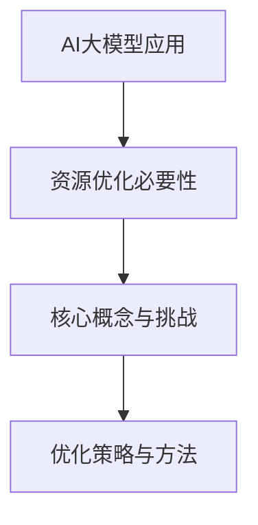

##### 1.1 AI大模型应用背景

AI大模型是指通过训练海量数据和强大的计算资源，形成的具有大规模参数的神经网络模型。随着深度学习技术的发展，AI大模型在自然语言处理、计算机视觉、语音识别等领域取得了显著的突破。这些大模型通常包含数百万甚至数十亿个参数，需要大量的计算资源进行训练。

###### 1.1.1 AI大模型的发展历程

AI大模型的发展历程可以分为三个阶段：

1. **早期阶段**：以深度学习为基础，模型参数较少。例如，AlexNet和VGG模型分别具有数十万个参数和数百万个参数。
   
2. **快速增长阶段**：随着计算能力和数据量的提升，模型参数迅速增加。例如，ResNet和Inception模型分别包含数千万和数亿个参数。

3. **大规模应用阶段**：AI大模型在多个领域取得了突破，应用于自然语言处理（NLP）、计算机视觉（CV）、语音识别等领域。例如，BERT、GPT和ViT模型分别在NLP和CV领域取得了显著的成果。

###### 1.1.2 AI大模型的应用领域

AI大模型在多个领域取得了显著成果，以下是一些典型的应用领域：

- **自然语言处理（NLP）**：AI大模型在机器翻译、文本生成、情感分析、问答系统等领域得到了广泛应用。例如，GPT-3和BERT模型在自然语言理解和生成方面表现出色。

- **计算机视觉（CV）**：AI大模型在图像识别、物体检测、图像生成等领域取得了突破。例如，ResNet和ViT模型在图像分类和生成方面表现出极高的准确性。

- **语音识别**：AI大模型在语音合成、语音识别、说话人识别等领域得到了广泛应用。例如，WaveNet和Transformer模型在语音处理方面取得了显著进展。

- **推荐系统**：AI大模型在个性化推荐、商品推荐等领域发挥了重要作用。例如，基于协同过滤和深度学习相结合的推荐系统，可以提高推荐的准确性和用户体验。

###### 1.1.3 资源优化的必要性

AI大模型的训练和部署需要大量的计算资源和存储资源，而数据中心作为承载这些计算和存储的核心设施，面临着巨大的压力。因此，资源优化成为数据中心优化的重要方向。资源优化的必要性体现在以下几个方面：

1. **提高资源利用率**：通过优化数据中心架构和资源分配策略，可以提高计算资源、存储资源和网络资源的利用率，降低闲置资源浪费。

2. **降低能耗**：数据中心能耗是影响其运行成本和环境影响的重要因素。通过优化能耗管理、采用绿色技术和可再生能源，可以降低数据中心能耗，减少碳排放。

3. **提高性能**：资源优化可以优化数据中心的调度和分配策略，提高计算速度、响应时间和吞吐量，从而提升数据中心整体性能。

4. **保障可靠性**：通过优化数据存储和传输方式，可以降低数据丢失和传输错误的风险，保障数据中心的可靠性。

### 第一部分总结

本章节介绍了AI大模型的发展历程和应用领域，分析了资源优化的必要性。在接下来的章节中，我们将进一步探讨资源优化的核心概念、面临的挑战以及具体的优化策略与方法。

---

#### 资源优化的核心概念

资源优化是一个复杂的工程问题，涉及到数据中心架构、资源分配、调度策略、热数据管理与冷数据分离、能耗优化等多个方面。以下是对这些核心概念的定义、目标和关键要素的详细阐述。

###### 1.2.1 资源优化的定义

资源优化是指在满足系统性能要求的前提下，通过合理调度和分配计算资源、存储资源和网络资源，以最大化资源利用率、降低能耗和提高性能的过程。

###### 1.2.2 资源优化的目标

资源优化的目标主要包括以下几个方面：

1. **最大化资源利用率**：通过优化资源分配和调度策略，提高计算资源、存储资源和网络资源的利用率，降低闲置资源浪费。

2. **降低能耗**：通过优化能耗管理和采用绿色技术，降低数据中心的能源消耗，减少碳排放和运行成本。

3. **提高性能**：通过优化数据中心架构和调度策略，提高系统的计算速度、响应时间和吞吐量，从而提升整体性能。

4. **保障可靠性**：通过优化数据存储和传输方式，降低数据丢失和传输错误的风险，确保系统稳定可靠运行。

###### 1.2.3 资源优化的关键要素

资源优化的关键要素包括：

1. **计算资源**：包括CPU、GPU、TPU等，是进行AI大模型训练和推理的核心。计算资源的高效利用是资源优化的重点之一。

2. **存储资源**：包括硬盘、固态硬盘、分布式存储系统等，用于存储训练数据和模型参数。存储资源的优化包括存储方式的选择、存储容量规划、数据压缩与去重等。

3. **网络资源**：包括局域网、广域网、数据中心网络等，负责数据传输和通信。网络资源的优化包括带宽管理、传输优化、负载均衡等。

4. **能耗管理**：包括冷却系统、电源管理、绿色技术等，用于降低数据中心的能耗。能耗优化是实现绿色数据中心建设的关键。

5. **调度策略**：包括资源调度算法、负载均衡策略、任务调度等，用于合理分配和调度资源，提高资源利用率。

6. **数据管理**：包括数据预处理、数据存储、数据备份与恢复等，用于确保数据的完整性、可靠性和高效访问。

7. **系统架构**：包括硬件设备选型、网络架构设计、系统架构优化等，用于构建高性能、高可靠性的数据中心。

### 第一部分总结

通过本章节的讨论，我们对资源优化的核心概念、目标和关键要素有了更深入的理解。资源优化是一个多维度、综合性的工程问题，涉及到数据中心架构、资源分配、调度策略、热数据管理与冷数据分离、能耗优化等多个方面。在后续章节中，我们将继续探讨这些方面的具体优化策略和方法。

---

#### AI大模型应用资源优化的挑战

随着AI大模型在各个领域的广泛应用，数据中心面临了前所未有的资源优化挑战。这些挑战主要体现在数据存储与处理、算力需求、网络传输等方面。

##### 1.3.1 数据存储与处理

AI大模型通常包含数百万到数十亿个参数，需要海量数据进行训练。这给数据存储和处理带来了巨大压力。以下是一些具体挑战：

1. **数据存储需求**：由于AI大模型需要存储大量的训练数据和模型参数，对数据存储容量提出了高要求。传统的存储系统可能无法满足这种需求，需要采用分布式存储技术，如HDFS、Cassandra等。

2. **数据访问速度**：AI大模型在训练过程中需要频繁读取和写入数据，对数据访问速度有较高要求。传统的硬盘存储系统可能无法满足这种需求，需要采用固态硬盘（SSD）或者更高速的存储设备。

3. **数据一致性**：在分布式存储系统中，数据一致性是一个关键问题。AI大模型训练过程中，需要对数据进行分布式处理，如何保证数据的一致性和可靠性是一个重要的挑战。

4. **数据处理速度**：AI大模型训练过程中需要进行大量的数据预处理、特征提取和计算，对数据处理速度提出了高要求。传统的计算资源可能无法满足这种需求，需要采用高性能的计算设备，如GPU、TPU等。

##### 1.3.2 算力需求

AI大模型的训练和推理需要大量的计算资源。以下是一些具体挑战：

1. **计算资源消耗**：AI大模型通常包含大量的参数，需要进行大规模的矩阵运算和向量计算。这导致计算资源消耗巨大，对CPU、GPU等计算设备提出了高要求。

2. **计算资源调度**：在数据中心中，如何合理调度和分配计算资源，以满足AI大模型训练和推理的需求，是一个重要的挑战。需要采用高效的调度算法，如作业调度算法、负载均衡算法等。

3. **计算资源扩展性**：随着AI大模型规模的不断扩大，数据中心需要具备良好的扩展性，能够动态调整计算资源，以满足日益增长的计算需求。

4. **计算资源利用率**：如何提高计算资源利用率，降低闲置资源浪费，是一个重要的挑战。需要采用资源调度策略和负载均衡技术，最大化计算资源利用率。

##### 1.3.3 网络传输

AI大模型在训练和推理过程中需要频繁传输数据，网络传输成为资源优化的瓶颈。以下是一些具体挑战：

1. **带宽需求**：AI大模型需要传输大量的数据和模型参数，对网络带宽提出了高要求。传统的网络带宽可能无法满足这种需求，需要采用高速网络技术，如10Gbps、40Gbps等。

2. **传输延迟**：AI大模型在训练和推理过程中，需要实时传输数据，对网络传输延迟有较高要求。如何降低传输延迟，提高数据传输速度，是一个重要的挑战。

3. **数据传输可靠性**：在网络传输过程中，如何确保数据的完整性和可靠性，防止数据丢失和传输错误，是一个重要的挑战。

4. **负载均衡**：在多个AI大模型同时训练和推理的情况下，如何合理分配网络带宽和计算资源，避免网络拥堵和性能下降，是一个重要的挑战。

### 第一部分总结

通过本章节的讨论，我们对AI大模型应用资源优化的挑战有了更深入的了解。数据存储与处理、算力需求和网络传输等方面都面临着巨大的挑战。在接下来的章节中，我们将探讨具体的优化策略和方法，以解决这些挑战，实现数据中心资源的高效利用和性能提升。

---

#### AI大模型资源优化策略与方法

为了解决AI大模型应用数据中心面临的资源优化挑战，需要采取一系列策略和方法。以下将详细讨论数据中心架构优化、资源调度与分配、热数据管理与冷数据分离、能耗优化与绿色数据中心建设等方面的具体策略与方法。

##### 1.4.1 数据中心架构优化

数据中心架构优化是资源优化的基础，主要包括硬件设备选型、网络架构设计和系统架构优化。

1. **硬件设备选型**

   - **计算设备**：选用高性能的CPU、GPU、TPU等计算设备，以满足AI大模型训练和推理的需求。例如，NVIDIA的GPU和Google的TPU在AI大模型训练中表现出色。

   - **存储设备**：选用高性能、大容量的存储设备，如固态硬盘（SSD）和分布式存储系统，以提高数据访问速度和存储容量。

   - **网络设备**：选用高速网络设备，如10Gbps、40Gbps以太网交换机，以降低数据传输延迟和带宽限制。

2. **网络架构设计**

   - **分布式网络**：采用分布式网络架构，通过多层交换机和路由器，实现高效的数据传输和负载均衡。

   - **冗余设计**：在网络架构中引入冗余设计，确保网络的高可用性和可靠性，避免单点故障。

3. **系统架构优化**

   - **虚拟化技术**：采用虚拟化技术，如VMware、KVM等，实现计算资源的灵活分配和动态调整。

   - **容器化技术**：采用容器化技术，如Docker、Kubernetes等，简化应用部署和管理，提高资源利用率和可扩展性。

##### 1.4.2 资源调度与分配

资源调度与分配是资源优化的核心环节，主要包括资源调度算法、负载均衡策略和任务调度。

1. **资源调度算法**

   - **作业调度算法**：采用作业调度算法，如FIFO、SJF、RR等，根据任务的优先级和截止时间，合理分配计算资源。

   - **负载均衡策略**：采用负载均衡策略，如轮询、最小连接数、哈希等，将任务均匀分配到不同的计算节点上，避免单点过载。

2. **任务调度**

   - **动态调度**：根据任务的执行情况和资源使用情况，动态调整任务的执行顺序和计算节点，实现资源的最优利用。

   - **预测调度**：通过预测任务的执行时间和资源需求，提前进行资源调度和分配，提高资源利用率和系统性能。

##### 1.4.3 热数据管理与冷数据分离

热数据管理与冷数据分离是优化数据存储和访问的重要策略，主要包括数据存储技术、数据访问优化和数据备份与恢复。

1. **数据存储技术**

   - **热数据存储**：采用高性能的存储设备，如固态硬盘（SSD）和内存，以提高热数据的访问速度和响应时间。

   - **冷数据存储**：采用低成本的存储设备，如硬盘和分布式存储系统，以降低冷数据的存储成本。

2. **数据访问优化**

   - **缓存技术**：采用缓存技术，如内存缓存、磁盘缓存等，减少数据访问的延迟和I/O操作。

   - **数据压缩与去重**：采用数据压缩与去重技术，减少数据的存储空间和传输带宽。

3. **数据备份与恢复**

   - **数据冗余**：通过数据冗余技术，如RAID、分布式存储等，提高数据的可靠性和安全性。

   - **快照技术**：采用快照技术，定期备份数据，确保在数据丢失或损坏时能够快速恢复。

##### 1.4.4 能耗优化与绿色数据中心建设

能耗优化与绿色数据中心建设是资源优化的重要目标，主要包括高效硬件选择、系统架构优化和可再生能源使用。

1. **高效硬件选择**

   - **低功耗硬件**：选择低功耗的硬件设备，如低功耗CPU、GPU和存储设备，以降低能耗。

   - **能效比高的硬件**：选择能效比高的硬件设备，提高能源利用率。

2. **系统架构优化**

   - **虚拟化与容器化**：采用虚拟化与容器化技术，提高计算资源的利用率，减少能耗。

   - **智能化冷却系统**：采用智能化冷却系统，如热管冷却、水冷系统等，降低能耗和提高冷却效率。

3. **可再生能源使用**

   - **可再生能源采购**：采用可再生能源，如太阳能、风能等，降低对化石燃料的依赖，减少碳排放。

   - **绿色数据中心设计**：在设计数据中心时，考虑环保因素，采用绿色建筑设计、可再生能源利用和绿色运维策略。

### 第一部分总结

通过本章节的讨论，我们对AI大模型应用数据中心的资源优化策略与方法有了更深入的理解。数据中心架构优化、资源调度与分配、热数据管理与冷数据分离、能耗优化与绿色数据中心建设等方面的策略和方法，为解决资源优化挑战提供了有效的解决方案。在接下来的章节中，我们将通过实际案例和数学模型，进一步探讨这些优化策略与方法的具体实现和应用。

---

### 第一部分总结

在本部分中，我们首先介绍了AI大模型应用数据中心资源优化的背景和必要性。接着，详细探讨了资源优化的核心概念，包括资源优化的定义、目标和关键要素。然后，分析了AI大模型应用资源优化面临的挑战，如数据存储与处理、算力需求和网络传输等。最后，我们提出了数据中心架构优化、资源调度与分配、热数据管理与冷数据分离、能耗优化与绿色数据中心建设等资源优化的策略与方法。

通过本部分的讨论，读者可以全面了解AI大模型应用数据中心资源优化的重要性和具体实现方法。在接下来的部分，我们将通过具体案例、数学模型和项目实战，进一步深入探讨这些优化策略与方法的应用和效果。读者将了解到如何在实际数据中心中实施这些优化策略，从而实现高效、稳定和绿色的数据中心运营。

---

#### 第2章: AI大模型基础

##### 2.1 AI大模型基本概念

AI大模型，即大规模人工智能模型，是指通过训练海量数据和强大的计算资源，形成的具有大规模参数的神经网络模型。这些模型通常包含数百万到数十亿个参数，能够处理复杂的数据任务，如自然语言处理、计算机视觉和语音识别等。

###### 2.1.1 AI大模型的定义

AI大模型是深度学习领域的术语，它指的是一种具有大量神经元和参数的神经网络模型。这些模型通过学习大量的数据来发现数据中的模式，从而进行预测和分类。AI大模型的参数规模远超传统模型，使得它们能够处理更加复杂的问题。

###### 2.1.2 AI大模型的类型

AI大模型主要分为以下几类：

- **自然语言处理（NLP）模型**：如GPT、BERT等，用于处理文本数据，进行文本生成、机器翻译和情感分析等任务。

- **计算机视觉（CV）模型**：如ResNet、VGG等，用于处理图像和视频数据，进行图像分类、目标检测和图像生成等任务。

- **语音识别（ASR）模型**：如WaveNet、Tacotron等，用于处理音频数据，进行语音识别和语音合成等任务。

- **推荐系统模型**：如DeepFM、Wide & Deep等，用于处理用户行为和商品数据，进行个性化推荐和广告投放等任务。

###### 2.1.3 AI大模型的特点

AI大模型具有以下几个特点：

- **大规模参数**：AI大模型的参数数量可达数百万到数十亿，这使得它们能够捕捉数据中的复杂模式。

- **海量数据训练**：AI大模型通常需要训练数百万到数十亿个参数，因此需要大量的训练数据。

- **长期训练**：AI大模型的训练时间较长，可能需要几天到几周的时间，这取决于模型的规模和数据集的大小。

- **强大的学习能力**：由于具有大规模参数和海量数据训练，AI大模型具有强大的学习能力，能够处理复杂的任务。

### 第一部分总结

本章介绍了AI大模型的基本概念、类型和特点。通过了解AI大模型的基本知识，读者可以更好地理解AI大模型在数据中心资源优化中的作用和重要性。在下一章中，我们将深入探讨AI大模型的训练过程和调优技巧。

---

#### AI大模型的训练过程

AI大模型的训练是一个复杂的过程，涉及到数据预处理、模型架构设计、模型训练、模型评估与调整等多个环节。以下是对这些步骤的详细讲解。

##### 2.2 AI大模型的训练过程

###### 2.2.1 数据预处理

数据预处理是AI大模型训练的第一步，其目的是清洗和准备数据，使其适合模型训练。数据预处理包括以下步骤：

1. **数据清洗**：去除数据集中的噪声、异常值和重复数据，以提高数据质量。

2. **数据标准化**：将数据集中的特征缩放到相同的范围，例如归一化或标准化，以便模型更好地学习。

3. **数据增强**：通过数据增强技术，如旋转、翻转、缩放和裁剪等，增加数据的多样性，从而提高模型的泛化能力。

4. **数据划分**：将数据集划分为训练集、验证集和测试集，以便在模型训练过程中进行评估。

###### 2.2.2 模型架构设计

模型架构设计是确定模型结构的过程，包括选择合适的神经网络架构、定义模型损失函数和优化器等。以下是一些常用的模型架构设计方法：

1. **选择神经网络架构**：选择适合任务的神经网络架构，如卷积神经网络（CNN）、循环神经网络（RNN）或变压器（Transformer）等。

2. **定义损失函数**：选择合适的损失函数，如均方误差（MSE）、交叉熵损失等，以衡量模型预测值和真实值之间的差异。

3. **选择优化器**：选择合适的优化器，如随机梯度下降（SGD）、Adam等，以调整模型参数，最小化损失函数。

###### 2.2.3 模型训练

模型训练是AI大模型训练的核心环节，其目的是通过迭代更新模型参数，使模型能够准确预测数据。以下是一些模型训练的关键步骤：

1. **初始化模型参数**：随机初始化模型参数，以开始训练过程。

2. **前向传播**：计算模型输入的每个神经元输出值，并通过反向传播算法计算损失值。

3. **反向传播**：根据损失值，通过反向传播算法更新模型参数，以减小损失函数。

4. **迭代训练**：重复前向传播和反向传播步骤，直到满足停止条件，如达到预设的迭代次数或损失值趋于稳定。

###### 2.2.4 模型评估与调整

模型评估与调整是确保模型性能的关键步骤，其目的是评估模型在验证集和测试集上的表现，并进行调整以优化模型性能。以下是一些评估与调整方法：

1. **评估指标**：选择合适的评估指标，如准确率、召回率、F1分数等，以衡量模型性能。

2. **交叉验证**：使用交叉验证技术，如K折交叉验证，评估模型在多个数据子集上的性能，以减小过拟合风险。

3. **超参数调整**：调整模型超参数，如学习率、批量大小等，以优化模型性能。

4. **模型集成**：使用模型集成技术，如Bagging、Boosting等，结合多个模型的结果，提高模型性能。

### 第一部分总结

本章详细介绍了AI大模型的训练过程，包括数据预处理、模型架构设计、模型训练和模型评估与调整。通过了解这些过程，读者可以更好地理解AI大模型训练的核心步骤和方法，为后续章节的资源优化打下基础。在下一章中，我们将探讨AI大模型的调优技巧，以进一步提高模型性能。

---

#### AI大模型的调优技巧

在AI大模型的训练过程中，调优技巧是提高模型性能的重要手段。以下将介绍几种常用的调优技巧，包括学习率调整、模型正则化和批处理大小调整。

##### 2.3 AI大模型的调优技巧

###### 2.3.1 学习率调整

学习率是模型训练过程中调整模型参数的步长，其大小对模型性能有重要影响。以下是一些学习率调整的技巧：

1. **选择合适的学习率**：学习率的选择应根据模型和任务的具体情况。一般来说，较小的学习率有助于模型收敛，但收敛速度较慢；较大的学习率可以加快收敛速度，但可能导致模型过拟合。

2. **学习率衰减**：在训练过程中，学习率通常会随着迭代次数的增加而逐渐减小。这种策略有助于模型在训练后期更好地收敛，避免过早的过拟合。常用的学习率衰减策略包括指数衰减和步长衰减。

   - **指数衰减**：学习率按照固定比例逐渐减小，如每迭代10次减少1/10。
   - **步长衰减**：根据当前迭代次数或训练损失值的变化情况，动态调整学习率。

   ```latex
   learning_rate = initial_learning_rate / (1 + decay_rate * epoch)
   ```

3. **学习率调度**：学习率调度是一种更灵活的调整策略，可以根据训练过程中模型的表现来动态调整学习率。常用的学习率调度策略包括学习率预热和自适应学习率调度。

   - **学习率预热**：在训练初期，逐渐增加学习率，以避免模型在训练初期出现过拟合。
   - **自适应学习率调度**：根据模型的性能指标，如验证集损失或准确率，动态调整学习率。

   ```python
   if loss < threshold:
       learning_rate *= decay_rate
   ```

###### 2.3.2 模型正则化

模型正则化是防止模型过拟合的一种有效方法，通过在模型训练过程中引入正则化项，惩罚模型复杂度。以下是一些常见的模型正则化方法：

1. **L1正则化**：在模型损失函数中添加L1正则化项，即L1范数。

   ```latex
   Loss = J(W) + \lambda \|W\|
   ```

   其中，\( J(W) \) 是模型损失函数，\( \lambda \) 是正则化参数，\( \|W\| \) 是权重向量的L1范数。

2. **L2正则化**：在模型损失函数中添加L2正则化项，即L2范数。

   ```latex
   Loss = J(W) + \lambda \|W\|^2
   ```

   其中，\( J(W) \) 是模型损失函数，\( \lambda \) 是正则化参数，\( \|W\|^2 \) 是权重向量的L2范数。

3. **Dropout正则化**：在训练过程中，随机丢弃一部分神经元，以防止模型过度依赖特定神经元。

   ```python
   probability = 0.5
   mask = np.random.binomial(1, probability, size=n_neurons)
   layer_output = layer_output * mask
   ```

   其中，\( probability \) 是丢弃概率，\( mask \) 是丢弃掩码，\( layer_output \) 是输出。

###### 2.3.3 批处理大小调整

批处理大小是模型训练过程中每次更新参数所使用的数据样本数量。以下是一些批处理大小调整的技巧：

1. **选择合适的批处理大小**：批处理大小的选择应根据模型和任务的具体情况。较小的批处理大小有助于模型收敛，但可能导致方差较大；较大的批处理大小可以减小方差，但可能导致梯度不稳定。

2. **动态调整批处理大小**：在训练过程中，可以根据模型的性能和资源限制动态调整批处理大小。例如，在训练初期使用较小的批处理大小以加快收敛，在训练后期使用较大的批处理大小以提高模型稳定性。

3. **批处理大小优化策略**：一些优化策略，如渐进式增大批处理大小（Cosine Annealing）和自适应批处理大小调整（Batch Size Warmup），可以帮助模型更好地收敛。

   ```python
   warmup_epochs = 10
   total_epochs = 100
   batch_size = initial_batch_size
   for epoch in range(total_epochs):
       if epoch < warmup_epochs:
           batch_size += (max_batch_size - initial_batch_size) / warmup_epochs
       else:
           batch_size += (max_batch_size - initial_batch_size) * cosine_annealing
       train(model, train_loader, optimizer, epoch, batch_size)
   ```

### 第一部分总结

本章介绍了AI大模型训练过程中的调优技巧，包括学习率调整、模型正则化和批处理大小调整。通过合理运用这些技巧，可以显著提高模型的性能和稳定性，为AI大模型在数据中心中的高效应用奠定基础。在下一章中，我们将探讨AI大模型的分布式训练策略和实现。

---

#### AI大模型的分布式训练

分布式训练是AI大模型训练中的重要策略，它通过将训练任务分布在多个计算节点上，提高了训练速度和效率。以下将介绍分布式训练的优势、策略和实现方法。

##### 2.4 AI大模型的分布式训练

###### 2.4.1 分布式训练的优势

分布式训练具有以下优势：

1. **提高训练速度**：通过将训练任务分布在多个计算节点上，分布式训练可以显著提高模型的训练速度。特别是在大规模数据集和复杂模型的情况下，分布式训练的优势更加明显。

2. **节省计算资源**：分布式训练可以利用现有的计算资源，避免单机训练所需的巨大计算资源。通过合理分配任务，分布式训练可以充分利用计算节点，提高资源利用率。

3. **提高容错性**：分布式训练具有更好的容错性，当一个计算节点出现故障时，其他节点可以继续执行训练任务，确保训练过程的连续性和稳定性。

4. **支持大规模数据集**：分布式训练可以处理大规模数据集，避免了单机训练因内存限制导致的训练数据无法完全加载的问题。

###### 2.4.2 分布式训练策略

分布式训练可以分为以下几种策略：

1. **数据并行**：数据并行是一种最常见的分布式训练策略，它将训练数据集划分为多个子数据集，每个计算节点独立处理一个子数据集。在训练过程中，各个节点同时进行前向传播和反向传播，并计算梯度。最终，各个节点的梯度进行汇总，更新全局模型参数。

2. **模型并行**：模型并行是将神经网络模型分布在多个计算节点上，每个节点负责模型的一部分。在训练过程中，各个节点同时进行前向传播和反向传播，计算局部梯度。最终，各个节点的局部梯度进行汇总，更新全局模型参数。

3. **混合并行**：混合并行结合了数据并行和模型并行的优点，它将训练数据集和神经网络模型同时分布在多个计算节点上。在训练过程中，各个节点分别处理局部数据和局部模型，并计算局部梯度。最终，各个节点的局部梯度进行汇总，更新全局模型参数。

###### 2.4.3 分布式训练实现

分布式训练可以通过以下几种方式实现：

1. **框架支持**：许多深度学习框架，如TensorFlow和PyTorch，提供了内置的分布式训练支持。通过使用这些框架的分布式训练API，可以轻松实现分布式训练。

2. **多机多卡训练**：使用多台计算机和多块GPU，通过分布式训练框架进行多机多卡训练。在这种方式下，可以将数据集和模型分布在不同的计算机和GPU上，实现高效的分布式训练。

3. **手动实现**：对于没有内置分布式训练支持的框架或特殊情况，可以通过手动实现分布式训练。这通常涉及以下步骤：

   - **数据切分**：将训练数据集划分为多个子数据集，每个子数据集分配给一个计算节点。

   - **并行计算**：在每个计算节点上，独立执行前向传播和反向传播，计算局部梯度。

   - **梯度汇总**：将各个计算节点的局部梯度汇总，更新全局模型参数。

### 第一部分总结

本章介绍了AI大模型的分布式训练优势、策略和实现方法。通过分布式训练，可以显著提高AI大模型的训练速度和效率，充分利用计算资源，支持大规模数据集处理。在下一章中，我们将探讨数据中心架构与资源优化，为AI大模型在数据中心中的应用提供更深入的讨论。

---

#### 第3章: 数据中心架构与资源优化

数据中心是现代企业计算的核心，承担着存储、处理和传输海量数据的重要任务。为了满足AI大模型的高需求，数据中心必须进行有效的架构优化和资源管理。本章将详细讨论数据中心架构、资源分配策略、数据存储与优化、网络传输优化以及能耗优化与绿色数据中心建设。

##### 3.1 数据中心架构概述

数据中心由三个主要层次组成：计算层、存储层和网络层。

###### 3.1.1 计算层

计算层包括服务器、存储设备和网络设备。服务器是数据中心的核心计算单元，用于执行应用程序和存储用户数据。存储设备包括硬盘、固态硬盘和分布式存储系统，用于存储大量数据。网络设备包括交换机和路由器，负责数据传输和通信。

###### 3.1.2 存储层

存储层负责数据存储和访问，包括块存储、文件存储和对象存储。块存储提供基于块的存储接口，适用于数据库和虚拟机。文件存储提供基于文件系统的接口，适用于文件服务器和大数据应用。对象存储提供基于对象的存储接口，适用于云存储和大数据处理。

###### 3.1.3 网络层

网络层包括局域网、广域网和数据中心网络。局域网负责数据中心内部设备的通信，广域网负责数据中心之间的数据传输，数据中心网络负责数据中心内部各层的互联互通。

##### 3.2 数据中心资源分配策略

资源分配策略是数据中心优化的重要环节，其目的是确保计算资源、存储资源和网络资源的最大化利用。

###### 3.2.1 公平性

资源分配策略应确保各业务模块公平地获取资源。公平性可以通过以下方法实现：

- **基于CPU使用率**：将计算资源分配给使用率较高的应用程序。
- **基于内存使用率**：将计算资源分配给内存使用率较高的应用程序。
- **基于I/O使用率**：将存储资源分配给I/O使用率较高的应用程序。

###### 3.2.2 效率

资源分配策略应最大化资源利用率，避免资源浪费。效率可以通过以下方法实现：

- **负载均衡**：通过负载均衡器将请求分配给空闲资源较多的服务器。
- **动态调整**：根据应用程序的实时负载动态调整资源分配。

###### 3.2.3 可扩展性

资源分配策略应支持业务增长和动态调整资源。可扩展性可以通过以下方法实现：

- **水平扩展**：增加服务器数量，以支持更多并发请求。
- **垂直扩展**：增加服务器的计算能力，如CPU和内存。

##### 3.3 数据存储与优化

数据存储优化是数据中心资源优化的重要方面，包括数据存储技术、数据访问优化和数据备份与恢复。

###### 3.3.1 数据存储技术

数据存储技术包括：

- **块存储**：适用于数据库和虚拟机，提供基于块的存储接口。
- **文件存储**：适用于文件服务器和大数据应用，提供基于文件系统的接口。
- **对象存储**：适用于云存储和大数据处理，提供基于对象的存储接口。

###### 3.3.2 数据访问优化

数据访问优化包括：

- **缓存**：通过缓存热点数据，减少数据访问延迟。
- **存储分层**：将数据存储在不同的存储介质上，根据访问频率进行分层。
- **去重**：通过去重技术减少数据存储空间。

###### 3.3.3 数据备份与恢复

数据备份与恢复包括：

- **数据冗余**：通过数据冗余技术，如RAID，提高数据可靠性。
- **定期备份**：定期备份数据，以防止数据丢失。
- **快照**：通过快照技术，快速恢复到指定时间点的数据状态。

##### 3.4 网络传输优化

网络传输优化是提高数据中心性能的关键，包括网络传输技术和优化方法。

###### 3.4.1 网络传输技术

网络传输技术包括：

- **TCP/IP协议**：用于确保数据的可靠传输。
- **虚拟专用网络（VPN）**：用于在公共网络上建立安全的数据传输通道。
- **快速以太网（Fast Ethernet）**：提供高速数据传输能力。

###### 3.4.2 网络传输优化方法

网络传输优化方法包括：

- **负载均衡**：通过负载均衡器，将数据流量分配到多个网络链路，避免单点拥堵。
- **带宽管理**：根据数据传输需求，动态调整带宽分配，确保关键数据传输优先。
- **数据压缩与加密**：通过数据压缩和加密技术，减少数据传输量，提高传输效率。

##### 3.5 能耗优化与绿色数据中心建设

能耗优化与绿色数据中心建设是数据中心资源优化的重要目标，包括能耗优化策略和绿色数据中心建设。

###### 3.5.1 能耗优化策略

能耗优化策略包括：

- **高效硬件选择**：选择低功耗、高能效比的硬件设备。
- **冷却系统优化**：通过智能冷却系统，降低能耗和提高冷却效率。
- **电源管理**：通过电源管理技术，降低待机功耗。

###### 3.5.2 绿色数据中心建设

绿色数据中心建设包括：

- **可再生能源使用**：采用可再生能源，如太阳能、风能，降低对化石燃料的依赖。
- **绿色建筑设计**：采用绿色建筑材料和设计，提高能效和减少碳排放。
- **绿色运维管理**：通过智能化运维管理，提高数据中心运行效率和减少能耗。

### 第一部分总结

本章介绍了数据中心架构、资源分配策略、数据存储与优化、网络传输优化以及能耗优化与绿色数据中心建设。通过合理的架构优化和资源管理，数据中心可以更好地支持AI大模型的应用，提高性能和可靠性。在下一章中，我们将探讨资源调度与分配，进一步优化数据中心资源利用。

---

#### 第4章: 资源调度与分配

资源调度与分配是数据中心优化中的核心任务，它涉及到如何合理地分配和调度计算资源、存储资源和网络资源，以最大化资源利用率、提高系统性能并降低能耗。以下将详细讨论资源调度的基本概念、资源分配算法、负载均衡策略以及资源预留与抢占机制。

##### 4.1 资源调度概述

资源调度是指根据系统需求动态分配和调整资源的过程。资源调度的目标是确保各个任务能够高效地运行，同时最大化资源的利用率。资源调度通常涉及以下几个关键环节：

- **资源识别**：识别系统中的可用资源，如CPU、内存、硬盘和网络带宽。
- **资源分配**：根据任务的优先级和资源需求，将资源分配给任务。
- **资源回收**：在任务完成后，回收不再使用的资源，以便其他任务使用。

资源调度的基本概念包括：

- **任务**：系统中的工作单元，如进程、线程或作业。
- **资源利用率**：资源被使用的时间比例，越高表示资源利用越充分。
- **响应时间**：任务从提交到开始执行的时间。
- **吞吐量**：单位时间内系统能够处理的数据量或任务数。

##### 4.2 资源分配算法

资源分配算法是资源调度的重要组成部分，其目的是在给定资源限制下，为任务分配所需的资源。以下是一些常见的资源分配算法：

###### 4.2.1 先进先出（FIFO）

先进先出（FIFO）算法是按照任务的到达顺序进行资源分配。最早到达的任务首先得到资源分配，然后按照顺序分配给后续任务。

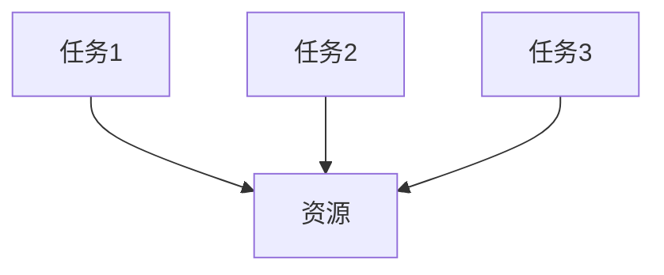

###### 4.2.2 最短作业优先（SJF）

最短作业优先（SJF）算法是根据任务所需资源的最短时间进行分配。最短时间的任务首先得到资源分配，以减少平均响应时间。

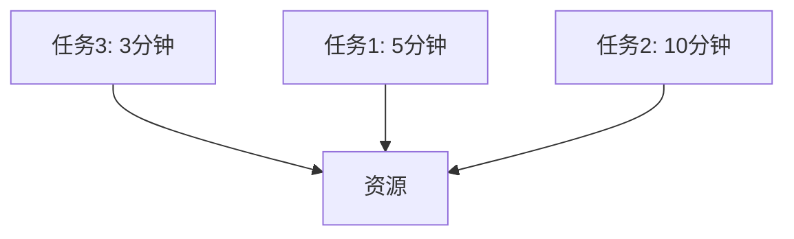

###### 4.2.3 最长作业优先（LIFO）

最长作业优先（LIFO）算法是按照任务所需资源的最长时间进行分配。最长时间的任务首先得到资源分配，以减少系统等待时间。


###### 4.2.4 轮转调度（RR）

轮转调度（RR）算法是按照固定的时间片为任务分配资源。每个任务轮流获得资源，时间片结束后，任务被暂停，下一个任务开始执行。

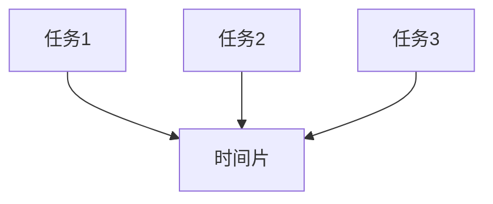

##### 4.3 负载均衡

负载均衡是指通过合理分配工作负载，避免单个资源过载，提高系统整体性能和可用性。以下是一些常见的负载均衡策略：

###### 4.3.1 轮询（Round-Robin）

轮询策略是最简单的负载均衡策略，它按照顺序将请求分配给服务器。

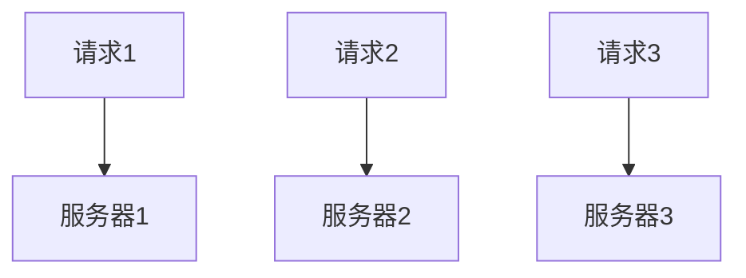

###### 4.3.2 最少连接数（Least Connections）

最少连接数策略是将新的请求分配给当前连接数最少的服务器，以平衡负载。

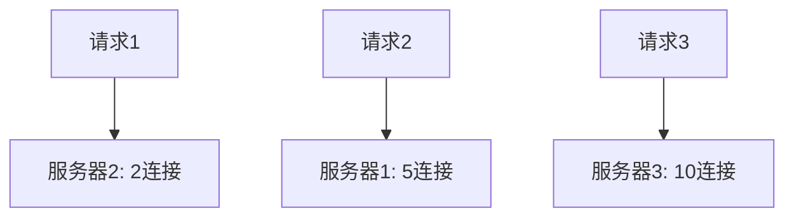

###### 4.3.3 一致性哈希（Consistent Hashing）

一致性哈希策略是将请求根据哈希值分配给服务器，以实现负载均衡和容错性。


##### 4.4 资源预留与抢占

资源预留与抢占是动态资源管理的关键机制，用于应对资源需求和优先级变化。

###### 4.4.1 资源预留

资源预留是指在任务执行前预留所需的资源，以确保任务能够顺利执行。

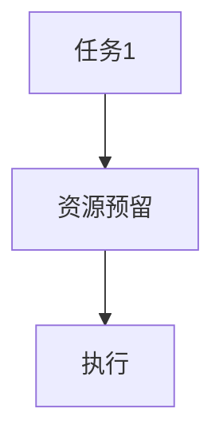

###### 4.4.2 资源抢占

资源抢占是指当高优先级任务需要更多资源时，抢占低优先级任务的资源。

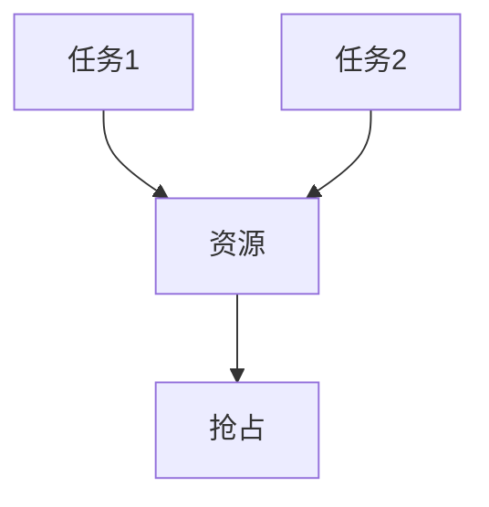

##### 4.5 实际应用案例分析

在实际应用中，资源调度与分配面临着复杂的挑战。以下为两个案例分析：

###### 4.5.1 案例一：电子商务网站

电子商务网站需要在高峰时段确保网站性能和稳定性。通过使用负载均衡器，将请求分配到多个服务器，并通过动态调整资源分配策略，确保服务器负载均衡。

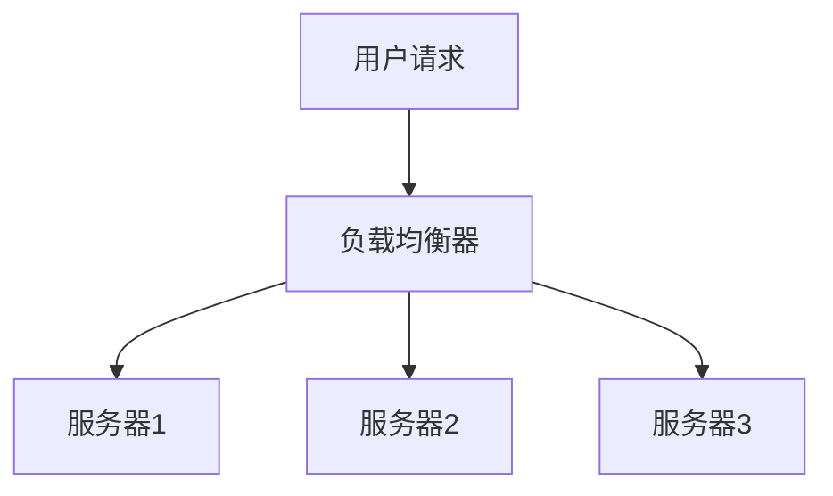

###### 4.5.2 案例二：科学计算中心

科学计算中心需要处理大量计算任务，通过使用分布式资源调度系统，将任务分配到不同的计算节点，并通过资源预留与抢占机制，确保关键任务的优先执行。

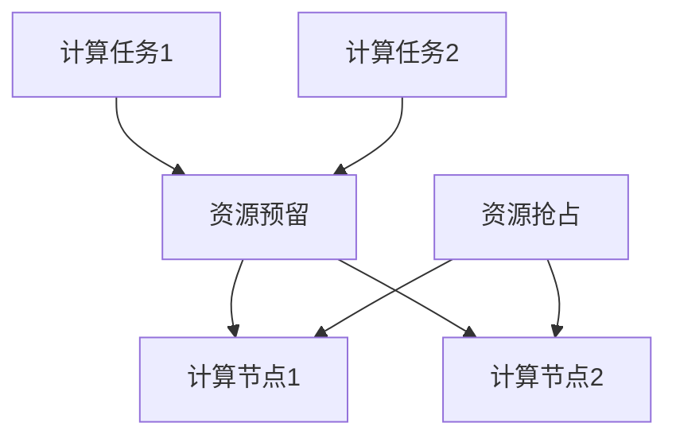

### 第4章总结

本章介绍了资源调度与分配的基本概念、资源分配算法、负载均衡策略以及资源预留与抢占机制。通过合理的资源调度与分配，可以最大化资源利用率、提高系统性能并降低能耗。在实际应用中，这些策略和机制有助于应对复杂的应用场景和需求。在下一章中，我们将探讨热数据管理与冷数据分离，进一步优化数据中心的存储和访问性能。

---

#### 第5章: 热数据管理与冷数据分离

热数据（Hot Data）和冷数据（Cold Data）是数据存储管理中的两个重要概念。热数据指的是近期频繁访问或处理的数据，具有高价值和高实时性要求；而冷数据则是较少访问或长期未使用的数据，其价值相对较低。本章将详细探讨热数据管理与冷数据分离的技术、策略以及在实际应用中的重要性。

##### 5.1 热数据与冷数据定义

###### 5.1.1 热数据

热数据是指近期被频繁访问或处理的数据，通常在以下几个场景下表现为热数据：

- **实时业务处理**：如在线交易、实时消息推送等，需要快速响应和处理。
- **高访问量应用**：如门户网站、社交媒体等，需要支持大量用户同时访问。
- **数据分析和挖掘**：如实时数据监控、实时报表生成等，需要快速处理和分析数据。

热数据通常具有以下特点：

- **访问频率高**：热数据在短时间内被频繁访问。
- **实时性要求高**：热数据的处理速度直接影响到业务响应速度。
- **数据更新频繁**：热数据需要定期更新或刷新，以保持其时效性。

###### 5.1.2 冷数据

冷数据是指不常访问或长时间未被使用的数据，通常在以下几个场景下表现为冷数据：

- **历史记录和日志**：如交易记录、系统日志等，通常在特定时间后才需要查询。
- **备份和归档**：如企业档案、旧版软件等，需要长时间保存但不会频繁访问。
- **非关键性数据**：如测试数据、旧版应用数据等，对业务影响较小。

冷数据通常具有以下特点：

- **访问频率低**：冷数据在长时间内不会或很少被访问。
- **实时性要求低**：冷数据的处理速度对业务影响较小。
- **数据更新缓慢或无需更新**：冷数据通常不需要定期更新或刷新。

##### 5.2 热数据管理

热数据管理是指针对热数据的高访问频率和实时性要求，采用特定的技术和管理策略，以确保热数据的高效存储和快速访问。以下是一些热数据管理的策略：

###### 5.2.1 热数据存储技术

- **高性能存储设备**：使用固态硬盘（SSD）或内存等高性能存储设备，以提高数据访问速度。
- **分布式存储系统**：采用分布式存储系统，如HDFS或Cassandra，以支持海量数据和并发访问。
- **缓存技术**：使用缓存技术，如内存缓存或Redis，将热数据存储在内存中，以减少数据访问延迟。

###### 5.2.2 热数据访问优化

- **缓存预热**：在用户访问热数据之前，预先将数据加载到缓存中，以减少访问延迟。
- **读缓存**：将经常访问的热数据缓存起来，减少磁盘I/O操作。
- **负载均衡**：通过负载均衡器，将访问请求均衡地分配到多个存储节点，以避免单点瓶颈。

###### 5.2.3 热数据备份与恢复

- **数据冗余**：通过数据冗余技术，如RAID或分布式存储系统，提高数据的可靠性和安全性。
- **定期备份**：定期备份热数据，以防止数据丢失或损坏。
- **快照技术**：使用快照技术，快速备份和恢复热数据到指定时间点。

##### 5.3 冷数据分离

冷数据分离是指将冷数据从热数据存储中分离出来，采用不同的存储和管理策略，以提高热数据存储性能和降低成本。以下是一些冷数据分离的策略：

###### 5.3.1 冷数据存储技术

- **低成本存储设备**：使用硬盘（HDD）或对象存储，如Amazon S3，以降低存储成本。
- **冷存储服务**：使用云服务提供商提供的冷存储服务，如AWS S3 Glacier，以存储长期不访问的数据。
- **归档存储**：将冷数据存储在归档存储中，如磁带存储，以长期保存但减少访问成本。

###### 5.3.2 冷数据访问策略

- **按需加载**：当需要访问冷数据时，将其从冷存储中加载到热存储中，以减少访问延迟。
- **数据分层存储**：将数据按访问频率和重要性分层存储，高频访问的热数据存储在快速存储设备中，低频访问的冷数据存储在低成本存储设备中。
- **索引和查询优化**：为冷数据创建索引，以便快速查询和检索数据。

##### 5.4 热数据管理与冷数据分离策略

在实际应用中，热数据管理和冷数据分离需要综合考虑数据生命周期、存储成本和访问性能。以下是一些综合策略：

###### 5.4.1 数据生命周期管理

- **数据分类**：根据数据的重要性和访问频率，将数据分为热数据和冷数据。
- **数据分级**：对热数据和冷数据进行分级存储，根据数据的重要性选择适当的存储策略。
- **数据淘汰**：定期对数据进行评估，根据数据的重要性和访问频率进行淘汰或迁移。

###### 5.4.2 热数据与冷数据分离算法

- **时效性指标**：根据数据的时间戳和访问频率，动态调整数据的存储位置。
- **访问频率统计**：定期统计数据的访问频率，根据统计结果调整数据存储策略。
- **数据存储成本**：根据数据存储成本和访问性能，选择合适的存储方案。

##### 5.5 实际应用案例分析

以下为两个实际应用案例，展示了热数据管理与冷数据分离在具体场景中的应用：

###### 5.5.1 案例一：社交网络平台

社交网络平台需要处理海量用户数据，其中部分数据如用户动态和消息是热数据，而用户历史记录和日志是冷数据。通过热数据管理策略，确保用户动态和消息的快速访问；通过冷数据分离策略，将用户历史记录和日志迁移到低成本存储设备，以降低存储成本。

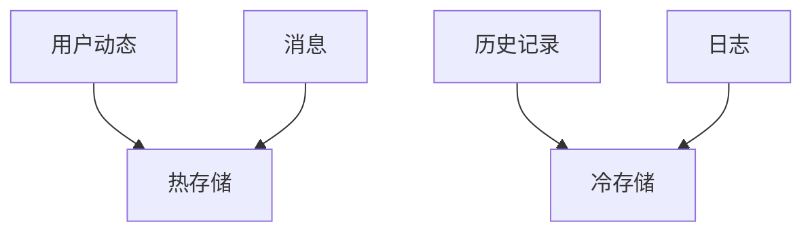

###### 5.5.2 案例二：金融机构

金融机构需要处理大量的交易数据和客户数据，其中实时交易数据是热数据，而历史交易记录和客户档案是冷数据。通过热数据管理策略，确保实时交易数据的快速访问和安全性；通过冷数据分离策略，将历史交易记录和客户档案迁移到低成本存储设备，以降低存储成本。

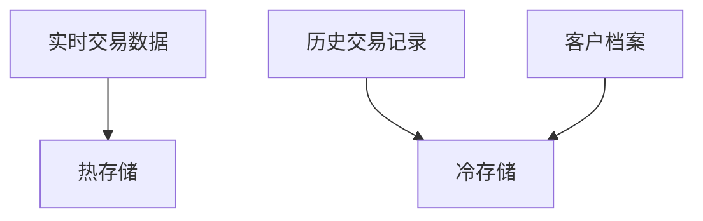

### 第5章总结

本章介绍了热数据与冷数据的定义、热数据管理的策略、冷数据分离的策略以及在实际应用中的重要性。通过合理的热数据管理和冷数据分离策略，可以优化数据存储和访问性能，提高资源利用率并降低成本。在下一章中，我们将探讨能耗优化与绿色数据中心建设，进一步探讨数据中心资源优化的环境和可持续性挑战。

---

#### 第6章: 能耗优化与绿色数据中心建设

##### 6.1 数据中心能耗问题

数据中心能耗问题日益凸显，其能耗构成和影响因素成为优化目标的关键。以下将详细讨论数据中心能耗的构成、影响因素以及能耗优化的必要性。

###### 6.1.1 数据中心能耗构成

数据中心的能耗主要由以下几部分构成：

1. **计算能耗**：包括服务器、存储设备和其他计算设备在运行过程中消耗的电能。计算能耗是数据中心能耗的主要组成部分。

2. **存储能耗**：包括硬盘、固态硬盘和其他存储设备在运行过程中消耗的电能。存储设备在数据读写和处理过程中消耗大量电能。

3. **网络能耗**：包括局域网、广域网和数据中心的网络设备在运行过程中消耗的电能。网络设备在数据传输和处理过程中也消耗大量电能。

4. **冷却能耗**：包括数据中心冷却系统（如空调、冷却塔等）在运行过程中消耗的电能。冷却能耗主要用于维持数据中心的正常运行温度，防止设备过热。

5. **其他能耗**：包括数据中心办公设施、照明和其他辅助设施在运行过程中消耗的电能。

###### 6.1.2 数据中心能耗影响因素

数据中心能耗受到以下因素的影响：

1. **设备密度**：数据中心的设备密度越高，计算和存储设备越多，能耗越大。高设备密度会导致空间温度升高，增加冷却能耗。

2. **设备能效**：设备能效直接影响数据中心的能耗。高能效设备具有较低的功耗，有助于降低能耗。

3. **数据中心规模**：数据中心规模越大，其能耗越高。大型数据中心通常需要更多的计算和存储设备，以及更复杂的网络和冷却系统。

4. **运行时间**：数据中心运行时间越长，能耗越大。数据中心全年无休，需要持续消耗电能。

5. **管理策略**：数据中心的管理策略对能耗有重要影响。合理的管理策略可以优化设备运行状态，降低能耗。

###### 6.1.3 能耗优化的必要性

能耗优化对于数据中心具有重要意义：

1. **降低运营成本**：能耗优化可以降低数据中心的电力消耗，从而减少电费支出，降低运营成本。

2. **提高竞争力**：随着能耗成本的不断增加，能耗优化成为企业降低成本、提高竞争力的关键。

3. **环保要求**：全球气候变化问题日益严重，数据中心作为高能耗产业，面临越来越多的环保要求。能耗优化有助于降低碳排放，符合可持续发展战略。

4. **延长设备寿命**：通过能耗优化，降低设备运行温度，可以延长设备寿命，减少设备维护和更换成本。

### 第一部分总结

本章介绍了数据中心能耗问题，包括能耗构成、影响因素以及能耗优化的必要性。在数据中心资源优化中，能耗优化是一个重要的目标，关系到数据中心的可持续发展和环境责任。在下一章中，我们将探讨能耗优化的策略与方法，包括高效硬件选择、系统架构优化和冷却系统优化。

---

#### 第6章：能耗优化策略

##### 6.2 高效硬件选择

在数据中心能耗优化中，选择高效硬件设备是关键的一步。以下将详细讨论如何选择高效的计算设备、存储设备和网络设备。

###### 6.2.1 计算设备

1. **CPU选择**：在选择CPU时，应优先考虑高能效比的CPU。例如，Intel的Xeon系列和AMD的EPYC系列都是高性能、低功耗的CPU选项。

2. **GPU选择**：GPU在深度学习和大数据处理中扮演着重要角色。NVIDIA的GPU，如A100和RTX系列，具有高效的计算能力和较低的功耗。

3. **TPU选择**：Google的TPU是专门为AI应用设计的硬件，其计算性能和能效比都非常优秀。

###### 6.2.2 存储设备

1. **硬盘选择**：固态硬盘（SSD）相比传统的硬盘（HDD）具有更低的功耗和更快的读写速度。SSD更适合存储热数据和频繁访问的数据。

2. **存储系统选择**：分布式存储系统，如HDFS和Cassandra，可以优化数据存储和访问，减少单点故障，提高系统的可靠性和能效。

3. **存储密度**：在选择存储设备时，应考虑存储密度。例如，使用2TB或4TB的SSD，而不是多个1TB的HDD，可以减少设备数量和功耗。

###### 6.2.3 网络设备

1. **交换机选择**：选择高能效比的交换机，如Intel的X710系列和Cisco的Nexus系列，可以降低网络设备的能耗。

2. **网络拓扑**：优化网络拓扑结构，减少网络传输距离和传输层级，可以降低网络能耗。

3. **网络带宽管理**：合理分配网络带宽，避免网络拥堵，可以提高数据传输效率，减少能耗。

### 第一部分总结

本章讨论了数据中心能耗优化的策略，特别是高效硬件选择。选择高性能、低功耗的硬件设备是降低能耗和提高数据中心能效的重要途径。在下一章中，我们将探讨系统架构优化和冷却系统优化，进一步深入能耗优化的细节。

---

#### 第6章：系统架构优化

系统架构优化是数据中心能耗优化的关键环节，通过改进硬件布局、软件优化和系统调度，可以显著降低能耗。以下将详细讨论系统架构优化的方法。

##### 6.3 系统架构优化方法

###### 6.3.1 硬件布局优化

1. **设备紧凑布局**：将高功耗的设备（如服务器和存储设备）紧凑布局，以减少电力线缆和冷却系统的能耗。

2. **热通道隔离**：通过热通道隔离技术，将发热量大的设备隔离在单独的冷却通道中，提高冷却效率。

3. **机房通风优化**：优化机房通风系统，确保空气流动均匀，降低冷却能耗。

###### 6.3.2 软件优化

1. **虚拟化技术**：采用虚拟化技术，如VMware和KVM，可以实现计算资源的动态分配，降低闲置资源的能耗。

2. **容器化技术**：容器化技术，如Docker和Kubernetes，可以提高应用部署的效率，减少资源浪费。

3. **能耗管理软件**：使用能耗管理软件，如NVIDIA的NvPowerD，可以实时监控和优化GPU的功耗。

###### 6.3.3 系统调度优化

1. **动态调度**：通过动态调度算法，根据负载情况调整资源分配，避免资源闲置。

2. **迁移策略**：使用迁移策略，将低负载的服务器迁移到低功耗状态，如休眠或关闭。

3. **负载均衡**：通过负载均衡，将工作负载均匀分配到不同的服务器上，避免单点过载。

### 第一部分总结

系统架构优化是降低数据中心能耗的重要手段，通过改进硬件布局、软件优化和系统调度，可以实现显著的能耗降低。在下一章中，我们将探讨冷却系统优化和绿色数据中心建设，进一步深入能耗优化的细节。

---

#### 第6章：冷却系统优化

冷却系统优化是数据中心能耗优化的关键环节，通过提高冷却效率、优化冷却系统和采用智能冷却控制技术，可以显著降低冷却能耗。以下将详细讨论冷却系统优化的方法。

##### 6.4 冷却系统优化方法

###### 6.4.1 冷却效率提升

1. **热管冷却**：热管冷却技术通过利用相变传热，将热量迅速传递到冷凝器，提高冷却效率。

2. **水冷系统**：水冷系统使用冷却水循环带走热量，相比空气冷却具有更高的冷却效率。

3. **智能冷却**：通过实时监控数据中心的温度和湿度，智能调整冷却设备的运行状态，提高冷却效率。

###### 6.4.2 冷却系统优化

1. **冷却塔优化**：优化冷却塔的运行模式，根据环境温度和湿度调整冷却水量，降低能耗。

2. **机房通风**：优化机房通风系统，确保空气流动均匀，减少冷却设备的负载。

3. **冷热通道隔离**：通过冷热通道隔离技术，将发热设备与冷却设备隔离，提高冷却效率。

###### 6.4.3 智能冷却控制技术

1. **预测控制**：通过预测数据中心的温度变化，提前调整冷却设备的运行状态，提高冷却效率。

2. **自适应控制**：根据实时监控数据，自适应调整冷却设备的运行参数，实现最优冷却效果。

3. **能源管理系统**：集成能源管理系统（EMS），实时监控和管理冷却设备的能耗，提高能源利用效率。

### 第一部分总结

冷却系统优化是数据中心能耗优化的关键，通过提升冷却效率、优化冷却系统和采用智能冷却控制技术，可以显著降低冷却能耗。在下一章中，我们将探讨可再生能源使用和绿色数据中心建设，进一步探讨如何实现数据中心的可持续发展。

---

#### 第6章：可再生能源使用与绿色数据中心建设

可再生能源的使用是数据中心能耗优化的关键步骤之一，它不仅有助于降低运营成本，还能减少碳排放，实现绿色数据中心建设。以下将详细讨论可再生能源的类型、利用策略以及绿色数据中心建设的关键步骤。

##### 6.5 可再生能源使用

可再生能源是指那些在人类时间尺度内不会枯竭、对环境友好的能源，如太阳能、风能、水能和地热能。以下是一些可再生能源的类型及其应用策略：

###### 6.5.1 太阳能

1. **光伏发电**：通过太阳能电池板将太阳光转换为电能，适用于数据中心屋顶和地面安装。
2. **储能系统**：结合储能系统（如电池储能），可以在太阳能发电不足时提供电力支持。

###### 6.5.2 风能

1. **风力发电**：利用风力涡轮机将风能转换为电能，适用于风力资源丰富的地区。
2. **混合储能**：结合储能系统，风能发电可以与太阳能发电相互补充，提高整体能源利用效率。

###### 6.5.3 水能

1. **水力发电**：利用水流势能发电，适用于有合适地形和水流条件的地方。
2. **废水利用**：利用冷却水和废水进行二次利用，减少对新鲜水资源的需求。

###### 6.5.4 地热能

1. **地热发电**：利用地热资源进行发电，适用于地热资源丰富的地区。
2. **地热冷却**：利用地热进行数据中心冷却，降低空调能耗。

##### 6.6 绿色数据中心建设

绿色数据中心建设是指通过采用节能技术和优化管理策略，实现数据中心的高效运行和环保目标。以下是一些关键步骤：

###### 6.6.1 绿色数据中心设计原则

1. **高能效比**：选择高效能比的硬件设备，降低能耗。
2. **模块化设计**：采用模块化设计，便于扩容和维护。
3. **可再生能源利用**：充分利用可再生能源，降低对化石燃料的依赖。

###### 6.6.2 绿色数据中心建设步骤

1. **初期规划**：明确建设目标、规模和能源需求，选择合适的可再生能源。
2. **设备选型**：选择高能效比的硬件设备，如服务器、存储设备和网络设备。
3. **系统架构优化**：优化数据中心架构，如采用虚拟化技术、分布式计算和智能调度。
4. **冷却系统优化**：采用高效冷却系统，如热管冷却、水冷系统和智能冷却控制。
5. **能源管理系统**：建立完善的能源管理系统，实时监控和管理能耗。

###### 6.6.3 绿色数据中心评估与认证

1. **能耗指标评估**：定期评估数据中心的能耗指标，确保达到绿色数据中心的标准。
2. **环境影响评估**：评估数据中心的碳排放、水资源消耗和废弃物处理，确保环境影响最小化。
3. **绿色认证**：申请国际绿色数据中心认证（如LEED认证），提高数据中心的环保声誉。

### 第一部分总结

可再生能源的使用和绿色数据中心建设是实现数据中心能耗优化和可持续发展的关键。通过采用可再生能源、优化数据中心设计和建设步骤，可以显著降低能耗、减少碳排放，实现绿色数据中心建设。在下一章中，我们将探讨AI大模型应用数据中心的资源优化实践，结合实际案例展示资源优化策略和方法。

---

#### 第6章总结

本章详细探讨了数据中心能耗优化与绿色数据中心建设的关键要素。我们首先分析了数据中心能耗的构成和影响因素，并讨论了能耗优化的必要性。接着，我们提出了高效硬件选择、系统架构优化、冷却系统优化以及可再生能源使用和绿色数据中心建设的方法。通过这些策略，数据中心可以在保证性能的同时降低能耗，实现可持续发展。

在能耗优化的过程中，高效硬件选择是基础，通过选用高能效比的硬件设备，可以显著降低能耗。系统架构优化则是通过改进硬件布局、软件优化和系统调度，进一步提高能耗效率。冷却系统优化旨在提高冷却效率，降低冷却能耗，而可再生能源使用和绿色数据中心建设则是在能源供应和管理方面实现可持续性。

在实际应用中，这些策略和方法可以通过案例和项目实战得到验证。例如，谷歌和微软等科技巨头已经在数据中心中广泛应用了这些策略，通过优化能耗管理和采用可再生能源，实现了显著的能耗降低和环保效果。

在下一章中，我们将通过具体案例和实践，进一步探讨AI大模型应用数据中心的资源优化实践，展示如何将理论策略应用于实际数据中心运营中。

---

#### 第7章: AI大模型应用数据中心的资源优化实践

##### 7.1 资源优化实践概述

AI大模型在数据中心的应用带来了巨大的计算和存储需求，为了确保这些模型能够高效、稳定地运行，资源优化实践成为数据中心运营的关键。本章节将介绍AI大模型应用数据中心资源优化的实践概述，包括资源优化实践的目的、关键环节以及资源优化实践的整体流程。

###### 7.1.1 资源优化实践的目的

资源优化实践的主要目的是：

1. 提高资源利用率：通过合理的资源分配和调度，使计算资源、存储资源和网络资源得到最大化利用，避免资源浪费。
2. 降低运营成本：通过优化能耗管理和采用高效硬件，减少数据中心运行的成本。
3. 提高性能和可靠性：通过优化数据中心架构和系统配置，提高数据中心的整体性能和可靠性。
4. 实现绿色建设：通过采用可再生能源和节能技术，降低数据中心的能耗和碳排放，实现绿色数据中心建设。

###### 7.1.2 资源优化实践的关键环节

资源优化实践涉及以下几个关键环节：

1. **数据中心架构设计**：选择合适的硬件设备、网络架构和系统架构，以支持AI大模型的训练和推理需求。
2. **资源调度与分配**：通过调度算法和分配策略，动态调整资源分配，提高资源利用率。
3. **热数据管理与冷数据分离**：优化数据存储和访问方式，将热数据和冷数据分离存储，提高存储性能和访问速度。
4. **能耗优化**：通过优化冷却系统和能源管理，降低数据中心的能耗。
5. **绿色建设与可持续发展**：采用可再生能源和绿色技术，实现数据中心的可持续发展。

###### 7.1.3 资源优化实践的整体流程

资源优化实践的整体流程可以分为以下几个步骤：

1. **需求分析**：分析AI大模型的应用场景和资源需求，明确资源优化的目标和关键环节。
2. **架构设计**：设计数据中心架构，选择合适的硬件设备、网络架构和系统架构。
3. **资源调度与分配**：制定资源调度策略和分配方案，确保资源的高效利用。
4. **热数据管理与冷数据分离**：优化数据存储和访问方式，提高存储性能和访问速度。
5. **能耗优化**：优化冷却系统和能源管理，降低数据中心的能耗。
6. **实施与监控**：实施资源优化方案，并进行实时监控和调整，确保优化效果。
7. **评估与改进**：定期评估资源优化效果，根据评估结果进行改进和优化。

### 第一部分总结

通过本章的讨论，我们对AI大模型应用数据中心的资源优化实践有了更深入的了解。资源优化实践旨在提高资源利用率、降低运营成本、提高性能和可靠性，并实现绿色数据中心建设。在下一章中，我们将详细介绍数据中心架构设计与优化，为资源优化实践提供坚实的基础。

---

#### 第7章：数据中心架构设计与优化

数据中心架构设计是资源优化实践的基础，它决定了数据中心能否高效、稳定地支持AI大模型的训练和推理。以下将详细讨论数据中心架构设计的原则、架构优化的策略以及数据中心设计的关键步骤。

##### 7.2 数据中心架构设计原则

数据中心架构设计应遵循以下原则：

1. **高可用性**：确保数据中心能够持续运行，提供不间断的服务。通过冗余设计和故障恢复机制，降低系统故障对业务的影响。
2. **高扩展性**：设计具有良好扩展性的架构，支持业务增长和动态调整。通过模块化设计和灵活的扩展策略，实现资源的灵活分配和扩展。
3. **高性能**：设计高性能的架构，提高数据中心的计算速度、存储速度和网络传输速度。通过优化硬件选型和网络拓扑结构，确保系统性能。
4. **低成本**：在满足性能和可靠性的前提下，尽量降低建设成本和维护成本。通过合理的设备选型和能耗优化，降低整体运营成本。
5. **安全性**：确保数据安全和系统安全，防止数据泄露、恶意攻击和系统故障。通过安全策略和防护措施，保障数据中心的运行安全。

##### 7.3 数据中心架构优化的策略

数据中心架构优化是资源优化实践的重要环节，以下是一些常见的优化策略：

1. **硬件设备选型**：选择高性能、低功耗的硬件设备，如CPU、GPU、TPU和存储设备。通过优化硬件配置，提高系统的计算能力和存储性能。
2. **网络架构设计**：设计高效、可靠的网络架构，确保数据传输的快速和稳定。通过分布式网络和负载均衡策略，提高网络性能和可靠性。
3. **存储架构优化**：采用分布式存储系统和多层级存储策略，提高数据存储的性能和可靠性。通过数据压缩和去重技术，减少存储空间的需求。
4. **虚拟化与容器化**：采用虚拟化技术（如VMware、KVM）和容器化技术（如Docker、Kubernetes），提高资源利用率和系统灵活性。通过虚拟化和容器化，实现资源的动态分配和管理。
5. **能效优化**：通过优化冷却系统和电源管理，降低数据中心的能耗。采用智能冷却和电源管理技术，提高能源利用效率。

##### 7.4 数据中心设计的关键步骤

数据中心设计涉及多个关键步骤，以下是一个典型的数据中心设计流程：

1. **需求分析**：明确数据中心的建设目标、业务需求和技术需求。分析数据中心的规模、性能要求、安全性要求以及能源消耗等。
2. **架构设计**：根据需求分析，设计数据中心的整体架构，包括硬件设备、网络架构、存储架构和冷却系统等。确定数据中心的设备选型、网络拓扑结构和系统架构。
3. **硬件设备选型**：选择合适的硬件设备，包括服务器、存储设备、网络设备、冷却设备等。通过对比不同设备的性能、功耗和成本，确定最佳硬件配置。
4. **网络架构设计**：设计高效、可靠的网络架构，包括局域网、广域网和数据中心网络。通过优化网络拓扑结构和负载均衡策略，提高网络性能和可靠性。
5. **存储架构设计**：设计分布式存储系统和多层级存储策略，确保数据存储的高性能和高可靠性。通过数据压缩和去重技术，减少存储空间的需求。
6. **冷却系统设计**：设计高效的冷却系统，包括冷却设备、冷却管道和冷却塔等。通过优化冷却系统的设计和运行参数，提高冷却效率和降低能耗。
7. **系统集成与部署**：将硬件设备、网络设备和存储设备进行系统集成和部署。通过配置和管理系统软件，确保数据中心系统的稳定运行。
8. **测试与优化**：对数据中心系统进行测试和优化，确保系统性能和稳定性。通过性能测试和故障恢复测试，验证数据中心的可靠性和性能。
9. **监控与维护**：建立数据中心的监控和维护体系，实时监控数据中心的运行状态和性能。通过定期维护和故障处理，确保数据中心的长期稳定运行。

### 第一部分总结

数据中心架构设计是资源优化实践的重要环节，通过遵循设计原则、采用优化策略和完成关键设计步骤，可以构建一个高效、可靠、灵活的数据中心。在下一章中，我们将探讨资源调度与分配实践，进一步深入资源优化的具体实现。

---

#### 第7章：资源调度与分配实践

资源调度与分配是数据中心资源优化的重要组成部分，它关系到数据中心能否高效利用计算资源、存储资源和网络资源，从而提高整体性能和可靠性。以下将详细讨论资源调度与分配实践中的关键策略、工具和技术。

##### 7.5 资源调度与分配策略

资源调度与分配策略主要包括以下几个方面：

1. **负载均衡策略**：通过负载均衡器将工作负载分配到不同的计算节点上，避免单个节点过载。常见的负载均衡策略包括轮询、最小连接数、加权轮询等。
   
2. **动态调度策略**：根据系统的实时负载和资源需求，动态调整资源的分配。动态调度策略包括基于CPU使用率、内存使用率、I/O使用率等指标的调度算法。

3. **优先级调度策略**：根据任务的优先级进行资源分配，确保高优先级的任务得到优先调度和资源。优先级调度策略包括基于任务的紧急程度、重要性等指标。

4. **预留策略**：在任务开始前预留所需的资源，以确保任务能够顺利执行。预留策略可以防止资源争用和死锁，提高任务的执行成功率。

5. **抢占策略**：在资源紧张时，抢占低优先级任务的资源，优先保证高优先级任务的执行。抢占策略可以防止资源浪费和任务延迟。

##### 7.6 资源调度与分配工具

在资源调度与分配实践中，常用的工具包括以下几种：

1. **资源管理平台**：如OpenStack、VMware vCenter等，提供统一的资源管理和调度功能，支持虚拟化和容器化环境。

2. **负载均衡器**：如Nginx、HAProxy等，用于实现网络层面的负载均衡，优化数据流量分配。

3. **调度系统**：如Kubernetes、Apache Mesos等，用于实现计算资源的动态调度和资源分配，支持大规模分布式系统的资源管理。

4. **监控工具**：如Prometheus、Zabbix等，用于实时监控系统的资源使用情况，提供数据支持调度决策。

##### 7.7 资源调度与分配技术

资源调度与分配技术主要包括以下几个方面：

1. **调度算法**：设计并实现高效的调度算法，如最长作业优先（LIFO）、最短作业优先（SJF）、轮转调度（RR）等，以满足不同任务的调度需求。

2. **资源分配模型**：构建资源分配模型，用于描述系统的资源需求、资源供给和资源分配策略。常见的资源分配模型包括静态分配模型和动态分配模型。

3. **资源预留与抢占机制**：设计资源预留与抢占机制，用于在任务开始前预留资源，并在资源紧张时抢占低优先级任务的资源。

4. **负载预测与调度**：通过负载预测技术，预测系统的未来负载，并根据负载预测结果调整资源分配策略，实现自适应调度。

##### 7.8 资源调度与分配实践案例

以下是一个资源调度与分配实践案例：

**案例背景**：一个大型电子商务网站在高峰时段面临巨大的数据处理需求，需要确保网站性能和响应速度。

**解决方案**：

1. **负载均衡**：使用Nginx作为负载均衡器，将用户请求分配到多个后端服务器上，实现流量均衡和性能优化。

2. **动态调度**：使用Kubernetes作为调度系统，根据系统的实时负载动态调整资源分配，确保服务器资源得到充分利用。

3. **预留策略**：在高峰时段，提前预留一定数量的服务器资源，确保重要任务的执行。

4. **抢占策略**：当资源紧张时，通过抢占低优先级任务的资源，保证高优先级任务的执行。

**实施效果**：

- 通过负载均衡和动态调度，有效提高了网站的响应速度和性能。
- 通过预留策略和抢占策略，确保了重要任务的顺利执行，降低了任务延迟。

### 第一部分总结

本章介绍了资源调度与分配实践的关键策略、工具和技术，并通过实际案例展示了资源调度与分配在数据中心运营中的应用。通过合理的资源调度与分配，可以最大化资源利用率、提高系统性能和可靠性，为AI大模型应用提供稳定、高效的运行环境。在下一章中，我们将探讨能耗优化与绿色数据中心建设的实践，进一步深化资源优化的可持续性。

---

#### 第7章：能耗优化与绿色数据中心建设实践

##### 7.9 能耗优化实践

能耗优化是数据中心资源优化的重要环节，通过优化硬件设备、系统架构和能源管理，可以显著降低数据中心的能耗。以下是一些能耗优化的具体实践方法：

1. **高效硬件设备选型**：选择能效比高的硬件设备，如服务器、存储设备和网络设备。例如，使用低功耗的CPU、GPU和SSD，减少能源消耗。

2. **能效管理软件**：使用能效管理软件，如NVIDIA的NvPowerD和Intel的PowerGadget，实时监控和优化设备的能耗。通过调整硬件设备的功耗设置，降低不必要的能耗。

3. **虚拟化和容器化**：通过虚拟化和容器化技术，实现资源的动态分配和优化。例如，使用KVM和Docker，可以提高资源利用率，减少能源消耗。

4. **智能电源管理**：采用智能电源管理技术，如动态电源管理（DPM）和虚拟化电源管理（VPM），根据系统负载动态调整设备的功耗。例如，在低负载时关闭部分硬件设备，在高负载时启用备用设备，以实现最优能耗管理。

##### 7.10 绿色数据中心建设实践

绿色数据中心建设是指通过采用可再生能源和节能技术，降低数据中心的能耗和碳排放，实现绿色、可持续的数据中心运营。以下是一些绿色数据中心建设的具体实践方法：

1. **可再生能源使用**：采用可再生能源，如太阳能、风能和水能，为数据中心提供电力。例如，安装太阳能电池板和风力涡轮机，实现部分或全部电力自给自足。

2. **节能建筑设计**：在设计数据中心时，采用节能建筑设计，如自然通风、自然采光和高效隔热材料。通过优化建筑布局和结构，降低空调和照明能耗。

3. **高效冷却系统**：采用高效冷却系统，如水冷系统、热管冷却和智能冷却控制，降低冷却能耗。通过优化冷却系统的设计和运行参数，提高冷却效率。

4. **绿色运维管理**：采用绿色运维管理策略，如能源监测和调度、废弃物处理和环保材料使用，降低数据中心的能源消耗和环境影响。

##### 7.11 实际案例分析与总结

以下为两个实际案例，展示了能耗优化和绿色数据中心建设的实践效果：

###### 7.11.1 案例一：谷歌数据中心

**案例背景**：谷歌在其数据中心中采用了一系列的能耗优化和绿色建设措施，以实现可持续运营。

**解决方案**：

- **可再生能源使用**：谷歌在其数据中心附近安装了大量的太阳能电池板和风力涡轮机，实现了部分或全部电力自给自足。
- **高效冷却系统**：谷歌采用了水冷系统和智能冷却控制，提高了冷却效率，降低了冷却能耗。
- **绿色运维管理**：谷歌实施了能源监测和调度策略，优化了数据中心的能源使用，降低了能耗。

**实施效果**：

- 通过可再生能源的使用，谷歌的数据中心实现了大幅度的能源消耗降低。
- 通过高效冷却系统和绿色运维管理，谷歌的数据中心能耗进一步降低，碳排放减少。

###### 7.11.2 案例二：微软Azure数据中心

**案例背景**：微软在其Azure数据中心中采用了多种能耗优化和绿色建设

