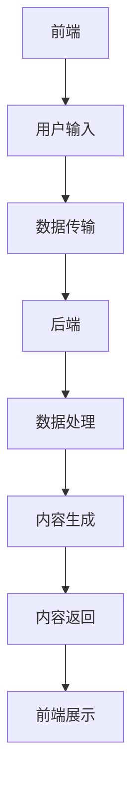

                 

### 《AIGC从入门到实战：关于企业和组织》

关键词：AIGC、人工智能、生成式AI、交互式AI、企业应用、技术趋势

摘要：
本文旨在系统地介绍AIGC（AI-Generated Content）的概念、原理、应用和实践，特别关注其在企业和组织中的角色和潜力。通过对AIGC从入门到实战的全面剖析，本文旨在帮助读者理解AIGC的核心技术、应用场景、未来趋势及其面临的挑战和机遇。

---

### 第一部分: AIGC从入门到实战：关于企业和组织概述

#### 1.1 AIGC概念介绍

AIGC，即AI-Generated Content，是指利用人工智能技术生成内容的过程。这些内容可以是文本、图像、视频等多种形式。AIGC的核心在于生成式AI和交互式AI的结合，旨在实现高度个性化的内容和体验。

##### AIGC定义与分类

AIGC可以细分为以下几个类别：

1. **文本生成**：利用自然语言处理（NLP）技术生成文章、报告、对话等。
2. **图像生成**：通过生成对抗网络（GAN）等技术生成逼真的图像。
3. **视频生成**：结合图像生成和视频处理技术生成动态视频。
4. **音乐生成**：利用生成式AI生成旋律、曲调等音乐内容。

##### 在企业和组织中的应用

AIGC在企业和组织中的应用场景广泛，主要包括：

1. **内容创作**：自动生成新闻报道、市场分析报告、产品描述等。
2. **客户服务**：通过聊天机器人提供个性化、高效的客户支持。
3. **市场营销**：生成吸引人的广告内容，提高营销效果。
4. **教育**：自动生成教学视频、课程内容，提高教育质量。

#### 1.2 AIGC的发展历程

AIGC的发展历程可以追溯到20世纪80年代，当时人工智能研究主要集中在专家系统和知识表示领域。随着深度学习的兴起，生成式AI开始迅速发展，AIGC也逐渐走向成熟。

##### 发展简史

1. **初期探索（1980s-1990s）**：人工智能研究主要集中在逻辑推理和知识表示。
2. **深度学习兴起（2006-2012）**：深度学习技术的突破，特别是卷积神经网络（CNN）和生成对抗网络（GAN），为AIGC提供了强大的技术支持。
3. **商业化应用（2013-至今）**：随着计算能力的提升和大数据的普及，AIGC开始在企业和组织中广泛应用。

#### 1.3 AIGC的核心技术

AIGC的核心技术主要包括生成式AI和交互式AI。

##### 生成式AI

生成式AI是一种利用统计模型或神经网络生成数据的方法。它主要包括以下几种技术：

1. **生成对抗网络（GAN）**：GAN由生成器和判别器组成，通过对抗训练生成高质量的数据。
2. **变分自编码器（VAE）**：VAE通过概率模型将输入数据映射到隐变量空间，从而生成新的数据。
3. **循环神经网络（RNN）**：RNN能够处理序列数据，适用于生成文本、音乐等。

##### 交互式AI

交互式AI是指人与AI系统之间的实时互动。它主要包括以下几种技术：

1. **对话系统设计**：通过自然语言处理和对话管理技术，实现人与AI系统的自然对话。
2. **个性化推荐算法**：基于用户的历史行为和偏好，为用户推荐个性化的内容和产品。

#### 1.4 AIGC的产业应用

AIGC在多个产业中都有广泛的应用，以下是一些典型应用场景：

##### 企业应用场景

1. **内容创作**：通过AIGC生成高质量的内容，如新闻报道、产品描述、营销文案等。
2. **客户服务**：利用AIGC构建智能客服系统，提高客户满意度和效率。
3. **市场营销**：自动生成广告内容，提高营销效果。
4. **教育**：自动生成教学视频、课程内容，提高教育质量。
5. **医疗**：利用AIGC生成医学报告、诊断建议等。

##### 组织应用场景

1. **文档处理**：自动生成会议纪要、报告总结等。
2. **数据分析**：利用AIGC生成数据分析报告、可视化图表等。
3. **决策支持**：通过AIGC生成决策建议、预测分析等。

#### 1.5 AIGC的挑战与机遇

##### AIGC面临的挑战

1. **数据隐私**：生成的内容可能会涉及个人隐私，如何保护用户隐私是一个重要问题。
2. **伦理问题**：AI生成的内容可能存在偏见和不公平性，如何确保内容的公正性是一个挑战。
3. **技术门槛**：AIGC需要较高的技术门槛，企业和组织需要投入大量资源和时间进行技术积累。

##### AIGC的发展机遇

1. **市场潜力**：随着AI技术的普及，AIGC市场潜力巨大，企业和组织可以通过AIGC提高效率和质量。
2. **创新空间**：AIGC为企业和组织提供了无限的创意空间，可以推动产品和服务的创新。
3. **跨行业应用**：AIGC可以在多个行业中获得广泛应用，为企业带来新的商业模式和价值。

---

### 第二部分: AIGC核心概念与架构

#### 2.1 AIGC架构概述

AIGC系统架构可以分为前端、后端和中间件三个主要部分。

##### AIGC系统架构

1. **前端**：负责用户交互和内容展示，通常包括网页、移动应用等。
2. **后端**：负责数据处理和AI算法的实现，包括生成式AI和交互式AI模型。
3. **中间件**：提供数据存储、通信、监控等功能，支持系统的稳定运行。

##### 前端与后端的交互

前端通过API与后端进行数据交互，主要包括以下步骤：

1. **用户输入**：用户在前端输入请求或数据。
2. **数据传输**：前端将输入数据发送到后端。
3. **数据处理**：后端处理输入数据，调用AI算法生成内容。
4. **内容返回**：后端将生成的内容返回给前端，进行展示。

#### 2.2 生成式AI模型

生成式AI模型是AIGC的核心组成部分，主要包括以下几种模型：

##### 生成对抗网络（GAN）

1. **模型原理**：GAN由生成器和判别器组成，通过对抗训练生成高质量的数据。
2. **应用场景**：图像生成、视频生成、音乐生成等。

##### 变分自编码器（VAE）

1. **模型原理**：VAE通过概率模型将输入数据映射到隐变量空间，从而生成新的数据。
2. **应用场景**：图像生成、文本生成、数据增强等。

##### 循环神经网络（RNN）

1. **模型原理**：RNN能够处理序列数据，适用于生成文本、音乐等。
2. **应用场景**：自然语言处理、时间序列预测、音乐生成等。

#### 2.3 交互式AI技术

交互式AI技术是实现人与AI系统实时互动的关键，主要包括以下几种技术：

##### 对话系统设计

1. **模型原理**：对话系统通过自然语言处理和对话管理技术，实现人与AI系统的自然对话。
2. **应用场景**：智能客服、虚拟助手、在线教育等。

##### 个性化推荐算法

1. **模型原理**：个性化推荐算法基于用户的历史行为和偏好，为用户推荐个性化的内容和产品。
2. **应用场景**：电子商务、社交媒体、新闻推送等。

#### 2.4 AIGC架构的核心联系

AIGC架构中的各个部分紧密相连，共同构成了一个完整的系统。

##### 核心联系与Mermaid流程图

以下是一个简单的Mermaid流程图，展示了AIGC架构中的核心联系：



---

### 第三部分: AIGC核心算法原理

#### 3.1 生成式AI算法

生成式AI算法是AIGC的核心技术之一，主要包括以下几种算法：

##### 生成对抗网络（GAN）

1. **算法原理**：GAN由生成器和判别器组成，生成器和判别器通过对抗训练优化模型。
2. **算法伪代码**：

```python
# 生成器G的伪代码
def G(z):
    # 输入随机噪声z，输出假样本x
    x = ...

# 判别器D的伪代码
def D(x, z):
    # 输入真实样本x和假样本z，输出概率
    probability = ...
```

##### 变分自编码器（VAE）

1. **算法原理**：VAE通过概率模型将输入数据映射到隐变量空间，从而生成新的数据。
2. **算法伪代码**：

```python
# VAE的伪代码
def encode(x):
    # 输入数据x，输出编码结果z
    z = ...

def decode(z):
    # 输入编码结果z，输出重构数据x
    x = ...

def VAE(x):
    z = encode(x)
    x_recon = decode(z)
    return x_recon
```

##### 循环神经网络（RNN）

1. **算法原理**：RNN能够处理序列数据，适用于生成文本、音乐等。
2. **算法伪代码**：

```python
# RNN的伪代码
def RNN(input_sequence, hidden_state):
    # 输入序列input_sequence和隐藏状态hidden_state，输出新的隐藏状态
    hidden_state = ...
    return hidden_state

def generate_text(RNN, initial_state, sequence_length):
    # 输入RNN模型、初始隐藏状态和序列长度，输出生成的文本
    hidden_state = initial_state
    text = ""
    for _ in range(sequence_length):
        hidden_state = RNN(text, hidden_state)
        text = next_word(hidden_state)
    return text
```

#### 3.2 交互式AI算法

交互式AI算法主要包括对话系统和个性化推荐算法。

##### 对话系统设计

1. **算法原理**：对话系统通过自然语言处理和对话管理技术，实现人与AI系统的自然对话。
2. **算法伪代码**：

```python
# 对话系统的伪代码
def process_input(input):
    # 输入用户输入，输出响应文本
    response = ...

def generate_response(context, input):
    # 输入上下文context和用户输入，输出响应文本
    response = process_input(input)
    return response
```

##### 个性化推荐算法

1. **算法原理**：个性化推荐算法基于用户的历史行为和偏好，为用户推荐个性化的内容和产品。
2. **算法伪代码**：

```python
# 个性化推荐的伪代码
def collaborative_filtering(user_history, all_user_ratings):
    # 输入用户历史行为和所有用户评分，输出用户相似用户和推荐列表
    similar_users, recommendations = ...

def content_based_recommender(item_features, user_profile):
    # 输入商品特征和用户画像，输出推荐列表
    recommendations = ...
    return recommendations
```

#### 3.3 数学模型与公式解析

AIGC中的数学模型和公式是理解和实现核心算法的基础。

##### 数学模型介绍

1. **概率分布**：概率分布用于描述随机变量的概率分布情况，如正态分布、伯努利分布等。
2. **优化算法**：优化算法用于求解最优化问题，如梯度下降、随机梯度下降等。

##### 公式详解

以下是一些关键数学公式的详细解释：

$$
P(X=x|\theta) = \frac{P(x|\theta)P(\theta)}{P(x)}
$$

这是概率分布公式，用于计算条件概率。

$$
\frac{\partial L}{\partial \theta} = 0
$$

这是梯度下降算法的核心公式，用于求解最优化问题。

---

### 第四部分: AIGC在企业和组织中的应用

#### 4.1 企业数字化转型

企业数字化转型是指企业利用数字技术和工具来重构业务流程、优化运营和提升竞争力。AIGC在数字化转型中扮演着重要角色。

##### 数字化转型的定义与意义

1. **定义**：数字化转型是指企业将传统业务流程、运营模式和组织结构等转移到数字化平台上，实现业务流程的自动化、数据化和智能化。
2. **意义**：数字化转型可以提高企业的运营效率、降低成本、提高客户满意度，从而提升企业的竞争力和市场地位。

##### AIGC在数字化转型中的应用

1. **业务流程优化**：通过AIGC自动化生成文档、报告等，提高业务流程的效率。
2. **数据分析与决策**：利用AIGC生成数据分析报告、预测模型等，为企业的战略决策提供支持。
3. **客户体验提升**：通过AIGC生成个性化内容，提高客户满意度和忠诚度。
4. **产品创新**：利用AIGC生成新的产品原型和设计方案，推动产品创新。

---

### 第五部分: AIGC项目实战

#### 5.1 项目实战概述

本节将介绍一个AIGC项目实战，包括项目背景、目标、环境搭建和工具准备等内容。

##### 项目背景与目标

本项目的目标是利用AIGC技术构建一个智能客服系统，实现自动回答用户问题和提供解决方案。

##### 环境搭建与工具准备

1. **开发环境搭建**：需要安装Python、TensorFlow等开发工具。
2. **数据准备**：收集和整理用于训练智能客服系统的数据，包括用户提问和回答等。

##### 源代码实现与分析

本节将详细解读AIGC项目中的关键代码，包括数据预处理、模型训练和预测等。

##### 代码解读与分析

```python
# 数据预处理代码
def preprocess_data(data):
    # 数据清洗、分词、词性标注等操作
    ...

# 模型训练代码
def train_model(data):
    # 训练生成式AI模型，如GAN或VAE
    ...

# 预测代码
def predict_answer(question):
    # 使用训练好的模型生成答案
    ...
```

---

### 第六部分: AIGC技术趋势与未来展望

#### 6.1 技术发展趋势

AIGC技术正快速发展，并在多个领域取得了显著成果。未来，AIGC技术将朝着以下几个方向演进：

1. **更高效的算法**：研究人员将继续优化AIGC算法，提高生成质量和速度。
2. **多模态融合**：AIGC将整合多种数据模态，如文本、图像、声音等，实现更丰富的内容生成。
3. **场景自适应**：AIGC将根据不同场景和应用需求，自适应调整生成策略。

##### AIGC在未来可能涉及的领域和应用场景

1. **智能制造**：利用AIGC生成产品设计和制造方案，提高生产效率。
2. **智慧医疗**：利用AIGC生成医学报告、诊断建议等，提高医疗质量。
3. **数字娱乐**：利用AIGC生成电影、游戏、音乐等内容，丰富数字娱乐体验。
4. **教育培训**：利用AIGC生成个性化教学方案和课程内容，提高教育效果。

#### 6.2 未来应用场景

随着AIGC技术的不断发展，未来将在更多领域得到广泛应用。以下是一些潜在的应用场景：

1. **智能城市**：利用AIGC生成城市规划、交通管理方案等，提高城市管理效率。
2. **智慧农业**：利用AIGC生成种植方案、病虫害预测等，提高农业生产效益。
3. **环境保护**：利用AIGC生成环境监测报告、污染治理方案等，保护生态环境。
4. **金融服务**：利用AIGC生成金融报告、投资建议等，提高金融服务的智能化水平。

#### 6.3 挑战与解决方案

##### 技术挑战

1. **数据隐私**：如何保护用户隐私，防止数据滥用是一个重要挑战。
2. **模型可解释性**：如何提高模型的可解释性，让用户理解AI生成的内容。
3. **计算资源消耗**：AIGC模型训练和推理需要大量计算资源，如何优化资源使用是一个挑战。

##### 解决方案

1. **数据隐私保护**：通过数据加密、匿名化等技术手段，确保用户隐私安全。
2. **模型可解释性**：通过可视化和解释性算法，提高模型的可解释性。
3. **计算资源优化**：通过分布式计算、模型压缩等技术，降低计算资源消耗。

---

### 附录

#### 7.1 AIGC开发资源

以下是一些AIGC开发所需的主要资源：

1. **工具和库**：
   - TensorFlow
   - PyTorch
   - Keras
2. **文档和教程**：
   - TensorFlow官方文档
   - PyTorch官方文档
   - AIGC相关教程和论文

#### 7.2 AIGC相关研究

以下是一些AIGC领域的相关研究：

1. **生成对抗网络（GAN）**：
   - Ian J. Goodfellow等人的论文《Generative Adversarial Networks》
2. **变分自编码器（VAE）**：
   - Kingma和Welling的论文《Auto-Encoding Variational Bayes》
3. **交互式AI**：
   - 李宏毅的讲座笔记《深度学习与自然语言处理》

#### 7.3 常见问题解答

以下是一些读者在学习和应用AIGC过程中可能遇到的问题：

1. **如何选择合适的生成式AI模型**？
   - 根据应用场景和数据特点选择合适的模型，如GAN适合图像生成，VAE适合文本生成。
2. **如何处理训练数据不足的问题**？
   - 可以通过数据增强、迁移学习等方法缓解数据不足的问题。

---

### 作者信息

作者：AI天才研究院/AI Genius Institute & 禅与计算机程序设计艺术 /Zen And The Art of Computer Programming

---

本文系统地介绍了AIGC的概念、原理、应用和实践，特别关注其在企业和组织中的应用。通过对AIGC从入门到实战的全面剖析，本文旨在帮助读者深入理解AIGC的核心技术、应用场景、未来趋势及其面临的挑战和机遇。希望本文能为读者在AIGC领域的学习和应用提供有价值的参考。

